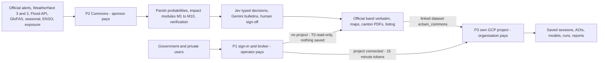

# Executive summary

This summary is for the leaders who must decide this week how to launch *Gemelo Digital Ecuador – El Niño* (GDE-Niño, the "Ecuador El Niño Digital Twin"): the sponsor, SNGR, INAMHI, the operator and partner institutions. It covers why now, what the twin is, how it works, who pays, what it costs and why, delivery, budget, risks and this week's decisions. Every figure comes from documents 01–14, which hold the sources and the arithmetic, and keeps their estimate, unverified or to-confirm labels. The Spanish version is [00-resumen-ejecutivo.md](./00-resumen-ejecutivo.md).

## Contents

1. [Situation and why now](#1-situation-and-why-now)
2. [What GDE-Niño is, and what it is not](#2-what-gde-niño-is-and-what-it-is-not)
3. [How it works](#3-how-it-works)
4. [Access and cost model](#4-access-and-cost-model)
5. [How the design minimises creation and running cost](#5-how-the-design-minimises-creation-and-running-cost)
6. [Delivery timeline](#6-delivery-timeline)
7. [Team and budget headline](#7-team-and-budget-headline)
8. [Top 10 risks and mitigations](#8-top-10-risks-and-mitigations)
9. [Decisions and asks for leadership this week](#9-decisions-and-asks-for-leadership-this-week)
10. [Request traceability](#10-request-traceability)
11. [Document map](#11-document-map)
12. [Open questions](#12-open-questions)

---

## 1. Situation and why now

**A very strong El Niño is under way** ([01 §5](./01-context-el-nino-ecuador.md#5-the-current-situation-as-of-2026-09-29); most values are reported in search summaries and still to be checked at source).

- **Declared and warming.** CN-ERFEN declared El Niño active on 2026-08-28. Its report 009-2026 gives Niño 1+2 at **+4.5 °C** and Niño 3.4 at up to **+2.9 °C**, with over 90% probability of a "very strong" event by the end of 2026. NOAA CPC gives **75%** that OND 2026 is "historic".
- **Impacts have started.** Coastal sea level was **+40 cm** on 20 Aug (1997-98: +42 to +47 cm), with 11 tidal-flood events on 13–16 Aug. The Mazar reservoir stood at **2,134.2 masl** on 2026-09-28; the 2024 blackouts began at about 2,115 masl.
- **Peak window.** Peak impacts are expected **Nov 2026 – Mar 2027**; the coastal rainy season runs Dec–Apr. Two pathways may strike together: coastal floods, landslides, dengue and crop losses, and low hydropower inflows in the Andes and Amazon.
- **Stakes.** 1997-98 cost **US$2,869.3M** (CEPAL, ≈13–15% of GDP) and 286–288 lives. The government's extreme scenario for Oct 2026 – Jan 2027 is **US$1.3bn**. Contingent finance needs evidence: World Bank Cat-DDO US$200M, World Bank/BDE subnational US$800M, IDB US$400M, CAF US$200M.

**Why this week.** The MVP must go live on **2026-11-27**, before the peak. WeatherNext approval takes ≈5–7 business days and the Flood Forecasting API waitlist "might take several months" ([waitlist](http://sites.research.google/gr/floodforecasting/api-waitlist/)). INAMHI's API keeps only ≈92 days and the Flood API keeps no history, so access requests and archiving must start on day 1. Local elections on 2026-11-29 change authorities, so workspaces must belong to institutions.

---

## 2. What GDE-Niño is, and what it is not

**A decision-support digital twin** of Ecuador. It runs the loop *observe → forecast → simulate impacts → what-if → decide → verify*, from hours to seven months ahead.

- **For** government (SNGR, *COE*, *GAD*, INAMHI, ministries, CELEC), private actors (exporters, shrimp farms, insurers, banks) and humanitarian partners.
- **Honest about uncertainty.** It shows probabilities, spread, analog years (1982-83, 1997-98, 2015-16, 2017, 2023-24) and a coupling/confidence indicator, so as not to repeat the 2023-24 over-forecast.

**Not an alert system** ([13 §1](./13-governance-legal-risk.md#1-alert-authority-and-product-positioning), LP-01). Under the *Ley Orgánica para la Gestión Integral del Riesgo de Desastres* only SNGR declares alerts. INAMHI issues *advertencias*, CN-ERFEN El Niño statements and INOCAR ocean and tsunami warnings. The twin shows their official alerts **verbatim, above** every model output. Its own outputs are labelled *apoyo a la decisión / pronóstico experimental* and use *nivel de riesgo* or *probabilidad de impacto*, never "alerta amarilla/naranja/roja".

It complements alertasecuador.gob.ec, SNGR's COE2, INAMHI's Visor and CIIFEN rather than duplicating them. Delivery is a Spanish-first mobile web app, a daily PDF for each of 221 cantons by 06:30 Ecuador time, and a WhatsApp card. The code is Apache-2.0.

---

## 3. How it works

**Three planes** ([03 §2](./03-architecture.md#2-three-plane-overview)): **P1**, the control plane (`ectwin-platform-prod`, operator-paid), handles sign-in and a broker. **P2**, the Commons (`ectwin-commons-prod`, sponsor-funded), computes national products **once**. **P3** is each organisation's **own** GCP project, which holds and pays for everything it saves and runs.

- **Weather, 0–15 days** ([06 §3](./06-forecast-model-stack.md#3-weathernext-3-and-weathernext-2)).
  - **WeatherNext 3** is primary: 64 members, 0.05–0.25° resolution and hourly interim runs. The archive starts on 2026-01-01.
  - **WeatherNext 2** (0.25°, 64 members, archive from 2022) covers the 2023-24 El Niño; its open weights allow commercial use since 2026-08-06.
  - Both are queried in place to give per-parish exceedance probabilities four times a day. ECMWF IFS/AIFS open data is the fallback.
- **Rivers, 0–30 days** ([06 §4](./06-forecast-model-stack.md#4-river-forecasting)).
  - The Google Flood Forecasting API (gauges, flood status, flash floods) is snapshotted centrally at least every 6 h, because it keeps no history.
  - GloFAS (51 members) and bias-corrected GEOGloWS (median KGE −0.57 raw, 0.33 corrected) complete the picture, with GRRR 1980–2023 for thresholds.
- **Seasonal and ENSO.** C3S, NMME, CFSv2 and GloFAS seasonal feed calibrated canton terciles. CPC RONI, ENFEN ICEN and CN-ERFEN drive the pathway indicators.
- **Impact modules M1–M10** ([07](./07-impact-modules-and-triggers.md)). They cover floods (including a SFINCS coastal library of 4 sites × 280 runs), landslides, agriculture, aquaculture, health, hydro-energy, transport and population. Together they give the parish *nivel de riesgo* (1–4) and trigger dashboards with evidence packs; a trigger never activates anything by itself.
- **Decision layer** ([08](./08-ai-decision-layer-jev.md)).
  - Code computes every number.
  - TypeSafe **Jev** (`jev-1.13.0`) answers typed yes/no, choice and score questions, such as report triage, ECU 911 narrative typing, parish escalation and gating of costly runs. Answers below 0.30 mean no, 0.30–0.70 go to a human, and above 0.70 mean yes.
  - **Gemini** writes Spanish bulletins and handles escalations. Humans sign off anything public.
  - A pluggable `DecisionBackend` provides failover. Text is pseudonymised before any external call.
- **Verification** ([14](./14-verification-and-validation.md)).
  - Truth comes from INAMHI stations and CHIRPS v3, never ERA5 alone.
  - Public scorecards run weekly from 2026-11-23.
  - Trigger-use levels TU-0 to TU-3 gate what partners may use.
  - A *Desactualizado* badge marks stale products: official alerts after 6 h, WeatherNext 3 after 18 h.

---

## 4. Access and cost model

**Signing in and saving** ([04](./04-identity-tenancy-byo-gcp.md), [02 §3](./02-users-requirements-ux.md#3-access-model-and-tiers)).

- **Sign-in is required** for every screen and API, with Google or email and password through Identity Platform. Owners, Admins, operators and *Firmantes técnicos* also need TOTP multi-factor authentication.
- **Without a project (T0),** a user gets a read-only national view from Commons products. **Nothing is saved on any server**; a "save" offers *Conectar proyecto* or a sponsored project instead.
- **Saving needs the organisation's own GCP project.** Sessions, AOIs, views, subscriptions, reports, runs, custom models and audit logs are all stored in the tenant's Firestore, BigQuery and bucket. The project should be owned by the organisation, with at least two Owners.
- **Connecting a project.** Path A runs a bootstrap from Cloud Shell in about 8–12 min ([module](../infra/tenant-bootstrap/README.md)). Path B is a one-time OAuth consent with no refresh token. Paths C and D cover restricted organisations and a fully self-deployed copy.
- **One revocable permission.** The platform holds only `roles/iam.serviceAccountTokenCreator` on the tenant's `ectwin-runner` account, which gives it 900-second tokens. Removing that binding ends platform access within 15 minutes.

**Who pays** ([09 §1](./09-cost-model.md#1-who-pays-what)): whoever owns the resource, runs the job or is the quota project. The operator never resells GCP.

| Payer | Pays for | Monthly anchor (before IVA/ISD) |
|---|---|---|
| Operator | P1: identity, broker, registry | ≈US$23–43 in a season month (≈US$5–25 in the pilot); budget US$45 |
| Sponsor | P2 Commons, T0 delivery ("Block D"), national Jev and Gemini, T4 projects | ≈US$100–300 excluding Block D; with Block D ≈US$273–356 in a season month, ≈US$444–602 in an event month |
| Tenant | Own queries ([subscriber pays](https://cloud.google.com/bigquery/pricing)), storage, jobs, Earth Engine, heavy runs | By tier, below |
| Google | WeatherNext listing storage | Data costs US$0 today; fees possible on one month's notice ([terms](https://storage.googleapis.com/weathernext-public/terms-of-use.pdf)) |

| Tier | Typical user | Adds | Cost/month | Default budget |
|---|---|---|---|---|
| T0 Viewer | Anyone signed in | Read-only national view | US$0 | — |
| T1 Light | Municipality, 20 users | Saved views, 1–3 daily AOIs, subscriptions | ≈US$0–14 | US$20 |
| T2 Standard | Province, ministry, exporter | Daily analytics, Earth Engine, own WeatherNext datasets | ≈US$20–60 | US$80 |
| T3 Heavy | National agency, insurer | Ensembles, 2D flood runs, WN2 scenarios, custom models | ≈US$540–800; peak ≈US$1,070–1,210 | US$1,000 |
| T4 Sponsored | *GAD* or *COE* that cannot procure quickly | T1/T2 profile paid by a sponsor | Pool of 25 T1 + 5 T2 ≈US$446 | Set by sponsor (default US$20) |

**Guardrails.**

- Every platform job is capped at 50 GiB (≈US$0.31).
- Daily BigQuery and Earth Engine caps apply per tier.
- Runs above US$1 need confirmation (US$5 on T3).
- At 100% of budget, a guard pauses scheduled jobs; it never disables billing.

**Taxes.** Add 15% IVA and ISD of 2.5% (to confirm with SRI). **Private users** get a commercial licence profile, which hides non-commercial layers. They use the Earth Engine Limited plan, and parametric payouts may use observation-based indices only.

---

## 5. How the design minimises creation and running cost

| Lever | Avoids | Quantified effect |
|---|---|---|
| **WeatherNext 3/2** ([09 L04, L05, L26](./09-cost-model.md#3-cost-minimisation-levers)) | Building or running a weather model | Queries cost ≈US$0 inside the 1 TiB free tier: ≈0.07 GB per WN3 column-init for Ecuador against ≈18.7 GB globally. Self-running WN2 routinely would cost US$276–552/month |
| **Flood Forecasting API + GRRR + GloFAS** ([09 L30](./09-cost-model.md#31-creation-cost-levers-from-the-three-named-technologies)) | Building and calibrating national river models for Phase 1 | The API is believed free **(unverified)** and snapshotted once for all tenants. The only model build is the Phase 3 OpenHydroNet fine-tune at US$4–23 |
| **Jev in the build** ([09 L29](./09-cost-model.md#31-creation-cost-levers-from-the-three-named-technologies)) | Manual curation of catalogues, PDFs, place names and impact history | ≈3,608 → ≈617 analyst-hours (−83%, ≈US$44,875), which shrinks ≈45 two-analyst weeks to ≈8. The API costs ≈US$15 per pass against ≈US$188 on Gemini Flash-Lite |
| **Jev at run time** | LLM cost for typed decisions | ≈4.3M decisions/month cost ≈US$113, against ≈US$1,450 on Gemini 3.1 Flash-Lite (−92%) |
| **Own tenant projects** | Central re-billing; shared free tiers | 30 tenants cost US$2,113.54 on their own projects, against US$2,416.07 centralised (+14%) |
| **Compute once in Commons** | 30 tenants recomputing the same products | ≈156 GB/month scanned once, instead of ≈4.7 TB |
| **Serverless, Spot, precomputation** | Idle servers; live 2D runs | Services scale to zero. Batch on Spot saves 59%. A SFINCS library map costs <US$0.01, against US$2–8 per live ensemble |

**Result.** One-off build cloud costs ≈US$0.6k–1.1k. Programme-paid cloud is ≈US$89–192 in the pilot month and ≈US$1,802–2,407 in an event month. Cloud is **1.6%** of the budget and people are 72.1%, so the analyst time Jev saves matters most.

---

## 6. Delivery timeline

| Phase | Dates | Main deliverables | Gate |
|---|---|---|---|
| 0 Mobilise | 2026-09-29 → 2026-10-16 | Access requests; projects; archiving live on 2026-10-06; ≥10 FTE; pilot letters of intent | G0, 2026-10-16 |
| 1 MVP *Monitoreo y Exposición* | 2026-10-19 → 2026-11-27 | Sign-in and project onboarding; official alerts; ENSO panel; parish probabilities; river status; exposure; PDFs; Jev triage; 3–5 pilots | G1a 2026-11-06; G1b 2026-11-24; **go-live 2026-11-27** |
| 2 Peak-season operations | 2026-12-01 → 2027-04-30 | Event mode; SFINCS libraries (Guayaquil/Durán from 2026-12-15); landslides; dengue; agriculture; roads; triggers; ≥30 tenants by 2027-03-31 | G2, 2027-04-30 |
| 3 Learn and extend | 2027-05-03 → 2027-09-30 | Season verification report (2027-06-30); OpenHydroNet Ecuador; hydro-energy module; WN2 scenario engine | G3 host agreement, 2027-09-30 |
| 4 Institutionalise | From 2027-10-01 | Hand-over; host-led operation from 2028-01-03 (proposed) | — |

A go-live and election freeze runs from 2026-11-26 to 2026-12-01 ([12 §1](./12-roadmap-team-budget.md#1-urgency-and-phase-overview)).

---

## 7. Team and budget headline

| 12 months, Phases 0–3 | Full | Minimum |
|---|---|---|
| Total cash | **≈US$1,600,220** | **≈US$1,022,922** |
| Personnel | US$1,153,970 (72.1%) | US$767,060 |
| Cloud | US$25,938 (1.6%) | US$10,548 |
| Paid FTE, P0/P1/P2/P3 | 13.0 / 22.5 / 24.5 / 20.5 | 12.0 / 15.0 / 15.75 / 11.75 |
| Bridge funding, Phases 0–1 | **US$305,311 (recommended)** | US$223,776 (floor) |

The minimum variant drops some modules and sponsored tenants. The Phase 2–3 variant is chosen at G1b (2026-11-24); the gap is ≈US$0.50M. After hand-over, a sustained service costs ≈US$0.66M/year. Tenant-paid cloud is outside the budget ([12 §5](./12-roadmap-team-budget.md#5-budget)).

---

## 8. Top 10 risks and mitigations

These are the highest-scoring risks of 35 in [13 §11](./13-governance-legal-risk.md#11-risk-register).

| ID | Risk | Score | Mitigation |
|---|---|---|---|
| R02 | A bad forecast repeats the 2023-24 loss of credibility | 16 | Probabilities, analogs, coupling indicator, public verification |
| R10 | *Convenios* with INAMHI and SNGR slip past the peak | 16 | Letters 2026-10-02; target signature 2026-11-06; interim consent required at G1b |
| R01 | A platform level is read as an official alert | 15 | Official band on top; vocabulary guard; media policy |
| R28 | The official alert state is shown wrongly | 15 | Verbatim ingestion with resolution number; stale notice after 6 h |
| R03 | WeatherNext access or terms change | 12 | IFS/AIFS fallback; self-run WN2 open weights |
| R11 | Geoblocking cuts `.gob.ec` ingestion | 12 | Ingestion from `southamerica-west1`; relay in Ecuador; archive from day 1 |
| R14 | Public tenants cannot buy GCP in time | 12 | T4 sponsored projects; reseller route; procurement kit |
| R15 | Commons sponsor funding lapses | 12 | Written commitment through 2027-04-30 |
| R18 | Jev misses a life-threat report | 12 | Humans paged from p ≥0.30; recall ≥0.98 gate; shadow mode |
| R26 | Key-person dependency at the peak | 12 | Named secondaries; runbooks; rota of ≥8 people |

---

## 9. Decisions and asks for leadership this week

Week of 2026-09-29 to 2026-10-02:

| # | Ask | Due | Owner |
|---|---|---|---|
| 1 | **Access requests.** Approve institutional role accounts and confirm requests AR-01 to AR-08: WeatherNext, the WN2 allowlist, the Flood Forecasting API, Earth Engine, TypeSafe, CDS/EWDS, Copernicus Marine and Earthdata | Filed 2026-09-30; email weathernext@google.com by 2026-10-02 | FL, DL, PL |
| 2 | **MoUs.** Sign letters and draft *convenios* for INAMHI, SNGR, INOCAR/CN-ERFEN, CELEC/CENACE, MSP and MAG | 2026-10-02; SNGR and INAMHI signed by 2026-11-06 | PT |
| 3 | **Commons sponsor.** Name the sponsor; sign the term sheet and bridge funding (US$305,311; floor US$223,776); commit Commons funding through 2027-04-30 | 2026-10-09 | PM |
| 4 | **Pilot tenants.** Nominate 3–5 pilots, including one T4 *GAD* and one T2, each with an organisation-owned project | Letters by 2026-10-16 | PT |
| 5 | **GitHub and GCP organisation.** Verify the domain; name two organisation administrators; create the folders, groups and billing accounts; open the public repository with keyless deployment | Projects (M0.1) 2026-10-02 | PL |
| 6 | **Governance.** Approve hiring (≥10 FTE by 2026-10-09) and form the Steering Committee | 2026-10-14 | PM |

---

## 10. Request traceability

| Request element | Answered in |
|---|---|
| WeatherNext | [06 §3](./06-forecast-model-stack.md#3-weathernext-3-and-weathernext-2); [09 §3](./09-cost-model.md#3-cost-minimisation-levers) L04, L05, L26 |
| Flood Forecasting API | [06 §4](./06-forecast-model-stack.md#4-river-forecasting); [04 §9](./04-identity-tenancy-byo-gcp.md#9-third-party-access-per-tenant-and-what-the-commons-provides-instead) |
| Jev to minimise creation cost | [08 §3](./08-ai-decision-layer-jev.md#3-jev-in-the-build-phase-minimising-the-cost-of-creating-the-twin); [09 §3.1](./09-cost-model.md#31-creation-cost-levers-from-the-three-named-technologies), [§5](./09-cost-model.md#5-one-time-build-phase-cloud-costs) B9 |
| Sign in with Google or email | [04 §2](./04-identity-tenancy-byo-gcp.md#2-identity-identity-platform-and-sessions); [02](./02-users-requirements-ux.md#52-requirements) FR-001 |
| Own project to save | [04 §5](./04-identity-tenancy-byo-gcp.md#5-what-the-bootstrap-provisions-in-the-tenant-project); [03 §5.6](./03-architecture.md#5-storage-layout); [04 §12.2](./04-identity-tenancy-byo-gcp.md#122-data-inventory) |
| No project (T0) | [02 §3.1](./02-users-requirements-ux.md#31-rules); [J9](./02-users-requirements-ux.md#4-user-journeys) |
| Who pays | [09 §1](./09-cost-model.md#1-who-pays-what); [04 §7](./04-identity-tenancy-byo-gcp.md#7-who-pays-for-each-call) |
| Private sector | [02](./02-users-requirements-ux.md#2-personas) P10, P11, J4, J5, [J10](./02-users-requirements-ux.md#j10--insurer-or-bank-portfolio-exposure-and-claims-surge-planning); [07 §6.6](./07-impact-modules-and-triggers.md#66-evidence-packs-including-parametric-insurance) |
| Data freshness | [02 §6.2](./02-users-requirements-ux.md#62-data-freshness-targets); [05 §4.2](./05-data-catalog.md#42-source-registry-and-health-checks); [11 §4.3](./11-operations-runbook.md#43-operational-tables) |
| Setup | [10](./10-setup-and-deployment.md) |
| Running | [11](./11-operations-runbook.md) |
| Roadmap and budget | [12](./12-roadmap-team-budget.md) |

---

## 11. Document map

| Doc | Read it for |
|---|---|
| [00 Resumen ejecutivo](./00-resumen-ejecutivo.md) | This summary in Spanish |
| [01 Context](./01-context-el-nino-ecuador.md) | ENSO, history, the 2026 situation, institutions, financing |
| [02 Users and UX](./02-users-requirements-ux.md) | Personas, tiers, journeys, requirements, disclaimers |
| [03 Architecture](./03-architecture.md) | Planes, components, data flows, storage, API |
| [04 Identity and tenancy](./04-identity-tenancy-byo-gcp.md) | Sign-in, project connection, broker, who pays, guardrails |
| [05 Data catalog](./05-data-catalog.md) | Sources, ingestion, licences, data quality |
| [06 Forecast stack](./06-forecast-model-stack.md) | WeatherNext, Flood API, seasonal and ENSO |
| [07 Impact modules](./07-impact-modules-and-triggers.md) | M1–M10, *nivel de riesgo*, triggers, scenarios |
| [08 AI decision layer](./08-ai-decision-layer-jev.md) | Jev, Gemini, `DecisionBackend`, privacy |
| [09 Cost model](./09-cost-model.md) | Prices, levers, tier estimates, taxes |
| [10 Setup](./10-setup-and-deployment.md) | Access checklist, bootstrap, onboarding |
| [11 Operations](./11-operations-runbook.md) | Daily cycle, event mode, incidents |
| [12 Roadmap and budget](./12-roadmap-team-budget.md) | Phases, team, budget, hand-over |
| [13 Governance and risk](./13-governance-legal-risk.md) | Alert authority, LOPDP, terms, risk register |
| [14 Verification](./14-verification-and-validation.md) | Truth data, metrics, trigger-use levels |
| Starters | [bootstrap script](../scripts/bootstrap-tenant.sh), [source catalogue](../catalog/data-sources.yaml), [DecisionBackend](../services/decision/decision_backend.py) |

---

## 12. Open questions

- **Official alert colour.** Is the national alert orange (SNGR-193-2026) or red (SNGR-238-2026, reported only in the press)? This is item V1, due 2026-10-16.
- **Sponsor.** Who is the Commons sponsor **(to confirm)**?
- **WeatherNext.** Will Google confirm in writing that parish probability products may be published?
- **Flood API.** When will access be approved, and are commercial terms allowed?
