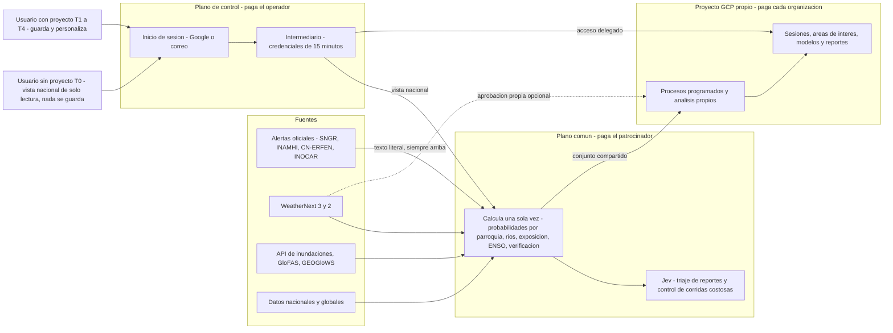

# Resumen ejecutivo: Gemelo Digital Ecuador – El Niño (GDE-Niño)

Este resumen está dirigido a autoridades del Gobierno nacional, de los GAD y del sector privado. Presenta el plan para diseñar, construir, poner en marcha y operar el **Gemelo Digital Ecuador – El Niño (GDE-Niño)**, una plataforma de apoyo a la decisión para gestionar el riesgo del evento El Niño 2026-27. Explica qué es y qué no es la plataforma, cómo funciona, cuánto cuesta y quién paga, el cronograma, los riesgos y las decisiones que se necesitan de las autoridades en las próximas semanas. Los documentos detallados del plan están en inglés (sección 11). La información tiene fecha de corte 2026-09-29.

**Convenciones.** Montos en dólares (US$) sin IVA ni ISD, salvo indicación, con el formato numérico de los documentos técnicos (coma para miles y punto para decimales). Fechas en formato AAAA-MM-DD. "(por confirmar)" señala un punto pendiente con un socio y "(no verificado)" un dato sin fuente confirmada.

**Contenido**

1. Situación y urgencia
2. Qué es GDE-Niño y qué no es
3. Cómo funciona
4. Modelo de acceso y costos
5. Cómo se minimizan los costos
6. Cronograma por fases
7. Equipo y presupuesto
8. Riesgos principales y mitigaciones
9. Decisiones y solicitudes a las autoridades
10. Trazabilidad de la solicitud
11. Mapa de documentos
12. Preguntas abiertas

---

## 1. Situación y urgencia

- **Hay en curso un El Niño muy fuerte, posiblemente histórico, y es del tipo más peligroso para Ecuador.** El CN-ERFEN declaró activo el evento el 2026-08-28 (informe técnico 007-2026). Su informe 009-2026 (17 de septiembre) reporta una anomalía de **+4.5 °C** en Niño 1+2 y de hasta **+2.9 °C** en Niño 3.4, y da **más de 90 %** de probabilidad de intensidad "muy fuerte" a fines de 2026. NOAA CPC asigna **75 %** de probabilidad a que el trimestre OND 2026 sea "histórico" (RONI ≥ +2.5 °C).
- **Los impactos empezaron en plena época seca.** Hubo 11 eventos de inundación por marea entre el 13 y el 16 de agosto, con una anomalía del nivel del mar de **+40 cm** (en 1997-98 fue de +42 a +47 cm). Siete ríos se desbordaron en Guayas, Esmeraldas y Manabí entre el 25 y el 28 de septiembre. Hasta la semana epidemiológica 35 se registran 32,576 casos de dengue y 35 fallecidos.
- **Dos vías de amenaza pueden coincidir.** En la **Costa**: inundaciones fluviales y pluviales, inundación costera compuesta, deslizamientos, dengue y pérdidas en agricultura, acuacultura y vialidad. En las **cuencas hidroeléctricas de los Andes y la Amazonía**: caudales bajos y riesgo de racionamiento. El embalse Mazar estaba en **2,134.2 msnm** el 2026-09-28; los apagones de 2024 empezaron cerca de **2,115 msnm**.
- **Ventana crítica.** Se esperan los mayores impactos entre noviembre de 2026 y marzo de 2027; la temporada lluviosa costera va de diciembre a abril. Las elecciones seccionales del **2026-11-29** traerán cambio de autoridades en los GAD en plena temporada.
- **Lo que está en juego.** El Niño 1997-98 costó **US$2,869.3M** (CEPAL), cerca del 13–15 % del PIB, y 286–288 vidas. La sequía y los apagones de 2024 costaron US$1.92 mil millones (1.4 % del PIB). El escenario extremo del plan nacional estima pérdidas de US$1.3 mil millones (1–1.5 % del PIB) entre octubre de 2026 y enero de 2027.
- **Hay financiamiento disponible, pero es condicionado.** Cat-DDO del Banco Mundial (US$200M), programa subnacional Banco Mundial/BDE (US$800M), préstamo contingente del BID (US$400M) y línea contingente de CAF (US$200M). Todos exigen evidencia defendible: pronósticos archivados, huellas de inundación, exposición y estimaciones de pérdidas.
- **La credibilidad es frágil.** En 2023-24 la Costa recibió menos lluvia de la pronosticada. El estado oficial de alerta de la SNGR se ha elevado durante 2026, y las fuentes discrepan sobre el nivel vigente (resoluciones SNGR-193-2026 y SNGR-238-2026; punto de verificación V1). GDE-Niño mostrará siempre la resolución oficial que ingiera.

## 2. Qué es GDE-Niño y qué no es

GDE-Niño es una plataforma de **apoyo a la decisión**. Convierte la información oficial y la de los modelos en evidencia oportuna, probabilística y sectorial por **parroquia** (1,041) y **cantón** (221 GAD cantonales), con anticipación de meses a horas. Está pensada para el COE nacional y los COE provinciales y cantonales, sus **mesas técnicas**, los GAD, ministerios, empresas públicas y privadas, aseguradoras, academia y organismos humanitarios.

**GDE-Niño no emite alertas.** Según la Ley Orgánica para la Gestión Integral del Riesgo de Desastres, solo la **SNGR** declara alertas. El **INAMHI** emite advertencias hidrometeorológicas, el **CN-ERFEN** emite los pronunciamientos sobre El Niño y el **INOCAR** cubre el océano y los tsunamis. En consecuencia, la plataforma:

- muestra las alertas y comunicados oficiales **textualmente** (número de resolución, hora y enlace) y **por encima** de cualquier resultado de modelo;
- rotula sus propios productos como "apoyo a la decisión / pronóstico experimental", expresados como **nivel de riesgo** y **probabilidad de impacto**, y nunca usa la escala oficial de colores de alerta;
- complementa y no duplica: ingiere, enlaza o incrusta alertasecuador.gob.ec, el visor COE2 de la SNGR, el visor del INAMHI con GEOGloWS, SERVIR-Amazonia y el GeoNode del CIIFEN, y les devuelve capas en formatos compatibles con OGC y ArcGIS;
- muestra siempre probabilidades, dispersión de ensambles, años análogos (1982-83, 1997-98, 2015-16, El Niño costero 2017, 2023-24) y un indicador de acoplamiento y confianza, y publica su propia verificación, incluidos los eventos no pronosticados y las falsas alarmas;
- deja la aprobación de todo contenido público en manos de personas; la inteligencia artificial nunca autoriza acciones.

El núcleo será de código abierto (Apache-2.0), lo que facilita la contratación pública y el traspaso a una institución nacional.

## 3. Cómo funciona

El gemelo sigue un ciclo continuo: **observar → pronosticar → simular impactos → evaluar escenarios "¿qué pasa si?" → decidir → verificar y aprender**.

- **0–6 horas:** estaciones del INAMHI, precipitación satelital (IMERG, GSMaP), GOES-19 y mapas de inundación con Sentinel-1.
- **0–15 días:** WeatherNext 3 de Google como fuente principal (64 miembros, resolución de 0.1° y actualización horaria) y WeatherNext 2 (archivo desde 2022, que incluye El Niño 2023-24). ECMWF IFS/AIFS sirve como respaldo y referencia.
- **Ríos, 0–7 días:** API de pronóstico de inundaciones de Google, GEOGloWS (INAMHI) y GloFAS hasta 30 días.
- **Subestacional y estacional:** ECMWF extendido, C3S, NMME y CFSv2. Para ENSO: CPC, ICEN y CN-ERFEN.

La arquitectura se organiza en **tres planos** de Google Cloud:

1. **Plano de control** (`ectwin-platform-prod`), pagado por el operador: inicio de sesión, aplicación web, intermediario (*broker*) y un registro mínimo de organizaciones. No guarda sesiones ni datos de usuarios.
2. **Plano común o Commons** (`ectwin-commons-prod`), pagado por un patrocinador: calcula **una sola vez** los bienes públicos nacionales. Esto incluye la ingesta de alertas oficiales, los índices ENSO, las probabilidades de superación de umbrales de lluvia por parroquia, el estado de los ríos, la exposición (3,873 escuelas, al menos 460 establecimientos de salud, 3,113 km de vías estatales y cerca de 1.3M de personas), la verificación, un boletín PDF diario por cantón listo a las 06:30 (hora de Ecuador) y una tarjeta para WhatsApp.
3. **Plano del usuario**: el **proyecto GCP propio** de cada organización, donde se guarda y procesa todo lo suyo.

En la Fase 2 se suman módulos de impacto: inundación fluvial, pluvial urbana y costera compuesta (biblioteca de escenarios SFINCS para Guayaquil/Durán, Machala, Portoviejo/Chone y Esmeraldas), deslizamientos, salud, agricultura y camaronicultura, vialidad, población y albergues, e hidroenergía. También se suma un tablero de disparadores para acción anticipatoria.

## 4. Modelo de acceso y costos

**Reglas de acceso**

1. **Iniciar sesión es obligatorio.** Se ingresa con una cuenta de Google o con correo y contraseña (Google Identity Platform). La verificación en dos pasos TOTP es obligatoria para propietarios, administradores y *firmantes técnicos*. No se usan SMS. Sin sesión solo se ven la portada, los textos legales, la página de estado y la ayuda.
2. **Sin proyecto propio (nivel T0)**, el usuario tiene una vista nacional de solo lectura construida con productos del Commons. **No se guarda nada en ningún servidor.** Al intentar guardar, la aplicación ofrece "Conectar proyecto" o "Solicitar proyecto patrocinado".
3. **Para guardar se necesita un proyecto GCP propio.** Allí quedan las sesiones, áreas de interés, vistas, reglas, suscripciones, reportes, corridas, modelos propios y registros de auditoría: en Firestore (por defecto en `southamerica-west1`, Santiago), en BigQuery (conjunto `ectwin`, región `US`) y en el bucket `gs://<TENANT_PROJECT>-ectwin`. En Ecuador no hay región de Google Cloud. Recomendamos que cada institución use un **proyecto institucional con al menos dos propietarios**, para que el espacio de trabajo sobreviva a los cambios de personal y de autoridades.
4. **Conectar el proyecto.** El botón "Conectar proyecto" ejecuta en Cloud Shell una configuración automática que tarda unos 8–12 minutos (meta: menos de 30 minutos en total). Hay variantes para quienes prefieren un clic con autorización OAuth de un solo uso, para organizaciones con políticas restrictivas y, para entidades reguladas, una copia autodesplegada. El único permiso que recibe la plataforma es `roles/iam.serviceAccountTokenCreator` sobre la cuenta de servicio `ectwin-runner` del proyecto. Con él obtiene credenciales que duran como máximo 15 minutos. No existen llaves permanentes, los procesos programados corren dentro del proyecto de la organización, y la organización puede revocar el acceso en cualquier momento sin perder sus datos.
5. **Quién paga qué.** El **operador** paga el plano de control. El **patrocinador** paga el Commons, la vista T0 y los proyectos patrocinados T4. **Cada organización** paga el uso de su propio proyecto. En los conjuntos de datos compartidos, quien consulta paga la consulta y quien publica paga el almacenamiento. El operador nunca revende servicios de Google Cloud.
6. **Protección de gastos.** Cada proyecto recibe un presupuesto con avisos al 50, 90 y 100 %. Al llegar al 100 %, la plataforma pausa los procesos programados, pero nunca desactiva la facturación. Además, pide confirmación antes de corridas de más de US$1 (US$5 en T3) y limita cada consulta a 50 GiB (unos US$0.31).

**Costos por nivel (estimados, mensuales, sin impuestos)**

| Nivel | Perfil típico | Qué permite | Costo mensual | Presupuesto por defecto | Paga |
|---|---|---|---|---|---|
| T0 Visor | Cualquier usuario autenticado | Vista nacional de solo lectura; nada se guarda | US$0 | — | Patrocinador (entrega desde el Commons) |
| T1 Ligero | GAD municipal, 20 usuarios | Tableros, 1–3 áreas de interés con procesos diarios, suscripciones | ≈US$0–14 | US$20 | La organización |
| T2 Estándar | Prefectura o ministerio, 50 usuarios | Analítica diaria, Earth Engine, acceso propio a WeatherNext, exportaciones | ≈US$20–60 | US$80 | La organización |
| T3 Intensivo | Agencia nacional, aseguradora | Ensambles, modelación hidráulica 2D, modelos propios, escenarios WeatherNext 2 | ≈US$540–800; pico ≈US$1,070–1,210 | US$1,000 (hasta US$1,300 en pico) | La organización |
| T4 Patrocinado | GAD o COE que aún no puede contratar Google Cloud | Perfil T1 o T2 dentro de la carpeta del patrocinador | 25 T1 + 5 T2 ≈US$446 (≈US$216 con Earth Engine no comercial) | US$20 (US$80 perfil T2) | Patrocinador; luego puede pasar al GAD |
| Plano de control | Operador | Identidad, intermediario, registro | ≈US$23–43 | US$45 | Operador |
| Commons | Patrocinador | Productos nacionales | ≈US$100–300 (sin la entrega T0) | US$450 con entrega T0 | Patrocinador |

A estos valores se suman el **IVA de 15 %** y el ISD de 2.5 % (rango de 2.5–5 %, por confirmar con el SRI). Las entidades públicas pueden comprar a través de un revendedor local. Para 30 organizaciones, el modelo de proyecto propio cuesta US$2,113.54 al mes, frente a US$2,416.07 en un modelo centralizado (+14 %). El **sector privado** usa un perfil comercial: las capas con licencia no comercial quedan ocultas, Earth Engine se usa con el plan comercial y una política de uso aceptable prohíbe usar los mapas para excluir comunidades. Los análisis se hacen a escala de parroquia, nunca de hogar.

## 5. Cómo se minimizan los costos

- **WeatherNext.** Los datos se consultan donde están publicados, mediante conjuntos vinculados de BigQuery, y nunca se copian. Cada consulta se filtra por fecha de inicialización y por la geografía de Ecuador: unos 0.07 GB por variable y corrida, frente a 18.7 GB a escala global (unas 267 veces menos). A escala de Ecuador el costo es **≈US$0**, dentro del 1 TiB mensual gratuito de BigQuery. Hoy los datos no tienen costo, aunque Google podría cobrar con un mes de aviso. El Commons publica solo derivados de valor agregado no recuperables (probabilidades por parroquia, nivel de riesgo, índices), así que las organizaciones no necesitan aprobación propia para usarlos. Quienes quieran campos crudos (T2 o superior) la tramitan en unos 5–7 días hábiles. No se ejecuta WeatherNext 2 por cuenta propia de forma rutinaria, porque costaría US$276–552 al mes. Solo se ejecuta para escenarios específicos, a ≈US$2.3–4.6 por corrida.
- **API de pronóstico de inundaciones de Google.** Una sola llave central en el Commons toma cuatro instantáneas diarias que se comparten con todos. Las organizaciones no necesitan llave propia (es opcional en T2 y T3). Se cree que el servicio es gratuito (no verificado) y su límite es de 200 solicitudes por minuto por proyecto. Como no ofrece historial, se archiva desde el primer día. La lista de espera puede tardar meses; mientras tanto se usan GloFAS, GEOGloWS y el reanálisis GRRR.
- **Jev (modelo System One de TypeSafe) en la construcción.** Jev da respuestas tipificadas y calibradas (sí/no, elección, puntaje) a bajo costo. Sus baterías catalogan miles de capas, revisan tablas extraídas de PDF, asignan nombres de lugares a códigos DPA del INEC y etiquetan impactos históricos. Así, la curación baja de ≈3,608 a ≈617 horas de analista (−83 %, ≈US$44,875 a US$15/h), y el calendario pasa de unas 45 a unas 8 semanas, lo que permite terminar antes de la temporada. La API cuesta US$15.49 por pasada, frente a ≈US$188 con Gemini Flash-Lite; el gasto total de construcción es de ≈US$35–90.
- **Jev en la operación.** En el pico nacional se estiman ≈4.3M de decisiones al mes por ≈US$113, frente a ≈US$1,450 con Gemini Flash-Lite (−92 %). El código calcula todas las cifras. Jev decide "no" por debajo de 0.30 y "sí" por encima de 0.70; entre ambos valores decide una persona. Si el proveedor falla, se cambia a otros motores intercambiables.
- **Otras palancas.** Cada organización aprovecha los niveles gratuitos de su propia cuenta de facturación. Los productos nacionales se calculan una vez (156 GB al mes, frente a ≈4.7 TB si 30 organizaciones los calcularan por separado). Los servicios se apagan cuando no hay uso. Las corridas pesadas usan máquinas Spot (−59 %). La biblioteca SFINCS cuesta US$60–360 una sola vez, y consultar un mapa cuesta menos de US$0.01, frente a US$2–8 por un ensamble en vivo. La verificación en dos pasos usa TOTP en lugar de SMS.
- **Resultado.** El costo de nube de la construcción es de ≈US$0.6k–1.1k, y la nube representa solo el 1.6 % del presupuesto del programa.

## 6. Cronograma por fases

| Fase | Fechas | Resultados principales | Hito de control |
|---|---|---|---|
| 0 Movilización | 2026-09-29 → 2026-10-16 | Todas las solicitudes de acceso presentadas el primer día; proyectos creados; archivo de fuentes desde 2026-09-30; equipo contratado; cartas de intención y borradores de convenios | G0, 2026-10-16 |
| 1 MVP "Monitoreo y Exposición" | 2026-10-19 → 2026-11-27 | Inicio de sesión y conexión de proyectos; alertas oficiales; panel ENSO; probabilidades por parroquia; estado de ríos; exposición; PDF cantonal y tarjeta WhatsApp; triaje con Jev; 3–5 organizaciones piloto | G1a pilotos 2026-11-06; G1b decisión 2026-11-24; salida en producción 2026-11-27 |
| 2 Operación en temporada pico | 2026-12-01 → 2027-04-30 | Modo evento; biblioteca SFINCS (Guayaquil/Durán 2026-12-15); módulos de impacto; disparadores; verificación semanal; revisión de medio término 2027-02-15; 30 o más organizaciones al 2027-03-31 | G2, 2027-04-30 |
| 3 Aprender y ampliar | 2027-05-03 → 2027-09-30 | Informe de verificación de la temporada (2027-06-30); ajuste de OpenHydroNet a cuencas ecuatorianas; módulo de hidroenergía y sequía; motor de escenarios WeatherNext 2 | G3, 2027-09-30 (acuerdo con la institución anfitriona) |
| 4 Institucionalización | Desde 2027-10-01 | Operación en paralelo y luego a cargo de la institución anfitriona (desde 2028-01-03, propuesto); canales de contratación; extensión regional | — |

No se harán cambios riesgosos entre 2026-11-26 y 2026-12-01 (salida en producción y elecciones) ni entre 2026-12-24 y 2027-01-02.

## 7. Equipo y presupuesto

**Equipo.** Diez frentes de trabajo cubren plataforma e identidad, datos, pronóstico y verificación, impactos, experiencia de usuario, IA, operaciones, alianzas y aspectos legales, capacitación y gestión del programa. Habrá ≈13 personas a tiempo completo (FTE) al 2026-10-09 (G0 exige al menos 10). Los FTE pagados por fase son 13.0 (F0), 22.5 (F1), 24.5 (F2), 20.5 (F3) y 9.75 (F4). Se suman técnicos en comisión de servicios del INAMHI y la SNGR, como aporte en especie, y universidades socias (propuesto).

**Presupuesto (12 meses, fases 0–3)**

| Rubro | Variante completa | Participación |
|---|---|---|
| Personal | US$1,153,970 | 72.1 % |
| Otros gastos (capacitación, auditorías, asesoría legal, seguros) | US$206,400 | 12.9 % |
| Contingencia 15 % | US$208,724 | 13.0 % |
| Nube | US$25,938 | 1.6 % |
| Recargo tributario y de canal 20 % | US$5,188 | 0.3 % |
| **Total** | **≈US$1,600,220** | 100 % |

- **Por fase:** F0 US$76,128; F1 US$229,183; F2 US$691,205; F3 US$603,704.
- **Variante mínima:** ≈US$1,022,922. Reduce módulos, patrocinio y capacitación, y mantiene el MVP y la operación en temporada pico.
- **Financiamiento puente para las fases 0–1:** se recomiendan **US$305,311**, con un piso de **US$223,776**. La variante para las fases 2–3 se decide en G1b (2026-11-24); la diferencia entre ambas es de ≈US$0.50M.
- **Fuera del presupuesto:** cada organización paga su propio proyecto. Para 30 organizaciones en un mes pico, el total es como máximo US$3,180 antes de IVA e ISD.
- **Fase 4:** operación sostenida por ≈US$0.66M al año (9.75 FTE); mínimo de continuidad ≈US$0.28M al año (4.5 FTE).

Una reducción pequeña de las pérdidas bastaría para cubrir todo el programa.

## 8. Riesgos principales y mitigaciones

El registro tiene 35 riesgos: 2 críticos, 14 altos y 19 medios. Estos son los principales:

| Riesgo | Mitigación |
|---|---|
| R02 (crítico): un pronóstico excesivo o insuficiente repite la pérdida de credibilidad de 2023-24 | Probabilidades, dispersión, análogos, indicador de acoplamiento, verificación publicada, comité de riesgo de modelos |
| R10 (crítico): los convenios con INAMHI y SNGR se retrasan hasta después del pico | Cartas enviadas el 2026-10-02; nota operativa interina; escalamiento al Comité Directivo |
| R01: un nivel de la plataforma se interpreta como alerta oficial | Franja oficial siempre arriba; vocabulario controlado; avisos legales; protocolo de divergencia; convenio con la SNGR |
| R28: el estado oficial de alerta se muestra mal (fuente desactualizada o contradictoria) | Ingesta textual con número de resolución; aviso tras 6 horas sin actualización; confirmación manual por dos personas en modo evento |
| R03: se retira el acceso a WeatherNext o cambian sus términos | Respaldo con ECMWF IFS/AIFS; pesos abiertos de WeatherNext 2; vigilancia de términos |
| R11: el bloqueo geográfico de sitios .gob.ec corta la ingesta | Procesos en Santiago; relevo con un socio en Ecuador; envío directo desde las entidades; archivo desde el primer día |
| R14 y R15: las entidades públicas no pueden contratar a tiempo, o se interrumpe el patrocinio del Commons | Proyectos patrocinados T4; ruta de revendedor; compromiso escrito del patrocinador hasta 2027-04-30 |
| R18: Jev clasifica mal un reporte en español con riesgo para la vida | Umbral bajo (0.30) para revisión humana; conjunto de evaluación en español; modo sombra; reglas fijas primero |

## 9. Decisiones y solicitudes a las autoridades

1. **Patrocinio y fondos (sponsor, SNGR/INAMHI con banca multilateral):** designar al patrocinador y comprometer el financiamiento puente (US$305,311, con piso de US$223,776) **hasta 2026-10-09**. Dar un compromiso escrito de financiamiento del Commons hasta 2027-04-30.
2. **SNGR e INAMHI:** nombrar enlaces técnicos antes de G0 (2026-10-16); presidir (SNGR) el Comité Directivo, que se constituye el 2026-10-14; firmar los convenios **hasta 2026-11-06**, o dar un consentimiento interino por escrito, porque es un requisito para salir a producción; aprobar las comisiones de servicios.
3. **Otras entidades:** firmar convenios con INOCAR/CN-ERFEN, MSP y MAG hasta 2026-12-15, y con CELEC/CENACE hasta 2027-01-31. En el caso del ECU 911, la carta se envía el 2026-10-16 y la meta de firma es 2027-02-28.
4. **GAD y COE:** entregar al menos 3 cartas de intención para ser pilotos hasta 2026-10-16; crear proyectos institucionales con dos propietarios antes del 2026-11-29, o solicitar un proyecto T4; designar a las mesas técnicas que recibirán el PDF cantonal.
5. **Ministerios y empresas públicas:** habilitar la compra de Google Cloud mediante un revendedor local. Un memorando tributario y de contratación estará firmado el 2026-11-06.
6. **Sector privado (exportadores, aseguradoras, banca):** abrir proyectos propios con perfil comercial, aceptar la política de uso aceptable y, de forma voluntaria, compartir observaciones de impacto.
7. **Comité Directivo:** decidir la variante de las fases 2–3 en G1b (2026-11-24) y si financia temporalmente el proyecto T3 de la SNGR; elegir la institución anfitriona hasta 2027-08-31.

## 10. Trazabilidad de la solicitud

Cada elemento de la solicitud original está respondido en estas secciones de los documentos detallados:

| Elemento solicitado | Dónde se responde |
|---|---|
| Uso de WeatherNext al mínimo costo | [06](./06-forecast-model-stack.md) §3; [09](./09-cost-model.md) L04, L05, L26 |
| API de pronóstico de inundaciones de Google | [06](./06-forecast-model-stack.md) §4; [04](./04-identity-tenancy-byo-gcp.md) §9 |
| Jev para reducir el costo de creación | [08](./08-ai-decision-layer-jev.md) §3; [09](./09-cost-model.md) §3 (L15, L16) y §5 (B9) |
| Inicio de sesión con Google o correo | [04](./04-identity-tenancy-byo-gcp.md) §2; [02](./02-users-requirements-ux.md) §3.1 y FR-001 |
| Proyecto GCP propio para guardar sesiones, áreas de interés y modelos | [04](./04-identity-tenancy-byo-gcp.md) §5 y §12.2; [03](./03-architecture.md) §5.6 |
| Qué ocurre sin proyecto (T0) | [02](./02-users-requirements-ux.md) §3.1 y J9 |
| Quién paga qué | [09](./09-cost-model.md) §1; [04](./04-identity-tenancy-byo-gcp.md) §7 |
| Uso por el sector privado | [02](./02-users-requirements-ux.md) P10, P11, J4, J5; [07](./07-impact-modules-and-triggers.md) §6.6 |
| Actualidad de los datos | [02](./02-users-requirements-ux.md) §6.2; [05](./05-data-catalog.md) §4.2; [11](./11-operations-runbook.md) §4.3 |
| Instalación y puesta en marcha | [10](./10-setup-and-deployment.md) |
| Operación diaria y en eventos | [11](./11-operations-runbook.md) |
| Cronograma, equipo y presupuesto | [12](./12-roadmap-team-budget.md) |

## 11. Mapa de documentos

Los documentos detallados están **en inglés**:

- [01 Contexto: El Niño en Ecuador](./01-context-el-nino-ecuador.md). Física, historia, situación 2026, instituciones y financiamiento.
- [02 Usuarios, requisitos y experiencia de uso](./02-users-requirements-ux.md). Perfiles, recorridos, requisitos y textos en español.
- [03 Arquitectura](./03-architecture.md). Tres planos, componentes, almacenamiento, API y decisiones de arquitectura.
- [04 Identidad y proyecto propio](./04-identity-tenancy-byo-gcp.md). Inicio de sesión, conexión de proyectos, quién paga y protección de gastos.
- [05 Catálogo de datos](./05-data-catalog.md). Fuentes, ingesta, licencias y convenios.
- [06 Pronóstico y modelos](./06-forecast-model-stack.md). WeatherNext, API de inundaciones, pronóstico estacional y ENSO.
- [07 Impactos y disparadores](./07-impact-modules-and-triggers.md). Módulos M1–M10, nivel de riesgo y acción anticipatoria.
- [08 Capa de decisión con IA](./08-ai-decision-layer-jev.md). Jev y Gemini.
- [09 Modelo de costos](./09-cost-model.md). Precios, palancas y estimaciones.
- [10 Instalación y despliegue](./10-setup-and-deployment.md). Del día 1 a la primera corrida.
- [11 Manual de operaciones](./11-operations-runbook.md). Modo evento, incidentes y SLO.
- [12 Hoja de ruta, equipo y presupuesto](./12-roadmap-team-budget.md).
- [13 Gobernanza, marco legal y riesgos](./13-governance-legal-risk.md). LOPDP, términos de terceros y registro de riesgos.
- [14 Verificación y validación](./14-verification-and-validation.md).
- Material de referencia: [módulo de configuración del proyecto](../infra/tenant-bootstrap/README.md), [script de conexión](../scripts/bootstrap-tenant.sh) y [catálogo de fuentes](../catalog/data-sources.yaml).

## 12. Preguntas abiertas

- ¿Quién será el patrocinador? ¿Pueden las líneas multilaterales financiar software, nube y operación, y no solo obras?
- ¿Cuál es el estado oficial de alerta vigente (conflicto V1, SNGR-193-2026 frente a SNGR-238-2026)?
- ¿Cuándo se aprobará la API de pronóstico de inundaciones y admite uso comercial?
- ¿Aplica IVA a las facturas del operador, cuál es la tasa de ISD y qué exenciones tienen las entidades públicas?
- ¿Cuándo asumen funciones las nuevas autoridades de los GAD?
