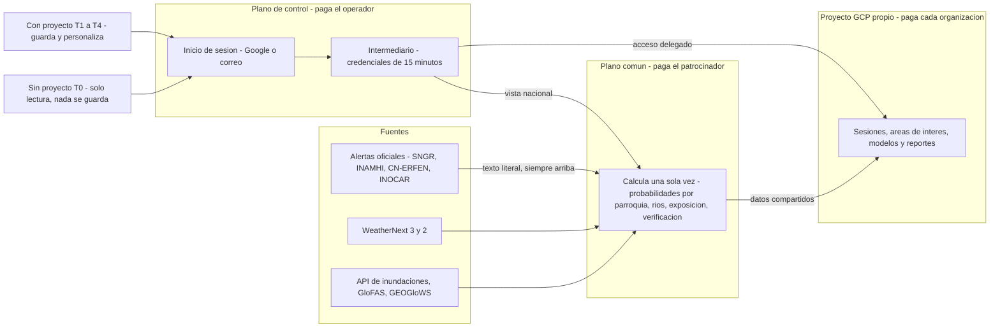

# Resumen ejecutivo: Gemelo Digital Ecuador – El Niño (GDE-Niño)

Este resumen está dirigido a autoridades del Gobierno nacional, de los GAD y del sector privado. Presenta el plan para diseñar, construir, poner en marcha y operar el **Gemelo Digital Ecuador – El Niño (GDE-Niño)**, una plataforma de apoyo a la decisión para gestionar el riesgo de El Niño 2026-27. Explica qué es, cómo funciona, cuánto cuesta y quién paga, cuándo estará lista, qué riesgos tiene y qué decisiones se necesitan de las autoridades en las próximas semanas. Los documentos detallados están en inglés (sección 11). Fecha de corte: 2026-09-29.

**Convenciones.** Montos en US$ sin IVA ni ISD, salvo indicación, con el formato numérico de los documentos técnicos (coma para miles y punto para decimales). Fechas en formato AAAA-MM-DD. "(por confirmar)" indica un punto pendiente con un socio y "(no verificado)" un dato sin fuente confirmada.

**Contenido:** 1. Situación y urgencia · 2. Qué es GDE-Niño · 3. Cómo funciona · 4. Acceso y costos · 5. Cómo se minimizan los costos · 6. Cronograma · 7. Equipo y presupuesto · 8. Riesgos · 9. Decisiones solicitadas · 10. Trazabilidad de la solicitud · 11. Mapa de documentos · 12. Preguntas abiertas

---

## 1. Situación y urgencia

- **Está en curso un El Niño muy fuerte, posiblemente histórico, y es del tipo más peligroso para Ecuador.** El CN-ERFEN lo declaró activo el 2026-08-28. Su informe 009-2026 (17 de septiembre) reporta anomalías de **+4.5 °C** en Niño 1+2 y de hasta **+2.9 °C** en Niño 3.4, y da **más de 90 %** de probabilidad de intensidad "muy fuerte" a fines de 2026. NOAA CPC asigna **75 %** de probabilidad a que el trimestre OND 2026 sea "histórico".
- **Los impactos empezaron en la época seca.** Hubo 11 inundaciones por marea en agosto, con el nivel del mar **+40 cm** sobre lo normal (1997-98: +42 a +47 cm), y siete ríos se desbordaron en Guayas, Esmeraldas y Manabí entre el 25 y el 28 de septiembre.
- **Dos vías de amenaza pueden coincidir.** En la **Costa**: inundaciones, deslizamientos, dengue y pérdidas agrícolas, acuícolas y viales. En las **cuencas hidroeléctricas andino-amazónicas**: caudales bajos y riesgo de racionamiento. El embalse Mazar estaba en **2,134.2 msnm** el 2026-09-28; los apagones de 2024 empezaron cerca de 2,115 msnm.
- **Ventana crítica.** Los mayores impactos se esperan entre noviembre de 2026 y marzo de 2027, y las lluvias costeras van de diciembre a abril. Las elecciones seccionales del **2026-11-29** cambiarán autoridades de los GAD en plena temporada.
- **Lo que está en juego.** El Niño 1997-98 costó **US$2,869.3M** (CEPAL), cerca del 13–15 % del PIB, y 286–288 vidas. El escenario extremo del plan nacional estima pérdidas de US$1.3 mil millones entre octubre de 2026 y enero de 2027.
- **Hay financiamiento, pero condicionado.** Cat-DDO del Banco Mundial (US$200M), programa subnacional Banco Mundial/BDE (US$800M), BID (US$400M) y CAF (US$200M) exigen evidencia defendible: pronósticos archivados, exposición y estimaciones de pérdidas.
- **La credibilidad es frágil.** En 2023-24 llovió menos de lo pronosticado en la Costa. Además, las fuentes discrepan sobre el nivel oficial de alerta vigente de la SNGR (resoluciones SNGR-193-2026 y SNGR-238-2026; punto V1 por verificar).

## 2. Qué es GDE-Niño

GDE-Niño es una plataforma de **apoyo a la decisión**. Convierte la información oficial y la de los modelos en evidencia probabilística por **parroquia** (1,041) y **cantón** (221 GAD cantonales), con anticipación de meses a horas. Sus usuarios son el COE nacional y los COE provinciales y cantonales con sus **mesas técnicas**, los GAD, ministerios, empresas públicas y privadas, aseguradoras, academia y organismos humanitarios.

**GDE-Niño no emite alertas.** Según la Ley Orgánica para la Gestión Integral del Riesgo de Desastres, solo la **SNGR** declara alertas. El **INAMHI** emite advertencias hidrometeorológicas, el **CN-ERFEN** se pronuncia sobre El Niño y el **INOCAR** cubre el océano. Por eso la plataforma:

- muestra las alertas oficiales **textualmente** (resolución, hora y enlace) y **por encima** de todo resultado de modelo;
- rotula sus productos como "apoyo a la decisión / pronóstico experimental", en términos de **nivel de riesgo** y **probabilidad de impacto**, y nunca usa la escala oficial de colores de alerta;
- complementa, sin duplicar, a alertasecuador.gob.ec, el visor COE2 de la SNGR y el visor del INAMHI, y les devuelve capas compatibles;
- muestra probabilidades, dispersión, años análogos (1982-83, 1997-98, 2015-16, 2017, 2023-24) y un indicador de confianza, y publica su propia verificación, incluidas las falsas alarmas;
- deja en manos de personas la aprobación de todo contenido público.

El núcleo será de código abierto (Apache-2.0), lo que facilita la contratación pública y el traspaso a una institución nacional.

## 3. Cómo funciona

El gemelo sigue un ciclo: **observar → pronosticar → simular impactos → evaluar escenarios → decidir → verificar y aprender**. Usa estaciones del INAMHI y satélites para las primeras horas. De 0 a 15 días usa **WeatherNext 3** de Google (64 miembros, 0.1°) y **WeatherNext 2**, con ECMWF como respaldo. Para ríos usa la **API de pronóstico de inundaciones de Google**, GEOGloWS y GloFAS, y para el horizonte estacional, C3S, NMME y los índices ENSO.

La arquitectura tiene **tres planos**:

1. **Plano de control** (`ectwin-platform-prod`, lo paga el operador): inicio de sesión, aplicación web e intermediario. No guarda datos de usuarios.
2. **Plano común o Commons** (`ectwin-commons-prod`, lo paga un patrocinador): calcula **una sola vez** los productos nacionales. Incluye alertas oficiales, ENSO, probabilidades de lluvia por parroquia, estado de ríos, exposición (3,873 escuelas, 3,113 km de vías estatales, cerca de 1.3M de personas), verificación, un PDF diario por cantón listo a las 06:30 y una tarjeta para WhatsApp.
3. **Plano del usuario**: el **proyecto GCP propio** de cada organización.

La Fase 2 añade módulos de inundación (incluida una biblioteca de escenarios costeros para Guayaquil/Durán, Machala, Portoviejo/Chone y Esmeraldas), deslizamientos, salud, agricultura y camaronicultura, vialidad, albergues e hidroenergía, además de disparadores para acción anticipatoria.

## 4. Acceso y costos

1. **Iniciar sesión es obligatorio**, con cuenta de Google o con correo y contraseña. La verificación en dos pasos (TOTP, sin SMS) es obligatoria para propietarios, administradores y firmantes técnicos.
2. **Sin proyecto propio (nivel T0)**, el usuario ve una vista nacional de solo lectura. **No se guarda nada en ningún servidor.** Al intentar guardar, la aplicación ofrece "Conectar proyecto" o "Solicitar proyecto patrocinado".
3. **Para guardar se necesita un proyecto GCP propio.** Allí quedan sesiones, áreas de interés, vistas, reportes, corridas y modelos propios. Los datos personales se alojan por defecto en `southamerica-west1` (Santiago), porque en Ecuador no hay región de Google Cloud. Recomendamos **proyectos institucionales con dos propietarios**, para que el trabajo sobreviva a los cambios de autoridades.
4. **Conectar el proyecto** toma unos 8–12 minutos en Cloud Shell. La plataforma recibe un único permiso (`roles/iam.serviceAccountTokenCreator` sobre la cuenta `ectwin-runner`) y obtiene credenciales de 15 minutos como máximo. No hay llaves permanentes. La organización puede revocar el acceso cuando quiera y conserva sus datos.
5. **Quién paga qué.** El operador paga el plano de control. El patrocinador paga el Commons, la vista T0 y los proyectos T4. Cada organización paga su proyecto. El operador nunca revende Google Cloud.
6. **Protección de gastos.** Hay presupuestos con avisos al 50, 90 y 100 %. Al llegar al 100 % se pausan los procesos programados, sin desactivar la facturación. Se pide confirmación antes de corridas de más de US$1 (US$5 en T3).

| Nivel | Perfil típico | Qué permite | Costo mensual estimado | Paga |
|---|---|---|---|---|
| T0 Visor | Usuario autenticado | Vista nacional; nada se guarda | US$0 | Patrocinador |
| T1 Ligero | GAD municipal | Tableros, 1–3 áreas de interés, suscripciones | ≈US$0–14 | Organización |
| T2 Estándar | Prefectura o ministerio | Analítica diaria, Earth Engine, WeatherNext propio | ≈US$20–60 | Organización |
| T3 Intensivo | Agencia nacional o aseguradora | Ensambles, modelación 2D, modelos propios | ≈US$540–800; pico ≈US$1,070–1,210 | Organización |
| T4 Patrocinado | GAD o COE sin contrato de nube | Perfil T1 o T2 en carpeta del patrocinador | 25 T1 + 5 T2 ≈US$446 | Patrocinador, luego el GAD |
| Plano de control | — | Identidad e intermediario | ≈US$23–43 | Operador |
| Commons | — | Productos nacionales | ≈US$100–300 | Patrocinador |

Se suman IVA (15 %) e ISD (2.5 %, por confirmar con el SRI). Las entidades públicas pueden comprar mediante un revendedor local. Para 30 organizaciones, el modelo de proyecto propio cuesta US$2,113.54 al mes, frente a US$2,416.07 si se centraliza (+14 %). El **sector privado** opera con perfil comercial y bajo una política de uso aceptable que prohíbe usar los mapas para excluir comunidades.

## 5. Cómo se minimizan los costos

- **WeatherNext.** Se consulta donde Google lo publica, sin copiarlo, y solo para la geografía de Ecuador: unos 0.07 GB por consulta, frente a 18.7 GB a escala global. El costo a escala de Ecuador es **≈US$0**, dentro del nivel gratuito de BigQuery. El Commons publica solo derivados permitidos (probabilidades por parroquia, nivel de riesgo), así que las organizaciones no necesitan aprobación propia. WeatherNext 2 se ejecuta por cuenta propia solo para escenarios, a ≈US$2.3–4.6 por corrida.
- **API de pronóstico de inundaciones.** Una sola llave central toma cuatro instantáneas diarias que se comparten con todos, así que las organizaciones no necesitan llave propia. Como la API no guarda historial, se archiva desde el primer día. Mientras llega la aprobación, que puede tardar meses, se usan GloFAS y GEOGloWS.
- **Jev (modelo System One de TypeSafe) en la construcción.** Jev responde preguntas tipificadas (sí/no, elección, puntaje) a muy bajo costo. Con él se catalogan capas, se revisan tablas de PDF y se asignan nombres de lugares a códigos DPA. La curación baja de ≈3,608 a ≈617 horas de analista (−83 %), y el trabajo termina antes de la temporada. La API cuesta US$15.49 por pasada, frente a ≈US$188 con Gemini Flash-Lite.
- **Jev en la operación.** En el pico se estiman ≈4.3M de decisiones al mes por ≈US$113, frente a ≈US$1,450 con Gemini Flash-Lite (−92 %). Los casos dudosos, con probabilidad entre 0.30 y 0.70, pasan a revisión humana.
- **Otras palancas.** Cada organización aprovecha los niveles gratuitos de su propia cuenta. Los productos nacionales se calculan una sola vez. Las corridas pesadas usan máquinas Spot (−59 %), y los escenarios costeros precalculados cuestan menos de US$0.01 por mapa.
- **Resultado.** La nube de la construcción cuesta ≈US$0.6k–1.1k, y la nube es solo el 1.6 % del presupuesto.

## 6. Cronograma

| Fase | Fechas | Resultados principales | Hito |
|---|---|---|---|
| 0 Movilización | 2026-09-29 → 2026-10-16 | Solicitudes de acceso; proyectos; archivo de datos; equipo; convenios en borrador | G0, 2026-10-16 |
| 1 MVP "Monitoreo y Exposición" | 2026-10-19 → 2026-11-27 | Inicio de sesión y conexión de proyectos; alertas oficiales; ENSO; probabilidades por parroquia; ríos; exposición; PDF cantonal; 3–5 pilotos | G1a pilotos 2026-11-06; salida 2026-11-27 |
| 2 Temporada pico | 2026-12-01 → 2027-04-30 | Modo evento; módulos de impacto; disparadores; verificación semanal; 30 o más organizaciones | G2, 2027-04-30 |
| 3 Aprender y ampliar | 2027-05-03 → 2027-09-30 | Verificación de la temporada; hidroenergía y sequía; escenarios | G3, 2027-09-30 |
| 4 Institucionalización | Desde 2027-10-01 | Traspaso a una institución anfitriona | — |

No habrá cambios riesgosos entre 2026-11-26 y 2026-12-01 (salida en producción y elecciones) ni entre 2026-12-24 y 2027-01-02.

## 7. Equipo y presupuesto

- **Equipo.** Diez frentes de trabajo, con ≈13 personas a tiempo completo (FTE) al 2026-10-09 y 24.5 FTE pagados en temporada pico, más técnicos en comisión de servicios del INAMHI y la SNGR.
- **Presupuesto completo (12 meses, fases 0–3): ≈US$1,600,220.** Se reparte en personal US$1,153,970 (72.1 %), otros gastos US$206,400, contingencia de 15 % US$208,724 y nube US$25,938 (1.6 %).
- **Por fase:** F0 US$76,128; F1 US$229,183; F2 US$691,205; F3 US$603,704.
- **Variante mínima:** ≈US$1,022,922.
- **Financiamiento puente para las fases 0–1:** se recomiendan **US$305,311**, con un piso de US$223,776. La variante de las fases 2–3 se decide en G1b (2026-11-24).
- **Fuera del presupuesto:** las organizaciones pagan sus proyectos (como máximo US$3,180 al mes para 30 organizaciones en pico).
- **Fase 4:** ≈US$0.66M al año.

## 8. Riesgos

El registro tiene 35 riesgos: 2 críticos, 14 altos y 19 medios. Estos son los principales:

| Riesgo | Mitigación |
|---|---|
| R02 (crítico): errores de pronóstico repiten la pérdida de credibilidad de 2023-24 | Probabilidades, análogos, indicador de confianza, verificación publicada |
| R10 (crítico): los convenios con INAMHI y SNGR se retrasan | Cartas el 2026-10-02; nota operativa interina; escalamiento al Comité Directivo |
| R01: un nivel de la plataforma se confunde con una alerta oficial | Franja oficial arriba; vocabulario controlado; avisos legales |
| R28: se muestra mal el estado oficial de alerta | Ingesta textual; aviso tras 6 horas sin actualización; confirmación por dos personas |
| R03: se pierde el acceso a WeatherNext | Respaldo con ECMWF; pesos abiertos de WeatherNext 2 |
| R14 y R15: falla la contratación pública o el patrocinio | Proyectos T4; revendedor; compromiso escrito hasta 2027-04-30 |

## 9. Decisiones solicitadas a las autoridades

1. **Patrocinador (por ejemplo, SNGR/INAMHI con banca multilateral):** designarlo y comprometer el financiamiento puente **hasta 2026-10-09**, y garantizar el Commons hasta 2027-04-30.
2. **SNGR e INAMHI:** nombrar enlaces antes del 2026-10-16. La SNGR presidirá el Comité Directivo, que se constituye el 2026-10-14. Ambas instituciones deben firmar los convenios **hasta 2026-11-06** o dar un consentimiento interino por escrito, y aprobar las comisiones de servicios.
3. **INOCAR/CN-ERFEN, MSP y MAG:** firmar convenios hasta 2026-12-15. **CELEC/CENACE:** hasta 2027-01-31.
4. **GAD y COE:** firmar al menos 3 cartas de intención de pilotos hasta 2026-10-16, crear proyectos institucionales antes del 2026-11-29 o pedir un proyecto T4, y designar a las mesas técnicas que recibirán el PDF cantonal.
5. **Ministerios y empresas públicas:** habilitar la compra de nube mediante un revendedor local.
6. **Sector privado:** abrir proyectos propios con perfil comercial y compartir observaciones de impacto de forma voluntaria.
7. **Comité Directivo:** decidir la variante de las fases 2–3 el 2026-11-24 y elegir la institución anfitriona hasta 2027-08-31.

## 10. Trazabilidad de la solicitud

| Elemento solicitado | Dónde se responde |
|---|---|
| WeatherNext al mínimo costo | [06](./06-forecast-model-stack.md) §3; [09](./09-cost-model.md) L04, L05, L26 |
| API de pronóstico de inundaciones | [06](./06-forecast-model-stack.md) §4; [04](./04-identity-tenancy-byo-gcp.md) §9 |
| Jev para reducir el costo de creación | [08](./08-ai-decision-layer-jev.md) §3; [09](./09-cost-model.md) §3 (L15, L16), §5 (B9) |
| Inicio de sesión con Google o correo | [04](./04-identity-tenancy-byo-gcp.md) §2; [02](./02-users-requirements-ux.md) §3.1, FR-001 |
| Proyecto propio para guardar | [04](./04-identity-tenancy-byo-gcp.md) §5, §12.2; [03](./03-architecture.md) §5.6 |
| Uso sin proyecto (T0) | [02](./02-users-requirements-ux.md) §3.1, J9 |
| Quién paga qué | [09](./09-cost-model.md) §1; [04](./04-identity-tenancy-byo-gcp.md) §7 |
| Sector privado | [02](./02-users-requirements-ux.md) P10, P11, J4, J5; [07](./07-impact-modules-and-triggers.md) §6.6 |
| Actualidad de los datos | [02](./02-users-requirements-ux.md) §6.2; [05](./05-data-catalog.md) §4.2; [11](./11-operations-runbook.md) §4.3 |
| Instalación y puesta en marcha | [10](./10-setup-and-deployment.md) |
| Operación | [11](./11-operations-runbook.md) |
| Cronograma y presupuesto | [12](./12-roadmap-team-budget.md) |

## 11. Mapa de documentos

Documentos detallados, en inglés:

- [01 Contexto de El Niño en Ecuador](./01-context-el-nino-ecuador.md)
- [02 Usuarios, requisitos y experiencia de uso](./02-users-requirements-ux.md)
- [03 Arquitectura](./03-architecture.md)
- [04 Identidad y proyecto propio](./04-identity-tenancy-byo-gcp.md)
- [05 Catálogo de datos](./05-data-catalog.md)
- [06 Pronóstico y modelos](./06-forecast-model-stack.md)
- [07 Impactos y disparadores](./07-impact-modules-and-triggers.md)
- [08 Capa de decisión con IA (Jev y Gemini)](./08-ai-decision-layer-jev.md)
- [09 Modelo de costos](./09-cost-model.md)
- [10 Instalación y despliegue](./10-setup-and-deployment.md)
- [11 Manual de operaciones](./11-operations-runbook.md)
- [12 Hoja de ruta, equipo y presupuesto](./12-roadmap-team-budget.md)
- [13 Gobernanza, marco legal y riesgos](./13-governance-legal-risk.md)
- [14 Verificación y validación](./14-verification-and-validation.md)
- Referencias: [módulo de configuración](../infra/tenant-bootstrap/README.md), [script de conexión](../scripts/bootstrap-tenant.sh), [catálogo de fuentes](../catalog/data-sources.yaml)

## 12. Preguntas abiertas

- ¿Quién será el patrocinador, y pueden las líneas multilaterales financiar nube y operación?
- ¿Cuál es el nivel oficial de alerta vigente (punto V1)?
- ¿Cuándo se aprobará la API de inundaciones, y admite uso comercial?
- ¿Cuál es el tratamiento tributario definitivo (IVA e ISD)?
