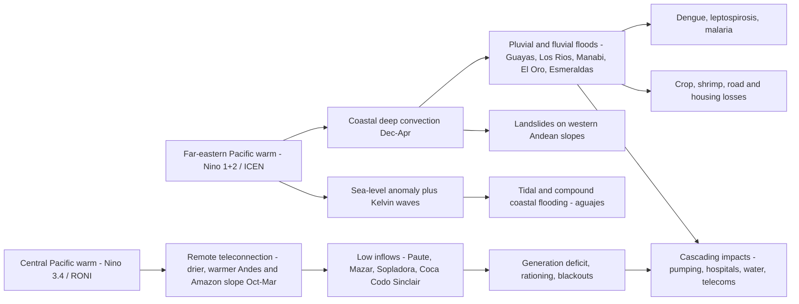
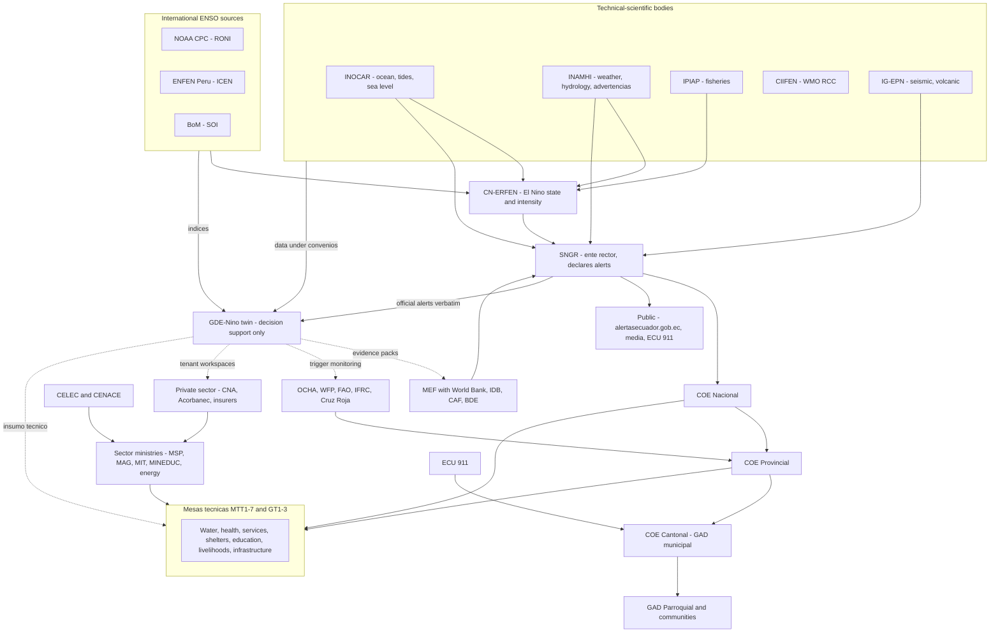
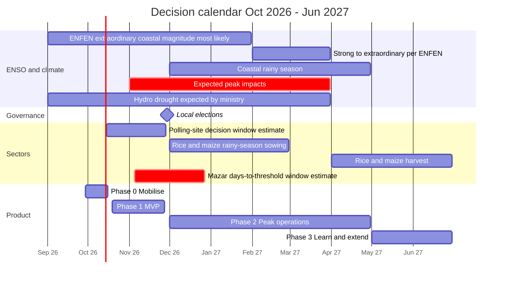
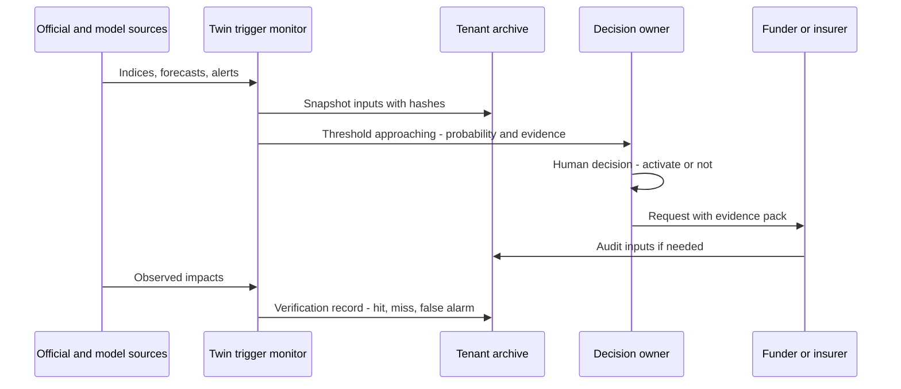

# Context: El Niño risk in Ecuador

This document sets out the physical, historical, institutional and financial context that the *Gemelo Digital Ecuador – El Niño* (GDE-Niño; "Ecuador El Niño Digital Twin") has to serve. It explains how ENSO reaches Ecuador through two distinct hazard pathways, records what past events cost and what we can learn from them, and summarises the situation on **2026-09-29**, with a very strong eastern-Pacific El Niño under way and the coastal rainy season about to start. It maps the institutions and the law that decide who may say what, and it ends with the **decision calendar and lead-time matrix** that drives the product requirements in [02-users-requirements-ux.md](./02-users-requirements-ux.md) and the impact and trigger modules in [07-impact-modules-and-triggers.md](./07-impact-modules-and-triggers.md). Every figure has a source and a quality tag. Where sources disagree, the conflict is shown and not resolved silently.

## Contents

1. [Key messages](#1-key-messages)
2. [How to read the sources in this document](#2-how-to-read-the-sources-in-this-document)
3. [ENSO physics relevant to Ecuador](#3-enso-physics-relevant-to-ecuador)
4. [Historical events and losses](#4-historical-events-and-losses)
5. [The current situation (as of 2026-09-29)](#5-the-current-situation-as-of-2026-09-29)
6. [Hazard pathways by region and province](#6-hazard-pathways-by-region-and-province)
7. [Exposed sectors](#7-exposed-sectors)
8. [Institutional map and legal framework](#8-institutional-map-and-legal-framework)
9. [Decision calendar and lead-time matrix](#9-decision-calendar-and-lead-time-matrix)
10. [Financing and trigger instruments](#10-financing-and-trigger-instruments)
11. [Implications for the twin](#11-implications-for-the-twin)
12. [Glossary of Spanish terms](#12-glossary-of-spanish-terms)
13. [Open questions](#13-open-questions)

---

## 1. Key messages

1. **A very strong, possibly record-strength, El Niño is under way, and it is the dangerous kind for Ecuador.** Both the far-eastern Pacific (Niño 1+2) and the central Pacific (Niño 3.4) are extremely warm, as in 1997-98. CN-ERFEN reported Niño 1+2 at **+4.5 °C** and Niño 3.4 at up to **+2.9 °C** (report 009-2026, published 19 Sep). It puts the probability of "very strong" intensity by the end of 2026 at **over 90%**. NOAA CPC gives a **75% chance** that OND 2026 is "historic" (3-month RONI ≥ +2.5 °C) [S].
2. **Two hazard pathways, driven by different indices, may hit at the same time.**
   - **Coast:** floods, compound coastal flooding, landslides, dengue, and losses in agriculture, aquaculture and transport. The driver is Niño 1+2/ICEN plus local coupling.
   - **Andes and Amazon hydropower basins:** low inflows and a risk of rationing. The driver is Niño 3.4/RONI plus basin rainfall.
   - Mazar reservoir fell to **2,134.2 masl on 28 Sep 2026**. The 2024 blackouts began at about **2,115 masl** [S].
3. **Impacts started early.** Tidal flooding (11 events, 13–16 Aug), seven rivers overflowing (25–28 Sep) and more than 80 mm/day at Samborondón all came during what is normally the dry season [S]. The peak window is **Nov 2026 – Mar 2027**.
4. **History sets the stakes.** 1997-98 cost **US$2,869.3M (CEPAL), about 13–15% of GDP**, and 286–288 lives. The 2024 drought and blackouts cost **US$1.92bn (1.4% of GDP)**. The government's 2026 extreme scenario is **US$1.3bn** in losses between Oct 2026 and Jan 2027 [S].
5. **Only SNGR declares alerts.** INAMHI issues *advertencias*, CN-ERFEN issues El Niño statements, and INOCAR covers the ocean. The twin is **decision support** (design decision D1). Its value is in turning official and model information into timely, probabilistic, sector-specific evidence for decisions from 9 months to a few hours ahead.
6. **Money is available and conditional.** The instruments are:
   - World Bank Cat-DDO: US$200M;
   - IDB contingent loan: US$400M;
   - CAF contingent line: US$200M;
   - World Bank / BDE subnational programme: US$800M;
   - AgroProtege crop insurance;
   - IFRC EAP, CERF and FAO–WFP anticipatory action.

   Each needs defensible evidence. That means archived forecasts, footprints, exposure and loss estimates, and the twin should produce these packs from day 1.
7. **Credibility is fragile.** In 2023-24 the coast received less rain than forecast. The twin must show probabilities, spread, analogs and a **coupling/confidence** indicator (D3), and publish its own verification.

---

## 2. How to read the sources in this document

Many primary government and agency websites could not be read directly while this context was compiled, so most 2026 facts come from news reports, search summaries and secondary mirrors that quote the primary documents. Every factual claim therefore carries a tag:

| Tag | Meaning | Use in the product |
|---|---|---|
| **[P]** | Primary: the research team read the official document, dataset or catalogue entry itself | Can be used as reference data |
| **[S]** | Secondary: seen in a search summary, news article or mirror that quotes the primary source; the primary was not read | Show with source link; verify against the primary before operational use (see §5.4) |
| **(unverified)** | Prior knowledge, standard background, or a claim no source confirmed during research | Must not drive any product logic until checked |
| **(to confirm)** | Needs confirmation with a named partner institution | Tracked in the Phase 0 verification backlog |
| **estimate** | Our own arithmetic; the working is shown | Labelled as an estimate wherever it appears in the product |

The physical explanations in §3 are **standard ENSO background**. They were not re-verified against the literature during research. The quantitative thresholds in that section are marked (unverified), and they will be calibrated and verified in [14-verification-and-validation.md](./14-verification-and-validation.md).

---

## 3. ENSO physics relevant to Ecuador

### 3.1 Ocean regions and indices

| Index | Definition | Issuer / data | Why it matters for Ecuador | Twin use |
|---|---|---|---|---|
| **Niño 1+2** | SST anomaly in 0–10°S, 90–80°W [S] | CPC weekly (OISST, unverified); CN-ERFEN; ENFEN | Sits right off the Ecuador–Peru coast. It drives local convection and **coastal rainfall**, sea level and marine ecosystems | Primary driver of the coastal pathway (D4a) |
| **ICEN** (*Índice Costero El Niño*, Peru) | 3-month running mean of monthly Niño 1+2 anomalies, **ERSSTv5, 1991–2020 climatology** [S] ([IMARPE SIOFEN](https://siofen.imarpe.gob.pe/nivel2/indice-costero-el-nino-icen), [IGP](https://repositorio.igp.gob.pe/items/789430ed-0097-491a-ab8a-18fd85f604ab), [BCRP Moneda 196](https://www.bcrp.gob.pe/docs/Publicaciones/Revista-Moneda/moneda-196/moneda-196-05.pdf)) | ENFEN / IGP; machine-readable at `http://met.igp.gob.pe/datos/ICEN.txt` [S] | The best single official index for coastal Ecuador. Categories have been percentile-based since the Dec 2024 update (ENFEN Nota Técnica 01-2024): weak >P75–P90, moderate >P90–P95, strong >P95–P99, extraordinary >P99 [S]. The older fixed thresholds (+0.4 / 1.0 / 1.7 / 3.0 °C) are (unverified) | Coastal intensity category; analog selection |
| **ONI → RONI** (Niño 3.4, 5°N–5°S, 170–120°W (unverified box)) | RONI = Niño 3.4 anomaly minus the mean SST anomaly of the tropical belt 20°S–20°N. It became CPC's **official index on 1 Feb 2026** [S] ([CPC announcement](https://www.cpc.ncep.noaa.gov/products/analysis_monitoring/enso/roni/announcement.php), [NWS PNS 26-05](https://weather.gov/media/notification/pdf_2026/pns26-05_Relative_ONI.pdf), [drought.gov](https://www.drought.gov/news/new-noaa-el-nino-southern-oscillation-index-supports-drought-early-warning-2026-03-11)) | NOAA CPC; `RONI.ascii.txt` [S] | Global teleconnections. Linked to **drought in the Amazon and Austro basins** that feed hydropower. CPC strength probabilities: [strengths](https://cpc.ncep.noaa.gov/products/analysis_monitoring/enso/roni/strengths.php) | Primary driver of the hydro-energy pathway (D4b) |
| **SOI** | Tahiti–Darwin pressure difference; 30-day value. The El Niño threshold is −7 [S] | Australian BoM ([BoM ENSO](https://www.bom.gov.au/climate/enso/)) | Tells whether the atmosphere is **coupled** to the warm ocean | Coupling/confidence indicator |
| **Sea-level anomaly** | Coastal tide-gauge or altimetry anomaly | INOCAR / CN-ERFEN; La Libertad gauge (IOC `lali`, GLOSS 172, UHSLC 091/091a, PSMSL 544/555, at −2.21, −80.90) [S] ([ioc.csv](https://github.com/ec-jrc/pyPoseidon/blob/master/pyposeidon/misc/ioc.csv)); CMEMS `zos` in Earth Engine `COPERNICUS/MARINE/GLOBAL_ANALYSISFORECAST_PHY_DAILY` [P] | Raises the baseline for tidal (*aguaje*) and compound flooding. It is also the signature of arriving Kelvin waves | Coastal compound-flood module; early-warning signal |
| **Subsurface heat / Kelvin waves** | Thermocline depth anomaly along the equator | TAO/Argo and ocean reanalyses (unverified access path) | Gives about 1–2 months' notice of coastal warming and sea-level rise (unverified) | ENSO panel (Phase 2) |

### 3.2 Why the twin shows ICEN *and* RONI (and absolute SST)

- **Different oceans, different impacts.**
  - Coastal rainfall responds mostly to the far-eastern Pacific (Niño 1+2).
  - Remote teleconnections to the Andes and Amazon respond to the central Pacific (Niño 3.4).
  - The two indices can decouple. In the **2017 coastal El Niño**, Niño 1+2 was strongly positive while Niño 3.4 was near neutral (unverified), and rain was about five times normal in El Oro, Loja and Azuay [S] ([Wikipedia ES](https://es.wikipedia.org/wiki/El_Ni%C3%B1o_costero_de_2017)).
  - In **2023-24**, a strong event centred further west gave the coast **less rain than forecast** [S].
- **Relative versus conventional anomalies.** RONI removes the tropical-mean warming trend. That suits teleconnections. Local deep convection off Ecuador, however, depends on the **absolute** SST crossing a convective threshold (unverified; order of 26–27 °C). The twin therefore shows, for each box:
  - the conventional anomaly;
  - the relative anomaly;
  - the absolute SST, with the dataset and climatology stated.
- **Dataset and climatology differences explain conflicting numbers.** ICEN uses ERSSTv5 monthly data with a 1991–2020 climatology. CPC's weekly values use OISST (unverified). For the same week, reported Niño 1+2 values range from +3.4 °C to +4.7 °C (see §5.2). Each stored value must carry `sst_dataset`, `climatology`, `anomaly_type` and `issuer` (see the schema in §11.3).

### 3.3 Event flavours

| Flavour | Ocean signature | Typical Ecuador outcome | Examples |
|---|---|---|---|
| **Canonical / eastern-Pacific** | Niño 1+2 and Niño 3.4 both strongly positive | Extreme coastal rain for months, floods, landslides and epidemics | 1982-83, 1997-98, **2026-27 (so far)** |
| **Central-Pacific (Modoki-like)** | Niño 3.4 warm, Niño 1+2 weak or cooling | Coastal rain often below expectations. Andes and Amazon drying is still possible | 2023-24 (partly), 2015-16 (coastal rain overpredicted, unverified) |
| **Coastal El Niño** | Niño 1+2 warm, Niño 3.4 neutral | Sudden, short, intense coastal and southern-Andean rain. Poorly forecast more than 1 month ahead (unverified) | 2017, early 2023 (Cyclone Yaku period, unverified) |

### 3.4 Kelvin waves and sea-level anomaly (background)

1. Westerly wind bursts in the western and central Pacific excite **downwelling equatorial Kelvin waves**. These travel east and reach South America roughly 2–3 months later (unverified).
2. On arrival they deepen the thermocline, which cuts off cold upwelling. SST then rises and **sea level rises** along the coast. Part of the signal continues poleward as coastal-trapped waves (unverified).
3. For Ecuador this means:
   - a **raised baseline** for tides. In 2026 ERFEN reported a coastal anomaly of **+40 cm** on 20 Aug, against **+42 to +47 cm** in 1997-98 [S]. Eleven tidal-flooding events followed on 13–16 Aug: 7 in Guayas, 2 in El Oro, 1 in Esmeraldas and 1 in Manabí [S] ([Primicias](https://www.primicias.ec/sociedad/fenomeno-elnino-ecuador-ascenso-nivel-mar-inundaciones-erosion-playas-calentamiento-oceano-invierno-131023/));
   - **blocked gravity drainage** in low-lying cities such as Guayaquil and Durán. Rain falling at high tide cannot drain, and the Guayaquil public-safety company Segura EP maintains a layer of "points vulnerable to high tide" [S];
   - **1–2 months' warning** of further coastal warming when a new Kelvin wave is seen crossing the Pacific (unverified).
4. The +40 cm figure has **not** been checked against a tide gauge. Verify it with the La Libertad gauge (UHSLC 091) and CMEMS `zos` (see §13).

### 3.5 SST–rainfall coupling and the 2023-24 lesson

- Under normal conditions, cold upwelling and the Humboldt Current keep coastal SST low and the lower atmosphere stable. That makes the southern coast semi-arid (background).
- When far-eastern Pacific SST goes above the convective threshold **during the warm season (Dec–Apr)**, deep convection builds over the coast and the western Andean slopes. Rain then reaches several times normal, and the response is **non-linear**: once the threshold is crossed, rainfall rises faster than the SST anomaly. This is the "extraordinary" regime of 1982-83 and 1997-98, which dynamical models capture poorly in magnitude (Takahashi & Dewitte 2016; unverified).
- **Coupling is what matters.** Warm water without an atmospheric response did not bring the forecast coastal rain in 2023-24. The indicators to watch are:
  - SOI: −20.5 on 27 Sep 2026, well past the −7 threshold [S];
  - outgoing long-wave radiation over the far-eastern Pacific;
  - trade-wind anomalies;
  - observed coastal rainfall anomalies.
- **Season matters.** The same anomaly produces more rain in Jan–Mar, when the climatological SST is warmest, than in Aug–Oct (background). Heavy rain in late September 2026 (more than 80 mm/day at Samborondón [S]) came outside the rainy season, with Niño 1+2 absolute SST still only about 25.4 °C (week of 23 Sep [S]). That suggests the atmosphere is already responding, and rain should intensify as seasonal SST climbs toward its Dec–Apr maximum.

### 3.6 Why the coast floods while the Andes and Amazon basins can dry



- The El Niño teleconnection tends to **dry and warm the Ecuadorian Andes and the Amazon slope** during the October–March low-flow season (Vuille et al. 2000; unverified). Coastal reservoirs such as Daule-Peripa tend to fill (unverified).
- About **76% of hydro generation** depends on the eastern Austro and Amazon basins. **33 plants totalling 4,308.95 MW** (83% of hydro capacity) share those basins [S] ([Primicias](https://www.primicias.ec/economia/ecuador-alerta-roja-fenomeno-nino-riesgo-energetico-sequias-hidroelectricas-estiaje-cuencas-rios-amazonia-austro-131504/)). The ministry expects drought from **Sep 2026 to Mar 2027** [S].
- **Attribution caution.** The Sep–Dec 2024 drought came **after** El Niño had ended (unverified). The hydro-drought pathway is therefore modelled as its own risk, driven by basin rainfall and inflow forecasts. RONI is a conditioning factor, not a proxy.

### 3.7 Seasonality and predictability

| Aspect | Fact | Quality |
|---|---|---|
| Coastal rainy season | Dec–Apr; El Niño rains expected to intensify from Nov–Dec 2026, possibly into early 2027 (INAMHI) | [S] ([El Diario](https://www.eldiario.ec/ecuador/el-nino-en-ecuador-inamhi-alerta-por-aumento-de-lluvias-en-la-costa-cuando-seran-mas-intensas-14092026)) |
| Peak ENSO strength | ENFEN: "extraordinary" coastal magnitude most likely Sep 2026 – Jan 2027, strong-to-extraordinary Feb–Mar 2027; coastal event lasting to mid-austral-autumn 2027 | [S] ([ENFEN 16-2026](https://enfen.imarpe.gob.pe/download/comunicado-oficial-enfen-n-16-2026)) |
| Seasonal skill on the coast | Useful Dec–Apr skill, driven mainly by Niño 1+2 SST; much lower in the Andes (Recalde-Coronel, Barnston & Muñoz 2014) | (unverified) |
| Track record | 1982-83 not forecast operationally; 1997-98 warming caught but underestimated early; 2015-16 coastal rain overpredicted; 2017 coastal event missed at ≥1 month lead; 2023-24 heavy rain only partly realised | (unverified) |
| Implication | Trust **tercile tendencies** where canton hindcast skill is positive. Treat amounts and extremes as low-confidence. Watch Niño 1+2/ICEN forecasts, not only RONI | Design rule |

---

## 4. Historical events and losses

These events form the **analog library** of design decision D3. Loss figures come from different methods and currencies (nominal US$, CEPAL damage-and-loss, central-bank estimates), so they are **not directly comparable**. The twin shows them as context bands, never as point predictions.

| Event | ENSO signature | Economic losses | Human toll | Key sector impacts | Sources | Caveats |
|---|---|---|---|---|---|---|
| **1982-83** | Canonical, very strong; not forecast operationally (unverified) | **US$640.6M** (CEPAL); CAF estimate US$1,051M; about 3.1% of a roughly US$20bn GDP; road rehabilitation alone US$210M [S]. Another source: about US$640M infrastructure damage plus about US$300M balance-of-payments losses; real GDP −3.3% in 1983 [S] | Chunchi landslide (Apr 1983) killed about 100. Regional total (CO/EC/PE/CL) 1,656 deaths [S] | Worst-hit provinces: Esmeraldas, Manabí, Los Ríos, El Oro, Guayas. About 97% Galápagos coral mortality | [Ecuavisa](https://www.ecuavisa.com/noticias/ecuador/fenomeno-de-el-nino-en-ecuador-hace-40-anos-se-registro-un-evento-que-dejo-640-millones-en-perdidas-XK5408606), [Teleamazonas](https://www.teleamazonas.com/actualidad/noticias/ecuador/impacto-fenomeno-nino-ecuador-historia/), [CDF](https://www.darwinfoundation.org/en/news/all-news-stories/el-nino-2026-in-galapagos/) | Two loss totals differ by about 60%. Losses are in 1983 dollars |
| **1997-98** | Canonical, very strong; sea level +42 to +47 cm | **US$2,869.3M** (CEPAL): 27% direct (US$783.2M), 73% indirect (US$2,086.1M); **about 13–15% of GDP**, the highest share among Andean countries. Vos/IDB: more than US$1.5bn agriculture, US$830M infrastructure [S] | **286–288 deaths**; about 7 million people (60%) affected per CEPAL [S] | 843,873 ha of crops damaged; losses fell mainly on small farmers (rice, maize, coffee, cacao). Malaria +37% to 16,530 cases (1997); cholera 1,060 → 3,738; leptospirosis 338 confirmed in 1998 against 36 in all of 1982–96; about 15% of deaths disease-related [S] | [IDB](https://publications.iadb.org/en/economic-and-social-effects-el-nino-ecuador-1997-1998), [MSP/EIRD](https://www.eird.org/estrategias/pdf/spa/doc12863/doc12863-10.pdf), [Revista Gestión](https://revistagestion.primicias.ec/analisis-sociedad/el-nino-en-ecuador-pasado-presente-y-que-esperar-en-el-corto-plazo/) | Sector split (productive about 50–55%, infrastructure about 33–35%, social <10%) is (unverified). Get the CEPAL and CAF originals. Compounded by the 1998–99 banking crisis. WSSV shrimp disease arrived in 1999 (unverified) |
| **2015-16** | Very strong in Niño 3.4; coastal rain overpredicted (unverified) | No consolidated estimate found; modest impacts (unverified) | (unverified) | Dengue: 42,473 cases in 2015, 14,159 in 2016 [P, PAHO via OpenDengue]. Resources diverted to the 16 Apr 2016 Mw 7.8 earthquake (unverified) | [Redalyc](https://www.redalyc.org/journal/176/17653923004/html/) | Useful as a **false-alarm analog**: strong Niño 3.4, weaker coastal response |
| **2017 coastal El Niño** (Dec 2016 – May 2017) | Niño 1+2 strongly positive, Niño 3.4 near neutral (unverified) | Not verified | **16–19 deaths, 34 injured, 119,132 affected**; 2,903 events in 24 provinces, 208 cantons and 780 parishes (SNGR, to 9 Jun 2017) [S] | Rain about 5× normal in El Oro, Loja and Azuay [S] | [Wikipedia ES](https://es.wikipedia.org/wiki/El_Ni%C3%B1o_costero_de_2017), [Notife](https://www.notife.com/ecuador-las-intensas-lluvias-ya-dejaron-19-muertos-y-mas-de-119-mil-afectados-en-lo-que-va-del-ano) | Shows that **Niño 3.4 alone would have missed it** |
| **2023 coastal Niño and 2023-24 El Niño** | Coastal warming from Mar 2023 (unverified); strong event centred further west; coastal DJFMA rain partly realised | **No official consolidated loss figure found** | Alausí landslide (26 Mar 2023, about 65 deaths) (unverified) | Dengue: 27,838 cases and 33 deaths (2023); **61,329 cases and 74 deaths (2024)**, about 3.3× the 2019–2023 mean [P/S]. Orange alert 18 Sep 2023 for 7 provinces (Galápagos, Los Ríos, Esmeraldas, Guayas, Manabí, Santo Domingo, El Oro), later red. IFRC EAP activated Aug 2023: CHF 114,418 (about US$130k), 1,000 families; the third trigger was reached in Nov 2023 [S]. El Niño declared inactive 20 May 2024 [S] | [La Hora](https://www.lahora.com.ec/pais/fenomeno-nino-alerta-amarilla-naranja/), [2023 Action Plan PDF](https://alertasecuador.gob.ec/fenomeno_el_nino/docs/PLAN-DE-ACCION_FENOMENO_EL-NIN%CC%83O_v-2023-09-13.pdf), [Anticipation Hub](https://www.anticipation-hub.org/news/ecuador-activates-its-early-action-protocol-for-floods-related-to-el-nino), [Swissinfo](https://www.swissinfo.ch/spa/ecuador-declara-inactivo-el-fen%C3%B3meno-clim%C3%A1tico-de-el-ni%C3%B1o/78107132) | **The credibility lesson.** Official messaging expected more coastal rain than fell. An economic-urgency decree-law on risk management followed on 5 Sep 2023 [S] |
| **2024 drought and blackouts** | Hydro-drought in the Austro and Amazon basins, **after** El Niño ended | **US$1.92bn, 1.4% of GDP** (Central Bank): trade US$763M, manufacturing US$380M, services US$374M. Another estimate is about US$2bn / 2% of GDP [S] | Health and social impacts documented [S] | Cuts of up to **14–15 h/day** in Oct–Nov 2024. **Mazar empty, Paute at 4%**. Coca Codo Sinclair at 59% of 1,500 MW. Worst drought in 61 years. No new capacity since 2016 while demand grew 24% [S] | [BNamericas](https://www.bnamericas.com/en/features/ecuadors-economy-picking-up-momentum-but-energy-risks-persist), [PMC](https://pmc.ncbi.nlm.nih.gov/articles/PMC13358254/), [Wikipedia EN](https://en.wikipedia.org/wiki/2024_Ecuadorian_blackouts) | Not caused by El Niño alone. It is the precedent for the D4b pathway |
| **2026 rainy season** (Jan–May 2026) | Coastal El Niño began about Feb–Mar 2026 [S] | Not consolidated | By 18 May: **17 deaths, more than 113,000 affected, 2,756 events**. Affected by province: Guayas 57,150; Los Ríos 33,634; Esmeraldas 12,486; El Oro 9,092; Manabí 5,843 [S] | National emergency declared 13 Mar 2026 [S] | [OCHA Flash Update 01](https://www.unocha.org/publications/report/ecuador/ecuador-emergencia-ola-invernal-flash-update-no-01-al-16-de-marzo-2026), [El Diario](https://www.eldiario.ec/ecuador/lluvias-dejan-mas-de-113-mil-afectados-y-17-fallecidos-en-ecuador-durante-2026-18052026/), [SNGR SITREP](https://www.gestionderiesgos.gob.ec/sitrep-afectaciones-por-lluvias-2025-2026/) | Soils, rivers and communities enter the 2026-27 season **already stressed** |

**Dengue as a cross-event signal** (national annual cases; PAHO via OpenDengue, [P] unless marked):

| Year | 1997 | 1998 | 2015 | 2016 | 2019 | 2020 | 2021 | 2022 | 2023 | 2024 | 2026 to SE 35 |
|---|---|---|---|---|---|---|---|---|---|---|---|
| Cases | 3,871 | 4,606 | 42,473 | 14,159 | 8,416 | 19,950 | 20,829 | 16,017 | 27,838 | 61,329 | 32,576 [S] |

The 2026 figure comes from [Radio Pichincha](https://www.radiopichincha.com/miles-casos-dengue-muertes-ecuador/) and was not cross-checked against the MSP gazettes (see §13). Separately, the PAHO row for 1988 reads 420,025 against 25 in Tycho, so the ingestion step needs a quality-control filter.

**Lessons that become requirements**

1. **Index choice.** 2017 and 2023-24 show that no single index is enough (§3.2).
2. **Health is a large share of mortality.** In 1997-98 about 15% of deaths were disease-related, and 2024 dengue was 3.3× the baseline. A health module is core, not optional.
3. **Indirect losses dominate** (73% in 1997-98). Roads, supply chains and electricity outages matter as much as direct flood damage.
4. **Drought and flood coexist.** 2024 showed that a national-scale loss can come from the Andes and Amazon side.
5. **Forecasts can mislead in both directions.** Each analog must carry its forecast track record, not only its impacts.

---

## 5. The current situation (as of 2026-09-29)

### 5.1 Timeline of 2026

| Date (2026) | Actor | Event | Source | Quality |
|---|---|---|---|---|
| Jan | CIIFEN | Comunicado 01-2026 flags a possible Niño Costero and forecasts a very strong El Niño for OND 2026 | [CIIFEN PDF](https://ciifen.org/wp-content/uploads/2026/01/CIIFEN-Comunicado-01-2026-Posible-Nino-Costero.pdf) | [S] |
| 1 Feb | NOAA CPC | Official ENSO index switches from ONI to RONI | [CPC](https://www.cpc.ncep.noaa.gov/products/analysis_monitoring/enso/roni/announcement.php) | [S] |
| Feb | SNGR | Resolution SNGR-028-2026 changes rainy-season alerts | [PDF](https://www.gestionderiesgos.gob.ec/wp-content/uploads/2026/02/resl_sngr-028-2026_cambio_de_alertas_2026-v.f.pdf) | [S] |
| Feb–Mar | ENFEN (Peru) | Coastal El Niño starts | [Farmex](https://www.farmex.com.pe/blog/alerta-de-el-nino-costero-2026-enfen-confirma-inicio-del-evento-en-marzo/) | [S] |
| 13 Mar | Government | National emergency for the rainy season (*ola invernal*) | [OCHA](https://www.unocha.org/publications/report/ecuador/ecuador-emergencia-ola-invernal-flash-update-no-01-al-16-de-marzo-2026) | [S] |
| 27 Mar | CNE | Local (*seccionales*) elections moved from 14 Feb 2027 to **29 Nov 2026**, citing El Niño. The TCE upheld the change | [Primicias](https://www.primicias.ec/politica/cne-elecciones-seccionales-ecuador-29-noviembre-119142/), [Extra](https://www.extra.ec/noticia/politica/elecciones-seccionales-2026-ecuador-tribunal-contencioso-dice-adelanto-nino-151037.html) | [S] |
| 18 May | SNGR | **Yellow alert** for El Niño: 17 provinces, 143 cantons, 491 parishes below 1,500 m | [alertasecuador](https://alertasecuador.gob.ec/el_nino/situacion-actual-de-el-nino/), [El Comercio](https://www.elcomercio.com/actualidad/ecuador/ecuador-declara-alerta-roja-nacional-nino-significa-cuales-implicaciones/) | [S] |
| 1 Jul | SNGR | **National Action Plan: US$649.3M** from existing 2026 budgets. Extreme scenario: **US$1.3bn losses (1–1.5% of GDP), Oct 2026 – Jan 2027** | [Vistazo](https://www.vistazo.com/actualidad/2026-07-01-gobierno-plan-enfrentar-fenomeno-nino-perdidas-usd-1-300-millones-GI11088842), [Lupa](https://lupa.com.ec/discurso-publico/nataly-morillo-presupuesto-fenomeno-nino/) | [S] |
| Jul | MAG | Contingency plan: 62 actions in 3 phases, US$19.7M. AgroProtege insurance announced (16 Jul) | [El Universo](https://www.eluniverso.com/noticias/economia/plan-contingencia-ecuador-fenomeno-el-nino-ministerio-de-agricultura-nota/), [El Diario](https://www.eldiario.ec/centro/ecuador-prepara-seguro-agricola-para-proteger-hasta-500000-hectareas-ante-el-fenomeno-de-el-nino-16072026/) | [S] |
| 20 Jul | SNGR | **Orange alert**. Resolution SNGR-193-2026, applied by the Galápagos government (CGREG) 24–31 Jul | [CGREG records](https://github.com/jhquihuiri7/kanban-dgtar/blob/HEAD/backup-pre-reasignar-c10-20260806-081628.sql) | [S] |
| 13–16 Aug | — | 11 tidal-flooding events (Guayas 7, El Oro 2, Esmeraldas 1, Manabí 1) | [Primicias](https://www.primicias.ec/sociedad/fenomeno-elnino-ecuador-ascenso-nivel-mar-inundaciones-erosion-playas-calentamiento-oceano-invierno-131023/) | [S] |
| 20 Aug | CN-ERFEN | Coastal sea-level anomaly +40 cm | same | [S] |
| 28 Aug | CN-ERFEN | Technical report 007-2026: Niño 1+2 weekly +4.0 °C; the "four criteria" of the national protocol are met and **El Niño is declared active** (the criteria themselves are unverified) | [Primicias](https://www.primicias.ec/sociedad/alerta-roja-nacional-fenomeno-elnino-ecuador-2026-proyectado-magnitud-historica-131408/) | [S] |
| 29 Aug | SNGR | **Red alert nationwide**, Resolution **SNGR-238-2026** (one outlet writes "SNGRE-238-2026"). GADs told to activate provincial and cantonal COEs and run contingency and pre-emptive evacuation protocols | [Primicias](https://www.primicias.ec/sociedad/alerta-roja-nacional-fenomeno-elnino-ecuador-2026-proyectado-magnitud-historica-131408/), [El Universo](https://www.eluniverso.com/noticias/ecuador/ecuador-declara-alerta-roja-por-el-nino-que-implica-nota/) | [S], **conflict: see §5.4** |
| 3 Sep | IDB | US$500M macro loan | [El Diario](https://www.eldiario.ec/negocios/ecuador-suma-500-millones-de-financiamiento-del-bid-para-fortalecer-su-economia-04092026) | [S] |
| 5 Sep | SNGR | "Alístate Ecuador" visualiser launched at `alertasecuador.gob.ec/el_nino/`: exposed sectors, events 2010–2026, shelters, volunteers, warehouses, kits (data from GADs) | [Primicias](https://www.primicias.ec/sociedad/fenomeno-nino-visualizador-alistate-ecuador-zonas-riesgo-131919/) | [S] |
| 10 Sep | NOAA CPC | El Niño Advisory; September discussion: >90% chance of a very strong event; **75% chance OND 2026 is "historic"** (69% in August) | [CPC Sep 2026](https://www.cpc.ncep.noaa.gov/products/analysis_monitoring/enso_disc_sep2026/ensodisc.shtml) | [S] |
| 14 Sep | INAMHI | Variable coastal rain through October; more intense and frequent rain from Nov–Dec | [El Diario](https://www.eldiario.ec/ecuador/el-nino-en-ecuador-inamhi-alerta-por-aumento-de-lluvias-en-la-costa-cuando-seran-mas-intensas-14092026), [Primicias](https://www.primicias.ec/sociedad/inamhi-previsiones-fenomeno-nino-costa-sierra-hidroelectricas-lluvias-sequia-133281/) | [S] |
| 17/19 Sep | CN-ERFEN | Report 009-2026: Niño 1+2 +4.5 °C, Niño 3.4 up to +2.9 °C, >90% probability of "very strong" by end-2026. The event is compared with 14 past episodes and shows "relative similarity" to 1997-98 and 2023-24, which "does not imply equivalent intensity, duration or impacts" | [El Diario](https://www.eldiario.ec/ecuador/fenomeno-el-nino-en-ecuador-gana-fuerza-y-se-intensificara-a-finales-de-2026-19092026/), [Primicias](https://www.primicias.ec/sociedad/fenomeno-elnino-2026-ecuador-pronostico-similitudes-evento-catastrofico-impacto-moderado-lluvias-calentamiento-oceanico-130104/) | [S] |
| 22 Sep | SNGR | Road exposure analysis: 3,113 km of state roads, 94 structures | [El Diario](https://www.eldiario.ec/ecuador/carreteras-de-ecuador-3113-km-riesgo-inundaciones-deslizamientos-22092026) | [S] |
| 24 Sep | World Bank | US$800M subnational programme through BDE approved (phase 1 US$200M + US$50M AECID) | [WB press](https://www.bancomundial.org/es/news/press-release/2026/09/24/world-bank-group-expands-subnational-infrastructure-finance-in-ecuador) | [S] |
| 25–28 Sep | — | Seven rivers overflow in Guayas, Esmeraldas and Manabí; >80 mm/day at Samborondón; about 100 evacuated in Balao; 18 flood or subsidence events in 5 days | [Vistazo](https://www.vistazo.com/actualidad/2026-09-28-siete-rios-desbordan-guayas-esmeraldas-manabi-lluvias-ecuador-OG11249412), [Primicias](https://www.primicias.ec/sociedad/fenomeno-nino-lluvias-inundaciones-hundimientos-ecuador-133477/) | [S] |
| 28 Sep | CELEC (reported) | Mazar at **2,134.2 masl** (09:00) | [Primicias](https://www.primicias.ec/economia/paute-ecuador-hidroelectrica-cota-embalse-mazar-estiaje-nivel-envivo-132362/) | [S] |
| date to confirm | ENFEN (Peru) | Comunicado Oficial N° 16-2026: "Alerta de El Niño Costero"; extraordinary magnitude most likely Sep 2026 – Jan 2027 | [ENFEN](https://enfen.imarpe.gob.pe/download/comunicado-oficial-enfen-n-16-2026) | [S] |

### 5.2 Current indicator board

| Indicator | Reported value | Valid / issued | Issuer and dataset | Quality |
|---|---|---|---|---|
| Niño 1+2 weekly anomaly | **+4.5 °C** | CN-ERFEN 009-2026 (17 Sep) | CN-ERFEN (dataset not stated) | [S] |
| Niño 1+2 weekly anomaly | **+4.7 °C conventional / +3.9 °C relative**; absolute SST 25.4 °C | Week of 23 Sep | CPC weekly file `rel_wksst9120` (dataset OISST and 1991–2020 base inferred, unverified), via a GitHub mirror ([outlook.json](https://raw.githubusercontent.com/jp1309/el-nino-dashboard/main/data/outlook.json)) | [S] |
| Niño 1+2 weekly anomaly | +3.4 °C | September (date unclear) | Search summary attributed to CPC | [S], conflicting |
| Niño 3.4 weekly anomaly | +3.1 °C conventional / +2.2 °C relative | Week of 23 Sep | CPC via mirror | [S] |
| Niño 3.4 | up to +2.9 °C | 17 Sep | CN-ERFEN | [S] |
| Niño 3.4 / MME | about +3.0 °C mid-Sep; multi-model about +3.6 °C for SON | Sep | Attributed to [WMO GSCU](https://wmo.int/resources/publication-series/global-seasonal-climate-updates/gscu-son2026); origin unclear | unconfirmed |
| RONI (3-month) | JJA 2026 **+1.36**; median outlook **+2.67 OND 2026**, +2.27 DJF, +1.82 JFM 2027 | Sep | CPC via mirror | [S] |
| CPC strength probabilities | >90% very strong; **75% historic** (RONI ≥ +2.5 °C) for OND | 10 Sep | CPC | [S] |
| SOI (30-day) | **−20.5** (El Niño threshold −7) | to 27 Sep | BoM | [S] |
| Coastal sea-level anomaly | **+40 cm** (1997-98: +42 to +47 cm) | 20 Aug | CN-ERFEN | [S]; not checked at a tide gauge |
| ENFEN status | Alerta de El Niño Costero; extraordinary most likely Sep–Jan | Comunicado 16-2026 | ENFEN | [S] |
| Mazar reservoir | **2,134.2 masl**; 2024 blackouts began at about 2,115 | 28 Sep | CELEC via press | [S] |
| Colombia electricity imports | From an average of 281.1 MW (1–6 Sep) to about 2 MW (9 Sep) | Sep | press | [S] |
| Generation gap | 1,000–1,200 MW acknowledged by the ministry | Sep | press | [S] |
| Dengue | 32,576 cases, 35 deaths to epidemiological week 35 | SE 35 | MSP via press | [S] |

### 5.3 Response and financing already in motion

| Actor | Action | Amount / scope | Quality |
|---|---|---|---|
| SNGR, MAG, insurers | National Action Plan (US$649.3M, existing budgets), MAG contingency plan (US$19.7M, 62 actions) and AgroProtege crop insurance | See §10.1 | [S] |
| SNGR | "Alístate Ecuador" visualiser; shelters, kits and volunteers from GADs | — | [S] |
| MIT / World Bank | 8 Bailey bridges, 73 machines (World Bank-financed, >US$15M), US$69M for roads, 5 priority corridors | — | [S] ([El Diario](https://www.eldiario.ec/ecuador/fenomeno-de-el-nino-en-ecuador-maquinaria-banco-mundial-18092026)) |
| CNE | 368 of 4,492 polling sites at risk for 29 Nov | — | [S] ([Primicias](https://www.primicias.ec/politica/elecciones/seccionales-adelantadas-2027/fenomeno-elnino-recintos-electorales-riesgo-cne-policia-militares-ecuador-132619/)) |
| MSP | NSAID sales restricted; outbreaks in Portoviejo, Manta and others | — | [S] |
| Ecuador (SNGR) | CAPRADE pro-tempore presidency; coordination with Bolivia, Colombia and Peru | — | [S] ([SNGR](https://www.gestionderiesgos.gob.ec/gobierno-nacional-lidera-articulacion-regional-para-fortalecer-la-preparacion-frente-a-el-nino-2026-2027/)) |
| Cruz Roja Ecuatoriana / IFRC | EAP activation in 2026 | **not verified** | (to confirm) |

Contingent credit and humanitarian funds are covered in §10.

### 5.4 Conflicts and verification backlog (Phase 0, due 16 Oct 2026)

| # | Item | Versions in sources | Working assumption in this plan | Action | Owner (role) | Due |
|---|---|---|---|---|---|---|
| V1 | Current national El Niño alert | Red since 29 Aug (SNGR-238-2026, three national outlets) vs. only orange SNGR-193-2026 found in independent records; resolution spelled SNGR- or SNGRE- | Red (most recent and most cited). **The twin never hard-codes it**: it displays whatever the ingested SNGR resolution says | Obtain the resolution PDF through the SNGR convenio; build the alert-ingestion parser against it | Partnerships lead | 2026-10-09 |
| V2 | Niño 1+2 weekly value | +4.5 (ERFEN), +4.7 conventional / +3.9 relative (CPC mirror), +3.4 (search summary) | All three may be correct under different datasets, climatologies or anomaly types | Store each with its metadata; compute our own from OISST (§11.3) and reconcile | Climate science lead | 2026-10-09 |
| V3 | "Historic" or "very strong" probabilities | 69% (Aug CPC), 75% (Sep CPC), 81% very strong in OND (national plan), 97% still active in early 2027 | Quote issuer and date; never merge | Read CPC primary on 8 Oct (second Thursday) | Climate science lead | 2026-10-08 |
| V4 | WMO/BoM "+3.0 °C, MME +3.6 °C" | Origin unclear | Not used | Trace the source or drop it | Climate science lead | 2026-10-16 |
| V5 | AgroProtege sum insured | US$400M vs US$800M | Show both with sources | Ask MAG / insurers | Partnerships lead | 2026-10-16 |
| V6 | Disaster-risk law dates | Passed 23 Jan 2024; RO Tercer Suplemento 488 on 30 Jan 2024; RESDAL lists 07-12-2023 | RO 488, 30 Jan 2024 | Get RO text | Legal & governance lead | 2026-10-16 |
| V7 | Reglamento of the law | Executive Decree 394 (18 Sep 2024) per one secondary source; number not confirmed by a second | Decree 394 | Get official text; confirm the alert-exclusivity article | Legal & governance lead | 2026-10-16 |
| V8 | Sea-level anomaly +40 cm | ERFEN only | Use as reported, flagged | Compare with La Libertad UHSLC 091 and CMEMS `zos` | Climate science lead | 2026-10-16 |
| V9 | 2026 dengue counts | 32,576 / 35 deaths (press) vs not retrieved from MSP gazettes | Press figure, flagged | Parse the MSP *gacetas vectoriales* | Data engineering lead | 2026-10-16 |
| V10 | Ministry names | MAG "now MAGP"; ex-MTOP called "Ministerio de Infraestructura y Transporte" in one source and "…y Tecnología" in another (`mit.gob.ec`) | Use the acronyms MAG and MIT; full names (to confirm) | Confirm from official sites via a LatAm vantage point | Partnerships lead | 2026-10-16 |
| V11 | CN-ERFEN protocol "four criteria" and full membership | Not found | Unknown | Ask INOCAR | Partnerships lead | 2026-10-16 |
| V12 | Date new GAD authorities take office after 29 Nov | Unknown | Assume a handover inside the peak season | Ask CNE / AME | Product lead | 2026-10-16 |

---

## 6. Hazard pathways by region and province

### 6.1 By region

| Region | Main ENSO pathway | Hazards | Timing | Key exposure | Twin indicators |
|---|---|---|---|---|---|
| **Costa** (7 provinces) | D4a: Niño 1+2 / ICEN + coupling + sea-level anomaly | Pluvial and fluvial floods (Guayas basin, Esmeraldas river, Portoviejo and Chone rivers); compound flooding in coastal cities (rain + tide + sea-level anomaly); landslides in coastal hills; epidemics | Already under way. Peak Dec 2026 – Mar/Apr 2027 | Guayaquil/Durán/Samborondón, Machala, Portoviejo, Chone, Esmeraldas, Babahoyo; rice, maize, banana, cacao, shrimp; 1,870 km of flood-exposed roads | Exceedance probabilities of 1/3/7-day rain per parish; river status; tide + sea-level anomaly; dengue risk; exposure counts |
| **Sierra** (10 provinces) | Western slopes: D4a spill-over (heavy rain, landslides). Inter-Andean valleys and eastern slopes: D4b drying (unverified) | Landslides and debris flows (Chunchi 1983; 2017 rain ×5 in Loja and Azuay); road cuts on Andes–coast corridors; possible drought and frost in the inter-Andean valleys (unverified) | Rain-driven landslides with coastal peaks. Drying Oct–Mar (unverified) | 1,243 km of landslide-exposed state roads; Austro hydro complex | Antecedent 3-day and 30-day rain percentiles; LHASA-type landslide hazard; road-segment exposure |
| **Amazonía** (6 provinces) | D4b: Niño 3.4 / RONI + basin rainfall | Low river flows and **hydropower deficit**; dengue; possible fires in drought (unverified); river erosion at Coca Codo Sinclair (unverified) | Ministry expects drought Sep 2026 – Mar 2027 [S] | Coca Codo Sinclair (1,500 MW), Paute–Mazar–Sopladora; Napo dengue (6,202 cases in 2024) | Reservoir level vs threshold; inflow outlooks; days to threshold; import capacity; dengue |
| **Galápagos** (1 province, UTC−6) | D4a ocean pathway | Marine heatwave; ecosystem collapse; tourism and fisheries losses; sea-level anomaly; more island rain (unverified) | With coastal peak | Past events: about 97% coral mortality (1982-83); about 90% of marine iguanas and 50% of sea lions and flightless cormorants lost [S] | SST and chlorophyll anomalies (OISST, CMEMS BGC); sea level at Baltra and Santa Cruz gauges (UHSLC) |

### 6.2 By province

DPA codes follow INEC's provincial numbering (to confirm against `CLASIFICADOR_GEOGRAFICO_2024`). The figures are those reported in the sources cited in §4–§7; blanks mean no 2026 figure was found. The priority column sets pilot order: **P1** in MVP (Phase 1), **P2** in Phase 2, **P3** national baseline only.

| DPA | Province | Region | Main pathways | Reported figures | Priority |
|---|---|---|---|---|---|
| 09 | Guayas | Costa | Fluvial and compound floods (Guayaquil, Durán, Samborondón, Balao); rice, banana, shrimp; dengue | 57,150 affected (Jan–May 2026); 268,761 ha crops flood-exposed; 594 km flood-exposed roads; 23 transport structures; 7 of 11 Aug tidal floods; dengue 7,729 (2026) | **P1** |
| 12 | Los Ríos | Costa | River floods (Babahoyo basin); rice, maize, banana | 33,634 affected; 121,289 ha flood-exposed; 222 km roads; dengue 3,865 (2026), 6,035 (2024) | **P1** |
| 13 | Manabí | Costa | Flash floods (Portoviejo, Chone); dengue hotspot; roads; shrimp | 5,843 affected; 32,006 ha; **740 km flood-exposed roads (highest)**; 23 structures; dengue **9,278 (2026)**, 10,450 (2024) | **P1** |
| 07 | El Oro | Costa | Floods (Machala); banana and shrimp; dengue; 2017 rain ×5 | 9,092 affected; 43,858 ha; 2 tidal floods; dengue 6,411 (2024) | **P1** |
| 08 | Esmeraldas | Costa | Esmeraldas river floods (INAMHI San Mateo model); malaria (threshold unverified); worst-hit in 1982-83 | 12,486 affected; 26,776 ha; 1 tidal flood | **P1** |
| 24 | Santa Elena | Costa | Coastal and compound flooding; ports; La Libertad tide gauge | **28 transport structures (highest)** | **P1** |
| 23 | Santo Domingo de los Tsáchilas | Costa | Floods and landslides; dengue | Dengue 2,269 (2026), 5,890 (2024); in the 2023 orange-alert set | P2 |
| 01 | Azuay | Sierra | Hydro-drought (Paute complex, location to confirm); landslides; 2017 rain ×5 | Mazar level | **P1 (energy)** |
| 03 | Cañar | Sierra | Hydro (Mazar reservoir area, to confirm); landslides | Mazar level | **P1 (energy)** |
| 15 | Napo | Amazonía | Coca Codo Sinclair (location to confirm); dengue | Dengue 6,202 (2024) | **P1 (energy)**, P2 (health) |
| 21 | Sucumbíos | Amazonía | Coca Codo Sinclair catchment (to confirm); erosion | — | P2 |
| 20 | Galápagos | Insular | Marine ecosystems, tourism, fisheries, sea level | CGREG applied SNGR-193-2026 | P2 |
| 06 | Chimborazo | Sierra | Landslides (Chunchi 1983; Alausí 2023, unverified) | — | P2 |
| 11 | Loja | Sierra | Landslides; 2017 rain ×5 | — | P2 |
| 14 | Morona Santiago | Amazonía | Hydro basins of the Austro (to confirm); dengue | — | P2 |
| 19 | Zamora Chinchipe | Amazonía | Drought; landslides | — | P3 |
| 16 | Pastaza | Amazonía | Drought; dengue | — | P3 |
| 22 | Orellana | Amazonía | Low river flows (navigation, unverified) | — | P3 |
| 02 | Bolívar | Sierra | Western-slope landslides and floods feeding the Guayas basin (unverified) | — | P3 |
| 05 | Cotopaxi | Sierra | Western lowland floods, landslides (unverified) | — | P3 |
| 18 | Tungurahua | Sierra | Hydro (Agoyán, unverified); landslides | — | P3 |
| 17 | Pichincha | Sierra | Landslides, water supply | — | P3 |
| 10 | Imbabura | Sierra | Limited direct signal | — | P3 |
| 04 | Carchi | Sierra | Limited direct signal | — | P3 |

The May 2026 yellow alert covered **17 provinces, 143 cantons and 491 parishes below 1,500 m** [S]. The exact list must be ingested from the SNGR resolution; it is not reproduced here. MAG's crop-exposure analysis puts **494,274 ha** at flood risk and **606,584 ha** at landslide risk nationally [S].

---

## 7. Exposed sectors

Each row lists the impact indicators the twin must produce. Model design is in [07-impact-modules-and-triggers.md](./07-impact-modules-and-triggers.md), and data sources and licences are in [05-data-catalog.md](./05-data-catalog.md).

### 7.1 Sector summary

| Sector | 2026 exposure (reported) | Mechanism | Key decisions | Twin indicators (MVP → Phase 2) | Main data |
|---|---|---|---|---|---|
| **Agriculture** (rice, maize, banana, cacao, pasture) | 494,274 ha flood-exposed; 606,584 ha landslide-exposed; 400–500k ha at risk (moderate scenario), up to **2M ha** (severe). By province: Guayas 268,761 ha; Los Ríos 121,289; El Oro 43,858; Manabí 32,006; Esmeraldas 26,776 [S] ([El Universo](https://www.eluniverso.com/noticias/economia/plan-contingencia-ecuador-fenomeno-el-nino-ministerio-de-agricultura-nota/)) | Submergence and waterlogging; fungal disease (Black Sigatoka in banana; moniliasis in cacao, unverified); logistics cuts | Sowing dates; drainage and channel cleaning; insurance targeting; spray cycles | Flooded hectares by crop and parish; submergence-days; Sigatoka weather index (Phase 2); planting-date scenarios | MAG/SIPA WFS (HTTP only), ESPAC, WaPOR v3, Dynamic World, Sentinel-1 |
| **Shrimp aquaculture** | **3,431 farms; 2,977 (86.8%) flood-susceptible**, 86.2% of those high; **100–110k of 230k ha** at risk; concentrated in Guayas, El Oro, Manabí and Esmeraldas [S] ([Primicias](https://www.primicias.ec/economia/camaroneras-ecuador-riesgos-inundaciones-fenomeno-elnino-133353/)) | Levee overtopping; low salinity; disease after the event (WSSV after 1997-98, unverified) | Stocking density; early partial harvest; daily water-quality monitoring (CNA advice) | 7-day rain and river exceedance at farm clusters; flooded-pond hectares; salinity-drop proxy (Phase 2) | SIGACUA (via SNGR/CNA, to confirm), MapBiomas Ecuador class 31, GMW v4 |
| **Fisheries** | Not yet assessed | Small pelagics collapse or move south above about +2 °C SST anomaly; tuna move nearer the shore (unverified) | Quotas, closures, fleet planning | Niño 1+2 SST + chlorophyll anomaly index (Phase 3) | OISST, CMEMS BGC/PHY, OC-CCI V6 in Earth Engine; IPIAP landings (PDF) |
| **Health** | Dengue **32,576 cases / 35 deaths to SE 35 2026** (Manabí 9,278; Guayas 7,729; Los Ríos 3,865; Santo Domingo 2,269). **At least 460 health facilities at risk** [S] ([Primicias](https://www.primicias.ec/sociedad/fenomeno-elnino-riesgo-hospitales-centros-salud-ecuador-inundaciones-enfermedades-127047/)) | Standing water and heat raise dengue; floods expose people to leptospirosis (1–3 week lag); malaria in Esmeraldas; cholera and diarrhoea after water-system damage (1997-98 precedent) | Vector control; surge staffing; supplies; facility continuity | Canton dengue risk (4–12-week lags, endemic channel P75); flood-exposed population for leptospirosis; facilities in hazard footprint | MSP *gacetas* (PDF), Wes2024 CSV mirror, OpenDengue, Healthsites, Oxford MAP |
| **Roads and bridges** | **3,113 km** of state roads highly exposed (1,870 km flood, 1,243 km landslide); Manabí 740, Guayas 594, Los Ríos 222 km flood-exposed; **94 transport structures** (Santa Elena 28, Guayas 23, Manabí 23) [S] | Overtopping, scour, landslides blocking the Andes–coast corridors | Machinery pre-positioning; closures; Bailey-bridge deployment | Segment and bridge exposure × forecast rain / return period; isolated-parish counts | SNGR analysis (to request), OSM, GRIP4, MS Roads; ECU 911 road status |
| **Housing and population** | About **1.3M people** in high-risk areas, about **390,000 children** among them [S] ([Infobae](https://www.infobae.com/america/america-latina/2026/09/04/el-fenomeno-de-el-nino-amenaza-la-educacion-y-seguridad-de-casi-390000-ninos-en-ecuador/)) | Flooding of informal settlements on river margins and estuaries; landslides | Pre-emptive evacuation (COE); shelters | People and buildings in footprint by parish; shelter capacity vs need | INEC Census 2022, Open Buildings v3, WorldPop, GHSL SMOD; Alístate shelters |
| **Energy** | Mazar **2,134.2 masl** (28 Sep); gap 1,000–1,200 MW; Colombian imports collapsed to about 2 MW; CENACE "high risk" [S] | Low inflows to Austro and Amazon plants; thermal and import limits | Reservoir rule curves; thermal procurement; rationing schedules | Days-to-threshold; inflow terciles; rationing-risk probability (Phase 3 full module) | CENACE (CKAN, geoblocked), CELEC press, GDW reservoir polygons + Sentinel-1/2 |
| **Water supply** | No public dataset found | Flood turbidity at intakes (e.g. Daule river intake for Guayaquil, unverified); saline intrusion at low flow; loss of pumping during power cuts | Treatment adjustments; tanker deployment | River exceedance at intakes; power-cut overlap | Utilities (to confirm) |
| **Education** | **3,873 schools** at risk [S] ([El Diario](https://www.eldiario.ec/ecuador/clases-en-ecuador-escuelas-riesgo-el-nino-31082026/)) | Flooding, access loss, use as shelters (unverified) | Class suspension; continuity plans | Schools in footprint; access loss | MINEDEC registers (coordinates to confirm), OSM |
| **Elections** (one-off) | **368 of 4,492 polling sites** at risk for 29 Nov 2026 [S] | Flooding, access loss | Relocation; logistics | Site exposure; rain probability 27–30 Nov | CNE site list (to request) |

### 7.2 Crop calendar and damage thresholds (planning values)

All values in this table are **(unverified)** and must be confirmed against the FAO GIEWS crop calendar and MAG. They matter because they decide *when* a flood matters.

| Crop | Sowing | Harvest | Flood damage function (initial) |
|---|---|---|---|
| Rice, rainy-season crop | Dec–Feb | Apr–Jun | 0% below 3 days submerged; 50% at 7 days; 100% above 10–14 days |
| Rice, dry-season crop | May–Jul | Sep–Nov | as above |
| Hard maize | Dec–Jan | Apr–Jun | 30% above 3 days waterlogged; 70–100% above 7 days |
| Banana | continuous | year-round | 50–100% above 2–3 days; waterlogging tolerance about 24–48 h |
| Cacao | — | main harvest about Mar–Aug | 20–50% above 7–10 days |
| Coffee | — | May–Sep | 20–50% above 7–10 days |

**Implication.** Rainy-season rice and maize will be sown **in the middle of the expected peak**, Dec 2026 – Feb 2027. Planting-date and location advice is therefore a 1–3-month decision (LT-04 in §9.2), not a seasonal one.

### 7.3 Energy: days-to-threshold arithmetic (estimate)

Mazar level readings [S]: 2,153.32 masl on 26 Jul; 2,143.72 on 9 Sep; 2,134.2 on 28 Sep.

- Rate from 26 Jul to 9 Sep: (2,153.32 − 2,143.72) / 45 days = **0.21 m/day**.
- Rate from 9 Sep to 28 Sep: (2,143.72 − 2,134.2) / 19 days = **0.50 m/day**.
- Remaining margin to about 2,115 masl: 2,134.2 − 2,115 = **19.2 m**.
- At 0.50 m/day: 19.2 / 0.50 ≈ 38 days, so about **5 Nov 2026**.
- At 0.21 m/day: 19.2 / 0.21 ≈ 90 days, so about **27 Dec 2026**.

**Estimate:** Mazar could reach the 2024 blackout level between **early November and late December 2026** if inflows and dispatch do not change. This is a linear extrapolation. It ignores the reservoir's level–storage curve, inflow variability and operating decisions (Mazar's operating range of about 2,098–2,153 masl is unverified). It still shows why the energy decision (LT-05, LT-13) is **urgent now**, even though the full hydro-energy module is scheduled for Phase 3. An MVP "reservoir watch" card (level, trend, days-to-threshold band, source timestamp) is cheap and is recommended for Phase 1 (see §13).

### 7.4 Compound and cascading risk

- **Flood during rationing.** Pumping stations, hospitals, water treatment and telecoms can all lose power while floods peak. The platform's own users may be offline too. This is why the product needs offline PWA use, a daily PDF and a WhatsApp card (D19).
- **Health after floods.** Leptospirosis follows 1–3 weeks after exposure; dengue follows 1–3 months after rain and heat.
- **Supply chains.** In 1997-98, 73% of losses were indirect. Road cuts isolate farms, farms lose exports, and household incomes fall.
- **Governance churn.** Local elections on 29 Nov 2026 fall inside the peak. New authorities inherit the COEs mid-crisis, which is why workspaces must live in organisation-owned projects (D7).

---

## 8. Institutional map and legal framework

### 8.1 Legal framework

| Instrument | Key content for the twin | Quality |
|---|---|---|
| Constitution Art. 389 | The State protects people, communities and nature from disasters; *rectoría* through the technical body set by law. Function 2, "generar, democratizar el acceso y difundir información suficiente y oportuna", is (unverified) | [P] for ¶1 via [WRI NDC mirror](https://github.com/wri/ndc/blob/HEAD/ECU-second_ndc-ES.html) |
| Constitution Art. 390 | *Descentralización subsidiaria*: each GAD is directly responsible within its territory | (unverified) |
| **Ley Orgánica para la Gestión Integral del Riesgo de Desastres** | Published in RO Tercer Suplemento 488, 30 Jan 2024. SNGR is the *ente rector* with ministerial rank and **the authority that declares alerts**. Creates the Comité Nacional de Reducción de Riesgos, the COEs and the Comité Nacional de Recuperación y Reconstrucción. Aligned with Sendai; binding on public and private actors | [S] ([Lexis](https://www.lexis.com.ec/noticias/se-promulga-ley-organica-para-la-gestion-integral-del-riesgo-de-desastres), [UTPL text](https://procuraduria.utpl.edu.ec/NormativaExterna/LEY%20ORG%C3%81NICA%20PARA%20LA%20GESTI%C3%93N%20INTEGRAL%20DEL%20RIESGO%20DE%20DESASTRES.pdf)); **exact alert-exclusivity article not retrieved** |
| Reglamento General of the law | Executive Decree 394, 18 Sep 2024 | [S] ([Lexis](https://www.lexis.com.ec/noticias/se-expide-reglamento-general-a-ley-organica-para-la-gestion-integral-del-riesgo-de-desastres)); conflict V7 |
| Decreto Ejecutivo 641 (Jan 2023) | Renamed SGR to SNGR | [S] |
| Economic-urgency decree-law on risk management (5 Sep 2023) | Emergency measures for 2023-24 | [S] |
| **LOPDP** (RO 459, 26 May 2021) and Reglamento (DE 904, Nov 2023) | Art. 2(e) excludes personal data regulated by specialised disaster-risk rules of equal or higher rank. This covers SNGR/COE processing such as lists of *damnificados*, but **not** a platform's own user data. Tenant is the controller. See [13-governance-legal-risk.md](./13-governance-legal-risk.md) | [P] via [mirror](https://github.com/caloloc2/maestria_big_data/blob/HEAD/lopd/lopd.md) |
| Ley Orgánica para el Fortalecimiento de la Ciberseguridad (RO 290, 22 May 2026) | Shared-responsibility duties for digital-service providers | [S] |
| COESCCI Arts. 147–148; Decretos 1014 and 1425 | Public entities must publish source code of contracted software; preference for open source (supports D20) | [S] |
| EGSI v3.0 (Acuerdo MINTEL-MINTEL-2024-0003) | Security scheme for public entities and concession holders; the twin should align with it | [S] |
| Open-data policy AM 011-2020; LOTAIP | CC BY on datosabiertos.gob.ec; access-to-information route | [S] |

**Rule for the twin (D1).** Official alerts (*alerta amarilla/naranja/roja*) are declared only by SNGR, based on the *entidades técnico-científicas*. The twin re-publishes them verbatim with resolution number, timestamp and link, above any model output. Its own outputs use "nivel de riesgo" and "probabilidad de impacto", with the disclaimer *"Producto informativo de apoyo a la decisión; no constituye alerta oficial."*

### 8.2 Actors, roles and what the twin exchanges with them

| Actor | Role in El Niño risk | Official products / decisions | Twin ingests | Twin gives back | Engagement |
|---|---|---|---|---|---|
| **SNGR** (Secretaría Nacional de Gestión de Riesgos) | *Ente rector*; declares alerts; runs the COE system; SITREPs | Alert resolutions; national plan; Alístate Ecuador; COE2 ArcGIS | Resolutions, SITREPs, COE2 events, `EVENTOS_X_LLUVIAS`, Alístate layers | Impact-based outlooks per parish as *insumo técnico* to the MTTs; layers in COE2-compatible schema | Convenio (priority 1); T4 sponsored tenant |
| **COE** (national, provincial, cantonal) and *mesas técnicas* | Coordinate response; the MTTs cover water, health, basic services, shelters, education, livelihoods, infrastructure; GTs cover logistics, security, search and rescue (MTT1–7, GT1–3 structure from the Manual del COE, unverified) | Resolutions; evacuation orders; shelter openings | COE resolutions (manual or through SNGR) | Mesa-specific packs (see §9.2) | Via SNGR; cantonal COEs as T1/T4 tenants |
| **INAMHI** | National met and hydro service; *advertencias*; CN-ERFEN member | Forecasts, warnings, GEOGloWS hydroviewer, GeoServer, station visor API (92-day window) | Stations (archived daily), warnings, hydroviewer `get-alerts`, normals | Bias-corrected WeatherNext probabilities; verification scores; joint validation | Data convenio (priority 1) |
| **INOCAR** (Navy oceanographic institute) | Ocean, tides, sea level, tsunami; presents and publishes CN-ERFEN reports | Tide tables; ERFEN bulletins | Tide predictions, sea-level data, ERFEN PDFs | Compound-flood scenarios | Convenio with security clauses |
| **CN-ERFEN** (*Comité Nacional* for the *Estudio Regional del Fenómeno El Niño*; full official name unverified) | Declares the El Niño state and intensity for Ecuador. Members include INOCAR, INAMHI and IPIAP; full list (unverified) | Technical reports (e.g. 007-2026, 009-2026) | Reports (PDF via INOCAR / `institutopesca.gob.ec`) | Analog and scenario analyses on request | Via INOCAR |
| **CIIFEN** | International El Niño research centre (Guayaquil); WMO Regional Climate Centre for western South America | Comunicados; seasonal outlooks; GeoNode (about 1,660 layers) | Communiqués, GeoNode layers | Verification, co-publication | MoU |
| **IG-EPN** | Seismic and volcanic monitoring (not ENSO). Relevant because a quake or eruption during El Niño compounds the response (2016 precedent) | Event catalogue | `events.csv` for multi-hazard context | — | Link only |
| **MAG** (agriculture; renamed MAGP, to confirm) | Agricultural contingency plan; AgroProtege | Exposure hectares; SIPA; insurance subsidy | SIPA WFS, exposure analysis | Crop flood-loss estimates; insurance evidence | Convenio; T2 tenant |
| **MSP** (health) | Epidemiological surveillance; vector control; facility continuity | *Gacetas* (PDF); NSAID policy | Gazettes (parsed) | Canton dengue and leptospirosis risk | Convenio; T2 tenant |
| **MIT** (ex-MTOP; full name to confirm) | Road network; closures; machinery | Priority corridors; Bailey bridges | Road inventory (to request) | Segment and bridge exposure | T2 tenant |
| **CELEC / CENACE / energy ministry** | Generation, dispatch, rationing | Reservoir levels; rationing schedules | CENACE CKAN, operations page | Inflow outlooks; days-to-threshold | Convenio; T3 tenant |
| **ECU 911** | Emergency calls and dispatch; road status | Incident data (CKAN monthly, to Feb 2025) | Incidents for verification | Hotspot maps | Convenio |
| **GADs** (prefectures, municipalities, parishes) and **AME** | First responders in their territory; dredging, drainage, local COEs | Local plans; Segura EP layers (Guayaquil) | Local layers (Guayaquil, Manabí, Manta geoportals) | Parish/street exposure, AOI dashboards | T1/T4 tenants; org-owned projects |
| **CNE** | Elections on 29 Nov 2026 | Polling-site relocation | Site list (to request) | Site exposure | One-off pack |
| **MEF** (finance ministry) | Draws on contingent lines; budget reallocation | Emergency financing | — | Evidence packs; loss scenarios | Via SNGR |
| **Private sector**: CNA (shrimp), Acorbanec (banana), insurers (Hispana, Equisuiza), exporters, utilities | Farm and firm-level preparedness; insurance | Advice to members; claims | Farm locations (with consent) | Farm-cluster risk; loss evidence | Commercial tenants (T2/T3) |
| **Humanitarian**: OCHA, WFP, FAO, IFRC / Cruz Roja Ecuatoriana | Anticipatory action; response | EAP triggers; AA frameworks | Trigger definitions | Trigger monitoring; evidence | Tenants; open data |
| **Lenders**: World Bank (Cat-DDO, BDE programme), IDB, CAF, AECID | Contingent and investment finance | Disbursement conditions | Conditions (to request) | Evidence packs; investment prioritisation | Potential Commons sponsors |
| **Regional**: ENFEN (Peru), CAPRADE, NOAA CPC, BoM | ENSO diagnosis and outlooks | Comunicados; RONI; SOI | Indices and probabilities | — | Public data |

### 8.3 Information flow



Solid arrows are official flows. Dashed arrows are twin outputs, which are always advisory. The twin has **no arrow to the public** for alerts: public-facing pages show official alerts verbatim and non-retrievable indices only (D1, WeatherNext terms §3).

---

## 9. Decision calendar and lead-time matrix

**This section drives the product.** Each row is a decision with an owner, a lead time, the information it needs and the twin product that serves it. Row IDs (`LT-xx`) are referenced by the requirements in [02-users-requirements-ux.md](./02-users-requirements-ux.md), the forecast stack in [06-forecast-model-stack.md](./06-forecast-model-stack.md) and the trigger designs in [07-impact-modules-and-triggers.md](./07-impact-modules-and-triggers.md).

### 9.1 Lead-time bands

| Band | Horizon | Primary information (D11) | Typical confidence |
|---|---|---|---|
| **L5 Seasonal** | 3–9 months | CPC RONI probabilities; ENFEN/ICEN; CN-ERFEN; C3S multi-system, NMME, CFSv2 lagged ensemble; GloFAS seasonal; analogs | Tercile tendency only; skill low in the Andes |
| **L4 Monthly** | 1–3 months | C3S/CFSv2 monthly; GloFAS seasonal; dengue lag models; reservoir trends | Moderate for the coast in a strong event |
| **L3 Sub-seasonal** | 2–6 weeks | ECMWF extended range, GEFS (35 days), CFSv2; GloFAS sub-seasonal (web only) | Weekly anomalies; limited |
| **L2 Medium range** | 3–15 days | WeatherNext 3 (primary) and WeatherNext 2, 64 members; ECMWF open ENS; GEOGloWS / GloFAS / Flood Forecasting API (0–7 d) | Good for probabilities of heavy-rain days |
| **L1 Short range** | 6–72 hours | WN3 hourly inits (latency about 7–8 h); INAMHI advertencias; river forecasts; tides + sea-level anomaly | High for timing; moderate for location |
| **L0 Nowcast** | 0–6 hours | INAMHI stations, IMERG Early, GSMaP, GOES-19, Oya nowcast, gauges, ECU 911 | Observation-driven |
| **Post** | Days–months after | Sentinel-1 flood maps, SITREPs, ECU 911, gazettes | Verification and evidence |

### 9.2 Lead-time matrix

"Phase" gives the first release that serves the row: MVP = Phase 1 (19 Oct – 27 Nov 2026), P2 = Phase 2 (Dec 2026 – Apr 2027), P3 = Phase 3 (May – Sep 2027).

| ID | Decision owner | Decision | Band | Information needed | Twin product | Phase |
|---|---|---|---|---|---|---|
| LT-01 | SNGR with CN-ERFEN | National alert level, scope of the national plan (official; twin supports only) | L5–L4 | ERFEN reports, RONI/ICEN probabilities, seasonal rain terciles, analog impacts | ENSO panel (conventional, relative and absolute SST; ICEN category; RONI strengths; SOI; coupling indicator); analog impact envelopes by province | MVP |
| LT-02 | MEF + SNGR | When and how much to draw on the Cat-DDO, IDB and CAF lines | L5 → Post | Emergency declaration (usual condition, unverified); loss scenarios; event evidence | Loss-scenario bands; evidence pack (§10.2) | MVP (scenarios), P2 (packs) |
| LT-03 | CNE with Police and Armed Forces | Relocate or reinforce the 368 at-risk polling sites for 29 Nov | L4 → L2 | Site exposure; sub-seasonal and 10-day rain probabilities for 27–30 Nov; road access | Polling-site exposure list (static) by **30 Oct**; daily rain-probability card 15–29 Nov | MVP |
| LT-04 | MAG, insurers, farmer associations | Sowing dates and locations for rainy-season rice and maize (Dec–Feb); AgroProtege targeting | L5–L4 | Seasonal terciles by canton; flood-exposed hectares; crop calendar | Parish crop-exposure table; planting-date scenario (Phase 2) | MVP (exposure), P2 |
| LT-05 | Energy ministry, CELEC, CENACE | Reservoir rule curves (conserve Mazar), thermal procurement, import contracts | L5–L4 | Basin rainfall terciles; inflow outlook; reservoir levels | Reservoir watch card (level, trend, days-to-threshold band) | MVP (card), P3 (module) |
| LT-06 | Exporters (banana, shrimp), CNA, Acorbanec | Insurance purchase; dykes and channels; capital buffers | L5 | Seasonal and analog scenarios; farm exposure | Farm-cluster exposure; analog loss bands | P2 |
| LT-07 | WFP, FAO, IFRC / Cruz Roja, OCHA | Readiness and activation of anticipatory-action triggers; pre-positioning | L5 → L2 | Trigger indices (ENSO probability, seasonal rain, river return periods) | Trigger monitor (§10) with thresholds as configured by each agency | P2 (MVP read-only) |
| LT-08 | BDE, GADs, World Bank | Prioritise risk-reduction investments under the US$800M subnational programme | L5 and beyond | Hazard × exposure ranking; history | Parish risk-ranking export | P3 |
| LT-09 | MSP | Vector-control campaigns, supplies, surge staffing by canton | L4 (4–12-week lag) | Lagged rain, minimum temperature, Niño 1+2; case counts | Canton dengue risk (endemic channel P75) | P2 |
| LT-10 | MINEDUC | School continuity; shelter use of schools (to confirm) | L4–L2 | School exposure; forecast | School exposure list; 10-day probability | MVP (list) |
| LT-11 | Prefectures and municipalities | Dredging and channel-cleaning priorities; drainage maintenance | L4 | River reach risk; inundation frequency; exposure | Reach and drainage-hotspot ranking | MVP |
| LT-12 | MIT, prefectures | Machinery and Bailey-bridge pre-positioning; 5 priority corridors | L4–L3 | Segment and bridge exposure; seasonal and sub-seasonal rain | Road-segment exposure layer; isolated-parish count | MVP |
| LT-13 | CENACE | Rationing schedules | L3–L2 | Inflows; reservoir levels; demand | Days-to-threshold band; inflow outlook | MVP (card), P3 |
| LT-14 | Shrimp farms, CNA | Lower stocking density; early partial harvest | L3–L2 | 7–15-day rain and river exceedance at farm clusters | Farm-cluster risk card | P2 (MVP basic) |
| LT-15 | Banana growers | Sigatoka spray cycles; drainage | L3–L2 | Leaf-wetness proxy (rain, humidity, temperature) | Sigatoka weather index | P2 |
| LT-16 | Provincial and cantonal COEs | Shelter readiness, kit dispatch, volunteer rosters | L3–L2 | Exposure; 15-day rain probabilities; Alístate inventory | COE canton pack (PDF, WhatsApp card) | MVP |
| LT-17 | MSP, municipalities | Targeted fumigation; leptospirosis prophylaxis after floods | L3 / Post (1–3 weeks) | Flood footprint; exposed population | Post-flood health exposure list | P2 |
| LT-18 | INAMHI | Issue *advertencias* (official; twin does not issue) | L2–L1 | NWP ensembles; stations | Bias-corrected WN3/WN2 exceedance probabilities as internal input | MVP (tenant) |
| LT-19 | SNGR, COEs | Local alert changes; COE activation; MTT sessions (official) | L2–L1 | INAMHI advertencias; impact outlook | Parish impact-probability ranking; MTT annex | MVP |
| LT-20 | Cantonal COEs | Pre-emptive evacuation of river margins (e.g. Balao) | L2–L1 | River forecasts; exposure | River-status + exposed-people card per reach | MVP |
| LT-21 | INOCAR, SNGR, coastal GADs | Tidal-flood (*aguaje*) preparedness | L2–L1 | Tide tables + sea-level anomaly + rain | Compound tide + rain calendar for coastal cities | MVP (calendar), P2 (SFINCS) |
| LT-22 | Cruz Roja Ecuatoriana / IFRC | EAP trigger activation | L2 (3–10 days) | Trigger thresholds (to confirm) | Trigger monitor + evidence | P2 |
| LT-23 | Ports, logistics, harvest managers | Operational scheduling | L2 | Rain, wind, river, tide | Tenant AOI dashboards | MVP (T2) |
| LT-24 | Water utilities | Intake and treatment adjustments | L2–L1 | River exceedance; turbidity proxy; power-cut risk | Intake watch (to confirm with utility) | P2 |
| LT-25 | Guayaquil GAD, Segura EP | Pumping, road closures, drainage at high tide | L1–L0 | Rain nowcast + tide + sea level | Hourly compound-risk strip for tidal-vulnerable points | P2 |
| LT-26 | ECU 911, municipalities | Flash-flood response (Portoviejo, Chone); landslide response | L0 | Gauges, radar or satellite nowcast, stations | Nowcast layer + gauge thresholds (official data displayed) | MVP (display), P2 |
| LT-27 | MIT, ECU 911 | Road closures | L1–L0 | Landslide hazard; rain; incidents | Segment-level hazard + ECU 911 road status link | P2 |
| LT-28 | Hospitals, MSP | Generator fuel; patient transfers | L2–L0 | Flood footprint; rationing schedule | Facilities in footprint × outage risk | P2 |
| LT-29 | SNGR, MEF | Emergency declaration evidence; damage-and-needs assessment | Post | Footprint; affected population; losses | Event evidence pack | P2 |
| LT-30 | Insurers (AgroProtege) | Loss adjustment; claim verification | Post | Flood extent and duration per parcel or parish | Flood-duration maps; claim-support export | P2 |
| LT-31 | All; twin team | Verification, learning, analog-library update | Post | Observations; SITREPs; ECU 911 | Verification scores (published) | P2 (weekly), P3 |
| LT-32 | Galápagos CGREG, fisheries | Marine-ecosystem and fisheries measures | L4–L3 | SST and chlorophyll anomalies | Marine heat and productivity index | P3 |

### 9.3 Calendar, October 2026 – June 2027



### 9.4 Recurring information calendar

| Source | Issue rhythm | Next dates | Quality |
|---|---|---|---|
| NOAA CPC ENSO discussion and RONI probabilities | Second Thursday of the month | **8 Oct, 12 Nov, 10 Dec 2026; 14 Jan, 11 Feb, 11 Mar 2027** | Rhythm [S]; dates computed |
| CN-ERFEN technical reports | Irregular. Reports 007 (28 Aug) and 009 (17–19 Sep) imply roughly one every 1–2 weeks in Aug–Sep 2026 (estimate); earlier bulletins dated 5 Feb and 7 Apr 2026 | (to confirm with INOCAR) | [S] |
| ENFEN comunicados (Peru) | Periodic (frequency unverified) | — | (unverified) |
| C3S multi-system seasonal | Monthly; official release on the 13th at 12 UTC (unverified). **The November initialisation is the first to cover all of DJFMA** | 13 Oct, 13 Nov 2026 | [S]/(unverified) |
| ECMWF SEAS5 | About the 5th of the month | — | (unverified) |
| NMME | About the 8th–9th of the month | — | (unverified) |
| GloFAS seasonal | About the 6th–8th of the month (wiki pages disagree) | — | [S] |
| CFSv2 | 4 cycles a day; 00 UTC monthly files appear at about 07:30–09:00 UTC | daily | [P] (bucket listing) |
| WeatherNext 3 | Hourly inits; latency about 7–8 h | continuous | see [06-forecast-model-stack.md](./06-forecast-model-stack.md) |
| INAMHI stations | Near real time (about 2.5 h lag observed); API keeps about 92 days | daily archive | [S] |
| SNGR SITREPs and resolutions | Event-driven | continuous | [S] |
| MSP *gacetas vectoriales* | Weekly (epidemiological week) | weekly | [S] |

### 9.5 Machine-readable form (proposed)

The matrix should be kept as configuration so that the product, the notification scheduler and the verification jobs share one source of truth. Proposed excerpt (file location to be decided in [03-architecture.md](./03-architecture.md)):

```yaml
# decision-calendar excerpt (proposed schema)
- id: LT-03
  owner: CNE
  decision: "Relocate or reinforce at-risk polling sites"
  band: [L4, L3, L2]
  window: {start: "2026-10-15", end: "2026-11-28"}
  aoi: {type: points, source: "cne_polling_sites (to request)", count_at_risk: 368}
  inputs: [wn3_exceedance_24h, ec46_weekly_anomaly, exposure_roads]
  product: polling_site_pack
  outputs: [pdf_es, csv, whatsapp_card]
  label_es: "Apoyo a la decisión – no constituye alerta oficial"
  phase: MVP
- id: LT-05
  owner: [energy_ministry, CELEC, CENACE]   # ministry name to confirm (possibly Ambiente y Energia)
  decision: "Reservoir rule curves, thermal procurement, imports"
  band: [L5, L4]
  inputs: [mazar_level_masl, glofas_seasonal_inflow, c3s_terciles_basin]
  thresholds: {mazar_reference_masl: 2115, source_quality: S}
  product: reservoir_watch_card
  phase: MVP
```

---

## 10. Financing and trigger instruments

### 10.1 Instruments and the evidence the twin must produce

| Instrument | Holder / size | Trigger or condition | Decision owner | Evidence the twin must produce | Status (Sep 2026) |
|---|---|---|---|---|---|
| **World Bank Cat-DDO** | Government of Ecuador; **US$200M**, approved 26 Nov 2025 (Ecuador's first), part of a US$1.1bn package [S] ([GFDRR](https://www.gfdrr.org/en/feature-story/building-resilience-amid-crisis-ecuadors-path-toward-stronger-safer-future), [P171465 doc](https://documents1.worldbank.org/curated/en/099090225133528909/pdf/P171465-1fcb7fa7-d555-44ad-adeb-5613d03f0db1.pdf)) | Typically a declared state of emergency or disaster under national law (unverified for this operation) | MEF + SNGR | Timestamped archive of the official declaration; event footprint; affected population and assets by parish; sector loss estimate with uncertainty; forecast-at-decision snapshot | Available; drawdown status unknown |
| **IDB contingent loan** for natural disasters and public-health emergencies | **US$400M** (earlier CCF US$100M) [S] ([EC-X1008](https://www.iadb.org/en/project/EC-X1008)) | Trigger design (parametric or declaration-based) (to confirm) | MEF | If parametric: independent computation of the trigger index from agreed data, with provenance and reproducibility. A public-health component could use dengue surveillance | Available |
| **CAF contingent line** for disaster prevention and response | **US$200M** within US$450M approved Mar 2026 [S] ([CAF](https://www.caf.com/es/actualidad/noticias/caf-aprueba-usd-450-millones-para-fortalecer-la-seguridad-y-la-capacidad-de-respuesta-ante-desastres-naturales-en-ecuador/)) | (to confirm) | MEF + SNGR | Same pack as Cat-DDO; *prevention* use may accept forecast-based justification (to confirm) | Available |
| **World Bank subnational programme via BDE** | **US$800M**; phase 1 US$200M + US$50M AECID; GAD disaster-risk management eligible [S] | Investment lending (not contingent) | BDE, GADs | Risk-ranked investment list per GAD (hazard × exposure × history); before/after benefit indicators | Approved 24 Sep 2026 |
| **National Action Plan** | **US$649.3M** in existing budgets [S] | Budget execution | SNGR, ministries | Tracking of where plan resources sit against current risk (Phase 2 dashboard) | Under way |
| **MAG contingency plan** | **US$19.7M**, 62 actions [S] | Phased by alert state (unverified) | MAG | Exposure and loss by crop and parish | Under way |
| **AgroProtege** | US$24.5M subsidy (2026–2029), 60% of US$40M premiums, 500,000 ha; sum insured US$400M or US$800M (conflict); Hispana, Equisuiza [S] ([El Oriente](https://www.eloriente.com/articulo/ecuador-destinara-usd-245-millones-a-un-seguro-agricola-para-mitigar-el-impacto-del-fenomeno-de-el-nino/58045), [Primicias](https://www.primicias.ec/economia/coberturas-seguros-ecuador-riesgos-fenomeno-nino-sector-agropecuario-cultivos-riesgos-primas-133416/)) | Indemnity and/or parametric cover (split to confirm) | MAG, insurers | Pre-season exposure (insured parcels × hazard); flood extent **and duration** per parish or parcel from Sentinel-1; rainfall-index series if parametric; basis-risk analysis | 2026: 4,820 producers, 15,076 ha, US$2.4M |
| **IFRC Early Action Protocol** (Cruz Roja Ecuatoriana) | 2023 activation: CHF 114,418, 1,000 families; staged triggers, third reached Nov 2023 [S] ([Anticipation Hub](https://www.anticipation-hub.org/news/ecuador-activates-its-early-action-protocol-for-floods-related-to-el-nino)) | Staged: ENSO or seasonal forecast → medium-range → river or rain threshold (exact thresholds to confirm) | Cruz Roja Ecuatoriana, IFRC | Continuous monitoring of each stage's index; hit and false-alarm history for trigger tuning (IFRC method: lead time, probability, return period (unverified)) | 2026 activation **not verified** |
| **OCHA CERF anticipatory action** | Up to **US$100M** globally for El Niño; >US$20M already to 6 countries [S] ([OCHA](https://www.unocha.org/news/ocha-prepares-act-ahead-possibly-strong-el-nino)) | Pre-agreed framework: financing, activities, trigger ([OCHA-DAP](https://github.com/OCHA-DAP/pa-anticipatory-action)) | OCHA, RC/HC | Trigger index time series; forecast archive | Ecuador inclusion (to confirm) |
| **Regional AA frameworks** | 22 LatAm countries, **US$37.8M** pre-arranged; preparations in Ecuador and Peru had to start before September [S] ([PreventionWeb](https://www.preventionweb.net/publication/documents-and-publications/el-nino-2026-closing-window-anticipatory-action-latin)) | Framework-specific | Agencies | As above | Under way |
| **FAO–WFP joint AA appeal** | Jun 2026 – Mar 2027; 8.8M people in 22 countries [S] ([WFP](https://www.wfp.org/publications/el-nino-fao-wfp-joint-anticipatory-action-appeal-june-2026-march-2027)) | Seasonal and drought or flood triggers | FAO, WFP | Canton seasonal terciles; crop exposure | Ecuador specifics (to confirm) |
| **Private insurance and reinsurance** | Shrimp, banana, property (sizes unknown) | Policy-specific | Insurers, firms | Farm-cluster and asset exposure; event footprints | — |

### 10.2 Evidence pack: minimum content

Every evidence pack is generated inside the tenant project that commissions it, and is reproducible from archived inputs. The pack contains:

1. **Official status at decision time.** SNGR resolution number and text, INAMHI advertencias, CN-ERFEN report ID, each with retrieval timestamp and source hash.
2. **Forecast snapshot.** Model, init time, members, variables and exceedance probabilities per parish. For WeatherNext, only Non-Retrievable Value-Added products or data older than 1 hour under CC BY 4.0 (D15).
3. **Hazard footprint.** Observed flood extent (Sentinel-1), rainfall accumulations (IMERG/CHIRPS/INAMHI) and river return periods, with licences.
4. **Exposure and impact.** People, buildings, crops, farms, roads, schools and facilities in the footprint, with uncertainty bands and data vintages.
5. **Verification context.** Historical skill for this product, region and lead time (from [14-verification-and-validation.md](./14-verification-and-validation.md)).
6. **Provenance manifest.** Input URIs, dataset versions, code commit, container digest and a SHA-256 of each artefact.



---

## 11. Implications for the twin

### 11.1 Design requirements derived from this context

| ID | Requirement | Rationale (section) | Owner doc |
|---|---|---|---|
| CTX-01 | Model **two pathways** with separate drivers: coastal (Niño 1+2/ICEN + coupling + sea level) and hydro-energy (Niño 3.4/RONI + basin rainfall and inflows), including the La Niña and drought side | §3.2, §3.6, D4 | [06](./06-forecast-model-stack.md), [07](./07-impact-modules-and-triggers.md) |
| CTX-02 | The ENSO panel shows conventional, relative and absolute SST for Niño 1+2 and Niño 3.4, the ICEN category, RONI strength probabilities, SOI and sea-level anomaly, **each with issuer, dataset and climatology** | §3.1–3.2, §5.2 | [06](./06-forecast-model-stack.md) |
| CTX-03 | A **coupling/confidence indicator** (SOI, absolute Niño 1+2 SST vs convective threshold, observed coastal rain anomaly, sea-level anomaly). Thresholds other than SOI −7 are calibrated in Phase 1 | §3.5, D3 | [14](./14-verification-and-validation.md) |
| CTX-04 | **Analog library**: 1982-83, 1997-98, 2015-16, 2017, 2023-24 and the 2024 drought, each with impacts **and** forecast track record | §4 | [07](./07-impact-modules-and-triggers.md) |
| CTX-05 | Official alerts are ingested and shown verbatim, above all model output. The alert state is never hard-coded (conflict V1) | §5.4, §8.1, D1 | [13](./13-governance-legal-risk.md) |
| CTX-06 | The **lead-time matrix (§9.2) is configuration**, and every LT row maps to a product surface, schedule and verification metric | §9 | [02](./02-users-requirements-ux.md) |
| CTX-07 | **Archive from day 1**: forecasts at decision time, INAMHI 92-day window, Flood API snapshots, SNGR resolutions, CN-ERFEN PDFs | §10.2, D12 | [11](./11-operations-runbook.md) |
| CTX-08 | MVP geography: Guayas, Los Ríos, Manabí, El Oro, Esmeraldas and Santa Elena for floods; Azuay, Cañar and Napo for the energy card | §6.2 | [12](./12-roadmap-team-budget.md) |
| CTX-09 | Early deliverables before Phase 1 ends: polling-site exposure list (**30 Oct**) and reservoir watch card | §7.3, LT-03, LT-05 | [12](./12-roadmap-team-budget.md) |
| CTX-10 | Health is core: dengue canton model and post-flood leptospirosis exposure in Phase 2; MSP gazette parser in Phase 1 | §4, §7.1 | [07](./07-impact-modules-and-triggers.md) |
| CTX-11 | Design for **power and connectivity outages**: offline PWA, daily PDF, WhatsApp card, small payloads | §7.4, D19 | [02](./02-users-requirements-ux.md) |
| CTX-12 | Workspaces survive the **29 Nov election handover**: org-owned tenant projects, documented admin transfer | §7.4, D7 | [04](./04-identity-tenancy-byo-gcp.md) |
| CTX-13 | Keep an **institution registry** (names, acronyms, domains, renames: SGR → SNGR, MTOP → MIT, MAG → MAGP?) with health checks | §5.4 V10 | [05](./05-data-catalog.md) |
| CTX-14 | Every figure shown to users carries source, date and a quality tag ([P]/[S]/unverified), as this document does | §2 | [02](./02-users-requirements-ux.md) |
| CTX-15 | Evidence packs for each financing instrument (§10) are a first-class product | §10 | [07](./07-impact-modules-and-triggers.md) |
| CTX-16 | Publish **verification openly**, including misses and false alarms, to protect credibility after 2023-24 | §4, D3 | [14](./14-verification-and-validation.md) |
| CTX-17 | Spanish vocabulary follows official usage (*advertencia*, *nivel de riesgo*, *afectados*, *damnificados*, *cantón*, *parroquia*) and never official alert colours for twin outputs | §8.1, §12 | [02](./02-users-requirements-ux.md) |
| CTX-18 | Multi-hazard awareness: ingest the IG-EPN catalogue so a concurrent earthquake or eruption (2016 precedent) is visible | §8.2 | [05](./05-data-catalog.md) |

### 11.2 Coupling/confidence indicator (initial proposal)

| Component | Source | "Coupled" condition (initial) | Weight (initial) |
|---|---|---|---|
| SOI 30-day | BoM | ≤ −7 [S] | 0.25 |
| Niño 1+2 absolute SST | OISST / CPC weekly | ≥ convective threshold (26–27 °C, unverified; calibrate) | 0.25 |
| Observed coastal rain anomaly (last 30 days, 6 P1 provinces) | CHIRPS v3 / IMERG / INAMHI | > 75th percentile of the month's climatology | 0.25 |
| Coastal sea-level anomaly | La Libertad gauge / CMEMS `zos` | ≥ +20 cm (estimate; calibrate against 1997-98 +42 to +47 cm) | 0.25 |

The score (0–1) is displayed as *bajo / medio / alto acoplamiento*, never as an alert. The weights and thresholds are placeholders to be fitted on 1982-83, 1997-98, 2015-16, 2017 and 2023-24 in [14-verification-and-validation.md](./14-verification-and-validation.md).

### 11.3 Reference snippets

**Consistent ENSO index storage** (Commons; final schema in [05-data-catalog.md](./05-data-catalog.md)):

```sql
CREATE TABLE IF NOT EXISTS `ectwin-commons-prod.ectwin_commons.enso_indicators` (
  indicator_id   STRING NOT NULL,  -- 'nino12_weekly', 'nino34_weekly', 'icen', 'roni', 'soi30', 'sla_lalibertad'
  valid_start    DATE   NOT NULL,
  valid_end      DATE   NOT NULL,
  value          FLOAT64,
  unit           STRING,           -- 'degC', 'cm', 'index'
  anomaly_type   STRING,           -- 'conventional', 'relative', 'absolute'
  sst_dataset    STRING,           -- 'ERSSTv5', 'OISSTv2.1', NULL
  climatology    STRING,           -- '1991-2020', NULL
  issuer         STRING,           -- 'CPC', 'ENFEN', 'CN-ERFEN', 'BoM', 'ectwin'
  is_official    BOOL,             -- published by the issuing agency (not computed by us)
  category       STRING,           -- e.g. ICEN 'extraordinario', CPC 'very strong'
  source_url     STRING,
  retrieved_at   TIMESTAMP,
  source_quality STRING,           -- 'P', 'S', 'U'
  licence        STRING
)
PARTITION BY valid_start
CLUSTER BY indicator_id, issuer;
```

**Our own Niño 1+2 check from OISST in Earth Engine** (reconciles conflict V2; asset `NOAA/CDR/OISST/V2_1` [P]; band name and the 0.01 scale factor are to be confirmed against the catalogue entry):

```python
import ee
ee.Initialize(project="ectwin-commons-prod")

NINO12 = ee.Geometry.Rectangle([-90, -10, -80, 0])   # 90-80W, 10S-0
OISST = ee.ImageCollection("NOAA/CDR/OISST/V2_1").select("sst")

def box_mean(ic):
    img = ic.mean().multiply(0.01)                   # scale factor (to confirm)
    return img.reduceRegion(ee.Reducer.mean(), NINO12, 27830).get("sst")

week = OISST.filterDate("2026-09-20", "2026-09-27")
# 1991-2020 climatology for the same calendar window (matches ICEN's base period)
clim = OISST.filter(ee.Filter.calendarRange(1991, 2020, "year")) \
            .filter(ee.Filter.calendarRange(263, 269, "day_of_year"))
sst_now = ee.Number(box_mean(week))
anom = sst_now.subtract(ee.Number(box_mean(clim)))
print({"absolute_degC": sst_now.getInfo(), "anomaly_1991_2020_degC": anom.getInfo()})
```

The result is stored with `issuer='ectwin'`, `is_official=false`, `sst_dataset='OISSTv2.1'` and `climatology='1991-2020'`. It is shown next to the official values, never in place of them.

---

## 12. Glossary of Spanish terms

| Term | Meaning in this plan |
|---|---|
| *advertencia* | INAMHI hydrometeorological warning (official) |
| *alerta amarilla / naranja / roja* | SNGR alert states. Official only; never used for twin outputs |
| *aguaje* | Spring-tide period with high water and tidal flooding on the coast |
| *afectado / damnificado* | Affected person / person who lost home or livelihood (SITREP categories) |
| *albergue* | Temporary shelter |
| *cantón / parroquia* | Municipality (4-digit DPA) / parish (6-digit DPA) |
| *COE* | *Comité de Operaciones de Emergencia* (national, provincial, cantonal) |
| *mesas técnicas de trabajo (MTT)* | COE thematic working groups |
| *GAD* | *Gobierno Autónomo Descentralizado* (provincial, municipal, parish government) |
| *cota* | Reservoir water level (masl) |
| *estiaje* | Low-flow (dry) season in hydropower basins |
| *invierno / ola invernal* | Coastal rainy season / spell of heavy rain |
| *insumo técnico* | Technical input to a decision body (how twin outputs reach the COE) |
| *declaratoria de emergencia* | Formal emergency declaration, often the gate for contingent finance |

---

## 13. Open questions

1. **Current official alert (V1).** Is SNGR-238-2026 (red, 29 Aug) the operative resolution, and is it spelled SNGR or SNGRE? Obtain the PDF and the machine-readable feed through the SNGR convenio before Phase 1.
2. **Alert-exclusivity article.** Which article of the 2024 law (RO 488) and its Reglamento (Decree 394?) reserves alert declaration to SNGR, and does it restrict how third parties may present risk levels? This blocks final disclaimer wording (see [13-governance-legal-risk.md](./13-governance-legal-risk.md)).
3. **CN-ERFEN protocol.** What are the "four criteria", which institutions are members, how often do reports come out, and can the twin receive them in structured form?
4. **Index reconciliation (V2, V3).** What causes the +3.4 / +4.5 / +4.7 °C spread in Niño 1+2? Which CPC probability does the national plan's "81%" refer to?
5. **Sea level (V8).** Does the La Libertad gauge (UHSLC 091) confirm the +40 cm anomaly? Does INOCAR publish sea-level anomalies in machine-readable form?
6. **Energy urgency versus the phase plan.** The spine schedules the hydro-energy module for Phase 3 (May–Sep 2027). Mazar may reach the 2024 blackout level between early Nov and late Dec 2026 (estimate, §7.3). Should a minimal reservoir watch card and inflow-outlook table move into Phase 1, and can CELEC/CENACE share levels and inflows under a convenio? This is a tension with the design spine's Phase 3 placement, not a change to it.
7. **Polling sites.** Will CNE share the 368 at-risk sites and relocation deadlines? When do new GAD authorities take office?
8. **Financing triggers.** What exactly triggers the Cat-DDO, the IDB contingent loan (parametric or declaration) and the CAF line? Which evidence formats do MEF and the lenders accept?
9. **AgroProtege.** What is the sum insured (US$400M vs US$800M)? Is the cover indemnity, parametric or both? Would the insurers accept satellite flood-duration evidence?
10. **Red Cross EAP.** Has Cruz Roja Ecuatoriana activated or updated its El Niño EAP in 2026, and with which thresholds?
11. **Ecuador in CERF / FAO–WFP frameworks.** Is Ecuador among the countries with pre-arranged funds?
12. **Fisheries.** Not yet assessed. Get IPIAP landings and the key thresholds for small pelagics and tuna.
13. **Loss baselines.** Retrieve CEPAL's 1997-98 assessment and CAF's "Las lecciones de El Niño: Ecuador" (2000) for the sector split. No consolidated 2023-24 loss figure exists.
14. **Ministry names (V10).** Confirm the current names of MAG/MAGP, MIT and the energy ministry.
15. **Dengue 2026 (V9).** Confirm the MSP figures and province breakdown from the gazettes.
16. **COE structure.** Confirm the current MTT1–7 and GT1–3 composition from the latest Manual del COE, so each twin pack maps to the right mesa.
