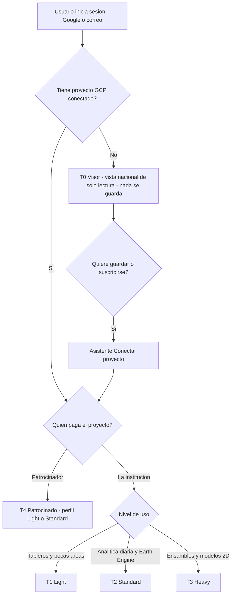
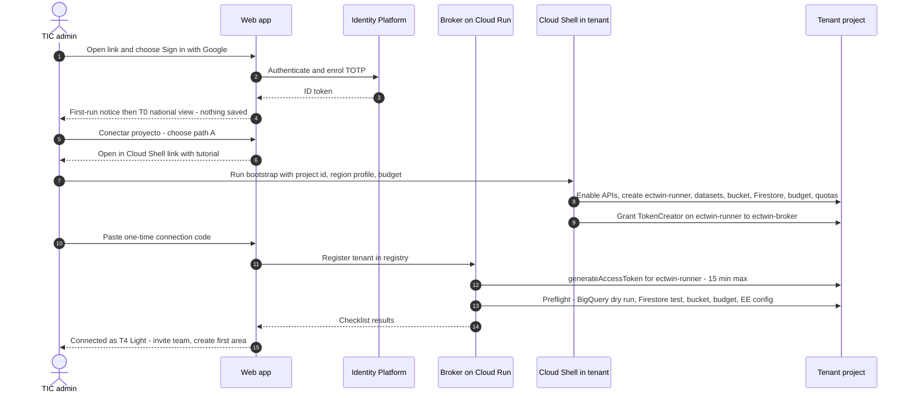
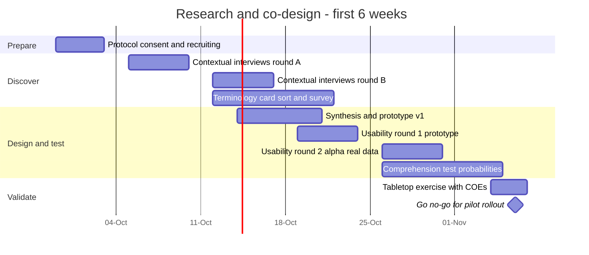

# Users, requirements and UX

This document defines who the *Gemelo Digital Ecuador – El Niño* (GDE-Niño, "Ecuador El Niño Digital Twin") is for, what they must be able to do, and how the product speaks to them. It covers personas, end-to-end user journeys, the access model (sign-in required; saving requires the user's own GCP project), numbered functional and non-functional requirements with priorities, phases and acceptance criteria, the information architecture, communication rules for Spanish-speaking risk managers, and the co-design plan for the first six weeks. It follows the shared design-spine decisions D1–D20, especially D1 (decision support, never alerts), D3 (probabilistic), D6–D9 (access and tenancy) and D19 (mobile-first, Spanish-first, accessible). Architecture, identity mechanics, data sources and costs are detailed in [03-architecture](./03-architecture.md), [04-identity-tenancy-byo-gcp](./04-identity-tenancy-byo-gcp.md), [05-data-catalog](./05-data-catalog.md) and [09-cost-model](./09-cost-model.md).

**Notation.** Two numbered series share the letter D. *Spine D1–D20* are the shared design decisions; they appear in the "Spine" column of §1 or as "spine Dn". *Disclaimer D1–D13* are the Spanish texts proposed in [§8.5](#85-disclaimer-texts-spanish-proposals), which other documents also cite by these keys; they appear as "disclaimer Dn". Requirement IDs (FR-, NFR-) are defined here and reused across the plan.

**Contents**

1. [UX principles](#1-ux-principles)
2. [Personas](#2-personas)
3. [Access model and tiers](#3-access-model-and-tiers)
4. [User journeys](#4-user-journeys)
5. [Functional requirements (FR)](#5-functional-requirements)
6. [Non-functional requirements (NFR)](#6-non-functional-requirements)
7. [Information architecture and main screens](#7-information-architecture-and-main-screens)
8. [UX and communication guidelines](#8-ux-and-communication-guidelines)
9. [User research and co-design plan (first 6 weeks)](#9-user-research-and-co-design-plan-first-6-weeks)
10. [Success metrics](#10-success-metrics)
11. [Open questions](#11-open-questions)

---

## 1. UX principles

| # | Principle | What it means in the product | Spine |
|---|---|---|---|
| UX-1 | **Oficial primero** | The official alert for the place being viewed (SNGR), quoted word for word, sits above every model output on every screen, PDF, WhatsApp card and API response. | D1 |
| UX-2 | **Apoyo a la decisión, nunca alerta** | Our own products are called *nivel de riesgo* or *probabilidad de impacto*. They are never called *alerta*, and they never use the official yellow, orange or red colours. | D1 |
| UX-3 | **Texto antes que mapa** | A three-line summary and a ranked list of places load before the map library. The first view works on a weak 3G connection. | D19 |
| UX-4 | **Probabilidad, no certeza** | Always show a probability, a range and a confidence rating. Never show one deterministic number on its own. Say which analog years are similar and how. | D3 |
| UX-5 | **Nunca solo color** | Every colour-coded item also has a number, a word and a pattern. | D19 |
| UX-6 | **Guardar = su proyecto** | Anything saved lives in the organisation's own GCP project. Signed-in users without a project can look, but nothing is saved for them. | D6, D7 |
| UX-7 | **Funciona en apagón** | Plan for rationed power and patchy mobile data. Provide offline cache, lightweight PDFs, WhatsApp cards and SMS fallbacks. | D19 |
| UX-8 | **Hablar el idioma del COE** | Use the vocabulary users already work in: *parroquia*, *cantón*, DPA codes, *mesas técnicas*, SITREP annexes and the bulletin formats already in use. Complement existing tools; don't duplicate them. | D2, D14 |

---

## 2. Personas

The personas below come from the research briefs, press reports on how the 2026 response is running, and existing tools. **None of them has yet been validated through interviews.** The needs assessments by CAF, IDB, the World Bank, UNDRR and the Anticipation Hub could not be retrieved (all blocked). Every persona is therefore a hypothesis to test in the co-design plan (§9).

### 2.1 Context that shapes every persona

- **Connectivity is uneven.** INEC ENEMDU for July 2024 reports: 66.0% of households have internet, 77.2% of people use it, 61.3% have an active mobile phone and **57.7% have a smartphone**. The urban–rural gap in internet use is about 28.4 percentage points (low confidence). ([source, citing ecuadorencifras TIC 2024](https://github.com/Gatumbac/GrowUp-Kidu)) Figures for the coastal provinces are **(unverified)**.
- **Power cuts are likely during the pilot.** The 2024 drought brought cuts of up to 14–15 h/day ([2024 blackouts](https://en.wikipedia.org/wiki/2024_Ecuadorian_blackouts)). On 28 Sep 2026 the Mazar reservoir stood at 2,134.2 masl; the 2024 blackouts began at about 2,115 masl ([Primicias](https://www.primicias.ec/economia/paute-ecuador-hidroelectrica-cota-embalse-mazar-estiaje-nivel-envivo-132362/)). Users may have to work from phones on battery.
- **COE staff have little time.** Press reports a nationwide red alert from 29 Aug 2026 (Res. SNGR-238-2026), telling GADs to activate provincial and cantonal COEs ([Primicias](https://www.primicias.ec/sociedad/alerta-roja-nacional-fenomeno-elnino-ecuador-2026-proyectado-magnitud-historica-131408/)). The resolution could not be confirmed from a primary source (see §11). Research sessions must be short and must go to the users.
- **Local authorities change soon.** Local elections were brought forward to **29 Nov 2026** ([Primicias](https://www.primicias.ec/politica/cne-elecciones-seccionales-ecuador-29-noviembre-119142/)). Tenant workspaces must survive a change of authorities, so they belong in org-owned projects (spine D7).
- **The official tools already exist.** These are alertasecuador.gob.ec and the "Alístate Ecuador" visualiser ([alertasecuador.gob.ec/el_nino/](https://alertasecuador.gob.ec/el_nino/)), SNGR's ArcGIS `COE2` services ([COE2 MapServer](https://sgrportal.gestionderiesgos.gob.ec/server/rest/services/COE2/MapServer)), the INAMHI GEOGloWS hydroviewer ([hydroviewer](https://inamhi.geoglows.org/apps/hydroviewer-ecuador/)) and SERVIR-Amazonia's PDF bulletin for SNGR. Personas already use them, so the twin links to or ingests them and never replaces them (spine D2). alertasecuador.gob.ec has no API found and, per a secondary header scan, its `X-Frame-Options` header blocks framing by other sites, so the twin links to it rather than embedding it ([05-data-catalog](./05-data-catalog.md)).

### 2.2 Persona summary

Access tiers T0–T4 are defined in §3.

| ID | Persona | Organisation | Key decisions (lead time) | Device / connectivity | Tier |
|---|---|---|---|---|---|
| P01 | National monitoring analyst | SNGR, national COE | Technical input to alert changes; where to pre-position kits; which provincial COEs to call (1–15 d, seasonal) | Dual-monitor desktop on fibre; smartphone for WhatsApp | T3 (org-owned SNGR project) |
| P02 | *Mesa técnica* lead | Provincial COE Guayas or Manabí | Pre-emptive evacuations, *albergues*, machinery requests (1–3 d) | Mid-range Android on variable 4G; laptop in COE room; printer | T4 → T2 |
| P03 | GIS / risk analyst | Segura EP, Guayaquil (metropolitan GAD) | Road and underpass closures, pumps, drainage, community pre-warning (hours–3 d) | GIS workstation (ArcGIS/QGIS); phone | T2 |
| P04 | Head of risk unit | Mid-size cantonal GAD (Portoviejo, Esmeraldas, Machala) | Activate cantonal COE; clear drains; evacuate riverbanks (hours–3 d) | Laptop and Android phone; unreliable office internet; power cuts | T4 (T1 profile) |
| P05 | Forecaster / hydrologist | INAMHI | Issues official *advertencias*; co-produces thresholds; verification (hours–15 d) | Workstation with Python/Jupyter; good connectivity in Quito | T3 (noncommercial) |
| P06 | Agricultural risk technician | MAG / AgroProtege insurance programme | Advisories, seed and feed pre-positioning, insurance claims triage (weeks–months) | Desktop; tablet in the field | T2 |
| P07 | Operations planner | CELEC EP / CENACE | Reservoir rules, thermal dispatch, imports, rationing (7–90 d) | Desktop; secure corporate network | T3 or path D (self-deployed) |
| P08 | Epidemiologist | MSP (zonal or district office) | Vector control, surge staffing, facility contingency (2–6 weeks) | Desktop and phone | T2 |
| P09 | Anticipatory-action officer | Cruz Roja Ecuatoriana / WFP / OCHA | Staged trigger activation, fund release, pre-positioning (3–10 d, seasonal) | Laptop and phone; field teams often offline | T2 |
| P10 | Operations manager / agronomist | Shrimp, banana or cacao exporter | Early partial harvest, stocking density, dykes, port logistics (1–15 d) | Smartphone in the field (WhatsApp); desktop at HQ | T1 → T2 (commercial) |
| P11 | Risk analyst | Insurer or bank | Portfolio exposure, claims surge, loan relief (weeks–seasonal) | Desktop; API/BI tools | T3 (commercial) |
| P12 | Researcher | University (e.g. ESPOL, EPN, USFQ, UCuenca) | Studies, theses, verification (no operational decisions) | Laptop on campus network | T1–T2 (noncommercial) |
| P13 | Tenant IT administrator | IT (TIC) unit of a GAD or ministry | Connect the project, control cost, comply with EGSI and LOPDP | Desktop | Owner of a T1–T4 tenant |
| P14 | Platform operator / support | Platform team | Tenant health, incidents, onboarding support | Desktop | Platform (no tenant data) |
| N01 | *Not a user:* journalist or member of the public | Media, citizens | — | — | T0 at most (see card) |

### 2.3 Persona cards

**P01 — National monitoring analyst, SNGR (national COE)**
- *Goals.* A single national picture of where impacts are likely in the next 1–15 days. Technical annexes ready to paste into SITREPs. Tracking of the 17 provinces, 143 cantons and 491 parishes below 1,500 m placed under the yellow alert of 18 May 2026, and of every later escalation ([alertasecuador](https://alertasecuador.gob.ec/el_nino/situacion-actual-de-el-nino/)).
- *Decisions supported.* Technical basis for alert changes (only SNGR declares alerts). Pre-positioning of kits and warehouses. Which provincial COEs to call first.
- *Pains.* Sources are scattered across INAMHI visor, hydroviewer, ERFEN PDFs, SITREP PDFs and WhatsApp. There is no probabilistic impact view. SNGR's credibility suffered after the 2023-24 over-forecast. Night-time data wrangling. ArcGIS layer IDs get renamed.
- *Key screens.* Mapa, Alertas oficiales, Impactos, Reportes.
- *Success signal.* The national brief is assembled in ≤20 min (target, to validate).

**P02 — *Mesa técnica* lead, provincial COE (Guayas / Manabí)**
- *Goals.* Know which cantons and parishes will be hit in the next 72 h. Prepare the morning COE session (07:30 in the journeys below is illustrative). Coordinate cantonal COEs.
- *Decisions supported.* Pre-emptive evacuation in high-vulnerability sectors, opening *albergues*, machinery requests. The MTT numbering (MTT1–MTT7, GT1–GT3) is **(unverified)**.
- *Pains.* Works from a phone in the field. WhatsApp overload. PDFs too heavy for weak signal. Different numbers from different agencies.
- *Tier.* Starts on a sponsor-provided project (T4), then moves to the prefecture's or governorate's own project (T2).

**P03 — GIS / risk analyst, Segura EP (Guayaquil)**
- *Goals.* Combine rain, high tide (*aguaje*) and the El Niño sea-level anomaly with Segura EP's own layers. ERFEN reported a coastal-station anomaly of +40 cm on 20 Aug 2026, against +42 to +47 cm in 1997-98, and 11 tidal-flooding events on 13–16 Aug, 7 of them in Guayas ([Primicias](https://www.primicias.ec/sociedad/fenomeno-elnino-ecuador-ascenso-nivel-mar-inundaciones-erosion-playas-calentamiento-oceano-invierno-131023/); search summary, not yet checked against tide-gauge data). The Segura EP layers are `Zonas_Inundables`, `Vías_Inundables` and `Puntos_vulnerables_por_marea_alta` ([pipeline using them](https://github.com/Dass-19/Godzilla-EnsoStreamingPipeline)).
- *Decisions supported.* Closing roads and underpasses, deploying pumps, timing pre-warnings to communities.
- *Pains.* High tide blocks gravity drainage, and the existing layers are static.
- *Needs.* OGC/ArcGIS feeds and an API (FR-023, FR-069).

**P04 — Head of risk unit, mid-size cantonal GAD (Portoviejo, Esmeraldas, Machala)**
- *Goals.* Know early about flash floods on the Portoviejo river and in Chone, about Esmeraldas river levels (INAMHI runs a 12-hour Random Forest level model at San Mateo, [repo](https://github.com/InformaticaInamhi/esmeraldas-forecasting-pipeline)), and about drainage in Machala.
- *Pains.* One to three staff covering many roles. No GIS specialist. No quick way to procure GCP. Turnover after 29 Nov 2026. Power cuts.
- *Tier.* T4 sponsored project with T1 capabilities; the canton's daily PDF is the core product.

**P05 — Forecaster / hydrologist, INAMHI**
- *Goals.* Compare WeatherNext 3 and 2 with INAMHI's WRF, ECMWF and GEOGloWS. Bias-correct against stations. Verify.
- *Decisions supported.* INAMHI's official *advertencias*, which the twin shows and never overrides.
- *Pains.* The station API keeps only about 92 days. Compute is limited. No verification tooling.
- *Needs.* API and bulk downloads, verification dashboards (see [14-verification-and-validation](./14-verification-and-validation.md)), and co-authorship of thresholds (INAMHI `static/umbrales.json`, [visor_backend_public](https://github.com/InformaticaInamhi/visor_backend_public)).

**P06 — Agricultural risk technician, MAG / AgroProtege**
- *Goals.* Rainfall and flood exceedance per *parroquia*, masked by crop area.
  - MAG reports 494,274 ha of crops highly exposed to floods and 606,584 ha to landslides ([El Universo](https://www.eluniverso.com/noticias/economia/plan-contingencia-ecuador-fenomeno-el-nino-ministerio-de-agricultura-nota/)).
  - AgroProtege subsidises crop insurance: US$24.5M over 2026–2029 covers 60% of premiums for up to 500,000 ha, underwritten by Hispana de Seguros y Reaseguros and Equisuiza ([El Oriente](https://www.eloriente.com/articulo/ecuador-destinara-usd-245-millones-a-un-seguro-agricola-para-mitigar-el-impacto-del-fenomeno-de-el-nino/58045)). Reports of the sum insured conflict (US$400M vs US$800M).
- *Pains.* No parcel-level data. How AgroProtege's triggers are designed (parametric or indemnity) is **(unverified)**.
- *Key screens.* Impactos (agriculture), Escenarios (triggers), seasonal outlooks.

**P07 — Operations planner, CELEC EP / CENACE**
- *Goals.* Inflow ensembles 7–90 days ahead for Paute–Mazar–Sopladora and Coca Codo Sinclair. The number of days until Mazar crosses a set level, such as the ≈2,115 masl level at which the 2024 blackouts began (spine D4b); Mazar stood at 2,134.2 masl on 28 Sep 2026.
- *Pains.* Two El Niño effects at once: floods on the coast and drought in the Austro and Amazon basins. Seasonal forecast skill is modest. Operational data is confidential.
- *Tier.* T3, or a fully self-deployed copy (path D) if corporate policy requires it.

**P08 — Epidemiologist, MSP**
- *Goals.* Dengue and leptospirosis risk by canton. By epidemiological week 35 of 2026 there were 32,576 dengue cases and 35 deaths ([Radio Pichincha](https://www.radiopichincha.com/miles-casos-dengue-muertes-ecuador/)). At least 460 health facilities are at risk ([Primicias](https://www.primicias.ec/sociedad/fenomeno-elnino-riesgo-hospitales-centros-salud-ecuador-inundaciones-enfermedades-127047/)).
- *Pains.* Case data reportedly arrives weekly and only as PDF gazettes **(unverified)**. Health data is sensitive personal data under the LOPDP, so only aggregates may leave MSP's own project.

**P09 — Anticipatory-action officer (Cruz Roja Ecuatoriana / WFP / OCHA)**
- *Goals.* Monitor pre-agreed staged triggers and document activations. Precedent: the IFRC Early Action Protocol (EAP) for Ecuador was activated in Aug 2023 (CHF 114,418, 1,000 families), and its third trigger was reached in Nov 2023 ([Anticipation Hub](https://www.anticipation-hub.org/news/ecuador-activates-its-early-action-protocol-for-floods-related-to-el-nino)).
- *Pains.* Trigger inputs come from many sources, audits need a clear trail, and lead times are short (3–10 days).
- *Needs.* Trigger dashboards and evidence packs (FR-037, FR-072).

**P10 — Operations manager / agronomist, exporter (shrimp, banana, cacao)**
- *Goals.* Farm-cluster forecasts and access-road status.
  - Of 3,431 shrimp farms, 2,977 (86.8%) are flood-susceptible ([Primicias](https://www.primicias.ec/economia/camaroneras-ecuador-riesgos-inundaciones-fenomeno-elnino-133353/)).
  - Banana growers face Black Sigatoka and drainage problems; Acorbanec has asked prefects for dredging and road maintenance ([El Universo](https://www.eluniverso.com/noticias/economia/banano-fenomeno-del-nino-riesgo-provincias-los-rios-el-oro-guayas-santa-elena-ecuador-2026-nota/)).
- *Decisions supported.* Early partial harvest, lower stocking density, reinforcing dykes, port logistics.
- *Pains.* Commercial users must be blocked from non-commercial layers (spine D15). Commercial Earth Engine costs money. Short on time.
- *Tier.* T1, then T2 on a commercial profile.

**P11 — Risk analyst, insurer or bank**
- *Goals.* Portfolio exposure by branch and *parroquia*, planning for a surge in claims, loan relief. For scale: BanEcuador lent US$634.2M to 131,199 clients in 2025 ([source](https://github.com/espinosacodes/makers-builder-case)).
- *Pains.* Needs evidence packs it can reproduce. Licence obligations.
- *Tier.* T3 commercial; uses the API.

**P12 — University researcher**
- *Goals.* Download subsets, build models (e.g. OpenHydroNet), contribute to verification.
- *Pains.* Cost. The BigQuery sandbox rejects queries based on the upper-bound cost estimate. Licences.
- *Tier.* T1–T2 noncommercial: Earth Engine Community or Contributor tier; Google Cloud research credits of up to US$5,000 ([cloud.google.com/edu/researchers](https://cloud.google.com/edu/researchers)), with eligibility of Ecuadorian universities **(unverified)**.

**P13 — Tenant IT administrator (GAD or ministry TIC unit)**
- *Goals.* Connect the project with least privilege, keep costs predictable, comply with EGSI v3 and LOPDP.
- *Pains.* Domain-restricted sharing in newer organisations. SERCOP procurement. Google LLC (USA) is the contracting entity for Ecuador ([google-entity](https://cloud.google.com/terms/google-entity)), with 15% IVA and ISD on top. Unfamiliar with GCP.

**P14 — Platform operator / support.** Watches onboarding, feed health and incidents from the operator console. Has no access to tenant content (FR-064).

**N01 — Journalist or member of the public: not a design target.**
- The WeatherNext data is "not intended for consumer use" and "in no way replaces official alerts" ([terms](https://storage.googleapis.com/weathernext-public/terms-of-use.pdf)).
- Only SNGR declares alerts (spine D1).
- Consumer-facing disclaimers may be void under consumer-protection law (LODC Art. 43, see [13-governance-legal-risk](./13-governance-legal-risk.md)).
- Anyone with a Google account can still sign in and reach T0. The mitigations are:
  - the first-run acknowledgement (FR-004);
  - the permanent official-alert band (FR-040);
  - a press FAQ that sends the public to alertasecuador.gob.ec;
  - no public share links. Content leaves only as PDFs and cards that a tenant has signed off.

---

## 3. Access model and tiers

### 3.1 Rules

1. **Sign-in is required** for everything except the landing page, legal notices, the status page and help (spine D6). Users sign in with Google or with email and password through Identity Platform. TOTP MFA is required for tenant Owners, Admins and *Firmantes técnicos* (FR-002).
2. **A signed-in user with no connected project is at T0.** They get a read-only national view built only from Commons products.
   - **Nothing is saved on any server** (spine D6). Language and the first-run acknowledgement are kept only in the browser. The only central record is the Identity Platform account itself (uid, email), which exists for every signed-in user.
   - Every save action instead shows disclaimer D9 (§8.5).
3. **Saving anything requires the organisation's own GCP project** (spine D7). This covers views, AOIs, rules, subscriptions, reports, runs and audit logs, all stored in that tenant project. Organisations should use org-owned projects so the workspace survives staff changes and the post-29 Nov 2026 change of authorities.
4. **Connecting a project** uses paths A–D (spine D8). The broker's only standing permission is `roles/iam.serviceAccountTokenCreator` on `ectwin-runner@<TENANT_PROJECT>.iam.gserviceaccount.com`. The mechanics are in [04-identity-tenancy-byo-gcp](./04-identity-tenancy-byo-gcp.md).
5. **The tenant pays for its own usage.** The quota project is always the tenant project. Cost guardrails are installed at bootstrap (monthly budget with 50/90/100% alerts, BigQuery `QueryUsagePerDay` custom quota, Earth Engine daily EECU cap), and the broker sets `maximumBytesBilled` on every job it issues. Budgets alert but do not cap spend ([budgets](https://docs.cloud.google.com/billing/docs/how-to/budgets)), and custom quotas and the EECU cap are approximate, so tenants are told they can still overspend.



### 3.2 What each tier can do

Cost figures are the plan's anchors (see [09-cost-model](./09-cost-model.md)), before taxes: 15% IVA; ISD 2.5–5% **(verify with SRI)**.

| Capability | T0 Viewer | T1 Light | T2 Standard | T3 Heavy | T4 Sponsored |
|---|---|---|---|---|---|
| National map, official alerts, ENSO panel | Yes | Yes | Yes | Yes | Yes |
| Parish exceedance probabilities and *nivel de riesgo* (Non-Retrievable Commons products) | Yes | Yes | Yes | Yes | Yes |
| Daily canton PDF and WhatsApp card (pre-generated in Commons) | View and download | Yes, plus own branding | Yes | Yes | Yes |
| Analog years, SFINCS scenario library (view) | Yes (library from Phase 2) | Yes | Yes | Yes | Yes |
| Save views, AOIs, preferences | No | Yes | Yes | Yes | Yes |
| Subscriptions and notifications | No | Yes | Yes | Yes | Yes |
| Sharing, comments and roles within the tenant | No | Yes | Yes | Yes | Yes |
| Report builder with *firma técnica* sign-off | No | Basic | Full | Full | As profile |
| AOI pipelines (Cloud Run jobs in tenant) | No | 1–3 AOIs, daily | Many AOIs, daily | Hourly and custom | As profile |
| Earth Engine analytics in own project | No | Optional (Community tier if noncommercial; Limited plan if commercial) | Yes | Yes | As profile |
| Own WeatherNext linked datasets (fan charts, percentiles) | No | Optional | Yes | Yes, plus full ensembles from Requester-Pays GCS | As profile |
| Own Flood Forecasting API key | No | No | Optional | Optional | No |
| Trigger dashboards and evidence packs | No | View | Yes | Yes | As profile |
| 2D hydraulic runs, WN2 on-demand scenarios, custom models | No | No | No | Yes | No (unless sponsor agrees) |
| Downloads | Daily PDFs | Parish/AOI tables | Plus bulk to own bucket | Plus bulk and full ensembles | As profile |
| REST / OGC API | No | Read, limited | Yes | Yes | As profile |
| Proyecto y costos dashboard; audit log | No | Yes | Yes | Yes | Yes (sponsor view too) |
| SAML/OIDC single sign-on (Identity Platform tier 2; MAU cost falls on the platform project) | No | No | Optional | Optional | No |
| Typical monthly cost to the tenant | US$0 | ≈ US$0–14 | ≈ US$20–60 | ≈ US$540–800 (peak ≈ 1,070–1,210) | Paid by sponsor |
| Typical personas | Anyone signed in; N01 | P10, P12 | P02, P03, P06, P08, P09 | P01, P05, P07, P11 | P02, P04 |

### 3.3 Data rights by tier

| Content | T0 | T1–T4 without own WeatherNext approval | Tenants with own WeatherNext approval |
|---|---|---|---|
| WeatherNext-derived exceedance probabilities and indices (Non-Retrievable Value-Added Service) | Yes, with required citation | Yes | Yes |
| WeatherNext data relating to times ≥1 h in the past (historic, CC BY 4.0) | Aggregates only (product choice) | Aggregates only (product choice) | Yes |
| Real-time WeatherNext data (relating to times <1 h ago or in the future, which includes every forecast still valid ahead): raw fields, percentiles, point time series | No | No | Yes, for internal use. Anything shared or exported carries a copy of the terms, the "Legally Binding Terms of Use" text file, "Copyright 2024-6 Google LLC" and a notice of modifications (disclaimer D5) |
| Layers licensed CC BY-NC(-SA) (e.g. GEOGloWS return periods) | View only (noncommercial platform context; no download) | Only on a noncommercial profile | Only on a noncommercial profile |

Source: [WeatherNext terms](https://storage.googleapis.com/weathernext-public/terms-of-use.pdf) §§2–4; licence gating spine D15. The terms treat colouring, sub-setting or recombining time steps, parameters or model runs as *unmodified* data, not a value-added service, so a coloured map of raw real-time fields is never shown at T0.

### 3.4 Roles within a tenant

App roles are stored in the tenant's Firestore (`members/{uid}`); whether the platform registry also mirrors a coarse role for routing is an open reconciliation with [04](./04-identity-tenancy-byo-gcp.md) (§11). App roles need no GCP IAM. Only the person who runs the bootstrap needs IAM roles on the tenant project: project Owner is simplest, the minimum set is in [04 §5.3.3](./04-identity-tenancy-byo-gcp.md), and creating the budget needs project Owner/Editor or a billing-account role.

| Role (UI) | Can do | MFA |
|---|---|---|
| *Propietario/a* (Owner) | Connect or disconnect the project, set the organisation profile, manage members, approve costly runs. **At least 2 per institutional tenant.** | Required |
| *Administrador/a* | Members, integrations (email, WhatsApp, SMS), budgets view, retention | Required |
| *Analista* | AOIs, rules, runs within the cost cap, report drafts, downloads | Optional |
| *Firmante técnico* (a flag combinable with *Analista* or above) | Signs off reports and evidence packs before they are shared outside the tenant | Required to sign |
| *Lector/a* | View, download PDFs and cards, comment | Optional |
| *Auditor/a* | Read the audit log and evidence packs | Recommended |

---

## 4. User journeys

Each journey lists the actor, the trigger, the steps with timing, the failure paths and the requirements it exercises. Times are America/Guayaquil (ECT, UTC−5).

### J1 — First sign-in and project connection (GAD Portoviejo)

**Actors:** P13 (IT administrator) with P04. **Trigger:** the sponsor sends an invitation link on 2026-10-20. **Precondition:** the GAD has either no GCP project or an approved sponsored project request.



1. **Sign in (≈3 min).** The admin opens the link, signs in with Google (or with email plus verification), enrols TOTP (FR-002) and reads the first-run notice with disclaimers D2 and D3 (FR-004).
2. **T0 view (≈1 min).** They land on Mapa, national view, with the badge "Modo visor – nada se guarda".
3. **Organisation profile (≈2 min).** They start "Conectar proyecto" and choose organisation type (GAD cantonal), use (noncommercial public-sector operations) and sector. This sets the data-licence profile (FR-012). The screen explains that Earth Engine applies its own, stricter test: it requires operational teams to register for **commercial** use, so COE operations probably need the Limited plan (usage fees only, US$0.40/EECU-h for the first 10,000 h, [pricing](https://cloud.google.com/earth-engine/pricing)). The noncommercial tiers are Community (150 EECU-h/month), Contributor (1,000 EECU-h/month, billing account required but not charged) and Partner (100,000 EECU-h/month, by application, for NGOs, university and government *research* groups); they apply to research or non-operational work ([noncommercial tiers](https://developers.google.com/earth-engine/guides/noncommercial_tiers)).
4. **Project source (≈1 min).** Three choices: "Tengo un proyecto con facturación", "Solicitar proyecto patrocinado (T4)" or "Crear uno". The last one links to the procurement kit ([12-roadmap-team-budget](./12-roadmap-team-budget.md)).
5. **Path choice (≈1 min).**
   - Path A, "Abrir en Cloud Shell", is the default for institutions.
   - Path B, "Conexión en un clic", uses a one-time OAuth consent with `cloud-platform`. The screen says in plain Spanish that no permanent token is stored.
6. **Run the bootstrap (≈8–12 min, estimate).** Cloud Shell opens with the repository and tutorial. The admin enters `PROJECT_ID`, region profile (Firestore defaults to `southamerica-west1`, FR-013; bucket and Cloud Run jobs default to `us-central1`; BigQuery is fixed to `US`, spine D10) and a monthly budget (default US$20, an estimate sized to the T1/T4-Light anchor of ≈US$0–14/month). The script ([10-setup-and-deployment](./10-setup-and-deployment.md)) creates:
   - `ectwin-runner`;
   - the BigQuery datasets `ectwin` and `ectwin_scratch` in `US`;
   - `gs://<TENANT_PROJECT>-ectwin`;
   - the Firestore `(default)` database;
   - the Commons linked dataset `ectwin_commons` (plus `ectwin_commons_nc` on noncommercial profiles), through an Analytics Hub subscription in `US`;
   - the budget and quotas;
   - the single Token Creator grant.
7. **Connect (≈1 min).** The admin pastes the one-time code. The broker mints a token and runs the preflight checks (FR-009): green, amber or red, each with a fix in Spanish.
8. **Earth Engine (≈3 min, browser step).** If `registrationState` is `NOT_REGISTERED`, the wizard opens `https://code.earthengine.google.com/register?project=<ID>` with guidance on which plan to pick.
9. **Optional access requests (FR-011).**
   - The WeatherNext Data Request form is per Google account and usually takes 5–7 business days. Once approved, that human account (not `ectwin-runner`) subscribes to the `weathernext_3` and `weathernext_2` linked datasets in the tenant project.
   - The Flood Forecasting API waitlist is per project and may take months.
   - The tracker records each request's status. Nothing here blocks onboarding, because Commons products work without these approvals.
10. **Team (≈3 min).** The admin invites P04 as *Propietario* (second owner) and two *Analistas* (FR-014).
11. **First save (≈2 min).** P04 creates "Mi área: Cantón Portoviejo" from DPA 1301 (illustrative code; confirm against INEC) and subscribes to the daily PDF at 06:00 and to official-alert changes.

**Failure paths**
- The bootstrap fails with `iam.allowedPolicyMemberDomains`. The wizard generates a one-page exception request for the organisation admin, or offers path C (WIF) (FR-007).
- The user has no billing account. The wizard redirects to the T4 request (FR-010).
- The user lacks permissions. The wizard lists the exact roles needed.
- The OAuth app is not yet verified. The wizard explains the warning screen and recommends path A.

**Journey acceptance:** in usability tests, the median time from a prepared admin's sign-in to a green checklist is ≤30 min (path A) and ≥85% succeed without live support.

### J2 — Morning COE brief (provincial COE Guayas)

**Actor:** P02. **Trigger:** 06:15 notification "Reporte diario listo".

1. **06:15.** A push notification and an email with the canton PDFs (≤500 KB each) arrive (FR-044, FR-055).
2. **06:20, on the phone over 4G.** The app shows, in order (FR-018, FR-040):
   - the **official alert band**: SNGR alert state verbatim, resolution number, time;
   - the three-line summary for Guayas for the next 72 h;
   - the cantons ranked by *nivel de riesgo* ("Nivel 3 de 4 – Alto"), each with the probability of passing the INAMHI threshold and a confidence rating.
3. **06:25.** They tap one canton (e.g. Daule). The screen shows the parish table, river status (GloFAS/GEOGloWS return-period class, Flood API gauge if available, link to the INAMHI hydroviewer) and the next *aguaje* windows (FR-026, FR-031). They tap "¿Por qué este nivel?" to see the contributing factors (FR-033).
4. **06:35.** They check "Alertas oficiales" for any new INAMHI *advertencia* (FR-041). If the platform's level differs from the official alert, the divergence note (disclaimer D7) appears (FR-043).
5. **07:00, in the COE room on a laptop.** Under Reportes they choose the "Informe matutino COE" template and select 6 cantons. They add a two-line analyst note and send it for *firma técnica* (FR-046). The signer approves it on their phone.
6. **07:15.** They export the PDF and the WhatsApp card and share both with the COE WhatsApp group (FR-045). The accompanying text message is sent too.
7. **07:30.** In the COE session they present in presentation mode (FR-047).
8. **08:15.** In the tenant's bitácora they record decisions such as "MTT solicita maquinaria para vía X" (FR-059).

**Edge cases**
- The official feed is stale. Disclaimer D8 replaces the status line (FR-042).
- The network drops. The last PDF and summary are served from the offline cache (NFR-025).

**Journey acceptance:** the brief (steps 2–6) takes ≤10 min for a trained user; ≥95% of test users correctly say which item is the official alert.

### J3 — Event night (Portoviejo flash flood)

**Actors:** P04 (duty officer) and P02. **Trigger:** 21:40, an AOI rule fires.

1. **21:40.** Notification: "Portoviejo · Nivel 3 de 4 (Alto) · probabilidad de superar 50 mm en 6 h: 70 % · río Portoviejo en ascenso · apoyo a la decisión, no es alerta oficial". The 50 mm threshold is illustrative; real thresholds come from INAMHI or the tenant.
2. **21:42.** They tap "Activar modo evento" (FR-059, Phase 2; in Phase 1 the same steps run in the normal Mapa view). The screen is stripped to the official band, the rainfall nowcast (INAMHI stations every hour; IMERG Early, GSMaP NRT and the Oya nowcast as available, FR-028), river reaches, the bitácora and the report queue. The view re-polls every 10 min; each source updates at its own cadence (§6.2).
3. **21:50 (Phase 2).** The nearest matching SFINCS scenario for Portoviejo shows which streets are likely to flood, with its return-period assumption and caveat (FR-035).
4. **22:10 (Phase 2).** Incoming field and ECU 911 narratives are pseudonymised (Cloud DLP, spine D18) and triaged by Jev into typed records (e.g. *desbordamiento*, *personas atrapadas*). Records scored 0.30–0.70 go to the human review queue with disclaimer label D13 (FR-061). An analyst confirms two records and they appear on the map.
5. **22:30.** INAMHI issues an *advertencia*. It appears in the official band and in Alertas oficiales within 20 min of becoming reachable (FR-040, §6.2).
6. **23:05.** Power is cut in part of the city. The officer switches to their phone, and "Ahorro de datos" mode activates automatically (NFR-024). Pages turn into text; the map loads only on request.
7. **00:30.** They export a situation snapshot PDF with timestamps for the cantonal COE and SNGR (FR-046). It needs *firma técnica* before it goes outside the tenant.
8. **04:00.** They write a hand-over note in the bitácora for the next shift.
9. **Next day, 10:00.** "Reportar observación" (FR-075) captures observed flooded streets and a rain-gauge photo. These feed verification.

**Rule.** The platform never recommends or words an evacuation order. When the tenant has loaded its own contingency plan, it shows "Según su plan de contingencia, este nivel corresponde a: …", which is the tenant's text, labelled as such.

### J4 — Parametric / anticipatory trigger check

**Actors:** P09 (Cruz Roja / WFP) every Monday at 09:00; P06 and P11 for AgroProtege-style cover **(trigger design to confirm)**.

1. They open Escenarios → Disparadores (FR-037). The tenant's trigger set has three stages. The thresholds below are placeholders to agree with each partner.
   - **Stage 1, readiness (seasonal).** The ICEN category is "fuerte" or above, *or* the CPC probability of a very strong event is ≥ X%.
   - **Stage 2, pre-activation (days 5–15).** The WeatherNext probability of more than Y mm in 10 days is ≥ Z% in ≥ N target parishes.
   - **Stage 3, activation (days 1–10).** A GloFAS forecast (30-day horizon) of at least a 5-year return period with 3–10 days' lead, or a Flood API forecast of the same class with 3–7 days' lead (its horizon is 7 days), in target reaches.
2. Each row shows the current value, the threshold, the source, the issue time, its status (*cumple* / *no cumple* / *indeterminado* / *sin datos*) and backtest hit and false-alarm rates (see [07](./07-impact-modules-and-triggers.md) and [14](./14-verification-and-validation.md)).
3. **Data completeness check.** Any "sin datos" status blocks an automatic "cumple". The officer must record a justification.
4. They press "Generar paquete de evidencia" (FR-072). This produces:
   - JSON and PDF;
   - dataset versions, `init_time`, model versions (e.g. `jev-1.13.0` if used), the rule definition and a SHA-256 hash;
   - storage in `gs://<TENANT_PROJECT>-ectwin/evidence/`.
5. **Four-eyes sign-off.** Two *Firmantes técnicos* approve. The pack can then be shared with partners as PDF.
6. Status changes notify the subscribed people (FR-055).

**Journey acceptance:** re-running the evidence pack reproduces every value byte for byte, and the whole check takes ≤15 min.

### J5 — AOI for a shrimp-farm cluster (El Oro)

**Actor:** P10, on a commercial T2 tenant with the Earth Engine Limited plan.

1. Mi área → "Nueva área" → upload a KML with 12 farm polygons exported from the company's GIS (FR-050). Invalid rings are repaired, and the areas are grouped as "Clúster Santa Rosa".
2. **Auto-enrichment within ≤2 min (FR-051):**
   - intersecting parishes (DPA);
   - adjacent river reaches (`hybas_` id and GEOGloWS `river_id`);
   - nearest INAMHI stations and tide reference;
   - access-road segments from the national exposed-roads inventory (3,113 km highly exposed, [El Diario](https://www.eldiario.ec/ecuador/carreteras-de-ecuador-3113-km-riesgo-inundaciones-deslizamientos-22092026)).
3. **Template "Camaronera" (FR-052).** Default rules, each editable, all illustrative:
   - 72-h rain above the INAMHI threshold with probability ≥ 50%;
   - river return period ≥ 2 years on an adjacent reach;
   - high tide plus sea-level anomaly above a set value;
   - water-temperature band for *P. vannamei* (about 26–32 °C, **unverified**).
4. **Licence check (FR-073).** Non-commercial layers (e.g. GEOGloWS return periods, CC BY-NC-SA) are hidden. Where there is no commercial-compatible substitute, the rule shows "No disponible para uso comercial".
5. **Cost preview (FR-066).** "Ejecución diaria estimada: US$ 0.0x por día en su proyecto" (estimate from dry-run bytes and EECU). The user confirms.
6. **Subscriptions.** Farm managers get WhatsApp messages through the company's own WhatsApp Business account (Phase 2, **provider and cost to confirm**). The owner gets email.
7. **First run (FR-053).** Results are ready ≤15 min later. The Mi área dashboard shows, for example, "Próximos 7 días: Nivel 2 de 4 – Moderado · Acceso vía E25 (example): Nivel 3 de 4".
8. **Privacy (FR-054).** The polygons are organisational assets. No personal location is stored.

### J6 — Research download (university)

**Actor:** P12, on a noncommercial university project with research credits.

1. Datos → Descargas (FR-068, FR-070). They select:
   - "Probabilidades de excedencia por parroquia, 2026-10-01 → 2027-04-30" (Commons);
   - a WeatherNext 2 archive subset over the 2023-24 El Niño for the Ecuador bbox (lon −92.1…−75.1, lat −5.1…1.7, spine D13). Those fields relate to past times, so they are CC BY 4.0, but reading them from the BigQuery or Earth Engine assets still needs the researcher's own approved WeatherNext access (per Google account, §3.3).
2. They choose a format: GeoParquet, NetCDF or Zarr.
3. **Cost preview.** The platform shows dry-run bytes and the estimated cost, and warns that the **BigQuery sandbox rejects queries on the upper-bound estimate**, suggesting one column per query or enabling billing with a daily quota.
4. **Run.** The job runs in the tenant with `maximumBytesBilled` and exports to `gs://<TENANT_PROJECT>-ectwin/exports/<date>/`.
5. **Package.** It includes `LICENSES.txt`, attribution strings, the WeatherNext "Legally Binding Terms of Use" file and copyright line where applicable, dataset versions and suggested citation text.
6. **API alternative.** The same query can be copied as SQL or as an API call (FR-069).

### J7 — Hydro-energy weekly review (short)

- **Actor.** P07 opens Pronóstico → Energía (Phase 3 module, FR-034).
- **What they see.**
  - Mazar level against its reference levels (≈2,115 masl, the 2024 blackout onset).
  - Inflow ensemble fan charts for 7–90 days.
  - The RONI and Niño 3.4 outlook.
- **What they do.** They export the evidence pack for the weekly operations meeting. Operational data stays in CELEC's own project, or in a self-deployed copy (path D).

### J8 — INAMHI co-production and verification (short)

- **Actor.** P05 reviews the weekly verification dashboard (Phase 2), which compares WeatherNext 3 and 2, ECMWF and INAMHI WRF against stations.
- **What they can change.** They propose threshold edits through a reviewed change request; nothing is edited directly.
- **What they cannot change.** The twin's official-alert band never shows INAMHI *advertencias* as anything but INAMHI's own text.

### J9 — Invited member and T0 viewer (short)

- **Invited analyst (P02 colleague).** They open the invitation email (valid 7 days, FR-014), sign in with Google or email/password, read the first-run notice (FR-004) and land directly in the tenant with the *Analista* role. MFA is optional unless they are also a *Firmante técnico* (FR-002). Their first save goes to the tenant's Firestore; nothing about them is stored centrally beyond the Identity Platform account and the tenant membership needed for routing (NFR-013).
- **T0 viewer (for example a provincial technician whose institution has no project yet).** They sign in and see the "Modo visor – nada se guarda" badge, the national map, official alerts, the ENSO panel, parish probabilities and the daily PDFs. When they tap *Guardar*, *Suscribirse* or *Nueva área*, disclaimer D9 explains that saving needs an institutional Google Cloud project, with two buttons: "Conectar proyecto" (J1) and "Solicitar proyecto patrocinado" (FR-010).
- **Acceptance.** In usability tests, ≥90% of T0 participants can say why their work was not saved and how to change that.

---

## 5. Functional requirements

### 5.1 Conventions

- **Priority (MoSCoW):**
  - M = Must;
  - S = Should;
  - C = Could;
  - W = Won't in this cycle.
- **Phase** follows the plan timeline (see [12-roadmap-team-budget](./12-roadmap-team-budget.md)):
  - 0 = mobilise, 29 Sep – 16 Oct 2026 (access requests, research weeks W1–W3; no user-facing release);
  - 1 = MVP "Monitoreo y Exposición", 19 Oct – 27 Nov 2026;
  - 2 = peak-season operations and impact modules, Dec 2026 – Apr 2027;
  - 3 = learn and extend, May – Sep 2027;
  - 4 = institutionalise, Oct 2027 onwards.
- **Trace** lists personas (P) and journeys (J).

Owning roles per area (staffing in [12-roadmap-team-budget](./12-roadmap-team-budget.md)):

| Area | Owner role |
|---|---|
| Authentication, onboarding, admin, cost | Platform and identity lead |
| Map, reports, notifications, accessibility | Front-end lead + UX lead |
| Forecasts, ENSO, verification displays | Forecast and data-science lead |
| Impacts, scenarios, triggers | Impact-modelling lead |
| Official alerts and partner feeds | Partnerships lead (SNGR/INAMHI liaison) |
| AI triage | AI decision-layer lead |
| Audit, licences, privacy | DPO / legal counsel + platform lead |

### 5.2 Requirements

**Authentication and account**

| ID | Requirement | Pri | Ph | Acceptance criteria | Trace |
|---|---|---|---|---|---|
| FR-001 | Every app screen, tile endpoint and API requires an authenticated Identity Platform session (Google or email/password). Only the landing page, legal notices, status page and help are public. | M | 1 | Unauthenticated requests to `/app/*`, `/api/*`, `/tiles/*` get a 401 or a redirect. The pen test finds no unauthenticated data route. Sign-in takes ≤3 screens. | All |
| FR-002 | TOTP MFA is mandatory for Owners, Admins, *Firmantes técnicos* (before signing) and platform operators, and optional for others. SMS MFA is off by default (US$0.16 per SMS to Ecuador after 10 free per day, [pricing](https://cloud.google.com/identity-platform/pricing)). | M | 1 | An Owner cannot finish onboarding without TOTP. Recovery codes are issued. Enrolments and resets are audited. | P13, J1, J9 |
| FR-003 | SAML/OIDC federation (Identity Platform multi-tenancy) for institutions that have their own identity provider. Tier 2 pricing: first 50 MAU free, then US$0.015/MAU, billed to the platform project ([pricing](https://cloud.google.com/identity-platform/pricing)). | S | 2 | A test ministry IdP signs users into the right tenant. The MAU cost is visible in the operator console. | P01, P07 |
| FR-004 | First-run acknowledgement: before the first view on each device, the user reads disclaimers D2 and D3 and taps "Entiendo". For T0 this is kept in browser storage only. | M | 1 | Every new device sees it. It is shown again after 90 days or when the disclaimer version changes. | All, N01 |
| FR-005 | Self-service for the central account record (uid, email, tenant memberships): view, export as JSON and delete, plus a form for LOPDP rights requests. | M | 1 | Deletion removes the Identity Platform user and registry rows within the statutory term **(to confirm)**. Requests are logged. | All |

**Onboarding and tenancy**

| ID | Requirement | Pri | Ph | Acceptance criteria | Trace |
|---|---|---|---|---|---|
| FR-006 | "Conectar proyecto" wizard offering path A (Open in Cloud Shell / Infrastructure Manager bootstrap) and path B (one-time OAuth consent with `cloud-platform` scope, access token only). | M | 1 | Median completion ≤30 min for path A and ≤10 min for path B in tests. No refresh token exists in any platform store (code review plus automated scan). | P13, J1 |
| FR-007 | Detect domain-restricted-sharing failures (`iam.allowedPolicyMemberDomains`). Generate a Spanish one-page exception request for the organisation admin, and offer path C (Workload Identity Federation). | M (note), S (WIF) | 1 / 2 | The error is recognised and mapped to guidance inside the wizard. WIF is validated with one ministry test organisation by 2027-01-31. | P13, P01 |
| FR-008 | Documentation and release artefacts for path D, a fully self-deployed copy with no standing operator access. | C | 3 | A tagged release with Terraform module and container digest. A test organisation deploys it from the docs alone in ≤1 day. | P07 |
| FR-009 | Preflight checks at connection and daily health checks: token mint on `ectwin-runner`, BigQuery dry run on `ectwin` and `ectwin_commons`, Firestore read/write, bucket, budget, quotas, Earth Engine `registrationState`. | M | 1 | Results are green, amber or red with a fix in Spanish. The daily result shows in Proyecto y costos. Two consecutive failures notify the tenant admin. | P13 |
| FR-010 | Sponsored project request (T4): a GAD or COE asks for a project in the sponsor's folder, and the sponsor approves it. The project is labelled `ectwin-tenant`, `ectwin-sponsor` and with its DPA code. | M | 1 | Request to approved project in ≤2 business days (target). Labels present. The procedure for moving billing to the GAD is documented. | P02, P04 |
| FR-011 | External-access assistant: steps and status tracking for Earth Engine registration (commercial or noncommercial), the WeatherNext form (per account, ≈5–7 business days), the Flood API waitlist (per project) and an optional TypeSafe key. | S | 1 | Each item shows its state (*no solicitado / enviado / aprobado / rechazado*) and date. Reminders at 7 and 14 days. | P13, P05, P12 |
| FR-012 | Organisation profile: sector plus commercial or noncommercial use. It drives licence gating (FR-073) and Earth Engine tier guidance. | M | 1 | The profile is mandatory before the first save. Only an Owner can change it, and changes are audited. | P10, P11 |
| FR-013 | Region profile: Firestore (personal and session data) defaults to `southamerica-west1`; `southamerica-east1` is the alternative, and `us-central1` comes with an LOPDP warning. BigQuery is fixed to `US`. | M | 1 | The region is shown in Proyecto y costos. The bootstrap refuses a mismatched BigQuery location. | P13 |
| FR-014 | Members invited by email with tenant roles (§3.4). | M | 1 | Invitations expire in 7 days. Role changes are audited. A warning shows when there is only one Owner. | P13 |
| FR-015 | Disconnect and offboarding: export all saved objects, guide the removal of the Token Creator binding, delete the registry entry. | M | 1 | Once the binding is removed the tenant shows "Desconectado" within 15 min, and its registry row is deleted within 24 h. | P13 |
| FR-016 | Hand-over workflow for changes of authority (e.g. after 29 Nov 2026): transfer the Owner role, review members, re-confirm the profile. | S | 1 | A test hand-over loses no data. A checklist PDF is produced. | P04, P13 |

**Map and layers**

| ID | Requirement | Pri | Ph | Acceptance criteria | Trace |
|---|---|---|---|---|---|
| FR-017 | National map (MapLibre GL, PMTiles) with INEC DPA boundaries and search by name, DPA code or coordinates, including Galápagos. The DPA reference files hold 24 provinces, 226 canton codes (221 cantonal GADs; the extra codes are probably non-delimited zones, **unverified**) and 1,041 parishes ([EcuDataMCP reference files](https://github.com/DweskZ/EcuDataMCP/tree/main/helpers/data)). | M | 1 | A name or code search returns the unit in ≤1 s (p95). Every DPA code in the reference files resolves. | All |
| FR-018 | Text-first rendering: the place summary and ranked list render before the map library loads. The map loads on request when the connection is slow or Save-Data is on. | M | 1 | On a throttled 3G profile the summary is visible before any map request. Initial transfer ≤200 KB (NFR-001). | P02, P04 |
| FR-019 | Layer catalogue with source, licence, attribution, update time, resolution, horizon, known skill and "¿Cómo leer esta capa?" for every layer. | M | 1 | A CI check against `catalog/data-sources.yaml` confirms every layer's metadata is complete. | All |
| FR-020 | Time control showing model run (`init_time`), valid-time window, lead time and "Actualizado hace …". Times are stored in UTC and displayed in America/Guayaquil (UTC−5), or Pacific/Galapagos (UTC−6) for Galápagos places (spine D14). | M | 1 | Every forecast layer shows both times. Galápagos parishes use UTC−6. | All |
| FR-021 | Swipe or compare two layers, times or scenarios. | C | 2 | Works on desktop and on screens ≥360 px wide. | P01, P05 |
| FR-022 | Optional 3D view (CesiumJS with Copernicus DEM). Google Photorealistic 3D Tiles only with the tenant's own Maps key. | C | 3 | Off by default. Never loaded over mobile data without the user opting in. | P03 |
| FR-023 | Publish platform layers as OGC services (WMS/WFS or OGC API Features/Tiles) and in an ArcGIS-compatible schema aligned with SNGR `COE2`. | S | 2 | Layers open in QGIS and ArcGIS Pro. SNGR confirms the schema fits **(to confirm)**. | P01, P03 |

**Forecasts and ENSO**

| ID | Requirement | Pri | Ph | Acceptance criteria | Trace |
|---|---|---|---|---|---|
| FR-024 | Parish exceedance probabilities for INAMHI thresholds, for 24 h and 72 h accumulations over days 1–15, from WeatherNext 3 (primary) and WeatherNext 2. Published from Commons as Non-Retrievable products. | M | 1 | Every parish has a probability class per lead day. Values are reproducible from Commons tables. No raw WeatherNext field reaches T0. | All |
| FR-025 | Ensemble fan charts (p10–p90 and mean) at a point or AOI, for tenants with their own WeatherNext linked datasets. | M | 1 | Shown only when the tenant's linked dataset exists. Carries the WeatherNext citation. Exports include the required terms files. | P03, P05, P11 |
| FR-026 | River status: GloFAS and GEOGloWS reach forecasts with return-period classes; Flood API gauges, flood status and flash floods when approved; deep link to the INAMHI hydroviewer. | M | 1 | The popup shows source, issue time, class and trend. Non-commercial return periods are hidden for commercial profiles. | P02, P04 |
| FR-027 | ENSO panel with Niño 1+2 / ICEN, Niño 3.4 / RONI, SOI and sea-level anomaly; links to the latest CN-ERFEN, ENFEN and CPC statements; a coupling / confidence indicator. Each value names its dataset and base period. | M | 1 | The panel updates within 24 h of each source release. Each value shows its dataset (e.g. ERSSTv5 or OISST) and climatology. | P01, P07, P09 |
| FR-028 | Observations and nowcast: INAMHI station rainfall (Phase 1; ≈2.5 h transmission lag); IMERG Early/Late, GSMaP NRT, GOES-19 imagery and the Oya precipitation nowcast (EE `projects/global-precipitation-nowcast/assets/global_estimation`) in Phase 2, with 1, 3, 6 and 24 h accumulations. | S | 1–2 | Each source shows its latency. Station data ≤3 h old is marked current. | P04, J3 |
| FR-029 | Sub-seasonal and seasonal outlooks per canton. Sub-seasonal (weeks 2–6): GEFSv12 to 35 days and CFSv2; ECMWF extended range where openly available **(open-data availability unverified)**. Seasonal (1–7 months): tercile probabilities from C3S multi-system, NMME and CFSv2, and GloFAS seasonal flows. | S | 2 | The canton table updates monthly and has a methodology page. Cantons whose hindcast RPSS is ≤0 are greyed out as "sin habilidad demostrada". | P06, P07, P09 |
| FR-030 | Confidence and skill display per product and lead time: the verification score plus a plain-language rating. Before scores exist, show "Verificación en curso". | M | 2 (placeholder in 1) | Scores come from Commons verification ([14](./14-verification-and-validation.md)) and refresh weekly in Phase 2. | All |
| FR-031 | Compound coastal panel for Guayaquil, Machala, Esmeraldas and Manta: INOCAR tide predictions, sea-level anomaly and rain, highlighting windows where heavy rain meets high tide. INOCAR publishes tide tables as quarterly PDFs with no stated licence, so reuse needs an INOCAR agreement **(to confirm)**. | S | 2 | A 7-day timeline with *aguaje* windows labelled. | P03 |

**Impacts**

| ID | Requirement | Pri | Ph | Acceptance criteria | Trace |
|---|---|---|---|---|---|
| FR-032 | Exposure per parish and AOI: population (Census 2022), buildings, schools, health facilities, roads and bridges, polling sites, crops, and shrimp farms where licensed. Reference totals reported for 2026: 3,873 schools and ≥460 health facilities at risk, 368 of 4,492 polling sites at risk, 3,113 km of state roads and 94 transport structures highly exposed (search summaries in the El Niño brief; [01](./01-context-el-nino-ecuador.md)). | M | 1 | Counts match source totals within ±1%. Each layer shows its source and date. | P01, P02 |
| FR-033 | *Nivel de riesgo* (1–4) per parish or AOI and horizon, combining hazard probability, exposure and vulnerability, with a "¿Por qué este nivel?" explanation. | M | 1 | Every classified unit has an explanation. The method is documented in [07](./07-impact-modules-and-triggers.md). | All |
| FR-034 | Sector modules: agriculture, shrimp, dengue and leptospirosis, landslides (LHASA), roads, hydro-energy. | S | 2–3 | Each module has an owner persona and a validation report before general availability. | P06–P08, P10 |
| FR-035 | Flood-extent scenario library (SFINCS) for Guayaquil/Durán, Machala, Portoviejo/Chone and Esmeraldas, matched to the current forecast. | S | 2 | The nearest match is shown with its return-period assumption and a caveat. | P03, P04 |

**Scenarios and triggers**

| ID | Requirement | Pri | Ph | Acceptance criteria | Trace |
|---|---|---|---|---|---|
| FR-036 | Analog-year viewer (1982-83, 1997-98, 2015-16, 2017 coastal, 2023-24): rainfall anomalies and recorded impacts for the selected area. | M | 1 (basic) | Disclaimer D6 is always shown. Sources are cited. | P01, P02 |
| FR-037 | Trigger dashboards with tenant-configured staged triggers. Each shows value, threshold, source, time, status and backtest hit and false-alarm rates. | S | 2 | A saved trigger set reproduces a historical backtest identically. Status changes notify subscribers. | P09, P06, P11 |
| FR-038 | What-if levers (pumps, reservoir rules, planting dates, pre-positioning) showing the change in impacts against baseline. | C | 3 | At least 2 levers validated with a partner. | P03, P07 |
| FR-039 | Requests for WeatherNext 2 perturbed-SST or custom-initial-condition runs (T3 only), with a cost estimate and an approval gate. | C | 3 | The estimate is within ±30% of the actual cost. Owner approval is required above a threshold. | P05, P11 |

**Official alerts**

| ID | Requirement | Pri | Ph | Acceptance criteria | Trace |
|---|---|---|---|---|---|
| FR-040 | An official-alert band at the top of every screen, PDF, WhatsApp card and API response: the SNGR alert state for the place, verbatim text, resolution number, issue time and source link. | M | 1 | The band is present in every template (visual regression tests). A new resolution shows ≤15 min after it becomes reachable. Its styling is never reused for platform products. | All |
| FR-041 | Official sources page listing SNGR resolutions and SITREPs, INAMHI *advertencias*, CN-ERFEN communiqués and INOCAR notices, with a history timeline. It links to alertasecuador.gob.ec rather than copying it. | M | 1 | Each item has issuer, timestamp and link. History goes back to 2026-05-18. | P01, P02 |
| FR-042 | If the official feed has not been confirmed for more than 6 h, show disclaimer D8 instead of a status and never infer an alert. | M | 1 | A simulated outage triggers disclaimer D8 within one polling cycle. | All |
| FR-043 | When the platform's *nivel de riesgo* differs from the official alert for the same place, show disclaimer D7. Never suppress or restyle the official alert. | M | 1 | Unit tests cover every combination of level and alert. | P01, P02 |

**Reports, PDF and WhatsApp**

| ID | Requirement | Pri | Ph | Acceptance criteria | Trace |
|---|---|---|---|---|---|
| FR-044 | Daily canton PDF (A4, ≤2 pages, ≤500 KB) pre-generated in Commons at 06:00 ECT for every canton (221 cantonal GADs, FR-017). Tenants can add their own branded version. | M | 1 | Available by 06:30 on ≥97% of days (NFR-007). Follows the template in §8.6. | P02, P04 |
| FR-045 | WhatsApp card: a 1080×1350 PNG ≤150 KB plus a plain-text message, shared through the device share sheet or a `wa.me` link. | M | 1 | Generated in ≤10 s. The text carries the same information as the image. | P02, P04, P10 |
| FR-046 | Report builder with templates (*Anexo SITREP*, *Informe matutino COE*, *Ficha sectorial*, *Paquete de disparadores*), analyst notes, *firma técnica* sign-off and versioning. | M (fixed template) / S (builder) | 1 / 2 | A signed report shows the signer's name, role and time. Unsigned reports cannot be exported externally when the template requires sign-off. | P01, P02 |
| FR-047 | Presentation mode for COE sessions: large type, no side panels, steps through selected cantons. | S | 1 | Legible from 4 m on a 1080p projector. | P02 |
| FR-048 | AI-drafted Spanish bulletin (Gemini Flash-Lite Batch) from structured data, with mandatory human review and disclaimer label D12. | C | 2 | No publish action until a reviewer approves. Numbers are inserted by code, not generated. | P01 |
| FR-049 | Print-friendly black-and-white rendering of all reports. | M | 1 | Levels 1–4 remain distinguishable in a greyscale print test. | P02, P04 |

**Areas of interest (Mi área)**

| ID | Requirement | Pri | Ph | Acceptance criteria | Trace |
|---|---|---|---|---|---|
| FR-050 | Create "Mi área" by drawing, buffering a point or line, uploading GeoJSON/KML/zipped Shapefile/GeoPackage (≤10 MB), or picking DPA units. Invalid geometries are repaired and areas can be grouped. | M | 1 | A 12-polygon KML upload completes in ≤30 s. Invalid geometry is repaired or explained. | P10, J5 |
| FR-051 | AOI enrichment: parishes, river reaches (`hybas_`, `river_id`), stations, tide reference, access roads and exposed structures. | S | 1 | Ready ≤2 min after saving. | P10, P03 |
| FR-052 | Sector rule templates (*camaronera*, *bananera*, *ciudad costera*, *embalse*, *parroquia rural*) with editable thresholds and lead times. | S | 2 | Edits are audited. A preview shows how often the rule would have fired last season. | P10, P06 |
| FR-053 | AOI pipelines run as Cloud Run jobs with Cloud Scheduler in the tenant project, under `ectwin-runner`, with run history, retries and cost per run. | S | 1 (T2+) | A run finishes ≤15 min after new forecast data arrives. 3 automatic retries. 90 days of history. | P10, P03 |
| FR-054 | Device geolocation is off by default. "Usar mi ubicación" only centres the map for the moment and is never stored. AOIs are organisational polygons. | M | 1 | No user latitude or longitude is found in any store (code review plus data scan). | All |

**Subscriptions and notifications**

| ID | Requirement | Pri | Ph | Acceptance criteria | Trace |
|---|---|---|---|---|---|
| FR-055 | Subscriptions to official-alert changes, INAMHI *advertencias*, AOI rules, the daily report, river-status changes and trigger status. Channels: web push and email (Phase 1); WhatsApp and SMS through tenant-owned provider accounts (Phase 2). | M | 1 | Subscriptions live in the tenant's Firestore. T0 users see the locked prompt (disclaimer D9). | P02, P04, P10 |
| FR-056 | Anti-fatigue rules: deduplication; at most 3 non-official notifications per AOI per 12 h; optional digest; quiet hours (default 22:00–06:00), which official changes bypass. | M | 1 | A simulated 48 h event stays within the configured counts. Official changes are always delivered. | All |
| FR-057 | Acknowledgement and escalation: high-priority notifications can require "Recibido", and escalate to a backup contact after N minutes. | S | 2 | Escalation fires within ±1 min of N in tests. | P02, P04 |

**Collaboration and event mode**

| ID | Requirement | Pri | Ph | Acceptance criteria | Trace |
|---|---|---|---|---|---|
| FR-058 | Share saved views, AOIs and reports within the tenant by role (Phase 1). Comments (Phase 2). | M / S | 1 / 2 | A Lector can open a shared item but cannot edit it. | P02, P03 |
| FR-059 | Event mode: simplified screen, 10-minute nowcast refresh, *bitácora* (event log) with timestamped entries and hand-over notes. | S | 2 | Entering event mode is logged. The *bitácora* exports to PDF. | P04, J3 |
| FR-060 | Cross-tenant sharing only through exported packages (PDF, GeoPackage, evidence pack) in Phases 1–2. Live sharing through Analytics Hub in Phase 3. | C | 3 | Every package carries its licence bundle. | P01, P02 |

**AI-assisted triage**

| ID | Requirement | Pri | Ph | Acceptance criteria | Trace |
|---|---|---|---|---|---|
| FR-061 | Jev triage of incoming narratives into typed records. Yes/no scores: below 0.30 no, 0.30–0.70 human review, above 0.70 yes. Choices abstain when the top option is below 0.60. Model pinned to `jev-1.13.0`; raw probabilities logged. See [08](./08-ai-decision-layer-jev.md). | S | 2 (shadow mode in 1) | The review queue shows the probability and disclaimer label D13. Accuracy is measured on a Spanish evaluation set before the feature is enabled, because the vendor notes say "English is best; other languages work with lower accuracy" ([api notes](https://github.com/aaddrick/building-with-typesafe-jev)). Narratives are pseudonymised (Cloud DLP) before any external call (spine D18). | P01, P04 |
| FR-062 | Analyst copilot (Gemini Flash) in Spanish, citing platform data, opt-in per tenant, with Cloud DLP pseudonymisation before any external call. | C | 3 | Every answer cites a dataset and version. Off by default. | P01, P05 |

**Administration**

| ID | Requirement | Pri | Ph | Acceptance criteria | Trace |
|---|---|---|---|---|---|
| FR-063 | Tenant admin console: members and roles, organisation and licence profile, region, integrations (email, WhatsApp, SMS), retention, external-access status. | M | 1 | Every admin action is audited (FR-071). | P13 |
| FR-064 | Operator console: tenant registry status, onboarding funnel, feed health, platform-wide incident banner. It gives no access to tenant content. | M | 1 | An IAM test shows the operator cannot read tenant Firestore or BigQuery. | P14 |

**Project and costs**

| ID | Requirement | Pri | Ph | Acceptance criteria | Trace |
|---|---|---|---|---|---|
| FR-065 | "Proyecto y costos" dashboard: month-to-date spend by service (from the tenant's billing export where enabled), budget state, BigQuery bytes today against the custom quota, Earth Engine EECU against the cap, projected month end, and a tax view (+15% IVA; ISD 2.5–5% **to confirm with SRI**). | M (budget, quotas) / S (full) | 1 / 2 | Figures within ±5% of the Cloud Billing console once billing data has landed (billing data and budgets lag actual usage; the lag is shown on screen). | P13 |
| FR-066 | Cost estimate and confirmation (disclaimer D10) before any job estimated above US$1 (configurable), showing BigQuery dry-run bytes at US$6.25/TiB on-demand (conservatively ignoring the 1 TiB monthly free tier). Dry runs on clustered WeatherNext tables over-estimate, so the UI labels them "máximo estimado". | M | 1 | No platform-issued BigQuery job lacks `maximumBytesBilled`. | P11, P12 |
| FR-067 | Guardrail automation: at 100% of budget, pause the tenant's Cloud Scheduler jobs rather than disabling billing. The Owner resumes them. | M | 1 | A test budget breach pauses jobs ≤30 min after the budget notification. | P13 |

**Data download and API**

| ID | Requirement | Pri | Ph | Acceptance criteria | Trace |
|---|---|---|---|---|---|
| FR-068 | Downloads: daily PDFs for T0; parish and AOI tables (CSV, GeoJSON, GeoPackage) for T1 and above; bulk exports (GeoParquet, NetCDF, Zarr, COG) to the tenant bucket for T2 and above. | M (tables) / S (bulk) | 1 / 2 | Every download includes `LICENSES.txt`, attributions and the WeatherNext files where applicable. | P12, P05 |
| FR-069 | REST API (OpenAPI 3.1) for parish probabilities, *niveles de riesgo*, AOI results and official alerts. Authenticated by Identity Platform ID token or a tenant-scoped key, with per-tenant rate limits. | S | 2 | Contract tests pass. Rate limits return 429. Every response includes `disclaimer` and `official_alert` fields. | P03, P11 |
| FR-070 | Research downloads from Commons through the Analytics Hub listing or Requester-Pays GCS, with cost preview and citation text. | S | 2 | Dry-run cost is shown before export. The citation includes dataset versions. | P12 |

**Audit, evidence and licences**

| ID | Requirement | Pri | Ph | Acceptance criteria | Trace |
|---|---|---|---|---|---|
| FR-071 | Tenant audit log in BigQuery `ectwin.audit_events`: exports, shares, sign-offs, rule edits, role changes, costly runs. Broker impersonation is also visible in Cloud Audit Logs. | M | 1 | Each entry is written ≤60 s after the action. Retention defaults to 400 days **(to confirm with DPO)**. | P13, P11 |
| FR-072 | Evidence pack: an immutable JSON and PDF snapshot with data versions, `init_time`, model versions, rule definitions, SHA-256 hash and signers. | S | 2 | Recomputing from the pack reproduces every value exactly. | P09, P11 |
| FR-073 | Licence gating at render, export and API: non-commercial layers blocked for commercial profiles; share-alike and ODbL obligations applied in exports; WeatherNext real-time and historic (relating to times ≥1 h in the past) terms applied (spine D15). | M | 1 | Automated tests per licence class. A commercial test tenant can reach no non-commercial layer. | P10, P11 |

**Help, feedback and language**

| ID | Requirement | Pri | Ph | Acceptance criteria | Trace |
|---|---|---|---|---|---|
| FR-074 | In-app help: glossary (§8.2), "¿Cómo leer este mapa?", a methodology page per product, and an FAQ including "¿Esto es una alerta oficial?". | M | 1 | Every screen links to help for that screen. | All |
| FR-075 | "Reportar observación": users report observed impacts or forecast misses (text, optional photo, parish) to feed verification. Stored in the tenant. | S | 2 | Each report is stored with DPA code and time. No personal location is kept beyond the parish unless the user opts in. | P04, P05 |
| FR-076 | Languages: es-EC by default and a complete English UI. Short Kichwa audio and SMS messages for Andean drought and hydropower, reviewed by native speakers. | M (es/en) / C (Kichwa) | 1 / 3 | All strings are externalised. Every Kichwa item is signed off by a native reviewer. | All |

**Coverage check:** 76 FRs. Phase 1 "Must" items: FR-001, 002, 004–007 (note), 009, 010, 012–015, 017–020, 024–027, 032, 033, 036, 040–046 (fixed template), 049, 050, 054–056, 058 (sharing), 063–068 (budget/tables), 071, 073, 074, 076 (es/en).

---

## 6. Non-functional requirements

### 6.1 NFR table

| ID | Category | Requirement | Target / acceptance | Ph |
|---|---|---|---|---|
| NFR-001 | Performance | Initial payload of the text-first view (HTML, critical CSS, app-shell JS, summary JSON), compressed | **≤200 KB**, budget enforced in CI. The map library (MapLibre GL plus deck.gl) is loaded lazily and is not counted. | 1 |
| NFR-002 | Performance | Time until the summary is readable | p75 ≤3 s on 4G and ≤6 s on a 3G throttle profile, on a 2 GB-RAM Android device (lab test) | 1 |
| NFR-003 | Performance | Core Web Vitals, real users | LCP ≤2.5 s, INP ≤200 ms, CLS ≤0.1 at p75 | 1 |
| NFR-004 | Performance | Vector tiles and summaries | PMTiles tile ≤100 KB at p95. Canton summary JSON ≤10 KB. | 1 |
| NFR-005 | Performance | Back-end latency | Cached Commons API ≤400 ms p95. Tenant AOI query ≤6 s p95. PDF generation ≤30 s. WhatsApp card ≤10 s. | 1 |
| NFR-006 | Availability, P1 control plane | Sign-in, static app, broker | 99.5% monthly (static app 99.9%). During event mode, consider keeping a minimum warm instance for the broker; the cost impact is in [09](./09-cost-model.md). | 1 |
| NFR-007 | Availability, P2 Commons | Scheduled national products | Daily canton PDFs by 06:30 ECT on ≥97% of days. Official-alert ingestion ≤15 min after the source is reachable. | 1 |
| NFR-008 | Availability, P3 tenant | Tenant pipelines, which run on tenant infrastructure | ≥98% of scheduled runs succeed after automatic retries. Two consecutive failures alert the tenant admin. | 1 |
| NFR-009 | Resilience | Degraded mode | The PWA shows cached content for 72 h with a "desactualizado" badge. The last national summary is published as static JSON and PDF on the CDN behind sign-in. A status page is outside the app stack. | 1 |
| NFR-010 | Scalability | Load | Pilot: 2,000 MAU and 30 tenants. Target without redesign: 50,000 MAU (the Identity Platform free tier) and 300 tenants. Must absorb a 10× spike within 1 h on event nights. | 1–2 |
| NFR-011 | Security | Application baseline | OWASP ASVS Level 2. Strict Content Security Policy. Subresource Integrity for CDN scripts. Dependency and container scanning in CI. **External pen test before Phase 2 (by 2026-11-20).** | 1 |
| NFR-012 | Security | Tenant isolation and least privilege | No service-account keys anywhere. Broker tokens last ≤15 min. The broker's only grant is Token Creator on `ectwin-runner`. Automated cross-tenant access tests run on every release. | 1 |
| NFR-013 | Privacy | Central data minimisation | The registry holds only uid, email, tenant project id, runner service-account email, region profile and status (spine §2), plus the uid-to-tenant membership needed for routing (role mirror to reconcile with [04](./04-identity-tenancy-byo-gcp.md), §11). No session or AOI data is held centrally. | 1 |
| NFR-014 | Privacy (LOPDP) | Compliance pack per tenant | Delivered to each tenant: privacy notice naming the country and region; RAT template; DPIA template; Spanish processor contract. The breach playbook follows LOPDP Art. 43 and 46: processor to controller within 2 business days (*término de dos días*; the contract target is ≤48 h); controller to the SPDP and ARCOTEL within 5 business days (*término*), with notice also to the CSIRT under the 2026 cybersecurity-law amendment; data subjects within 3 days when their rights are at risk ([LOPDP](https://github.com/caloloc2/maestria_big_data/blob/HEAD/lopd/lopd.md); see [13](./13-governance-legal-risk.md)). | 1 |
| NFR-015 | Privacy | Residency | Personal data defaults to `southamerica-west1`, and the Cloud Logging bucket region is set explicitly. The UI states that Identity Platform has no data-location commitment ([data residency list](https://cloud.google.com/terms/data-residency)). | 1 |
| NFR-016 | Privacy | Telemetry | No third-party trackers or advertising. Real-user monitoring is pseudonymised and aggregated. Geolocation is off (FR-054). | 1 |
| NFR-017 | Cost guardrails, central | Platform budgets | P1 ≤US$45/month at pilot scale and P2 ≤US$300/month, with budget alerts at 50/90/100%. | 1 |
| NFR-018 | Cost guardrails, tenant | Defaults installed at bootstrap | `maximumBytesBilled` 50 GiB on every platform-issued job. `QueryUsagePerDay` 1 TiB for T1/T2 ([custom quotas](https://docs.cloud.google.com/bigquery/docs/custom-quotas)). Earth Engine daily EECU cap. Budget alerts at 50/90/100%; budgets do not cap spend ([budgets](https://docs.cloud.google.com/billing/docs/how-to/budgets)). | 1 |
| NFR-019 | Cost | T0 usage | Zero tenant cost. Marginal central cost per T0 session ≈US$0, because it is served from static Commons objects (estimate). | 1 |
| NFR-020 | Accessibility | Conformance | **WCAG 2.2 Level AA.** *Ley Orgánica de Discapacidades* arts. 64–65 (accessible ICT). NTE INEN-ISO/IEC 40500 **(adoption to confirm)**. Zero serious or critical axe findings in CI. A manual audit each phase, including TalkBack and VoiceOver. Reflow at 320 CSS px. Targets ≥24×24 CSS px. | 1 |
| NFR-021 | Accessibility | Never colour alone | Every coded item has a text label, a number and a pattern. Palettes pass deuteranopia, protanopia and tritanopia simulation. Text contrast ≥4.5:1; non-text ≥3:1. | 1 |
| NFR-022 | Localisation | Languages and formats | es-EC by default, English complete in Phase 1, Kichwa audio and SMS in Phase 3. ICU MessageFormat with all strings in the repo. Dates and numbers via `Intl` es-EC (separator convention **to validate with users**). Time zones America/Guayaquil and Pacific/Galapagos. Units: mm, m³/s, °C, msnm. | 1 / 3 |
| NFR-023 | Content | Plain language | Summaries ≤25 words per sentence, in the active voice. The readability target (Fernández-Huerta index ≥60, estimate) is checked in content review. | 1 |
| NFR-024 | Low bandwidth | *Ahorro de datos* mode | Text only, ≤50 KB per view. Turns on automatically when `navigator.connection.saveData` is true or `effectiveType` is 2g/3g, where the browser supports it, and can be switched manually. | 1 |
| NFR-025 | Offline | PWA cache | The service worker caches the last national summary, subscribed canton PDFs and AOI summaries (≤5 MB total). Works offline for 72 h with a staleness badge. | 1 |
| NFR-026 | Compatibility | Browsers and devices | Android 9+ with Chrome (last 2 years of releases) on 2 GB RAM. iOS/iPadOS 16+ Safari. Desktop Chrome, Edge and Firefox (last 2 major versions); Safari 16+. Widths from 320 px. Without WebGL, static map images plus tables. No IE. | 1 |
| NFR-027 | Observability | Logs, traces, SLOs | Structured logs with trace IDs; SLO dashboards per plane; synthetic probes of every source feed (including `.gob.ec` endpoints probed from `southamerica-west1`); per-tenant health view; alerting to on-call ([11-operations-runbook](./11-operations-runbook.md)). | 1 |
| NFR-028 | Data freshness | Staleness rules | Every product shows its age and switches to a stale badge at the limits in §6.2. | 1 |
| NFR-029 | Traceability | Reproducibility | Every number shown can be traced to a dataset version, `init_time`, code version and model version. | 1 |
| NFR-030 | Compliance | Terms and licences | Only Non-Retrievable WeatherNext products appear in Commons or T0. The required citation is on every WeatherNext-derived output. NC and SA layers are gated (FR-073). | 1 |
| NFR-031 | Interoperability | Keys and standards | INEC DPA codes, H3 (resolution 7 national, 9 urban), `hybas_`, GEOGloWS `river_id`, INAMHI station codes (spine D14). OGC and ArcGIS outputs (FR-023). | 1–2 |
| NFR-032 | Maintainability | Openness | Apache-2.0 core (spine D20), in line with COESCCI arts. 147–148 and Decreto 1425. All infrastructure as code. ≥80% unit-test coverage on core libraries (estimate target). | 1 |
| NFR-033 | Usability | Measured quality | SUS ≥70 with COE users by the end of Phase 1 and ≥75 by peak season. Core-task success ≥90%. ≥95% correctly tell an official alert from a platform level (§10). | 1–2 |
| NFR-034 | Resilience to power cuts | Device frugality | No autoplay animation. A dark theme. Background sync only on Wi-Fi or when charging (where supported). All reports print legibly in black and white. | 1 |

### 6.2 Data freshness targets

| Product | Source cadence | Publish target | "Desactualizado" after |
|---|---|---|---|
| SNGR official alerts and resolutions | Polled every 10 min | ≤15 min after it becomes reachable | 6 h without a successful check (disclaimer D8) |
| INAMHI *advertencias* | Polled every 15 min | ≤20 min | 6 h |
| INAMHI stations | Hourly, with ≈2.5 h lag | ≤30 min after fetch | 6 h |
| IMERG Early / GSMaP NRT | Per product | ≤1 h after availability | 12 h |
| WeatherNext 3 derived probabilities | Main 00/06/12/18Z cycles to 15 days, in BigQuery/EE ≈8 h 10 min after `init_time`; hourly interim runs to 48 h (horizon from a search summary), ≈7 h 25 min after `init_time` | ≤1 h after availability | 18 h after the latest `init_time` |
| WeatherNext 2 derived probabilities | 6-hourly | ≤2 h after availability | 24 h |
| GloFAS / GEOGloWS | Daily | ≤3 h after release | 36 h |
| Flood Forecasting API | Forecasts daily to 7 days; status several times a day | Snapshot at least every 6 h (estimate) | 24 h |
| ENSO indices and statements | Weekly (CPC) and on publication (CN-ERFEN, ENFEN) | ≤24 h | 10 days |
| Seasonal outlooks | Monthly | ≤48 h | 40 days |
| Exposure layers | Versioned releases | On release | Reviewed quarterly |
| Verification scores | Weekly (Phase 2) | ≤24 h after computation | 14 days |

### 6.3 SLOs per plane

| Plane | SLI | SLO | Error budget per 30 days | Owner |
|---|---|---|---|---|
| P1 Control | Successful sign-in and app-shell loads / attempts | 99.5% | ≈3.6 h | Platform lead |
| P1 Control | Broker token-mint success | 99.5% | ≈3.6 h | Platform lead |
| P2 Commons | Daily canton PDFs on time (by 06:30) | 97% of days | ≈1 day | Data lead |
| P2 Commons | Official-alert freshness ≤15 min, measured while the source is up | 99% of polls | — | Partnerships and data leads |
| P3 Tenant | Scheduled pipeline success after retries | 98% | — | Tenant admin; the platform provides alerting |

---

## 7. Information architecture and main screens

### 7.1 Navigation model

- **Mobile:** a bottom tab bar with 5 items: **Mapa · Mi área · Alertas · Reportes · Más**. "Más" holds Pronóstico, Impactos, Escenarios, Proyecto y costos, Administración, Ayuda and Perfil.
- **Desktop:** a left rail with all 9 main sections and a top bar.
- **Global elements on every screen, top to bottom:**
  1. **Official-alert band** (FR-040). Collapses to one line; tapping opens Alertas oficiales.
  2. **Context bar**: place selector (search by name or DPA code), tenant and project switcher, tier badge ("Modo visor – nada se guarda" at T0), language.
  3. **Data-status line**, e.g. "Pronóstico: corrida 29-sep 01:00 · actualizado hace 2 h · Confianza: media".
  4. **Product label** on every container of platform output: "Apoyo a la decisión · Pronóstico experimental · No es una alerta oficial" (disclaimer D1; spine D1).

### 7.2 Site map

```mermaid
flowchart TD
    LAND["Pagina publica - que es, avisos legales, estado"] --> LOGIN["Inicio de sesion"]
    LOGIN --> ACK["Aviso inicial - no es alerta oficial"]
    ACK --> MAPA["Mapa"]
    subgraph Principal
        MAPA --> MIAREA["Mi area"]
        MAPA --> PRON["Pronostico"]
        MAPA --> IMP["Impactos"]
        MAPA --> ESC["Escenarios"]
        MAPA --> ALER["Alertas oficiales"]
        MAPA --> REP["Reportes"]
    end
    subgraph Proyecto
        PROY["Proyecto y costos"]
        ADM["Administracion"]
    end
    MAPA --> PROY
    MAPA --> ADM
    MAPA --> AYU["Ayuda - glosario, metodologia, preguntas frecuentes"]
    MAPA --> PERF["Perfil - idioma, MFA, mis datos"]
    MIAREA --> MA1["Lista y grupos de areas"]
    MIAREA --> MA2["Nueva area - dibujar, subir, elegir DPA"]
    MIAREA --> MA3["Reglas y suscripciones"]
    PRON --> PR1["Lluvia 1 a 15 dias"]
    PRON --> PR2["Rios"]
    PRON --> PR3["ENSO"]
    PRON --> PR4["Subestacional y estacional"]
    PRON --> PR5["Observaciones y nowcast"]
    PRON --> PR6["Energia - fase 3"]
    IMP --> IM1["Exposicion"]
    IMP --> IM2["Nivel de riesgo por parroquia"]
    IMP --> IM3["Modulos sectoriales"]
    ESC --> ES1["Anos analogos"]
    ESC --> ES2["Disparadores"]
    ESC --> ES3["Escenarios de inundacion"]
    ESC --> ES4["Que pasaria si"]
    ESC --> ES5["Corridas WN2 - solo T3"]
    ALER --> AL1["Vigentes por lugar"]
    ALER --> AL2["Historial y fuentes"]
    REP --> RE1["Reporte diario por canton"]
    REP --> RE2["Constructor y firma tecnica"]
    REP --> RE3["Tarjeta WhatsApp"]
    REP --> RE4["Descargas de datos"]
    PROY --> PY1["Conexion y verificaciones"]
    PROY --> PY2["Costos, presupuesto y cuotas"]
    PROY --> PY3["Solicitudes de acceso externas"]
    ADM --> AD1["Miembros y roles"]
    ADM --> AD2["Perfil y licencias"]
    ADM --> AD3["Integraciones"]
    ADM --> AD4["Auditoria y evidencias"]
    ADM --> AD5["API"]
```



### 7.3 Screen specifications (wireframe level)

**Mapa (home).** *Personas:* all.
- *Layout, mobile, top to bottom:* official band; search; product label; "Resumen próximas 72 h" (3 lines); ranked list "Lugares con mayor nivel de riesgo" (up to 10 rows: place, level as number + word + pattern chip, probability, confidence); button "Ver mapa". The map is lazy-loaded (FR-018).
- *Layout, desktop:* list on the left (360 px) and map on the right. Layer switcher: Nivel de riesgo, Probabilidad de lluvia, Ríos, Exposición, Alertas oficiales (the official layer uses the issuer's colours and always carries its text label). Time slider (FR-020) and legend with numbers.
- *States:* loading (skeleton text, never a spinner alone), stale (badge plus disclaimer D8 for official data), offline (cached with a timestamp), T0 (save button locked with disclaimer D9).

```text
+--------------------------------------+
| ALERTA OFICIAL - SNGR                |  <- texto literal, color del emisor + texto
| "..." Res. SNGR-xxx-2026 | 29-sep    |
| Ver fuente >                         |
+--------------------------------------+
| [ Buscar parroquia, canton o codigo ]|
| Apoyo a la decision - pronostico     |
| experimental - no es alerta oficial  |
| Proximas 72 h (corrida 01:00):       |
|  Lluvia intensa PROBABLE en el norte |
|  de Manabi; rios en ascenso.         |
| Mayor nivel de riesgo:               |
|  [///] Nivel 4 de 4 Muy alto  Chone  |
|  [xx ] Nivel 3 de 4 Alto  Portoviejo |
|  [.. ] Nivel 2 de 4 Moderado  Daule  |
| Confianza: media  (Por que?)         |
| [ Ver mapa ]      [ Guardar ] (lock) |
+--------------------------------------+
| Mapa | Mi area | Alertas | Rep | Mas |
+--------------------------------------+
```

**Mi área.** *Personas:* P03, P04, P10, P11.
- The list of AOIs and groups, each with its current level, next-72-h probability, last run and cost of the last run.
- "Nueva área" wizard (FR-050): method → geometry → name and group → template → rules → subscriptions → cost preview → save.
- The detail view has tabs: Resumen, Pronóstico (fan chart where licensed), Ríos y marea, Exposición, Reglas, Historial.
- At T0 the whole screen is replaced by an explanation and a "Conectar proyecto" button.

**Pronóstico.** *Personas:* P01, P05, P07, P09.
- Tabs: Lluvia (days 1–15, exceedance by threshold and lead), Ríos, ENSO (FR-027: index cards with dataset and base period; coupling indicator; links to statements), Subestacional/Estacional, Observaciones.
- Each chart has a "Tabla" toggle, which is the accessible alternative.
- A point query shows a probability bar per day. Tenants with WeatherNext access also see a fan chart.

**Impactos.** *Personas:* P01, P02, P06, P08.
- A parish table sortable by level, exposed population, schools, health facilities, road km and polling sites.
- The "¿Por qué este nivel?" drawer (FR-033). Sector tabs appear as modules ship (FR-034).
- Export to CSV or GeoPackage.

**Escenarios.** *Personas:* P01, P07, P09, P11.
- *Años análogos:* a card per year with a mini-map of rainfall anomaly, recorded impacts and disclaimer D6.
- *Disparadores* (FR-037).
- *Escenarios de inundación* (FR-035).
- *¿Qué pasaría si?* (FR-038, Phase 3).
- *Corridas WN2* (T3, FR-039).

**Alertas oficiales.** *Personas:* all.
- Current alerts by place, with issuer, verbatim text, resolution number and link.
- A timeline since 2026-05-18.
- INAMHI *advertencias*, CN-ERFEN, INOCAR.
- A prominent "Ir a alertasecuador.gob.ec" link. This page never shows platform levels.

**Reportes.** *Personas:* P01, P02, P04.
- Tabs: Diario por cantón (list of PDFs with size), Constructor (templates, notes, sign-off queue), Tarjetas WhatsApp, Descargas, Historial (versions and signatures).

**Proyecto y costos.** *Personas:* P13; the sponsor for T4.
- Connection health (FR-009).
- Costs this month by service, budget gauge (number + bar + text), BigQuery bytes today against the quota, Earth Engine EECU against the cap, projected month end, and a tax view (FR-065).
- External access requests (FR-011).
- The region profile.

**Administración.** *Personas:* P13, and the *Auditor/a*.
- Members and roles, organisation and licence profile, integrations, retention, audit log search, evidence packs, API keys, hand-over workflow (FR-016).

---

## 8. UX and communication guidelines

### 8.1 Voice and tone

- **Register:** use *usted* in the UI, reports and notifications to match institutional practice. Validate this in co-design (§9).
- **Structure:** what, where, when, how sure, source, what it is not.
  - Example: "Lluvia intensa probable (70 %) en Chone entre hoy 18:00 y mañana 06:00. Confianza media. Fuente: GDE-Niño con WeatherNext 3. No es alerta oficial."
- **Wording:** plain verbs, no jargon in the first line, technical detail one tap away.
- **Numbers:**
  - round rainfall to 5 mm below 50 mm and to 10 mm above;
  - give probabilities in 5% steps, never with decimals in the main UI;
  - always give a time window, never a lone date.

### 8.2 Spanish terminology glossary

| Term (es-EC) | English | Usage rule |
|---|---|---|
| *Alerta amarilla / naranja / roja* | Official alert | **Only** for quoting SNGR alerts verbatim with their resolution number. Never for platform output. |
| *Advertencia* | INAMHI hydromet warning | Only when INAMHI has issued one; give its number and time. |
| *Nivel de riesgo (1 a 4)* | Platform risk level | Always written "Nivel N de 4 – Bajo / Moderado / Alto / Muy alto". |
| *Probabilidad de impacto* | Impact probability | Platform product; always a percentage and a time window. |
| *Apoyo a la decisión* | Decision support | Mandatory label on platform output. |
| *Pronóstico experimental* | Experimental forecast | Mandatory for WeatherNext- or AI-based output. |
| *Probabilidad de superar [X mm en 24 h]* | Exceedance probability | Prefer this to "excedencia" in the UI. |
| *Umbral* | Threshold | Always name who set it (INAMHI, the tenant, an EAP). |
| *Escenarios del modelo* | Ensemble members | "64 escenarios posibles del modelo". Keep "ensamble" to technical pages. |
| *Rango probable* | p10–p90 range | "8 de cada 10 escenarios están entre X y Y mm". |
| *Confianza alta / media / baja* | Confidence | Combines verification skill, ensemble agreement and ENSO coupling (§8.4). |
| *Acoplamiento océano-atmósfera* | ENSO coupling | Tooltip explains 2023-24. |
| *Año análogo* | Analog year | Always with disclaimer D6. |
| *Periodo de retorno* | Return period | "Un caudal así ocurre en promedio una vez cada 10 años (10 % de probabilidad en cualquier año)". |
| *Caudal (m³/s) / crecida / desbordamiento* | Discharge / rise / overflow | Use the INAMHI reach or station name. |
| *Inundación pluvial / fluvial / costera* | Pluvial / fluvial / coastal flooding | Name the type; don't just say "inundación". |
| *Aguaje* | Spring-tide flooding | For coastal tide windows; confirm usage with INOCAR and SNGR. |
| *Movimiento en masa / deslizamiento* | Landslide | Follow SNGR's term in susceptibility maps. |
| *Cota del embalse (msnm)* | Reservoir level (m a.s.l.) | Energy module. |
| *Estiaje* | Low-flow dry season | Energy and drought. |
| *Provincia / cantón / parroquia* + código DPA | Admin units | Show the DPA code in tables and exports. |
| *COE, MTT, SITREP, albergue* | — | Use as defined in SNGR documents; don't redefine. |
| *Afectados / damnificados* | Affected / made homeless | Official SNGR categories only; platform estimates say "población expuesta". |
| *Mi área (área de interés)* | AOI | "Mi área" in the UI, "área de interés" in docs. |
| *Proyecto de Google Cloud / Conectar proyecto* | Tenant project | Never "cuenta"; say who pays. |
| *Acción anticipatoria / disparador / protocolo de acción temprana* | Anticipatory action / trigger / EAP | Triggers always belong to the tenant or partner. |
| *Modo evento / bitácora / firma técnica* | Event mode / log / sign-off | UI terms. |

### 8.3 Colour policy

1. **Official alert colours are reserved.** Yellow, orange and red appear only inside the official-alert component, as the issuer uses them. They always come with the text "Alerta oficial [color] – SNGR", the resolution number and the time. The component has its own shape: a full-width band with a "Fuente oficial" tag. Platform products never use it.
2. **Platform risk levels use a different hue family** (violet/indigo), with a pattern, a number and a word. Initial tokens, to validate with colour-vision-deficiency simulation and in co-design:

| Level | Fill | Pattern | Label text colour | Text |
|---|---|---|---|---|
| 1 | `#EDE7F6` | none | `#1A1A1A` | "Nivel 1 de 4 – Bajo" |
| 2 | `#B39DDB` | dots | `#1A1A1A` | "Nivel 2 de 4 – Moderado" |
| 3 | `#7E57C2` | diagonal hatch | `#FFFFFF` | "Nivel 3 de 4 – Alto" |
| 4 | `#4527A0` | cross-hatch | `#FFFFFF` | "Nivel 4 de 4 – Muy alto" |

   The label contrast works out at about 7:1 or better, except white on level 3 at about 5.2:1; all pairs are above 4.5:1 (own computation with the WCAG relative-luminance formula: 14.4, 7.3, 5.2 and 10.2:1). Adjacent fills differ from each other by only about 2:1 (level 1 against a white background ≈1.2:1), so the pattern, number and word carry the level, and parish boundaries get a dark outline of ≥3:1 against every fill (NFR-021).
3. **Probability maps** use a perceptually uniform sequential ramp (cividis- or viridis-like), 10 classes with numeric legend. **No rainbow ramps.**
4. **Anomalies** (SST, rainfall) use a diverging blue–brown ramp with a neutral grey centre. Never red–green.
5. **Unavailable or licence-blocked data** is grey with a diagonal hatch and the text "No disponible".
6. **Placement.** The WeatherNext experimental disclaimer never sits next to official-alert colours; it goes in the product container's footer.
7. **Collision check.** Confirm that INAMHI and INOCAR warning palettes do not use violet **(to confirm)**.

### 8.4 Communicating uncertainty

- **Verbal probability scale.** A simplified version of calibrated IPCC-style language (cut-offs near 90, 66, 33 and 10 %), to align with INAMHI and CIIFEN usage **(to confirm)**. The word and the number always appear together. Because the main UI shows probabilities in 5 % steps (§8.1), the classes are defined on the displayed value so that no value falls on a boundary:

| Displayed probability | Term |
|---|---|
| 90–100 % | *Muy probable* |
| 70–85 % | *Probable* |
| 35–65 % | *Posible* |
| 10–30 % | *Poco probable* |
| 0–5 % | *Muy poco probable* |

- **Frequency framing** in tooltips: "En 45 de los 64 escenarios del modelo…".
- **Ranges before points.** Show the median together with the p10–p90 range and a "peor caso razonable" (p90) line. Never show a single deterministic value alone (spine D3).
- **Confidence rating.** *Alta / media / baja* combines three inputs; the rule is documented on the methodology page:
  - verification skill for that lead time and region;
  - ensemble agreement;
  - the ENSO coupling indicator.
- **2023-24 lesson.** When the ocean is very warm but coupling is weak, show: "El océano está muy caliente, pero la atmósfera aún no responde con fuerza. En 2023-24 esto produjo menos lluvia de la esperada en la Costa." This avoids repeating the over-forecast ([ERFEN analog caution](https://www.primicias.ec/sociedad/fenomeno-elnino-2026-ecuador-pronostico-similitudes-evento-catastrofico-impacto-moderado-lluvias-calentamiento-oceanico-130104/)).
- **Different sources, different numbers.** Show the dataset and climatology next to each index. ERFEN and CPC report different Niño 1+2 values.
- **Missing skill.** Before verification exists, show "Confianza: sin verificar aún" and do not show high confidence.

### 8.5 Disclaimer texts (Spanish proposals)

These are proposals. **Final wording needs legal review**; the disaster-risk law text and its Reglamento were not retrieved ([13](./13-governance-legal-risk.md)). The keys D1–D13 below are disclaimer IDs, not spine decisions; [03](./03-architecture.md), [05](./05-data-catalog.md), [08](./08-ai-decision-layer-jev.md), [11](./11-operations-runbook.md) and [13](./13-governance-legal-risk.md) cite them by these keys, and 13 fixes their versioned legal texts.

| ID | Where | Text |
|---|---|---|
| D1 | Short label: map containers, card header | "Apoyo a la decisión · Pronóstico experimental · No es una alerta oficial" |
| D2 | Standard footer: screens, PDFs, API `disclaimer` field, first-run notice | "Producto informativo de apoyo a la decisión; no constituye alerta oficial. Las alertas oficiales las declara la Secretaría Nacional de Gestión de Riesgos (SNGR) con base en la información de INAMHI, INOCAR y el CN-ERFEN. Consulte gestionderiesgos.gob.ec y alertasecuador.gob.ec." |
| D3 | Life safety: PDFs, event mode, first-run notice | "No utilice este producto como única base para decisiones que afecten la vida o la seguridad de las personas. Ante una emergencia, siga las instrucciones de las autoridades competentes y llame al ECU 911." |
| D4 | WeatherNext citation, required verbatim in English whenever findings from real-time WeatherNext data or a Non-Retrievable VAS are shared ([terms](https://storage.googleapis.com/weathernext-public/terms-of-use.pdf) §4(b)); shown on all WeatherNext-derived output for simplicity. It is preceded by the Google product used to access the data, e.g. "WeatherNext 3 vía Google BigQuery" | "© 2024-6 Google LLC, whose machine learning models were used to create the experimental data made available under the following licence terms https://storage.googleapis.com/weathernext-public/terms-of-use.pdf. This data is intended for experimental modelling only and is not intended, validated, or approved for real world use." Followed by: "Traducción informativa: datos experimentales generados con modelos de aprendizaje automático de Google; destinados solo a modelación experimental; no validados ni aprobados para uso en el mundo real." |
| D5 | Any sharing or export of real-time WeatherNext data or a Retrievable VAS (tenants with own access; terms §4(a)) | A copy of the terms; a file `LEGALLY_BINDING_TERMS_OF_USE.txt` containing "By using this information, you agree to the Terms of Use found at https://storage.googleapis.com/weathernext-public/terms-of-use.pdf"; "Copyright 2024-6 Google LLC"; a note listing the modifications made. |
| D6 | Analog years | "La similitud con eventos anteriores no implica intensidad, duración ni impactos equivalentes." |
| D7 | Divergence from the official alert | "La estimación de riesgo de esta herramienta para [lugar] ([Nivel N de 4]) difiere de la alerta oficial vigente ([alerta], Res. [número]). Para decisiones públicas rige la alerta oficial de la SNGR." |
| D8 | Official feed stale | "No hemos podido confirmar el estado de la alerta oficial desde [hora]. Verifique en alertasecuador.gob.ec antes de tomar decisiones." |
| D9 | Save attempt at T0 | "Está en modo visor: lo que haga en esta sesión no se guardará. Para guardar áreas, vistas, reportes y suscripciones, conecte un proyecto de Google Cloud de su institución." |
| D10 | Cost confirmation | "Esta acción se ejecutará y se facturará en su proyecto [ID]. Costo estimado: US$ [x] (sin IVA ni ISD). ¿Desea continuar?" |
| D11 | Licence block | "Esta capa tiene una licencia de uso no comercial ([licencia]) y no está disponible para el perfil comercial de su organización." |
| D12 | AI-drafted text | "Borrador generado con apoyo de inteligencia artificial. Debe ser revisado y aprobado por un técnico antes de compartirse." |
| D13 | Jev triage | "Clasificación automática (probabilidad [0,62]). Requiere revisión humana antes de usarse." |

GEOGloWS and ECMWF attribution must be copied exactly from `s3://geoglows-v2/licenses.md` **(exact text to confirm)**.

### 8.6 Daily canton PDF template

The format follows the SERVIR-Amazonia bulletin for SNGR (the format to match) and the SITREP annex style: A4 portrait, ≤2 pages, ≤500 KB, tagged PDF (PDF/UA target), legible in greyscale.

| Block | Content | Rules |
|---|---|---|
| Header | Product name "GDE-Niño – Reporte diario", canton, DPA code, date, model run (`init_time`, ECT), page x/y | No government logos without agreement **(to confirm co-branding with SNGR)** |
| 1. Official alert box | Verbatim SNGR state, resolution number, issue time, link; latest INAMHI *advertencias* | Always first; issuer colours plus text |
| 2. Summary | 3 lines: what, where, when, how sure | Verbal scale plus number |
| 3. Parish table | Parish, DPA, level (number + word + pattern), probability of passing the 24 h and 72 h thresholds on days 1–3, river status, exposed population, schools, health facilities | Sorted by level; ≤25 rows, with overflow on page 2 |
| 4. Map thumbnail | Parishes coloured by level with patterns and a numeric legend | ≤120 KB raster, 150 dpi |
| 5. Rivers and tide | Key reaches (class and trend); *aguaje* windows (coastal cantons) | Sources named |
| Page 2: ENSO and context | ENSO values with dataset; coupling; relevant analog year with disclaimer D6 | — |
| Page 2: Method and confidence | How the level is computed; verification status | Link to the methodology page |
| Footer (both pages) | Disclaimers D2, D3 and D4 (with the Google product used), GEOGloWS/ECMWF and other attributions, QR to the live view (requires sign-in) | Minimum 7 pt |

### 8.7 WhatsApp card and text template

- **Card:** 1080×1350 px PNG (4:5), ≤150 KB (8-bit palette), minimum text size 28 px.
- **Card blocks:**
  1. Official band.
  2. Title with canton and date.
  3. Three largest-risk parishes with level chips.
  4. One-line river and tide note.
  5. Confidence.
  6. Disclaimer D1 (short label), embedded in the image so it survives forwarding.
  7. Footer with a short link and, in small type, the disclaimer D4 citation, because a shared card is a Non-Retrievable VAS under the WeatherNext terms §4(b).
- **Accompanying text.** It is always sent too, because screen readers cannot read images and the text makes the card searchable in chats. The example below is illustrative (DPA 1301 as in J1):

```text
*GDE-Niño · Apoyo a la decisión (no es alerta oficial)*
Cantón Portoviejo (1301) · mar 29-sep-2026 · corrida 01:00
ALERTA OFICIAL VIGENTE: <texto literal SNGR> (Res. <número>)
Próximas 72 h: lluvia intensa POSIBLE (40 %) en 3 parroquias.
Río Portoviejo: caudal normal, tendencia al alza.
Confianza: media.
Detalle (requiere inicio de sesión): <enlace>
Alertas oficiales: alertasecuador.gob.ec
Datos: WeatherNext 3 vía Google BigQuery. <cita D4 literal>
```

### 8.8 Notification design

| Type | Trigger | Priority | Channels | Template (start) | Anti-fatigue |
|---|---|---|---|---|---|
| N1 Official alert change | New SNGR resolution affecting a subscribed place | High | Push, email, WhatsApp, SMS | "ALERTA OFICIAL SNGR: <texto literal> · Res. <n> · <hora>" | Always delivered; bypasses quiet hours |
| N2 New INAMHI *advertencia* | Covers a subscribed place | High | Push, email, WhatsApp | "ADVERTENCIA INAMHI <n>: <texto literal>" | Always delivered |
| N3 AOI rule met | Level ≥ the configured level, or a rule condition met | Medium or high (tenant setting) | Push, email, WhatsApp, SMS | "<Área> · Nivel 3 de 4 (Alto) · <qué> · <cuándo> · <prob.> · no es alerta oficial" | Only on increase, or a 24 h reminder; ≤3 per AOI per 12 h |
| N4 Daily report ready | 06:00 | Low | Email, push | "Reporte diario <cantón> listo (<tamaño> KB)" | Digest option |
| N5 River class change | Return-period class rises | Medium | Push, email | "Río <nombre>: sube a <clase> · <fuente> · <hora>" | Once per class change |
| N6 Trigger status | Stage status changes | High | Email, push | "Disparador <etapa>: <cumple/no cumple> · revise el paquete de evidencia" | Once per change |
| N7 Budget | 50/90/100% of budget | Medium | Email (Owners/Admins) | "Presupuesto <proyecto>: <x> % usado" | One per threshold per month |
| N8 Pipeline or connection failure | 2 consecutive failures | Medium | Email (Admins) | "Falla en <proceso>: <causa corta> · cómo resolver" | Once per incident |
| N9 Sign-off request | Report waiting | Medium | Push, email | "Solicitud de firma técnica: <reporte>" | Reminder after 30 min |

- **Every message** says what, where, when (the valid window), how sure, the source, "no es alerta oficial" for platform products, and a deep link. Emails include an unsubscribe link.
- **SMS templates** fit in 160 characters of the GSM-7 default alphabet. That alphabet has é, ñ, ü, ¿ and ¡ but lacks á, í, ó and ú; using any of those switches the message to UCS-2 with 70 characters per segment (3GPP TS 23.038; **verify with the SMS provider**, since some gateways transliterate). So SMS text drops only those four accents.
  - Example: "GDE-Niño: Portoviejo nivel 3/4, lluvia intensa prox 48h (prob 65%). No es alerta oficial. Ver: <url>"
  - How the WeatherNext citation (disclaimer D4) is satisfied in a 160-character SMS is an open question (§11). Proposal: the SMS link opens a page that shows D4, and N3 messages by SMS stay off by default until weathernext@google.com confirms that this is enough.

### 8.9 Kichwa, accessibility and inclusion content

- **Kichwa in Phase 3.** Messages focus on Andean drought and hydro-energy, where Kichwa matters most. Coastal flood users are mostly Spanish-speaking.
  - The format is short recorded audio clips (≤45 s) and SMS, co-written with native speakers and signed off by a native reviewer (**reviewing institution to confirm**).
  - Any machine classification of Kichwa text stays under human review.
- **Text alternatives.** Every map has a table alternative. Every chart has a "Tabla" toggle and a one-sentence summary. PDFs are tagged. WhatsApp cards travel with the text version.
- **Plain-language layer.** Every technical page opens with a short "En pocas palabras" box.

---

## 9. User research and co-design plan (first 6 weeks)

**Window:** Tue 2026-09-29 to Fri 2026-11-06, spanning Phase 0 and the first three weeks of Phase 1. **Owner:** UX lead, with a content designer (es-EC), an accessibility specialist, the partnerships lead (to reach SNGR, INAMHI and the COEs) and the DPO for consent.

**Constraints**
- COEs are under an active alert, so sessions last ≤30–45 min, remote by default (video call or WhatsApp video) and in person in Guayaquil and Portoviejo.
- Guayaquil's independence holiday on 9 Oct and the 2–3 Nov national holidays **(confirm the 2026 calendar)**.
- Election campaigning before 29 Nov: recruit career technical staff, not only appointees.



### 9.1 Weekly plan

| Week | Dates | Activities | Output (due) | Owner |
|---|---|---|---|---|
| W1 | 29 Sep – 2 Oct | Research protocol; LOPDP-compliant consent forms (explicit, informed, recordings deleted after 90 days, pseudonymised notes); recruitment list of ≥40 contacts through SNGR, INAMHI, CNA (shrimp), Acorbanec (banana), Cruz Roja and universities | Protocol and consent pack, recruitment sheet (2 Oct) | UX lead, DPO |
| W2 | 5–9 Oct | 14 contextual interviews (P01–P04, P09; counts per §9.2). Observe a morning COE brief where allowed. Collect artefacts: current SITREP annexes, WhatsApp messages, PDFs, spreadsheets | 14 interview notes, artefact library (9 Oct) | UX lead, partnerships lead |
| W3 | 12–16 Oct | 12 more interviews (P05–P08, P10–P13), for 26 in total. Open card sort of ≈40 terms (§8.2) with 15 participants. Synthesis workshop. Personas v1.1 and journey maps | Personas v1.1, glossary v1, decisions on *usted*/*tú*, verbal scale and level palette for the prototype (16 Oct) | UX lead, content designer |
| W4 | 19–23 Oct | Usability round 1: 8 sessions on a clickable prototype (tasks T1–T7 below), including 2 participants with visual or motor impairments | Findings report, prioritised fixes (23 Oct) | UX lead, accessibility specialist |
| W5 | 26–30 Oct | Round 2: 8 sessions on the alpha with real Commons data and pilot tenants. Field test on a weak connection in a rural parish (e.g. Balao, Guayas, where about 100 people were evacuated during the 25–28 Sep floods, [Vistazo](https://www.vistazo.com/actualidad/2026-09-28-siete-rios-desbordan-guayas-esmeraldas-manabi-lluvias-ecuador-OG11249412)). Comprehension survey launched (n ≥60, A/B probability formats) | Round 2 report, performance field log (30 Oct) | UX lead, front-end lead |
| W6 | 2–6 Nov | Tabletop exercise (*simulacro de escritorio*) with the provincial COEs of Guayas and Manabí, using the J3 event-night script and a replayed 2026 rain event; go/no-go review | Exercise report; go/no-go decision for the Phase 1 pilot rollout (6 Nov) | Product owner, partnerships lead |

**After week 6:** a diary study with 8 COE and GAD users through the first heavy rains (Nov–Dec 2026), biweekly check-ins, and a post-season review in May 2027 (Phase 3).

### 9.2 Recruitment targets

| Persona | Interviews | Usability sessions (R1 + R2) | Survey |
|---|---|---|---|
| P01 SNGR national | 3 | 2 | Yes |
| P02 Provincial COE (Guayas, Manabí) | 4 | 4 | Yes |
| P03 / P04 GAD risk units (Guayaquil, Portoviejo, Esmeraldas, Machala) | 5 | 4 | Yes |
| P05 INAMHI | 2 | 1 | Yes |
| P06 / P08 MAG, MSP | 3 | 1 | Yes |
| P07 CELEC / CENACE | 1 | — | — |
| P09 Cruz Roja / WFP / OCHA | 2 | 1 | Yes |
| P10 / P11 Exporters, insurers, banks | 3 | 2 | Yes |
| P12 Researchers | 1 | 1 | Yes |
| P13 IT administrators | 2 | (onboarding test) | — |
| **Total** | **26** | **16** | **≥60** |

No cash incentives for public servants, to avoid conflicts of interest; participants receive a certificate of participation. Include ≥3 participants with disabilities. Recruiting them through the national disability council is **(institution to confirm)**.

### 9.3 Research questions

1. How is today's COE morning brief produced? Which sources, formats, people and times are involved, and how long does it take?
2. Which decisions depend on forecasts, at which lead times, and which thresholds are already in use (INAMHI, contingency plans, EAPs)?
3. How do users read probabilities and ranges? Which format produces correct decisions?
4. Can users reliably tell the official alert from the platform's risk level? Which visual and verbal cues work?
5. Which devices, networks and power conditions do users actually work under during events?
6. Who in each institution can create or own a GCP project? What are the procurement and security blockers?
7. What must a PDF or WhatsApp card contain to be forwarded without editing?

### 9.4 Usability test tasks and metrics

| Task | Description | Success criterion |
|---|---|---|
| T1 | "¿Cuál es el nivel de riesgo para [cantón] en las próximas 72 h y qué tan seguro es?" | Correct level and confidence stated within 90 s |
| T2 | "¿Hay alguna alerta oficial vigente para [cantón]? ¿Quién la emitió?" | Identifies the SNGR band and issuer; does not cite the platform level as an alert |
| T3 | "Cree un área para estas 3 fincas (archivo KML) y suscríbase a avisos" | Completed without help in ≤5 min |
| T4 | "Genere y comparta la tarjeta de WhatsApp del reporte de hoy" | Completed in ≤2 min |
| T5 | (Admin) "Conecte el proyecto de prueba" | Green checklist in ≤30 min |
| T6 | "Según este gráfico, ¿qué tan probable es que llueva más de 50 mm mañana?" | Answer within ±10 points of the displayed probability, using the verbal term correctly |
| T7 | "¿Por qué esta parroquia está en nivel 3?" | Names at least 2 contributing factors |

**Measures:** task success, time on task, errors, Single Ease Question per task, SUS at the end, and critical-misinterpretation incidents (any confusion of platform level with official alert counts as critical).

---

## 10. Success metrics

| Metric | Definition | Target by 2026-11-27 (end of Phase 1) | Target by 2027-03-31 (peak season) | Source |
|---|---|---|---|---|
| Pilot tenants connected | Tenants with a green preflight | 3–5 | ≥30 | Operator console |
| Onboarding success | Share of started connections finished without live support | ≥70% | ≥85% | Funnel events |
| Onboarding time | Median sign-in to green checklist (path A), measured in the field; the lab target for a prepared admin is ≤30 min from Phase 1 (J1, FR-006) | ≤45 min | ≤30 min | Funnel events |
| Activation | Share of new users who view a place summary in their first session | ≥80% | ≥85% | RUM (pseudonymised) |
| Weekly active COE and GAD users | Distinct users in COE or GAD tenants per week | ≥40 | ≥300 | Registry and tenant stats |
| Brief preparation time | Self-reported time to prepare the morning brief | ≤15 min | ≤10 min | Diary study and survey |
| Reuse of outputs | PDFs and cards exported per week; reported use in SITREP annexes | ≥50 per week | ≥500 per week; ≥5 provinces report use | Audit log and survey |
| **Official vs platform distinction** | Share of test users who correctly identify the official alert | ≥95% | ≥95% (re-test) | Usability and comprehension tests |
| Incidents of confusion | Reported cases of platform output taken for an official alert | 0 | 0 | Support log, partner feedback |
| Probability comprehension | Correct answers on T6-type items | ≥80% | ≥85% | Comprehension survey |
| SUS | System Usability Scale, COE users | ≥70 | ≥75 | Usability tests |
| Performance | p75 LCP on real devices; initial payload | ≤2.5 s; ≤200 KB | Same | RUM, CI budget |
| Accessibility | Serious or critical axe issues; manual audit result | 0; audit passed with fixes planned | 0; AA conformance statement | CI, audit |
| Notification health | Unsubscribe rate per month; acknowledgement rate for high-priority messages | <5%; ≥70% | <5%; ≥80% | Tenant stats |
| Cost control | Share of tenants within budget; median tenant monthly cost vs tier anchor | ≥90%; within anchor | ≥90%; within anchor | Proyecto y costos (aggregated with consent) |
| Forecast usefulness | Brier skill score for parish exceedance, published | Baseline published | Weekly scores published ([14](./14-verification-and-validation.md)) | Commons verification |
| Trust | Post-season survey: "confío en la herramienta para preparar decisiones" (agree or strongly agree) | — | ≥70% | Survey (May 2027) |

---

## 11. Open questions

- **Public view versus required sign-in.** The user-needs brief proposed a public, no-login Tier 0 of Non-Retrievable products, which WeatherNext terms allow. The design spine (spine D6) requires sign-in, and this document follows the spine. Should SNGR want a public page, the non-retrievable canton PDFs could be embedded on an official site instead (decision owner: product owner with SNGR). **(to confirm)**
- **Retrievable products for identified T0 users.** The same brief suggests that signed-in, identified users may receive Retrievable Value-Added Services for internal use. The spine limits Commons to Non-Retrievable products, and this document follows the spine. Confirm with weathernext@google.com whether platform-mediated sharing to tenants is acceptable.
- **Current alert status.** Press reports a nationwide red alert (Res. SNGR-238-2026, 29 Aug 2026; one outlet writes "SNGRE-238-2026"). The governance brief found only SNGR-193-2026 (yellow to orange, applied in Galápagos 24–31 July), and sources conflict on the current colour. The UI must render whatever the ingested resolution says and must never hard-code a status.
- **WeatherNext citation in short formats.** Whether a link to a page showing disclaimer D4 satisfies terms §4(b) for SMS and other space-limited messages (§8.8). Confirm with weathernext@google.com.
- **Registry role mirror.** Whether the platform registry mirrors a coarse tenant role for routing, as [04](./04-identity-tenancy-byo-gcp.md) proposes, or reads roles only from the tenant (§3.4, NFR-013). Reconcile 02, 03 and 04 before Phase 1 build.
- **Sub-seasonal sources.** The spine lists ECMWF extended range (EC46) as open data; the seasonal-data brief found the 46-day extended range not in open data and used GEFSv12 (35 days) for weeks 3–5. FR-029 follows the brief until EC46 open-data access is confirmed.
- **COE structure.** MTT/GT numbering, the name of the SNGR national monitoring room and the formal COE protocol are **(unverified)**. Validate in W2 interviews.
- **WhatsApp and SMS delivery.** WhatsApp Business Platform accounts, templates and costs; SMS providers and prices; whether COEs accept messages from a non-government sender. COE WhatsApp practice itself is **(unverified)**.
- **Register and formats.** *Usted* or *tú*; the es-EC decimal separator convention (validate with users and INAMHI publications).
- **Earth Engine commercial registration.** The Earth Engine guidance says operational teams must register commercially, and the Partner tier names government *research* groups. Confirm whether COE or GAD operational use qualifies for any noncommercial tier; if not, public tenants pay Limited-plan EECU fees. This affects T1/T2 cost for public tenants.
- **Kichwa.** Priority, the reviewing institution, and whether Shuar is also needed for Amazon hydro-energy messaging (Kichwa ≈527k and Shuar ≈60k speakers, INEC 2010, from a secondary source).
- **Legal.** The final disclaimer wording is blocked until the disaster-risk law text and its Reglamento are obtained. Statutory response times for LOPDP data-subject requests and audit-log retention need DPO confirmation.
- **Co-branding.** Whether SNGR or INAMHI will allow references or logos in PDFs, and under which *convenio*.
- **Election turnover.** The date new GAD authorities take office after 29 Nov 2026 is **(unverified)**. Hand-over support (FR-016) should be ready before then.
