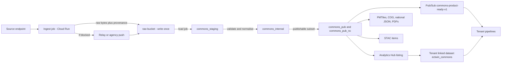
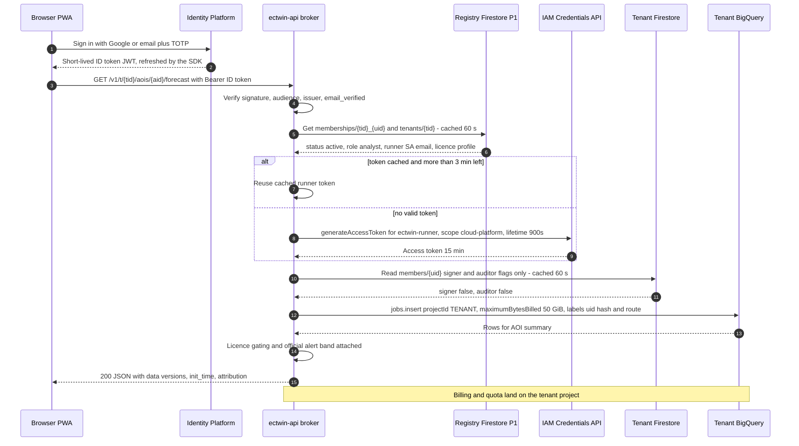
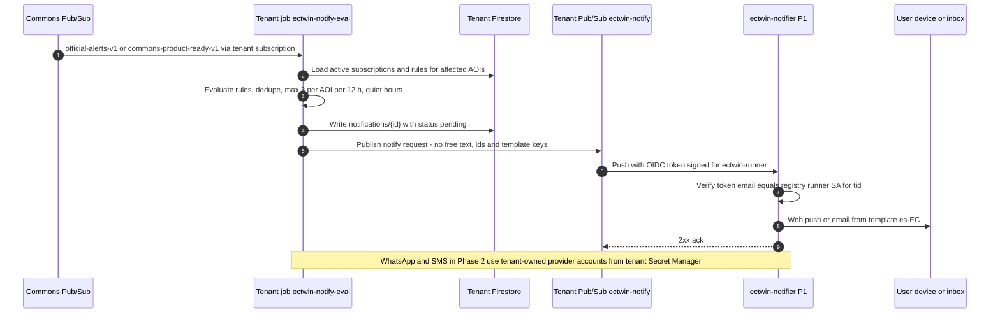

# System architecture

This document is the technical blueprint of *Gemelo Digital Ecuador – El Niño* (GDE-Niño, "Ecuador El Niño Digital Twin"). It turns the product decisions D1–D20 of the design spine and the requirements in [02-users-requirements-ux.md](./02-users-requirements-ux.md) into a buildable system of three planes: an operator-paid **control plane**, a sponsor-funded **commons plane** of national public goods, and a **tenant plane** that runs inside each user organisation's own Google Cloud project. It fixes the components, regions, data flows, storage layout (buckets, BigQuery DDL, Firestore collections, STAC), the platform API, orchestration and idempotency rules, the front-end architecture, the repository layout, the architecture decision records (ADRs), failure modes and disaster recovery. Identity and tenancy mechanics are detailed in [04-identity-tenancy-byo-gcp.md](./04-identity-tenancy-byo-gcp.md), datasets in [05-data-catalog.md](./05-data-catalog.md), forecast methods in [06-forecast-model-stack.md](./06-forecast-model-stack.md), costs in [09-cost-model.md](./09-cost-model.md) and deployment steps in [10-setup-and-deployment.md](./10-setup-and-deployment.md).

## Contents

1. [Architecture principles](#1-architecture-principles)
2. [Three-plane overview](#2-three-plane-overview)
3. [Component inventory](#3-component-inventory)
4. [Data flows](#4-data-flows)
5. [Storage layout](#5-storage-layout)
6. [Platform API design](#6-platform-api-design)
7. [Orchestration](#7-orchestration)
8. [Front-end architecture](#8-front-end-architecture)
9. [Tech stack and monorepo layout](#9-tech-stack-and-monorepo-layout)
10. [Architecture Decision Records](#10-architecture-decision-records)
11. [Scalability, failure modes, degradation and DR](#11-scalability-failure-modes-degradation-and-dr)
12. [Security architecture summary](#12-security-architecture-summary)
13. [Architecture milestones and acceptance criteria](#13-architecture-milestones-and-acceptance-criteria)
14. [Open questions](#14-open-questions)

**Owner roles used in this document.** People are named in [12-roadmap-team-budget.md](./12-roadmap-team-budget.md).

| Code | Role |
|---|---|
| PL | Platform lead (control plane, broker, onboarding, IaC) |
| DL | Data lead (commons ingestion, warehouse, listings, STAC) |
| FL | Forecast and hydromet lead (forecast cycle, bias correction, verification, impact models) |
| FE | Front-end lead (PWA, tiles, i18n, accessibility) |
| AI | AI decision-layer lead (Jev, DecisionBackend, Gemini) |
| SRE | Operations and on-call ([11-operations-runbook.md](./11-operations-runbook.md)) |
| DPO | Security and data-protection officer ([13-governance-legal-risk.md](./13-governance-legal-risk.md)) |
| TA | Tenant admin (*Propietario/a* or *Administrador/a* inside the tenant organisation) |
| PM | Programme/product manager (sponsor relations, go-live gates) |

---

## 1. Architecture principles

| # | Principle | What it means in practice | Enforced by |
|---|---|---|---|
| AP-01 | **Official first, decision support second** (D1, D2) | Official SNGR/INAMHI/CN-ERFEN/INOCAR content is ingested verbatim and rendered above every model output; platform outputs are labelled "apoyo a la decisión / pronóstico experimental" and use "nivel de riesgo / probabilidad de impacto", never "alerta amarilla/naranja/roja". | `official_alerts` table is a mandatory input of every renderer; CI vocabulary guard (§8.5); FR-040–FR-043 |
| AP-02 | **Who benefits pays, by construction** | Tenant-specific work runs in the tenant project with the tenant as quota and billing project; the control plane never runs tenant compute. | Broker sets `projectId`/`userProject`/quota project = tenant; tenant pipelines are Cloud Run jobs inside the tenant ([quota-project rules](https://docs.cloud.google.com/docs/quotas/quota-project)) |
| AP-03 | **Compute once, share many** | National public goods (alerts, ENSO, Flood API snapshots, parish probabilities, exposure, verification) are computed once in Commons and shared by Analytics Hub listing and GCS. | Commons pipelines; Analytics Hub "subscriber pays queries, publisher pays storage" ([BigQuery pricing](https://cloud.google.com/bigquery/pricing)) |
| AP-04 | **Compute near data, never copy big data** | Query WeatherNext, ERA5 and EE assets in place; always filter by `init_time` partition and Ecuador geography; clip to lon −92.1…−75.1, lat −5.1…1.7. | `require_partition_filter`, `maximumBytesBilled`, shared SQL macros (§4.2) |
| AP-05 | **Licence-aware data paths** (D15) | Every layer carries licence metadata; only Non-Retrievable Value-Added WeatherNext derivatives leave a WeatherNext licensee's project; NC layers never reach commercial tenants. | Two listings (`ectwin_commons`, `ectwin_commons_nc`), `licence_class` columns, API gating (FR-073) |
| AP-06 | **No standing secrets** | No service-account keys; broker tokens ≤15 min; OAuth access tokens used once and discarded; no refresh tokens stored by default. | IAM Credentials `generateAccessToken` ([short-lived credentials](https://docs.cloud.google.com/iam/docs/create-short-lived-credentials-direct)); org policy; CI secret scanning |
| AP-07 | **Minimal central personal data** | The control plane stores only uid, email, tenant project id, runner SA email, region profile and status, plus uid-to-tenant memberships with a coarse role (`owner`/`admin`/`analyst`/`reader`, [04 §3.4](./04-identity-tenancy-byo-gcp.md)); sessions, AOIs and logs live in the tenant. | Registry schema (§5.5); NFR-013 |
| AP-08 | **Serverless and scale-to-zero by default** | Cloud Run min-instances 0, Cloud Run jobs, Batch on Spot for heavy runs; static files for anything read by many. | Terraform defaults; cost alerts ([09-cost-model.md](./09-cost-model.md)) |
| AP-09 | **Archive from day one; raw is immutable** | Sources without history (INAMHI 92-day window, Flood API with no history endpoint, COE2 current events) are captured write-once with provenance. | `raw/` write-once object preconditions (§7.4); DR copy (§11.4) |
| AP-10 | **Degrade, never lie** | When a source is late or down, show the last good product with its age, switch to a documented fallback, and never infer an official alert. | Degradation ladder (§11.3); FR-042 |
| AP-11 | **Text first, map second** | The first screen is a ≤200 KB text summary; MapLibre/deck.gl load on demand; offline cache for 72 h. | Bundle budget in CI (§8.6); NFR-001, NFR-025 |
| AP-12 | **Reproducible and open** (D20) | Every number traces to dataset version, `init_time`, code digest and model version; the core is Apache-2.0; all infrastructure is code. | Run records (§5.4), evidence packs (FR-072), Terraform |

---

## 2. Three-plane overview

### 2.1 Planes at a glance

| | P1 Control plane | P2 Commons plane | P3 Tenant plane |
|---|---|---|---|
| GCP project | `ectwin-platform-prod` (+ `-dev`, `-stg`) | `ectwin-commons-prod` (+ `-dev`, `-stg`) | `<TENANT_PROJECT>`, one per organisation (or sponsor folder for T4) |
| Who pays | Platform operator | Sponsor (e.g. SNGR/INAMHI with CAF/IDB/World Bank, or Google.org/credits) **(to confirm)** | The tenant organisation |
| Cost anchor | ≈US$5–25/month at the Nov 2026 pilot, ≈US$23–43 in a season (N1) month, ≈US$75–95 in N2 with the warm broker ([09 §4.2.1](./09-cost-model.md)); operator budget US$45 | ≈US$100–300/month excl. T0 delivery (≈US$56–81 pilot, ≈150–233 N1, ≈256–414 N2); Commons invoice incl. Block D ≈US$72–97 / ≈273–356 / ≈444–602 ([09 §4.3.2](./09-cost-model.md)) | T1 ≈US$0–14; T2 ≈US$20–60; T3 ≈US$540–800 (peak ≈US$1,070–1,210) |
| Holds | Identity, web app, broker API, onboarding, tenant registry (tenants, memberships), STAC catalog, IaC templates, container images, notifier | Raw archive, curated national tables, parish probabilities, ENSO, Flood API snapshots, exposure, seasonal, verification, tiles, SFINCS library, national Jev triage | Sessions, AOIs, views, subscriptions, runs, reports, decision and audit logs, custom models, own WeatherNext and Commons linked datasets |
| Never holds | Tenant content, user sessions, AOIs, raw WeatherNext fields | Personal data (beyond operator accounts), raw real-time WeatherNext fields in anything published | Other tenants' data; platform secrets |
| Main regions | `us-central1`; Firestore `southamerica-west1` | BigQuery `US`; GCS/Run `us-central1`; `.gob.ec` ingestion `southamerica-west1`; heavy WN3 `us-east1` | BigQuery `US`; GCS/Run `us-central1`; Firestore `southamerica-west1` (tenant may choose) |

There is no GCP region in Ecuador. BigQuery tenant and Commons datasets must be in `US` because the WeatherNext linked datasets are in `US` and every dataset in a job must share the job's location ([BigQuery locations](https://docs.cloud.google.com/bigquery/docs/locations)). BigQuery `US` reads `us-central1` buckets with no transfer charge, and `us-central1` is inside the GCS Always Free zone ([storage pricing](https://cloud.google.com/storage/pricing)).

### 2.2 Overview diagram

```mermaid
flowchart TB
  subgraph USERS["Users"]
    PWA["Browser PWA es-EC"]
    OUT["PDF, WhatsApp card, email, web push"]
  end

  subgraph EXT["External sources and services"]
    WN["WeatherNext 3 and 2 - BigQuery listings, EE, GCS Zarr"]
    FFA["Flood Forecasting API"]
    GOB["gob.ec sources - SNGR, INAMHI, INOCAR, CN-ERFEN"]
    GLOB["Global data - ERA5, CHIRPS, IMERG, GloFAS, GEOGloWS, C3S, CPC"]
    TS["TypeSafe Jev API"]
    RELAY["Partner relay in Ecuador - fallback"]
  end

  subgraph P1["P1 Control plane - ectwin-platform-prod"]
    IDP["Identity Platform"]
    HOST["Firebase Hosting - app shell and STAC"]
    API["ectwin-api broker - Cloud Run"]
    REG["Firestore registry - tenants, memberships"]
    NOTI["ectwin-notifier - Cloud Run"]
    AR["Artifact Registry - public images"]
    IAC["Tenant bootstrap - Terraform and Cloud Shell"]
  end

  subgraph P2["P2 Commons plane - ectwin-commons-prod"]
    INGS["Ingest jobs - southamerica-west1"]
    INGU["Ingest jobs - us-central1"]
    RAW["GCS raw - write once"]
    WF["Forecast cycle - Workflows"]
    BQC["BigQuery commons datasets - US"]
    HVY["Batch Spot - us-east1 and us-central1"]
    PUBB["GCS products - signed URLs, plus public static tiles"]
    BULK["GCS requester pays bulk"]
    AH["Analytics Hub listings"]
    PS["Pub/Sub commons topics"]
  end

  subgraph P3["P3 Tenant plane - TENANT_PROJECT"]
    SA["ectwin-runner service account"]
    TFS["Firestore default - southamerica-west1"]
    TBQ["BigQuery ectwin, ectwin_scratch, linked datasets"]
    TGCS["GCS TENANT-ectwin"]
    TJOB["Cloud Run jobs and Scheduler"]
    TEE["Earth Engine"]
    TVX["Optional Vertex WN2, Batch Spot, Gemini"]
    GRD["Budget, quotas, maximumBytesBilled"]
  end

  PWA -->|sign in| IDP
  PWA -->|app shell| HOST
  PWA -->|REST with ID token| API
  PWA -->|signed URL range reads| PUBB
  API --> REG
  API -->|generateAccessToken 15 min| SA
  SA --> TFS
  SA --> TBQ
  SA --> TGCS
  API -->|read national JSON| PUBB
  GOB --> INGS
  GOB -.-> RELAY
  RELAY -.-> RAW
  GLOB --> INGU
  FFA --> INGU
  INGS --> RAW
  INGU --> RAW
  RAW --> BQC
  WN --> WF
  WF --> BQC
  WF --> HVY
  HVY --> BQC
  BQC --> PUBB
  BQC --> BULK
  BQC --> AH
  WF --> PS
  AH -->|linked dataset ectwin_commons| TBQ
  WN -->|tenant own approval| TBQ
  PS -->|tenant subscription| TJOB
  TJOB --> TBQ
  TJOB --> TEE
  TJOB --> TVX
  TJOB -->|notify request| NOTI
  NOTI --> OUT
  TJOB -.->|typed decisions| TS
  INGU -.->|national triage| TS
  AR --> TJOB
  IAC --> SA
  GRD --> TJOB
```



### 2.3 How onboarding tiers map to planes

| Tier (D9) | Planes used | What runs where |
|---|---|---|
| T0 signed-in viewer | P1 + P2 | Broker serves pre-rendered Commons JSON, PDFs and signed tile URLs. **Nothing is persisted server-side**; view state is kept in `sessionStorage` only (D6). |
| T1 Light | P1 + P2 + P3 (Firestore, one bucket, 1–3 scheduled jobs) | Mostly free tiers; Commons linked dataset only; no own WeatherNext needed. |
| T2 Standard | + BigQuery analytics, Earth Engine, own `weathernext_3`/`weathernext_2` linked datasets | Daily AOI pipelines, fan charts (FR-025), bulk exports. |
| T3 Heavy | + Batch Spot, Vertex WN2 scenario runs, Requester-Pays WN3 members in `us-east1` | Ensembles, SFINCS/LISFLOOD-FP, custom models. |
| T4 Sponsored | Same as T1/T2 but the project sits in a sponsor folder with labels `ectwin-tenant`, `ectwin-sponsor`, DPA code | Billing may move to the GAD later. |

### 2.4 Trust boundaries

1. **Browser ↔ P1.** Identity Platform ID token (JWT) on every call; TLS only; strict CSP.
2. **P1 ↔ P3.** The only standing trust is `roles/iam.serviceAccountTokenCreator` granted **on the `ectwin-runner` service-account resource** (not the project) to `ectwin-broker@ectwin-platform-prod.iam.gserviceaccount.com`. Every impersonated call records both identities in the tenant's audit logs ([impersonation](https://docs.cloud.google.com/iam/docs/service-account-impersonation)).
3. **P2 ↔ P3.** One-way publication: Analytics Hub linked datasets (read-only), public or signed GCS objects, and Pub/Sub topics the tenant runner may subscribe to. Commons never holds a credential into a tenant. The only upward flow is the opt-in observation topic, which the tenant runner publishes to (§4.6).
4. **P2 ↔ external sources.** Outbound HTTPS from Cloud Run jobs; the Flood API key and TypeSafe key live in Commons Secret Manager; the partner relay pushes into `raw/` only (§4.1).
5. **P3 ↔ external services.** Tenant-owned keys (TypeSafe, own Flood API key, WhatsApp/SMS provider) in the tenant's Secret Manager.

---

## 3. Component inventory

| # | Component | GCP product | Plane | Region | Scaling | Main cost driver | Owner |
|---|---|---|---|---|---|---|---|
| 1 | Web app shell (PWA) and static STAC | Firebase Hosting (alternative: GCS + Cloud CDN) | P1 | Global edge | Static | Hosting transfer (free-tier limits **to confirm**) | FE |
| 2 | Identity | Identity Platform: Google + email/password (Tier 1), TOTP MFA, SAML/OIDC (Tier 2); Firebase Blaze plan (Spark caps "Firebase Auth with Identity Platform" at 3,000 DAU, secondary source) | P1 | Global | Per MAU | Tier 1 free to 50,000 MAU, then US$0.0055/MAU; Tier 2 (SAML/OIDC) first 50 MAU free, then US$0.015/MAU ([pricing](https://cloud.google.com/identity-platform/pricing)) | PL |
| 3 | Broker API `ectwin-api` | Cloud Run service, request-based billing | P1 | `us-central1` | min 0 (1 in event mode), max 20, concurrency 80 | Requests and vCPU-s (≈US$0.40/month at pilot) | PL |
| 4 | Onboarding and preflight | Routes of `ectwin-api` + Cloud Shell tutorial / Infrastructure Manager | P1 | `us-central1` | On demand | Negligible; Infrastructure Manager costs Cloud Build minutes and a bucket ([pricing](https://cloud.google.com/infrastructure-manager/pricing)) | PL |
| 5 | Tenant registry | Firestore native `(default)` | P1 | `southamerica-west1` | Serverless | Reads (≈US$1.35/month at pilot) | PL |
| 6 | Notifier `ectwin-notifier` | Cloud Run service (Pub/Sub push target) | P1 | `us-central1` | min 0, max 5 | Web Push free; email provider **(to select; price to confirm)** | PL |
| 7 | WIF issuer (path C, Phase 2) | Cloud Run route + signing key **(KMS pricing to confirm)** | P1 | `us-central1` | On demand | Negligible | PL + DPO |
| 8 | Container images | Artifact Registry Docker repo `ectwin`, public read (D20) | P1 | `us-central1` | — | Storage US$0.10/GiB-month after 0.5 GB ([pricing](https://cloud.google.com/artifact-registry/pricing)) | PL |
| 9 | Terraform state | GCS `ectwin-platform-prod-tfstate` (versioned) | P1 | `us-central1` | — | Negligible | PL |
| 10 | Logs, metrics, uptime checks | Cloud Logging and Monitoring | P1, P2 | Log buckets region set explicitly | — | Logs above 50 GiB/project at US$0.50/GiB ([pricing](https://cloud.google.com/stackdriver/pricing)) | SRE |
| 11 | `.gob.ec` and partner ingestion (SNGR, INAMHI, INOCAR, CN-ERFEN; GEOGloWS-INAMHI hydroviewer at `inamhi.geoglows.org`) | Cloud Run jobs | P2 | `southamerica-west1` | Scheduled, 1 task | vCPU-s (inside free tier) | DL |
| 12 | Partner relay (fallback for geoblocking) | Container on a partner host in Ecuador (CEDIA, INAMHI or SNGR) **(to confirm)** | P2 (external) | Ecuador | 1 instance | Partner-hosted | DL + partner |
| 13 | Global ingestion (ENSO, GloFAS/EWDS, C3S, IMERG, CHIRPS) | Cloud Run jobs | P2 | `us-central1` | Scheduled | vCPU-s | DL |
| 14 | Flood API snapshotter | Cloud Run job + central allow-listed key | P2 | `us-central1` | 4 runs/day, <60 requests/run vs 200/min quota | Free of charge per the API FAQ (search summary only; commercial-use wording **unverified**) | DL |
| 15 | Raw archive | GCS `ectwin-commons-prod-raw` (Standard, versioning, soft delete) | P2 | `us-central1` | Append-only | US$0.020/GiB-month | DL |
| 16 | DR copy of raw | GCS `ectwin-commons-prod-archive-scl` (Archive class) | P2 | `southamerica-west1` | Nightly copy | US$0.0027/GiB-month | SRE |
| 17 | Curated warehouse | BigQuery datasets `commons_staging`, `commons_internal`, `commons_pub`, `commons_pub_nc`, `commons_ops` | P2 | `US` | On-demand | Storage US$0.02/GiB-month (10 GiB free); scans (1 TiB/month free) | DL |
| 18 | Commons WeatherNext access | Linked datasets `weathernext_3`, `weathernext_2` in the Commons project (Commons' own approval) | P2 | `US` | — | Scans ≈0.07 GB (WN3) and ≈0.2 GB (WN2) per column-init, estimate (arithmetic in [09-cost-model.md](./09-cost-model.md)) | FL |
| 19 | Forecast-cycle orchestrator | Workflows + Cloud Scheduler | P2 | `us-central1` | 4 cycles/day (+ hourly WN3 in event mode) | Negligible **(Workflows pricing to confirm)** | FL |
| 20 | Forecast processing | Cloud Run jobs (SQL + Python/xarray) | P2 | `us-central1` | Per cycle, 2–10 tasks | BigQuery scans; vCPU-s | FL |
| 21 | WN3 full-member processing (Phase 2) | Cloud Batch on Spot `c2d-standard-16` reading Requester-Pays Zarr | P2 | `us-east1` | Per main cycle | Spot ≈US$0.409/h (us-central1 list price; `us-east1` Spot price **to confirm**) + requester-pays operations | FL |
| 22 | SFINCS scenario library and other ensembles | Cloud Batch on Spot `c3d-highcpu-16` (CPU build from source) | P2 | `us-central1` | Campaigns | Spot ≈US$0.161/h (Batch itself adds no charge, [batch pricing](https://cloud.google.com/batch/pricing)); library US$60–360 one-off (1,120 runs; [07 M3](./07-impact-modules-and-triggers.md), [09 B13](./09-cost-model.md)) | FL |
| 23 | Tiles, PDFs and WhatsApp cards | Cloud Run jobs (tippecanoe, rio-cogeo, WeasyPrint) | P2 | `us-central1` | After each cycle; canton PDFs daily | vCPU-s | FE + DL |
| 24 | Public/authenticated product buckets | GCS `ectwin-commons-prod-public` (static layers) and `ectwin-commons-prod-products` (forecast products, signed URLs) (+ Cloud CDN above ≈1.5 TiB/month: break-even ≈1,526 GiB incl. request charges, [09 §4.2.3](./09-cost-model.md); decided at M2.1 with the measured object size) | P2 | `us-central1` | — | Internet egress US$0.12/GiB: ≈US$11.40/month at pilot, (195 − 100) GiB × 0.12, if the 100 GB Always Free transfer applies to internet egress (wording ambiguous), else ≈US$23.40 | DL |
| 25 | Bulk research bucket | GCS `ectwin-commons-prod-bulk`, **Requester Pays** | P2 | `us-central1` | — | Storage only (requester pays egress/ops) | DL |
| 26 | Listings | Analytics Hub exchange `ectwin_exchange`, listings `ectwin_commons_v1`, `ectwin_commons_nc_v1` | P2 | `US` | — | Publisher pays storage only | DL |
| 27 | Commons event bus | Pub/Sub topics `commons-product-ready-v1`, `official-alerts-v1`, `ops-events` (+ inbound `tenant-observations-v1` for opt-in sharing, §4.6) | P2 | Global | — | First 10 GiB/month free, then US$40/TiB ([pricing](https://cloud.google.com/pubsub/pricing)) | DL |
| 28 | National Jev triage | Cloud Run job + `DecisionBackend` (D17) | P2 | `us-central1` | Event-driven, ≤8 workers per key | Jev ≈US$0.0399/1k decisions; ≈US$113/month at national peak | AI |
| 29 | National bulletins (Gemini Flash-Lite Batch) | Gemini Enterprise Agent Platform (formerly Vertex AI) | P2 | `us-central1` | Daily batch | Tokens | AI |
| 30 | Verification | Cloud Run jobs (weekly; daily in Phase 2 event mode) | P2 | `us-central1` | Scheduled | Scans | FL |
| 31 | Tenant runner identity | Service account `ectwin-runner@<TENANT_PROJECT>` | P3 | Global | — | Free | TA |
| 32 | Tenant state | Firestore `(default)` native | P3 | `southamerica-west1` (default) | Serverless | Free tier: 50k reads, 20k writes per day ([pricing](https://cloud.google.com/firestore/pricing)) | TA |
| 33 | Tenant warehouse | BigQuery `ectwin`, `ectwin_scratch` (7-day expiry), linked `ectwin_commons`, optional `ectwin_commons_nc`, `weathernext_3`, `weathernext_2` | P3 | `US` | On-demand | Scans (1 TiB free per billing account) | TA |
| 34 | Tenant bucket | GCS `gs://<TENANT_PROJECT>-ectwin` | P3 | `us-central1` | — | Storage and egress | TA |
| 35 | Tenant pipelines | Cloud Run jobs `ectwin-aoi-pipeline`, `ectwin-notify-eval`, `ectwin-sync` + Cloud Scheduler (+ Workflows for T2+) | P3 | `us-central1` | Scheduled / event | vCPU-s (240k free per billing account); Scheduler 3 free jobs then US$0.10/job ([pricing](https://cloud.google.com/scheduler/pricing)) | TA (images by PL) |
| 36 | Tenant Earth Engine | EE project registration (noncommercial tier or commercial Limited plan); registration is a browser step, state readable via `GET v1/projects/{p}/config` | P3 | — | Daily EECU cap | EECU-h at US$0.40 for the first 10k h (commercial Limited plan) ([pricing](https://cloud.google.com/earth-engine/pricing)); noncommercial Community 150 / Contributor 1,000 / Partner 100,000 EECU-h per month. Operational government use generally needs commercial registration ([noncommercial](https://earthengine.google.com/noncommercial/), search summary) | TA |
| 37 | Tenant heavy compute | Batch Spot; Vertex custom job for WN2 scenarios; Cloud Run L4 GPU | P3 | `us-central1` / `us-east1` | On demand | GPU/TPU hours (e.g. `g2-standard-4` Spot ≈US$0.424/h; Cloud Run L4 ≈US$0.672/h; WN2 64-member 15-day self-run ≈US$2.3–4.6 on TPU v5p, estimate) | TA |
| 38 | Tenant guardrails | Billing budget → Pub/Sub, BigQuery custom quotas, EE `daily_eecu_usage_time` | P3 | — | — | Free | TA + PL |
| 39 | Tenant secrets | Secret Manager | P3 | `us-central1` | — | US$0.06/version-month after 6 free | TA |

---

## 4. Data flows

### 4.1 Ingestion → Commons → tenant



Steps and rules:

1. **Fetch.** Each source has one ingest job defined in `catalog/data-sources.yaml` (licence, cadence, region, parser, owner). `.gob.ec` jobs run in `southamerica-west1` because several government hosts reject non-Latin-American or data-centre IPs (`datosabiertos.gob.ec` returns 403 "fuera de Latinoamérica"; `gob.ec` returns empty bodies to US runners) ([GEOBLOCK_PLAN](https://github.com/DweskZ/EcuDataMCP/blob/main/docs/GEOBLOCK_PLAN.md)). Whether Google Cloud IPs in Santiago are also blocked is **unverified** and is tested in Phase 0 (§13, M0.3).
2. **Respect source limits.** INAMHI's Visor API keeps ≈92 days and allows about one request every 5 minutes ([INAMHI config](https://github.com/jorgessanchez7/Global_Forecast_Validation/blob/master/Ecuador/INAMHI/config.py)); the ingest job uses a token bucket of 1 request/300 s and a rotating station/province schedule agreed with INAMHI **(to confirm under MoU)**. The Flood API allows 200 requests/min per project ([OCHA README](https://github.com/OCHA-DAP/ds-google-flood-hub)).
3. **Write raw once.** Store the unmodified response plus a sidecar `*.meta.json` (URL, HTTP status, headers, `fetched_at` UTC, SHA-256, job digest, source licence). Object creation uses `ifGenerationMatch=0` so a retry can never overwrite (§7.4).
4. **Fallback when blocked.** Order: (a) retry from `southamerica-west1`; (b) partner relay in Ecuador running the same container image, pushing to `raw/` with Workload Identity Federation or a signed-URL upload handshake (no service-account keys) **(mechanism to confirm with partner)**; (c) agency push-to-GCS under a data-sharing agreement; (d) manual operator upload with two-person check for official alerts only. Every fallback path writes the same raw layout with `via=relay|push|manual` in the sidecar.
5. **Curate.** Load jobs move raw into `commons_staging`; SQL/Python normalises to canonical keys (INEC DPA, H3 res 7/9, `hybas_`, GEOGloWS `river_id`, INAMHI station code; UTC timestamps) (D14), runs data-quality checks, and `MERGE`s into `commons_internal`.
6. **Publish.** Only tables that pass licence review are materialised into `commons_pub` (commercial-OK) or `commons_pub_nc` (non-commercial only). WeatherNext-derived content is limited to Non-Retrievable Value-Added products (exceedance probabilities, indices, risk levels) as allowed by the [WeatherNext terms](https://storage.googleapis.com/weathernext-public/terms-of-use.pdf); raw or recoloured/subset fields count as unmodified data and are never published.
7. **Announce.** A `commons-product-ready-v1` message (§7.2) tells tenants a partition is final; tenants subscribe from their own project and pay their own delivery.

### 4.2 Forecast cycle

**Timing.** WeatherNext 3 main cycles land in BigQuery/EE ≈+8 h 10 min after the nominal init (interim hourly runs ≈+7 h 25 min), with ±15 min typical and occasional ±60 min variance ([dissemination guide](https://developers.google.com/weathernext/guides/dissemination), search summary only; model details in [06-forecast-model-stack.md](./06-forecast-model-stack.md)). WeatherNext 2 estimated release times are 07:30, 13:30, 19:30 and 01:30 UTC for the 00, 06, 12 and 18Z runs.

| Init (UTC) | WN2 in BigQuery (UTC) | WN3 main cycle in BigQuery (UTC, ≈) | Commons products final (target, UTC) | Local time products final (ECT, UTC−5) | Used for |
|---|---|---|---|---|---|
| 00Z | 07:30 | 08:10 | 09:10 | 04:10 | Canton PDFs at 06:00 ECT (FR-044) and morning COE brief |
| 06Z | 13:30 | 14:10 | 15:10 | 10:10 | Midday update |
| 12Z | 19:30 | 20:10 | 21:10 | 16:10 | Afternoon update, evening planning |
| 18Z | 01:30 (+1 d) | 02:10 (+1 d) | 03:10 (+1 d) | 22:10 | Overnight watch |

**Cycle steps** (Workflows `forecast-cycle`, §7.3):

1. **Wait for data.** Start at init + 7 h 20 min; probe every 10 min up to init + 10 h with a 10 MB-minimum query `SELECT COUNT(1) … WHERE init_time = @init` on each linked table. After init + 10 h mark the cycle `late` and fall back (§11.2).
2. **WN2 member exceedance (Phase 1).** For each 0.25° cell in the Ecuador clip polygons, sum `total_precipitation_6hr` over 12Z→12Z windows (aligned with the 07:00 ECT climatological day; **INAMHI convention to confirm**) per member, count members above each INAMHI threshold (*umbrales*), area-weight to parish. Accumulations must come from members: sums of hourly quantiles are not quantiles of the sum.
3. **WN3 statistics (Phase 1).** Read mean/p10–p90 hourly fields at 0.1° for display series, hourly-intensity exceedance (piecewise-linear CDF through the quantiles, tails flagged), and SST for the Niño 1+2 box. Ecuador at 0.1° is 11,560 cells (0.178% of the globe); mainland + Galápagos polygons cut this to 4,740 cells.
4. **WN3 full members (Phase 2).** A Batch Spot job in `us-east1` reads the Requester-Pays Zarr `gs://weathernext3_spatial/weathernext_3_0_0/zarr/` with `userProject=ectwin-commons-prod` for 24/72 h accumulations at 0.1°. This step is enabled only after a spike measures chunk layout and cost (statistics chunks are one lead × full global grid; member-store chunking is **unverified**).
5. **Bias correction.** Apply quantile-mapping/EMOS parameters from `commons_internal.bc_params` (fitted against INAMHI stations and CHIRPS v3; D12; see [06](./06-forecast-model-stack.md) and [14](./14-verification-and-validation.md)).
6. **Risk levels.** Join probabilities with `exposure_parish` and vulnerability to compute *nivel de riesgo* 1–4 and the confidence indicator (D3, FR-033; method in [07](./07-impact-modules-and-triggers.md)).
7. **Publish.** `MERGE` into `commons_pub.parish_exceedance` for the `init_time` partition; build `national/latest/*.json`, parish-polygon PMTiles for WeatherNext-derived products (never per-grid-cell WeatherNext statistics, [13](./13-governance-legal-risk.md) N-2; H3 PMTiles only for non-WeatherNext layers such as exposure and `obs_precip_h3`) and canton PDFs/cards; update STAC items; publish `commons-product-ready-v1`.
8. **Fallback model.** If WeatherNext is late or unavailable, the same steps run on ECMWF IFS open data (`ECMWF/NRT_FORECAST/IFS/OPER` in EE) with `model='IFS'` and a visible "modelo de respaldo" label.

**Sketch of step 2** (field names inside the WN2 `forecast` struct and the member column are **to confirm** against the linked schema):

```sql
-- commons: probability that 24 h rain (12Z-12Z) exceeds each INAMHI threshold, per parish
DECLARE init TIMESTAMP DEFAULT @init_time;   -- e.g. TIMESTAMP '2026-11-15 00:00:00+00'
WITH clip AS (
  SELECT geom FROM `ectwin-commons-prod.commons_pub.dim_ecuador_clip`   -- mainland + Galapagos polygons
),
m AS (
  SELECT t.geography, t.ensemble_member AS member,                      -- member column: to confirm
         f.time AS valid_time, f.total_precipitation_6hr * 1000 AS tp6_mm
  FROM `ectwin-commons-prod.weathernext_2.weathernext_2_0_0` AS t, t.forecast AS f
  WHERE t.init_time = init                                             -- partition filter (mandatory)
    AND ST_INTERSECTS(t.geography, (SELECT ST_UNION_AGG(geom) FROM clip))  -- cluster pruning
),
d AS (
  -- valid_time is the END of each 6 h accumulation; use the period start (valid_time - 6 h)
  -- so that the step ending at 12Z is assigned to the window that ends at 12Z.
  SELECT geography, member,
         TIMESTAMP_ADD(TIMESTAMP_TRUNC(TIMESTAMP_SUB(valid_time, INTERVAL 18 HOUR), DAY), INTERVAL 12 HOUR) AS win_start,
         SUM(tp6_mm) AS tp24_mm, COUNT(*) AS n_steps
  FROM m GROUP BY 1, 2, 3
  HAVING n_steps = 4                                                   -- only complete windows
)
SELECT init AS init_time, 'WN2' AS model, 'tp_24h' AS variable,
       d.win_start AS window_start, TIMESTAMP_ADD(d.win_start, INTERVAL 24 HOUR) AS window_end,
       DIV(TIMESTAMP_DIFF(d.win_start, init, HOUR), 24) + 1 AS lead_day,  -- first complete window = day 1
       w.dpa_parish, th.threshold_id, th.value_mm AS threshold_value,
       SAFE_DIVIDE(SUM(w.area_weight * IF(d.tp24_mm >= th.value_mm, 1, 0)), SUM(w.area_weight)) AS prob_exceed,
       COUNT(DISTINCT d.member) AS n_members
FROM d
JOIN `ectwin-commons-prod.commons_internal.cell_parish_weights_wn2` AS w USING (geography)
JOIN `ectwin-commons-prod.commons_internal.inamhi_thresholds` AS th ON th.variable = 'tp_24h'
GROUP BY 1, 2, 3, 4, 5, 6, 7, 8, 9;
-- The publish step adds dpa_province/dpa_canton (from dim_dpa), model_version, risk_level,
-- confidence, bias_correction, method_version, licence_class and attribution before the MERGE.
```

The job runs with `maximumBytesBilled = 5 GiB` and labels `ectwin_cycle=<init>`, `ectwin_step=wn2_exceed`. Expected scan ≈0.2 GB per column-init (estimate; arithmetic in [09-cost-model.md](./09-cost-model.md): ≈1,850 cells × 64 members × 60 leads × 8 B ≈ 57 MB plus overhead); this query reads about two leaf columns (`time`, `total_precipitation_6hr`) plus the member and geography columns, so ≈0.4–0.5 GB per init, well inside the 1 TiB free tier.

### 4.3 Interactive request through the broker (impersonation)



Implementation sketch (`services/api/ectwin_api/tenancy.py`):

```python
from google.auth import default, impersonated_credentials
from google.auth.transport.requests import Request
from google.cloud import bigquery
import time, hashlib

_SRC, _ = default()                      # ectwin-broker@ectwin-platform-prod (Cloud Run identity)
_TOKENS: dict[str, tuple[impersonated_credentials.Credentials, float]] = {}

def runner_creds(tenant: dict) -> impersonated_credentials.Credentials:
    sa = tenant["runner_sa_email"]       # ectwin-runner@<TENANT_PROJECT>.iam.gserviceaccount.com
    hit = _TOKENS.get(sa)
    if hit and hit[1] - time.time() > 180:          # reuse until 3 min before expiry
        return hit[0]
    creds = impersonated_credentials.Credentials(
        source_credentials=_SRC, target_principal=sa,
        target_scopes=["https://www.googleapis.com/auth/cloud-platform"], lifetime=900)
    creds.refresh(Request())                         # IAM Credentials generateAccessToken
    _TOKENS[sa] = (creds, time.time() + 900)
    return creds

def tenant_query(tenant: dict, uid: str, route: str, sql: str, params: list, max_gib: int = 50):
    client = bigquery.Client(project=tenant["tenant_project_id"], credentials=runner_creds(tenant))
    cfg = bigquery.QueryJobConfig(
        query_parameters=params, maximum_bytes_billed=max_gib * 2**30, use_query_cache=True,
        labels={"ectwin_route": route, "ectwin_uid": hashlib.sha256(uid.encode()).hexdigest()[:16]})
    return client.query(sql, job_config=cfg, location="US").result(timeout=30)
```

Rules: the broker never accepts free SQL from T0/T1 users; Analysts on T2+ may run saved, parameterised queries; every platform-issued job carries `maximumBytesBilled` (FR-066, NFR-018). The broker writes its own structured audit record (uid, tenant, route, BigQuery job id) to the tenant's `ectwin.audit_events` because Google audit logs show the broker and runner identities but not the end user.

### 4.4 Scheduled tenant pipeline

Tenant pipelines run **inside the tenant project** as Cloud Run jobs under `ectwin-runner`, so every free tier, quota and bill is the tenant's (D8). The container image is pulled by digest from the platform's public Artifact Registry repository.

1. **Trigger.** Either Cloud Scheduler at fixed times aligned with the Commons cycle (default 04:25, 10:25, 16:25, 22:25 ECT = 09:25, 15:25, 21:25, 03:25 UTC), or (T2+) a Pub/Sub subscription on `commons-product-ready-v1` that starts a tenant Workflows execution.
2. **Readiness.** The job checks that the needed partitions exist in `ectwin_commons.parish_exceedance` (and in `weathernext_3` if the tenant has its own linked dataset). If not ready, it polls every 2 min within its 15-min task timeout, then exits with code 75 so that Cloud Run retries the task (`--max-retries=3`); the Scheduler time is set ≈15 min after the Commons target so this path is rare.
3. **Idempotency lease.** Compute `run_key = sha256(pipeline|version|init_time|aoi_id|params_hash)` and create `runs/{run_key}` in tenant Firestore with an `exists=false` precondition; if it exists with `status=succeeded`, exit 0 (§7.4).
4. **Compute.** Parameterised SQL per AOI (dry-run first; abort if above the tenant's per-run byte cap), optional EE `ST_REGIONSTATS`/Xee calls, optional Jev decisions through the tenant's `DecisionBackend`.
5. **Write.** `MERGE` into `ectwin.aoi_forecast_summary` and `ectwin.aoi_exceedance` for the `init_time` partition; files under `gs://<TENANT_PROJECT>-ectwin/runs/<run_key>/`.
6. **Evaluate subscriptions** (§4.5), then mark the run `succeeded` with bytes billed, EECU-seconds and an estimated cost (FR-053, FR-065).

Deploy (normally done by the bootstrap module or the broker after Owner approval):

```bash
TP="<TENANT_PROJECT>"; REGION=us-central1; DIGEST="<DIGEST>"
IMG="us-central1-docker.pkg.dev/ectwin-platform-prod/ectwin/aoi-pipeline@sha256:${DIGEST}"
gcloud run jobs create ectwin-aoi-pipeline --project=$TP --region=$REGION --image=$IMG \
  --service-account=ectwin-runner@$TP.iam.gserviceaccount.com \
  --tasks=1 --max-retries=3 --task-timeout=900s --cpu=1 --memory=2Gi \
  --set-env-vars=ECTWIN_TENANT_PROJECT=$TP,ECTWIN_MAX_GIB_PER_RUN=20,ECTWIN_CHANNEL=stable
gcloud scheduler jobs create http ectwin-aoi-00z --project=$TP --location=$REGION \
  --schedule="25 9 * * *" --time-zone="Etc/UTC" \
  --uri="https://run.googleapis.com/v2/projects/$TP/locations/$REGION/jobs/ectwin-aoi-pipeline:run" \
  --http-method=POST --oauth-service-account-email=ectwin-runner@$TP.iam.gserviceaccount.com
```

A Light tenant typically uses 1–3 Scheduler jobs (3 are free per billing account); Standard tenants add the 06Z/12Z/18Z runs (US$0.10 per extra job per month).

### 4.5 Notification flow



Rules:

- **Official changes bypass quiet hours and fatigue limits** but are always labelled with the issuing institution and link; platform-generated messages use "nivel de riesgo / probabilidad de impacto", never alert colours (D1, FR-056).
- The push message carries only `tid`, `notification_id`, template key, DPA code and a deep link; the notifier renders text from `apps/web/src/i18n` templates. User contact data needed for delivery (Web Push endpoint, email) is read from tenant Firestore `users/{uid}/devices` through the broker's impersonated token at send time and never stored centrally (AP-07).
- The push subscription lives in the tenant project (tenant pays Pub/Sub, within the 10 GiB free tier) and targets `https://api.<DOMAIN>/internal/notify` **(domain to confirm)**.
- Delivery receipts update `notifications/{id}.status` (`sent`, `failed`, `acked`); high-priority items can require "Recibido" and escalate after N minutes (FR-057, Phase 2).

### 4.6 Opt-in observation sharing

Observation reports (FR-075) are stored in the tenant (`ectwin.observations`, photos under `raw/uploads/`). The Commons never reads tenant data. A tenant's reports reach Commons verification ([14 §9.2](./14-verification-and-validation.md), [07](./07-impact-modules-and-triggers.md) M2 validation, [11](./11-operations-runbook.md) RB-16) only when the tenant Owner opts in:

1. **Toggle.** `settings/tenant.share_observations_with_commons` (default `false`) is set by an Owner; every change is written to `audit_events`.
2. **Publish.** When the toggle is on, a tenant job running as `ectwin-runner` publishes pseudonymised rows to the Commons Pub/Sub topic `tenant-observations-v1`. Each row carries the parish DPA code, the observation time, the category and the *pronóstico falló* tag. It carries no uid, name or contact data, and no free text or photo unless the reporter consented to share them ([13](./13-governance-legal-risk.md) LP-09, PA-07).
3. **Land.** Onboarding grants the runner `roles/pubsub.publisher` on that one topic, and the tenant pays for publication. A Commons subscription loads the rows into `commons_internal.shared_observations` with the registry `tenant_id` (used for deletion requests) and `received_at`. The rows are never published in `commons_pub`.
4. **Withdraw.** Turning the toggle off stops publication. The tenant, as controller, can ask for rows it has already shared to be deleted **(retention to confirm with [13](./13-governance-legal-risk.md))**.

---

## 5. Storage layout

### 5.1 GCS buckets and prefixes

Buckets are split by **access class** (IAM, public access and Requester Pays are bucket-level settings); inside each bucket the top-level prefix is the **stage**: `raw/`, `curated/`, `tiles/`, `scratch/` plus a few functional prefixes.

| Bucket | Project / region | Access | Prefixes and object pattern | Lifecycle |
|---|---|---|---|---|
| `ectwin-commons-prod-raw` | Commons / `us-central1` | Private; writers = ingest SAs; versioning + soft delete | `raw/<source>/<dataset>/ingest_date=YYYY-MM-DD/<fetched_at_utc>_<sha8>.<ext>` + `.meta.json` | Standard → Nearline at 90 days → Coldline at 365 days; never deleted |
| `ectwin-commons-prod-curated` | Commons / `us-central1` | Private; readers = Commons jobs | `curated/<domain>/<dataset>/v<schema>/<partition>/part-*.parquet`, `curated/zarr/<product>/<init>.zarr` | Keep 400 days for forecasts, forever for exposure/hindcast |
| `ectwin-commons-prod-public` | Commons / `us-central1` | Static layers only, public-read (`allUsers` objectViewer); uniform bucket-level access; CORS for app origins | `tiles/static/<layer>/v<ver>/<layer>.pmtiles`, `cog/<layer>/v<ver>/*.tif` | None (versioned paths) |
| `ectwin-commons-prod-products` (default per [10 §5.3](./10-setup-and-deployment.md); final decision M1.2) | Commons / `us-central1` | Private; uniform bucket-level access; broker `objectViewer`; served only by 60-min V4 signed URLs; CORS for app origins | `tiles/forecast/<product>/<init>/<product>.pmtiles`, `tiles/offline/canton=<dpa4>/<date>.pmtiles`, `national/latest/*.json`, `national/<init>/*.json`, `bulletins/<date>/canton=<dpa4>.pdf`, `cards/<date>/canton=<dpa4>.png` | Forecast tiles and JSON 30 days; bulletins (canton PDFs) 400 days |
| `ectwin-commons-prod-bulk` | Commons / `us-central1` | **Requester Pays**; `allAuthenticatedUsers` read on selected prefixes **(to confirm policy)** | `curated/` mirror of publishable GeoParquet/COG/Zarr, `hindcast/`, `sfincs-library/<site>/<scenario_id>/` | As curated |
| `ectwin-commons-prod-scratch` | Commons / `us-central1` | Private | `scratch/<job>/<run_key>/…` | Delete at 7 days |
| `ectwin-commons-prod-archive-scl` | Commons / `southamerica-west1` | Private; SRE only | Mirror of `raw/` | Archive class; never deleted |
| `ectwin-commons-prod-raw-scl` | Commons / `southamerica-west1` | Private; writers = `.gob.ec` ingest SAs; Standard class | Fallback raw target for official-alert captures when the `us-central1` raw bucket is unreachable; same layout as `raw/`, sidecar `dr=true` ([11 §0](./11-operations-runbook.md)) | Reconciled into `raw/` after recovery **(lifecycle to confirm)** |
| `ectwin-platform-prod-backup` | Platform / `southamerica-west1` | Private; SRE only; versioned | `registry/<YYYYMMDD>/…` daily Firestore registry exports (§11.4) | **To confirm** with [11](./11-operations-runbook.md) |
| `ectwin-platform-prod-web` (only if the GCS + Cloud CDN alternative to Firebase Hosting is used) | Platform / `us-central1` | Public (app shell) | `/`, `/assets/<hash>.*`, `/stac/catalog.json` | Immutable hashed assets |
| `gs://<TENANT_PROJECT>-ectwin` | Tenant / `us-central1` | Private; `ectwin-runner` objectAdmin; uniform bucket-level access | `raw/uploads/<uid_hash>/<upload_id>/…` (AOI files, own station data), `curated/<dataset>/…`, `tiles/<product>/<init>/…pmtiles`, `runs/<run_key>/…`, `reports/<yyyy>/<report_id>.pdf`, `evidence/<pack_id>/…`, `exports/<export_id>/…`, `catalog/` (tenant STAC), `scenarios/<scenario_id>/{ic,out}/…` (WN2 scenario runs, T3; [06](./06-forecast-model-stack.md), [07](./07-impact-modules-and-triggers.md)), `scratch/` | `scratch/` 7 days; `runs/` → Nearline at 90 days; soft delete 7 days |

Naming rules: lowercase, `key=value` Hive-style partitions, UTC timestamps in `YYYYMMDDTHHMMZ`, DPA codes zero-padded, schema version in path. Forecast-derived objects (tiles, national JSON, bulletins, cards) go in the separate private bucket `ectwin-commons-prod-products` by default, so that every bucket keeps uniform bucket-level access ([10 §5.3](./10-setup-and-deployment.md)); the alternative of mixing them into `ectwin-commons-prod-public` would need fine-grained (per-object) ACLs. Final confirmation at M1.2. Storage prices at `us-central1`: Standard US$0.020, Nearline US$0.010, Coldline US$0.004, Archive US$0.0012 per GiB-month; retrieval US$0.01/0.02/0.05 per GiB for Nearline/Coldline/Archive ([storage pricing](https://cloud.google.com/storage/pricing)). Commons bucket Terraform:

```hcl
resource "google_storage_bucket" "raw" {
  project                     = "ectwin-commons-prod"
  name                        = "ectwin-commons-prod-raw"
  location                    = "US-CENTRAL1"
  uniform_bucket_level_access = true
  public_access_prevention    = "enforced"

  versioning {
    enabled = true
  }

  soft_delete_policy {
    retention_duration_seconds = 604800 # 7 days
  }

  lifecycle_rule {
    condition {
      age = 90
    }
    action {
      type          = "SetStorageClass"
      storage_class = "NEARLINE"
    }
  }

  lifecycle_rule {
    condition {
      age = 365
    }
    action {
      type          = "SetStorageClass"
      storage_class = "COLDLINE"
    }
  }

  labels = {
    plane = "commons"
    stage = "raw"
  }
}
```

### 5.2 BigQuery datasets

All datasets are in location `US` (D10).

| Dataset | Project | Purpose | Shared? | Default table expiry |
|---|---|---|---|---|
| `commons_staging` | Commons | Landing tables from `raw/` | No | 30 days |
| `commons_internal` | Commons | Normalised series, thresholds, weights, bias-correction parameters, WeatherNext-derived quantities that are **not** publishable | No | None |
| `commons_pub` | Commons | Publishable, commercial-OK tables | Listing `ectwin_commons_v1` → tenant `ectwin_commons` | None |
| `commons_pub_nc` | Commons | Publishable, non-commercial-only tables (e.g. GEOGloWS return periods CC BY-NC-SA, Global Flood Database), and `pending_review` sources treated as NC until cleared (e.g. Flood API snapshots, [05 §5.2](./05-data-catalog.md)). `river_status` and `seasonal_canton` are split by `licence_class`: `nc`/`pending_review` rows are published only here | Listing `ectwin_commons_nc_v1` → tenant `ectwin_commons_nc` (noncommercial profiles only) | None |
| `commons_ops` | Commons | Pipeline runs, data-quality results, source health | No | 400 days |
| `weathernext_3`, `weathernext_2` | Commons and each approved tenant | Linked datasets from the WeatherNext exchange `projects/gcp-public-data-weathernext/locations/us/dataExchanges/weathernext_19397e1bcb7` (exchange ID verified). WN2 and WN3 are separate listings; WN2 listing `weathernext_2_19a39fe59dd` is from a secondary source **(unverified)**, WN3 listing ID **to confirm**. Tables: `weathernext_2_0_0`, `weathernext_2_0_0_mean`, `weathernext_3_0_0_0p1deg`, `weathernext_3_0_0_0p05deg`, partitioned by `init_time`, clustered by `geography` | Read-only | — |
| `ectwin` | Tenant | Curated tenant data and outputs | No (Phase 3 optional listing) | None |
| `ectwin_scratch` | Tenant | Temporary results | No | 7 days |

Analytics Hub setup in Commons (resource names per the Google Terraform provider; **argument details to confirm against the provider version pinned in `infra/`**):

```hcl
resource "google_bigquery_analytics_hub_data_exchange" "x" {
  project          = "ectwin-commons-prod"
  location         = "US"
  data_exchange_id = "ectwin_exchange"
  display_name     = "GDE-Nino Commons"
}
resource "google_bigquery_analytics_hub_listing" "commons" {
  project          = "ectwin-commons-prod"
  location         = "US"
  data_exchange_id = google_bigquery_analytics_hub_data_exchange.x.data_exchange_id
  listing_id       = "ectwin_commons_v1"
  display_name     = "GDE-Nino Commons v1"
  bigquery_dataset { dataset = "projects/ectwin-commons-prod/datasets/commons_pub" }
}
```

Tenant subscription (done by the bootstrap or by the broker through the runner token; request shape **to confirm**):

```bash
curl -sS -X POST -H "Authorization: Bearer $(gcloud auth print-access-token)" -H "Content-Type: application/json" \
  "https://analyticshub.googleapis.com/v1/projects/ectwin-commons-prod/locations/us/dataExchanges/ectwin_exchange/listings/ectwin_commons_v1:subscribe" \
  -d '{"destinationDataset":{"datasetReference":{"projectId":"'"$TP"'","datasetId":"ectwin_commons"},"location":"US"}}'
```

### 5.3 Commons table schemas (DDL)

All published tables set `require_partition_filter = TRUE` where partitioned, so a careless tenant query fails instead of scanning history.

```sql
-- Official alerts, verbatim (D1). Never edited; corrections are new rows with supersedes_id.
CREATE TABLE `ectwin-commons-prod.commons_pub.official_alerts` (
  alert_id        STRING    NOT NULL,  -- sha256(source|source_ref|issued_at)
  source          STRING    NOT NULL,  -- 'SNGR' | 'INAMHI' | 'CN-ERFEN' | 'INOCAR' | 'ENFEN'
  source_ref      STRING,              -- resolution number, advertencia id, post id
  source_url      STRING    NOT NULL,
  doc_type        STRING,              -- 'alerta' | 'advertencia' | 'comunicado' | 'sitrep' | 'aviso'
  hazard          STRING,              -- 'lluvias' | 'inundacion' | 'oleaje' | 'el_nino' | 'tsunami' | ...
  level_verbatim  STRING,              -- e.g. 'Alerta Naranja' exactly as issued; NULL if none
  title_verbatim  STRING,
  body_verbatim   STRING,
  issued_at       TIMESTAMP NOT NULL,
  valid_from      TIMESTAMP,
  valid_to        TIMESTAMP,
  dpa_codes       ARRAY<STRING>,       -- provinces/cantons/parishes named in the alert
  geom            GEOGRAPHY,
  supersedes_id   STRING,
  raw_uri         STRING    NOT NULL,  -- gs://ectwin-commons-prod-raw/raw/...
  via             STRING    NOT NULL,  -- 'direct' | 'relay' | 'push' | 'manual'
  ingested_at     TIMESTAMP NOT NULL
)
PARTITION BY DATE(issued_at)
CLUSTER BY source, hazard
OPTIONS (require_partition_filter = TRUE, description = 'Official alerts and statements, verbatim. Authority: issuing institution.');

-- ENSO indices and outlooks (observed and forecast).
-- Includes the provenance columns proposed in 01 §11.3 and 06 §5.3 (adopted here; all nullable).
-- OISST-derived rows: source='OISST_DERIVED', is_official=FALSE, sst_dataset='OISSTv2.1', base_period='1991-2020'.
CREATE TABLE `ectwin-commons-prod.commons_pub.enso_indices` (
  index_name      STRING  NOT NULL,   -- 'ONI' | 'RONI' | 'ICEN' | 'NINO12_WEEKLY' | 'NINO34_WEEKLY' | 'SOI' | 'SLA_GYE'
  period_start    DATE    NOT NULL,
  period_end      DATE    NOT NULL,
  value           FLOAT64,
  unit            STRING,             -- 'degC' | 'cm' | 'index'
  base_period     STRING,             -- e.g. '1991-2020'
  is_forecast     BOOL    NOT NULL,
  forecast_issue  DATE,
  quantile        FLOAT64,            -- NULL for observed or median
  category        STRING,             -- e.g. official ENFEN/CN-ERFEN magnitude text, verbatim
  anomaly_type    STRING,             -- 'conventional' | 'relative' | 'absolute'
  sst_dataset     STRING,             -- 'ERSSTv5' | 'OISSTv2.1' | NULL (not stated by issuer)
  is_official     BOOL,               -- TRUE if published by the issuer; FALSE if computed by the twin
  source_quality  STRING,             -- 'P' | 'S' | 'U' (tags of 01 section 2)
  licence         STRING,             -- e.g. 'public-domain' | 'CC-BY-4.0' | 'unknown'
  provisional     BOOL,               -- TRUE while the input SST is provisional (e.g. OISST preliminary)
  source          STRING  NOT NULL,   -- 'NOAA_CPC' | 'ENFEN' | 'CN-ERFEN' | 'IRI' | 'OISST_DERIVED'
  source_url      STRING,
  release_date    DATE    NOT NULL,
  ingested_at     TIMESTAMP NOT NULL
)
CLUSTER BY index_name, is_forecast;

-- Flood Forecasting API daily/6-hourly snapshots (no history endpoint exists).
-- floodhub_api is pending_review (treated as NC): published in commons_pub_nc until the Flood API
-- terms are confirmed (05 §5.2, G-02); M1 products read commons_internal. Moves to commons_pub only
-- after legal clears the terms (§14).
CREATE TABLE `ectwin-commons-prod.commons_pub_nc.floodhub_status_snapshots` (
  snapshot_at         TIMESTAMP NOT NULL,
  gauge_id            STRING    NOT NULL,   -- '<source>_<id>' or 'hybas_<id>'
  gauge_model_id      STRING,               -- thresholds are keyed on this
  gauge_location      GEOGRAPHY,
  issued_time         TIMESTAMP,
  forecast_start      TIMESTAMP,
  forecast_end        TIMESTAMP,
  severity            STRING,               -- EXTREME | SEVERE | ABOVE_NORMAL | NO_FLOODING | UNKNOWN
  forecast_trend      STRING,               -- RISE | FALL | NO_CHANGE
  forecast_change     JSON,
  quality_verified    BOOL,
  map_inference_type  STRING,
  inundation_polygon_ids ARRAY<STRING>,
  notification_polygon_id STRING,
  warning_level       FLOAT64,
  danger_level        FLOAT64,
  extreme_danger_level FLOAT64,
  value_unit          STRING,               -- METERS | CUBIC_METERS_PER_SECOND
  dpa_parish          STRING,               -- spatial join of gauge location
  raw_uri             STRING NOT NULL,
  licence_id          STRING NOT NULL       -- 'CC-BY-4.0' (commercial terms to confirm)
)
PARTITION BY DATE(snapshot_at)
CLUSTER BY severity, gauge_id
OPTIONS (require_partition_filter = TRUE);
-- Siblings: commons_pub_nc.floodhub_significant_events, commons_pub_nc.floodhub_flash_floods
-- (polygons as GEOGRAPHY, same partitioning, same licence placement).

-- Parish exceedance probabilities: Non-Retrievable Value-Added product (WeatherNext terms).
CREATE TABLE `ectwin-commons-prod.commons_pub.parish_exceedance` (
  init_time        TIMESTAMP NOT NULL,
  model            STRING    NOT NULL,  -- 'WN3' | 'WN2' | 'IFS' (fallback)
  model_version    STRING    NOT NULL,  -- 'weathernext_3_0_0' ...
  variable         STRING    NOT NULL,  -- 'tp_24h' | 'tp_72h' | 'tp_1h_max'
  window_start     TIMESTAMP NOT NULL,
  window_end       TIMESTAMP NOT NULL,
  lead_day         INT64     NOT NULL,  -- 1..15
  dpa_province     STRING    NOT NULL,  -- 2 digits
  dpa_canton       STRING    NOT NULL,  -- 4 digits
  dpa_parish       STRING    NOT NULL,  -- 6 digits
  threshold_id     STRING    NOT NULL,  -- INAMHI umbral id
  threshold_value  FLOAT64   NOT NULL,
  threshold_unit   STRING    NOT NULL,  -- 'mm'
  prob_exceed      FLOAT64   NOT NULL,  -- 0..1, area-weighted
  prob_exceed_max_cell FLOAT64,         -- worst cell in parish
  n_members        INT64,
  risk_level       INT64,               -- 1..4 'nivel de riesgo' (never an alert colour)
  confidence       STRING,              -- 'alta' | 'media' | 'baja' (coupling/skill indicator)
  bias_correction  STRING,              -- method id + parameter version
  method_version   STRING    NOT NULL,  -- git tag + image digest
  licence_class    STRING    NOT NULL,  -- 'wn_nrva'
  attribution      STRING    NOT NULL,
  created_at       TIMESTAMP NOT NULL
)
PARTITION BY DATE(init_time)
CLUSTER BY dpa_province, dpa_parish, variable
OPTIONS (require_partition_filter = TRUE);

-- Seasonal outlook per canton (C3S multi-system, NMME, CFSv2, GloFAS seasonal).
CREATE TABLE `ectwin-commons-prod.commons_pub.seasonal_canton` (
  issue_date      DATE    NOT NULL,
  system          STRING  NOT NULL,   -- 'C3S_MME' | 'SEAS5' | 'NMME' | 'CFSV2' | 'GLOFAS_SEAS'
  variable        STRING  NOT NULL,   -- 'precip' | 't2m' | 'discharge'
  target_start    DATE    NOT NULL,
  target_end      DATE    NOT NULL,   -- month or 3-month season
  lead_months     INT64   NOT NULL,
  dpa_canton      STRING  NOT NULL,
  p_below         FLOAT64,            -- tercile probabilities
  p_normal        FLOAT64,
  p_above         FLOAT64,
  anomaly_median  FLOAT64,
  anomaly_unit    STRING,
  hindcast_period STRING,             -- e.g. '1993-2016' (C3S common period)
  rpss            FLOAT64,            -- skill from hindcast, if available
  licence_id      STRING  NOT NULL,
  created_at      TIMESTAMP NOT NULL
)
PARTITION BY issue_date
CLUSTER BY dpa_canton, system, variable
OPTIONS (require_partition_filter = TRUE);

-- Exposure per parish (versioned snapshots).
CREATE TABLE `ectwin-commons-prod.commons_pub.exposure_parish` (
  snapshot_version   STRING NOT NULL,  -- e.g. '2026.10'
  dpa_parish         STRING NOT NULL,
  population_cpv2022 INT64,
  population_worldpop FLOAT64,
  buildings_count    INT64,            -- Open Buildings v3
  buildings_area_m2  FLOAT64,
  schools            INT64,
  health_facilities  INT64,
  road_km            FLOAT64,
  bridges            INT64,
  cropland_ha        FLOAT64,
  shrimp_ponds_ha    FLOAT64,          -- only where licensed
  flood_prone_share  FLOAT64,          -- from inundation history 1999-2020
  sources            JSON NOT NULL,    -- per-field dataset id, version, licence
  created_at         TIMESTAMP NOT NULL
)
CLUSTER BY dpa_parish;

-- Verification scores (D12), published as open scores.
CREATE TABLE `ectwin-commons-prod.commons_pub.verification_scores` (
  period_start     DATE   NOT NULL,
  period_end       DATE   NOT NULL,
  model            STRING NOT NULL,    -- 'WN3' | 'WN2' | 'IFS' | 'GLOFAS' | 'FLOODHUB'
  product          STRING NOT NULL,    -- 'parish_exceedance' | 'river_status' | ...
  variable         STRING NOT NULL,
  lead_day         INT64,
  region_type      STRING NOT NULL,    -- 'costa' | 'sierra' | 'amazonia' | 'galapagos' | 'province' | 'basin'
  region_id        STRING NOT NULL,
  reference        STRING NOT NULL,    -- 'INAMHI_STATIONS' | 'CHIRPS_V3' | 'IMERG_FINAL' | 'INAMHI_GAUGES'
  threshold_id     STRING,
  enso_phase       STRING,             -- 'el_nino' | 'neutral' | 'la_nina'
  metric           STRING NOT NULL,    -- 'CRPS' | 'CRPSS' | 'BSS' | 'ROC_AUC' | 'POD' | 'FAR' | 'RELIABILITY_SLOPE'
  value            FLOAT64,
  n_cases          INT64,
  ci_low           FLOAT64,
  ci_high          FLOAT64,
  method_version   STRING NOT NULL,
  published_at     TIMESTAMP NOT NULL
)
PARTITION BY period_end
CLUSTER BY model, variable, region_type
OPTIONS (require_partition_filter = TRUE);
```

Other Commons tables (schemas in `schemas/bigquery/commons/`): `dim_dpa` (INEC DPA codes, names, `GEOGRAPHY`, validity dates), `dim_ecuador_clip`, `dim_h3_parish` (H3 res 7/9 ↔ parish weights), `inamhi_station_obs_hourly` (archived beyond the 92-day window), `river_status` (GloFAS/GEOGloWS reach forecasts with return-period class; like `seasonal_canton`, split by `licence_class`, with `nc`/`pending_review` rows such as GEOGloWS return periods and Flood API gauges published only in `commons_pub_nc`), `grrr_ecuador` (≈1,840 outlets, 1980–2023), `sfincs_scenarios` (scenario index with forcing parameters and asset URIs), `layer_registry` (licence, attribution, commercial flag per layer).

### 5.4 Tenant table schemas (DDL)

Firestore is the **system of record** for interactive objects (AOIs, sessions, views, subscriptions, runs); the broker writes through to BigQuery for analytics and audit using `MERGE`, and `ectwin-sync` reconciles nightly.

```sql
-- in each tenant: `<TENANT_PROJECT>.ectwin`
CREATE TABLE ectwin.aoi (
  aoi_id        STRING NOT NULL,
  version       INT64  NOT NULL,
  name          STRING NOT NULL,
  kind          STRING,                -- 'drawn' | 'upload' | 'dpa' | 'buffer'
  geom          GEOGRAPHY NOT NULL,
  area_km2      FLOAT64,
  dpa_parishes  ARRAY<STRING>,         -- enrichment (FR-051)
  h3_r7         ARRAY<STRING>,
  hybas_ids     ARRAY<STRING>,
  river_ids     ARRAY<INT64>,
  station_codes ARRAY<STRING>,
  sector_template STRING,              -- 'camaronera' | 'bananera' | 'ciudad_costera' | ...
  created_by    STRING NOT NULL,       -- uid
  created_at    TIMESTAMP NOT NULL,
  deleted_at    TIMESTAMP
)
CLUSTER BY aoi_id;

CREATE TABLE ectwin.session (
  session_id   STRING NOT NULL,
  uid          STRING NOT NULL,
  started_at   TIMESTAMP NOT NULL,
  ended_at     TIMESTAMP,
  client       STRING,                -- 'pwa-android' | 'pwa-ios' | 'desktop'
  event_mode   BOOL,
  views_opened INT64,
  exports      INT64
)
PARTITION BY DATE(started_at)
OPTIONS (partition_expiration_days = 400);

CREATE TABLE ectwin.run (
  run_key          STRING NOT NULL,   -- sha256(pipeline|version|init_time|aoi_id|params_hash)
  pipeline         STRING NOT NULL,   -- 'aoi-pipeline' | 'notify-eval' | 'sfincs' | 'wn2-scenario' | ...
  pipeline_version STRING NOT NULL,   -- image digest
  aoi_id           STRING,
  init_time        TIMESTAMP,
  params           JSON,
  triggered_by     STRING,            -- 'scheduler' | 'event' | uid
  status           STRING NOT NULL,   -- 'running' | 'succeeded' | 'failed' | 'skipped'
  attempt          INT64,
  started_at       TIMESTAMP NOT NULL,
  finished_at      TIMESTAMP,
  bq_bytes_billed  INT64,
  eecu_seconds     FLOAT64,
  compute_seconds  FLOAT64,
  cost_estimate_usd NUMERIC,
  outputs          ARRAY<STRING>,     -- gs:// URIs and table partitions
  error            STRING
)
PARTITION BY DATE(started_at)
CLUSTER BY pipeline, status
OPTIONS (partition_expiration_days = 400);

CREATE TABLE ectwin.subscription (
  subscription_id STRING NOT NULL,
  uid             STRING NOT NULL,
  aoi_id          STRING,
  dpa_code        STRING,
  product         STRING NOT NULL,   -- 'official_alert' | 'advertencia' | 'aoi_rule' | 'daily_report' | 'river_status' | 'trigger'
  rule            JSON,              -- e.g. {"variable":"tp_24h","threshold_id":"...","min_prob":0.4,"lead_days":[1,2,3]}
  channels        ARRAY<STRING>,     -- 'webpush' | 'email' | 'whatsapp' | 'sms'
  quiet_hours     STRING,            -- '22:00-06:00' America/Guayaquil
  active          BOOL NOT NULL,
  created_at      TIMESTAMP NOT NULL,
  updated_at      TIMESTAMP
)
CLUSTER BY product, aoi_id;

-- Decision log: every Jev/Gemini-assisted decision and every human sign-off (D16-D18, FR-059/061).
CREATE TABLE ectwin.decision_log (
  decision_id      STRING NOT NULL,
  ts               TIMESTAMP NOT NULL,
  context          STRING NOT NULL,   -- 'triage' | 'escalation' | 'gate_run' | 'bitacora' | 'report_signoff'
  actor_uid        STRING,            -- NULL for automated
  backend          STRING,            -- 'typesafe' | 'openrouter' | 'gemini_adapter' | 'open_weight'
  model_version    STRING,            -- 'jev-1.13.0' (pinned)
  question_type    STRING,            -- 'noul' | 'choice' | 'score'
  request_sha256   STRING,            -- of the pseudonymised request
  probabilities    JSON,              -- raw probabilities as returned
  policy           STRING,            -- e.g. 'noul:0.30/0.70;choice_abstain:0.60'
  outcome          STRING,            -- 'yes' | 'no' | 'review' | 'abstain' | choice label
  human_reviewer   STRING,
  human_outcome    STRING,
  related_run_key  STRING,
  related_aoi_id   STRING,
  dpa_code         STRING,
  note             STRING
)
PARTITION BY DATE(ts)
CLUSTER BY context, outcome;

-- Also in `ectwin`: audit_events (FR-071), aoi_forecast_summary, aoi_exceedance, observations (FR-075), evidence_packs (FR-072).
```

### 5.5 Firestore – platform registry (`ectwin-platform-prod`, `southamerica-west1`)

The registry is deliberately small (NFR-013, whose field list gains the coarse membership `role` for authorisation). Client access is denied by security rules (`allow read, write: if false;`); only the broker service account reads/writes.

| Collection / doc id | Fields | Notes |
|---|---|---|
| `tenants/{tenantId}` | `tenant_project_id`, `project_number`, `runner_sa_email`, `display_name`, `org_type` (`gad`/`ministerio`/`privado`/`academia`/`ong`), `licence_profile` (`commercial`/`noncommercial`), `tier` (`T1`–`T4`), `region_profile` (`scl`/`gru`/`us`), `connection_path` (`A`–`D`), `status` (`pending`/`verifying`/`active`/`degraded`/`disconnected`/`offboarded`), `last_preflight` (map of check → result, time), `connect_code_sha256`, `connect_code_expires_at` and `connect_uid` (while `status=pending`), `sso_idp`, `created_at`, `updated_at` | `tenantId` is a random 12-char id, never the project id |
| `memberships/{tenantId}_{uid}` | `tenant_id`, `uid`, `email`, `role` (`owner`/`admin`/`analyst`/`reader`), `status` (`invited`/`active`/`removed`), `invited_by`, `created_at` | Links a person to a tenant; `role` is **authoritative for access control** ([04 §3.4](./04-identity-tenancy-byo-gcp.md)) and mirrored in tenant `members/{uid}`; `ectwin-sync` reconciles nightly and the broker applies the lower rank on mismatch (`role_drift` audit event) |
| `invites/{inviteId}` | `tenant_id`, `email_hash`, `role`, `token_sha256`, `expires_at` (7 days), `created_by` | Deleted on accept or expiry (FR-014) |
| `wif_issuers/{tenantId}` (Phase 2) | `issuer_url`, `kid`, `audience`, `created_at` | Path C only |

### 5.6 Firestore – tenant (`<TENANT_PROJECT>`, `(default)`, `southamerica-west1` by default)

| Path | Content (main fields) | Retention |
|---|---|---|
| `members/{uid}` | `role` (mirror of the registry membership: `owner`/`admin`/`analyst`/`reader`), `signer` (bool, *Firmante técnico*), `auditor` (bool), `email`, `mfa_required`, `added_by`, `added_at` | While member |
| `users/{uid}` | `lang` (`es-EC`/`en`), `units`, `home_dpa`, `ack_disclaimer_version` | While member |
| `users/{uid}/sessions/{sessionId}` | `view_state` (layers, extent, time slider), `event_mode`, `started_at`, `last_seen_at`, `expire_at` (TTL 30 days) | TTL |
| `users/{uid}/devices/{deviceId}` | Web Push subscription, `created_at`, `last_ok_at` | Until revoked |
| `aois/{aoiId}` | `name`, `geojson` (≤1 MiB document; larger AOIs stored in GCS with `geom_uri`), `version`, enrichment, `sector_template`, `shared_with_roles` | Until deleted |
| `views/{viewId}` | Saved view definition, `owner_uid`, `shared` | Until deleted |
| `subscriptions/{subId}` | Mirror of §5.4 `subscription` | Until deleted |
| `rules/{ruleId}` | Sector rule templates and thresholds (FR-052), `history[]` | Audited |
| `runs/{runKey}` | `status`, `attempt`, `started_at`, `lease_expires_at`, outputs | 90 days |
| `notifications/{id}` | Template key, target uids, status per channel | 90 days |
| `reports/{reportId}` | Template, cantons, analyst notes, `signoff` (signer uid, time, hash), PDF URI | Per tenant policy |
| `bitacora/{eventId}/entries/{entryId}` | Event-mode log entries (FR-059) | Per tenant policy |
| `models/{modelId}` | Custom model configs (image digest, parameters, approval) | Until deleted |
| `api_keys/{keyId}` | `sha256`, `scopes`, `created_by`, `expires_at` (FR-069) | Until revoked |
| `settings/tenant` | Budget cap, per-run byte cap, channels, retention, quiet hours | — |

### 5.7 STAC catalog

- **National catalog** (control plane, static): `https://<APP_DOMAIN>/stac/catalog.json` **(domain to confirm)**, generated by `pipelines/commons/stac_build` with `pystac`. Collections: `official-alerts`, `enso-indices`, `parish-exceedance-wn3`, `parish-exceedance-wn2`, `river-status`, `floodhub-snapshots`, `seasonal-canton`, `exposure`, `inundation-history`, `grrr-ecuador`, `sfincs-library`, `verification`.
- **Items** point to Commons assets (`tiles/`, `cog/`, `curated/` in the bulk bucket, BigQuery table URIs via an `ectwin:bigquery_table` property).
- **Custom fields** on every collection and item: `license` (SPDX where possible), `ectwin:licence_class` (`open`, `sa`, `nc`, `wn_nrva`, `wn_historic_ccby`, `official_verbatim`, `agreement`, `pending_review`; `wn_internal` is never catalogued publicly, [05 §5.1](./05-data-catalog.md)), `ectwin:commercial_ok` (bool), `ectwin:attribution`, `ectwin:init_time`, `ectwin:method_version`, `ectwin:official` (false for all platform products). A CI check fails if any layer in `catalog/data-sources.yaml` lacks these fields (FR-019).
- **Tenant catalog**: the tenant pipeline writes a STAC sub-catalog under `gs://<TENANT_PROJECT>-ectwin/catalog/` for its own outputs; it is never merged into the national catalog.

### 5.8 Retention summary

| Data | Where | Retention |
|---|---|---|
| Raw captures | Commons `raw/` + DR copy | Indefinite (national archive) |
| Parish probabilities, snapshots, alerts | `commons_pub` | Indefinite (small; needed for verification) |
| Forecast tiles/JSON | Commons products bucket (signed URLs) | 30 days (latest always present) |
| Canton PDFs | Commons products bucket (signed URLs) | 400 days |
| Tenant sessions | Tenant Firestore / BigQuery | 30 days (Firestore TTL) / 400 days (analytics) |
| Tenant runs, notifications | Tenant | 90 days (Firestore) / 400 days (BigQuery) |
| Audit and decision logs, evidence packs, signed reports | Tenant BigQuery/GCS | Public tenants 5 years; private tenants 400 days default, tenant may extend ([13 §2.10](./13-governance-legal-risk.md)) **(to confirm)** |
| Platform registry | Platform Firestore | While account active; deleted on offboarding (FR-005, FR-015) |

---

## 6. Platform API design

### 6.1 Conventions

- REST over HTTPS, JSON, OpenAPI 3.1 contract at `schemas/api/openapi.yaml`; base `https://api.<DOMAIN>/v1` **(domain to confirm)**.
- Tenant-scoped routes use the path prefix `/v1/t/{tid}/…`; `tid` is the registry tenant id, never the GCP project id.
- Every response carries `data_versions` (dataset ids, `init_time`, method version), `attribution` and `official_alerts` (the band for the requested place, FR-040), plus `Cache-Control` suitable for the audience (`private, max-age=300` for national JSON).
- Errors use `application/problem+json` (RFC 9457) with Spanish `title` and a stable `type` URI; `429` includes `Retry-After`.
- `POST` endpoints that start work accept `Idempotency-Key` (UUID); the broker derives the `run_key` from it plus parameters.
- Versioning: breaking changes go to `/v2`; `/v1` is kept for ≥6 months after `/v2` GA.

### 6.2 Endpoints

Auth column: **ID** = valid Identity Platform ID token; **T** = active membership in `tid`; role names as in [02 §3.4](./02-users-requirements-ux.md); **K** = tenant API key (FR-069, Phase 2); **OIDC-SA** = Google-signed OIDC token of a known service account.

| Method | Path | Purpose | Auth |
|---|---|---|---|
| GET | `/v1/me` | uid, email, memberships, MFA state | ID |
| DELETE | `/v1/me` | LOPDP deletion of central account record (FR-005) | ID + recent login |
| GET | `/v1/me/export` | Export central record as JSON | ID |
| GET | `/v1/national/summary?dpa=` | Text-first summary for country/province/canton/parish (≤10 KB per canton) | ID |
| GET | `/v1/national/alerts?dpa=&since=` | Official alerts, verbatim | ID |
| GET | `/v1/national/enso` | ENSO panel data and confidence indicator | ID |
| GET | `/v1/national/exceedance?dpa=&variable=&init=` | Parish probabilities and *nivel de riesgo* | ID |
| GET | `/v1/national/rivers?dpa=` | River status (GloFAS/GEOGloWS, Flood API if approved) | ID |
| GET | `/v1/national/seasonal?canton=` | Seasonal terciles | ID |
| GET | `/v1/national/exposure?dpa=` | Exposure counts | ID |
| GET | `/v1/national/bulletins/{dpa4}/latest` | 302 to a signed URL of the canton PDF or PNG card | ID |
| GET | `/v1/tiles/{product}/{init}` | Returns a 60-min signed URL for a forecast PMTiles archive | ID |
| GET | `/v1/layers` | Layer registry with licence, attribution and commercial flag | ID |
| POST | `/v1/tenants` | Start "Conectar proyecto"; returns bootstrap parameters and Cloud Shell link | ID + MFA |
| POST | `/v1/tenants/{tid}:connect` | Paste one-time code; broker mints a token and runs preflight (FR-009) | ID + MFA + Owner |
| POST | `/v1/oauth/bootstrap` | Path B: exchange one-time auth code for an access token, run bootstrap, discard token | ID + MFA |
| GET | `/v1/tenants/{tid}/status` | Preflight/health results, external-access status (FR-011) | T |
| POST | `/v1/tenants/{tid}/members` | Invite member (7-day expiry) | T Owner/Admin + MFA |
| PATCH / DELETE | `/v1/tenants/{tid}/members/{uid}` | Change role / remove | T Owner/Admin + MFA |
| POST | `/v1/tenants/{tid}:disconnect` | Export, guide binding removal, delete registry row (FR-015) | T Owner + MFA |
| GET / POST | `/v1/t/{tid}/aois` | List / create AOI (upload ≤10 MB via signed URL) | T Analyst+ (write) |
| GET / PATCH / DELETE | `/v1/t/{tid}/aois/{aid}` | Read / update / delete AOI | T |
| GET | `/v1/t/{tid}/aois/{aid}/forecast?init=` | AOI summary, probabilities, fan charts when own WeatherNext exists | T |
| GET / PUT | `/v1/t/{tid}/sessions/{sid}` | Restore / save session state | T |
| GET / POST / DELETE | `/v1/t/{tid}/views[/{vid}]` | Saved views | T |
| GET / POST / DELETE | `/v1/t/{tid}/subscriptions[/{sid}]` | Subscriptions (FR-055) | T |
| POST | `/v1/t/{tid}/devices` | Register Web Push subscription | T |
| POST | `/v1/t/{tid}/runs` | Launch a pipeline execution in the tenant (dry-run estimate first; cost-confirmation text D10 of [02 §8.5](./02-users-requirements-ux.md) above the tier threshold: FR-066 US$1 default; T3 US$5, [04 §8.2](./04-identity-tenancy-byo-gcp.md)) | T Analyst+ ; Owner above cap |
| GET | `/v1/t/{tid}/runs[/{runKey}]` | Run history and status | T |
| POST | `/v1/t/{tid}/queries/{queryName}` | Execute a saved, parameterised query with byte cap | T Analyst+ (T2+) |
| POST | `/v1/t/{tid}/decisions` | Submit a typed decision request through the tenant's `DecisionBackend` | T Analyst+ |
| POST | `/v1/t/{tid}/reports` | Generate a report PDF from a template | T Analyst+ |
| POST | `/v1/t/{tid}/reports/{rid}:sign` | *Firma técnica* | T `signer` flag + TOTP MFA (required to sign, FR-002, [02 §3.4](./02-users-requirements-ux.md)) |
| POST | `/v1/t/{tid}/exports` | Export tables/files with licence bundle (FR-068, FR-073) | T Analyst+ |
| GET | `/v1/t/{tid}/costs` | Budget state, bytes today vs quota, EECU vs cap (FR-065) | T Owner/Admin |
| GET | `/v1/t/{tid}/audit?since=` | Audit events | T `auditor` flag or Owner |
| GET | `/v1/t/{tid}/ogc/collections[/{cid}/items]`, `/v1/t/{tid}/ogc/collections/{cid}/tiles/…` | OGC API Features/Tiles publication of platform layers for SNGR COE2 (ArcGIS), QGIS and ArcGIS Pro (FR-023, Phase 2); the licence gating of the tenant applies; rate-limited and billed to that tenant | K scoped to one tenant (header, or `?key=` for ArcGIS/QGIS clients that cannot send headers); no anonymous OGC endpoint |
| POST | `/internal/notify` | Pub/Sub push from tenant `ectwin-notify` | OIDC-SA (registered runner) |
| POST | `/internal/budget` | Tenant budget notifications (optional mirror for operator console) | OIDC-SA |
| GET | `/t/{tid}/.well-known/openid-configuration`, `/t/{tid}/jwks.json` | WIF issuer for path C (Phase 2) | Public |
| GET | `/healthz`, `/readyz` | Probes | None (not routed publicly) |

**OGC publication (FR-023, D2).** Desktop GIS clients and SNGR's ArcGIS cannot present Identity Platform ID tokens, so the `/ogc/` routes accept only tenant API keys (K). For example, SNGR's own tenant issues a key, and the calls are rate-limited and billed to that tenant. Tenant API keys (FR-069) therefore ship in the same phase as FR-023. The alternative for partners that prefer it is a scheduled push from the partner's tenant into its own ArcGIS Online/Enterprise. Sign-in-required access (D6) is kept either way.

### 6.3 Authentication and token flow

1. The PWA signs the user in with the Identity Platform web SDK (Google or email/password; TOTP MFA mandatory for Owners, Admins, platform operators and *Firmantes técnicos* before any sign-off; recommended for Auditors; optional for others; SMS MFA off; FR-002, [02 §3.4](./02-users-requirements-ux.md), [04 §2.3](./04-identity-tenancy-byo-gcp.md)). Ministries with their own IdP use Identity Platform multi-tenancy with SAML/OIDC providers (Tier 2). *Note: Identity Platform "tenants" are IdP configurations and are unrelated to GDE-Niño tenants.*
2. Each API call sends `Authorization: Bearer <ID token>`. The broker verifies it with the Admin SDK (signature, `aud`, `iss`, expiry, `email_verified`, and the second-factor claim for MFA-gated routes **(claim name to confirm)**). Revocation is checked on sensitive routes.
3. For tenant routes the broker loads `tenants/{tid}` and `memberships/{tid}_{uid}` (cached ≤60 s) and authorises from `memberships.role`; it reads only the `signer`/`auditor` flags from tenant `members/{uid}` using the runner token. `ectwin-sync` reconciles the two stores nightly and the broker applies the lower rank on mismatch ([04 §3.4](./04-identity-tenancy-byo-gcp.md)).
4. The broker obtains a ≤15-minute runner token with `generateAccessToken` (`POST https://iamcredentials.googleapis.com/v1/projects/-/serviceAccounts/ectwin-runner@<TENANT_PROJECT>.iam.gserviceaccount.com:generateAccessToken`, lifetime `900s`), cached per tenant until 3 minutes before expiry. Signed URLs for tenant objects use `signBlob` on the same account.
5. Every Google API call from the broker names the tenant as billing/quota project (`projectId` for BigQuery jobs, `userProject` for Requester-Pays, `quota_project_id` for client-based APIs). OAuth access tokens from path B are used once, never persisted, and no refresh token is requested.
6. Phase 2 tenant API keys (`K`) are opaque strings `ectk_<tid>_<random>`; the broker hashes the key and looks it up in tenant Firestore `api_keys/`, then proceeds as in step 4 with the key's scopes.

### 6.4 Rate limiting and quotas

| Layer | Limit (initial values, tune in pilot) | Mechanism |
|---|---|---|
| Per user, read routes | 120 requests/min | In-process token bucket per broker instance (max 20 instances ⇒ approximate) |
| Per user, compute routes (`runs`, `queries`, `decisions`, `reports`) | 10 requests/min, 200/day | Firestore counter doc per tenant per day in tenant Firestore (writes billed to tenant) |
| Per tenant, all routes | 1,200 requests/min | In-process + daily counter |
| Unauthenticated | Landing/status only; API returns 401 | — |
| Tenant BigQuery | `maximumBytesBilled` 50 GiB per platform job; `QueryUsagePerDay` 1 TiB (T1/T2) | Google-enforced ([custom quotas](https://docs.cloud.google.com/bigquery/docs/custom-quotas), [controlling costs](https://docs.cloud.google.com/bigquery/docs/controlling-costs)) |
| Tenant Earth Engine | `earthengine.googleapis.com/daily_eecu_usage_time` cap | Google-enforced, approximate ([cost controls](https://developers.google.com/earth-engine/guides/cost_controls)) |
| Jev (per TypeSafe account) | 1,200 requests/min, 250k tokens/s; ≤8 concurrent workers per key | Pub/Sub queue + worker pool; Cloud Tasks-style rate limiting |
| Flood API (Commons key) | 200 requests/min | Client pacing ≈0.32 s between calls (OCHA pattern) |
| INAMHI Visor | ≈1 request/5 min | Token bucket in ingest job |
| Phase 2+ edge | Cloud Armor rate-based rules on the external Application Load Balancer, introduced together with Cloud CDN when tile egress passes ≈1.5 TiB/month (break-even ≈1,526 GiB incl. request charges, [09 §4.2.3](./09-cost-model.md); decided at M2.1 with the measured object size) (load balancer ≈US$18.25/month, [network pricing](https://cloud.google.com/vpc/network-pricing)) | Cloud Armor pricing **to confirm** |

### 6.5 Response example

```json
{
  "place": {"dpa": "0906", "name": "Daule", "tz": "America/Guayaquil"},
  "official_alerts": [{"source": "SNGR", "level_verbatim": "…", "issued_at": "2026-11-14T22:00:00Z",
                       "source_url": "https://…", "stale": false}],
  "platform_product": {"label": "Apoyo a la decisión – pronóstico experimental",
    "risk_level": 3, "confidence": "media",
    "exceedance": [{"variable": "tp_24h", "threshold_id": "…", "lead_day": 2, "prob": 0.46}]},
  "data_versions": {"model": "WN3", "init_time": "2026-11-15T00:00:00Z", "method_version": "v1.4.0@sha256:…"},
  "attribution": ["WeatherNext – Copyright 2024-6 Google LLC; terms: https://storage.googleapis.com/weathernext-public/terms-of-use.pdf",
                  "INEC DPA (edition to confirm)"]
}
```

The WeatherNext line follows the terms of use: anything shared carries the notice "Copyright 2024-6 Google LLC" and a copy of the terms ([terms of use](https://storage.googleapis.com/weathernext-public/terms-of-use.pdf)); exports also include the "Legally Binding Terms of Use" text file (FR-073).

---

## 7. Orchestration

### 7.1 Building blocks

| Need | Use | Why | Not used for |
|---|---|---|---|
| Time-based triggers | Cloud Scheduler (UTC cron) | Cheap, 3 free jobs per billing account | Complex dependencies |
| Event fan-out between planes | Pub/Sub topics in Commons; subscriptions owned by tenants | Decoupled, tenant pays delivery; at-least-once | Large payloads (messages carry ids only) |
| Single-step batch work (<1 h, CPU) | Cloud Run jobs (task parallelism via `CLOUD_RUN_TASK_INDEX`) | Scale to zero; per-billing-account free tier; Delayed Jobs ≈30% cheaper for backfills | GPU-heavy or multi-hour runs |
| Multi-step DAGs with waits and retries | Workflows | Native waits (`sys.sleep`), retries, connectors to BigQuery and Cloud Run jobs | Long polling loops > 1 day |
| Heavy ensembles, 2D hydraulics, calibration | Cloud Batch on Spot VMs (on-demand fallback) | Batch adds no service charge ([batch pricing](https://cloud.google.com/batch/pricing)); Spot discounts | Latency-critical interactive work |
| Interactive requests | Cloud Run service (`ectwin-api`) | Request-based billing, min-instances 0 | Anything >30 s (hand off to a job) |

### 7.2 Commons schedule (initial)

| Job / workflow | Trigger (UTC) | Region | Output | Idempotency key |
|---|---|---|---|---|
| `ingest-sngr-alerts` (WordPress JSON, COE2 ArcGIS, EVENTOS_X_LLUVIAS) | `*/10 * * * *` | `southamerica-west1` | `raw/sngr/…` → `official_alerts` | `source\|source_ref\|issued_at` |
| `ingest-inamhi-advertencias` (HydroShare WFS `Advertencia`, INAMHI GeoServer) | `*/15 * * * *` | `southamerica-west1` | `official_alerts` | same |
| `ingest-inamhi-stations` | Continuous rotation, 1 request/5 min | `southamerica-west1` | `inamhi_station_obs_hourly` | `station\|table\|hour` |
| `ingest-cnerfen-inocar` (bulletins, tides) | `0 */3 * * *` | `southamerica-west1` | `official_alerts`, `enso_indices` | document hash |
| `ingest-geoglows-inamhi` (`get-alerts`, `get-warnings-json`) | `30 */6 * * *` | `southamerica-west1` | `river_status` | `river_id\|issue_date` |
| `ingest-floodhub-status` | `15 1,7,13,19 * * *` | `us-central1` | `floodhub_status_snapshots` | `snapshot_at\|gauge_id` |
| `ingest-floodhub-events` (significant events, flash floods at ≈06:33 issue) | `0 7 * * *` and `15 9 * * *` | `us-central1` | `floodhub_significant_events`, `floodhub_flash_floods` | `snapshot_date\|event_polygon_id` |
| `ingest-enso` (CPC weekly/RONI, ENFEN, IRI, OISST Niño boxes) | `0 14 * * *` | `us-central1` | `enso_indices` | `index\|period\|release_date` |
| `ingest-glofas` (EWDS 30-day ensemble, one request per day) | `0 12 * * *` | `us-central1` | `river_status` | `issue_date` |
| `ingest-imerg-gsmap` (Phase 2 nowcast) | `*/30 * * * *` | `us-central1` | COG + H3 aggregates | `product\|valid_time` |
| `forecast-cycle` workflow | `20 1,7,13,19 * * *` (init + 7 h 20 min) | `us-central1` (+ `us-east1` step) | `parish_exceedance`, tiles, JSON | `model\|init_time\|method_version` |
| `bulletins-canton` | `0 11 * * *` (06:00 ECT, FR-044; PDFs ready ≤06:30 ECT) | `us-central1` | `bulletins/`, `cards/` | `date\|dpa4\|template_version` |
| `ingest-seasonal` (SEAS5, GloFAS seasonal, NMME, C3S on the 13th at 12 UTC **(unverified)**, CFSv2) | `0 14 5-16 * *` (monthly polling window: SEAS5 ≈5th, GloFAS seasonal 6–10, NMME ≈8–12, C3S 13th with retries to the 16th; each source is skipped once its issue is stored) and `0 9 * * *` (CFSv2 daily) | `us-central1` | `seasonal_canton` | `system\|issue_date` |
| `verification-weekly` | `0 6 * * 1` | `us-central1` | `verification_scores` | `model\|period\|metric_set_version` |
| `jev-triage-national` | Pub/Sub on new SITREP / ECU 911 batch | `us-central1` | typed records (Commons) | request hash |
| `raw-dr-copy` | `0 5 * * *` | Storage Transfer **(pricing to confirm)** | `archive-scl` mirror | object generation |

Cloud Scheduler bodies are static, so the Scheduler job that starts `forecast-cycle` passes no `init_time`; the workflow's first step derives it as the latest 6-hourly init at or before now − 7 h 20 min, while backfills pass `init_time` explicitly (§7.3).

Topic `commons-product-ready-v1` message attributes: `product`, `partition` (e.g. `2026-11-15`), `init_time`, `model`, `method_version`, `schema_version`, `run_key`. Body: list of table partitions and object URIs. Tenant runners are granted `roles/pubsub.subscriber` on the topic by the onboarding service at connection time and create their own subscription.

### 7.3 Forecast-cycle workflow (excerpt)

```yaml
# pipelines/commons/forecast_cycle/workflow.yaml  (connector names to confirm against Workflows docs)
# Cloud Scheduler starts it with the argument "{}"; backfills pass {"init_time": "2026-11-15T00:00:00Z"}.
main:
  params: [args]
  steps:
    - init:
        assign:
          - project: "ectwin-commons-prod"
          # latest 6-hourly init at or before now - 7 h 20 min (26,400 s), unless given explicitly
          - init_time: ${default(map.get(args, "init_time"), time.format(int((sys.now() - 26400) / 21600) * 21600))}
          - deadline: ${time.parse(init_time) + 36000}   # stop waiting at init + 10 h
    - wait_for_wn3:
        steps:
          - probe:
              call: googleapis.bigquery.v2.jobs.query
              args:
                projectId: ${project}
                body:
                  useLegacySql: false
                  maximumBytesBilled: "104857600"
                  query: ${"SELECT COUNT(1) AS n FROM `ectwin-commons-prod.weathernext_3.weathernext_3_0_0_0p1deg` WHERE init_time = TIMESTAMP('" + init_time + "')"}
              result: r
          - ready:
              switch:
                - condition: ${int(r.rows[0].f[0].v) > 0}
                  next: run_exceedance
                - condition: ${sys.now() > deadline}
                  next: mark_late
          - sleep:
              call: sys.sleep
              args:
                seconds: 600
              next: probe
    - run_exceedance:
        call: googleapis.run.v2.projects.locations.jobs.run
        args:
          name: ${"projects/" + project + "/locations/us-central1/jobs/fc-exceedance"}
          body:
            overrides:
              containerOverrides:
                - env:
                    - name: INIT_TIME
                      value: ${init_time}
    - run_tiles_and_json:
        call: googleapis.run.v2.projects.locations.jobs.run
        args:
          name: ${"projects/" + project + "/locations/us-central1/jobs/fc-publish"}
          body:
            overrides:
              containerOverrides:
                - env:
                    - name: INIT_TIME
                      value: ${init_time}
    - announce:
        call: googleapis.pubsub.v1.projects.topics.publish
        args:
          topic: ${"projects/" + project + "/topics/commons-product-ready-v1"}
          body:
            messages:
              - attributes:
                  product: "parish_exceedance"
                  init_time: ${init_time}
                  model: "WN3"
        next: end
    - mark_late:
        call: googleapis.run.v2.projects.locations.jobs.run
        args:
          name: ${"projects/" + project + "/locations/us-central1/jobs/fc-fallback-ifs"}
          body:
            overrides:
              containerOverrides:
                - env:
                    - name: INIT_TIME
                      value: ${init_time}
```

### 7.4 Idempotency rules

1. **Deterministic keys.** Every unit of work has a `run_key = sha256(pipeline | image_digest | init_time_or_partition | scope_id | canonical_json(params))`.
2. **Lease before work.** Create `runs/{run_key}` with a `create` (fails if the document exists). If it exists: `succeeded` → exit 0; `running` with an unexpired `lease_expires_at` → exit 0; expired lease → take over with a transaction and `attempt+1`.
3. **Raw writes are create-only.** `ifGenerationMatch=0` on every `raw/` object; a duplicate fetch with identical bytes is a no-op, a different body gets a new timestamped name.
4. **Tables are partition-idempotent.** Outputs are written with `MERGE` on natural keys or with `WRITE_TRUNCATE` into a single partition decorator (`table$20261115`), never with blind appends.
5. **Files are overwrite-safe.** Derived files are written to `…/<init>/` paths and then a small `latest.json` pointer is swapped last.
6. **Messages are deduplicated.** Pub/Sub delivery is at-least-once; consumers dedupe by `run_key` attribute via step 2.
7. **External calls are replay-safe.** Jev requests carry the `request_sha256`; a repeated request with the same hash reuses the logged result. Notifications carry `notification_id` and the notifier ignores duplicates for 24 h.

```python
# libs/ectwin_core/idempotency.py
import hashlib, json, datetime as dt
from google.cloud import firestore
from google.api_core.exceptions import AlreadyExists

def run_key(pipeline, digest, partition, scope, params) -> str:
    raw = "|".join([pipeline, digest, partition, scope, json.dumps(params, sort_keys=True, separators=(",", ":"))])
    return hashlib.sha256(raw.encode()).hexdigest()

def acquire(db: firestore.Client, key: str, lease_s: int = 1800) -> bool:
    ref = db.collection("runs").document(key)
    now = dt.datetime.now(dt.timezone.utc)
    try:
        ref.create({"status": "running", "attempt": 1, "started_at": now,
                    "lease_expires_at": now + dt.timedelta(seconds=lease_s)})
        return True
    except AlreadyExists:
        @firestore.transactional
        def takeover(tx):
            snap = ref.get(transaction=tx).to_dict()
            if snap["status"] == "succeeded" or snap["lease_expires_at"] > now:
                return False
            tx.update(ref, {"status": "running", "attempt": snap["attempt"] + 1,
                            "lease_expires_at": now + dt.timedelta(seconds=lease_s)})
            return True
        return takeover(db.transaction())
```

### 7.5 Backfills

| Backfill | Range | Method | Cost note | Owner / when |
|---|---|---|---|---|
| Flood API flood status | 2025-08-01 → today (API `cutoffTime` floor) | Daily loop, one `floodStatus:searchLatestFloodStatusByArea` per day and area (`EC` + 3 transboundary loops) with `cutoffTime` (≈426 days × 4 areas ≈1,700 requests to 2026-09-30, plus pagination; ≈120 more per extra month) | Free API; ≈10 min at 0.32 s pacing ([06 §4.3](./06-forecast-model-stack.md)) | DL, Phase 0 (once the key is approved) |
| GRRR Ecuador subset | 1980-01-01 → 2023-12-23 reanalysis; reforecast issues 2016-01-01 → 2023-06-30 (leads 0–7 days) | One-off read of `gs://flood-forecasting/hydrologic_predictions/model_id_8583a5c2_v0/` (anonymous, CC BY 4.0) for ≈1,840 outlets | ≈118 MB + ≈161 MB | DL, Phase 0 |
| Inundation history | 1999–2020 | 12 GeoJSON tiles (11.3 MB) intersecting the mainland bounding box, plus the Galápagos tiles (−92 to −90 lon) from `gs://flood-forecasting/inundation_history/data/` (CC BY 4.0) | Negligible | DL, Phase 0 |
| WN2 parish exceedance hindcast | 2022-01-01 → today (covers 2023 coastal El Niño and 2023-24) | Cloud Run **Delayed Jobs**, one task per month, same SQL as §4.2 | **Estimate:** ≈1,730 days (2022-01-01 → 2026-09-30) × 4 inits = ≈6,920 inits × ≈0.4 GB (two leaf columns at ≈0.2 GB each) ≈ 2.8 TB ≈ 2.5 TiB → ≈US$16 at US$6.25/TiB if billed in one month; routine Commons scans use ≈0.47–0.60 TiB/month ([09 §4.3.2](./09-cost-model.md)), so staying inside the free tier needs ≈5–7 months, or build it from `commons_internal.wn2_hindcast_members_ec` ([06 §3.9](./06-forecast-model-stack.md)) as [09](./09-cost-model.md) B5 recommends | FL, Phase 1–2 |
| WN3 archive | 2026-01-01 → today | Same, WN3 statistics | Small | FL, Phase 1 |
| INAMHI stations | Only the last ≈92 days are available | Start day 1; request historical series under MoU | — | DL, Phase 0 |
| ERA5/CHIRPS climatology and analog composites | 1981 → present | Xee / EE in place; results to `commons_internal` | EE noncommercial or Limited plan | FL, Phase 1 |

Backfill jobs use the same images and `run_key` rules as live jobs, with `triggered_by='backfill'`, and write to the same partitions, so a live run and a backfill for the same partition cannot both publish.

### 7.6 Heavy runs on Batch Spot (SFINCS library example)

```json
{
  "taskGroups": [{
    "taskCount": 280, "parallelism": 40,
    "taskSpec": {
      "runnables": [{"container": {"imageUri": "us-central1-docker.pkg.dev/ectwin-platform-prod/ectwin/sfincs@sha256:<DIGEST>",
                                   "entrypoint": "/bin/sh",
                                   "commands": ["-c", "run-scenario --site guayaquil-duran --index $BATCH_TASK_INDEX"]}}],
      "computeResource": {"cpuMilli": 15000, "memoryMib": 28672},
      "maxRetryCount": 3, "maxRunDuration": "7200s"
    }
  }],
  "allocationPolicy": {"instances": [{"policy": {"machineType": "c3d-highcpu-16", "provisioningModel": "SPOT"}}]},
  "logsPolicy": {"destination": "CLOUD_LOGGING"}
}
```

A `c3d-highcpu-16` has 16 vCPU and 32 GB; the task asks for slightly less than the whole VM so that one task fits per VM after system overhead. Parallelism 40 needs ≈640 Spot vCPU of C3D quota in `us-central1` **(quota to request)**. Cost ceiling for this campaign: 280 tasks (240 core + 40 LHS per site, [07 §4.3](./07-impact-modules-and-triggers.md)) × ≤2 h × ≈US$0.161/h ≈ US$90 per site (estimate; typical 3-day events take 10–60 min, ≈US$0.03–0.16 per member), inside the US$60–360 one-off estimate for the four-site library (1,120 runs, [09](./09-cost-model.md) B13). The SFINCS image is built from source (GPL-3.0, v2.4.0) and its source is published; the Deltares freeware Docker images are not redistributed, and the SFINCS GPU Docker build is not usable ([SFINCS](https://github.com/Deltares/SFINCS)). If Curve Number infiltration is used on v2.3.0/v2.4.0, set `storecumprcp = 1` (known bug). The scenario index goes to `commons_pub.sfincs_scenarios`; maps go to `bulk/sfincs-library/` and `tiles/`.

---

## 8. Front-end architecture

### 8.1 Stack

- **TypeScript + Preact** (React-compatible API with a small runtime) built with **Vite**; routes: `/` (text summary), `/mapa`, `/lugar/{dpa}`, `/mi-area/{aid}`, `/reportes`, `/alertas-oficiales`, `/proyecto`, `/ayuda`.
- **MapLibre GL JS** for vector maps; **deck.gl** only for H3 hexagons, fan charts over the map and scenario comparison; both are **lazy chunks** (not counted in the 200 KB budget, NFR-001).
- **pmtiles** JS protocol for range reads of PMTiles archives from GCS; COG layers through a TiTiler service on Cloud Run (min 0) only for dynamic rasters.
- Charts: a small SVG chart module (fan charts, ENSO series) rendered server-side into PDFs as well.

### 8.2 Loading order (text first)

1. HTML shell with inline critical CSS and the national (or last-viewed place) summary JSON prefetched (`national/latest/summary.json`, ≤40 KB) → **readable summary** with the official-alert band.
2. App-shell JS hydrates interactions (search by name/DPA code, place list).
3. Map chunk loads on user tap, or automatically on fast connections when `saveData` is false and `effectiveType` is 4g.
4. Tenant data (AOIs, saved views) load after the user's membership is known.

### 8.3 Tiles

| Layer | Format | Source | Access |
|---|---|---|---|
| Basemap (OSM/Overture), DPA boundaries, hydrography | PMTiles vector | `tiles/static/…` | Public |
| Exposure (buildings, schools, health, roads) | PMTiles vector, H3 aggregates at low zoom | `tiles/static/…` | Public (licence metadata attached) |
| Parish probabilities, *nivel de riesgo* | PMTiles vector per `init_time` | `tiles/forecast/…` | 60-min signed URL via `/v1/tiles/…` |
| Inundation history, GloFAS hazard, DEM hillshade | COG / raster PMTiles | `cog/…` | Public or signed per licence |
| Tenant AOI results | PMTiles in tenant bucket | `gs://<TENANT_PROJECT>-ectwin/tiles/…` | Signed URL via runner `signBlob` |
| Offline pack per canton | Small PMTiles (≤5 MB) | `tiles/offline/canton=<dpa4>/…` | Signed URL, cached by service worker |

Tile p95 size target ≤100 KB (NFR-004). Tiles are never served through Cloud Run (Premium Tier egress to South America is US$0.19/GiB vs US$0.12/GiB from GCS, [network pricing](https://cloud.google.com/vpc/network-pricing)); Cloud CDN is added above ≈1,526 GiB/month (≈1.5 TiB; 1,080 GiB is the egress-only figure; break-even arithmetic in [09 §4.2.3](./09-cost-model.md)).

### 8.4 PWA and offline

- Workbox service worker: precache app shell (hashed assets); `StaleWhileRevalidate` for national JSON; `CacheFirst` with 72-h expiry for canton PDFs and offline packs of subscribed cantons (≤5 MB total, NFR-025).
- Staleness badge "Desactualizado – datos de hh:mm" computed from `data_versions` (NFR-028). The official-alert band shows disclaimer text D8 of [02 §8.5](./02-users-requirements-ux.md) ("No hemos podido confirmar el estado de la alerta oficial…") when the feed has not been confirmed for more than 6 h (FR-042).
- T0 users: nothing written server-side; browser storage limited to language, disclaimer acknowledgement and the public-product cache (FR-004, D6).
- *Ahorro de datos* mode (≤50 KB per view): text-only rendering, map on request (NFR-024).
- Background sync only for idempotent writes (session save, observation reports) with `Idempotency-Key`.

### 8.5 Internationalisation and vocabulary guard

- ICU MessageFormat catalogues `apps/web/src/i18n/es-EC.json` (default) and `en.json`; Kichwa audio/SMS content in Phase 3 under `content/qu/` with native-speaker sign-off.
- Dates via `Intl.DateTimeFormat` with `America/Guayaquil` (mainland) and `Pacific/Galapagos` (UTC−6) chosen by DPA province `20`; all API timestamps are UTC.
- **Vocabulary guard (D1):** a CI test scans message keys under `platform.*` and PDF/card templates and fails on `alerta amarilla|alerta naranja|alerta roja` (case/diacritic-insensitive). Only `official.*` keys may render these strings, and only from `level_verbatim`.

### 8.6 Bundle budget (compressed, first view)

| Item | Budget |
|---|---|
| HTML + critical CSS | ≤25 KB |
| App-shell JS (Preact, router, i18n runtime, summary view) | ≤95 KB |
| es-EC message catalogue (summary routes only) | ≤15 KB |
| Summary JSON (national or canton) | ≤40 KB |
| Icons (inline SVG sprite); system fonts only | ≤25 KB |
| **Total** | **≤200 KB** (NFR-001) |

Enforced with a size-limit check in CI and Lighthouse CI on a throttled 3G profile (NFR-002, NFR-003). MapLibre, deck.gl and chart chunks have their own budgets set after the first build **(to confirm)**.

### 8.7 Accessibility and 3D

- WCAG 2.2 AA; risk levels always as number + text + pattern, never colour alone (NFR-020, NFR-021); keyboard and screen-reader paths for every map-derived fact via the place table.
- Optional CesiumJS 3D with self-hosted Copernicus DEM terrain (no Cesium ion); Google Photorealistic 3D Tiles only with the tenant's own Maps key, never cached centrally (D19, FR-022).

---

## 9. Tech stack and monorepo layout

### 9.1 Tech stack

| Layer | Choice | Version / licence (where verified) | Notes |
|---|---|---|---|
| Web | TypeScript, Preact, Vite, MapLibre GL JS, deck.gl, pmtiles, Workbox | Open source | §8 |
| API / broker | Python 3.12, FastAPI, `google-auth` impersonated credentials, `google-cloud-bigquery`, `google-cloud-firestore`, Firebase Admin SDK | Open source | One language with pipelines; shares `libs/ectwin_core` |
| Pipelines | Python, SQL (BigQuery Standard SQL), xarray, Xee, geopandas, h3, pyarrow | Xee 0.1.2 (2026-07-14) | Compute near data |
| Hydrology | OpenHydroNet (`google-research/flood-forecasting`), NeuralHydrology, LISFLOOD-OS | Apache-2.0; NeuralHydrology 1.13.0 BSD-3; `lisflood-model` 5.0.0 EUPL-1.2 | Phase 2–3 |
| 2D hydraulics | SFINCS (from source), HydroMT-SFINCS, LISFLOOD-FP 8.x | SFINCS v2.4.0 GPL-3.0; HydroMT-SFINCS 1.2.2 | Batch Spot |
| Coastal | pyTMD, `copernicusmarine` toolbox | pyTMD 3.0.9 MIT; toolbox 2.5.0 | Tide + sea-level anomaly |
| Landslides, drought, health | LHASA 2.1.1, `climate_indices`, `xclim`, hydromet_dengue (R-INLA) | `climate_indices` 2.4.0; `xclim` 0.62.0 | [07](./07-impact-modules-and-triggers.md) |
| ENSO | XRO | 1.0.4, CC-BY-4.0 (code too) | Supplementary ensemble |
| Decision layer | `DecisionBackend` over `/v1/systemone` (TypeSafe, OpenRouter/Cloudflare, Gemini adapter, open-weight Von) | Jev pinned `jev-1.13.0` | [08](./08-ai-decision-layer-jev.md) |
| Reports | WeasyPrint (PDF), server-side SVG charts, PNG cards | Open source | ≤500 KB PDF, ≤150 KB card |
| Catalog | pystac (static STAC) | Open source | §5.7 |
| Infra | Terraform (google provider), Infrastructure Manager for tenant path A, Cloud Build / GitHub Actions | — | [10](./10-setup-and-deployment.md) |
| Observability | Cloud Logging/Monitoring, OpenTelemetry traces | — | [11](./11-operations-runbook.md) |

### 9.2 Monorepo layout

```text
weathernext/                      # repository root (Apache-2.0)
├── apps/
│   ├── web/                      # PWA (Preact, MapLibre, deck.gl), i18n catalogues, service worker
│   └── operator-console/         # operator views: registry status, feed health (no tenant content)
├── services/
│   ├── api/                      # ectwin-api broker (FastAPI): auth, registry, impersonation, routes
│   ├── notifier/                 # ectwin-notifier: web push, email; Phase 2 WhatsApp/SMS adapters
│   ├── titiler/                  # dynamic COG tiles (optional)
│   └── decision/                 # DecisionBackend adapters and open-weight model server
├── pipelines/
│   ├── commons/                  # ingest_*, forecast_cycle, bulletins, verification, stac_build
│   └── tenant/                   # aoi_pipeline, notify_eval, sync, exports
├── models/
│   ├── sfincs/  lisflood_fp/  openhydronet/  lhasa/  dengue/  xro/  aquacrop/
├── libs/
│   └── ectwin_core/              # idempotency, dpa/h3 keys, licence gating, bigquery helpers, time zones
├── infra/
│   ├── platform/                 # ectwin-platform-{dev,stg,prod}
│   ├── commons/                  # ectwin-commons-{dev,stg,prod}
│   ├── tenant-bootstrap/         # Terraform module run by tenants (path A/B)
│   └── modules/                  # shared modules (buckets, run-job, scheduler, listing)
├── catalog/
│   ├── data-sources.yaml         # every source: licence, cadence, region, parser, owner
│   ├── decision_calendar.yaml    # decision calendar and lead-time matrix, LT rows (01 §9.5)
│   └── stac/                     # STAC templates and extension schema
├── schemas/
│   ├── bigquery/{commons,tenant}/  # DDL (this document §5.3–5.4)
│   ├── firestore/                  # JSON Schemas for registry and tenant documents
│   ├── api/openapi.yaml
│   ├── events/                     # Pub/Sub message schemas
│   └── decisions/*.json            # typed decision schemas (Jev)
├── scripts/bootstrap-tenant.sh
├── tests/                        # contract, cross-tenant isolation, licence gating, vocabulary guard
└── docs/                         # this plan
```

### 9.3 Build and release (summary)

- Trunk-based; every merge builds images with provenance, pushes to Artifact Registry by digest, deploys to `-dev`, runs contract and isolation tests, then promotes the **same digest** to `-stg` and `-prod` with manual approval.
- Tenant images have channels `stable` and `early`; the broker updates a tenant's job image only when the Owner has opted into auto-update, otherwise it shows "Actualización disponible" (FR-063).
- Details and commands: [10-setup-and-deployment.md](./10-setup-and-deployment.md).

---

## 10. Architecture Decision Records

ADR-01 to ADR-20 mirror spine decisions D1–D20; ADR-21 onwards are architecture-level choices made in this document. Status of all: **Accepted (2026-09-29)** unless marked.

| ADR | Context | Decision | Alternatives considered | Consequences |
|---|---|---|---|---|
| ADR-01 (D1) | By law only SNGR declares alerts; INAMHI, CN-ERFEN, INOCAR issue their own products | Platform outputs are "apoyo a la decisión"; official content verbatim and above model output | Issue own alert levels; hide official alerts | Mandatory `official_alerts` join in every renderer; vocabulary guard in CI; divergence text D7 of [02 §8.5](./02-users-requirements-ux.md) (FR-043) |
| ADR-02 (D2) | alertasecuador, SNGR ArcGIS, INAMHI hydroviewer, SERVIR bulletins already exist | Ingest, link and embed; publish back as OGC/ArcGIS-compatible layers | Rebuild hydroviewer and alert portal | Ingestion adapters per source; OGC export in Phase 2 (FR-023) |
| ADR-03 (D3) | 2023-24 over-forecast hurt credibility | Probabilities, spread, analogs and a confidence indicator everywhere | Deterministic maps | Schemas carry `prob_*`, `confidence`, `n_members`; verification feeds confidence |
| ADR-04 (D4) | Coast and Andes/Amazon respond to different indices | Two hazard pathways with separate index sets (ICEN/Niño 1+2 vs RONI/Niño 3.4) | Single ENSO index | `enso_indices` stores both; pathway attribute on products |
| ADR-05 (D5) | A twin must close the observe–forecast–decide–verify loop | Pipelines organised as the loop; decisions logged; verification published | Forecast-only dashboard | `decision_log`, `verification_scores`, scenario library are first-class |
| ADR-06 (D6) | Need to know users; nothing personal central | Sign-in required; T0 sees read-only Commons, nothing saved | Anonymous public site; central user workspaces | Identity Platform on every route; T0 served from static objects |
| ADR-07 (D7) | Saved data must survive staff turnover and stay with the institution | Saving requires the organisation's own GCP project | Central multi-tenant database | Tenant Firestore/BigQuery/bucket; registry holds pointers only |
| ADR-08 (D8) | Cross-project access with no stored secrets; secure-by-default orgs | Path A bootstrap, B one-time OAuth, C WIF, D self-deploy; broker mints ≤15-min tokens; scheduled work inside tenant | Stored refresh tokens; SA keys; Marketplace SaaS | One IAM binding per tenant; domain-restricted-sharing note; WIF issuer in Phase 2 |
| ADR-09 (D9) | Very different capacities across GADs, ministries, insurers | Tiers T0–T4 with one code path and feature flags | Separate products per tier | `tier` in registry drives defaults, quotas and UI |
| ADR-10 (D10) | WeatherNext listings are in `US`; no Ecuador region | BigQuery `US`; GCS/Run `us-central1`; heavy WN3 `us-east1`; Firestore `southamerica-west1`; `.gob.ec` ingest `southamerica-west1` | São Paulo everywhere (+75–80% storage/query price) | Cross-region latency for Firestore reads (cached); LOPDP transfer annex |
| ADR-11 (D11) | Horizons from hours to months need different sources | Horizon-specific stack (WN3/WN2, Flood API/GEOGloWS/GloFAS, EC46, C3S/NMME) | One model for all horizons | Separate ingest and products per horizon; fallback per horizon |
| ADR-12 (D12) | AI models have Andes biases and short WN3 archive | Bias-correct against INAMHI + CHIRPS v3; central open verification; archive from day 1 | Verify against ERA5 only | `bc_params`, weekly verification jobs, WN2 2022→ hindcast backfill |
| ADR-13 (D13) | Data is large; budgets are small | Cloud-native formats; query in place; serverless; Batch Spot; scenario libraries | Copy grids into a central store; always-on clusters | Partition/cluster filters mandatory; PMTiles/COG/GeoParquet; no GKE |
| ADR-14 (D14) | Many sources, inconsistent place names and ids | INEC DPA, H3 7/9, `hybas_`, `river_id`, station codes; UTC | Free-text names; lat/lon only | `dim_dpa`, `dim_h3_parish` join tables; name matcher for text sources |
| ADR-15 (D15) | NC/SA licences and WeatherNext terms constrain redistribution | Licence metadata per layer; NRVA-only WeatherNext publication; NC gated | Single open bucket | Two listings (`commons_pub`, `commons_pub_nc`); gating in API and exports |
| ADR-16 (D16) | Many cheap typed decisions (triage, dedup, gating) | Jev `jev-1.13.0` with fixed thresholds; numbers bucketised in code | LLM for every classification | ≈US$113/month national peak vs ≈US$1,450 on Flash-Lite; English-best caveat → human review |
| ADR-17 (D17) | Vendor outage, procurement and sovereignty risk | `DecisionBackend` with 4 implementations and one request shape | Hard-wire one vendor | Failover and GCP-billed option; contract tests per backend |
| ADR-18 (D18) | Prose needs an LLM; ECU 911 data is sensitive | Gemini only for prose; DLP pseudonymisation before external calls | LLM everywhere; no LLM | Batch bulletins; human review before publication |
| ADR-19 (D19) | Low bandwidth, mobile-first users | MapLibre + deck.gl + PMTiles; PWA ≤200 KB; offline; PDFs and WhatsApp cards | Heavy GIS web client; native apps | Lazy map chunk; offline packs; CI budgets |
| ADR-20 (D20) | Public-sector policy favours open source (COESCCI arts. 147–148, Decreto 1425); hand-over in Phase 4 | Apache-2.0 core; public images | Proprietary SaaS | GPL components shipped as separate source-built images; public repo hygiene |
| ADR-21 | Need one place for interactive state per tenant | Firestore is system of record; BigQuery is analytic mirror (write-through + nightly reconcile) | BigQuery only (slow small writes); Cloud SQL (always-on cost) | Two stores to keep consistent; reconcile job and tests |
| ADR-22 | Broker language | Python/FastAPI on Cloud Run | Go or Node (faster cold start) | Shares libraries with pipelines and EE client; cold start mitigated by min-instances 1 in event mode |
| ADR-23 | Front-end framework under a 200 KB budget | Preact + Vite | React (larger runtime); Svelte (less team familiarity **(to confirm)**) | React ecosystem mostly usable via compat layer |
| ADR-24 | Orchestration of forecast cycle | Workflows + Scheduler + Cloud Run jobs; Batch for heavy | Cloud Composer/Airflow (always-on cost); GitHub Actions cron (no GCP identity locality) | Simple DAGs only; complex lineage tracked in run records |
| ADR-25 | Cross-plane eventing | Commons Pub/Sub topics; tenant-owned subscriptions | Commons pushing into tenants (would need credentials) | Tenants pay delivery; onboarding grants subscriber role |
| ADR-26 | Notifications need user contact data | Notifier is stateless; reads device/email from tenant at send time | Central contact store | No personal data central; one extra tenant read per send |
| ADR-27 | Rate limiting without a load balancer at pilot | In-process limiter + tenant-side daily counters; Cloud Armor with CDN later | API Gateway or LB from day 1 (+≈US$18/month) | Limits approximate at pilot; revisit at CDN switch |
| ADR-28 | Serving forecast tiles to signed-in users only | Private objects + 60-min signed URLs; static layers public | Proxy tiles through Cloud Run (US$0.19/GiB egress) | Signed URL refresh logic in client |
| ADR-29 (Proposed) | WN3 accumulations need members | WN2 members (BigQuery) for Phase 1; WN3 full members from Requester-Pays Zarr after a cost spike | Quantile arithmetic on WN3 statistics (statistically wrong for sums) | Phase 1 accumulations at 0.25°; 0.1° in Phase 2 if the spike passes |

---

## 11. Scalability, failure modes, degradation and DR

### 11.1 Scaling envelope

| Dimension | Pilot (Nov 2026) | Peak season (Dec 2026–Apr 2027, estimate) | National (Phase 4, estimate) | Binding limit and response |
|---|---|---|---|---|
| Monthly active users | 2,000 | 5,000–10,000; 10× spikes on event nights (NFR-010) | 20,000 | Identity Platform free to 50,000 MAU |
| Tenants | 3–5 → 30 | 30–60 | 300 (NFR-010) | Registry is tiny; per-tenant token cache |
| Broker requests | ≈3M/month | ≈10M/month | ≈30M/month | Cloud Run max instances 20 → raise to 100; min 1 in event mode |
| Tile egress | ≈195 GiB/month | ≈1 TiB/month | ≈5 TiB/month | Switch to Cloud CDN at ≈1.5 TiB/month (≈1,526 GiB incl. request charges); at 5 TiB CDN ≈US$580 vs GCS ≈US$651 incl. storage and operations ([09 §4.2.3](./09-cost-model.md)) |
| Jev decisions | Low | Up to ≈4.3M/month | Same | 1,200 requests/min per account ≈1.73M/day; queue + ≤8 workers per key; second key or open-weight backend |
| Flood API calls | <60 per run | Same (+ event-mode runs) | Same | 200/min per project |
| INAMHI Visor | ≈288 requests/day | Same | Same | 1 request/5 min; MoU for bulk historical and push |
| Standard-tenant BigQuery | ≈0.675 TiB/month | ×2 | — | 1 TiB free per billing account; custom quota |

### 11.2 Failure modes and degradation

| Failure | Detection | Automatic response | What users see | Recovery (owner) |
|---|---|---|---|---|
| **WeatherNext delayed** (not in BigQuery by init + 10 h) | Workflow `mark_late`; freshness SLI | Keep last good WN3 products; run WN2 if available; else IFS open-data fallback with `model='IFS'` | "Pronóstico desactualizado" badge after 18 h (NFR-028); "modelo de respaldo" label | Wait/retry next cycle; incident if 2 cycles missed (FL) |
| **WeatherNext access withdrawn or terms change** (Google may charge with one month's notice; a user whose access is terminated may not reapply; liability capped at US$500, [terms of use](https://storage.googleapis.com/weathernext-public/terms-of-use.pdf)) | Access errors on linked datasets; terms-change watch | Freeze WeatherNext products; IFS/AIFS + GEOGloWS path becomes primary | Banner explaining source change | Legal review; switch model config (FL, DPO) |
| **Flood Forecasting API down**, 503s, or batch 404 when any gauge is not served | Snapshot job errors; per-gauge fallback | Retry with back-off; per-gauge calls; mark gauges `not_served` | Last snapshot time shown; GloFAS/GEOGloWS still shown | Re-run snapshot; update not-served list (DL) |
| **Flood API not approved yet** (waitlist may take months) | Onboarding status | Feature flag off; GloFAS + GEOGloWS + GRRR baseline only | River panel without Flood Hub column | Keep application alive (DL) |
| **`.gob.ec` geoblocked from `southamerica-west1`** | Synthetic probes; 403/empty body detectors | Switch source to relay → agency push → manual (§4.1) | Official band shows disclaimer text D8 ([02 §8.5](./02-users-requirements-ux.md)) if unconfirmed >6 h; link to alertasecuador.gob.ec | Activate relay; escalate with partner (DL) |
| **INAMHI API rate-limited or down** | 429/5xx counters | Back-off; keep rotation; skip bias-correction refresh | Station layer age shown | Contact INAMHI focal point (DL) |
| **TypeSafe Jev outage or rate limit** | Circuit breaker on error rate/latency | Fail over to open-weight backend (Von) or Gemini adapter; queue non-urgent triage; route uncertain items to human review | "Clasificación en revisión manual" | Restore primary; reconcile logged results (AI) |
| **Tenant budget exhausted** | Budget → Pub/Sub → tenant function | Pause tenant Cloud Scheduler jobs (never disable billing, which may delete resources) ([budgets](https://docs.cloud.google.com/billing/docs/how-to/budgets), [disable billing](https://docs.cloud.google.com/billing/docs/how-to/disable-billing-with-notifications)) | Tenant banner "Modo ahorro"; national T0 view still works; saved objects readable | Owner raises budget and resumes (TA) |
| **Tenant BigQuery query too large** | `maximumBytesBilled` error (no charge) | Return 413-style problem with dry-run estimate | "Consulta demasiado grande – reduzca el área o el periodo" | User narrows query |
| **Tenant revokes Token Creator / deletes runner** | `generateAccessToken` 403 in preflight | Status `disconnected`; stop routing | "Proyecto desconectado" within 15 min (FR-015) | Owner reconnects (TA) |
| **Org policy blocks binding** (`iam.allowedPolicyMemberDomains`) | Bootstrap error string | Generate exception request; offer path C | Guided wizard | Org admin or WIF (TA, PL) |
| **Earth Engine restricted mode** (noncommercial quota exhausted) or EECU cap hit | EE errors / quota metrics | Skip EE steps; use BigQuery-only path | "Análisis EE pausado hasta mañana" | Wait, raise cap or change tier (TA) |
| **Spot capacity unavailable** | Batch job stuck/pre-empted | Retry; then on-demand VM or Cloud Run L4 GPU (≈US$0.672/h) | Scenario run delayed | FL decides fallback cost |
| **Identity Platform outage** | Sign-in error rate | None possible server-side | PWA serves cached summary and PDFs for 72 h (NFR-009) | Status page outside app stack (SRE) |
| **`us-central1` regional outage** | Uptime checks | Static app still served from edge; broker redeploy script for `us-east1` **(Phase 2)** | Cached content; degraded API | Redeploy from IaC (SRE) |
| **Commons sponsor funding lapses** | Budget alerts on Commons | Reduce cadence to daily; stop Batch campaigns; keep ingestion/archiving | Fewer updates per day | Sponsor escalation (PM) |
| **Bad product published** (e.g. wrong thresholds) | DQ checks; user reports; verification anomaly | Kill switch: `latest.json` pointer rolled back to previous `init_time`; products flagged `withdrawn` | "Producto retirado temporalmente" | Post-incident review (FL) |

### 11.3 Degradation ladder

| Level | Condition | Behaviour |
|---|---|---|
| L0 Normal | All feeds fresh | Full product set |
| L1 Partial | One non-critical source stale | Affected layer badged; others normal |
| L2 Degraded forecast | No WeatherNext for >18 h | Fallback model products labelled; confidence set to "baja" |
| L3 Minimal | Commons pipelines down | Official alerts (if reachable) + last good PDFs/JSON; no new platform levels |
| L4 Offline | Network or identity down | PWA cache ≤72 h with staleness badge |

### 11.4 Backup and disaster recovery

| Asset | Criticality | Protection | RPO | RTO |
|---|---|---|---|---|
| Commons raw archive (irreplaceable: INAMHI 92-day window, Flood API snapshots, COE2 events) | Critical | Versioning + 7-day soft delete; nightly copy to `ectwin-commons-prod-archive-scl` (Archive class, `southamerica-west1`, US$0.0027/GiB-month) | 24 h for the DR copy (official alerts are captured to `raw/` within ≈10 min of publication and stay re-fetchable while the source keeps them online) | 24 h |
| Commons BigQuery | High | Rebuildable from raw + code; weekly table snapshots of `commons_pub` **(snapshot and time-travel settings to confirm)** | 7 days (snapshots); 0 for raw-derived | 24 h (rebuild) |
| Platform registry (Firestore) | High | Daily export to `gs://ectwin-platform-prod-backup/registry/` (§5.1); scheduled backups **(feature and pricing to confirm)** | 24 h | 4 h |
| Platform config and images | High | Terraform in Git; images by digest in Artifact Registry | 0 | 4 h |
| Tenant Firestore/BigQuery/bucket | Tenant's responsibility | Bootstrap enables bucket soft delete and offers Firestore scheduled backups **(to confirm)**; evidence packs are immutable objects | Tenant choice | Tenant choice |
| Secrets (Flood API key, TypeSafe key) | Medium | Secret Manager versions; re-issuable from providers | — | 1 h |

DR tests: restore the registry export into `ectwin-platform-stg` and rebuild `commons_pub` for one week from raw, once per phase (first by 2026-11-20).

---

## 12. Security architecture summary

Details: identity and tenancy in [04-identity-tenancy-byo-gcp.md](./04-identity-tenancy-byo-gcp.md); legal, LOPDP and risk in [13-governance-legal-risk.md](./13-governance-legal-risk.md).

| Area | Control |
|---|---|
| Identity | Identity Platform; TOTP MFA mandatory for Owners, Admins, platform operators and *Firmantes técnicos* (before any sign-off); recommended for Auditors; optional for others (FR-002, [04 §2.3](./04-identity-tenancy-byo-gcp.md)); SMS MFA off (US$0.16 per SMS to Ecuador); SAML/OIDC for ministries |
| Tenant isolation | Separate GCP projects; one binding (`roles/iam.serviceAccountTokenCreator` on the runner SA) per tenant; per-request membership and role check (registry `memberships.role`, §6.3); automated cross-tenant tests on every release (NFR-012) |
| Credentials | No service-account keys (secure-by-default orgs block them anyway, [IAM release notes](https://docs.cloud.google.com/iam/docs/release-notes)); ≤15-min tokens; no stored refresh tokens; tenant third-party keys only in tenant Secret Manager |
| Least privilege | Runner SA: project-level `bigquery.jobUser`, `bigquery.readSessionUser`, `serviceusage.serviceUsageConsumer`, `logging.logWriter`, `datastore.user`, `earthengine.writer`, `run.invoker` (+ `aiplatform.user` and Batch roles by tier); dataset/bucket/topic-level data roles; never `owner`/`editor`/`*.admin` ([04 §5.3.1](./04-identity-tenancy-byo-gcp.md)); custom role later ([04](./04-identity-tenancy-byo-gcp.md)); operator console cannot read tenant content (FR-064) |
| Data minimisation | Registry fields only (AP-07); stateless notifier; T0 writes nothing server-side |
| Privacy (LOPDP) | Tenant is controller; platform is controller for account data and processor where it touches tenant personal data (processor access is not a transfer, Art. 34, but needs a contract); DPIA before high-risk processing (Art. 42) and processor-contract templates; DPO mandatory for public-sector tenants (Art. 48); Firestore personal data in `southamerica-west1` by default; breach playbook: processor notifies the controller within 2 days, controller notifies SPDP and ARCOTEL within 5 business days (Art. 43; the 2026 cybersecurity law adds the CSIRT, [13](./13-governance-legal-risk.md)) |
| Licence enforcement | `licence_class` and `commercial_ok` on every layer; NC listing only for noncommercial profiles; export bundles with licence files and WeatherNext notice |
| Application | OWASP ASVS L2; strict CSP; SRI; dependency and container scanning; external pen test by 2026-11-20 (NFR-011) |
| AI data handling | Cloud DLP pseudonymisation before any external model call; ZDR/enterprise terms before ECU 911 data (D18); Jev never authorises side effects (D17) |
| Audit | Google audit logs show broker and runner identities; the broker writes user-level `audit_events` in the tenant (FR-071) |
| Regulated tenants | Path D self-deploy with VPC-SC (Earth Engine inside a perimeter needs the Professional or Premium plan) |

---

## 13. Architecture milestones and acceptance criteria

| ID | Date | Milestone | Acceptance criteria | Owner |
|---|---|---|---|---|
| M0.1 | 2026-10-02 | Projects `ectwin-{platform,commons}-{dev,prod}` created with budgets, org policies, Terraform state | `terraform plan` clean on all four; budget alerts fire in a test | PL |
| M0.2 | 2026-10-06 | Day-1 archiving live: SNGR/INAMHI alerts, INAMHI stations, ENSO, GloFAS, GEOGloWS-INAMHI; Flood API if approved | ≥3 consecutive days of raw captures with sidecars; DR copy verified | DL |
| M0.3 | 2026-10-09 | Geoblock test from `southamerica-west1` for every `.gob.ec` source | Report per host (OK / blocked / TLS issue); relay decision recorded | DL |
| M0.4 | 2026-10-16 | Broker skeleton, Identity Platform, registry, bootstrap v0 on 2 internal tenants | Preflight green on both; cross-tenant isolation test passes; no SA keys exist (org scan) | PL |
| M1.1 | 2026-10-30 | Forecast cycle v1 (WN2 members + WN3 statistics) in `-dev` | `parish_exceedance` for 8 consecutive cycles; each cycle ≤60 min after WN3 availability; scans ≤1 GB per cycle | FL |
| M1.2 | 2026-11-06 | Analytics Hub listings in prod; tiles and national JSON | A test tenant queries `ectwin_commons.parish_exceedance` with partition filter billed to itself; tiles ≤100 KB p95 | DL |
| M1.3 | 2026-11-13 | PWA text-first view, official band, canton PDFs | Initial payload ≤200 KB in CI; vocabulary guard passes; PDFs by 06:30 ECT on 5 of 5 test days | FE |
| M1.4 | 2026-11-20 | Pen test; DR restore test; 3 pilot tenants onboarded | No high findings open; registry restore ≤4 h; pilot tenants' pipelines ≥98% success over 7 days | PL, SRE |
| M1.5 | 2026-11-27 | MVP go-live gate | All Phase 1 "Must" FRs in [02](./02-users-requirements-ux.md) pass acceptance; SLO dashboards live | PM |
| M2.1 | 2026-12-15 | Event mode, CDN decision, SFINCS library campaign | Library index published; event-mode min-instance switch tested; CDN switched if egress trend >1.5 TiB/month | FL, SRE |
| M2.2 | 2027-01-15 | WN3 full-member spike result (ADR-29) | Measured cost per cycle and chunk layout; go/no-go recorded | FL |

---

## 14. Open questions

- **Commons WeatherNext licensing.** The Commons project must hold its own WeatherNext approval, and publishing parish probabilities to T0 viewers relies on the Non-Retrievable Value-Added Service clause. Confirm with weathernext@google.com that sponsor-funded publication to signed-in public users fits the terms, and whether per-parish quantity statistics (not only probabilities) may be published. The gap brief suggests Retrievable products to "clearly identified" signed-in users; the spine restricts Commons to NRVA products — this document follows the spine.
- **WN3 schema details.** Member-level availability in BigQuery (sources conflict), interim-run coverage, the exact names of statistic fields and the full-member Zarr chunking must be checked with an approved project before M1.1 and M2.2.
- **Geoblocking of Google Cloud IPs in Santiago** is unverified; the relay partner (CEDIA, INAMHI or SNGR) and its authentication method (WIF or signed-URL handshake) need agreement by 2026-10-09.
- **Flood Forecasting API**: Ecuador coverage, approval time and the "primarily non-commercial" wording. Until legal clears the terms, the snapshot tables stay in `commons_pub_nc` as `pending_review` (§5.3); they move to `commons_pub` only after clearance.
- **Unverified service details**: Workflows, Cloud Armor, Storage Transfer, Firebase Hosting free-tier limits, Firestore scheduled backups and BigQuery snapshot pricing were not verified in the research briefs; confirm before finalising [09-cost-model.md](./09-cost-model.md).
- **Firestore location for the platform registry.** `southamerica-west1` follows the residency default, but the broker runs in `us-central1`; measure latency with the 60-s cache and confirm the choice with the DPO.
- **Identity Platform MFA claim name** used for route-level MFA enforcement, and whether Identity Platform's lack of a data-location commitment is acceptable to public-sector tenants.
- **INAMHI climatological day** (07:00–07:00 local assumed for 12Z–12Z windows) and the official *umbrales* table to use as thresholds.
- **Analytics Hub subscription automation** (Terraform resource vs REST call) and whether tenant runners can subscribe without a tenant-side human action.
- **Naming extension.** This document adds a second Commons listing and tenant linked dataset, `ectwin_commons_nc` (non-commercial layers only), to the spine's naming so that D15 licence gating is enforced by construction. Confirm with [04](./04-identity-tenancy-byo-gcp.md) and [05](./05-data-catalog.md) owners.
- **Seasonal release days** (C3S on the 13th at 12 UTC is unverified) and the C3S licence for redistributing derived canton tables for every contributing centre.
- **WeatherNext listing IDs.** Only the exchange ID is verified; the WN2 listing ID comes from a secondary source and the WN3 listing ID is unknown. Confirm both from an approved project before the bootstrap module hard-codes them.
- **Public product bucket ACL mode.** The default is the separate private `ectwin-commons-prod-products` bucket, which keeps uniform bucket-level access (§5.1, [10 §5.3](./10-setup-and-deployment.md)). The mixed-bucket option with fine-grained ACLs stays open only until the final confirmation at M1.2.
- **Earth Engine tier for operational tenants.** COE and ministry operations probably need commercial registration (Limited plan, US$0.40/EECU-h), which moves T2 tenants towards the upper end of the ≈US$20–60/month anchor; the Partner tier (100,000 EECU-h/month) may fit government research groups only.
- **Unverified operational details**: Cloud Run job retry back-off behaviour, Cloud KMS pricing for the WIF signing key, `us-east1` Spot prices, and Spot C3D quota in `us-central1` for the SFINCS campaign (§7.6).
