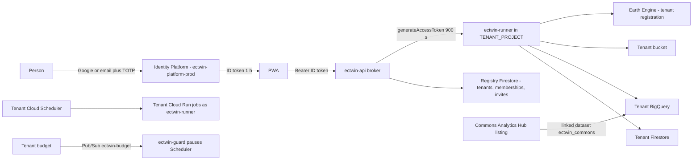
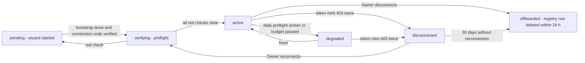
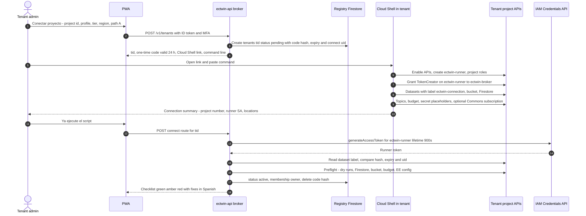
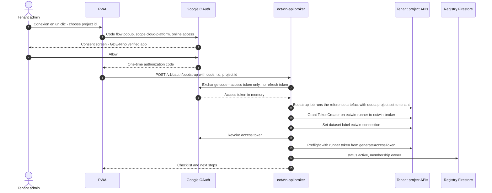
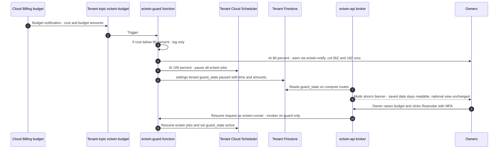

# Identity, tenancy and bring-your-own GCP project

This document specifies how people sign in to *Gemelo Digital Ecuador – El Niño* (GDE-Niño), how organisations become **tenants** by connecting their **own Google Cloud project**, and how the platform works inside those projects without holding standing secrets. It covers Identity Platform configuration and sessions; the tenant, membership and role model; the four connection mechanisms A–D (spine D8) with step-by-step procedures; the exact resources the bootstrap creates in a tenant project; the broker that mints short-lived credentials; who pays for every call; cost guardrails and the kill switch; third-party access each tenant may need; offboarding; security controls and a threat model; LOPDP roles and residency profiles; and troubleshooting. Components, buckets, datasets, Firestore collections and API routes are defined in [03-architecture.md](./03-architecture.md) and are reused here by name, not re-described. Setup commands for the central projects are in [10-setup-and-deployment.md](./10-setup-and-deployment.md); costs in [09-cost-model.md](./09-cost-model.md); legal detail in [13-governance-legal-risk.md](./13-governance-legal-risk.md).

## Contents

1. [Goals and principles](#1-goals-and-principles)
2. [Identity: Identity Platform and sessions](#2-identity-identity-platform-and-sessions)
3. [Tenant model, memberships and roles](#3-tenant-model-memberships-and-roles)
4. [Connecting a project: mechanisms A–D](#4-connecting-a-project-mechanisms-ad)
5. [What the bootstrap provisions in the tenant project](#5-what-the-bootstrap-provisions-in-the-tenant-project)
6. [Broker design](#6-broker-design)
7. [Who pays for each call](#7-who-pays-for-each-call)
8. [Cost guardrails and kill switch](#8-cost-guardrails-and-kill-switch)
9. [Third-party access per tenant, and what the Commons provides instead](#9-third-party-access-per-tenant-and-what-the-commons-provides-instead)
10. [Offboarding, revocation and portability](#10-offboarding-revocation-and-portability)
11. [Security controls and threat model](#11-security-controls-and-threat-model)
12. [LOPDP roles and data-residency profiles](#12-lopdp-roles-and-data-residency-profiles)
13. [Troubleshooting](#13-troubleshooting)
14. [Delivery plan and acceptance criteria](#14-delivery-plan-and-acceptance-criteria)
15. [Open questions](#15-open-questions)

Owner codes (PL, DL, FL, FE, AI, SRE, DPO, TA, PM) are those of [03-architecture.md](./03-architecture.md#contents); requirement IDs (FR-, NFR-) are from [02-users-requirements-ux.md](./02-users-requirements-ux.md#5-functional-requirements).

---

## 1. Goals and principles

### 1.1 Goals

| # | Goal (user requirement) | How it is met | Measurable acceptance |
|---|---|---|---|
| G1 | **Sign-in is required to access** anything beyond the landing, legal, status and help pages (D6) | Identity Platform ID token on every app, tile and API route (FR-001) | Pen test finds no unauthenticated data route; sign-in ≤3 screens |
| G2 | **An own GCP project is required to save** anything: sessions, AOIs, views, subscriptions, runs, reports, custom models (D7) | T0 users keep view state in `sessionStorage` only; every save goes to the tenant's Firestore, BigQuery or bucket | Code scan and integration test: no write path for T0; registry contains only the fields in §3.4 |
| G3 | **Costs are decentralised**: whoever benefits pays | Tenant work is billed to the tenant through quota project = tenant, runner SA in the tenant, jobs inside the tenant (AP-02) | For a test tenant, 100% of BigQuery, EE, Firestore, Run and GCS usage from its routes appears on its own billing export; platform bill stays ≤US$45/month at pilot (NFR-017) |
| G4 | **No standing secrets** held by the platform | ≤15-minute impersonated tokens; no service-account keys; OAuth access token used once; no refresh tokens (AP-06) | Automated scan: zero SA keys in platform projects; zero refresh tokens in any store (FR-006) |
| G5 | **Institutions keep their workspace across staff and authority turnover** (29 Nov 2026 hand-over) | Org-owned projects; ≥2 Owners; ownership recoverable by whoever controls the GCP project (§3.7) | A test hand-over loses no data (FR-016) |
| G6 | **Works for secure-by-default and regulated organisations** | Admin exception note, WIF path C, self-deploy path D | Path C validated with one ministry test organisation by 2027-01-31 (FR-007) |

### 1.2 Principles

| ID | Principle | Consequence |
|---|---|---|
| IT-01 | GCP project control is the root of trust for tenancy | Connecting or reclaiming a tenant requires proof of IAM control of the project (a grant only a project admin can make, plus a one-time connection code written into the project as a dataset label) |
| IT-02 | One cross-project grant per tenant | `roles/iam.serviceAccountTokenCreator` on the **`ectwin-runner` service-account resource** (not the project) to `ectwin-broker@ectwin-platform-prod.iam.gserviceaccount.com` |
| IT-03 | The broker is a deputy, never an owner | It acts only for an authenticated member, on routes their role allows, with the tenant as billing project |
| IT-04 | Scheduled work runs inside the tenant | Cloud Run jobs under `ectwin-runner`; if the platform disappears, the tenant's pipelines keep running |
| IT-05 | Identity and personal data stay minimal centrally | Registry holds identifiers and routing data only (NFR-013); contact data and sessions live in the tenant |
| IT-06 | Fail closed | Any failed check (token, membership, role, status, licence, budget state) denies the action with a Spanish explanation |
| IT-07 | Everything a tenant needs to leave is already in its project | Open formats; export job; the platform deletes its registry row within 24 h |

### 1.3 End-to-end picture



---

## 2. Identity: Identity Platform and sessions

### 2.1 Choice

The control plane uses **Identity Platform** (Google Cloud's upgraded Firebase Authentication) in `ectwin-platform-prod` on the Blaze plan. On the Spark plan "Firebase Auth with Identity Platform" is capped at 3,000 DAU (2 for SAML/OIDC); upgrading unlocks TOTP MFA, blocking functions, SAML/OIDC, multi-tenancy and an SLA ([secondary summary of firebase auth limits](https://github.com/jposluns/secureconfig/blob/main/identity-providers.md)). *Identity Platform "tenants" are IdP configurations; they are unrelated to GDE-Niño tenants* (see [03 §6.3](./03-architecture.md#63-authentication-and-token-flow)).

### 2.2 Configuration

| Setting | Value | Why / source |
|---|---|---|
| Providers (Tier 1) | **Google** and **Email/password** | D6. Phone and anonymous sign-in **disabled** |
| Email verification | Required before any data route: the broker rejects tokens with `email_verified=false` (except `/v1/me` and resend-verification) | Stops invitation hijack by unverified addresses (§3.5) |
| Account linking | One account per email address; link Google and password sign-ins that share a verified email **(setting name to confirm)** | Avoid duplicate uids for the same person |
| Password policy | ≥12 characters, checked against a breached-password list client-side; enforce server-side if Identity Platform password policy is available **(to confirm)** | ASVS L2 (NFR-011) |
| Email enumeration protection | On **(availability to confirm)** | Reduce account discovery |
| MFA | **TOTP** enabled; mandatory for Owner, Admin and platform operators (FR-002) and for a *Firmante técnico* at the moment of signing ([02 §3.4](./02-users-requirements-ux.md#34-roles-within-a-tenant)); SMS MFA **off** | SMS to Ecuador costs US$0.16 each after 10 free/day ([pricing](https://cloud.google.com/identity-platform/pricing)) |
| Tier 2 providers | SAML and OIDC per ministry, through Identity Platform multi-tenancy ([multi-tenancy](https://docs.cloud.google.com/identity-platform/docs/multi-tenancy-authentication)) | FR-003, Phase 2 |
| Authorised domains | App domain and `localhost` for dev only **(domain to confirm)** | Redirect safety |
| Email templates | Spanish (es-EC) verification, password reset, MFA enrolment notices; sender on the app domain **(to confirm)** | Spanish-first (D19) |
| Blocking functions | `beforeUserCreated` and `beforeUserSignedIn` (§2.5) | Deny-list, disabled accounts, SAML domain mapping |
| Data held | uid, email, provider ids, MFA enrolment; nothing else | Identity Platform has **no data-location commitment** ([data residency list](https://cloud.google.com/terms/data-residency)); keep it minimal (NFR-015) |

Terraform (in `infra/platform/identity.tf`; resource arguments **to confirm against the pinned google provider**):

```hcl
resource "google_identity_platform_config" "default" {
  project                    = "ectwin-platform-prod"
  autodelete_anonymous_users = true
  sign_in {
    allow_duplicate_emails = false
    email {
      enabled           = true
      password_required = true
    }
  }
  mfa {
    state             = "ENABLED"            # enforcement per role is done by the broker
    enabled_providers = []                   # no SMS
    provider_configs {
      state = "ENABLED"
      totp_provider_config { adjacent_intervals = 1 }
    }
  }
  authorized_domains = ["<APP_DOMAIN>"]      # to confirm
}

resource "google_identity_platform_default_supported_idp_config" "google" {
  project       = "ectwin-platform-prod"
  idp_id        = "google.com"
  enabled       = true
  client_id     = var.google_oauth_client_id      # web client of the consent screen in §4.3
  client_secret = var.google_oauth_client_secret  # stored in Secret Manager, injected by CI
}
```

### 2.3 MFA policy and recovery

1. **Enrolment.** Owners, Admins and Signers are forced into TOTP enrolment before their first tenant action; the broker checks the second-factor claim on MFA-gated routes (expected claim `firebase.sign_in_second_factor` **(unverified; confirm)**).
2. **Recovery.** The briefs document no built-in TOTP recovery codes in Identity Platform, so recovery codes are an application feature **(design; confirm the product has no native equivalent)**: at enrolment the app shows 10 single-use recovery codes; their SHA-256 hashes are stored in the **tenant** Firestore `users/{uid}` of the tenant where the person first became Owner or Admin (not centrally), and a valid code lets the broker unenrol the lost factor through the Admin SDK. Before the first tenant is connected there is nowhere to store them, so an Owner-to-be who loses the device during onboarding recovers through the operator ticket in step 3. A T0 user has no MFA requirement.
3. **Lost device.** Another Owner of the same tenant can trigger "restablecer MFA" (Admin SDK unenrol) after a second Owner confirms; operators can do it only with a ticket and two-person check; every reset is written to `ectwin.audit_events` and the operator log.

### 2.4 Tier 2: SAML/OIDC for ministries (Phase 2, FR-003)

1. The ministry's IdP team sends SAML metadata (entity id, SSO URL, signing certificate) or OIDC issuer and client.
2. PL creates an Identity Platform tenant `idp-<ministry-code>` with a `google_identity_platform_inbound_saml_config` or `google_identity_platform_oauth_idp_config` **(resource names to confirm)**; attribute mapping: `email`, `given_name`, `family_name` only.
3. The GDE-Niño tenant record gets `sso_idp` = that Identity Platform tenant id; invitations for that tenant must be accepted with the SSO login (§3.5).
4. Cost: first 50 Tier-2 MAU free, then **US$0.015/MAU** ([pricing](https://cloud.google.com/identity-platform/pricing)). The 50 free MAU are one allowance for the platform project, not one per ministry **(reading of the pricing page; to confirm)**. The first 500-user ministry costs (500 − 50) × 0.015 = **US$6.75/month** (estimate); each further 500-user ministry adds 500 × 0.015 = **US$7.50/month** (estimate), all billed to the operator. Where the operator cannot absorb it, charge back through the tenant agreement **(to confirm)**.
5. Acceptance: a test ministry IdP signs a user into the right tenant; MAU visible in the operator console.

### 2.5 Blocking functions

Deployed as Cloud Run functions in `ectwin-platform-prod` (priced as Cloud Run, [pricing](https://cloud.google.com/functions/pricing)). Handler names follow the Firebase v2 identity API **(names to confirm)**:

```javascript
// services/identity-hooks/index.js
import { beforeUserCreated, beforeUserSignedIn, HttpsError } from "firebase-functions/v2/identity";
const DENY = new Set((process.env.DENY_DOMAINS || "").split(","));   // disposable-mail domains
export const onCreate = beforeUserCreated((event) => {
  const email = (event.data.email || "").toLowerCase();
  if (DENY.has(email.split("@")[1])) throw new HttpsError("permission-denied", "Dominio no permitido");
  // Stores nothing. Roles are NOT put in custom claims: they are per tenant and must change instantly.
});
export const onSignIn = beforeUserSignedIn((event) => {
  if (event.data.disabled) throw new HttpsError("permission-denied", "Cuenta deshabilitada");
});
```

Rule: **no roles or tenant ids in custom claims.** ID tokens live 1 h, so a claim-based role would outlive its revocation; the broker reads roles from the registry instead (§3.4).

### 2.6 Identity pricing

| Item | Price | Pilot (2,000 MAU) | National (20,000 MAU) |
|---|---|---|---|
| Tier 1 (Google, email) | Free to 50,000 MAU; then US$0.0055/MAU to 100k ([pricing](https://cloud.google.com/identity-platform/pricing)) | US$0 | US$0 |
| Tier 2 (SAML/OIDC) | 50 MAU free, then US$0.015/MAU | US$0 (none) | e.g. 3 ministries × 500 users: (1,500 − 50) × 0.015 = ≈US$21.75 (estimate) |
| SMS | US$0.16 per SMS to Ecuador after 10/day free | Disabled | Disabled |
| Blocking functions | Cloud Run request pricing, 2M requests/month free per billing account ([run pricing](https://cloud.google.com/run/pricing)) | ≈US$0 | ≈US$0 |

Identity is the **only unavoidable central cost** that scales with users. Tier 1 stays at US$0 below 50,000 MAU (NFR-010); Tier 2 grows linearly with SSO users from the 51st.

### 2.7 Session handling

| Aspect | Design |
|---|---|
| Token type | Identity Platform ID token (JWT, 1 h — the standard Firebase lifetime, not re-checked in the briefs **(unverified)**) sent as `Authorization: Bearer`; no cookies, so CSRF does not apply; strict CSP (NFR-011) |
| Refresh | The web SDK refreshes the ID token with its own Identity Platform refresh token, held **only in the browser** (IndexedDB) |
| Persistence | Default: local persistence. A "Equipo compartido" checkbox switches to session persistence (cleared when the tab closes) |
| Idle timeout | Tenant views lock after 12 h idle; event mode after 24 h (estimate; tune in pilot) |
| Recent-auth routes | Connect, disconnect, member/role changes, MFA reset, report sign-off, bulk export, `DELETE /v1/me`: require `auth_time` ≤10 min, else the app re-prompts |
| Revocation | On member removal, account deletion or suspected compromise the broker calls Admin SDK `revoke_refresh_tokens(uid)`; sensitive routes verify with `check_revoked=True`; other routes are bounded by the 1-h token life |
| T0 state | Language, first-run acknowledgement and view state in browser storage only (FR-004, D6) |
| Tenant sessions | Saved to tenant Firestore `users/{uid}/sessions/{sessionId}` with `expire_at` TTL 30 days ([03 §5.6](./03-architecture.md#56-firestore--tenant-tenant_project-default-southamerica-west1-by-default)) |
| Central session data | **None.** The broker keeps no server-side session; request logs keep a 16-char SHA-256 prefix of the uid, never email |

### 2.8 Setup steps (owner PL, by 2026-10-02 in `-dev`, 2026-10-09 in `-prod`)

1. Upgrade `ectwin-platform-{dev,prod}` Firebase projects to Blaze and enable Identity Platform (console step).
2. Create the OAuth web client and consent screen (§4.3) — the same client serves Google sign-in and path B.
3. `terraform apply` `infra/platform/identity.tf` (config, Google provider, TOTP).
4. Upload Spanish email templates; set sender domain (SPF/DKIM on the app domain **(to confirm)**).
5. Deploy the blocking functions; register them in Identity Platform settings.
6. Test matrix: Google sign-in, password sign-up + verification, TOTP enrolment, recovery code, account linking, disabled user, revoked token on a sensitive route. **Acceptance:** all 7 pass in `-stg` before 2026-10-16 (M0.4 in [03 §13](./03-architecture.md#13-architecture-milestones-and-acceptance-criteria)).

---

## 3. Tenant model, memberships and roles

### 3.1 Definitions

- **Tenant** = exactly **one GCP project** registered in the platform registry, identified by `tid` (random 12-character id, never the project id) ([03 §5.5](./03-architecture.md#55-firestore--platform-registry-ectwin-platform-prod-southamerica-west1)).
- A project can back **at most one** tenant: the registry enforces uniqueness on `tenant_project_id` and `project_number`.
- **Member** = an Identity Platform user with an active membership in a tenant, holding one role.
- **Organisation** = the legal entity behind one or more tenants (a ministry may run `prod` and `capacitacion` tenants, or one per *dirección*).

### 3.2 Organisational vs personal tenants

| | Organisational tenant | Personal tenant |
|---|---|---|
| Who | GAD, ministry, SNGR/COE unit, company, university, NGO | Researcher, consultant, student |
| Project owner | Project under the organisation's Cloud Identity/Workspace organisation, or in a sponsor folder (T4) | Individual's project (often no organisation, e.g. a Gmail account) |
| `org_type` | `gad`/`ministerio`/`privado`/`academia`/`ong` | `personal` (**addition to 03 §5.5**) |
| Owners | **≥2 required** (02 §3.4); warning banner while only one | 1 allowed |
| Billing | Organisation billing account, reseller invoice, or sponsor | Personal card; free trial US$300 ([free](https://cloud.google.com/free)) |
| Survives staff turnover | Yes (G5) | No — data is the person's |
| Can be T4 sponsored | Yes | No |
| Secure-by-default org policies | Likely (§4.4) | Not applicable to projects without an organisation ([IAM release notes](https://docs.cloud.google.com/iam/docs/release-notes)) |
| LOPDP | Organisation is controller (§12) | Household exemption may apply (Art. 2(a)) **(to confirm with counsel)** |

The wizard asks "¿Este proyecto pertenece a una institución?" and warns when an institution connects a personal project ("si esta persona deja la institución, se pierde el espacio de trabajo").

### 3.3 Roles

Four access roles plus two capability flags. UI names are Spanish; the four role codes match the tenant Firestore `members/{uid}.role` values in [03 §5.6](./03-architecture.md#56-firestore--tenant-tenant_project-default-southamerica-west1-by-default). 03 also lists `signer` and `auditor` as `role` values; this document models them as boolean flags on `members/{uid}` so that a person can be, for example, Analyst *and* Signer (reconcile, §15).

| Role (UI) | Code | Rank | MFA | Summary |
|---|---|---|---|---|
| Owner (*Propietario/a*) | `owner` | 4 | Required | Connect/disconnect, org and licence profile, members, costly runs, budgets |
| Admin (*Administrador/a*) | `admin` | 3 | Required | Members (except Owners), integrations, retention, cost view |
| Analyst (*Analista*) | `analyst` | 2 | Optional | AOIs, rules, runs within the cost cap, drafts, downloads, saved queries |
| Viewer (*Lector/a*) | `reader` | 1 | Optional | View, download PDFs and cards, comment |
| Flag: *Firmante técnico* | `signer` | — | Recommended (required to sign) | Sign reports and evidence packs; combinable with Analyst or above |
| Flag: *Auditor/a* | `auditor` | — | Recommended | Read audit log and evidence packs; combinable with any role |

Permission matrix (API routes from [03 §6.2](./03-architecture.md#62-endpoints)):

| Action / route group | Viewer | Analyst | Admin | Owner |
|---|---|---|---|---|
| National views `/v1/national/*`, tiles | ✔ | ✔ | ✔ | ✔ |
| Read AOIs, views, runs, reports in tenant | ✔ | ✔ | ✔ | ✔ |
| Save own session, subscriptions, devices | ✔ | ✔ | ✔ | ✔ |
| Create/edit AOIs, views, rules; launch runs ≤ cost cap; saved queries (T2+); decisions; report drafts; exports | — | ✔ | ✔ | ✔ |
| Launch runs above cap (FR-066) | — | — | — | ✔ |
| Invite/remove Viewers and Analysts; integrations; retention | — | — | ✔ | ✔ |
| Invite/remove Admins and Owners; transfer ownership | — | — | — | ✔ |
| Org/licence profile, tier, region profile, connect, disconnect, reclaim | — | — | — | ✔ |
| Cost dashboard `/v1/t/{tid}/costs` | — | — | ✔ | ✔ |
| Audit log `/v1/t/{tid}/audit` | `auditor` flag | `auditor` flag | `auditor` flag | ✔ |
| Sign report `…:sign` | `signer` flag + MFA | same | same | same |

**GCP IAM is separate from app roles.** Only the person running the bootstrap needs GCP permissions (§5.3.3); Analysts and Viewers need **no** GCP IAM roles at all — they reach tenant data only through the broker.

### 3.4 Where membership data lives

The registry keeps the minimum needed to route and authorise; everything descriptive lives in the tenant.

| Store | Document | Fields | Authority |
|---|---|---|---|
| Registry `ectwin-platform-prod` (Firestore, `southamerica-west1`) | `memberships/{tid}_{uid}` | `tenant_id`, `uid`, `email`, **`role`** (`owner`/`admin`/`analyst`/`reader`), `status` (`invited`/`active`/`removed`), `invited_by`, `created_at` | **Authoritative for access control** |
| Registry | `invites/{inviteId}` | `tenant_id`, `email_hash`, **`role`**, `token_sha256`, `expires_at` (7 days), `created_by` (`role` and `token_sha256` are **additions to 03 §5.5**) | Deleted on accept or expiry |
| Registry | `tenants/{tid}` | As [03 §5.5](./03-architecture.md#55-firestore--platform-registry-ectwin-platform-prod-southamerica-west1), plus `connect_code_sha256`, `connect_code_expires_at` and `connect_uid` while `status=pending`, and `sso_idp` (**additions to 03 §5.5**) | Routing |
| Tenant Firestore | `members/{uid}` | `role` (mirror), `signer`, `auditor`, `mfa_required`, `added_by`, `added_at`, display name | Mirror + capability flags |

Rules: the broker writes both stores in the same request (registry first); `ectwin-sync` reconciles nightly; on mismatch the broker applies the **lower** rank and emits `role_drift` to the tenant audit log (IT-06). Keeping `role` in the registry (a small extension of NFR-013's field list, flagged in §15) lets the broker authorise member management and reconnection even when the tenant project is unreachable, and saves one cross-region tenant read per request.

### 3.5 Invitations (FR-014)

1. Owner/Admin calls `POST /v1/tenants/{tid}/members` with `{email, role, signer?, auditor?}` (recent-auth + MFA).
2. Broker creates `invites/{inviteId}` with `email_hash = sha256(lowercase(email))`, a 32-byte random token (only its hash stored), `expires_at = now + 7 days`; sends the link `https://<APP_DOMAIN>/invitacion/{inviteId}#t=<token>` through `ectwin-notifier` (email).
3. Invitee signs in (any Tier-1 provider, or the tenant's SSO when `sso_idp` is set). The broker accepts only if the token hash matches, the invite is unexpired, `email_verified=true` and the verified email hashes to `email_hash`.
4. Broker writes `memberships/{tid}_{uid}` (`active`) and tenant `members/{uid}`; deletes the invite; audit event `member_added`.
5. Optional tenant setting `allowed_email_domains` (e.g. `portoviejo.gob.ec`): invitations outside the list need Owner confirmation ("correo personal en espacio institucional").
6. Failure paths: expired → Owner re-sends; email mismatch → "Esta invitación es para otra dirección"; already a member → role change flow.

### 3.6 Multiple projects per user and switching

- A person may hold memberships in any number of tenants (e.g. a provincial analyst in both *Prefectura* and a university project). `GET /v1/me` returns all active memberships.
- The PWA shows a **project switcher** (tenant display name, tier, role, connection state). One tenant is active per browser tab; the last-used `tid` is remembered in browser storage only.
- Every tenant route carries `tid` in the path (`/v1/t/{tid}/…`); the broker never infers the tenant from context, never accepts a project id from the client outside the connect routes (where the connection proof verifies it), and never mixes tenants in one query. There are **no cross-tenant queries**; sharing between tenants is by exported package (FR-060) or, in Phase 3, a tenant-published Analytics Hub listing.
- A user can register several projects of their own (e.g. `-dev` sandbox and production); each is a separate tenant with separate billing.

### 3.7 Ownership recovery and hand-over

Authorities change after the local elections of 29 Nov 2026 ([01 §7.4](./01-context-el-nino-ecuador.md#74-compound-and-cascading-risk)). Two mechanisms:

1. **Planned hand-over (FR-016).** Outgoing Owner invites the successor as Owner, successor accepts with MFA, outgoing Owner reviews members and re-confirms the org profile; the broker produces a checklist PDF to the tenant bucket.
2. **Reclaim (no Owner left).** A person who can modify the tenant project (project Owner, or the roles in §5.3.3) starts *Recuperar propiedad* in the wizard, receives a fresh one-time connection code, and re-runs the idempotent bootstrap with it (`scripts/bootstrap-tenant.sh --project <TENANT_PROJECT> --connection-code <CODE>`, or `connection_code` in Terraform). The re-run is idempotent, so on a healthy project it changes only the connection label (§4.2 step 6); the broker verifies it exactly as at first connection and makes that person an Owner, notifying all previous Owners by email. No separate reclaim flag is needed. Rationale: whoever controls the GCP project already controls the data (IT-01).

### 3.8 Tenant lifecycle



---

## 4. Connecting a project: mechanisms A–D

### 4.1 Overview and trade-offs

| | **A. Cloud Shell / Infrastructure Manager bootstrap** (default) | **B. One-time OAuth** ("Conexión en un clic") | **C. Secure-by-default orgs**: C1 admin exception, C2 WIF | **D. Self-deployed copy** |
|---|---|---|---|---|
| Who runs it | Tenant admin, in their own Cloud Shell | Tenant admin clicks consent; broker runs the bootstrap with the admin's token | Org admin (C1) or tenant admin with pool rights (C2) | Tenant's own cloud team |
| Time (median target) | ≤30 min (FR-006) | ≤10 min | C1: days (org change process); C2: ≤60 min once issuer exists | ≤1 day from docs (FR-008) |
| What the platform ever holds | Nothing but the registry row (and the hash of a one-time connection code until connect) | A `cloud-platform` access token **in memory for the bootstrap only** (≤ a few minutes), then revoked | Nothing (C2: a signing key in KMS, per environment) | Nothing |
| Standing access | Token Creator on `ectwin-runner` → broker SA | Same | C1 same; C2 Token Creator to a **pool principal in the tenant's own project** | **None** |
| Works with `iam.allowedPolicyMemberDomains` | No, unless exception | No, unless exception | Yes (C1 by exception; C2 expected yes **(to confirm)**) | Yes |
| Needs sensitive-scope OAuth verification | No (Google sign-in uses only non-sensitive scopes, which need basic verification) | **Yes** (`cloud-platform`) | No | No |
| Upgrades | Re-run script or Infrastructure Manager re-apply | Broker re-runs with a new consent | As A | Tenant pulls tagged releases |
| Audit trail | Tenant sees admin's own actions in Cloud Audit Logs | Tenant sees admin's identity with the platform OAuth client | As A | Tenant only |
| Phase | 1 (M0.4, 2026-10-16) | 1, behind flag until verified (target 2026-11-13, estimate) | C1 note Phase 1; C2 Phase 2 (2027-01-31) | 3 |
| Recommended for | Ministries, GADs, companies | Individuals, universities, small NGOs | Ministries with hardened orgs | Regulated/sovereign tenants, VPC-SC users |

Steady state for A–C is identical: the broker mints ≤15-minute tokens for interactive calls; scheduled pipelines run inside the tenant (D8).

### 4.2 Path A — Cloud Shell or Infrastructure Manager (default)

**Prerequisites:** a project with billing enabled (the BigQuery sandbox is not supported, because Cloud Run, Scheduler and budgets need billing, and the sandbox rejects queries on upper-bound estimates); the admin has the roles in §5.3.3 (project Owner is simplest).

Procedure:

1. **Start (web).** Owner-to-be signs in with MFA → *Conectar proyecto* → project ID → org profile (type, commercial/noncommercial use, sector; FR-012) → tier → region profile (§12.3) → path A. The broker calls `POST /v1/tenants`, creating `tenants/{tid}` with `status=pending`, `tenant_project_id`, `connect_uid=uid`, `connect_code_sha256` and `connect_code_expires_at` (24 h). The wizard shows the one-time **connection code** once: 26 random base32 characters in lowercase (≈130 bits), prefixed `c-`, so that it is a valid BigQuery label value (`[a-z0-9_-]{8,63}`, the rule enforced by the reference artefacts).
2. **Open Cloud Shell.** The button opens `https://shell.cloud.google.com/cloudshell/editor?cloudshell_git_repo=<REPO_URL>&cloudshell_tutorial=<TUTORIAL_MD>` (URL pattern as in [Google's example](https://github.com/GoogleCloudPlatform/bigquery-antipattern-recognition/blob/main/terraform/README.md); the public repository URL and the Spanish tutorial file are **still to be created**).
3. **Run.** The admin pastes the one-line command shown by the wizard, built from the flags that `scripts/bootstrap-tenant.sh` v0.1.0 accepts, e.g. `scripts/bootstrap-tenant.sh --project gad-portoviejo-ectwin --connection-code c-<CODE> --tier T1 --budget-usd 20 --firestore-location southamerica-west1`. Organisation type, licence profile and tier stay in the registry; the script does not need them except `--tier` for labels and the T3 feature flags (`--enable-vertex`, `--enable-batch`).
4. **Script work (≈8–12 min, estimate).** Checks the gcloud account, project state, billing link and the caller's permissions → enables APIs → creates `ectwin-runner` → project roles → **Token Creator grant to the broker** → datasets (and the connection label, step 6) → bucket → Firestore → Pub/Sub topics → budget → secret placeholders → optional Commons subscription (`--subscribe-commons`) → prints a non-secret connection summary (project number, runner SA, locations). Reference behaviour and exit codes: §5.8.
5. **Alternatives A1 (Terraform in Cloud Shell) and A3 (Infrastructure Manager).** Teams that want Terraform state run `infra/tenant-bootstrap/` directly (A1) or as an Infrastructure Manager deployment (A3; cost: Cloud Build minutes and a state bucket only, [pricing](https://cloud.google.com/infrastructure-manager/pricing)). A3 runs as a tenant-side deployer service account the admin creates first (`ectwin-infra` in the artefact README; **command syntax, supported Terraform versions and required roles to confirm**). Re-applying the same configuration is the upgrade path.
6. **Connection proof.** The bootstrap sets the label `ectwin-connection=<CODE>` on dataset `<TENANT_PROJECT>:ectwin` (Terraform variable `connection_code`, script flag `--connection-code`). Only someone who can update the project's datasets can set it; `ectwin-runner` holds `roles/bigquery.dataEditor`, which is expected not to include `bigquery.datasets.update` **(to confirm)**, so the broker cannot forge it by impersonation.
7. **Connect (web).** The admin clicks *Ya ejecuté el script* (optionally pasting the connection summary) → `POST /v1/tenants/{tid}:connect`. The broker: (a) mints a runner token (proves the Token Creator grant, which only a project IAM admin can create); (b) reads the dataset label with that token, hashes it and compares it with `connect_code_sha256`, checks `connect_code_expires_at` and that the caller is `connect_uid` (proves the same person who started the wizard controls the project); (c) checks the project ID (and the project number from the summary) is not registered to another tenant; (d) runs preflight (§4.7); (e) sets `status=active`, writes the Owner membership and deletes the code hash, so a label left behind is useless.
8. **Next steps** shown by the wizard: Earth Engine registration (§5.7.4), external-access tracker (§9), invite a second Owner (§3.5).



### 4.3 Path B — one-time OAuth consent

**When:** individuals, universities and NGOs without a cloud team, once the OAuth app is verified. Until then path B is limited to test users and the wizard recommends path A (FR-006, J1 failure paths).

Procedure:

1. Step 1 of §4.2 is identical, with path B selected (the connection code is generated but not shown).
2. The PWA uses Google Identity Services **authorization-code flow in popup mode** with `scope=https://www.googleapis.com/auth/cloud-platform`, `include_granted_scopes=true` (incremental consent on top of sign-in) and **online access** — no refresh token is requested (online-access semantics **to confirm**; refresh-token rules in [OAuth rules summary](https://github.com/Pbarnett/github-link-up-buddy/blob/main/docs/api/google-oauth/GOOGLE_OAUTH_1.md)). The screen explains in Spanish: "Usaremos este permiso una sola vez para preparar su proyecto; no guardamos ninguna credencial permanente."
3. The PWA posts the one-time OAuth authorization code, `tid` and the chosen `project_id` to `POST /v1/oauth/bootstrap`.
4. The broker exchanges the code for an **access token only** and starts a short-lived **bootstrap job** in `ectwin-platform-prod` that runs the **same reference artefact** as path A — the idempotent `scripts/bootstrap-tenant.sh` (no Terraform state to keep) or the `infra/tenant-bootstrap/` module, as the artefact README proposes (README §6.4). The token is passed in memory only (Terraform reads `GOOGLE_OAUTH_ACCESS_TOKEN`; gcloud can read an access-token file on the job's in-memory filesystem — **mechanism to confirm**), and every call names the tenant project as quota project (`x-goog-user-project` / `--billing-project`). Reusing the artefact avoids a second implementation; a Python REST engine with a CI parity test is the fallback if the job approach fails (§15).
5. The job passes the connection code it generated itself (it never leaves the platform) as `--connection-code`, and grants Token Creator to the broker like path A.
6. The broker **revokes** the access token at Google's revoke endpoint (URL **unverified**; commonly `https://oauth2.googleapis.com/revoke`), drops it from memory, and continues with §4.2 step 7 (c)–(e). The token is never logged; log redaction tests enforce this.
7. If the admin's organisation enforces Google Cloud session control, consent may require re-authentication; because no refresh token exists, `invalid_grant`/`invalid_rapt` cannot affect later operations (Session control row in §4.3.1).



#### 4.3.1 OAuth consent screen and verification plan (owner PL with DPO)

| Item | Plan |
|---|---|
| Client | One OAuth web client in `ectwin-platform-prod`, shared by Google sign-in and path B |
| User type | External. (An *Internal* app needs no review but serves only the owner's own Workspace organisation, so it fits only a path D tenant that registers its own OAuth client.) |
| Scopes | `openid`, `email`, `profile` (non-sensitive) and `https://www.googleapis.com/auth/cloud-platform` (**sensitive, not restricted** per the brief — **unverified classification; confirm in the Google Auth Platform console**) |
| Scopes never requested | `drive` (restricted; would require a CASA security assessment) — note the Earth Engine Python client requests `drive` by default ([ee/oauth.py](https://github.com/google/earthengine-api/blob/master/python/ee/oauth.py)); our code never uses `ee.Authenticate()` defaults. Earth Engine's discovery document lists only `cloud-platform`, `cloud-platform.read-only` and `devstorage.full_control` ([EE discovery](https://earthengine.googleapis.com/$discovery/rest?version=v1)) |
| Verification category | Sensitive → basic plus additional verification; restricted would add a security assessment ([consent configuration](https://developers.google.com/workspace/guides/configure-oauth-consent)) |
| Materials | App name "GDE-Niño", logo, home page and Spanish/English privacy policy on the verified app domain, terms of service, scope justification ("provisionar recursos en el proyecto del usuario, una sola vez"), demo video of the consent and bootstrap **(exact requirements to confirm)** |
| Testing mode limits | External apps in Testing issue refresh tokens that **expire in 7 days** unless they request only openid/email/profile (irrelevant: none requested); unverified apps show a warning screen and have a **100-user cap** **(unverified)**, so the pre-approval path B beta is limited to named test users |
| Other limits | 100 refresh tokens per Google Account per client (irrelevant); Google warns against user credentials on servers for long-running jobs — hence impersonation for steady state |
| Session control | Google Cloud session control applies to "any third party OAuth application that requires the Cloud Platform scope"; exceeding it yields `invalid_grant` / `invalid_rapt` on refresh ([summary](https://github.com/AndyForest/SoupNet/blob/main/docs/planning/org-accounts-research/offboarding-deprovisioning.md)). Path B never refreshes, so only the consent moment is affected |
| Timeline | Configure in Testing by 2026-10-02; submit verification **2026-10-05**; expect days to a few weeks **(unverified)**; path B general availability only after approval (target 2026-11-13, estimate); path A covers all pilots meanwhile |
| Organisation blocks | Workspace/Cloud Identity admins can block unconfigured third-party apps **(unverified in the briefs)**; the troubleshooting table gives the admin the client id to trust **(admin console wording to confirm)** |

### 4.4 Path C1 — secure-by-default organisations and the admin exception note

Organisations created on or after **2024-05-03** enforce by default `iam.disableServiceAccountKeyCreation`, `iam.disableServiceAccountKeyUpload`, `iam.automaticGrantsForDefaultServiceAccounts` and **`iam.allowedPolicyMemberDomains`** ([IAM release notes](https://docs.cloud.google.com/iam/docs/release-notes)). The last one makes step "grant Token Creator to `ectwin-broker@ectwin-platform-prod…`" fail, because the broker is a principal from outside the tenant's organisation. Older organisations may have set it deliberately; many Ecuadorian ministries will (FR-007). The other three constraints do not affect GDE-Niño (it uses no keys and no default-SA grants). `iam.disableCrossProjectServiceAccountUsage` should not matter either: it governs *attaching* a service account to a resource in another project ([attach service accounts](https://docs.cloud.google.com/iam/docs/attach-service-accounts)); that it does not block `generateAccessToken` is an inference from the documentation **(confirm in the pilot)**, and tenant jobs run in the tenant project with a tenant SA anyway.

**Detection.** `scripts/bootstrap-tenant.sh` v0.1.0 matches the IAM error text (`permitted customer`, `allowedPolicyMemberDomains`, `allowedPolicyMembers`, `org policy`; exact Google wording **unverified**), finishes the other steps, and exits with code **3** and "ACTION NEEDED: domain-restricted sharing blocked the broker grant"; with Terraform, `google_service_account_iam_member.broker_token_creator` fails with an org-policy error. The wizard offers the note below when PF-01 fails for a project that belongs to an organisation (or directly when the path B job reports the same error) and generates it as a PDF with the tenant's project id filled in.

**Exception, in two parts, on the tenant project only.** Secure-by-default organisations enforce the **legacy** list constraint `iam.allowedPolicyMemberDomains`, so that constraint must be relaxed on the tenant project first: a project-level policy that also allows the operator's Cloud Identity customer ID **(customer ID to publish; exact value form to confirm)**. To keep the project as tight as before, the org admin then enforces the **managed** constraint `iam.managed.allowedPolicyMembers` on the same project, which supports `allowedMemberSubjects` and `allowedPrincipalSets` ([cloud-foundation-fabric example](https://github.com/GoogleCloudPlatform/cloud-foundation-fabric/blob/master/fast/stages/0-org-setup/datasets/hardened/organization/org-policies/iam.yaml)), allowing the organisation's own principals plus the single broker service account (YAML shape **to confirm** against the example and the org-policy docs; how the two constraints combine is **to confirm** with the org admin):

```yaml
# policy-ectwin.yaml  — gcloud org-policies set-policy policy-ectwin.yaml
name: projects/<TENANT_PROJECT>/policies/iam.managed.allowedPolicyMembers
spec:
  rules:
  - enforce: true
    parameters:
      allowedMemberSubjects:
      - serviceAccount:ectwin-broker@ectwin-platform-prod.iam.gserviceaccount.com
      allowedPrincipalSets:
      - //cloudresourcemanager.googleapis.com/organizations/<TENANT_ORG_ID>
```

If the organisation already uses only the managed constraint, the project-level managed policy above is the whole exception. Changing org policies needs an org-level policy administrator role **(role name to confirm)**.

**Exception note (template generated by the wizard, abbreviated):**

> *Solicitud de excepción de política de organización — GDE-Niño.* El proyecto `<TENANT_PROJECT>` de `<INSTITUCIÓN>` necesita que una sola cuenta de servicio externa, `ectwin-broker@ectwin-platform-prod.iam.gserviceaccount.com`, reciba **únicamente** el rol `roles/iam.serviceAccountTokenCreator` **sobre la cuenta de servicio** `ectwin-runner@<TENANT_PROJECT>.iam.gserviceaccount.com` (no sobre el proyecto). La excepción se limita a este proyecto: se ajusta `iam.allowedPolicyMemberDomains` solo en él y se aplica `iam.managed.allowedPolicyMembers` para admitir únicamente los principales de la institución y esa cuenta de servicio. Efectos: la plataforma puede obtener credenciales de hasta 15 minutos para actuar con los permisos mínimos del ejecutor (§5.3); todas las acciones quedan en Cloud Audit Logs con ambas identidades; la institución puede revocarla en cualquier momento eliminando el enlace. Alternativa sin identidad externa: federación de identidades (ruta C2) o despliegue propio (ruta D).

### 4.5 Path C2 — Workload Identity Federation with a per-tenant issuer (Phase 2)

Google documents this SaaS pattern: the provider issues signed (not encrypted) ID tokens, publishes `/.well-known/openid-configuration` and JWKS, uses **tenant-specific issuer URLs** to prevent cross-tenant spoofing, immutable tenant claims, a caller-chosen audience (default `https://iam.googleapis.com/projects/NUM/locations/global/workloadIdentityPools/POOL/providers/PROV`, under 180 characters) and ID-token lifetime ≤60 min; the STS token lasts ≤1 h ([WIF for SaaS customers](https://docs.cloud.google.com/iam/docs/use-workload-identity-federation-to-let-customers-access-their-cloud-resources)).

**Platform side (owner PL, component 7 in [03 §3](./03-architecture.md#3-component-inventory)):**

| Element | Value |
|---|---|
| Issuer per tenant | `https://api.<DOMAIN>/t/{tid}` (domain **to confirm**) |
| Discovery and keys | `GET /t/{tid}/.well-known/openid-configuration`, `GET /t/{tid}/jwks.json` (routes in [03 §6.2](./03-architecture.md#62-endpoints)) |
| Signing key | One Cloud KMS asymmetric RSA key per environment, `ectwin-wif-signer` (KMS pricing **to confirm**); `kid` rotated every 90 days; new key published 14 days before first use |
| Token claims | `iss` (per tenant), `sub="ectwin-broker"`, `aud` (tenant's provider), `tenant_id` (immutable), `iat`, `exp` = iat + 600 s |
| Registry | `wif_issuers/{tid}` = `issuer_url`, `kid`, `audience`, `created_at` ([03 §5.5](./03-architecture.md#55-firestore--platform-registry-ectwin-platform-prod-southamerica-west1)) |
| Broker flow | Sign JWT with KMS → exchange at Google STS for a federated token (endpoint **unverified**, commonly `https://sts.googleapis.com/v1/token`) → `generateAccessToken` on `ectwin-runner` with the federated token → ≤15-min runner token. Cloud Run does **not** support WIF direct resource access, so impersonation of the runner is required anyway ([supported services](https://docs.cloud.google.com/iam/docs/federated-identity-supported-services)); Cloud Storage over WIF would also need uniform bucket-level access, which the tenant bucket has |

**Tenant side** (to be added to `infra/tenant-bootstrap/` in Phase 2 behind a variable `enable_wif`, not present in v0.1.0; the provider can take an uploaded JWKS via `jwks_json` ([provider docs](https://github.com/hashicorp/terraform-provider-google/blob/main/website/docs/r/iam_workload_identity_pool_provider.html.markdown)); principal syntax **to confirm**):

```hcl
resource "google_iam_workload_identity_pool" "ectwin" {
  project                   = var.project_id
  workload_identity_pool_id = "ectwin"
  display_name              = "GDE-Nino platform"
}

resource "google_iam_workload_identity_pool_provider" "platform" {
  project                            = var.project_id
  workload_identity_pool_id          = google_iam_workload_identity_pool.ectwin.workload_identity_pool_id
  workload_identity_pool_provider_id = "ectwin-platform"
  attribute_mapping = {
    "google.subject"      = "assertion.sub"
    "attribute.tenant_id" = "assertion.tenant_id"
  }
  attribute_condition = "assertion.tenant_id == '${var.tenant_id}' && assertion.sub == 'ectwin-broker'"
  oidc {
    issuer_uri = "https://api.<DOMAIN>/t/${var.tenant_id}"
    # jwks_json = file("ectwin-jwks.json")   # optional: pin keys instead of discovery
  }
}

resource "google_service_account_iam_member" "wif_broker" {
  service_account_id = google_service_account.runner.name
  role               = "roles/iam.serviceAccountTokenCreator"
  member             = "principal://iam.googleapis.com/projects/${var.project_number}/locations/global/workloadIdentityPools/ectwin/subject/ectwin-broker"
}
```

Role choice: Google's WIF guides commonly grant `roles/iam.workloadIdentityUser` for impersonation **(unverified in the briefs)**; this design keeps `roles/iam.serviceAccountTokenCreator` because the broker also needs `signBlob` for signed URLs, which that role includes ([IAM roles](https://docs.cloud.google.com/iam/docs/roles-permissions/iam)).

Why it helps: the only principal in the tenant's IAM policy belongs to a pool **inside the tenant's own project**, which is expected to pass domain-restricted sharing without an exception — **unverified**; test with a ministry test organisation (FR-007, by 2027-01-31). The v0.1.0 artefacts do not yet contain these resources: path C2 runs them with `platform_broker_sa = ""` and adds the pool, provider and binding (artefact README §6.5; ships in Phase 2). Trade-offs: more engineering (issuer, key rotation, STS dependency) and a second verification per request path; jwks pinning requires tenants to re-apply on key rotation.

### 4.6 Path D — fully self-deployed copy (Phase 3, FR-008)

For regulated or sovereign tenants (e.g. defence-adjacent units, VPC-SC users), or anyone wanting **zero standing operator access**.

1. Tenant clones the tagged release (Apache-2.0, D20); images are referenced **by digest** from the public Artifact Registry `us-central1-docker.pkg.dev/ectwin-platform-prod/ectwin/…` or mirrored into the tenant's own registry.
2. `infra/platform/` is applied in **single-tenant mode** into the tenant's project(s): web app, `ectwin-api` (running as `ectwin-runner` directly — no impersonation), the tenant's own Identity Platform or Identity-Aware Proxy, notifier with tenant-owned channels.
3. The tenant subscribes to the Commons listings like any other tenant (§5.4) and to Commons Pub/Sub topics; nothing flows from the tenant to the operator.
4. Upgrades: the tenant watches release notes and re-applies with the new digests; the operator publishes a changelog and migration notes per release.
5. Support is by screen-share or exported logs only; the operator never receives credentials.
6. VPC Service Controls: see §11.3 (Earth Engine inside a perimeter needs the Professional or Premium plan).

Acceptance (FR-008): a test organisation deploys from the docs alone in ≤1 day; an IAM scan shows no operator principal anywhere in its projects.

### 4.7 Preflight checks (FR-009)

Run at connection, daily at 05:00 ECT, and on demand from *Proyecto y costos*. Results are stored in `tenants/{tid}.last_preflight` (check → green/amber/red, time) and shown with a Spanish fix.

| # | Check | Method | Red if | Fix shown |
|---|---|---|---|---|
| PF-01 | Token mint | `generateAccessToken` on `ectwin-runner` | 403/404 | Re-grant Token Creator on the runner (not the project) |
| PF-02 | Connection proof | Read label `ectwin-connection` on dataset `ectwin` (connect and reclaim only) | Hash, expiry or uid mismatch | Restart wizard; re-run bootstrap with the new code |
| PF-03 | Billing linked | Billing info of project | Not linked | Link billing or request T4 |
| PF-04 | APIs enabled | Service Usage list | Required API disabled | Re-run bootstrap |
| PF-05 | BigQuery `ectwin` | Dry run `SELECT 1 FROM ectwin.run LIMIT 0`; dataset location = `US` | Missing or wrong location | Re-run; datasets must be `US` (FR-013) |
| PF-06 | Commons linked dataset | Dry run on `ectwin_commons.parish_exceedance` with partition filter | Not found / denied | Re-subscribe (§5.4) |
| PF-07 | Firestore | Write + read + delete `health/{random}` | Error; wrong mode (Datastore) | See §13 |
| PF-08 | Bucket | Write/read/delete `scratch/preflight/…`; public access prevention on | Error or public | Re-run; enforce PAP |
| PF-09 | Budget | Budget exists for project with Pub/Sub topic `ectwin-budget` | Missing (amber) | Owner creates budget (§5.7.1) |
| PF-10 | Guard | `ectwin-guard` function deployed and subscribed | Missing (amber) | Re-run bootstrap |
| PF-11 | BigQuery custom quota | `QueryUsagePerDay` preference present and ≤ tier default (optional in v0.1.0, so often set by hand) | Missing (amber) | Apply quota (§5.7.2) |
| PF-12 | Earth Engine | `GET v1/projects/{p}/config` → `registrationState` | `NOT_REGISTERED` (amber for T1, red for T2+) | Register at `https://code.earthengine.google.com/register?project=<ID>` ([access](https://developers.google.com/earth-engine/guides/access)) |
| PF-13 | WeatherNext linked datasets (T2+) | Dry run on `weathernext_3` with `init_time` filter | Not found (amber) | Access tracker (§9) |
| PF-14 | Over-privilege | Runner's project-level roles ⊆ allowed set; no SA keys on runner | Extra role or key | Remove; explain why |
| PF-15 | Scheduler state | `ectwin-*` jobs enabled unless `guard_state=paused` | Paused unexpectedly (amber) | Resume in *Proyecto y costos* |

Two consecutive red results notify the tenant's Owners and Admins (FR-009). Tenants can run the same checks themselves, read-only, with `scripts/verify-tenant.sh --project <TENANT_PROJECT>` (checks VT-01–VT-20 of the reference artefacts; exit 0 = no FAIL, 1 = at least one FAIL).

---

## 5. What the bootstrap provisions in the tenant project

Everything below is created by `infra/tenant-bootstrap/` (Terraform) or `scripts/bootstrap-tenant.sh` (gcloud), both at v0.1.0 in the repository, and by the path B job that runs one of them; they are idempotent and must produce identical results. Names follow the spine (§0). Where v0.1.0 of the artefacts differs from this design, §5.8.4 lists the difference and which side changes.

### 5.1 APIs

| API | T1 | T2 | T3 | Purpose |
|---|---|---|---|---|
| `iam.googleapis.com`, `iamcredentials.googleapis.com`, `serviceusage.googleapis.com`, `cloudresourcemanager.googleapis.com` | ✔ | ✔ | ✔ | SAs, impersonation, API enablement, IAM policy edits (`cloudresourcemanager` **assumed needed by gcloud and Terraform; confirm**) |
| `bigquery.googleapis.com`, `bigquerystorage.googleapis.com`, `analyticshub.googleapis.com` | ✔ | ✔ | ✔ | Datasets, jobs, Storage Read API (300 TiB/month free, [BigQuery pricing](https://cloud.google.com/bigquery/pricing)), linked datasets |
| `storage.googleapis.com` | ✔ | ✔ | ✔ | Tenant bucket, Requester-Pays reads |
| `firestore.googleapis.com` | ✔ | ✔ | ✔ | Tenant state |
| `run.googleapis.com`, `cloudscheduler.googleapis.com`, `pubsub.googleapis.com` | ✔ | ✔ | ✔ | Pipelines, triggers, budget and notify topics |
| `secretmanager.googleapis.com` | ✔ | ✔ | ✔ | Tenant keys (TypeSafe, Flood API, messaging) |
| `billingbudgets.googleapis.com`, `cloudquotas.googleapis.com`, `logging.googleapis.com`, `monitoring.googleapis.com` | ✔ | ✔ | ✔ | Guardrails, logs, metrics |
| `earthengine.googleapis.com` | ✔ (enabled; registration optional) | ✔ | ✔ | EE analytics; enabling is harmless until the project is registered (§5.7.4) |
| `workflows.googleapis.com` | ✔ (enabled, unused) | ✔ | ✔ | Event-driven tenant runs ([03 §4.4](./03-architecture.md#44-scheduled-tenant-pipeline)) |
| `aiplatform.googleapis.com` | — | optional | ✔ | Gemini, WN2 on-demand scenarios |
| `batch.googleapis.com`, `compute.googleapis.com` | — | — | ✔ | Spot runs (SFINCS, LISFLOOD-FP) |
| `floodforecasting.googleapis.com` | — | optional | optional | Only if the tenant has its own approved key (§9) |
| `cloudkms.googleapis.com` | — | optional | optional | CMEK option (§11.4) |

v0.1.0 of the artefacts enables the ✔ rows for every tier and adds the T3 rows only through `enable_vertex` / `enable_batch` (`--enable-vertex`, `--enable-batch`) and Flood Forecasting through `enable_flood_forecasting_api` (`--enable-flood-api`). The research checked the hosts of `bigquery`, `storage`, `run`, `earthengine`, `aiplatform`, `cloudscheduler`, `pubsub`, `firestore`, `floodforecasting`, `iamcredentials`, `iam`, `secretmanager`, `cloudkms`, `billingbudgets`, `cloudquotas`, `analyticshub`, `serviceusage` and `logging` against Google discovery documents; `cloudresourcemanager`, `bigquerystorage`, `monitoring`, `workflows`, `batch` and `compute` are standard service names not re-checked **(unverified)**. Enabling an API has no charge of its own **(to confirm per API)**.

### 5.2 Service accounts

| SA | Purpose | Who can act as it |
|---|---|---|
| `ectwin-runner@<TENANT_PROJECT>.iam.gserviceaccount.com` | Identity of every broker call and every tenant pipeline | Broker SA via Token Creator (the only cross-project grant); Cloud Scheduler for job triggers; itself (actAs) only for T3 Batch/Vertex jobs or when auto-update is enabled |
| `ectwin-guard@<TENANT_PROJECT>.iam.gserviceaccount.com` | Runs the budget kill switch (§8.3) | No external principal (**naming addition to the spine; not yet in the v0.1.0 artefacts, §5.8.4**) |

No keys are ever created for either (§11.1). The guard has its own identity so that `ectwin-runner` — the identity the broker can impersonate — never needs `roles/cloudscheduler.admin`.

### 5.3 IAM bindings (least privilege, resource-scoped where possible)

#### 5.3.1 Runner

| Role | Scope | Tier | Why |
|---|---|---|---|
| `roles/bigquery.jobUser` | Project | All | Run query jobs billed to the tenant; grants no data access by itself |
| `roles/bigquery.readSessionUser` | Project | All | BigQuery Storage Read API sessions (`to_dataframe`, Xee) on tables the runner may read (granted by v0.1.0) |
| `roles/serviceusage.serviceUsageConsumer` | Project | All | Use APIs with tenant as quota project; required for EE ([EE access control](https://developers.google.com/earth-engine/guides/access_control)) |
| `roles/logging.logWriter` | Project | All | Jobs and Batch VMs running as the runner write logs (granted by v0.1.0) |
| `roles/datastore.user` | Project (Firestore has no finer standard scope here **(to confirm IAM conditions per database)**) | All | Tenant Firestore read/write |
| `roles/bigquery.dataEditor` | Dataset `ectwin`, dataset `ectwin_scratch` | All | Write outputs, audit and decision logs |
| `roles/bigquery.dataViewer` | Linked datasets `ectwin_commons` (+ `ectwin_commons_nc`), `weathernext_3`, `weathernext_2` | All / T2+ | Read shared data |
| `roles/storage.objectAdmin` | Bucket `gs://<TENANT_PROJECT>-ectwin` | All | Files, tiles, runs, reports, exports ([03 §5.1](./03-architecture.md#51-gcs-buckets-and-prefixes)) |
| `roles/pubsub.publisher` | Topic `ectwin-notify` | All | Notification requests ([03 §4.5](./03-architecture.md#45-notification-flow)) |
| `roles/pubsub.subscriber` | Tenant subscriptions to Commons topics | All | Event-driven runs |
| `roles/run.invoker` | Each `ectwin-*` Cloud Run job (v0.1.0 grants it at project level; narrow later) | All | Scheduler triggers `jobs:run` as runner (**confirm `run.jobs.run` is in this role**) |
| `roles/run.invoker` | The `ectwin-guard` function only | All | Broker (as runner) asks the guard to resume after an Owner's *Reanudar* (§8.3) |
| `roles/secretmanager.secretAccessor` | Individual secrets only (`typesafe-api-key`, `floodforecasting-api-key`, …) | As needed | Tenant-owned third-party keys (placeholders created without versions by the bootstrap) |
| `roles/earthengine.writer` | Project | All (Phase 1) | EE compute and asset writes; tier changes need `earthengine.config.update`, which is in `writer` ([noncommercial tiers](https://developers.google.com/earth-engine/guides/noncommercial_tiers)). `roles/earthengine.viewer` would suffice for T1 compute; revisit with the Phase 2 custom role (v0.1.0 grants `writer` to every tier) |
| `roles/aiplatform.user` | Project | T3 (T2 optional) | Gemini, WN2 scenario jobs |
| `roles/batch.jobsEditor` + `roles/batch.agentReporter` | Project | T3 | Submit Spot jobs; Batch VMs running as the runner report status (**role names to confirm**) |
| `roles/iam.serviceAccountUser` on itself | Runner SA resource only | T3, or auto-update | Batch/Vertex jobs and Cloud Run job deployments that run *as* `ectwin-runner` need `actAs` |
| `roles/run.developer` | Specific jobs (v0.1.0: project, with `enable_managed_pipelines`) | Only if Owner enables auto-update (FR-063) | Update job image digests |

**Not granted, ever:** `roles/owner`, `roles/editor`, `roles/iam.securityAdmin`, `roles/resourcemanager.projectIamAdmin`, any `*.admin` on the project, Token Creator on any other SA. (v0.1.0's optional `enable_managed_pipelines` gives the runner `roles/cloudscheduler.admin` and `roles/pubsub.editor`; this design moves the pause right to `ectwin-guard` instead, §5.8.4.) Every role of the runner is also a power of the broker, so extra roles are an alert (PF-14, `verify-tenant.sh` VT-06). A custom role replacing the predefined bundle is planned for Phase 2 (PF-14 then checks the custom role).

#### 5.3.2 Guard and cross-project

| Principal | Role | Scope |
|---|---|---|
| `ectwin-guard@` | `roles/cloudscheduler.admin` (pause/resume; Scheduler has no per-job IAM **(to confirm)**) | Project |
| `ectwin-guard@` | `roles/datastore.user` | Project (writes `settings/tenant.guard_state`) |
| `ectwin-guard@` | `roles/pubsub.publisher` | Topic `ectwin-notify` only (Owner warnings at 90% and 100%) |
| `ectwin-guard@` | `roles/run.invoker` | The `ectwin-guard` function only, as identity of its Pub/Sub (Eventarc) trigger on `ectwin-budget` **(trigger wiring to confirm)** |
| `ectwin-broker@ectwin-platform-prod.iam.gserviceaccount.com` | `roles/iam.serviceAccountTokenCreator` | **SA resource `ectwin-runner` only** (paths A/B/C1) |
| WIF pool principal `…/subject/ectwin-broker` | `roles/iam.serviceAccountTokenCreator` | SA resource `ectwin-runner` only (path C2) |
| Budget notifications | Publisher on `ectwin-budget` is the billing budget service (granted automatically when the budget is linked **(to confirm)**) | Topic |

#### 5.3.3 Humans who run the bootstrap

Project **Owner** is simplest. The minimum set (**to confirm in the pilot**): `roles/serviceusage.serviceUsageAdmin` (enable APIs, set quota preferences — needs `serviceusage.quotas.update`, [custom quotas](https://docs.cloud.google.com/bigquery/docs/custom-quotas)), `roles/iam.serviceAccountAdmin`, `roles/iam.serviceAccountUser` (on `ectwin-runner`, for push subscriptions and jobs that run as it), `roles/resourcemanager.projectIamAdmin`, `roles/bigquery.admin`, `roles/storage.admin`, `roles/datastore.owner`, `roles/pubsub.admin`, `roles/secretmanager.admin`, `roles/run.admin`, `roles/cloudscheduler.admin`, and for the budget either project Owner/Editor (project-scoped budgets need `billing.resourcebudgets.read/write`, [budgets](https://docs.cloud.google.com/billing/docs/how-to/budgets)) or a billing-account costs role (e.g. Billing Account Costs Manager, **to confirm**). With end-user credentials the Budgets API needs an explicit quota project (`--billing-project=<TENANT_PROJECT>`; the Terraform module uses a provider alias with `user_project_override`) **(to confirm)**. Earth Engine registration is a browser step by a project Owner/Editor.

### 5.4 BigQuery datasets and linked datasets

All in location **`US`** (D10): every dataset in a job must share the job's location, and mixing regions creates a "global query" ([locations](https://docs.cloud.google.com/bigquery/docs/locations)); WeatherNext listings are in `US`.

| Dataset | Kind | Created by | Settings |
|---|---|---|---|
| `ectwin` | Native | Bootstrap | No default expiry; tables per [03 §5.4](./03-architecture.md#54-tenant-table-schemas-ddl); `run`, `session` partitions expire at 400 days |
| `ectwin_scratch` | Native | Bootstrap | `default_table_expiration = 604800` s (7 days) |
| `ectwin_commons` | Linked (Commons listing `ectwin_commons_v1`) | Bootstrap with `--subscribe-commons` / `listing_subscriptions` once the listing is live (M1.2, 2026-11-06), or later by the broker as the runner | Read-only; subscriber pays queries, publisher pays storage ([BigQuery pricing](https://cloud.google.com/bigquery/pricing)) |
| `ectwin_commons_nc` | Linked (`ectwin_commons_nc_v1`) | Bootstrap, **noncommercial profiles only** | Licence gating by construction (D15) |
| `weathernext_3`, `weathernext_2` | Linked from exchange `projects/gcp-public-data-weathernext/locations/us/dataExchanges/weathernext_19397e1bcb7` ([source](https://github.com/gena/next25-weather)) | **The tenant's approved human account** after its own WeatherNext approval (§9); the runner cannot subscribe because approval is per Google account | Tables partitioned by `init_time`, clustered by `geography`; WN2 listing id `weathernext_2_19a39fe59dd` (secondary source); WN3 listing id **(to confirm)** |

The runner reads linked datasets through a dataset-level `roles/bigquery.dataViewer` grant. In v0.1.0 that grant is made by re-applying the module with `linked_dataset_ids` (for subscriptions made in the console) or `listing_subscriptions` (subscriptions made by Terraform); whether dataset-level IAM works on WeatherNext linked datasets is **to confirm** on the first pilot tenant.

Commons access is granted to a Google group rather than per SA: the onboarding service adds the runner SA to `ectwin-tenants@<DOMAIN>` (and `ectwin-tenants-nc@<DOMAIN>` for noncommercial profiles), which holds Analytics Hub subscriber on the listing and Pub/Sub subscriber on `commons-product-ready-v1` and `official-alerts-v1` **(group names and mechanism to confirm; see §15)**. This keeps Commons IAM policies small and avoids tripping the operator's own domain-restricted sharing when tenant SAs are from other organisations.

Subscription call (as in [03 §5.2](./03-architecture.md#52-bigquery-datasets); request shape **to confirm**):

```bash
curl -sS -X POST -H "Authorization: Bearer $(gcloud auth print-access-token)" -H "Content-Type: application/json" \
  "https://analyticshub.googleapis.com/v1/projects/ectwin-commons-prod/locations/us/dataExchanges/ectwin_exchange/listings/ectwin_commons_v1:subscribe" \
  -d '{"destinationDataset":{"datasetReference":{"projectId":"'"$TP"'","datasetId":"ectwin_commons"},"location":"US"}}'
```

### 5.5 Bucket

`gs://<TENANT_PROJECT>-ectwin` in `us-central1` (co-located with ARCO-ERA5; BigQuery `US` reads it without transfer charge; inside the GCS Always Free zone, [storage pricing](https://cloud.google.com/storage/pricing)). Uniform bucket-level access, **public access prevention enforced**, soft delete 7 days, no versioning by default, CORS limited to the app origins for signed-URL range reads (`app_origins`). Prefixes and lifecycle per [03 §5.1](./03-architecture.md#51-gcs-buckets-and-prefixes): `scratch/` deleted at **7 days** (v0.1.0 defaults `scratch_retention_days` to 30; set it to 7, §5.8.4); cold prefixes to Nearline at 90 days. 03 names only `runs/`; v0.1.0 also ages `reports/`, `evidence/`, `exports/` and `raw/`, and keeps the often-read `tiles/`, `curated/` and `catalog/` in Standard to avoid Nearline retrieval fees (US$0.01/GiB, [storage pricing](https://cloud.google.com/storage/pricing)); this document adopts that list. Lifecycle file (JSON wrapper accepted by `gcloud storage buckets update --lifecycle-file` **to confirm**: `{"rule": […]}` or `{"lifecycle": {"rule": […]}}`):

```json
{"rule": [
  {"action": {"type": "Delete"}, "condition": {"age": 7, "matchesPrefix": ["scratch/"]}},
  {"action": {"type": "SetStorageClass", "storageClass": "NEARLINE"},
   "condition": {"age": 90, "matchesPrefix": ["runs/", "reports/", "evidence/", "exports/", "raw/"], "matchesStorageClass": ["STANDARD"]}},
  {"action": {"type": "AbortIncompleteMultipartUpload"}, "condition": {"age": 7}}
]}
```

### 5.6 Firestore

- Database `(default)`, **Native mode**, location from the region profile: `southamerica-west1` default, `southamerica-east1` alternative, `us-central1` with an LOPDP warning (FR-013, §12.3). One free database per project with 1 GiB storage, 50k reads, 20k writes and 20k deletes per day ([pricing](https://cloud.google.com/firestore/pricing)). The location cannot be changed later **(to confirm)**, so the wizard asks before creation.
- Security rules: `allow read, write: if false;` for all client access; only `ectwin-runner` (server SDK) reads/writes.
- TTL policy on collection group `sessions`, field `expire_at` (30 days) (command **to confirm**: `gcloud firestore fields ttls update expire_at --collection-group=sessions --enable-ttl --async`; Terraform `google_firestore_field` with `ttl_config`).
- Delete protection on; point-in-time recovery off by default (billed as extra storage); Terraform abandons rather than deletes the database on `destroy`.
- If the project already has a `(default)` database, v0.1.0 does not recreate it: Datastore mode ends the script with an ACTION NEEDED warning (exit 3; an empty Datastore-mode database can be switched in the console), a different location is recorded as a note and must be written to the tenant's `region_profile`; with Terraform set `create_firestore_database = false` (§13).

### 5.7 Budgets, quotas and Earth Engine

#### 5.7.1 Budget and Pub/Sub

- Topic `ectwin-budget` (budget notifications; v0.1.0 names it `ectwin-budget-alerts` and adds a never-expiring pull subscription `ectwin-budget-alerts-guard`, §5.8.4) and topic `ectwin-notify` ([03 §4.5](./03-architecture.md#45-notification-flow)).
- Budget named `ectwin-<TENANT_PROJECT>`, scoped to the project, monthly calendar period, all credits included, amount by tier (§8.2), threshold rules 50%, 90%, 100% (current spend) and 100% (forecasted spend), `all_updates_rule.pubsub_topic = ectwin-budget`, project Owners also e-mailed. Budgets **do not cap spending** ([budgets](https://docs.cloud.google.com/billing/docs/how-to/budgets)); the guard does the reacting (§8.3). Up to 50,000 budgets per billing account ([budget API](https://docs.cloud.google.com/billing/docs/how-to/budget-api-overview)), so T4 sponsor folders with many GADs are fine.

#### 5.7.2 BigQuery custom quotas

`QueryUsagePerDay` (default 200 TiB per project per day) and `QueryUsagePerUserPerDay` (default unlimited); approximate, on-demand only ([custom quotas](https://docs.cloud.google.com/bigquery/docs/custom-quotas)). Values per tier in §8.2. They are set as Cloud Quotas preferences; the unit is assumed to be MiB (1 TiB = 1,048,576) **(to confirm with `gcloud beta quotas info describe QueryUsagePerDay --service=bigquery.googleapis.com`)**, and lowering the default by a large percentage needs `ignore_safety_checks = QUOTA_DECREASE_PERCENTAGE_TOO_HIGH` in Terraform. In v0.1.0 the project quota is optional (`bq_query_usage_per_day_mib`, default unset) and the per-user quota is not managed; until both are automated the wizard asks the Owner to set them in the console (*IAM & Admin → Quotas & System Limits*) and PF-11 checks them. Because every broker and pipeline query runs as `ectwin-runner`, the per-user quota effectively caps the platform's share of the day while leaving room for the tenant's own analysts in the console.

#### 5.7.3 Earth Engine daily cap

Quota `earthengine.googleapis.com/daily_eecu_usage_time` (approximate, [cost controls](https://developers.google.com/earth-engine/guides/cost_controls)), set per tier (§8.2; unit **to confirm**). v0.1.0 does not set it; it is a console post-step after EE registration (artefact README step 3) checked by the cost dashboard.

#### 5.7.4 Earth Engine registration and tier choice

Registration is a **browser step** at `https://code.earthengine.google.com/register?project=<ID>`; `registrationState` (`REGISTERED_NOT_COMMERCIALLY`, `REGISTERED_COMMERCIALLY`, `NOT_REGISTERED`) is output-only and read with `GET v1/projects/{p}/config` ([access](https://developers.google.com/earth-engine/guides/access)). Service accounts get access once the project is registered.

| Tenant | Recommended registration | Quota / price | Notes |
|---|---|---|---|
| University, research group, NGO research | Noncommercial **Contributor** (billing account required, EE not charged) or **Partner** by application; **Community** (150 EECU-h/month, no billing account needed) is too small for daily AOI analytics | 1,000 / 100,000 EECU-h per month ([tiers](https://developers.google.com/earth-engine/guides/noncommercial_tiers); quotas enforced since 2026-04-27) | Partner covers climate-adaptation work by "government research groups"; approval can take several weeks; annual re-verification |
| INAMHI/ministry research units | Apply for **Partner** on day 1 (Phase 0) | 100,000 EECU-h/month | Eligibility for operational use **to confirm** |
| SNGR, COEs, GAD operations | **Commercial Limited plan** (usage only) unless Google confirms noncommercial eligibility | US$0.40/EECU-h for 0–10k h ([EE pricing](https://cloud.google.com/earth-engine/pricing)) | Operational teams must register commercially per the tier guidance; T1 usage ≈5 EECU-h/month ≈US$2 |
| Companies (insurers, agro-exporters, shrimp) | **Commercial Limited** | As above | Basic US$500/month and Professional US$2,000/month only if needed; Professional or Premium is required inside VPC-SC |
| Light tenants not using EE | Leave unregistered | — | PF-12 amber only |

Over-quota noncommercial projects drop to a slower "restricted mode", not a hard stop.

### 5.8 Contract for `infra/tenant-bootstrap/` and `scripts/bootstrap-tenant.sh`

Both artefacts are maintained by the setup section ([10-setup-and-deployment.md](./10-setup-and-deployment.md)); v0.1.0 is committed with an operating manual (`infra/tenant-bootstrap/README.md`) and a read-only checker (`scripts/verify-tenant.sh`). This section is the interface the broker, the wizard and path B rely on. §5.8.1–§5.8.3 describe v0.1.0 as committed; §5.8.4 lists what must still change, on either side, before IT-M3 (2026-10-09). Any change is made here and in the artefacts together.

#### 5.8.1 Inputs (v0.1.0)

| Terraform variable | Script flag (env var) | Type / default | Notes |
|---|---|---|---|
| `project_id` | `--project` (`PROJECT_ID`) | string, required | Tenant project; validated as a GCP project ID |
| `billing_account` | `--billing-account` | `XXXXXX-XXXXXX-XXXXXX`; script default = account linked to the project | Budget only; the script refuses a mismatch with the linked account |
| `project_number` | — (looked up) | string, optional | Terraform `check` block verifies it |
| `platform_broker_sa` | `--platform-sa`, `--no-broker` | default `ectwin-broker@ectwin-platform-prod.iam.gserviceaccount.com`; `""` = paths C2/D | `-stg`/`-dev` brokers for testing |
| `connection_code` | `--connection-code` | `[a-z0-9_-]{8,63}`, default empty | Written as label `ectwin-connection` on dataset `ectwin` (§4.2 step 6) |
| `tier` | `--tier` | `T1`–`T4`, default `T1` | Labels only in v0.1.0; T3 features via the flags below |
| `enable_vertex`, `enable_batch`, `enable_flood_forecasting_api`, `enable_managed_pipelines` | `--enable-vertex`, `--enable-batch`, `--enable-flood-api`, `--enable-managed-pipelines` | bool, false | APIs and roles of §5.1/§5.3.1 |
| `bq_location` (+ `allow_non_us_bigquery`) | `--bq-location` (+ `--allow-non-us-bigquery`) | `US`; anything else refused unless the sandbox escape hatch is set | FR-013 |
| `gcs_location` | `--gcs-location` | `us-central1` (plan-time warning otherwise) | D10 |
| `firestore_location` | `--firestore-location` | `southamerica-west1` (plan-time warning outside `southamerica-*`) | The wizard maps region profile `scl`/`gru`/`us` (§12.3) to this value |
| `monthly_budget_usd`, `budget_thresholds`, `budget_forecast_alert` | `--budget-usd` | 20; `[0.5, 0.9, 1.0]`; true | The wizard passes the §8.2 tier value |
| `bq_query_usage_per_day_mib` | — | unset | Optional Cloud Quotas preference (§5.7.2) |
| `scratch_retention_days`, `nearline_after_days`, `nearline_prefixes`, `soft_delete_retention_days`, `scratch_table_expiration_days` | env vars `SCRATCH_RETENTION_DAYS`, `NEARLINE_AFTER_DAYS`, `SOFT_DELETE_DAYS` (others fixed in the script) | 30 (**set 7**), 90, five prefixes, 7, 7 | §5.5 |
| `listing_subscriptions`, `linked_dataset_ids` | `--subscribe-commons` | empty | Linked datasets and the runner's `dataViewer` on them (§5.4) |
| `notifier_push_endpoint`, `app_origins`, `secret_ids` | `--app-origins` (push subscription: Terraform only; secret names fixed in the script) | empty; empty; `typesafe-api-key`, `floodforecasting-api-key` | Push subscription to `ectwin-notifier`; bucket CORS; secret placeholders |
| — | `--dry-run`, `--yes`, `--log-file`, `--revoke-broker` | flags | Print commands only; no prompt; log path; remove the broker grant and exit (offboarding, §10.1) |

#### 5.8.2 Behaviour and exit codes

- Idempotent (re-running converges); never deletes data (Terraform: `disable_on_destroy = false`, `delete_contents_on_destroy = false` on `ectwin`, `force_destroy = false`, Firestore `deletion_policy = ABANDON`); never grants roles outside §5.3; checks the gcloud account, project state, billing link and the caller's permissions first, and names the missing permission.
- **Script exit codes:** `0` complete; `1` error (nothing or part applied — safe to re-run; the ERROR line says what, e.g. "billing is not enabled", "missing permissions", `dataset exists in <LOC>, expected US`); `2` usage error; `3` complete **with actionable warnings** (e.g. domain-restricted sharing blocked the broker grant, Firestore `(default)` in Datastore mode). The path B job maps these to Spanish problem types for the wizard.
- `verify-tenant.sh`: `0` no FAIL (WARN allowed unless `--strict`), `1` at least one FAIL, `2` usage.

#### 5.8.3 Outputs

Terraform outputs `bootstrap_version`, `project_number`, `runner_service_account_email`, `runner_service_account_unique_id`, `broker_binding`, `iam_matrix` (role → justification, shown to the tenant), `enabled_services`, `bigquery_datasets`, `linked_datasets`, `bucket_name`, `bucket_url`, `firestore_database`, `budget`, `notify_topic`, `secret_ids`, `earth_engine_registration_url`, `connection_payload` and `next_steps`. The script prints the same non-secret **connection summary** (`bootstrap_version`, `project_id`, `project_number`, `runner_sa_email`, `broker_sa`, `tier`, locations, `bucket`, whether a connection code was set) for the admin to paste into the wizard, and writes a log to `$HOME/ectwin-bootstrap-<project>-<utc>.log`.

#### 5.8.4 Reconciliation: this design vs the committed v0.1.0

| Item | This document | v0.1.0 artefacts | Resolution |
|---|---|---|---|
| Connection proof | One-time code, hash in registry, bound to `connect_uid`, 24 h | Label `ectwin-connection` on dataset `ectwin` | **Aligned**: this document adopted the label mechanism |
| Budget topic | `ectwin-budget` (also used by [09](./09-cost-model.md) and [11](./11-operations-runbook.md)) | `ectwin-budget-alerts` + pull subscription `ectwin-budget-alerts-guard` | Artefacts rename the topic (or all docs adopt the artefact name) — **decide by IT-M3** |
| Guard identity and trigger | `ectwin-guard` SA; Cloud Run function triggered by the topic; runner never holds `cloudscheduler.admin` | No guard SA or function; runner gets `cloudscheduler.admin` + `pubsub.editor` only with `enable_managed_pipelines` | Artefacts add `ectwin-guard`, its roles (§5.3.2) and the function deployment **(IT-M6, 2026-10-30)** |
| `scratch/` retention | 7 days (03 §5.1) | 30 days default | Artefacts change the default to 7 (artefact README open question) |
| Runner `run.invoker` | Per job | Project level | Narrow to job-level bindings when jobs are deployed |
| Runner EE role at T1 | `earthengine.viewer` would suffice | `earthengine.writer` for all tiers | **Aligned**: `writer` in Phase 1 (§5.3.1); revisit with the custom role |
| BigQuery quotas and EE daily cap | Set per tier by the bootstrap | Project quota optional; per-user quota and EE cap are manual post-steps | Automate once the Cloud Quotas unit is confirmed; PF-11 checks meanwhile |
| Licence profile and `ectwin_commons_nc` | Subscribed only for noncommercial profiles | Generic `listing_subscriptions` | Wizard passes the NC listing only for `licence_profile = noncommercial` |
| Tier budgets | T1 20, T2 80, T3 1,000 (§8.2) | Variable description suggests T1 20, T2 75, T3 800 (default 20) | Wizard passes §8.2 values; artefact description to be updated |
| WIF (path C2) | Pool, provider, binding behind `enable_wif` | Not present | Phase 2 |
| Path B | Job runs the same artefact | Same (README §6.4) | Aligned |

### 5.9 gcloud bootstrap sketch

Illustrative only, to show the order of operations and the single cross-project grant; the maintained, idempotent implementation is `scripts/bootstrap-tenant.sh` v0.1.0 (≈900 lines, with retries, permission prechecks and the exit codes of §5.8.2). It uses this document's names (`ectwin-budget`, `ectwin-guard`), not v0.1.0's (§5.8.4). Flags marked in comments are **to confirm** against current gcloud.

```bash
#!/usr/bin/env bash
set -euo pipefail
TP=$1; CODE=$2; FS_LOC=${3:-southamerica-west1}; BUDGET_USD=${4:-20}
BROKER=ectwin-broker@ectwin-platform-prod.iam.gserviceaccount.com
RUNNER=ectwin-runner@${TP}.iam.gserviceaccount.com
GUARD=ectwin-guard@${TP}.iam.gserviceaccount.com
gcloud config set project "$TP"
PN=$(gcloud projects describe "$TP" --format='value(projectNumber)')
BA=$(gcloud billing projects describe "$TP" --format='value(billingAccountName)')
[ -n "$BA" ] || { echo "ERROR: el proyecto no tiene facturación"; exit 1; }

# 1. APIs (all tiers; T3 adds aiplatform, batch, compute)
gcloud services enable iam.googleapis.com iamcredentials.googleapis.com serviceusage.googleapis.com \
  cloudresourcemanager.googleapis.com bigquery.googleapis.com bigquerystorage.googleapis.com \
  analyticshub.googleapis.com storage.googleapis.com firestore.googleapis.com run.googleapis.com \
  cloudscheduler.googleapis.com workflows.googleapis.com pubsub.googleapis.com secretmanager.googleapis.com \
  logging.googleapis.com monitoring.googleapis.com earthengine.googleapis.com \
  billingbudgets.googleapis.com cloudquotas.googleapis.com

# 2. Service accounts
gcloud iam service-accounts describe "$RUNNER" >/dev/null 2>&1 || \
  gcloud iam service-accounts create ectwin-runner --display-name="GDE-Nino runner"
gcloud iam service-accounts describe "$GUARD" >/dev/null 2>&1 || \
  gcloud iam service-accounts create ectwin-guard --display-name="GDE-Nino cost guard"

# 3. Project-level roles (minimum; data roles are resource-scoped below)
for R in roles/bigquery.jobUser roles/bigquery.readSessionUser roles/serviceusage.serviceUsageConsumer \
         roles/datastore.user roles/logging.logWriter roles/earthengine.writer; do
  gcloud projects add-iam-policy-binding "$TP" --member="serviceAccount:$RUNNER" --role="$R" --condition=None >/dev/null
done
for R in roles/cloudscheduler.admin roles/datastore.user; do
  gcloud projects add-iam-policy-binding "$TP" --member="serviceAccount:$GUARD" --role="$R" --condition=None >/dev/null
done

# 4. The single cross-project grant, on the SA resource only
if ! gcloud iam service-accounts add-iam-policy-binding "$RUNNER" \
     --member="serviceAccount:$BROKER" --role=roles/iam.serviceAccountTokenCreator >/dev/null; then
  echo "ACTION NEEDED: política de dominios restringidos; ver nota de excepción (ruta C1) o ruta C2"; DRS=1
fi

# 5. BigQuery (US only) with dataset-scoped roles and the connection label
bq --location=US mk -d --description "GDE-Nino curated" "$TP:ectwin" || true
bq --location=US mk -d --default_table_expiration 604800 "$TP:ectwin_scratch" || true
for D in ectwin ectwin_scratch; do
  bq add-iam-policy-binding --member="serviceAccount:$RUNNER" --role=roles/bigquery.dataEditor "$TP:$D"
done
bq update --set_label "ectwin-connection:$CODE" "$TP:ectwin"

# 6. Bucket (flags to confirm)
gcloud storage buckets create "gs://$TP-ectwin" --location=us-central1 --uniform-bucket-level-access \
  --public-access-prevention --soft-delete-duration=7d || true
gcloud storage buckets update "gs://$TP-ectwin" --lifecycle-file=lifecycle.json   # file of §5.5
gcloud storage buckets add-iam-policy-binding "gs://$TP-ectwin" --member="serviceAccount:$RUNNER" --role=roles/storage.objectAdmin

# 7. Firestore (Native, residency profile) and session TTL
gcloud firestore databases create --location="$FS_LOC" --type=firestore-native --delete-protection \
  || echo "revisar: base (default) existente (modo y ubicación)"
gcloud firestore fields ttls update expire_at --collection-group=sessions --enable-ttl --async || true

# 8. Topics, budget (syntax to confirm), quota preference (syntax and units to confirm)
gcloud pubsub topics create ectwin-budget ectwin-notify || true
gcloud pubsub topics add-iam-policy-binding ectwin-notify --member="serviceAccount:$RUNNER" --role=roles/pubsub.publisher
gcloud billing budgets create --billing-account="${BA#billingAccounts/}" --billing-project="$TP" \
  --display-name="ectwin-$TP" --budget-amount="${BUDGET_USD}USD" --filter-projects="projects/$PN" \
  --threshold-rule=percent=0.5 --threshold-rule=percent=0.9 --threshold-rule=percent=1.0 \
  --threshold-rule=percent=1.0,basis=forecasted-spend \
  --notifications-rule-pubsub-topic="projects/$TP/topics/ectwin-budget"
gcloud beta quotas preferences create --project="$TP" --service=bigquery.googleapis.com \
  --quota-id=QueryUsagePerDay --preferred-value=1048576 --preference-id=ectwin-bq-daily   # 1 TiB if unit is MiB

# 9. Secret placeholders, Commons listing subscription (see 5.4) and guard deployment (see 8.3) omitted here

# 10. Summary for the wizard
echo "Proyecto $TP ($PN) listo. Vuelva a la aplicación y pulse Conectar."
echo "Earth Engine: https://code.earthengine.google.com/register?project=$TP"
if [ -n "${DRS:-}" ]; then exit 3; fi
```

### 5.10 Terraform core (abridged from `infra/tenant-bootstrap/main.tf` v0.1.0)

Abridged: `depends_on`, labels, descriptions, CORS, the Commons subscription, the notify topic, secrets and the optional quota preference are left out. Resource and variable names are those of v0.1.0, except the two items this design adds or renames (§5.8.4), marked in comments.

```hcl
resource "google_service_account" "runner" {
  project      = var.project_id
  account_id   = "ectwin-runner"
  display_name = "GDE-Nino runner (ectwin-runner)"
}

# THE single grant to the platform (D8); empty platform_broker_sa = paths C2/D
resource "google_service_account_iam_member" "broker_token_creator" {
  count              = var.platform_broker_sa == "" ? 0 : 1
  service_account_id = google_service_account.runner.name
  role               = "roles/iam.serviceAccountTokenCreator"
  member             = "serviceAccount:${var.platform_broker_sa}"
}

# Design addition (not in v0.1.0): separate identity for the budget guard, section 8.3
resource "google_service_account" "guard" {
  project      = var.project_id
  account_id   = "ectwin-guard"
  display_name = "GDE-Nino cost guard (ectwin-guard)"
}

resource "google_bigquery_dataset" "ectwin" {
  project                    = var.project_id
  dataset_id                 = "ectwin"
  location                   = var.bq_location # validated: must be US
  delete_contents_on_destroy = false
  labels                     = var.connection_code == "" ? {} : { ectwin-connection = var.connection_code }
}

resource "google_bigquery_dataset_iam_member" "runner_editor" {
  project    = var.project_id
  dataset_id = google_bigquery_dataset.ectwin.dataset_id
  role       = "roles/bigquery.dataEditor"
  member     = google_service_account.runner.member
}

resource "google_storage_bucket" "ectwin" {
  project                     = var.project_id
  name                        = "${var.project_id}-ectwin"
  location                    = upper(var.gcs_location)
  uniform_bucket_level_access = true
  public_access_prevention    = "enforced"
  force_destroy               = false
  soft_delete_policy {
    retention_duration_seconds = var.soft_delete_retention_days * 24 * 60 * 60
  }
  lifecycle_rule {
    condition {
      age            = var.scratch_retention_days # set to 7 (03 section 5.1); v0.1.0 default is 30
      matches_prefix = ["scratch/"]
    }
    action {
      type = "Delete"
    }
  }
  lifecycle_rule {
    condition {
      age                   = var.nearline_after_days
      matches_prefix        = var.nearline_prefixes
      matches_storage_class = ["STANDARD"]
    }
    action {
      type          = "SetStorageClass"
      storage_class = "NEARLINE"
    }
  }
}

resource "google_firestore_database" "default" {
  count                   = var.create_firestore_database ? 1 : 0
  project                 = var.project_id
  name                    = "(default)"
  location_id             = var.firestore_location # mapped from the region profile by the wizard
  type                    = "FIRESTORE_NATIVE"
  delete_protection_state = "DELETE_PROTECTION_ENABLED"
  deletion_policy         = "ABANDON"
}

resource "google_pubsub_topic" "budget_alerts" {
  project = var.project_id
  name    = "ectwin-budget" # this design; v0.1.0 uses "ectwin-budget-alerts"
}

resource "google_billing_budget" "tenant" {
  provider        = google.tenant_quota # user_project_override for end-user credentials
  billing_account = var.billing_account
  display_name    = "ectwin-${var.project_id}"
  budget_filter {
    projects               = ["projects/${local.project_number}"]
    calendar_period        = "MONTH"
    credit_types_treatment = "INCLUDE_ALL_CREDITS"
  }
  amount {
    specified_amount {
      currency_code = var.budget_currency
      units         = tostring(var.monthly_budget_usd)
    }
  }
  dynamic "threshold_rules" {
    for_each = var.budget_thresholds
    content {
      threshold_percent = threshold_rules.value
      spend_basis       = "CURRENT_SPEND"
    }
  }
  threshold_rules {
    threshold_percent = 1.0
    spend_basis       = "FORECASTED_SPEND"
  }
  all_updates_rule {
    pubsub_topic                    = google_pubsub_topic.budget_alerts.id
    schema_version                  = "1.0"
    enable_project_level_recipients = true
  }
}
```

`google_billing_budget` with `projects`, `calendar_period` and `pubsub_topic`, and `google_firestore_database` with `FIRESTORE_NATIVE`, are confirmed in the [provider docs](https://github.com/hashicorp/terraform-provider-google/tree/main/website/docs/r); `spend_basis`, `credit_types_treatment`, `enable_project_level_recipients`, the quota-preference resource and the Firestore protection arguments are **to confirm** against the pinned provider. The module's own plan-time checks warn when Firestore is outside `southamerica-*` or the bucket is not in `us-central1`, and `tests/bootstrap.tftest.hcl` asserts, for a Light and a Heavy/path-D profile, the number of APIs (19 for Light) and runner project roles (7 for Light), the broker binding, the scratch expiry, the bucket, the Firestore location and the four budget thresholds.

---

## 6. Broker design

### 6.1 Responsibilities

The broker (`ectwin-api`, Cloud Run, `us-central1`; [03 component 3](./03-architecture.md#3-component-inventory)) authenticates users, authorises every request against the registry, mints runner tokens, calls tenant resources with the tenant as billing project, writes user-level audit events into the tenant, and serves Commons products. It **never** runs tenant compute longer than 30 s (it launches tenant jobs instead), never stores tenant content, and never accepts free SQL from T0/T1 users ([03 §4.3](./03-architecture.md#43-interactive-request-through-the-broker-impersonation)).

### 6.2 Per-request authorisation pipeline

Every tenant route runs these checks in order; the first failure returns `application/problem+json` with a Spanish title and stops.

| # | Check | Failure |
|---|---|---|
| 1 | ID token signature, `aud`, `iss`, `exp` (Admin SDK); `check_revoked` on sensitive routes | 401 |
| 2 | `email_verified = true` | 403 `correo-no-verificado` |
| 3 | MFA claim present if route or role requires it; `auth_time` ≤10 min on recent-auth routes | 403 `mfa-requerido` / 401 `reautenticar` |
| 4 | `tid` exists; `tenants/{tid}.status` ∈ {`active`, `degraded`} (connect routes: `pending`/`verifying`) | 404 / 409 `proyecto-desconectado` |
| 5 | `memberships/{tid}_{uid}.status = active` | 404 (not 403, to avoid tenant enumeration) |
| 6 | Role rank ≥ route minimum; capability flag (`signer`, `auditor`) where needed | 403 `rol-insuficiente` |
| 7 | Tier allows the feature (e.g. saved queries T2+, WN2 scenarios T3) | 403 `no-disponible-en-su-plan` |
| 8 | Licence profile allows the layer or export (FR-073) | 403 `licencia` |
| 9 | `settings/tenant.guard_state != paused` for compute, query, export and decision routes | 402-style problem `modo-ahorro` |
| 10 | Rate limits ([03 §6.4](./03-architecture.md#64-rate-limiting-and-quotas)) | 429 with `Retry-After` |
| 11 | Cost estimate (dry run) ≤ cap, or explicit confirmation above US$1; above tenant cap only Owner (FR-066) | 412 `confirmar-costo` |
| 12 | Runner SA email equals `ectwin-runner@{tenant_project_id}.iam.gserviceaccount.com` recomputed from the registry | 500 + security alert |

### 6.3 Impersonation and client factory

The `tenant_query` helper is in [03 §4.3](./03-architecture.md#43-interactive-request-through-the-broker-impersonation). Its token cache is refined here: the quota project must be set **when the impersonated credentials are created**, because `with_quota_project()` on google-auth `impersonated_credentials.Credentials` returns a fresh copy without the cached token (checked in google-auth 2.59 source), which would mint a new token on every request.

```python
# services/api/ectwin_api/tenancy.py  (replaces the runner_creds sketch of 03 section 4.3)
import threading, time
from google.auth import default, impersonated_credentials
from google.auth.transport.requests import Request

CLOUD_PLATFORM = "https://www.googleapis.com/auth/cloud-platform"
LIFETIME_S = 900                    # <=15 min (D8); the API default maximum is 3600 s
REUSE_MARGIN_S = 180                # re-mint 3 min before expiry (<=12 min reuse)
_SRC, _ = default(scopes=[CLOUD_PLATFORM])   # ectwin-broker@ectwin-platform-prod (Cloud Run identity)
_CACHE: dict[str, tuple[impersonated_credentials.Credentials, float]] = {}
_LOCKS: dict[str, threading.Lock] = {}          # one lock per runner SA: tenants never wait on each other
_LOCKS_GUARD = threading.Lock()

def _lock_for(sa: str) -> threading.Lock:
    with _LOCKS_GUARD:
        return _LOCKS.setdefault(sa, threading.Lock())

def runner_creds(tenant: dict) -> impersonated_credentials.Credentials:
    tp = tenant["tenant_project_id"]
    sa = f"ectwin-runner@{tp}.iam.gserviceaccount.com"      # recomputed, never taken from the client
    if tenant["runner_sa_email"] != sa:                        # check 12 of section 6.2
        raise PermissionError("runner mismatch")
    with _lock_for(sa):
        hit = _CACHE.get(sa)
        if hit and hit[1] - time.time() > REUSE_MARGIN_S:
            return hit[0]
        creds = impersonated_credentials.Credentials(
            source_credentials=_SRC, target_principal=sa, target_scopes=[CLOUD_PLATFORM],
            lifetime=LIFETIME_S, quota_project_id=tp)          # quota project = tenant, set at creation
        creds.refresh(Request())                                # IAM Credentials generateAccessToken
        _CACHE[sa] = (creds, time.time() + LIFETIME_S)
        return creds

def drop_runner_creds(tenant: dict) -> None:
    """Called on any 403 from a tenant API: the binding may have been removed."""
    sa = tenant["runner_sa_email"]
    with _lock_for(sa):
        _CACHE.pop(sa, None)
```

The client factory builds per-request clients on top of it and keeps stateful clients out of the process:

```python
# services/api/ectwin_api/clients.py
from google.auth.transport.requests import AuthorizedSession
from google.cloud import bigquery, firestore, storage
from .tenancy import runner_creds

class TenantClients:
    """Per-request, per-tenant clients. Never cached across tenants."""
    def __init__(self, tenant: dict):
        self.tp = tenant["tenant_project_id"]
        self.creds = runner_creds(tenant)          # <=900 s, quota project = tenant, cached per runner SA

    def bq(self) -> bigquery.Client:
        return bigquery.Client(project=self.tp, credentials=self.creds, location="US")

    def fs(self) -> firestore.Client:
        return firestore.Client(project=self.tp, credentials=self.creds, database="(default)")

    def gcs(self) -> storage.Client:
        return storage.Client(project=self.tp, credentials=self.creds)

    def requester_pays_bucket(self, name: str):
        # e.g. WN3 full members (T3): billed to the tenant through userProject
        return self.gcs().bucket(name, user_project=self.tp)

    def ee_rest(self, path: str, body: dict | None = None):
        # Earth Engine via REST with explicit projects/{tp}/ path. ee.Initialize() is
        # process-global and would mix tenants in a shared broker, so it is banned here.
        s = AuthorizedSession(self.creds)
        url = f"https://earthengine.googleapis.com/v1/projects/{self.tp}/{path}"
        return (s.post(url, json=body) if body is not None else s.get(url)).json()
```

Rules:

- **Lifetime ≤900 s**, requested explicitly; the default maximum is 1 h and extension to 12 h needs `constraints/iam.allowServiceAccountCredentialLifetimeExtension`, which GDE-Niño never asks for ([short-lived credentials](https://docs.cloud.google.com/iam/docs/create-short-lived-credentials-direct)).
- **Quota project = tenant** for every call: `projectId` on BigQuery jobs, `userProject` on Requester-Pays reads, `quota_project_id=tp` on the impersonated credentials (sent as `x-goog-user-project`) for client-based APIs, `projects/{tp}` in EE paths. Even without it, a service account's own project is the quota project, "including by impersonation" ([quota project](https://docs.cloud.google.com/docs/quotas/quota-project)); being explicit guards against library defaults.
- **Every BigQuery job** carries `maximumBytesBilled` (50 GiB default, NFR-018), labels `ectwin_route` and a uid hash, and location `US`.
- **Signed URLs** for tenant objects use `signBlob` on `ectwin-runner` (included in Token Creator).
- Earth Engine work longer than a few seconds, and all Python-client EE work, runs in tenant Cloud Run jobs where `ee.Initialize(credentials=…, project=<TENANT_PROJECT>)` is safe (one tenant per process).

### 6.4 Caching

| Cache | Key | TTL | Invalidation |
|---|---|---|---|
| Runner token | runner SA email | Until 3 min before expiry (≤12 min reuse) | 403 from any tenant call drops it |
| Tenant record | `tid` | 60 s | Status change writes bump a version |
| Membership + role | `tid` + `uid` | 60 s | Role change or removal purges on the instance that made it; others converge in ≤60 s |
| Negative (disconnected) | `tid` | 30 s | Next preflight |
| Commons national JSON | product + `init_time` | Per `Cache-Control` (`private, max-age=300`) | New `latest.json` |
| EE registration state | `tid` | 1 h | Preflight |

Consequences: role removal takes effect in ≤60 s; binding removal by the tenant takes effect in ≤15 min worst case (one in-flight token), matching FR-015. Token mints are bounded by tenants × broker instances × ≈5 per hour (with 300 tenants and 20 instances, at most ≈30,000/hour in the worst case; typically far fewer because most instances serve few tenants).

### 6.5 Broker hardening

- Broker SA `ectwin-broker@` has **no keys**; it exists only as the Cloud Run runtime identity. `roles/iam.serviceAccountUser` on it is held only by the CI deployer; deploys pin image digests with provenance ([03 §9.3](./03-architecture.md#93-build-and-release-summary)).
- Alert (SRE) when `generateAccessToken` volume per tenant exceeds 3× its 7-day baseline, or when a mint targets a runner not in the registry.
- Cross-tenant isolation tests on every release (NFR-012): two synthetic tenants, every route called with the other tenant's `tid`, ids and object names; all must fail.
- The operator console has no route that mints runner tokens (FR-064). Break-glass support access requires a tenant Owner's time-boxed approval recorded in the tenant audit log (**procedure in [11](./11-operations-runbook.md)**).

---

## 7. Who pays for each call

Rule of thumb: **the project that owns the resource, runs the job, or is named as quota/user project pays** ([quota project](https://docs.cloud.google.com/docs/quotas/quota-project)). Precedence for client-based APIs: project named in the request (`x-goog-user-project`) → API key's project → the service account's project (including impersonation) → otherwise the call fails.

| # | Call / usage | Billed to | Basis | Status |
|---|---|---|---|---|
| 1 | Identity Platform MAU (Tier 1 and Tier 2) | Platform | Resource in `ectwin-platform-prod` | Verified |
| 2 | Broker Cloud Run requests and CPU | Platform | Resource owner | Verified (rule) |
| 3 | Registry Firestore reads/writes | Platform | Resource owner | Verified (rule) |
| 4 | IAM Credentials `generateAccessToken`, `signBlob` | Platform project as caller's quota project; no charge expected **(pricing unverified)** | Caller is broker SA | To confirm |
| 5 | BigQuery query jobs issued by broker or tenant jobs (and Storage Read API sessions, 300 TiB/month free) | **Tenant** | Job `projectId` "will be billed for the job" (discovery) | Verified |
| 6 | Queries on linked datasets `ectwin_commons`, `weathernext_*` | **Tenant** (subscriber) | "Subscriber pays queries; publisher pays storage" | Verified |
| 7 | Storage of linked datasets | Commons sponsor (`ectwin_commons`); Google (WeatherNext) | Publisher pays storage | Verified |
| 8 | Tenant BigQuery storage (`ectwin`, `ectwin_scratch`) | **Tenant** | Resource owner; 10 GiB free | Verified |
| 9 | Tenant Firestore | **Tenant** | Resource owner | Verified (rule) |
| 10 | Tenant bucket storage, operations, egress (downloads via signed URLs) | **Tenant** | Resource owner | Verified (rule) |
| 11 | Commons public tiles, national JSON, canton PDFs | Commons sponsor | Resource owner (egress ≈US$11/month at pilot) | Verified (rule) |
| 12 | Commons bulk bucket (Requester Pays) | **Requester (tenant)** | `userProject` "The project to be billed for this request" | Verified |
| 13 | WN3 full-member Zarr (Requester Pays, `us-east1`) | **Tenant** (T3) | `userProject` | Rule verified; Requester-Pays status of the bucket from a secondary source |
| 14 | Earth Engine EECU (broker REST or tenant jobs) | **Tenant** | Project in the call / `ee.Initialize(project=)` | Verified |
| 15 | Cloud Run jobs, Scheduler, Workflows, Batch in tenant | **Tenant** | Resource owner; free tiers per tenant billing account | Verified (rule) |
| 16 | Pub/Sub subscriptions on Commons topics | **Tenant** for delivery **(subscriber-side billing to confirm)** | Subscription in tenant project | To confirm |
| 17 | Pub/Sub push to `ectwin-notifier` | Tenant (Pub/Sub); platform (notifier CPU); email provider **(to select)** | Split | To confirm |
| 18 | Vertex AI / Gemini, WN2 on-demand runs | **Tenant** | Resource-based: project owning the job/endpoint (inference) | Rule verified; Vertex application is inference |
| 19 | Jev decisions from a tenant | Tenant's TypeSafe account (or tenant GCP via Gemini adapter, D17) | Key owner | Verified (per-account key) |
| 20 | National Jev triage, Flood API snapshots (central key) | Commons | Key's project / account | Verified (rule) |
| 21 | Flood Forecasting API with a tenant key | **Tenant** project of the key | API key's project | Verified (rule) |
| 22 | Secret Manager in tenant | **Tenant** (6 versions free, then US$0.06/version-month, [pricing](https://cloud.google.com/secret-manager/pricing)) | Resource owner | Verified |
| 23 | Cloud Logging: broker logs / tenant job logs and data-access audit logs | Platform / **tenant** (50 GiB/project/month free) | Project where logs land | Verified (rule) |
| 24 | Path A Cloud Shell; Infrastructure Manager | Cloud Shell: none to the tenant **(to confirm)**; Infrastructure Manager: tenant (Cloud Build minutes + bucket) | Resource owner | Verified (IM pricing) |
| 25 | Google Photorealistic 3D Tiles (optional) | Tenant's own Maps key | Key owner | Secondary |
| 26 | T4 sponsored projects | Sponsor's billing account; **free tiers shared across all projects on that billing account** | Billing account | Verified (free tiers per billing account) |
| 27 | Path B bootstrap job (Cloud Run job running the artefact with the user's token) | Platform (job CPU, seconds per tenant); tenant (the resources it creates) | Resource owner | Verified (rule) |
| 28 | Path C2 token exchange: KMS signing, STS exchange | Platform (KMS operations, **pricing to confirm**); STS charge not expected **(unverified)** | Resource owner / caller | To confirm |
| 29 | Container image pulls from the public Artifact Registry repo `ectwin` into tenant jobs | Platform pays image storage (US$0.10/GiB-month after 0.5 GB, [pricing](https://cloud.google.com/artifact-registry/pricing)); transfer to `us-central1` tenant jobs is same-region **(transfer charge to confirm)** | Resource owner | Partly verified |
| 30 | National Gemini bulletins; Commons ingestion, tiles and PDFs | Commons sponsor | Resource owner | Verified (rule) |

**Risk:** a call made with user OAuth credentials and no `x-goog-user-project` can fail or land on the wrong project; path B sets the header on every bootstrap call, and nothing else uses user tokens.

---

## 8. Cost guardrails and kill switch

### 8.1 Layers

| Layer | Control | Where | Hard or soft |
|---|---|---|---|
| Prevent | `maximumBytesBilled` on every platform-issued job: over-limit queries fail **without charge** ([controlling costs](https://docs.cloud.google.com/bigquery/docs/controlling-costs)) | Broker, tenant jobs | Hard per query |
| Prevent | Dry run before every saved query and run; show estimate; confirmation above US$1; Owner above tenant cap (FR-066) | Broker | Hard (UI) |
| Prevent | `require_partition_filter` on Commons tables; SQL macros always filter `init_time` and Ecuador geography (AP-04) | Commons, `libs/ectwin_core` | Hard |
| Prevent | Per-run byte cap `ECTWIN_MAX_GIB_PER_RUN` (default 20 GiB) with dry-run abort ([03 §4.4](./03-architecture.md#44-scheduled-tenant-pipeline)) | Tenant jobs | Hard per run |
| Prevent | BigQuery `QueryUsagePerDay` and `QueryUsagePerUserPerDay` | Tenant project | Approximate |
| Prevent | EE `daily_eecu_usage_time` cap | Tenant project | Approximate |
| Prevent | Cloud Run job `--tasks`, `--parallelism`, `--task-timeout`; any tenant service `--max-instances=3` | Tenant | Hard |
| Prevent | Batch job `maxRunDuration` and VM count caps; Spot only unless Owner approves on-demand | Tenant (T3) | Hard |
| Detect | Budget alerts 50/90/100% and forecast 100% → Pub/Sub `ectwin-budget` | Tenant | Budgets lag and do not cap spend |
| Detect | *Proyecto y costos*: month-to-date, bytes today vs quota, EECU vs cap, projected month end (FR-065) | Broker | — |
| Respond | Guard pauses Scheduler jobs and sets `guard_state=paused` (§8.3) | Tenant | Soft stop |
| Recover | Owner raises budget or waits for month start; "Reanudar" resumes jobs | Tenant | — |

**Why not disable billing:** the documented budget → Pub/Sub → disable-billing pattern "might irretrievably delete" resources ([disable billing](https://docs.cloud.google.com/billing/docs/how-to/disable-billing-with-notifications)). For a disaster-management workspace in peak season, losing data is worse than overspending by a few dollars; the guard pauses instead (FR-067).

### 8.2 Defaults per tier (estimates; tune in pilot)

| Setting | T1 Light | T2 Standard | T3 Heavy | T4 Sponsored |
|---|---|---|---|---|
| Monthly budget | US$20 | US$80 | US$1,000 (Owner may raise to US$1,300 in peak months) | Set by sponsor per project (default US$20) |
| Anchor from [09](./09-cost-model.md) | ≈US$0–14 | ≈US$20–60 | ≈US$540–800; peak ≈1,070–1,210 | As profile |
| `QueryUsagePerDay` | 1 TiB | 1 TiB | 2 TiB | 1 TiB |
| `QueryUsagePerUserPerDay` (runner) | 200 GiB | 500 GiB | 1 TiB | 200 GiB |
| `maximumBytesBilled` per platform job | 50 GiB | 50 GiB | 50 GiB (Owner-approved runs up to 500 GiB) | 50 GiB |
| Per-run byte cap | 20 GiB | 20 GiB | 100 GiB | 20 GiB |
| EE daily cap | 1 EECU-h | 5 EECU-h | 25 EECU-h | 1–5 EECU-h |
| Cloud Run job max parallelism | 2 | 10 | 50 | 2 |
| Batch | — | — | ≤8 Spot VMs, `maxRunDuration` 6 h | — |
| Confirmation threshold (FR-066) | US$1 | US$1 | US$5 | US$1 |

Arithmetic check for T2: 1 TiB/day is ≈30 TiB/month ceiling (≈US$181 at US$6.25/TiB after the free TiB), far above the ≈0.675 TiB/month expected; the budget alert at US$40 (50%) fires long before the quota, and `maximumBytesBilled` stops any single mistake at ≈US$0.31 (50 GiB × US$6.25/TiB). EE at 5 EECU-h/day on the commercial Limited plan caps at ≈US$60/month (5 × 30 × 0.40).

### 8.3 Kill-switch design



```python
# pipelines/tenant/guard/main.py  (Cloud Run function, runs as ectwin-guard)
# Entry points: on_budget (Pub/Sub trigger on ectwin-budget, CloudEvent) and resume (HTTP,
# invoker = ectwin-runner only). Budget message field names are **to confirm**.
import base64, json, os
from datetime import datetime, timezone
import functions_framework
from google.cloud import firestore, scheduler_v1

TP = os.environ["ECTWIN_TENANT_PROJECT"]
REGION = os.environ.get("ECTWIN_REGION", "us-central1")
PARENT = f"projects/{TP}/locations/{REGION}"
SETTINGS = "settings/tenant"

def _ectwin_jobs(sch):
    for job in sch.list_jobs(parent=PARENT):
        short = job.name.rsplit("/", 1)[-1]
        if short.startswith("ectwin-"):
            yield short, job

@functions_framework.cloud_event
def on_budget(cloud_event):
    msg = json.loads(base64.b64decode(cloud_event.data["message"]["data"]))
    cost, budget = float(msg["costAmount"]), float(msg["budgetAmount"])
    ratio = cost / budget if budget else 0.0
    fs = firestore.Client(project=TP)
    cfg = (fs.document(SETTINGS).get().to_dict() or {})
    essential = set(cfg.get("guard_essential_jobs", ["ectwin-notify-eval"]))  # *esencial*, default on
    now = datetime.now(timezone.utc)
    state = {"guard_last_ratio": ratio, "guard_checked_at": now}
    if ratio >= 0.9:
        sch = scheduler_v1.CloudSchedulerClient()
        paused = []
        for short, job in _ectwin_jobs(sch):
            if short in essential or job.state != scheduler_v1.Job.State.ENABLED:
                continue
            if ratio >= 1.0 or short.endswith(("-06z", "-18z")):   # 90 %: cut 06Z/18Z runs only
                sch.pause_job(name=job.name)                        # idempotent; notifications repeat
                paused.append(job.name)
        if paused:                                                  # resume only what the guard paused
            state["guard_paused_jobs"] = firestore.ArrayUnion(paused)
        if ratio >= 1.0:
            state |= {"guard_state": "paused", "guard_paused_at": now}
        elif cfg.get("guard_state") != "paused":
            state |= {"guard_state": "warn"}
        # Publishing the Owner warning to ectwin-notify is omitted in this sketch.
    fs.document(SETTINGS).set(state, merge=True)

@functions_framework.http
def resume(request):
    # Only ectwin-runner holds run.invoker on this function; the broker has already checked
    # Owner role, MFA and recent auth (section 6.2) before calling it.
    fs = firestore.Client(project=TP)
    cfg = (fs.document(SETTINGS).get().to_dict() or {})
    sch = scheduler_v1.CloudSchedulerClient()
    for name in cfg.get("guard_paused_jobs", []):           # jobs an Owner paused by hand stay paused
        sch.resume_job(name=name)
    fs.document(SETTINGS).set({"guard_state": "active", "guard_paused_jobs": [],
                               "guard_resumed_at": datetime.now(timezone.utc)}, merge=True)
    return ("", 204)
```

Resume: the HTTP entry point `resume` (deployed as a second function from the same source, invoker `ectwin-runner` only) is called by the broker after checking Owner role, MFA and recent auth, with an ID token minted for `ectwin-runner` through IAM Credentials `generateIdToken` (expected to be covered by Token Creator, **to confirm**); it resumes only the jobs the guard itself paused and sets `guard_state=active`. If the next budget notification is still at or above 100% (budget not raised), the guard pauses again. The CloudEvent signature follows the Functions Framework for Cloud Run functions **(to confirm against the runtime version pinned in the image)**.

Notes: budget notifications arrive several times a day and **lag actual spend** **(cadence to confirm)**; running BigQuery jobs are not cancelled (each is already capped by `maximumBytesBilled`); official-alert notifications keep flowing because `ectwin-notify-eval` is started by the tenant's subscription to `official-alerts-v1` ([03 §4.5](./03-architecture.md#45-notification-flow)), not by Scheduler, and any Scheduler job named in `guard_essential_jobs` (*esencial*; `ectwin-notify-eval` by default, cost ≈US$0) is never paused. Acceptance (FR-067): a test breach pauses jobs ≤30 min after the budget notification.

### 8.4 Dry runs and cost confirmation

For every saved query and run the broker: (1) dry-runs to get `totalBytesProcessed`; (2) converts to US$ at US$6.25/TiB ignoring the free tier (conservative) and adds an EE estimate from the pipeline's recorded EECU-seconds per AOI-km²; (3) shows "Costo estimado en su proyecto: US$ 0.0x" with tax view (+15% IVA; ISD 2.5–5% **to confirm with SRI**); (4) requires confirmation above the threshold. For WeatherNext clustered tables, dry-run estimates are an **upper bound** because clustering pruning is not counted (measured point queries billed 30–89 MB), so the UI labels them "máximo estimado".

---

## 9. Third-party access per tenant, and what the Commons provides instead

Nothing in this table blocks onboarding: Commons products work without any of it (FR-011).

| Access | Granted to | How | Typical time | Who needs it | What the Commons provides instead |
|---|---|---|---|---|---|
| **WeatherNext** (WN3, WN2 in BigQuery/EE/GCS) | **Each Google account** that submits the WeatherNext Data Request form; the platform cannot re-share it | [Form](https://docs.google.com/forms/d/e/1FAIpQLSeCf1JY8G78UDWzbm0ly9kJxfSjUIJT5WyMR_HiNqCm-IHIBg/viewform) (via third-party repo); contact weathernext@google.com | ≈5–7 business days | T2+ wanting fan charts, percentiles, point series, full members | Parish exceedance probabilities, *nivel de riesgo*, indices (Non-Retrievable Value-Added), and CC BY 4.0 historic (>1 h old for WN3) aggregates ([terms](https://storage.googleapis.com/weathernext-public/terms-of-use.pdf)) |
| WN2 on-demand runs (Vertex) | Project allowlist; GPU quota (H100/A100) starts at 0 and must be requested; no per-forecast price, the tenant pays compute and storage | Allowlist request via the WeatherNext access guide/contact **(to confirm)** | Unknown | T3 scenario users | Commons scenario library (Phase 3 perturbed-SST engine) |
| **Flood Forecasting API** | **Per GCP project**, via waitlist; reply to approval email with the project ID; API key on that project | [Waitlist](http://sites.research.google/gr/floodforecasting/api-waitlist/) | "might take several months" | Optional for T2/T3 (own gauges or higher cadence) | Central snapshots 4×/day under the Commons key, CC BY 4.0 with attribution; commercial-use wording **unverified** → may land in `ectwin_commons_nc` |
| **Earth Engine registration** | Per project | Browser registration; tier choice (§5.7.4) | Minutes (Partner: weeks) | T2+ (T1 optional) | Commons EE-derived layers (exposure, flood history) in `ectwin_commons` and tiles |
| **TypeSafe Jev key** | Per TypeSafe account; limits 1,200 requests/min and 250k tokens/s **per account** | `console.typesafe.ai` → keys; store in tenant Secret Manager as `typesafe-api-key` | Minutes | Tenants running their own triage | National Jev triage in Commons; Gemini adapter on the tenant's own GCP bill (D17) |
| **CDS / EWDS** (C3S seasonal, GloFAS) | Per person; personal access token from the CDS profile; accept each dataset licence on the web first | `~/.cdsapirc` with `url: https://cds.climate.copernicus.eu/api` (EWDS: `https://ewds.climate.copernicus.eu/api`) | Minutes | Research tenants doing own seasonal work | Seasonal canton tables and GloFAS river status in Commons |
| Copernicus Marine | Free account **(unverified)** | `copernicusmarine` toolbox | Minutes | Coastal research | Sea-level anomaly inputs in Commons coastal products |
| NASA Earthdata login | Per person | Earthdata registration | Minutes | Users of LHASA v2 raw data | Daily Ecuador LHASA subset in Commons |
| Google Maps key (3D Tiles) | Per tenant | Maps Platform project | Minutes | Optional 3D views | Open CesiumJS terrain from Copernicus DEM (D19) |

Tracker states: *no solicitado / enviado / aprobado / rechazado*, with date and reminders at 7 and 14 days (FR-011). Tenants with their own WeatherNext approval receive raw fields and point series **for internal use only**; exports carry the terms, the "Legally Binding Terms of Use" file and "Copyright 2024-6 Google LLC" ([02 §3.3](./02-users-requirements-ux.md#33-data-rights-by-tier)).

---

## 10. Offboarding, revocation and portability

### 10.1 Scenarios

| Scenario | Trigger | Steps | Time bound |
|---|---|---|---|
| Member leaves | Owner/Admin removes member | Registry membership `removed`; tenant `members/{uid}` deleted; `revoke_refresh_tokens(uid)` if the person has no other memberships; their AOIs stay (org data); audit `member_removed` | ≤60 s effective (cache) |
| Tenant disconnects (FR-015) | Owner → *Desconectar* (`POST /v1/tenants/{tid}:disconnect`) | (1) Export (§10.2) offered; (2) broker removes the Commons group membership of the runner; (3) Owner runs `scripts/bootstrap-tenant.sh --project <TENANT_PROJECT> --revoke-broker`, or sets `platform_broker_sa = ""` and re-applies Terraform, or runs `gcloud iam service-accounts remove-iam-policy-binding ectwin-runner@… --member=serviceAccount:ectwin-broker@… --role=roles/iam.serviceAccountTokenCreator`; (4) broker confirms PF-01 fails, sets `offboarded`, deletes registry rows; (5) the tenant can confirm with `scripts/verify-tenant.sh --project <TENANT_PROJECT> --no-broker` | "Desconectado" ≤15 min after binding removal; registry deleted ≤24 h |
| Tenant revokes unilaterally | Binding removed or runner disabled/deleted in the console | Next mint fails twice → `disconnected`; Owners emailed; after 30 days → `offboarded` and registry rows deleted | ≤15 min; 30 days |
| Path C2 tenant | Delete the WIF provider or pool | As above | New STS exchanges fail at once; an already-minted runner token stays valid ≤15 min |
| Pause everything (tenant side) | Tenant disables `ectwin-runner` | Broker calls **and** the tenant's own pipelines stop until the SA is re-enabled (artefact README §11) | Immediate for new tokens |
| Path B leftovers | None: no token stored; the OAuth grant can also be removed by the user in their Google Account third-party access page | — | — |
| Account deletion (FR-005) | User → `DELETE /v1/me` (recent auth) | Delete Identity Platform user and registry memberships/invites; tenants keep their own records of that uid (controller decision) | Within the statutory term **(to confirm)** |
| Project deleted by tenant | Project shut down | Mint fails → as unilateral revocation | — |
| Platform shuts down or hands over (Phase 4) | Operator | Tenants keep everything; pipelines keep running inside tenants; path D docs let them self-host the control plane | — |

The platform never deletes tenant resources. `--revoke-broker` removes only the broker grant (v0.1.0); removing the guard trigger and, optionally, the Scheduler jobs is a tenant decision. Datasets, bucket and Firestore stay; even `terraform destroy` leaves `ectwin` (fails while tables exist), the bucket (fails while objects exist) and Firestore (abandoned) in place and deletes only `ectwin_scratch`, the budget, topics, subscriptions, secrets and IAM bindings.

### 10.2 Export and portability

- **Already portable:** all tenant data sits in the tenant's project in open or Google-standard formats.
- **"Exportar todo"** launches `ectwin-export` (tenant Cloud Run job) that writes to `gs://<TENANT_PROJECT>-ectwin/exports/<export_id>/`: Firestore export (managed export to GCS, command **to confirm**), BigQuery `ectwin` tables as Parquet, AOIs as GeoPackage and GeoJSON, reports and evidence packs as-is, a `LICENSES.txt` with attributions and WeatherNext files where applicable (FR-068), and a manifest with SHA-256 per file.
- Cost: paid by the tenant. For a Standard tenant (≈50 GiB BigQuery, <1 GiB Firestore): the Firestore export is expected to be billed as one read per document **(unverified)** (e.g. 100,000 documents − 50,000 free reads = 50,000 × US$0.03/100k ≈ US$0.02); BigQuery extract jobs are expected to be free **(unverified)**; keeping ≈50 GiB of Parquet in Standard storage costs (50 − 5 free) × US$0.020 ≈ US$0.90/month until the tenant deletes or moves it ([Firestore pricing](https://cloud.google.com/firestore/pricing), [storage pricing](https://cloud.google.com/storage/pricing); estimate).
- `GET /v1/me/export` exports the central record (uid, email, memberships) as JSON (FR-005).

---

## 11. Security controls and threat model

### 11.1 Controls

| Control | Implementation | Verification |
|---|---|---|
| No SA keys | Design needs none; secure-by-default orgs block key creation anyway ([IAM release notes](https://docs.cloud.google.com/iam/docs/release-notes)); platform projects enforce `iam.disableServiceAccountKeyCreation` | Weekly scan of platform projects; PF-14 in tenants |
| Short-lived credentials | Runner tokens ≤900 s; ID tokens 1 h; OAuth token (path B) in memory for minutes | Code review, log redaction tests |
| Least privilege | §5.3; one cross-project grant on the SA resource | PF-14; quarterly IAM review with each tenant (TA) |
| Audit logs | Impersonated calls log both caller and impersonated SA ([impersonation](https://docs.cloud.google.com/iam/docs/service-account-impersonation)); broker writes user-level `ectwin.audit_events` (FR-071); tenants are advised to enable Data Access audit logs for `iamcredentials.googleapis.com` (BigQuery data-access logging defaults **unverified**) | Audit sample in pilot acceptance |
| Secrets | Tenant keys only in tenant Secret Manager, secret-level accessor for the runner; platform secrets (OAuth client secret, Commons keys) in platform/Commons Secret Manager; no secrets in env vars or images | CI secret scanning |
| Token storage option | If an organisation insists on offline OAuth (not offered by default), refresh tokens would be envelope-encrypted with Cloud KMS ([envelope encryption](https://docs.cloud.google.com/kms/docs/envelope-encryption)) and stored in the registry | Off; requires ADR |
| Isolation | Separate projects; per-request checks (§6.2); cross-tenant tests each release | NFR-012 |
| Supply chain | Images by digest, provenance, public repo; tenant jobs update only with Owner opt-in (FR-063) | CI |
| Application | OWASP ASVS L2, strict CSP, SRI, pen test by 2026-11-20 (NFR-011) | Pen-test report |

### 11.2 Recommended org policies for tenant organisations (advisory)

| Constraint | Recommendation |
|---|---|
| `iam.disableServiceAccountKeyCreation`, `iam.disableServiceAccountKeyUpload` | Enforce (compatible) |
| `iam.allowedPolicyMemberDomains` / `iam.managed.allowedPolicyMembers` | Keep; add the project-level exception (§4.4) or use C2 |
| `iam.allowServiceAccountCredentialLifetimeExtension` | Do **not** allow for `ectwin-runner` (tokens stay ≤1 h; we use 15 min) |
| `constraints/gcp.resourceLocations` **(unverified name)** | If used, allow `US` multi-region (BigQuery) plus `us-central1` and the Firestore region; otherwise dataset, bucket or Firestore creation fails (script exit 1) |
| Storage public access prevention | Enforce (the bucket enforces it anyway) |

### 11.3 VPC Service Controls option

- Paths A–C: a perimeter around the tenant project needs an **ingress rule** allowing `ectwin-broker@…` (or the WIF principal) to the services the broker calls; Analytics Hub linked datasets from outside the perimeter need an egress/ingress rule for the Commons and WeatherNext projects **(rule shapes to confirm)**.
- Earth Engine is GA in VPC-SC as `earthengine.googleapis.com` (bundled with `earthengine-highvolume`) but **requires the Professional or Premium plan** (US$2,000/month and up) ([access control](https://developers.google.com/earth-engine/guides/access_control), [supported products](https://docs.cloud.google.com/vpc-service-controls/docs/supported-products)).
- Recommendation: tenants that need VPC-SC should use **path D**, where no operator principal crosses the perimeter.

### 11.4 CMEK option

For tenants requiring customer-managed keys: a Cloud KMS key ring in the tenant (location matching each resource: `us` for BigQuery `US`, `us-central1` for the bucket, the Firestore region), set as BigQuery dataset default key and bucket default key; Firestore CMEK availability **to confirm**. It is the Google-managed **service agents** of BigQuery and Cloud Storage in the tenant project (not `ectwin-runner`) that need `roles/cloudkms.cryptoKeyEncrypterDecrypter` on the keys **(unverified in the briefs)**; the runner needs no KMS role. Cost: KMS key versions and operations **(pricing to confirm)**. Destroying the key renders data unreadable — document in the tenant's runbook.

### 11.5 STRIDE threat model

| # | STRIDE | Threat | Likelihood / impact | Mitigations | Owner |
|---|---|---|---|---|---|
| T01 | Spoofing | Phished password or stolen ID token used to act as an Owner | Med / High | TOTP for Owner/Admin/Signer; 1-h tokens; `check_revoked` and recent-auth on sensitive routes; email alerts on role changes | PL |
| T02 | Spoofing | Attacker registers someone else's project as their tenant (project-claim hijack) | Low / High | Connect requires the broker grant (only a project IAM admin can create) **and** the one-time code written as a dataset label inside the project, bound to the uid that started the wizard and valid 24 h; uniqueness on project ID and number | PL |
| T03 | Spoofing | Forged WIF token for tenant X (path C2), or tenant Y's issuer reused for X | Low / High | Per-tenant issuer; attribute condition on `tenant_id` and `sub`; audience per provider; KMS-held key; 10-min `exp` | PL |
| T04 | Spoofing | Fake "Conectar proyecto" page phishing for `cloud-platform` consent | Med / High | Verified OAuth brand; wizard only inside the app domain; tenants told path A needs no consent; incident banner | PL, DPO |
| T05 | Tampering | Malicious or compromised container image deployed to tenant jobs | Low / High | Digest pinning, provenance, public source, Owner opt-in updates, `stable`/`early` channels | PL |
| T06 | Tampering | Analyst edits tenant Firestore `members/{uid}` via console to escalate | Low / Med | Registry is authoritative for roles (§3.4); Analysts have no GCP IAM; drift alert | PL |
| T07 | Tampering | Forged budget message pauses or un-pauses jobs | Low / Low | Topic publishers limited to the billing service and guard; guard only pauses; resume only via Owner route | PL |
| T08 | Repudiation | User denies launching a costly run or exporting data | Med / Med | `ectwin.audit_events` with uid, route, job id; Cloud Audit Logs show broker+runner; evidence packs hashed (FR-072) | DPO |
| T09 | Information disclosure | Cross-tenant leak through broker caches or process-global clients (e.g. `ee.Initialize`) | Med / High | Caches keyed by registry-derived runner SA; EE via REST with explicit project; per-request clients; isolation tests each release | PL |
| T10 | Information disclosure | IDOR: user changes `tid` or object ids in the path | Med / High | Membership check per request; 404 on non-membership; ids scoped by tenant | PL |
| T11 | Information disclosure | Operator staff read tenant content | Low / High | No console route mints runner tokens; break-glass needs Owner approval; audit | SRE, DPO |
| T12 | Information disclosure | Path B access token logged or persisted | Low / High | Memory only; redaction tests; immediate revoke; no refresh token | PL |
| T13 | Information disclosure | Raw real-time WeatherNext fields or NC layers reach unlicensed users via exports | Med / Med | Licence gating (FR-073); separate NC listing; export bundles | DL |
| T14 | Denial of service / wallet | User or attacker triggers huge queries or EE jobs billed to a tenant | Med / Med | `maximumBytesBilled`, dry-run confirmation, quotas, EE cap, rate limits, guard | PL |
| T15 | Denial of service | Broker or Identity Platform outage during an event night | Med / High | Tenant pipelines keep running inside tenants; PWA offline cache 72 h; degradation ladder ([03 §11.3](./03-architecture.md#113-degradation-ladder)) | SRE |
| T16 | Elevation of privilege | Broker compromise yields runner tokens for all tenants | Low / Very high | Runner has no admin roles; no keys; deploy restricted to CI; mint-volume anomaly alerts; tenants can revoke in one command; paths C2/D for high-assurance tenants | PL, SRE |
| T17 | Elevation of privilege | Runner used to act as other SAs (actAs) | Low / High | Runner holds `serviceAccountUser` only on itself, and only for T3 Batch/Vertex or auto-update | PL |
| T18 | Spoofing | Invitation link forwarded to another person | Med / Med | Invite bound to verified email hash, single use, 7-day expiry | PL |
| T19 | Information disclosure | Broker (acting as the runner) reads the tenant's third-party keys (TypeSafe, Flood API) from Secret Manager | Low / Med | Accessor granted per secret, never project-wide; keys used only by tenant-billed routes; option of a separate jobs SA holding the secrets if a DPO requires it (artefact README open question) | PL, DPO |
| T20 | Spoofing | Connection code copied from the command line or dataset label and replayed | Low / Med | Code valid 24 h, bound to `connect_uid`, only its hash stored and deleted after connect; replay also needs the attacker's own session as that uid | PL |

---

## 12. LOPDP roles and data-residency profiles

### 12.1 Roles

| Actor | For which data | LOPDP role | Basis |
|---|---|---|---|
| Tenant organisation | Its members' profiles, sessions, AOIs, subscriptions, logs, reports | **Controller** (*responsable*) | Gap 0 checklist |
| Google | Tenant resources | **Processor** (*encargado*) to the tenant under the Cloud Data Processing Addendum ([CDPA](https://cloud.google.com/terms/data-processing-addendum)); no Ecuador-specific terms | Art. 34 |
| Platform operator | Central account directory (Identity Platform, registry), operator telemetry | **Controller** | — |
| Platform operator | Whenever the broker or notifier touches tenant personal data (reading device endpoints to send a notification, support sessions) | **Processor** to the tenant, under a Spanish processor contract (Reglamento Art. 41) | Art. 34; Reglamento Arts. 41, 45 |
| Google | Platform resources | Processor to the operator for the operator's own account data; **sub-processor** where the operator processes tenant data (notifier, support) | Art. 34; Reglamento Art. 45 (sub-processing only if the contract provides for it or the controller authorises it in writing; Res. SPDP 2025-0006-R recommends prior written authorisation per sub-processor, secondary) |

Rules: never use tenant AOIs or logs for platform purposes (that would make the operator a controller or joint controller, Reglamento Arts. 37 and 43). Public-sector tenants must have a DPO (Art. 48); a DPIA precedes high-risk processing (Art. 42). Breaches (NFR-014): processor → controller within the 2-day *término* (Art. 43), and the operator commits to ≤48 h; controller → SPDP and ARCOTEL within 5 days *término*, i.e. business days (Art. 43), to which the Ley Orgánica para el Fortalecimiento de la Ciberseguridad (RO 290, 22 May 2026; secondary) adds the CSIRT; controller → data subjects within 3 days where their rights are at risk (Art. 46). If the operator is foreign, it appoints an *apoderado especial* resident in Ecuador (Reglamento Art. 3). Detail and templates: [13-governance-legal-risk.md](./13-governance-legal-risk.md).

**Transfers.** Per Oficio SPDP-IRD-2026-0300-O (secondary source), processing by a processor located abroad "no constituye transferencia ni comunicación" (relying on LOPDP Art. 34 and Res. SPDP-SPD-2026-0004-R Art. 23); it answers one query and could be reversed, and the US has no adequacy declaration. If it were reversed, transfers would need safeguards (Arts. 56–57) and registration in the Registro Nacional (Reglamento Art. 78; Res. 2026-0004-R Art. 65 makes registration a condition of lawfulness, secondary). Each tenant's privacy notice names the countries and regions used (§12.3).

**Geolocation.** Res. SPDP 2026-0005-R Art. 14 classifies "toda geolocalización" as large-scale processing, and Arts. 13–15 apply to processors with effective access, assessed **in aggregate across tenants** (secondary). Therefore AOIs are treated as organisational polygons, device geolocation is off by default, and "Reportar observación" keeps only the parish unless the user opts in (FR-075, NFR-016).

### 12.2 Data inventory

| Data | Where | Region | Personal? | Controller |
|---|---|---|---|---|
| uid, email, MFA enrolment | Identity Platform (platform) | No location commitment | Yes | Operator |
| uid, email, tenant ids, role, status | Registry Firestore (platform) | `southamerica-west1` | Yes | Operator |
| Members, sessions, devices, AOIs, subscriptions, notifications, reports | Tenant Firestore | Profile (§12.3) | Yes | Tenant |
| `session`, `audit_events`, `decision_log`, `aoi.created_by` | Tenant BigQuery `ectwin` | `US` | Pseudonymous (uid) | Tenant |
| Files, reports, uploads | Tenant bucket | `us-central1` | Possibly | Tenant |
| Broker request logs | Platform Cloud Logging | Log bucket region set explicitly | uid hash only | Operator |

### 12.3 Residency profiles (FR-013)

| Profile | Firestore (personal/session) | BigQuery | GCS / Run | Use | Notice text names |
|---|---|---|---|---|---|
| **R1 `scl` (default)** | `southamerica-west1` (Santiago) | `US` | `us-central1` | Most tenants | Chile and United States |
| R2 `gru` | `southamerica-east1` (São Paulo) | `US` | `us-central1` | Tenants preferring Brazil | Brazil and United States |
| R3 `us` | `us-central1` | `US` | `us-central1` | Only if the tenant accepts; wizard shows the LOPDP warning | United States |
| R4 sovereign (path D) | Tenant choice | `US` if WeatherNext/Commons linked data is used; otherwise any region, losing linked datasets | Tenant choice | Regulated tenants | As chosen |

Notes: there is no GCP region in Ecuador. BigQuery stays `US` because WeatherNext and Commons listings are there (D10); to limit personal data in the US, `ectwin` tables hold **uids only** (random identifiers), while emails, names and device endpoints stay in Firestore. Firestore, BigQuery, Cloud Storage, Cloud Run, Pub/Sub, Secret Manager and Cloud Logging carry data-at-rest location commitments; **Identity Platform, Earth Engine and Cloud Monitoring do not** ([data residency](https://cloud.google.com/terms/data-residency)). The platform registry is in `southamerica-west1` although the broker runs in `us-central1` (latency mitigated by the 60-s cache; [03 §14](./03-architecture.md#14-open-questions)).

---

## 13. Troubleshooting

| # | Symptom | Likely cause | Fix |
|---|---|---|---|
| 1 | Script exit 3 "ACTION NEEDED: domain-restricted sharing blocked the broker grant", or Terraform error on `broker_token_creator`; IAM error about members not belonging to a permitted customer **(wording unverified)** | `iam.allowedPolicyMemberDomains` or managed `iam.managed.allowedPolicyMembers` | Send the generated exception note (§4.4), then re-run the bootstrap; or use path C2 |
| 2 | Exit 1 `missing permissions on <project>: …` or `PERMISSION_DENIED` enabling APIs or setting IAM | Admin lacks roles | Grant the §5.3.3 roles or run as project Owner |
| 3 | Exit 1 "billing is not enabled"; BigQuery sandbox errors on upper-bound estimates | No billing account | Link billing, or request T4 sponsored project (FR-010) |
| 4 | Exit 3 warning "(default) is DATASTORE_MODE", or Terraform `ALREADY_EXISTS` on Firestore | Existing `(default)` DB (e.g. from App Engine) | Native mode in the right location: set `create_firestore_database = false` or import it. Datastore mode: switch it in the console if empty, else use a fresh project (recommended); a second, named database would not be free (only one free database per project) |
| 5 | Exit 1 on dataset or bucket creation with a location-policy error; or `dataset exists in <LOC>, expected US` | `gcp.resourceLocations` blocks `US`/region; or an older dataset in another location | Org admin allows `US` + `us-central1` + Firestore region; datasets cannot be moved: export, delete, re-run, reload |
| 6 | PF-01 red: `iam.serviceAccounts.getAccessToken` denied | Binding missing, on the project instead of the SA, or IAM propagation delay **(minutes; to confirm)** | Re-run the bootstrap (idempotent); wait and retry preflight; `verify-tenant.sh` VT-08 shows the binding |
| 7 | PF-02 red: connection code mismatch or expired | Wizard restarted, code older than 24 h, bootstrap run without `--connection-code`, or wrong project | Get a new code in *Conectar proyecto* and re-run the bootstrap with it |
| 8 | Consent screen shows "Google hasn't verified this app" | Verification pending (§4.3.1) | Use path A |
| 9 | Path B `access_denied` or "app blocked by your administrator" | Workspace third-party app controls | Admin trusts the GDE-Niño client id, or use path A |
| 10 | `invalid_rapt` / forced re-login during consent | Google Cloud session control | Re-authenticate; unaffected afterwards (no refresh token) |
| 11 | PF-12 amber: `NOT_REGISTERED` | EE not registered | Register at `code.earthengine.google.com/register?project=<ID>` |
| 12 | EE calls slow, "restricted mode" | Noncommercial monthly quota exhausted | Wait for reset, apply for Partner, or register commercially |
| 13 | "Consulta demasiado grande" | `maximumBytesBilled` hit (no charge) | Narrow area/period; Owner-approved larger cap |
| 14 | "Quota exceeded … QueryUsagePerDay" | Daily custom quota | Wait for daily reset or Owner raises quota |
| 15 | `Access Denied` on `weathernext_3` | No approval, subscribed by a different Google account, not subscribed, or runner lacks dataViewer | Tracker (§9); the approved account subscribes in location `US`; re-apply with `linked_dataset_ids` so the runner gets `dataViewer` (§5.4) |
| 16 | Analytics Hub subscribe 403 on `ectwin_commons_v1` / `_nc_v1` | Runner not yet in tenants group; NC listing on a commercial profile; listing not yet published (Commons listings due 2026-11-06, M1.2) | Wait for onboarding sync (≤10 min); NC is by design; re-run with `--subscribe-commons` after M1.2 |
| 17 | Pub/Sub subscription to Commons topic 403 | Same as 16 | Same |
| 18 | Budget creation 403, or the Budgets API rejects end-user credentials | Missing budget permissions; or no explicit quota project | Project Owner/Editor or billing costs role (§5.3.3); pass `--billing-project=<TENANT_PROJECT>` (the script does) |
| 19 | Quota preference rejected | Missing `serviceusage.quotas.update` | Grant `serviceUsageAdmin` for the run |
| 20 | Jobs paused, banner "Modo ahorro" | Guard at 100% budget | Raise budget, then *Reanudar* |
| 21 | Tenant "Desconectado" | Binding removed, runner disabled/deleted, project deleted or billing off | Re-run bootstrap; check billing |
| 22 | Invitation "vencida o no válida" | Older than 7 days, used, or different email | Re-send invitation to the verified email |
| 23 | Lost TOTP device | — | Recovery code; else second Owner resets MFA (§2.3) |
| 24 | Cloud Shell fails to open or clone | Browser policy or repo URL | Use A3 Infrastructure Manager or run the script from a local gcloud |
| 25 | Role in UI differs from expectation | Role drift between registry and tenant | Broker applies the lower role; Owner re-saves the role |
| 26 | Exit 1 "could not enable APIs" mentioning `floodforecasting` | Flood Forecasting API access is allow-listed per project | Re-run without `--enable-flood-api`; the Commons provides national snapshots (§9) |
| 27 | Bucket `<TENANT_PROJECT>-ectwin` cannot be created (name taken) | Global bucket namespace | Set `bucket_name_override` and register the name with the platform **(registry field to add)** |
| 28 | PF-14 / `verify-tenant.sh` VT-06 "extra roles" on the runner | Someone granted the runner more roles | Remove them: the broker inherits every runner role |

---

## 14. Delivery plan and acceptance criteria

| ID | Date | Deliverable | Acceptance criteria | Owner |
|---|---|---|---|---|
| IT-M1 | 2026-10-02 | Identity Platform in `-dev`; OAuth client and consent screen in Testing | 7-case identity test matrix passes (§2.8) | PL |
| IT-M2 | 2026-10-05 | OAuth sensitive-scope verification submitted | Submission receipt; materials archived | PL, DPO |
| IT-M3 | 2026-10-09 | Bootstrap v0.1.x (script + Terraform) on 2 internal tenants; §5.8.4 naming decisions taken | Both green on PF-01–PF-12 and `verify-tenant.sh` without FAIL; script-built and Terraform-built projects show the same IAM, datasets, bucket, Firestore, topics and budget; gcloud flags marked "to confirm" checked in Cloud Shell; no SA keys | PL |
| IT-M4 | 2026-10-16 | Broker authz pipeline, registry, connect flow (M0.4 in [03](./03-architecture.md#13-architecture-milestones-and-acceptance-criteria)) | Cross-tenant isolation suite passes; role removal effective ≤60 s | PL |
| IT-M5 | 2026-10-23 | Domain-restriction detection and exception-note generator (FR-007 note) | Test org with DRS: script exits 3 with the DRS warning, PF-01 fails, and the wizard produces a correct PDF | PL |
| IT-M6 | 2026-10-30 | Guard kill switch (`ectwin-guard` SA and function added to the artefacts) and cost dashboard basics (FR-065, FR-067) | Test breach pauses jobs ≤30 min; banner shown; resume works; runner holds no `cloudscheduler.admin` | PL |
| IT-M7 | 2026-11-06 | Path B behind a flag for test users; invitation flow; project switcher | Path B median ≤10 min; no token in logs or stores (scan) | PL, FE |
| IT-M8 | 2026-11-13 | 3 pilot tenants connected (at least one T4, one T2) | J1 median ≤30 min, ≥85% without live support ([02 J1](./02-users-requirements-ux.md#j1--first-sign-in-and-project-connection-gad-portoviejo)) | PL, TA |
| IT-M9 | 2026-11-20 | Pen test incl. T01–T20 | No high findings open | PL, SRE |
| IT-M10 | 2026-11-27 | MVP gate | FR-001–FR-016 "Must" items pass | PM |
| IT-M11 | 2027-01-31 | Path C2 WIF validated with a ministry test org | Token mint via WIF works with DRS enforced and no exception | PL, DPO |
| IT-M12 | 2027-09-30 | Path D release | Test org deploys in ≤1 day; no operator principal in its IAM | PL |

---

## 15. Open questions

- **Role storage.** This document keeps a coarse `role` in the registry `memberships` (authoritative) and mirrors it plus `signer`/`auditor` flags in tenant `members/{uid}`. [02 §3.4](./02-users-requirements-ux.md#34-roles-within-a-tenant) says roles are stored in the tenant and [03 §5.5–§6.3](./03-architecture.md#55-firestore--platform-registry-ectwin-platform-prod-southamerica-west1) reads them from the tenant; NFR-013's field list also needs `role`. Reconcile the three documents.
- **Naming additions** to the spine: `ectwin-guard@<TENANT_PROJECT>` SA, topics `ectwin-budget`/`ectwin-notify` in the tenant, dataset label `ectwin-connection`, secret ids `typesafe-api-key`/`floodforecasting-api-key`, `org_type=personal`, registry fields `connect_code_sha256`/`connect_code_expires_at`/`connect_uid`/`sso_idp`, groups `ectwin-tenants@`/`ectwin-tenants-nc@<DOMAIN>`. Confirm with PL and the setup section.
- **Artefact reconciliation** (§5.8.4): budget topic name (`ectwin-budget` here, [09](./09-cost-model.md) and [11](./11-operations-runbook.md) vs `ectwin-budget-alerts` in v0.1.0), the missing `ectwin-guard` identity and function, `scratch/` retention (7 vs 30 days), automated BigQuery and EE quotas. Decide by IT-M3 (2026-10-09).
- **Signer and auditor.** Flags here vs `role` values in [03 §5.6](./03-architecture.md#56-firestore--tenant-tenant_project-default-southamerica-west1-by-default); reconcile with the role-storage question above.
- **No-billing onboarding.** The gap brief proposes a zero-cost tier on the BigQuery sandbox plus the EE Community tier; this design requires a billed project (Cloud Run, Scheduler, budgets) and offers T4 sponsored projects instead. Confirm with pilot universities and NGOs.
- **Commons access grants.** Whether Analytics Hub listings and Commons Pub/Sub topics can be granted to a Google group containing external service accounts, and how the operator's own secure-by-default org policy treats those grants; fall back to per-SA grants with a Commons-side exception.
- **WeatherNext linked datasets.** Whether a linked dataset created by the approved human account can be queried by `ectwin-runner` under the terms and technically; the WN3 listing id; whether a platform may operate on tenants' behalf (ask weathernext@google.com).
- **OAuth verification.** Classification of `cloud-platform` (sensitive vs restricted), the 100-user cap and review time are unverified; check in the Google Auth Platform console before 2026-10-05.
- **WIF and domain-restricted sharing.** Whether `principal://…workloadIdentityPools/…` members pass `iam.allowedPolicyMemberDomains` without an exception (unverified); STS endpoint and principal syntax to confirm.
- **Path B implementation.** Running the reference script or module in a short-lived platform job with the user's access token (§4.3) must be tested in October: how gcloud and `bq` accept an injected token, Terraform state handling if the module is used, and the job's own permissions. Fallbacks: a Python REST engine with a CI parity test, or an Infrastructure Manager deployment created with the user's token.
- **Command and field syntax** marked "to confirm": budget and quota-preference gcloud flags and units, Firestore TTL command, lifecycle-file JSON wrapper, managed-constraint YAML and how it combines with the legacy constraint, budget notification field names and cadence, `run.invoker` covering `run.jobs.run`, Scheduler per-job IAM, whether `roles/bigquery.dataEditor` lacks `bigquery.datasets.update` (the connection proof relies on it), the Functions Framework signature of the guard.
- **Earth Engine eligibility.** Whether COE/SNGR operational use can be noncommercial, and Partner-tier timing; until confirmed, the wizard recommends commercial Limited for operations.
- **LOPDP.** The Oficio SPDP-IRD-2026-0300-O position and Res. 2026-0005-R were read through secondary sources; counsel must confirm the controller/processor split, the household exemption for personal tenants, and whether uids in BigQuery `US` need a transfer registration.
- **Identity Platform features** marked "to confirm": password policy, email enumeration protection, MFA claim name, localisation of email templates, and whether the lack of a data-location commitment is acceptable to public-sector tenants.
