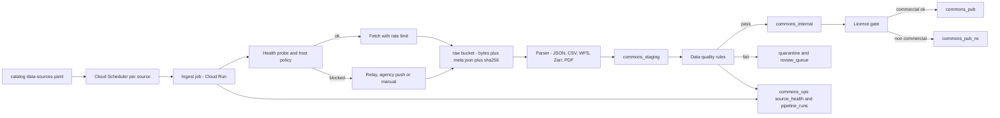
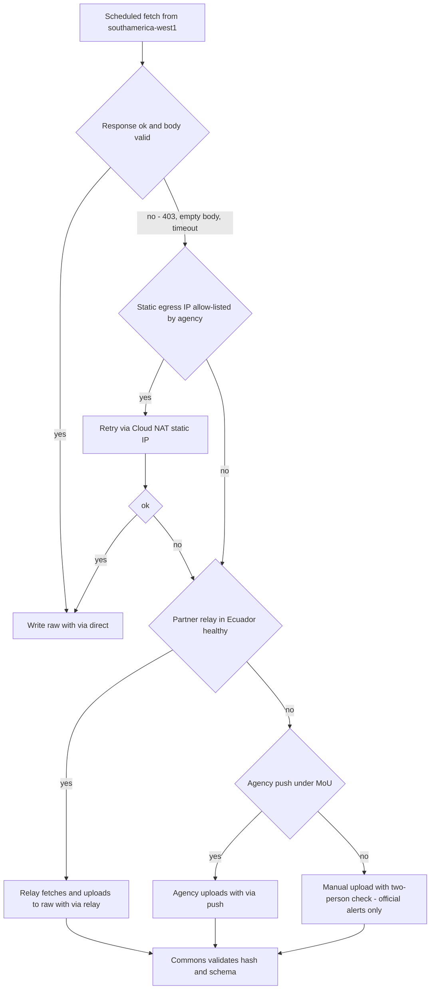
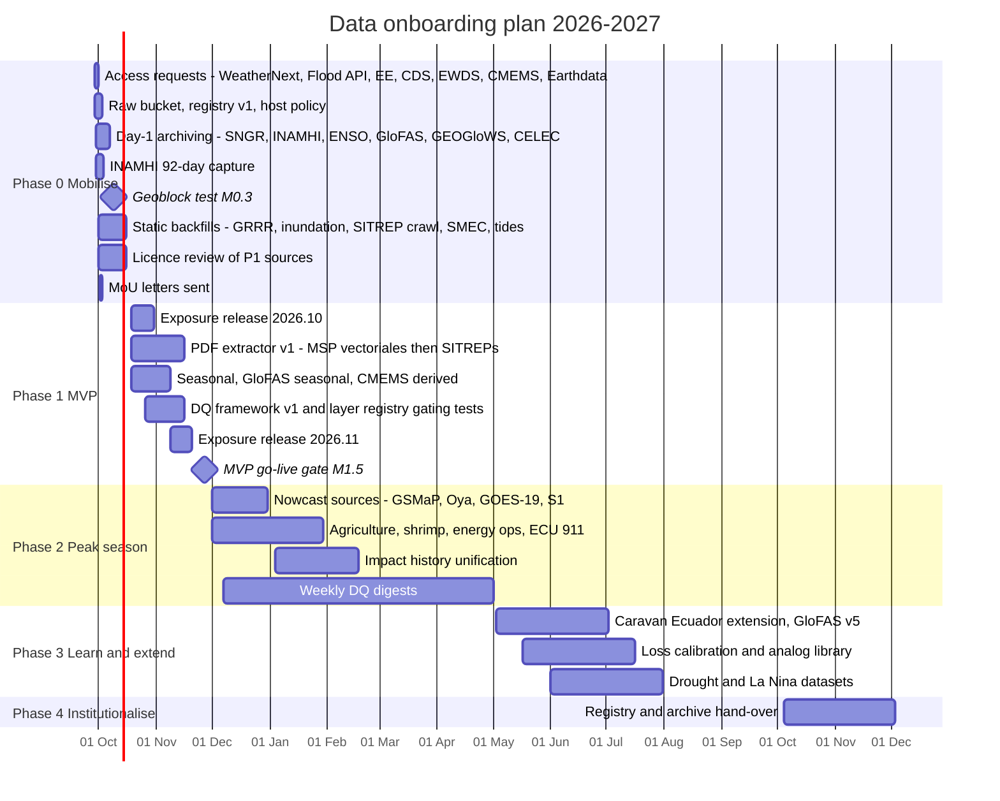

# Data catalog and ingestion

This document lists every dataset that *Gemelo Digital Ecuador – El Niño* (GDE-Niño) uses and explains how each one gets into the platform. For each source it gives the provider, the exact identifier or endpoint, resolution, cadence and latency, licence and commercial-use status, the plane that holds it, the ingestion method, and its priority and phase. It also sets out the canonical keys and gazetteer; the ingestion architecture (source registry and health checks, how to get around geoblocking, PDF extraction, the raw archive and backfills); the licence matrix and gating rules; the data-sharing agreements still needed; the data-quality framework; storage formats and Ecuador clipping; and the phased onboarding plan from Phase 0 (starting 2026-09-29) to hand-over.

The machine-readable version of this catalogue is [`catalog/data-sources.yaml`](../catalog/data-sources.yaml). Every `id` in the tables below is a key in that file, and CI checks the file (FR-019, FR-073). Buckets, BigQuery datasets, tables, Pub/Sub topics and job names come from [03-architecture.md](./03-architecture.md) and are not redefined here; §4.9 lists the few tables this document adds. Other documents cover forecast methods ([06](./06-forecast-model-stack.md)), impact-model inputs ([07](./07-impact-modules-and-triggers.md)), Jev QA ([08](./08-ai-decision-layer-jev.md)), costs ([09](./09-cost-model.md)), operations ([11](./11-operations-runbook.md)), legal questions ([13](./13-governance-legal-risk.md)) and verification ([14](./14-verification-and-validation.md)).

## Contents

1. [Data principles](#1-data-principles)
2. [The catalogue by category](#2-the-catalogue-by-category)
3. [Canonical keys and gazetteer](#3-canonical-keys-and-gazetteer)
4. [Ingestion architecture](#4-ingestion-architecture)
5. [Licence matrix and gating rules](#5-licence-matrix-and-gating-rules)
6. [Data-sharing agreements and draft MoU checklist](#6-data-sharing-agreements-and-draft-mou-checklist)
7. [Data-quality framework](#7-data-quality-framework)
8. [Storage formats and Ecuador clipping](#8-storage-formats-and-ecuador-clipping)
9. [Phased data onboarding plan](#9-phased-data-onboarding-plan)
10. [Open questions](#10-open-questions)

**Owner roles.** This document uses the role codes from [03 §Owner roles](./03-architecture.md): DL (data lead), FL (forecast and hydromet lead), PL (platform lead), FE (front-end lead), AI (AI decision-layer lead), SRE, DPO and PM (programme manager). It uses **PT**, the partnerships lead defined in [12 §4.1](./12-roadmap-team-budget.md), who owns MoUs and focal points. [12-roadmap-team-budget.md](./12-roadmap-team-budget.md) names the people.

**Verification status.** Every catalogue row has a *V* flag, mirrored as `verified: true|false` in the YAML:

- **V** means the identifier or endpoint was confirmed in the research briefs, either by reading the primary catalogue or bucket, or through third-party code that probed it live in Aug–Sep 2026.
- **U** means it comes from prior knowledge only.
- Every `.gob.ec`/`.mil.ec` endpoint has only *secondary* verification, because those hosts were unreachable from the research environment. **Re-probe all of them from `southamerica-west1` in Phase 0 (milestone M0.3, 2026-10-09) before relying on them.**

---

## 1. Data principles

| # | Principle | Rule in practice | Enforced by |
|---|---|---|---|
| DP-01 | **Query in place; copy only the Ecuador clip** (D13) | Query WeatherNext, ERA5, Earth Engine (EE) assets, Overture and OSM where they live. Materialise only Ecuador subsets and derived tables. Every WeatherNext query filters on the `init_time` partition and on Ecuador geography. | `dim_ecuador_clip` (§8.2), `require_partition_filter`, `maximumBytesBilled` ([03 §4.2](./03-architecture.md)) |
| DP-02 | **Archive on day 1; raw data is immutable** (D12) | Sources that keep no usable history are captured write-once from Phase 0: the INAMHI Visor (≈92 days), SNGR `COE2` (current events only), the Flood Forecasting API (no history endpoint), the CENACE operations snapshot and INAMHI's daily bulletin. | `ifGenerationMatch=0` on `raw/` objects; nightly DR copy ([03 §7.4, §11.4](./03-architecture.md)) |
| DP-03 | **Provenance on every row** | Every curated row carries `source_id`, `dataset_version`, `raw_uri`, `raw_sha256`, `fetched_at` (UTC), `via` (`direct`/`relay`/`push`/`manual`) and `method_version` (git tag and image digest). | Loader library `libs/ectwin_core/provenance.py`; DQ-20 (§7) |
| DP-04 | **Licence gating by construction** (D15) | Every layer carries `licence`, `licence_class`, `commercial_use` and `attribution`. **Unknown means non-commercial until legal clears it.** | Two listings (`ectwin_commons_v1`, `ectwin_commons_nc_v1`), `layer_registry`, API and export gating (§5) |
| DP-05 | **Canonical keys** (D14) | Places use INEC DPA codes (2/4/6 digits). Grids use H3 res 7 nationally and res 9 in urban areas. Water uses `hybas_` ids, GEOGloWS `river_id`, INAMHI station codes and Pfafstetter level 5. Time is stored in UTC. | `dim_dpa`, `dim_h3_parish`, `dim_hydro_xwalk` (§3) |
| DP-06 | **Official content verbatim** (D1) | SNGR, INAMHI, CN-ERFEN, INOCAR and ENFEN texts are stored and shown exactly as issued, never edited or recoloured. Corrections become new rows with `supersedes_id`. | `commons_pub.official_alerts` ([03 §5.3](./03-architecture.md)); DQ-21 |
| DP-07 | **One national ingestion layer; tenants never scrape `.gob.ec`** | INAMHI's limit of about 1 request per 5 minutes, the geoblocks and plain courtesy make per-tenant scraping unworkable. Commons fetches once and publishes; tenants subscribe. | Commons-only credentials; the tenant image has no `.gob.ec` adapters |
| DP-08 | **Respect source limits and identify ourselves** | Token-bucket rate limits per host. User-Agent `GDE-Nino-ingest/<version> (+contact: datos@<DOMAIN>)` **(domain to confirm)**. Honour `Retry-After`. Never disable TLS verification. | Ingest library; §4.2 host policy |
| DP-09 | **Complement, don't duplicate** (D2) | Link to alertasecuador.gob.ec and the INAMHI hydroviewer instead of rebuilding them. Ingest their machine interfaces. | Catalogue `ingestion: manual` rows for link-only sources |
| DP-10 | **No personal data in Commons** | Impact narratives (ECU 911, SITREP free text, citizen reports) are pseudonymised with Cloud DLP before any processing outside `raw/`. Only aggregates are published. Personal data never enters `commons_pub`. | D18; DPIA in [13](./13-governance-legal-risk.md) |
| DP-11 | **Degrade, never lie** | Every product shows its age. Stale sources get a badge using the freshness targets in [02 §6.2](./02-users-requirements-ux.md). A fallback is labelled as one. | `commons_ops.source_health` (§4.2); degradation ladder ([03 §11.3](./03-architecture.md)) |
| DP-12 | **Reproducible and versioned** | Static layers are released as dated versions (e.g. `exposure_parish@2026.10`). Rebuilding from `raw/` plus a code digest reproduces any published table. | STAC `ectwin:method_version`; DR rebuild test ([03 §11.4](./03-architecture.md)) |

---

## 2. The catalogue by category

### 2.1 How to read the tables

- **`id`**: the key in `catalog/data-sources.yaml`.
- **Plane**: C = Commons (`ectwin-commons-prod`); T = tenant project; C+T = Commons builds the national products and tenants also query the source in place for their own areas of interest.
- **Ingest** (the `ingestion` field):
  - **pull**: a scheduled Commons job fetches the data;
  - **QIP**: query in place, via BigQuery, EE or GCS reads, with no copy;
  - **push**: the agency uploads, under an MoU;
  - **manual**: an operator uploads, or the source is link-only.
- **P / Ph**: priority (P1 is needed for the MVP; P2 for peak-season operations; P3 later or optional) and phase (0–4, per spine §7).
- **Licence (comm.)**: the licence, plus whether commercial tenants may use it: **Y** yes, **N** no, **?** unclear. Unclear is gated as non-commercial until cleared (§5).
- **V**: verification flag, as defined above.
- **Vintage / last checked**: not repeated in these tables. Each source's `vintage` (release or data date in hand) and `last_checked` (ISO date) are in `catalog/data-sources.yaml` v1.1.0. CI warns when `last_checked` is null or older than 90 days (30 days for non-static P1 sources). The date is refreshed whenever a job detects a new release and at the quarterly source-currency review, which the YAML places in [11 §12.3](./11-operations-runbook.md) (that ritual is not yet listed there; **to add**). Exposure layers are "reviewed quarterly" per [02 §6.2](./02-users-requirements-ux.md).
- Regions: `.gob.ec` pulls run in `southamerica-west1`; everything else runs in `us-central1`, except heavy WeatherNext 3 (WN3) member reads in `us-east1` (D10).

### 2.2 Official alerts and bulletins

The rules for this category are in D1 and [03 §5.3 `official_alerts`](./03-architecture.md).

| `id` | Dataset (provider) | Exact ID / endpoint | Resolution | Cadence / latency | Licence (comm.) | Plane / ingest | P / Ph | V |
|---|---|---|---|---|---|---|---|---|
| `sngr_wp_alerts` | Alert posts, resolutions and news (SNGR) | `https://www.gestionderiesgos.gob.ec/wp-json/wp/v2/posts` (WordPress REST, no auth) ([sgr_publicaciones_client](https://github.com/DweskZ/EcuDataMCP/blob/main/helpers/sgr_publicaciones_client.py)) | National; place names in text | Poll every 10 min; minutes | None published; verbatim republication with source (to confirm under convenio) (?) | C / pull | P1 / 0 | V |
| `sngr_sitreps` | *Informes de situación* (SITREPs): 54 event dossiers 2016–2026, including 700+ PDFs for "Época Lluviosa 2026" (SNGR) | WordPress archive; PDFs under `/wp-content/uploads/…`; example event page `https://www.gestionderiesgos.gob.ec/sitrep-afectaciones-por-lluvias-2025-2026/` | National, province, canton | Per event; daily in emergencies | None published (?) | C / pull + PDF extraction (§4.5) | P1 / 0 archive, 1 extraction | V |
| `sngr_arcgis_events` | `COE2` current events; `EVENTOS_X_LLUVIAS` rain-related events (SNGR) | `https://sgrportal.gestionderiesgos.gob.ec/server/rest/services/COE2/MapServer` (resolve the layer id with `?f=pjson`; it changes); `…/Hosted/EVENTOS_X_LLUVIAS/FeatureServer/0/query?where=…&f=geojson` ([sgr_client](https://github.com/DweskZ/EcuDataMCP/blob/main/helpers/sgr_client.py), [producer_sgr_eventos](https://github.com/Dass-19/Godzilla-EnsoStreamingPipeline/blob/master/backend/producers/producer_sgr_eventos.py)) | Point; fields `Provincia`, `Canton`, `Parroquia`, `Evento`, `Causa`, `CategoriaDelEvento`, `EstadoDelEvento`, `FechaDelEvento` (**names, not DPA codes**) | Poll every 10 min; `COE2` has no history, so we build it | None published (?) | C / pull | P1 / 0 | V |
| `sngr_biblioteca` | Biblioteca, ≈1,660 documents: *Mapas de Amenazas* by province, tsunami maps; `SAT/MapServer/0` tsunami stations (SNGR) | `/biblioteca/`; `…/SAT/MapServer/0` | PDF/images; points | Ad hoc | None published (?) | C / manual | P3 / 2 | V |
| `inamhi_advertencias` | INAMHI *advertencias* (HydroShare WFS `typeName=Advertencia`, served by the hydroviewer's `get-warnings-json`) | `https://inamhi.geoglows.org/apps/hydroviewer-ecuador/` ([controllers.py](https://github.com/SERVIR-Amazonia/tethysapp-hydroviewer_ecuador)) | Polygons / provinces | Poll every 15 min | None published (?) | C / pull | P1 / 0 | V |
| `inamhi_forecast_bulletins` | Daily forecast API; Guayaquil–Durán daily rain bulletin, about 25 gauges (No. 181 dated 2026-09-25) | `GET https://inamhi.gob.ec/api_pronos/forecast/daily_forecast/list_by_date_now/?date=`; `https://www.inamhi.gob.ec/guayaquil/registrodgy.pdf` ([13b](https://github.com/espinosacodes/makers-builder-case/blob/main/docs/research/13b-escala-latam.md)) | City / station | Daily (INAMHI's own front end caches for 6 h) | None published (?) | C / pull + PDF | P2 / 1 | V |
| `cnerfen_bulletins` | CN-ERFEN technical reports and communiqués (e.g. 007-2026 of 28 Aug, which declared El Niño active with a weekly Niño 1+2 anomaly of +4.0 °C; 009-2026, meeting 17 Sep, published 19 Sep) (INOCAR/CN-ERFEN; dates and values from press summaries) | `https://www.inocar.mil.ec/boletin/ERFEN/erfen_20260407.pdf` (so `erfen_YYYYMMDD.pdf`, **pattern inferred**); IPIAP copies such as `https://institutopesca.gob.ec/wp-content/uploads/2026/06/Erfen-5-febrero-2026.pdf` (filename pattern not stable) | National | On publication (≈ every 2–4 weeks, **to confirm**) | None published (?) | C / pull + manual fallback | P1 / 0 | V |

The official **alertasecuador.gob.ec** portal (`/lluvia`, `/fenomeno_el_nino/mapa_de_amenaza`, `/el_nino/situacion-actual-de-el-nino/`, *Alístate Ecuador*) has no API found, and its `X-Frame-Options` header allows framing only by the site itself, so it cannot be embedded. It is **link-only** by design (D2; stale-feed disclaimer D8 in [02 §8.5](./02-users-requirements-ux.md) points users to it). ENFEN Peru communiqués are catalogued in §2.3 under `enfen_peru`.

### 2.3 ENSO and ocean

| `id` | Dataset (provider) | Exact ID / endpoint | Resolution | Cadence / latency | Licence (comm.) | Plane / ingest | P / Ph | V |
|---|---|---|---|---|---|---|---|---|
| `cpc_enso` | Monthly Niño 1+2/3/4/3.4 (`sstoi.indices`); RONI (official since 2026-02-01); ONI; weekly SST (`wksst9120.for`); RONI probabilities and strengths (NOAA CPC) | `https://www.cpc.ncep.noaa.gov/data/indices/sstoi.indices` (V); `…/data/indices/RONI.ascii.txt` (V, secondary); `…/oni.ascii.txt` (U); `…/wksst9120.for` (U); `https://cpc.ncep.noaa.gov/products/analysis_monitoring/enso/roni/probabilities/` and `…/strengths/` (HTML, parse table index 7) | Index | Weekly and monthly; probabilities on the second Thursday | Public domain (U) (Y) | C / pull | P1 / 0 | V |
| `enfen_peru` | ENFEN *Comunicados Oficiales* (e.g. N° 16-2026) and **ICEN** (Niño 1+2 index: 3-month mean, ERSSTv5, 1991–2020 base) | `https://enfen.imarpe.gob.pe/comunicados/`; `http://met.igp.gob.pe/datos/ICEN.txt` (case-sensitive) | Index | Monthly and on publication | Communiqués verbatim; ICEN values unclear (?) | C / pull | P1 / 0 | V |
| `iri_enso_plume` | IRI ENSO plume | `https://iri.columbia.edu/~forecast/ensofcst/Data/ensofcst_ALLtoMMYY` (JSON variants `years[].months[].models[]`) | Index | Monthly | Unclear; internal display only (?) | C / pull | P2 / 1 | V |
| `oisst_v21` | OISST v2.1: `sst`, `anom` (NOAA) | EE `NOAA/CDR/OISST/V2_1` ([catalog](https://github.com/google/earthengine-catalog/blob/main/catalog/NOAA/NOAA_CDR_OISST_V2_1.jsonnet)); `s3://noaa-cdr-sea-surface-temp-optimum-interpolation-pds/data/v2.1/avhrr/` | 0.25° | Daily; preliminary +1 day, final +14 days | NOAA CDR (public domain per NOAA terms, U) (Y) | C+T / QIP | P1 / 0 | V |
| `cmems_ee` | CMEMS global physics analysis and forecast (`zos` SSH, `mlotst`, `sob`/`tob`, currents; 10-day forecast), waves, BGC (`o2`, `nppv`, PFT), ocean colour `chlor_a` | EE `COPERNICUS/MARINE/GLOBAL_ANALYSISFORECAST_PHY_DAILY` ([catalog](https://github.com/google/earthengine-catalog/blob/main/catalog/COPERNICUS/COPERNICUS_MARINE_GLOBAL_ANALYSISFORECAST_PHY_DAILY.jsonnet)); `COPERNICUS/MARINE/WAV/ANFC_0_083DEG_PT3H`; `COPERNICUS/MARINE/GLOBAL_ANALYSISFORECAST_BGC_001_028/BIO` and `/PFT`; `COPERNICUS/MARINE/SATELLITE_OCEAN_COLOR/V6` | 1/12° (physics, waves); 0.25° (BGC) | Daily / 3-hourly (waves). Physics from 2022-06-01, BGC from 2022-01-01, waves from 2022-06, ocean colour V6 from 1997-01-01 (covers 1997-98). **Physics and BGC keep only a rolling two-year window in EE**, so derived series must be archived | CC BY 4.0 (Y) | C+T / QIP (+ archive derived) | P1 / 1 | V |
| `cmems_sealevel_l4_nrt` | CMEMS L4 sea surface height, NRT (Kelvin-wave tracking) | `SEALEVEL_GLO_PHY_L4_NRT_008_046`, dataset `cmems_obs-sl_glo_phy-ssh_nrt_allsat-l4-duacs-0.125deg_P1D` via the `copernicusmarine` toolbox (2.5.0, 2026-09-28); free account (U) | 0.125° | Daily | CC BY 4.0 (U); gated `pending_review` until confirmed (?) | C / pull | P2 / 1 | V |
| `ioc_uhslc_sealevel` | Observed sea level: IOC codes `gyer` (Guayaquil, Río Guayas), `puna`, `lali` (La Libertad, GLOSS 172, UHSLC 091/091a) | IOC `service.php?query=data&code=gyer` ([producer_marea_observada](https://github.com/Dass-19/Godzilla-EnsoStreamingPipeline/blob/master/backend/producers/producer_marea_observada.py)); station list in [ioc.csv](https://github.com/ec-jrc/pyPoseidon/blob/master/pyposeidon/misc/ioc.csv) | Tide gauge | Near real time (latency U) | IOC/UHSLC terms (to confirm) (?) | C / pull | P1 / 1 | V |
| `inocar_tides` | Tide predictions: quarterly PDFs (parseable back to 2022) and an HTML table (INOCAR) | `https://www.inocar.mil.ec/mareas/TM/{anio}/trimestral/GUAYAQUIL_RIO_{trimestre}.pdf` ([producer_inocar_mareas](https://github.com/Dass-19/Godzilla-EnsoStreamingPipeline/blob/master/backend/producers/producer_inocar_mareas.py)); `…/mareas/consultan.php` (scrape only) | Ports | Quarterly | None published; nautical products are sold (U); agreement (N/?) | C / pull + PDF | P1 / 0 | V |

Notes:

- **Niño 1+2 is computed two ways, and both are kept.** One is the official ICEN (ERSSTv5, 1991–2020). The other is our own daily value from the OISST `anom` band over 0–10°S, 90–80°W. In September 2026, CN-ERFEN report 009-2026 gave +4.5 °C while CPC's weekly file for the week of 2026-09-23 gave +4.7 °C conventional / +3.9 °C relative, and a search summary gave +3.4 °C ([01 §5.2](./01-context-el-nino-ecuador.md); different datasets and climatologies), so every value stores `source` and `base_period` ([03 `enso_indices`](./03-architecture.md)).
- **Excluded or deprioritised:**
  - HYCOM in EE (stops 2024-09-05).
  - MUR SST (the Zarr copy is static and ends ≈2020-01).
  - TAO/TRITON via ERDDAP `pmelTaoDySst`, which is P3 and not in the YAML.
- The **+40 cm coastal sea-level anomaly** (ERFEN, 20 Aug) could not be checked against gauge data. It is cross-checked against the `zos` band and `ioc_uhslc_sealevel` once those are ingested.

### 2.4 Atmosphere observations

| `id` | Dataset (provider) | Exact ID / endpoint | Resolution | Cadence / latency | Licence (comm.) | Plane / ingest | P / Ph | V |
|---|---|---|---|---|---|---|---|---|
| `inamhi_visor_stations` | INAMHI Visor station network: 1,894 stations in the viewer; 202 automatic stations transmitting and 156 not (2026-09-27); 1,518 manual stations (these three parts sum to 1,876, so 18 stations are unaccounted for in the source; the catalogue endpoint listed ≈1,858); 43 stations with level or flow | Catalogue `GET /api_visor/station_information/estaciones/visores/?id_aplicacion=vs_1h_inh`; variables `…/estaciones/parametros/?id_estacion=`; data `POST /api_visor/station_data_automaticas/get_data_hour/` with `{id_estacion, table_names[], fecha_desde, fecha_hasta}`; `…/get_precipitation/`; `station_data_convencionales/…` ([config.py](https://github.com/jorgessanchez7/Global_Forecast_Validation/blob/master/Ecuador/INAMHI/config.py)) | Station | Hourly, ≈2.5 h lag; river levels **9–24 days late**; **≈92-day retention; 1 request / 5 min**; request the whole MAX/MIN/PROM group or the API returns HTTP 500 | None published; agreement (N until MoU) | C / pull | P1 / 0 | V |
| `inamhi_geoserver` | INAMHI GeoServer/GeoNode and WIS2 box: 1985–2015 monthly and annual normals; ≈180 daily anomaly composites `anomalias_DDmonYYYY`; WRF grids `wrf_tiempo_{precipitacion,temperatura,temperatura_calibrada,humedad,presion,viento}`; basins `cuencas_inamhi`, `cuencas_maate`, `demarcaciones_hidrograficas`; admin layers `provincias`, `ecuador_cantones`, `ecuador_parroquias`; `hidroelectricasshape`, `geoglows_ecuador` | `https://geoservicios.inamhi.gob.ec/geoserver` (WMS 1.3.0, 222 layers; WFS 2.0.0, 199 layers, `outputFormat=application/json`); CSW `/catalogue/csw`; `http://wis.inamhi.gob.ec/oapi/collections/?f=json` (topics U) ([inamhi_client](https://github.com/DweskZ/EcuDataMCP/blob/main/helpers/inamhi_client.py)) | Grids / vectors | Daily (anomalies, WRF); normals static | None published (?) | C / pull | P1 / 0–1 | V |
| `imerg_v07` | GPM IMERG V07, Early/Late half-hourly (NASA) | EE `NASA/GPM_L3/IMERG_V07` | 0.1°, 30 min | Hours. **No "permanent" (Final) products beyond 2025-09-30** during the V08 transition ([STAC](https://storage.googleapis.com/earthengine-stac/catalog/NASA/NASA_GPM_L3_IMERG_V07.json)) | NASA open (Y) | C+T / QIP | P1 / 1 | V |
| `gsmap_v8` | GSMaP v8 operational (JAXA) | EE `JAXA/GPM_L3/GSMaP/v8/operational` (`status`=provisional until the gauge-adjusted run replaces it) | 0.1°, hourly | Near real time | JAXA; acknowledgement required (?) | C+T / QIP | P2 / 2 | V |
| `oya_precip` | Oya satellite-infrared precipitation (Google) | EE `projects/global-precipitation-nowcast/assets/global_estimation` ([catalog](https://github.com/google/earthengine-catalog/blob/main/catalog/global-precipitation-nowcast/projects_global-precipitation-nowcast_assets_global_estimation.jsonnet)) | 5 km, 30 min | Near real time, from 2004 | CC BY 4.0 (Y) | C+T / QIP | P2 / 2 | V |
| `chirps` | CHIRPS v3 (primary climatology and verification truth) plus CHIRPS v2 fallback (UCSB CHC) | EE `UCSB-CHC/CHIRPS/V3/DAILY_SAT`, `…/DAILY_RNL`, `…/PENTAD` ([catalog](https://github.com/google/earthengine-catalog/blob/main/catalog/UCSB-CHC/UCSB-CHC_CHIRPS_V3_DAILY_SAT.jsonnet)); COGs `data.chc.ucsb.edu/products/CHIRPS/v3.0/daily/final/{rnl,sat}/cogs/YYYY/` ([dhis2eo](https://github.com/dhis2/dhis2eo/blob/main/dhis2eo/data/chc/chirps3/daily.py)); v2 `UCSB-CHG/CHIRPS/DAILY` (to 2026-08-31) | 0.05° | Preliminary ≈2 days, final ≈3 weeks after the month (U) | Public domain / rights waived (Y) | C+T / QIP + pull COGs | P1 / 1 | V |
| `era5` | ERA5 and ERA5-Land (ECMWF/C3S) | `gs://gcp-public-data-arco-era5/ar/full_37-1h-0p25deg-chunk-1.zarr-v3` (us-central1) ([README](https://github.com/google-research/arco-era5)); EE `ECMWF/ERA5/HOURLY`, `ECMWF/ERA5/MONTHLY`, `ECMWF/ERA5_LAND/HOURLY`, `…/DAILY_AGGR`. **Do not use `ECMWF/ERA5/DAILY`** (ends 2020-07-09) | 0.25° / 0.1° | ERA5T ≈6 days; final ≈3 months | CC BY 4.0 per the CDS catalogue (Y) | C+T / QIP | P1 / 1 | V |
| `smap_soil_moisture` | SMAP L4 and L3 enhanced (NASA) | EE `NASA/SMAP/SPL4SMGP/008`; `NASA/SMAP/SPL3SMP_E/006` | 9–11 km | 3-hourly; ≈3 days behind | NASA (Y) | C+T / QIP | P2 / 2 | V |

Station data is thin. Only 202 of ≈1,894 stations transmit, and there are gaps: Songa (Guayaquil) was missing 14–17 Sep. Nowcasting therefore relies on satellite data, and gauges are used mainly for calibration and verification ([14](./14-verification-and-validation.md)). Two sources are optional P3 fillers and are not in the YAML: RAIN4PE (`projects/sat-io/open-datasets/rainpe/daily`, CC BY 4.0) and the BigQuery station tables `bigquery-public-data.noaa_gsod` and `bigquery-public-data.ghcn_d` (Ecuador density U).

### 2.5 Forecasts (summary; methods in [06](./06-forecast-model-stack.md))

| `id` | Dataset | Exact ID / endpoint | Resolution | Cadence / latency | Licence (comm.) | Plane / ingest | P / Ph | V |
|---|---|---|---|---|---|---|---|---|
| `weathernext_3` | WeatherNext 3 (Google DeepMind): mean/p10–p90 in BigQuery and EE; 64 members in GCS | Linked dataset `weathernext_3` (exchange `projects/gcp-public-data-weathernext/locations/us/dataExchanges/weathernext_19397e1bcb7`), tables `weathernext_3_0_0_0p1deg`, `weathernext_3_0_0_0p05deg`; EE `projects/gcp-public-data-weathernext/assets/weathernext_3_0_0_0p1deg`, `…_0p05deg`; members `gs://weathernext3_spatial/weathernext_3_0_0/zarr/` (Requester Pays, `us-east1`); statistics bucket `weathernext3_statistics_spatial` (`us-east1`, not Requester Pays per a third-party check) | 0.05° (2t/2d station head) / 0.1° (surface) / 0.25° (pressure levels) | Hourly initialisation (interim runs to 48 h, search summary); main 00/06/12/18Z cycles reach BigQuery/EE ≈+8 h 10 min; archive from 2026-01-01 | Real-time: GDM experimental terms; >1 h old: CC BY 4.0 ([ToU](https://storage.googleapis.com/weathernext-public/terms-of-use.pdf)) (?) | C+T / QIP | P1 / 1 | V |
| `weathernext_2` | WeatherNext 2, 64 members | `weathernext_2_0_0`, `weathernext_2_0_0_mean`; EE `…/weathernext_2_0_0`; `gs://weathernext/weathernext_2_0_0/zarr` | 0.25°, 6-hourly | 4 runs/day; archive 2022→ (covers 2023 and 2023-24) | As above (older WN2 catalogue text used a 48 h real-time threshold; confirm which applies); weights commercial OK since 2026-08-06 (?) | C+T / QIP | P1 / 1 | V |
| `ecmwf_open_data` | IFS/AIFS open data (fallback and benchmark) | `gs://ecmwf-open-data/YYYYMMDD/HHz/{ifs/0p25/{oper,enfo,wave,waef}, aifs-single, aifs-ens}`; EE `ECMWF/NRT_FORECAST/IFS/OPER` (from 2024-11-12) | 0.25° | EE twice daily to 15 days (ENS to 360 h); the bucket also holds 06/18Z runs (moved to `oper`/`wave` with IFS 50r1 on 2026-05-12) | CC BY 4.0 (Y) | C+T / QIP | P1 / 1 | V |
| `gefs_v12` | GEFSv12 to 35 days (NOAA) | `gs://gfs-ensemble-forecast-system/gefs.YYYYMMDD/00/atmos/pgrb2ap5/` (`gec00`, `gep01`–`gep30`, `geavg`, `gespr`, to f840); reforecasts `s3://noaa-gefs-retrospective/GEFSv12/` | 0.5° | Daily 00Z run to 35 days | Public domain (Y) | C / pull | P2 / 2 | V |
| `cfsv2` | CFSv2 9-month runs (NOAA) | `s3://noaa-cfs-pds/cfs.YYYYMMDD/…/monthly_grib_01/…avrg.grib.grb2`; byte-range reads via `.idx` | ≈1° (U) | 4 cycles/day; 00 UTC monthly files at 07:31–08:52 UTC | Public domain (Y) | C / pull | P2 / 1 | V |
| `c3s_seasonal` | C3S multi-system seasonal forecasts | CDS `seasonal-monthly-single-levels` (DOI 10.24381/cds.68dd14c3; + `-original-`, `-postprocessed-`), `cdsapi` 0.7.7, `https://cds.climate.copernicus.eu/api` ([README](https://raw.githubusercontent.com/ecmwf/cdsapi/master/README.rst)) | 1° (U) | Monthly, leads 1–6; C3S release on the 13th at 12 UTC (U) | Catalogue says "other"/Copernicus licence (U) (?) | C / pull | P1 / 1 | V |
| `nmme` | NMME (NOAA CPC / IRI Data Library) | `https://ftp.cpc.ncep.noaa.gov/International/nmme/netcdf/{mon}{yyyy}ic/{MODEL}/…ENSMEAN.fcst.nc`; IRI DL `SOURCES/.Models/.NMME/…` | 1° | Monthly, ≈8th–9th (U) | Likely open (U) (?) | C / pull | P2 / 1 | V |

**Not ingested for redistribution:**

- IRI real-time tercile probabilities (licensed users only; the delayed section is free) ([README](https://raw.githubusercontent.com/iridl/dlentries/master/entries/IRI/FD/NMME_Seasonal_Forecast/delayed/README_who_may_access_these_forecasts.html)).
- The ECMWF S2S database (research only).
- Google Maps Weather API (its policies forbid building a weather app on it).
- WeatherNext Gen and Graph (deprecated July 2026).

**Not yet available: ECMWF EC46 and SEAS5 open data.** The spine (D11) names EC46 open data for weeks 2–6. A search summary says SEAS5 and EC46 have been open since 2025-10-01, and the `ecmwf-opendata` client has an `mmsa`/`mmsf` stream path, but the `gs://ecmwf-open-data` and `s3://ecmwf-forecasts` mirrors hold no seasonal or 46-day folders (listing of 2026-09-28) **(unverified)**. Until they are reachable, weeks 2–6 use `gefs_v12` and CFSv2 45-day members, and SEAS5 comes through `c3s_seasonal` (`originating_centre=ecmwf`, `system=51`); see [06](./06-forecast-model-stack.md). EC46 gets a catalogue id only when an endpoint is confirmed.

### 2.6 Hydrology

| `id` | Dataset (provider) | Exact ID / endpoint | Resolution | Cadence / latency | Licence (comm.) | Plane / ingest | P / Ph | V |
|---|---|---|---|---|---|---|---|---|
| `floodhub_api` | Flood Forecasting API v1 (Google) | `https://floodforecasting.googleapis.com/v1`: `gauges:searchGaugesByArea`, `gauges:queryGaugeForecasts` (≤500 ids; issue floor 2023-10-01), `gaugeModels:batchGet`, `floodStatus:searchLatestFloodStatusByArea` (`cutoffTime` floor 2025-08-01; matches on gauge location), `floodStatus:queryLatestFloodStatusByGaugeIds` (≈100 ids per call in practice), `significantEvents:search`, `flashFloods:search`, `serializedPolygons/{id}` (discovery revision `20260921`, [OCHA copy](https://raw.githubusercontent.com/OCHA-DAP/ds-google-flood-hub/main/api/discovery.json); [OCHA observations](https://raw.githubusercontent.com/OCHA-DAP/ds-google-flood-hub/main/api/observations.json)) | Gauges `<source>_<id>` and virtual `hybas_<id>` | Forecasts daily to 7 days; status several times a day; flash floods daily (≈06:33 UTC issue); **no history endpoint** | CC BY 4.0; "primarily non-commercial" wording **unverified** (?) | C / pull (central allow-listed key; 200 req/min) | P1 / 0 on approval | V |
| `grrr` | Google Runoff Reanalysis & Reforecast `model_id_8583a5c2_v0` | `gs://flood-forecasting/hydrologic_predictions/model_id_8583a5c2_v0/{reanalysis/streamflow.zarr, reforecast/streamflow.zarr, return_periods.zarr, hybas_outlet_locations_UNOFFICIAL.zarr}` (anonymous; Zarr v2) | HydroBASINS outlets (≈1,840 inside a low-resolution mainland outline plus 39 in a Galápagos box; 1,997 inside geoBoundaries ADM0 with a 0.02° buffer, per another brief) | Static: reanalysis 1980-01-01→2023-12-23; reforecast 2016-01-01→2023-06-30, leads 0–7 days | CC BY 4.0 (Y) | C / pull once | P1 / 0 | V |
| `inundation_history` | Inundation history, from GLAD, 1999–2020 (Google) | `gs://flood-forecasting/inundation_history/data/inundation_history_{minlat}_{minlng}_{maxlat}_{maxlng}.geojson` ([README](https://storage.googleapis.com/flood-forecasting/inundation_history/README.txt)): 12 tiles (11.3 MB) for the mainland bounding box, plus Galápagos tiles | 128 m | Static | CC BY 4.0 (Y) | C / pull once | P1 / 0 | V |
| `geoglows_v2` | GEOGloWS ECMWF Streamflow v2: 15-day forecasts (52 members × 280 steps) and retrospective 1940→ | `s3://geoglows-v2-forecasts/{YYYYMMDD}00.zarr` (from 2024-07-01); `s3://geoglows-v2/retrospective/{daily,…}.zarr`; REST `https://geoglows.ecmwf.int/api/v2/{forecast,forecaststats,forecastensembles,forecastrecords,dates}/{river_id}` | TDX-Hydro reach (`river_id`, 9 digits) | Daily | CC BY 4.0; river network CC BY-SA ([licenses.md](https://geoglows-v2.s3.amazonaws.com/licenses.md)) (Y) | C / pull (Ecuador `river_id` list) | P1 / 0 | V |
| `geoglows_v2_return_periods` | GEOGloWS return periods (Gumbel fit, 2–100 yr) | `s3://geoglows-v2/retrospective/return-periods.zarr` (revision 2026-06-10) | Reach | Static | **CC BY-NC-SA 4.0 (N)** | C (NC listing only) / pull | P1 / 1 | V |
| `inamhi_hydroviewer` | INAMHI–GEOGloWS hydroviewer (co-developed with Fundación EcoCiencia): `get-alerts` (return-period classes, R0 excluded), `get-alerts-drought`, `get-rivers`, `get-data`, `get-forecast-xlsx`, `report`, `get-ffgs-json` (flash-flood guidance from HydroShare WFS `nwsaffds`); `get-warnings-json` feeds `inamhi_advertencias`; Hydropower app (8 plants, bias-corrected) | `https://inamhi.geoglows.org/apps/hydroviewer-ecuador/` (backend `services.geoglows.org`) | Reach | Poll every 6 h | Underlying GEOGloWS CC BY; INAMHI terms to confirm (?) | C / pull | P1 / 0 | V |
| `glofas_forecast` | GloFAS 30-day ensemble (CEMS) | EWDS `cems-glofas-forecast` (DOI 10.24381/cds.ff1aef77), `cdsapi.Client(url="https://ewds.climate.copernicus.eu/api")` | 0.05°, 51 members (secondary sources checked against the live EWDS catalogue) | Daily, 30 days; archive from 2019-11-05; v4.4 (2025-09-10) added AIFS forcing | GloFAS ToS; "not a flood warning"; commercial redistribution U (?) | C / pull | P1 / 0 | V |
| `glofas_seasonal` | GloFAS seasonal (SEAS5-driven) | EWDS `cems-glofas-seasonal` (+ `cems-glofas-seasonal-reforecast`) | 0.05° | Monthly; 123 days as a dataset (the web product shows 7 months) | As above (?) | C / pull | P1 / 1 | V |
| `glofas_reanalysis` | GloFAS historical (the v5.0 reanalysis, 1980–2025, was announced per a search summary; whether EWDS `cems-glofas-historical` already serves v5.0 is **to confirm**) and reforecasts (1999–2023-11) | EWDS `cems-glofas-historical`, `cems-glofas-reforecast` (`product_type=ensemble_perturbed_reforecast`); one year per request | 0.05° | Static / annual | As above (?) | C / pull (backfill) | P2 / 1 | V |
| `celec_ords_reservoirs` | CELEC reservoir level and inflow; Daule-Peripa notes (CELEC Sur, Hidronación) | ORDS `https://generacioncsr.celec.gob.ec:8443/ords/csr/` modules `repDiaHid12m` (Mazar, Amaluza, Minas San Francisco, Delsitanisagua from 2014-09-20) and `pointValuesMesH24` (Mazar inflow from 2010-02-10); `https://www.celec.gob.ec/hidronacion/wp-json/wp/v2/posts` ([hydro-look PLAN](https://github.com/rengarcia/hydro-look/blob/main/PLAN.md)) | Reservoir | Daily | None published; agreement (?) | C / pull | P1 / 1 (archive from Phase 0) | V |
| `caravan_multimet` | Caravan MultiMet forcings (for OpenHydroNet) | `gs://caravan-multimet/v1.1/{CPC,IMERG,CHIRPS,ERA5_LAND,CHIRPS_GEFS,HRES,GRAPHCAST}/timeseries.zarr/` | Basin | Static archive | CC BY 4.0 (Y) | C / QIP | P3 / 3 | V |
| `goes19_abi_flood` | GOES-19 ABI daily flood product (NOAA) | `gs://gcp-public-data-goes-19/ABI-Flood-Day-TIF/YYYY/MM/DD/ABI-Flood-DCOM-AOI00{3,4}_…tif` (AOI003 and AOI004 cover the mainland; **Galápagos south of the equator is not covered**) | 0.01° | Daily; files ≈07:00 UTC the next day | NOAA (Y) | C / pull | P2 / 2 | V |
| `sentinel1_grd` | Sentinel-1 GRD SAR (for flood mapping) | EE `COPERNICUS/S1_GRD` | 10 m | 6-day revisit at best | Copernicus Sentinel terms (U) (Y) | C+T / QIP | P2 / 2 | V |

Three rules apply in this category:

- **Pick HydroBASINS outlets by upstream area, never by nearest point.** The GRRR outlet nearest Esmeraldas is a small tributary, not the main stem.
- **Show GEOGloWS only after bias correction.** Raw median KGE is −0.57 across 182 Ecuadorian stations and 0.33 after correction ([14](./14-verification-and-validation.md)).
- **Treat Flood API gauges with `qualityVerified=false` as lower confidence.**

The known verified Ecuadorian gauges are Zapotal, Babahoyo, Daule and Pula (from a search summary of a 2023-era Primicias article). The current count needs an approved key: `POST v1/gauges:searchGaugesByArea {"regionCode":"EC","includeNonQualityVerified":true,"includeGaugesWithoutHydroModel":true}`.

### 2.7 Terrain, hydrography and static hazard layers

| `id` | Dataset (provider) | Exact ID / endpoint | Resolution | Cadence | Licence (comm.) | Plane / ingest | P / Ph | V |
|---|---|---|---|---|---|---|---|---|
| `copernicus_dem_glo30` | Copernicus DEM GLO-30, 2024 release | EE `COPERNICUS/DEM/GLO30_2024_1` (`COPERNICUS/DEM/GLO30` is deprecated); COGs `s3://copernicus-dem-30m` | 30 m | Static | Free GLO-30 licence (commercial terms to confirm) (?) | C+T / QIP | P1 / 1 | V |
| `fabdem` | FABDEM (forests and buildings removed) | `projects/sat-io/open-datasets/FABDEM` | 30 m | Static | **CC BY-NC-SA 4.0 (N)** | C (NC) / QIP | P2 / 2 | V |
| `merit_hydro` | MERIT DEM and MERIT Hydro | EE `MERIT/DEM/v1_0_3`, `MERIT/Hydro/v1_0_1` | ≈90 m | Static | ODbL-1.0 per EE tags (to confirm) (Y, SA) | C+T / QIP | P2 / 1 | V |
| `hydrosheds` | HydroSHEDS/HydroBASINS (`hybas_1`…`hybas_12`), HydroATLAS, RiverATLAS | EE `WWF/HydroSHEDS/v1/Basins/hybas_{1..12}`, `WWF/HydroSHEDS/03CONDEM`, `03DIR`, `15ACC`; `WWF/HydroATLAS/v1/Basins/level03`…`level12`; `projects/sat-io/open-datasets/HydroAtlas/RiverAtlas_v10` | 3″ / basins | Static | HydroSHEDS licence (U); HydroATLAS CC BY 4.0 (?) | C / QIP → `dim_hydro_xwalk` | P1 / 0 | V |
| `hand_100` | Height Above Nearest Drainage | `users/gena/global-hand/hand-100` | 30 m | Static | CC BY-SA (Y, SA) | C+T / QIP | P2 / 2 | V |
| `deltadtm` | DeltaDTM coastal terrain (Deltares) | `projects/sat-io/open-datasets/DELTARES/deltadtm_v1-1` | ≈30 m (U) | Static | CC BY 4.0 (Y) | C+T / QIP | P2 / 2 | V |
| `jrc_gsw` | JRC Global Surface Water v1.4 (permanent-water mask) | EE `JRC/GSW1_4/GlobalSurfaceWater`, `/MonthlyHistory`, `/YearlyHistory` | 30 m | Static, 1984–2021 | JRC (terms U) (?) | C+T / QIP | P1 / 1 | V |
| `igm_dtm_orto` | IGM elevation and orthophoto OGC services | `https://www.geoportaligm.gob.ec/dtm/wms` (layer `igm:elevacion50k`), `/dtm/ows`, `/orto/wms`; GeoNetwork CSW `/geonetwork/srv/eng/csw`; 1:50k vectors behind a registration form | 1:50,000 | Static | IGM per-product terms; some restrict commercial use and redistribution (N/?) | C / manual (derived indicators only) | P3 / 2 | V |
| `glofas_flood_hazard` | GloFAS flood hazard maps, RP 10–500 yr | EE `JRC/CEMS_GLOFAS/FloodHazard/v2_1` (use the `spurious_depth_category` band) | 90 m | Static (2024) | JRC, "no restriction" per the EE catalogue; CC BY 4.0 per another brief (Y) | C+T / QIP | P1 / 1 | V |
| `mag_flood_susceptibility` | *Mapa de Susceptibilidad a Inundaciones Ecuador Continental*, 1:25,000, 2024 (MAG) | MAG geoportal WMS/WFS, `http://geoportal.agricultura.gob.ec` (**HTTP only**; exact layer name to confirm) ([ROADMAP](https://github.com/DweskZ/EcuDataMCP/blob/main/docs/ROADMAP.md)) | 1:25,000 | Static | No licence stated (?) | C / pull | P1 / 1 | V |
| `aqueduct_floods` | WRI Aqueduct flood hazard: riverine and coastal, baseline, 2030/2050/2080 | EE `WRI/Aqueduct_Flood_Hazard_Maps/V2` | 1 km | Static | Attribution requested (?) | C+T / QIP | P3 / 2 | V |
| `lhasa_nowcast` | NASA LHASA landslide nowcast v2 (the model is re-run centrally with LHASA 2.1.1; see [07](./07-impact-modules-and-triggers.md)) | GES DISC `Global_Landslide_Nowcast` v2.0.0 (Earthdata login) ([STAC](https://github.com/opengeos/NASA-CMR-STAC/blob/main/datasets/Global_Landslide_Nowcast_2.0.0.json)) | ≈1 km | Daily; latency ≥5 h | NASA; code licence not read (?) | C / pull | P2 / 2 | V |

INAMHI's `cuencas_inamhi`, `cuencas_maate` and `demarcaciones_hidrograficas` (in `inamhi_geoserver`) are the **national hydrographic units**. No official Pfafstetter download was found. Level-5 Pfafstetter codes, such as Mazar 49982, come from a ministry-credited ArcGIS layer and must be confirmed with Ambiente y Energía (see §6). Excluded or P3 layers:

- NASADEM;
- GFPLAIN250 (`IAHS/GFPLAIN250/v0`);
- IIGE 1:100k geology (`capas.geoenergia.gob.ec/arcgis/rest/services`);
- the shoreline layer `projects/sat-io/open-datasets/shoreline/mainlands` (CC BY-SA).

EE advises against Aqueduct for flat lowland rivers with backwater effects, which describes the Guayas basin.

### 2.8 Exposure

| `id` | Dataset (provider) | Exact ID / endpoint | Resolution | Cadence | Licence (comm.) | Plane / ingest | P / Ph | V |
|---|---|---|---|---|---|---|---|---|
| `inec_census_2022` | Census 2022 (CPV 2022): sector, canton and block (*manzana*) microdata; 2010/2001 recoded to 2022 geography; population projections (revision 2024, 1990–2035 by province) (INEC) | `https://www.ecuadorencifras.gob.ec/documentos/web-inec/bd-censo/manzana/BDD_CPV2022_MANLOC_CSV.zip`; index `https://www.censoecuador.gob.ec/data-y-resultados/` (returns 404 but serves content; certificate expired 2026-09-18) ([censo_client](https://github.com/DweskZ/EcuDataMCP/blob/main/helpers/censo_client.py)) | Block / sector | Static (census); projections by revision | Aggregates OK with citation; microdata research-only (Y for aggregates) | C / pull via relay if blocked | P1 / 0 | V |
| `worldpop` | WorldPop 100 m population: EE 2000–2020 and Global2 R2025A (2015–2030, constrained) | EE `WorldPop/GP/100m/pop`, `WorldPop/GP/100m/pop_age_sex`; `https://data.worldpop.org/GIS/AgeSex_structures/Global_2015_2030/R2025A/{yr}/ECU/v1/100m/constrained/` ([fetcher](https://github.com/N-A-F-I-Z/RxHARM/blob/main/rxharm/fetch/worldpop_fetcher.py)) | 100 m | Annual | CC BY 4.0 (Y) | C / QIP + pull R2025A | P1 / 1 | V |
| `ghsl_p2023a` | GHSL population, built surface, volume, height, settlement model (JRC) | EE `JRC/GHSL/P2023A/GHS_POP`, `GHS_BUILT_S` (+`_10m`), `GHS_BUILT_V`, `GHS_BUILT_H`, `GHS_SMOD_V2-0` | 100 m (SMOD 1 km; `GHS_BUILT_S_10m` 10 m) | Epochs 1975–2030 (`GHS_BUILT_H` 2018 only) | JRC (terms U) (?) | C+T / QIP | P2 / 1 | V |
| `open_buildings` | Open Buildings v3 polygons (inference May 2023) and 2.5D Temporal (2016–2023, heights) (Google) | EE `GOOGLE/Research/open-buildings/v3/polygons`, `GOOGLE/Research/open-buildings-temporal/v1`; GCS `gs://open-buildings-data/v3/{polygons_s2_level_4_gzip,points_s2_level_4_gzip}` | Footprint; ≈4 m effective (temporal) | Static / annual | CC BY 4.0 (Y) | C+T / QIP + pull Ecuador subset | P1 / 1 | V |
| `overture_maps_bq` | Overture Maps places and buildings (CARTO-maintained BigQuery mirror) | `bigquery-public-data.overture_maps.place`, `bigquery-public-data.overture_maps.building` (other tables U) | Feature | Monthly releases | **Conflicting**: ODbL in EE vs CDLA-Permissive (U); treated as SA (Y, SA) | C+T / QIP → Ecuador materialisation | P2 / 1 | V |
| `osm_bq` | OpenStreetMap in BigQuery: schools, hospitals, roads, `bridge=yes`, drains | `bigquery-public-data.geo_openstreetmap.planet_features`, `…planet_features_multipolygons` | Feature | Refresh cadence U | ODbL (Y, SA) | C+T / QIP → Ecuador materialisation | P1 / 1 | V |
| `minedec_schools` | School registers (AMIE) 2009–2024, XLSX files of 139 MB and 31 MB (MINEDEC) | `educacion.gob.ec/datos-abiertos-minedec/` (coordinates in AMIE: U); SNGR/MINEDEC list of 3,873 schools at risk (to request) | School | Annual | Open data; licence U (?) | C / pull | P1 / 1 | V |
| `healthsites` | Health facilities (Healthsites.io) | `projects/sat-io/open-datasets/health-site-node`, `…/health-site-way`; MSP facility registry by agreement (GeoSalud is dead or geoblocked); 460+ facilities at risk (to request) | Point / polygon | Catalogue entry updated 2025-06-07 | ODbL (Y, SA) | C / QIP | P1 / 1 | V |
| `roads_global` | GRIP4 roads plus Microsoft Roads | `projects/sat-io/open-datasets/GRIP4/Central-South-America` (CC BY 4.0); `projects/sat-io/open-datasets/MSRoads/SouthAmerica` (ODbL) | Segment | Static | Mixed; gated as SA (Y, SA) | C / QIP | P1 / 1 | V |
| `mit_roads_bridges` | State road network and bridges (MIT, ex-MTOP); SNGR inventory of 3,113 km of exposed roads and 94 structures | MTOP geoportal is **inactive**; data by MoU | Segment / structure | — | Agreement (?) | C / push | P2 / 2 | U |
| `mapbiomas_ecuador` | MapBiomas Ecuador land use and land cover (1985–2024; classes include mangrove, banana, **31 = aquaculture**) and water product (class 5 = *Acuicultura*) | `projects/mapbiomas-public/assets/ecuador/lulc/v1`; `projects/mapbiomas-public/assets/ecuador/collection1/mapbiomas_ecuador_collection1_integration_v1`; water `…/ecuador/water/collection3/mapbiomas_ecuador_collection3_water_surface_v1`; Collection 3 LULC path U ([ecuador-coverage](https://github.com/mapbiomas/ecuador-coverage)) | 30 m | Annual | CC BY 4.0 (Y) | C+T / QIP | P1 / 1 | V |
| `global_landcover` | ESA WorldCover 2021 and Dynamic World | EE `ESA/WorldCover/v200`; `GOOGLE/DYNAMICWORLD/V1` | 10 m | Static / near real time | CC BY 4.0 (Y) | C+T / QIP | P2 / 1 | V |
| `gmw_mangroves` | Global Mangrove Watch v3 and v4 | `projects/sat-io/open-datasets/GMW/extent/GMW_V3`; `…/GMW/annual-extent/GMW_MNG_2020`, `GMW_MNG_VEC_2020` | 10–25 m | Static | CC BY-SA 4.0 (Y, SA) | C+T / QIP | P2 / 2 | V |
| `mag_geoportal` | MAG geoportal: 277 WMS / 257 WFS layers, including E25k agro-ecological zoning (e.g. `E25k:vw_hg000_zae_cafe_arabigo`, 724,971 features), 52 `riesgos_agroclimaticos` layers, SIGTIERRAS `cobertura_tierra`/`geomorfologia`/`geopedologia` | `http://geoportal.agricultura.gob.ec/<categoria>/<store>/{wms,wfs}`, found through `/geovisor/config/dataconfig.js` (**HTTP only**; WFS disabled on `catastro_rural`) ([sipa_geoportal_client](https://github.com/DweskZ/EcuDataMCP/blob/main/helpers/sipa_geoportal_client.py)) | 1:25,000 | Static | No licence stated (?) | C / pull | P2 / 2 | V |
| `sigacua_shrimp_farms` | SIGACUA shrimp-farm register (3,431 farms, 2,977 flood-susceptible, per the ENOS 2026 report) | Not public; request under MoU (holder to confirm: MPCEIP/CNA) | Farm polygon | — | Agreement (?) | C / push | P2 / 2 | U |
| `energy_assets` | Reservoir polygons (GDW) and power plants (GPPD) | `projects/sat-io/open-datasets/GDW/GDW_RESERVOIRS_V1_0`; `projects/sat-io/open-datasets/global_power_plant_DB_1-3`; plus INAMHI `hidroelectricasshape` (the EE catalogue also carries WRI GPPD, catalogue file `WRI/WRI_GPPD_power_plants.jsonnet`) | Polygon / point | Static | CC BY 4.0 (Y) | C / QIP | P2 / 1 | V |
| `gad_local_layers` | GAD local layers: Guayaquil / Segura EP `Zonas_Inundables/FeatureServer/28`, `Vías_Inundables/5`, `Zonas_Seguras/16`, `Puntos_vulnerables_por_marea_alta/0`; Manabí GeoNode; Manta Hub; Quito | `services1.arcgis.com/ESOnuLz5X3I3J4At/…`, `services7.arcgis.com/NWWHhu45fOJtCgG3/…` ([producer_seguraep](https://github.com/Dass-19/Godzilla-EnsoStreamingPipeline/blob/master/backend/producers/producer_seguraep.py)); `https://geovisor.manabi.gob.ec`; `share-open-data-gadmanta.hub.arcgis.com/api/search/v1`; `geoquito.quito.gob.ec/server/rest/services` | Street / zone | Ad hoc | Licence for derived products needed (?) | C / pull | P2 / 1 | V |

**Other building layers.** `projects/sat-io/open-datasets/VIDA_COMBINED/ECU` (Google plus Microsoft footprints, CC BY-SA 4.0) is an optional P3 alternative to `open_buildings`, noted in the YAML but without its own id; it would be gated as `sa`. The community per-country Microsoft set has no Ecuador entry. Meta HRSL coverage of Ecuador is unverified.

**Cost guardrail.** Overture and OSM tables in BigQuery are materialised once as Ecuador subsets, clustered on geometry, in `commons_internal`. A third party measured an unclustered nearest-building join at about US$2.25 per query ([source](https://github.com/thatapicompany/overture-maps-api/blob/main/etl/bigquery-cost-controls.md)). Column names below are to confirm against the table schema. Always dry-run first. The filter pairs a **constant** bounding-box predicate, which lets BigQuery prune blocks if the source table is clustered on geometry (the same rule as [06 §3.6](./06-forecast-model-stack.md); the clustering of `planet_features` is unverified), with the exact buffered land polygons.

```sql
-- One-off (then monthly) Ecuador materialisation of OSM features.
CREATE OR REPLACE TABLE `ectwin-commons-prod.commons_internal.osm_ecuador_features`
CLUSTER BY geometry AS
SELECT osm_id, feature_type, all_tags, geometry
FROM `bigquery-public-data.geo_openstreetmap.planet_features`
WHERE ST_INTERSECTS(geometry,                                   -- constant: D13 bbox
        ST_GEOGFROMTEXT('POLYGON((-92.1 -5.1, -75.1 -5.1, -75.1 1.7, -92.1 1.7, -92.1 -5.1))'))
  AND ST_INTERSECTS(geometry,                                   -- exact: buffered land clips
        (SELECT ST_UNION_AGG(geom) FROM `ectwin-commons-prod.commons_pub.dim_ecuador_clip`
         WHERE clip_id IN ('mainland_buf5km', 'galapagos_buf5km')));
-- Run with: bq query --dry_run ... ; then --maximum_bytes_billed=<dry-run bytes x 1.2>
```

`exposure_parish` ([03 §5.3](./03-architecture.md)) is built from these sources by `exposure-refresh` (§4.8). The `sources` JSON column records each field's `id`, version and licence class. Where a field's only source is SA-licensed (for example, OSM bridge counts), the field is published in `commons_pub` with an SA flag and is carried into exports under §5.3 rule G-06.

### 2.9 Vulnerability and socio-economic

| `id` | Dataset (provider) | Exact ID / endpoint | Resolution | Cadence | Licence (comm.) | Plane / ingest | P / Ph | V |
|---|---|---|---|---|---|---|---|---|
| `inec_anda_surveys` | ENEMDU (employment and poverty), ESPAC (planted and harvested area by province, updated to 2025), agricultural census (INEC) | ANDA/NADA `https://anda.inec.gob.ec/anda5/index.php/api/catalog/search` (flaky; 403 on 2026-09-18); REDATAM `https://redatam.inec.gob.ec/` | Province / canton | Quarterly / annual | ANDA click-through: statistical use only, no re-identification, cite source (?) | C / pull via relay | P2 / 1 | V |
| `meta_rwi` | Meta Relative Wealth Index | `projects/sat-io/open-datasets/facebook/relative_wealth_index` | ≈2.4 km (U) | Static | CC0 (Y) | C / QIP | P2 / 2 | V |
| `inform_risk` | INFORM Risk 2026 (country); INFORM Subnational LAC (U) | `https://drmkc.jrc.ec.europa.eu/inform-index/API/InformAPI/countries/Scores/?WorkflowId=505&IndicatorId=INFORM` ([code](https://github.com/koala73/worldmonitor/blob/main/scripts/benchmark-resilience-external.mjs)) | Country | Annual | JRC terms U (?) | C / pull | P3 / 2 | V |
| `map_accessibility` | Travel time to healthcare and friction surface (Malaria Atlas Project) | `projects/malariaatlasproject/assets/accessibility/accessibility_to_healthcare/2019`; `…/friction_surface/2019_v5_1` | ≈1 km | Static | CC BY 4.0 (Y) | C+T / QIP | P2 / 2 | V |
| `ciifen_geonode` | CIIFEN GeoNode: ≈1,660 climate-risk and vulnerability layers | `https://geonode.ciifen.org/geoserver/ows` (WMS/WFS/WCS/CSW), `/api/layers/` | Various | Ad hoc | Per layer; licences for derived products needed (?) | C / pull (selected) | P2 / 2 | V |
| `economic_series` | BCE export indices (shrimp, banana, cacao; `id_grupo=134`, 1990-01→2026-06); MPCEIP FOB export prices (XLSX); SIPA producer prices and indicators | `contenido.bce.fin.ec` (BCEData); MPCEIP `…PRECIO_FOB_EXPORTACIONES-…xlsx`; `sipa.agricultura.gob.ec` XLSX | National / province | Monthly | No licence stated (?) | C / pull | P3 / 2 | V |

Social-registry data (MIES, now `desarrollohumano.gob.ec`) and Superbancos or insurance claims have no open, machine-readable source. They are **not planned** until an agreement exists (§10).

### 2.10 Impacts and history

| `id` | Dataset (provider) | Exact ID / endpoint | Resolution | Coverage / cadence | Licence (comm.) | Plane / ingest | P / Ph | V |
|---|---|---|---|---|---|---|---|---|
| `desinventar_ecu` | DesInventar Ecuador disaster inventory | Inventory `ECU-1250695011`, `db.desinventar.org` (reused for 2010–2025 by [PORTAL-SINIESTROS](https://github.com/Henrry-Lojan/PORTAL-SINIESTROS-ECUADOR)) | Canton / parish (U) | Historical; coverage U (one brief assumes ≈1970–2013 from desinventar.net; the third-party portal uses 2010–2025) | Licence U (?) | C / manual | P2 / 1 | V |
| `groundsource` | Groundsource flood-event catalogue: 2,646,302 records, 2000→ (Google) | `projects/sat-io/open-datasets/groundsource_2026`; Zenodo DOI 10.5281/zenodo.18647054 ([doc](https://github.com/samapriya/awesome-gee-community-datasets/blob/master/docs/projects/groundsource.md)) | Polygon | ≈82% precision; recency-biased | CC BY 4.0 (Y) | C / QIP → subset | P1 / 1 | V |
| `global_flood_db` | Global Flood Database: 913 MODIS events, 2000-02-17 to 2018-12-10 | EE `GLOBAL_FLOOD_DB/MODIS_EVENTS/V1` (filter on `cc`) ([STAC](https://storage.googleapis.com/earthengine-stac/catalog/GLOBAL_FLOOD_DB/GLOBAL_FLOOD_DB_MODIS_EVENTS_V1.json)) | 250 m (EE gsd 30 m) | Static | **CC BY-NC 4.0 (N)** | C (NC) / QIP | P2 / 1 | V |
| `copernicus_ems` | Copernicus EMS rapid-mapping activations for Ecuadorian floods: EMSR789 and EMSR796 (2025-02-26), EMSR813 (2025-07-03), EMSR870 (2026-03-02) | Activation pages (URL pattern U); index seen in [monitor.json](https://github.com/18orkidea/monitor-terremoto-colombia/blob/main/data/public/monitor.json) | Event polygons | On activation | Licence U (?) | C / manual | P2 / 1 | V |
| `nasa_landslide_catalog` | NASA Global Landslide Catalog 1970–2019 | `projects/sat-io/open-datasets/events/global_landslide_1970-2019` | Point | Static | Custom licence (?) | C / QIP | P2 / 2 | V |
| `igepn_events` | IG-EPN seismic and volcanic event list, for multi-hazard context: a concurrent earthquake or eruption compounds the El Niño response (2016 precedent; CTX-18 in [01 §11.1](./01-context-el-nino-ecuador.md)) | `https://www.igepn.edu.ec/portal/eventos/www/events.csv` (public); full catalogues and volcanic hazard maps need a login ([igepn_client](https://github.com/DweskZ/EcuDataMCP/blob/main/helpers/igepn_client.py)) | Point (epicentre); `dpa_parish` by point-in-polygon on `dim_dpa` (NULL offshore) | Recent events (window U); poll every 15 min (initial) | None published; `pending_review` (?) | C / pull | P2 / 2 | V |
| `ecu911_ckan` | ECU 911 monthly emergency-call statistics (to at least Feb 2025); road-status page `ecu911.gob.ec/consulta-de-vias/` | National CKAN `https://datosabiertos.gob.ec/api/3/action/package_search`, organisation `ecu-911` (403 "fuera de Latinoamérica" outside the region) | Canton (U) | Monthly, stale | CKAN pages show CC Attribution (Y) | C / pull via relay | P2 / 2 | V |
| `energy_system_ops` | CENACE daily balance (SMEC, from 2016-05-01, 0.40% of days missing), operations snapshot (Plotly blobs), CKAN organisation `cenace` (45 datasets); ARCONEL SSRS reports 1998→ | `https://smec.cenace.gob.ec/SMEC/ResultadoInforme1.do?fecha=YYYY/MM/DD`; `https://www.cenace.gob.ec/info-operativa/InformacionOperativa.htm`; `reportes.arconel.gob.ec` ([cenace_client](https://github.com/DweskZ/EcuDataMCP/blob/main/helpers/cenace_client.py), [arconel client](https://github.com/DweskZ/EcuDataMCP/blob/main/helpers/arconel_reportes_client.py)) | National / plant | Daily | None published (?) | C / pull | P1 / 1 (archive from Phase 0) | V |
| `cepal_caf_loss_reports` | Loss figures for 1982-83 and 1997-98: CEPAL "Ecuador: evaluación de los efectos socioeconómicos del fenómeno El Niño 1997-1998"; CAF "Las lecciones de El Niño: Ecuador" (2000) | Documents to retrieve (sector table unconfirmed) | National / sector | Static | Cite figures (?) | C / manual | P3 / 3 | U |

The SNGR SITREPs and ArcGIS events (§2.2) are the **primary national impact record** from 2016 onward. They are unified with the sources above into `commons_pub.impact_events` (§4.9). EM-DAT and UNOSAT are unverified and not planned. `igepn_events` is new in this revision and still has to be added to `catalog/data-sources.yaml`; it feeds the multi-hazard context layer, not `impact_events`.

### 2.11 Health

| `id` | Dataset (provider) | Exact ID / endpoint | Resolution | Cadence / latency | Licence (comm.) | Plane / ingest | P / Ph | V |
|---|---|---|---|---|---|---|---|---|
| `msp_gacetas_vectoriales` | *Gacetas vectoriales* (dengue, malaria, chikungunya), slugs `gacetas-vectoriales-2017` … `-2026` (35 PDFs in 2026, e.g. `ETV_Gaceta_35.pdf`) (MSP); machine-readable mirror 2019–2025 | `https://www.salud.gob.ec/wp-json/wp/v2/posts` (open WordPress REST); landing `https://www.salud.gob.ec/gacetas-vectoriales/`; mirror `dataset/dataset_dengue_2019_2025-final.csv` in [Wes2024](https://github.com/Wes2024/Predicting_dengue_outbreaks_in_Ecuador) (8,016 rows, 24 provinces) | Province × epidemiological week | Weekly; PDF only; filenames unstable (only the `/wp-content/uploads/YYYY/MM/` path is stable) | None published (?) | C / pull + PDF extraction | P1 / 0 archive, 1 extraction | V |
| `msp_gacetas_otras` | Other gazette series: ETAS (food- and water-borne, 2024–2026), Gaceta General (2019–2025; leptospirosis probably here, U), IRAG, Brotes, Indicadores (2012–2026) | Same WordPress API | Province × week | Weekly | None published (?) | C / pull + PDF | P2 / 2 | V |
| `opendengue` | OpenDengue V1.3: Ecuador national annual 1980–2024 (45 rows), national weekly 2013-12-29→2024-12-28 (453), provincial weekly 2013-01-20→2020-10-10 (2,051) | [OpenDengue/master-repo](https://github.com/OpenDengue/master-repo) `data/releases/V1.3/Spatial_extract_V1_3.zip`; figshare doi:10.6084/m9.figshare.24259573 | National / province | Static release | CC BY 4.0 (Y) | C / pull once | P1 / 0 | V |
| `map_lst_covariates` | Malaria Atlas Project land surface temperature (annual, monthly, 8-daily), plus EVI, TCB, TCW | `projects/malariaatlasproject/assets/LST_Day_v061/1km/Annual` (also Monthly, 8-Daily) | 1 km | Static series | Licence to confirm (?) | C / QIP | P2 / 2 | V |

**Data-quality flag.** The PAHO row for Ecuador in 1988 reads 420,025 cases, where Tycho has 25. It is quarantined by DQ-14 (§7). Current counts (32,576 cases and 35 deaths up to epidemiological week 35 of 2026, per a press summary) exist only in the geoblocked 2026 gazette PDFs. That makes the MSP extractor the **single largest health gap** and the first PDF pipeline to build. PAHO PLISA is an alternative for post-2024 national counts (endpoint U).

### 2.12 Administrative boundaries and gazetteer

| `id` | Dataset (provider) | Exact ID / endpoint | Levels | Version | Licence (comm.) | Plane / ingest | P / Ph | V |
|---|---|---|---|---|---|---|---|---|
| `inec_dpa_classifier` | *Clasificador Geográfico* 2024: official DPA codes and names (INEC) | `https://www.ecuadorencifras.gob.ec/documentos/web-inec/Cartografia/Clasificador_Geografico/CLASIFICADOR_GEOGRAFICO_2024.zip`; reference lists of 24 / 226 / 1,041 codes ([helpers/data](https://github.com/DweskZ/EcuDataMCP/tree/main/helpers/data)) | Province (2), canton (4), parish (6) | 2024 | Official codes; cite INEC (Y) | C / pull via relay | P1 / 0 | V |
| `inec_geoportal` | INEC GeoNode and GeoServer cartography (7 layers), including census sectors | `https://geonode.inec.gob.ec` (WMS/WFS/WCS); `https://cartografia.inec.gob.ec/geoserver` (`geoinec` is dead) | Parish / sector | Census 2022 | Cite INEC (to confirm) (?) | C / pull | P1 / 0 | V |
| `conali_igm_provinces` | *Organización Territorial Provincial 2025* (IGM/CONALI), 24 provinces, EPSG:32717 | Shapefile ([source](https://github.com/jordanvt18/ec-empleo-crimen)); CONALI official parish limits U | Province | 2025 | IGM terms (?) | C / manual | P2 / 1 | V |
| `hdx_cod_ab_ecu` | HDX COD-AB Ecuador (`cod-ab-ecu`), levels 0–4, from INEC, updated 2024 | HDX dataset `cod-ab-ecu` ([licence check](https://github.com/nwatab/historical-event-visualizer/blob/main/scripts/ohm/licenses.mjs)) | ADM0–ADM4 | 2024 | `cc-by-igo` (second-hand) (Y) | C / pull | P1 / 0 | V |
| `geoboundaries_ecu` | geoBoundaries Ecuador: ADM1 (24 units, CC0), ADM2 (224 units, INEC + OCHA ROLAC, CC BY 3.0 IGO, built 2023-12-12); **no ADM3/ADM4** (HTTP 404). The EE copies are tagged CC BY 4.0; the per-level release metadata governs | EE `WM/geoLab/geoBoundaries/600/ADM1`, `/ADM2`; [ADM2 metadata](https://media.githubusercontent.com/media/wmgeolab/geoBoundaries/main/releaseData/gbOpen/ECU/ADM2/geoBoundaries-ECU-ADM2-metaData.json) | ADM0–ADM2 | 6.0.0 | CC0 / CC BY 3.0 IGO (Y) | C / QIP | P2 / 0 | V |
| `fao_gaul_2025` | FAO GAUL 2025, levels 1–2 (no 2025 level 0) | EE `FAO/GAUL/2025/level1`, `FAO/GAUL/2025/level2`, `FAO/GAUL_SIMPLIFIED_500m/2025/level1`, `…/level2` ([catalog](https://github.com/google/earthengine-catalog/blob/main/catalog/FAO/FAO_GAUL_2025_level2.jsonnet)) | ADM1–ADM2 | 2025 | CC BY 4.0; **FAO logo prohibited** (Y) | C+T / QIP | P3 / 1 | V |

A parish layer on ArcGIS Online (`services7.arcgis.com/iFGeGXTAJXnjq0YN/…/Parroquias_del_Ecuador/FeatureServer/0`) is often used as "INEC DPA", but **its owner is unknown**. It is excluded.

### 2.13 Basemaps

| `id` | Dataset | Source / build | Zooms / res. | Cadence | Licence (comm.) | Plane / ingest | P / Ph | V |
|---|---|---|---|---|---|---|---|---|
| `basemap_osm_pmtiles` | GDE-Niño vector basemap (roads, water, places, admin lines) as PMTiles on `ectwin-commons-prod-public` `tiles/static/basemap/v<ver>/` | Built by `build-basemap` (§4.8) from `osm_bq` plus DPA boundaries; tile tool per [03 §3](./03-architecture.md) component inventory (tippecanoe listed; Planetiler an alternative, **unverified**) | z0–z14 (target, estimate) | Monthly | ODbL; "© OpenStreetMap contributors" (Y, SA) | C / pull | P1 / 1 | V |
| `sentinel2_composite` | Cloud-masked Sentinel-2 imagery basemap, yearly, for context views | EE `COPERNICUS/S2_SR_HARMONIZED` with `GOOGLE/CLOUD_SCORE_PLUS/V1/S2_HARMONIZED`; exported to COG | 10 m | Yearly | Copernicus Sentinel terms (U) (Y) | C / QIP → COG | P3 / 2 | V |
| `google_maps_tiles` | Google 2D map tiles and Photorealistic 3D Tiles (optional) | **Tenant's own Maps key only** (D19); 2D Map Tiles: 100,000 free/month, then US$0.60 per 1k; Photorealistic 3D (Enterprise SKU): 1,000 free root requests/month, then US$6.00 per 1k, cap 10,000 root requests/day (prices from the cost brief, second-hand) | — | — | Google Maps Platform terms; no caching (?) | T / QIP | P3 / 3 | V |

The IGM orthophoto WMS (`igm_dtm_orto`) can be added as an overlay for GAD users. The 3D terrain for CesiumJS comes from `copernicus_dem_glo30` ([02 FR-022](./02-users-requirements-ux.md)).

---

## 3. Canonical keys and gazetteer

### 3.1 Key types

| Key | Format | Authority / source | Table | Used for |
|---|---|---|---|---|
| Province | `dpa_province` STRING(2), zero-padded, e.g. `09` Guayas | INEC `inec_dpa_classifier` | `commons_pub.dim_dpa` | Every admin aggregate |
| Canton | `dpa_canton` STRING(4), e.g. `0906` (Daule) | INEC | `dim_dpa` | Seasonal tables, PDFs, WhatsApp cards |
| Parish | `dpa_parish` STRING(6) | INEC | `dim_dpa` | Exceedance, exposure, triggers |
| Census zone / sector / block | 9 / 12 / 15 digits (U) | INEC CPV 2022 | `commons_internal.dim_census_sector` | Exposure building only; never published at block level |
| Hexagon | H3 cell id at **res 7** nationally, **res 9** in urban parishes (≈5.2 km² and ≈0.1 km² average area, H3 spec, **unverified**) | `h3` library in pipelines | `dim_h3_parish` (cell ↔ parish weights) | Gridded aggregates, tiles, AOI enrichment |
| Forecast cell | `geography` of the WeatherNext grid cell | WeatherNext tables | `commons_internal.cell_parish_weights_wn2` / `_wn3` | Area-weighted parish probabilities ([03 §4.2](./03-architecture.md)) |
| HydroBASINS | `hybas_<10-digit id>` (as used by GRRR and the Flood API) | HydroSHEDS | `dim_hydro_xwalk` | GRRR, Flood API virtual gauges |
| GEOGloWS reach | `river_id` INT64, 9 digits (TDX-Hydro) | GEOGloWS v2 | `dim_hydro_xwalk`, `river_status` | GEOGloWS forecasts, hydroviewer alerts |
| Flood API gauge | `gauge_id` STRING (`<source>_<id>` or `hybas_<id>`); thresholds keyed on `gauge_model_id` | Flood Forecasting API | `floodhub_status_snapshots` | River status |
| INAMHI station | `station_code` STRING as issued, e.g. `H0365` (Daule en La Capilla), plus the Visor internal `id_estacion` | INAMHI Visor catalogue | `commons_internal.dim_inamhi_station` | Bias correction, verification |
| Pfafstetter level 5 | `pfaf5` STRING, e.g. `49982` (Mazar) | Ambiente y Energía ArcGIS layer (official download not found) | `dim_hydro_xwalk` | Hydro-energy module, basin summaries |
| Tide gauge | IOC code (`gyer`, `puna`, `lali`); GLOSS/UHSLC ids | IOC / UHSLC | `commons_internal.dim_tide_gauge` | Coastal compound flooding |
| Dataset version | `<source_id>@<version>`, e.g. `worldpop@R2025A`, `exposure_parish@2026.10` | This catalogue | `layer_registry` | Provenance, STAC |

**Time.** All timestamps are stored as UTC `TIMESTAMP`. Display uses `America/Guayaquil` (UTC−5) on the mainland and `Pacific/Galapagos` (UTC−6) for Galápagos parishes (FR-020).

- Daily rainfall windows are 12Z–12Z, matching a 07:00 ECT climatological day. **INAMHI convention to confirm.**
- Epidemiological data carries `epi_year`, `epi_week` and `week_start_date` as published by MSP. The week definition (e.g. Sunday start, as in OpenDengue's 2013-12-29 series start) is **to confirm with MSP**.

**Units.**

- Precipitation: mm. WeatherNext precipitation arrives in metres, so ×1,000.
- Discharge: m³/s. GRRR sets no units attribute, but its magnitudes are consistent with m³/s.
- Temperature and SST: °C.
- Sea level: cm relative to the gauge datum; anomalies relative to a stated base period.
- Areas: km² or ha. They are computed geodesically (`ST_AREA` in BigQuery), never in a projected CRS unless stated.

### 3.2 DPA dimension and name matching

Codes come from the INEC 2024 classifier: **24 provinces, 226 canton codes and 1,041 parish codes**. Ecuador has 221 cantonal governments, so the 5 extra canton codes are probably non-delimited zones (**unverified**). geoBoundaries ADM2 has 224 units (built 2023-12-12). The crosswalk must therefore record every mismatch explicitly.

```sql
CREATE TABLE `ectwin-commons-prod.commons_pub.dim_dpa` (
  dpa_code       STRING NOT NULL,   -- 2, 4 or 6 digits
  level          STRING NOT NULL,   -- 'province' | 'canton' | 'parish'
  parent_code    STRING,            -- canton for a parish, province for a canton
  name_official  STRING NOT NULL,   -- as in CLASIFICADOR_GEOGRAFICO_2024
  name_norm      STRING NOT NULL,   -- normalised (see matcher)
  parish_type    STRING,            -- 'urbana' | 'rural' (U: field availability)
  region         STRING,            -- 'costa' | 'sierra' | 'amazonia' | 'galapagos'
  tz             STRING NOT NULL,   -- 'America/Guayaquil' | 'Pacific/Galapagos'
  non_delimited  BOOL,              -- zonas no delimitadas
  geom           GEOGRAPHY,         -- from inec_geoportal / hdx_cod_ab_ecu (source in geom_source)
  geom_source    STRING,
  valid_from     DATE NOT NULL,
  valid_to       DATE,              -- NULL = current
  classifier_ver STRING NOT NULL    -- '2024'
)
CLUSTER BY level, dpa_code;

CREATE TABLE `ectwin-commons-prod.commons_internal.dim_dpa_alias` (
  alias_norm STRING NOT NULL, dpa_code STRING NOT NULL, level STRING NOT NULL,
  source_id  STRING,            -- where the alias was seen, e.g. 'sngr_arcgis_events'
  added_by   STRING, added_at TIMESTAMP, evidence STRING
);
```

**Geometry precedence.** Where geometries disagree, the order is:

1. INEC GeoNode or GeoServer parish polygons;
2. HDX COD-AB ADM3 (INEC-derived, 2024);
3. INAMHI `ecuador_parroquias`.

geoBoundaries and GAUL are used only as ADM1/ADM2 checks, because they have no parishes. Codes always come from the INEC classifier.

**Name matcher.** SNGR `COE2`, MSP gazettes, ECU 911 and SITREP text give place names, not codes. The matcher (`libs/ectwin_core/gazetteer.py`) resolves names **hierarchically**: province first, then canton within the province, then parish within the canton. It works through six steps:

1. **Normalise.** NFKD, strip diacritics, upper-case, replace punctuation with spaces and collapse whitespace. Drop generic prefixes (`CANTON`, `PARROQUIA`, `GAD`, `GOBIERNO AUTONOMO DESCENTRALIZADO`). Keep saint names (`SAN`, `SANTA`).
2. **Exact match** on `name_norm` within the parent.
3. **Alias match** via `dim_dpa_alias`, for historical names and common variants.
4. **Fuzzy match**: Jaro-Winkler similarity ≥0.92 **and** a margin of ≥0.03 over the second-best candidate within the parent. Both thresholds are initial values, to tune on a labelled set.
5. **Jev choice** among the top 5 candidates when step 4 is ambiguous. This uses the D16 dedup and entity-alignment pattern with the template [`schemas/decisions/place_resolution.json`](../schemas/decisions/place_resolution.json) ([08](./08-ai-decision-layer-jev.md)): abstain if the top probability is below 0.60.
6. **Human review queue** (`commons_ops.review_queue`) for anything left. A confirmed answer is written back to `dim_dpa_alias`, so the same name is never asked twice.

```python
# libs/ectwin_core/gazetteer.py (sketch)
import unicodedata, re
from rapidfuzz.distance import JaroWinkler   # library choice to confirm in the spike

PREFIXES = re.compile(r"^(GAD|GOBIERNO AUTONOMO DESCENTRALIZADO|CANTON|PARROQUIA)\s+")

def norm(s: str) -> str:
    s = unicodedata.normalize("NFKD", s).encode("ascii", "ignore").decode()
    s = re.sub(r"[^A-Za-z0-9 ]+", " ", s).upper()
    s = re.sub(r"\s+", " ", s).strip()
    return PREFIXES.sub("", s)

def match(name: str, level: str, parent: str | None, dim: dict, aliases: dict):
    n = norm(name)
    cands = dim[(level, parent)]                      # {name_norm: dpa_code}
    if n in cands:                     return cands[n], "exact", 1.0
    if (level, parent, n) in aliases:  return aliases[(level, parent, n)], "alias", 1.0
    scored = sorted(((JaroWinkler.similarity(n, k), v) for k, v in cands.items()), reverse=True)
    if scored and scored[0][0] >= 0.92 and (len(scored) == 1 or scored[0][0] - scored[1][0] >= 0.03):
        return scored[0][1], "fuzzy", scored[0][0]
    return None, "needs_choice", [v for _, v in scored[:5]]   # -> Jev choice, then human review
```

**Acceptance criteria:**

- On a 500-row labelled sample drawn from `COE2`, `EVENTOS_X_LLUVIAS` and MSP province names, **≥98% are resolved automatically with zero wrong codes at the exact, alias and fuzzy steps**. Jev plus human review handle the remaining ≤2%.
- Everything unresolved is visible in the operator console.

### 3.3 Hydrological crosswalk

`commons_pub.dim_hydro_xwalk` links INAMHI stations, GEOGloWS reaches, HydroBASINS outlets and Pfafstetter units:

```sql
CREATE TABLE `ectwin-commons-prod.commons_pub.dim_hydro_xwalk` (
  station_code      STRING,     -- INAMHI, NULL for ungauged reaches
  river_id          INT64,      -- GEOGloWS v2
  hybas_id          STRING,     -- 'hybas_6120245190'
  floodhub_gauge_id STRING,     -- if served by the API
  pfaf5             STRING,
  upstream_area_km2 FLOAT64,    -- from MERIT Hydro / HydroATLAS
  match_method      STRING,     -- 'max_rp2_within_8km' | 'upstream_area' | 'manual'
  match_distance_km FLOAT64,
  confidence        STRING,     -- 'alta' | 'media' | 'baja'
  verified_by       STRING,     -- 'INAMHI' once co-validated under the MoU
  valid_from        DATE NOT NULL
);
```

The matching rule has three parts:

- For each station, choose the reach or outlet with the **largest 2-year flow within 8 km**. This is the pairing used in the GRRR reforecast-versus-reanalysis baseline for 2016 to mid-2023 ([07 §4.1](./07-impact-modules-and-triggers.md)). This section owns the rule; verification in [14](./14-verification-and-validation.md) should take its station–reach pairs from `dim_hydro_xwalk` rather than re-derive them.
- Accept the match only if the upstream-area ratio is between 0.7 and 1.3 (initial value).
- Send everything else to manual review with FL and the INAMHI focal point.

Pilot pairs already analysed include `hybas_6120245190` (Daule, La Capilla, H0365), `hybas_6120228330` (Portoviejo) and `hybas_6121038190` (Esmeraldas).

---

## 4. Ingestion architecture

### 4.1 Overview

The generic Ingestion → Commons → tenant flow and its seven steps (fetch, respect limits, write raw once, fallback, curate, publish, announce) are defined in [03 §4.1](./03-architecture.md). This section adds the pieces that belong to data management.



### 4.2 Source registry and health checks

**Design-time registry.** `catalog/data-sources.yaml` is the single source of truth for what we ingest. It records the identifier, licence, cadence, plane, ingestion method, priority, phase and verification status. It also has optional fields: `licence_class`, `attribution`, `job`, `region` and `owner`, plus the host policy for pulled sources, `allowed_hosts`, `tls_quirks` and `rename_history`. The runbook uses the host policy to reject redirects to unlisted hosts ([11 RB-07](./11-operations-runbook.md)). CI enforces three rules:

- The YAML parses, every `id` is unique, every enumerated field holds an allowed value, and every published layer has `licence`, `licence_class`, `commercial_use` and `attribution` (FR-019).
- Every `job` named in the YAML has a Terraform definition in `infra/commons/` (for `ingestion: pull`).
- A layer whose `licence_class` is `nc` or `pending_review` can never be written into `commons_pub` (the check is a static SQL lint of the publish step).

**Runtime state.** `ops-synthetic-probe` runs every 5 minutes from both regions and writes `commons_ops.source_health`. The table's DDL is in [11 §4.3](./11-operations-runbook.md): `source` (catalogue id), `probe_region`, `http_status`, `final_host`, `tls_ok`, `tls_not_after`, `body_bytes`, `expected_keys_ok` and `verdict`, which takes the values `ok`, `blocked`, `empty`, `tls`, `moved`, `down` and `rate_limited`. Ingest jobs log each run to `commons_ops.pipeline_runs`, using the same DDL section. Four `source_health` columns serve the data-management checks defined here; the 11 §4.3 DDL carries them (adopted from this section):

- `via`: `direct`, `relay`, `push` or `manual`;
- `schema_fingerprint`: sha256 of the sorted field names or the WFS `DescribeFeatureType`;
- `freshness_age_s`: now minus the newest data timestamp;
- `consecutive_failures`.

Each probe runs five checks:

1. DNS and TLS handshake against the **system CA bundle plus a per-host pinned intermediate** where the host serves an incomplete chain. We never use `verify=False` for official sources; 11 RB-07 allows a pinned fingerprint only for low-risk sources.
2. A lightweight request (`HEAD`, `?f=pjson`, `GetCapabilities`, or the WordPress `?per_page=1`).
3. A body check: non-empty, not an HTML error page, and the right JSON or XML shape (`expected_keys_ok`).
4. A schema fingerprint compared with the last good one. A change pauses publication until DL acknowledges it.
5. Freshness against the thresholds in [02 §6.2](./02-users-requirements-ux.md) (`commons_ops.product_freshness_policy` in [11](./11-operations-runbook.md)).

Alert policies and runbooks are in [11 §4.5 and §6](./11-operations-runbook.md): RB-06 covers geoblocking, RB-07 renames and TLS, RB-08 INAMHI.

**Known host issues to encode in the host-policy fields of `catalog/data-sources.yaml`** ([GEOBLOCK_PLAN](https://github.com/DweskZ/EcuDataMCP/blob/main/docs/GEOBLOCK_PLAN.md), [RESEARCH.md](https://github.com/DweskZ/EcuDataMCP/blob/main/docs/RESEARCH.md), [smoke_status](https://github.com/DweskZ/EcuDataMCP/blob/main/helpers/smoke_status.py)):

| Host | Issue observed Aug–Sep 2026 | Policy |
|---|---|---|
| `datosabiertos.gob.ec` | 403 "fuera de Latinoamérica" | LatAm egress; relay fallback |
| `gob.ec` | HTTP 200 with empty body to US runners | Treat an empty body as a failure (body check) |
| `anda.inec.gob.ec`, `censoecuador.gob.ec` | 403 to US runners; censo certificate **expired 2026-09-18** | LatAm egress; relay; report the certificate to INEC |
| `compraspublicas.gob.ec` | TCP drop | Not needed for data; only for procurement research |
| `sisdatbi.arconel.gob.ec` | Times out without a VPN | Relay |
| CENACE hosts | `certificate_verify_failed` (incomplete intermediate chain) | Pin the intermediate in a per-host CA bundle |
| `geoportal.agricultura.gob.ec` | HTTPS handshake fails; **HTTP only** | Allowed only for public, non-personal layers; response hashed; `transport_insecure=true` in the sidecar |
| Superbancos | Needs `verify=False` elsewhere | Do not ingest until fixed or pinned |
| SNI/IEDG `iedg.sni.gob.ec` | 403 to runners | Relay |
| Renamed or moved | `ambiente.gob.ec` now redirects to the prison-service site `atencionintegral.gob.ec`; the ministry is at `ambienteyenergia.gob.ec`. `obraspublicas.gob.ec` (TLS mismatch) → `mit.gob.ec`; MIES → `desarrollohumano.gob.ec` | `rename_history` field; `allowed_hosts` updated by PR ([11 RB-07](./11-operations-runbook.md)) |
| Dead | `srvportal.gestionderiesgos.gob.ec`, `maritime.inocar.mil.ec`, `geoportal.mtop.gob.ec`, `geosalud.msp.gob.ec`, `geoinec`, `sinias.ambiente.gob.ec` | Removed from `allowed_hosts`; probe `verdict` stays `down`; never retried automatically |

**Institution registry (CTX-13 in [01 §11.1](./01-context-el-nino-ecuador.md)).** Ecuadorian institutions change names and domains often, so the source registry also keeps one entry per provider institution, in an `institutions:` block of `catalog/data-sources.yaml` (to add; each source then points to its institution with `provider_id`). Fields: `acronym` (the one used in the UI and in these documents), `name_es` (official full name, with `name_confirmed: true|false`), `aliases` (former names and acronyms, with the date of change), `domains` (current and legacy hosts; they feed `allowed_hosts` and `rename_history`), `probe_url` and `focal_point` (role code; PT by default). `ops-synthetic-probe` also checks each `probe_url` daily. A redirect to a host outside `domains`, or a TLS name mismatch, sets `verdict = moved` and opens a `review_queue` item for PT (name) and DL (hosts), handled under [11 RB-07](./11-operations-runbook.md). Starting entries, with names to confirm under V10 in [01 §5.4](./01-context-el-nino-ecuador.md) (due 2026-10-16):

| Acronym used | Former names or acronyms | Domains (current; legacy) | Status |
|---|---|---|---|
| SNGR | SGR | `gestionderiesgos.gob.ec`, `sgrportal.gestionderiesgos.gob.ec`; `srvportal.gestionderiesgos.gob.ec` (dead) | Renamed by Decreto Ejecutivo 641, Jan 2023 (secondary source in [01](./01-context-el-nino-ecuador.md)) |
| MIT | MTOP | `mit.gob.ec`; `obraspublicas.gob.ec` (TLS mismatch), `geoportal.mtop.gob.ec` (dead) | Full name to confirm ("…y Transporte" or "…y Tecnología") |
| MAG | MAGP (reported) | `agricultura.gob.ec`, `geoportal.agricultura.gob.ec` (HTTP only), `sipa.agricultura.gob.ec` | Rename to confirm |
| Ambiente y Energía | MAATE; energy ministry possibly merged | `ambienteyenergia.gob.ec`; `ambiente.gob.ec` (now redirects to `atencionintegral.gob.ec`), `sinias.ambiente.gob.ec` (dead) | Merger to confirm |
| MINEDUC | MINEDEC | `educacion.gob.ec` | Acronym to confirm |
| MIES | — | `desarrollohumano.gob.ec` (current) | Domain moved; name to confirm |

### 4.3 Getting around geoblocking

Whether Google Cloud IPs in Santiago are also blocked is **unverified**, and it drives the design. The strategy is a fixed escalation ladder, and every rung writes the same raw layout with `via` recorded in the sidecar ([03 §4.1 step 4](./03-architecture.md)).



**Rung 1: Cloud Run jobs in `southamerica-west1` with a stable egress IP.** Agencies can allow-list a fixed address in their firewalls under the MoU. That is more durable than hoping datacentre ranges pass. Direct VPC egress plus Cloud NAT with a reserved address gives Cloud Run jobs a static IP. The NAT and IP charges are **not verified** in the cost brief; confirm them in [09](./09-cost-model.md).

```bash
P=ectwin-commons-prod; R=southamerica-west1
gcloud compute networks create ectwin-vpc --project=$P --subnet-mode=custom
gcloud compute networks subnets create ectwin-scl-subnet --project=$P --region=$R \
  --network=ectwin-vpc --range=10.20.0.0/26
gcloud compute addresses create ectwin-ingest-scl-ip --project=$P --region=$R
gcloud compute routers create ectwin-scl-router --project=$P --region=$R --network=ectwin-vpc
gcloud compute routers nats create ectwin-scl-nat --project=$P --region=$R --router=ectwin-scl-router \
  --nat-custom-subnet-ip-ranges=ectwin-scl-subnet --nat-external-ip-pool=ectwin-ingest-scl-ip
gcloud run jobs create ingest-sngr-alerts --project=$P --region=$R \
  --image=us-central1-docker.pkg.dev/ectwin-platform-prod/ectwin/ingest@sha256:<DIGEST> \
  --network=ectwin-vpc --subnet=ectwin-scl-subnet --vpc-egress=all-traffic \
  --service-account=ectwin-ingest@$P.iam.gserviceaccount.com \
  --set-env-vars=ECTWIN_SOURCE=sngr_wp_alerts --task-timeout=300s --max-retries=2
```

**Milestone M0.3 geoblock test (by 2026-10-09, owner DL).** The job `ingest-probe-gobec` runs the §4.2 probe against **every** `.gob.ec`/`.mil.ec` host in the catalogue. It runs three times a day for three days, from three vantage points:

- (a) `southamerica-west1` with a default egress IP;
- (b) `southamerica-west1` with the NAT static IP;
- (c) `us-central1` as a control.

The report is a table per host (OK / blocked / TLS issue / empty body) and records a relay decision per source.

**Acceptance:** every P1 `.gob.ec` source has a decided route (`direct`, `static-ip`, `relay` or `push`) and a first successful raw capture by that route.

**Rung 2: partner relay in Ecuador (CEDIA, INAMHI or SNGR; to confirm).** The relay runs the same ingest container image with `ECTWIN_ROLE=relay` on a small partner-hosted VM or container host inside Ecuador. On the Commons side, the job for that source is switched to read relay captures with `ECTWIN_SOURCE_MODE=relay` ([11 RB-06](./11-operations-runbook.md)).

- **Sizing (estimate):** 1 vCPU, 2 GB RAM, 20 GB disk.
- **Network:** outbound HTTPS only, to the source hosts and `storage.googleapis.com`; no inbound ports.
- **Transformation:** none. It uploads the exact response bytes plus the sidecar to `gs://ectwin-commons-prod-raw/raw/<source>/…`, and Commons recomputes the SHA-256 on arrival.
- **Credentials:** no service-account keys (AP-06). Two options, **to confirm with the partner**:
  - (i) Workload Identity Federation from an identity the partner controls (an OIDC issuer at the partner, or certificate-based federation, whose feature availability is **to confirm**) mapped to a Commons service account that holds only `storage.objectCreator` on the `raw/<source>/` prefixes the relay serves;
  - (ii) a signed-URL handshake, where the relay asks a Commons endpoint for V4 upload URLs valid for 15 minutes and scoped to one object name.
- **Heartbeat:** the relay writes its own `source_health` rows (`probe_region='relay'`, with the partner named in the sidecar).
- **Partner obligations** (in the MoU annex, §6.2): uptime best effort, patching, no inspection or retention of payloads beyond 24 h, and a named contact.

**Rung 3: agency push under an MoU.** This is the durable option for INAMHI stations, INOCAR tide gauges, CELEC and MSP. The agency does one of two things:

- (a) uploads files to its own prefix `raw/<source>/…` using the same signed-URL handshake;
- (b) exposes an allow-listed machine interface: INAMHI's Django REST Swagger (public path U), WIS 2.0 notifications from `wis.inamhi.gob.ec` (topics U), or an ArcGIS or OGC API from SNGR.

The MoU technical annex fixes the file format, naming and cadence.

**Rung 4: manual upload** by an operator, with a two-person check. It is allowed only for official alerts during an outage, while disclaimer D8 of [02 §8.5](./02-users-requirements-ux.md) is shown. The sidecar records `via=manual` (procedure in [11 RB-06](./11-operations-runbook.md)).

### 4.4 Ingestion patterns per source family

| Family (catalogue ids) | Job ([03 §7.2](./03-architecture.md) names; *new* where added here) | Region | Method and limits | Schedule (UTC) | Output table(s) |
|---|---|---|---|---|---|
| SNGR alerts and events (`sngr_wp_alerts`, `sngr_arcgis_events`) | `ingest-sngr-alerts` | `southamerica-west1` | WordPress `?per_page=100&after=<last>`; ArcGIS layer id resolved each run with `?f=pjson` | `*/10 * * * *` | `official_alerts`, `sngr_events` |
| SNGR SITREPs and Biblioteca (`sngr_sitreps`, `sngr_biblioteca`) | `ingest-sngr-sitreps` *(new)* | `southamerica-west1` | Crawl the event archive; download new PDFs; hash; PDF pipeline (§4.5) | `0 */2 * * *`; hourly in event mode | `sitrep_facts`, `impact_events` |
| INAMHI *advertencias* | `ingest-inamhi-advertencias` | `southamerica-west1` | Hydroviewer `get-warnings-json` | `*/15 * * * *` | `official_alerts` |
| INAMHI stations | `ingest-inamhi-stations` | `southamerica-west1` | Token bucket of **1 request / 300 s**; rotation (below) | Continuous | `inamhi_station_obs_hourly` |
| INAMHI GeoServer (`inamhi_geoserver`) | `ingest-inamhi-geoserver` *(new)* | `southamerica-west1` | WFS `GetFeature` JSON; WMS/WCS `GetMap`/`GetCoverage` for rasters; daily anomaly layers by name pattern | `0 13 * * *` | `commons_internal.inamhi_layers`, COG |
| INAMHI bulletins (`inamhi_forecast_bulletins`) | `ingest-inamhi-bulletins` *(new)* | `southamerica-west1` | Forecast API JSON; Guayaquil PDF | `0 12,18 * * *` | `inamhi_forecast_daily`, `inamhi_bulletin_gye` |
| CN-ERFEN and INOCAR (`cnerfen_bulletins`, `inocar_tides`) | `ingest-cnerfen-inocar` | `southamerica-west1` | PDF discovery; quarterly tide PDFs; tide HTML | `0 */3 * * *` | `official_alerts`, `enso_indices`, `tide_predictions` |
| Hydroviewer (`inamhi_hydroviewer`) | `ingest-geoglows-inamhi` | `southamerica-west1` | `get-alerts`, `get-alerts-drought`, `get-ffgs-json` | `30 */6 * * *` | `river_status` |
| CELEC, CENACE, ARCONEL (`celec_ords_reservoirs`, `energy_system_ops`) | `ingest-celec-cenace` *(new)* | `southamerica-west1` | ORDS REST (OpenAPI at `open-api-catalog/<module>/`); SMEC HTML by date; snapshot page | `0 13 * * *` (daily) | `reservoir_daily`, `energy_daily` |
| MSP gazettes (`msp_gacetas_*`) | `ingest-msp-gacetas` *(new)* | `southamerica-west1` | WordPress REST discovery by slug; PDF pipeline | `0 15 * * 2,5` | `health_weekly` |
| ECU 911, INEC, national CKAN (`ecu911_ckan`, `inec_*`) | `ingest-ckan-inec` *(new)* | `southamerica-west1` (relay if blocked) | CKAN `package_search`; bulk ZIP downloads | Monthly | `ecu911_monthly`, exposure build inputs |
| Flood API | `ingest-floodhub-status`, `ingest-floodhub-events` | `us-central1` | <60 requests/run; pause 0.32 s; per-gauge fallback on batch 404; paginate until no token | `15 1,7,13,19 * * *`; `0 7 * * *` and `15 9 * * *` | `floodhub_*` |
| ENSO (`cpc_enso`, `enfen_peru`, `iri_enso_plume`, OISST boxes) | `ingest-enso` | `us-central1` | HTTP text/HTML parse; EE reduce over Niño boxes | `0 14 * * *` | `enso_indices` |
| Ocean (`cmems_*`, `ioc_uhslc_sealevel`) | `ingest-ocean` *(new)* | `us-central1` | EE reductions (archive derived series, since EE keeps a 2-year window); `copernicusmarine` subset; IOC JSON | `0 */6 * * *` (IOC); `0 10 * * *` (CMEMS) | `sea_level_obs`, `enso_indices` (`SLA_GYE`) |
| GloFAS, seasonal (`glofas_*`, `c3s_seasonal`, `nmme`, `cfsv2`) | `ingest-glofas`, `ingest-seasonal` | `us-central1` | Submit asynchronously and poll every 30 min (never hold a container open in the queue); `area=[2,-92,-6,-75]`; `.idx` byte ranges for GRIB2 | Per [03 §7.2](./03-architecture.md) | `river_status`, `seasonal_canton` |
| Satellite nowcast (`imerg_v07`, `gsmap_v8`, `oya_precip`, `goes19_abi_flood`) | `ingest-imerg-gsmap` | `us-central1` | EE reduce to H3 res 7 and parish; COG clip for tiles | `*/30 * * * *` (Phase 2) | `nowcast_h3`, COG |
| Static layers (terrain, exposure, boundaries, basemap) | `build-static-layers`, `exposure-refresh`, `build-basemap` *(new)* | `us-central1` | EE export or BigQuery materialisation → GeoParquet, COG, PMTiles; versioned | On release; monthly check | `exposure_parish`, `dim_*`, `tiles/static/…` |

**INAMHI rotation arithmetic (estimate).** At 1 request per 5 minutes there are 288 requests per day. With ≈202 transmitting automatic stations and 3–4 variable groups each (precipitation, temperature, level, flow, where present), there are about 600–800 station-group pairs. [11 RB-08](./11-operations-runbook.md) uses the same basis.

- **Initial 92-day capture:** one request per pair covering the whole window (assumes the API returns the full 92-day range in one call, **to confirm with INAMHI**) is ≈600–800 requests ÷ 288 per day ≈ **2.1–2.8 days**. Fetch the oldest days first, because each day of delay loses the oldest day of the window. Phase 0 must start by 2026-10-01 (92 days back is 2026-07-01) so that data from early July 2026 is not lost.
- **Steady state:**
  - *Tier A*: 6 priority coastal stations (Guayaquil, Durán, Milagro, Portoviejo, Chone, Esmeraldas San Mateo), rain group only, fetched hourly: 144 requests/day.
  - *Tier B*: all other pairs (≈594–794) rotate using the remaining 144 requests/day, so each pair refreshes about every 4.1–5.5 days. That is well inside the 92-day window.
- River levels arrive 9–24 days late. `inamhi-archive-audit` therefore re-fetches the 43 level and flow stations at +10 and +25 days ([11 §2.1](./11-operations-runbook.md)).
- **To test in Phase 0:**
  - whether `get_precipitation` returns many stations per call (if so, it replaces much of Tier B for rain);
  - whether one `get_data_hour` call can carry several variable groups in `table_names[]` (the API returns HTTP 500 unless a variable's whole MAX/MIN/PROM group is requested).
- The MoU asks INAMHI to raise the limit for the Commons static IP, or to push data (§6).

### 4.5 PDF extraction pipeline

The pipeline covers SNGR SITREPs (700+ PDFs in the 2026 season alone), MSP gazettes, the INAMHI Guayaquil bulletin, INOCAR tide tables and CN-ERFEN reports. Its design rules are:

- **Code extracts the numbers. Jev only checks and selects, and never generates** (D16).
- Every extracted row keeps the hash of its source PDF.


The nine steps:

1. **Discover.** For MSP, query `wp-json/wp/v2/posts` by slug (`gacetas-vectoriales-2026`) and parse the Gutenberg table of PDF links. For SNGR, crawl the SITREP archive per event. Store the discovery listing itself in `raw/` too, as it is evidence of what was published and when.
2. **Download and hash.** Filenames are unstable: the *inmunoprevenibles* series changed format at least 5 times. The identity key is therefore `sha256` plus the `/wp-content/uploads/YYYY/MM/` path.
3. **Classify.** A Jev `choice` question picks the document type (e.g. `gaceta_vectorial`, `gaceta_etas`, `sitrep_nacional`, `sitrep_provincial`, `sitrep_cantonal`, `boletin_lluvia_gye`, `erfen_informe`, `otro`), with abstain below 0.60. Code rules run first. Filename patterns such as `ETV_Gaceta_NN.pdf` short-circuit the call.
4. **Extract.**
   - Text PDFs go through a table-layout parser; library to select in a spike (candidates: pdfplumber, Camelot).
   - Scanned pages go through OCR first: Tesseract (open source) or a managed OCR service, with price **to confirm**.
   - Each template has a versioned **header dictionary**, e.g. `"Dengue sin signos de alarma" → dengue_sin_signos`.
5. **Validate in code.** The row must satisfy the JSON Schema (below) and these arithmetic rules:
   - province rows sum to the national total;
   - `total = sin_signos + con_signos + grave`;
   - cumulative counts do not decrease week on week, unless the gazette flags a revision;
   - there are 24 provinces per week (plus any *zona no delimitada* row: OpenDengue's provincial series has 25 Admin1 units for Ecuador, so check the gazette layout).
6. **Jev QA.** Table-level structure checks use [`schemas/decisions/pdf_table_qa.json`](../schemas/decisions/pdf_table_qa.json) (table type, header match, row alignment, merged cells, place column, subtotals, units, extraction quality; Jev never checks arithmetic, per [08](./08-ai-decision-layer-jev.md)). Row-level: a `noul` check runs on a stratified sample of rows (every row for the first 4 weeks of a new template, then 10%). The state holds the page text snippet and the extracted row; the question asks whether they match. Thresholds follow D16: <0.30 means no, 0.30–0.70 means human review, >0.70 means yes. Model `jev-1.13.0` is pinned and raw probabilities are logged ([08](./08-ai-decision-layer-jev.md)).
7. **Human review** in the operator console for anything flagged. Fixes are stored as patches (row id, field, old value, new value, reviewer), never as silent edits.
8. **Load** into `commons_internal` with provenance columns: `source_pdf_sha256`, `raw_uri`, `page`, `table_index`, `row_index`, `extractor_version`, `template_id` and `qa_noul`.
9. **Publish** only after the §4.5 acceptance criteria and licence review (§5). MSP counts stay `pending_review` until the MSP convenio (§6), so they reach only `commons_pub_nc` (noncommercial tenants, rule G-02) and never `commons_pub`.

```json
{
  "$id": "schemas/extraction/msp_dengue_province_week.json",
  "type": "object",
  "required": ["epi_year", "epi_week", "dpa_province", "dengue_total", "source_pdf_sha256", "page"],
  "properties": {
    "epi_year":            {"type": "integer", "minimum": 2017, "maximum": 2030},
    "epi_week":            {"type": "integer", "minimum": 1, "maximum": 53},
    "dpa_province":        {"type": "string", "pattern": "^[0-9]{2}$"},
    "dengue_sin_signos":   {"type": ["integer", "null"], "minimum": 0},
    "dengue_con_signos":   {"type": ["integer", "null"], "minimum": 0},
    "dengue_grave":        {"type": ["integer", "null"], "minimum": 0},
    "dengue_total":        {"type": "integer", "minimum": 0},
    "deaths":              {"type": ["integer", "null"], "minimum": 0},
    "cumulative":          {"type": "boolean"},
    "source_pdf_sha256":   {"type": "string", "pattern": "^[0-9a-f]{64}$"},
    "page":                {"type": "integer", "minimum": 1},
    "table_index":         {"type": "integer", "minimum": 0},
    "template_id":         {"type": "string"}
  }
}
```

Jev QA request, using the `/v1/systemone` shape (the backend is selected by `DecisionBackend`, D17):

```json
{"model": "jev-1.13.0",
 "state": {"page_text": "<text of the table region, Spanish>",
           "row": {"provincia": "MANABI", "semana": 35, "total": "<value as extracted>"}},
 "questions": {
  "row_matches": {"type": "noul",
    "instructions": "Does `row` exactly match one line of the table in `page_text` (same province, same week, same total)?"},
  "is_cumulative": {"type": "noul",
    "instructions": "Does `page_text` present these counts as cumulative for the year rather than for a single week?"}}}
```

**Acceptance criteria for the extractor, before any MSP or SITREP number is shown to users:**

- A gold set of 200 rows per template, hand-keyed by two people. The extractor must reach **≥99.5% cell-level accuracy**, with **zero wrong province codes**.
- Every published number traces to a PDF hash and page.
- Jev QA flags every seeded error in a mutation test (10 deliberately corrupted rows).

**Cost** is negligible: Cloud Run inside the free tier, and Jev at ≈US$0.04 per 1,000 decisions ([08](./08-ai-decision-layer-jev.md)). Analyst-hour savings and API arithmetic: [08 §3.3 and §3.7](./08-ai-decision-layer-jev.md) (≈3,608 → ≈617 h across B1–B4).

### 4.6 Raw-capture archiving

The layout and lifecycle are those of [03 §5.1](./03-architecture.md): `gs://ectwin-commons-prod-raw/raw/<source>/<dataset>/ingest_date=YYYY-MM-DD/<fetched_at_utc>_<sha8>.<ext>` plus `.meta.json`. Objects are write-once, versioned, soft-deleted, moved to Nearline at 90 days and Coldline at 365, and copied nightly to `ectwin-commons-prod-archive-scl`.

Every capture writes three things:

1. **The raw response bytes**, exactly as received (JSON, HTML, PDF, GeoJSON, KML, GRIB or ZIP). Large gridded pulls, such as Zarr subsets, are stored as the *request* plus the subset file.
2. **A sidecar `.meta.json`:**

```json
{
  "source_id": "sngr_arcgis_events",
  "dataset": "coe2",
  "request": {"method": "GET", "url": "https://sgrportal.gestionderiesgos.gob.ec/server/rest/services/COE2/MapServer/<layer>/query?where=1%3D1&outFields=*&f=geojson"},
  "fetched_at": "2026-10-01T14:10:03Z",
  "http_status": 200,
  "headers": {"content-type": "application/json", "last-modified": null, "etag": null},
  "bytes": 48213,
  "sha256": "<64 hex>",
  "via": "direct",
  "probe_region": "southamerica-west1",
  "egress_ip_label": "ectwin-ingest-scl-ip",
  "tls": {"verified": true, "pinned_intermediate": false},
  "transport_insecure": false,
  "job": {"name": "ingest-sngr-alerts", "image_digest": "sha256:<DIGEST>", "run_key": "<sha256>"},
  "licence_class": "official_verbatim",
  "catalog_version": "1.0.0"
}
```

3. **A normalised NDJSON or Parquet file** under `curated/<domain>/<dataset>/v<schema>/…`, loaded into `commons_staging`. Every row carries `raw_uri` and `raw_sha256`.

**Deduplication.** If the SHA-256 equals the previous capture's, the job writes only a `source_health` row and no new object. A different body gets a new timestamped name, never an overwrite. For sources without `Last-Modified` or ETag headers, such as `COE2`, capturing every 10 minutes and deduplicating by hash **is** how the history is built.

```python
# libs/ectwin_core/archive.py (sketch)
import hashlib, json, datetime as dt
from google.cloud import storage
from google.api_core.exceptions import PreconditionFailed

def archive(bucket: storage.Bucket, source: str, dataset: str, body: bytes, meta: dict, ext: str) -> str | None:
    sha = hashlib.sha256(body).hexdigest()
    if meta.get("previous_sha256") == sha:
        return None                                    # unchanged: health row only
    now = dt.datetime.now(dt.timezone.utc)
    name = f"raw/{source}/{dataset}/ingest_date={now:%Y-%m-%d}/{now:%Y%m%dT%H%M%SZ}_{sha[:8]}.{ext}"
    blob = bucket.blob(name)
    try:
        blob.upload_from_string(body, if_generation_match=0)          # write-once
        bucket.blob(name + ".meta.json").upload_from_string(
            json.dumps({**meta, "sha256": sha, "bytes": len(body), "fetched_at": now.isoformat()}),
            content_type="application/json", if_generation_match=0)
    except PreconditionFailed:
        pass                                           # identical name already written by a retry
    return f"gs://{bucket.name}/{name}"
```

### 4.7 Backfills

This table extends [03 §7.5](./03-architecture.md). Backfills use the same images and `run_key` rules as live jobs, with `triggered_by='backfill'`.

| Backfill | Range | Method | Volume / cost (estimate unless cited) | Owner, due |
|---|---|---|---|---|
| INAMHI 92-day window | ≈2026-07-01 → today | Rotation above; tier A stations first, oldest days first | ≈600–800 requests ÷ 288/day ≈ 2.1–2.8 days | DL, start 2026-09-30 |
| SNGR SITREP archive | 2016–2026 (54 events) | Crawl, then PDF pipeline for the 2023, 2024 and 2026 rainy seasons first | 700+ PDFs for 2026 alone; storage <5 GB (estimate) | DL, crawl by 2026-10-09; extraction Phase 1 |
| SNGR `EVENTOS_X_LLUVIAS` | Whatever history the layer holds (U) | One `query` with `where=1=1`, paged | Small | DL, 2026-10-02 |
| MSP *gacetas vectoriales* | 2017–2026 | WordPress discovery by slug; PDF pipeline; cross-check against the Wes2024 CSV for 2019–2025 | 35 PDFs by epidemiological week 35 of 2026, so ≈35–52 PDFs/year × 10 years ≈ 350–520 PDFs (estimate) | DL, Phase 1 |
| CELEC ORDS | 2014-09-20 (`repDiaHid12m`); 2010-02-10 (Mazar inflow) | Date-ranged requests | Small | DL, 2026-10-16 |
| CENACE SMEC | 2016-05-01 → today | One page per date (2016-05-01 → 2026-09-30 = 3,804 pages), paced at 1 request per 10 s (estimate) | 3,804 × 10 s ≈ 10.6 h | DL, 2026-10-16 |
| INOCAR tide PDFs | 2022 → 2027 Q1 | Quarterly PDFs; parse events | Small | DL, 2026-10-16 |
| Flood API status | 2025-08-01 → today | `cutoffTime` loop, one request per day | <1,000 requests | DL, on approval |
| GRRR Ecuador subset | 1980–2023 reanalysis; 2016–2023 reforecast | Anonymous Zarr read of ≈1,840 outlets | ≈118 MB + ≈161 MB | DL, 2026-10-09 |
| Inundation history | 1999–2020 | 12 mainland tiles plus Galápagos tiles | 11.3 MB (mainland) | DL, 2026-10-02 |
| GloFAS reanalysis (v5.0 if EWDS serves it, **to confirm**) and reforecasts | 1980–2025 (v5.0); reforecasts 1999–2023-11 | EWDS, one year per request (cost-limit rule) | Queue time dominates | FL, Phase 1 |
| C3S hindcasts | 1993–2016 per initialisation month | `cdsapi`, Ecuador box | ≈US$1–5 one-off (estimate from the seasonal research brief; method in [06](./06-forecast-model-stack.md)) | FL, Phase 1 |
| OpenDengue V1.3 | 1980–2024 | Single release file (502 MB CSV); filter Ecuador | One-off | DL, Phase 0 |
| CMEMS derived series | Rolling 2 years in EE | Reduce `zos`/`mlotst` over coastal boxes and archive daily, **before the window rolls** | Small | FL, Phase 1 |
| Groundsource and Global Flood Database subsets | 2000 → | EE filter to the Ecuador clip → GeoParquet | Small | DL, Phase 1 |
| Copernicus EMS activations | EMSR789, 796, 813, 870 | Manual download of vector products | Small | DL, Phase 2 |

### 4.8 Static-layer builds and releases

Static layers such as exposure, boundaries, terrain derivatives and the basemap are released as **dated versions** (`YYYY.MM`) by three Cloud Run jobs: `exposure-refresh`, `build-static-layers` and `build-basemap`. Each release:

1. pins its input `dataset_version`s from the YAML;
2. writes GeoParquet under `curated/`, COG under `cog/<layer>/v<ver>/` and PMTiles under `tiles/static/<layer>/v<ver>/`;
3. `MERGE`s the parish aggregates into `exposure_parish` under the new `snapshot_version`;
4. updates the STAC items and `layer_registry`;
5. publishes `commons-product-ready-v1` with `product=exposure_parish`.

Planned releases:

- **`2026.10`** (Phase 0/1): population (CPV 2022 + WorldPop), Open Buildings counts and area, OSM and Healthsites facilities, schools, roads.
- **`2026.11`** (MVP, by 2026-11-20): adds MapBiomas cropland and aquaculture hectares, bridges and flood-prone share.
- **Quarterly** after that.

### 4.9 Tables added by this document

The tables below extend [03 §5.3](./03-architecture.md) and must be reconciled with its owners. Schemas go in `schemas/bigquery/commons/`.

| Table | Dataset | Content | Partition / cluster |
|---|---|---|---|
| `dim_dpa_alias` | `commons_internal` | Name aliases → DPA codes | — / `level` |
| `dim_hydro_xwalk` | `commons_pub` | Station ↔ reach ↔ outlet ↔ Pfafstetter crosswalk | — / `river_id` |
| `dim_inamhi_station`, `dim_tide_gauge`, `dim_census_sector` | `commons_internal` | Station and gauge metadata; census sector geometry | — |
| `sngr_events` | `commons_pub` | Archived `COE2` and `EVENTOS_X_LLUVIAS` features with DPA codes resolved | `DATE(first_seen_at)` / `dpa_parish` |
| `sitrep_facts` | `commons_internal` | Extracted SITREP figures (affected, homes, roads) | `DATE(report_date)` / `dpa_canton` |
| `impact_events` | `commons_internal` → `commons_pub` after review | Unified history from SNGR, DesInventar, Groundsource, EMS and GFD, with `source_id` and licence class per row | `DATE(start_date)` / `dpa_parish`, `hazard` |
| `health_weekly` | `commons_internal` | MSP gazette counts per province and week | `week_start_date` / `dpa_province`, `disease` |
| `reservoir_daily`, `energy_daily` | `commons_pub` (after review) | CELEC levels and inflows; CENACE balance | `date` / `plant` |
| `sea_level_obs`, `tide_predictions` | `commons_pub` / `commons_internal` | IOC/UHSLC observed levels; INOCAR predictions | `DATE(ts)` / `gauge` |
| `inamhi_forecast_daily`, `inamhi_bulletin_gye` | `commons_internal` | INAMHI forecast API; Guayaquil bulletin rows | `date` |
| `ecu911_monthly` | `commons_internal` | ECU 911 monthly aggregates | `month` |
| `osm_ecuador_features`, `overture_ecuador_*` | `commons_internal` | Ecuador materialisations; [07](./07-impact-modules-and-triggers.md)'s `osm_roads_ecu` is derived from `osm_ecuador_features` | — / `geometry` |
| `review_queue` | `commons_ops` | Human review items from name matching, PDF QA and DQ warnings (§3.2, §4.5, §7). `source_health`, `pipeline_runs` and `dq_results` are defined in [11 §4.3 and §7.2](./11-operations-runbook.md) | `DATE(created_at)` / `queue`, `status` |

---

## 5. Licence matrix and gating rules

### 5.1 Licence classes

These classes extend the STAC classes in [03 §5.7](./03-architecture.md) (`open`, `nc`, `sa`, `wn_nrva`, `wn_historic_ccby`). Three published-side classes are added (`official_verbatim`, `agreement`, `pending_review`), plus the broker-side class `wn_internal` for WeatherNext data that must stay inside a licensee's project ([06 §3.4](./06-forecast-model-stack.md); enforced by the broker in [13 §4.2](./13-governance-legal-risk.md)). `agreement` data never appears raw in any listing, and `wn_internal` never appears in any listing. `pending_review` is gated exactly like `nc`: it may appear only in the noncommercial listing (`commons_pub_nc`), and only after the interim check in rule G-12 finds nothing in the source terms that forbids noncommercial redistribution.

| `licence_class` | Meaning | Examples (catalogue ids) | Commercial tenants | Noncommercial tenants | Published via |
|---|---|---|---|---|---|
| `open` | Attribution-only or public domain (CC BY, CC0, NOAA/NASA public data, JRC "no restriction") | `grrr`, `inundation_history`, `geoglows_v2` forecasts, `oisst_v21`, `chirps`, `era5`, `open_buildings`, `worldpop`, `mapbiomas_ecuador`, `groundsource`, `opendengue`, `hdx_cod_ab_ecu`, `fao_gaul_2025`, `ecmwf_open_data` | Yes | Yes | `commons_pub` → `ectwin_commons` |
| `sa` | Share-alike: CC BY-SA and ODbL | `osm_bq`, `overture_maps_bq` (until clarified), `healthsites`, `roads_global`, `gmw_mangroves`, `hand_100`, `merit_hydro`, `basemap_osm_pmtiles`, GEOGloWS river geometry | Yes, with share-alike obligations in exports | Yes | `commons_pub` with `sa=true` flag |
| `nc` | Non-commercial (CC BY-NC, CC BY-NC-SA) | `geoglows_v2_return_periods`, `global_flood_db`, `fabdem` | **No** (hidden; "No disponible para uso comercial") | Yes | `commons_pub_nc` → `ectwin_commons_nc` |
| `wn_nrva` | WeatherNext-derived Non-Retrievable Value-Added products | `parish_exceedance`, risk levels, indices | Yes (display; NRVA only) | Yes | `commons_pub` |
| `wn_historic_ccby` | WeatherNext data ≥1 h old, used under CC BY 4.0 | Historic WN2/WN3 fields in verification and hindcast products | Yes, with attribution | Yes | `commons_pub` (derived only) |
| `official_verbatim` | Official statements shown exactly as issued, with source, number and link | `sngr_wp_alerts`, `inamhi_advertencias`, `cnerfen_bulletins`, `enfen_peru` communiqués | Yes (display with attribution) | Yes | `official_alerts` in `commons_pub` |
| `agreement` | Usable only under a signed agreement or provider terms; internal inputs only | `inamhi_visor_stations`, `inocar_tides`, `mit_roads_bridges`, `sigacua_shrimp_farms`, `ciifen_geonode`, `google_maps_tiles` (tenant's own) | Derived outputs only, if the agreement allows | Same | Never raw; derived products per MoU |
| `pending_review` | No licence published, or unclear | `sngr_sitreps` figures, `msp_gacetas_*`, `glofas_*`, `c3s_seasonal`, `floodhub_api`, `cmems_sealevel_l4_nrt`, `ioc_uhslc_sealevel`, `mag_*`, `energy_system_ops`, `jrc_gsw`, `copernicus_dem_glo30` | **Treated as `nc`** until cleared | Yes, after the G-12 interim check | `commons_pub_nc` until cleared |
| `wn_internal` | Real-time, unmodified WeatherNext data and Retrievable VAS (parish p10–p90, fan charts, member series); broker-side only, never a `commons_pub` row in `layer_registry` (G-03) | Tables `commons_internal.wn2_parish_72h`, tenant `ectwin.aoi_*` ([06 §8](./06-forecast-model-stack.md)) | Only inside a licensee's project (tenants with their own WeatherNext approval) | Same | Never published |

### 5.2 Matrix of attribution and obligations for the main sources

| Source(s) | Licence | Commercial | Attribution text (to show and to ship in `LICENSES.txt`) | SA / NC / other obligations | Gating action |
|---|---|---|---|---|---|
| WeatherNext 3/2 (`weathernext_*`) | GDM real-time experimental terms (<1 h old or future); CC BY 4.0 (≥1 h old) ([ToU](https://storage.googleapis.com/weathernext-public/terms-of-use.pdf)) | Tenants under their own approval; Commons publishes NRVA only | "Copyright 2024-6 Google LLC" plus the mandatory citation that the data "is intended for experimental modelling only and is not intended, validated, or approved for real world use" (full texts: disclaimer keys D4 and D5 in [02 §8.5](./02-users-requirements-ux.md)) | No raw, subset or recoloured fields leave a licensee's project (they count as unmodified data); a Retrievable VAS only to clearly identified third parties for their internal use; no implied official status | G-03, G-04 |
| GEOGloWS v2 (`geoglows_v2`) | CC BY 4.0; ECMWF copyright and disclaimer text ([licenses.md](https://geoglows-v2.s3.amazonaws.com/licenses.md)) | Yes | ECMWF/GEOGloWS statement from `licenses.md` | River geometry CC BY-SA | G-06 on geometry |
| GEOGloWS return periods | CC BY-NC-SA 4.0 | No | GEOGloWS | NC + SA | G-02; substitute GRRR `return_periods.zarr` (CC BY 4.0) for commercial tenants |
| Flood API (`floodhub_api`) | CC BY 4.0; "primarily non-commercial" (unverified) | Unclear | Google Flood Hub | Snapshots may not be re-served to commercial tenants until the terms are confirmed | `pending_review` → `commons_pub_nc` (**refines [03 §5.3](./03-architecture.md) placement until confirmed**) |
| GloFAS (`glofas_*`) | GloFAS ToS; "not a flood warning" | Unclear | Copernicus Emergency Management Service / GloFAS | Only national authorities warn | `pending_review` |
| C3S seasonal | Catalogue "other" / Copernicus licence | Unclear (likely yes, U) | Copernicus Climate Change Service | Legal review per contributing centre | `pending_review` |
| OSM, Healthsites, MS Roads, Overture | ODbL (Overture conflicting) | Yes | "© OpenStreetMap contributors" etc. | Derivative databases are ODbL; produced works need attribution | G-06 |
| Open Buildings, WorldPop, MapBiomas, GMW | CC BY 4.0 (GMW CC BY-SA 4.0) | Yes | Per provider | GMW SA | G-01 / G-06 |
| FABDEM, Global Flood Database | NC | No | Per provider | NC | G-02 |
| INAMHI, INOCAR, SNGR, MSP, MAG, CELEC | None published (INAMHI core data may fall under the WMO Unified Data Policy, free and unrestricted, **unverified**; INOCAR charts are sold, **unverified**) | Unclear | Institution name, product, date, URL | MoU needed for redistribution | Official texts: `official_verbatim`; data: `agreement` / `pending_review` |
| National CKAN (`ecu911_ckan`, other `datosabiertos.gob.ec` datasets) | Dataset pages show "Creative Commons Attribution"; Política de Datos Abiertos AM 011-2020 | Yes, with attribution, per dataset | "Fuente: <institución>, datosabiertos.gob.ec" | Check each dataset page | G-01 |
| INEC | Cite source; microdata research-only | Aggregates yes | "Fuente: INEC, Censo de Población y Vivienda 2022" | No re-identification; no block-level publication | G-08 |
| IGM | Per-product; some restrict commercial use and redistribution | Check each product | IGM | Publish derived indicators only | G-09 |
| FAO GAUL | CC BY 4.0; FAO logo prohibited | Yes | FAO GAUL 2025 | No logo | G-01 |
| IRI real-time | Licensed users only | No | — | Not ingested for redistribution | Excluded |

### 5.3 Gating rules

| Rule | Rule text | Where enforced | Test (in `tests/licence_gating/`) |
|---|---|---|---|
| G-01 | Every published layer has `licence`, `licence_class`, `commercial_use` and `attribution`; there is no default. | CI on the YAML and STAC; publish step | A missing field fails the build (FR-019) |
| G-02 | `nc` and `pending_review` layers exist only in `commons_pub_nc`. The linked dataset `ectwin_commons_nc` is offered only to tenants whose `licence_profile='noncommercial'`. | Listing subscription in onboarding; broker `/v1/layers` | A commercial test tenant can reach no NC layer, by API or tile URL (FR-073) |
| G-03 | WeatherNext: Commons publishes only NRVA products (probabilities, indices, risk levels) and derivatives of ≥1 h-old data under CC BY 4.0. Raw, subset or recoloured fields are never published. | Publish-step allow-list of WeatherNext-derived tables | A static check fails if a `weathernext_*` column is selected unchanged into `commons_pub` |
| G-04 | Tenant exports that include WeatherNext-derived data ship the ToU notice and citation. A Retrievable VAS goes only to identified parties for internal use. | Export service (FR-068) | Export bundle contains `WEATHERNEXT_TERMS.pdf`, `LEGALLY_BINDING_TERMS_OF_USE.txt`, `COPYRIGHT.txt` and `MODIFICATIONS.txt` for real-time or Retrievable-VAS data; `wn_nrva` and `wn_historic_ccby` exports contain `LICENSES.txt` and `WEATHERNEXT_CITATION.txt` ([13 §4.2](./13-governance-legal-risk.md)) |
| G-05 | **Derived layers inherit the most restrictive input class** unless legal records an exception in `layer_registry.exceptions` (e.g. aggregate statistics judged a Produced Work under ODbL). | Build jobs compute `licence_class` from inputs | A unit test combines `open` + `nc` → `nc` |
| G-06 | SA/ODbL: exports carry the licence text; derivative databases carry the same licence; the attribution line appears on maps. | Export and tile styles | Snapshot test of the attribution control |
| G-07 | Official texts (`official_verbatim`) are shown unmodified with issuer, number, timestamp and link, above platform products (D1). | Renderer, PDF template, API `official_alerts` field | Vocabulary guard and verbatim hash check (DQ-21) |
| G-08 | Census and survey data: publish at parish level or above only; suppress cells with fewer than 10 persons or households (initial threshold; confirm with INEC). | `exposure-refresh` | Small-cell test |
| G-09 | IGM and agency vectors under `agreement` or restrictive terms are never redistributed raw; only derived indicators are. | Publish allow-list | Static check |
| G-10 | Tenant-side licences (e.g. their own WeatherNext, Maps key or Flood API key) stay in the tenant; Commons never re-serves them. | Architecture ([03 §2.4](./03-architecture.md)) | Isolation tests |
| G-11 | A licence change at a source (detected via terms-page hash or legal notice) freezes publication of the affected layers within 24 h, pending review. | `source_health` terms probe; runbook | Drill once per phase |
| G-12 | Before any `pending_review` layer enters `commons_pub_nc`, PT and DPO record an **interim check** (target: 3 business days) that the source terms do not forbid noncommercial redistribution; legal then clears P1 `pending_review` sources within **10 business days** of onboarding (targets). Both results are recorded in `layer_registry.review` (who, when, basis). | PT + DPO process | Registry audit; a `pending_review` layer without an interim-check entry fails the publish step |

```sql
CREATE TABLE `ectwin-commons-prod.commons_pub.layer_registry` (
  layer_id        STRING NOT NULL,     -- e.g. 'exposure_parish', 'river_status'
  source_ids      ARRAY<STRING>,       -- catalogue ids used (BigQuery arrays cannot be NOT NULL; DQ-23 checks non-empty)
  licence         STRING NOT NULL,     -- SPDX where possible
  licence_class   STRING NOT NULL,     -- open | sa | nc | wn_nrva | wn_historic_ccby | official_verbatim | agreement | pending_review | wn_internal (never in commons_pub)
  commercial_ok   BOOL   NOT NULL,
  attribution     STRING NOT NULL,
  obligations     ARRAY<STRING>,       -- 'share_alike', 'no_logo', 'weathernext_notice', 'no_block_level'
  exceptions      JSON,                -- legal exceptions to rule G-05
  review          JSON,                -- {"by":"DPO","at":"2026-10-12","basis":"..."}
  listing         STRING NOT NULL,     -- 'ectwin_commons_v1' | 'ectwin_commons_nc_v1'
  updated_at      TIMESTAMP NOT NULL
);
```

---

## 6. Data-sharing agreements and draft MoU checklist

### 6.1 Agreements needed

The instrument is a *convenio de cooperación interinstitucional*, or a technical annex to one. Its legal basis and whether the platform operator can be a party are covered in [13](./13-governance-legal-risk.md). The INAMHI–GEOGloWS/EcoCiencia partnership is the template to follow. Dates are targets aligned with P0-02 and §6.3 of [12](./12-roadmap-team-budget.md); PT owns each agreement, with the technical lead named.

| # | Counterpart | Data and services requested | Why it matters | Mechanism | Priority | Letter sent / annex agreed / signed (targets) |
|---|---|---|---|---|---|---|
| A1 | **INAMHI** | Documented API and SLA for real-time station data; historical series beyond 92 days (hourly and daily, QC flags); discharge for ≈182 stations; official *umbrales* and climatological-day convention; *advertencias* feed; WRF grids; static-IP allow-list or push; redistribution licence for derived products; joint validation | Bias correction (D12), verification, thresholds, the credibility of every product | Convenio + technical annex; WIS2 or push | P1 | 2026-10-02 / 2026-10-30 / 2026-11-06 |
| A2 | **SNGR** | Machine-readable feed of alert resolutions; `COE2`/SAT access and history; vector hazard and susceptibility layers (flood, mass movement); SITREP tables in native form; 3,113 km road and 94-structure inventories; protocol for sending outputs as *insumo técnico* to the *mesas técnicas*; naming and vocabulary rules | Official band (D1), impact history, exposure | Convenio | P1 | 2026-10-02 / 2026-10-30 / 2026-11-06 |
| A3 | **INOCAR / CN-ERFEN** | Real-time tide gauges (La Libertad, Esmeraldas, Manta, Puerto Bolívar, Galápagos (U)), coastal SST stations, tide predictions in machine form, ERFEN bulletins feed, cruise CTD summaries; licence for derived coastal products; classification clauses (Navy) | Coastal compound flooding (D4a); ENSO panel | Convenio | P1 | 2026-10-02 / 2026-11-06 / 2026-12-15 |
| A4 | **CELEC / CENACE / ARCONEL** | Reservoir levels, inflows and operating rules (Paute–Mazar–Sopladora, Coca Codo Sinclair, Daule-Peripa); plant data; SLA; TLS fix | Hydro-energy pathway (D4b) | Convenio | P1 | 2026-10-02 / 2026-11-13 / 2027-01-31 |
| A5 | **MSP** | Weekly dengue, leptospirosis and malaria counts by province and health district, preferably parish (machine-readable); facility registry with coordinates; redistribution terms | Health module; replaces PDF extraction | Convenio + LOPDP annex (aggregates only) | P1 | 2026-10-02 / 2026-11-13 / 2026-12-15 |
| A6 | **MAG** | Rural cadastre (WFS disabled); ESPAC at parish level; HTTPS fix; crop calendars; AgroProtege exposure (to confirm) | Agriculture module | Convenio | P2 | 2026-10-02 / 2026-12-01 / 2026-12-15 |
| A7 | **INEC** | Sector cartography at scale; census aggregates at sector level for exposure; certificate fix; DPA change notifications | Exposure and keys | Convenio or formal request | P1 | 2026-10-06 / 2026-10-30 / 2026-12-15 |
| A8 | **MIT (ex-MTOP)** | Road network, bridges and closures | Roads and bridges module | Convenio | P2 | 2026-10-16 / 2026-12-01 / 2027-02-15 |
| A9 | **ECU 911** | Geolocated incident aggregates (hydromet event classes) daily; road status | Verification, impact triage (D16) | Convenio + DLP/pseudonymisation annex | P2 | 2026-10-16 / 2026-12-15 / 2027-02-28 |
| A10 | **MPCEIP / CNA** (to confirm holder) | SIGACUA shrimp-farm polygons | Aquaculture module | Agreement | P2 | 2026-10-16 / 2026-12-01 / 2027-01-31 |
| A11 | **Ambiente y Energía (ex-MAATE) / ARCA** | Official Pfafstetter units; SNAP; land cover 2022 (U) | Hydrographic keys | Formal request | P2 | 2026-10-16 / — / 2027-01-31 |
| A12 | **CEDIA** (or INAMHI/SNGR as host) | Relay host in Ecuador (§4.3) | Geoblock fallback | Service agreement | P1 | 2026-10-02 / 2026-10-09 / 2026-10-16 |
| A13 | **CIIFEN, Charles Darwin Foundation, GADs** (Guayaquil/Segura EP, Manabí, Manta, Portoviejo) | Licences for derived products; local layers | Local exposure and hazard | Letters of agreement | P2 | 2026-10-16 / 2026-11-27 / 2027-01-31 |
| A14 | **IGM** | Per-product licence for DEM and 1:50k/1:5k data; redistribution of derived indicators | Terrain | Licence request | P3 | 2026-11-02 / — / 2027-03-31 |
| A15 | **BYU/GEOGloWS team** | Historical INAMHI discharge archive used in validation | Caravan extension (Phase 3) | Research collaboration | P2 | 2026-10-16 / — / 2027-01-31 |
| A16 | **Google** (WeatherNext; Flood API) | Commons approval; confirmation of NRVA publication to signed-in public users; Flood API commercial wording; quota | D3, D11 | Access forms + email | P1 | 2026-09-29 (submitted day 1) |

### 6.2 Draft MoU checklist (technical and data annex)

Use this checklist for every data convenio. [13](./13-governance-legal-risk.md) holds the legal template.

1. **Parties and signatories.** Institution, legal representative, technical focal point with backup, and the platform host entity. Who signs for a multi-tenant platform is open (§10).
2. **Object.** Exchange of data and services for El Niño decision support. It must state explicitly that **the platform issues no alerts**: only SNGR declares alerts; INAMHI issues hydromet *advertencias*, CN-ERFEN issues El Niño statements and INOCAR issues ocean and tsunami information (D1). The platform shows these verbatim and labels its own outputs *apoyo a la decisión / pronóstico experimental*.
3. **Data annex (per dataset):** name, variables, spatial and temporal resolution, period, update cadence, latency target, QC flags, format (CSV, Parquet, GeoJSON, NetCDF, WFS or OGC API), CRS, units, time zone (UTC preferred) and codes (DPA, station codes).
4. **Delivery mechanism:** allow-listed static IP (`ectwin-ingest-scl-ip`) for pull, push to a signed-URL endpoint, WIS 2.0 subscription, or relay hosting. Include rate limits and maintenance windows.
5. **Service levels:** availability target, a **≥30 days' notice of endpoint or schema changes**, an incident contact, and the fallback during outages.
6. **Licence of use:** internal use; publication of **derived products** under CC BY 4.0 with attribution (preferred); whether raw data may be re-served to other public entities; commercial tenants yes/no; attribution text.
7. **Reciprocity:** what the platform returns, e.g. verification scores, bias-corrected probabilities, OGC and ArcGIS-compatible layers (FR-023), archived data copies (the platform archive becomes a national asset) and training.
8. **Vocabulary and communication protocol:** naming, co-branding, "*apoyo a la decisión*" labelling, the crisis-communication protocol, and who speaks to the media.
9. **Personal data (LOPDP):** aggregates only, unless strictly necessary. Controller and processor roles, DPIA, pseudonymisation (Cloud DLP), retention, breach notification (processor to controller within ≤48 h, inside the 2-day *término* of LOPDP Art. 43; controller to the SPDP and ARCOTEL within the 5-day *término*, and to the CSIRT since the 2026 cybersecurity amendment, per [13](./13-governance-legal-risk.md)). LOPDP Art. 2(e) exempts SNGR and COE disaster-risk processing but not the platform's own processing. Data residency: Firestore in `southamerica-west1`; BigQuery in `US` (processor hosting abroad is not a transfer, per Oficio SPDP-IRD-2026-0300-O, to confirm).
10. **Security:** EGSI v3.0 alignment (Acuerdo MINTEL-MINTEL-2024-0003; LOPDP Art. 38 extends the government security mechanism to third parties providing public services), least-privilege access, audit logs, encryption.
11. **Confidentiality and classification:** a clause for INOCAR as a Navy institute, and for critical-infrastructure data from CELEC and CENACE.
12. **Intellectual property:** source data stays with the institution; platform code is Apache-2.0 (D20); jointly produced products are co-owned.
13. **Costs:** no fees; each party bears its own costs. Any cloud costs of agency push are borne by the platform (estimate them in [09](./09-cost-model.md)).
14. **Duration, review and termination:** 2 years, renewable; data retention and return on termination; survival clauses for published derived products.
15. **Governance:** a joint technical committee meeting monthly during the peak season (Dec–Apr) and quarterly otherwise.
16. **Hand-over (Phase 4):** agreement to transfer the platform role to the national host consortium without re-negotiation.

---

## 7. Data-quality framework

### 7.1 Dimensions and rules

Rules live in `pipelines/commons/dq/rules/*.yaml`. Each has an id, a scope (source id or table), a severity and a SQL or Python check. **Block** rules stop publication of the affected partition and put it in quarantine. **Warn** rules publish with a badge and a `review_queue` item.

| Rule | Dimension | Scope | Check (initial thresholds, tune in pilot) | Severity |
|---|---|---|---|---|
| DQ-01 | Timeliness | All | `now − newest_data_ts` > stale threshold in [02 §6.2](./02-users-requirements-ux.md) | Warn → stale badge |
| DQ-02 | Validity | All pulls | HTTP 200, body not empty, not an HTML error page, schema fingerprint unchanged | Block |
| DQ-03 | Uniqueness | All | Natural key unique per partition (e.g. station + table + hour) | Block |
| DQ-04 | Plausibility (range) | `inamhi_station_obs_hourly` | Precipitation 0–200 mm/h; temperature −10…45 °C; level within the station's historical range ±50% | Warn (flag the value) |
| DQ-05 | Plausibility (step and spike) | Stations | Change between consecutive hours > 5× the station's 99th-percentile step | Warn |
| DQ-06 | Persistence | Stations | Same non-zero value for ≥6 consecutive hours | Warn |
| DQ-07 | Spatial consistency | Station precipitation | Station 24 h >100 mm while the IMERG/CHIRPS 3×3 neighbourhood <5 mm and neighbour stations <5 mm | Warn → exclude from bias-correction training until reviewed |
| DQ-08 | Time-zone sanity | Stations, bulletins | Diurnal peak timing consistent with UTC storage (a local-time shift shows as a 5 h offset) | Block on detection |
| DQ-09 | Referential integrity | All DPA-coded | Code exists in `dim_dpa` and is valid on the record date | Block |
| DQ-10 | Match rate | Name-matched sources | ≥98% resolved automatically; the rest are queued | Warn |
| DQ-11 | Completeness | `health_weekly` | 24 provinces per week present | Block |
| DQ-12 | Arithmetic | PDF extractions | Components sum to totals; provinces sum to the national figure | Block |
| DQ-13 | Monotonicity | Cumulative series | Cumulative counts do not fall week on week unless flagged as a revision | Warn |
| DQ-14 | Outliers vs history | Annual and weekly counts | >10× the rolling median, e.g. the PAHO 1988 row of 420,025 vs 25 in Tycho | Block (quarantine) |
| DQ-15 | Geometry | Vectors | `ST_ISVALID`, inside `dim_ecuador_clip` plus a 10 km buffer, no empty geometry | Block |
| DQ-16 | Coverage | Grids | Ecuador clip fully covered; NaN share <1% on land cells | Warn |
| DQ-17 | Units | WeatherNext precipitation, GRRR | Order-of-magnitude check (m vs mm; m³/s vs mm/day) | Block |
| DQ-18 | Ensemble completeness | WN2 / WN3 members | `n_members = 64` (warn <64, block <32) | Warn / Block |
| DQ-19 | Cross-source consistency | Niño 1+2 | Our OISST value vs CPC weekly vs ICEN: difference >0.5 °C is flagged (known climatology differences, so annotate, don't overwrite) | Warn |
| DQ-20 | Provenance | All curated | `raw_uri`, `raw_sha256`, `source_id`, `dataset_version` present | Block |
| DQ-21 | Verbatim integrity | `official_alerts` | `sha256(body_verbatim)` equals the hash of the text extracted from raw; no edits | Block |
| DQ-22 | Gauge churn | Flood API | Served-gauge list vs the previous day: a drop >10% is flagged; dropped gauges are written to `commons_internal.floodhub_not_served` (OCHA pattern, [11 RB-04](./11-operations-runbook.md)) | Warn |
| DQ-23 | Licence | All published | G-01 fields present; class compatible with the target dataset | Block |

### 7.2 Results table and example check

Results go to `commons_ops.dq_results`, whose DDL is in [11 §7.2](./11-operations-runbook.md). The rule ids above (`DQ-01` … `DQ-23`) are the `check_id` values for source-level checks. Product-level checks, such as the monotonicity of `parish_exceedance`, are defined in 11. 11's publish gate (block checks run before any `MERGE` into `commons_pub`) applies to every ingest described here.

```sql
-- DQ-06 persistence check: same non-zero hourly value for >= 6 consecutive hours (two-day window ending @d)
SELECT station_code, MIN(obs_hour) AS from_hour, MAX(obs_hour) AS to_hour,
       ANY_VALUE(value) AS value, COUNT(*) AS n_hours
FROM (
  SELECT *,
         SUM(IF(value = prev AND TIMESTAMP_DIFF(obs_hour, prev_hour, HOUR) = 1, 0, 1))
           OVER (PARTITION BY station_code ORDER BY obs_hour) AS grp      -- new group on change or gap
  FROM (
    SELECT station_code, obs_hour, value,
           LAG(value)    OVER w AS prev,
           LAG(obs_hour) OVER w AS prev_hour
    FROM `ectwin-commons-prod.commons_internal.inamhi_station_obs_hourly`
    WHERE DATE(obs_hour) BETWEEN DATE_SUB(@d, INTERVAL 1 DAY) AND @d
      AND variable = 'precip_mm'
    WINDOW w AS (PARTITION BY station_code ORDER BY obs_hour)))
WHERE value > 0
GROUP BY station_code, grp
HAVING COUNT(*) >= 6;
-- Each hit is written to commons_ops.dq_results with check_id='DQ-06', severity='warn'.
```

### 7.3 Known data issues register (starting entries)

| Issue | Affected ids | Handling |
|---|---|---|
| No IMERG Final after 2025-09-30 (V08 transition) | `imerg_v07` | Use Early/Late only as provisional truth; CHIRPS v3 and gauges are primary truth ([14](./14-verification-and-validation.md)) |
| CHIRPS v3 in EE: the EE catalogue source (commit of 2026-09-28) lists `UCSB-CHC/CHIRPS/V3/*`, but another brief reports v3 absent from the EE catalogue | `chirps` | Check in Phase 0; fall back to CHC COGs |
| GRRR ends 2023-12-23 and was produced by an older model version | `grrr` | Fill 2024 onward with the GloFAS v5.0 reanalysis and Flood API `cutoffTime` statuses |
| EE keeps only 2 years of CMEMS | `cmems_ee` | Archive derived series daily |
| Stale or ended EE assets: HYCOM (2024-09-05), `ECMWF/ERA5/DAILY` (2020-07-09), CHIRTS daily (2016), `NOAA/CFSV2/FOR6H` (deprecated; analysis only) | — | Excluded; CI blocks these ids |
| GEOGloWS raw bias (mean-flow ratio ≈2.3×; median KGE −0.57) | `geoglows_v2` | Flow-duration-curve bias correction before display |
| INAMHI river levels arrive 9–24 days late; station gaps (e.g. Songa 14–17 Sep) | `inamhi_visor_stations` | Freshness badges; do not use for nowcast triggers |
| `COE2` uses place names, and its layer id changes | `sngr_arcgis_events` | Resolve layer id each run; name matcher |
| CN-ERFEN vs CPC Niño 1+2 values differ (+4.5 °C ERFEN vs +4.7 °C conventional / +3.9 °C relative CPC weekly; +3.4 °C in an unattributed search summary; Sep 2026); ICEN uses a third basis (ERSSTv5, 1991–2020) | `cnerfen_bulletins`, `cpc_enso`, `enfen_peru` | Store `source` and `base_period`; show each with an explanation |
| Overture places licence conflicts (ODbL vs CDLA) | `overture_maps_bq` | Treat as SA until resolved |
| GOES-19 flood product does not cover Galápagos south of the equator | `goes19_abi_flood` | Use S1 for Galápagos; badge |
| OpenDengue provincial weekly series is patchy and ends 2020 | `opendengue` | Use MSP extraction for 2021 onward |
| geoBoundaries ADM2 (224) vs INEC canton codes (226) vs 221 GADs | admin ids | Explicit crosswalk; INEC codes win |

### 7.4 Reporting

- **Daily:** the operator console shows source health, DQ failures and the review-queue size.
- **Weekly (Phase 2):** a DQ digest per source goes to DL and the partner focal points.
- **Monthly:** DQ metrics go into verification reports ([14](./14-verification-and-validation.md)).

The Commons SLO "official-alert freshness ≤15 min in 99% of polls while the source is up" ([02 §6.3](./02-users-requirements-ux.md)) is computed from `source_health`.

---

## 8. Storage formats and Ecuador clipping

### 8.1 Formats

| Data type | Canonical format | Where | Notes |
|---|---|---|---|
| Raw captures | Original bytes plus `.meta.json` | `ectwin-commons-prod-raw/raw/…` | Immutable (§4.6) |
| Tabular (observations, events, indices, probabilities) | BigQuery tables; Parquet (ZSTD) for bulk mirrors | `commons_*` datasets; `ectwin-commons-prod-bulk/curated/` | Partitioned on the event or init date; `require_partition_filter` on published tables |
| Vectors (boundaries, exposure, facilities, roads) | **GeoParquet** (EPSG:4326, WKB geometry; spec version to confirm) plus BigQuery `GEOGRAPHY` | `curated/` and bulk bucket | H3 columns for joins |
| Rasters (DEM derivatives, hazard, anomalies, nowcasts) | **COG** (tiled 512×512, internal overviews, DEFLATE or ZSTD) | `cog/<layer>/v<ver>/` | Served by TiTiler on Cloud Run (min instances 0) only for dynamic styling ([03 §8.1](./03-architecture.md)) |
| Multidimensional (ensembles, reanalysis subsets, GRRR subset, hindcasts) | **Zarr**: v3 for new stores where tooling allows; read v2 sources (GRRR) as-is | `curated/zarr/<product>/<init>.zarr` | Chunk by time for point series and by space for maps; Ecuador only |
| Display tiles | **PMTiles** (vector and raster) | `tiles/static/…`, `tiles/forecast/…`, `tiles/offline/canton=<dpa4>/…` | Range-read from GCS; CDN above ≈1.5 TiB/month (break-even ≈1,526 GiB incl. request charges, [09 §4.2.3](./09-cost-model.md); decided at M2.1) |
| Catalogue | **STAC** (static JSON) | Control plane `/stac/catalog.json` | Custom `ectwin:` fields ([03 §5.7](./03-architecture.md)) |
| Downloads | Daily canton PDFs (T0); parish and AOI tables as CSV, GeoJSON, GeoPackage (T1+); bulk GeoParquet, NetCDF, Zarr, COG (T2+) | Commons products bucket `ectwin-commons-prod-products` (private; 60-min V4 signed URLs to signed-in users, [10 §5.3](./10-setup-and-deployment.md)) for T0 PDFs; tenant bucket `exports/` for T1+ | Always with `LICENSES.txt` and, where applicable, the WeatherNext files (FR-068); licence gating per FR-073 |

**CRS and area rules.**

- Storage CRS is EPSG:4326.
- Areas and lengths are computed geodesically in BigQuery (`ST_AREA`, `ST_LENGTH`).
- Projected work (hydraulic models, HAND) uses UTM 17S (EPSG:32717) on the mainland, which matches the IGM/CONALI provincial layer. The mainland east of 78°W (much of the Amazon) lies geometrically in zone 18, so zone 17S is a national convention there, acceptable for the coastal model domains. Galápagos straddles UTM zones 15 and 16 (the 90°W boundary); the zone to use there is **to confirm with IGM practice**.

### 8.2 Ecuador clipping

The standard clip is the bounding box **lon −92.1…−75.1, lat −5.1…1.7, including Galápagos** (D13). At 0.1° that is 170 × 68 = 11,560 cells, 0.178% of the 3,600 × 1,801 global grid. Two sub-boxes, mainland (60 × 68 cells) plus Galápagos (30 × 22 cells), cut this to **4,740 cells** (−59%), and the land polygons below cut it further (cost-brief arithmetic; [06](./06-forecast-model-stack.md) uses slightly different literal boxes for query pruning). `commons_pub.dim_ecuador_clip` ([03 §4.2](./03-architecture.md)) stores named geometries:

| `clip_id` | Definition | Used by |
|---|---|---|
| `bbox` | Rectangle lon −92.1…−75.1, lat −5.1…1.7 | Coarse subsetting of grids and Zarr |
| `mainland`, `galapagos` | Union of INEC parish polygons per region | Land statistics, WeatherNext cell weights |
| `mainland_buf5km`, `galapagos_buf5km` | Above with a 5 km buffer | OSM and Overture materialisation, coastal features |
| `coast_band_20km` | 20 km seaward band along the mainland coast (estimate; to tune) | Sea-level anomaly, waves, SST near shore |
| `hydro_extended` | Mainland plus upstream transboundary basins (Mira/Mataje with Colombia; Puyango-Tumbes and Catamayo-Chira with Peru) from HydroBASINS | Flood API `loop` queries, GRRR and GEOGloWS reach selection |
| `nino12_box` | 0–10°S, 90–80°W | Daily Niño 1+2 from OISST |
| `seasonal_area` | N 2, W −92, S −6, E −75 (CDS `area` order) | C3S, GloFAS seasonal requests |

```sql
-- Build the land clips from the DPA dimension (run after each classifier/geometry update)
INSERT INTO `ectwin-commons-prod.commons_pub.dim_ecuador_clip` (clip_id, geom, source, created_at)
SELECT 'mainland', ST_UNION_AGG(geom), 'dim_dpa parishes (non-Galapagos)', CURRENT_TIMESTAMP()
FROM `ectwin-commons-prod.commons_pub.dim_dpa`
WHERE level = 'parish' AND valid_to IS NULL AND region != 'galapagos'
UNION ALL
SELECT 'galapagos', ST_UNION_AGG(geom), 'dim_dpa parishes (Galapagos)', CURRENT_TIMESTAMP()
FROM `ectwin-commons-prod.commons_pub.dim_dpa`
WHERE level = 'parish' AND valid_to IS NULL AND region = 'galapagos'
UNION ALL
SELECT 'bbox', ST_GEOGFROMTEXT('POLYGON((-92.1 -5.1, -75.1 -5.1, -75.1 1.7, -92.1 1.7, -92.1 -5.1))'),
       'D13 bbox', CURRENT_TIMESTAMP();
```

**Clipping in Earth Engine and xarray:**

```python
import ee, xarray as xr
BBOX = [-92.1, -5.1, -75.1, 1.7]
ee_bbox = ee.Geometry.Rectangle(BBOX)
nino12 = ee.Geometry.Rectangle([-90, -10, -80, 0])
oisst = ee.ImageCollection("NOAA/CDR/OISST/V2_1").filterDate("2026-09-01", "2026-09-29").select("anom")
n12_series = oisst.map(lambda im: ee.Feature(None, {
    "date": im.date().format("YYYY-MM-dd"),
    "anom": im.reduceRegion(ee.Reducer.mean(), nino12, 27830).get("anom")}))

# ARCO-ERA5: check longitude convention per store (0..360 is common in ERA5 products; unverified here)
ds = xr.open_zarr("gs://gcp-public-data-arco-era5/ar/full_37-1h-0p25deg-chunk-1.zarr-v3",
                  chunks=None, storage_options={"token": "anon"})
lon = ds.longitude
sub = ds.sel(latitude=slice(1.7, -5.1),                               # ERA5 latitudes usually descend
             longitude=slice(360 - 92.1, 360 - 75.1) if float(lon.max()) > 180 else slice(-92.1, -75.1))
```

**Size anchors.**

- GRRR Ecuador reanalysis ≈118 MB and reforecast ≈161 MB.
- Inundation history 11.3 MB.
- One WN3 0.1° column-init ≈0.07 GB scanned (costs brief arithmetic).
- A full WN3 0.1° Ecuador statistics cube per init is 11,560 cells × 361 leads × 114 bands × 4 B ≈1.9 GB raw, ≈0.5 GB compressed. It lives **only in a licensee's project** (tenant or Commons internal), never published (G-03).

---

## 9. Phased data onboarding plan

### 9.1 Definition of done for onboarding a source

A source is "onboarded" only when all of these hold:

1. It has an entry in `catalog/data-sources.yaml` with every field, and `verified: true` after the Phase 0 re-probe.
2. Its host policy is set in the YAML (`allowed_hosts`, `tls_quirks`, `rename_history`, `region`), together with the egress route and rate limit.
3. Licence review is done and recorded in `layer_registry.review` (G-12), with the class assigned.
4. Its job is defined in Terraform, with a schedule, retries and idempotent `run_key`.
5. Raw captures are archived with sidecars, and the first 3 consecutive successful captures are verified.
6. Its parser has unit tests on archived fixtures (the hydro-look pattern).
7. DQ rules are attached and passing, and the `dq_results` history is visible.
8. Canonical keys are resolved (DPA, H3, hydro), with match rate ≥ target.
9. Backfill is done, or explicitly waived with a reason.
10. STAC items exist and "¿Cómo leer esta capa?" text is written (FR-019).
11. There is a runbook entry in [11](./11-operations-runbook.md) and a named owner.

### 9.2 Timeline



The Jev build batteries that support this plan are scheduled in [08 §3.8](./08-ai-decision-layer-jev.md): catalogue triage (B1, 2026-10-05 → 10-16), place resolution (B3, 2026-10-12 → 10-23) and SITREP and gazette extraction QA (B2, from 2026-10-19).

### 9.3 Phase contents, owners and acceptance criteria

**Phase 0: Mobilise (2026-09-29 → 2026-10-16).** Owner DL; PT for agreements; FL for forecast access.

| Day | Action | Catalogue ids |
|---|---|---|
| 09-29 / 09-30 | Submit access requests: WeatherNext form (≈5–7 business days); Flood API waitlist (may take months) and reply with the project ID on approval; EE Partner or other noncommercial tier (noncommercial tiers since 2026-04-27; a search summary says operational government use in a non-LDC such as Ecuador needs a commercial account, so confirm eligibility, [09](./09-cost-model.md)); CDS and EWDS accounts with every seasonal and GloFAS licence accepted; Copernicus Marine account; NASA Earthdata (LHASA); TypeSafe | `weathernext_*`, `floodhub_api`, `c3s_seasonal`, `glofas_*`, `cmems_sealevel_l4_nrt`, `lhasa_nowcast` |
| 09-30 | Start INAMHI 92-day capture (tier A first); start `COE2` and WordPress 10-min archiving | `inamhi_visor_stations`, `sngr_*`, `inamhi_advertencias` |
| 10-01 → 10-06 | ENSO (CPC, ENFEN, ICEN, OISST boxes); GloFAS daily; GEOGloWS Ecuador `river_id` forecasts; hydroviewer `get-alerts`; CELEC ORDS; CENACE SMEC; INOCAR tides; CN-ERFEN PDFs | `cpc_enso`, `enfen_peru`, `oisst_v21`, `glofas_forecast`, `geoglows_v2`, `inamhi_hydroviewer`, `celec_ords_reservoirs`, `energy_system_ops`, `inocar_tides`, `cnerfen_bulletins` |
| 10-01 → 10-09 | Backfills: GRRR, inundation history, OpenDengue, SITREP crawl, MSP gazette crawl, DPA classifier and boundaries (via relay if needed) | `grrr`, `inundation_history`, `opendengue`, `sngr_sitreps`, `msp_gacetas_vectoriales`, `inec_dpa_classifier`, `hdx_cod_ab_ecu`, `inec_geoportal` |
| 10-09 | M0.3 geoblock report; relay go/no-go | All `.gob.ec` |
| 10-16 | Licence classes assigned for all P1 sources (`pending_review` items cleared by 2026-11-13, GOV-M6 in [13](./13-governance-legal-risk.md)); letters for A1–A6 and A12 sent on 2026-10-02 (P0-02 in [12](./12-roadmap-team-budget.md)), A7 by 10-06 | §5, §6 |

*Acceptance (Phase 0):*

- M0.2 is met: ≥3 consecutive days of raw captures with sidecars for every P1 source available so far, and the DR copy is verified ([03 §13](./03-architecture.md)).
- The INAMHI 92-day window is captured for all transmitting automatic stations.
- `dim_dpa` holds 24/226/1,041 codes, with geometry for ≥99% of parishes.
- The YAML passes CI.
- Every P1 source has a licence class other than "unknown".

**Phase 1: MVP "Monitoreo y Exposición" (2026-10-19 → 2026-11-27).** Owners: DL (exposure, PDFs, DQ), FL (seasonal, ocean, forecast inputs), FE (tiles).

- Exposure releases `2026.10` and `2026.11`: `inec_census_2022`, `worldpop`, `open_buildings`, `osm_bq`, `healthsites`, `minedec_schools`, `roads_global`, `mapbiomas_ecuador`, `energy_assets`, `gad_local_layers` (Guayaquil).
- PDF extractor v1: MSP *gacetas vectoriales* first (2026 weeks 1–35, then 2017–2025), then SITREPs for the 2026 rainy season.
- Seasonal and ocean: `c3s_seasonal`, `nmme`, `cfsv2`, `glofas_seasonal`, `cmems_ee`, `cmems_sealevel_l4_nrt`, `ioc_uhslc_sealevel`.
- Observations for bias correction and verification: `chirps`, `era5`, `imerg_v07`.
- Static hazard: `glofas_flood_hazard`, `mag_flood_susceptibility`, `jrc_gsw`, `copernicus_dem_glo30`, `hydrosheds` crosswalk.
- DQ v1 (DQ-01…DQ-23), `layer_registry`, gating tests, STAC.

*Acceptance (Phase 1):*

- M1.2 is met ([03 §13](./03-architecture.md)).
- `exposure_parish@2026.11` covers 100% of parishes, with a `sources` JSON on every row.
- The MSP extractor meets the §4.5 criteria, and the 2026 dengue series reconciles exactly (0-case difference) with the national cumulative published in the latest gazette.
- The commercial test tenant reaches no `nc` or `pending_review` layer.
- Every catalogue layer shown in the MVP passes FR-019.

**Phase 2: Peak-season operations (2026-12-01 → 2027-04-30).** Owners: DL, FL, AI (triage).

- Nowcast: `gsmap_v8`, `oya_precip`, `goes19_abi_flood`, `sentinel1_grd`.
- Sector data: `mag_geoportal`, `sigacua_shrimp_farms` (if A10 is signed), `gmw_mangroves`, `global_landcover`, `mit_roads_bridges` (if A8 is signed), `ecu911_ckan` or the A9 feed.
- Hazard: `lhasa_nowcast` inputs (`smap_soil_moisture`), `nasa_landslide_catalog`, `hand_100`, `deltadtm`, `fabdem` (NC), and `igepn_events` for multi-hazard context (CTX-18).
- Impacts: `impact_events` unification (SNGR, DesInventar, Groundsource, GFD, EMS).
- Health: `msp_gacetas_otras` (leptospirosis, ETAS).
- **Event mode:** SITREP polling becomes hourly, and `ingest-sngr-alerts` (WordPress and `COE2`) goes from 10 to 5 minutes in posture N2+ ([11 §3](./11-operations-runbook.md)), with a Tier-A INAMHI boost (only if A1 raises the rate limit).
- Platform layers published back as OGC and ArcGIS-compatible services aligned with the SNGR `COE2` schema (FR-023, Phase 2 in [02](./02-users-requirements-ux.md)).
- Weekly DQ digests.

*Acceptance (Phase 2):*

- P1 source freshness SLOs are met in ≥95% of weeks.
- There are no block-severity DQ failures published.
- The event archive for the 2026-27 season is complete: every SITREP captured and hashed, with ≥90% extracted and reviewed within 72 h of publication.

**Phase 3: Learn and extend (2027-05-03 → 2027-09-30).** Owners: FL, DL.

- `caravan_multimet` and an Ecuador Caravan extension built from INAMHI discharge (A1, A15).
- `glofas_reanalysis` (backfilled in Phase 1; v5.0 once EWDS serves it) and `cepal_caf_loss_reports` for loss calibration.
- Drought and La Niña transition datasets: SPI/SPEI inputs from CHIRPS and ERA5-Land; reservoir series.
- A catalogue refresh: re-probe every endpoint, retire dead ones, and bump versions.
- Extend the OGC and ArcGIS-compatible services (FR-023) to every catalogue-derived layer.

*Acceptance (Phase 3):* the Caravan extension passes the Caravan checks for ≥20 Ecuadorian basins (target, estimate), and the post-season verification report cites only archived, hashed inputs.

**Phase 4: Institutionalise (2027-10 →).** Owners: PM, PT.

- Transfer the registry, archive and agreements to the national host (SNGR/INAMHI consortium).
- Convert MoUs into permanent convenios.
- Publish the catalogue on IEDG/SNI (to confirm).
- Extend `hydro_extended` to the Peru and Colombia basins.

*Acceptance (Phase 4):* the national host runs the ingestion for 30 days without operator intervention, and a DR restore test passes.

---

## 10. Open questions

- **Geoblocking of Google Cloud Santiago IPs** is untested. M0.3 (2026-10-09) decides between direct, static-IP, relay and push per source. The relay host (CEDIA, INAMHI or SNGR) and its authentication method (federation or signed URLs) need partner agreement.
- **Legal basis for undocumented endpoints.** The INAMHI Visor API, CELEC ORDS and the SNGR hosted layers are unofficial and can change without notice. MoUs A1–A4 are the durable route. **Who signs for a multi-tenant platform** is unresolved ([13](./13-governance-legal-risk.md)).
- **Flood API terms.** The "primarily non-commercial" wording and redistribution rights are unverified. This document places snapshots in `commons_pub_nc` until they are confirmed, which refines the `commons_pub` placement in [03 §5.3](./03-architecture.md). The 03 owners must reconcile the two.
- **Copernicus-family licences.** Commercial redistribution of derived products for C3S seasonal (listed as "other", per contributing centre), GloFAS, the Copernicus DEM, CMEMS sea level and Copernicus EMS needs legal confirmation. Until then these sources are `pending_review` (gated as NC), which would hide seasonal and river products from commercial tenants. **Clearing them is a Phase 0 priority.**
- **New licence classes.** This document adds `official_verbatim`, `agreement` and `pending_review` to the STAC classes of [03 §5.7](./03-architecture.md), plus the broker-side `wn_internal` (never catalogued publicly). `agreement` data is never published raw; `pending_review` is published only in `commons_pub_nc`, after the G-12 interim check. Confirm with the 03 owners, whose §5.2 table lists only NC layers in `commons_pub_nc`.
- **INAMHI access.** The historical record beyond 92 days, the rate-limit exception, official *umbrales*, the climatological-day convention and the public path of the Django Swagger docs all remain open. The INAMHI rotation arithmetic in §4.4 is an estimate that depends on whether `get_precipitation` returns many stations per call.
- **Missing national vector data.** No openly downloadable official vector hazard layers (flood, mass movement), Pfafstetter units, road or bridge network, MSP facility registry with coordinates, or AMIE school coordinates were found. They depend on A2, A5, A8 and A11.
- **Health data currency.** 2026 dengue counts exist only in geoblocked gazette PDFs. The leptospirosis series location, the epidemiological-week definition and parish-level counts need MSP confirmation.
- **MapBiomas Ecuador Collection 3** LULC asset path, and the SIGACUA holder, are unconfirmed.
- **CHIRPS v3 availability in EE** conflicts between briefs (catalogue source vs STAC mirror). The CHC COG fallback is ready.
- **DPA inconsistencies.** INEC has 226 canton codes, there are 221 cantonal governments and geoBoundaries has 224 ADM2 units. The 5 extra INEC codes are probably non-delimited zones (unverified). INEC must also say how it will notify DPA changes.
- **Cost items not verified in the briefs:** Cloud NAT and static IP, OCR service, Storage Transfer for the DR copy. Confirm them in [09](./09-cost-model.md).
- **Personal data in impact sources.** ECU 911 and SITREP narratives may contain personal data. The pseudonymisation pipeline (Cloud DLP) and ZDR terms are required before any external model call (D18). LOPDP Art. 2(e) excludes SNGR/COE processing but not the platform's own.
