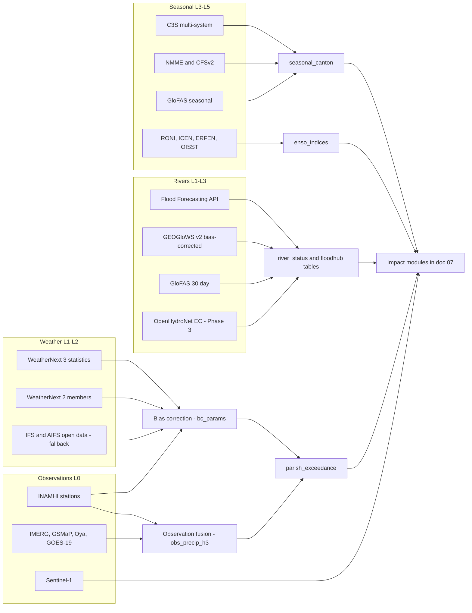

# Forecast and model stack

This document specifies the hydrometeorological forecast stack of *Gemelo Digital Ecuador – El Niño* (GDE-Niño): which model or dataset serves each horizon from nowcast to seasonal, how the platform gets access to it, what its licence allows, how it is queried cheaply from Ecuador-sized subsets, how it is bias-corrected and combined into calibrated probabilities, and how every forecast product is versioned and traced back to its inputs. It covers WeatherNext 3 and 2 in depth, the Google Flood Forecasting API and its open datasets, GloFAS and GEOGloWS, seasonal and ENSO sources, nowcasting, bias correction, the per-cycle products, the model registry and the UTC forecast-cycle schedule. Architecture components, bucket, table and job names come from [03-architecture.md](./03-architecture.md), which this document links to instead of repeating. Impact models and triggers that consume these products are in [07-impact-modules-and-triggers.md](./07-impact-modules-and-triggers.md), and the verification framework is in [14-verification-and-validation.md](./14-verification-and-validation.md).

## Contents

1. [Principles and scope](#1-principles-and-scope)
2. [Horizon stack](#2-horizon-stack)
3. [WeatherNext 3 and WeatherNext 2](#3-weathernext-3-and-weathernext-2)
4. [River forecasting](#4-river-forecasting)
5. [Sub-seasonal, seasonal and ENSO](#5-sub-seasonal-seasonal-and-enso)
6. [Nowcasting and observation fusion](#6-nowcasting-and-observation-fusion)
7. [Bias correction and downscaling](#7-bias-correction-and-downscaling)
8. [Products per cycle](#8-products-per-cycle)
9. [Model registry, versioning and provenance](#9-model-registry-versioning-and-provenance)
10. [Forecast-cycle schedule (UTC)](#10-forecast-cycle-schedule-utc)
11. [Milestones and acceptance criteria](#11-milestones-and-acceptance-criteria)
12. [Names introduced by this document](#12-names-introduced-by-this-document)
13. [Open questions](#13-open-questions)

**Owner codes** are those of the owner-role table at the top of [03](./03-architecture.md) (before §1) and of [11 §0](./11-operations-runbook.md#0-conventions): FL forecast and hydromet lead, DL data lead, PL platform lead, SRE operations, DPO data protection, PM service owner, LI INAMHI liaison (defined in 11), TA tenant admin.

**Evidence tags.** Facts carry a link to their source. "(search summary)" means the fact came from a search-engine summary of the linked page, not from reading it. **(unverified)** means the research briefs could not confirm it; **(to confirm)** means a partner or an approved account must confirm it; "estimate" marks our own arithmetic.

---

## 1. Principles and scope

| # | Principle | Consequence in this stack |
|---|---|---|
| FS-01 | **Official first** (D1) | INAMHI *advertencias*, SNGR alerts, CN-ERFEN and ENFEN statements are ingested verbatim into `commons_pub.official_alerts` and rendered above every model product. Every model output is labelled *apoyo a la decisión – pronóstico experimental*; WeatherNext's own terms say its data does not replace official warnings ([terms](https://storage.googleapis.com/weathernext-public/terms-of-use.pdf)). |
| FS-02 | **Probabilities, not single values** (D3) | Every product carries `prob_*` or `p10/p50/p90`, `n_members` and `confidence`. Accumulations are computed from ensemble **members**, never by summing quantiles. |
| FS-03 | **One horizon, several sources, shown side by side** (D11) | No silent blending across models of different pedigree. Where we combine (seasonal multi-model), weights and skill are published. |
| FS-04 | **Verify against gauges, not ERA5** (D12) | Bias correction and skill use INAMHI stations and CHIRPS v3; ERA5 is used for climatology and analogs only, because scores against ERA5 are circular for models trained on and started from ERA5 (an Ecuador-box test on [WeatherBench 2](https://github.com/google-research/weatherbench2) data gave an implausibly wet ERA5 Sierra mean of 11.2 mm/day). |
| FS-05 | **Compute near data** (D13) | WeatherNext, ERA5 and EE assets are queried in place with `init_time` partition filters, Ecuador geography filters and `maximumBytesBilled`. |
| FS-06 | **Licence-aware outputs** (D15) | Commons publishes only Non-Retrievable Value-Added WeatherNext products or CC BY 4.0 historic data; raw real-time fields stay inside the licensee's project (§3.4). |
| FS-07 | **Every horizon has a fallback** | WN3 → WN2 → ECMWF IFS/AIFS open data; Flood API → GEOGloWS (bias-corrected) → GloFAS; C3S multi-model → CFSv2 lagged ensemble. Fallbacks are labelled *modelo de respaldo*. |
| FS-08 | **Archive from day one** | Flood API snapshots, INAMHI's 92-day window and all Commons products are kept, because verification needs them and the sources have no history endpoint. |

**Scope.** Weather and hydrological hazard forecasts and the ENSO state. Out of scope: impact models (M1–M10), the parish risk index, triggers and scenario orchestration ([07](./07-impact-modules-and-triggers.md)); the verification metrics framework ([14](./14-verification-and-validation.md)); dataset licences in full ([05-data-catalog.md](./05-data-catalog.md)).

---

## 2. Horizon stack

Bands L0–L5 are those of the decision calendar in [01 §9.1](./01-context-el-nino-ecuador.md#91-lead-time-bands).

| Horizon | Band | Primary source(s) | Resolution / members | Latency and cadence | Role in the twin | Fallback | Product table(s) | Phase |
|---|---|---|---|---|---|---|---|---|
| **Observations and nowcast, 0–6 h** | L0 | INAMHI stations (Visor API); IMERG V07 Early/Late; GSMaP v8 NRT; Oya precipitation (EE); GOES-19 ABI flood product; Sentinel-1 GRD | Points (≈1,858–1,894 stations catalogued, ≈202 transmitting); 0.1°; 0.1°; 5 km / 30 min; 0.01° daily; 10 m | Stations ≈2.5 h observed lag; satellite products hours **(latency per product to confirm)**; GOES flood daily at ≈07:00 UTC next day; S1 revisit ≥6 days | State estimation, antecedent rain, flash-flood and landslide context, observed flood extent | Any single source; INAMHI Visor embed | `inamhi_station_obs_hourly`, `obs_precip_h3` (§6) | P1 display, P2 fusion |
| **Short range, 6–72 h** | L1 | **WeatherNext 3** hourly interim runs (48 h lead) and main cycles (beyond 48 h); WN3 station head for 2 m T/Td | 0.1° hourly statistics; 0.05° station head | Interim runs ≈ init + 7 h 25 min in EE (search summary; BigQuery coverage of interim runs **unverified**); main cycles ≈ init + 8 h 10 min | Hourly intensity (`tp_1h_max`), flash-flood and landslide forcing | WN2 6-hourly; IFS open data | `parish_exceedance` | P1 (main), P2 (interim, `fc-interim`) |
| **Medium range, 3–15 days** | L2 | **WeatherNext 3** statistics (mean, p10–p90) + **WeatherNext 2** 64 members | 0.1° / 0.25°; 64 members | 4 cycles/day; WN3 ≈ init + 8 h 10 min; WN2 07:30/13:30/19:30/01:30 UTC | Parish exceedance probabilities for 24/72 h windows, *nivel de riesgo* inputs | ECMWF IFS ENS / AIFS ENS open data (0.25°); GEFS | `parish_exceedance` | P1 |
| **Rivers, 0–7 days** | L1–L2 | Google **Flood Forecasting API** (gauges, virtual `hybas_` gauges, flood status, significant events, flash floods 24 h) | Gauge / HydroBASINS outlet | Hydrologic forecasts daily to 7 days; status several times a day (search summary); flash floods issued once a day (≈06:33 UTC observed) | River status per gauge, urban flash-flood polygons | GEOGloWS (bias-corrected); GloFAS | `floodhub_status_snapshots`, `floodhub_significant_events`, `floodhub_flash_floods`, `river_status` | P1 (if approved) |
| **Rivers, 0–15 days** | L2 | **GEOGloWS v2** (INAMHI hydroviewer) | 6,838,900 reaches; 52 members; 280 steps to 15 days | Daily runs (00Z) | Reach flows and return-period class, bias-corrected | GloFAS | `river_status` | P1 |
| **Rivers, 0–30 days** | L2–L3 | **GloFAS** 30-day forecast (EWDS `cems-glofas-forecast`) | 0.05°; 51 members | Daily | P(Q ≥ RP_k) per reach | GEOGloWS | `river_status` | P1 |
| **Sub-seasonal, 2–6 weeks** | L3 | ECMWF extended range (EC46) **if served as open data (to confirm)**; GEFSv12 to 35 days; CFSv2 45-day members | EC46 grid **(to confirm)**; GEFS 0.5°, 31 members; CFSv2 lagged members | Daily/weekly | Weekly rain anomaly terciles per canton | CFSv2 only | `seasonal_canton` (weekly targets, §5) | P2 |
| **Seasonal, 1–7 months** | L4–L5 | **C3S multi-system** (SEAS5 and others), **NMME**, **CFSv2** lagged ensemble, **GloFAS seasonal** | 1° (C3S **(unverified)**); GloFAS 0.05° | Monthly (C3S ≈13th, SEAS5 ≈5th, NMME ≈8–9th, all **(unverified)**; GloFAS ≈6–8th, sources disagree); CFSv2 daily | Calibrated multi-model canton terciles with skill masks; seasonal river anomalies | Single systems; CFSv2 lagged | `seasonal_canton` | P1 |
| **ENSO state and outlook** | L5 | NOAA CPC RONI and strength probabilities; ENFEN ICEN (Niño 1+2); CN-ERFEN; IRI plume; OISST-derived Niño boxes; XRO (supplementary) | Indices | Weekly/monthly; CPC second Thursday | Pathway drivers (D4), coupling indicator, analog selection | Our OISST computation when feeds are late | `enso_indices`, `official_alerts` | P1 |
| **Climatology and analogs** | All | ERA5 (ARCO), ERA5-Land, CHIRPS v3, GRRR 1980–2023, INAMHI normals 1985–2015, Google inundation history 1999–2020 | 0.25°, 0.1°, 0.05°, HydroBASINS outlets, 128 m | Static or monthly | Thresholds, anomalies, return periods, analog envelopes, calibration targets | CHIRPS v2 | `grrr_ecuador`, `inamhi_thresholds`, analog tables ([07 §7.3](./07-impact-modules-and-triggers.md)) | P0–P1 |



---

## 3. WeatherNext 3 and WeatherNext 2

### 3.1 Specifications

| | **WeatherNext 3 (WN3)** | **WeatherNext 2 (WN2)** | Gen / Graph (legacy) |
|---|---|---|---|
| Status | Operational, launched 2026-09-03 ([9to5google](https://9to5google.com/2026/09/03/google-weathernext-3/)) | Operational; open weights | **Deprecated** effective 2026-07-15 (another summary says 2026-07-29) ([deprecation guide](https://developers.google.com/weathernext/guides/deprecation), search summary) |
| Architecture | FGN encode–process–decode on an icosahedral mesh; 64-member ensemble trained on marginal CRPS ([WN3 paper](https://storage.googleapis.com/deepmind-media/papers/weathernext_3.pdf)) | FGN, 0.25° ([models guide](https://developers.google.com/weathernext/guides/models-wn2), search summary) | GenCast (50 members, 12 h), GraphCast (deterministic, 10 days) |
| Grids | 0.05° station head (2t, 2d); 0.1° single-level; 0.25° on 13 pressure levels | 0.25° (721×1440) | 0.25° |
| Time step | Hourly for surface, precipitation and some upper-air; 6 h for the rest | 6 h (1 h optional via the Vertex upsampler) | 12 h / 6 h |
| Lead | 15 days (360 h) on 00/06/12/18Z main cycles; **48 h on hourly interim runs** | 15 days | 15 / 10 days |
| Initialisation | Hourly | 00/06/12/18Z | — |
| Inputs | Two ECMWF HRES analysis frames 6 h apart (latency 5 h); 12 latest frames of an 11-channel 0.1° hourly geostationary mosaic (GOES-18/19, Meteosat-9/11, Himawari-8/9, ≈1 h latency); hourly inits use HRES short forecasts ("HRES-fc0-5") | Initialised from HRES; checkpoint `WeatherNext2_<2025_model{1,2,3,4}.npz`, fine-tuned on HRES, trained on data through 2024 ([repo](https://github.com/google-deepmind/weathernext)) | — |
| Variables | Pressure levels z, t, q, u, v, w; single level 2t, 2d, 10u, 10v, 100u, 100v, msl, **sst**, tcc, hcc, mcc, lcc, fdir, ssrd, tp (`cdir` withheld); two extra 1 h precipitation heads at 0.1°: **IMERG-head** and **PARDIG** (space-radar based); tabular cyclones. **No soil moisture, no runoff** | 2m_temperature, 10 m/100 m u/v, mean_sea_level_pressure, **sea_surface_temperature**, total_precipitation_6hr; t, z, u, v, w, q on 13 levels. No soil moisture | — |
| Published statistics | BigQuery/EE: mean, p10, p25, p50, p75, p90 only (0.1°: 19 variables × 6 = 114 bands; 0.05°: 12 bands) ([EE STAC](https://storage.googleapis.com/earthengine-stac/catalog/gcp-public-data-weathernext/projects_gcp-public-data-weathernext_assets_weathernext_3_0_0_0p1deg.json)); all 64 members only in Requester-Pays GCS (sources conflict; **to confirm**) | All 64 members and the mean in BigQuery and EE | — |
| Archive | **From 2026-01-01**; the documented 2024/2025 backfill does not exist ([OCF #934](https://github.com/openclimatefix/nged-substation-forecast/issues/934)) | **From 2022-01-01** (covers the 2023 coastal El Niño and 2023-24) | Graph EE 2020-01-01 → 2026-04-05T12Z |
| Weights | Not released | Open; licence updated **2026-08-06 to permit commercial use**; code Apache-2.0, other materials CC BY 4.0 | Open |
| Compute (reference) | One member ≈6.3 min on 4 TPU v5p chips → a 64-member run ≈27 v5p chip-hours ≈ US$57–113 at US$2.10–4.20/chip-h ([TPU pricing](https://cloud.google.com/tpu/pricing)); cannot be self-run | "Just under 1 minute" per 15-day member on one TPU v5p (search summary) → 64 members ≈ 1.1 chip-h × US$2.10–4.20 ≈ **US$2.3–4.6 per 64-member run** (before compile, I/O and initial-condition preparation) | — |
| Training cut-off | Through 2026-06-30 (incl. ECMWF cycle 50r1 data); IMERG Final training data stops Sep 2025 | Through 2024 | — |
| Twin role | **Primary** 0–15 days: hourly intensity, SST, station-head temperature, statistics at 0.1° | **Members** for accumulations and joint probabilities; **El Niño calibration archive**; **what-if engine** | Not used |

### 3.2 Identifiers

| Surface | WN3 | WN2 | Status |
|---|---|---|---|
| Analytics Hub exchange | `projects/gcp-public-data-weathernext/locations/us/dataExchanges/weathernext_19397e1bcb7` ([next25-weather](https://github.com/gena/next25-weather)) | same | Verified |
| Listing | **(to confirm)** | `weathernext_2_19a39fe59dd`; the secondary source writes the full name with the project number, `projects/871883017250/locations/us/dataExchanges/weathernext_19397e1bcb7/listings/weathernext_2_19a39fe59dd` | Secondary |
| Tables in the linked dataset | `weathernext_3_0_0_0p1deg`, `weathernext_3_0_0_0p05deg` | `weathernext_2_0_0`, `weathernext_2_0_0_mean` | Consistent across third-party repos |
| Schema | Partitioned by day on `init_time`, clustered on `geography`; columns `init_time`, `geography` (point), `geography_polygon`, `forecast ARRAY<STRUCT<time, hours, variables…>>`; WN3 statistic fields named like `total_precipitation_1hr_mean`, `temperature_2m_p90` | same layout; ERA5-style names such as `` `2m_temperature` `` and `total_precipitation_6hr`; member column **(to confirm)** | Field names **(to confirm)** with `wn-schema-check` |
| Earth Engine | `projects/gcp-public-data-weathernext/assets/weathernext_3_0_0_0p1deg`, `…/weathernext_3_0_0_0p05deg`; precipitation bands `total_precipitation_1hr`, `imerg_tp_1hr`, `experimental_tp_1hr` (PARDIG), in metres, each × 6 statistics | `…/weathernext_2_0_0` (64 members), `…/weathernext_2_0_0_mean` | Verified (EE catalog) |
| EE image properties | `start_time`, `forecast_hour`, `ensemble_member` | same | Search summary; types **(to confirm)** |
| GCS Zarr | Full ensemble `gs://weathernext3_spatial/weathernext_3_0_0/zarr/` (**Requester Pays**, `us-east1`); statistics `gs://weathernext3_statistics_spatial/weathernext_3_0_0_statistics/zarr/` (`us-east1`, **not** Requester Pays per OCF; chunks = one lead × full global grid, so Ecuador cannot be byte-range read; ≈50 GB per run for 7 variables × 360 leads globally) | `gs://weathernext/weathernext_2_0_0/zarr` (by request); mean `gs://weathernext/weathernext_2_0_0_mean/zarr/<year>_to_<next-year>/predictions.zarr` | Secondary |
| Weights | — | `gs://dm_graphcast/weathernext2/params/WeatherNext2_<2025_model1.npz` | Verified |
| Vertex on-demand | — | Container `us-docker.pkg.dev/vertex-ai-restricted/vertex-vision-model-garden-dockers/weather-next-2-inference.gpu.0-1:latest` ([notebook](https://raw.githubusercontent.com/GoogleCloudPlatform/vertex-ai-samples/main/notebooks/community/weathernext/weathernext_2_dws.ipynb)) | Verified |

Secondary sources also give numeric project ids for the underlying tables (`866962084172.WeatherNext_3.weathernext_3_0_0_0p1deg`, `871883017250.WeatherNext2.weathernext_2_0_0`). The twin always queries through its own linked datasets `weathernext_3` and `weathernext_2`, never those ids.

### 3.3 Access steps

Access is granted **per Google account** through the WeatherNext Data Request form, and linked datasets are created per project. The Commons project needs its own approval; each T2+ tenant that wants raw fields needs its own ([04 §9](./04-identity-tenancy-byo-gcp.md#9-third-party-access-per-tenant-and-what-the-commons-provides-instead)).

| Step | Action | Who | When | Done when |
|---|---|---|---|---|
| 1 | Submit the **WeatherNext Data Request form** ([form](https://docs.google.com/forms/d/e/1FAIpQLSeCf1JY8G78UDWzbm0ly9kJxfSjUIJT5WyMR_HiNqCm-IHIBg/viewform); URL as given in the EE catalogue entry of the WN3 asset and in third-party repos) for the FL and DL Google accounts, naming `ectwin-commons-prod` and `ectwin-commons-dev`, use case "El Niño decision support for Ecuadorian public agencies; non-retrievable derived products only". Contact: weathernext@google.com. Approval ≈5–7 business days (secondary sources). | FL | Phase 0 day 1–2 (2026-09-29/30) | Approval email filed in the access tracker |
| 2 | **Subscribe** to the WN3 and WN2 listings from the approved account. This creates read-only linked datasets `weathernext_3` and `weathernext_2` in location `US` (below). | FL | Day of approval | `bq ls ectwin-commons-prod:weathernext_3` lists both WN3 tables |
| 3 | Grant `roles/bigquery.dataViewer` on the linked datasets to the Commons forecast job service account; confirm the terms allow a service account of the licensee to query **(to confirm with weathernext@google.com)**. | DL | +1 day | Dry run as the job SA succeeds |
| 4 | **Earth Engine:** the Commons project is registered for EE; read the WN assets with the approved account's project. | FL | +1 day | `ee.ImageCollection(<WN3 asset>).limit(1).getInfo()` returns |
| 5 | **GCS Zarr (Phase 2):** read the WN3 full-ensemble Requester-Pays bucket from `us-east1` with `userProject=ectwin-commons-prod`; request WN2 Zarr access if needed. | FL | 2027-01-15 spike (M2.2 in [03](./03-architecture.md)) | Chunk layout and cost per cycle measured |
| 6 | **Vertex allowlist (Phase 3):** ask for the WN2 on-demand allowlist ([access-vmg](https://developers.google.com/weathernext/guides/access-vmg), search summary) and GPU quota, which starts at 0, for the project and region that will run scenarios: service `Vertex AI API`, quota "Custom model training preemptible Nvidia H100 GPUs per region" (or the A100 80GB equivalent). The DWS notebook runs **one member per GPU**, so the quota must cover the members submitted at once: 64 GPUs for a full 64-member run, or 16 if the four seeds run one after another ([notebook](https://raw.githubusercontent.com/GoogleCloudPlatform/vertex-ai-samples/main/notebooks/community/weathernext/weathernext_2_dws.ipynb)). | FL + TA | Allowlist enquiry filed 2026-09-30 (AR-02 in [12 §2.1](./12-roadmap-team-budget.md), FS-M0.1); GPU quota request by 2026-10-15; use from 2027-05 | Quota ≥ 16 granted and a small smoke run (e.g. 1 seed × 8 members on `a3-highgpu-8g`) succeeds |
| 7 | Run the **preflight** (PF-13 in [04 §4.7](./04-identity-tenancy-byo-gcp.md)) and `wn-schema-check` daily ([11 §2.1](./11-operations-runbook.md)). | DL | Continuous | `commons_ops.dq_results` green |

Subscription (request shape as in [03 §5.2](./03-architecture.md#52-bigquery-datasets); WN3 listing id **(to confirm)**; if the resource name with the project id `gcp-public-data-weathernext` is rejected, use the project-number form shown in §3.2):

```bash
C=ectwin-commons-prod
X=projects/gcp-public-data-weathernext/locations/us/dataExchanges/weathernext_19397e1bcb7
for pair in "weathernext_2_19a39fe59dd:weathernext_2" "<WN3_LISTING_ID>:weathernext_3"; do
  L=${pair%%:*}; D=${pair##*:}
  curl -sS -X POST -H "Authorization: Bearer $(gcloud auth print-access-token)" \
    -H "Content-Type: application/json" \
    "https://analyticshub.googleapis.com/v1/${X}/listings/${L}:subscribe" \
    -d '{"destinationDataset":{"datasetReference":{"projectId":"'"$C"'","datasetId":"'"$D"'"},"location":"US"}}'
done
# Verify, and measure the cost of the smallest useful query before building anything on it
bq --project_id=$C ls $C:weathernext_3
bq --project_id=$C query --use_legacy_sql=false --dry_run \
  'SELECT COUNT(1) FROM `ectwin-commons-prod.weathernext_3.weathernext_3_0_0_0p1deg`
   WHERE init_time = TIMESTAMP("2026-10-01 00:00:00+00")'
```

Reading the WN3 full ensemble (Phase 2 only, run in `us-east1`; store layout and Zarr format **(to confirm)**):

```python
import gcsfs, xarray as xr
fs = gcsfs.GCSFileSystem(project="ectwin-commons-prod", requester_pays=True)   # bills ectwin-commons-prod
store = fs.get_mapper("weathernext3_spatial/weathernext_3_0_0/zarr/<RUN>")     # path pattern to confirm
ds = xr.open_zarr(store, consolidated=True)
ec = ds.sel(longitude=slice(-92.1 % 360, -75.1 % 360), latitude=slice(1.7, -5.1))  # 0-360 and N-S order to confirm
```

### 3.4 Terms: real-time vs historic, retrievable vs non-retrievable

The WeatherNext terms of use ([PDF](https://storage.googleapis.com/weathernext-public/terms-of-use.pdf), last modified 2026-09-03) govern every design choice below.

| Data class | Definition | Examples in the twin | Who may receive it | Where it lives | `licence_class` |
|---|---|---|---|---|---|
| **Real-time, unmodified** | WN3 data relating to a time less than 1 h ago or in the future. For WN2 older catalog text says 48 h; the twin applies **48 h for WN2** until confirmed | Raw fields, cell subsets, recoloured maps, re-combined time steps ("unmodified" per the terms), point series | The licensee for **any internal purpose**; its Contractors and Subsidiaries | `commons_internal` (Commons) or tenant `ectwin` / `ectwin_scratch` (own approval only) | `wn_internal` (new) |
| **Retrievable Value-Added Service** | Derived product from which raw data can be recovered | Parish time series of p10–p90, ensemble spread per cell, fan charts | Only "clearly identified and known third parties", for their internal use | Tenant projects with their own approval; **not** published by Commons (spine §2 P2 and D15: Commons publishes only Non-Retrievable Value-Added or historic WeatherNext data) | `wn_internal` |
| **Non-Retrievable Value-Added Service** | Raw data cannot be recovered | Parish exceedance probabilities, *nivel de riesgo*, indices, counts of members above a threshold, confidence classes | **Anyone** | `commons_pub.parish_exceedance`, tiles, PDFs | `wn_nrva` |
| **Historic** | Older than the real-time threshold | Hindcast and verification tables, calibration parameters, archived fields | Anyone, **CC BY 4.0** with attribution | `commons_pub.verification_scores`, `commons_internal.bc_params`, research exports | `wn_historic_ccby` |

Other obligations and risks from the same terms:

- Anything shared must carry a copy of the terms, the "Legally Binding Terms of Use" text file and the notice "Copyright 2024-6 Google LLC"; export bundles add these automatically ([04 §9](./04-identity-tenancy-byo-gcp.md)).
- The data is "experimental", "not intended for consumer use" and no substitute for official alerts.
- Google may start charging with **one month's notice**; a user whose access is terminated **may not reapply**; liability is capped at US$500. Ecuador is not a restricted country.
- **Consequence for design:** the IFS/AIFS fallback path (§3.12) must be production-ready from Phase 1, and Commons never re-serves raw real-time fields to T0/T1 users.
- **Per-parish quantities are treated as retrievable** until Google confirms otherwise, because a small parish covered by one cell reveals that cell's value. Commons therefore publishes probabilities and classes, not parish percentiles ([03 §14](./03-architecture.md#14-open-questions)).

### 3.5 Release schedule and pipeline timing

| Product | GCS available | BigQuery / EE available | Source |
|---|---|---|---|
| WN3 hourly interim run (48 h lead) | init + 7 h 10 min | init + 7 h 25 min | [dissemination guide](https://developers.google.com/weathernext/guides/dissemination) (search summary) |
| WN3 main cycle 00/06/12/18Z (360 h) | init + 7 h 45 min | init + 8 h 10 min | same; variance ±15 min, occasionally ±60 min |
| WN3 measured median | — | ≈7.3 h after init | third-party measurement (secondary) |
| WN2 00/06/12/18Z | — | 07:30, 13:30, 19:30, 01:30 UTC (≈ init + 7 h 30 min) | EE catalog release estimates |

Consequences:

1. **The first ≈7–8 h of every WeatherNext run are already in the past when it is published.** At any wall-clock time the freshest WeatherNext guidance for the next 0–6 h is at an effective lead of ≈7–14 h (hourly interim runs, N2+) or ≈8–20 h (main cycles, which arrive every 6 h), estimate from the §3.5 timings. The 0–6 h band therefore relies primarily on observations and extrapolation (§6), with WN3 only as background.
2. The Commons `forecast-cycle` workflow starts at init + 7 h 20 min, probes every 10 min and falls back at init + 10 h ([03 §4.2](./03-architecture.md#42-forecast-cycle), [11 RB-01](./11-operations-runbook.md)).
3. **Backtests must use publication time, not init time.** WN3 data before September 2026 was reportedly backfilled about 20 days after initialisation (secondary, **unverified**), so a naive replay would be optimistic. `parish_exceedance.created_at` records our own publication time from day 1.

### 3.6 BigQuery: per-parish exceedance probabilities and percentiles

Two queries, both run in the approved project (Commons or a T2+ tenant), both with the mandatory **partition filter** (`init_time = @init_time`), a **constant geography filter** for cluster pruning, and **`maximum_bytes_billed`**. Rules that apply to both:

- `GEOGRAPHY` values cannot be used in `GROUP BY`, `DISTINCT` or join equality, so cells are keyed by `ST_GEOHASH(geography, 12)` (`cell_id`). The sketch in [03 §4.2](./03-architecture.md#42-forecast-cycle) should adopt the same key.
- The Ecuador clip must be a **constant expression** (a literal WKT), not a subquery, so that clustering on `geography` can prune blocks. The authoritative polygons live in `commons_pub.dim_ecuador_clip`; the literal boxes below are a conservative superset: mainland lon −81.1…−75.1, lat −5.1…1.7, plus Galápagos lon −92.1…−89.2, lat −1.5…1.7 (estimate).
- WeatherNext precipitation is in metres; multiply by 1,000 for mm.
- Only referenced nested fields of `forecast` are billed. Expected scan: ≈0.07 GB per WN3 column-init and ≈0.2 GB per WN2 column-init ([costs brief arithmetic, 09](./09-cost-model.md)); third-party point queries billed 30–89 MB. Query A reads 7 leaf columns (`hours`, mean, p10–p90) ≈ 0.5 GB per init and Query B 2 leaf columns ≈ 0.4 GB (estimate), so one cycle stays near the ≤ 1 GB target of M1.1 and far below the 5 GiB cap.

**One-off: cell-to-parish weights for the WN3 0.1° grid** (the WN2 table `cell_parish_weights_wn2` is built the same way; `dim_dpa` column names per [05](./05-data-catalog.md)):

```sql
CREATE OR REPLACE TABLE `ectwin-commons-prod.commons_internal.cell_parish_weights_wn3`
CLUSTER BY cell_id AS
WITH cells AS (
  SELECT ST_GEOHASH(t.geography, 12) AS cell_id, ANY_VALUE(t.geography_polygon) AS cell_poly
  FROM `ectwin-commons-prod.weathernext_3.weathernext_3_0_0_0p1deg` AS t
  WHERE t.init_time = TIMESTAMP '2026-10-01 00:00:00+00'                      -- any one partition
    AND ST_INTERSECTS(t.geography, ST_GEOGFROMTEXT(
      'MULTIPOLYGON(((-81.1 -5.1,-75.1 -5.1,-75.1 1.7,-81.1 1.7,-81.1 -5.1)),((-92.1 -1.5,-89.2 -1.5,-89.2 1.7,-92.1 1.7,-92.1 -1.5)))',
      planar => TRUE))
  GROUP BY cell_id)
SELECT c.cell_id, p.dpa_code AS dpa_parish,
       ST_AREA(ST_INTERSECTION(c.cell_poly, p.geom)) AS overlap_m2,
       SAFE_DIVIDE(ST_AREA(ST_INTERSECTION(c.cell_poly, p.geom)), ST_AREA(p.geom)) AS area_weight
FROM cells AS c
JOIN `ectwin-commons-prod.commons_pub.dim_dpa` AS p
  ON p.level = 'parroquia' AND ST_INTERSECTS(c.cell_poly, p.geom);
```

**Persistent helper: exceedance probability from WN3 quantiles.** A piecewise-linear CDF through (p10, p25, p50, p75, p90). Tails are bounded, not extrapolated: below p10 the probability of exceedance is "≥ 0.90"; above p90 it is "< 0.10" and flagged.

```sql
CREATE OR REPLACE FUNCTION `ectwin-commons-prod.commons_internal.p_exceed_pl`(
  x FLOAT64, q10 FLOAT64, q25 FLOAT64, q50 FLOAT64, q75 FLOAT64, q90 FLOAT64)
RETURNS STRUCT<p FLOAT64, tail STRING> AS (
  CASE
    WHEN x <= q10 THEN STRUCT(0.90 AS p, 'lower_bound' AS tail)
    WHEN x <= q25 THEN STRUCT(1 - (0.10 + 0.15 * COALESCE(SAFE_DIVIDE(x - q10, q25 - q10), 1)), 'none')
    WHEN x <= q50 THEN STRUCT(1 - (0.25 + 0.25 * COALESCE(SAFE_DIVIDE(x - q25, q50 - q25), 1)), 'none')
    WHEN x <= q75 THEN STRUCT(1 - (0.50 + 0.25 * COALESCE(SAFE_DIVIDE(x - q50, q75 - q50), 1)), 'none')
    WHEN x <= q90 THEN STRUCT(1 - (0.75 + 0.15 * COALESCE(SAFE_DIVIDE(x - q75, q90 - q75), 1)), 'none')
    ELSE STRUCT(0.10, 'upper_bound')
  END);
```

**Query A — WN3: hourly-intensity exceedance and expected 24 h rain per parish.** Two statistically honest quantities from statistics-only data: (1) the probability that the hourly rate exceeds a threshold in each hour, whose maximum over the window is a **lower bound** on the probability of at least one exceeding hour (`tp_1h_max`); (2) the **expected** 24 h total, which is exact because the mean of a sum is the sum of hourly means. Quantiles of 24 h totals cannot be derived from WN3 statistics (ADR-29 in [03](./03-architecture.md#10-architecture-decision-records)).

```sql
-- wn3_parish.sql  (field names inside `forecast` to confirm with wn-schema-check)
WITH f AS (
  SELECT ST_GEOHASH(t.geography, 12) AS cell_id,
         x.hours AS lead_h,
         1000 * x.total_precipitation_1hr_mean AS m,
         1000 * x.total_precipitation_1hr_p10 AS q10, 1000 * x.total_precipitation_1hr_p25 AS q25,
         1000 * x.total_precipitation_1hr_p50 AS q50, 1000 * x.total_precipitation_1hr_p75 AS q75,
         1000 * x.total_precipitation_1hr_p90 AS q90
  FROM `ectwin-commons-prod.weathernext_3.weathernext_3_0_0_0p1deg` AS t, t.forecast AS x
  WHERE t.init_time = @init_time                                                   -- partition pruning
    AND ST_INTERSECTS(t.geography, ST_GEOGFROMTEXT(                                -- cluster pruning (constant)
      'MULTIPOLYGON(((-81.1 -5.1,-75.1 -5.1,-75.1 1.7,-81.1 1.7,-81.1 -5.1)),((-92.1 -1.5,-89.2 -1.5,-89.2 1.7,-92.1 1.7,-92.1 -1.5)))',
      planar => TRUE))
    AND x.hours BETWEEN @win_start_h + 1 AND @win_start_h + 24                     -- 12Z-12Z window: 13..36 for a 00Z init
),
hourly AS (
  SELECT f.cell_id, f.lead_h, f.m, th.threshold_id, th.value_mm,
         `ectwin-commons-prod.commons_internal.p_exceed_pl`(th.value_mm, q10, q25, q50, q75, q90) AS pe
  FROM f
  JOIN `ectwin-commons-prod.commons_internal.inamhi_thresholds` AS th ON th.variable = 'tp_1h'
),
cell AS (
  SELECT cell_id, threshold_id, ANY_VALUE(value_mm) AS value_mm,
         MAX(IF(pe.tail = 'upper_bound', 0, pe.p)) AS p_any_hour_lb,  -- lower bound on P(at least one hour > T)
         LOGICAL_AND(pe.tail = 'upper_bound') AS all_hours_below_p10, -- every hour: P < 0.10 (shown as "< 10 %")
         SUM(m) AS exp_24h_mm, COUNT(*) AS n_hours
  FROM hourly GROUP BY 1, 2
  HAVING n_hours = 24
)
SELECT @init_time AS init_time, 'WN3' AS model, 'tp_1h_max' AS variable,
       w.dpa_parish, c.threshold_id, c.value_mm AS threshold_value,
       SAFE_DIVIDE(SUM(w.area_weight * c.p_any_hour_lb), SUM(w.area_weight)) AS prob_exceed,
       MAX(c.p_any_hour_lb) AS prob_exceed_max_cell,
       SAFE_DIVIDE(SUM(w.area_weight * c.exp_24h_mm), SUM(w.area_weight)) AS expected_tp24_mm_internal  -- retrievable: internal only
FROM cell AS c
JOIN `ectwin-commons-prod.commons_internal.cell_parish_weights_wn3` AS w USING (cell_id)
GROUP BY w.dpa_parish, c.threshold_id, c.value_mm;
```

**Query B — WN2: member-based 72 h accumulations, percentiles and exceedance per parish.** This is the statistically correct path for accumulations: sum 6-hourly steps per member and cell, average to the parish per member, then take quantiles and member counts across the 64 members.

```sql
-- wn2_parish_72h.sql  (member column name to confirm; 03 uses ensemble_member)
WITH m AS (
  SELECT ST_GEOHASH(t.geography, 12) AS cell_id, t.ensemble_member AS member,
         1000 * x.total_precipitation_6hr AS tp6_mm
  FROM `ectwin-commons-prod.weathernext_2.weathernext_2_0_0` AS t, t.forecast AS x
  WHERE t.init_time = @init_time
    AND ST_INTERSECTS(t.geography, ST_GEOGFROMTEXT(
      'MULTIPOLYGON(((-81.1 -5.1,-75.1 -5.1,-75.1 1.7,-81.1 1.7,-81.1 -5.1)),((-92.1 -1.5,-89.2 -1.5,-89.2 1.7,-92.1 1.7,-92.1 -1.5)))',
      planar => TRUE))
    AND x.hours BETWEEN @win_start_h + 6 AND @win_start_h + 72   -- steps ending 18..84 h for a 00Z init = 12Z D1 to 12Z D4
),
cell_tot AS (
  SELECT cell_id, member, SUM(tp6_mm) AS tp72_mm, COUNT(*) AS n_steps
  FROM m GROUP BY 1, 2 HAVING n_steps = 12
),
parish_member AS (
  SELECT w.dpa_parish, c.member,
         SAFE_DIVIDE(SUM(w.area_weight * c.tp72_mm), SUM(w.area_weight)) AS tp72_mm,
         MAX(c.tp72_mm) AS tp72_max_cell
  FROM cell_tot AS c
  JOIN `ectwin-commons-prod.commons_internal.cell_parish_weights_wn2` AS w USING (cell_id)
  GROUP BY 1, 2
),
pct AS (
  SELECT dpa_parish, COUNT(*) AS n_members,
         APPROX_QUANTILES(tp72_mm, 20) AS q                       -- 5% steps; exact enough for 64 values
  FROM parish_member GROUP BY 1
)
SELECT @init_time AS init_time, 'WN2' AS model, 'tp_72h' AS variable, p.dpa_parish, th.threshold_id,
       th.value_mm AS threshold_value,
       AVG(IF(pm.tp72_mm >= th.value_mm, 1, 0))       AS prob_exceed,           -- NRVA: publishable
       AVG(IF(pm.tp72_max_cell >= th.value_mm, 1, 0)) AS prob_exceed_max_cell,  -- NRVA: publishable
       ANY_VALUE(p.q[OFFSET(2)])  AS p10_mm_internal,                           -- retrievable: internal only
       ANY_VALUE(p.q[OFFSET(10)]) AS p50_mm_internal,
       ANY_VALUE(p.q[OFFSET(18)]) AS p90_mm_internal,
       ANY_VALUE(p.n_members) AS n_members
FROM parish_member AS pm
JOIN pct AS p USING (dpa_parish)
JOIN `ectwin-commons-prod.commons_internal.inamhi_thresholds` AS th ON th.variable = 'tp_72h'
GROUP BY p.dpa_parish, th.threshold_id, th.value_mm;
```

Execution with guardrails (dry run first, then a hard cap; labels feed `commons_ops.pipeline_runs`):

```bash
bq query --use_legacy_sql=false --location=US --dry_run \
  --parameter='init_time:TIMESTAMP:2026-11-15 00:00:00+00' --parameter='win_start_h:INT64:12' < wn2_parish_72h.sql
bq query --use_legacy_sql=false --location=US \
  --maximum_bytes_billed=5368709120 \
  --label=ectwin_cycle:20261115t0000z --label=ectwin_step:wn2_parish_72h \
  --parameter='init_time:TIMESTAMP:2026-11-15 00:00:00+00' --parameter='win_start_h:INT64:12' \
  --destination_table='ectwin-commons-prod:commons_internal.wn2_parish_72h$20261115' --replace < wn2_parish_72h.sql
```

In the `fc-exceedance` job the same caps are set in code (`bigquery.QueryJobConfig(maximum_bytes_billed=5 * 2**30, labels=…)`); the publish step `MERGE`s only the `prob_*` columns into `commons_pub.parish_exceedance` ([03 §5.3](./03-architecture.md#53-commons-table-schemas-ddl)). Columns suffixed `_internal` never leave `commons_internal` or the tenant's own `ectwin` dataset.

### 3.7 Earth Engine and Xee

Earth Engine is used where it is cheaper or simpler than BigQuery: raster reductions to parishes, joins with EE-native observations (IMERG, CHIRPS), and xarray analysis via Xee (0.1.2, 2026-07-14, [PyPI](https://pypi.org/pypi/xee/json)). Operational government use in a non-LDC such as Ecuador needs a commercial EE account (search summary of the EE noncommercial page); academic and NGO tenants may use the noncommercial tiers ([04 §5.7.4](./04-identity-tenancy-byo-gcp.md)).

**EE: expected 72 h rain and worst-hour p90 per parish from WN3, exported to BigQuery** (property types of `start_time`/`forecast_hour` and band suffixes **to confirm**; the parish asset is created by DL from `dim_dpa` and shared read-only with tenant projects, asset ACL **to set**):

```python
import ee
TP = "my-tenant-project"                                   # the approved project pays EECU
ee.Initialize(project=TP)

WN3 = "projects/gcp-public-data-weathernext/assets/weathernext_3_0_0_0p1deg"
PARISHES = ee.FeatureCollection("projects/ectwin-commons-prod/assets/dpa_parroquias")   # asset to create (DL)
INIT = ee.Date("2026-11-15T00:00:00Z")

run = (ee.ImageCollection(WN3)
       .filter(ee.Filter.eq("start_time", INIT.millis()))            # or the string form; type to confirm
       .filter(ee.Filter.rangeContains("forecast_hour", 13, 84)))    # 12Z D1 .. 12Z D4 for a 00Z init

exp72 = run.select("total_precipitation_1hr_mean").sum().multiply(1000).rename("exp_tp72_mm")   # mean of sum = sum of means
p90max = run.select("total_precipitation_1hr_p90").max().multiply(1000).rename("max_hourly_p90_mm")
stack = exp72.addBands(p90max)

stats = stack.reduceRegions(collection=PARISHES, reducer=ee.Reducer.mean().combine(ee.Reducer.max(), sharedInputs=True),
                            scale=11132, tileScale=4)
task = ee.batch.Export.table.toBigQuery(
    collection=stats, description="wn3_parish_72h_20261115",
    table=f"{TP}.ectwin_scratch.wn3_parish_72h_20261115", overwrite=True)
task.start()
```

**Xee: WN2 member ensemble for Ecuador as xarray, P(72 h rain ≥ 100 mm) per cell.** EE sums each member's 6-hourly steps server-side, so Xee only pulls 64 small images of the mainland box (6° × 6.8° at 0.25° ≈ 24 × 28 cells, estimate). Xee argument names **(to confirm against 0.1.2)**.

```python
# continues the previous block (TP, INIT)
import ee, xarray as xr
ee.Initialize(project=TP, opt_url="https://earthengine-highvolume.googleapis.com")
WN2 = ee.ImageCollection("projects/gcp-public-data-weathernext/assets/weathernext_2_0_0")
REGION = ee.Geometry.Rectangle([-81.1, -5.1, -75.1, 1.7])            # mainland box

run = (WN2.filter(ee.Filter.eq("start_time", INIT.millis()))
          .filter(ee.Filter.rangeContains("forecast_hour", 18, 84))
          .select("total_precipitation_6hr"))
members = run.aggregate_array("ensemble_member").distinct()
per_member = ee.ImageCollection(members.map(
    lambda mbr: run.filter(ee.Filter.eq("ensemble_member", mbr)).sum()
                   .multiply(1000).rename("tp72_mm").set("ensemble_member", mbr)))

ds = xr.open_dataset(per_member, engine="ee", crs="EPSG:4326", scale=0.25, geometry=REGION,
                     primary_dim_name="member", primary_dim_property="ensemble_member")
p100 = (ds["tp72_mm"] >= 100).mean("member")                           # probability per cell
q = ds["tp72_mm"].quantile([0.1, 0.5, 0.9], dim="member")               # retrievable: internal use only
```

### 3.8 WN3 caveats for Ecuador, including the Andes bias

| Caveat | Evidence | Rule in the twin |
|---|---|---|
| **Andes station-head bias.** The paper reports "strong biases… in sparsely observed… areas, such as the Andes" in the 2 m temperature/dewpoint station head; 2,000 ERA5/HRES pseudo-stations per hour "greatly reduced" them, but the residual is not quantified. Station training used METAR (few in Ecuador), Mesonet (mostly Europe/North America) and ICOADS. | [WN3 paper](https://storage.googleapis.com/deepmind-media/papers/weathernext_3.pdf) | Sierra products (parishes whose area is mostly at or above 1,500 m, the orography mask of the WeatherBench 2 Ecuador-box test in FS-04; region stratum `sierra` in [14](./14-verification-and-validation.md)) carry `confidence='baja'` until the Sierra verification of [14 §5.3](./14-verification-and-validation.md#53-confidence-labels) clears the `F_LOWSKILL` rule (CRPSS ≥ 0.10 against held-out INAMHI stations); temperature is lapse-rate checked against Copernicus DEM elevation (§7). |
| **Extreme precipitation not evaluated.** The limitations guide caps evaluation at 4 mm/6 h; El Niño coastal extremes (> 100 mm/day in Manabí and Guayas) are untested. | [benefits and limitations](https://developers.google.com/weathernext/guides/benefits-limitations) (search summary) | Thresholds above the local P99 are shown with `confidence='baja'` unless verification says otherwise. |
| **Real-time evaluation only in the coastal dry season** (2026-07-01 to 08-11, MRMS and gauges). | Paper | First wet-season verification happens in our own Phase 2 (weekly, [11](./11-operations-runbook.md)). |
| **Three precipitation heads.** `total_precipitation_1hr` (model), `imerg_tp_1hr` (IMERG-calibrated), `experimental_tp_1hr` (PARDIG). PARDIG cut CRPS by up to 60% vs IMERG, 30% vs MRMS and ≈10% vs gauges at short leads. | Paper | Phase 1 uses `total_precipitation_1hr` for products and computes all three in shadow; the head with the best Ecuador CRPS after 8 weeks of wet-season data becomes primary (decision FL + LI, target 2027-02-15). |
| **Short archive (from 2026-01-01).** | OCF | No WN3-only calibration before a full wet season; delta mapping/regional pooling first, EMOS later (§7). |
| **Depends on ECMWF HRES inputs.** | Paper | IFS problems can delay WN3 too; the fallback ladder (§3.12) must not assume independence. |
| **No soil moisture or runoff.** | Paper | Rivers come from §4; landslide antecedent state from SMAP and observed rain (§6). |
| **Latency ≈7–8 h.** | §3.5 | WN3 is not a nowcast (§6). |

### 3.9 WN2 as the El Niño calibration archive (2022 →)

WN2 is the only WeatherNext archive that contains El Niño conditions: the **2023 coastal El Niño (Mar–Jun 2023)**, the **2023-24 event** and the **2025-26 rainy season** (including the March 2026 floods mapped by Copernicus EMS activation EMSR870).

**Uses.**

1. **Bias-correction training** for WN2 (quantile mapping by month, lead and elevation class, §7) on 2022–2025.
2. **Skill in El Niño conditions**: CRPSS, Brier and reliability for 24/72 h thresholds, stratified by `enso_phase` in `verification_scores` ([03 §5.3](./03-architecture.md#53-commons-table-schemas-ddl)).
3. **Forecast track record for analogs**: how WN2 behaved in 2023 and 2023-24 is shown next to the analog envelopes ([07 §7.3](./07-impact-modules-and-triggers.md)).
4. **Transfer to WN3**: WN2-derived correction shapes seed WN3 delta mapping until WN3 has one full wet season.

**Materialised extract.** To avoid rescanning the linked tables, `wn2-hindcast-extract` (Cloud Run Delayed Job, one task per month) writes 24 h (12Z–12Z) member totals for the **00Z init only** to `commons_internal.wn2_hindcast_members_ec`, clustered by `cell_id`. Size (estimate): ≈650 land cells (0.25° cells that intersect a parish, estimate) × 64 members × 14 complete 12Z–12Z windows (a 360 h run from 00Z) × ≈1,730 inits (2022-01-01 → 2026-09-30) ≈ 1.01 billion rows × ≈30 bytes ≈ 30 GB, ≈US$0.60/month active logical storage at US$0.02/GiB-month before the 10 GiB free tier; it grows by ≈365 inits (≈6.4 GB) a year. The scan to build it is ≈0.4 GB per init (two leaf columns, `hours` and `total_precipitation_6hr`, at ≈0.2 GB each, the same basis as [03 §7.5](./03-architecture.md#75-backfills)) × ≈1,730 ≈ 0.69 TB ≈ 0.63 TiB, an upper estimate (≈70 GB if clustering prunes exactly to the ≈650 land cells: 650 × 64 × 60 leads × 8 B × 2 columns × 1,730). For comparison, the 4-init parish backfill in 03 §7.5 is ≈2.8 TB. Spreading the extract over two months keeps it inside the 1 TiB monthly free tier alongside routine cycles.

**In-sample caveat (important).** The operational WN2 checkpoint was trained on data through 2024. If the 2022–2024 archive was generated retrospectively by that checkpoint, scores for 2022–2024 (including 2023) are **in-sample and optimistic**; only 2025 onward would be a clean test. The archive's provenance is **(to confirm with weathernext@google.com)**. Until confirmed, `verification_scores` rows for 2022–2024 carry `method_version` suffix `-insample` and the confidence indicator uses 2025-26 scores only.

### 3.10 WN2 on-demand runs on Vertex: the what-if engine

WN2 can be run on demand on Vertex AI / Gemini Enterprise Agent Platform with custom initial conditions ([notebook](https://raw.githubusercontent.com/GoogleCloudPlatform/vertex-ai-samples/main/notebooks/community/weathernext/weathernext_2_dws.ipynb)). The twin uses it for the Phase 3 perturbed-SST scenarios; the product flow (request, gating, impacts, labels) is in [07 §7.4](./07-impact-modules-and-triggers.md). This section fixes the engineering.

| Item | Specification |
|---|---|
| Access | Project allowlist; GPU quota starts at 0 and must be requested (§3.3 step 6) |
| Job type | `CustomContainerTrainingJob` with the container in §3.2; the notebook pins `google-cloud-aiplatform==1.129.0` |
| Hardware | `a3-highgpu-{1,2,4,8}g` (H100 80 GB) or `a2-ultragpu-{1,2,4,8}g` (A100 80 GB) |
| Parallelism | **One member per GPU**: `replica_count = num_samples per seed ÷ GPUs per machine`, and `num_samples` per seed must be a multiple of the GPUs per machine (DWS notebook). 16 members per seed on `a3-highgpu-8g` = 2 replicas; on `a3-highgpu-1g` = 16 replicas |
| Scheduling | `FLEX_START` (Dynamic Workload Scheduler, the notebook default), `SPOT` or `STANDARD`; twin default `FLEX_START`, `SPOT` for batches of scenarios, `STANDARD` only in N3 posture |
| Parameters | `--num_samples`, `--horizon_hrs` (≤360), `--forecast_init_time` (the notebook says models are available for dates from 2024 onward), `--model_seed` 1–4, `--enable_hourly_prediction`, `--pred_root_dir` (output root), `--input_data_gcs_dir` (custom initial conditions) |
| Custom inputs | Zarr **v3**, grid 721×1440, levels 50/100/150/200/250/300/400/500/600/700/850/925/1000 hPa, variables `msl, q, sst, t, t2m, u, u10, u100, v, v10, v100, w, z` ([custom inputs guide](https://raw.githubusercontent.com/GoogleCloudPlatform/vertex-ai-samples/main/notebooks/community/weathernext/CUSTOM_INPUTS_GUIDE.md)) |
| Members | 64 = 4 seeds × 16 samples: the notebook's "all seeds" option splits `num_samples` evenly across seeds 1–4; that the operational 64-member product is built the same way is **to confirm** |
| Where | Tenant T3 project (tenant pays); Commons only for the national reference scenarios agreed with CN-ERFEN. Bucket and job in the same region (the notebook checks this); `us-central1` per D10 if H100 quota is granted there |
| Output | The container writes `<pred_root_dir>/weathernext_2_seed_<s>/<YYYYMMDD>_<HH>hr_01_preds/predictions.zarr/` (hourly runs under `weathernext_2_seed_<s>_hourly/`), with `pred_root_dir = gs://<TENANT_PROJECT>-ectwin/scenarios/<scenario_id>/out`; the Ecuador subset is loaded to BigQuery and processed by the same parish SQL as Query B |

**Initial conditions.** The operational WN2 checkpoint is fine-tuned on and initialised from ECMWF HRES; without `--input_data_gcs_dir` the container uses its own default inputs for `--forecast_init_time` (2024 onward per the notebook). A perturbation needs custom inputs, so the control must be built through the **same** custom-input pipeline. For past inits (studies, sensitivity tests) ARCO-ERA5 is the candidate base (`gs://gcp-public-data-arco-era5/ar/full_37-1h-0p25deg-chunk-1.zarr-v3`, `us-central1`, 37 levels subset to the 13 required; ERA5T runs ≈6 days behind); ERA5 initial conditions differ from the HRES analyses the model was fine-tuned on, a mismatch the acceptance test below must quantify. For near-real-time what-ifs another analysis source is needed; IFS open data is a candidate, but whether it carries all 13 levels and variables is **(to confirm)**. The perturbation adds `scale × pattern` to `sst` only, with a smoothed Niño 1+2 composite pattern and a 3° cosine taper; scales −1, 0 (control), +1, +2 °C ([07 §7.4](./07-impact-modules-and-triggers.md#74-wn2-perturbed-sst-runs-phase-3-t3-only)).

```python
# pipelines/tenant/wn2_scenario/submit.py  (argument names follow the DWS notebook; SDK pinned as there)
from google.cloud import aiplatform
from google.cloud.aiplatform.compat.types import custom_job as gca_custom_job_compat

TP, SID = "my-tenant-project", "nino12-plus1-20270110"
aiplatform.init(project=TP, location="us-central1", staging_bucket=f"gs://{TP}-ectwin")  # bucket in the job region
IMG = ("us-docker.pkg.dev/vertex-ai-restricted/vertex-vision-model-garden-dockers/"
       "weather-next-2-inference.gpu.0-1:latest")
MACHINE, GPUS = "a3-highgpu-8g", 8          # H100 80GB; "a2-ultragpu-8g" for A100 80GB
PER_SEED = 16                               # 4 seeds x 16 = 64 members; must be a multiple of GPUS
FLEX = gca_custom_job_compat.Scheduling.Strategy.FLEX_START

for seed in (1, 2, 3, 4):                   # 4 x 16 = 64 GPUs at once; run seeds in sequence if quota is 16
    job = aiplatform.CustomContainerTrainingJob(display_name=f"wn2-{SID}-s{seed}", container_uri=IMG)
    job.run(
        args=[f"--pred_root_dir=gs://{TP}-ectwin/scenarios/{SID}/out",
              f"--num_samples={PER_SEED}", "--horizon_hrs=360", f"--model_seed={seed}",
              "--forecast_init_time=2027-01-10T00:00:00Z", "--enable_hourly_prediction=False",
              f"--input_data_gcs_dir=gs://{TP}-ectwin/scenarios/{SID}/ic/"],
        replica_count=PER_SEED // GPUS,     # one member per GPU (notebook rule)
        machine_type=MACHINE, accelerator_type="NVIDIA_H100_80GB", accelerator_count=GPUS,
        scheduling_strategy=FLEX,
        service_account=f"ectwin-runner@{TP}.iam.gserviceaccount.com",
        sync=False)
```

**Cost per run.**

| Path | Arithmetic | US$ per 64-member 15-day run |
|---|---|---|
| Self-run on TPU v5p (reference) | 64 × just under 1 min ≈ 1.1 chip-h × US$2.10 (DWS Flex-start) – 4.20 (on-demand) ([TPU pricing](https://cloud.google.com/tpu/pricing)) | **≈2.3–4.6** |
| Vertex, H100 on-demand (estimate) | H100 throughput unknown; assume 1–2 min per member, one member per GPU → 64 × 1–2 min ≈ 1.07–2.13 GPU-h × US$9.80/h accelerator part ([Vertex pricing](https://cloud.google.com/vertex-ai/pricing)), plus machine part and per-replica start-up (container pull, model load), both **(unverified)** | **≈10.5–21 + machine + start-up** |
| Vertex, H100 with `SPOT` (estimate) | The Vertex pricing page states that Spot VMs in custom training are billed at Compute Engine Spot prices plus a training management fee (**to confirm**); Compute Engine Spot `a3-highgpu-1g` is US$6.62/h in `us-central1` ([Spot pricing](https://cloud.google.com/spot-vms/pricing)) → 1.07–2.13 GPU-h × 6.62 ≈ 7–14, plus the fee and start-up **(unverified)** | **≈7–14 + fee + start-up** |
| Vertex with `FLEX_START` | DWS pricing for Vertex custom training not in the briefs **(unverified)** | to measure |

The platform sets `max_cost_usd = 15` per scenario by default ([07 §7.2](./07-impact-modules-and-triggers.md#72-engine-flow)), which covers the Spot estimate but not the on-demand upper bound (runs above the cap need Owner approval), and the Phase 3 spike measures the real figure. There is no per-forecast fee; only compute and storage are billed.

**Acceptance before any user sees a scenario (G0 → G1).** Run two El Niño-season inits inside the documented 2024-onward window, 2024-02-15 00Z (late phase of the 2023-24 event) and 2026-02-20 00Z, with scales 0 and +1 °C; add 2023-03-15 00Z (2023 coastal El Niño) only if the container accepts pre-2024 init times with custom inputs **(to confirm)**. Pass if (a) the control built through the custom-input pipeline reproduces the default-input run (or the archived operational WN2 run) for the same init within sampling noise (CRPS difference < 5% over Ecuador), which tests the input pipeline; (b) the coastal 5-day rain response to +1 °C has the physically expected sign and an order of magnitude comparable to the 1997-98 minus 2023-24 composite difference; (c) the SST perturbation is still present at day 5. It is **unverified** whether WN2 treats SST as persistent or evolves it; if the perturbation decays within 2 days the feature stays at G0. Every map carries *escenario experimental – no es pronóstico*.

### 3.11 Deprecated WeatherNext Gen and Graph

- EE assets `projects/gcp-public-data-weathernext/assets/126478713_1_0` (Gen) and `…/59572747_4_0` (Graph), and the BigQuery table `gcp-public-data-weathernext.WeatherNext.59572747_4_0`, are **not used**. The deprecation date is 2026-07-15 per one summary and 2026-07-29 per another.
- A CI check fails any pipeline, SQL or notebook under `pipelines/` or `models/` that references these ids.
- GraphCast and GenCast **weights** remain available with commercial use allowed; they may appear only in research (e.g. the `GRAPHCAST` forcing in Caravan MultiMet, §4.10), never as an operational source.
- Lesson recorded as a risk: Gen and Graph went from launch to deprecation in about 8 months. `wn-schema-check` and the fallback ladder exist because of it.

### 3.12 ECMWF IFS and AIFS open data: fallback and benchmark

| Item | Detail |
|---|---|
| EE | `ECMWF/NRT_FORECAST/IFS/OPER` (twice daily, 15 days, from 2024-11-12), `/IFS/WAVE` |
| GCS mirror | `gs://ecmwf-open-data/YYYYMMDD/HHz/ifs/0p25/{oper,enfo,wave,waef}` and `…/aifs-single`, `…/aifs-ens/0p25/{enfo,waef}` (1,180 date folders from 2023-07-12); also `s3://ecmwf-forecasts` |
| Horizon | Open ENS stops at **360 h** ([ecmwf-opendata README](https://raw.githubusercontent.com/ecmwf/ecmwf-opendata/main/README.md)) |
| Change to note | From 2026-05-12 (IFS 50r1), 06/18 UTC runs moved from `scda`/`scwv` to `oper`/`wave` streams |
| Licence | CC BY 4.0 (commercial use and redistribution allowed with attribution) |
| Also | BigQuery Marketplace listing `bigquery-public-data/open-data-ecmwf`; GFS `NOAA/GFS0P25` in EE; GEFS `gs://gfs-ensemble-forecast-system` |

**Fallback ladder** (implemented by `forecast-cycle` and `fc-fallback-ifs`, [03 §7.3](./03-architecture.md#73-forecast-cycle-workflow-excerpt)):

1. WN3 present → normal cycle (WN3 statistics + WN2 members).
2. WN3 absent at init + 10 h, WN2 present → WN2-only products, `confidence` capped at `media` ([11 RB-01](./11-operations-runbook.md)).
3. Both absent → IFS ENS open data (`enfo` from `gs://ecmwf-open-data`, 0.25°, 50 perturbed members **(member count to confirm)**) through the same member-based SQL/xarray path, `model='IFS'`, label *modelo de respaldo*. The EE asset `ECMWF/NRT_FORECAST/IFS/OPER` named in [03 §4.2](./03-architecture.md#42-forecast-cycle) step 8 is the deterministic run and serves only as a quick-look fallback, not for probabilities. If no WeatherNext arrives for > 18 h the platform is at degradation level L2 and `confidence` is set to `baja` ([03 §11.3](./03-architecture.md#113-degradation-ladder)). AIFS ENS runs in shadow in Phase 1 and can replace IFS ENS in the ladder if its Ecuador scores are better by 2027-02-15.
4. Access terminated or terms changed → IFS/AIFS plus GEOGloWS become primary (degradation level L2, [03 §11.3](./03-architecture.md#113-degradation-ladder); [11 RB-02](./11-operations-runbook.md)).

**Benchmarks.** Weekly verification scores WN3 and WN2 against IFS ENS and against INAMHI's own WRF (`wrf_tiempo_precipitacion` on the INAMHI GeoServer) so users can see whether the AI models add skill locally. For 2023, the only open ensemble hindcast is IFS ENS 2016–2024 in WeatherBench2 (`gs://weatherbench2/datasets/ifs_ens/2016-2024-1440x721.zarr`).

**Not used as sources.** The Google Maps Platform Weather API (MetNet + WN3) is excluded because its policies prohibit using it to build a weather model or weather app and restrict caching ([policies](https://developers.google.com/maps/documentation/weather/policies)). Open-Meteo's `google_weathernext2_ensemble` (WN2, 00/12Z only, full members kept only for the latest run, no WN3; free tier non-commercial; [docs](https://open-meteo.com/en/docs/google-weathernext-api), search summary) may be used by developers for prototypes only.

---

## 4. River forecasting

### 4.1 Flood Forecasting API surface

Base URL `https://floodforecasting.googleapis.com/v1`; API key on every call (`?key=`); no OAuth scopes are defined. Source: Google's discovery document revision `20260921` as committed by OCHA ([discovery.json](https://raw.githubusercontent.com/OCHA-DAP/ds-google-flood-hub/main/api/discovery.json)) and OCHA's behaviour notes of 2026-09-24 ([observations.json](https://raw.githubusercontent.com/OCHA-DAP/ds-google-flood-hub/main/api/observations.json)).

| Method | HTTP | Limits and notes | Twin use |
|---|---|---|---|
| `gauges.searchGaugesByArea` | `POST v1/gauges:searchGaugesByArea` | `regionCode` (e.g. `EC`) **or** `loop{vertices[]}`; `includeNonQualityVerified`, `includeGaugesWithoutHydroModel`; `pageSize` ≤ 50,000; do not cache results > ≈1 day | Gauge registry each run |
| `gauges.batchGet` | `GET v1/gauges:batchGet` | repeated `names`, ≤ 100,000 | Metadata refresh |
| `gaugeModels.batchGet` | `GET v1/gaugeModels:batchGet` | returns `thresholds{warningLevel, dangerLevel, extremeDangerLevel?}`, `gaugeValueUnit` (`METERS` / `CUBIC_METERS_PER_SECOND`), `gaugeModelId`, `qualityVerified` | Thresholds keyed on `gaugeModelId` |
| `gauges.queryGaugeForecasts` | `GET v1/gauges:queryGaugeForecasts` | `gaugeIds` ≤ 500; `issuedTimeStart` floor 2023-10-01; returns issue −2 d to +5 d for discharge models; **404 for the whole batch if any gauge is not served** | Hydrographs |
| `floodStatus.searchLatestFloodStatusByArea` | `POST` | `regionCode` or `loop`; `cutoffTime` (floor 2025-08-01); `pageSize` ≤ 20,000; matches on **gauge location** | Status per gauge |
| `floodStatus.queryLatestFloodStatusByGaugeIds` | `GET` | ≤ 20,000 ids documented, ≈100 in practice (URL length) | Targeted refresh |
| `significantEvents.search` | `POST` | `pageSize` ≤ 1,000; no filters; latest only | Event clusters with WorldPop affected population |
| `flashFloods.search` | `POST` | `countryCodes`, `pageSize` ≤ 10,000; latest only | Urban flash-flood polygons |
| `serializedPolygons.get` | `GET v1/serializedPolygons/{id}` | returns `{polygonId, kml}`; transient 503s | Inundation, notification and event polygons |

**Access and terms.** Access is per GCP project through a waitlist ([waitlist](http://sites.research.google/gr/floodforecasting/api-waitlist/)); approval "might take several months"; after approval, reply with the project id, then enable the API ([Access & Set-up](https://support.google.com/flood-hub/answer/16364306?hl=en), search summary). Free of charge, CC BY 4.0 ([FAQ](https://support.google.com/flood-hub/answer/16364606?hl=en), search summary). One summary says use is "primarily limited to non-commercial use" (**unverified**, important). [03 §5.3](./03-architecture.md#53-commons-table-schemas-ddl) places the snapshot tables in `commons_pub`, but the licence matrix of [05 §5.2](./05-data-catalog.md#52-matrix-of-attribution-and-obligations-for-the-main-sources) classes `floodhub_api` as `pending_review` (treated as `nc`), so the snapshots are published to `commons_pub_nc` until legal clears the terms; M1 reads them from `commons_internal` either way ([03 §14](./03-architecture.md#14-open-questions)). Quota 200 requests/min per project ([OCHA README](https://github.com/OCHA-DAP/ds-google-flood-hub)). The API is a pilot; breaking changes are announced in advance. Ecuador coverage is **unknown until queried**: a 2023-era report lists four verified locations (Zapotal, Babahoyo, Daule, Pula) ([Primicias](https://www.primicias.ec/noticias/tecnologia/google-ecuador-mapa-inundaciones/)); the upper bound for virtual gauges is ≈1,840 HydroBASINS outlets on the mainland plus 39 in Galápagos (GRRR decoding), and the API serves only ≈250k of GRRR's ≈1.03M outlets globally.

### 4.2 Ingestion jobs

`ingest-floodhub-status` (01:15, 07:15, 13:15, 19:15 UTC; every 3 h in N2+) and `ingest-floodhub-events` (07:00 and 09:15 UTC) run in Commons `us-central1` with the central key from Secret Manager ([03 §7.2](./03-architecture.md#72-commons-schedule-initial)). Transboundary loops matter because area search matches on gauge location: gauges in Colombia and Peru that drive flooding in Ecuador are missed by `regionCode=EC` alone.

| Loop | Rivers | Box (lon, lat; estimate, to refine with HydroBASINS level 6) |
|---|---|---|
| `mira_mataje` | Mira, Mataje (Carchi/Esmeraldas – Nariño) | −79.2…−77.6, 0.3…1.9 |
| `puyango_tumbes` | Puyango–Tumbes (El Oro/Loja – Tumbes) | −80.7…−79.5, −4.3…−3.3 |
| `catamayo_chira` | Catamayo–Chira (Loja – Piura) | −81.0…−79.2, −5.2…−3.9 |

```python
# pipelines/commons/ingest_floodhub/main.py  (pseudo-code; field names per discovery doc, vertex keys to confirm)
import time, json, hashlib, datetime as dt, requests
BASE = "https://floodforecasting.googleapis.com/v1"
KEY = secret("floodforecasting-api-key")             # Commons Secret Manager (10 §5.8)
PAUSE = 0.32                                         # OCHA pacing: at most ~187 req/min, under the 200/min quota
LOOPS = {"mira_mataje": [(-79.2, 0.3), (-77.6, 0.3), (-77.6, 1.9), (-79.2, 1.9)],
         "puyango_tumbes": [(-80.7, -4.3), (-79.5, -4.3), (-79.5, -3.3), (-80.7, -3.3)],
         "catamayo_chira": [(-81.0, -5.2), (-79.2, -5.2), (-79.2, -3.9), (-81.0, -3.9)]}
NOT_SERVED = load_set("commons_internal.floodhub_not_served")

def call(method, path, body=None, params=None, retries=5):
    for i in range(retries):
        time.sleep(PAUSE)
        r = requests.request(method, f"{BASE}/{path}", params={**(params or {}), "key": KEY},
                             json=body, timeout=60)
        if r.status_code in (429, 500, 503):                       # 503s are common on serializedPolygons
            time.sleep(2 ** i); continue
        return r
    r.raise_for_status()

def paged(path, body, item_key):
    token = None
    while True:
        resp = call("POST", path, {**body, **({"pageToken": token} if token else {})}).json()   # response keys to confirm
        write_raw(path, body, resp)                                # write-once raw + sidecar (03 §4.1)
        yield from resp.get(item_key, [])
        token = resp.get("nextPageToken")
        if not token: break                                        # a trailing empty page with a token is normal

def areas():
    yield {"regionCode": "EC"}
    for name, pts in LOOPS.items():
        yield {"loop": {"vertices": [{"latitude": la, "longitude": lo} for lo, la in pts]}}

def run(snapshot_at: dt.datetime):
    # ingest-floodhub-status runs steps 1-4 (+6); ingest-floodhub-events runs steps 5-6
    # 1. Gauge registry (EC + transboundary loops), including non-verified and model-less gauges
    gauges = {}
    for a in areas():
        for g in paged("gauges:searchGaugesByArea",
                       {**a, "includeNonQualityVerified": True, "includeGaugesWithoutHydroModel": True,
                        "pageSize": 50000}, "gauges"):
            gauges[g["gaugeId"]] = g
    # 2. Gauge models and thresholds, keyed on gaugeModelId (changes when Google swaps the model)
    model_names = sorted({f"gaugeModels/{g['gaugeId']}" for g in gauges.values() if g.get("hasModel")})  # name format and flag to confirm
    for chunk in chunks(model_names, 100):
        upsert_gauge_models(call("GET", "gaugeModels:batchGet", params={"names": chunk}).json())
    # 3. Forecasts in chunks; one unserved gauge makes the whole batch 404 -> per-gauge fallback
    ids = [g for g in gauges if g not in NOT_SERVED]
    since = iso(snapshot_at - dt.timedelta(days=2))                 # default is one week ago; floor 2023-10-01
    for chunk in chunks(ids, 100):                                  # 500 allowed; 100 keeps URLs short
        r = call("GET", "gauges:queryGaugeForecasts", params={"gaugeIds": chunk, "issuedTimeStart": since})
        if r.status_code == 404:
            for gid in chunk:
                r1 = call("GET", "gauges:queryGaugeForecasts", params={"gaugeIds": [gid], "issuedTimeStart": since})
                if r1.status_code == 404: mark_not_served(gid, snapshot_at)
                else: store_forecasts(r1.json(), snapshot_at)
        else:
            store_forecasts(r.json(), snapshot_at)
    # 4. Latest flood status for EC and loops, including non-verified gauges
    polys = set()
    for a in areas():
        for s in paged("floodStatus:searchLatestFloodStatusByArea",
                       {**a, "includeNonQualityVerified": True, "pageSize": 20000}, "floodStatuses"):
            store_status(s, snapshot_at)                            # -> floodhub_status_snapshots
            polys |= polygon_ids(s)                                 # inundationMapSet + notification polygon
    # 5. Events (latest only; this snapshot is the only history there will ever be)
    for e in paged("significantEvents:search", {"pageSize": 1000}, "significantEvents"):
        if "EC" in e.get("affectedCountryCodes", []): store_event(e, snapshot_at); polys.add(e["eventPolygonId"])
    for f in paged("flashFloods:search", {"countryCodes": ["EC"], "pageSize": 10000}, "flashFloods"):
        store_flash(f, snapshot_at)
        polys |= {f.get("likelyAffectedPolygonId"), f.get("highlyLikelyAffectedPolygonId"), f.get("eventPolygonId")}
    # 6. Polygons: fetch each id once (cache by id), KML -> GEOGRAPHY
    for pid in sorted(p for p in polys if p and not polygon_cached(p)):
        kml = call("GET", f"serializedPolygons/{pid}").json()["kml"]
        store_polygon(pid, kml_to_geography(kml))
    merge_into_bigquery(snapshot_at)                                # MERGE on (snapshot_at, gauge_id) etc.
```

Expected request count per full run (estimate): 4 gauge searches + 1–5 model batches + 1–5 forecast batches + 4 status searches + 2 event searches + 0–30 polygons ≈ 12–50 requests, plus pagination and any per-gauge fallbacks. This is below the < 60 requests per run estimated for Ecuador by the Flood API research, under the 200/min quota, and is consistent with OCHA's ≈170 requests/day for the whole world.

### 4.3 Snapshots, history and backfill

- **There is no history endpoint** for significant events and flash floods; flood status can look back only through `cutoffTime`, with a floor of 2025-08-01. The daily/6-hourly snapshots in `floodhub_status_snapshots`, `floodhub_significant_events` and `floodhub_flash_floods` ([03 §5.3](./03-architecture.md#53-commons-table-schemas-ddl)) are therefore the only record, and the raw JSON is kept forever in `ectwin-commons-prod-raw`.
- **Backfill** (DL, as soon as the key is approved; Phase 0 if approval is that fast): one `searchLatestFloodStatusByArea` per day from 2025-08-01 to the approval date with `cutoffTime = <day>T23:59:59Z`, for `EC` and each loop. To 2026-09-30 that is ≈426 days × 4 areas ≈ 1,700 requests plus pagination, ≈10 min at the 0.32 s pacing (estimate; [03 §7.5](./03-architecture.md#75-backfills) counts `EC` only, < 1,000 requests). Each extra month of waitlist adds ≈120 requests.
- **Not-served list**: gauges that 404 go to `commons_internal.floodhub_not_served` (OCHA's `GOOGLE_NOT_SERVED` pattern, [ds-aa-som-floods](https://github.com/OCHA-DAP/ds-aa-som-floods)); they are retried weekly.

### 4.4 Thresholds keyed on `gaugeModelId`, and quality

`gaugeModelId` changes whenever Google replaces a gauge's model, and the thresholds change with it. Thresholds are stored per model, not per gauge:

```sql
CREATE TABLE IF NOT EXISTS `ectwin-commons-prod.commons_internal.floodhub_gauge_models` (
  gauge_model_id       STRING    NOT NULL,
  gauge_id             STRING    NOT NULL,   -- '<source>_<id>' or 'hybas_<id>'
  gauge_value_unit     STRING,               -- METERS | CUBIC_METERS_PER_SECOND
  warning_level        FLOAT64,
  danger_level         FLOAT64,
  extreme_danger_level FLOAT64,              -- "not always present"
  quality_verified     BOOL,
  first_seen           TIMESTAMP NOT NULL,
  last_seen            TIMESTAMP NOT NULL,
  raw_uri              STRING    NOT NULL
)
CLUSTER BY gauge_id, gauge_model_id;
```

Rules:

1. A status or forecast is interpreted only with the thresholds of the `gauge_model_id` in force at its `issued_time`.
2. When a gauge's model id changes, verification series for that gauge are split at the change date and the twin shows *modelo actualizado el <fecha>*.
3. Severity mapping (our assumption, **to confirm** with an approved key, as in [07 §4.1](./07-impact-modules-and-triggers.md#41-m1-riverine-flood-inundación-fluvial)): `ABOVE_NORMAL` ≥ warning, `SEVERE` ≥ danger, `EXTREME` ≥ extreme danger, `NO_FLOODING` below warning; `UNKNOWN` is shown as *sin dato*. That thresholds equal 2-, 5- and 20-year return periods is **unverified**.
4. **Quality.** `qualityVerified=false` gauges (most virtual `hybas_` gauges) are shown with the label *modelo no verificado* and a 0.8 quality factor in M1 ([07 §4.1](./07-impact-modules-and-triggers.md)). Small coastal basins (Chone, Portoviejo, Jubones) are low confidence beyond lead day 1: comparing the GRRR reforecast with GRRR's own reanalysis for 2016 to mid-2023 ([GRRR bucket](https://storage.googleapis.com/storage/v1/b/flood-forecasting/o?delimiter=/)), POD/FAR at RP2 fell from 0.46/0.46 at lead 1 to 0.17/0.73 at lead 5 at Chone, while Daule stayed at 0.89/0.12 → 0.80/0.25. This measures forcing-error propagation, not skill against observations.
5. Inundation maps (`inundationMapSet`) were absent from every status OCHA sampled; M1 uses them when present and otherwise the static footprints ([07 §4.1](./07-impact-modules-and-triggers.md)).

### 4.5 Flash floods and significant events

| Product | What it is | Limits | Twin display |
|---|---|---|---|
| Urban flash floods (beta) | 24 h probability of a flash flood on a ≈20 km × 20 km grid, urban areas > 100 people/km², 150+ countries; inputs IMERG, NOAA CPC, IFS HRES and a DeepMind weather model; trained on Groundsource ([help](https://support.google.com/flood-hub/answer/16811681?hl=en), [blog](https://research.google/blog/protecting-cities-with-ai-driven-flash-flood-forecasting/), search summaries) | One issue a day (≈06:33 UTC observed), `forecastPeriodHours=24`; polygons "likely" and "highly likely"; **no severity, no population, no published skill** | *Posible crecida súbita (beta)* polygons for Guayaquil, Durán, Milagro, Portoviejo, Machala and Esmeraldas; never a level; likelihood classes treated as uncalibrated until verified against ECU 911 and SNGR records |
| Significant events | Clusters of basins with forecast discharge above danger level; affected population from WorldPop ([help](https://support.google.com/flood-hub/answer/16364605?hl=en)) | Mostly non-verified gauges; latest only | Context layer with *modelo no verificado* |

### 4.6 GRRR and inundation history

**GRRR (Google Runoff Reanalysis & Reforecast)** — public, anonymous, CC BY 4.0, `gs://flood-forecasting/hydrologic_predictions/model_id_8583a5c2_v0/` ([listing](https://storage.googleapis.com/storage/v1/b/flood-forecasting/o?delimiter=/)):

| Store | Shape | Coverage |
|---|---|---|
| `reanalysis/streamflow.zarr` | `streamflow[gauge_id=1,031,646, time=16,063]`, float32, Zarr v2 | Daily 1980-01-01 → 2023-12-23 |
| `reforecast/streamflow.zarr` | `[gauge_id, issue_time=2,738, lead_time=8]` | Issues 2016-01-01 → 2023-06-30, leads 0–7 d |
| `return_periods.zarr` | `return_period_{2,5,7,10,15,20,25,50,100,200}` | Different `gauge_id` index: join on the id string |
| `hybas_outlet_locations_UNOFFICIAL.zarr` | `gauge_id`, `latitude`, `longitude` for 1,034,083 outlets | — |

Units are not set; magnitudes are consistent with m³/s. The Ecuador subset (≈1,840 mainland + 39 Galápagos outlets; 1,997 with a 0.02° ADM0 buffer) is ≈118 MB (reanalysis) + ≈161 MB (reforecast) and is loaded once into `commons_pub.grrr_ecuador` (DL, Phase 0):

```python
import xarray as xr, numpy as np
ROOT = "gs://flood-forecasting/hydrologic_predictions/model_id_8583a5c2_v0"
so = {"token": "anon"}
loc = xr.open_zarr(f"{ROOT}/hybas_outlet_locations_UNOFFICIAL.zarr", storage_options=so)
ec = loc.where((loc.longitude > -92.1) & (loc.longitude < -75.1) &
               (loc.latitude > -5.1) & (loc.latitude < 1.7), drop=True)
ids = ec.gauge_id.values                                    # refine with the dim_ecuador_clip polygon
rea = xr.open_zarr(f"{ROOT}/reanalysis/streamflow.zarr", storage_options=so)
rea = rea.sel(gauge_id=np.intersect1d(rea.gauge_id.values, ids))   # not every outlet is in this index (1,840 of 1,844)
rp = xr.open_zarr(f"{ROOT}/return_periods.zarr", storage_options=so)
rp = rp.sel(gauge_id=np.intersect1d(rp.gauge_id.values, ids))   # separate index: join on id string
rea.to_dataframe().reset_index().to_parquet("grrr_ecuador_reanalysis.parquet")   # -> load job
```

El Niño check (decoded from GRRR; annual-maximum daily discharge, m³/s):

| Outlet (nearest town) | Mean Q | Record peak | RP 2 / 10 / 100 |
|---|---|---|---|
| `hybas_6120251530` (Daule) | 281 | **1,989.5 on 1998-04-02** (1982-83: 1,780; 2015-16: 1,364) | 852 / 1,558 / 2,526 |
| `hybas_6121058660` (Babahoyo) | 267 | **1,507 on 1998-01-12** | 1,003 / 1,318 / 1,547 |
| `hybas_6121051600` (Portoviejo) | 9.9 | **151.9 on 1998-02-07** (1983: 149.2) | 36 / 85 / 166 |

**Outlets are chosen by upstream area, not by nearest point**: the outlet nearest Esmeraldas town (`hybas_6120190490`, mean Q 13) is a small tributary, not the Esmeraldas main stem. GRRR ends 2023-12-23 and comes from an older model version, so 2024 onward is filled by the GloFAS v5.0 reanalysis (1980–2025) and Flood API statuses from 2025-08-01.

**Inundation history** — `gs://flood-forecasting/inundation_history/data/inundation_history_{min_lat}_{min_lng}_{max_lat}_{max_lng}.geojson` ([README](https://storage.googleapis.com/flood-forecasting/inundation_history/README.txt)), CC BY 4.0, derived from GLAD, frequency of wetness of each 128 m pixel 1999–2020, layers `High_risk` (≥5% of time), `Medium_risk` (≥1%), `Low_risk` (≥0.5%), permanent water removed. **12 tiles, 11.3 MB** intersect mainland Ecuador; Galápagos tiles exist around −92 to −90 lon. Used as the footprint prior in M1 and as `exposure_parish.flood_prone_share`.

**Groundsource** — `ee.FeatureCollection("projects/sat-io/open-datasets/groundsource_2026")`, 2.6M flood records 2000 → present, ≈82% precision, recency-biased, preprint ([doc](https://github.com/samapriya/awesome-gee-community-datasets/blob/master/docs/projects/groundsource.md)); validation only.

### 4.7 GloFAS via EWDS

| Dataset | Content |
|---|---|
| `cems-glofas-forecast` | 30-day, 51 members, 0.05°, archive 2019-11-05 → present, DOI 10.24381/cds.ff1aef77 |
| `cems-glofas-reforecast` | `product_type=ensemble_perturbed_reforecast`, 1999–2023-11 |
| `cems-glofas-historical` | ERA5-forced reanalysis, 1979 → |
| `cems-glofas-seasonal` / `-seasonal-reforecast` | From 2020-12; 0.05° since v4; initialised on the 1st; 24-hourly to **123 days**; reforecast 1981–2023-07 (25 members to 2016, 51 from 2017) |

Access: `cdsapi` pointed at `https://ewds.climate.copernicus.eu/api` with the CDS personal access token; accept each dataset licence once on the web. EWDS enforces a per-request cost limit that scales with time dimensions, not area (reanalysis one year per request) ([OCHA glofas.py](https://github.com/OCHA-DAP/ds-aa-som-floods/blob/main/src/datasources/glofas.py)). Versions: v4.4 (2025-09-10) added AIFS Single forcing ([GloFAS news 215](https://global-flood.emergency.copernicus.eu/news/215-release-of-glofas-version-44/)); the v5.0 reanalysis (1980–2025, LISFLOOD v5 calibrated on > 5,300 stations) is released and v5.0 goes operational "in the coming months". The web portal moved to a 46-day configuration in v4.3 while EWDS still serves the 30-day chain; the daily sub-seasonal outlook (5–6 weeks) is web-only.

```python
# pipelines/commons/ingest_glofas/main.py  (request body verified in OCHA etl.py)
import cdsapi
c = cdsapi.Client(url="https://ewds.climate.copernicus.eu/api")        # key from Commons Secret Manager
AREA = [2.0, -81.5, -5.5, -75.0]                                       # N, W, S, E (mainland; interior points only)
c.retrieve("cems-glofas-forecast", {
    "variable": "river_discharge_in_the_last_24_hours",
    "system_version": ["operational"], "hydrological_model": ["lisflood"],
    "product_type": ["ensemble_perturbed_forecasts"],
    "year": ["2026"], "month": ["11"], "day": ["15"],
    "leadtime_hour": [str(h) for h in range(24, 721, 24)],            # 30 days
    "area": AREA, "data_format": "grib2", "download_format": "unarchived"},
    "/tmp/glofas_20261115.grib2")

c.retrieve("cems-glofas-seasonal", {                                   # run on days 6-10 of each month
    "variable": "river_discharge_in_the_last_24_hours",
    "system_version": ["operational"], "hydrological_model": ["lisflood"],
    "year": ["2026"], "month": ["11"],
    "leadtime_hour": [str(h) for h in range(24, 2953, 24)],           # 123 days
    "area": AREA, "data_format": "grib2", "download_format": "unarchived"},
    "/tmp/glofas_seasonal_202611.grib2")
```

Each reach's P(Q ≥ RP_k) is computed from the members against GloFAS reforecast-based return periods and written to `river_status` with `source='GLOFAS'`. The GloFAS licence states that its output is not a flood warning; only national authorities may issue warnings. Commercial redistribution of derived products is **(unverified)** and needs legal review ([13](./13-governance-legal-risk.md)); until then GloFAS-derived rows carry `licence_class='pending_review'`, treated as `nc` ([05 §5.1](./05-data-catalog.md#51-licence-classes)), and are published only in `commons_pub_nc.river_status` (§4.9, §8).

### 4.8 GEOGloWS, with bias caveats

- **Data.** Forecasts `s3://geoglows-v2-forecasts/{YYYYMMDD}00.zarr` (821 daily runs from 2024-07-01; `Qout[52 ensemble × 280 steps × 6,838,900 rivers]` to +15 days); retrospective `s3://geoglows-v2/retrospective/{hourly,daily,monthly-timeseries,yearly-timeseries,return-periods,fdc}.zarr` (daily from 1940); REST `https://geoglows.ecmwf.int/api/v2/{forecast|forecaststats|forecastensembles|forecastrecords|dates}/{river_id}`. Licence CC BY 4.0 with commercial use ([licenses.md](https://geoglows-v2.s3.amazonaws.com/licenses.md)); the TDX-Hydro network is CC BY-SA; **`retrospective/return-periods.zarr` is CC BY-NC-SA 4.0**, so GEOGloWS return periods go only to `commons_pub_nc`, while commercial-safe thresholds come from GRRR.
- **INAMHI's hydroviewer** (`inamhi.geoglows.org`) serves GEOGloWS v2 unchanged with its own Gumbel return periods ([hydro-look PLAN](https://github.com/rengarcia/hydro-look/blob/main/PLAN.md)); `ingest-geoglows-inamhi` mirrors it, and the S3 stores are the fallback when `.gob.ec` is geoblocked.
- **Bias.** Across 182 Ecuador stations the raw median KGE is **−0.57**, the simulated/observed mean-flow ratio is **2.31** and 3% of stations have KGE > 0.5; after bias correction the median KGE is **0.33** ([Global_Forecast_Validation](https://github.com/jorgessanchez7/Global_Forecast_Validation)). Examples (raw → corrected): Daule en La Capilla 0.54 → 0.80; Esmeraldas DJ Sade 0.17 → 0.72; Portoviejo en Picoaza −0.92 → 0.72; Jubones en Ushcurrumi −1.46 → 0.38; Napo en Francisco de Orellana 0.21 → 0.23.
- **Rule.** GEOGloWS is shown **only bias-corrected** (flow-duration-curve mapping per `river_id` against INAMHI gauges, parameters in `bc_params`, §7), with raw values available to analysts. Reaches without a gauge-based correction show *sin corrección local* and `confidence='baja'`. INAMHI already runs a bias-corrected set-up through SERVIR-Amazonia ([geoglows_database_ecuador](https://github.com/SERVIR-Amazonia/geoglows_database_ecuador)); the twin reuses INAMHI's corrections where they exist, under the data convenio (LI).

### 4.9 River status: one table, several sources

`river_status` holds one row per (source, reach or gauge, issue time, lead day) with `prob_rp2/5/10/20`, `severity` (Flood API), `quality_factor` and `bias_corrected`. It is split by licence class (§8): `commons_pub.river_status` holds only `open` rows (GEOGloWS bias-corrected forecasts against GRRR thresholds, OHN-EC once cleared), and GloFAS, Flood API and GEOGloWS-return-period rows go to `commons_pub_nc.river_status` until cleared ([05](./05-data-catalog.md) G-02, G-12). Sources are shown **side by side**; a consensus count (number of sources at or above RP2) feeds `confidence`; a consensus that mixes classes inherits the most restrictive one (G-05) and is published only in `commons_pub_nc`. Reaches inside M3 backwater polygons defer to the coastal module ([07 §4.1](./07-impact-modules-and-triggers.md)).

### 4.10 OpenHydroNet fine-tune and a Caravan extension for Ecuador (Phase 3)

OpenHydroNet (`google-research/flood-forecasting`, package `googlehydrology`, Apache-2.0, a NeuralHydrology fork open-sourced 2026-06-03 per a search summary) contains `mean_embedding_forecast_lstm`, the Flood Hub production model as of December 2025 ([repo](https://github.com/google-research/flood-forecasting), [Gauch et al. 2025](https://hess.copernicus.org/articles/29/6221/2025/)). Masked-mean embeddings tolerate missing forcing sources, which suits Ecuador's gappy data. No Ecuador Caravan extension exists, and no pre-trained production weights were found (**unverified absence**). The goal is a model INAMHI controls, trained on Ecuadorian gauges.

| Step | Work | Owner | Window | Output |
|---|---|---|---|---|
| 1 | Data agreement: daily discharge for INAMHI's 43 automatic level/discharge stations and historical series (≈182 stations exist in the BYU/GEOGloWS validation archive; collaborating with BYU is the fastest route) | LI + DL | Request 2026-10; data by 2027-03 | Signed annex; licence for a published extension **(to confirm)** |
| 2 | Basin delineation from MERIT Hydro (`MERIT/Hydro/v1_0_1`) or HydroBASINS level 12; QC upstream area within ±20% of INAMHI metadata | FL | 2027-05 (early May; after the peak-season freeze) | Basin polygons + QC report |
| 3 | Build **Caravan-EC** with the Caravan Earth Engine scripts ([wiki](https://github.com/kratzert/Caravan/wiki/Extending-Caravan-with-new-basins)): attributes (HydroATLAS), ERA5-Land forcings, streamflow | FL | 2027-05 | `gs://ectwin-commons-prod-bulk/hindcast/caravan-ec/` |
| 4 | Forcings: CHIRPS, IMERG, ERA5-Land per basin (EE); **WN2 2022 → present** per basin as the forecast forcing (matches operations); MultiMet (`gs://caravan-multimet/v1.1/…`) for existing Caravan basins | FL | 2027-05 → 06 | Zarr forcings |
| 5 | `run convert-caravan`; base model from `example-configs/floodhub-settings-config.yml` on Caravan + GRDC-Caravan (≈22,372 basins together) + the community CARAVAN-COL (Colombia) extension + Caravan-EC | FL | 2027-06 | Base checkpoint (≈10–50 L4-h on Spot `g2-standard-4` at US$0.424/h ≈ US$4–21, estimate) |
| 6 | `run finetune` on Ecuador basins, training only `static_embedding_fc` and `head` as in the [tutorial](https://colab.research.google.com/github/google-research/flood-forecasting/blob/main/tutorial/OpenHydroNet_Tutorial.ipynb) | FL | 2027-07 | EC checkpoint (≈1–4 L4-h, < US$2 on Spot, estimate) |
| 7 | `run evaluate`: leave-basins-out, Mar–Jun 2023 and Jan–May 2026 held out | FL + LI | 2027-07 | Scores in `verification_scores` |
| 8 | `run infer` daily in Commons after the 00Z cycle, forcing = WN2 member mean + WN3 mean precipitation + observed rain; `river_status.source='OHN_EC'`, maturity G1 | FL | From 2027-08 (shadow) | Rows in `river_status` |

```bash
# models/openhydronet/  — commands from the OpenHydroNet README (arguments of convert-caravan to confirm)
run convert-caravan --config-file configs/ec_convert.yml
run train     --config-file configs/ec_base.yml          # copy of floodhub-settings-config.yml + Caravan-EC basins
run finetune  --config-file configs/ec_finetune.yml      # freeze all but static_embedding_fc and head
run evaluate  --config-file configs/ec_finetune.yml
run infer     --config-file configs/ec_operational.yml   # daily, Cloud Run job on CPU
```

**Acceptance (targets, estimate).** On held-out Ecuador gauges: median KGE ≥ 0.5 (vs 0.33 for bias-corrected GEOGloWS); at Daule and Babahoyo, POD ≥ 0.7 and FAR ≤ 0.3 for RP2 exceedance at lead days 1–3; no worse than bias-corrected GEOGloWS at any P1 coastal gauge. The v2 model described in [egusphere-2026-2283](https://egusphere.copernicus.org/preprints/2026/egusphere-2026-2283/) extends the reliable horizon by 6 days in gauged basins (search summary); if its code (Zenodo 19676843) is usable, it replaces step 5.

---

## 5. Sub-seasonal, seasonal and ENSO

### 5.1 Sources

| Source | Access | Grid / members | Issue | Licence for derived products | GCP copy | Role |
|---|---|---|---|---|---|---|
| **C3S multi-system** | CDS API `seasonal-monthly-single-levels` (DOI 10.24381/cds.68dd14c3), `seasonal-original-single-levels`, `seasonal-postprocessed-single-levels` ([CDS](https://cds.climate.copernicus.eu/datasets/seasonal-monthly-single-levels)) | 1° **(unverified)**; SEAS5 51 forecast / 25 hindcast members, others vary **(unverified)**; common hindcast 1993–2016 | Monthly; official 13th 12 UTC **(unverified)** | Catalogue says `other`; commercial derived use likely with attribution **(unverified; legal review)**; `pending_review` in [05 §5.2](./05-data-catalog.md#52-matrix-of-attribution-and-obligations-for-the-main-sources) | None (Google `weather-dl` can pull it into GCS) | Core multi-model |
| **SEAS5 / EC46 open data** | `ecmwf-opendata` stream `mmsa`→`mmsf` exists in the client; **the Google and AWS mirrors hold no seasonal or 46-day folders** (checked 2026-09-28) | — | SEAS5 ≈5th **(unverified)** | CC BY 4.0 if served | `gs://ecmwf-open-data` (15-day only) | Use if/when served; else SEAS5 via C3S (`originating_centre=ecmwf`, `system=51`) |
| **NMME** | CPC FTP `https://ftp.cpc.ncep.noaa.gov/NMME/…` and IRI Data Library `SOURCES/.Models/.NMME/…` | 1°; CFSv2, CanESM5, GEM5.2_NEMO, GFDL-SPEAR, NASA_GEOS5v2, NCAR_CESM1 | ≈8–9th **(unverified)** | Likely yes **(unverified)** | None (`s3://noaa-nmme-pds` is empty) | Second multi-model |
| **CFSv2** | `s3://noaa-cfs-pds` (anonymous); member 01 of each cycle runs 9 months (`monthly_grib_01/…avrg.grib.grb2`); members 02–04 at 00Z about one season; 06/12/18Z 45 days | Grid **(to confirm)**; lagged ensemble ≈120 members from 30 days | Daily; 00Z monthly files 07:31–08:52 UTC | Public domain | AWS only | Daily-updated seasonal; sub-seasonal |
| **GEFSv12** | `gs://gfs-ensemble-forecast-system/gefs.YYYYMMDD/00/atmos/pgrb2ap5/` (`gec00`, `gep01`–`gep30`, `geavg`, `gespr`) to **f840 (35 days)** | 0.5°; 31 | Daily | Public domain | GCS | Weeks 3–5 |
| **GloFAS seasonal** | EWDS `cems-glofas-seasonal` (§4.7) | 0.05°; 51 (SEAS5-driven) | ≈6–8th (sources disagree) | GloFAS ToS; `pending_review` | None | Seasonal river anomalies |
| **CPC RONI** | `https://www.cpc.ncep.noaa.gov/data/indices/RONI.ascii.txt`; probabilities and strengths HTML tables ([probabilities](https://cpc.ncep.noaa.gov/products/analysis_monitoring/enso/roni/probabilities.php)) | Index | Second Thursday | Public domain **(unverified)** | — | Hydro-energy pathway (D4b) |
| **ENFEN ICEN** | `http://met.igp.gob.pe/datos/ICEN.txt`; comunicados ([ENFEN](https://enfen.imarpe.gob.pe/comunicados/)) | Niño 1+2, ERSSTv5, 1991–2020 | Monthly / comunicados | Public | — | Coastal pathway (D4a) |
| **CN-ERFEN** | Reports (PDF) via INOCAR | — | Irregular (≈1–2 weeks in Aug–Sep 2026) | Official | — | Official national statement, verbatim |
| **IRI** | ENSO plume and NMME-ELR probabilities | — | Monthly | **Real-time files only for licensed users; not redistributable** ([IRI licence note](https://raw.githubusercontent.com/iridl/dlentries/master/entries/IRI/FD/NMME_Seasonal_Forecast/delayed/README_who_may_access_these_forecasts.html)) | — | Link only; the plume is shown as a link |
| **S2S Database** | ECDS `dataset="s2s"`, manual approval | — | — | **Research only** | WB2 `ifs_extended_range` (history) | Skill baselines only |

**Sub-seasonal decision.** The design spine names EC46 open data; the briefs could not confirm that it is served (a search summary says SEAS5 and EC46 have been open since 2025-10-01; the bucket listings show neither). Until confirmed, weeks 2–6 use **GEFS f840 + CFSv2 45-day members**, and EC46 is added the day it is reachable. Skill baselines come from `gs://weatherbench2/datasets/ifs_extended_range/{daily,weekly,biweekly}/` (1.5°, 50 members, 730 inits from 2016-01-04).

**DJFMA 2026-27 coverage.** The C3S October initialisation covers Oct–Mar; the **November initialisation (released mid-November) is the first to cover all of DJFMA**; CFSv2 covers DJFMA today; GloFAS seasonal (123 days) reaches April only from the January 2027 initialisation.

### 5.2 Ingestion

All in `ingest-seasonal` (Commons `us-central1`, [03 §7.2](./03-architecture.md#72-commons-schedule-initial)). Two rules keep cost near zero: **submit asynchronously and poll** (store the CDS request id; poll every 30 min instead of keeping a container alive through queues), and **subset at the source** (`area=[2,-92,-6,-75]`; `.idx` byte ranges for NOAA GRIB2).

```python
# pipelines/commons/ingest_seasonal/c3s.py
import cdsapi
c = cdsapi.Client()        # ~/.cdsapirc: url https://cds.climate.copernicus.eu/api, key <PAT> (cdsapi 0.7.7)
SYSTEMS = resolve_live_systems("seasonal-monthly-single-levels", year=2026, month=11)
# e.g. [("ecmwf","51"),("meteo_france","9"),("dwd","22"),("cmcc","35"),("ukmo","610"),
#       ("jma","3"),("ncep","2"),("eccc","5"),("bom","2")]  -- codes change: resolve from CDS constraints at run time
for centre, system in SYSTEMS:
    c.retrieve("seasonal-monthly-single-levels", {
        "originating_centre": centre, "system": system,
        "variable": ["total_precipitation", "2m_temperature", "sea_surface_temperature"],
        "product_type": ["monthly_mean"], "year": ["2026"], "month": ["11"],
        "leadtime_month": ["1", "2", "3", "4", "5", "6"],
        "area": [2, -92, -6, -75], "data_format": "netcdf"},
        f"/tmp/c3s_{centre}_{system}_202611.nc")
# One-off backfill: the same request for hyear 1993-2016 at the matching init month (hindcast terciles).
# Async variant (submit, store request id, poll) with ecmwf-datastores-client 0.5.x; method names to confirm.
```

CFSv2 byte-range extraction of `PRATE` only (daily 09:00 UTC, four latest 9-month members):

```python
import requests
BASE = "https://noaa-cfs-pds.s3.amazonaws.com/cfs.20261115/00/monthly_grib_01"
f = f"{BASE}/flxf.01.2026111500.202702.avrg.grib.grb2"
idx = requests.get(f + ".idx", timeout=30).text.splitlines()
start, end = byte_range(idx, field="PRATE", level="surface")      # parse the .idx sidecar
grib = requests.get(f, headers={"Range": f"bytes={start}-{end}"}, timeout=60).content
```

### 5.3 ENSO indices

**Niño 1+2 (and Niño 3.4) from OISST in Earth Engine.** This reconciles conflicting published values (weekly Niño 1+2 values reported within September 2026 ranged from +3.4 to +4.7 °C, [01 §3.2](./01-context-el-nino-ecuador.md#32-why-the-twin-shows-icen-and-roni-and-absolute-sst)) by computing, with dataset and climatology stated, the **conventional**, **relative** and **absolute** values. Asset `NOAA/CDR/OISST/V2_1` (0.25°, daily from 1981-09; preliminary lags 1 day, final 14 days; bands `sst`, `anom`, `ice`, `err`; property `status`) ([catalog](https://github.com/google/earthengine-catalog/blob/main/catalog/NOAA/NOAA_CDR_OISST_V2_1.jsonnet)). The 0.01 scale factor and the base period of the native `anom` band are **(to confirm)**, so we build our own 1991–2020 climatology (ICEN's base period) once.

```python
# pipelines/commons/ingest_enso/oisst_boxes.py
import ee, datetime as dt
ee.Initialize(project="ectwin-commons-prod")
OI = ee.ImageCollection("NOAA/CDR/OISST/V2_1").select("sst")
BOX = {"NINO12": ee.Geometry.Rectangle([-90, -10, -80, 0]),        # 90-80W, 0-10S
       "NINO34": ee.Geometry.Rectangle([-170, -5, -120, 5]),       # 170-120W, 5S-5N (box per CPC; to confirm)
       "TROP":   ee.Geometry.BBox(-180, -20, 180, 20)}                  # tropical belt for relative anomaly
SCALE = 0.01                                                       # to confirm

def box_mean(img, geom):
    return ee.Number(img.multiply(SCALE).reduceRegion(ee.Reducer.mean(), geom, 27830, bestEffort=True).get("sst"))

def clim_window(doy):          # computed once per day of year and cached in commons_internal.oisst_clim_1991_2020;
                               # shown inline for brevity (wrap-around at year ends omitted)
    ic = (OI.filter(ee.Filter.calendarRange(1991, 2020, "year"))
            .filter(ee.Filter.calendarRange(doy - 3, doy + 3, "day_of_year")))
    return ic.mean()

def weekly_row(week_end: dt.date):
    start = week_end - dt.timedelta(days=6)
    wk = OI.filterDate(str(start), str(week_end + dt.timedelta(days=1)))
    img, clim = wk.mean(), clim_window(week_end.timetuple().tm_yday - 3)
    out = {}
    for k in ("NINO12", "NINO34", "TROP"):
        out[k + "_abs"] = box_mean(img, BOX[k])
        out[k + "_anom"] = box_mean(img, BOX[k]).subtract(box_mean(clim, BOX[k]))
    for k in ("NINO12", "NINO34"):
        out[k + "_rel"] = out[k + "_anom"].subtract(out["TROP_anom"])          # relative anomaly (RONI-style)
    vals = ee.Dictionary(out).getInfo()
    status = wk.aggregate_array("status").distinct().getInfo()               # provisional vs permanent
    return [dict(index_name=f"{k}_WEEKLY", period_start=start, period_end=week_end, value=vals[f"{k}_{t}"],
                 unit="degC", base_period="1991-2020", is_forecast=False, source="OISST_DERIVED",
                 anomaly_type={"anom": "conventional", "rel": "relative", "abs": "absolute"}[t],
                 sst_dataset="OISSTv2.1", provisional=("provisional" in status))
            for k in ("NINO12", "NINO34") for t in ("anom", "rel", "abs")]
```

Rows go to `commons_pub.enso_indices` with `source='OISST_DERIVED'`. The table in [03 §5.3](./03-architecture.md#53-commons-table-schemas-ddl) lacks `anomaly_type`, `sst_dataset` and `provisional`; [01 §11.3](./01-context-el-nino-ecuador.md) additionally proposes `is_official`, `source_quality` and `licence`; all six are to be added to 03 §5.3 as nullable columns (and merged in [05](./05-data-catalog.md)). Our values are always shown **next to** the official ones, never instead of them.

**Official indices and statements.**

| Index / statement | Ingest | Stored as |
|---|---|---|
| CPC RONI (monthly) and ONI legacy | `RONI.ascii.txt`; `sstoi.indices` for monthly Niño boxes ([sstoi](https://www.cpc.ncep.noaa.gov/data/indices/sstoi.indices)) | `enso_indices` `index_name='RONI'`, `source='NOAA_CPC'` |
| CPC RONI probabilities and strengths | HTML tables (the probabilities table is table index 7 in third-party parsers); second Thursday; rerun at 18:00 UTC | `enso_indices` `is_forecast=true`, `quantile` NULL, `category` = strength class verbatim |
| ENFEN ICEN | `ICEN.txt` monthly; categories are percentiles over 1950–2023 (weak > P75–P90 … extraordinary > P99) | `enso_indices` `index_name='ICEN'`, `category` verbatim |
| ENFEN comunicados, CN-ERFEN reports | PDF/HTML; parsed with human check (and Jev PDF-table QA, [08](./08-ai-decision-layer-jev.md)) | `official_alerts` verbatim (`source='ENFEN'` / `'CN-ERFEN'`), key numbers to `enso_indices` |
| SOI (BoM), sea-level anomaly (La Libertad, CMEMS `zos`) | [01 §11.2](./01-context-el-nino-ecuador.md) coupling indicator | `enso_indices` `SOI`, `SLA_GYE` |
| XRO (supplementary ENSO ensemble; code CC BY 4.0; seconds on CPU) | Monthly run initialised from ORAS5 ([XRO](https://github.com/senclimate/XRO)) | `enso_indices` `source='XRO'`, G1, labelled experimental |

### 5.4 Calibrated multi-model canton probabilities with skill masks

Method (seasonal and sub-seasonal; `seasonal-calibrate` step of `ingest-seasonal`):

1. **Weights.** `commons_internal.cell_canton_w_1deg(cell_id, dpa_canton, w)` from `ST_AREA(ST_INTERSECTION(cell, canton))` over land. A 1° cell (≈12,300 km²) is much larger than the mean canton (≈1,142 km²), so provenance ("valor de celda de 1°") is displayed.
2. **Totals per member.** Per system, init and member: target-period total = Σ monthly `tprate` × seconds in the month.
3. **Aggregate before classifying.** Canton-weighted member totals are compared with hindcast terciles for the same system, init month and lead.
4. **Hindcast terciles.** `APPROX_QUANTILES` over hindcast members 1993–2016 (SEAS5 from 1981, CFSv2 from 1982, which include 1982-83) → `commons_internal.seasonal_hc_terciles`.
5. **Calibration.** Extended logistic regression (ELR) per canton against observed CHIRPS v3 terciles (canton series from EE `reduceRegions`), falling back to quantile mapping where the hindcast is too short.
6. **Combination.** Equal weights across systems (C3S style) by default; RPSS-weighted when at least 20 hindcast years exist for all systems.
7. **Skill masks.** Per canton, system, init month and lead: RPSS and reliability stored in `commons_internal.seasonal_skill`; cantons with **RPSS ≤ 0, or no skill row, are greyed out** (*sin habilidad demostrada*) and never feed triggers. A second RPSS computed on **El Niño hindcast years only** is shown alongside, with its (wide) confidence interval.
8. **Publish** calibrated multi-model rows (`system='C3S_MME'`) and per-system rows with `rpss` and `hindcast_period`, split by licence class (§8): CFSv2 and GEFS rows (`open`) to `commons_pub.seasonal_canton`; C3S, `C3S_MME`, GloFAS-seasonal and NMME rows (`pending_review`) to `commons_pub_nc.seasonal_canton` until legal clearance. Province values are area-weighted from cantons.

```sql
-- seasonal-calibrate: raw multi-model tercile probabilities per canton, before ELR
WITH m AS (
  SELECT f.system, f.init, f.lead_months, f.member, w.dpa_canton,
         SAFE_DIVIDE(SUM(f.total_mm * w.w), SUM(w.w)) AS mm
  FROM `ectwin-commons-prod.commons_internal.seasonal_fc_cells` AS f
  JOIN `ectwin-commons-prod.commons_internal.cell_canton_w_1deg` AS w USING (cell_id)
  WHERE f.init = @init_date                                            -- partition filter
  GROUP BY 1, 2, 3, 4, 5
)
SELECT m.system, m.init, m.lead_months, m.dpa_canton,
       AVG(IF(m.mm < h.q33, 1, 0)) AS p_below,
       AVG(IF(m.mm > h.q67, 1, 0)) AS p_above,
       1 - AVG(IF(m.mm < h.q33, 1, 0)) - AVG(IF(m.mm > h.q67, 1, 0)) AS p_normal,
       AVG(m.mm) - ANY_VALUE(h.clim_mean) AS anomaly_mm,
       COUNT(DISTINCT m.member) AS n_members,
       ANY_VALUE(s.rpss) AS rpss, ANY_VALUE(s.rpss_el_nino) AS rpss_el_nino
FROM m
JOIN `ectwin-commons-prod.commons_internal.seasonal_hc_terciles` AS h
  ON  h.system = m.system AND h.lead_months = m.lead_months AND h.dpa_canton = m.dpa_canton
  AND h.init_month = EXTRACT(MONTH FROM @init_date)
LEFT JOIN `ectwin-commons-prod.commons_internal.seasonal_skill` AS s  -- filter in ON, so a missing
  ON  s.system = m.system AND s.lead_months = m.lead_months AND s.dpa_canton = m.dpa_canton  -- skill row
  AND s.init_month = EXTRACT(MONTH FROM @init_date)                   -- keeps the canton (rpss NULL)
GROUP BY 1, 2, 3, 4;
```

**Interpretation rules shown to users.** Trust tercile tendency where canton RPSS > 0; treat amounts and extremes as low confidence; watch Niño 1+2/ICEN forecasts (C3S SST, CFSv2 `ocnf`) as well as RONI, because coastal rainfall follows the far-eastern Pacific. Prior evidence (all **unverified**, journals were blocked): useful DJFMA skill on the coast driven by Niño 1+2, low in the Andes; 1997-98 warming caught but underestimated; 2015-16 coastal rain over-predicted; 2017 coastal El Niño missed at ≥1 month lead. The archived real-time C3S forecasts (2017 →) let us check 2023-24 directly ([14](./14-verification-and-validation.md)).

**Cost.** ≈US$0–2 per month plus a one-off hindcast backfill of ≈US$1–5, mostly queue time (gap_1 arithmetic at [Cloud Run](https://cloud.google.com/run/pricing), [GCS](https://cloud.google.com/storage/pricing), [BigQuery](https://cloud.google.com/bigquery/pricing) prices).

### 5.5 Research options, not operational

NeuralGCM (`gs://neuralgcm`, weights CC BY-SA 4.0) is atmosphere-only, needs external SST and runs at ≈2.8° for the precipitation model ([README](https://raw.githubusercontent.com/neuralgcm/neuralgcm/main/README.md)); GenCast forced with persisted or observed SST reproduced El Niño rainfall patterns ([arXiv 2509.06457](https://arxiv.org/abs/2509.06457)). No Google/DeepMind operational seasonal product was found. These stay G0 experiments in tenant projects.

---

## 6. Nowcasting and observation fusion

WeatherNext arrives ≈7–8 h after init (§3.5), so at any wall-clock time its guidance for the next 0–6 h is already a 7–20 h forecast. The 0–6 h band is therefore led by observations and extrapolation, with WN3 as background only.

| Source | Identifier | Resolution / cadence | Latency | Notes |
|---|---|---|---|---|
| INAMHI stations | Visor API `…/api_visor/station_data_automaticas/get_data_hour/`, `…/get_precipitation/` ([config](https://github.com/jorgessanchez7/Global_Forecast_Validation/blob/master/Ecuador/INAMHI/config.py)) | ≈1,858–1,894 stations catalogued (≈202 automatic stations transmitting, 43 with level or discharge); hourly | ≈2.5 h observed; river levels can arrive 9–24 days late | 92-day window; 1 request / 5 min; archived by `ingest-inamhi-stations` |
| IMERG V07 | EE `NASA/GPM_L3/IMERG_V07` | 0.1°, 30 min | Hours **(to confirm per run)** | **No IMERG Final after 2025-09-30** (V08 transition) ([STAC](https://storage.googleapis.com/earthengine-stac/catalog/NASA/NASA_GPM_L3_IMERG_V07.json)); Early/Late only for 2026 |
| GSMaP v8 | EE `JAXA/GPM_L3/GSMaP/v8/operational` | 0.1°, hourly | Near real time (`status=provisional`) | JAXA acknowledgement required |
| Oya | EE `projects/global-precipitation-nowcast/assets/global_estimation` ([catalog](https://github.com/google/earthengine-catalog/blob/main/catalog/global-precipitation-nowcast/projects_global-precipitation-nowcast_assets_global_estimation.jsonnet)) | 5 km, 30 min from 2004 | **(to confirm)** | Geostationary-infrared precipitation; "competitive with IMERG Final"; CC BY 4.0; whether the asset also holds forecast steps is **(to confirm)** |
| GOES-19 ABI flood | `gs://gcp-public-data-goes-19/ABI-Flood-Day-TIF/YYYY/MM/DD/…` (+ hourly) | 0.01°, daily | ≈07:00 UTC next day | Covers the mainland; **not Galápagos south of the equator** |
| Sentinel-1 | EE `COPERNICUS/S1_GRD` | 10 m | Revisit ≥ 6 days | Observed flood extent (M1/M3 validation, evidence packs) |
| UTPL radar (southern Ecuador) | [RainfallMonitor-Radar](https://github.com/gthc-utpl/RainfallMonitor-Radar) | Radar | — | Access **(to confirm with UTPL)**; `pysteps` extrapolation |
| SMAP L4 | EE `NASA/SMAP/SPL4SMGP/008` | 9 km, 3-hourly | ≈3 days | Antecedent soil moisture for landslides (M4) |

**Fusion method (`ingest-imerg-gsmap`, Phase 2; display-only in Phase 1).**

1. Every 30 min, reduce IMERG Early/Late, GSMaP NRT and Oya to **H3 res 7** cells (res 9 for Guayaquil, Durán, Portoviejo, Machala).
2. **Satellite blend** with weights inversely proportional to each product's 30-day mean absolute error against INAMHI hourly stations (recomputed daily by `verification-daily`).
3. **Station residual correction** (conditional merging): interpolate station-minus-blend residuals within 25 km (inverse distance, estimate; ordinary kriging when ≥ 5 stations are within range) and add to the blend. Stations failing QC (flat-lines, > 150 mm/h, isolated spikes) are excluded.
4. Output `commons_pub.obs_precip_h3` (`valid_time`, `h3_r7`, `acc_1h`, `acc_3h`, `acc_6h`, `acc_24h`, `acc_72h`, `sources`, `n_stations`, `quality`), and an antecedent-rain index for M4.
5. **Extrapolation nowcast** (experimental, G0 → G1 in Phase 2): `pysteps` optical-flow advection of the Oya/IMERG half-hourly fields to +3 h; labelled *extrapolación experimental*; verified against the next observed fields.
6. **Hand-off to forecasts.** At wall time *t*, leads 0–6 h use items 4–5; from *t* + 6 h the latest WN3 interim run (N2+) or main cycle applies. The UI shows which source covers each hour.

INAMHI *advertencias* and station readings are official data and always appear above the fused product.

---

## 7. Bias correction and downscaling

**Truth hierarchy.** (1) INAMHI stations and gauges; (2) CHIRPS v3 (0.05°, 1981 →; EE `UCSB-CHC/CHIRPS/V3/DAILY_SAT` and `DAILY_RNL` per the catalog source of 2026-09-28 ([catalog](https://github.com/google/earthengine-catalog/blob/main/catalog/UCSB-CHC/UCSB-CHC_CHIRPS_V3_DAILY_SAT.jsonnet)); a check of the EE catalogue listing found it absent, so the CHC COGs `data.chc.ucsb.edu/products/CHIRPS/v3.0/daily/final/{rnl|sat}/cogs/YYYY/` are the fallback); (3) IMERG Late as provisional truth only; ERA5 never as the sole truth. INAMHI normals 1985–2015 (GeoServer) anchor climatological thresholds.

| Target | Method | Stratification | Training | Validation | Phase |
|---|---|---|---|---|---|
| WN2 daily precipitation | Empirical quantile mapping (99 quantiles, wet-day threshold 1 mm) | Month (±1-month window) × lead day × elevation class (coast < 500 m; western cordillera; inter-Andean valleys; eastern slopes; Amazon; Galápagos) | `wn2_hindcast_members_ec` 2022–2025 vs CHIRPS v3 | Leave-one-season-out; held-out INAMHI stations | P1 |
| WN3 hourly/daily precipitation | **Delta mapping** seeded from WN2 corrections and regional pooling; **EMOS / censored shifted-gamma** after one full wet season | Region × lead band | WN3 2026-01 → | Weekly scores; decision at mid-season review 2027-02-15 ([11](./11-operations-runbook.md)) | P1 → P2 |
| 2 m temperature | Lapse-rate adjustment from model orography to Copernicus DEM (`COPERNICUS/DEM/GLO30_2024_1`), then linear regression per station cluster | Elevation class | WN3 station head 2026 → vs INAMHI | Sierra stations held out | P2 |
| GEOGloWS discharge | Flow-duration-curve mapping per `river_id` | Gauge | Retrospective vs INAMHI gauges | KGE; proven 0.33 median after correction | P1 |
| GloFAS discharge | Quantile mapping per reach | Gauge | Reforecast vs gauges | POD/FAR at RP2 | P2 |
| Seasonal terciles | ELR / quantile mapping per canton | Init month × lead | Hindcasts vs CHIRPS v3 | RPSS, reliability | P1 |

Parameters live in `commons_internal.bc_params` (name from [03 §4.2](./03-architecture.md#42-forecast-cycle)):

```sql
CREATE TABLE IF NOT EXISTS `ectwin-commons-prod.commons_internal.bc_params` (
  bc_id           STRING  NOT NULL,   -- e.g. 'qm-wn2-tp24-1.0.0'
  model           STRING  NOT NULL,   -- 'WN2' | 'WN3' | 'IFS' | 'GEOGLOWS' | 'GLOFAS' | 'C3S_<centre>_<system>'
  variable        STRING  NOT NULL,   -- 'tp_24h' | 'tp_1h' | 't2m' | 'discharge' | 'tp_season'
  method          STRING  NOT NULL,   -- 'QM' | 'DELTA' | 'EMOS_CSG' | 'FDC' | 'ELR'
  stratum         STRING  NOT NULL,   -- elevation class, river_id, gauge code or dpa_canton
  month           INT64,              -- centre month of the ±1-month window
  lead_day        INT64,              -- NULL when lead-independent
  quantile_probs  ARRAY<FLOAT64>,
  model_quantiles ARRAY<FLOAT64>,
  obs_quantiles   ARRAY<FLOAT64>,
  coeffs          JSON,               -- EMOS / ELR coefficients
  reference       STRING  NOT NULL,   -- 'CHIRPS_V3' | 'INAMHI_STATIONS' | 'INAMHI_GAUGES'
  training_start  DATE,
  training_end    DATE,
  n_pairs         INT64,
  cv_crpss        FLOAT64,            -- cross-validated skill gain vs raw
  status          STRING  NOT NULL,   -- 'shadow' | 'active' | 'retired'
  approved_by     ARRAY<STRING>,      -- FL and LI (INAMHI co-sign for thresholds and active methods)
  created_at      TIMESTAMP NOT NULL
)
CLUSTER BY model, variable, stratum;

-- Piecewise-linear quantile mapping used in the cycle (top tail: constant additive extrapolation)
CREATE OR REPLACE FUNCTION `ectwin-commons-prod.commons_internal.qm_map`(
  x FLOAT64, mq ARRAY<FLOAT64>, oq ARRAY<FLOAT64>) RETURNS FLOAT64 AS ((
  SELECT CASE
    WHEN x IS NULL THEN NULL
    WHEN x <= mq[OFFSET(0)] THEN oq[OFFSET(0)]
    WHEN x >= mq[ORDINAL(ARRAY_LENGTH(mq))]
      THEN x + oq[ORDINAL(ARRAY_LENGTH(oq))] - mq[ORDINAL(ARRAY_LENGTH(mq))]
    ELSE (SELECT oq[OFFSET(i)] + COALESCE(SAFE_DIVIDE((x - mq[OFFSET(i)]) * (oq[OFFSET(i + 1)] - oq[OFFSET(i)]),
                                                   mq[OFFSET(i + 1)] - mq[OFFSET(i)]), 0)
          FROM UNNEST(GENERATE_ARRAY(0, ARRAY_LENGTH(mq) - 2)) AS i
          WHERE x >= mq[OFFSET(i)] AND x < mq[OFFSET(i + 1)] LIMIT 1)
  END));
```

In the production variant of Query B (§3.6), each member's cell total is first formed per 24 h window (4 six-hourly steps), corrected with `qm_map(tp24_mm, p.model_quantiles, p.obs_quantiles)` joined on the cell's elevation class, month and lead day, and only then summed to 72 h; the Query B listing above shows the uncorrected path. Parameters change only through the release gate in §9.

**Downscaling.** WN3 already provides 0.05° station-head temperature and IMERG-calibrated 0.1° precipitation, which removes most of the need for downscaling at 0–15 days. For ≈1 km products (urban AOIs, small Andean cantons) the twin uses statistical methods (`xsdba` 0.7.0 or `ibicus` 1.3.1, Apache-2.0) against CHIRPS v3 0.05° and INAMHI stations. CorrDiff has no Ecuador checkpoint; full training takes "thousands of GPU hours" ([PhysicsNeMo README](https://github.com/NVIDIA/physicsnemo/blob/main/examples/weather/corrdiff/README.md)), ≈US$2k–9k on Spot A100s (estimate); it is deferred. Seasonal 1° products are not downscaled to parishes: they are reported per canton with the cell-provenance note (§5.4).

---

## 8. Products per cycle

| Product | Table / object | Grain | Variables | Inputs | Cadence | `licence_class` | Consumers |
|---|---|---|---|---|---|---|---|
| Parish exceedance probabilities | `commons_pub.parish_exceedance` | parish × init × lead day × threshold | `tp_24h`, `tp_72h` (WN2 members; WN3 members from Phase 2), `tp_1h_max` (WN3 statistics, lower bound) | WN3, WN2, `bc_params`, `inamhi_thresholds` | 4 main cycles/day; `fc-interim` hourly in N2+ for `tp_1h_max` | `wn_nrva` | T0+, M1–M10, risk index, triggers |
| Fallback exceedance | same table, `model='IFS'` | same | same | IFS ENS open data | When WeatherNext late > init + 10 h | `open` | same, labelled *modelo de respaldo* |
| Internal quantities | `commons_internal.wn2_parish_72h`, `…wn3_parish_hourly` | parish × init | p10/p50/p90, expected totals | WN3, WN2 | per cycle | `wn_internal` | M-module computation only |
| Tenant AOI forecasts | `ectwin.aoi_forecast_summary`, `ectwin.aoi_exceedance` | AOI × init | as above + fan charts (own WN approval) | Tenant linked datasets | 09:25/15:25/21:25/03:25 UTC | `wn_internal` inside tenant | Tenant users |
| Observed precipitation | `commons_pub.obs_precip_h3` | H3 × 30 min | 1–72 h accumulations | IMERG, GSMaP, Oya, INAMHI | 30 min (P2) | `open` for the satellite blend (per-source attribution; JAXA acknowledgement for GSMaP); station-corrected fields follow the INAMHI MoU (`agreement`: derived output only if the MoU allows) | M2, M4, verification |
| Flood API snapshots | `floodhub_status_snapshots`, `floodhub_significant_events`, `floodhub_flash_floods` (in `commons_pub_nc` until cleared, [05 §5.2](./05-data-catalog.md#52-matrix-of-attribution-and-obligations-for-the-main-sources)) | gauge/event × snapshot | severity, trend, thresholds, polygons | Flood API | 4×/day (3-hourly N2+); events twice daily (07:00, 09:15) | `pending_review`, treated as `nc` (source CC BY 4.0; "primarily non-commercial" wording unverified) | M1, M2, M10 |
| River status | `commons_pub.river_status` (open rows); `commons_pub_nc.river_status` (`nc` and `pending_review` rows) | reach/gauge × issue × lead day | `prob_rp2/5/10/20`, severity, consensus | GloFAS, GEOGloWS BC, Flood API, OHN-EC | daily (Flood API 4×) | Split by licence class: `commons_pub.river_status` holds only `open` rows (GEOGloWS bias-corrected forecasts against GRRR thresholds, OHN-EC once cleared); GloFAS and Flood API rows (`pending_review`) and GEOGloWS-return-period rows (`nc`) go to `commons_pub_nc.river_status` until cleared (rules G-02 and G-12 of [05 §5.3](./05-data-catalog.md#53-gating-rules)). Consensus fields that mix classes inherit the most restrictive class (G-05) and therefore live in `commons_pub_nc` | M1, M3, triggers |
| ENSO | `commons_pub.enso_indices` | index × period × issuer | Niño 1+2/3.4 (conventional, relative, absolute), RONI, ICEN, SOI, SLA, probabilities | CPC, ENFEN, CN-ERFEN, OISST, BoM, XRO | daily/weekly/monthly | `open` (CPC, OISST-derived, XRO CC BY 4.0); `official_verbatim` for ENFEN and CN-ERFEN values | ENSO panel, analogs, coupling indicator |
| Seasonal / sub-seasonal | `commons_pub.seasonal_canton` (open rows); `commons_pub_nc.seasonal_canton` (`pending_review` rows) | canton × system × target | terciles, anomaly, RPSS | C3S, NMME, CFSv2, GEFS, GloFAS seasonal | monthly (C3S), daily (CFSv2), weekly (GEFS) | Split by licence class: `commons_pub.seasonal_canton` holds CFSv2 and GEFS rows (`open`, public domain); C3S, `C3S_MME`, GloFAS-seasonal and NMME rows (`pending_review`) go to `commons_pub_nc.seasonal_canton` until legal clearance (G-02, G-12); mixed-class combinations inherit the most restrictive class (G-05) | M5, M7, M8, triggers TR-02 |
| Verification | `commons_pub.verification_scores` | model × product × region × lead × period | CRPS(S), BSS, ROC, POD/FAR, reliability | Archived products vs INAMHI, CHIRPS v3 | daily (N1+), weekly, monthly | `open` / `wn_historic_ccby` | Confidence indicator, public scores |
| Tiles and national JSON | `tiles/forecast/<product>/<init>/`, `national/<init>/*.json` | — | Derived from the rows above | — | per cycle | inherits | PWA, PDFs |

Default thresholds pending INAMHI's official *umbrales* (co-signed by LI; values are placeholders to replace): `tp_24h` ≥ 20, 50, 100 mm (published; at most 3 thresholds per variable, lead day and parish per rule N-3 of [13 §3.2](./13-governance-legal-risk.md)); the local-P95 threshold is computed in `commons_internal` for trigger indicators only and is not published with the other three; `tp_72h` ≥ 50, 100, 200 mm; `tp_1h` ≥ 10, 20, 40 mm/h (estimate). Published probabilities are rounded to 1% (N-3). 24 h windows are 12Z–12Z (07:00–07:00 ECT, INAMHI convention **(to confirm)**).

---

## 9. Model registry, versioning and provenance

**Registry.** `catalog/models.yaml` (source of truth, reviewed by pull request) is loaded nightly into `commons_internal.model_registry`. Every forecast source — external data, self-run model or statistical method — has an entry. Maturity levels are those of [07 §2.4](./07-impact-modules-and-triggers.md#24-module-manifest-and-maturity): G0 prototype, G1 experimental, G2 validated, G3 GA.

```yaml
# catalog/models.yaml (excerpt; ids follow the model_id scheme of 14 §8.1)
- id: EXT-WN3
  kind: external_data                 # external_data | self_run | statistical
  provider: Google DeepMind
  version: weathernext_3_0_0
  identifiers:
    bigquery: [weathernext_3.weathernext_3_0_0_0p1deg, weathernext_3.weathernext_3_0_0_0p05deg]
    earth_engine: [projects/gcp-public-data-weathernext/assets/weathernext_3_0_0_0p1deg]
    gcs: [gs://weathernext3_spatial/weathernext_3_0_0/zarr/]
  licence: {realtime: "GDM Real-Time Weather Forecasting Experimental Data Terms", historic: CC-BY-4.0,
            realtime_threshold_h: 1, publish_as: [wn_nrva]}
  archive_start: 2026-01-01
  maturity: G1                        # at M1.1; G2 only after the VR-01 validation report, INAMHI review and TAG/CTC promotion on MRC recommendation (14 §8.5)
  fallback: [EXT-WN2, EXT-IFS]
  owner: FL
  verification: {table: commons_pub.verification_scores, model: WN3}
- id: EXT-WN2-VERTEX                  # id per 14 §8.1
  kind: self_run
  version: "WeatherNext2_<2025_model{1..4}"
  image: us-docker.pkg.dev/vertex-ai-restricted/vertex-vision-model-garden-dockers/weather-next-2-inference.gpu.0-1:latest
  licence: {weights: "CC-BY-4.0 (commercial use since 2026-08-06)", code: Apache-2.0}
  maturity: G0
  tiers: [T3]
- id: FC-BC-QM
  kind: statistical
  version: qm-wn2-tp24-1.0.0
  params: {table: commons_internal.bc_params, bc_id: qm-wn2-tp24-1.0.0}
  maturity: G1
```

```sql
CREATE TABLE IF NOT EXISTS `ectwin-commons-prod.commons_internal.model_registry` (
  model_id        STRING NOT NULL,   -- 14 §8.1 scheme: 'EXT-WN3', 'EXT-WN2', 'EXT-IFS', 'EXT-GLOFAS', 'EXT-GEOGLOWS',
                                     -- 'EXT-FLOODAPI', 'EXT-GRRR', 'OHN-EC', 'FC-BC-QM', 'FC-RAIN-*', 'SEAS-CANTON-MME', ...;
                                     -- also 'EXT-AIFS', 'EXT-C3S', 'EXT-CFSV2', 'EXT-XRO' and 'EXT-WN2-VERTEX' (WN2 on Vertex), per 14 §8.1
  kind            STRING NOT NULL,
  version         STRING NOT NULL,   -- e.g. 'weathernext_3_0_0', 'model_id_8583a5c2_v0', 'qm-wn2-tp24-1.0.0'
  identifiers     JSON,
  licence         JSON,
  maturity        STRING NOT NULL,   -- G0 | G1 | G2 | G3
  status          STRING NOT NULL,   -- 'shadow' | 'active' | 'demoted' | 'retired'
  valid_from      TIMESTAMP NOT NULL,
  valid_to        TIMESTAMP,
  owner           STRING,
  change_note     STRING,
  git_sha         STRING NOT NULL,
  -- governance columns of 14 §8.6 (its ALTER TABLE ... ADD COLUMN IF NOT EXISTS is then a no-op)
  method_version  STRING,            -- git tag + image digest
  upstream        JSON,              -- external ids and versions
  card_uri        STRING,            -- path of model_card.yaml at the release tag
  module_gate     STRING,            -- G0..G3 (07 §10)
  trigger_use     STRING,            -- TU-0..TU-3
  mcr_id          STRING,
  approved_by     ARRAY<STRING>,
  ctc_minute      STRING,
  evidence_uris   ARRAY<STRING>      -- hindcast reports, shadow comparisons
)
CLUSTER BY model_id, status;
```

**Version strings.**

| Field (on every product row) | Meaning | Example |
|---|---|---|
| `model` | Source family | `WN3`, `WN2`, `IFS`, `GLOFAS`, `OHN_EC`, `C3S_MME` |
| `model_version` | Upstream version or dataset id | `weathernext_3_0_0`; Flood API `gauge_model_id`; C3S `ecmwf/51` |
| `method_version` | Our code: git tag + image digest | `fc-1.3.0@sha256:…` |
| `bias_correction` | `bc_id` of the parameters used | `qm-wn2-tp24-1.0.0` |
| `licence_class`, `attribution` | Licence gating (D15) | `wn_nrva`; "WeatherNext (Google) – required citation text" |
| `created_at` | Our publication time (used by backtests, §3.5) | `2026-11-15T09:05:12Z` |

**Provenance.** Each run writes one row to `commons_ops.pipeline_runs` ([11 §4.3](./11-operations-runbook.md)) with the `run_key`, input partitions (`weathernext_3.weathernext_3_0_0_0p1deg$20261115`, snapshot ids), the SQL text SHA-256, bytes billed, EECU-seconds and output partitions; STAC items carry `ectwin:init_time`, `ectwin:method_version` and `ectwin:licence_class` ([03 §5.7](./03-architecture.md#57-stac-catalog)). Any number in a PDF or API response can be traced to an input partition, a code digest and a parameter version (AP-12).

**Change control.**

1. Any new model, method or parameter version runs in **shadow** (writes `status='shadow'` rows, never shown) for ≥ 8 consecutive cycles or ≥ 2 weeks, whichever is longer.
2. Promotion requires verification not worse than the active version on the same cases (CRPSS and Brier within the bootstrap 90% interval, or better) and FL approval; thresholds and bias-correction methods also need the INAMHI co-sign (LI) ([11 §1.2](./11-operations-runbook.md)).
3. In N2/N3 postures only fixes ship (change freeze, [11 §3.6](./11-operations-runbook.md)).
4. Upstream changes (a new `gaugeModelId`, a WeatherNext schema change caught by `wn-schema-check`, a new C3S system code) create a registry row automatically with `status='shadow'` and page FL if they break a pipeline ([11 RB-02, RB-04](./11-operations-runbook.md)).
5. Withdrawn products are listed in `commons_pub.product_withdrawals` and hidden by the API (kill switch, [11 §5.2](./11-operations-runbook.md)).

---

## 10. Forecast-cycle schedule (UTC)

All times UTC; ECT = UTC−5. Job names and exact cron strings are those of [03 §7.2](./03-architecture.md#72-commons-schedule-initial) and [11 §2.1](./11-operations-runbook.md#21-job-table); this section explains how they align with model availability.

| Init | WN2 in BQ/EE | WN3 main in BQ/EE (≈) | `forecast-cycle` start | Products final (target) | Fallback deadline | ECT final | Main use |
|---|---|---|---|---|---|---|---|
| 00Z | 07:30 | 08:10 | 07:20 | 09:10 | 10:00 | 04:10 | 06:00 ECT canton PDFs, COE morning sessions |
| 06Z | 13:30 | 14:10 | 13:20 | 15:10 | 16:00 | 10:10 | Midday update |
| 12Z | 19:30 | 20:10 | 19:20 | 21:10 | 22:00 | 16:10 | Evening planning |
| 18Z | 01:30 (+1 d) | 02:10 (+1 d) | 01:20 | 03:10 | 04:00 | 22:10 | Overnight watch |
| Hourly HH (N2+) | — | interim runs ≈ HH + 7 h 25 min | HH + 7 h 35 min (`fc-interim`) | + 15 min | skip | — | `tp_1h_max`, P1 coastal provinces |

```mermaid
gantt
  title Forecast models and cycles in UTC - subtract 5 h for ECT
  dateFormat HH:mm
  axisFormat %H:%M
  section WeatherNext availability
  WN2 18Z previous day in BQ            :w0, 01:30, 01:40
  WN3 18Z previous day in BQ            :w1, 02:10, 02:20
  WN2 00Z in BQ                         :w2, 07:30, 07:40
  WN3 00Z in BQ                         :crit, w3, 08:10, 08:20
  WN2 06Z in BQ                         :w4, 13:30, 13:40
  WN3 06Z in BQ                         :w5, 14:10, 14:20
  WN2 12Z in BQ                         :w6, 19:30, 19:40
  WN3 12Z in BQ                         :w7, 20:10, 20:20
  WN3 interim runs hourly in event mode :w8, 00:00, 23:59
  section Commons forecast cycles
  18Z cycle of previous day             :c1, 01:20, 03:10
  00Z cycle feeds bulletins             :crit, c2, 07:20, 09:10
  06Z cycle                             :c3, 13:20, 15:10
  12Z cycle                             :c4, 19:20, 21:10
  Schema check WeatherNext              :c5, 06:45, 06:50
  section Rivers
  GEOGloWS INAMHI                       :r1, 00:30, 00:45
  GEOGloWS INAMHI                       :r1b, 06:30, 06:45
  GEOGloWS INAMHI                       :r1c, 12:30, 12:45
  GEOGloWS INAMHI                       :r1d, 18:30, 18:45
  Flood API status                      :r2, 01:15, 01:25
  Flood API events and flash floods     :r3, 07:00, 07:10
  Flood API status                      :r4, 07:15, 07:25
  Flash floods second pass              :r5, 09:15, 09:25
  GloFAS 30 day via EWDS                :r6, 12:00, 12:40
  Flood API status                      :r7, 13:15, 13:25
  Flood API status                      :r8, 19:15, 19:25
  section Seasonal ENSO and verification
  Verification daily from N1            :v1, 06:30, 06:40
  CFSv2 seasonal daily                  :s1, 09:00, 09:30
  ENSO indices and OISST boxes          :s2, 14:00, 14:15
  Seasonal monthly window when due      :s3, 14:00, 15:30
  section Products
  Tenant AOI pipelines 00Z              :p1, 09:25, 09:50
  Canton PDFs and cards                 :crit, p2, 11:00, 11:30
```



**Monthly calendar (days of month, UTC).**

| Day(s) | Source | Job | Note |
|---|---|---|---|
| 1 | GloFAS seasonal initialisation date | — | Published ≈6th–8th |
| ≈5 | ECMWF SEAS5 | `ingest-seasonal` (if open data served) | **(unverified)** |
| 6–10 | GloFAS seasonal | `ingest-seasonal` | Wiki pages disagree (≈6th or ≈8th) |
| ≈8–12 | NMME | `ingest-seasonal` | **(unverified)** |
| Second Thursday (8 Oct, 12 Nov, 10 Dec 2026; 14 Jan, 11 Feb, 11 Mar 2027) | CPC ENSO discussion, RONI probabilities and strengths | `ingest-enso` rerun 18:00 | [01 §9.4](./01-context-el-nino-ecuador.md#94-recurring-information-calendar) |
| 13 (retry 13–16) | C3S multi-system | `ingest-seasonal` 14:00 | Official release **(unverified)**; Nov 2026 init = first full DJFMA |
| Monthly | ENFEN ICEN, IRI plume (link) | `ingest-enso` | — |
| 25 | CHIRPS v3 final for previous month | `verification-monthly` | Latency ≈3 weeks **(unverified)** |
| Mondays | Weekly verification | `verification-weekly` 06:00 | — |

---

## 11. Milestones and acceptance criteria

| ID | Date | Milestone | Acceptance criteria | Owner |
|---|---|---|---|---|
| FS-M0.1 | 2026-09-30 | All access requests submitted | WeatherNext form (Commons dev/prod), Flood API waitlist, CDS/EWDS accounts, EE registration, NASA Earthdata, Vertex allowlist enquiry — each logged in the access tracker with date | FL, DL |
| FS-M0.2 | 2026-10-09 | ENSO and river baselines | `enso_indices` receives daily OISST boxes (conventional, relative, absolute), RONI, ICEN; `grrr_ecuador` and inundation-history tiles loaded; GloFAS and GEOGloWS in `river_status` for ≥ 3 days | DL |
| FS-M0.3 | 2026-10-16 | Fallback path proven | `fc-fallback-ifs` produces `parish_exceedance` rows from IFS ENS open data for 4 consecutive cycles in `-dev` | FL |
| FS-M1.0 | Approval + 5 business days | WeatherNext linked datasets live | Schema captured into `wn-schema-check`; field names in §3.6 confirmed or corrected; dry runs ≤ 0.1 GB per column-init | FL |
| M1.1 | 2026-10-30 | Forecast cycle v1 (from [03 §13](./03-architecture.md#13-architecture-milestones-and-acceptance-criteria)) | 8 consecutive cycles; ≤ 60 min after WN3 availability; ≤ 1 GB scanned per cycle | FL |
| FS-M1.2 | 2026-11-06 | WN2 El Niño archive and first bias correction | Mar–Jun 2023 and Jan–May 2026 extracted; `qm-wn2-tp24-1.0.0` in shadow with cross-validated CRPSS > 0 on the coast; provenance question sent to Google | FL + LI |
| FS-M1.3 | 2026-11-18 | First full-DJFMA seasonal outlook | C3S November init ingested; calibrated `C3S_MME` terciles for every canton in `dim_dpa` with RPSS masks; province aggregation checked | FL |
| FS-M1.4 | 2026-11-20 | Flood API snapshots (if approved) | ≥ 7 days of 4×/day snapshots; backfill from 2025-08-01 complete; not-served list populated | DL |
| FS-M2.1 | 2026-12-15 | Observation fusion v1 | `obs_precip_h3` every 30 min; station-corrected MAE lower than best single satellite on held-out stations over 14 days | FL |
| M2.2 | 2027-01-15 | WN3 full-member spike ([03 ADR-29](./03-architecture.md#10-architecture-decision-records)) | Cost per cycle and chunk layout measured; go/no-go recorded | FL |
| FS-M2.3 | 2027-02-15 | Mid-season recalibration | WN3 precipitation head chosen; WN3 delta mapping → EMOS decision; Sierra confidence cap reviewed against scores | FL + LI |
| FS-M3.1 | 2027-06-30 | Post-season verification report | All products scored for Dec 2026–Apr 2027 against INAMHI and CHIRPS v3; published in `verification_scores` and as a PDF | FL |
| FS-M3.2 | 2027-07-31 | WN2 what-if engine | WN2 perturbed-SST passes the §3.10 sensitivity test and reaches G1, or is formally parked with the result published ([12 §2.4](./12-roadmap-team-budget.md)) | FL |
| FS-M3.3 | 2027-08-31 | OpenHydroNet EC | OHN-EC meets §4.10 acceptance and runs in shadow; gate decided (VV-3.4 in [14](./14-verification-and-validation.md)) | FL |

---

## 12. Names introduced by this document

These extend [03-architecture.md](./03-architecture.md) and should be adopted there and in [05](./05-data-catalog.md).

| Name | Type | Purpose |
|---|---|---|
| `commons_internal.cell_parish_weights_wn3` | BigQuery table | 0.1° cell ↔ parish area weights (WN2 table already named in 03) |
| `commons_internal.p_exceed_pl`, `commons_internal.qm_map` | BigQuery persistent functions | Exceedance from quantiles; quantile mapping |
| `commons_internal.wn2_parish_72h`, `commons_internal.wn3_parish_hourly` | BigQuery tables | Internal (retrievable) per-cycle quantities |
| `commons_internal.wn2_hindcast_members_ec` | BigQuery table | WN2 2022 → Ecuador member extract for calibration |
| `commons_internal.bc_params` (DDL) | BigQuery table | Bias-correction parameters (name from 03) |
| `commons_internal.floodhub_gauge_models` | BigQuery table | Thresholds keyed on `gaugeModelId` |
| `commons_internal.seasonal_fc_cells`, `seasonal_hc_terciles`, `seasonal_skill`, `cell_canton_w_1deg` | BigQuery tables | Seasonal calibration |
| `commons_internal.oisst_clim_1991_2020` | BigQuery table | Daily OISST box climatology |
| `commons_internal.model_registry`, `catalog/models.yaml` | Table, file | Model registry |
| `commons_pub.obs_precip_h3` | BigQuery table | Fused observed precipitation |
| `enso_indices` columns `anomaly_type`, `sst_dataset`, `provisional` | Schema extension | Conventional/relative/absolute SST with dataset |
| `seasonal_canton` column `lead_weeks` (nullable) | Schema extension | Sub-seasonal weekly targets (`lead_months = 0`) |
| `licence_class = 'wn_internal'` | Licence class | Real-time or retrievable WeatherNext data kept inside the licensee's project; broker-side only, never a `commons_pub` row in `layer_registry` (G-03); listed in [05 §5.1](./05-data-catalog.md#51-licence-classes) and enforced by the broker in [13 §4.2](./13-governance-legal-risk.md) |
| `wn2-hindcast-extract` | Cloud Run Delayed Job | Builds the WN2 extract |
| `seasonal-calibrate` | Step of `ingest-seasonal` | ELR, combination and skill masks |
| `ohn-ec-infer` | Cloud Run job (Phase 3) | OpenHydroNet EC daily inference |
| `projects/ectwin-commons-prod/assets/dpa_parroquias` | EE asset | Parish polygons for EE reductions |

---

## 13. Open questions

1. **WeatherNext schema and listings.** WN3 listing id; whether WN3 BigQuery/EE tables hold members or only statistics (sources conflict); WN2 member column name; exact `forecast` struct field names; whether WN3 interim runs are in BigQuery or only EE/GCS (`fc-interim` depends on it). Owner FL, by FS-M1.0.
2. **Service accounts and terms.** Whether a Commons job service account (not the approved human account) may query the linked datasets under the terms, and whether per-parish percentiles count as retrievable. Include these questions in the WeatherNext confirmation email due 2026-10-02 (GOV-M1, tracked under A16 in [13 §3.2](./13-governance-legal-risk.md)); FL + DPO.
3. **WN2 real-time threshold** (1 h vs 48 h) and **WN2 archive provenance** (operational at the time vs regenerated by a checkpoint trained through 2024). The second decides whether 2022–2024 skill scores are in-sample (§3.9).
4. **Vertex WN2 cost and inputs.** H100 throughput, per-replica start-up time and Vertex price per run (machine part, Spot management fee, DWS price); how much preemptible H100 quota (16 or 64 GPUs) the tenant can get; whether `--forecast_init_time` accepts pre-2024 dates when custom inputs are given (decides whether 2023 can be a test case); which near-real-time analysis can feed `--input_data_gcs_dir` with all 13 levels; whether SST perturbations persist through the forecast (§3.10).
5. **EC46 and SEAS5 open data.** The spine lists EC46 open data; the briefs could not confirm it on any mirror (§5.1). Until confirmed, GEFS + CFSv2 serve sub-seasonal. Tension noted, spine not changed.
6. **Flood Forecasting API.** Approval date for the Commons project; Ecuador coverage (verified vs virtual gauges, inundation maps); the "primarily non-commercial" wording, which decides whether the snapshots can leave `commons_pub_nc` (`pending_review` per [05 §5.2](./05-data-catalog.md#52-matrix-of-attribution-and-obligations-for-the-main-sources)); the severity-to-threshold mapping; loop vertex field names and orientation.
7. **INAMHI inputs.** Official *umbrales* table and climatological day (12Z–12Z assumed); historical discharge series for the Caravan extension and its publication licence; whether INAMHI's own GEOGloWS corrections can be reused.
8. **CHIRPS v3 in Earth Engine.** One brief found the `UCSB-CHC/CHIRPS/V3/*` assets in the catalog source, another found none; the COG fallback is ready either way.
9. **Seasonal licences and dates.** C3S redistribution of derived canton tables for non-European centres; official C3S release day; GloFAS seasonal horizon on EWDS (123 days) vs the 7-month web product.
10. **Schema alignment across documents.** The parish SQL sketch in [03 §4.2](./03-architecture.md#42-forecast-cycle) groups and joins on a `GEOGRAPHY` column and uses a subquery for the clip; BigQuery does not allow the former and may not prune clusters with the latter, so it should adopt the `cell_id` key and literal clip of §3.6. Step 8 of 03 §4.2 names the deterministic EE asset `ECMWF/NRT_FORECAST/IFS/OPER` for the fallback, whereas probabilities need IFS ENS (`enfo`) from `gs://ecmwf-open-data` (§3.12). Line B4 of [09](./09-cost-model.md) quotes this document's earlier ≈340 GB scan for the WN2 hindcast extract; the corrected upper estimate is ≈0.69 TB (§3.9).
11. **Oya nowcast content and satellite latencies.** Whether the Oya EE asset contains forecast steps, and the operational latency of IMERG Early/Late, GSMaP NRT and Oya over Ecuador, which set the fusion cadence (§6).
