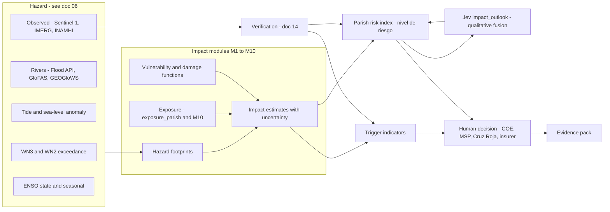
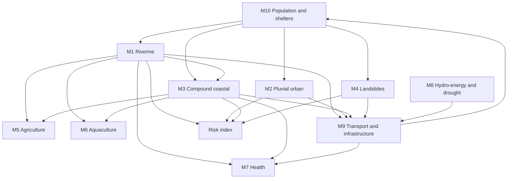
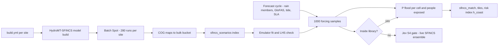
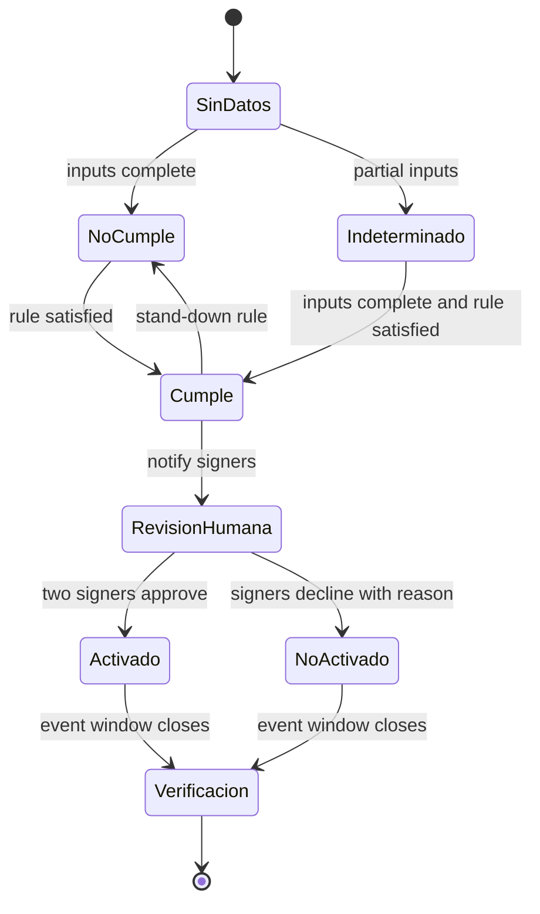
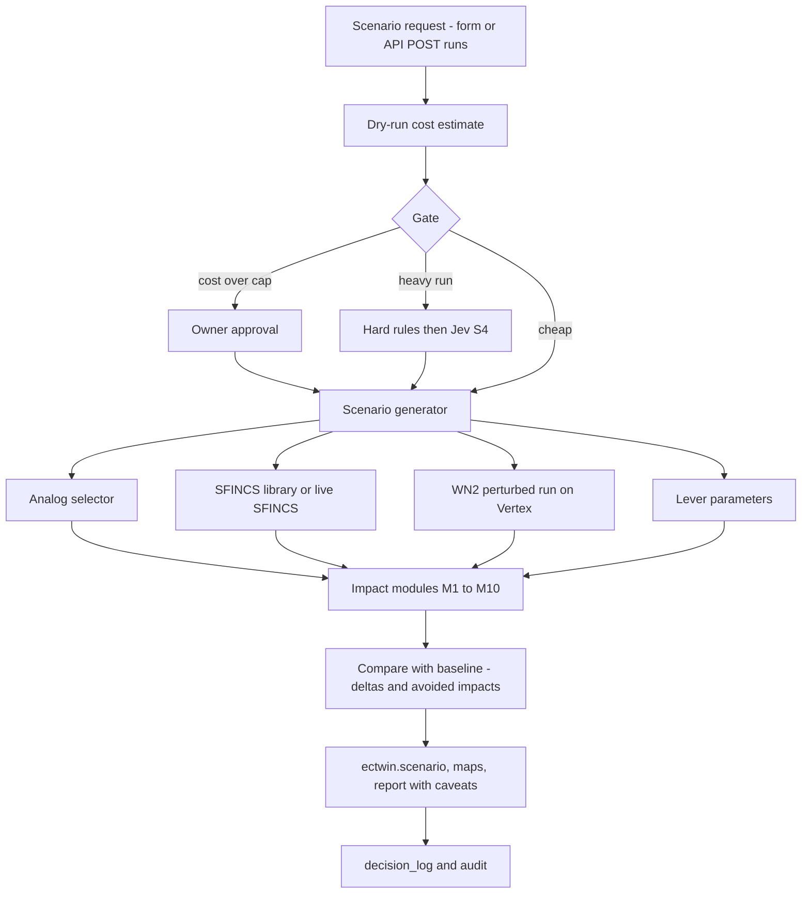
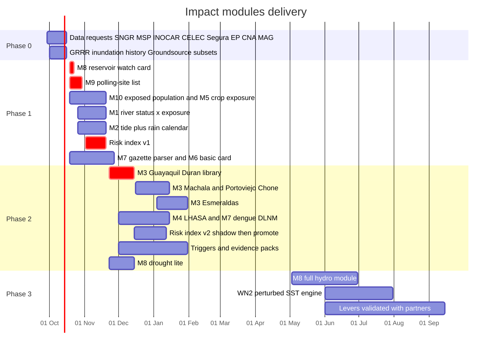

# Impact modules, scenarios and anticipatory triggers

This document specifies how *Gemelo Digital Ecuador – El Niño* (GDE-Niño) turns hazard information into **impact information that people can act on**. It covers ten impact modules (M1–M10), the parish risk index (*nivel de riesgo*), the anticipatory-action trigger framework with evidence packs for contingent and parametric finance, and the what-if scenario engine. It uses the planes, bucket, table, topic and API names fixed in [03-architecture.md](./03-architecture.md) and adds only the tables listed in §2.5. Forecast inputs are specified in [06-forecast-model-stack.md](./06-forecast-model-stack.md), datasets and licences in [05-data-catalog.md](./05-data-catalog.md), the Jev decision layer in [08-ai-decision-layer-jev.md](./08-ai-decision-layer-jev.md), and skill scores in [14-verification-and-validation.md](./14-verification-and-validation.md). Every output described here is *apoyo a la decisión – pronóstico experimental*. None is an alert (D1): the twin never uses "alerta amarilla/naranja/roja" for its own products, and official SNGR, INAMHI, CN-ERFEN and INOCAR content is always shown verbatim above it.

## Contents

1. [Principles](#1-principles)
2. [Common impact framework](#2-common-impact-framework)
3. [Module overview](#3-module-overview)
4. [Module specifications M1–M10](#4-module-specifications)
5. [Parish risk index (*nivel de riesgo*)](#5-parish-risk-index-nivel-de-riesgo)
6. [Anticipatory action and trigger framework](#6-anticipatory-action-and-trigger-framework)
7. [What-if scenario engine](#7-what-if-scenario-engine)
8. [Outputs catalogue and phasing](#8-outputs-catalogue-and-phasing)
9. [Compute and cost summary](#9-compute-and-cost-summary)
10. [Release gates](#10-release-gates)
11. [Limitations](#11-limitations)
12. [Open questions](#12-open-questions)

**Owner codes.** PL, DL, FL, FE, AI, SRE, DPO and TA are as defined in the owner-roles table at the top of [03-architecture.md](./03-architecture.md). This document adds the roles below; staffing is in [12-roadmap-team-budget.md](./12-roadmap-team-budget.md).

| Code | Role |
|---|---|
| IM | Impact-modelling lead ("Impacts, scenarios, triggers" owner in [02 §5.1](./02-users-requirements-ux.md)) |
| HYD | Hydraulic modeller (SFINCS, LISFLOOD-FP), reports to IM |
| EPI | Health data scientist or epidemiologist (hire or MSP/university secondment **(to confirm)**) |
| AGR | Agro- and aquaculture-risk analyst |
| PT | Partnerships lead (SNGR, INAMHI, INOCAR, MSP, MAG, CELEC, CNA liaison) |

**Quality tags.** Facts carry a source link. **(unverified)** means the research briefs could not confirm the fact. **(to confirm)** means a partner must confirm it. "Estimate" means our own arithmetic, shown in the text. All thresholds in trigger examples are **placeholders** until a partner signs them.

---

## 1. Principles

| # | Principle | Consequence in this document |
|---|---|---|
| IP-01 | **Decision support, never alerts** (D1) | Outputs are *niveles de riesgo* 1–4, probabilities and exposure counts. Trigger status words are *cumple / no cumple / indeterminado / sin datos*. A trigger never activates anything on its own: a named human decides. |
| IP-02 | **Explicit chain: hazard → exposure → vulnerability → impact** | Each link is a separate, versioned table, so a user can see *why* a level was reached (FR-033). |
| IP-03 | **Two ENSO pathways** (D4) | Coastal modules (M1–M7, M9, M10) are driven by Niño 1+2/ICEN, coupling and sea level. M8 (hydro-energy and drought) is driven by Niño 3.4/RONI and basin rainfall, including the La Niña side. |
| IP-04 | **Compute once in Commons, run high resolution in the tenant** | National 1 km-to-parish layers are computed in `ectwin-commons-prod`. Street-level runs, private assets and custom triggers run in the tenant project at the tenant's cost (D8, AP-02). |
| IP-05 | **Libraries and emulators before live 2D runs** (D13) | The SFINCS scenario library (M3) is built once on Batch Spot. Operations interpolate it. Live runs happen only when a gate says the situation is outside the library. |
| IP-06 | **Rules layers where data are thin** | Where no calibrated process model exists (banana, cacao, shrimp, leptospirosis), modules use documented, tenant-editable rule tables (Firestore `rules/{ruleId}`, FR-052) instead of pretending to precision. |
| IP-07 | **Numbers in code, Jev for qualitative fusion** (D16) | Every numeric input is bucketised in code before a Jev call. Jev (`jev-1.13.0`) never sets a number, never publishes and never activates. |
| IP-08 | **Probabilities and analogs, not single values** (D3) | Modules publish p10/p50/p90 of impact quantities (people, cases, days-to-threshold, flooded area) or exceedance probabilities, never quantiles of raw WeatherNext variables ([13](./13-governance-legal-risk.md) N-4), and show the analog envelope (1982-83, 1997-98, 2015-16, 2017, 2023-24). |
| IP-09 | **Licence-aware outputs** (D15) | WeatherNext-derived impacts are Non-Retrievable Value-Added products ([terms](https://storage.googleapis.com/weathernext-public/terms-of-use.pdf)). NC inputs go only to `commons_pub_nc`. GPL models ship as separate source-built images. |
| IP-10 | **No module goes public without a validation report** (FR-034) | Release gates G0–G3 (§10). Misses and false alarms are published (CTX-16). |

---

## 2. Common impact framework

### 2.1 The impact chain



### 2.2 Units, keys and horizons

- **Spatial units.** INEC DPA parish (6 digits) is the reporting unit for every national product. H3 resolution 7 is used for national grids and resolution 9 for urban grids (D14). River products are keyed on HydroBASINS `hybas_` outlet ids and GEOGloWS `river_id`. Tenant products are keyed on `aoi_id` (tenant table `ectwin.aoi`).
- **Horizons.** Products are computed per `lead_day` (1–15, 12Z-to-12Z windows as in [03 §4.2](./03-architecture.md)) and summarised into three bands: `d1_3`, `d4_7`, `d8_15`. Sub-seasonal and seasonal products use `target_start`/`target_end`. Observed-impact products use `event_date`.
- **Times.** All timestamps are UTC. Display is America/Guayaquil (Galápagos UTC−6).
- **Uncertainty.** Every impact row carries either `p10/p50/p90` columns or a `prob_*` column, plus `confidence` (`alta`/`media`/`baja`) computed as in §5.4.

### 2.3 Which hazard inputs feed which module

"x" marks a primary input and "o" a secondary one.

| Hazard input (table or asset) | M1 | M2 | M3 | M4 | M5 | M6 | M7 | M8 | M9 | M10 |
|---|---|---|---|---|---|---|---|---|---|---|
| `commons_pub.parish_exceedance` (WN3/WN2 rain probabilities) | o | x | x | x | x | x | o | o | x | x |
| `commons_pub.river_status`, `floodhub_status_snapshots` | x | o | x | | x | x | | o | x | x |
| `commons_pub.grrr_ecuador` return periods | x | | x | | | x | | | x | |
| Tide predictions + sea-level anomaly (`enso_indices` `SLA_GYE`) | | x | x | | | x | | | o | o |
| LHASA forcing (WN3 `imerg_tp_1hr_*`, SMAP L4) | | | | x | | | | | x | o |
| Sentinel-1 observed flood extent (EE) | x | o | x | | x | x | x | | x | x |
| `commons_pub.enso_indices`, `seasonal_canton` | o | | o | | x | x | x | x | | |
| Temperature and humidity (WN3 station head, ERA5-Land) | | | | | x | x | x | o | | |

### 2.4 Module manifest and maturity

Each module lives under `models/<module>/` in the monorepo ([03 §9.2](./03-architecture.md)) with a `module.yaml` manifest. The pipeline image is built by CI and pulled by digest. The manifest drives the layer registry (`commons_pub.layer_registry`), the STAC collection, the methodology page (FR-074) and the release gate.

```yaml
# models/compound_flood/module.yaml  (M3; schema: schemas/modules/module.schema.json)
id: M3
name_es: "Inundación costera compuesta"
owner: IM
co_owners: [HYD, FL]
pathway: coast                      # coast | hydro_energy
plane: {national: P2, custom: P3}
phase: {first_release: 2, ga_target: "2027-02-15"}
maturity: G1                        # G0 prototype | G1 experimental | G2 validated | G3 GA
cadence: {library: campaign, matching: "each forecast cycle", event_mode: hourly}
inputs:                             # licence_class per docs/05 section 5.1; outputs inherit the most restrictive (G-05)
  - {id: "COPERNICUS/DEM/GLO30_2024_1", licence: "Copernicus GLO-30", licence_class: "pending_review"}
  - {id: "projects/sat-io/open-datasets/DELTARES/deltadtm_v1-1", licence: "CC-BY-4.0", licence_class: "open"}
  - {id: "projects/sat-io/open-datasets/GMW/annual-extent/GMW_MNG_2020", licence: "CC-BY-SA-4.0", licence_class: "sa"}
  - {id: "gs://flood-forecasting/hydrologic_predictions/model_id_8583a5c2_v0/return_periods.zarr", licence: "CC-BY-4.0", licence_class: "open"}
  - {id: "commons_pub.parish_exceedance", licence_class: "wn_nrva"}
models:
  - {name: SFINCS, version: "v2.4.0", repo: "https://github.com/Deltares/SFINCS", licence: "GPL-3.0", image: "ectwin/sfincs"}
  - {name: hydromt_sfincs, version: "1.2.2", licence: "GPL-3.0"}
outputs: [commons_pub.sfincs_scenarios, commons_pub.sfincs_match]
validation:
  datasets: ["Sentinel-1 EMSR870 (Mar 2026)", "INOCAR tidal-flood events 13-16 Aug 2026", "Segura EP Zonas_Inundables"]
  metrics: {emulator_csi_min: 0.80, emulator_depth_mae_max_m: 0.10}
cost_budget_usd: {one_off: 500, monthly: 5}
disclaimer_key: experimental_decision_support
```

### 2.5 Tables introduced by this document

These are additions to the Commons and tenant schemas in [03 §5.3–5.4](./03-architecture.md). Their DDL goes under `schemas/bigquery/{commons,tenant}/`. All Commons tables are in `US`, partitioned where time-varying, with `require_partition_filter = TRUE`, and carry `method_version`, `licence_class` and `attribution`.

| Table | Plane | Grain | Module |
|---|---|---|---|
| `commons_pub.river_impact_reach` | P2 | reach × init × lead_day × RP class | M1 |
| `commons_pub.compound_tide_calendar` | P2 | site or point × hour | M2 |
| `commons_pub.sfincs_scenarios` (listed in 03, DDL here) | P2 | site × scenario | M3 |
| `commons_pub.sfincs_match` | P2 | site × init × quantile | M3 |
| `commons_pub.landslide_hazard_parish` | P2 | parish × date × lead_day × forcing quantile | M4 |
| `commons_pub.agri_impact_parish`, `commons_pub.crop_disease_index` | P2 | parish × crop × date | M5 |
| `commons_pub.aquaculture_cluster_risk`, `commons_pub.marine_heat_index` | P2 | cluster or zone × date | M6 |
| `commons_pub.health_risk_weekly` | P2 | province or canton × epi-week × lead | M7 |
| `commons_pub.reservoir_watch`, `commons_pub.drought_indices` | P2 | reservoir × day; canton or basin × month | M8 |
| `commons_pub.road_segment_risk`, `commons_pub.isolation_parish`, `commons_pub.facility_exposure` | P2 | segment, parish, facility × init | M9 |
| `commons_pub.population_exposure`, `commons_pub.shelter_gap_canton` | P2 | parish or canton × hazard × init | M10 |
| `commons_pub.risk_index_parish` | P2 | parish × init × horizon band | §5 |
| `commons_pub.trigger_indicators` | P2 | indicator × unit × issue time | §6 |
| `commons_internal.risk_index_params` | P2 | version | §5 |
| `ectwin.impact_aoi` | P3 | aoi × module × init | all |
| `ectwin.trigger_definition`, `ectwin.trigger_eval` | P3 | trigger version; trigger × evaluation time | §6 |
| `ectwin.scenario` | P3 | scenario run | §7 |

Internal (non-published) helper tables used by the SQL in this document: `commons_internal.reach_exceedance`, `commons_internal.reach_rp_exposure` (M1), `commons_internal.osm_roads_ecu` (M9), `commons_internal.hazard_components`, `commons_internal.parish_ev_scores`, `commons_internal.jev_parish_escalation` (§5). The tenant table `ectwin.observed_events` holds event records materialised from SITREPs, COE2 captures, Sentinel-1 and FR-075 reports for trigger backtests (§6.5).

`ectwin.evidence_packs` already exists in [03 §5.4](./03-architecture.md); its manifest format is fixed in §6.6. `commons_pub.trigger_indicators` also carries indicators that `parish_exceedance` does not hold, such as the 10-day accumulation `tp_240h` against its local P95 (TR-03), computed from WN2 members in the same forecast-cycle step.

### 2.6 Licence class of impact outputs

Every output row carries `licence_class` from the vocabulary of [05 §5.1](./05-data-catalog.md) (`open`, `sa`, `nc`, `wn_nrva`, `wn_historic_ccby`, `official_verbatim`, `agreement` (internal inputs only), `pending_review` (gated as `nc`; `commons_pub_nc` only after G-12) and the broker-side `wn_retrievable` (real-time or retrievable WeatherNext data, never published; `wn_internal` in [06](./06-forecast-model-stack.md), refined in [13](./13-governance-legal-risk.md))). The build job computes it from the input classes recorded in `commons_pub.layer_registry`: a derived layer **inherits the most restrictive input class** unless legal records an exception (rule G-05 in [05](./05-data-catalog.md)). Consequences for this document (D15):

- Inputs that are still `pending_review` in [05 §5.1](./05-data-catalog.md) are gated as `nc` until cleared. For impact modules these are GloFAS (`glofas_*`), the Flood Forecasting API (`floodhub_api`), Copernicus DEM GLO-30, JRC Global Surface Water, MSP gazettes (`msp_gacetas_*`), MAG layers (`mag_*`), CELEC/CENACE operational data (`energy_system_ops`) and the IOC/UHSLC tide-gauge series (`ioc_uhslc_sealevel`) behind `SLA_GYE`. Until they clear, products that use them (M1 river impacts, M2 and M3 through the gauge-based sea-level anomaly, the M3 library, M5, M6 cluster cards, M7, the M8 card) are published only through `commons_pub_nc`, and only after the interim check of rule G-12 in [05](./05-data-catalog.md). Commercial tenants see versions built without the uncleared inputs where one exists (for example the IMP-01 risk index with the uncleared river components shown as *sin datos*).
- `nc` inputs (GEOGloWS return periods, FABDEM, Global Flood Database) never reach `commons_pub`.
- `sa` inputs (GMW mangroves, HAND, OSM, Healthsites) make the derived map share-alike; exported files carry the share-alike notice.
- `agreement` inputs (INOCAR tide tables, SIGACUA farm polygons, MIT road data) are used only as the MoU allows; derived products are published only if the agreement says so.

The "Licence class" column in §8 gives the **target** class once pending reviews and agreements are settled.

---

## 3. Module overview

Costs are estimates for Commons (monthly, list price before free tiers) or per tenant run, using the unit prices in [09-cost-model.md](./09-cost-model.md) and the arithmetic in each module section.

| ID | Module | Pathway | Main method | Plane | Cadence | First release | Commons cost | Tenant cost | Owner |
|---|---|---|---|---|---|---|---|---|---|
| M1 | Riverine flood | Coast (+Amazon rivers) | Flood API, GloFAS, GEOGloWS exceedance → RP footprints × exposure; LISFLOOD-FP in tenant | P2/P3 | 4×/day + daily GloFAS | P1 (status × exposure) | ≈US$1/month (≈US$2 peak) | LISFLOOD-FP <US$0.50/event | IM, FL |
| M2 | Pluvial/urban, tide-blocked drainage | Coast | Rules: hourly rain probability × tide + sea-level anomaly blocking; SFINCS pluvial slices | P2/P3 | Weekly calendar; hourly in event mode | P1 (calendar) | <US$1/month | ≈US$0 | IM |
| M3 | Coastal compound flooding | Coast | SFINCS scenario library (4 sites × 280 runs) + emulator | P2/P3 | Campaign; matching each cycle | P2 | US$60–360 one-off; ≈US$1–2/month | Live ensemble US$2–8 | IM, HYD |
| M4 | Landslides | Coast/Sierra slopes | LHASA 2.1.1 with WN3 forcing; SNGR/IIGE susceptibility; TRIGRS in tenant | P2/P3 | Daily | P2 | ≈US$4/month | TRIGRS <US$0.10/run | IM |
| M5 | Agriculture | Coast | Sentinel-1 flood duration × crop map × damage functions; disease-weather indices; AquaCrop-OSPy | P2/P3 | Per Sentinel-1 pass; per cycle; campaigns | P1 (exposure) | US$0–90/season (EE) | Cents per run | AGR |
| M6 | Aquaculture and fisheries | Coast/ocean | Farm-cluster rules; Sentinel-1 flooded ponds; marine heatwaves | P2/P3 | Per cycle; daily | P1 (basic card) | Shared with M5; ≈US$1/month | Cents | AGR |
| M7 | Health | Coast + Amazon | Dengue DLNM-INLA; leptospirosis exposure; malaria suitability; facilities | P2 | Weekly | P1 (gazette data) | <US$1/month | — | EPI |
| M8 | Hydropower and drought | Andes/Amazon | Reservoir watch; SPI/SPEI/VHI; LSTM inflow + reservoir balance | P2/P3 | Daily; monthly | P1 (card) | ≈US$1/month | LSTM training <US$5 | FL, IM |
| M9 | Transport and critical infrastructure | Both | Segment/bridge hazard; RA2CE isolation; facility exposure | P2/P3 | Per cycle | P1 (static exposure) | ≈US$1/month | Minutes | IM, DL |
| M10 | Population and shelters | Both | Dasymetric population; exposed people; shelter gap | P2 | Per cycle | P1 | <US$1/month | — | DL, IM |



---

## 4. Module specifications

### 4.1 M1 Riverine flood (*inundación fluvial*)

**Purpose and users.** Which river reaches will exceed flood thresholds in the next 1–30 days, and who and what sits in the floodplain behind them. Users: P01 (SNGR), P02 and P04 (COEs), P05 (INAMHI co-production), P09 (EAP stage 3), P10. Decisions: LT-11, LT-19, LT-20, LT-22 in [01 §9.2](./01-context-el-nino-ecuador.md).

**Chain.**

| Link | Content |
|---|---|
| Hazard | Probability that discharge exceeds RP2/RP5/RP10/RP20 per reach and lead day: GloFAS 51 members (days 1–30), GEOGloWS (INAMHI hydroviewer, days 1–15), Flood Forecasting API gauge `severity` and forecasts (days 0–7, if the Commons key is approved) |
| Footprint | Depth per RP class from `JRC/CEMS_GLOFAS/FloodHazard/v2_1` (RP10–RP500, 90 m), constrained by Google inundation history 1999–2020 (128 m, CC BY 4.0) and HAND `users/gena/global-hand/hand-100` (CC BY-SA). Flood API inundation polygons are used when served, which is rare ([OCHA observations](https://raw.githubusercontent.com/OCHA-DAP/ds-google-flood-hub/main/api/observations.json)) |
| Exposure | People, buildings, schools, health facilities, roads, crops and shrimp ponds in the footprint (M10, `exposure_parish`) |
| Vulnerability | Depth-damage curves by building class (Delft-FIAT defaults, to be localised); GHSL SMOD settlement class as an informal-housing proxy; shelter access (M10) |
| Impact | Exposed people and buildings per reach and parish by RP class with probability; damage band in US$ (tenant, Phase 2) |

**Inputs.**

| Input | Identifier | Licence | Note |
|---|---|---|---|
| GloFAS forecast | EWDS `cems-glofas-forecast`, `river_discharge_in_the_last_24_hours`, 51 members ([request body](https://github.com/OCHA-DAP/ds-aa-som-floods/blob/main/src/monitoring/etl.py)) | CEMS (`pending_review` in [05 §5.1](./05-data-catalog.md)) | Via `ingest-glofas` → `river_status` |
| GEOGloWS | `inamhi.geoglows.org` forecasts (GEOGloWS v2, 52 members to +15 days; CC BY 4.0); return periods (Gumbel fits, 2–100 years) `s3://geoglows-v2/retrospective/return-periods.zarr` | Forecasts CC BY 4.0; return periods **CC BY-NC-SA 4.0** | Return periods only in `commons_pub_nc` |
| Flood API | `floodStatus.searchLatestFloodStatusByArea`, `gauges.queryGaugeForecasts`, `gaugeModels.batchGet` ([discovery](https://raw.githubusercontent.com/OCHA-DAP/ds-google-flood-hub/main/api/discovery.json)) | CC BY 4.0; "primarily non-commercial" wording **(unverified)**; `pending_review` | `floodhub_status_snapshots` |
| GRRR return periods | `gs://flood-forecasting/hydrologic_predictions/model_id_8583a5c2_v0/return_periods.zarr` (RP 2–200) | CC BY 4.0 | Commercial-safe thresholds; `grrr_ecuador` |
| Hazard maps | `JRC/CEMS_GLOFAS/FloodHazard/v2_1` | JRC, no restriction | Static |
| Inundation history | `gs://flood-forecasting/inundation_history/data/` (12 tiles, 11.3 MB for Ecuador) | CC BY 4.0 | Prior |

**Method.**

1. **Reach registry.** Use the ≈1,840 mainland and 39 Galápagos HydroBASINS outlets in `grrr_ecuador`, matched to GEOGloWS `river_id` and Flood API gauges. Match by **upstream area, not nearest point**: in our decoding of the public GRRR data, the outlet nearest Esmeraldas town (`hybas_6120190490`, mean flow about 13 m³/s) is a small tributary, not the main stem.
2. **Exceedance.** Each cycle computes `P(Q ≥ RP_k)` per reach and lead from GloFAS members and GEOGloWS, and maps Flood API severities (`ABOVE_NORMAL` ≥ warning, `SEVERE` ≥ danger, `EXTREME` ≥ extreme danger; this correspondence between `severity` and the `warningLevel`/`dangerLevel`/`extremeDangerLevel` thresholds is our assumption, **to confirm** with an approved key, as is whether those thresholds equal the 2-, 5- and 20-year return periods) using thresholds keyed on `gauge_model_id`. `qualityVerified=false` gauges carry a 0.8 quality factor and the label *modelo no verificado*.
3. **No silent blending.** Sources are shown side by side. A consensus count (number of sources at or above RP2) feeds the confidence rating.
4. **Precomputed footprint × exposure.** For each (reach, RP class) the exposed counts are precomputed once per exposure snapshot in `commons_internal.reach_rp_exposure`, so each cycle is a cheap join.
5. **Backwater zones.** The EE catalog entry for `WRI/Aqueduct_Flood_Hazard_Maps/V2` advises against its use on flat lowland rivers with backwater effects ([catalog](https://github.com/google/earthengine-catalog)), and the same limitation applies to the 90 m GloFAS hazard maps in the lower Guayas. Reaches inside the M3 site polygons are flagged `zona_remanso` and defer to M3.
6. **Tenant high resolution (T3).** LISFLOOD-FP 8.x with FV1/DG2 CUDA solvers (official code on Zenodo, v8.2, doi:10.5281/zenodo.13121102; [GitHub mirror](https://github.com/Dewberry/lisflood-fp), GPL-2.0) on an L4 GPU for tenant AOIs, then Delft-FIAT ([repo](https://github.com/Deltares/Delft-FIAT), MIT) for damage. Runs are gated by hard rules first ("gauge above danger level ⇒ run") and then Jev S4 `run_hires_inundation` ([08](./08-ai-decision-layer-jev.md)), which can only make the gate stricter.
7. **Phase 3.** OpenHydroNet `mean_embedding_forecast_lstm` fine-tuned on Ecuadorian basins ([repo](https://github.com/google-research/flood-forecasting), Apache-2.0) is added as a further source; see [06](./06-forecast-model-stack.md).

```sql
-- M1: exposed people per reach and lead day, probability-weighted (Commons, each cycle)
-- licence_class follows docs/05 rule G-05 (most restrictive input). Rows whose class resolves to
-- 'nc' (GEOGloWS return periods; GloFAS / Flood API while 'pending_review') are written by the same
-- statement with the filter inverted into commons_pub_nc.river_impact_reach.
DECLARE init TIMESTAMP DEFAULT @init_time;
INSERT INTO `ectwin-commons-prod.commons_pub.river_impact_reach`
SELECT * FROM (
  SELECT init AS init_time, s.source, s.hybas_id, s.lead_day, e.rp_class,
         s.prob_exceed,                                 -- P(Q >= RP of that class)
         e.dpa_parish, e.population, e.buildings, e.schools, e.health_facilities, e.road_km,
         s.prob_exceed * e.population AS expected_people_exposed,
         e.zona_remanso, s.quality_factor,
         @method_version AS method_version,
         CASE WHEN 'nc' IN (s.source_licence_class, s.threshold_licence_class, e.licence_class) THEN 'nc'
              WHEN 'sa' IN (s.source_licence_class, s.threshold_licence_class, e.licence_class) THEN 'sa'
              ELSE 'open' END AS licence_class,         -- 'pending_review' is mapped to 'nc' upstream
         @attribution AS attribution, CURRENT_TIMESTAMP() AS created_at
  FROM `ectwin-commons-prod.commons_internal.reach_exceedance` AS s      -- built from river_status + floodhub snapshots
  JOIN `ectwin-commons-prod.commons_internal.reach_rp_exposure` AS e   -- e.licence_class = 'sa' if HAND shaped the footprint
    ON e.hybas_id = s.hybas_id AND e.rp_class = s.rp_class
  WHERE s.init_time = init AND s.source IN ('GLOFAS', 'FLOODHUB', 'GEOGLOWS_FC')
)
WHERE licence_class != 'nc';
```

**Outputs.** `commons_pub.river_impact_reach` (columns as in the SQL) and its `commons_pub_nc` twin for `nc` rows (§2.6); `h_river` in `risk_index_parish`; reach cards in the canton PDF; `ectwin.impact_aoi` rows for tenant AOIs.

**Run profile.**

| Item | Value |
|---|---|
| Cadence and plane | After each `ingest-floodhub-status` (4/day) and `ingest-glofas` (daily, 12 UTC); P2. LISFLOOD-FP and FIAT in P3 |
| Commons compute (estimate) | 1 vCPU × 5 min × 5 runs/day × 30 = 45,000 vCPU-s/month × US$0.000018 ≈ US$0.81 list (the Cloud Run jobs free tier of 240,000 vCPU-s/month per billing account is shared by all Commons jobs). One-off footprint × exposure build 20–40 EECU-h = US$8–16 commercial, US$0 noncommercial |
| Tenant compute | LISFLOOD-FP under US$0.50 per event on an L4 (Cloud Run L4 about US$0.67/h plus CPU, [pricing](https://cloud.google.com/run/pricing); estimate) |

**Validation.** The GRRR reforecast against Google's own reanalysis gives a baseline of how forcing error alone propagates (not skill against observations): at RP2, lead 1, POD/FAR is 0.89/0.12 at Daule (La Capilla), 0.59/0.39 at Portoviejo, 0.46/0.46 at Chone and 0.33/0.53 at Esmeraldas, degrading by lead 5 (own computation on the public GRRR buckets, pairing each station with the virtual gauge that has the largest 2-year flow within 8 km; method in [14](./14-verification-and-validation.md)). GEOGloWS median KGE in Ecuador is −0.57 raw and 0.33 after bias correction ([validation repo](https://github.com/jorgessanchez7/Global_Forecast_Validation)). Reference events: INAMHI stations that measure level or discharge (43 in the Visor catalogue; river-level telemetry arrives 9–24 days late, so scores are final only after that lag), Sentinel-1 extents, Copernicus EMS EMSR870 (March 2026), Groundsource (`projects/sat-io/open-datasets/groundsource_2026`, CC BY 4.0, about 82% precision, [doc](https://github.com/samapriya/awesome-gee-community-datasets/blob/master/docs/projects/groundsource.md)) and SNGR `EVENTOS_X_LLUVIAS`. **G2 acceptance (targets to agree with INAMHI, estimate):** canton-day hit rate ≥0.6 with FAR ≤0.5 for RP2 at leads 1–3 on the Jan–May 2026 season.

**Phase.** P1: river status × exposure card per reach by **2026-11-20** (IM, DL). P2: probabilistic footprints and Delft-FIAT damage for T3 tenants by 2027-01-15. P3: OpenHydroNet source.

### 4.2 M2 Pluvial and urban drainage, Guayaquil first (*inundación pluvial urbana*)

**Purpose and users.** For the next hours to 3 days: which zones, streets and underpasses are likely to flood from intense rain, and when high tide blocks gravity drainage into the Guayas and Daule. Users: P03 (Segura EP), P04, ECU 911, the water utility (Interagua/EMAPAG **(to confirm)**). Decisions: LT-21, LT-25, LT-26. Other cities (Machala–Puerto Bolívar, Esmeraldas, Manta) follow the same pattern (FR-031).

**Chain.**

| Link | Content |
|---|---|
| Hazard | Hourly-intensity and 24/72 h exceedance probabilities (`parish_exceedance` variables `tp_1h_max`, `tp_24h`, `tp_72h`); nowcast from IMERG Early, GSMaP NRT and Oya (`projects/global-precipitation-nowcast/assets/global_estimation`); INAMHI Guayaquil–Durán bulletin (about 25 gauges, `https://www.inamhi.gob.ec/guayaquil/registrodgy.pdf`); Flood API flash floods (24 h, urban tiles about 20 km × 20 km) |
| Blocking | Predicted tide from INOCAR quarterly tables (no published licence; `agreement` class in [05](./05-data-catalog.md)) `https://www.inocar.mil.ec/mareas/TM/{anio}/trimestral/GUAYAQUIL_RIO_{trimestre}.pdf` ([parser](https://github.com/Dass-19/Godzilla-EnsoStreamingPipeline/blob/master/backend/producers/producer_inocar_mareas.py)); observed sea level from the IOC service, codes `gyer` (Guayaquil, Río Guayas) and `puna` ([parser](https://github.com/Dass-19/Godzilla-EnsoStreamingPipeline/blob/master/backend/producers/producer_marea_observada.py)); La Libertad `lali` and CMEMS `zos` as cross-checks |
| Exposure | Segura EP layers on ArcGIS Online: `Zonas_Inundables/FeatureServer/28`, `Vías_Inundables/FeatureServer/5`, `Zonas_Seguras/FeatureServer/16`, `Puntos_vulnerables_por_marea_alta/FeatureServer/0` ([source](https://github.com/Dass-19/Godzilla-EnsoStreamingPipeline/blob/master/backend/producers/producer_seguraep.py)); Open Buildings v3; M10 population |
| Vulnerability | Outfalls blocked when river stage at the outfall exceeds its invert (inverts from the utility **(to confirm)**); pump availability; overlap with power rationing (M8) |
| Impact | Hourly *franja de riesgo compuesto* (level 1–4) per vulnerable point and zone; roads likely impassable; exposed people |

**Method.**

1. **Tide calendar.** Parse INOCAR predictions (the official source). Fill gaps with a pyTMD harmonic prediction ([pyTMD](https://pypi.org/project/pyTMD/), MIT) fitted to `gyer` observations.
2. **Sea-level anomaly without datum problems.** INOCAR tables, IOC gauges and CMEMS `zos` use different datums **(INOCAR chart datum to confirm)**. The anomaly is therefore computed at the gauge as the 30-day running mean of *observed − predicted*, and cross-checked against the CMEMS `zos` anomaly (`COPERNICUS/MARINE/GLOBAL_ANALYSISFORECAST_PHY_DAILY`, which keeps only a rolling two-year window in EE, so its anomaly baseline is 2022 onward and the derived series is archived) and La Libertad. The value is stored as `SLA_GYE` in `commons_pub.enso_indices`.
3. **Blocking threshold per point.** `H_block(z)` is the total water level above which a Segura EP tide-vulnerable point floods. It is calibrated on the 11 tidal-flood events of 13–16 Aug 2026 (7 in Guayas, 2 in El Oro, 1 in Esmeraldas, 1 in Manabí, [Primicias](https://www.primicias.ec/sociedad/fenomeno-elnino-ecuador-ascenso-nivel-mar-inundaciones-erosion-playas-calentamiento-oceano-invierno-131023/)) and on Segura EP incident logs **(to request)**.
4. **Compound level matrix.** For each point and hour, combine the rain probability class with the blocked flag.

```python
# pipelines/commons/impact_pluvial/strip.py  (M2) - hourly compound strip per vulnerable point
import pandas as pd

LEVEL = {  # (rain_class, blocked) -> nivel de riesgo 1..4 ; initial matrix, to co-design with Segura EP
    ("baja", False): 1, ("baja", True): 2,
    ("media", False): 2, ("media", True): 3,
    ("alta", False): 3, ("alta", True): 4,
}

def rain_class(p_ge_r1: float, p_ge_r2: float) -> str:
    """p_ge_r1: P(>= R1 mm in 3 h), p_ge_r2: P(>= R2 mm in 3 h); R1/R2 = INAMHI umbrales (to confirm)."""
    if p_ge_r2 >= 0.4 or p_ge_r1 >= 0.7:
        return "alta"
    if p_ge_r1 >= 0.3:
        return "media"
    return "baja"

def strip(points: pd.DataFrame, tide: pd.DataFrame, sla_m: float, rain: pd.DataFrame) -> pd.DataFrame:
    """points: point_id, h_block_m ; tide: hour_utc, predicted_m ; rain: hour_utc, point_id, p_ge_r1, p_ge_r2"""
    t = tide.assign(total_m=tide.predicted_m + sla_m)
    df = rain.merge(t, on="hour_utc").merge(points, on="point_id")
    df["blocked"] = df.total_m >= df.h_block_m
    df["rain_class"] = [rain_class(a, b) for a, b in zip(df.p_ge_r1, df.p_ge_r2)]
    df["risk_level"] = [LEVEL[(c, b)] for c, b in zip(df.rain_class, df.blocked)]
    return df[["point_id", "hour_utc", "predicted_m", "total_m", "blocked", "rain_class", "risk_level"]]
```

5. **Phase 2 maps.** The rain-only slices of the M3 Guayaquil–Durán library (rain × tide, discharge at RP2) give street-level depth for the matched scenario.

**Outputs.** `commons_pub.compound_tide_calendar` (site, point_id, hour, predicted tide, SLA, total level, blocked flag, rain probabilities, risk level). Tenant AOIs get `ectwin.impact_aoi` rows.

**Run profile.** The calendar is rebuilt weekly for the next 90 days (tides are predictable), and rain columns refresh each cycle. In event mode (FR-059) the strip refreshes hourly and the nowcast every 30 min (`ingest-imerg-gsmap`). Plane P2 for the four FR-031 cities, P3 for custom municipal points. Compute (estimate): 1 vCPU × 1 min × 24 × 30 = 43,200 vCPU-s/month × US$0.000018 ≈ US$0.78 list (before the shared Cloud Run jobs free tier).

**Validation.** Segura EP incident records **(to request)**, ECU 911 calls (CKAN monthly files to at least Feb 2025), citizen reports (FR-075), SNGR `EVENTOS_X_LLUVIAS`, and the February 2026 Guayaquil–Durán–Milagro floods. **G2 acceptance (estimate targets):** at least 70% of recorded tidal-flood events at Segura EP points in August 2026 fall in hours rated level ≥3, with at most 2 false level-≥3 days per month per point.

**Phase.** P1: compound tide + rain calendar (daily resolution) for Guayaquil, Machala, Esmeraldas and Manta by **2026-11-20** (LT-21 MVP). P2: hourly strip and SFINCS pluvial maps by 2027-01-15 (LT-25).

### 4.3 M3 Coastal compound flooding (SFINCS scenario library)

**Purpose and users.** Estuarine and coastal cities where river discharge, rain, astronomical tide and the El Niño sea-level anomaly act together. ERFEN reported a +40 cm coastal anomaly in August 2026, against +42 to +47 cm in 1997-98 ([Primicias](https://www.primicias.ec/sociedad/fenomeno-elnino-ecuador-ascenso-nivel-mar-inundaciones-erosion-playas-calentamiento-oceano-invierno-131023/)). The value could not be checked against La Libertad gauge data (IOC `lali`, UHSLC 091), so the CMEMS `zos` band is used as a gridded cross-check. Users: P01–P04, P09, P11, CNA. Decisions: LT-20, LT-21, LT-25, LT-06.

**Sites.** Sites are keyed by slug (bulk path `sfincs-library/<site>/`, model ID `EMU-SFINCS-<site>` in [14 §8.1](./14-verification-and-validation.md)).

| Site | Area | Rivers | Tide reference |
|---|---|---|---|
| `guayaquil-duran` | Guayaquil, Durán, Samborondón, lower Daule and Babahoyo | Daule, Babahoyo, Guayas | `gyer`, `puna` |
| `machala` | Machala, Puerto Bolívar, El Guabo | Jubones and estuary channels | Puerto Bolívar **(gauge to confirm)** |
| `portoviejo-chone` | Portoviejo; Chone to the Bahía de Caráquez estuary | Portoviejo, Chone | Manta/Bahía **(to confirm)** |
| `esmeraldas` | Esmeraldas city and river mouth | Esmeraldas, Teaone | Esmeraldas **(to confirm)** |

**Model build (per site).**

- **Engine.** SFINCS v2.4.0 "Galibier" (2026-06-15), GPL-3.0, CPU build from source ([repo](https://github.com/Deltares/SFINCS)). The Docker GPU version was removed ([developments.rst](https://github.com/Deltares/SFINCS/blob/main/docs/developments.rst)). Subgrid on; quadtree where the city is small relative to the domain. Curve Number infiltration requires `storecumprcp = 1` in v2.3.0–v2.4.0 (known bug).
- **Builder.** HydroMT-SFINCS 1.2.2 (GPL-3.0) on HydroMT core 1.4.1 (MIT) ([repo](https://github.com/Deltares/hydromt_sfincs)), following the global compound-flood framework of Eilander et al. 2023 (NHESS 23:823). The build YAML is versioned in `models/sfincs/sites/<site>/build.yml`.
- **Topography.** `COPERNICUS/DEM/GLO30_2024_1` (the older `COPERNICUS/DEM/GLO30` is deprecated), DeltaDTM `projects/sat-io/open-datasets/DELTARES/deltadtm_v1-1` (CC BY 4.0) for coastal lowlands, and municipal LiDAR where a GAD provides it **(to confirm)**. FABDEM is CC BY-NC-SA and is **not** used in the default library.
- **Bathymetry.** INOCAR nautical charts have no published licence and are reported to be sold **(unverified)** ([chart catalogue](https://www.inocar.mil.ec/cartografia/listado.php)); request under MoU **(to confirm)**. A global fallback bathymetry and its licence are **(to confirm)**.
- **Roughness.** `ESA/WorldCover/v200` classes mapped to Manning's n; mangroves from Global Mangrove Watch v4 (`projects/sat-io/open-datasets/GMW/annual-extent/GMW_MNG_2020`, CC BY-SA 4.0). Using GMW makes derived maps share-alike; the licence flag records it.
- **Boundaries.** Offshore water level = astronomical tide (pyTMD with a global tide model, **model licence to confirm**) + SLA. Upstream inflow = GRRR discharge for the chosen return period at the outlet matched by upstream area. Rain = spatially uniform 24 h design hyetograph (**INAMHI IDF curves to confirm**).

**Scenario design.** The core grid has 240 runs per site, matching the Batch job in [03 §7.6](./03-architecture.md), plus 40 Latin-hypercube runs for emulator validation.

```yaml
# models/sfincs/design/core_v1.yaml
version: core_v1
duration_h: 72
outputs: [zsmax, hmax, t_wet_gt_0p15m, vmax]
dimensions:
  tide:           [HW_p50, HW_p90, HW_p99_aguaje, HAT]   # high-water quantiles at the site reference gauge
  sla_cm:         [0, 15, 30, 45, 60]                     # 1997-98 peak +42..47 cm; Aug 2026 reported +40 cm
  discharge_rp:   [2, 5, 10, 25]                          # GRRR return periods at matched outlets
  rain_24h_mm:    [0, 75, 150]                            # to calibrate against INAMHI IDF
site_overrides:
  portoviejo-chone:
    upstream_submodel:                                    # inland Portoviejo: tide replaced by antecedent wetness
      replace: {tide: {antecedent: [dry, normal, wet, saturated]}}
validation_lhs: {n: 40, seed: 20261001}
# 4 x 5 x 4 x 3 = 240 core runs per site; 280 with LHS; 1,120 for four sites
```

**Emulator and probabilistic matching.**

- **Level A (Phase 2).** Multilinear interpolation of maximum depth per output cell over the 4-D grid. It is exact at grid nodes and costs milliseconds.
- **Probabilistic mode.** Each cycle draws 1,000 forcing samples: rain from the 64 WN2 members (WN3 members in Phase 2 after the cost spike, [03 ADR-29](./03-architecture.md)), discharge from GloFAS members at the matched outlets (each member's peak converted to a return period with GloFAS's own reanalysis thresholds, so that GloFAS and GRRR climatologies are not mixed on the `discharge_rp` axis), tide from the predicted high water in the window, and SLA from the gauge residual ± its 30-day standard deviation. The emulator gives `P(depth > 0.15 m)` per cell and the expected number of people flooded. This is a Non-Retrievable Value-Added product and can be published.
- **Out-of-library guard.** If any forcing lies outside the grid (for example SLA > 60 cm or Q > RP25), the product is flagged *fuera de biblioteca* and the Jev S4 gate decides whether a live 50-member SFINCS ensemble runs (Commons campaign for national sites, tenant T3 for private AOIs).

```python
# models/sfincs/emulator.py  (M3, level A)
import numpy as np, xarray as xr
from scipy.interpolate import RegularGridInterpolator

def load_emulator(site: str, lib: xr.Dataset) -> RegularGridInterpolator:
    """lib.hmax dims: (tide_m, sla_cm, discharge_rp, rain_24h_mm, cell), each axis strictly ascending.
    tide_m = site high-water level in metres for HW_p50 ... HAT. For portoviejo-chone the first axis is
    the antecedent-wetness class coded 0..3 instead of tide_m."""
    axes = [lib[d].values for d in ("tide_m", "sla_cm", "discharge_rp", "rain_24h_mm")]
    return RegularGridInterpolator(axes, lib.hmax.values, bounds_error=True)   # error = out of library

def p_flood(emu, samples: np.ndarray, thr_m: float = 0.15) -> np.ndarray:
    """samples: (n, 4) forcing vectors; returns P(depth > thr) per cell."""
    depths = emu(samples)                       # (n, cell)
    return (depths > thr_m).mean(axis=0)
```

**Outputs and storage.**

```sql
CREATE TABLE `ectwin-commons-prod.commons_pub.sfincs_scenarios` (
  site            STRING NOT NULL,     -- 'guayaquil-duran' | 'machala' | 'portoviejo-chone' | 'esmeraldas'
  scenario_id     STRING NOT NULL,     -- e.g. 'core_v1-t3-s30-q10-r150'
  design_version  STRING NOT NULL,     -- 'core_v1'
  tide_label      STRING, tide_m FLOAT64, sla_cm FLOAT64,
  discharge_rp    FLOAT64,             -- return period in years; non-integer for the LHS validation runs
  rain_24h_mm     FLOAT64,
  antecedent      STRING,
  flooded_km2     FLOAT64,             -- area with depth > 0.15 m
  people_exposed  FLOAT64,             -- from M10 grid
  buildings_exposed INT64,
  hmax_uri        STRING NOT NULL,     -- gs://ectwin-commons-prod-bulk/sfincs-library/<site>/<scenario_id>/hmax.tif
  tiles_uri       STRING,              -- tiles/static/sfincs-<site>/v<ver>/...
  model_version   STRING NOT NULL,     -- 'SFINCS v2.4.0 + hydromt_sfincs 1.2.2 + build <git sha>'
  licence_class   STRING NOT NULL,     -- G-05: 'sa' when GMW is used; 'nc' while Copernicus DEM is pending_review (section 2.6)
  attribution     STRING NOT NULL,
  created_at      TIMESTAMP NOT NULL
) CLUSTER BY site, design_version, scenario_id;   -- BigQuery cannot cluster on FLOAT64 columns
```

`commons_pub.sfincs_match` holds, per site and init, the scenario ids nearest to the p50 and p90 forcing, the probabilistic summary per parish and the out-of-library flag.



**Licensing.** Our `ectwin/sfincs` image is built from source and its Dockerfile and source are published with it (GPL-3.0). Deltares' prebuilt images are Freeware that forbids redistribution and are never used. Model outputs are data: we release them under CC BY 4.0, or CC BY-SA 4.0 when a share-alike input such as GMW is used **(legal review to confirm)**. Until the Copernicus DEM GLO-30 licence clears its `pending_review` status in [05 §5.1](./05-data-catalog.md), library maps built on it are published only through `commons_pub_nc` (§2.6).

**Run profile (estimate).** Library: 1,120 runs × 10–60 min on `c3d-highcpu-16` Spot at US$0.160896/h ([Spot pricing](https://cloud.google.com/spot-vms/pricing)) = 1,120 × (0.167–1.0 h) × 0.161 ≈ US$30–180; doubled for calibration reruns ≈ **US$60–360 one-off**, inside the US$50–500 one-off library estimate in [03 §7.6](./03-architecture.md). Storage: 1,120 maps × about 50 MB ≈ 56 GB × US$0.020/GiB-month (Standard, `us-central1`) ≈ US$1.1/month. Matching: seconds per cycle. A live 50-member tenant ensemble costs about US$2–8 (50 × US$0.03–0.16 per member).

**Validation.** Aug 2026 tidal-flood events; Segura EP `Zonas_Inundables`; Sentinel-1 flood maps including EMSR870 (March 2026); Google inundation history; GRRR 1998 peaks as an upper-bound sanity check (Daule record 1,989.5 m³/s on 1998-04-02 against RP100 of 2,526). A "what if 1998 happened again" run is a scenario, not verification. **Emulator acceptance (estimate targets):** on the 40 held-out runs, CSI of the 0.15 m extent ≥ 0.80 and depth MAE ≤ 0.10 m in built-up cells.

**Phase.** Phase 0: DEM, bathymetry, LiDAR and IDF requests (PT, by 2026-10-16). `guayaquil-duran` library G1 by **2026-12-15**; `machala` and `portoviejo-chone` by **2027-01-15**; `esmeraldas` by **2027-01-31**; probabilistic mode G2 by **2027-02-15** (IM, HYD). Phase 3: wave setup with SnapWave driven by `COPERNICUS/MARINE/WAV/ANFC_0_083DEG_PT3H`, Delft3D FM propagation of SLA into the Gulf of Guayaquil, and salinity intrusion.

### 4.4 M4 Landslides (*movimientos en masa*)

**Purpose and users.** Rainfall-triggered landslides on the western Andean slopes, the coastal cordillera and road corridors. SNGR counts 1,243 km of state roads highly exposed to landslides and MAG counts 606,584 ha of landslide-exposed crops ([El Diario](https://www.eldiario.ec/ecuador/carreteras-de-ecuador-3113-km-riesgo-inundaciones-deslizamientos-22092026), [El Universo](https://www.eluniverso.com/noticias/economia/plan-contingencia-ecuador-fenomeno-el-nino-ministerio-de-agricultura-nota/)). Users: MIT, prefectures, P01, P02, ECU 911. Decisions: LT-12, LT-27.

**Chain.**

| Link | Content |
|---|---|
| Hazard | LHASA 2.1.1 daily probability at about 1 km ([repo](https://github.com/nasa/LHASA)), driven by user-supplied rain and soil moisture, a feature added in 2.1.1 ([CHANGELOG](https://raw.githubusercontent.com/nasa/LHASA/master/CHANGELOG.md)): WN3 `imerg_tp_1hr_p50` and `imerg_tp_1hr_p90` accumulations plus SMAP L4 `NASA/SMAP/SPL4SMGP/008`. Also antecedent 3-day and 30-day rain percentiles (CHIRPS v3, IMERG) |
| Susceptibility | SNGR susceptibility maps (the SNGR library holds hazard maps as PDFs or images; vector versions **to request**) IIGE maps (existence and format **unverified**); MAG `agroestadistica/riesgos_agroclimaticos` layers. Phase 3: gradient-boosting susceptibility on `GOOGLE/SATELLITE_EMBEDDING/V1/ANNUAL`, `COPERNICUS/DEM/GLO30_2024_1`, the NASA Global Landslide Catalog and SNGR events |
| Exposure | Roads (GRIP4 CC BY 4.0, OSM ODbL, MS Roads ODbL, SNGR exposed-road inventory **to request**), population (M10), crops |
| Vulnerability | Road criticality and single-access parishes (M9); building density on steep slopes |
| Impact | Segments likely blocked; parishes at risk of isolation; people in high-hazard cells |

**Method.** Run LHASA in Commons once a day for each of two forcings (WN3 p50 and p90), which gives a *rango probable*. NASA's own feed is "best effort", so we run the model ourselves. The released code cannot retrain the model, so we calibrate only the class thresholds against Ecuadorian events. Tenants (MIT, prefectures, mines) can run TRIGRS ([repo](https://github.com/usgs/landslides-trigrs), archived on GitHub with development moved to code.usgs.gov; **licence to confirm**) at 10–30 m on their corridors, including SNGR's five priority corridors.

**Outputs.** `commons_pub.landslide_hazard_parish`: `date`, `lead_day`, `forcing_quantile` (`p50`/`p90`), `dpa_parish`, `lhasa_p_mean`, `lhasa_p_max`, `hazard_class`, `road_km_high`, `people_high`; a daily COG in `tiles/forecast/landslide/<init>/`. It feeds `h_landslide` in §5.

**Run profile (estimate).** Plane P2 (national layer); TRIGRS in P3. Daily after the 00Z WN3 cycle; Cloud Run 4 vCPU/16 GiB (4 × US$0.000018 + 16 × US$0.000002 per second ≈ US$0.37/h) × 2 runs × 10 min × 30 days = 10 h ≈ US$3.7/month list. Earthdata credentials sit in Commons Secret Manager. TRIGRS in tenant: under US$0.10 per run.

**Validation.** NASA Global Landslide Catalog `projects/sat-io/open-datasets/events/global_landslide_1970-2019` (custom licence), SNGR COE2 and `EVENTOS_X_LLUVIAS` events for 2025–26 and SITREPs. Metrics: ROC AUC of daily probability against canton-day events, and POD/FAR at the chosen class threshold with ±1 day tolerance. Historical context: Chunchi, April 1983 (about 100 deaths) and Alausí, 26 March 2023 (about 65 deaths, **unverified**). **G2 acceptance (estimate):** ROC AUC ≥0.70 on the Jan–May 2026 season.

**Phase.** P2: G1 by **2027-01-15** (IM). P3: TRIGRS corridor template and ML susceptibility.

### 4.5 M5 Agriculture (banana, cacao, rice, maize)

**Purpose and users.** Flooded and waterlogged hectares by crop and stage, disease-weather risk, sowing advice and evidence for insurance. MAG reports 494,274 ha flood-exposed (Guayas 268,761; Los Ríos 121,289; El Oro 43,858; Manabí 32,006; Esmeraldas 26,776), with up to 2 M ha at risk in a severe scenario ([El Universo](https://www.eluniverso.com/noticias/economia/plan-contingencia-ecuador-fenomeno-el-nino-ministerio-de-agricultura-nota/)). In 1997-98, 843,873 ha of crops were damaged ([01 §4](./01-context-el-nino-ecuador.md)). Users: P06 (MAG/AgroProtege), P10, P11, FAO. Decisions: LT-04, LT-06, LT-15, LT-30.

**Chain.**

| Link | Content |
|---|---|
| Hazard | Observed flood extent and duration from Sentinel-1 (`COPERNICUS/S1_GRD` change detection in EE) and the GOES-19 ABI daily flood product for days between Sentinel-1 passes (`gs://gcp-public-data-goes-19/ABI-Flood-Day-TIF/…`, about 1 km; covers mainland Ecuador, not the southern Galápagos); forecast footprints (M1, M3); waterlogging from SMAP L4 root-zone percentiles and rain surplus; disease weather from WN3 2 m temperature and dewpoint (0.05° station head) and rain |
| Exposure | MapBiomas Ecuador land use `projects/mapbiomas-public/assets/ecuador/lulc/v1` (CC BY 4.0; banana among its classes); MAG SIPA WFS agro-ecological zoning and `riesgos_agroclimaticos` (HTTP only); MAG 1:25k flood susceptibility 2024 ([ROADMAP](https://github.com/DweskZ/EcuDataMCP/blob/main/docs/ROADMAP.md), vector **to request**); ESPAC area by province (geoblocked, via relay); insured parcels (tenant-only) |
| Vulnerability | Crop calendar and stage; damage step functions ([01 §7.2](./01-context-el-nino-ecuador.md)), all **(unverified)** until MAG confirms |
| Impact | Flooded hectares by crop and stage; loss-fraction band; production (t) and value (US$) using SIPA producer prices (`precios-productor-ponderado.xlsx`) |

**Method.**

1. **Flood-duration mapping.** Per Sentinel-1 pass, classify water against a dry-season reference and mask permanent water with `JRC/GSW1_4/GlobalSurfaceWater`. Submergence-days per 30 m pixel are computed from consecutive wet observations. Sentinel-1 is radar and sees through cloud, but revisits every 6 days at best, so the days between passes are filled from the coarser GOES-19 daily product and flagged as interpolated.
2. **Damage rules** (tenant-editable, FR-052; defaults from [01 §7.2](./01-context-el-nino-ecuador.md), unverified):

```python
# models/agri/damage.py  (M5) - loss fraction band from submergence days and stage
RULES = {   # crop: [(min_days, loss_low, loss_high), ...] ascending; source 01 section 7.2 (unverified, MAG to confirm)
    "arroz":  [(0, 0.0, 0.0), (3, 0.1, 0.3), (7, 0.4, 0.6), (10, 0.8, 1.0)],
    "maiz":   [(0, 0.0, 0.0), (3, 0.3, 0.5), (7, 0.7, 1.0)],
    "banano": [(0, 0.0, 0.0), (2, 0.5, 0.8), (3, 0.8, 1.0)],
    "cacao":  [(0, 0.0, 0.0), (7, 0.2, 0.35), (10, 0.35, 0.5)],
}
SENSITIVE_STAGE = {"arroz": {"floracion": 1.0, "vegetativo": 0.8, "cosecha": 1.0}}  # multipliers, placeholders

def loss_band(crop: str, days: float, stage: str | None = None) -> tuple[float, float]:
    low = high = 0.0
    for d, lo, hi in RULES[crop]:
        if days >= d:
            low, high = lo, hi
    m = SENSITIVE_STAGE.get(crop, {}).get(stage, 1.0)
    return min(low * m, 1.0), min(high * m, 1.0)
```

3. **Waterlogging (no open water).** Banana tolerates only about 24–48 h of waterlogging and maize suffers above 3 days (both **unverified**, [01 §7.2](./01-context-el-nino-ecuador.md)), often without water visible to radar. A parish × crop waterlogging flag counts consecutive days on which SMAP L4 root-zone soil moisture (`NASA/SMAP/SPL4SMGP/008`, band `sm_rootzone_pctl` or a percentile of `sm_rootzone` against the 2015→ record) is above its 90th percentile **and** the 7-day rain surplus (CHIRPS v3 or IMERG observed; WN3 `imerg_tp_1hr_p50` accumulations for days 1–3) exceeds the crop-zone P75. The counts feed the same `loss_band` rules with the waterlogging days in place of submergence days. SMAP L4 is 9 km, so the flag is a parish-level probability, not a field map. Percentile cut-offs are placeholders to co-design with MAG.
4. **Disease-weather indices.** Black Sigatoka (banana) and pod rot or moniliasis (cacao) are favoured by long leaf wetness and humidity. The weekly index counts hours with relative humidity ≥ 90% (from 2 m temperature and dewpoint with the Magnus formula) or rain > 0.2 mm/h, within a temperature band. All thresholds are **(unverified)** and are co-designed with Acorbanec and MAG **(to confirm)**. Rice spikelet sterility above about 35 °C at anthesis (unverified) is a dry-season index.
5. **Sowing advice.** Rainy-season rice and maize are sown Dec–Feb, in the middle of the expected peak (unverified calendar). Phase 2 provides a rules-based sowing-window advisory per canton (seasonal terciles from `seasonal_canton` × flood-prone share × analog outcomes). Phase 3 adds AquaCrop-OSPy 3.1.0 ([repo](https://github.com/aquacropos/aquacrop), Apache-2.0) planting-date scenarios for rice and maize. AquaCrop-OSPy has **no salinity stress**, so Guayas rice exposed to saline intrusion is flagged, not modelled. DSSAT ([repo](https://github.com/DSSAT/dssat-csm-os), BSD-3) is the alternative for tenants.

**Outputs.** `commons_pub.agri_impact_parish` (`dpa_parish`, `crop`, `event_date` or `init_time`, `flooded_ha`, `submergence_days_p50`, `waterlogging_days`, `loss_low`, `loss_high`, `value_usd_low/high`, `source`; routed to `commons_pub_nc` while MAG layers are `pending_review`, §2.6); `commons_pub.crop_disease_index` (parish × week × crop × index value and class); `commons_pub.planting_scenarios_canton` (Phase 3).

**Run profile (estimate).** Plane P2 for national parish × crop products; P3 for insured-parcel indices and AquaCrop campaigns (tenant parcels never enter Commons). Sentinel-1 mapping in event mode: 75–225 EECU-h per season, shared with M6 (75–225 × US$0.40/EECU-h = US$30–90; US$0 on a noncommercial tier, [EE pricing](https://cloud.google.com/earth-engine/pricing)). Disease index: one BigQuery pass per cycle over 0.05° cells in banana and cacao parishes (MBs). AquaCrop campaign: 221 cantons × 2 crops × 12 sowing dates × 30 weather years = 159,120 simulations × about 0.5 s (unverified per-run time) ≈ 22 vCPU-h × US$0.0648/vCPU-h ≈ US$1.4 list.

**Validation.** ESPAC province anomalies for 1998 and 2024 (via relay), MAG SITREPs, AgroProtege claims (not public; request under MoU), field reports. **G2 acceptance (estimate):** flooded rice and maize area within ±30% of MAG-reported affected hectares at province level for the Jan–May 2026 season.

**Phase.** P1: parish × crop flood-prone hectares by **2026-11-20** (AGR). P2: sowing-window advisory by **2026-12-15**; flood duration and Sigatoka index by **2027-01-15**. P3: AquaCrop-OSPy scenarios.

### 4.6 M6 Aquaculture and fisheries

**Purpose and users.** Shrimp is exposed on a very large scale: 3,431 farms, of which 2,977 (86.8%) are flood-susceptible, and 100–110k of the sector's 230k ha at risk, concentrated in Guayas, El Oro, Manabí and Esmeraldas ([Primicias](https://www.primicias.ec/economia/camaroneras-ecuador-riesgos-inundaciones-fenomeno-elnino-133353/)). Fisheries and Galápagos ecosystems respond to ocean heat and productivity. Users: P10, CNA, insurers, IPIAP, CGREG. Decisions: LT-06, LT-14, LT-32.

**Chain (shrimp).**

| Link | Content |
|---|---|
| Hazard | 72 h and 7-day rain probabilities at farm clusters; adjacent reach RP (M1); compound water level for estuarine farms (M3); flooded ponds from Sentinel-1; salinity-drop proxy (discharge anomaly + local rain); water temperature against the *P. vannamei* band of about 26–32 °C (unverified) from OISST and CMEMS |
| Exposure | MapBiomas Ecuador aquaculture (class 31 in Collection 3, [repo](https://github.com/mapbiomas/ecuador-coverage); the public Collection 3 asset path is **to confirm**; the water product has class 5 = *Acuicultura*); GMW v4 mangroves (CC BY-SA); SIGACUA farm polygons via SNGR or CNA **(to confirm)**; tenant farm polygons (journey J5 in [02](./02-users-requirements-ux.md)) |
| Vulnerability | Levee height (tenant-supplied), distance to river and estuary, farm size |
| Impact | Flooded pond hectares × yield per ha × price (BCE export price index, MPCEIP FOB files) → value-at-risk band |

**Method.** The Phase 1 farm-cluster card uses the *Camaronera* rule template (FR-052): 72 h rain above the INAMHI threshold with probability ≥ 50%, adjacent reach ≥ RP2, and high tide + SLA above a set value (all placeholders). Phase 2 adds flooded-pond detection per Sentinel-1 pass and the M3 compound footprint for estuarine clusters. CNA's advice (daily water-quality monitoring, lower stocking density, early partial harvest) is shown as options, not instructions.

**Fisheries and marine heat (Phase 3).** Run `marineHeatWaves` ([repo](https://github.com/ecjoliver/marineHeatWaves), GPL-3.0, Hobday et al. 2016 definition) on `NOAA/CDR/OISST/V2_1` for the mainland EEZ and Galápagos. Add chlorophyll from `COPERNICUS/MARINE/SATELLITE_OCEAN_COLOR/V6` (from 1997, so it covers 1997-98) and oxygen and primary production from `COPERNICUS/MARINE/GLOBAL_ANALYSISFORECAST_BGC_001_028/BIO`. A small-pelagic stress index flags Niño 1+2 anomaly > +2 °C together with chlorophyll below its 25th percentile (unverified rule), to be fitted to IPIAP landings (PDF).

**Outputs.** `commons_pub.aquaculture_cluster_risk` (cluster or parish × init × lead: rain, river, compound and flooded-pond indicators; level); `commons_pub.marine_heat_index` (zone × day: MHW category, SST anomaly, chlorophyll percentile). Farm-level SIGACUA data stay out of Commons unless the data owner agrees **(to confirm)**.

**Run profile (estimate).** Plane P2 for clusters, ocean indices and public farm-cluster cards; P3 for tenant farm polygons (J5) and their levee data. Sentinel-1 shared with M5. Ocean indices about 3 EECU-h/month (3 × US$0.40 = US$1.20 commercial). MHW computation: minutes per day. The Copernicus BGC assets in Earth Engine keep only a two-year sliding window, so the derived ocean series are archived in Commons from day 1.

**Validation.** CNA monthly statistics (availability unverified), BCE shrimp export volumes, farm reports from pilot tenants, and the 1997-98 record. MHW against Charles Darwin Foundation observations for Galápagos. **G2 acceptance (estimate):** ≥70% of pilot-tenant-reported pond overtopping events fall on days rated level ≥3 for that cluster.

**Phase.** P1: basic cluster card by **2026-11-27** (AGR). P2: flooded ponds and compound by 2027-01-31. P3: fisheries and marine heat index.

### 4.7 M7 Health (dengue, leptospirosis, malaria, facilities)

**Purpose and users.** Health is core. About 15% of 1997-98 deaths were disease-related; leptospirosis reached 338 confirmed cases in 1998 against 36 in all of 1982–96; malaria rose 37% to 16,530 cases in 1997 ([01 §4](./01-context-el-nino-ecuador.md)). Dengue reached 61,329 cases and 74 deaths in 2024, and 32,576 cases and 35 deaths by epidemiological week 35 of 2026 (Manabí 9,278; Guayas 7,729; Los Ríos 3,865; Santo Domingo 2,269) ([Radio Pichincha](https://www.radiopichincha.com/miles-casos-dengue-muertes-ecuador/)). At least 460 health facilities are at risk. The 2024 epidemic also hit the Amazon (Napo 6,202 cases, against Manabí 10,450), so the dengue model is national, not coastal-only. Users: P08 (MSP), municipalities, PAHO **(to confirm)**. Decisions: LT-09, LT-17, LT-28.

**Data pipeline.**

1. **MSP gazette parser (Phase 1).** The *gacetas vectoriales* are PDFs listed through the open WordPress API (`https://www.salud.gob.ec/wp-json/wp/v2/posts`, slugs `gacetas-vectoriales-2017` … `-2026`; the 2026 page had 35 PDFs, e.g. `ETV_Gaceta_35.pdf`) ([RESEARCH.md](https://github.com/DweskZ/EcuDataMCP/blob/main/docs/RESEARCH.md)). The job runs in `southamerica-west1` with relay fallback, extracts province × week tables, and uses Jev PDF-table QA (D16) to flag rows whose totals do not reconcile. Filenames have changed often, so discovery relies on the `/wp-content/uploads/YYYY/MM/` path.
2. **Backfill.** Wes2024 CSV `dataset/dataset_dengue_2019_2025-final.csv` (8,016 rows, 24 provinces, weekly; code MIT, data compiled from MSP) ([repo](https://github.com/Wes2024/Predicting_dengue_outbreaks_in_Ecuador)); OpenDengue V1.3 (CC BY 4.0; national weekly 2013–2024, provincial weekly 2013–2020) ([repo](https://github.com/OpenDengue/master-repo)). A quality filter removes outliers such as the PAHO 1988 row (420,025 against 25 in Tycho).
3. **Covariates.** Minimum temperature and rain (ERA5-Land `ECMWF/ERA5_LAND/DAILY_AGGR`, CHIRPS v3, WN3 for weeks 1–2), Niño 1+2 anomaly from `enso_indices`, MAP land-surface temperature layers.

**Dengue model.** Negative-binomial DLNM coupled with a spatio-temporal Bayesian model in R-INLA, adapted from `drrachellowe/hydromet_dengue` ([repo](https://github.com/drrachellowe/hydromet_dengue), GPL-3.0; Lancet Planet Health 2021;5:e209). Unit: province-week first (data exist), canton-week once MSP canton data arrive under MoU. Covariate lags run from 0 to 12 weeks: the minimum viable model in the research uses minimum temperature and rain lagged 4–12 weeks, and the Machala studies report 1–2-month lags **(unverified)**. For a forecast at lead *L* weeks, lags shorter than *L* use WN3/WN2 covariates when *L* ≤ 2; for longer leads the model is refitted with lags *L*–12 only, so it runs on observed covariates. The output is the probability of exceeding the 75th percentile of the endemic channel (the INS Colombia method), plus p10/p50/p90 expected cases. Baselines for comparison: seasonal naive and endemic channel only, following the Mosqlimate evaluation protocol ([org](https://github.com/Mosqlimate-project)).

```r
# models/dengue/fit.R  (M7) - sketch adapted from the hydromet_dengue template (GPL-3.0)
library(INLA); library(dlnm); library(tsModel)
lag_tmin <- tsModel::Lag(df$tmin_c,  group = df$prov, k = 0:12)
lag_rain <- tsModel::Lag(df$rain_mm, group = df$prov, k = 0:12)
cb_tmin <- crossbasis(lag_tmin, argvar = list(fun = "ns", knots = equalknots(df$tmin_c, 2)),
                      arglag = list(fun = "ns", knots = logknots(12, 2)))
cb_rain <- crossbasis(lag_rain, argvar = list(fun = "ns", knots = equalknots(df$rain_mm, 2)),
                      arglag = list(fun = "ns", knots = logknots(12, 2)))
colnames(cb_tmin) <- paste0("tmin.", colnames(cb_tmin)); colnames(cb_rain) <- paste0("rain.", colnames(cb_rain))
f <- cases ~ 1 + f(week, model = "rw2", cyclic = TRUE, group = prov_idx,
                   control.group = list(model = "iid")) +
     f(prov_idx, model = "bym2", graph = g_prov) + cb_tmin + cb_rain + nino12_lag8
m <- inla(f, family = "nbinomial", offset = log(pop / 1e5), data = df,
          control.predictor = list(link = 1), control.compute = list(config = TRUE, waic = TRUE))
# posterior samples -> P(cases > endemic_p75) per province-week; write to commons_pub.health_risk_weekly
```

**Leptospirosis.** No incidence model until MSP data exist. A rule lists parishes where the population in an observed or forecast flood footprint (M1–M3, Sentinel-1) exceeds a threshold, with a 1–3-week watch window (LT-17).

**Malaria (Phase 3).** Rain and temperature suitability anomaly for Esmeraldas and the Amazon provinces; the Esmeraldas threshold is **(unverified)**.

**Facilities.** Healthsites (`projects/sat-io/open-datasets/health-site-node`, ODbL) plus the MSP facility list **(to request)**, overlaid on footprints; access loss from the MAP friction surface (`projects/malariaatlasproject/assets/accessibility/friction_surface/2019_v5_1`) with flooded road segments removed (M9).

**Data protection.** Only aggregated counts (province or canton × week) are used; there are no individual records. Health data is a special category (*datos sensibles*) under the LOPDP (article **to confirm** with the DPO; [13](./13-governance-legal-risk.md)), so counts below 5 are suppressed in published tables (estimate rule; DPO to confirm) and the DPO signs off the pipeline before Phase 2.

**Outputs.** `commons_pub.health_risk_weekly` (`unit_type`, `unit_id`, `epi_year`, `epi_week`, `lead_weeks`, `p_exceed_p75`, `cases_p10/p50/p90`, `endemic_p75`, `model_version`); `commons_pub.facility_exposure` (shared with M9). The `hydromet_dengue`-derived code is GPL-3.0 and ships as its own image (`ectwin/dengue`).

**Run profile (estimate).** Plane P2 only: health counts are never copied into tenant projects beyond the published aggregates. Weekly on Monday after the gazette parse; R-INLA on 4–8 vCPU for minutes, a few cents per run. Outputs stay in `commons_pub_nc` while the MSP gazettes are `pending_review` in [05 §5.1](./05-data-catalog.md).

**Validation.** Leave-one-season-out on 2019–2025, including 2023 and 2024. Metrics: CRPS against the seasonal-naive baseline, and hit rate and FAR of P75 exceedance at 4–8-week lead. **G2 acceptance (estimate, to agree with MSP):** CRPS at least 10% better than seasonal naive, and hit rate ≥0.6 with FAR ≤0.4 on 2024 province-weeks.

**Phase.** P1: gazette parser and province dashboard by **2026-11-27** (EPI, DL). P2: leptospirosis list by **2026-12-15**; DLNM model G1 by **2027-01-15**. P3: malaria, canton scale.

### 4.8 M8 Hydropower and drought (Paute–Mazar–Sopladora, Coca Codo Sinclair)

**Purpose and users.** The D4b pathway: drought in the Austro and Amazon basins that feed 76% of hydro generation, while the coast floods. Mazar fell from 2,153.32 masl (26 Jul) to 2,143.72 (9 Sep) and 2,134.2 (28 Sep 2026); the 2024 blackouts began at about 2,115 masl ([Primicias](https://www.primicias.ec/economia/paute-ecuador-hidroelectrica-cota-embalse-mazar-estiaje-nivel-envivo-132362/)). The ministry acknowledges a 1,000–1,200 MW gap and expects the drought to last from September 2026 to March 2027, and Colombian imports fell from an average of 281.1 MW (1–6 Sep) to about 2 MW (9 Sep). The 2024 drought came after El Niño had ended, so the module treats Andean and Amazon hydro-drought as its own pathway, not only as an El Niño side effect. [01 §7.3](./01-context-el-nino-ecuador.md) estimates the threshold could be reached between early November and late December 2026. Plant specifications (Mazar 170 MW, Molino 1,100 MW, Sopladora 487 MW, Coca Codo Sinclair 1,500 MW run-of-river) are **(unverified)**. Users: P07 (CELEC/CENACE), energy ministry, water utilities, Andean GADs. Decisions: LT-05, LT-13.

**Chain.**

| Link | Content |
|---|---|
| Hazard | Basin rainfall deficit (SPI-1/3/6, SPEI-3), vegetation stress (VHI), inflow forecasts (0–15 days WN3/WN2-forced; 1–6 months from GloFAS seasonal and C3S terciles) |
| Exposure | Reservoirs and plants: GDW `projects/sat-io/open-datasets/GDW/GDW_RESERVOIRS_V1_0` and the power-plant database `projects/sat-io/open-datasets/global_power_plant_DB_1-3` (both CC BY 4.0) |
| Vulnerability | Storage margin to the operating threshold; thermal and import capacity |
| Impact | Days to threshold (p10/p50/p90); P(level < threshold by date); Phase 3: energy deficit band (MWh) and rationing-risk probability |

**Data.** CELEC ORDS `repDiaHid12m` (daily level and inflow for Mazar, Amaluza, Minas San Francisco and Delsitanisagua from 2014-09-20) and `pointValuesMesH24` (Mazar inflow from 2010-02-10) ([hydro-look PLAN](https://github.com/rengarcia/hydro-look/blob/main/PLAN.md)); `pointValues?mrid=` ids (Mazar level `30031`, inflow `30538`) known only from third-party code ([aegis](https://github.com/tuxevil/aegis)) and to be verified with CELEC; CENACE SMEC daily balance; community mirror ([cotas-embalses-ecuador](https://github.com/jordanvt18/cotas-embalses-ecuador)). If ORDS fails, reservoir area from Sentinel-1/2 is converted to level with a DEM hypsometric curve.

**Method.**

1. **Reservoir watch card (Phase 1).** Days to threshold from the empirical distribution of recent daily level changes.

```python
# pipelines/commons/reservoir_watch/days_to_threshold.py  (M8, Phase 1)
import numpy as np, pandas as pd

def days_to_threshold(levels: pd.Series, threshold_masl: float = 2115.0,
                      window_days: int = 45, n: int = 5000, seed: int = 0) -> dict:
    """levels: daily Mazar level (masl), UTC-dated. Bootstraps 7-day blocks of observed daily changes."""
    rng = np.random.default_rng(seed)
    d = levels.diff().dropna().iloc[-window_days:].to_numpy()
    blocks = [d[i:i + 7] for i in range(0, len(d) - 6)]
    margin = levels.iloc[-1] - threshold_masl
    out = []
    for _ in range(n):
        lvl, day = 0.0, 0
        while lvl > -margin and day < 180:
            b = blocks[rng.integers(len(blocks))]
            for x in b:
                lvl += x; day += 1
                if lvl <= -margin:
                    break
        out.append(day if lvl <= -margin else np.nan)
    arr = np.array(out)
    return {"margin_m": round(float(margin), 2), "p_reach_180d": float(np.mean(~np.isnan(arr))),
            **{f"days_p{q}": float(np.nanpercentile(arr, q)) for q in (10, 50, 90)}}
```

2. **Drought indices (Phase 2 "lite", recommended).** SPI with `climate_indices` 2.4.0 (BSD-3), SPEI with `spei` 0.8.2 (MIT) or `xclim` 0.62.0 (Apache-2.0), on CHIRPS v3 and ERA5-Land PET. `CSIC/SPEI/2_11` ends at 2025-01-01, so it is computed in-house. VHI = VCI + TCI from `MODIS/061/MOD13Q1` and `MODIS/061/MOD11A2`. The inflow tercile outlook comes from GloFAS seasonal at the Paute and Coca outlets.
3. **Full module (Phase 3).** LSTM inflow models for Paute (Mazar inflow) and Coca with NeuralHydrology ([repo](https://github.com/neuralhydrology/neuralhydrology), BSD-3) or OpenHydroNet, trained on CELEC inflows with CHIRPS, ERA5-Land and IMERG forcings. They are driven 0–15 days by WN3/WN2 and 1–6 months by a weather generator conditioned on C3S terciles. A reservoir mass balance with rule-curve levers (§7.5) produces level trajectories, P(below threshold) and an energy-deficit band.

**Outputs.** `commons_pub.reservoir_watch` (`reservoir`, `date`, `level_masl`, `trend_m_per_day_7d`, `margin_m`, `days_p10/p50/p90`, `p_reach_180d`, `source`, `source_time`); `commons_pub.drought_indices` (canton or basin × month: SPI-1/3/6, SPEI-3, VHI, classes); `commons_pub.inflow_outlook` (Phase 3).

**Run profile (estimate).** Plane P2 for the public card, indices and baseline inflow models; P3 for CELEC/CENACE or private generators running their own inflow models and rule curves (T3 or path D). Daily ingest and card: seconds. Drought indices: about 26 EECU-h/year (26 × US$0.40 ≈ US$10/year commercial). LSTM training under US$5 on Spot; inference is effectively free.

**Validation.** 2024 drought: Paute basin mean flow 74.6 m³/s in 2024 against 163.6 m³/s in 2025, and Mazar inflow of 0.142 m³/s in November 2024 ([hydro-look](https://github.com/rengarcia/hydro-look/blob/main/PLAN.md)); CENACE rationing periods from 2023-10-16. **Acceptance (estimate):** the p10–p90 days-to-threshold band, back-tested on 2024 from 60 days before the crossing, contains the realised date in ≥ 80% of daily issues; LSTM NSE ≥ 0.6 on daily Mazar inflow for a 2024–25 holdout.

**Phase.** P1: reservoir watch card by **2026-10-23** (FL, DL), because the threshold window may open in early November. P2 "lite": SPI/SPEI/VHI and inflow terciles by 2026-12-15 (this brings part of the spine's Phase 3 module forward; see §12). P3: full module by 2027-06-30, ahead of a possible La Niña transition.

### 4.9 M9 Transport and critical infrastructure

**Purpose and users.** Road segments, bridges and critical sites that may be cut or flooded. SNGR counts 3,113 km of state roads highly exposed (1,870 km flood, 1,243 km landslide; Manabí 740, Guayas 594, Los Ríos 222 km flood-exposed) and 94 transport structures; the response plan has 8 Bailey bridges, 73 machines and 5 priority corridors ([El Diario](https://www.eldiario.ec/ecuador/carreteras-de-ecuador-3113-km-riesgo-inundaciones-deslizamientos-22092026)). Also at risk: 3,873 schools, at least 460 health facilities and 368 of 4,492 polling sites for the 29 Nov 2026 elections. Users: MIT, prefectures, P01, P02, CNE, MINEDUC, MSP, utilities. Decisions: LT-03, LT-10, LT-12, LT-24, LT-27, LT-28.

**Data.** OSM from BigQuery `bigquery-public-data.geo_openstreetmap.planet_features` (ODbL), GRIP4 `projects/sat-io/open-datasets/GRIP4/Central-South-America` (CC BY 4.0), MS Roads `projects/sat-io/open-datasets/MSRoads/SouthAmerica` (ODbL); the SNGR exposed-road inventory and MIT data **(to request; the MTOP geoportal is inactive and no open road-network download was found at the successor `mit.gob.ec`)**; ECU 911 road status (`ecu911.gob.ec/consulta-de-vias/`, link only); bridges from OSM `bridge=yes`; CNE polling sites **(to request)**; MINEDEC registers (coordinates **to confirm**); utility intakes **(to confirm)**.

**Method.**

1. **Materialise an Ecuador road subset once** (derived from `commons_internal.osm_ecuador_features` in [05](./05-data-catalog.md), or directly as below). A third-party team measured an unclustered nearest-building join against the global Overture tables at about US$2.25 per query ([cost note](https://github.com/thatapicompany/overture-maps-api/blob/main/etl/bigquery-cost-controls.md)); global OSM planet tables carry the same risk.

```sql
-- M9 one-off: Ecuador road and bridge subset (OSM schema field names to confirm)
CREATE TABLE `ectwin-commons-prod.commons_internal.osm_roads_ecu`
CLUSTER BY geometry AS
SELECT osm_id,
       (SELECT value FROM UNNEST(all_tags) WHERE key = 'highway') AS highway,
       (SELECT value FROM UNNEST(all_tags) WHERE key = 'bridge')  AS bridge,
       (SELECT value FROM UNNEST(all_tags) WHERE key = 'ref')     AS ref,
       geometry
FROM `bigquery-public-data.geo_openstreetmap.planet_features`
WHERE EXISTS (SELECT 1 FROM UNNEST(all_tags) WHERE key = 'highway')
  AND ST_INTERSECTS(geometry, (SELECT ST_UNION_AGG(geom) FROM `ectwin-commons-prod.commons_pub.dim_ecuador_clip`));
```

2. **Segment hazard.** Each segment takes the maximum hazard along it: M1 footprint class, M3 flood probability, M4 landslide class, and Segura EP `Vías_Inundables` in Guayaquil. A bridge is flagged when its reach has `P(Q ≥ RP10) ≥ 0.3` (placeholder).
3. **Isolation.** RA2CE ([repo](https://github.com/Deltares/ra2ce), GPL-3.0) computes origin–destination access from each parish centroid to its canton seat and nearest hospital, with high-hazard segments removed. Output: parishes cut off and detour factors.
4. **Facilities.** Point overlay of schools, health facilities, polling sites, shelters and intakes with M1–M4 footprints; travel-time change for health (M7).
5. **Narrative evidence.** Jev S2 typing of SNGR and ECU 911 narratives (`asset_bridge`, `asset_health`, `asset_water` nouls in [08](./08-ai-decision-layer-jev.md)) adds observed damage flags; thresholds 0.30/0.70 with human review in between.

**Outputs.** `commons_pub.road_segment_risk` (segment × init × lead: hazard class by source, ref, km); `commons_pub.isolation_parish` (parish × init: isolated flag, detour factor, people affected); `commons_pub.facility_exposure` (facility × init: type, hazard class, access change).

**Run profile (estimate).** Plane P2 for public roads, bridges and facilities; P3 for RA2CE runs on private assets (utilities, ports, exporters). One-off build ≤ US$10. Per cycle: Cloud Run minutes. RA2CE per event: minutes. Outputs built on OSM, MS Roads or Healthsites are `sa` (ODbL).

**Validation.** Daily archive of ECU 911 road status from Phase 1 (scraping method **to confirm**), MIT closure reports, SNGR COE2 events involving roads. **G2 acceptance (estimate):** ≥60% of reported closures on state roads during Jan–Apr 2027 fall on segments rated high at leads 1–3.

**Phase.** P1: polling-site exposure list by **2026-10-30** (CTX-09), school, health and road-segment static exposure by 2026-11-20 (IM, DL). P2: dynamic segment risk and RA2CE isolation by 2027-01-15.

### 4.10 M10 Population and shelters

**Purpose and users.** Who is in the footprint, how many may need shelter, and where capacity falls short. About 1.3 M people, including about 390,000 children, live in high-risk areas ([Infobae](https://www.infobae.com/america/america-latina/2026/09/04/el-fenomeno-de-el-nino-amenaza-la-educacion-y-seguridad-de-casi-390000-ninos-en-ecuador/)). Users: P01, P02, P04, Cruz Roja. Decisions: LT-16, LT-19, LT-20, LT-29.

**Data.** INEC Census 2022 block file `BDD_CPV2022_MANLOC_CSV.zip` (geoblocked; relay); WorldPop `WorldPop/GP/100m/pop` (to 2020) and R2025A (not in EE; HTTP path); GHSL `JRC/GHSL/P2023A/GHS_POP` and `JRC/GHSL/P2023A/GHS_SMOD_V2-0` (the unversioned `GHS_SMOD` asset is deprecated); Meta HRSL (Ecuador coverage **unverified**); Open Buildings v3 and 2.5D Temporal (2016–2023); shelters, warehouses and kits from the SNGR *Alístate Ecuador* visualizer (data from GADs; access **to confirm**) and Segura EP `Zonas_Seguras`.

**Method.**

1. **Dasymetric population grid.** Allocate Census 2022 sector or block totals to Open Buildings footprints by building area, then aggregate to H3 resolution 9 (urban) and 7 (national). WorldPop R2025A is the fallback where census geometry is missing.
2. **Exposed people.** `E[N_exposed] = Σ_cells P(hazard in cell) × pop_cell`, reported with p10/p90 from the hazard ensemble.
3. **Displacement and shelter demand (Phase 2).** Displaced = exposed × a displacement ratio calibrated on SITREP *damnificados*/*afectados* ratios; shelter demand = displaced × a shelter-seeking fraction (placeholder 0.2–0.4, to calibrate with SNGR). Gap = demand − capacity reachable within 30 minutes (MAP friction surface).

**Outputs.** `commons_pub.population_exposure` (parish × hazard source × init × horizon: people p10/p50/p90, children under five and people over 60 where HRSL or census age data allow); `commons_pub.shelter_gap_canton` (canton × init: demand, capacity, gap).

**Run profile (estimate).** Plane P2 (census-based grid and national tables); tenants join their own AOIs to the published grid. One-off grid build 5–20 EECU-h (US$2–8 commercial); per cycle a BigQuery join of MBs.

**Validation.** SITREP affected counts: for example, 113,000+ affected by 18 May 2026 (Guayas 57,150; Los Ríos 33,634; Esmeraldas 12,486; El Oro 9,092; Manabí 5,843) ([El Diario](https://www.eldiario.ec/ecuador/lluvias-dejan-mas-de-113-mil-afectados-y-17-fallecidos-en-ecuador-durante-2026-18052026/)). **G2 acceptance (estimate):** Spearman rank correlation ≥ 0.7 between predicted exposed and reported affected by province for that season.

**Phase.** P1: exposed population per parish by **2026-11-20** (DL). P2: shelter gap by **2026-12-15** (IM).

---

## 5. Parish risk index (*nivel de riesgo*)

The index answers FR-033: a single *nivel de riesgo* 1–4 per parish (and per tenant AOI) and horizon band, with a "¿Por qué este nivel?" explanation. It is computed in step 6 of the Commons forecast cycle ([03 §4.2](./03-architecture.md)).

### 5.1 Composition

For parish *p*, init *t* and horizon band *b* (`d1_3`, `d4_7`, `d8_15`), each hazard component is a probability-weighted score in [0, 1], taking the maximum over lead days in the band:

| Component | Definition (v2.0) | Weights (initial) |
|---|---|---|
| `h_rain` | max over INAMHI thresholds *k* of `w_k × P(tp_24h ≥ umbral_k)`; for coastal parishes also `tp_72h` | moderado 0.4, alto 0.7, extremo 1.0 **(INAMHI threshold ids to confirm)** |
| `h_river` | max over reaches in the parish (M1) of `w_k × P(Q ≥ RP_k) × q` | RP2 0.4, RP5 0.7, RP20 1.0; `q` = 0.8 for non-verified gauges |
| `h_coast` | M3 probability that ≥ 5% of the parish's built-up area floods deeper than 0.15 m | 1.0 |
| `h_landslide` | M4 class mapped to 0.2/0.5/0.8/1.0 × share of parish area in high susceptibility | as shown |

**Hazard** `H = max(h_rain, h_river, h_coast, h_landslide)`; the argmax is `dominant_hazard`. A max is used rather than a noisy-OR because it is easy to explain; the noisy-OR is tested in shadow mode (§12).

**Exposure** `E = 0.5 × pct(people in hazard-prone zone) + 0.3 × pct(critical sites in zone) + 0.2 × pct(crop and pond hectares in zone)`, where `pct` is the national percentile rank among parishes and the hazard-prone zone is the union of Google inundation history (≥ Low), the GloFAS RP100 extent, M3 library extents and high susceptibility classes.

**Vulnerability** `V = 0.4 × pct(poverty by unmet basic needs, Census 2022, availability to confirm) + 0.2 × pct(share of buildings in GHSL SMOD low-density or informal proxy classes) + 0.2 × pct(travel time to health care) + 0.2 × (1 − pct(Meta Relative Wealth Index))`. Sources: GHSL `JRC/GHSL/P2023A/GHS_SMOD_V2-0` (no MIDUVI informal-settlement layer was found), MAP `projects/malariaatlasproject/assets/accessibility/accessibility_to_healthcare/2019` (CC BY 4.0) and `projects/sat-io/open-datasets/facebook/relative_wealth_index` (CC0). All weights are initial (§12).

**Deterministic score** `R_det = H × (0.5 + 0.5 × (0.6 E + 0.4 V))`. Hazard dominates: with no hazard there is no risk, and a certain hazard in a low-exposure parish still scores 0.5.

**Jev fusion (v2.0).** The S3 parish-escalation call ([08 §4.5](./08-ai-decision-layer-jev.md), template `schemas/decisions/parish_escalation.json`) receives bucketised hazard and exposure text, up to 10 recent pseudonymised report summaries and the official text that mentions the parish. Its `impact_outlook` score has 5 ordered criteria (no meaningful impact … mass displacement or loss of life likely). `J = score / 4`. Then `R = 0.8 × R_det + 0.2 × J` **only if H ≥ 0.2**; otherwise `R = R_det`, so Jev cannot create risk where the hazard is negligible. `J` is NULL, and `R = R_det`, when the score confidence is below 0.50 (template policy) and for the `d4_7` and `d8_15` bands: S3 runs only for the default 72-hour horizon (`d1_3`) until per-horizon calls, about three times the cost, are approved.

**Level mapping** (initial): level 1 if `R < 0.20`; 2 if `0.20 ≤ R < 0.40`; 3 if `0.40 ≤ R < 0.60`; 4 if `R ≥ 0.60`. **Level 4 also requires `H ≥ 0.5`** and either `E ≥ 0.5` or the `F_OBS` flag.

### 5.2 Flags

Flags never change official information. Only `F_OBS` changes the level (a floor at level 3, which in `ri-2.0.0` requires observed impacts and is shown only to signed-in analysts as a note until that version is promoted, [08 §4.5](./08-ai-decision-layer-jev.md)); the other flags change the confidence rating, a label or a displayed component.

| Flag | Rule | Effect |
|---|---|---|
| `F_OBS` | Jev `reports_confirm` > 0.70 **and** ≥ 2 independent reports (deduplicated with the Jev `same_event` score); 0.30–0.70 goes to human review | Floor at level 3; label *impactos reportados* with the reports listed |
| `F_OFFICIAL` | Jev `advisory_covers` > 0.70, or the parish's DPA code is in the official alert row | **No numeric change.** The official band is shown above the level (D1) |
| `F_STALE` | Any hazard input older than its freshness target ([02 §6.2](./02-users-requirements-ux.md)) | Confidence *baja*; label *datos desactualizados* |
| `F_LOWSKILL` | Published CRPSS < 0.1 or BSS < 0 for that region and lead ([14](./14-verification-and-validation.md)) | Confidence *baja* |
| `F_COUPLING_LOW` | Coupling indicator *bajo* ([01 §11.2](./01-context-el-nino-ecuador.md)) | Shows the 2023-24 message from [02 §8.4](./02-users-requirements-ux.md) |
| `F_DIVERGE` | WN3, WN2 and IFS probabilities differ by more than 0.3 | Confidence *baja* (as in [14 §5.3](./14-verification-and-validation.md)) |
| `F_OUT_OF_LIBRARY` | M3 forcing outside the library | `h_coast` shown as *indeterminado*; Jev S4 gate invoked |

### 5.3 Computation and schema

```sql
CREATE TABLE `ectwin-commons-prod.commons_pub.risk_index_parish` (
  init_time         TIMESTAMP NOT NULL,
  horizon           STRING    NOT NULL,   -- 'd1_3' | 'd4_7' | 'd8_15'
  dpa_province      STRING NOT NULL, dpa_canton STRING NOT NULL, dpa_parish STRING NOT NULL,
  h_rain FLOAT64, h_river FLOAT64, h_coast FLOAT64, h_landslide FLOAT64,
  hazard_score      FLOAT64 NOT NULL,
  dominant_hazard   STRING,
  exposure_score    FLOAT64 NOT NULL,
  vulnerability_score FLOAT64 NOT NULL,
  r_det             FLOAT64 NOT NULL,
  jev_impact_outlook FLOAT64,            -- normalised score/(n-1); raw probabilities stay in commons_internal
  risk_score        FLOAT64 NOT NULL,
  risk_level        INT64   NOT NULL,     -- 1..4 'nivel de riesgo'; never an alert colour
  confidence        STRING  NOT NULL,     -- 'alta' | 'media' | 'baja'
  flags             ARRAY<STRING>,
  explanation       JSON    NOT NULL,     -- top factors for "Por que este nivel?"
  risk_index_version STRING NOT NULL,     -- e.g. 'ri-2.0.0'
  method_version    STRING  NOT NULL,     -- git tag + image digest
  licence_class     STRING  NOT NULL,     -- 'wn_nrva'
  attribution       STRING  NOT NULL,
  created_at        TIMESTAMP NOT NULL
)
PARTITION BY DATE(init_time)
CLUSTER BY dpa_province, dpa_parish, horizon
OPTIONS (require_partition_filter = TRUE);
```

```sql
-- risk index v2.0 core (parameters from commons_internal.risk_index_params for the active version)
DECLARE init TIMESTAMP DEFAULT @init_time;
WITH h AS (
  SELECT dpa_parish, horizon,
         MAX(IF(component = 'rain', score, NULL))      AS h_rain,
         MAX(IF(component = 'river', score, NULL))     AS h_river,
         MAX(IF(component = 'coast', score, NULL))     AS h_coast,
         MAX(IF(component = 'landslide', score, NULL)) AS h_landslide
  FROM `ectwin-commons-prod.commons_internal.hazard_components`
  WHERE init_time = init GROUP BY 1, 2
), s AS (
  SELECT h.*, GREATEST(IFNULL(h_rain,0), IFNULL(h_river,0), IFNULL(h_coast,0), IFNULL(h_landslide,0)) AS H,
         ev.exposure_score AS E, ev.vulnerability_score AS V, j.impact_outlook_norm AS J
  FROM h
  JOIN `ectwin-commons-prod.commons_internal.parish_ev_scores` AS ev USING (dpa_parish)
  LEFT JOIN `ectwin-commons-prod.commons_internal.jev_parish_escalation` AS j
    ON j.dpa_parish = h.dpa_parish AND j.init_time = init AND j.horizon = h.horizon
)
SELECT *, H * (0.5 + 0.5 * (0.6 * E + 0.4 * V)) AS r_det,
       IF(H >= 0.2 AND J IS NOT NULL, 0.8 * (H * (0.5 + 0.5 * (0.6 * E + 0.4 * V))) + 0.2 * J,
          H * (0.5 + 0.5 * (0.6 * E + 0.4 * V))) AS risk_score
FROM s;
-- level mapping, flags and the H >= 0.5 guard for level 4 are applied in libs/ectwin_core/risk_index/v2_0.py
```

**Explanation JSON** (rendered in Spanish by the front end):

```json
{"dominant_hazard": "rain", "factors": [
  {"key": "h_rain", "value": 0.62, "text_key": "lluvia_72h_alta", "evidence": {"threshold_id": "alto", "prob": 0.62, "lead_days": [2, 3]}},
  {"key": "exposure", "value": 0.71, "text_key": "poblacion_en_zona_inundable", "evidence": {"people": 14200, "schools": 3}},
  {"key": "F_OBS", "value": true, "text_key": "impactos_reportados", "evidence": {"reports": 3}}],
 "confidence": {"level": "media", "because": ["skill_moderate_lead3", "coupling_medio"]},
 "versions": {"risk_index": "ri-2.0.0", "model": "WN3", "init_time": "2026-12-14T00:00:00Z"}}
```

### 5.4 Confidence

`confidence` combines three inputs, as the UX guidelines require ([02 §8.4](./02-users-requirements-ux.md)): verification skill for the region, lead and product (CRPSS or BSS from `verification_scores`); ensemble agreement (share of members on the same side of the dominant threshold, or source consensus for rivers); and the coupling indicator. Rule: *alta* if all three are favourable; *baja* if any is unfavourable or `F_STALE`/`F_LOWSKILL`/`F_DIVERGE` is set; otherwise *media*. In `ri-2.0.0`, an S3 `evidence_sufficient` answer at or below 0.70 also lowers the confidence by one step ([08 §4.5](./08-ai-decision-layer-jev.md)). Before skill exists (no score, or fewer than 5 verified events), confidence is capped at *media* and shows "Confianza: sin verificar aún". The favourable/unfavourable cut-offs for each input are fixed in [14 §5.3](./14-verification-and-validation.md).

### 5.5 Versions, governance and rollout

| Version | Content | Rollout |
|---|---|---|
| `ri-1.0.0` | `H = h_rain` (WN3/WN2), plus `h_river` from `river_status` where available; E and V as above; no Jev | Production **2026-11-20**. Also written to `parish_exceedance.risk_level` as the rain-only level for each lead day |
| `ri-2.0.0` | Adds `h_coast`, `h_landslide`, Jev S3 fusion and flags | Shadow from **2026-12-15**; promoted **2027-01-12** after 4 weeks of shadow scoring and sign-off |
| `ri-2.x` | Weight recalibration on the 2026-27 season | Phase 3 |

Rules:

1. Parameters live in `commons_internal.risk_index_params` (version, weights, thresholds, JSON) and in the constants module `libs/ectwin_core/risk_index/v<major>_<minor>.py`. Every published row carries `risk_index_version` and `method_version`.
2. A change needs a changelog, a backtest on the Jan–May 2026 season and the 2023 coastal event, sign-off by IM, FL and the INAMHI/SNGR technical counterpart (PT), and a 7-day notice on the methodology page.
3. **Event-season freeze.** Between 2026-12-01 and 2027-04-30 only patch versions (bug fixes) and the planned `ri-2.0.0` promotion are allowed.
4. Jev raw probabilities are logged (D16) in `commons_internal.jev_parish_escalation`, with the pinned `jev-1.13.0`, so weights can be refitted without new calls.
5. Tenants can compute their own AOI index with the same code and their own weights; tenant versions are prefixed `ri-t-` and never appear in national products.

---

## 6. Anticipatory action and trigger framework

### 6.1 Principles

1. **Partner-owned triggers.** Following the OCHA framework (financing, pre-agreed activities and trigger, [pa-anticipatory-action](https://github.com/OCHA-DAP/pa-anticipatory-action)) and IFRC staged Early Action Protocols, each trigger belongs to the organisation that funds the action. Ecuador has precedent: Cruz Roja Ecuatoriana activated an IFRC flood EAP for El Niño in August 2023 (CHF 114,418, 1,000 families), and its third trigger was reached in November 2023 ([Anticipation Hub](https://www.anticipation-hub.org/news/ecuador-activates-its-early-action-protocol-for-floods-related-to-el-nino), search summary; [01 §10.1](./01-context-el-nino-ecuador.md)); whether an EAP is active for 2026 is **unverified**. The twin computes indicators, evaluates the partner's rule, documents it and reproduces it. It never activates anything.
2. **Commons publishes indicators; tenants hold triggers.** National indicator series (ENSO categories, seasonal terciles, reach exceedance, LHASA classes, dengue exceedance, reservoir days-to-threshold) go to `commons_pub.trigger_indicators`. Trigger definitions and evaluations live in the partner's tenant (`ectwin.trigger_definition`, `ectwin.trigger_eval`, Firestore `rules/{ruleId}` with `kind: trigger`).
3. **Staged.** Readiness (seasonal, months), pre-activation (5–15 days), activation (1–7 days), and a **stand-down** rule for each stage.
4. **Completeness first.** Any *sin datos* input blocks an automatic *cumple*; the officer records a justification (J4 in [02](./02-users-requirements-ux.md)).
5. **Four-eyes sign-off** for any pack that leaves the tenant (two *Firmantes técnicos*).
6. **Backtested and published.** Every trigger shows its hindcast hit rate, false-alarm rate and median lead time (FR-037).
7. **Vocabulary.** Triggers are *disparadores*. Their states are *cumple / no cumple / indeterminado / sin datos*. Never "alerta".

### 6.2 Trigger definition schema

```yaml
# Firestore rules/{ruleId} (kind: trigger) mirrored to ectwin.trigger_definition; JSON Schema in schemas/triggers/
trigger_id: CRE-EAP-FLOOD-2026
version: 3
owner_org: "Cruz Roja Ecuatoriana"          # example; thresholds below are placeholders
owner_contact_role: signer
stages:
  - stage: readiness
    all_of:
      - {indicator: icen_category, source: ENFEN, op: ">=", value: "fuerte"}
    any_of:
      - {indicator: cpc_prob_very_strong, source: NOAA_CPC, op: ">=", value: 0.60}
    stand_down: {indicator: icen_category, op: "<=", value: "debil", consecutive_issues: 2}
  - stage: preactivation
    requires_stage: readiness
    all_of:
      - {indicator: wn_prob_tp_240h_gt_p95, source: commons_pub.trigger_indicators, unit: parish, op: ">=",
         value: 0.40, min_units: 5, units_ref: target_parishes, lead_days: [5, 15]}
  - stage: activation
    requires_stage: preactivation
    any_of:
      - {indicator: glofas_prob_q_ge_rp5, unit: reach, op: ">=", value: 0.50, lead_days: [3, 10], units_ref: target_reaches}
      - {indicator: floodhub_severity, unit: gauge, op: "in", value: [SEVERE, EXTREME], quality_verified: true}
target_parishes: ["090601", "120150", "..."]   # INEC DPA codes (illustrative)
target_reaches: ["hybas_6120251530", "hybas_6121058660"]
completeness: {max_age_hours: 30, missing_policy: block_auto_cumple}
actions: {readiness: "Contratos marco y kits", preactivation: "Preposicionamiento", activation: "Transferencias y apoyo a evacuacion"}
funding: {instrument: "IFRC DREF-EAP", amount: "to confirm"}
signoff: {required_signers: 2, role: signer}
backtest: {window: "2016-01-01/2026-06-30", sources: [GRRR_REFORECAST, WN2_ARCHIVE, FLOODHUB_2025], event_def: "SNGR SITREP inundacion in target parishes"}
```

### 6.3 Evaluation lifecycle



`ectwin.trigger_eval` columns: `trigger_id`, `version`, `stage`, `evaluated_at`, `indicator_values` (JSON with source, issue time and value), `status`, `missing_inputs`, `justification`, `decision` (`activado`/`no_activado`/null), `signers`, `evidence_pack_id`, `verification_outcome` (`hit`/`miss`/`false_alarm`/`correct_negative`), `run_key`. It is partitioned by `DATE(evaluated_at)` and clustered by `trigger_id`, `status`.

### 6.4 Example triggers

All thresholds are **placeholders** to agree with the owner. The first column names the indicator and, in brackets, its data source or table. "Verification" is how the twin scores the trigger afterwards; the eligibility criteria each indicator must meet before a partner can use it are in [14 §5.2](./14-verification-and-validation.md).

| ID | Indicator (data source) | Threshold (placeholder) | Lead time | Action (owner's) | Owner | Verification |
|---|---|---|---|---|---|---|
| TR-01 | ICEN category (ENFEN) or CPC probability of very strong event (`enso_indices`) | ICEN ≥ *fuerte* **or** P(very strong) ≥ 60% | 3–6 months | Readiness: framework contracts, staff, kit procurement | Cruz Roja / WFP | DJF coastal rain anomaly > P75 in ≥ 3 of 6 coastal provinces |
| TR-02 | C3S multi-system tercile probability (`seasonal_canton`) | P(above-normal DJF or JFM rain) ≥ 50% in ≥ 20 coastal cantons | 2–4 months | Seasonal AA: seed protection, livestock feed, cash readiness | FAO / WFP / MAG | CHIRPS seasonal total > upper tercile in those cantons |
| TR-03 | P(10-day rain > local P95) per parish, from WN2 members (`trigger_indicators`, variable `tp_240h`) | ≥ 40% in ≥ 5 target parishes | 5–15 days | Pre-activation: move kits, put volunteers on standby | Cruz Roja (IFRC EAP style) | CHIRPS/INAMHI 10-day total > P95 in ≥ 3 of those parishes |
| TR-04 | GloFAS P(Q ≥ RP5) at target reaches (`river_status`) | ≥ 50% | 3–10 days | Activation: cash transfers, evacuation support | Cruz Roja; OCHA frameworks | GRRR-type RP5 exceedance at INAMHI gauge ±1 day, or Sentinel-1 flood in reach |
| TR-05 | Flood API `severity` at quality-verified gauges (`floodhub_status_snapshots`; Zapotal, Babahoyo, Daule and Pula were reported as the first Ecuador locations in a 2023-era article, [Primicias](https://www.primicias.ec/noticias/tecnologia/google-ecuador-mapa-inundaciones/); current list to confirm with an approved key) | `SEVERE` or `EXTREME` | 1–5 days | COE pre-emptive evacuation of river margins (LT-20) | Cantonal COE | INAMHI gauge above danger level or SNGR event within ±1 day |
| TR-06 | Compound: predicted high water + SLA (`compound_tide_calendar`) and P(24 h rain ≥ 50 mm) | Tide ≥ HW_p99 (*aguaje*) **and** SLA ≥ +30 cm **and** rain prob ≥ 40% | 1–7 days (tide known weeks ahead) | Pumps pre-positioned; underpass closure plan (LT-25) | Segura EP / GAD Guayaquil | Segura EP incident at tide-vulnerable points in window |
| TR-07 | LHASA class on corridor segments (`landslide_hazard_parish`) + antecedent 30-day rain | Class *alta* on ≥ 3 km **and** 30-day rain > P90 | 1–3 days | Machinery and Bailey-bridge pre-positioning (LT-12, LT-27) | MIT / prefecture | ECU 911 or SNGR landslide on corridor ±2 days |
| TR-08 | Dengue P(cases > endemic P75) (`health_risk_weekly`) | ≥ 60% at 4–8-week lead | 4–8 weeks | Vector-control campaign, supplies (LT-09) | MSP zonal office | Observed cases > P75 in the target weeks |
| TR-09 | People in observed flood footprint (Sentinel-1 `COPERNICUS/S1_GRD` × M10 `population_exposure`) | ≥ 1,000 in a parish | 0–7 days after flood | Leptospirosis prophylaxis and surveillance (LT-17) | MSP / municipality | Leptospirosis notifications in weeks 1–3 **(data to confirm)** |
| TR-10 | Shrimp cluster: P(72 h rain > INAMHI *alto*) and adjacent reach ≥ RP2 (`aquaculture_cluster_risk`) | ≥ 50% **and** ≥ RP2 | 2–7 days | Early partial harvest; lower stocking (LT-14) | Farm / CNA | Farm-reported overtopping or Sentinel-1 flooded ponds |
| TR-11 | Parametric crop index: Sentinel-1 flooded share of insured rice area (`agri_impact_parish`, tenant parcels) | ≥ 30% for ≥ 7 consecutive days | Post-event (days) | Claim support and payout calculation (LT-30) | AgroProtege insurers (Hispana, Equisuiza) | Field loss adjustment on a sample of parcels (basis-risk check) |
| TR-12 | Mazar days to 2,115 masl (`reservoir_watch`) | p50 ≤ 30 days **or** P(reach within 45 days) ≥ 50% | 2–8 weeks | Thermal procurement, import contracts, rationing plans (LT-05, LT-13) | CENACE / energy ministry | Level below 2,115 masl within the window |
| TR-13 | SPI-3 in Paute basin (`drought_indices`) with seasonal P(below-normal) | SPI-3 ≤ −1.0 **and** P(below) ≥ 50% | 1–3 months | Water-supply contingency, Andean drought advisories | Water utilities, GADs | Observed SPI-3 ≤ −1.0 over the target season |
| TR-14 | P(24 h rain ≥ *alto*) at polling-site parishes on 27–30 Nov (`parish_exceedance` × CNE site list) | ≥ 40% at ≥ 10% of the 368 at-risk sites | 1–15 days | Site relocation or reinforcement (LT-03) | CNE with Police/Armed Forces | Observed rain at nearest gauge; incidents at sites |
| TR-15 | Official emergency declaration + footprint and exposure (`official_alerts`, M1–M10) | Declaration issued (verbatim) | Post-event | Drawdown request on the World Bank Cat-DDO (US$200M), IDB contingent loan (US$400M) or CAF contingent line (US$200M) (LT-02, LT-29) | MEF + SNGR | Lender acceptance of the pack **(to confirm)** |
| TR-16 | Marine heatwave category over Galápagos (`marine_heat_index`) | Category ≥ II for ≥ 14 days | Weeks | Ecosystem monitoring, fisheries measures (LT-32) | CGREG / fisheries authority | CDF field observations |

### 6.5 Backtesting and threshold tuning

1. **Hindcast sources.** WN2 archive from 2022-01-01 (covers the 2023 coastal Niño and 2023-24); WN3 from 2026-01-01; GRRR reforecast 2016-01-01 to 2023-06-30; GloFAS reforecasts; Flood API statuses from 2025-08-01 (`cutoffTime` backfill); OpenDengue and Wes2024 for health; CELEC levels from 2014 for energy.
2. **Event definitions.** SNGR SITREPs (54 events 2016–2026, 700+ PDFs for the 2026 rainy season), COE2 archive (captured from day 1), EMSR activations, Groundsource, Sentinel-1, INAMHI gauges. Each trigger names its event definition in `backtest.event_def`.
3. **Contingency table** per trigger version, scored against the trigger's target window (its lead time) with ±1-day tolerance for daily triggers and ±1 week for weekly ones:

```sql
-- contingency table for a trigger version (tenant project); one row per evaluation day.
-- An evaluation on day d "hits" if an observed event falls in its target window
-- [d + lead_min, d + lead_max], widened by the tolerance (1 day for daily triggers, 7 for weekly).
WITH e AS (
  SELECT DATE(evaluated_at) AS d, LOGICAL_OR(status = 'cumple') AS fired
  FROM ectwin.trigger_eval
  WHERE trigger_id = @trigger_id AND version = @version AND stage = @stage
    AND evaluated_at BETWEEN @start AND @end
  GROUP BY 1
), o AS (
  SELECT DISTINCT event_date AS d FROM ectwin.observed_events            -- materialised from SITREP, COE2, Sentinel-1
  WHERE event_def = @event_def
    AND event_date BETWEEN DATE(@start) AND DATE_ADD(DATE(@end), INTERVAL @lead_max_days + @tolerance_days DAY)
), x AS (
  SELECT e.d, e.fired,
         EXISTS (SELECT 1 FROM o
                 WHERE o.d BETWEEN DATE_ADD(e.d, INTERVAL @lead_min_days - @tolerance_days DAY)
                               AND DATE_ADD(e.d, INTERVAL @lead_max_days + @tolerance_days DAY)) AS o_hit
  FROM e
)
SELECT
  COUNTIF(fired AND o_hit)          AS hits,
  COUNTIF(fired AND NOT o_hit)      AS false_alarms,
  COUNTIF(NOT fired AND o_hit)      AS misses,
  COUNTIF(NOT fired AND NOT o_hit)  AS correct_negatives,
  SAFE_DIVIDE(COUNTIF(fired AND o_hit), COUNTIF(o_hit))     AS hit_rate,
  SAFE_DIVIDE(COUNTIF(fired AND NOT o_hit), COUNTIF(fired)) AS false_alarm_ratio,
  SAFE_DIVIDE(COUNTIF(fired AND o_hit),
              COUNTIF(fired AND o_hit) + COUNTIF(fired AND NOT o_hit) + COUNTIF(NOT fired AND o_hit)) AS csi
FROM x;
-- Day-level counts overweight long events; the published backtest also reports episode-level
-- counts (consecutive 'cumple' days merged), as required by 14 section 5.2.
```

4. **Tuning.** For each candidate threshold, compute hit rate, false-alarm ratio, CSI and median lead time. The owner chooses the threshold that maximises CSI subject to its tolerated false-alarm ratio, or uses a cost-loss ratio (cost of acting ÷ loss avoided) when the partner can state one. The twin shows the curve; the owner signs the choice.
5. **Honest reporting.** Short records (WN3 < 1 year, Flood API from 2025-08) mean wide confidence intervals; they are shown. A trigger with fewer than 5 observed events in the hindcast is labelled *sin evidencia suficiente*.

### 6.6 Evidence packs, including parametric insurance

The main parametric and contingent-finance users are AgroProtege (US$24.5M over 2026–2029 subsidising 60% of US$40M in premiums for up to 500,000 ha; insurers Hispana de Seguros y Reaseguros and Equisuiza; the sum insured is reported as US$400M by one outlet and US$800M by another, so the sources conflict) and the sovereign contingent lines in TR-15 ([01 §10.1](./01-context-el-nino-ecuador.md); [El Oriente](https://www.eloriente.com/articulo/ecuador-destinara-usd-245-millones-a-un-seguro-agricola-para-mitigar-el-impacto-del-fenomeno-de-el-nino/58045)). Whether AgroProtege policies are indemnity-based or index-based is **to confirm**.

An evidence pack is an immutable snapshot created in the commissioning tenant (FR-072), stored under `gs://<TENANT_PROJECT>-ectwin/evidence/<pack_id>/` and indexed in `ectwin.evidence_packs`. The minimum content is fixed in [01 §10.2](./01-context-el-nino-ecuador.md). Parametric and contingent-finance packs add:

| Section | Content |
|---|---|
| Index definition | Exact formula, units, spatial unit (parish, parcel set or reach), aggregation window, data sources with version and licence, and the calculation agent |
| Frozen inputs | Copies (or content hashes and URIs for large public assets) of every input used; for WeatherNext, only NRVA products or data more than 1 hour old under CC BY 4.0 (D15) |
| Calculation | Container digest, code commit, parameters; a `recompute.sh` that reproduces every value byte for byte (J4 acceptance) |
| Basis-risk annex | Hindcast of index against recorded losses (e.g. AgroProtege claims or ESPAC anomalies); cases where the index and losses diverge |
| Official context | SNGR resolution, INAMHI *advertencias*, CN-ERFEN report ids at the decision time, verbatim |
| Sign-off | Two signers, time, role; SHA-256 of the manifest |

```json
{"pack_id": "evp_2027-02-03_0906_agro_01", "tenant": "<tid>", "template": "parametric_crop_flood_v1",
 "trigger": {"id": "TR-11", "version": 2, "stage": "activation", "status": "cumple"},
 "index": {"name": "flooded_share_insured_rice", "unit": "parish:090650", "window": "2027-01-24/2027-02-02",
           "value": 0.37, "threshold": 0.30, "consecutive_days": 9},
 "inputs": [
   {"id": "COPERNICUS/S1_GRD", "scenes": ["<scene ids>"], "licence": "Copernicus", "sha256": "<hash of derived COG>"},
   {"id": "tenant:insured_parcels_v7", "sha256": "<hash>", "licence": "tenant-private"},
   {"id": "commons_pub.official_alerts", "rows": ["<alert_id>"], "retrieved_at": "2027-02-03T11:02:00Z"}],
 "code": {"image": "us-central1-docker.pkg.dev/ectwin-platform-prod/ectwin/agri@sha256:<digest>", "commit": "<sha>"},
 "outputs": [{"uri": "gs://<TENANT_PROJECT>-ectwin/evidence/evp_.../report.pdf", "sha256": "<hash>"}],
 "caveats_es": ["Producto de apoyo a la decisión; no constituye alerta oficial."],
 "signers": [{"uid_hash": "<h1>", "role": "signer", "at": "2027-02-03T15:10:00Z"},
             {"uid_hash": "<h2>", "role": "signer", "at": "2027-02-03T16:45:00Z"}],
 "manifest_sha256": "<hash>"}
```

**WeatherNext as a payout index: not recommended.** The terms describe WeatherNext data as "not intended, validated, or approved for real world use", cap Google's liability at US$500, and let Google introduce "reasonable fees" with one month's notice ([terms](https://storage.googleapis.com/weathernext-public/terms-of-use.pdf)). The twin therefore recommends that **payout indices use observations** (CHIRPS, INAMHI gauges, Sentinel-1, river gauges) and that forecasts drive only anticipatory stages whose funds are pre-agreed. Any partner that still wants a forecast-based index needs its own legal review.

### 6.7 Trigger governance

- Only tenant *Owner* or *Admin* roles edit definitions; every edit creates a new `version` and an audit event (FR-052, FR-071). A trigger in `RevisionHumana` cannot be edited until resolved.
- Status changes notify subscribers through the tenant notification flow ([03 §4.5](./03-architecture.md)) with template keys `trigger_cumple`, `trigger_stand_down`, `trigger_sin_datos`.
- If an official alert and a trigger disagree, both are shown; the official band stays on top and the trigger panel says *disparador del socio – no es alerta oficial*.
- Partners can publish a trigger's definition and backtest openly (recommended for public funds); definitions stay private otherwise.

---

## 7. What-if scenario engine

### 7.1 Scenario types

| Type | Question it answers | Engine | Tier | Phase |
|---|---|---|---|---|
| Analog years | "What happened here in 1997-98, 2017, 2023-24?" | Analog selector + impact envelopes | T0+ (view) | P1 basic (FR-036) |
| SFINCS library | "Which streets flood with an *aguaje*, +40 cm and RP10 river?" | M3 library + emulator | T0+ (view), T3 (live) | P2 (FR-035) |
| Forecast perturbation | "What if Niño 1+2 warms another 1 °C during the next 15 days?" | WN2 on-demand with modified initial conditions | T3 | P3 (FR-039) |
| Intervention levers | "How many fewer people flood if pumps X and Y run?" | Module-specific levers (§7.5) | T2–T3 | P3 (FR-038) |

### 7.2 Engine flow



Scenario runs use the existing `POST /v1/t/{tid}/runs` endpoint ([03 §6.2](./03-architecture.md)) with pipeline names `analog`, `sfincs`, `wn2-scenario` or `lever`: a dry-run estimate first, the cost-confirmation text (disclaimer D10 in [02 §8.5](./02-users-requirements-ux.md), not spine decision D10) above the tenant's tier threshold (FR-066 default US$1; T3 US$5, [04 §8.2](./04-identity-tenancy-byo-gcp.md)), and Owner approval above the tenant cap.

```json
{"pipeline": "wn2-scenario", "idempotency_key": "4f1c-…",
 "scenario": {"name": "Nino12 +1C, init 2027-01-10 00Z", "base_init": "2027-01-10T00:00:00Z",
              "perturbation": {"field": "sst", "pattern": "nino12_composite_1997_98_djf", "scale_c": 1.0, "taper_deg": 3},
              "num_samples": 64, "horizon_hrs": 360, "model_seed": [1, 2, 3, 4]},
 "impacts": ["parish_exceedance", "M1", "M3", "risk_index"],
 "compare_to": "control_same_init", "max_cost_usd": 15}
```

`ectwin.scenario` columns: `scenario_id`, `type`, `spec` (JSON), `baseline_ref`, `run_keys`, `status`, `cost_estimate_usd`, `cost_actual_usd`, `outputs` (URIs), `summary` (JSON: deltas per parish), `created_by`, `created_at`, `approved_by`.

### 7.3 Analog selection

The analog library (CTX-04) holds, for 1982-83, 1997-98, 2015-16, 2017 coastal, 2023 coastal, 2023-24, the 2024 drought and the Jan–May 2026 season: monthly rain anomalies by canton (CHIRPS from 1981, with ERA5 as a cross-check), river peaks (GRRR reanalysis 1980-01-01 to 2023-12-23, so the 2023-24 peak and 2026 need GloFAS reanalysis or observations), sea-level anomalies, recorded impacts ([01 §4](./01-context-el-nino-ecuador.md)) and each event's forecast track record.

**Method.** For the current month, build a standardised state vector: ICEN/Niño 1+2 anomaly, RONI, SLA, 30-day SOI and the 60-day coastal rain anomaly. Compute the weighted Euclidean distance to each analog at the same calendar month (initial weights 0.3, 0.2, 0.2, 0.15, 0.15; estimate). Show the three nearest analogs with inverse-distance weights as envelopes, never as a forecast. ERFEN compared the 2026 event with 14 past episodes and found "relative similarity" to 1997-98 and 2023-24; its caution is always displayed: similarity "does not imply equivalent intensity, duration or impacts" ([Primicias](https://www.primicias.ec/sociedad/fenomeno-elnino-2026-ecuador-pronostico-similitudes-evento-catastrofico-impacto-moderado-lluvias-calentamiento-oceanico-130104/)). 2015-16 is kept as a **false-alarm analog** and 2017 as a **Niño 3.4-would-miss analog** (a coastal El Niño with near-neutral Niño 3.4, **unverified**).

### 7.4 WN2 perturbed-SST runs (Phase 3, T3 only)

WeatherNext 2 can run on demand on Vertex AI / Gemini Enterprise Agent Platform with custom initial conditions; the project must be allowlisted and GPU quota starts at 0 ([notebook](https://raw.githubusercontent.com/GoogleCloudPlatform/vertex-ai-samples/main/notebooks/community/weathernext/weathernext_2_dws.ipynb)). The weights licence allows commercial use since 2026-08-06.

1. **Access.** The tenant requests the allowlist and GPU quota for `a3-highgpu-*` (H100) or `a2-ultragpu-*` (A100); scheduling `FLEX_START`, `SPOT` or `STANDARD` (PL guides; TA applies).
2. **Initial conditions.** Build the input set for `--forecast_init_time` (2024 onward) in the format expected by `--input_data_gcs_dir` (**format and operational analysis source to confirm**). The operational WN2 checkpoint is fine-tuned on and initialised from ECMWF HRES; ERA5T in ARCO-ERA5 lags about 6 days, so near-real-time scenarios need another analysis source, and whether ECMWF open-data IFS fields are an acceptable substitute is **to confirm** in the Phase 3 spike.
3. **Perturbation.** Add `scale × pattern` to the SST field, where the pattern is a smoothed composite (e.g. 1997-98 DJF minus 2023-24 DJF over the Niño 1+2 box) with a 3° cosine taper. Scales: −1, 0 (control), +1, +2 °C.
4. **Run.** Container `us-docker.pkg.dev/vertex-ai-restricted/vertex-vision-model-garden-dockers/weather-next-2-inference.gpu.0-1:latest` as a `CustomContainerTrainingJob` with `--num_samples 64`, `--horizon_hrs 360`, `--model_seed 1..4`, `--input_data_gcs_dir gs://<TENANT_PROJECT>-ectwin/scenarios/<id>/ic/`.
5. **Impacts.** Push outputs through the same parish exceedance SQL and M1/M3 matching; store deltas against the control.
6. **Labels.** Every map says *escenario experimental – no es pronóstico*.

**Cost.** About US$2.3–4.6 per 64-member 15-day run on TPU v5p when self-run from the open weights (cost anchor in [09](./09-cost-model.md): 64 members × just under 1 min ≈ 1.1 chip-hours × US$2.10–4.20 per chip-hour). The Vertex GPU path has no per-forecast price and is **to be measured** in a Phase 3 spike. Until then the request carries a US$15 cap (estimate: if an H100 runs a member in about the same time as a v5p chip, 64 members ≈ 1.1 GPU-hours × US$6.62/h for a Spot `a3-highgpu-1g` ≈ US$7; the cap allows about 2× for initial-condition preparation, start-up and on-demand fallback). FR-039 acceptance requires the pre-run estimate to be within ±30% of the actual cost, so the spike must measure it.

**Scientific caveat.** It is **unverified** whether WN2 treats SST as a persistent input or evolves it, so a perturbation may decay within days. A related study (GenCast forced with persisted or observed SST and compared with SEAS5; Antonio, Strommen and Christensen, [arXiv 2509.06457](https://arxiv.org/abs/2509.06457)) reproduced El Niño rainfall patterns, but that is a different model. Before any use, the engine must pass a sensitivity test on 2023 and 2026 inits: the coastal rain response to +1 °C must be physically plausible (sign and order of magnitude compared with the 1997-98 − 2023-24 difference). Otherwise the feature stays at G0.

### 7.5 Intervention levers

| Lever | Module | Parameterisation | Output | Validation partner | Phase |
|---|---|---|---|---|---|
| Pumps and mobile pumps | M2, M3 | SFINCS discharge points (m³/s) at chosen locations; on/off windows tied to tide | Flooded area and people avoided | Segura EP, Interagua **(to confirm)** | P3 |
| Channel cleaning and dredging | M1, M3 | Manning's n and bed level on selected reaches | Peak depth change | Prefectures, MIT | P3 |
| Temporary barriers and sandbags | M3 | Line elements (weirs) in SFINCS with crest height | Overtopping avoided | GAD Guayaquil | P3 |
| Reservoir rules | M8 | Release schedule and minimum level in the mass balance | Days to threshold, energy deficit | CELEC / CENACE | P3 |
| Planting dates | M5 | AquaCrop-OSPy sowing date by canton | Yield distribution, flood-exposure overlap | MAG, farmer associations | P3 |
| Stocking and early harvest | M6 | Share of ponds harvested before window | Value at risk avoided | CNA, pilot exporters | P3 |
| Pre-positioning | M10 | Kits and machinery locations; travel time from MAP friction surface | Coverage within 30/60 min | SNGR, Cruz Roja | P2 (simple), P3 |

FR-038 acceptance: at least two levers validated with a partner. Target: pumps with Segura EP and pre-positioning with SNGR by **2027-09-15**.

---

## 8. Outputs catalogue and phasing

| ID | Product (es) | Module | Table or file | Audience | Cadence | Licence class (target) | Phase | Trace |
|---|---|---|---|---|---|---|---|---|
| IMP-01 | *Nivel de riesgo por parroquia* | §5 | `risk_index_parish`; tiles; canton PDF | All | 4×/day | `wn_nrva` † | P1 (v1), P2 (v2) | FR-033 |
| IMP-02 | *Ríos: estado y población expuesta* | M1 | `river_impact_reach` | P01–P05, P09 | 4×/day | open, sa † (GEOGloWS RP rows `nc`) | P1 | LT-20 |
| IMP-03 | *Calendario marea + lluvia* | M2 | `compound_tide_calendar` | P03, P04 | weekly + per cycle | open † ‡ (IOC sea level; INOCAR tides) | P1 | FR-031, LT-21 |
| IMP-04 | *Franja horaria de riesgo compuesto* | M2 | same | P03 | hourly (event) | open † ‡ | P2 | LT-25 |
| IMP-05 | *Escenarios de inundación costera* | M3 | `sfincs_scenarios`, `sfincs_match`, COG/PMTiles | All (view) | per cycle | open or sa † | P2 | FR-035 |
| IMP-06 | *Deslizamientos: amenaza diaria* | M4 | `landslide_hazard_parish` | MIT, COEs | daily | `wn_nrva` | P2 | LT-27 |
| IMP-07 | *Cultivos expuestos y afectados* | M5 | `agri_impact_parish` | P06, P11 | per Sentinel-1 pass | open † | P1 (exposure), P2 | LT-04, LT-30 |
| IMP-08 | *Índice Sigatoka / pudrición* | M5 | `crop_disease_index` | P10, Acorbanec | per cycle | `wn_nrva` | P2 | LT-15 |
| IMP-09 | *Ficha camaronera por clúster* | M6 | `aquaculture_cluster_risk` | P10, CNA | per cycle | open or sa † | P1 (basic), P2 | LT-14 |
| IMP-10 | *Olas de calor marino* | M6 | `marine_heat_index` | CGREG, IPIAP | daily | open | P3 | LT-32 |
| IMP-11 | *Dengue: riesgo semanal* | M7 | `health_risk_weekly` | P08 | weekly | open, aggregated † | P1 (data), P2 | LT-09 |
| IMP-12 | *Exposición post-inundación (leptospirosis)* | M7 | list per parish | P08, municipalities | per event | open † | P2 | LT-17 |
| IMP-13 | *Tarjeta de embalses* | M8 | `reservoir_watch` | P07 | daily | open † (CELEC data) | P1 | LT-05, LT-13 |
| IMP-14 | *Sequía: SPI, SPEI, VHI* | M8 | `drought_indices` | P07, utilities | monthly | open | P2 lite, P3 | LT-05 |
| IMP-15 | *Vías y puentes en riesgo; parroquias aisladas* | M9 | `road_segment_risk`, `isolation_parish` | MIT, COEs | per cycle | sa (ODbL) | P1 (static), P2 | LT-12 |
| IMP-16 | *Recintos electorales expuestos* | M9 | CSV/PDF | CNE | by 30 Oct + daily 15–29 Nov | open | P1 | LT-03 |
| IMP-17 | *Establecimientos expuestos* (schools, health) | M9 | `facility_exposure` | MINEDUC, MSP | per cycle | sa (ODbL) where OSM/Healthsites | P1 | LT-10, LT-28 |
| IMP-18 | *Población expuesta y brecha de albergues* | M10 | `population_exposure`, `shelter_gap_canton` | COEs, Cruz Roja | per cycle | open / sa | P1, P2 | LT-16 |
| IMP-19 | *Disparadores* (trigger dashboard) | §6 | `trigger_indicators`; `ectwin.trigger_eval` | P09, P06, P11 | per indicator | tenant | P1 read-only, P2 | FR-037 |
| IMP-20 | *Paquete de evidencia* | §6.6 | `ectwin.evidence_packs` | Funders, insurers | on demand | tenant | P2 | FR-072 |
| IMP-21 | *Años análogos* | §7.3 | analog tables | All | monthly | open | P1 | FR-036 |
| IMP-22 | *¿Qué pasaría si?* | §7.5 | `ectwin.scenario` | P03, P07 | on demand | tenant | P3 | FR-038 |
| IMP-23 | *Corridas WN2 experimentales* | §7.4 | `ectwin.scenario` | T3 | on demand | tenant | P3 | FR-039 |

† Target class once legal clears the `pending_review` inputs listed in §2.6 (GloFAS, Flood API, Copernicus DEM, MSP gazettes, MAG layers, CELEC/CENACE operational data, IOC/UHSLC sea level). Until then the full product is published through `commons_pub_nc` for noncommercial tenants, and the `commons_pub` version omits the uncleared components (for IMP-01, river components from GloFAS or the Flood API show *sin datos*). ‡ Uses INOCAR tide tables under the `agreement` class: publication of the derived calendar depends on the INOCAR MoU. "tenant" means the product lives only in the tenant project and follows the tenant's own sharing choices.



**Phase acceptance (summary).**

- **Phase 1 exit (2026-11-27):** IMP-01 v1, IMP-02, IMP-03, IMP-07 (exposure), IMP-09 (basic), IMP-11 (data), IMP-13, IMP-15–17 and IMP-18 (exposed population; the shelter gap follows in Phase 2) live for the six P1 provinces (Guayas, Los Ríos, Manabí, El Oro, Esmeraldas, Santa Elena) plus the energy card; every product carries a methodology page and the D1 label; the polling-site list was delivered by 30 Oct.
- **Phase 2 exit (2027-04-30):** four SFINCS sites at G2; M4, M7 and M5 disease index at G2; `ri-2.0.0` promoted; at least three partner trigger sets with signed thresholds and backtests; at least one evidence pack reproduced byte for byte by an external reviewer; weekly verification of IMP-01 published.
- **Phase 3 exit (2027-09-30):** M8 full module at G2; two levers validated; WN2 scenario engine at G1 or formally parked with the sensitivity-test result published.

---

## 9. Compute and cost summary

Estimates, list prices before free tiers (Cloud Run US$0.000018/vCPU-s, [pricing](https://cloud.google.com/run/pricing); Spot `c3d-highcpu-16` US$0.160896/h, [pricing](https://cloud.google.com/spot-vms/pricing); EE US$0.40/EECU-h, [pricing](https://cloud.google.com/earth-engine/pricing)). Jev lines use the token-based workload table in [08](./08-ai-decision-layer-jev.md).

| Item | Plane | One-off | Monthly (normal) | Monthly (peak) |
|---|---|---|---|---|
| M1 cycles + footprint build | P2 | US$8–16 (EE) | ≈US$1 | ≈US$2 |
| M2 calendar and strip | P2 | — | <US$1 | ≈US$1 |
| M3 library (1,120 runs, reruns) + storage | P2 | US$60–360 | ≈US$1–2 | ≈US$2 (+ campaigns) |
| M4 LHASA daily, p50 and p90 forcing | P2 | — | ≈US$4 | ≈US$4 |
| M5/M6 Sentinel-1 mapping (event mode) | P2 | — | US$0–18 (75–225 EECU-h = US$30–90 per season, spread over Dec–Apr) | US$0–45 (up to half the season's EECU in one month) |
| M6 ocean indices | P2 | — | ≈US$1 | ≈US$1 |
| M7 dengue weekly + parser | P2 | — | <US$1 | <US$1 |
| M8 card + drought indices | P2 | — | <US$1 | <US$1 |
| M9 build + cycles | P2 | ≤US$10 | ≈US$1 | ≈US$1 |
| M10 grid + joins | P2 | US$2–8 (EE) | <US$1 | <US$1 |
| Jev S3 parish escalation (1,200 parishes × 4 cycles × 30 days = 144,000/month; upper bound, INEC lists 1,041 parishes; `d1_3` only) | P2 | — | ≈US$13 | ≈US$13 |
| Jev S4 run gates (150 basins × 4 cycles × 30 days = 18,000/month) | P2 | — | ≈US$2 | ≈US$2 |
| **Commons impact total** | P2 | **≈US$70–394** | **≈US$23–46** | **≈US$26–74** |
| Tenant: LISFLOOD-FP event | P3 | — | <US$0.50 per event | — |
| Tenant: live SFINCS 50-member ensemble | P3 | — | US$2–8 per event | — |
| Tenant: WN2 perturbed run | P3 | — | US$2.3–4.6 per run (TPU self-run); Vertex GPU to measure | — |
| Tenant: AquaCrop campaign | P3 | — | ≈US$1–2 per campaign (≈US$1.4 for the national design in M5) | — |

Arithmetic for the totals (estimate): one-off = M1 US$8–16 + M3 US$60–360 + M9 up to US$10 + M10 US$2–8 ≈ US$70–394; normal month = Jev S3 13 + Jev S4 2 + M4 4 + M3 1–2 + M1 1 + M6 ocean 1 + M9 1 + M5/M6 Sentinel-1 0–18 + the four sub-US$1 lines (M2, M7, M8, M10: 0–4) ≈ US$23–46; peak month = the same with M1 ≈2, M2 ≈1, M3 ≈2, three sub-US$1 lines (0–3) and Sentinel-1 0–45 ≈ US$26–74. Jev costs are the S3/S4 lines of the W4/W5 workloads in [08](./08-ai-decision-layer-jev.md) (US$13.31 and US$1.89).

The Commons impact total fits within the Commons envelope of US$100–300/month ([09](./09-cost-model.md)) together with ingestion and forecast processing. EE figures fall to US$0 if the Commons project qualifies for a noncommercial tier (in force since 2026-04-27: Community 150 EECU-h/month, Contributor 1,000 EECU-h/month with a billing account, Partner by application); whether operational government use in Ecuador qualifies as noncommercial is **unverified** (see [09](./09-cost-model.md)).

---

## 10. Release gates

Details of metrics and reference data are in [14-verification-and-validation.md](./14-verification-and-validation.md).

| Gate | Meaning | Required evidence | Who signs | Visible to |
|---|---|---|---|---|
| G0 Prototype | Code runs on historical data | Notebook, data licences checked, manifest | IM | Team only |
| G1 Experimental | Runs operationally in Commons or a pilot tenant | Hindcast on at least one past season; methodology page draft; D1 labels; cost measured | IM + FL | Pilot tenants, marked *experimental* |
| G2 Validated | Meets the acceptance targets in §4 | Validation report with misses and false alarms; partner technical review (INAMHI, MSP, MAG, CELEC, Segura EP as relevant); DPO check for M7 | IM + FL + partner; promotion decided by the TAG in its CTC session on the MRC's recommendation (independent validation for Tier A models, [13 §9.2](./13-governance-legal-risk.md), [14 §8.5](./14-verification-and-validation.md)) | All users |
| G3 GA | Stable for a full season | One full season of verification; runbook in [11](./11-operations-runbook.md); on-call ownership | CTC confirms the season of verification; IM + SRE sign | All users, SLO applies |

Regressions: if a published verification score falls below its G2 threshold for 4 consecutive weeks, the product drops to G1 and the UI says so.

---

## 11. Limitations

1. **Authority.** Every output is experimental decision support. Only SNGR declares alerts; INAMHI, CN-ERFEN and INOCAR issue their own products (D1).
2. **Data access.** Key national data are geoblocked, PDF-only or unofficial interfaces: MSP gazettes, INEC census, ESPAC, CELEC ORDS, INAMHI's 92-day window, SNGR hazard maps as PDFs. MoUs are the durable route ([13](./13-governance-legal-risk.md)).
3. **Vulnerability is thin.** Damage functions for crops, shrimp and buildings are generic and **unverified** for Ecuador; outputs are bands, not point losses.
4. **Terrain and bathymetry.** Global DEMs have vertical errors of metres in flat lowlands; SFINCS maps inherit them. Bathymetry depends on INOCAR data. City maps are indicative until local LiDAR is used.
5. **Library bounds.** The emulator is only valid inside the scenario grid; beyond it, the product is flagged and needs live runs.
6. **Compound dependence.** Monte Carlo sampling treats rain, discharge and SLA members as given by their sources; joint dependence between them is only partly represented.
7. **Model gaps.** LHASA cannot be retrained from released code; AquaCrop-OSPy has no salinity stress; there is no banana or cacao process model; WN2 SST perturbation behaviour is untested.
8. **Health data.** Reporting delays, under-reporting and format changes affect dengue models; leptospirosis has no model until data arrive.
9. **Hydropower data.** Reservoir endpoints are unofficial; plant specifications are unverified; energy deficit modelling needs CENACE cooperation.
10. **Exposure vintage.** Open Buildings inference is from May 2023; WorldPop in EE ends at 2020; census geometry may lag new settlements.
11. **Short records.** WN3 archive starts 2026-01-01 and Flood API statuses 2025-08-01; trigger backtests on these sources have wide uncertainty.
12. **Licensing.** Share-alike inputs (GMW, VIDA, HAND) and ODbL (OSM, Healthsites) propagate to derived products; NC inputs are excluded for commercial tenants, and inputs still `pending_review` (GloFAS, Flood API, Copernicus DEM, IOC sea level, MSP, MAG, CELEC) are gated the same way until cleared (§2.6).
13. **Jev.** Jev is strongest in English; Spanish narratives go through human review in the 0.30–0.70 band, and Jev can never raise a level without a hazard guard (§5.1).
14. **Credibility.** A strong ocean signal without atmospheric coupling produced less coastal rain than expected in 2023-24; the coupling flag and published verification are the safeguards.
15. **River baselines.** GRRR (`model_id_8583a5c2_v0`) predates Google's current production model and ends on 2023-12-23 (reforecasts on 2023-06-30); Flood API thresholds may not equal GRRR return periods. River climatologies from different models are never mixed on one axis (M1, M3).

---

## 12. Open questions

1. **INAMHI thresholds.** Threshold ids and values (*umbrales*) for 1 h, 24 h and 72 h by region, and whether INAMHI will co-sign the risk-index rain component (PT, by 2026-10-30).
2. **SNGR and IIGE susceptibility vectors, MAG 1:25k flood susceptibility and SNGR's exposed-road inventory.** Availability and licence (PT, Phase 0).
3. **Segura EP and the water utility.** Incident records, outfall inverts and pump locations for M2/M3 calibration (PT, by 2026-11-06).
4. **INOCAR.** Tide datum, gauge data for Puerto Bolívar, Manta and Esmeraldas, and bathymetry licence for SFINCS (PT).
5. **MSP.** Canton-level weekly dengue and leptospirosis counts under MoU; DPO review of the aggregation and suppression rule.
6. **Shrimp.** Whether SIGACUA farm polygons can be used, and at what aggregation, and the MapBiomas Collection 3 asset path (AGR).
7. **CHIRPS v3 in Earth Engine.** The research briefs conflict: the EE catalog source (commit of 2026-09-28) lists `UCSB-CHC/CHIRPS/V3/DAILY_SAT`, `DAILY_RNL` and `PENTAD`, while a separate check reported CHIRPS v3 absent and `UCSB-CHG/CHIRPS/DAILY` as v2.0 (to 2026-08-31). Confirm in the Commons EE project on day 1, and fall back to the CHC COGs (`data.chc.ucsb.edu/products/CHIRPS/v3.0/daily/final/{rnl|sat}/cogs/YYYY/`, preliminary under `…/prelim/sat/YYYY/`) if needed (DL).
8. **IMERG Final.** No permanent IMERG V07 exists after 2025-09-30 (move to V08); validation of 2026 events must use Late/Early or V08 when released (FL).
9. **Energy module timing (tension with the spine).** The spine schedules the hydro-energy and drought module for Phase 3, but Mazar may reach the 2024 blackout level between early November and late December 2026 ([01 §7.3](./01-context-el-nino-ecuador.md)). This plan keeps the full module in Phase 3 but adds a Phase 1 card and a Phase 2 "lite" drought/inflow product. The sponsor should confirm.
10. **Risk-index weights.** All weights and level cut-offs are initial; the noisy-OR alternative and the Jev weight (0.2) must be evaluated in shadow mode before `ri-2.0.0` promotion.
11. **Trigger partners.** Whether Cruz Roja Ecuatoriana has an active or updated 2026 EAP (the 2023 EAP was activated in August 2023, §6.1), whether OCHA/CERF (up to US$100M globally for El Niño) and the FAO–WFP joint anticipatory-action appeal include Ecuador-specific frameworks, whether the IDB and CAF contingent lines and the Cat-DDO are parametric or declaration-based, and whether AgroProtege cover is indemnity- or index-based (PT).
12. **Flood API commercial use.** The "primarily non-commercial" wording is unverified; until confirmed, Flood API-derived indicators are not used in commercial tenants' parametric products.
13. **WN2 custom initial conditions.** Input format, analysis source for near-real-time inits, and whether SST is evolved or persisted (Phase 3 spike).
14. **LHASA and TRIGRS licences.** LHASA ships a LICENSE.pdf whose terms were not read; the TRIGRS licence on code.usgs.gov is unconfirmed.
15. **Licence reviews on the critical path (DPO with legal).** GloFAS, the Flood Forecasting API, Copernicus DEM GLO-30, JRC Global Surface Water, IOC/UHSLC sea level, MSP gazettes, MAG layers and CELEC/CENACE data are `pending_review` in [05 §5.1](./05-data-catalog.md). Until they clear, IMP-01–05, IMP-07, IMP-09 and IMP-11–13 reach commercial tenants only in reduced form (§2.6, §8). GloFAS and Flood API clearance must be decided by 2026-11-13 (GOV-M6 / LG-4 in [13](./13-governance-legal-risk.md)), ahead of the Phase 1 exit (2026-11-27).
16. **Canton count for campaigns.** Cost arithmetic uses 221 cantons (research brief) while the INEC reference files list 226 canton codes and 1,041 parishes; use the official INEC DPA list for all runs (DL).
