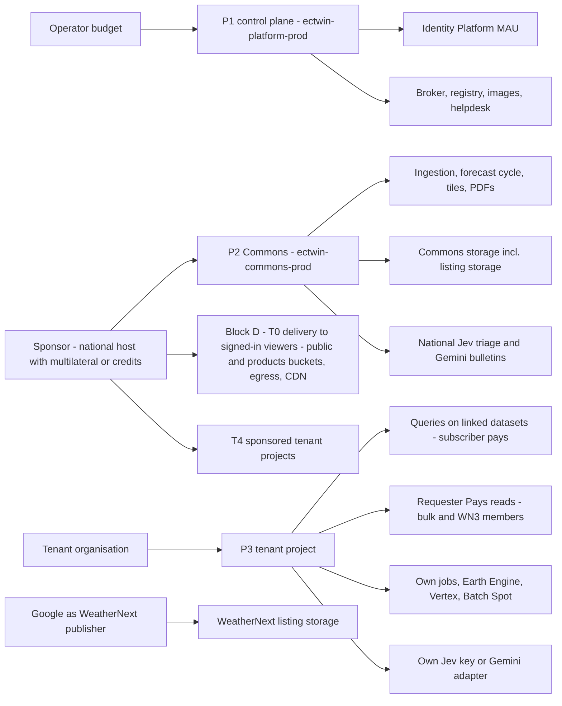
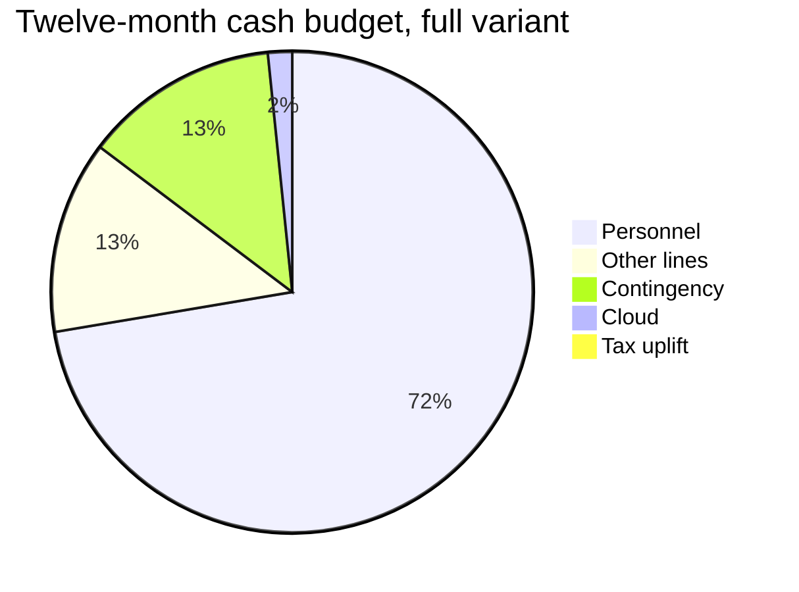
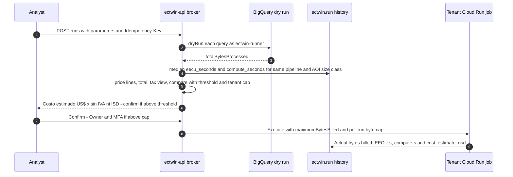

# Cost model and cost-minimisation strategy

This document sets out what *Gemelo Digital Ecuador – El Niño* (GDE-Niño) costs to run on Google Cloud, who pays each cost, and how the design keeps those costs low. It fixes the unit prices the plan uses, dated **2026-09-29**, with source links. It lists the cost-minimisation levers and what each one saves. It gives monthly estimates with the arithmetic shown for the control plane, the Commons, each tenant tier and a fully centralised alternative, plus one-time build costs. It covers taxes and procurement in Ecuador, funding and credits, FinOps guardrails (billing export, budgets, the in-app cost dashboard and the per-run estimate), a sensitivity analysis and pricing risks. Components, buckets, datasets, routes and job names come from [03-architecture.md](./03-architecture.md). The guardrail mechanics (quotas, kill switch) are in [04-identity-tenancy-byo-gcp.md §8](./04-identity-tenancy-byo-gcp.md). Decision-layer token arithmetic is in [08-ai-decision-layer-jev.md §7](./08-ai-decision-layer-jev.md). Impact-module compute is in [07-impact-modules-and-triggers.md §9](./07-impact-modules-and-triggers.md). The programme budget (people, other lines, contingency) is in [12-roadmap-team-budget.md §5](./12-roadmap-team-budget.md). None of these is repeated here.

## Contents

0. [Conventions](#0-conventions)
1. [Who pays what](#1-who-pays-what)
2. [Unit prices (checked 2026-09-29)](#2-unit-prices-checked-2026-09-29)
3. [Cost-minimisation levers](#3-cost-minimisation-levers)
4. [Monthly estimates](#4-monthly-estimates)
5. [One-time build-phase cloud costs](#5-one-time-build-phase-cloud-costs)
6. [People and other costs (summary)](#6-people-and-other-costs-summary)
7. [Taxes and procurement](#7-taxes-and-procurement)
8. [Funding and credits](#8-funding-and-credits)
9. [Guardrails and FinOps](#9-guardrails-and-finops)
10. [Sensitivity analysis](#10-sensitivity-analysis)
11. [Pricing risks](#11-pricing-risks)
12. [Open questions](#12-open-questions)

---

## 0. Conventions

- **Currency and basis.** All figures are USD list prices before taxes (Ecuador is dollarised, so there is no FX risk). Taxes are treated separately in §7.
- **Free tiers** apply **per billing account** unless stated otherwise. This is the main reason the BYO-GCP design is cheap: every tenant has its own billing account and so its own free tiers.
- **Status labels on prices:**
  - **V**: read on the provider's pricing page during research on 2026-09-29.
  - **S**: secondary source quoting the provider.
  - **U**: not verified; marked **(unverified)** or **(to confirm)** and never used as a hard number.
- **Estimates.** Every number that is not a unit price is an **estimate**. The arithmetic is shown so it can be re-run with measured values.
- **Units.** Sizes follow the source: GB where the source uses GB, GiB/TiB where BigQuery and GCS prices do.
- **Owner codes** are those of [03](./03-architecture.md) (PL, DL, FL, FE, AI, SRE, DPO, TA) and [12 §4.1](./12-roadmap-team-budget.md) (PM, ADM, BE, IM, HYD, HML, PT). LC is external legal counsel ([13 §0.2](./13-governance-legal-risk.md)).
- **Postures** N0–N3 (routine, season, event, major event) are defined in [11 §3](./11-operations-runbook.md).

---

## 1. Who pays what

The design places each cost with the party that benefits (AP-02, AP-03 in [03 §1](./03-architecture.md)).

- **P1, the control plane**, is paid by the **operator**. It covers identity, the broker, the registry, images and IaC.
- **P2, the Commons**, is paid by a **sponsor**, for example SNGR/INAMHI with a multilateral lender or credits **(to confirm)**. It computes national public goods once.
- **P3, each tenant project**, is paid by the **tenant organisation**: its own queries, storage, jobs, Earth Engine and heavy runs.
- The **T0 delivery block ("Block D")** serves the read-only national view to signed-in users who have no project (D6): static layers in `ectwin-commons-prod-public` (public-read) and forecast-derived tiles, national JSON, bulletins, cards and canton PDFs in the private `ectwin-commons-prod-products` bucket, served by 60-minute V4 signed URLs ([10 §5.3](./10-setup-and-deployment.md); decision M1.2), with egress and later Cloud CDN on both. It is billed in the Commons project. It is shown separately because it scales with users, not with tenants.



| Cost object | Payer | Mechanism | Detail |
|---|---|---|---|
| Identity Platform MAU, broker, registry, Artifact Registry, platform logs | Operator | Resources in `ectwin-platform-prod` | [04 §7](./04-identity-tenancy-byo-gcp.md) rows 1–3, 23 and 29 |
| Ingestion, forecast cycle, tiles, PDFs, verification, national Jev and Gemini | Sponsor | Resources and keys in `ectwin-commons-prod` | [08 §6](./08-ai-decision-layer-jev.md) |
| Storage behind the `ectwin_commons_v1` / `ectwin_commons_nc_v1` listings | Sponsor | "Publisher pays storage" ([BigQuery pricing](https://cloud.google.com/bigquery/pricing)) | — |
| Tiles, national JSON, canton PDFs (Block D, T0 delivery) | Sponsor | Storage, operations and egress of `ectwin-commons-prod-public` (static layers, public-read) and `ectwin-commons-prod-products` (forecast-derived objects, signed URLs) | §4.2.3 |
| Bulk downloads from `ectwin-commons-prod-bulk` | Requester | Requester Pays, `userProject` | — |
| Queries on `ectwin_commons`, `weathernext_3`, `weathernext_2` | Tenant | "You are charged for queries run against shared data. The data owner is not charged." ([BigQuery pricing](https://cloud.google.com/bigquery/pricing)) | — |
| WN3 full-member Zarr reads | Tenant (T3) or Commons (Phase 2) | Requester Pays bucket in `us-east1` | — |
| Tenant jobs, Firestore, bucket, EE, Vertex, Batch, secrets | Tenant | Resource owner / `ee.Initialize(project=)` | — |
| T4 sponsored projects | Sponsor, via its billing account; billing can later move to the GAD | Projects in a sponsor folder | §4.7 |
| WeatherNext data itself | Nobody today | Free, but Google may charge "reasonable fees" with one month's notice ([terms](https://storage.googleapis.com/weathernext-public/terms-of-use.pdf)) | §11 PR-01 |

In Phases 0–3, the operator and sponsor lines are both financed from the programme budget ([12 §5](./12-roadmap-team-budget.md)). Keeping them in separate projects and on separate billing accounts means that at hand-over (Phase 4) each line can move to its own host without re-engineering.

---

## 2. Unit prices (checked 2026-09-29)

Region is `us-central1` or the `US` multi-region unless stated. These prices are the single source for all arithmetic in this plan. The machine-readable copy is `libs/ectwin_core/pricing/prices-2026-09-29.yaml` (§9.5).

### 2.1 Data, compute and networking

| Service | Item | Price | Free tier (per billing account) | Status / source |
|---|---|---|---|---|
| BigQuery | On-demand query, `US` / `us-central1` | US$6.25/TiB | First 1 TiB/month | V [bq](https://cloud.google.com/bigquery/pricing) |
| BigQuery | On-demand query, `southamerica-east1` / `southamerica-west1` | US$11.25 / US$8.9375 per TiB | 1 TiB | V [bq](https://cloud.google.com/bigquery/pricing) |
| BigQuery | Minimum billing per table referenced | 10 MB | — | V |
| BigQuery | Storage, US logical: active / long-term | US$0.02 / US$0.01 per GiB-month | First 10 GiB | V |
| BigQuery | Storage, US physical: active / long-term | US$0.04 / US$0.02 per GiB-month | — | V |
| BigQuery | Editions slot-hour: Standard / Enterprise / Enterprise Plus | US$0.04 / US$0.06 / US$0.10 | — | V |
| BigQuery | Storage Read API | US$1.10/TiB | 300 TiB/month | V |
| BigQuery | Earth Engine in BigQuery (`ST_RegionStats`) | BigQuery services SKU, US$0.06/slot-hour | — | V [blog](https://cloud.google.com/blog/products/data-analytics/earth-engine-raster-analytics-and-visualization-in-bigquery-geospatial) |
| Cloud Storage | Standard / Nearline / Coldline / Archive, `us-central1` | US$0.020 / 0.010 / 0.004 / 0.0012 per GiB-month | 5 GB-months Standard (US-WEST1, US-CENTRAL1, US-EAST1) | V [gcs](https://cloud.google.com/storage/pricing) |
| Cloud Storage | Same classes, `southamerica-west1` | US$0.030 / 0.018 / 0.006 / 0.0027 | — | V |
| Cloud Storage | Same classes, `southamerica-east1` | US$0.035 / 0.020 / 0.007 / 0.003 | — | V |
| Cloud Storage | Class A / Class B operations | US$0.005 / US$0.0004 per 1,000 | 5,000 A, 50,000 B | V |
| Cloud Storage | Retrieval: Nearline / Coldline / Archive | US$0.01 / 0.02 / 0.05 per GiB | — | V |
| Cloud Storage | Internet egress, "Worldwide excl. Asia & Australia" (includes Ecuador), 0–10 TiB | US$0.12/GiB | "100 GB from North America to each … destination" (whether this covers internet egress is ambiguous, see §10) | V |
| Cloud Run | Request-based: vCPU-s / GiB-s / requests | US$0.000024 / 0.0000025 / US$0.40 per million | 180,000 vCPU-s, 360,000 GiB-s, 2M requests | V [run](https://cloud.google.com/run/pricing) |
| Cloud Run | Instance-based and Jobs: vCPU-s / GiB-s | US$0.000018 / 0.000002 | 240,000 vCPU-s, 450,000 GiB-s | V |
| Cloud Run | Delayed Jobs (price may change every 30 days) | US$0.0000126 / 0.0000014 | — | V |
| Cloud Run | Minimum billed time per job instance | 1 minute | — | V [run](https://cloud.google.com/run/pricing) |
| Cloud Run | NVIDIA L4 GPU, non-zonal redundancy | US$0.0001867/s ≈ US$0.672/h (GPU only; zonal redundancy US$0.0002909/s) | — | V |
| Cloud Run | Idle time of a minimum instance, request-based billing | US$0.0000025/vCPU-s and US$0.0000025/GiB-s (Tier 1 regions, incl. `us-central1`) | — | V [run](https://cloud.google.com/run/pricing) |
| Cloud Run | Region tiers | `us-central1` and `us-east1` are Tier 1; `southamerica-west1` and `southamerica-east1` are **Tier 2** (higher rates; Tier 2 figures not captured, **to confirm**). Free tier is applied at Tier 1 prices | — | V (tiers) / U (Tier 2 rates) |
| Networking | Premium Tier egress to South America, 0–1 TiB (Cloud Run and VM egress) | US$0.19/GiB | 1 GiB/month within North America | V [net](https://cloud.google.com/vpc/network-pricing) |
| Networking | Standard Tier egress | US$0.085/GiB | 200 GiB | V |
| Networking | External load balancer forwarding rule | US$0.025/h ≈ US$18.25/month | — | V |
| Cloud CDN | Cache egress, South America, 0–10 TiB | US$0.09/GiB | — | V [cdn](https://cloud.google.com/cdn/pricing) |
| Cloud CDN | Cache fill / lookups | US$0.01–0.04/GiB / US$0.0075 per 10,000 | — | V |
| Spot VMs | `e2-standard-4` / `c2d-standard-16` / `c3d-highcpu-16` | US$0.080 / 0.409 / 0.160896 per hour | — | V [spot](https://cloud.google.com/spot-vms/pricing) (prices change up to daily) |
| Spot VMs | `g2-standard-4` (1× L4) / `g4-standard-48` (1× RTX PRO 6000) | US$0.424 / 1.68338 per hour | — | V |
| Spot VMs | `a2-highgpu-1g` (A100) / `a3-highgpu-1g` (H100) | US$2.204 / 6.62 per hour | — | V |
| Cloud Batch | Service fee | None: pay for VMs, GPUs and disks only | — | V [batch](https://cloud.google.com/batch/pricing) |
| Vertex AI custom training | Accelerator part: L4 / A100 / H100 | US$0.644 / 2.93 / 9.80 per hour (machine part extra, **to confirm**) | — | V [vx](https://cloud.google.com/vertex-ai/pricing) |
| TPU | v5e / v5p / Trillium / Ironwood, per chip-hour, on-demand | US$1.20 / 4.20 / 2.70 / 12.00 | — | V [tpu](https://cloud.google.com/tpu/pricing) |
| TPU | Same, DWS Flex-start | US$0.60 / 2.10 / 1.35 / 6.00 | — | V |

### 2.2 Platform services, AI and Earth Engine

| Service | Item | Price | Free tier | Status / source |
|---|---|---|---|---|
| Identity Platform | Tier 1 (Google, email/password) | Free to 50,000 MAU; US$0.0055/MAU to 100k; US$0.0046 to 1M | 50,000 MAU | V [idp](https://cloud.google.com/identity-platform/pricing) |
| Identity Platform | Tier 2 (SAML/OIDC) | US$0.015/MAU | 50 MAU | V |
| Identity Platform | SMS to Ecuador | US$0.16 per SMS | 10 SMS/day | V |
| Firestore | Reads / writes / deletes | US$0.03 / 0.09 / 0.01 per 100,000 | Per day: 50k reads, 20k writes, 20k deletes; 1 GiB storage; 10 GiB egress/month. **One free database per project** | V [fs](https://cloud.google.com/firestore/pricing) |
| Firestore | Storage | US$0.15/GiB-month | 1 GiB | V |
| Pub/Sub | Throughput | US$40/TiB | 10 GiB/month | V [ps](https://cloud.google.com/pubsub/pricing) |
| Cloud Scheduler | Job | US$0.10 per job-month | 3 jobs | V [sch](https://cloud.google.com/scheduler/pricing) |
| Secret Manager | Active version / accesses | US$0.06 per version-month / US$0.03 per 10,000 | 6 versions / 10,000 accesses | V [sm](https://cloud.google.com/secret-manager/pricing) |
| Artifact Registry | Storage | US$0.10/GiB-month | 0.5 GB | V [ar](https://cloud.google.com/artifact-registry/pricing) |
| Cloud Logging | Ingestion | US$0.50/GiB | 50 GiB per **project** per month | V [obs](https://cloud.google.com/stackdriver/pricing) |
| Cloud Build | Build minutes | — | 2,500 minutes/month | V |
| Infrastructure Manager | Deployment | Cloud Build minutes plus a Cloud Storage bucket | — | V [im](https://cloud.google.com/infrastructure-manager/pricing) |
| Earth Engine, commercial Limited plan | EECU-hour, online or batch | US$0.40 (0–10k h), US$0.28 (10k–500k h), US$0.16 (above) | — | V [ee](https://cloud.google.com/earth-engine/pricing) |
| Earth Engine | Basic / Professional plan | US$500/month (incl. 100 batch + 33 online EECU-h, 100 GB) / US$2,000/month (incl. 500 + 166 EECU-h, 1 TB) | — | V |
| Earth Engine | Storage | US$0.026/GiB-month (US$0.000035616/GiB-hour) | — | V |
| Earth Engine | Noncommercial tiers (from 2026-04-27): Community / Contributor / Partner | US$0, capped at 150 / 1,000 / 100,000 EECU-h per month; Partner by application; yearly re-verification | — | S [tiers mirror](https://raw.githubusercontent.com/gvillarroel/gcp-radar/main/data/step-04/current/products/earth/corpus/site/site-docs-root/pages/developers.google.com_earth-engine_guides_noncommercial_tiers.md) |
| Gemini 3.1 Flash-Lite | Input / output per 1M tokens: standard; Batch/Flex | US$0.25 / 1.50; US$0.125 / 0.75 | — | V [gen](https://cloud.google.com/vertex-ai/generative-ai/pricing) |
| Gemini 3.5 Flash-Lite | Same | US$0.30 / 2.50; US$0.15 / 1.25 | — | V |
| Gemini 3.8 Flash | Input / output per 1M tokens | US$0.75 / 3.75 to 2026-12-31; **US$1.50 / 7.50 from 2027-01-01** | — | V |
| TypeSafe Jev `jev-1.13.0` | Input tokens (output free) | US$0.042 per 1M | None | S [snapshot](https://github.com/aaddrick/building-with-typesafe-jev) |
| TypeSafe Jev | Per decision (benchmark mix) | US$0.0399 per 1,000 decisions, vs US$0.2638 for Gemini 3.1 Flash-Lite | — | S [JevBench](https://github.com/fstandhartinger/jevbench/blob/main/RESULTS-v1.2.md) |
| Maps Platform | 2D Map Tiles / Photorealistic 3D Tiles root requests | US$0.60 per 1,000 / US$6.00 per 1,000 | 100,000 / 1,000 per month | S ([2D](https://github.com/Caldis/voyage/blob/main/research/IMAGERY.md), [3D](https://github.com/sei-studio/sei/blob/main/.planning/research/v0.4-varied-behavior-and-minigames.md)) |
| Maps Weather API | Calls | US$0.15 per 1,000 (not used: its policies prohibit using it to build a weather model or weather app, and restrict caching) | 10,000/month | S |
| Cesium ion | Paid plan needed for government projects | From US$149/month (not used; self-hosted terrain) | — | S |
| WeatherNext data | BigQuery, EE, GCS access | No fee today; fees possible with one month's notice | — | V [terms](https://storage.googleapis.com/weathernext-public/terms-of-use.pdf) |
| Flood Forecasting API | Calls | Believed free (**unverified**) | 200 requests/min per project | U |

### 2.3 Items without a verified price

These appear in the architecture but no price was verified in the research. Each is covered by an explicit **allowance** in §4 until confirmed. Owner PL, due **2026-10-16**.

| Item | Where used | Allowance used here |
|---|---|---|
| Cloud NAT and reserved static IP for `southamerica-west1` ingestion ([05](./05-data-catalog.md) rung 1) | Commons | Inside the Commons allowance (US$10–40/month) |
| Workflows (forecast-cycle orchestration) | Commons, T2+ tenants | Same |
| Storage Transfer Service (raw → `archive-scl` DR copy) | Commons | Same |
| Sensitive Data Protection (DLP) pseudonymisation before external AI calls ([08](./08-ai-decision-layer-jev.md)) | Commons | Same |
| Cloud Monitoring uptime checks and custom metrics | P1, P2 | P1 allowance US$0–20 |
| Firebase Hosting transfer beyond its free limits | P1 | Same |
| Cloud KMS keys for the WIF issuer (path C) | P1 | Same |
| Cloud Armor (with CDN, Phase 2+) | Block D | Not included; add when CDN is switched on |
| Cloud Billing export to BigQuery (the export itself) | All | Storage and queries of the export are billed at BigQuery rates |
| Firestore scheduled backups; BigQuery table snapshots | P1, P2 | Not included (small) |
| Firestore rates in `southamerica-west1` (registry and tenant databases); the §2.2 rates are assumed | P1, tenants | Registry: P1 allowance. Tenants: inside the free tier at T1/T2 volumes |
| Inter-region GCS transfer (`us-east1` → `us-central1`) | T3, Commons Phase 2 | Avoided by design (process in `us-east1`) |
| Email provider for `ectwin-notifier` | P1 | Programme SaaS line O1 in [12 §5.3](./12-roadmap-team-budget.md) |

---

## 3. Cost-minimisation levers

Each lever is quantified with the unit prices of §2. "Applied in" gives the document where the lever is implemented.

| ID | Lever | Quantified effect (arithmetic) | Applied in | Owner |
|---|---|---|---|---|
| L01 | **BYO-GCP: every tenant uses its own billing account**, so every tenant gets its own free tiers (1 TiB BigQuery, 240k vCPU-s jobs, 5 GB GCS, 100 GB egress, one free Firestore database, 50 GiB logs per project) | For 30 tenants, centralising the same workload costs **US$303–631/month more** (§4.8). Tenant analytics cost the operator US$0 | [04](./04-identity-tenancy-byo-gcp.md) | PL |
| L02 | **Compute national products once in Commons** and share them by Analytics Hub listing and GCS (AP-03) | Parish exceedance scans ≈1.3 GB per cycle (WN3 10 columns × 0.07 GB + WN2 3 columns × 0.2 GB) × 120 cycles = 156 GB/month once, instead of 156 × 30 ≈ 4.7 TB if 30 tenants each computed it. National Jev and Gemini layer ≈US$144/month at peak paid once; ten provincial tenants each triaging the same feeds would pay ≈US$1,440 | [03 §4.1](./03-architecture.md) | DL |
| L03 | **One home region**: BigQuery `US`, GCS and Run `us-central1` (D10) | BigQuery in São Paulo is +80% (US$11.25 vs US$6.25/TiB) and GCS +75%. For one Heavy tenant: 4 TiB × 5.00 + 2,048 GiB × 0.015 + 10,240 GiB × 0.003 = US$20.00 + 30.72 + 30.72 = **+US$81/month avoided** | [03 §2.1](./03-architecture.md) | PL |
| L04 | **Query WeatherNext in place via linked datasets; never copy** | Subscriber storage is US$0. Copying an Ecuador WN3 statistics cube (≈0.5 GB compressed per init × 4 main inits × 30 = 60 GB/month) would reach 720 GB in a year ≈ US$14.40/month in storage alone. A central copy re-served to tenants would also breach the real-time terms, which allow unmodified data only for internal use, Subsidiaries and Contractors | [06](./06-forecast-model-stack.md) | FL |
| L05 | **Partition, cluster and column pruning** on every WeatherNext query (`init_time` + `ST_INTERSECTS` + named leaf columns) | One global WN3 column-init ≈18.7 GB vs ≈0.07 GB for Ecuador (≈267× less): US$0.114 vs US$0.0004 per column-init after the free tier | [03 §4.2](./03-architecture.md) | FL |
| L06 | **Clip to mainland + Galápagos polygons, not the bbox** | 4,740 vs 11,560 cells at 0.1° (**−59%**) for every Zarr crop, tile and export | [06](./06-forecast-model-stack.md) | FL |
| L07 | **`maximumBytesBilled`, per-run byte caps and `QueryUsagePerDay`** | Any single platform job capped at 50 GiB ≈ **US$0.31**. A T2 tenant capped at 1 TiB/day ≈ US$6.25/day | [04 §8](./04-identity-tenancy-byo-gcp.md) | PL |
| L08 | **Serve tiles as PMTiles from GCS, never through Cloud Run or VMs** | At 195 GiB: GCS (195 − 100) × 0.12 = US$11.40 vs Premium egress (195 − 1) × 0.19 = US$36.86. At 1 TiB: US$110.88 vs US$194.37 | [03 §8.3](./03-architecture.md) | FE |
| L09 | **Cloud CDN only above break-even** | Break-even ≈1,080 GiB/month on egress alone, or ≈1.5 TiB including lookups and operations at 50 KB average object size (§4.2.3). At 5 TiB, CDN saves ≈US$71–113/month | [03 §11.1](./03-architecture.md) | SRE |
| L10 | **Scale to zero** (`min-instances=0`) except in N2/N3 | A warm 1 vCPU/1 GiB minimum instance of the request-billed broker costs 2,592,000 s × (0.0000025 + 0.0000025) = **US$12.96/month** at the idle rate; at instance-based rates it would be 2,592,000 × (0.000018 + 0.000002) = US$51.84, the upper bound budgeted below. Warm only in N2/N3 | [11 §3.3](./11-operations-runbook.md) | SRE |
| L11 | **Put tiny frequent polls on request-billed endpoints** (Scheduler HTTP → Cloud Run service) instead of jobs with a 1-minute minimum, or merge them | Pollers are 950,400 of 1,488,600 Commons job vCPU-s (64%). Moving them saves ≈**US$18/month** (US$24.62 → US$6.56). Merging only the SNGR and INAMHI-advisory polls saves US$3.28. The same rule applies to `ops-synthetic-probe` (every 5 min in two regions): as a job it would add ≈US$19.7/month (§4.3.1). Proposal to agree with DL, because [03 §7.1](./03-architecture.md) uses jobs | [03 §7.2](./03-architecture.md) | DL |
| L12 | **Cloud Run Delayed Jobs for backfills and hindcasts** | −30%: 1M vCPU-s costs US$18.00 → US$12.60 | [03 §7.5](./03-architecture.md) | DL |
| L13 | **Batch on Spot for heavy runs**; on-demand only with Owner approval | 900 GPU-h on `g2-standard-4` Spot = US$381.60, vs 900 × (0.672 + 0.374) ≈ US$942 on Cloud Run L4 (GPU plus 4 vCPU × 0.000018 × 3,600 + 16 GiB × 0.000002 × 3,600 = US$0.374/h): **−59%** | [11 §3.8](./11-operations-runbook.md) | FL |
| L14 | **SFINCS scenario library plus emulator** instead of live 2D ensembles | One-off US$60–360. A tenant retrieving a library map costs <US$0.01, vs US$2–8 per live 50-member ensemble. 10 tenants × 8 events/month avoids **US$160–640/month** | [07 M3](./07-impact-modules-and-triggers.md) | IM |
| L15 | **Jev for typed decisions, Gemini only for prose** (D16, D18) | National peak W1–W7: US$113 on Jev vs ≈US$1,450 on Flash-Lite (**−92%**) | [08 §7](./08-ai-decision-layer-jev.md) | AI |
| L16 | **Two-stage gating** (cheap relevance gate, then full triage; code gates before Jev) | W1+W2: 600M + 280M tokens = US$36.96, vs full triage on all 2M items (2.8B tokens) = US$117.60 (**−69%**). At pilot, W4 is code-gated to the ≈20% of parishes above normal | [08 §4](./08-ai-decision-layer-jev.md) | AI |
| L17 | **Gemini Batch for bulletins; watch the 3.8 Flash price step** | Batch is 50% of standard Flash-Lite prices. A Heavy copilot load of 50M in / 5M out rises from US$56.25 to **US$112.50/month** on 2027-01-01; the copilot (FR-062) is Phase 3, so only the 2027 price applies in production (§4.6). Route to Flash-Lite where quality allows | [08 §7.4](./08-ai-decision-layer-jev.md) | AI |
| L18 | **Earth Engine: noncommercial tiers where eligible, the Limited plan otherwise, and BigQuery/GCS for the core pipeline** | Heavy 500 EECU-h: Partner US$0; Limited US$200; Basic US$500 + (500 − 133) × 0.40 = US$646.80 | [04 §5.7.4](./04-identity-tenancy-byo-gcp.md) | TA |
| L19 | **BigQuery on-demand, not Editions**, at this scale | Heavy tenant: (5 − 1) TiB × 6.25 = US$25, vs 100 slots × 4 h × 30 × 0.06 = US$720 | [03 §5.2](./03-architecture.md) | DL |
| L20 | **Storage lifecycle and cold DR copy** | 1 TiB of raw archive after a year: all Standard US$20.48, vs 25% Standard + 75% Nearline US$12.80 (−37%). DR copy in Archive class, `southamerica-west1`: 1,024 × 0.0027 = US$2.76, vs US$30.72 in Standard there (−91%). Restores pay US$0.05/GiB retrieval | [03 §5.1](./03-architecture.md) | SRE |
| L21 | **Scratch expiry and long-term storage** | `ectwin_scratch` and `scratch/` expire at 7 days. Tables untouched for 90 days drop from US$0.02 to US$0.01/GiB-month | [03 §5](./03-architecture.md) | DL, TA |
| L22 | **Logging exclusions** | Heavy tenant at 100 GiB/month: (100 − 50) × 0.50 = US$25; excluding debug logs to ≤50 GiB saves it all | [11 RB-18](./11-operations-runbook.md) | SRE, TA |
| L23 | **TOTP MFA, never SMS** | 500 admins × 8 sign-ins/month = 4,000 SMS − 300 free = 3,700 × 0.16 = **US$592/month avoided** | [04 §2.3](./04-identity-tenancy-byo-gcp.md) | PL |
| L24 | **Open basemap (platform PMTiles); Google 2D/3D tiles only on the tenant's own key** | Light tenant: (120k − 100k)/1k × 0.60 = US$12/month avoided. Heavy: 10k 3D sessions = US$54 on the tenant's own key | [03 §8.7](./03-architecture.md) | FE |
| L25 | **Requester Pays on the bulk bucket** | 1 TiB of research downloads is US$110.88 paid by the requester, not the sponsor | [03 §5.1](./03-architecture.md) | DL |
| L26 | **Do not self-run WN2 routinely** | 4 runs/day × 30 × US$2.3–4.6 = US$276–552/month, vs ≈US$0 querying the published archive. Self-run only for perturbed or custom-IC scenarios | [06](./06-forecast-model-stack.md) | FL |
| L27 | **Process WN3 members in `us-east1`**, next to the Requester-Pays bucket | Avoids inter-region transfer on ≈50 GB per global run of 7 variables (inter-region price **to confirm**) | [03 ADR-29](./03-architecture.md) | FL |
| L28 | **Guard pauses jobs instead of disabling billing** | Overrun is limited to about one budget-notification lag, and no data is lost ("might irretrievably delete" if billing is disabled) | [04 §8.3](./04-identity-tenancy-byo-gcp.md) | PL |

### 3.1 Creation-cost levers from the three named technologies

The levers above mostly cut running costs. WeatherNext, Google Flood Forecasting and TypeSafe Jev also cut the cost of **creating** the twin in Phases 0–1. Most of that saving is people and calendar time, so it shows in the personnel line of [12 §4–5](./12-roadmap-team-budget.md) (72.1% of the budget, §6), not in the cloud lines of §5.

| ID | Lever | Quantified effect (arithmetic) | Applied in | Owner |
|---|---|---|---|---|
| L29 | **Jev build batteries B1–B5** (catalogue triage of ≈5,000 layers, PDF-table QA, DPA place resolution, impact-history labelling, ingest DQ flags) turn curation into review | Analyst hours for B1–B4: 3,608 h human-only → 617 h Jev-assisted = **−2,991 h (−83%)**, i.e. US$54,125 − 9,250 ≈ **US$44,875** at US$15/h, or ≈US$62,310 at the DE rate of US$20.8/h ([12 §4.2](./12-roadmap-team-budget.md)). Calendar: 3,608 ÷ 2 ÷ 40 ≈ 45 two-analyst weeks → 617 ÷ 2 ÷ 40 ≈ 8, before the season. API per pass: Jev ≈US$15 vs ≈US$188 on Gemini 3.1 Flash-Lite; with three tuning passes and Gemini escalations the build API bill is B9, US$35–90 (§5) | [08 §3.7, §3.8](./08-ai-decision-layer-jev.md) | AI |
| L30 | **Flood Forecasting API + GRRR + GloFAS instead of building national basin models for Phase 1** | Flood API believed free (**unverified**, §2.2); GRRR reanalysis 1980-01-01 → 2023-12-23, reforecasts 2016–2023 and return periods loaded once (≈279 MB, B7 ≈US$0); GloFAS ingested daily (`ingest-glofas`, §4.3.1). No hydrological model is built or calibrated in Phase 1. The only model build is the Phase 3 OpenHydroNet fine-tune: 10–50 L4-h (US$4–21) + 1–4 L4-h (<US$2) = **US$4–23** (B15) | [06 §4.6, §4.10](./06-forecast-model-stack.md) | DL, FL |
| L04, L05, L26 (build view) | **No NWP to build or run**: query WN3/WN2 in place | Commons scans ≈0.47–0.60 TiB/month stay inside the 1 TiB free tier, so querying WN3/WN2 costs ≈**US$0** (§4.3.2), vs 4 runs/day × 30 × US$2.3–4.6 = **US$276–552/month** to self-run WN2 (L26), before any model set-up or data-assimilation work | [06](./06-forecast-model-stack.md) | FL |

---

## 4. Monthly estimates

### 4.1 Common assumptions

| # | Assumption |
|---|---|
| A1 | Pilot month = **November 2026**: ≈2,000 MAU, ≈3M broker requests, ≈195 GiB of tile egress, 3–5 tenants growing to ≈30. Season month = a **N1** month in Dec 2026–Apr 2027: ≈10,000 MAU, ≈10M requests, ≈1 TiB egress. Peak month = a full **N2** month: ≈1.5 TiB egress, WN3 interim runs on, bulletins twice a day ([11 §3.3](./11-operations-runbook.md)). National = Phase 4: 20,000 MAU, 300 tenants, ≈30M requests, ≈5 TiB egress ([03 §11.1](./03-architecture.md)) |
| A2 | BigQuery scan per column-init (estimates): **≈0.07 GB** for WN3 (Ecuador bbox, one 6-hourly init: 6.48M global cells × 360 leads × 8 B = 18.7 GB × 0.178% = 33 MB, doubled for block overhead) and **≈0.2 GB** for WN2 ensemble columns (≈1,850 cells × 64 members × 60 leads × 8 B ≈ 57 MB, plus overhead). Measured third-party point queries billed 30–89 MB. A full Commons cycle is ≈1.3 GB (L02); the M1.1 acceptance target is ≤1 GB for the Phase 1 column set. To be re-measured at M1.1 (2026-10-30) |
| A3 | Broker CPU ≈0.05 vCPU-s per request (estimate, concurrency 80). Average tile object ≈50 KB (tiles ≤100 KB p95, NFR-004) |
| A4 | Cloud Run jobs are billed at least 60 s per execution. Pollers run at 1 vCPU/0.5 GiB |
| A5 | Allowances cover items in §2.3 without a verified price: P1 US$0–20 (pilot, season), US$0–40 (national); Commons US$10–20 (pilot), US$15–30 (season), US$20–40 (peak) |
| A6 | Earth Engine: commercial (Limited plan, US$0.40/EECU-h) unless the tenant or project holds a noncommercial tier. Operational government use counts as commercial (LP-07 in [13 §0.3](./13-governance-legal-risk.md)) |

### 4.2 P1 control plane (`ectwin-platform-prod`)

#### 4.2.1 Pilot (Nov 2026) and season month

| Item | Pilot arithmetic | Pilot US$ | Season arithmetic (10k MAU, 10M requests) | Season US$ |
|---|---|---|---|---|
| Identity Platform, Tier 1 | 2,000 MAU < 50,000 free | 0.00 | 10,000 < 50,000 | 0.00 |
| Registry Firestore reads | (200k − 50k)/day × 30 × 0.03/100k | 1.35 | (660k − 50k) × 30 × 0.03/100k | 5.49 |
| Broker requests | (3M − 2M) × 0.40/1M | 0.40 | (10M − 2M) × 0.40/1M | 3.20 |
| Broker CPU and memory | 3M × 0.05 = 150k vCPU-s < 180k free | 0.00 | (500k − 180k) × 0.000024 + (500k − 360k) × 0.0000025 | 8.03 |
| Scheduler, Secret Manager, Artifact Registry | 0.20 + (10 − 6) × 0.06 + 4.5 GiB × 0.10 | 0.89 | Same | 0.89 |
| Platform ops dataset (BigQuery, 20 GiB) | (20 − 10) × 0.02 | 0.20 | Same | 0.20 |
| Gemini helpdesk (estimate) | — | 2.00 | — | 5.00 |
| Logging | < 50 GiB | 0.00 | < 50 GiB | 0.00 |
| Allowance (§2.3) | — | 0–20 | — | 0–20 |
| **Total** | | **≈US$5–25** | | **≈US$23–43** |
| Warm broker in N2/N3 | Idle rate 2,592,000 s × (0.0000025 + 0.0000025) = 12.96; upper bound at instance-based rates 2,592,000 × (0.000018 + 0.000002) = 51.84 | — | ≈US$0.43–1.73/day | **+US$13 to ≤US$52/month** (≤52 budgeted) |

**Reconciliation with the spine anchor (≈US$23–43).** The anchor was computed with the public product bucket, its egress and some ETL inside the operator project. [03](./03-architecture.md) places those in `ectwin-commons-prod`. This document therefore counts them in the Commons (§4.3) and in Block D (§4.2.3), never twice. The strict control plane costs ≈US$5–25 at pilot. It reaches the anchor band (≈US$23–43) at season scale. The anchor stays as the **operator budget envelope** (US$45/month, [04](./04-identity-tenancy-byo-gcp.md) and [12 C1](./12-roadmap-team-budget.md)).

#### 4.2.2 National scale (Phase 4)

| Item | Arithmetic | US$/month |
|---|---|---|
| Identity Tier 1 | 20,000 MAU < 50,000 | 0.00 |
| Identity Tier 2 (4 ministries × 500 SAML users, estimate) | (2,000 − 50) × 0.015 | 29.25 |
| Broker requests | (30M − 2M) × 0.40/1M | 11.20 |
| Broker CPU | (30M × 0.05 − 180k) × 0.000024 | 31.68 |
| Broker memory (1 GiB) | (1.5M − 360k) × 0.0000025 | 2.85 |
| Registry Firestore (1M reads/day after 60-s cache) | (1M − 50k) × 30 × 0.03/100k | 8.55 |
| Scheduler, Secret Manager (20 versions), Artifact Registry (10.5 GiB) | 0.20 + 14 × 0.06 + 10 × 0.10 | 2.04 |
| Gemini helpdesk (estimate) | — | 10.00 |
| Logging (80 GiB) | (80 − 50) × 0.50 | 15.00 |
| Platform ops dataset | (20 − 10) × 0.02 | 0.20 |
| Allowance | — | 0–40 |
| **Total** | | **≈US$111–151** (+≤US$52 warm instance in N2/N3) |

At 100,000 MAU, Identity adds (100,000 − 50,000) × 0.0055 = US$275/month. That is the only control-plane cost that grows steeply with users (§10).

#### 4.2.3 Block D: T0 delivery (billed in Commons)

Tiles, national JSON and canton PDFs are served straight from GCS: static layers from `ectwin-commons-prod-public` (public-read), and forecast-derived tiles, national JSON, bulletins, cards and canton PDFs from the private `ectwin-commons-prod-products` bucket through 60-minute V4 signed URLs to signed-in users ([10 §5.3](./10-setup-and-deployment.md); [03 §5.1](./03-architecture.md); decision M1.2). Both buckets are in the Commons project; the figures below cover them together. At 50 KiB per object, 1 GiB ≈ 20,972 requests. Storage is 150 GiB (300 GiB at national scale); free tiers are 100 GB egress and 50,000 Class B operations; the CDN columns assume a 10% miss rate (cache fill at US$0.02/GiB, miss operations at the Class B rate).

| Scale | GCS direct: storage + Class B + egress | GCS US$ | Cloud CDN: storage + egress + fill + LB + lookups + miss ops | CDN US$ | Choice |
|---|---|---|---|---|---|
| Pilot, 195 GiB | 2.90 + (4M − 50k) × 0.0004/1k + (195 − 100) × 0.12 | **15.88** | — | — | GCS |
| Season, 1 TiB | 2.90 + 21.4M × 0.0004/1k + (1,024 − 100) × 0.12 | **122.35** | 2.90 + 92.16 + 2.05 + 18.25 + 16.10 + 0.86 | 132.32 | GCS |
| Peak N2, 1.5 TiB | 2.90 + 12.88 + (1,536 − 100) × 0.12 | 188.10 | 2.90 + 138.24 + 3.07 + 18.25 + 24.15 + 1.29 | **187.90** | Either (break-even) |
| National, 5 TiB (300 GiB stored) | 5.90 + 42.95 + (5,120 − 100) × 0.12 | 651.25 | 5.90 + 460.80 + 10.24 + 18.25 + 80.53 + 4.30 | **580.02** | CDN |

The costs brief's egress-only comparison at 5 TiB (GCS US$602 vs CDN US$489) ignored request charges. Including them moves break-even from ≈1,080 GiB to ≈1,526 GiB (X in GiB/month; storage is common to both and cancels):
- GCS ≈ (0.12 + 20,972 × 0.0004/1,000) X − 12 = 0.12839X − 12
- CDN ≈ (0.09 + 0.1 × 0.02 + 20,972 × 0.0075/10,000 + 0.1 × 0.00839) X + 18.25 = 0.10857X + 18.25
- Break-even X = (18.25 + 12) / (0.12839 − 0.10857) ≈ 1,526 GiB

The M2.1 CDN decision (2026-12-15) therefore uses the **measured** average object size and cache-hit ratio. Cloud Armor, if added with CDN, is extra **(to confirm)**.

### 4.3 P2 Commons (`ectwin-commons-prod`), itemised

#### 4.3.1 Commons Cloud Run jobs, pilot month

| Job ([03 §7.2](./03-architecture.md)) | Executions/month | vCPU / GiB | Billed s | vCPU-s | GiB-s |
|---|---|---|---|---|---|
| `ingest-sngr-alerts` (every 10 min) | 4,320 | 1 / 0.5 | 60 | 259,200 | 129,600 |
| `ingest-inamhi-advertencias` (every 15 min) | 2,880 | 1 / 0.5 | 60 | 172,800 | 86,400 |
| `ingest-inamhi-stations` (1 request / 5 min) | 8,640 | 1 / 0.5 | 60 | 518,400 | 259,200 |
| `ingest-cnerfen-inocar` (3-hourly) | 240 | 1 / 1 | 120 | 28,800 | 28,800 |
| `ingest-geoglows-inamhi` (6-hourly) | 120 | 1 / 1 | 300 | 36,000 | 36,000 |
| `ingest-floodhub-status` (4/day) | 120 | 1 / 1 | 300 | 36,000 | 36,000 |
| `ingest-floodhub-events` (2/day) | 60 | 1 / 1 | 120 | 7,200 | 7,200 |
| `ingest-enso` (daily) | 30 | 1 / 1 | 300 | 9,000 | 9,000 |
| `ingest-glofas` (daily) | 30 | 2 / 4 | 900 | 54,000 | 108,000 |
| `ingest-seasonal` (4 days/month) | 4 | 2 / 8 | 3,600 | 28,800 | 115,200 |
| `forecast-cycle` steps (SQL runs in BigQuery) | 120 | 2 / 4 | 600 | 144,000 | 288,000 |
| Tiles and national JSON | 120 | 2 / 4 | 300 | 72,000 | 144,000 |
| `bulletins-canton` (226 PDFs + cards) | 30 | 4 / 8 | 900 | 108,000 | 216,000 |
| `verification-weekly` | 4 | 2 / 8 | 1,800 | 14,400 | 57,600 |
| **Total** | | | | **1,488,600** | **1,521,000** |

Cost = (1,488,600 − 240,000) × 0.000018 + (1,521,000 − 450,000) × 0.000002 = 22.47 + 2.14 = **US$24.62**. The first five jobs run in `southamerica-west1` ([03 §7.2](./03-architecture.md)), a Cloud Run **Tier 2** region priced above Tier 1 `us-central1` ([run](https://cloud.google.com/run/pricing)). Tier 2 rates were not captured, so this table uses Tier 1 rates; at an assumed ×1.4 those five jobs (1,015,200 vCPU-s, 540,000 GiB-s ≈ US$19.35 at Tier 1) add ≈US$8/month (S13, **to confirm**).

**Not in this table: `ops-synthetic-probe`** ([11 §2.1](./11-operations-runbook.md) row 28, every 5 min from `us-central1` and `southamerica-west1`, P1+P2). Deployed as a Cloud Run job at the 60-s minimum it would add 17,280 executions × 60 s × 1 vCPU / 0.5 GiB = 1,036,800 vCPU-s + 518,400 GiB-s ≈ **US$19.7/month**, raising the pilot jobs line to ≈US$44.3. This plan therefore runs the probe as a request-billed Cloud Run service endpoint or a Cloud Monitoring uptime check (L11, [10 §5.10](./10-setup-and-deployment.md)); its cost sits inside the P1 allowance (US$0–20, §2.3) and the Commons totals below do not include it. SRE to confirm the deployment form with DL.

- **Season (N1):** adds IMERG/GSMaP every 30 min, daily verification and continuous Jev workers → 1,768,600 vCPU-s, 2,081,800 GiB-s = **US$30.78**.
- **Peak (N2):** adds WN3 interim runs (720/month × 2 vCPU × 300 s), 5-minute SNGR polls, 3-hourly Flood API snapshots, evening bulletins and Jev workers at peak → 2,763,000 vCPU-s, 3,486,600 GiB-s = **US$51.49**.

#### 4.3.2 Commons totals

Jev and Gemini figures are those of [08 §7](./08-ai-decision-layer-jev.md). Impact modules are the [07 §9](./07-impact-modules-and-triggers.md) Commons totals (≈US$23–46 normal month, ≈US$26–74 peak month) **minus** the Jev S3/S4 lines (13.31 + 1.89 ≈ US$15), which are counted under Jev here.

| Line | Pilot (Nov 2026) | US$ | Season (N1) | US$ | Peak (N2) | US$ |
|---|---|---|---|---|---|---|
| Cloud Run jobs (§4.3.1) | — | 24.62 | — | 30.78 | — | 51.49 |
| BigQuery scans | 0.152 TiB cycles (156 GB, L02) + 0.02 verification + 0.098 products + 0.195 analyst ≈ 0.47 TiB < 1 TiB | 0.00 | + daily verification 0.13 ≈ 0.60 TiB | 0.00 | + interim runs ≈0.38 TiB (20 interim inits/day × 30 × 0.7 GB, [11 §3.3](./11-operations-runbook.md)) ≈ 0.98 TiB < 1 TiB | 0.00 |
| BigQuery storage | (30 − 10) × 0.02 | 0.40 | (100 − 10) × 0.02 | 1.80 | (120 − 10) × 0.02 | 2.20 |
| GCS raw archive | 100 GiB × 0.02 | 2.00 | 200 × 0.02 + 100 × 0.01 | 5.00 | 250 × 0.02 + 150 × 0.01 | 6.50 |
| DR copy, Archive class, `southamerica-west1` | 100 × 0.0027 | 0.27 | 300 × 0.0027 | 0.81 | 400 × 0.0027 | 1.08 |
| Curated bucket | 50 × 0.02 | 1.00 | 150 × 0.02 | 3.00 | 200 × 0.02 | 4.00 |
| Bulk bucket, storage only (Requester Pays) | 20 × 0.02 | 0.40 | 300 × 0.02 (SFINCS library) | 6.00 | 400 × 0.02 | 8.00 |
| Earth Engine (analogs, climatology), Partner vs Limited | 25 EECU-h × 0–0.40 | 0–10 | 50 × 0–0.40 | 0–20 | 100 × 0–0.40 | 0–40 |
| Jev national (W1–W5, W7; W8; B5) | 7.47 − 0.55 (W6 is tenant-paid) | 6.92 | 50% of peak | 45.40 | 85.97 + 1.04 + 3.78 | 90.79 |
| Gemini (bulletins + Commons escalations) | 2.03 + 1,650 × 0.001225 | 4.05 | 11.18 + 50% × 42.26 | 32.31 | 11.18 + 42.26 | 53.44 |
| Impact modules (07 §9, excl. Jev) | M1, M2, M6–M10 basics (estimate) | 5–10 | 23–46 − 15 | 8–31 | 26–74 − 15 | 11–59 |
| WN3 full-member processing (only if M2.2 is go) | — | 0 | 60 inits × 1 h × 0.409 | 0–25 | 120 × 1 h × 0.409 | 0–50 |
| Pub/Sub | < 10 GiB | 0.00 | < 10 GiB | 0.00 | < 10 GiB | 0.00 |
| Scheduler | (20 − 3) × 0.10 | 1.70 | (25 − 3) × 0.10 | 2.20 | Same | 2.20 |
| Logging | < 50 GiB | 0.00 | < 50 GiB | 0.00 | (60 − 50) × 0.50 | 5.00 |
| Allowance (§2.3) | — | 10–20 | — | 15–30 | — | 20–40 |
| **Commons total (excl. Block D)** | 41.36 fixed + 15–40 ranges | **≈US$56–81** | 127.30 + 23–106 | **≈US$150–233** | 224.70 + 31–189 | **≈US$256–414** |
| Block D (§4.2.3) | | 15.88 | | 122.35 | | 187.90 |
| **Commons project invoice** | | **≈US$72–97** | | **≈US$273–356** | | **≈US$444–602** |

The spine envelope of **US$100–300/month** holds for the Commons **excluding Block D** in pilot and season months (the pilot sits below it). A full N2 month can reach ≈US$414, mostly from the decision layer (≈US$144) and impact campaigns. Block D grows with users, not with Commons scope; it is billed on the Commons billing account and budgeted by the programme under lines C3/C4 ([12 §5.2](./12-roadmap-team-budget.md)). Set the Commons budgets accordingly (§9.3).

### 4.4 Tenant T1 Light (municipality, 20 users, dashboards plus one AOI job)

| Item | Arithmetic | US$/month |
|---|---|---|
| Firestore `(default)` | 20 users × 2 sessions × 60 reads = 2,400/day < 50k free | 0.00 |
| Bucket `gs://<TENANT_PROJECT>-ectwin`, 2 GiB | Inside 5 GB Always Free (list 2 × 0.02 = 0.04) | 0.00 |
| `ectwin-aoi-pipeline`, 1 vCPU/2 GiB × 5 min/day | 9,000 vCPU-s and 18,000 GiB-s, under 240k/450k free (list US$0.20) | 0.00 |
| Broker calls billed to tenant (BigQuery via runner) | Commons linked-dataset queries, sized like 2 inits × 3 columns × 30 × 0.07 GB = 12.6 GB/month < 1 TiB free (list US$0.08) | 0.00 |
| Scheduler | 1–3 jobs ≤ 3 free | 0.00 |
| Earth Engine, 5 EECU-h | Community tier US$0; commercial 5 × 0.40 | 0–2.00 |
| Gemini 3.1 Flash-Lite (local bulletin variants) | 0.6M × 0.25/1M + 0.03M × 1.50/1M | 0.20 |
| Basemap | Platform PMTiles US$0; Google 2D tiles (120k − 100k)/1k × 0.60 (optional) | 0–12.00 |
| **Total** | | **≈US$0.20–14.20** (typical GAD, commercial EE, no Google tiles: **US$2.20**) |

### 4.5 Tenant T2 Standard (province or ministry, 50 users, daily analytics)

| Item | Arithmetic | Noncommercial US$ | Commercial EE US$ |
|---|---|---|---|
| BigQuery scans | WN3 8 cols × 4 inits × 30 × 0.07 = 67.2 GB; WN2 2 × 2 × 30 × 0.2 = 24 GB; own tables 200 queries/day × 0.1 GB × 30 = 600 GB; total 0.675 TiB < 1 TiB free (worst case × 6.25) | 0.00 | 0–4.22 |
| BigQuery storage, 50 GiB | (50 − 10) × 0.02 | 0.80 | 0.80 |
| Earth Engine, 90 EECU-h | 3/day × 30; Contributor/Partner tier US$0; Limited 90 × 0.40 | 0.00 | 36.00 |
| Cloud Run jobs, 4 vCPU/16 GiB × 30 min/day | 216k vCPU-s (free); (864k − 450k) × 0.000002 | 0.83 | 0.83 |
| GCS 200 GiB + operations | (200 − 5) × 0.02 + 1M Class B × 0.0004/1k + 45k Class A × 0.005/1k | 4.53 | 4.53 |
| Egress to Ecuador, 150 GiB | (150 − 100) × 0.12 | 6.00 | 6.00 |
| Scheduler, 5 jobs | (5 − 3) × 0.10 | 0.20 | 0.20 |
| Gemini 3.1 Flash-Lite Batch | 18M × 0.125/1M + 1.2M × 0.75/1M | 3.15 | 3.15 |
| Jev, 100k decisions | 100 × 0.0399 | 3.99 | 3.99 |
| Artifact Registry, 2 GiB | 1.5 × 0.10 | 0.15 | 0.15 |
| **Total** | | **US$19.65** | **US$55.65–59.87** |

### 4.6 Tenant T3 Heavy (national agency or insurer)

| Item | Arithmetic | Normal US$ | Peak US$ |
|---|---|---|---|
| WN3/WN2 member processing (Requester-Pays Zarr, same-region Spot) | 60 inits × 1 h × `c2d-standard-16` Spot 0.409 | 24.54 | 24.54 |
| 2D flood modelling (LISFLOOD-FP GPU solvers on `g2-standard-4` Spot; SFINCS runs on CPU because its GPU build is not usable, see L14) | 260 GPU-h × 0.424 normal; 900 GPU-h × 0.424 peak | 110.24 | 381.60 |
| Earth Engine, 500 EECU-h | Limited 500 × 0.40 (Partner: 0) | 200.00 | 200.00 |
| BigQuery | (5 − 1) TiB × 6.25 = 25.00; storage (500 − 10) × 0.02 = 9.80 | 34.80 | 34.80 |
| GCS | 2,048 GiB Standard × 0.02 + 10,240 GiB Coldline × 0.004 | 81.92 | 81.92 |
| Cloud Run | Jobs (1.296M − 240k) × 0.000018 + (5.184M − 450k) × 0.000002 = 28.48; services (500k − 180k) × 0.000024 + (1M − 360k) × 0.0000025 = 9.28 | 37.76 | 37.76 |
| Gemini | 3.8 Flash 50M × 0.75 + 5M × 3.75 = 56.25 (from 2027-01-01: 112.50); Flash-Lite Batch 100M × 0.125 + 10M × 0.75 = 20.00 | 76.25 | 76.25 / **132.50** (2027) |
| Jev, 1M decisions | 1,000 × 0.0399 | 39.90 | 39.90 |
| Egress, 1 TiB | (1,024 − 100) × 0.12 | 110.88 | 110.88 |
| Logging, 100 GiB | (100 − 50) × 0.50 | 25.00 | 25.00 |
| Photorealistic 3D Tiles, 10k sessions (tenant key) | (10,000 − 1,000)/1k × 6.00 | 54.00 | 54.00 |
| **Total** | | **US$795.29** | **US$1,066.65** (Dec 2026) / **US$1,122.90** (2027) |

**Variants.**
- With EE Partner tier and no 3D tiles: 795.29 − 200 − 54 = **US$541.29**.
- With custom WeatherNext inference instead of published ensembles: add (≈1 TPU-h × 2 overhead × 1.38 × 60 runs = 165.60) − 24.54 = +141.06. That gives **US$936.35** normal and **US$1,207.71** peak (Dec 2026) or **US$1,263.96** peak (2027).
- Custom-inference throughput is **unverified**. A WN2 self-run is US$2.3–4.6 per 64-member run ([06](./06-forecast-model-stack.md)), so 60 runs = US$138–276.

**Copilot timing.** The table carries the Gemini 3.8 Flash analyst copilot (US$56.25) in every column, but the copilot (FR-062) is a Phase 3 feature (pilot by 2027-06-30, AI-24 in [08 §8.2](./08-ai-decision-layer-jev.md)), so in production only the 2027 price applies:
- Dec 2026–Apr 2027 peak, no copilot: 1,066.65 − 56.25 = **≈US$1,010.40**, or 1,207.71 − 56.25 = **≈US$1,151.46** with custom inference.
- Phase 3 normal month with the copilot at the 2027 price: 795.29 + 56.25 = **≈US$851.54**; with EE Partner and no 3D tiles, 851.54 − 200 − 54 = **≈US$597.54**.
- The table columns and the anchors below are kept as envelopes.

**Anchors:** ≈US$540–800 normal; ≈US$1,070–1,210 peak before the Gemini price step; up to ≈US$1,264 after it. The T3 default budget of US$1,000, which the Owner may raise to US$1,300 in peak months ([04 §8.2](./04-identity-tenancy-byo-gcp.md)), covers this. Routing the copilot to Flash-Lite keeps it under US$1,210.

### 4.7 T4 sponsored pool (one sponsor billing account)

T4 projects share **one set of free tiers** because they sit on one billing account ([04 §7](./04-identity-tenancy-byo-gcp.md) row 26). This is the pool in [12 C7](./12-roadmap-team-budget.md): 25 T1 and 5 T2, all with commercial EE.

| Item | Arithmetic | US$/month |
|---|---|---|
| Cloud Run jobs | (25 × 9,000 + 5 × 216,000 − 240,000) × 0.000018 + (25 × 18,000 + 5 × 864,000 − 450,000) × 0.000002 | 27.81 |
| BigQuery scans | (25 × 12.6 + 5 × 691.2) GB = 3.68 TiB → (3.68 − 1) × 6.25 | 16.77 |
| GCS | (25 × 2 + 5 × 200 − 5) × 0.02 + 5 × (0.40 + 0.225) | 24.03 |
| Egress | (25 × 5 + 5 × 150 − 100) × 0.12 | 93.00 |
| Scheduler | (25 × 2 + 5 × 5 − 3) × 0.10 | 7.20 |
| BigQuery storage | (5 × 50 + 25 × 1 − 10) × 0.02 | 5.30 |
| Earth Engine (commercial) | (25 × 5 + 5 × 90) × 0.40 | 230.00 |
| Gemini, Jev, Artifact Registry | 25 × 0.20 + 5 × (3.15 + 3.99 + 0.15) | 41.45 |
| **Pool total** | | **≈US$446** (US$216 if the projects qualify for noncommercial EE) |

The same 30 projects on separate billing accounts would cost US$354.35 (US$103.25 noncommercial). Pooling therefore adds ≈US$91–112/month. [12 C7](./12-roadmap-team-budget.md) budgets US$650, which covers this with ≈US$200 headroom. Whether a sponsor can hold one billing account per GAD, for example through a reseller's sub-accounts, is **(to confirm)** with the reseller (§7).

### 4.8 Fully centralised comparison (~30 tenants)

**Scenario:** 20 Light GADs, 8 Standard, 2 Heavy, normal month. The comparison is BYO-GCP (30 billing accounts) against one operator project and billing account running the same workloads. Items not affected by free tiers (Spot, GPU, Gemini, Jev, 3D tiles) are identical in both and omitted from the delta.

| Component | BYO (30 billing accounts) US$ | Centralised (one) US$ | Δ US$ | Why |
|---|---|---|---|---|
| BigQuery scans | 50.00 | 91.54 | +41.54 | 15.64 TiB total; 1 TiB free once: (15.64 − 1) × 6.25 |
| Cloud Run jobs | 63.58 | 111.06 | +47.48 | 4.5M vCPU-s, 17.64M GiB-s against one free tier |
| Cloud Run services and requests | 18.56 | 24.90 | +6.34 | One 180k/360k/2M free tier |
| GCS storage | 195.04 | 196.54 | +1.50 | 5 GB free once |
| Internet egress | 269.76 | 389.76 (377.70 via CDN) | +120.00 (+107.94) | 3,348 GiB; 100 GB free once |
| Firestore | 0.00 | 1.76 | +1.76 | One free database instead of 30 |
| Earth Engine | 400–728 | 728.00 | 0 to +328 | A central project serving commercial tenants is commercial; noncommercial tenants lose their free tiers |
| Scheduler | 3.00 | 9.70 | +6.70 | 100 jobs, 3 free once |
| Logging | 50.00 | 125.00 | +75.00 | 300 GiB against one 50 GiB project allowance |
| BigQuery storage | 26.00 | 28.20 | +2.20 | 10 GiB free once |
| **Affected subtotal** | **1,075.94–1,403.94** | **1,706.46** | **+302.53 to +630.53** | |

**Scenario totals.**
- All tenants commercial: BYO **US$2,113.54**, of which 20 × 2.20 + 8 × 59.87 + 2 × 795.29. Centralised **US$2,416.07** (**+14%**).
- Half of the Light and Standard tenants noncommercial (universities, NGOs): BYO 2,113.54 − 10 × 2.00 − 4 × 36.00 (EE only) = **US$1,949.54**; centralised still US$2,416.07 (**+24%**).

**Costs outside the cloud bill that only the centralised model carries:**
- **IVA 15%** on the operator's re-invoicing to tenants, ≈US$362/month on US$2,416 **(to confirm with LC)**.
- Chargeback engineering and collections.
- Controller or processor duties for all tenant personal data under LOPDP.
- Re-serving tenant-specific real-time WeatherNext products, which the terms allow only to "clearly identified" third parties.
- Moral hazard: the two Heavy tenants make up ≈75% of spend (1,590.58 / 2,113.54), and in a centralised model the payer would not be the user.

**Conclusion:** BYO-GCP is cheaper by ≈US$300–630/month at 30 tenants and scales linearly with tenants at zero marginal cost to the operator.

### 4.9 System-wide monthly view (who pays how much)

| Payer / block | Pilot (Nov 2026) US$ | Season N1 US$ | Peak N2 US$ | Basis |
|---|---|---|---|---|
| Operator: P1 strict | 5–25 | 23–43 | 75–95 (with warm instance) | §4.2.1 |
| Sponsor: Commons excl. D | 56–81 | 150–233 | 256–414 | §4.3.2 |
| Sponsor: Block D delivery | 16 | 122 | 188 | §4.2.3 |
| Sponsor: T4 pool (25 T1 + 5 T2) | ≈12–70 (5 T1 in Phase 1: itemised ≈12 on one billing account, mostly EE 25 × 0.40; budget 5 × 14 = 70) | 216–446 | 216–446 | §4.7; [12 C7](./12-roadmap-team-budget.md) |
| Sponsor: SNGR T3 until its own procurement ([12 C8](./12-roadmap-team-budget.md)) | — | 541–795 | 1,067–1,264 | §4.6 |
| Tenants (own accounts): 20 T1 + 8 T2 + 2 T3, commercial | ≈126 (3 T1 + 2 T2) | 2,114 | 2,656–3,051 (44 + 478.96 + 2 × 1,066.65 to 2 × 1,263.96) | §4.4–4.6 |
| **Programme-paid cloud (operator + sponsor)** | **≈89–192** | **≈1,052–1,639** | **≈1,802–2,407** | Sum of first five rows |

---

## 5. One-time build-phase cloud costs

| # | Item | Arithmetic | US$ | Phase / owner |
|---|---|---|---|---|
| B1 | `-dev` and `-stg` projects for P1 and P2 | ≈US$30/month × 2 months (mostly free tier) | 60 | P0–P1, PL |
| B2 | Operator QA tenants (2 × T2 and heavy-flow tests) | [12 C6](./12-roadmap-team-budget.md): 90 + 210 | 300 | P0–P1, PL |
| B3 | WN3 archive backfill 2026-01-01 → 2026-11-15 | 319 days × 4 inits × 0.7 GB = 893 GB ≈ 0.87 TiB | see B5 | P1, FL |
| B4 | WN2 hindcast extract, 00Z only, 2022→ ([06](./06-forecast-model-stack.md)) | ≈0.69 TB (≈0.63 TiB) scan, upper estimate (≈70 GB with exact cluster pruning), spread over two billing months to stay in the free TiB; ≈30 GB stored (≈US$0.60/month ongoing) ([06 §3.9](./06-forecast-model-stack.md)) | see B5 | P1, FL |
| B5 | Scan cost of B3 + B4 | 893 + 690 GB = 1,583 GB ≈ 1.55 TiB. Spread over Nov–Dec on top of ≈0.47–0.60 TiB/month routine use, ≈0.78 TiB extra per month: [(0.47 + 0.78 − 1) + (0.47–0.60 + 0.78 − 1)] × 6.25 ≈ US$3–4. All in one month: (0.47 + 1.55 − 1) × 6.25 ≈ US$6.38. The two-column 4-init parish backfill in [03 §7.5](./03-architecture.md) (≈2.8 TB ≈ 2.5 TiB, ≈US$16 if billed in one month) should be computed from the extract or spread over three months. The upper bound of 10.4 is kept as the planning envelope | 0–10.4 | P1–P2, FL |
| B6 | Backfill compute on Delayed Jobs | 2,976 tasks × 60 s × (2 × 0.0000126 + 4 × 0.0000014) | 5.50 | P1, DL |
| B7 | GRRR subset (≈279 MB), inundation history (11.3 MB), Flood API backfill (<1,000 requests) | ≤0.3 GB × 0.12 worst case | ≈0 | P0, DL |
| B8 | Exposure and basemap builds (M1 footprints, M9 roads, M10 grid on EE; PMTiles builds) | EE US$8–16 + 0–10 + 2–8; `c2d-standard-16` Spot 10 h × 0.409 = 4.09 | 14–38 | P1, DL |
| B9 | Jev build workloads B1–B4 and Spanish evaluation set ([08 §3.7](./08-ai-decision-layer-jev.md)) | Three tuning passes on Jev ≈US$46 plus Gemini escalations ≈US$20–40; lower end one pass | 35–90 | P1, AI |
| B10 | Verification bootstrap (WN2 2022→ and IFS ENS vs CHIRPS v3 and INAMHI; [14 §11](./14-verification-and-validation.md)) | WN2 hindcast pairs: ≈0.3 TiB scan (inside the free TiB; the extract scan itself is B4/B5) + 20 EECU-h × 0–0.40 = 0–8; IFS ENS 2023 read from the WB2 bucket, ≈1 TB by Cloud Batch, 5–20 ([14 §6.1](./14-verification-and-validation.md)). Sentinel-1 event maps (4–24) sit in the Commons EE line and [07](./07-impact-modules-and-triggers.md) M5–M6 | 5–28 | P1, FL |
| B11 | Load test at 10× (NFR-010) | 5M requests: (5M − 2M) × 0.40/1M + (250k − 180k) × 0.000024 | ≈3 | P1, SRE |
| B12 | CI/CD builds | Cloud Build within 2,500 free minutes | 0 | PL |
| | **Phase 0–1 subtotal** | 60 + 300 + (0–10.4) + 5.50 + 0 + (14–38) + (35–90) + (5–28) + 3 + 0 | **≈423–535** | |
| B13 | SFINCS scenario library, 4 sites × 280 runs ([07 M3](./07-impact-modules-and-triggers.md)) | 1,120 runs × 10–60 min × 0.160896 $/h × 2 (calibration reruns) | 60–360 | P2, HYD |
| B14 | LHASA, drought and dengue set-up | Minutes of CPU | 0–5 | P2, IM |
| B15 | OpenHydroNet base checkpoint and Ecuador fine-tune | 10–50 L4-h (US$4–21) + 1–4 L4-h (<US$2) | 4–23 | P3, HML |
| B16 | WN2 perturbed-SST campaign, 50 runs | TPU: 50 × 2.3–4.6 = 115–230. Vertex H100: 50 × 10.5–20.9 = 525–1,045 plus machine part **(unverified)** | 115–230 | P3, FL |
| B17 | CorrDiff Ecuador training | ≈US$2k–9k on Spot A100 (estimate) | **Deferred** | — |
| | **Total one-time cloud (TPU route)** | 423–535 + B13–B16 (179–618) | **≈US$0.6k–1.2k** | |

B13–B16 (≈US$179–618) fit [12 C5](./12-roadmap-team-budget.md) (US$700 full, US$200 minimum). B1 and B2 are lines C2 and C6; B3–B11 (≈US$63–175) sit in the P1 Commons line C3, within its ≈US$200 P1 one-off budget.

---

## 6. People and other costs (summary)

The detail, including rates, FTE per phase and minimum and full variants, is in [12-roadmap-team-budget.md §4–5](./12-roadmap-team-budget.md). It is summarised here so that the cloud figures can be read in proportion.

| Line (12 months, Phases 0–3, full variant) | US$ | Share |
|---|---|---|
| Personnel (24.5 paid FTE at peak) | 1,153,970 | 72.1% |
| Other (counsel, pen test, accessibility, training, travel, insurance) | 206,400 | 12.9% |
| Contingency 15% | 208,724 | 13.0% |
| Cloud (lines C1–C8) | 25,938 | 1.6% |
| Tax and channel uplift on cloud and SaaS (20%) | 5,188 | 0.3% |
| **Total cash** | **≈1,600,220** | 100% |



- **Creation-cost saving:** the Jev build batteries (L29, §3.1) save ≈2,991 analyst-hours (≈US$44,875–62,310), which reduces personnel, the largest line at 72.1%; the cloud line barely moves (B9, US$35–90).
- **Minimum variant:** ≈US$1,022,922.
- **Steady state (Phase 4):** ≈US$0.66M/year for a sustained service, ≈US$0.28M/year to keep the lights on, at pilot-scale cloud anchors. At national scale (§4.2.2 control plane ≈US$151 plus Block D via CDN ≈US$580) [12 §10.4](./12-roadmap-team-budget.md) raises these to ≈US$0.67M and ≈US$0.29M.
- **Tenant-paid costs** are outside the programme budget: ≤US$3,180/month for 30 tenants at peak ([12 §5.6](./12-roadmap-team-budget.md)); ≈US$2,656–3,051 by §4.9.

**Reconciliation of this document with the cloud lines of [12 §5.2](./12-roadmap-team-budget.md):**

| 12 line | Budget US$/month | This document | Status |
|---|---|---|---|
| C1 control plane (45; 145 in P2) | 45 / 145 | P1 strict ≈5–43 (N0/N1), ≈75–95 in N2 with the warm broker → P2 average (2 N1 + 3 N2 months) ≈US$54–74 | Consistent. Block D is budgeted under C3/C4, not C1 ([12 §5.2](./12-roadmap-team-budget.md)) |
| C2 dev/stg | 30 | B1 | Consistent |
| C3 Commons base | 300 | Commons invoice incl. Block D ≈72–97 at pilot; P1 one-offs B3–B11 ≈63–175 (≤ the ≈US$200 one-off budget in C3) | Consistent in P0, P1 and P3. An N1 month (≈273–356 incl. Block D) needs C4 in P2 |
| C4 Commons peak extras | 300 (P2) | Commons invoice incl. Block D ≈444–602 in N2; P2 average (2 N1 + 3 N2) ≈376–504 ≤ C3 + C4 = 600 | Consistent; a full N2 month at the upper bound sits at the US$600 envelope |
| C5 heavy campaigns | 700 over P2–P3 | B13–B16: ≈US$179–618 | Consistent |
| C6 test tenants | 150–250 | 2 × T2 at ≤59.87 ≈ 120 + heavy-flow tests | Consistent |
| C7 T4 pool | 650 | ≈216–446 (§4.7) | Headroom ≈US$200 |
| C8 SNGR T3 | 800 / 1,210 peak | 541–795 / 1,067–1,264 | Up to ≈US$52 over US$800 in a Phase 3 month with the copilot at the 2027 price (≈851.54, §4.6); the Dec 2026–Apr 2027 peak has no copilot (≈1,010–1,151 ≤ 1,210). Covered by contingency or by copilot routing (L17) |

---

## 7. Taxes and procurement

### 7.1 Facts and their status

| Item | Position | Status |
|---|---|---|
| Contracting entity | For an Ecuadorian billing address the Google Cloud entity is **Google LLC (USA)**; there is no local entity ([google entity](https://cloud.google.com/terms/google-entity)). A direct contract is a purchase of foreign services | V |
| IVA | **15%**, raised from 12% in April 2024 (Decreto 198, ratified by Decreto 470) | S; confirm with SRI |
| ISD (currency-exit tax) | 3.5% → 5% (Apr 2024) → 0% (Jan 2025) → **2.5% (from Apr 2025)** | S, single source; confirm with SRI |
| Card issuers as IVA collection agents on imported digital services; SRI registry of foreign digital-service providers; whether Google LLC is listed | Mechanisms exist (SRI CKAN dataset; support code "15 Pagos … servicios digitales") | U / S |
| Income-tax withholding on direct transfers to a non-resident (≈25%) | Risk for ministries paying Google LLC by bank transfer | U |
| ISD exemption for public entities; IVA refund for GADs and public universities | Unknown | U |
| SERCOP procedure for GCP consumption (catálogo, *régimen especial*, purchases abroad) | Probably a LOSNCP procedure through a local Google partner | U |
| Jev / TypeSafe | Card-billed US SaaS; not on GCP Marketplace (unverified absence) | S |

### 7.2 Procurement routes

| Route | Who | How | Tax effect | Lead time |
|---|---|---|---|---|
| R-E Direct card payment | Companies, universities, NGOs (not recommended for public entities) | Tenant billing account with card, USD | IVA collected on the card (if the mechanism applies); ISD on the payment abroad | Days |
| R-A Local Google Cloud reseller | Ministries, GADs, public companies | Reseller bills a *factura electrónica* in USD with 15% IVA and absorbs ISD; the GCP billing account is a reseller sub-account | ×1.15 × (1 + margin); IVA possibly refundable for some public bodies | SERCOP procedure (weeks to months, **to confirm**) |
| R-B T4 sponsored project | GADs and COEs that cannot procure before the peak | Projects in a sponsor folder on the sponsor's billing account; billing moves to the GAD later | Sponsor's route (R-E or R-A) | Days after sponsor agreement |
| R-C Convenio (no fees) | Small municipalities | The platform itself is free; the GAD uses T0/T1, mostly inside free tiers, on its own billing account | Only on the GAD's own (small) cloud spend, by R-A or R-E | Convenio signature |
| R-D Google Cloud Marketplace (Phase 4) | Ministries with an existing GCP commitment | Listing for the platform service | Fee ≈3% **(unverified)**; private offers possible | Pricing review up to 4 business days |
| Avoid: ministry paying Google LLC by bank transfer | — | — | Up to ≈×1.33 if withholding must be grossed up **(unverified)** | — |

Route IDs are those of [13 §7.1](./13-governance-legal-risk.md), which governs procurement under LOSNCP/SERCOP. **Financing note:** a multilateral loan or grant does not add a route; it pays R-A or R-E invoices, on terms set by the financing agreement **(to confirm)** and timed by its disbursements.

The operator never resells GCP (LP-10). If the sponsor contracts the operator as a service provider, the operator's invoice carries 15% IVA unless an exemption applies (B5 in [12 §5.1](./12-roadmap-team-budget.md), **to confirm**).

### 7.3 Effective-cost table

The multipliers per US$100 of list-price usage come from the gap-brief arithmetic. The reseller margin *m* is an **assumption** of 0–10%.

| Payer type | Multiplier | T1 Light 14.20 | T2 noncommercial 19.65 | T2 commercial 59.87 | T3 normal 795.29 | T3 peak 1,207.71 | Commons season (excl. D) 233.30 |
|---|---|---|---|---|---|---|---|
| (a) Company, card, IVA not creditable | 1.175–1.20 | 16.69–17.04 | 23.09–23.58 | 70.35–71.84 | 934.47–954.35 | 1,419.06–1,449.25 | 274.13–279.96 |
| (b) Company, IVA creditable or exporter refund | 1.025–1.05 | 14.56–14.91 | 20.14–20.63 | 61.37–62.86 | 815.17–835.05 | 1,237.90–1,268.10 | 239.13–244.97 |
| (c) Public entity via reseller | 1.15 × (1 + m) = 1.15–1.265 | 16.33–17.96 | 22.60–24.86 | 68.85–75.74 | 914.58–1,006.04 | 1,388.87–1,527.75 | 268.30–295.12 |
| (c') Same, IVA refunded | 1 + m = 1.00–1.10 | 14.20–15.62 | 19.65–21.61 | 59.87–65.86 | 795.29–874.82 | 1,207.71–1,328.48 | 233.30–256.63 |

**Rules for the product:**
- The per-run confirmation shows list price "sin IVA ni ISD" (text D10 in [13 §1.4](./13-governance-legal-risk.md)).
- The *Proyecto y costos* dashboard (FR-065) shows a tax view using the tenant's payer type, stored as a new field `payer_type` (`company_card`, `company_iva_credit`, `public_reseller`, `public_reseller_refund`) in the tenant's `settings/tenant` document ([03 §5.6](./03-architecture.md)).
- The programme budget applies a flat 20% uplift (B4 in [12](./12-roadmap-team-budget.md)).
- LC and a tax adviser deliver a first tax note by 2026-10-16 (P0-07 in [12](./12-roadmap-team-budget.md)) and the signed tax and procurement memo covering IVA, ISD, withholding and public-entity exemptions by **2026-11-06** (GOV-M5 in [13](./13-governance-legal-risk.md); owner DPO with LC).

---

## 8. Funding and credits

No credits are assumed in any estimate (B10 in [12](./12-roadmap-team-budget.md)). Credits obtained reduce the cloud lines only.

| Programme | Offer | Could cover | Status | Owner / action by |
|---|---|---|---|---|
| GCP free trial | US$300 credit per new account ([free](https://cloud.google.com/free)) | A T1/T2 tenant's first months; operator dev projects | V | TA at onboarding |
| BigQuery free tier | 1 TiB of queries/month per billing account | Most T1/T2 analytics (L01) | V | Built in |
| Google Cloud research credits | Up to US$5,000 ([edu researchers](https://cloud.google.com/edu/researchers)) | University tenants (ESPOL, EPN, USFQ, UCuenca); eligibility of Ecuadorian institutions **(unverified)** | V / U | PT, 2026-10-16 |
| Google for Startups Cloud Program | US$2,000 pre-funded; up to US$200k (US$350k AI-first) ([startup](https://cloud.google.com/startup)) | The operator's own projects, if the operator entity is eligible **(to confirm)** | V / U | PM, 2026-10-09 |
| Earth Engine noncommercial tiers | Community 150, Contributor 1,000, Partner 100,000 EECU-h/month; Partner covers climate adaptation by government research groups; yearly re-verification | Commons EE: US$10–40/month on the §4.3.2 EE line, plus up to US$18–45/month of Sentinel-1 flood mapping ([07 §9](./07-impact-modules-and-triggers.md)); university and NGO tenants. SNGR/COE **operational** use is commercial (LP-07); Commons eligibility **unverified** | S | FL applies for Commons Partner tier on **2026-09-30** |
| Google.org, nonprofit cloud credits | Unknown (page returned 404) | Commons or T4 pool | U | PM, 2026-10-16 |
| World Bank Cat-DDO, US$200M (approved 2025-11-26) ([GFDRR](https://www.gfdrr.org/en/feature-story/building-resilience-amid-crisis-ecuadors-path-toward-stronger-safer-future)) | Contingent budget support | Programme-level; usually needs an emergency declaration **(unverified)**; use for cloud costs **unverified** | S (search summary) | PM with MEF/SNGR |
| World Bank subnational programme through BDE, US$800M; phase 1 US$200M + US$50M AECID; GAD disaster-risk management eligible ([press release](https://www.bancomundial.org/es/news/press-release/2026/09/24/world-bank-group-expands-subnational-infrastructure-finance-in-ecuador)) | Loans to GADs | GAD tenant costs (R-A invoices paid from the loan, §7.2 financing note); eligibility of software and cloud **to confirm** | S (search summary) | PT, 2026-10-30 |
| IDB contingent loan, US$400M ([EC-X1008](https://www.iadb.org/en/project/EC-X1008)); CAF contingent line, US$200M ([CAF](https://www.caf.com/es/actualidad/noticias/caf-aprueba-usd-450-millones-para-fortalecer-la-seguridad-y-la-capacidad-de-respuesta-ante-desastres-naturales-en-ecuador/)) | Disaster prevention and response | Possibly prevention-side work **(to confirm)**; IDB loan status **(to confirm)** | S (search summary) | PM |
| Anticipatory-action funds: OCHA/CERF up to US$100M globally for El Niño ([OCHA](https://www.unocha.org/news/ocha-prepares-act-ahead-possibly-strong-el-nino)); FAO–WFP joint appeal Jun 2026–Mar 2027 ([WFP](https://www.wfp.org/publications/el-nino-fao-wfp-joint-anticipatory-action-appeal-june-2026-march-2027)) | Humanitarian | Trigger dashboards and evidence packs used by partners, not cloud directly; any cloud funding **unverified** | S (search summary) | PT |
| In-kind: INAMHI/SNGR secondees, CEDIA relay host | Staff, hosting | Relay (rung 2) and secondees | To confirm | PT |

**Cost of losing credits.** The design never depends on credits. If the Commons Partner tier is refused, the Commons pays ≈US$10–40/month more on its EE line (§4.3.2), and up to ≈US$85 in a peak month with Sentinel-1 flood mapping ([07 §9](./07-impact-modules-and-triggers.md)). If research credits end, a university tenant pays its T1/T2 cost (≈US$0.20–60/month).

---

## 9. Guardrails and FinOps

The prevent, detect, respond and recover layers (`maximumBytesBilled`, custom quotas, EE daily cap, budget → Pub/Sub → `ectwin-guard` pause) and the tier defaults are specified in [04 §8](./04-identity-tenancy-byo-gcp.md). The cost-anomaly runbook is [11 RB-18](./11-operations-runbook.md). This section adds cost attribution, billing export, central budgets, the in-app dashboard, the per-run estimate and the FinOps cadence.

### 9.1 Cost-attribution labels

Every resource and every BigQuery job carries these labels. The keys are those of the naming table in [10 §10.2](./10-setup-and-deployment.md); project labels are set at creation ([10 §3.2](./10-setup-and-deployment.md)) and resource labels are applied by Terraform in [10 §4.1](./10-setup-and-deployment.md) and [§5.1](./10-setup-and-deployment.md). Label propagation into the billing export varies by service **(to confirm per service)**.

| Label | Values | Set on |
|---|---|---|
| `app` | `ectwin` | All resources |
| `plane` | `platform`, `commons`, `tenant` | Projects, buckets, jobs, Batch jobs, datasets |
| `env` | `dev`, `stg`, `prod` | Same |
| `cost-center` | Same value as `plane` at project creation | Projects |
| `managed-by` | e.g. `terraform`, `bootstrap-script` | Resources created by IaC or the bootstrap |
| `component` | e.g. `broker`, `ingest`, `ingest-sngr`, `forecast-cycle`, `tiles`, `bulletins`, `jev-triage`, `sfincs-library`, `aoi-pipeline`, `wn2-scenario`, `cost-guardrails`, and `m1` … `m10` for impact-module jobs ([07](./07-impact-modules-and-triggers.md)) | Cloud Run services/jobs, Batch, BigQuery job labels |
| `ectwin-tier`, `ectwin-bootstrap` | `t1` … `t4`; bootstrap version (e.g. `0-1-0`) | Tenant resources created by the bootstrap |
| `ectwin-tenant`, `ectwin-sponsor`, `ectwin-dpa` | `true`, sponsor code, DPA code | T4 projects in the sponsor folder only |
| `ectwin_cycle`, `ectwin_step` | `init_time`, step name | Commons forecast-cycle BigQuery jobs ([03 §4.2](./03-architecture.md)) |

### 9.2 Billing export per billing account

1. **Operator (P1) and sponsor (P2) accounts, by 2026-10-02 (M0.1, owner PL).**
   - Create dataset `billing` (location `US`) in `ectwin-platform-prod` and in `ectwin-commons-prod`.
   - In the Cloud Billing console, enable the BigQuery export of standard and detailed usage cost into it. This is a console step; API or Terraform support is **to confirm**.
   - The table name pattern `gcp_billing_export_v1_<BILLING_ACCOUNT_ID>` is **to confirm** ([11 RB-18](./11-operations-runbook.md)).
2. **Each tenant (optional, recommended for T2+).**
   - The bootstrap should create dataset `billing` (US) in the tenant project (not yet in `infra/tenant-bootstrap` v0.1.0; to add). The Owner enables the export in the console with the wizard's link.
   - The runner gets `roles/bigquery.dataViewer` on `billing` only.
   - For T4, the sponsor's single export covers all sponsored projects; filter by `project.id`, or by the project label `ectwin-tenant=true` (with `ectwin-sponsor` / `ectwin-dpa`) for all sponsored projects.
3. **Views** (field names follow the standard export schema, **to confirm**; always filter on the export's partition to keep scans small):

```sql
-- Tenant: <TENANT_PROJECT>.ectwin.v_cost_daily
CREATE OR REPLACE VIEW `<TENANT_PROJECT>.ectwin.v_cost_daily` AS
SELECT
  DATE(usage_start_time, 'America/Guayaquil')                       AS day,
  service.description                                               AS service,
  sku.description                                                   AS sku,
  (SELECT value FROM UNNEST(labels) WHERE key = 'component')        AS component,
  SUM(cost)                                                         AS cost_usd,
  SUM(IFNULL((SELECT SUM(c.amount) FROM UNNEST(credits) c), 0))     AS credits_usd
FROM `<TENANT_PROJECT>.billing.gcp_billing_export_v1_<BILLING_ACCOUNT_ID>`
WHERE project.id = '<TENANT_PROJECT>'
  -- add the export table's partition filter here as well (partition column to confirm)
  AND usage_start_time >= TIMESTAMP_SUB(CURRENT_TIMESTAMP(), INTERVAL 400 DAY)
GROUP BY day, service, sku, component;

-- Month to date, linear projection and tax view (payer factor from settings/tenant)
WITH mtd AS (
  SELECT SUM(cost_usd + credits_usd) AS net
  FROM `<TENANT_PROJECT>.ectwin.v_cost_daily`
  WHERE day >= DATE_TRUNC(CURRENT_DATE('America/Guayaquil'), MONTH))
SELECT
  ROUND(net, 2) AS mtd_usd,
  ROUND(net / EXTRACT(DAY FROM CURRENT_DATE('America/Guayaquil'))
            * EXTRACT(DAY FROM LAST_DAY(CURRENT_DATE('America/Guayaquil'))), 2) AS projected_usd,
  ROUND(net * @tax_factor, 2) AS mtd_with_taxes_usd
FROM mtd;
```

4. **Without billing export**, the dashboard falls back to the tenant's own run records. It sums `cost_estimate_usd` from `ectwin.run` ([03 §5.4](./03-architecture.md)) and adds BigQuery bytes billed today from `` `region-us`.INFORMATION_SCHEMA.JOBS_BY_PROJECT `` (view name and quota-day time zone **to confirm**):

```sql
SELECT ROUND(SUM(total_bytes_billed) / POW(1024, 4), 4) AS tib_billed_today
FROM `<TENANT_PROJECT>`.`region-us`.INFORMATION_SCHEMA.JOBS_BY_PROJECT
WHERE creation_time >= TIMESTAMP(CURRENT_DATE('UTC')) AND job_type = 'QUERY';
```

### 9.3 Budgets on central projects

Budgets alert but do not cap spend, and they lag actual spend. The central budgets below are created per [10 §3.6](./10-setup-and-deployment.md). Tenant budgets are created by the bootstrap ([04 §5.7.1](./04-identity-tenancy-byo-gcp.md)).

| Project / scope | N0/N1 budget | N2/N3 budget | Thresholds → topic | Owner |
|---|---|---|---|---|
| `ectwin-platform-prod` | US$45 | US$100 (warm instance) | 50/90/100% + forecast 100% → `ops-budget` | PL |
| `ectwin-platform-{dev,stg}` + `ectwin-commons-{dev,stg}` | US$30 total | US$30 | Same | PL |
| `ectwin-commons-prod` (incl. Block D) | US$450 (≤300 Commons + ≤150 delivery) | US$650 | Same; 100% pauses Batch campaigns and backfills, never ingestion ([03 §11.2](./03-architecture.md)) | DL |
| T4 sponsor folder, per project | US$20 (T1) / US$80 (T2) | Same | Per-project `ectwin-guard` | Sponsor + PL |

```hcl
# infra/commons/budget.tf  (arguments to confirm against the pinned google provider)
resource "google_billing_budget" "commons_prod" {
  billing_account = var.sponsor_billing_account
  display_name    = "ectwin-commons-prod monthly"
  budget_filter {
    projects        = ["projects/${var.commons_project_number}"]
    calendar_period = "MONTH"
  }
  amount {
    specified_amount {
      currency_code = "USD"
      units         = var.posture_high ? "650" : "450"
    }
  }
  threshold_rules { threshold_percent = 0.5 }
  threshold_rules { threshold_percent = 0.9 }
  threshold_rules { threshold_percent = 1.0 }
  threshold_rules {
    threshold_percent = 1.0
    spend_basis       = "FORECASTED_SPEND"
  }
  all_updates_rule { pubsub_topic = google_pubsub_topic.ops_budget.id }
}
```

When N2/N3 is declared, SRE runs `scripts/ops/posture.sh` ([11 §3.3](./11-operations-runbook.md)) and also applies `infra/commons` with `-var posture_high=true` (and `false` on return to N0/N1). The script as written in 11 does not change budgets, so this is a separate step (owner SRE). [02 NFR-017](./02-users-requirements-ux.md) sets P2 ≤US$300/month for the Commons proper; the US$450/650 budgets here cover the whole Commons invoice including Block D (≈US$273–356 in N1, ≈US$444–602 in N2, §4.3.2), which [12 §5.2](./12-roadmap-team-budget.md) funds under C3/C4.

### 9.4 In-app cost dashboard (*Proyecto y costos*, FR-065)

- **Route:** `GET /v1/t/{tid}/costs` for Owner and Admin ([03 §6.2](./03-architecture.md)).
- **Refresh:** every 6 h from the billing export (which lags actual usage; lag up to about a day, **to confirm**), plus live counters.
- **Acceptance:** within ±5% of the Cloud Billing console after its lag.
- **Tenant guardrails** behind the *Presupuesto*, *BigQuery hoy* and *Earth Engine hoy* cards (budget and daily BigQuery quotas) are installed per [10 §6.10](./10-setup-and-deployment.md); the EE cap per [10 §6.7](./10-setup-and-deployment.md).

| Card (es-EC label) | Source | Computation |
|---|---|---|
| *Gasto del mes* | `v_cost_daily` or run records | Month to date, net of credits |
| *Proyección a fin de mes* | Same | Linear projection; switches to the 7-day run rate in event mode |
| *Presupuesto* | Budget config + `settings/tenant.guard_state` | Number + bar + text (never colour alone) |
| *BigQuery hoy* | `INFORMATION_SCHEMA` | TiB billed today vs `QueryUsagePerDay` |
| *Earth Engine hoy* | EE quota metric **(metric name to confirm)** | EECU-h vs `daily_eecu_usage_time` cap |
| *Top 5 servicios / componentes* | `v_cost_daily` | By service and `component` label |
| *Ejecuciones más costosas* | `ectwin.run` | Top 10 by `cost_estimate_usd`, 30 days |
| *Vista con impuestos* | Payer type (§7.3) | × factor, labelled "estimación" |

```json
{
  "tenant": "t_8f2k1q9zr0ab",
  "as_of": "2026-11-20T11:00:00Z",
  "currency": "USD",
  "month_to_date": 31.42,
  "projected_month_end": 47.13,
  "budget": {"amount": 80, "ratio": 0.39, "guard_state": "active"},
  "bigquery_today": {"tib_billed": 0.018, "quota_tib": 1.0},
  "earth_engine_today": {"eecu_hours": 2.6, "cap_hours": 5.0},
  "top_components": [{"component": "aoi-pipeline", "usd": 18.20}, {"component": "earth-engine", "usd": 9.60}],
  "tax_view": {"payer_type": "public_reseller", "factor_range": [1.15, 1.265], "with_taxes_range": [36.13, 39.75]},
  "source": "billing_export",
  "notes": ["Estimación; el costo final lo determina la factura de Google Cloud."]
}
```

### 9.5 Per-run cost estimate before execution (FR-066)



```python
# libs/ectwin_core/cost.py  — prices loaded from libs/ectwin_core/pricing/prices-2026-09-29.yaml
from dataclasses import dataclass

TIB = 2**40
PRICES = {  # USD list prices checked 2026-09-29 (§2); free tiers ignored on purpose (conservative)
    "bq_per_tib": 6.25, "ee_eecu_h": 0.40,
    "run_vcpu_s": 0.000018, "run_gib_s": 0.000002, "run_min_s": 60,
    "run_delayed_vcpu_s": 0.0000126, "run_delayed_gib_s": 0.0000014,
    "spot_h": {"g2-standard-4": 0.424, "c3d-highcpu-16": 0.160896, "c2d-standard-16": 0.409},
    "gemini_lite_batch_in_m": 0.125, "gemini_lite_batch_out_m": 0.75,
    "jev_in_m": 0.042, "egress_gib": 0.12,
}

@dataclass
class RunPlan:
    bq_dry_run_bytes: int = 0
    clustered_upper_bound: bool = False      # WeatherNext tables: dry run ignores cluster pruning
    eecu_hours: float = 0.0
    ee_noncommercial: bool = False
    vcpu: float = 1.0; gib: float = 2.0; seconds: float = 0.0; tasks: int = 1; delayed: bool = False
    spot_machine: str | None = None; spot_hours: float = 0.0
    gemini_in: int = 0; gemini_out: int = 0; jev_in: int = 0; egress_gib: float = 0.0

def estimate(p: RunPlan, pr: dict = PRICES) -> dict:
    v, g = ("run_delayed_vcpu_s", "run_delayed_gib_s") if p.delayed else ("run_vcpu_s", "run_gib_s")
    secs = (max(p.seconds, pr["run_min_s"]) * p.tasks) if p.seconds else 0.0
    lines = {
        "bigquery": p.bq_dry_run_bytes / TIB * pr["bq_per_tib"],
        "earth_engine": 0.0 if p.ee_noncommercial else p.eecu_hours * pr["ee_eecu_h"],
        "cloud_run": secs * (p.vcpu * pr[v] + p.gib * pr[g]),
        "batch_spot": p.spot_hours * pr["spot_h"].get(p.spot_machine, 0.0) if p.spot_machine else 0.0,
        "gemini": (p.gemini_in * pr["gemini_lite_batch_in_m"] + p.gemini_out * pr["gemini_lite_batch_out_m"]) / 1e6,
        "jev": p.jev_in * pr["jev_in_m"] / 1e6,
        "egress": p.egress_gib * pr["egress_gib"],
    }
    total = sum(lines.values())
    return {"lines": {k: round(x, 4) for k, x in lines.items()}, "total_usd": round(total, 4),
            "label": "máximo estimado" if p.clustered_upper_bound else "estimado",
            "price_table": "2026-09-29"}
```

**Worked examples** (threshold per tier in [04 §8.2](./04-identity-tenancy-byo-gcp.md)):

| Run | Inputs | Arithmetic | Estimate | UI result |
|---|---|---|---|---|
| T2 daily AOI pipeline (commercial EE) | 0.8 GiB dry run (upper bound), 3 EECU-h, 4 vCPU/16 GiB × 30 min, Gemini 600k/40k | 0.0049 + 1.20 + 1,800 × 0.000104 + 0.075 + 0.030 | **US$1.50/day** (US$0.30 noncommercial) | Above US$1 → "Ejecución diaria estimada: US$ 1.50 por día" confirmed once at set-up |
| T3 live SFINCS 50-member ensemble | 50 × 0.5 h on `c3d-highcpu-16` Spot | 25 × 0.160896 | **US$4.02** | Below the T3 US$5 threshold → no prompt; logged |
| T3 WN2 perturbed-SST scenario on Vertex H100 | 1.07–2.13 h × 9.80 + machine **(unverified)** | 10.5–20.9 + ? | **≥US$21 "máximo estimado"** | Above `max_cost_usd = 15` → Owner approval with MFA |

**Acceptance:**
- No platform-issued BigQuery job lacks `maximumBytesBilled`.
- The estimate is within ±25% of the actual cost for 90% of runs over the first 30 days, measured from `ectwin.run` against the billing export.
- The price table is versioned and its date is shown in the UI.

### 9.6 FinOps cadence, KPIs and actions

| KPI | Target | Source |
|---|---|---|
| Commons cost per forecast cycle | ≤US$0.30 (normal) | `commons_ops.pipeline_runs` + billing export |
| BigQuery bytes per Commons cycle | ≤1 GB (M1.1, Phase 1 column set); the full cycle of L02 is ≈1.3 GB | Job labels `ectwin_cycle` |
| P1 cost per MAU | ≤US$0.01 at pilot | Billing export ÷ Identity MAU |
| Share of heavy compute on Spot | ≥90% | Batch labels |
| Tenants with budget + guard active | 100% | Registry `last_preflight` |
| Estimate accuracy (FR-066) | ±25% for 90% of runs | §9.5 |

| ID | Action | Owner | Due |
|---|---|---|---|
| FIN-01 | Billing export and budgets on operator and sponsor accounts (§9.2, §9.3) | PL | 2026-10-02 |
| FIN-02 | Confirm the §2.3 prices; replace allowances with measured values | PL, DL | 2026-10-16 |
| FIN-03 | Commons EE Partner-tier application | FL | 2026-09-30 |
| FIN-04 | `libs/ectwin_core/cost.py` and price table; estimator in `POST /v1/t/{tid}/runs` | BE | 2026-10-30 |
| FIN-05 | Measure bytes per column-init and cost per cycle (updates A2) | FL | 2026-10-30 (M1.1) |
| FIN-06 | Tax note v0 (2026-10-16) and signed tax memo (IVA, ISD, withholding, public exemptions) | DPO + LC | 2026-11-06 (GOV-M5) |
| FIN-07 | *Proyecto y costos* dashboard (budget and quota cards first) | FE, BE | 2026-11-13 (M1.3) |
| FIN-08 | Re-baseline Gemini budgets for the 2027-01-01 price step (AI-20 in [08](./08-ai-decision-layer-jev.md)) | AI, PM | 2026-12-15 |
| FIN-09 | CDN decision with measured object size and hit ratio (M2.1) | SRE | 2026-12-15 |
| FIN-10 | Monthly price re-check of every §2 source; update the price table version | ADM, PL | Last Friday monthly ([11](./11-operations-runbook.md) cost review) |

---

## 10. Sensitivity analysis

Base values are those of §4. Each row changes one driver.

| # | Driver | Base | Low → high | Affected block | Effect (US$/month) |
|---|---|---|---|---|---|
| S1 | Monthly active users | 2,000 | 20,000 → 60,000 → 100,000 | P1 Identity | 0 → 0 → 55 → **275** |
| S2 | Tile egress | 195 GiB | 1 TiB → 5 TiB | Block D | 15.88 → 122 → 580 (CDN) |
| S3 | WN3 bytes per column-init | 0.07 GB | 0.03 → 0.7 GB (10×, clustering not effective for polygons) | Standard tenant BigQuery; Commons BigQuery | T2: 0 → +1.66 (1.27 TiB). Commons peak: 0 → ≈26 (main cycles 0.89 TiB + interim runs ≈3.82 TiB (20 × 30 × 7 GB) + other 0.44 TiB ≈ 5.15 TiB → (5.15 − 1) × 6.25) |
| S4 | Unfiltered WeatherNext query by mistake | Blocked | 8 columns global ≈150 GB | Any tenant | Stopped by the 50 GiB `maximumBytesBilled` (≤US$0.31 per attempt) |
| S5 | Earth Engine classification | Mixed | All noncommercial → all commercial | T2 / T3 / Commons | 0 → 36 / 0 → 200 / 0 → 10–40 on the EE line, up to ≈85 with Sentinel-1 mapping ([07 §9](./07-impact-modules-and-triggers.md)) |
| S6 | GPU-hours (Heavy 2D) | 260 | 900 (peak) → 2,000 (1997-98-class) | T3 | 110 → 382 → **848** |
| S7 | Spot unavailable (fallback Cloud Run L4 ≈US$1.05/h incl. 4 vCPU/16 GiB) | Spot | 900 h on fallback | T3 peak | 382 → **942** |
| S8 | Gemini 3.8 Flash price step (2027-01-01) | Intro price | ×2 | T3; escalations if moved to 3.8 Flash | +56.25 per T3. All 54,500 escalations on 3.8 Flash: 184 → 368 ([08 §7.4](./08-ai-decision-layer-jev.md)), of which Commons (34,500) 116 → 233 and tenants the rest |
| S9 | Jev price shock | US$0.042/1M | ×10 | Commons decision layer | 90.79 → 907.9 (still below the all-LLM ≈US$1,586) |
| S10 | GCS 100 GB free egress does not apply to internet egress | Applies | Does not apply | T2, T3, Block D | +12 each |
| S11 | ISD | 2.5% | 0% → 5% | All foreign payments | −2.5% → +2.5% of spend |
| S12 | Tenant count | 30 | 60 → 300 | P1 only (tenants pay their own) | +registry/broker ≈ linear with requests; Commons unchanged |
| S13 | Cloud Run price in `southamerica-west1` (Tier 2) | = us-central1 (Tier 1) | ×1.4 (assumption; Tier 2 rates to confirm) | Five `.gob.ec` jobs in Commons | 19.35 × 0.4 ≈ +8 |
| S14 | Backfills compressed into one month | Spread | One month | Commons BigQuery | +6.38 (B3 + B4, §5 B5) |
| S15 | WeatherNext starts charging | US$0 | Unknown | Commons, T2, T3 | Not quantifiable; fallback in §11 PR-01 |

**Season-severity scenario for programme-paid P1 + Commons + Block D over the 5 months of Phase 2** (excluding the T4 pool and C8):

| Scenario | Months | Monthly | 5-month total |
|---|---|---|---|
| Mild | 5 × N1 | 23–43 + 150–233 + 122 = 295–398 | **US$1,475–1,990** |
| Moderate | 3 × N1 + 2 × N2 | N2 = 23–43 + 52 + 256–414 + 188 = 519–697 | **US$1,923–2,588** |
| Severe (1997-98-class, 2.5 TiB delivery) | 5 × N2 with delivery ≈US$299 (CDN: 2.90 + 0.10857 × 2,560 + 18.25) | 23–43 + 52 + 256–414 + 299 = 630–808 | **US$3,150–4,040** |

Even the severe case adds only ≈US$1.7–2.1k over the mild case: <0.2% of the ≈US$1.6M programme budget. The dominant sensitivities for tenants are **GPU-hours**, **Spot availability** and **EE classification**. For the operator the dominant one is **MAU above 50,000**.

---

## 11. Pricing risks

| ID | Risk | Likelihood | Impact | Early indicator | Mitigation | Owner |
|---|---|---|---|---|---|---|
| PR-01 | WeatherNext introduces fees ("reasonable fees" with one month's notice) or terminates access (no right to reapply) | Low–medium | High | Notice to the contact address; terms-change watch (G-11 in [13 §4.4](./13-governance-legal-risk.md)) | ECMWF IFS/AIFS open data + GEOGloWS fallback ([11 RB-02](./11-operations-runbook.md)); query-in-place keeps any per-byte fee small; re-quote tenants | FL, DPO |
| PR-02 | Gemini 3.8 Flash doubles on 2027-01-01, in the peak | Certain | Low–medium | Dated | L17 routing; FIN-08 | AI |
| PR-03 | Cloud Run Delayed Jobs repriced (may change every 30 days) | Medium | Low | Pricing page | Backfills fall back to standard Jobs (+43%) | DL |
| PR-04 | Spot prices change daily; L4 capacity scarce in regional peaks | Medium | Medium | Batch queue time, pre-emption rate | Cloud Run L4 fallback with Owner approval ([11 §3.8](./11-operations-runbook.md)); scenario library (L14) | FL |
| PR-05 | EE noncommercial eligibility refused or not renewed (yearly); operational use reclassified as commercial | Medium | Medium | Registration state, renewal date | Budget the Limited plan; keep EE out of the critical path (BigQuery/GCS core) | FL, TA |
| PR-06 | TypeSafe pricing, credit or signup changes; no SLA | Medium | Low | Vendor notices; 429/529 rates | `DecisionBackend` failover to Von or the Gemini adapter ([08](./08-ai-decision-layer-jev.md)); Jev ×10 still cheaper than an all-LLM design | AI |
| PR-07 | Maps 2D/3D tile prices (secondary sources) differ | Medium | Low | First invoice of a tenant using them | Optional feature on the tenant's own key; off by default | FE |
| PR-08 | Flood Forecasting API becomes paid | Low | Low | API terms | Single central key; GloFAS/GEOGloWS fallback | DL |
| PR-09 | BigQuery dry runs overstate WeatherNext scans (cluster pruning ignored) | Certain | Low (UX) | Estimate vs actual | "máximo estimado" label; learn per-query ratios from `ectwin.run` | BE |
| PR-10 | Ambiguous 100 GB free egress | Medium | Low | First invoices | +US$12/month per affected account budgeted (S10) | PL |
| PR-11 | Tax changes (ISD moved four times in 2024–2025); withholding applied | Medium | Low–medium | SRI resolutions | Tax memo (FIN-06); reseller route (R-A) for public entities | DPO, LC |
| PR-12 | Identity Platform above 50,000 MAU | Low (≤20k planned) | Medium at scale | MAU trend | Budget US$0.0055/MAU; keep T0 sign-in lean; revisit before Phase 4 | PL |
| PR-13 | Unverified services (§2.3) cost more than the allowances | Medium | Low | FIN-02 | Replace allowances by 2026-10-16 | PL |
| PR-14 | Cross-region data movement by mistake (`us-east1` ↔ `us-central1`) | Medium | Medium | RB-18 SKU spike | Region policy in CI; heavy WN3 jobs pinned to `us-east1` (L27) | FL, SRE |
| PR-15 | Budget lag lets a runaway run overspend before the guard acts | Medium | Low–medium | Budget notification cadence | Hard caps (bytes, parallelism, `maxRunDuration`) prevent most overspend; the budget is the second line | PL |
| PR-16 | Sponsor funding lapses | Low–medium | High for Commons | Budget alerts, tranche dates | Degrade to daily cadence, keep archiving ([03 §11.2](./03-architecture.md)); tenants unaffected | PM |

---

## 12. Open questions

- **Spine anchors versus this itemisation.** The spine's control-plane anchor (≈US$23–43 at pilot) included Block D and some ETL, which [03](./03-architecture.md) places in the Commons project; the strict control plane is ≈US$5–25 at pilot. The Commons anchor (≈US$100–300) holds excluding Block D in pilot and season months, but a full N2 month reaches ≈US$414 (≈US$602 with Block D). [12 §5.2](./12-roadmap-team-budget.md) now budgets Block D under C3/C4; PM to confirm that the spine anchors are read this way.
- **Figures quoted elsewhere.** [12 §5.2](./12-roadmap-team-budget.md) (C3/C4 text) and [08 §7.5](./08-ai-decision-layer-jev.md) quote earlier Commons figures (N1 invoice ≈US$275–370, N2 ≈US$448–603, P2 average ≈US$379–510, peak excl. D ≈US$260–415). After aligning the impact-module line with [07 §9](./07-impact-modules-and-triggers.md) and the BigQuery line with L02, they are ≈US$273–356, ≈US$444–602, ≈US$376–504 and ≈US$256–414. No budget line changes; refresh the quotes.
- **Unverified prices** (§2.3): Cloud NAT and static IP, Workflows, Storage Transfer, DLP, Monitoring, Firebase Hosting, KMS, Cloud Armor, billing export and its lag, Cloud Run Tier 2 rates (`southamerica-west1`), Firestore rates in `southamerica-west1`, `us-east1` Spot prices and inter-region transfer. Due 2026-10-16 (FIN-02).
- **Poller design (L11).** Moving frequent polls to request-billed endpoints saves ≈US$18/month but departs from the "ingestion = Cloud Run jobs" rule of [03 §7.1](./03-architecture.md). DL to decide.
- **Measured scan sizes** replace assumption A2 after M1.1; all BigQuery lines should be re-run then.
- **Tax treatment** of card payments, public-entity exemptions, withholding and the operator's own service invoice (FIN-06).
- **Reseller margins** and whether a sponsor can hold one billing account per sponsored GAD (§4.7) to keep separate free tiers.
- **Earth Engine** eligibility of the Commons project for the Partner tier, given LP-07.
- **Vertex WN2 cost per run** (H100 throughput and machine part) to replace the US$15 default cap after the Phase 3 spike.
- **Cloud credits** for Ecuadorian universities and for the operator entity (§8).
