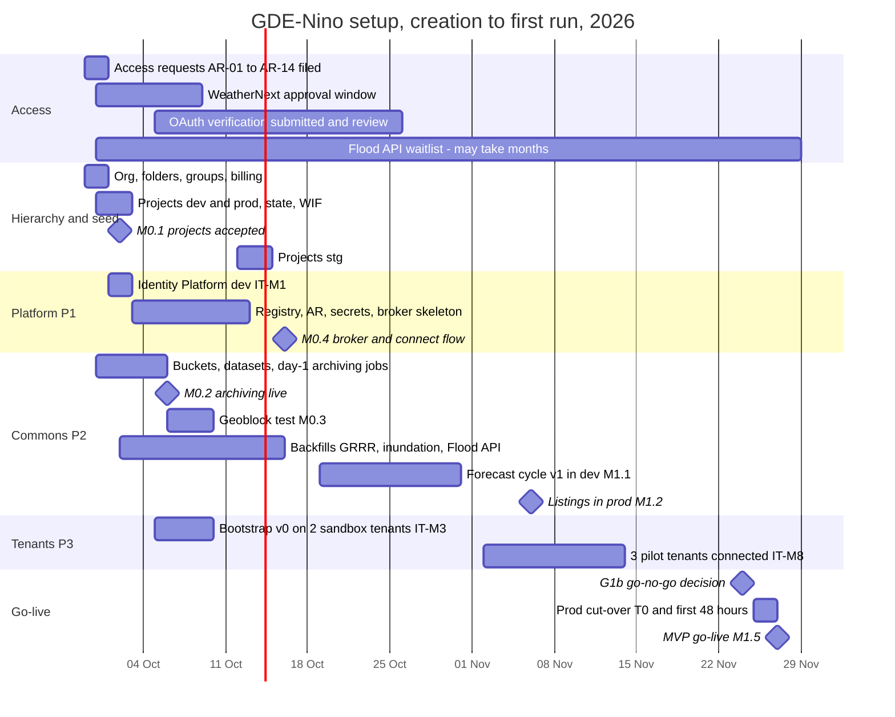
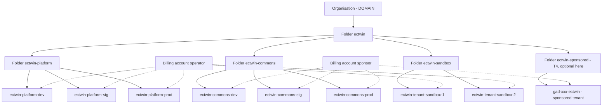
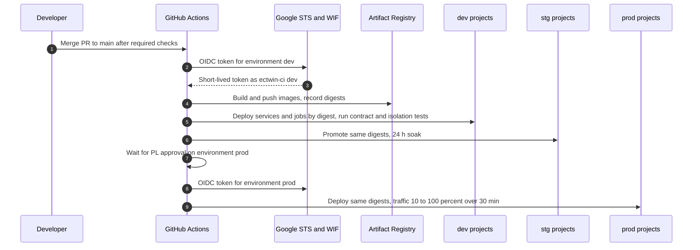
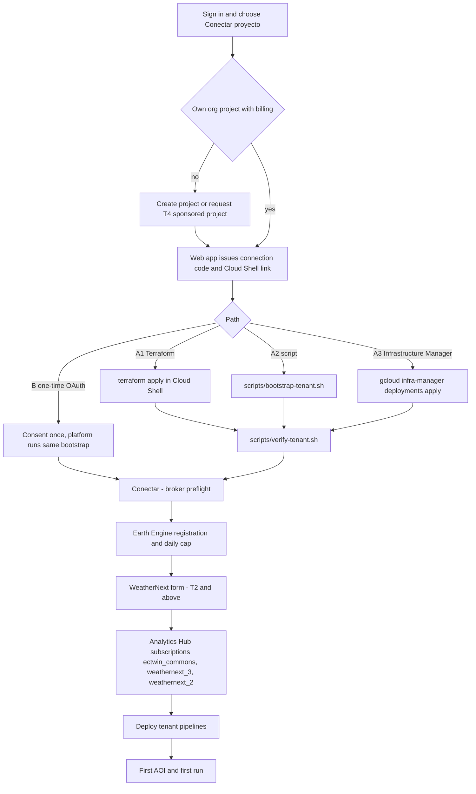

# Setup and deployment guide (creation → first run)

This guide takes *Gemelo Digital Ecuador – El Niño* (GDE-Niño) from an empty Google Cloud organisation to the first production forecast cycle and the first tenant run. It is written for the people who do the work: the platform lead (PL) and data lead (DL) who create the operator's projects, the SRE who runs CI/CD, and the tenant administrator (TA) of a *GAD*, ministry, *COE*, university or insurer who connects their own Google Cloud project. It does not re-explain the design. Component names, buckets, datasets, tables, collections and API routes come from [03-architecture.md](./03-architecture.md); identity and connection paths A–D from [04-identity-tenancy-byo-gcp.md](./04-identity-tenancy-byo-gcp.md); sources and backfills from [05-data-catalog.md](./05-data-catalog.md); day-to-day operations after go-live from [11-operations-runbook.md](./11-operations-runbook.md). The tenant bootstrap itself has its own operating manual, [infra/tenant-bootstrap/README.md](../infra/tenant-bootstrap/README.md), which this guide links to instead of repeating. Everything here is ordered so that a step never waits on something that has not been created yet, and every stage ends with acceptance checks tied to the milestones in [03 §13](./03-architecture.md#13-architecture-milestones-and-acceptance-criteria) and [12-roadmap-team-budget.md](./12-roadmap-team-budget.md).

## Contents

0. [Conventions, placeholders and new names](#0-conventions-placeholders-and-new-names)
1. [Prerequisites](#1-prerequisites)
2. [Day-1 access-request checklist](#2-day-1-access-request-checklist)
3. [Resource hierarchy and project creation](#3-resource-hierarchy-and-project-creation)
4. [Platform control-plane bootstrap (P1)](#4-platform-control-plane-bootstrap-p1)
5. [Commons bootstrap (P2)](#5-commons-bootstrap-p2)
6. [Tenant onboarding walkthrough (P3)](#6-tenant-onboarding-walkthrough-p3)
7. [Smoke tests and acceptance checks](#7-smoke-tests-and-acceptance-checks)
8. [The first 48 hours](#8-the-first-48-hours)
9. [Upgrades, rotation and teardown](#9-upgrades-rotation-and-teardown)
10. [Monorepo layout and conventions](#10-monorepo-layout-and-conventions)
11. [Troubleshooting](#11-troubleshooting)
12. [Open questions](#12-open-questions)

---

## 0. Conventions, placeholders and new names

### 0.1 How to read the commands

- **Shell.** Commands are bash for Cloud Shell (or any shell with `gcloud`, `bq`, `terraform`, `python3`, `curl` and `jq`). They are written to be **idempotent**: re-running a step either converges or fails harmlessly with "already exists".
- **`# verify flag`** marks a flag, subcommand or request field that the research briefs did not confirm. Run the command with `--help` (or read the API reference) before first use. Confirming every such flag in `-dev` is smoke test ST-00 (§7) and must be done by 2026-10-09, the same date as acceptance AC-01 of the tenant bootstrap.
- **(unverified)** means a fact not confirmed in the research briefs; **(to confirm)** means a value that must be agreed with a partner or decided by an owner.
- **Time.** All schedules are UTC. Mainland Ecuador time (ECT) is UTC−5; Galápagos is UTC−6.
- **Owners.** The codes of [03](./03-architecture.md) (PL, DL, FL, FE, AI, SRE, DPO, TA, PM), plus PT (partnerships lead) and COM (communications lead) from [12](./12-roadmap-team-budget.md) and [11](./11-operations-runbook.md).
- **Money.** List prices in USD, without the 15% IVA or ISD (2.5–5%, **to confirm with SRI**); see [09-cost-model.md](./09-cost-model.md) and [13 §7](./13-governance-legal-risk.md).

### 0.2 Placeholders

| Placeholder | Meaning | Status |
|---|---|---|
| `<ORG_ID>` | Numeric id of the operator's Google Cloud organisation | To obtain on day 1 (§1.1) |
| `<DOMAIN>` | Operator domain; the app is `app.<DOMAIN>`, the API `api.<DOMAIN>` | **To confirm** (same open item as [03 §6.1](./03-architecture.md#61-conventions)) |
| `<BA_OPERATOR>` | Billing account that pays the control plane (`ectwin-platform-*`) | To obtain |
| `<BA_SPONSOR>` | Billing account that pays the Commons plane (`ectwin-commons-*`) and, optionally, the T4 folder | **To confirm** with the sponsor ([12 §5.6](./12-roadmap-team-budget.md)) |
| `<GH_ORG>` | GitHub organisation that hosts the public repository | **To confirm** |
| `<REPO_URL>` | Public HTTPS URL of this repository, used by *Abrir en Cloud Shell* | **To confirm** ([README §6.1](../infra/tenant-bootstrap/README.md#61-path-a1-cloud-shell-and-terraform-recommended-for-it-teams)) |
| `<TENANT_PROJECT>` | A tenant's own project | Example `gad-portoviejo-ectwin` (illustrative) |
| `<TID>` | Registry tenant id (random 12 characters, never the project id, [03 §5.5](./03-architecture.md#55-firestore--platform-registry-ectwin-platform-prod-southamerica-west1)) | Issued by `POST /v1/tenants` |
| `<DIGEST>` | Container image digest (`sha256:…`) produced by CI | Per release |
| `<ENV>` | `dev`, `stg` or `prod` | — |

### 0.3 Names introduced in this guide

These are proposals that extend [03](./03-architecture.md). They follow the spine's `ectwin` prefix. PL confirms them by 2026-10-02 (M0.1); afterwards they are frozen like the names in 03.

| Name | Type | Purpose | Section |
|---|---|---|---|
| Folders `ectwin`, `ectwin-platform`, `ectwin-commons`, `ectwin-sandbox`, `ectwin-sponsored` | Resource Manager folders | Hierarchy for policies, budgets and IAM | §3 |
| `ectwin-tenant-sandbox-1`, `ectwin-tenant-sandbox-2` | Projects | Internal test tenants (already named in [README AC-01](../infra/tenant-bootstrap/README.md#13-testing-and-acceptance-criteria)) | §3, §7 |
| `ectwin-admins@`, `ectwin-sre@`, `ectwin-data@`, `ectwin-finance@<DOMAIN>` | Google groups | Operator access; no individual bindings on projects | §1.1 |
| `ectwin-tenants@`, `ectwin-tenants-nc@<DOMAIN>` | Google groups | Subscriber grants on Commons listings and topics (proposed in [04 §15](./04-identity-tenancy-byo-gcp.md#15-open-questions)) | §5.6 |
| `wn-commons@<DOMAIN>` | Role-based Google account | The account that files the WeatherNext form and subscribes the Commons projects, because approval is per account | §1.6, §2 |
| `ectwin-platform-<ENV>-tfstate` | GCS bucket, versioned | Terraform state per environment; the prod name matches component 9 of [03 §3](./03-architecture.md#3-component-inventory) | §3.5 |
| `ectwin-tf@ectwin-platform-<ENV>` | Service account | Terraform apply from CI (protected environments only) | §3.5 |
| `ectwin-ci@ectwin-platform-<ENV>` | Service account | Build, push and deploy images by digest | §3.5 |
| Workload identity pool `github`, provider `weathernext-repo` | WIF | Keyless GitHub Actions authentication | §4.11 |
| `ectwin-notifier@`, `ectwin-idhooks@ectwin-platform-<ENV>` | Service accounts | Notifier runtime (see open question on identity), Identity Platform blocking functions | §4.8 |
| `ectwin-forecast@`, `ectwin-publish@`, `ectwin-scheduler@`, `ectwin-jev@`, `ectwin-relay@ectwin-commons-<ENV>` | Service accounts | Commons forecast cycle and Batch; publishing; Scheduler and Workflows caller; national Jev triage; partner-relay writer. `ectwin-ingest@` already exists in [05 §4.3](./05-data-catalog.md#43-getting-around-geoblocking) | §5.2 |
| `ops-budget` | Pub/Sub topic (name from [09 §9.3](./09-cost-model.md)); this guide places it in `ectwin-platform-prod` **(placement to confirm with 09's `infra/commons/budget.tf`)** | Budget notifications of all central projects | §3.6 |
| `oauth-client-secret`, `email-provider-key` | Secrets in platform projects | OAuth web client secret; email delivery provider key | §4.7 |
| `cds-api-token`, `copernicusmarine-credentials`, `earthdata-credentials` | Secrets in Commons projects | External data-store credentials (Flood API and TypeSafe keys reuse the names `floodforecasting-api-key`, `typesafe-api-key`) | §5.8 |
| `infra/commons/jobs.yaml` | File | Single table of Commons jobs, schedules, regions and identities | §5.10 |
| `infra/tenant-bootstrap/TUTORIAL.es.md` | File | Spanish Cloud Shell tutorial: the `<TUTORIAL_MD>` placeholder of [04 §4.2](./04-identity-tenancy-byo-gcp.md#42-path-a--cloud-shell-or-infrastructure-manager-default) and README §6.1, which leave the file name open; this guide proposes the name | §4.9 |

### 0.4 Setup timeline

Dates follow the Phase 0 and Phase 1 plans in [12 §2.1–§2.2](./12-roadmap-team-budget.md) and the milestones of [03 §13](./03-architecture.md#13-architecture-milestones-and-acceptance-criteria). El Niño is active, so the access requests (§2) go out before any infrastructure exists.



---

## 1. Prerequisites

### 1.1 Organisation, folders and groups

The operator needs a Google Cloud **organisation** (Cloud Identity or Workspace on `<DOMAIN>`) so that projects, policies and billing survive staff turnover. Personal accounts must not own any `ectwin-*` project.

1. **Organisation.** Verify `<DOMAIN>` in Cloud Identity (free edition is enough **(to confirm)**), then read the id:
   ```bash
   gcloud organizations list --format='table(displayName,name)'
   ORG_ID="<ORG_ID>"   # digits after "organizations/"
   ```
2. **Groups.** Create the four operator groups of §0.3 in the Admin console. Grant roles to groups only, never to individuals.

   | Group | Members | Roles (summary) |
   |---|---|---|
   | `ectwin-admins@` | PL, SRE lead (2–3 people) | Folder admin on `ectwin`; break-glass per [11 §11.2](./11-operations-runbook.md) |
   | `ectwin-sre@` | On-call engineers | Viewer, Logging/Monitoring editor, Cloud Run developer in `-prod` |
   | `ectwin-data@` | DL, FL, data engineers | BigQuery and Storage admin in `ectwin-commons-*`; Cloud Run developer in `ectwin-commons-*` (backfills run `gcloud run jobs execute` with overrides, which needs more than `run.invoker` **(exact permission to confirm)**); viewer in platform |
   | `ectwin-finance@` | PM, finance officer | Billing account costs manager and budget viewer |

3. **Org admins.** At least two people hold Organization Administrator; both enrol a hardware security key or TOTP.
4. **Policy owner.** The DPO signs off the org-policy set in §3.3 before any tenant connects (M0.4).

### 1.2 Billing accounts, budgets and taxes

| Billing account | Pays for | Anchor ([09](./09-cost-model.md)) | Who administers |
|---|---|---|---|
| `<BA_OPERATOR>` | `ectwin-platform-{dev,stg,prod}`, sandbox tenants | prod ≈US$5–25/month at the Nov 2026 pilot, ≈US$23–43 in a season month ([09 §4.2.1](./09-cost-model.md)); budget US$45 | PM + `ectwin-finance@` |
| `<BA_SPONSOR>` | `ectwin-commons-{dev,stg,prod}` | ≈US$100–300/month in prod | Sponsor finance, with PM as Costs Manager |
| Sponsor T4 account (optional) | Projects in `ectwin-sponsored` for *GADs*/*COEs* that cannot procure quickly (FR-010) | ≈US$0–14 (T1) to 20–60 (T2) per project | Sponsor |

- **Currency.** USD (Ecuador is dollarised). A budget amount must use the billing account's currency ([README §5](../infra/tenant-bootstrap/README.md#5-inputs-and-tier-profiles)).
- **Free tiers are per billing account.** Keeping Commons on its own billing account gives it its own BigQuery 1 TiB/month, Cloud Run 240,000 job vCPU-s and 3 free Scheduler jobs ([BigQuery pricing](https://cloud.google.com/bigquery/pricing); [Cloud Run pricing](https://cloud.google.com/run/pricing); [Scheduler pricing](https://cloud.google.com/scheduler/pricing)).
- **Taxes and payment route.** A card-paid account adds 15% IVA and possibly ISD; public entities should buy through a local reseller that issues a *factura electrónica* ([13 §7](./13-governance-legal-risk.md)). The contracting entity for an Ecuadorian billing address is Google LLC (USA) ([google-entity](https://cloud.google.com/terms/google-entity)).
- **Billing export (FIN-01, by 2026-10-02, owner PL).** The export is configured per billing account. As in [09 §9.2](./09-cost-model.md) and [11 RB-18](./11-operations-runbook.md), create dataset `billing` (location `US`) in `ectwin-platform-prod` for `<BA_OPERATOR>` and in `ectwin-commons-prod` for `<BA_SPONSOR>`, then enable the standard and detailed usage-cost export into it (console step: *Billing → Billing export*; API or Terraform support, table name pattern `gcp_billing_export_v1_<BILLING_ACCOUNT_ID>` and export cost **to confirm**). It feeds the cost dashboard DB-05 and the cost-anomaly runbook RB-18.

### 1.3 Domains, DNS, email and legal pages

| Item | Value | Needed by | Owner |
|---|---|---|---|
| App host | `app.<DOMAIN>` (Firebase Hosting custom domain) | M1.3 (2026-11-13) | FE |
| API host | `api.<DOMAIN>` (Hosting rewrite to Cloud Run, or Cloud Run domain mapping — decide by 2026-10-09, §4.10) | M0.4 (2026-10-16) | PL |
| Dev and staging | `app.dev.<DOMAIN>`, `api.dev.<DOMAIN>`, `app.stg.<DOMAIN>`, `api.stg.<DOMAIN>` | As above | PL |
| Domain ownership proof | Verified in Google Search Console for the OAuth consent screen's authorised domain **(exact requirement to confirm)** | Before OAuth verification submission, 2026-10-05 | PL |
| Email sender | `no-reply@<DOMAIN>` with SPF and DKIM for Identity Platform templates and the notifier **(to confirm)** | 2026-10-09 | PL |
| Legal pages | `https://app.<DOMAIN>/legal/privacidad`, `https://app.<DOMAIN>/legal/terminos` (Spanish and English), text from [13 §1.4 and §12.3](./13-governance-legal-risk.md) | OAuth submission, 2026-10-05 | DPO |
| Status page | Hosted outside the app stack (NFR-009) | OPS-M0, 2026-10-09 | SRE |

### 1.4 GitHub

1. Create the public repository `<GH_ORG>/weathernext` (Apache-2.0, D20) and push this plan. Public visibility lets the *Abrir en Cloud Shell* link clone without credentials ([README §6.1](../infra/tenant-bootstrap/README.md#61-path-a1-cloud-shell-and-terraform-recommended-for-it-teams)); whether the link works with private repositories is **unverified**, and the open-source decision (D20) makes it moot.
2. **Branch protection on `main`:** pull requests only, 1 approving review (2 for `infra/` and `schemas/`), required status checks from §4.11, linear history, no force pushes.
3. **`CODEOWNERS`** (§10.3) so that infra changes need PL and method changes need FL.
4. **Environments** `dev`, `stg`, `prod`. `prod` requires approval by PL or SRE lead and deploys only from `main`.
5. **Security:** secret scanning with push protection, Dependabot for Python/npm/Actions, and CodeQL **(availability for public repositories to confirm)**.
6. **No long-lived cloud credentials in GitHub.** Authentication is Workload Identity Federation only (§4.11). A repository secret containing a service-account key is a P1 security incident (OPS-A18, [11 §11](./11-operations-runbook.md)): revoke the key, rotate, post-mortem.

### 1.5 Tools

| Tool | Version | Why | Notes |
|---|---|---|---|
| Google Cloud CLI (`gcloud`, `bq`, `gsutil` not needed) | Current Cloud Shell release | All commands | Flags marked `# verify flag` must be checked against it |
| Terraform | ≥ 1.6 | `infra/platform`, `infra/commons`, `infra/tenant-bootstrap` | The tenant module was validated with Terraform 1.16.4 and providers `hashicorp/google` / `google-beta` 8.5.0 and pins `>= 8.0, < 9.0` ([versions.tf](../infra/tenant-bootstrap/versions.tf)). Infrastructure Manager may run only older versions **(to confirm)** |
| Python | 3.12 | Broker, pipelines ([03 §9.1](./03-architecture.md#91-tech-stack)) | — |
| `xarray` + `zarr` + `gcsfs` | Current | GRRR and WeatherNext Zarr backfills | Anonymous reads with `storage_options={"token": "anon"}` |
| `xee` | 0.1.2 (2026-07-14) | Earth Engine as xarray | ([PyPI](https://pypi.org/pypi/xee/json)) |
| `earthengine-api` | Current | EE jobs | Never call `ee.Authenticate()` with default scopes: it requests `drive` ([04 §4.3.1](./04-identity-tenancy-byo-gcp.md#431-oauth-consent-screen-and-verification-plan-owner-pl-with-dpo)) |
| `cdsapi` | 0.7.7 (needs `ecmwf-datastores-client >= 0.4.0`) | C3S seasonal and GloFAS (EWDS) | ([PyPI](https://pypi.org/pypi/cdsapi/json)) |
| `copernicusmarine` toolbox | 2.5.0 | Sea-level anomaly | ([03 §9.1](./03-architecture.md#91-tech-stack)) |
| `typesafe-sdk` | 0.7.2 (Python ≥ 3.10) | Jev decision backend | JS SDK `@typesafe-ai/sdk` 0.6.0 needs Node ≥ 20 |
| Node.js | ≥ 20 | PWA build (Vite), Firebase CLI | — |
| Firebase CLI (`firebase-tools`) | Current | Hosting deploys, Firestore rules | Commands marked `# verify flag` |
| Docker with Buildx | Current | Local image builds (CI builds the release images) | — |
| `jq`, `shellcheck`, `tippecanoe`, `pmtiles` | Current | Scripts, tiles | `shellcheck -S style` is a CI gate for `scripts/` |

### 1.6 People and role-based accounts

- **Access approvals are per Google account or per project.** WeatherNext is allowlisted per Google account ([secondary source](https://github.com/chrimerss/NWP2StreamflowBench)); the Flood Forecasting API per GCP project ([Flood Hub access](https://support.google.com/flood-hub/answer/16364306?hl=en), search summary). Use **role-based institutional accounts**, not staff accounts, so access survives turnover ([12 §2.1 AR-01](./12-roadmap-team-budget.md)).
- Create `wn-commons@<DOMAIN>` (a Workspace or Cloud Identity user, with MFA and two custodians: FL and DL). It files the WeatherNext form for the Commons projects and performs the Commons Analytics Hub subscriptions (§5.5).
- Keep a **contacts register** (partner focal points, Google contacts `weathernext@google.com`, TypeSafe `sales@typesafe.ai`) in the programme board ([11 §1.4](./11-operations-runbook.md)).

### 1.7 Prerequisite checklist

| # | Check | Evidence | Owner | Due |
|---|---|---|---|---|
| PQ-01 | Organisation exists; `<ORG_ID>` recorded; two org admins with MFA | Screenshot of IAM at org level | PL | 2026-09-30 |
| PQ-02 | Groups created; no individual role bindings planned | Admin console export | PL | 2026-09-30 |
| PQ-03 | `<BA_OPERATOR>` open; `<BA_SPONSOR>` open or bridge account agreed | Billing console | PM | 2026-09-30 (bridge) / 2026-10-09 (sponsor, P0-03) |
| PQ-04 | `<DOMAIN>` chosen and verified | DNS TXT record, Search Console | PL | 2026-10-02 |
| PQ-05 | Public GitHub repository with protections and environments | Repository settings | PL | 2026-09-30 |
| PQ-06 | `wn-commons@<DOMAIN>` exists with MFA and two custodians | Admin console | FL | 2026-09-29 |
| PQ-07 | Tool versions confirmed in Cloud Shell | `terraform version`, `gcloud version` output archived | SRE | 2026-09-30 |

---

## 2. Day-1 access-request checklist

### 2.1 Checklist

The IDs AR-01–AR-11 are the same as the Phase 0 tracker in [12 §2.1](./12-roadmap-team-budget.md) (renamed from A1–A11 so they do not collide with the data-sharing agreements A1–A16 of [05 §6.1](./05-data-catalog.md)); AR-12–AR-14 are added here. File everything on **Tue 2026-09-29 or Wed 2026-09-30** unless a later date is shown. Tenants file their own per-tenant requests later (§6.7–§6.8); the national Commons products never wait for tenant approvals.

| ID | Access | Requesting identity / project | Where and how | Owner | Lead time | Fallback while pending | Due |
|---|---|---|---|---|---|---|---|
| AR-01 | **WeatherNext 2 and 3** (BigQuery listings, Earth Engine, GCS Zarr) | `wn-commons@<DOMAIN>` for `ectwin-commons-prod` and `ectwin-commons-dev`; one QA account for the platform | WeatherNext Data Request form (link found via a third-party repository: `https://docs.google.com/forms/d/e/1FAIpQLSeCf1JY8G78UDWzbm0ly9kJxfSjUIJT5WyMR_HiNqCm-IHIBg/viewform`, **confirm on the official WeatherNext pages**); accept the [terms of use](https://storage.googleapis.com/weathernext-public/terms-of-use.pdf); contact `weathernext@google.com` | FL | ≈5–7 business days (search summary) | ECMWF IFS/AIFS open data (`gs://ecmwf-open-data`, EE `ECMWF/NRT_FORECAST/IFS/OPER`), labelled "modelo de respaldo" ([06](./06-forecast-model-stack.md)) | 09-30 |
| AR-02 | WN2 on-demand runs on Gemini Enterprise Agent Platform (allowlist) and GPU quota | Commons (Phase 3 engine) | Allowlist enquiry via `weathernext@google.com`; GPU quota starts at 0 ([WN2 notebook](https://raw.githubusercontent.com/GoogleCloudPlatform/vertex-ai-samples/main/notebooks/community/weathernext/weathernext_2_dws.ipynb)) | FL | (unverified) | Phase 3 item; scenario library without WN2 re-runs | 09-30 |
| AR-03 | **Google Flood Forecasting API** | Project `ectwin-commons-prod` | [Waitlist form](http://sites.research.google/gr/floodforecasting/api-waitlist/); on approval **reply to the approval email with the project ID**, then enable the API (search summary of [Access & Set-up](https://support.google.com/flood-hub/answer/16364306?hl=en)) | DL | "Might take several months" | GloFAS 30-day (EWDS), GEOGloWS-INAMHI, GRRR baseline | 09-30 |
| AR-04 | **Earth Engine registration**; **Partner tier** application (100,000 EECU-h/month) | `ectwin-commons-prod`, `ectwin-commons-dev` (platform-prod optional, as in [12](./12-roadmap-team-budget.md)) | `https://code.earthengine.google.com/register?project=<ID>`; Partner application per [noncommercial tiers](https://developers.google.com/earth-engine/guides/noncommercial_tiers) | FL | Registration minutes; Partner "several weeks" | Register `ectwin-commons-prod` as Commercial – Limited (US$0.40/EECU-h, [EE pricing](https://cloud.google.com/earth-engine/pricing)) for operational production; file the Partner-tier application on day 1 and switch only if Google confirms in writing that it covers the use ([13 §3.4](./13-governance-legal-risk.md)); Contributor/Partner only for research/verification projects | 09-30 |
| AR-05 | **TypeSafe Jev** key; enterprise ZDR and higher limits enquiry | Commons | [console.typesafe.ai](https://console.typesafe.ai/) (keys under `/settings/keys`); `sales@typesafe.ai` | AI | Days (sign-ups were paused 2026-09-22 and reopened about a week later without the US$5 starter credit, per press; no free tier, no published SLA) | System One Adapter → Gemini, or open-weight Von backend (D17) | 09-30 |
| AR-06 | **Copernicus CDS and EWDS** accounts; accept licences for every dataset used | Commons | Token from `https://cds.climate.copernicus.eu/profile`; accept licences on each dataset page (`seasonal-monthly-single-levels`, `seasonal-original-single-levels`, `cems-glofas-forecast`, `cems-glofas-seasonal`, `cems-glofas-historical`, `cems-glofas-reforecast`) | DL | Same day | — (no alternative for C3S; NMME/CFSv2 cover part of the horizon) | 09-30 |
| AR-07 | **Copernicus Marine** account | Commons | Registration on the Copernicus Marine portal (**URL to confirm**); free account **(unverified)** | DL | Same day | EE copy `COPERNICUS/MARINE/GLOBAL_ANALYSISFORECAST_PHY_DAILY` | 09-30 |
| AR-08 | **NASA Earthdata** login | Commons | Earthdata registration page (**URL to confirm**) | DL | Same day | EE `NASA/GPM_L3/IMERG_V07`; LHASA inputs later | 09-30 |
| AR-09 | **OAuth sensitive-scope verification** (`cloud-platform`) for path B | `ectwin-platform-prod` OAuth client | Google Auth Platform console; plan in [04 §4.3.1](./04-identity-tenancy-byo-gcp.md#431-oauth-consent-screen-and-verification-plan-owner-pl-with-dpo) | PL, DPO | Days to weeks (unverified) | Path A (Cloud Shell) for all pilots | Configure 10-02; submit **10-05** |
| AR-10 | Google Cloud credits (research credits up to US$5,000 for university partners; startup or nonprofit routes where eligible) | University partners, operator | [Research credits](https://cloud.google.com/edu/researchers), [startup programme](https://cloud.google.com/startup) | PM | Weeks | None needed: no credits are assumed ([12 B10](./12-roadmap-team-budget.md)); credits obtained reduce [C1–C8](./12-roadmap-team-budget.md) | 10-02 |
| AR-11 | Quota increases ([11 §3.7](./11-operations-runbook.md)) | Commons, platform | Console quota requests | DL, FL, SRE | Days | Posture-based throttling | Per 11 §3.7 (first by 10-16) |
| AR-12 | **Google Maps Platform key** (optional, only for Photorealistic 3D Tiles) | **Tenant's own project**, never the platform | Tenant creates a browser key restricted to the Map Tiles API and the app referrer (§6.10). Price after 1,000 free root requests: US$6.00 per 1,000 (secondary source) | TA | Minutes | Self-hosted PMTiles basemap and CesiumJS with Copernicus DEM terrain (D19) | When a T3 tenant asks |
| AR-13 | Letters of intent and draft *convenios* (INAMHI, SNGR, INOCAR/CN-ERFEN, CELEC/CENACE, MSP, MAG; CEDIA for the relay) | Operator | Templates in [13 §5](./13-governance-legal-risk.md) | PT | Weeks to months | Public endpoints and the relay ladder ([05 §4.3](./05-data-catalog.md#43-getting-around-geoblocking)) | 10-02 (P0-02) |
| AR-14 | Domain verification for the OAuth consent screen (prerequisite of AR-09) | `<DOMAIN>` | Search Console domain property **(requirement to confirm)** | PL | 1–2 days | — | 10-02 |

### 2.2 How to file each request

**AR-01 WeatherNext.**
1. Sign in to the form as `wn-commons@<DOMAIN>`. Name the projects `ectwin-commons-prod` and `ectwin-commons-dev`, the use ("national El Niño decision support for Ecuador; publication of non-retrievable value-added products only") and the contact.
2. Save the submission receipt in the programme board (P0-01).
3. On approval: subscribe the listings in the Commons projects (§5.5). Until then the forecast cycle runs on the IFS fallback in `-dev` (M1.1 does not wait).
4. Ask `weathernext@google.com` in the same week the questions in [03 §14](./03-architecture.md#14-open-questions): whether sponsor-funded publication of parish probabilities to signed-in users fits the Non-Retrievable Value-Added clause, and the WN3 listing id.

**AR-03 Flood Forecasting API.**
1. File the waitlist for `ectwin-commons-prod`; mention national government partners (SNGR, INAMHI) and humanitarian use.
2. On approval, reply with the project ID, then run the commands in §5.8 (enable the API, create a restricted key, store it in `floodforecasting-api-key`).
3. First call: `gauges.searchGaugesByArea` with `{"regionCode": "EC", "includeNonQualityVerified": true, "includeGaugesWithoutHydroModel": true}` to measure real Ecuador coverage (verified versus `hybas_` virtual gauges); a 2023-era press report (search summary, [Primicias](https://www.primicias.ec/noticias/tecnologia/google-ecuador-mapa-inundaciones/)) mentions only four locations (Zapotal, Babahoyo, Daule, Pula), so the current count is unknown until this call (§5.11, backfill B3).

**AR-04 Earth Engine.**
```bash
for P in ectwin-commons-prod ectwin-commons-dev; do
  echo "Register: https://code.earthengine.google.com/register?project=$P"
done
# After registering (browser step), confirm the state; the field is output-only:
curl -sS -H "Authorization: Bearer $(gcloud auth print-access-token)" \
  -H "x-goog-user-project: ectwin-commons-prod" \
  "https://earthengine.googleapis.com/v1/projects/ectwin-commons-prod/config" | jq -r .registrationState
```
Register `ectwin-commons-prod` for commercial use on the Limited plan, because operational government use is commercial ([13 LP-07, §3.4](./13-governance-legal-risk.md)); file the Partner application the same day and switch only if Google confirms in writing that Partner covers the use. Noncommercial tiers (Contributor, Partner) are for research and verification projects only. Limited-plan usage is budgeted in [12 §5.2](./12-roadmap-team-budget.md), line C4.

**AR-05 TypeSafe.** Create the key in the console, store it immediately (§5.8) and never paste it into tickets. Pin `jev-1.13.0` in configuration ([08](./08-ai-decision-layer-jev.md)).

**AR-06 CDS/EWDS.** Put the token in `~/.cdsapirc` only for local tests; jobs read it from Secret Manager `cds-api-token`:
```text
url: https://cds.climate.copernicus.eu/api
key: <PERSONAL-ACCESS-TOKEN>
```
EWDS uses the same client with `cdsapi.Client(url="https://ewds.climate.copernicus.eu/api")`. Each dataset licence is accepted once, on its web page; an unaccepted licence makes requests fail (§11, TS-24).

**AR-07 Copernicus Marine and AR-08 Earthdata.** Register with a role account (`data@<DOMAIN>` or similar), store the credentials as JSON in `copernicusmarine-credentials` and `earthdata-credentials` (§5.8). Test Copernicus Marine with `copernicusmarine login` **# verify flag** and a one-day subset of the dataset id in [05 §2.3](./05-data-catalog.md#23-enso-and-ocean).

**AR-09 OAuth verification.** Follow §4.4. Until approval, path B is limited to test users and every pilot uses path A.

### 2.3 Tracking

- Each item is a card on the programme board with state *no solicitado / enviado / aprobado / rechazado*, the date, the account or project used and the evidence (the same states as the tenant access assistant, FR-011).
- PM reviews the board at the daily stand-up during Phase 0 and weekly afterwards; any item without movement after 7 business days gets a follow-up e-mail, and after 14 days an escalation through the sponsor or Google contacts.
- **Exit gate G0 (2026-10-16)** requires AR-01–AR-08 filed and at least one WeatherNext approval or the IFS fallback running ([12 §2.1](./12-roadmap-team-budget.md)).

---

## 3. Resource hierarchy and project creation

### 3.1 Target hierarchy



The T4 folder may instead live in the **sponsor's own organisation** so that the sponsor, not the operator, owns the *GAD* projects and can later move billing to the *GAD* (FR-010). Real tenants never sit under the operator's folders except as sponsored projects; everything else is in the tenant's organisation.

### 3.2 Folders, projects, billing and liens

Run as an org admin (member of `ectwin-admins@`). Project ids are global; if one is taken, stop and escalate to PL, because every document uses these ids.

```bash
ORG_ID="<ORG_ID>"; BA_OPERATOR="<BA_OPERATOR>"; BA_SPONSOR="<BA_SPONSOR>"

# Folders
F_ROOT=$(gcloud resource-manager folders create --display-name=ectwin --organization=$ORG_ID --format='value(name)')   # verify flag (output may be an operation; if so, read the id with folders list)
for f in ectwin-platform ectwin-commons ectwin-sandbox ectwin-sponsored; do
  gcloud resource-manager folders create --display-name=$f --folder=${F_ROOT#folders/}
done
F_PLATFORM=$(gcloud resource-manager folders list --folder=${F_ROOT#folders/} --filter='displayName=ectwin-platform' --format='value(name)')
F_COMMONS=$(gcloud resource-manager folders list --folder=${F_ROOT#folders/} --filter='displayName=ectwin-commons' --format='value(name)')
F_SANDBOX=$(gcloud resource-manager folders list --folder=${F_ROOT#folders/} --filter='displayName=ectwin-sandbox' --format='value(name)')

# Projects: dev and prod on day 2 (M0.1), stg by 2026-10-16
mkproj() { # PROJECT_ID FOLDER BILLING PLANE ENV
  gcloud projects describe "$1" >/dev/null 2>&1 || \
    gcloud projects create "$1" --folder="${2#folders/}" \
      --labels=app=ectwin,plane=$4,env=$5,cost-center=$4
  gcloud billing projects link "$1" --billing-account="$3"
}
for ENV in dev prod; do
  mkproj ectwin-platform-$ENV $F_PLATFORM $BA_OPERATOR platform $ENV
  mkproj ectwin-commons-$ENV  $F_COMMONS  $BA_SPONSOR  commons  $ENV
done
mkproj ectwin-tenant-sandbox-1 $F_SANDBOX $BA_OPERATOR tenant dev
mkproj ectwin-tenant-sandbox-2 $F_SANDBOX $BA_OPERATOR tenant dev

# Protect production projects against accidental deletion
for P in ectwin-platform-prod ectwin-commons-prod; do
  gcloud resource-manager liens create --project=$P \
    --restrictions=resourcemanager.projects.delete \
    --reason="GDE-Nino production - remove only with PM and PL approval"   # verify flag
done
```

If `gcloud billing projects link` fails with a quota error, the billing account has reached its limit of linked projects **(limit value unverified)**; request an increase from Cloud Billing support. This matters most for the T4 sponsored folder.

### 3.3 Organisation policies

Apply at the `ectwin` folder unless stated. `gcloud org-policies set-policy` takes one YAML file per constraint **# verify flag** (YAML shape as in [04 §4.4](./04-identity-tenancy-byo-gcp.md#44-path-c1--secure-by-default-organisations-and-the-admin-exception-note)). Only `iam.allowedPolicyMemberDomains` and the two key constraints appear in the research briefs (as defaults of secure-by-default organisations created on or after 2024-05-03); confirm the other constraint names with `gcloud org-policies list --folder=<FOLDER_ID>` **# verify flag** before applying.

| Constraint | Setting | Why | Exception |
|---|---|---|---|
| `iam.disableServiceAccountKeyCreation` | Enforce | AP-06: no keys anywhere | None |
| `iam.disableServiceAccountKeyUpload` | Enforce | Same | None |
| `storage.uniformBucketLevelAccess` | Enforce | IAM-only buckets | `ectwin-commons-prod` only if the fine-grained ACL option for the public bucket is chosen (decision by M1.2, §5.3) |
| `storage.publicAccessPrevention` | Enforce | No accidental public data | `ectwin-commons-{dev,stg,prod}` (static public tiles) and none elsewhere |
| `gcp.resourceLocations` | Allow `in:us-locations` and `in:southamerica-west1-locations` **# verify flag** (value-group names) | BigQuery `US`, GCS/Run `us-central1`, heavy `us-east1`, Firestore and ingestion `southamerica-west1` (D10) | Add `southamerica-east1` only if a tenant region profile needs it in a sponsored project |
| `iam.allowedPolicyMemberDomains` (domain-restricted sharing) | **Do not enforce** on `ectwin-commons` and `ectwin-platform`; enforcing it on `ectwin-sandbox` is harmless but does **not** rehearse path C1, because the dev and stg brokers belong to the same organisation. AC-09 (2026-11-27) needs a separate secure-by-default test organisation **(to arrange, PL)** | Commons grants external tenant runner accounts (listings, topics) and `allUsers` (public tiles); the platform grants `allUsers` read on the public image repository and needs public Cloud Run ingress | Compensating control: the daily `ops-iam-drift` job ([11 §2.1](./11-operations-runbook.md)) alerts on any external principal not on an allowlist. DPO decision **(to confirm)** |
| `compute.skipDefaultNetworkCreation` | Enforce | No default VPCs; Commons creates `ectwin-vpc` explicitly (§5.9) | — |

### 3.4 Baseline APIs

```bash
BASE="serviceusage.googleapis.com cloudresourcemanager.googleapis.com iam.googleapis.com \
 iamcredentials.googleapis.com sts.googleapis.com logging.googleapis.com monitoring.googleapis.com \
 cloudbilling.googleapis.com billingbudgets.googleapis.com secretmanager.googleapis.com \
 storage.googleapis.com artifactregistry.googleapis.com run.googleapis.com pubsub.googleapis.com \
 cloudscheduler.googleapis.com cloudquotas.googleapis.com"
PLATFORM_EXTRA="firestore.googleapis.com identitytoolkit.googleapis.com firebase.googleapis.com \
 firebasehosting.googleapis.com cloudfunctions.googleapis.com cloudbuild.googleapis.com cloudkms.googleapis.com \
 cloudidentity.googleapis.com"
COMMONS_EXTRA="bigquery.googleapis.com bigquerystorage.googleapis.com analyticshub.googleapis.com \
 bigquerydatatransfer.googleapis.com workflows.googleapis.com workflowexecutions.googleapis.com \
 batch.googleapis.com compute.googleapis.com \
 earthengine.googleapis.com aiplatform.googleapis.com dlp.googleapis.com storagetransfer.googleapis.com"
for ENV in dev prod; do
  gcloud services enable $BASE $PLATFORM_EXTRA --project=ectwin-platform-$ENV
  gcloud services enable $BASE $COMMONS_EXTRA  --project=ectwin-commons-$ENV
done
# floodforecasting.googleapis.com is enabled in ectwin-commons-prod only after AR-03 approval (§5.8).
```

The API names `identitytoolkit`, `firebasehosting`, `sts`, `storagetransfer`, `bigquerydatatransfer`, `workflowexecutions` (called by the forecast-cycle Scheduler job, §5.10) and `cloudidentity` (group membership changes by the onboarding service, §5.6) are **unverified in the briefs**; confirm with `gcloud services list --available --filter=<name>`. After this step Terraform takes over; it re-declares the same APIs with `disable_on_destroy = false`.

### 3.5 Seed: state buckets, deployment identities and CI trust

These resources must exist before Terraform can run, so a human creates them once per environment.

```bash
ENV=prod; P=ectwin-platform-$ENV; PN=$(gcloud projects describe $P --format='value(projectNumber)')

# 1. Terraform state bucket (versioned, private)
gcloud storage buckets create gs://$P-tfstate --project=$P --location=us-central1 \
  --uniform-bucket-level-access --public-access-prevention
gcloud storage buckets update gs://$P-tfstate --versioning

# 2. Deployment identities (no keys)
gcloud iam service-accounts create ectwin-tf --project=$P --display-name="GDE-Nino Terraform apply ($ENV)"
gcloud iam service-accounts create ectwin-ci --project=$P --display-name="GDE-Nino image build and deploy ($ENV)"
TF_SA=ectwin-tf@$P.iam.gserviceaccount.com; CI_SA=ectwin-ci@$P.iam.gserviceaccount.com

# 3. Terraform identity: owner-level on its own environment's platform and commons projects
#    (kept small by granting per project, and used only from the protected GitHub environment)
for TP in ectwin-platform-$ENV ectwin-commons-$ENV; do
  for R in roles/editor roles/resourcemanager.projectIamAdmin roles/iam.serviceAccountAdmin \
           roles/secretmanager.admin roles/firebase.admin; do
    gcloud projects add-iam-policy-binding $TP --member=serviceAccount:$TF_SA --role=$R --condition=None
  done
done
gcloud storage buckets add-iam-policy-binding gs://$P-tfstate --member=serviceAccount:$TF_SA --role=roles/storage.objectAdmin

# 4. CI identity: push images and roll out revisions only
gcloud projects add-iam-policy-binding $P --member=serviceAccount:$CI_SA --role=roles/run.developer --condition=None
gcloud projects add-iam-policy-binding $P --member=serviceAccount:$CI_SA --role=roles/firebasehosting.admin --condition=None
gcloud projects add-iam-policy-binding ectwin-commons-$ENV --member=serviceAccount:$CI_SA --role=roles/run.developer --condition=None
# Artifact Registry writer is granted on the single repository in ectwin-platform-prod (§4.6).
```

`roles/editor` is broad; it is acceptable here only because the identity is usable solely from the protected `prod` GitHub environment with a required reviewer (§4.11) and every apply is logged. Replace it with a custom role after M1.5 **(to confirm)**. `roles/editor` does not include the `setIamPolicy` permissions that Terraform needs for resource-level bindings (bucket, dataset, topic, listing, repository, service, pool), so the first `-dev` apply will probably also need `roles/storage.admin`, `roles/bigquery.admin`, `roles/pubsub.admin`, `roles/analyticshub.admin`, `roles/artifactregistry.admin`, `roles/run.admin` and `roles/iam.workloadIdentityPoolAdmin` **(minimal set to confirm from the permission errors of that apply; not in the research briefs)**. The WIF pool that lets GitHub impersonate these accounts is created in §4.11.

### 3.6 Central budgets

Budgets alert; they do not cap spend ([budgets](https://docs.cloud.google.com/billing/docs/how-to/budgets)). The amounts are those of [09 §9.3](./09-cost-model.md), which is authoritative; NFR-017 and alert OPS-A17 use the same envelopes (platform ≤US$45, Commons ≤US$300 plus delivery). A budget belongs to one billing account, so it can only filter projects linked to that account.

| Budget (billing account) | Projects | N0/N1 amount | N2/N3 amount | Thresholds |
|---|---|---|---|---|
| `ectwin-platform-prod` (`<BA_OPERATOR>`) | `ectwin-platform-prod` | US$45 (anchor ≈US$23–43) | US$100 (warm instance) | 50/90/100% actual, 100% forecast → `ops-budget` |
| `ectwin-nonprod-platform` (`<BA_OPERATOR>`) | `ectwin-platform-dev`, `-stg` | US$15 | US$15 | same |
| `ectwin-commons-prod` (`<BA_SPONSOR>`) | `ectwin-commons-prod` | US$450 (≤300 Commons + ≤150 delivery) | US$650 | same; at 100% pause Batch campaigns and backfills, never ingestion |
| `ectwin-nonprod-commons` (`<BA_SPONSOR>`) | `ectwin-commons-dev`, `-stg` | US$15 | US$15 | same |
| Tenant bootstrap (`<BA_OPERATOR>`) | `ectwin-tenant-sandbox-1`, `-2` | US$80 each (T2 profile, `--tier T2 --budget-usd 80`, [04 §8.2](./04-identity-tenancy-byo-gcp.md)): the two T2 QA tenants of [12 C6](./12-roadmap-team-budget.md) | same | Created by the tenant bootstrap itself |

The two non-prod budgets split the US$30 total of [09 §9.3](./09-cost-model.md) evenly between the two billing accounts (estimate).

```bash
gcloud pubsub topics create ops-budget --project=ectwin-platform-prod
mkbudget() { # DISPLAY_NAME BILLING_ACCOUNT AMOUNT PROJECT[,PROJECT...]
  gcloud billing budgets create --billing-account="$2" --display-name="$1" \
    --budget-amount="${3}USD" --filter-projects="$(sed 's#\([^,][^,]*\)#projects/\1#g' <<<"$4")" \
    --threshold-rule=percent=0.5 --threshold-rule=percent=0.9 --threshold-rule=percent=1.0 \
    --threshold-rule=percent=1.0,basis=forecasted-spend \
    --notifications-rule-pubsub-topic=projects/ectwin-platform-prod/topics/ops-budget \
    --billing-project=ectwin-platform-prod   # verify flag (all budget flags; quota project, TS-27)
}
mkbudget ectwin-platform-prod    "$BA_OPERATOR" 45  ectwin-platform-prod
# Non-prod: until the stg projects exist (§3.2, by 2026-10-16) pass the dev project only, then update the filter.
mkbudget ectwin-nonprod-platform "$BA_OPERATOR" 15  ectwin-platform-dev,ectwin-platform-stg
mkbudget ectwin-commons-prod     "$BA_SPONSOR"  450 ectwin-commons-prod
mkbudget ectwin-nonprod-commons  "$BA_SPONSOR"  15  ectwin-commons-dev,ectwin-commons-stg
```

After M0.1 the budgets move into Terraform (`infra/commons/budget.tf` in 09). Switching the two prod budgets to the N2/N3 amounts is a separate SRE step: `scripts/ops/posture.sh` ([11 §3.3](./11-operations-runbook.md)) does not change budgets, so SRE also applies the Terraform with `-var posture_high=true`, and `false` on return to N0/N1 ([09 §9.3](./09-cost-model.md)). The operator console subscribes to `ops-budget`; alert routing is in [11 §4.5](./11-operations-runbook.md). Also lower the Commons BigQuery `QueryUsagePerDay` quota to 2 TiB/day as a guard ([11 §3.7](./11-operations-runbook.md)) in *IAM & Admin → Quotas & System Limits*.

### 3.7 Acceptance for §3 (M0.1, due 2026-10-02, owner PL)

- `gcloud projects list --filter='labels.app=ectwin'` shows the four dev/prod projects and two sandboxes, each linked to the right billing account.
- Liens exist on both prod projects; org policies of §3.3 are effective (`gcloud org-policies describe <constraint> --project=<P> --effective`).
- Budgets exist and a test notification reaches `ops-budget` (publish a synthetic message and confirm the operator console receives it); the billing export datasets `billing` exist in both prod projects (FIN-01).
- `terraform plan` is clean on the four projects once §4 and §5 code exists ([03 §13 M0.1](./03-architecture.md#13-architecture-milestones-and-acceptance-criteria)).

---

## 4. Platform control-plane bootstrap (P1)

### 4.1 Terraform layout: `infra/platform/`

```text
infra/platform/
├── versions.tf          # terraform >= 1.6; google, google-beta >= 8.0, < 9.0 (same pins as tenant-bootstrap)
├── backend.tf           # backend "gcs" {} - bucket/prefix passed with -backend-config
├── providers.tf         # default_labels app=ectwin, plane=platform, env=<ENV>
├── variables.tf         # env, project_id, domain, image digests, oauth client id
├── envs/{dev,stg,prod}.tfvars
├── apis.tf              # google_project_service (disable_on_destroy = false)
├── iam.tf               # runtime SAs: ectwin-broker, ectwin-notifier, ectwin-idhooks; their roles
├── identity.tf          # Identity Platform config, Google IdP, TOTP (code in 04 §2.2)
├── firestore.tf         # registry (default) in southamerica-west1, delete protection, rules deployed by CI
├── artifact_registry.tf # docker repo "ectwin" in us-central1 (prod only), public read
├── secrets.tf           # oauth-client-secret, email-provider-key (no versions in Terraform)
├── run_api.tf           # ectwin-api Cloud Run service
├── run_notifier.tf      # ectwin-notifier Cloud Run service
├── hosting.tf           # Firebase Hosting sites app/api and custom domains
├── wif_github.tf        # pool "github", provider "weathernext-repo", SA bindings
├── kms.tf               # (Phase 2) ectwin-wif-signer key for path C2
├── monitoring.tf        # uptime checks, alert policies (11 §4.5), log exclusions
└── outputs.tf
```

Commands (the same for every environment):

```bash
ENV=dev
terraform -chdir=infra/platform init \
  -backend-config="bucket=ectwin-platform-$ENV-tfstate" -backend-config="prefix=platform"
terraform -chdir=infra/platform plan -var-file=envs/$ENV.tfvars -out=$ENV.tfplan
terraform -chdir=infra/platform apply $ENV.tfplan
```

Stateful resources (registry Firestore, state and backup buckets, Artifact Registry) carry `lifecycle { prevent_destroy = true }` in `prod`.

### 4.2 Order of operations

| Step | What | How | Depends on | Owner | Due (dev / prod) |
|---|---|---|---|---|---|
| 4.3 | Identity Platform (Google, email/password, TOTP) | Console enable + `identity.tf` | §3 | PL | 10-02 / 10-09 |
| 4.4 | OAuth consent (brand) and web client | Console (Google Auth Platform) | Domain (AR-14), legal pages | PL, DPO | 10-02 / submit 10-05 |
| 4.5 | Registry Firestore | `firestore.tf` + rules | §3 | PL | 10-05 / 10-09 |
| 4.6 | Artifact Registry `ectwin` | `artifact_registry.tf` (prod only) | §3 | PL | 10-02 |
| 4.7 | Secrets | `secrets.tf` + manual versions | 4.4 | PL | 10-05 / 10-09 |
| 4.8 | Runtime service accounts, broker grants | `iam.tf` | 4.5–4.7 | PL | 10-05 / 10-09 |
| 4.9 | `ectwin-api`, `ectwin-notifier` | CI deploy by digest | 4.6–4.8 | PL | 10-09 / 10-16 |
| 4.10 | Hosting and domains | `hosting.tf` + CI | 4.9 | FE | 10-09 / 11-13 |
| 4.11 | CI/CD with WIF | `wif_github.tf` + workflows | §3.5 | SRE | 10-02 |
| 4.13 | Monitoring baseline | `monitoring.tf` | 4.9 | SRE | 10-09 |

### 4.3 Identity Platform

1. **Blaze and Firebase.** Billing is already linked (§3.2), so the project is on the pay-as-you-go plan. Add Firebase to the project: `firebase projects:addfirebase ectwin-platform-$ENV` **# verify flag**. On the Spark plan Identity Platform would be capped at 3,000 DAU (secondary source), which is why billing comes first.
2. **Enable Identity Platform.** Console: *Identity Platform → Enable* **(or the Terraform resource `google_identity_platform_config` may initialise it; to confirm)**.
3. **Apply `identity.tf`.** The configuration is fixed in [04 §2.2](./04-identity-tenancy-byo-gcp.md#22-configuration): Google and email/password providers, no phone or anonymous sign-in, no duplicate emails, TOTP MFA with SMS disabled (SMS to Ecuador costs US$0.16 each after 10 per day, [pricing](https://cloud.google.com/identity-platform/pricing)), authorised domains `app.<DOMAIN>` (plus `localhost` in `dev` only).
4. **Spanish email templates** (verification, password reset, MFA enrolment) and sender `no-reply@<DOMAIN>`.
5. **Blocking functions** (`beforeUserCreated`, `beforeUserSignedIn`; code in [04 §2.5](./04-identity-tenancy-byo-gcp.md#25-blocking-functions)) deployed as Cloud Run functions running as `ectwin-idhooks@`, then registered in the Identity Platform settings.
6. **Test matrix** (IT-M1): Google sign-in, password sign-up plus verification, TOTP enrolment, recovery code, account linking, disabled user, revoked token on a sensitive route — all seven pass in `-dev` by 2026-10-02 and in `-stg` before 2026-10-16.

Cost: Tier 1 providers are free up to 50,000 MAU; SAML/OIDC (Tier 2, Phase 2) has 50 free MAU then US$0.015/MAU ([pricing](https://cloud.google.com/identity-platform/pricing)).

### 4.4 OAuth consent screen (brand) and web client

One OAuth web client per environment serves both Google sign-in and path B ([04 §4.3.1](./04-identity-tenancy-byo-gcp.md#431-oauth-consent-screen-and-verification-plan-owner-pl-with-dpo)). The consent screen cannot be fully managed by Terraform for external apps **(to confirm)**, so it is a documented console procedure:

1. *Google Auth Platform → Branding*: app name "GDE-Niño", support e-mail `soporte@<DOMAIN>`, logo, home page `https://app.<DOMAIN>`, privacy policy `https://app.<DOMAIN>/legal/privacidad` and terms `https://app.<DOMAIN>/legal/terminos` (§1.3), authorised domain `<DOMAIN>`.
2. *Audience*: **External**. In `dev` and `stg` stay in **Testing** permanently with named test users; in `prod` move to **In production** after verification.
3. *Data access*: `openid`, `email`, `profile` and `https://www.googleapis.com/auth/cloud-platform`. **Never** add `drive` (restricted scope; would require a security assessment).
4. *Clients → Create client → Web application* `ectwin-web-<ENV>` with authorised JavaScript origin `https://app.<DOMAIN>` and the Identity Platform redirect handler (commonly `https://<auth-domain>/__/auth/handler`) **# verify flag**.
5. Store the client secret:
   ```bash
   read -rs SECRET && printf %s "$SECRET" | \
     gcloud secrets versions add oauth-client-secret --data-file=- --project=ectwin-platform-$ENV
   ```
   Put the client id (not secret) in `envs/<ENV>.tfvars` as `google_oauth_client_id`.
6. **Verification (prod only).** Submit on **2026-10-05** with the scope justification ("provisionar recursos en el proyecto del usuario, una sola vez"), the demo video of consent plus bootstrap, and the legal pages. Until approval the unverified-app warning and a user cap apply (**unverified**: 100 users), so path B stays behind a feature flag and path A is offered to everyone.

### 4.5 Registry Firestore

```bash
gcloud firestore databases create --project=ectwin-platform-$ENV \
  --database='(default)' --location=southamerica-west1 --type=firestore-native \
  --delete-protection   # verify flag
```

- **Security rules** deny all client access ([03 §5.5](./03-architecture.md#55-firestore--platform-registry-ectwin-platform-prod-southamerica-west1)); only the broker service account reads and writes:
  ```text
  rules_version = '2';
  service cloud.firestore {
    match /databases/{database}/documents {
      match /{document=**} { allow read, write: if false; }
    }
  }
  ```
  Deploy with `firebase deploy --only firestore:rules --project ectwin-platform-$ENV` **# verify flag**.
- **Collections** `tenants`, `memberships`, `invites`, later `wif_issuers`, with the fields in [03 §5.5](./03-architecture.md#55-firestore--platform-registry-ectwin-platform-prod-southamerica-west1). The broker creates them on first write; JSON Schemas live in `schemas/firestore/`.
- **Backups.** Daily export to `gs://ectwin-platform-prod-backup` (bucket proposed in [11 §0](./11-operations-runbook.md)) by a scheduled job:
  ```bash
  gcloud firestore export gs://ectwin-platform-prod-backup/registry/$(date -u +%Y%m%d) --project=ectwin-platform-prod
  ```
  Restore is rehearsed into `ectwin-platform-stg` before M1.4 (2026-11-20).

### 4.6 Artifact Registry

A single Docker repository in `ectwin-platform-prod` serves all environments and all tenants; images are always referenced **by digest** (`us-central1-docker.pkg.dev/ectwin-platform-prod/ectwin/<image>@sha256:<DIGEST>`, [03 §4.4](./03-architecture.md#44-scheduled-tenant-pipeline)).

```bash
P=ectwin-platform-prod
gcloud artifacts repositories create ectwin --project=$P --location=us-central1 \
  --repository-format=docker --description="GDE-Nino public images (Apache-2.0)"
# Public read (D20): tenants and self-deployers pull without credentials
gcloud artifacts repositories add-iam-policy-binding ectwin --project=$P --location=us-central1 \
  --member=allUsers --role=roles/artifactregistry.reader
for ENV in dev stg prod; do
  gcloud artifacts repositories add-iam-policy-binding ectwin --project=$P --location=us-central1 \
    --member=serviceAccount:ectwin-ci@ectwin-platform-$ENV.iam.gserviceaccount.com --role=roles/artifactregistry.writer
done
```

Images: `api`, `notifier`, `ingest`, `forecast`, `publish`, `aoi-pipeline`, `notify-eval`, `sync`, `decision`, `von-cpu` (open-weight Jev fallback, [08 §5.7](./08-ai-decision-layer-jev.md)), `agri` (M5 module, [07 §6.6](./07-impact-modules-and-triggers.md)), `sfincs` (source-built, GPL-3.0, [03 §7.6](./03-architecture.md#76-heavy-runs-on-batch-spot-sfincs-library-example)), `titiler` (optional). Add a cleanup policy that applies to every image above, including `von-cpu` and `agri`, and keeps the last 20 untagged digests per image plus every digest referenced by a release tag **(policy syntax to confirm)**. Storage is free to 0.5 GB then US$0.10/GiB-month ([pricing](https://cloud.google.com/artifact-registry/pricing)).

### 4.7 Secret Manager

| Secret | Project | Consumer | Rotation |
|---|---|---|---|
| `oauth-client-secret` | platform-`<ENV>` | `ectwin-api` (path B code exchange), Identity Platform Google IdP config | On compromise; yearly review |
| `email-provider-key` | platform-`<ENV>` | `ectwin-notifier` | Provider policy; provider **to select** |
| `floodforecasting-api-key`, `typesafe-api-key`, `cds-api-token`, `copernicusmarine-credentials`, `earthdata-credentials` | commons-`<ENV>` | Ingest and triage jobs (§5.8) | [11 §11.3](./11-operations-runbook.md) |

Terraform creates the secret containers without versions; humans add versions with the `read -rs … | gcloud secrets versions add …` pattern so that values never enter Terraform state. Cost: 6 active versions free, then US$0.06 per version-month ([pricing](https://cloud.google.com/secret-manager/pricing)); disable old versions after rotation.

### 4.8 Runtime service accounts and the broker

| Service account | Runs | Roles (resource-scoped where possible) |
|---|---|---|
| `ectwin-broker@ectwin-platform-prod.iam.gserviceaccount.com` | `ectwin-api` (and, proposed, `ectwin-notifier`, see below) | `roles/datastore.user` on platform-prod (registry); `roles/logging.logWriter`, `roles/monitoring.metricWriter`, `roles/cloudtrace.agent`; `roles/secretmanager.secretAccessor` on `oauth-client-secret` and, while it also runs the notifier, on `email-provider-key`; `roles/iam.serviceAccountTokenCreator` **on itself** (so it can `signBlob` V4 signed URLs); `roles/storage.objectViewer` on the Commons bucket that holds private forecast objects (`ectwin-commons-prod-public` or `-products`, §5.3); Manager of the groups `ectwin-tenants@` and `ectwin-tenants-nc@` so the onboarding service can add runner accounts at `:connect` (§5.6; mechanism and API role **to confirm**, fallback per-principal grants). **No role in any tenant project**: tenants grant it Token Creator on their `ectwin-runner` only ([README §3](../infra/tenant-bootstrap/README.md#3-permission-model)). |
| `ectwin-notifier@ectwin-platform-<ENV>` | Reserved | `roles/secretmanager.secretAccessor` on `email-provider-key`; `roles/datastore.user` |
| `ectwin-idhooks@ectwin-platform-<ENV>` | Blocking functions | `roles/logging.logWriter` only |

```bash
P=ectwin-platform-prod; B=ectwin-broker@$P.iam.gserviceaccount.com
gcloud iam service-accounts create ectwin-broker --project=$P --display-name="GDE-Nino broker (tenant impersonation)"
for R in roles/datastore.user roles/logging.logWriter roles/monitoring.metricWriter roles/cloudtrace.agent; do
  gcloud projects add-iam-policy-binding $P --member=serviceAccount:$B --role=$R --condition=None
done
gcloud iam service-accounts add-iam-policy-binding $B --project=$P \
  --member=serviceAccount:$B --role=roles/iam.serviceAccountTokenCreator      # signBlob on itself
for S in oauth-client-secret email-provider-key; do   # secret containers from secrets.tf (§4.7)
  gcloud secrets add-iam-policy-binding $S --project=$P \
    --member=serviceAccount:$B --role=roles/secretmanager.secretAccessor
done
# After §5.3 creates the private products bucket (signed URLs for forecast tiles, JSON, PDFs):
gcloud storage buckets add-iam-policy-binding gs://ectwin-commons-prod-products \
  --member=serviceAccount:$B --role=roles/storage.objectViewer
```

**Notifier identity (decision needed by M0.4).** [03 §4.5](./03-architecture.md#45-notification-flow) has the notifier read the user's Web Push endpoint and e-mail from tenant Firestore at send time. Tenants grant Token Creator to `ectwin-broker` only, so a notifier running under its own account could not do that without a second tenant grant. This guide therefore deploys `ectwin-notifier` **under `ectwin-broker@`** (one identity, two services), and keeps `ectwin-notifier@` reserved in case PL prefers the notifier to call an internal broker route instead. Both options keep the single tenant grant.

**Environment note.** Real tenants trust **only** `ectwin-broker@ectwin-platform-prod`. The dev and stg brokers can only reach the sandbox tenants: `ectwin-tenant-sandbox-1` passes `--platform-sa=ectwin-broker@ectwin-platform-dev.iam.gserviceaccount.com` (Terraform `platform_broker_sa`) to the bootstrap, and `ectwin-tenant-sandbox-2` passes the `-stg` broker once `ectwin-platform-stg` exists (it trusts the dev broker until then, because IT-M3 on 2026-10-09 precedes the stg projects). Every `verify-tenant.sh` and `--revoke-broker` run on a sandbox must pass the same `--platform-sa`; without it both scripts assume the prod broker, VT-08 fails and the revoke finds no binding.

### 4.9 Cloud Run services: `ectwin-api` (broker and onboarding) and `ectwin-notifier`

Both are request-billed services with min-instances 0 ([03 §3](./03-architecture.md#3-component-inventory), components 3, 4 and 6). They authenticate callers themselves (Identity Platform ID tokens; OIDC tokens from tenant runners on `/internal/notify`), so Cloud Run's IAM invoker check must be off for them.

```bash
ENV=prod; P=ectwin-platform-$ENV; R=us-central1; B=ectwin-broker@ectwin-platform-prod.iam.gserviceaccount.com
IMG=us-central1-docker.pkg.dev/ectwin-platform-prod/ectwin
gcloud run deploy ectwin-api --project=$P --region=$R --image=$IMG/api@sha256:<DIGEST> \
  --service-account=$B --min-instances=0 --max-instances=20 --concurrency=80 \
  --cpu=1 --memory=1Gi --timeout=60s --no-invoker-iam-check \
  --set-env-vars=ECTWIN_ENV=$ENV,ECTWIN_REGISTRY_PROJECT=$P,ECTWIN_COMMONS_PROJECT=ectwin-commons-$ENV,ECTWIN_RUNNER_TOKEN_LIFETIME_S=900,ECTWIN_MAX_BYTES_BILLED_GIB=50,ECTWIN_APP_ORIGIN=https://app.<DOMAIN> \
  --set-secrets=OAUTH_CLIENT_SECRET=oauth-client-secret:latest
# --no-invoker-iam-check: verify flag. The alternative (--allow-unauthenticated) needs an allUsers binding,
# which domain-restricted sharing would refuse (§3.3).

gcloud run deploy ectwin-notifier --project=$P --region=$R --image=$IMG/notifier@sha256:<DIGEST> \
  --service-account=$B --min-instances=0 --max-instances=5 --concurrency=40 \
  --cpu=1 --memory=512Mi --timeout=30s --no-invoker-iam-check \
  --set-env-vars=ECTWIN_ENV=$ENV,ECTWIN_REGISTRY_PROJECT=$P \
  --set-secrets=EMAIL_PROVIDER_KEY=email-provider-key:latest
```

- **Postures** change the limits with `scripts/ops/posture.sh`: N0 min 0 / max 20, N1 min 0 / max 50, N2–N3 min 1 / max 100 ([11 §3.3, §3.7](./11-operations-runbook.md)).
- **Onboarding routes** (`POST /v1/tenants`, `POST /v1/tenants/{tid}:connect`, `POST /v1/oauth/bootstrap`, `GET /v1/tenants/{tid}/status`, `POST /v1/tenants/{tid}:disconnect`) are part of `ectwin-api` ([03 §6.2](./03-architecture.md#62-endpoints)). The *Abrir en Cloud Shell* button they return uses the URL pattern `https://shell.cloud.google.com/cloudshell/editor?cloudshell_git_repo=<REPO_URL>&cloudshell_tutorial=infra/tenant-bootstrap/TUTORIAL.es.md` ([pattern example](https://github.com/GoogleCloudPlatform/bigquery-antipattern-recognition/blob/main/terraform/README.md)). Writing `TUTORIAL.es.md` (Spanish, ≤10 steps mirroring [README §6](../infra/tenant-bootstrap/README.md#6-running-the-bootstrap)) is task FE+PL, due 2026-10-09.
- **Readiness probe** `GET /readyz` checks registry access and a self `signBlob`; `GET /healthz` is liveness ([03 §6.2](./03-architecture.md#62-endpoints)).
- **Tenant schema step.** Preflight check PF-05 dry-runs `SELECT 1 FROM ectwin.run LIMIT 0` ([04 §4.7](./04-identity-tenancy-byo-gcp.md#47-preflight-checks-fr-009)), but the bootstrap creates only the datasets. The `:connect` route must therefore apply the tenant DDL from `schemas/bigquery/tenant/` (`CREATE TABLE IF NOT EXISTS …`, [03 §5.4](./03-architecture.md#54-tenant-table-schemas-ddl)) with the runner token **before** preflight; the runner's `dataEditor` on `ectwin` allows it. **(Proposal; confirm with PL by M0.4.)**

### 4.10 Hosting and domains

The PWA shell, the static STAC catalog (`/stac/catalog.json`) and the legal pages are served by Firebase Hosting ([03 §3](./03-architecture.md#3-component-inventory), component 1). Two Hosting sites per environment keep the app and API origins separate.

```bash
P=ectwin-platform-prod
firebase hosting:sites:create ectwin-app-prod --project $P   # verify flag (site ids are global; names to confirm)
firebase hosting:sites:create ectwin-api-prod --project $P   # verify flag
firebase target:apply hosting app ectwin-app-prod --project $P
firebase target:apply hosting api ectwin-api-prod --project $P
```

`firebase.json` (excerpt; rewrite syntax and CSP origins **to confirm** in `-dev`). The `api` site rewrites only the public route prefixes, so `/healthz` and `/readyz` stay off the public API domain as [03 §6.2](./03-architecture.md#62-endpoints) requires. The CSP must also allow the Identity Platform sign-in helpers (`<AUTH_DOMAIN>` is the Identity Platform auth domain, the same host as the OAuth redirect handler in §4.4); the exact origins Google sign-in needs are **unverified** in the briefs, so test the seven-case identity matrix (IT-M1) with the CSP switched on.

```json
{
  "hosting": [
    {
      "target": "app",
      "public": "apps/web/dist",
      "cleanUrls": true,
      "headers": [
        {"source": "**", "headers": [
          {"key": "Content-Security-Policy", "value": "default-src 'self'; script-src 'self' https://apis.google.com; frame-src https://<AUTH_DOMAIN>; connect-src 'self' https://api.<DOMAIN> https://storage.googleapis.com https://identitytoolkit.googleapis.com https://securetoken.googleapis.com; img-src 'self' data: blob:; worker-src 'self' blob:; frame-ancestors 'none'"},
          {"key": "Strict-Transport-Security", "value": "max-age=31536000; includeSubDomains"},
          {"key": "X-Content-Type-Options", "value": "nosniff"}]},
        {"source": "/assets/**", "headers": [{"key": "Cache-Control", "value": "public, max-age=31536000, immutable"}]}
      ],
      "rewrites": [{"source": "**", "destination": "/index.html"}]
    },
    {
      "target": "api",
      "public": "apps/api-shell",
      "rewrites": [
        {"source": "/internal/notify", "run": {"serviceId": "ectwin-notifier", "region": "us-central1"}},
        {"source": "/internal/budget", "run": {"serviceId": "ectwin-api", "region": "us-central1"}},
        {"source": "/v1/**", "run": {"serviceId": "ectwin-api", "region": "us-central1"}},
        {"source": "/t/**", "run": {"serviceId": "ectwin-api", "region": "us-central1"}}
      ]
    }
  ]
}
```

- Connect `app.<DOMAIN>` and `api.<DOMAIN>` as custom domains in the Hosting console; certificates provision automatically after DNS validation (can take hours; see TS-09).
- API responses must set `Cache-Control: private` (national JSON uses `private, max-age=300`, [03 §6.1](./03-architecture.md#61-conventions)) so the Hosting CDN never caches per-user content.
- **Decision by 2026-10-09 (PL):** keep the Hosting rewrite for `api.<DOMAIN>` (no load-balancer cost; request timeout limits **to confirm**) or use a Cloud Run domain mapping. The external Application Load Balancer (≈US$18.25/month, [network pricing](https://cloud.google.com/vpc/network-pricing)) arrives only with Cloud CDN and Cloud Armor when tile egress passes ≈1.5 TiB/month (break-even ≈1,526 GiB incl. request charges, [09 §4.2.3](./09-cost-model.md); final decision at M2.1 on 2026-12-15 with the measured object size and hit ratio).
- Deploy: `firebase deploy --only hosting:app,hosting:api --project ectwin-platform-prod` **# verify flag** (run by CI as `ectwin-ci@`).

### 4.11 CI/CD with Workload Identity Federation

**Trust set-up** (once per environment, in `wif_github.tf`; equivalent gcloud shown):

```bash
ENV=prod; P=ectwin-platform-$ENV; PN=$(gcloud projects describe $P --format='value(projectNumber)')
gcloud iam workload-identity-pools create github --project=$P --location=global \
  --display-name="GitHub Actions"
gcloud iam workload-identity-pools providers create-oidc weathernext-repo --project=$P --location=global \
  --workload-identity-pool=github --issuer-uri="https://token.actions.githubusercontent.com" \
  --attribute-mapping="google.subject=assertion.sub,attribute.repository=assertion.repository,attribute.ref=assertion.ref,attribute.environment=assertion.environment" \
  --attribute-condition="assertion.repository == '<GH_ORG>/weathernext'"          # verify flag (claim names)
POOL="principalSet://iam.googleapis.com/projects/$PN/locations/global/workloadIdentityPools/github"
# CI identity: any workflow of the repository running in this GitHub environment
gcloud iam service-accounts add-iam-policy-binding ectwin-ci@$P.iam.gserviceaccount.com --project=$P \
  --role=roles/iam.workloadIdentityUser --member="$POOL/attribute.environment/$ENV"
# Terraform identity: same environment (prod requires a reviewer in GitHub)
gcloud iam service-accounts add-iam-policy-binding ectwin-tf@$P.iam.gserviceaccount.com --project=$P \
  --role=roles/iam.workloadIdentityUser --member="$POOL/attribute.environment/$ENV"
# CI must be able to deploy services and jobs that run as the broker and the Commons runtime SAs.
# Run these bindings after iam.tf (§4.8) and infra/commons/iam.tf (§5.2) have created the accounts:
gcloud iam service-accounts add-iam-policy-binding ectwin-broker@$P.iam.gserviceaccount.com --project=$P \
  --role=roles/iam.serviceAccountUser --member=serviceAccount:ectwin-ci@$P.iam.gserviceaccount.com
for SA in ectwin-ingest ectwin-forecast ectwin-publish ectwin-jev; do
  gcloud iam service-accounts add-iam-policy-binding $SA@ectwin-commons-$ENV.iam.gserviceaccount.com \
    --project=ectwin-commons-$ENV --role=roles/iam.serviceAccountUser \
    --member=serviceAccount:ectwin-ci@$P.iam.gserviceaccount.com
done
```

**Pipeline** (the policy is in [11 §8.2](./11-operations-runbook.md); this is the mechanics):



**Required checks on every pull request** (all must pass before merge):

| Check | Command (in CI) | Covers |
|---|---|---|
| Terraform format and validation | `terraform fmt -check -recursive infra/` and `terraform -chdir=infra/<module> init -backend=false && terraform validate` | All modules |
| Tenant-bootstrap plan tests | `terraform -chdir=infra/tenant-bootstrap init -backend=false && terraform -chdir=infra/tenant-bootstrap test` (5 offline tests with mock providers, Terraform ≥1.7, [README §13](../infra/tenant-bootstrap/README.md#13-testing-and-acceptance-criteria)) | Tenant contract |
| Shell | `bash -n scripts/*.sh && shellcheck -S style scripts/*.sh` | Bootstrap and verify scripts |
| Python | `ruff check` and `pytest` for `libs/`, `services/`, `pipelines/` | Code |
| Vocabulary guard | `tests/vocabulary_guard` ([03 §8.5](./03-architecture.md#85-internationalisation-and-vocabulary-guard)) | D1 wording |
| Licence metadata | Schema check of `catalog/data-sources.yaml` (FR-019) | D15 |
| Decision schemas | JSON Schema validation of `schemas/decisions/*.json` | D16 |
| API contract | OpenAPI lint of `schemas/api/openapi.yaml` | §6 of 03 |
| Web bundle budget | ≤200 KB compressed first view ([03 §8.6](./03-architecture.md#86-bundle-budget-compressed-first-view)) | NFR-001 |
| Container scan | Vulnerability scan of built images **(tool to choose)** | NFR-011 |

A minimal deploy workflow (`.github/workflows/deploy.yml`, action versions **to confirm**):

```yaml
name: deploy
on:
  push:
    branches: [main]
permissions:
  contents: read
  id-token: write          # required for WIF
jobs:
  dev:
    runs-on: ubuntu-latest
    environment: dev
    steps:
      - uses: actions/checkout@v4
      - uses: google-github-actions/auth@v2
        with:
          workload_identity_provider: projects/<PN_DEV>/locations/global/workloadIdentityPools/github/providers/weathernext-repo
          service_account: ectwin-ci@ectwin-platform-dev.iam.gserviceaccount.com
      - uses: google-github-actions/setup-gcloud@v2
      - name: Build and push
        run: scripts/ci/build-push.sh > digests.env      # writes API_DIGEST=..., INGEST_DIGEST=...
      - name: Deploy dev
        run: scripts/ci/deploy.sh dev digests.env
      - uses: actions/upload-artifact@v4
        with: {name: digests, path: digests.env}
  stg:
    needs: dev
    runs-on: ubuntu-latest
    environment: stg          # the 24 h stg soak happens between this job and the prod approval
    steps:
      - uses: actions/checkout@v4
      - uses: actions/download-artifact@v4
        with: {name: digests}
      - uses: google-github-actions/auth@v2
        with:
          workload_identity_provider: projects/<PN_STG>/locations/global/workloadIdentityPools/github/providers/weathernext-repo
          service_account: ectwin-ci@ectwin-platform-stg.iam.gserviceaccount.com
      - uses: google-github-actions/setup-gcloud@v2
      - name: Deploy stg (same digests)
        run: scripts/ci/deploy.sh stg digests.env
  prod:
    needs: stg
    runs-on: ubuntu-latest
    environment: prod         # required reviewer: PL or SRE lead; change window Tue/Wed 14:00-18:00 UTC
    steps:
      - uses: actions/checkout@v4
      - uses: actions/download-artifact@v4
        with: {name: digests}
      - uses: google-github-actions/auth@v2
        with:
          workload_identity_provider: projects/<PN_PROD>/locations/global/workloadIdentityPools/github/providers/weathernext-repo
          service_account: ectwin-ci@ectwin-platform-prod.iam.gserviceaccount.com
      - uses: google-github-actions/setup-gcloud@v2
      - name: Deploy prod (same digests, 10 to 100 percent traffic over 30 min)
        run: scripts/ci/deploy.sh prod digests.env
```

`scripts/ci/` is to be written by SRE by 2026-10-09. Cloud Build is an acceptable alternative (2,500 free build-minutes per month; [09](./09-cost-model.md) line B12 already assumes it) if GitHub-hosted runners become a constraint.

### 4.12 Environment matrix (dev / stg / prod)

| Setting | dev | stg | prod |
|---|---|---|---|
| Projects | `ectwin-platform-dev`, `ectwin-commons-dev` | `ectwin-platform-stg`, `ectwin-commons-stg` | `ectwin-platform-prod`, `ectwin-commons-prod` |
| Domains | `app.dev.<DOMAIN>`, `api.dev.<DOMAIN>` | `app.stg.…`, `api.stg.…` | `app.<DOMAIN>`, `api.<DOMAIN>` |
| Identity Platform | Own config; OAuth client in Testing; test users only | Same as dev | Verified OAuth client (after AR-09) |
| Broker trusted by | `ectwin-tenant-sandbox-1` | `ectwin-tenant-sandbox-2` (after `-stg` exists; see §4.8) | Real tenants |
| WeatherNext | Commons-dev linked datasets (same `wn-commons@` approval **(to confirm that approval covers several projects)**) | Commons-stg linked datasets | Commons-prod linked datasets |
| Flood API | None (access is per project); tests use recorded fixtures | Same | `ectwin-commons-prod` key |
| Forecast cycle | 00Z only | All four cycles during soak windows; Scheduler paused otherwise | All four cycles (+ hourly interim in event mode) |
| Cloud Run `ectwin-api` | min 0, max 5 | min 0, max 10 | Per posture: N0 min 0 / max 20; N1 min 0 / max 50; N2–N3 min 1 / max 100 |
| Deploy trigger | Every merge to `main` | Promotion of the same digests after dev tests | Manual approval in a change window |
| Budgets (platform / Commons) | US$15 / US$15, shared by dev and stg | (shared with dev) | US$45 / US$450 at N0–N1; US$100 / US$650 at N2–N3 |
| Data | Synthetic and small real samples | Production-like schedules on stg data | Real |

### 4.13 Monitoring baseline

Create before the first external user (details, SLOs and alert policies in [11 §4](./11-operations-runbook.md)):

- Uptime checks on `https://app.<DOMAIN>/` and `https://api.<DOMAIN>/v1/national/summary?dpa=09` (authenticated probe from `ops-synthetic-probe`).
- Log-based metrics for broker `generateAccessToken` failures, 5xx rates and `maximumBytesBilled` refusals.
- Log exclusion for debug logs so each project stays under the 50 GiB/month free logging allotment (then US$0.50/GiB, [pricing](https://cloud.google.com/stackdriver/pricing)).
- Notification channels: the SRE pager and `ectwin-sre@`.

### 4.14 Acceptance for §4

| ID | Check | Due | Owner |
|---|---|---|---|
| IT-M1 | Seven-case identity matrix passes in `-dev` | 2026-10-02 | PL |
| IT-M2 | OAuth verification submitted; receipt archived | 2026-10-05 | PL, DPO |
| P4-01 | `ectwin-api` `/readyz` green in dev and prod (stg once it exists); min-instances 0 | 2026-10-16 | PL |
| P4-02 | No service-account keys in any `ectwin-*` project (`gcloud iam service-accounts keys list --managed-by=user` returns nothing for every SA) | 2026-10-16, then daily (`ops-iam-drift`) | SRE |
| P4-03 | A merge to `main` reaches dev automatically and prod only after approval, with identical digests in all three | 2026-10-16 | SRE |
| M0.4 | Broker skeleton, registry and connect flow; cross-tenant isolation suite passes | 2026-10-16 | PL |

---

## 5. Commons bootstrap (P2)

### 5.1 Terraform layout: `infra/commons/`

```text
infra/commons/
├── versions.tf, backend.tf, providers.tf, variables.tf, envs/{dev,stg,prod}.tfvars
├── apis.tf
├── iam.tf              # ectwin-ingest, -forecast, -publish, -scheduler, -jev, -relay and their grants
├── buckets.tf          # raw, curated, public (+ products), bulk (Requester Pays), scratch, archive-scl, raw-scl
├── bigquery.tf         # commons_staging, commons_internal, commons_pub, commons_pub_nc, commons_ops
├── analytics_hub.tf    # exchange ectwin_exchange, listings ectwin_commons_v1 and ectwin_commons_nc_v1, IAM
├── pubsub.tf           # commons-product-ready-v1, official-alerts-v1, ops-events; subscriber grants
├── secrets.tf          # containers only
├── network.tf          # ectwin-vpc: southamerica-west1 subnet + Cloud NAT static IP (ingest);
│                       # us-central1 and us-east1 subnets for Batch (NAT or Private Google Access: to confirm)
├── jobs.yaml           # one row per job: region, image, schedule, identity, secrets, egress
├── jobs.tf             # for_each over jobs.yaml -> module "run_job" (Cloud Run job + Scheduler)
├── workflows.tf        # forecast-cycle (pipelines/commons/forecast_cycle/workflow.yaml)
├── monitoring.tf
└── outputs.tf
infra/modules/{bucket,run-job,scheduler,listing}/   # shared modules (03 §9.2)
```

Init and apply exactly as §4.1, with `-chdir=infra/commons`, state bucket `ectwin-platform-<ENV>-tfstate` and prefix `commons`.

### 5.2 Service accounts

| Service account (`@ectwin-commons-<ENV>`) | Used by | Main grants |
|---|---|---|
| `ectwin-ingest` | All `ingest-*` jobs | `storage.objectCreator` on `raw` (create-only, `ifGenerationMatch=0`); `bigquery.dataEditor` on `commons_staging`; `bigquery.jobUser`; `secretAccessor` on the secrets it needs |
| `ectwin-forecast` | `forecast-cycle` steps, `fc-*` jobs, Batch | `bigquery.dataViewer` on `weathernext_2`/`weathernext_3` linked datasets; `bigquery.dataEditor` on `commons_internal`; `bigquery.jobUser`; `batch.jobsEditor`; `serviceusage.serviceUsageConsumer` (Requester-Pays WN3 reads); `earthengine.writer` |
| `ectwin-publish` | `fc-publish`, `bulletins-canton`, `stac_build`, `exposure-refresh` | `bigquery.dataEditor` on `commons_pub`, `commons_pub_nc`; `storage.objectAdmin` on `public`/`products`, `bulk`; `pubsub.publisher` on `commons-product-ready-v1` |
| `ectwin-scheduler` | Cloud Scheduler and Workflows callers | `run.invoker` on each job (`run.jobs.run` coverage **to confirm**); `workflows.invoker` |
| `ectwin-jev` | `jev-triage-national` | `secretAccessor` on `typesafe-api-key`; `bigquery.dataEditor` on the triage tables; `dlp.user` |
| `ectwin-relay` | Partner relay (via WIF or signed-URL handshake) | `storage.objectCreator` on `raw/<source>/` prefixes it serves only ([05 §4.3](./05-data-catalog.md#43-getting-around-geoblocking)) |

### 5.3 Buckets

Names, prefixes and lifecycles are fixed in [03 §5.1](./03-architecture.md#51-gcs-buckets-and-prefixes) (the raw bucket's Terraform is reproduced there). The equivalent gcloud, for a first manual run in `-dev`:

```bash
P=ectwin-commons-prod; L=us-central1
mkb() { gcloud storage buckets describe gs://$1 >/dev/null 2>&1 || \
  gcloud storage buckets create gs://$1 --project=$P --location=$2 --uniform-bucket-level-access ${3:-}; }
mkb $P-raw        $L "--public-access-prevention"
mkb $P-curated    $L "--public-access-prevention"
mkb $P-scratch    $L "--public-access-prevention"
mkb $P-bulk       $L
mkb $P-public     $L
mkb $P-products   $L "--public-access-prevention"          # only if the separate private products bucket is chosen
mkb $P-archive-scl southamerica-west1 "--public-access-prevention --default-storage-class=ARCHIVE"
mkb $P-raw-scl     southamerica-west1 "--public-access-prevention"  # fallback write target for official alerts (proposal, 11 §0)
gcloud storage buckets update gs://$P-raw --versioning --soft-delete-duration=7d        # verify flag
# Lifecycle rules (raw: Nearline at 90 d, Coldline at 365 d, never deleted; scratch: delete at 7 d; forecast
# tiles 30 d; bulletins 400 d) are applied by buckets.tf exactly as in 03 §5.1, not by hand.
gcloud storage buckets update gs://$P-bulk --requester-pays                              # verify flag
gcloud storage buckets add-iam-policy-binding gs://$P-public --member=allUsers --role=roles/storage.objectViewer
gcloud storage buckets update gs://$P-public --cors-file=infra/commons/cors-public.json   # verify flag
```

`infra/commons/cors-public.json` (PMTiles need HTTP range requests):

```json
[{"origin": ["https://app.<DOMAIN>", "https://app.stg.<DOMAIN>", "https://app.dev.<DOMAIN>"],
  "method": ["GET", "HEAD"],
  "responseHeader": ["Range", "Content-Range", "Content-Length", "ETag", "Accept-Ranges"],
  "maxAgeSeconds": 3600}]
```

**Public versus private objects.** [03 §5.1](./03-architecture.md#51-gcs-buckets-and-prefixes) leaves open whether forecast-derived objects share `ectwin-commons-prod-public` with fine-grained ACLs or move to a private `ectwin-commons-prod-products` bucket (decision by M1.2). This guide sets up the second option by default because it keeps uniform bucket-level access everywhere: static layers (`tiles/static/`, `cog/`) go to `-public` with `allUsers` read; forecast tiles, national JSON, bulletins and cards go to `-products` and are served by 60-min V4 signed URLs from the broker (which has `objectViewer` there, §4.8). If PL chooses the ACL option instead, drop `-products` and set the §3.3 exception.

**Requester Pays bulk bucket.** Reading it requires a billing project: `gcloud storage cp gs://ectwin-commons-prod-bulk/curated/... . --billing-project=<YOUR_PROJECT>` **# verify flag**. Publishing policy for `allAuthenticatedUsers` read on selected prefixes is **to confirm** ([03 §5.1](./03-architecture.md#51-gcs-buckets-and-prefixes)).

### 5.4 BigQuery datasets and DDL

```bash
P=ectwin-commons-prod
bq --location=US mk --dataset --default_table_expiration=2592000 \
  --description="Landing tables from raw/" $P:commons_staging             # 30 days
bq --location=US mk --dataset --description="Normalised series, weights, bias-correction params (not published)" $P:commons_internal
bq --location=US mk --dataset --description="Publishable, commercial-OK (listing ectwin_commons_v1)" $P:commons_pub
bq --location=US mk --dataset --description="Publishable, non-commercial only (listing ectwin_commons_nc_v1)" $P:commons_pub_nc
bq --location=US mk --dataset --default_table_expiration=34560000 \
  --description="Pipeline runs, DQ results, source health" $P:commons_ops  # 400 days

# Tables: DDL lives in schemas/bigquery/commons/*.sql (03 §5.3, 05 §4.9, 11 §4.3)
for f in schemas/bigquery/commons/*.sql; do
  bq query --project_id=$P --use_legacy_sql=false --nouse_cache < "$f"
done
```

Every published partitioned table uses `require_partition_filter = TRUE` ([03 §5.3](./03-architecture.md#53-commons-table-schemas-ddl)). Static dimension tables (`dim_dpa`, `dim_ecuador_clip`, `cell_parish_weights_wn2`, `inamhi_thresholds`) are loaded once from `curated/` by the `build-static-layers` job ([05 §4.8](./05-data-catalog.md#48-static-layer-builds-and-releases)).

### 5.5 WeatherNext linked datasets in Commons

Commons holds its own WeatherNext approval (AR-01) and subscribes as `wn-commons@<DOMAIN>`. The exchange id is verified; the WN2 listing id comes from a secondary source; the WN3 listing id is **to confirm after approval** ([03 §5.2](./03-architecture.md#52-bigquery-datasets)).

```bash
# Once, as an org admin: let the approved account create the linked datasets in Commons and name
# Commons as the quota project (x-goog-user-project). Role choice to confirm with a dev subscription.
for R in roles/bigquery.user roles/serviceusage.serviceUsageConsumer; do
  gcloud projects add-iam-policy-binding ectwin-commons-prod --member="user:wn-commons@<DOMAIN>" --role=$R --condition=None
done

# Run as wn-commons@<DOMAIN> (gcloud auth login wn-commons@<DOMAIN>)
P=ectwin-commons-prod; X=projects/gcp-public-data-weathernext/locations/us/dataExchanges/weathernext_19397e1bcb7
sub() { # LISTING_ID DEST_DATASET
  curl -sS -X POST -H "Authorization: Bearer $(gcloud auth print-access-token)" \
    -H "x-goog-user-project: $P" -H "Content-Type: application/json" \
    "https://analyticshub.googleapis.com/v1/$X/listings/$1:subscribe" \
    -d '{"destinationDataset":{"datasetReference":{"projectId":"'"$P"'","datasetId":"'"$2"'"},"location":"US"}}'
}   # request shape to confirm, as in 03 §5.2
sub weathernext_2_19a39fe59dd weathernext_2
sub <WN3_LISTING_ID>          weathernext_3
# The exchange project may appear as number 871883017250 in listing paths (WN2); use what the console shows.

# Grant the forecast identity read access on the linked datasets (dataset-level):
for DS in weathernext_2 weathernext_3; do
  bq show --format=prettyjson $P:$DS > /tmp/$DS.json
  jq '.access += [{"role":"READER","userByEmail":"ectwin-forecast@'"$P"'.iam.gserviceaccount.com"}]' /tmp/$DS.json > /tmp/$DS.new.json
  bq update --source /tmp/$DS.new.json $P:$DS
done
```

**First check** (dry run, then a capped real query; partition filter mandatory):

```bash
bq query --project_id=ectwin-commons-prod --use_legacy_sql=false --dry_run \
 'SELECT COUNT(1) FROM `ectwin-commons-prod.weathernext_2.weathernext_2_0_0`
  WHERE init_time = TIMESTAMP("2026-09-28 00:00:00+00")'
bq query --project_id=ectwin-commons-prod --use_legacy_sql=false --maximum_bytes_billed=1073741824 \
 'SELECT init_time, COUNT(1) AS cells_mainland
  FROM `ectwin-commons-prod.weathernext_3.weathernext_3_0_0_0p1deg`
  WHERE init_time >= TIMESTAMP("2026-09-27") AND init_time < TIMESTAMP("2026-09-29")
    AND ST_INTERSECTS(geography, ST_GEOGFROMTEXT("POLYGON((-81.1 -5.1, -75.1 -5.1, -75.1 1.7, -81.1 1.7, -81.1 -5.1))"))
  GROUP BY init_time ORDER BY init_time'
```

The second query keeps both the partition filter and the Ecuador geography filter, so clustering bounds the scan; without the geography filter even a `COUNT(DISTINCT init_time)` over a month reads the `init_time` column of every global row and can exceed the 1 GiB cap (the query then fails without charge). The rows returned show which inits (main 6-hourly only, or also hourly interim) the BigQuery table carries, an open point in [03 §14](./03-architecture.md#14-open-questions). Dry-run estimates on clustered WeatherNext tables are upper bounds; the measured WN3 point queries billed ≈30–89 MB (secondary source). Then run `wn-schema-check` once to store the schema baseline ([11 §2.1](./11-operations-runbook.md), job 27).

### 5.6 Analytics Hub exchange, listings and subscriber grants

The Terraform for the exchange and the commercial listing is in [03 §5.2](./03-architecture.md#52-bigquery-datasets). Add the NC listing and the IAM (resource names per the Google provider; **arguments to confirm against 8.x**):

```hcl
resource "google_bigquery_analytics_hub_listing" "commons_nc" {
  project          = "ectwin-commons-prod"
  location         = "US"
  data_exchange_id = google_bigquery_analytics_hub_data_exchange.x.data_exchange_id
  listing_id       = "ectwin_commons_nc_v1"
  display_name     = "GDE-Nino Commons v1 - non-commercial layers"
  bigquery_dataset { dataset = "projects/ectwin-commons-prod/datasets/commons_pub_nc" }
}

resource "google_bigquery_analytics_hub_listing_iam_member" "commons_subscribers" {
  project          = "ectwin-commons-prod"
  location         = "US"
  data_exchange_id = "ectwin_exchange"
  listing_id       = "ectwin_commons_v1"
  role             = "roles/analyticshub.subscriber"
  member           = "group:ectwin-tenants@<DOMAIN>"
}

resource "google_bigquery_analytics_hub_listing_iam_member" "commons_nc_subscribers" {
  project          = "ectwin-commons-prod"
  location         = "US"
  data_exchange_id = "ectwin_exchange"
  listing_id       = "ectwin_commons_nc_v1"
  role             = "roles/analyticshub.subscriber"
  member           = "group:ectwin-tenants-nc@<DOMAIN>"   # noncommercial licence profiles only (D15)
}
```

- **Who is in the groups.** At `:connect`, the onboarding service adds the tenant's Owner (who subscribes) and `ectwin-runner@<TENANT_PROJECT>` to `ectwin-tenants@`, and to `ectwin-tenants-nc@` only when `licence_profile = noncommercial` ([03 §5.5](./03-architecture.md#55-firestore--platform-registry-ectwin-platform-prod-southamerica-west1)). Whether groups may contain external service accounts under the operator's own policies is an open question in [04 §15](./04-identity-tenancy-byo-gcp.md#15-open-questions); the fallback is per-principal grants written by the onboarding service.
- **Who pays.** Subscribers pay for their queries; the publisher pays storage only ([BigQuery pricing](https://cloud.google.com/bigquery/pricing)).
- **Publish date.** Listings go live in prod at **M1.2 (2026-11-06)** ([03 §13](./03-architecture.md#13-architecture-milestones-and-acceptance-criteria)); until then only sandbox tenants subscribe to the dev listing.

### 5.7 Pub/Sub topics

```bash
P=ectwin-commons-prod
for T in commons-product-ready-v1 official-alerts-v1 ops-events; do
  gcloud pubsub topics describe $T --project=$P >/dev/null 2>&1 || gcloud pubsub topics create $T --project=$P
done
for T in commons-product-ready-v1 official-alerts-v1; do
  gcloud pubsub topics add-iam-policy-binding $T --project=$P \
    --member=group:ectwin-tenants@<DOMAIN> --role=roles/pubsub.subscriber
done
```

Message attributes and schemas are in [03 §7.2](./03-architecture.md#72-commons-schedule-initial) and `schemas/events/`. Tenants create their own subscription in their project and pay for delivery (ADR-25).

### 5.8 Secrets and external credentials

```bash
P=ectwin-commons-prod
for S in floodforecasting-api-key typesafe-api-key cds-api-token copernicusmarine-credentials earthdata-credentials; do
  gcloud secrets describe $S --project=$P >/dev/null 2>&1 || \
    gcloud secrets create $S --project=$P --replication-policy=automatic
done
# Add a version without echoing or storing the value in shell history:
read -rs V && printf %s "$V" | gcloud secrets versions add typesafe-api-key --data-file=- --project=$P

# Flood Forecasting API, only after AR-03 approval:
gcloud services enable floodforecasting.googleapis.com --project=$P
gcloud services api-keys create --project=$P --display-name="ectwin-floodhub-commons" \
  --api-target=service=floodforecasting.googleapis.com                     # verify flag
KEY_NAME=$(gcloud services api-keys list --project=$P --filter='displayName=ectwin-floodhub-commons' --format='value(name)')
gcloud services api-keys get-key-string "$KEY_NAME" --format='value(keyString)' | \
  gcloud secrets versions add floodforecasting-api-key --data-file=- --project=$P   # verify flag
```

The Flood API uses an API key only (no OAuth scopes), the key's project is the quota project, and the quota is 200 requests per minute ([discovery doc copy](https://raw.githubusercontent.com/OCHA-DAP/ds-google-flood-hub/main/api/discovery.json), [OCHA README](https://github.com/OCHA-DAP/ds-google-flood-hub)). Tenants never receive this key; they read the snapshots through the listing.

### 5.9 `southamerica-west1` ingestion and the relay

`.gob.ec` hosts may reject non-Latin-American or data-centre addresses, so their ingest jobs run in `southamerica-west1` behind a static egress IP that agencies can allow-list. The network commands (VPC `ectwin-vpc`, subnet `ectwin-scl-subnet`, address `ectwin-ingest-scl-ip`, router and Cloud NAT) are in [05 §4.3](./05-data-catalog.md#43-getting-around-geoblocking); `network.tf` codifies the same resources and adds the `us-central1` and `us-east1` subnets that Batch needs, because §3.3 disables default networks. NAT and static IP charges are **not verified** in the cost research.

**Relay (rung 2, only if M0.3 finds blocks).**
1. PT confirms the partner (CEDIA, INAMHI or SNGR) by 2026-10-09 (M0.3).
2. The partner runs the ingest image with `ECTWIN_ROLE=relay` on a 1 vCPU / 2 GB RAM / 20 GB disk host inside Ecuador with outbound HTTPS only, and the Commons job for each relayed source is switched to `ECTWIN_SOURCE_MODE=relay` ([05 §4.3](./05-data-catalog.md#43-getting-around-geoblocking), [11 RB-06](./11-operations-runbook.md)).
3. Credentials: either WIF from a partner-controlled identity mapped to `ectwin-relay@` (which holds only `storage.objectCreator` on the served `raw/<source>/` prefixes) or the signed-URL handshake (15-minute V4 upload URLs for one object name). **Mechanism to confirm with the partner; never a key file.**
4. Acceptance: one successful raw capture per relayed source, with `via=relay` in the sidecar and a matching SHA-256 recomputed in Commons.

### 5.10 Cloud Run jobs, Scheduler and Workflows

**One table drives everything.** `infra/commons/jobs.yaml` lists every Commons job with the schedule from [03 §7.2](./03-architecture.md#72-commons-schedule-initial) and [11 §2.1](./11-operations-runbook.md) (excerpt):

```yaml
# infra/commons/jobs.yaml  (excerpt; all schedules UTC)
- name: ingest-sngr-alerts
  image: ingest
  region: southamerica-west1
  source: sngr_wp_alerts            # id in catalog/data-sources.yaml
  schedule: "*/10 * * * *"
  identity: ectwin-ingest
  egress: static-ip                 # ectwin-vpc / ectwin-scl-subnet
  cpu: "1"
  memory: 512Mi
  timeout: 300s
  max_retries: 2
- name: ingest-inamhi-stations
  image: ingest
  region: southamerica-west1
  source: inamhi_visor_stations
  schedule: "*/5 * * * *"           # one request per run = 1 request / 300 s (token bucket in code)
  identity: ectwin-ingest
  egress: static-ip
  timeout: 240s
- name: ingest-floodhub-status
  image: ingest
  region: us-central1
  source: floodhub_api
  schedule: "15 1,7,13,19 * * *"
  identity: ectwin-ingest
  secrets: [floodforecasting-api-key]
  timeout: 900s
  enabled_when: flood_api_approved  # created paused until AR-03 is approved
- name: ingest-glofas
  image: ingest
  region: us-central1
  source: glofas_forecast
  schedule: "0 12 * * *"
  identity: ectwin-ingest
  secrets: [cds-api-token]
  timeout: 3600s                    # EWDS queue; submit-then-poll pattern
- name: bulletins-canton
  image: publish
  region: us-central1
  schedule: "0 11 * * *"            # 06:00 ECT; ready by 06:30 ECT (FR-044)
  identity: ectwin-publish
  timeout: 1800s
```

**Module** (`infra/modules/run-job/main.tf`, arguments **to confirm against provider 8.x**):

```hcl
resource "google_cloud_run_v2_job" "this" {
  project  = var.project_id
  name     = var.name
  location = var.region
  template {
    task_count = 1
    template {
      service_account = "${var.identity}@${var.project_id}.iam.gserviceaccount.com"
      timeout         = var.timeout
      max_retries     = var.max_retries
      containers {
        image = "us-central1-docker.pkg.dev/ectwin-platform-prod/ectwin/${var.image}@${var.digest}"
        resources { limits = { cpu = var.cpu, memory = var.memory } }
        env {
          name  = "ECTWIN_SOURCE"
          value = var.source_id
        }
        dynamic "env" {
          for_each = toset(var.secrets)
          content {
            name = upper(replace(env.value, "-", "_"))
            value_source {
              secret_key_ref {
                secret  = env.value
                version = "latest"
              }
            }
          }
        }
      }
      dynamic "vpc_access" {
        for_each = var.egress == "static-ip" ? [1] : []
        content {
          egress = "ALL_TRAFFIC"
          network_interfaces {
            network    = "ectwin-vpc"
            subnetwork = "ectwin-scl-subnet"
          }
        }
      }
    }
  }
}

resource "google_cloud_scheduler_job" "this" {
  project   = var.project_id
  name      = "${var.name}-trigger"
  region    = var.region                     # Scheduler availability in southamerica-west1: to confirm
  schedule  = var.schedule
  time_zone = "Etc/UTC"
  paused    = var.paused
  http_target {
    http_method = "POST"
    uri         = "https://run.googleapis.com/v2/projects/${var.project_id}/locations/${var.region}/jobs/${var.name}:run"
    oauth_token {
      service_account_email = "ectwin-scheduler@${var.project_id}.iam.gserviceaccount.com"
    }
  }
}
```

```hcl
# infra/commons/jobs.tf
locals { jobs = { for j in yamldecode(file("${path.module}/jobs.yaml")) : j.name => j } }
module "job" {
  source      = "../modules/run-job"
  for_each    = local.jobs
  project_id  = var.project_id
  name        = each.key
  region      = each.value.region
  image       = each.value.image
  digest      = var.image_digests[each.value.image]
  source_id   = try(each.value.source, "")
  schedule    = each.value.schedule
  identity    = each.value.identity
  secrets     = try(each.value.secrets, [])
  egress      = try(each.value.egress, "default")
  cpu         = try(each.value.cpu, "1")
  memory      = try(each.value.memory, "512Mi")
  timeout     = try(each.value.timeout, "600s")
  max_retries = try(each.value.max_retries, 3)
  paused      = try(each.value.enabled_when, "") == "flood_api_approved" && !var.flood_api_approved
}
```

**Forecast cycle.** Deploy the workflow of [03 §7.3](./03-architecture.md#73-forecast-cycle-workflow-excerpt) and its trigger (init + 7 h 20 min):

```bash
P=ectwin-commons-prod; R=us-central1
gcloud workflows deploy forecast-cycle --project=$P --location=$R \
  --source=pipelines/commons/forecast_cycle/workflow.yaml \
  --service-account=ectwin-forecast@$P.iam.gserviceaccount.com
gcloud scheduler jobs create http forecast-cycle-trigger --project=$P --location=$R \
  --schedule="20 1,7,13,19 * * *" --time-zone="Etc/UTC" \
  --uri="https://workflowexecutions.googleapis.com/v1/projects/$P/locations/$R/workflows/forecast-cycle/executions" \
  --http-method=POST --message-body='{"argument":"{}"}' \
  --oauth-service-account-email=ectwin-scheduler@$P.iam.gserviceaccount.com      # verify flag
```

**Cost check (estimate).** Commons needs about 22–26 Scheduler jobs (the 03 §7.2 schedule plus the jobs added in [11 §0](./11-operations-runbook.md) and 13's `legal-terms-watch`): (22 − 3 free) × US$0.10 ≈ **US$1.90** to (26 − 3) × US$0.10 ≈ **US$2.30/month**. The high-frequency pollers dominate Cloud Run job time. Jobs bill at least 60 s per execution ([09 §2.1, assumption A4](./09-cost-model.md)): SNGR every 10 min (4,320 runs/month), INAMHI warnings every 15 min (2,880) and INAMHI stations every 5 min (8,640) = 15,840 runs × 60 s = 950,400 vCPU-s, 64% of the Commons job total of 1,488,600 vCPU-s ≈ **US$24.62/month** after the free tier ([09 §4.3.1](./09-cost-model.md)). The two-region `ops-synthetic-probe` every 5 min (17,280 runs) would add ≈1,036,800 vCPU-s ≈ US$19.7/month as a job; run it as a request-billed endpoint or uptime check ([09 L11](./09-cost-model.md)). Measure in `-stg`; if the pollers cost more than US$10/month, move them to request-billed endpoints (L11, saves ≈US$18/month) or merge the fast pollers into one `ingest-fastpoll` job per region (DL decides). Workflows pricing is **unverified** ([03 §14](./03-architecture.md#14-open-questions)).

### 5.11 First backfills

Backfills use the same images and `run_key` rules as live jobs, with `triggered_by='backfill'` ([03 §7.5](./03-architecture.md#75-backfills), [05 §4.7](./05-data-catalog.md#47-backfills)). Run them in this order; the first three are irreplaceable or time-critical.

| # | Backfill | Command (summary) | Volume / cost (estimate) | Owner | Start by |
|---|---|---|---|---|---|
| B1 | INAMHI stations, last ≈92 days (window rolls daily) | `gcloud run jobs execute ingest-inamhi-stations --region=southamerica-west1 --update-env-vars=ECTWIN_MODE=backfill-92d` **# verify flag** | ≈600–800 requests ≈ 2–2.8 days at 1 request/300 s | DL | 2026-09-30 |
| B2 | SNGR `EVENTOS_X_LLUVIAS` and SITREP crawl | `… execute ingest-sngr-alerts --update-env-vars=ECTWIN_SOURCE=sngr_sitreps,ECTWIN_MODE=backfill` | 700+ PDFs for 2026; <5 GB | DL | 2026-10-02 |
| B3 | Flood API status 2025-08-01 → today (`cutoffTime` floor) | `… execute ingest-floodhub-status --update-env-vars=ECTWIN_MODE=backfill,FROM=2025-08-01` | <1,000 requests; free | DL | On AR-03 approval |
| B4 | GRRR Ecuador subset (1980-01-01 → 2023-12-23; reforecast 2016-01-01 → 2023-06-30) | Python below | ≈118 MB + ≈161 MB | DL | 2026-10-02 |
| B5 | Inundation history 1999–2020 | Python below | 11.3 MB mainland + Galápagos tiles | DL | 2026-10-02 |
| B6 | WN2 parish exceedance 2022-01-01 → today | `gcloud run jobs execute backfill-wn2-exceedance --region=us-central1 --tasks=57 --update-env-vars=FROM=2022-01-01,TO=2026-09-30` **# verify flag** (one task per month) | ≈2.5 TiB scanned ≈ US$16 if billed in one month ([03 §7.5](./03-architecture.md#75-backfills)); the 3-month split of 03 §7.5 still bills ≈US$6–8 on top of routine scans of ≈0.47–0.60 TiB/month ([09 §4.3.2](./09-cost-model.md)), so spread over ≈5–7 months to stay inside the free tier, or derive from `wn2_hindcast_members_ec` ([06 §3.9](./06-forecast-model-stack.md#39-wn2-as-the-el-niño-calibration-archive-2022-), [09 B5](./09-cost-model.md)) | FL | After AR-01; Phase 1 |
| B7 | WN3 statistics 2026-01-01 → today | Same job with `MODEL=WN3` | Small | FL | After AR-01 |
| B8 | C3S hindcasts 1993–2016 per initialisation month | `cdsapi` below | ≈US$1–5 one-off (queue time dominates) | FL | Phase 1 |
| B9 | GloFAS reanalysis (v5.0, 1980–2025, if EWDS serves it, **to confirm**) and reforecasts (1999–2023-11) | EWDS, one year per request (per-request cost limit) | Queue time | FL | Phase 1 |
| B10 | CELEC ORDS, CENACE SMEC, INOCAR tides, OpenDengue | Source-specific modes of `ingest` ([05 §4.7](./05-data-catalog.md#47-backfills)) | Small; CENACE ≈11 h paced | DL | 2026-10-16 |

**B3 smoke test before the job** (one day; key read from Secret Manager, never typed):

```bash
KEY=$(gcloud secrets versions access latest --secret=floodforecasting-api-key --project=ectwin-commons-prod)
curl -sS -X POST "https://floodforecasting.googleapis.com/v1/floodStatus:searchLatestFloodStatusByArea?key=$KEY" \
  -H "Content-Type: application/json" \
  -d '{"regionCode":"EC","includeNonQualityVerified":true,"cutoffTime":"2025-08-02T00:00:00Z","pageSize":20000}' \
  | jq '.floodStatuses | length'      # response field name to confirm
unset KEY
```

**B4 GRRR subset** (anonymous read, CC BY 4.0; `gauge_id` indexes differ between stores, so join on the id string):

```python
import numpy as np, xarray as xr
BASE = "gs://flood-forecasting/hydrologic_predictions/model_id_8583a5c2_v0"
anon = {"token": "anon"}
loc = xr.open_zarr(f"{BASE}/hybas_outlet_locations_UNOFFICIAL.zarr", storage_options=anon)
m = ((loc.latitude >= -5.1) & (loc.latitude <= 1.7) & (loc.longitude >= -92.1) & (loc.longitude <= -75.1)).compute()
ids = set(loc.gauge_id.values[m.values].astype(str))
# The bbox also catches Colombian and Peruvian outlets (keep them for transboundary basins, flag them);
# the Ecuador count is ~1,844 outlets inside the mainland outline plus 39 in a Galapagos box.
rea = xr.open_zarr(f"{BASE}/reanalysis/streamflow.zarr", storage_options=anon)
sel = np.isin(rea.gauge_id.values.astype(str), list(ids))
rea.isel(gauge_id=sel).streamflow.to_dataframe().reset_index().to_parquet(
    "gs://ectwin-commons-prod-curated/curated/hydrology/grrr_reanalysis/v1/part-000.parquet")
# Repeat for reforecast/streamflow.zarr and return_periods.zarr. Pick outlets by upstream area, not nearest point
# (the "Esmeraldas" nearest outlet is a small tributary - floodapi research brief).
```

**B5 inundation history** (select tiles by the bounding box encoded in the file name):

```python
import re, subprocess
out = subprocess.run(["gcloud", "storage", "ls", "gs://flood-forecasting/inundation_history/data/"],
                     capture_output=True, text=True).stdout.split()
pat = re.compile(r"inundation_history_(-?[\d.]+)_(-?[\d.]+)_(-?[\d.]+)_(-?[\d.]+)\.geojson$")
keep = [u for u in out if (g := pat.search(u)) and
        float(g[1]) <= 1.7 and float(g[3]) >= -5.1 and float(g[2]) <= -75.1 and float(g[4]) >= -92.1]
for u in keep:
    subprocess.run(["gcloud", "storage", "cp", u, "gs://ectwin-commons-prod-raw/raw/google/inundation_history/"], check=True)
print(len(keep), "tiles")   # expect the 12 mainland tiles plus the Galapagos tiles
```

**B8 C3S hindcast request** (request keys as used by IRI's ingest; system codes change within the year, so resolve them at run time):

```python
import cdsapi
c = cdsapi.Client()   # url/key from Secret Manager cds-api-token, written to ~/.cdsapirc at job start
c.retrieve("seasonal-monthly-single-levels", {
    "originating_centre": "ecmwf", "system": "51",
    "variable": ["total_precipitation", "2m_temperature", "sea_surface_temperature"],
    "product_type": "monthly_mean",
    "year": [str(y) for y in range(1993, 2017)], "month": "10",
    "leadtime_month": ["1", "2", "3", "4", "5", "6"],
    "area": [2, -92, -6, -75], "data_format": "netcdf"},
    "c3s_ecmwf51_hindcast_init10.nc")
```

### 5.12 Acceptance for §5

| ID | Check | Due | Owner |
|---|---|---|---|
| M0.2 | ≥3 consecutive days of raw captures with sidecars for SNGR, INAMHI, ENSO, GloFAS, GEOGloWS-INAMHI (Flood API if approved); DR copy verified in `ectwin-commons-prod-archive-scl` | 2026-10-06 | DL |
| M0.3 | Geoblock report per host from three vantage points; route decided per P1 source | 2026-10-09 | DL |
| C5-01 | `gcloud storage buckets describe gs://ectwin-commons-prod-bulk --format=json` shows Requester Pays on (field name **to confirm**; the JSON API field is `billing.requesterPays`); a read without a billing project fails with a user-project error | 2026-10-09 | DL |
| C5-02 | B1, B4, B5 complete; row counts recorded in `commons_ops.pipeline_runs` | 2026-10-09 | DL |
| M1.1 | Forecast cycle v1 in `-dev` for 8 consecutive cycles; each ≤60 min after WN3 availability; ≤1 GB scanned per cycle | 2026-10-30 | FL |
| M1.2 | Listings live in prod; a test tenant queries `ectwin_commons.parish_exceedance` with a partition filter, billed to itself | 2026-11-06 | DL |

---

## 6. Tenant onboarding walkthrough (P3)

This section follows one organisation from "we want to save our work" to its first pipeline run. The example is a municipal risk unit, *GAD* Portoviejo, T1, project `gad-portoviejo-ectwin` (illustrative, as in the bootstrap examples). The design is in [04 §4](./04-identity-tenancy-byo-gcp.md#4-connecting-a-project-mechanisms-ad); the full bootstrap manual is [infra/tenant-bootstrap/README.md](../infra/tenant-bootstrap/README.md).



### 6.1 Before you start (tenant administrator)

| # | Check | How | If not |
|---|---|---|---|
| TP-01 | The project belongs to the **organisation**, not a person (D7) | Console → *IAM & Admin → Settings* shows an organisation | Create it in the organisation, or request a T4 sponsored project (FR-010) |
| TP-02 | Billing is enabled | `gcloud billing projects describe <TENANT_PROJECT>` | Link billing; the BigQuery sandbox is not supported ([04 §4.2](./04-identity-tenancy-byo-gcp.md#42-path-a--cloud-shell-or-infrastructure-manager-default)) |
| TP-03 | You are **Owner** of the project | `gcloud projects get-iam-policy <TENANT_PROJECT>` | Ask an Owner to run it |
| TP-04 | You can create a budget, or finance will | Billing Account Costs Manager, or project Owner/Editor for a project-scoped budget | The script finishes with exit code 3 and prints console steps for finance |
| TP-05 | Org policies allow `US`, `us-central1`, `southamerica-west1` and one external principal | [README §9](../infra/tenant-bootstrap/README.md#9-domain-restricted-sharing-secure-by-default-organisations) | Send the Spanish exception request in README §9, or use path C/D |
| TP-06 | Earth Engine route decided: **commercial Limited plan** for operational use by a ministry, *GAD* or *COE*; noncommercial tiers for research | [README §7 step 2](../infra/tenant-bootstrap/README.md#step-2--earth-engine-registration-and-tier) | Decide with the DPO; operational government use in Ecuador probably needs commercial registration (search summary) |
| TP-07 | For T2 and above: file the WeatherNext form **now**, with the Google account that will subscribe | §6.8 | T1 tenants do not need it: Commons products cover them |

### 6.2 Create the project (if needed)

```bash
# Inside the tenant organisation (example names; the organisation chooses its own ids)
TP=gad-portoviejo-ectwin; TORG="<TENANT_ORG_ID>"; TBA="<TENANT_BILLING_ACCOUNT>"
gcloud projects create $TP --organization=$TORG --labels=ectwin-tenant=true
gcloud billing projects link $TP --billing-account=$TBA
gcloud services enable serviceusage.googleapis.com cloudresourcemanager.googleapis.com --project=$TP
```

**T4 sponsored project** (run by the sponsor's admin in the `ectwin-sponsored` folder; labels per FR-010):

```bash
SFOLDER="<SPONSORED_FOLDER_ID>"; SCODE="<SPONSOR_CODE>"; SBA="<SPONSOR_T4_BILLING_ACCOUNT>"; ADMIN="<GAD_ADMIN_EMAIL>"
gcloud projects create gad-chone-ectwin --folder=$SFOLDER \
  --labels=ectwin-tenant=true,ectwin-sponsor=$SCODE,ectwin-dpa=1303   # DPA code illustrative
gcloud billing projects link gad-chone-ectwin --billing-account=$SBA
gcloud projects add-iam-policy-binding gad-chone-ectwin --member=user:$ADMIN --role=roles/owner
```

Target: request to approved project in ≤2 business days (FR-010).

### 6.3 Start in the web app

1. Sign in at `https://app.<DOMAIN>` with Google or e-mail/password; enrol TOTP (mandatory for Owners, FR-002).
2. *Proyecto y costos → Conectar proyecto*: organisation type, commercial or noncommercial use and sector (FR-012), tier, region profile, connection path.
3. The web app calls `POST /v1/tenants`, then shows the **one-time connection code** (valid 24 h) and the *Abrir en Cloud Shell* button ([README §3.4](../infra/tenant-bootstrap/README.md#34-proving-control-of-the-project-connection-code)).

### 6.4 Run the bootstrap

Pick one path. All produce the same resources ([README §2](../infra/tenant-bootstrap/README.md#2-what-the-bootstrap-creates)) and grant the platform exactly one permission: `roles/iam.serviceAccountTokenCreator` on `ectwin-runner@<TENANT_PROJECT>` for `ectwin-broker@ectwin-platform-prod.iam.gserviceaccount.com`.

**A2 — script (fastest for one admin, ≈8–12 min):**

```bash
git clone <REPO_URL> weathernext && cd weathernext
scripts/bootstrap-tenant.sh --project gad-portoviejo-ectwin --dry-run            # preview only
scripts/bootstrap-tenant.sh --project gad-portoviejo-ectwin --tier T1 --budget-usd 20 \
  --connection-code c-7k2m9x4q8w      # code from the web app (illustrative; real codes are c- plus 26 base32 characters, 04 §4.2)
echo "exit code: $?"   # 0 complete; 1 error (safe to re-run); 2 usage; 3 complete with actions (budget or org policy)
```

Other profiles, with the tier budgets of [04 §8.2](./04-identity-tenancy-byo-gcp.md) that the wizard passes: T2 `--tier T2 --budget-usd 80`; T3 `--tier T3 --budget-usd 1000 --enable-vertex --enable-batch` (the Owner may raise it to 1300 in peak months; add `--enable-managed-pipelines` if the platform should deploy jobs); T4 as T1 or T2, billed to the sponsor's account; sovereign `--no-broker` (path D). Estimated monthly costs behind these budgets are the tier anchors of [09](./09-cost-model.md): T1 ≈US$0–14, T2 ≈US$20–60, T3 ≈US$540–800 (≈US$1,070–1,210 in a peak month). The log is written to `$HOME/ectwin-bootstrap-<project>-<UTC>.log`.

**A1 — Terraform (recommended for IT teams):**

```bash
git clone <REPO_URL> weathernext && cd weathernext/infra/tenant-bootstrap
gcloud config set project gad-portoviejo-ectwin
terraform version                                   # must be >= 1.6
cp examples/terraform.tfvars.example terraform.tfvars
# edit: project_id, billing_account, tier, monthly_budget_usd, connection_code
terraform init
terraform plan -out=bootstrap.tfplan                # README: 46 resources to add for T1 defaults
terraform apply bootstrap.tfplan
terraform output -raw connection_payload           # paste into the web app
terraform output next_steps
```

If `apply` fails within ≈2 minutes of enabling APIs with `SERVICE_DISABLED`, wait 60 s and apply again ([README §6.1](../infra/tenant-bootstrap/README.md#61-path-a1-cloud-shell-and-terraform-recommended-for-it-teams)). Keep state in a separate versioned bucket `gs://<TENANT_PROJECT>-tfstate`, never in the tenant bucket the runner can write.

**A3 — Infrastructure Manager.** Commands, deployer roles and caveats (Terraform version support, deployer account size, subscriptions done by the approved human) are in [README §6.3](../infra/tenant-bootstrap/README.md#63-path-a3-infrastructure-manager); command flags are **to confirm**.

**B — one-time OAuth ("Conexión en un clic").** Available to test users until the OAuth app is verified (AR-09; general availability target 2026-11-13, estimate). The admin consents once to `cloud-platform`; the platform obtains an access token only (no refresh token), runs the same steps with `x-goog-user-project` set to the tenant project, grants Token Creator, revokes the token and continues with preflight ([04 §4.3](./04-identity-tenancy-byo-gcp.md#43-path-b--one-time-oauth-consent)).

**Secure-by-default organisations.** If the broker grant is refused, the script exits with code 3 ("domain-restricted sharing blocked the broker grant"). Send the exception request in [README §9](../infra/tenant-bootstrap/README.md#9-domain-restricted-sharing-secure-by-default-organisations), or choose path C (WIF, Phase 2) or D.

### 6.5 Verify with `scripts/verify-tenant.sh`

```bash
scripts/verify-tenant.sh --project gad-portoviejo-ectwin
scripts/verify-tenant.sh --project gad-portoviejo-ectwin --json --strict > verify.json   # for tickets and CI
```

Expected result for a fresh T1 tenant before Earth Engine registration (illustrative, abbreviated):

```text
verify-tenant.sh v0.1.0 - project gad-portoviejo-ectwin - 2026-11-10T14:05:12Z

[PASS] VT-01  project gad-portoviejo-ectwin (123456789012) is ACTIVE
[PASS] VT-02  billing enabled (account 012345-6789AB-CDEF01)
[PASS] VT-03  all 19 required APIs enabled
[PASS] VT-04  ectwin-runner@gad-portoviejo-ectwin.iam.gserviceaccount.com exists and is enabled (uniqueId …)
[PASS] VT-05  no user-managed keys on ectwin-runner@gad-portoviejo-ectwin.iam.gserviceaccount.com (AP-06)
[PASS] VT-06  runner holds exactly the 7 expected project roles
[PASS] VT-07  broker has no project-level role (only the SA-level grant)
[PASS] VT-08  roles/iam.serviceAccountTokenCreator on ectwin-runner@… -> ectwin-broker@ectwin-platform-prod.iam.gserviceaccount.com
[PASS] VT-09  dataset ectwin in US, runner can write
[INFO] VT-09  connection code label present on ectwin
[PASS] VT-10  dataset ectwin_scratch in US, runner can write, tables expire after 7 d
[INFO] VT-11  ectwin_commons not subscribed yet
[INFO] VT-11  ectwin_commons_nc not subscribed yet
[INFO] VT-11  weathernext_3 not subscribed yet
[INFO] VT-11  weathernext_2 not subscribed yet
[PASS] VT-12  gs://gad-portoviejo-ectwin-ectwin: US-CENTRAL1, uniform access, PAP enforced, soft delete, lifecycle OK
[PASS] VT-12  gs://gad-portoviejo-ectwin-ectwin IAM: runner objectAdmin, no public members
[PASS] VT-13  Firestore (default) FIRESTORE_NATIVE in southamerica-west1 (…)
[PASS] VT-14  TTL policy sessions.expire_at ACTIVE
[PASS] VT-15  topics ectwin-budget-alerts, ectwin-notify and subscription ectwin-budget-alerts-guard exist
[INFO] VT-15  publishers on ectwin-budget-alerts: …
[PASS] VT-16  budget …: 20 units, 4 thresholds -> ectwin-budget-alerts
[PASS] VT-17  secret typesafe-api-key exists, runner can access, enabled versions: 0
[PASS] VT-17  secret floodforecasting-api-key exists, runner can access, enabled versions: 0
[WARN] VT-18  Earth Engine NOT registered: https://code.earthengine.google.com/register?project=gad-portoviejo-ectwin
[INFO] VT-19  domain-restricted sharing: none detected

Summary: 18 PASS, 1 WARN, 0 FAIL, 7 INFO
```

Exit codes: 0 no FAIL (WARN allowed unless `--strict`), 1 at least one FAIL, 2 usage error. With `--json`, the human-readable lines go to standard error and only the JSON report goes to standard output, so `> verify.json` produces a valid file. The platform operator can add `--impersonate` to run VT-20 (a runner token can dry-run BigQuery but cannot change IAM, create keys or delete resources). Pass the same feature flags as the bootstrap (`--enable-vertex`, `--enable-batch`, `--enable-managed-pipelines`, `--enable-flood-api`) so the checks expect the right APIs and roles, and for the sandbox tenants the same `--platform-sa` (§4.8).

### 6.6 Connect and preflight

1. Web app → *Conectar* with the project id. The broker mints a 900-s runner token with `generateAccessToken`, reads the `ectwin-connection` label on dataset `ectwin`, and compares its hash with `connect_code_sha256`, checking the 24 h expiry and that the caller is the user who started the wizard ([04 §4.2](./04-identity-tenancy-byo-gcp.md#42-path-a--cloud-shell-or-infrastructure-manager-default) step 7, [README §3.4](../infra/tenant-bootstrap/README.md#34-proving-control-of-the-project-connection-code)).
2. The broker applies the tenant DDL (proposal in §4.9) and runs the preflight PF-01 to PF-15 ([04 §4.7](./04-identity-tenancy-byo-gcp.md#47-preflight-checks-fr-009)); most checks have a `verify-tenant.sh` equivalent ([README §7 step 1](../infra/tenant-bootstrap/README.md#step-1--connect-in-the-web-app)). With the v0.1.0 artefacts, PF-10 (guard function `ectwin-guard`) stays amber until the guard ships (IT-M6, 2026-10-30). All documents use the artefact topic `ectwin-budget-alerts` (subscription `ectwin-budget-alerts-guard`); PF-09 checks that name ([04 §5.8.4](./04-identity-tenancy-byo-gcp.md)).
3. The registry entry `tenants/{tid}` moves to `status=active`; the admin becomes Owner. From now on the preflight runs daily at 05:00 ECT, and two consecutive red results notify the Owners (FR-009).

### 6.7 Earth Engine registration and cap

1. Open `https://code.earthengine.google.com/register?project=gad-portoviejo-ectwin` and choose the route decided in TP-06 ([README §7 step 2](../infra/tenant-bootstrap/README.md#step-2--earth-engine-registration-and-tier)).
2. Set the daily cap: *IAM & Admin → Quotas & System Limits* → `earthengine.googleapis.com/daily_eecu_usage_time` → suggested 1 EECU-h/day (T1), 5 (T2), 25 (T3) (estimates; the console unit may be seconds, **to confirm**). The cap is approximate ([EE cost controls](https://developers.google.com/earth-engine/guides/cost_controls)).
3. Re-run `verify-tenant.sh`: VT-18 must show `REGISTERED_COMMERCIALLY` or `REGISTERED_NOT_COMMERCIALLY`; preflight PF-12 turns green.

### 6.8 WeatherNext approval and Analytics Hub subscriptions (T2 and above)

1. **Request.** The person who will subscribe fills in the WeatherNext Data Request form with their institutional account and names the tenant project; approval is per account and takes ≈5–7 business days ([README §7 step 4](../infra/tenant-bootstrap/README.md#step-4--weathernext-data-request-form)). Record the state in the web app's access assistant (FR-011).
2. **Subscribe** as that approved account, in location `US`, to linked datasets named exactly `weathernext_3` and `weathernext_2` (names fixed by the spine). Either the console (*BigQuery → Sharing (Analytics Hub)* → listing → *Subscribe*), or the Terraform second pass with `listing_subscriptions` (WN2 block in [examples/terraform.tfvars.example](../infra/tenant-bootstrap/examples/terraform.tfvars.example); WN3 listing id to confirm).
3. **Grant the runner read access.** Add the datasets to `linked_dataset_ids` and re-apply (Terraform), or use the `bq show … | bq update --source` pattern of [README §7 step 5](../infra/tenant-bootstrap/README.md#step-5--analytics-hub-subscriptions-linked-datasets).
4. **Check** (partition filter and byte cap are mandatory; cost lands on the tenant):
   ```bash
   TP=minagua-ectwin   # illustrative T2/T3 tenant
   bq show --format=prettyjson $TP:weathernext_3 | jq '{location, linkedDatasetSource}'
   bq query --project_id=$TP --use_legacy_sql=false --maximum_bytes_billed=1073741824 \
    'SELECT COUNT(1) AS rows_ecuador
     FROM `'"$TP"'.weathernext_3.weathernext_3_0_0_0p1deg`
     WHERE init_time = TIMESTAMP_TRUNC(TIMESTAMP_SUB(CURRENT_TIMESTAMP(), INTERVAL 12 HOUR), DAY)
       AND ST_INTERSECTS(geography, ST_GEOGFROMTEXT("POLYGON((-81.1 -5.1, -75.1 -5.1, -75.1 1.7, -81.1 1.7, -81.1 -5.1))"))'
   ```
   The expected scan is tens of MB for one init at Ecuador scale (secondary measurement: 30–89 MB per point query), far inside the 1 TiB monthly free tier. `verify-tenant.sh` VT-11 now shows `weathernext_3 present (linked=True, US); runner can read`.

### 6.9 Commons listing (all tiers, from M1.2 = 2026-11-06)

```bash
# Re-runs the whole (idempotent) bootstrap, then subscribes. Repeat the tier and budget flags of the first run:
# the script re-applies --budget-usd (default 20) and the tier label (default T1) on every run.
scripts/bootstrap-tenant.sh --project gad-portoviejo-ectwin --tier T1 --budget-usd 20 --subscribe-commons   # request shape to confirm
# or console: listing "GDE-Nino Commons v1" -> Subscribe -> dataset ectwin_commons, location US
```

Noncommercial tenants may also subscribe `ectwin_commons_nc` (listing `ectwin_commons_nc_v1`); commercial tenants are refused by design (D15). First query, billed to the tenant:

```sql
SELECT dpa_parish, variable, lead_day, threshold_id, ROUND(prob_exceed, 2) AS prob, risk_level, confidence
FROM `gad-portoviejo-ectwin.ectwin_commons.parish_exceedance`
WHERE DATE(init_time) = CURRENT_DATE('UTC')          -- partition filter (required)
  AND dpa_canton = '1301'                            -- Portoviejo (DPA code to confirm against dim_dpa)
ORDER BY lead_day, prob DESC
LIMIT 50;
```

### 6.10 Guardrails and optional keys

- **BigQuery daily quotas** per [04 §8.2](./04-identity-tenancy-byo-gcp.md): `QueryUsagePerDay` 1 TiB for T1, T2 and T4, 2 TiB for T3 (README step 6 suggests raising T3 to 3 TiB in peak months); `QueryUsagePerUserPerDay`, which caps the runner and therefore the platform, 200 GiB (T1, T4), 500 GiB (T2), 1 TiB (T3). Both are approximate and on-demand only; set them in the console until the Cloud Quotas unit is confirmed ([README §7 step 6](../infra/tenant-bootstrap/README.md#step-6--bigquery-custom-quota)). Every platform-issued job also carries `maximumBytesBilled` (50 GiB).
- **Budget**: created by the bootstrap at 50/90/100% plus forecast 100%; it alerts but does not cap. The budget guard pauses Scheduler jobs, never billing ([README §8](../infra/tenant-bootstrap/README.md#8-cost-guardrails-and-the-cost-of-the-bootstrap-itself)).
- **Own TypeSafe key** (optional): `read -rs KEY && printf %s "$KEY" | gcloud secrets versions add typesafe-api-key --data-file=- --project=<TENANT_PROJECT>`.
- **Own Maps key (AR-12, optional, T3 with 3D).** Create a browser key restricted to the Map Tiles API and the referrer `https://app.<DOMAIN>/*`, and store it in a secret added through `secret_ids` (for example `maps-api-key`):
  ```bash
  TP="<TENANT_PROJECT>"
  gcloud services enable tile.googleapis.com --project=$TP          # service name: verify flag
  gcloud services api-keys create --project=$TP --display-name="ectwin-maps-3d" \
    --api-target=service=tile.googleapis.com --allowed-referrers="https://app.<DOMAIN>/*"   # verify flag
  ```
  Photorealistic 3D Tiles cost US$6.00 per 1,000 root requests after 1,000 free per month (secondary source). The key is the tenant's own and the platform never caches the tiles centrally (D19; the Maps caching terms themselves are **unverified**).

### 6.11 Deploy the tenant pipelines

**Option 1 — the tenant deploys.** Use the commands in [03 §4.4](./03-architecture.md#44-scheduled-tenant-pipeline) with images by digest; add Scheduler jobs aligned with the Commons cycle:

```bash
TP=gad-portoviejo-ectwin; R=us-central1; RUN=ectwin-runner@$TP.iam.gserviceaccount.com
# (job ectwin-aoi-pipeline created as in 03 §4.4)
for S in "00z:25 9 * * *" "12z:25 21 * * *"; do          # T1: 2 of the 4 cycles keeps inside 3 free Scheduler jobs
  N=${S%%:*}; CRON=${S#*:}
  gcloud scheduler jobs create http ectwin-aoi-$N --project=$TP --location=$R \
    --schedule="$CRON" --time-zone="Etc/UTC" \
    --uri="https://run.googleapis.com/v2/projects/$TP/locations/$R/jobs/ectwin-aoi-pipeline:run" \
    --http-method=POST --oauth-service-account-email=$RUN
done
```

A T2 tenant adds the 06Z and 18Z runs (US$0.10 per extra job per month) and the `ectwin-notify-eval` job subscribed to `official-alerts-v1` ([03 §4.5](./03-architecture.md#45-notification-flow)).

**Option 2 — the platform deploys.** Re-apply the bootstrap with `enable_managed_pipelines = true` (script: `--enable-managed-pipelines`), then approve the deployment in the web app. The platform deploys the `stable` image channel and updates the image later only if the Owner opted into auto-update; otherwise the console shows *Actualización disponible* ([03 §9.3](./03-architecture.md#93-build-and-release-summary)).

**Notifications.** Once `api.<DOMAIN>` is fixed, re-apply with `notifier_push_endpoint = "https://api.<DOMAIN>/internal/notify"` and `app_origins = ["https://app.<DOMAIN>"]` ([README §7 step 9](../infra/tenant-bootstrap/README.md#step-9--notification-push-subscription)). The push subscription is created by Terraform only; script users either adopt Terraform ([README §6.6](../infra/tenant-bootstrap/README.md#66-adopting-script-created-resources-into-terraform)) or create `ectwin-notify-push` by hand with the same OIDC settings (`--app-origins` covers only the bucket CORS).

### 6.12 First AOI and first run

1. **Create the AOI** in the web app (*Mi área → Nueva área*: draw, or upload GeoJSON/KML ≤10 MB through a signed URL) or through the API (body per `schemas/api/openapi.yaml`, **to confirm**):
   ```bash
   ID_TOKEN="<Identity Platform ID token from the web app session>"; TID="<TID>"
   curl -sS -X POST "https://api.<DOMAIN>/v1/t/$TID/aois" \
     -H "Authorization: Bearer $ID_TOKEN" -H "Content-Type: application/json" \
     -d '{"name":"Portoviejo - zona urbana baja","geojson":{"type":"Polygon","coordinates":[[[-80.47,-1.08],[-80.43,-1.08],[-80.43,-1.04],[-80.47,-1.04],[-80.47,-1.08]]]},"sector_template":"gad_drenaje"}'
   ```
   The AOI lands in tenant Firestore `aois/{aoiId}` and in `ectwin.aoi` with its parish enrichment (FR-051). Coordinates are illustrative.
2. **Estimate before running.** `POST /v1/t/<TID>/runs` with `"dry_run": true` and an `Idempotency-Key` header returns the dry-run bytes and the estimated cost; jobs above US$1 need explicit confirmation (FR-066). For an AOI of this size the estimate is cents (dry runs on clustered WeatherNext tables overestimate and are labelled "máximo estimado").
3. **Run.** Confirm in the web app, or trigger the job directly as Owner:
   ```bash
   gcloud run jobs execute ectwin-aoi-pipeline --project=gad-portoviejo-ectwin --region=us-central1 --wait
   ```
4. **Check the result** (billed to the tenant):
   ```sql
   SELECT run_key, pipeline, status, init_time, bq_bytes_billed, cost_estimate_usd, finished_at, error
   FROM `gad-portoviejo-ectwin.ectwin.run`
   WHERE DATE(started_at) >= DATE_SUB(CURRENT_DATE('UTC'), INTERVAL 1 DAY)
   ORDER BY started_at DESC
   LIMIT 10;
   ```
   Expect `status = 'succeeded'`, `bq_bytes_billed` in the tens of MB and rows in `ectwin.aoi_forecast_summary` for the latest `init_time`. The web app shows the AOI summary **below** the official band, labelled *apoyo a la decisión / pronóstico experimental*, with probabilities and the confidence indicator (D1, D3).
5. **Subscribe** a colleague to a rule on the AOI (FR-055) and confirm that a test notification arrives by Web Push or e-mail.

### 6.13 Invite the team and document ownership

- Invite at least one **second Owner** (FR-014, 7-day invitation), plus Analysts and Readers ([04 §3](./04-identity-tenancy-byo-gcp.md#3-tenant-model-memberships-and-roles)).
- Record in the tenant's own register: project id, billing account, budget, EE route, WeatherNext approval account, and who holds Owner. This is what survives a change of authorities (D7).

### 6.14 Tenant acceptance

| ID | Criterion | Evidence |
|---|---|---|
| TA-01 | `verify-tenant.sh --strict` exits 0 after EE registration | `verify.json` attached to the onboarding ticket |
| TA-02 | Preflight PF-01 to PF-09 and PF-14 green. Amber allowed only for: PF-12 on a T1 tenant that does not use Earth Engine; PF-13 on T1 (no own WeatherNext); PF-10 until the guard ships (IT-M6); PF-11 while quotas are set by hand | *Proyecto y costos* screenshot |
| TA-03 | First AOI run `succeeded`; cost estimate recorded | `ectwin.run` row |
| TA-04 | Two Owners with TOTP | Members page |
| TA-05 | Journey time ≤30 min median for path A (AC-07); ≥85% without live support | Onboarding telemetry (pilot usability test by 2026-11-13) |

---

## 7. Smoke tests and acceptance checks

Run in `-dev` first, then `-stg`, then `-prod`. "Gate" names the milestone that cannot pass without the test.

| ID | Test | Command or method | Expected | Owner | Gate |
|---|---|---|---|---|---|
| ST-00 | Every `# verify flag` in this guide confirmed against the current SDK | `gcloud <cmd> --help`, dry runs in `-dev`; list kept in the setup issue | All confirmed or replaced | SRE | 2026-10-09 |
| ST-01 | Hierarchy and billing | `gcloud projects list --filter='labels.app=ectwin' --format='table(projectId,parent.id)'`; `gcloud billing projects describe` per project | Right folders and accounts | PL | M0.1 |
| ST-02 | No SA keys | `for sa in $(gcloud iam service-accounts list --project=$P --format='value(email)'); do gcloud iam service-accounts keys list --iam-account=$sa --managed-by=user --project=$P; done` | Empty for every `ectwin-*` project | SRE | M0.4 |
| ST-03 | CI keyless | Search repository secrets and Actions logs for `private_key` | None | SRE | M0.4 |
| ST-04 | Identity matrix | Seven cases of [04 §2.8](./04-identity-tenancy-byo-gcp.md#28-setup-steps-owner-pl-by-2026-10-02-in--dev-2026-10-09-in--prod) | 7/7 pass | PL | IT-M1 |
| ST-05 | API health | `curl -sS "$(gcloud run services describe ectwin-api --region=us-central1 --format='value(status.url)')/readyz"` (probes are not routed through `api.<DOMAIN>`), then `GET /v1/me` with a test user's ID token | 200; `/v1/me` shows uid and memberships | PL | M0.4 |
| ST-06 | Unauthenticated access refused | `curl -sS -o /dev/null -w '%{http_code}' https://api.<DOMAIN>/v1/national/summary` | 401 | PL | M0.4 |
| ST-07 | Registry closed to clients | Client SDK read of `tenants/` with a user token | Permission denied | PL | M0.4 |
| ST-08 | Raw write-once | Re-run an ingest job for the same fetch | No overwrite; new timestamped object only if bytes differ ([03 §7.4](./03-architecture.md#74-idempotency-rules)) | DL | M0.2 |
| ST-09 | DR copy | Compare object counts of `raw/` and `archive-scl` for yesterday | Equal | SRE | M0.2 |
| ST-10 | Geoblock probe | `ingest-probe-gobec` report | Route decided per host | DL | M0.3 |
| ST-11 | Requester Pays | `gcloud storage ls gs://ectwin-commons-prod-bulk/curated/` without and with `--billing-project` **# verify flag** | Fails without, succeeds with | DL | M1.2 |
| ST-12 | Public static tile range read | `curl -sS -H 'Range: bytes=0-16383' -o /dev/null -w '%{http_code}' https://storage.googleapis.com/ectwin-commons-prod-public/tiles/static/<layer>/v<ver>/<layer>.pmtiles` | 206 | FE | M1.2 |
| ST-13 | Private forecast objects not public | Same `curl` on a `-products` object without signature | 403 | FE | M1.2 |
| ST-14 | Signed URL | `GET /v1/tiles/{product}/{init}` then fetch the URL | 200 within 60 min, 400/403 after | PL | M1.2 |
| ST-15 | Partition filter enforced | Query `commons_pub.parish_exceedance` without `init_time` filter | Error, no charge | DL | M1.2 |
| ST-16 | Forecast cycle | 8 consecutive cycles; `commons_ops.pipeline_runs` durations | ≤60 min after WN3 availability; ≤1 GB per cycle | FL | M1.1 |
| ST-17 | Fallback | Force `mark_late` in `-dev` (probe a non-existent init) | `fc-fallback-ifs` runs; products labelled `model='IFS'` | FL | M1.1 |
| ST-18 | Vocabulary guard | CI job | Pass; a planted forbidden string fails the build | FE | M1.3 |
| ST-19 | Bundle budget | CI job | ≤200 KB compressed first view | FE | M1.3 |
| ST-20 | Canton PDFs on time | `bulletins-canton` on 5 test days | Ready by 06:30 ECT on 5/5 | FE, DL | M1.3 |
| ST-21 | Tenant bootstrap idempotent | Run script twice and `terraform plan` after apply on both sandboxes | "exists/already"; "No changes" | PL | AC-01, AC-02 |
| ST-22 | Runner cannot escalate | `verify-tenant.sh --project ectwin-tenant-sandbox-1 --platform-sa=ectwin-broker@ectwin-platform-dev.iam.gserviceaccount.com --impersonate`, run as the dev broker | VT-20 PASS | PL | AC-04 |
| ST-23 | Cross-tenant isolation | `tests/` isolation suite: user of tenant A calls `/v1/t/<TID_B>/…` | 403 on every route | PL | M0.4 |
| ST-24 | Revocation ≤15 min | `scripts/bootstrap-tenant.sh --project ectwin-tenant-sandbox-2 --platform-sa=<the sandbox's broker, §4.8> --revoke-broker`, then time until broker calls fail | ≤15 min; status *desconectado* | PL | AC-06 |
| ST-25 | Budget guard | Publish a synthetic 100% budget message to the sandbox `ectwin-budget-alerts` | Scheduler jobs paused ≤30 min; banner "Modo ahorro"; resume works | PL | IT-M6 |
| ST-26 | Byte cap | Broker route with an oversized AOI | Problem response "Consulta demasiado grande"; no charge | PL | M1.4 |
| ST-27 | Licence gating | Commercial tenant tries to subscribe `ectwin_commons_nc_v1` and export an NC layer | Refused | DL, DPO | M1.4 |
| ST-28 | DR restore | Registry export restored into `ectwin-platform-stg`; `commons_pub` rebuilt for one week from raw | Registry ≤4 h | SRE | M1.4 |
| ST-29 | Pen test | External test incl. threats T01–T20 of [04 §11.5](./04-identity-tenancy-byo-gcp.md#115-stride-threat-model) | No high findings open | PL, SRE | M1.4 |
| ST-30 | Pilot pipelines | 3 pilot tenants, 7 days | ≥98% success | PL, SRE | M1.4 |

**Go-live gate.** ST-00 to ST-30 must be green, or explicitly waived by the Steering Committee, at the G1b go/no-go decision on **Tue 2026-11-24**, together with the pilot go/no-go checklist in [12 §9](./12-roadmap-team-budget.md). The legal checklist GOV-M8 ([13 §13.2](./13-governance-legal-risk.md)) closes with the formal go-live, **M1.5 on Fri 2026-11-27** ([12 §2.2](./12-roadmap-team-budget.md)).

---

## 8. The first 48 hours

### 8.1 When this applies

The same checklist runs three times, scaled to the event:

1. **Commons day-1 archiving** (jobs from 2026-09-30; M0.2 live 2026-10-06): hours 0–12 and 24–48 below, Commons rows only.
2. **Production go-live.** [12 §2.2](./12-roadmap-team-budget.md) promotes the release candidate on **Wed 2026-11-25**, the last normal change window (Tue/Wed 14:00–18:00 UTC, [11 §3.6](./11-operations-runbook.md)) before the election and go-live freeze (2026-11-26 00:00 UTC → 2026-12-01 23:59 UTC), after the G1b go/no-go decision on Tue 2026-11-24. T0 is therefore **Wed 2026-11-25 at 14:00 UTC (09:00 ECT)**, so that T+48 h falls on the formal go-live M1.5, **Fri 2026-11-27**; the hypercare roster then continues at posture N1 until 2026-12-01 (exact T0 hour **to confirm with PM**). The full table applies.
3. **Each new tenant's first 48 hours**: §8.3.

### 8.2 Operator timeline (go-live)

Roles: incident commander on standby (IC), SRE primary and secondary, FL for cycles, DL for ingestion, FE for the PWA, COM for messages, PM for pilots. Posture N1 for the whole window ([11 §3](./11-operations-runbook.md)); the platform stays at N1 or above from go-live until CN-ERFEN declares the event over.

| Time (UTC / ECT) | Check | Pass criterion | If not |
|---|---|---|---|
| T−24 h | Change freeze on everything except the release; on-call rota confirmed; status page ready; quota pre-raises from [11 §3.7](./11-operations-runbook.md) granted | All green | Delay cut-over |
| T−2 h | Latest digests identical in stg and the release manifest; `terraform plan` for prod shows only expected changes | Reviewed by PL | Stop |
| T0 (14:00 / 09:00) | Promote digests to prod; traffic 10% → 100% over 30 min; set `ectwin-api` min-instances 1 and max-instances 50 for 48 h (warm instance on top of the N1 profile) | Error rate <1%, p95 latency within SLO ([11 §4.1](./11-operations-runbook.md)) | Roll back traffic ([11 §8.3](./11-operations-runbook.md)) |
| T+1 h | Synthetic probes green from both regions; sign-in, national summary, official band, canton PDF download | ST-04, ST-05, ST-12–ST-14 re-run | RB-21 |
| T+2 h | Official alerts ingestion: last SNGR and INAMHI capture ≤15 min old | `commons_ops.source_health` | RB-06, RB-07, RB-19 |
| T+6 h (20:00 / 15:00) | 06Z forecast cycle finished ≤60 min after WN3 availability (WN3 ≈14:10 UTC) | `pipeline_runs` status and duration | RB-01, `fc-fallback-ifs` |
| T+7 h | T2+ pilot tenants' 15:25 UTC AOI runs succeeded (T1 pilots run only at 09:25 and 21:25 UTC, §6.11; check those at T+8 h) | `ectwin.run` via tenant self-diagnosis (`scripts/ops/tenant-diag.sh`) | RB-11 to RB-14 |
| T+8 h | Billing: first cost rows appear in the export; no unexpected SKU | Billing report by SKU | RB-18 |
| T+12 h (02:00 / 21:00) | 12Z cycle done; log volume per project on track for <50 GiB/month | Log metrics | Add exclusions |
| T+15 h (05:00 / 00:00) | `raw-dr-copy` ran; `ops-iam-drift` clean | DQ results | [11 §10–§11](./11-operations-runbook.md) |
| T+18 h 10 min (08:10 / 03:10) | 00Z cycle feeds the morning products | `parish_exceedance` partition for 00Z present | RB-01 |
| T+21 h (11:00 / 06:00) | Canton PDFs and WhatsApp cards ready by 06:30 ECT | `bulletins/<date>/` count equals canton count | RB-20 |
| T+22 h | Morning COE sessions: pilots confirm they received and understood the products; collect issues | Pilot feedback log | Triage in stand-up |
| T+24 h | Review: SLOs, errors, costs vs estimate (platform ≈US$0.2–0.8/day at the pilot: US$5–25/month ÷ 30; ≈US$0.8–1.4/day in a season month, [09 §4.2.1](./09-cost-model.md), estimate), support tickets | Written summary to Steering Committee | Actions with owners |
| T+30 h | Verification: `verification-daily` provisional scores computed if N1+ | Rows present | Skip; weekly covers |
| T+42 h (08:10 / 03:10, second morning) | Second morning 00Z cycle and canton PDFs clean; no P1/P2 open | — | IC decides on posture |
| T+48 h (Fri 2026-11-27, M1.5) | Close the window: set `ectwin-api` back to the posture profile (N1: min 0, max 50; N2+: min 1, max 100); the election and go-live freeze stays in force until 2026-12-01 23:59 UTC; publish release notes in Spanish | PL sign-off | Extend the window by 24 h |

### 8.3 Tenant's first 48 hours (TA with PL support)

| When | Check |
|---|---|
| Day 0 | `verify-tenant.sh --strict` green; preflight green within the TA-02 allowances; first AOI run succeeded; second Owner invited |
| Next scheduled run (≤12 h later for T1, ≤6 h for T2+) | It succeeded without intervention (`ectwin.run`) |
| +12 h | *Proyecto y costos* live counters: BigQuery bytes today far below the quota; EE EECU far below the cap (month-to-date spend appears only after the ≈24 h billing-export lag, [09 §9](./09-cost-model.md)) |
| +24 h | Daily preflight (05:00 ECT) green; notifications received for test rules; no "Modo ahorro" |
| +48 h | Cost trend consistent with the tier anchor (T1 ≈US$0–14/month); support ticket closed or actions listed |

---

## 9. Upgrades, rotation and teardown

### 9.1 Platform and Commons releases

- **Images** are promoted by digest dev → stg → prod ([11 §8.2](./11-operations-runbook.md)). Rollback: `gcloud run services update-traffic ectwin-api --to-revisions=<prev>=100` for services; `gcloud run jobs update <job> --image=<previous digest>` for jobs ([11 §8.3](./11-operations-runbook.md)).
- **Terraform providers.** Pins are `>= 8.0, < 9.0`. A major provider upgrade is a normal change: branch, `terraform init -upgrade`, `terraform plan` in dev and stg, check that **no destroy or replace** appears for buckets, datasets, Firestore or the Artifact Registry repository, then apply.
- **BigQuery schemas.** Additive changes only. A breaking change creates `…_v2` tables and a new listing version (for example `ectwin_commons_v2`); keep v1 for ≥6 months ([11 §8.3](./11-operations-runbook.md)).
- **API.** Breaking changes go to `/v2`; `/v1` stays ≥6 months after `/v2` GA ([03 §6.1](./03-architecture.md#61-conventions)).
- **Method changes** (thresholds, bias correction, risk formula) follow the method-change process of [11 §8.1](./11-operations-runbook.md) and [14](./14-verification-and-validation.md), never an ordinary deploy.

### 9.2 Tenant bootstrap and tenant pipelines

- **Bootstrap versions** follow SemVer and are tagged `tenant-bootstrap/vX.Y.Z`; the version is stamped as label `ectwin-bootstrap` and exposed as the `bootstrap_version` output. The broker shows *Actualización disponible* when a newer bootstrap is required. A change that adds a runner role is announced to Owners ≥14 days ahead ([README §12](../infra/tenant-bootstrap/README.md#12-upgrading-the-bootstrap)).
- **Upgrade steps for a tenant:** `git pull` → read the release notes → `terraform plan` (no destroy/replace of datasets, bucket or Firestore) → `terraform apply` → `verify-tenant.sh`. Script users re-run `bootstrap-tenant.sh`; it converges.
- **Adopting script-created resources into Terraform**: the import commands are in [README §6.6](../infra/tenant-bootstrap/README.md#66-adopting-script-created-resources-into-terraform).
- **Pipeline images:** channels `early` → `stable` after 7 days without attributable P1/P2; tenants with auto-update receive `stable` (FR-063).

### 9.3 Rotation

| Item | Frequency | Procedure |
|---|---|---|
| Commons third-party keys (Flood API, TypeSafe, CDS, Copernicus Marine, Earthdata) | Per [11 §11.3](./11-operations-runbook.md); immediately on suspicion | Add a new version, redeploy jobs (they read `latest`), disable the old version after 24 h |
| OAuth client secret | Yearly or on suspicion | New secret in the Auth Platform console → new version of `oauth-client-secret` → redeploy `ectwin-api` |
| WIF signing key (path C2, Phase 2) | 90 days, published 14 days ahead ([04 §4.5](./04-identity-tenancy-byo-gcp.md#45-path-c2--workload-identity-federation-with-a-per-tenant-issuer-phase-2)) | KMS key version rotation |
| Access approvals | Earth Engine noncommercial status yearly; WeatherNext terms watch (G-11, [13 §4.4](./13-governance-legal-risk.md)) | Calendar entries owned by FL and DPO |

### 9.4 Teardown

**A tenant leaving** (the tenant's decision; the platform never deletes tenant data):

| Level | Command | Effect |
|---|---|---|
| Pause | `gcloud iam service-accounts disable ectwin-runner@<TENANT_PROJECT>.iam.gserviceaccount.com --project=<TENANT_PROJECT>` | Broker calls and own pipelines stop |
| Disconnect | `scripts/bootstrap-tenant.sh --project <TENANT_PROJECT> --revoke-broker`; then `verify-tenant.sh --project <TENANT_PROJECT> --no-broker` | Platform access ends; ≤1 token of ≤15 min still valid |
| Offboard | Web app *Desconectar* (`POST /v1/tenants/{tid}:disconnect`) | Export, binding removal guided, registry row deleted (FR-015) |
| Remove GDE-Niño resources | `terraform destroy` (Firestore is abandoned, `ectwin` dataset and bucket must be emptied first; [README §11](../infra/tenant-bootstrap/README.md#11-revocation-offboarding-and-teardown)) | Bootstrap resources removed |

Before any deletion, retain audit and decision logs (`ectwin.audit_events`, `ectwin.decision_log`) per the tenant's retention policy (default 5 years for public tenants, 400 days for private tenants, **to confirm**, [13 §2.10](./13-governance-legal-risk.md)); public-sector tenants need their DPO's sign-off.

**Operator environments.**
- `dev` and `stg` can be destroyed and recreated at any time: `terraform -chdir=infra/<platform|commons> destroy -var-file=envs/dev.tfvars` (stateful resources in dev do not use `prevent_destroy`).
- `prod` is never destroyed by Terraform: liens block project deletion (§3.2) and stateful resources have `prevent_destroy`. The raw archive is **never deleted** ([03 §5.8](./03-architecture.md#58-retention-summary)).
- **Hand-over in Phase 4** (from 2027-10-01): projects move to the host organisation (SNGR/INAMHI consortium, **to confirm**) with the transfer checklist in [12 §10.3](./12-roadmap-team-budget.md). The broker service account identity changes with the host only if the host creates a new platform project; in that case every tenant must re-grant Token Creator to the new broker, announced ≥30 days ahead (proposal).
- **Continuity if funding stops**: reduce Commons cadence, keep ingestion and archiving ([12 §10.5](./12-roadmap-team-budget.md), [03 §11.2](./03-architecture.md#112-failure-modes-and-degradation)).

---

## 10. Monorepo layout and conventions

### 10.1 Layout

The authoritative tree is [03 §9.2](./03-architecture.md#92-monorepo-layout). Markers below: **(exists)** = committed in the repository today; ✱ = added by this guide to the 03 tree, to be written; unmarked = planned in 03 §9.2 and not yet written. Today the repository holds only `docs/`, `infra/tenant-bootstrap/`, `scripts/bootstrap-tenant.sh`, `scripts/verify-tenant.sh`, `catalog/data-sources.yaml`, `schemas/decisions/*.json` and `services/decision/decision_backend.py`.

```text
weathernext/
├── .github/
│   ├── CODEOWNERS                       ✱
│   ├── pull_request_template.md         ✱  (checkboxes: vocabulary, licence, cost, method change)
│   └── workflows/{ci,deploy,terraform,tenant-bootstrap-e2e}.yml   ✱
├── apps/web/  apps/operator-console/  apps/api-shell/ ✱ (empty public dir for the api Hosting site)
├── services/{api,notifier,identity-hooks ✱,titiler}/
├── services/decision/                   (exists: decision_backend.py)
├── pipelines/{commons,tenant}/
├── models/  libs/ectwin_core/
├── infra/
│   ├── platform/                        §4.1 (file layout ✱)
│   ├── commons/                         §5.1 (file layout ✱, incl. jobs.yaml, cors-public.json)
│   ├── modules/{bucket,run-job,scheduler,listing}/
│   └── tenant-bootstrap/                (exists: main.tf, variables.tf, outputs.tf, versions.tf,
│                                         examples/, tests/, README.md; add TUTORIAL.es.md ✱)
├── catalog/data-sources.yaml            (exists)
├── schemas/{bigquery,firestore,api,events}/     schemas/decisions/*.json (exists)
├── scripts/
│   ├── bootstrap-tenant.sh  verify-tenant.sh   (exist; 03 §9.2 lists only the first)
│   ├── ci/{build-push,deploy}.sh        ✱
│   └── ops/{rollback-latest,tenant-diag,posture}.sh   ✱ (named in 11)
├── tests/                               contract, isolation, licence gating, vocabulary guard (03 §9.2)
├── firebase.json  .firebaserc           ✱
└── docs/
```

### 10.2 Naming

| Object | Pattern | Example |
|---|---|---|
| Projects | `ectwin-<plane>-<env>` | `ectwin-commons-stg` |
| Buckets | `<project>-<purpose>` | `ectwin-commons-prod-bulk`, `<TENANT_PROJECT>-ectwin` |
| Service accounts | `ectwin-<role>` (6–30 characters) | `ectwin-forecast@ectwin-commons-prod.iam.gserviceaccount.com` |
| Cloud Run jobs | `<verb>-<source or product>` | `ingest-floodhub-status`, `bulletins-canton` |
| Scheduler jobs | `<job>-trigger` (Commons); `ectwin-aoi-<cycle>` (tenant) | `ingest-glofas-trigger` |
| BigQuery | lower `snake_case` datasets and tables; `_vN` suffix only for breaking changes | `commons_pub.parish_exceedance` |
| Pub/Sub | `<noun>-<event>-v<N>` | `commons-product-ready-v1` |
| Labels (all resources) | `app=ectwin`, `plane`, `env`, `component`, `cost-center`; tenant: `ectwin-tier`, `ectwin-bootstrap`, `ectwin-sponsor`, `ectwin-dpa` | `plane=commons,component=ingest` |
| Images | `us-central1-docker.pkg.dev/ectwin-platform-prod/ectwin/<name>@sha256:<DIGEST>` — **never a mutable tag in deployments** | — |
| Git tags | `api/vX.Y.Z`, `web/vX.Y.Z`, `pipelines/vX.Y.Z`, `tenant-bootstrap/vX.Y.Z` | `tenant-bootstrap/v0.1.0` |

### 10.3 Code ownership and review

```text
# .github/CODEOWNERS (proposal; handles to fill in)
/infra/                     @<GH_ORG>/platform          # PL
/scripts/                   @<GH_ORG>/platform
/services/api/              @<GH_ORG>/platform
/pipelines/commons/         @<GH_ORG>/data @<GH_ORG>/forecast   # DL, FL
/models/                    @<GH_ORG>/forecast
/apps/web/                  @<GH_ORG>/frontend          # FE
/services/decision/         @<GH_ORG>/ai                # AI
/schemas/decisions/         @<GH_ORG>/ai
/catalog/                   @<GH_ORG>/data @<GH_ORG>/dpo
/docs/13-governance-legal-risk.md  @<GH_ORG>/dpo
```

### 10.4 Conventions

- **Branching.** Trunk-based; short-lived branches; squash merges with Conventional Commit subjects (`feat(api): …`, `fix(ingest): …`, `infra(commons): …`).
- **Infrastructure as code only.** Console changes in prod are allowed only for the documented console steps (OAuth branding, Identity Platform enable, EE registration, budgets if the API is refused) and are recorded in the change log within 24 h. `ops-iam-drift` reports drift daily.
- **Terraform.** `terraform fmt`; no local state; one root module per plane; `check` blocks for invariants (as in the tenant module); `prevent_destroy` on stateful prod resources; secrets never in variables or state.
- **Python.** 3.12; `ruff`; `pytest`; pinned dependencies with hashes **(tool to choose)**; shared code in `libs/ectwin_core` (idempotency, DPA/H3 keys, licence gating, BigQuery helpers, time zones).
- **SQL.** Every query on WeatherNext or Commons tables filters on the partition column and the Ecuador geography, and every job sets `maximumBytesBilled` (AP-04).
- **Time.** UTC in code, logs and tables; ECT only in user-facing text.
- **Language.** Code, comments and docs in English; user-facing strings in `apps/web/src/i18n/es-EC.json` first, `en.json` second.
- **Secrets.** Only in Secret Manager; `read -rs` pattern for manual entry; secret scanning blocks pushes.
- **Licence.** Apache-2.0 headers on source files; GPL components (SFINCS) only as separate source-built images with published source ([13 §6](./13-governance-legal-risk.md)).

---

## 11. Troubleshooting

Tenant-bootstrap problems are covered in [README §10](../infra/tenant-bootstrap/README.md#10-troubleshooting) and connection problems in [04 §13](./04-identity-tenancy-byo-gcp.md#13-troubleshooting); operational failures after go-live in the runbooks RB-01 to RB-22 of [11 §6](./11-operations-runbook.md). This table covers the setup itself.

| ID | Symptom | Likely cause | Fix |
|---|---|---|---|
| TS-01 | `gcloud projects create` fails: id already in use | Project ids are global | Stop; PL picks an alternative and updates the names table in 03 and here before anything else is created |
| TS-02 | `gcloud billing projects link` fails with a quota error | Billing account reached its linked-project limit **(limit unverified)** | Request an increase from Cloud Billing support; relevant for the T4 folder |
| TS-03 | `add-iam-policy-binding … --member=allUsers` refused | Domain-restricted sharing or public access prevention inherited from the organisation | Apply the §3.3 exceptions to the specific project; DPO approval |
| TS-04 | `gcloud run deploy … --no-invoker-iam-check` rejected | Flag unavailable in the installed SDK or blocked by org policy **(to confirm)** | Update the SDK; alternatively `--allow-unauthenticated` with a project-level policy exception |
| TS-05 | Identity Platform settings greyed out | Project on the Spark plan or Identity Platform not enabled | Link billing (§3.2), enable Identity Platform (§4.3) |
| TS-06 | Google sign-in "redirect_uri_mismatch" | OAuth client lacks the Identity Platform handler URI or the app origin | Add them to the web client (§4.4 step 4) |
| TS-07 | Consent shows "Google hasn't verified this app" in prod | Verification pending | Expected until AR-09 completes; keep path B behind the flag |
| TS-08 | GitHub Actions auth fails with `unauthorized_client` or attribute condition errors | `attribute-condition` or `environment` mismatch | Check `assertion.repository` spelling and that the job declares `environment:`; check the principal set binding |
| TS-09 | Custom domain stuck "pending" or TLS not issued | DNS records not propagated or conflicting records | Verify the records Hosting asks for; wait (can take hours); remove old A/AAAA records |
| TS-10 | Hosting rewrite to Cloud Run returns 404 or times out | Wrong `serviceId`/`region`, or request longer than the Hosting limit **(limit to confirm)** | Fix `firebase.json`; move long work to jobs (anything >30 s is a job by design) |
| TS-11 | Firestore create fails with "already exists" or Datastore mode | Project previously used App Engine or Datastore | Use a fresh project for the registry; for tenants see README TS rows |
| TS-12 | Cloud Run job in `southamerica-west1` cannot pull its image | Missing reader on the repository (public read not applied, or removed by an org policy), or a wrong digest | Confirm `allUsers` reader on `ectwin` and the digest in `digests.env`; otherwise grant `roles/artifactregistry.reader` on the repository to the Commons project's Cloud Run service agent **(agent name and whether VPC egress settings affect image pulls are unverified)** |
| TS-13 | `.gob.ec` returns 403 "fuera de Latinoamérica" or an empty body | Geoblocking | Static IP allow-list, then relay, then agency push ([05 §4.3](./05-data-catalog.md#43-getting-around-geoblocking); RB-06) |
| TS-14 | Scheduler job creation fails in `southamerica-west1` | Scheduler location not available there **(to confirm)** | Create the Scheduler job in `us-central1`; it can still call the job's regional `:run` URI |
| TS-15 | Scheduler returns 403 calling `…/jobs/<job>:run` | `ectwin-scheduler` lacks invoker rights on the job | Grant `roles/run.invoker` on the job (or project); confirm it covers `run.jobs.run` |
| TS-16 | Analytics Hub subscribe returns 403 | The caller is not the WeatherNext-approved account, is not in `ectwin-tenants@`, or lacks dataset-create and `serviceusage.services.use` rights in the destination project | Subscribe as `wn-commons@` (Commons, with the grants of §5.5) or the approved tenant account; wait for group membership to propagate (delay **unverified**; allow several minutes) |
| TS-17 | "Dataset … was not found in location US" or a global-query error | A dataset created in another location | Datasets cannot move; recreate in `US` (all Commons and tenant datasets must be `US`, D10) |
| TS-18 | "Cannot query over table … without a filter over column(s) …" | `require_partition_filter` | Add `WHERE DATE(init_time) = …` (intended behaviour) |
| TS-19 | Query "exceeded limit for bytes billed" | `maximumBytesBilled` or `--maximum_bytes_billed` reached; no charge | Narrow area, period or columns |
| TS-20 | Requester-Pays read fails with a user-project error | No billing project supplied | Add `--billing-project=<PROJECT>` **# verify flag** or `userProject` in the client |
| TS-21 | Flood API returns 403 PERMISSION_DENIED | Missing key, API not enabled, or project not yet allow-listed | Use `?key=`; check AR-03 status and that the reply with the project id was sent |
| TS-22 | Flood API `queryGaugeForecasts` 404 for a batch | One gauge in the batch is not served | Per-gauge fallback; add to `commons_internal.floodhub_not_served` (RB-04) |
| TS-23 | Earth Engine calls fail with "not registered" | Browser registration step not done | `https://code.earthengine.google.com/register?project=<ID>` |
| TS-24 | CDS/EWDS request fails immediately | Dataset licence not accepted on the web, or token wrong | Accept the licence on the dataset page; check `cds-api-token`; EWDS needs `url=https://ewds.climate.copernicus.eu/api` |
| TS-25 | EWDS request rejected for "cost" | Request too large | One year per request; cost scales with time, not area ([OCHA glofas.py](https://github.com/OCHA-DAP/ds-aa-som-floods/blob/main/src/datasources/glofas.py)) |
| TS-26 | WeatherNext linked table query returns 0 rows for the latest init | Data not yet published (≈+7 h 25 min to +8 h 10 min after init) | Wait for the probe; the workflow falls back after init + 10 h |
| TS-27 | Budget creation via gcloud rejected with user credentials | Budgets API needs an explicit quota project **(to confirm)** | Add `--billing-project=<PROJECT>` or create in the console |
| TS-28 | `terraform apply` on `infra/commons` wants to replace a bucket or dataset | Changed immutable attribute (location, name) | Stop; never apply; restore the attribute; replacement of stateful resources needs a migration plan |
| TS-29 | Relay uploads fail with 403 | WIF mapping or prefix condition wrong, or signed URL expired | Check `ectwin-relay` grants on the exact `raw/<source>/` prefix; URLs last 15 min |
| TS-30 | Tenant preflight PF-05 red right after connect | Tenant tables not yet created | Re-run connect after the schema step (§4.9); confirm the DDL job ran |

---

## 12. Open questions

- **Bootstrap contract, remaining gaps.** [04 §5.8](./04-identity-tenancy-byo-gcp.md) now describes the committed v0.1.0 artefacts (flags, `--connection-code` stored as label `ectwin-connection`, exit codes 0–3). All documents use the artefact topic `ectwin-budget-alerts` (subscription `ectwin-budget-alerts-guard`); PF-09 checks that name. Still open per its §5.8.4: the `ectwin-guard` service account and function (IT-M6, 2026-10-30), and job-level instead of project-level `run.invoker`. The artefacts now use the 04 §8.2 tier budgets (T2 80, T3 1,000) and a 7-day `scratch/` retention, as 03 §5.1 and 04 §5.8.4 require. This guide follows the artefacts.
- **Tenant table creation.** Preflight PF-05 expects `ectwin.run` to exist at connection, but the bootstrap only creates datasets. This guide proposes that `:connect` applies the tenant DDL with the runner token (§4.9); confirm, or add the DDL to the bootstrap.
- **Notifier identity.** Running `ectwin-notifier` as `ectwin-broker@` keeps the single tenant grant; the alternative is a notifier that calls an internal broker route. Decide by M0.4.
- **Public exposure versus domain-restricted sharing** in the operator's own organisation (public images, public tiles, public Cloud Run ingress, external tenant principals in Commons groups). The DPO must approve the §3.3 exceptions and the compensating `ops-iam-drift` control.
- **API domain routing**: Firebase Hosting rewrites versus Cloud Run domain mapping for `api.<DOMAIN>` (timeouts, streaming, cost). Decide by 2026-10-09.
- **Commons public bucket model**: this guide defaults to a separate private `ectwin-commons-prod-products` bucket; [03 §5.1](./03-architecture.md#51-gcs-buckets-and-prefixes) leaves the decision to M1.2.
- **WeatherNext approval scope**: whether one approval of `wn-commons@` covers `-dev`, `-stg` and `-prod` Commons projects, and the WN3 listing id.
- **Unconfirmed commands and values**: every `# verify flag` item (ST-00), the API service names in §3.4, Firebase CLI commands, Scheduler availability in `southamerica-west1`, `run.invoker` coverage of `run.jobs.run`, billing-account project-link limits, Hosting custom-domain and timeout limits, Artifact Registry cleanup-policy syntax.
- **Registration URLs** for Copernicus Marine and NASA Earthdata are not in the research briefs; DL records the official URLs in the access tracker on day 1.
- **Commons Cloud Run job cost** from high-frequency pollers (all Commons jobs ≈US$24.62/month, pollers 64%; request-billed polling saves ≈US$18/month, [09 L11](./09-cost-model.md); estimate) should be measured in `-stg`; move or consolidate the pollers if they exceed US$10/month (DL decides).
- **CI platform**: GitHub Actions is assumed; Cloud Build is the fallback. GitHub Action versions and the container-scanning tool are to be chosen by SRE.
- **Go-live hour**: the first-48-hours plan puts T0 at Wed 2026-11-25 14:00 UTC, the release-candidate promotion of [12 §2.2](./12-roadmap-team-budget.md), so that T+48 h is the formal go-live M1.5 on Fri 2026-11-27; PM to confirm the hour with pilots and the Steering Committee.
- **Test organisation for path C1.** Domain-restricted sharing cannot be rehearsed inside the operator's own organisation (§3.3); AC-09 (2026-11-27) needs a separate secure-by-default organisation or a pilot tenant willing to test the exception note.
- **Central budget topic placement.** [09 §9.3](./09-cost-model.md) names the topic `ops-budget` and references it from `infra/commons/budget.tf`; this guide creates it in `ectwin-platform-prod`. Confirm one topic for both billing accounts, and grant the operator console subscriber on it.
- **Terraform deployment identity.** The minimal role set for `ectwin-tf@` beyond `roles/editor` (resource-level IAM on buckets, datasets, topics, listings, the repository, services and the WIF pool) must be derived from the first `-dev` apply (§3.5).
- **Identity Platform and CSP.** The origins that Google sign-in needs in the Content Security Policy (`frame-src` auth domain, `script-src` helpers) are not in the research briefs; confirm them during IT-M1 (§4.10).
