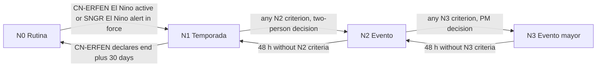
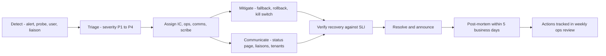

# Operations runbook

This runbook explains how *Gemelo Digital Ecuador – El Niño* (GDE-Niño) is run day to day and through the 2026-27 El Niño peak season. It covers who does what, the daily job cycle in UTC and Ecuador time, how the platform moves into and out of event mode, monitoring and SLOs, incident management with Spanish communication templates, 22 failure runbooks, data-quality operations, releases, tenant support, backup and disaster recovery, security operations, and the recurring rituals and checklists. It is written for the platform operator's on-call engineers, the Commons data and forecast team, the INAMHI and SNGR liaisons, and tenant administrators. Components, buckets, tables, jobs and topics are those defined in [03-architecture.md](./03-architecture.md) and are not re-described here. The legal and data-protection basis is in [13-governance-legal-risk.md](./13-governance-legal-risk.md). Verification methods are in [14-verification-and-validation.md](./14-verification-and-validation.md).

## Contents

0. [Conventions](#0-conventions)
1. [Operating model](#1-operating-model)
2. [Daily operations cycle](#2-daily-operations-cycle)
3. [El Niño event mode](#3-el-niño-event-mode)
4. [Monitoring, SLOs, dashboards and alert policies](#4-monitoring-slos-dashboards-and-alert-policies)
5. [Incident management](#5-incident-management)
6. [Failure runbooks](#6-failure-runbooks)
7. [Data-quality operations](#7-data-quality-operations)
8. [Release management](#8-release-management)
9. [Tenant support](#9-tenant-support)
10. [Backup, disaster recovery and retention](#10-backup-disaster-recovery-and-retention)
11. [Security operations](#11-security-operations)
12. [Rituals and checklists](#12-rituals-and-checklists)
13. [Operations readiness milestones](#13-operations-readiness-milestones)
14. [Open questions](#14-open-questions)

---

## 0. Conventions

- **Time.** All schedules, logs and tables use UTC. Mainland Ecuador time (ECT) is UTC−5 with no daylight saving; Galápagos is UTC−6. Where a table shows both, ECT is in the second column.
- **Posture, not alert.** The platform's operating levels are called *postura operativa* N0–N3 (§3). They are internal staffing and cadence settings. They are never shown to users as an alert and never use alert colours (D1).
- **Severity.** Incidents are P1–P4 (§5.1).
- **Three meanings of "P1" and "N1".** Severity P1–P4 (§5.1) is not the control plane P1 (planes P1–P3 of [03](./03-architecture.md)). *P1 provinces* are the six priority coastal provinces of [07](./07-impact-modules-and-triggers.md): Esmeraldas (08), Manabí (13), Santa Elena (24), Guayas (09), Los Ríos (12) and El Oro (07). Posture levels N0–N3 are not the notification types N1–N9 of [02 §8.8](./02-users-requirements-ux.md); this document always writes the latter as "notification N1" … "notification N9".
- **Owner codes** extend the owner-role table at the top of [03](./03-architecture.md) (before §1):

| Code | Role | Notes |
|---|---|---|
| PL, DL, FL, FE, AI, SRE, DPO, TA, PM | As in [03](./03-architecture.md) | In this document SRE means the primary or secondary on-call engineer (operator staff), and PM is also the service owner accountable for SLOs and external commitments |
| IC | Incident commander | A role assigned per incident, drawn from PL, DL, FL or a senior SRE |
| COM | Communications lead | Writes all external Spanish messages; PM by default |
| LI | INAMHI liaison | A named INAMHI focal point under the data convenio, paired with FL **(to confirm)** |
| LS | SNGR liaison | A named SNGR focal point (monitoring/COE side), paired with PM **(to confirm)** |

**Names introduced in this document.** These extend [03](./03-architecture.md) and should be adopted there on the next revision.

| Name | Type | Purpose |
|---|---|---|
| `fc-interim` | Cloud Run job, Commons `us-central1` | Event-mode processing of WN3 hourly interim runs (48 h lead) |
| `bulletins-text` | Cloud Run job submitting a Gemini Flash-Lite Batch (Phase 2) | Spanish prose drafts for provincial, national and canton bulletins (component 29 of [03 §3](./03-architecture.md); pipeline in [08 §8.1](./08-ai-decision-layer-jev.md)) |
| `inamhi-archive-audit` | Cloud Run job, `southamerica-west1` | Daily completeness check of the INAMHI archive; schedules re-fetches |
| `verification-daily`, `verification-monthly` | Cloud Run jobs | Event-mode provisional scores; monthly final scores |
| `exposure-refresh` | Cloud Run job | Monthly source check and quarterly `exposure_parish` version |
| `wn-schema-check` | Cloud Run job | Daily schema-drift check of the WeatherNext linked tables |
| `ops-synthetic-probe` | Request-billed Cloud Run service endpoint called by Cloud Scheduler (or a Cloud Monitoring uptime check), `us-central1` and `southamerica-west1`; not a job ([09 §4.3.1](./09-cost-model.md), L11) | End-to-end probes of the app, broker and source hosts every 5 min |
| `ops-iam-drift` | Cloud Run job | Daily IAM, key and public-access drift scan of platform and Commons |
| `commons_ops.pipeline_runs`, `commons_ops.source_health`, `commons_ops.dq_results`, `commons_ops.product_freshness_policy`, `commons_ops.posture_log` | BigQuery tables | Operational telemetry (DDL in §4.3 and §7.2) |
| `commons_pub.product_withdrawals` | BigQuery table | Withdrawn `init_time`/product pairs the API must hide (kill switch) |
| `commons_internal.floodhub_not_served` | BigQuery table | Gauges the Flood API stopped serving (OCHA `GOOGLE_NOT_SERVED` pattern) |
| `ectwin-commons-prod-raw-scl` | GCS bucket, Standard, `southamerica-west1` | Fallback write target for official-alert raw captures if `us-central1` is unavailable **(proposal)** |
| `ectwin-platform-prod-backup` | GCS bucket, `southamerica-west1`, versioned | Daily Firestore registry exports **(proposal)** |
| `scripts/ops/rollback-latest.sh`, `scripts/ops/tenant-diag.sh`, `scripts/ops/posture.sh` | Scripts | Kill switch, tenant self-diagnosis, posture changes |

---

## 1. Operating model

### 1.1 Teams and responsibilities

| Team | Who | Plane | Responsibilities | Must never |
|---|---|---|---|---|
| **Operator SRE** | SRE rota drawn from the platform team (PL, FE, SRE) | P1, shared P2 infrastructure | Uptime of sign-in, web app, broker `ectwin-api`, notifier, onboarding; monitoring and paging; incident command; releases; DR; security operations; platform and Commons cost control | Read tenant content; the operator console shows registry status and feed health only (FR-064) |
| **Commons data team** | DL (ingestion, warehouse, listings), FL (forecast cycle, bias correction, verification, impact models), AI (Jev triage, bulletins) plus 1–2 data engineers and a hydromet analyst **(headcount in [12](./12-roadmap-team-budget.md))** | P2 | All jobs in [03 §7.2](./03-architecture.md) and this document's §2; data quality; product correctness; method versions; the scenario library | Publish raw real-time WeatherNext fields; edit official alerts |
| **INAMHI liaison (LI)** | INAMHI focal point plus FL | External | Confirms *advertencias* and threshold (*umbrales*) changes; reports INAMHI API changes and outages; joint weekly verification review; co-signs threshold changes | — |
| **SNGR liaison (LS)** | SNGR focal point plus PM | External | Confirms alert resolutions and their scope; relays platform incidents to the national COE *mesas técnicas*; receives the daily bulletin pack; reports feed format changes (WordPress, `COE2`, `EVENTOS_X_LLUVIAS`) | — |
| **Tenant admins (TA)** | Owner/Admin in each tenant organisation (persona P13) | P3 | Budgets, quotas and members in their own project; own WeatherNext and Earth Engine registrations; responding to notifications N7 (budget) and N8 (pipeline or connection failure) ([02 §8.8](./02-users-requirements-ux.md)); ownership transfer at staff turnover | Share runner credentials; grant the broker more than Token Creator on `ectwin-runner` |
| **DPO** | Security and data-protection officer | All | LOPDP breach handling (RB-17), DPIA, access reviews, EGSI v3 alignment | — |

### 1.2 RACI for recurring activities

R = responsible, A = accountable, C = consulted, I = informed.

| Activity | SRE | DL | FL | AI | PL | PM | DPO | LI | LS | TA |
|---|---|---|---|---|---|---|---|---|---|---|
| Official-alert ingestion and band correctness | C | R/A | I | — | I | I | — | C | C | I |
| Forecast cycle and parish probabilities | C | C | R/A | — | — | I | — | C | — | I |
| River products (Flood API, GloFAS, GEOGloWS) | C | R | A | — | — | — | — | C | — | I |
| INAMHI archive completeness | C | R/A | C | — | — | — | — | C | — | — |
| Canton bulletins by 06:30 ECT | C | R | C | R (text) | — | A | — | — | I | I |
| Verification and confidence indicator | — | C | R/A | — | — | I | — | C | — | I |
| Posture change N0–N3 | R | C | C | C | C | A | — | C | C | I |
| Incident command | R | C | C | C | C | A | C | I | I | I |
| Release promotion to prod | R | C | C | C | A | I | — | — | — | I |
| Threshold (*umbral*) changes | — | C | R | — | — | A | — | C (co-sign) | I | I |
| Tenant onboarding support | R | — | — | — | A | I | — | — | — | C |
| Tenant budgets and quotas | — | — | — | — | C | — | — | — | — | R/A |
| Security monitoring and IAM drift | R | C | — | — | A | I | C | — | — | — |
| LOPDP breach response | R | C | — | — | C | I | A | — | — | C |
| External statements during incidents | C | C | C | — | — | A (COM R) | C | I | C | I |

### 1.3 Coverage by posture

| Posture | Desk hours | Pager | Minimum people on shift | Forecaster |
|---|---|---|---|---|
| N0 Rutina | Mon–Fri 08:00–17:00 ECT (13:00–22:00 UTC) | Primary + secondary SRE, 24/7 | 1 | Business hours |
| N1 Temporada | 7 days 05:30–21:30 ECT (10:30–02:30 UTC), two 8-h shifts, so the early shift runs the 05:30 ECT pre-bulletin check | 24/7 | 1 ops + FL on call | 7 days, 05:30–13:30 ECT |
| N2 Evento | 24/7, 12-h shifts, handovers 08:00 and 20:00 ECT (13:00 and 01:00 UTC) | 24/7 + IC on call | 2 (ops + forecaster) | On shift |
| N3 Evento mayor | As N2 + IC on shift + COM on shift 06:00–22:00 ECT | 24/7 | 3–4 | On shift |

Staffing arithmetic (estimate): N2 needs 2 seats × 168 h = 336 seat-hours per week. At 40–48 h per person that is 336 / 48 = 7 to 336 / 40 = 8.4 people, so a full N2 rota needs **at least 8 trained people**; [12-roadmap-team-budget.md](./12-roadmap-team-budget.md) plans a pool of 9 to cover leave and illness. N1 needs 16 h × 7 days = 112 seat-hours per week (2.3–2.8 people at 40–48 h) plus the pager, so about **3 people plus the pager rota**. In N0 the 05:30 ECT pre-bulletin check (§12.1) is done remotely by the primary on-call. N2 periods longer than 14 days need rest rules: no more than 5 consecutive 12-h shifts and 48 h off after a night block. Headcount is reconciled in [12](./12-roadmap-team-budget.md) **(to confirm)**.

Shift handovers at 08:00 and 20:00 ECT are deliberate. The night shift covers the 18Z and 00Z cycles, the 06:00 ECT bulletins and the COE morning sessions (about 07:00–07:30 ECT, see J2 in [02 §4](./02-users-requirements-ux.md)), then hands over after them. The day shift covers the 06Z and 12Z cycles and the evening bulletin (event mode).

### 1.4 Tools and channels

| Need | Tool | Notes |
|---|---|---|
| Paging | Cloud Monitoring notification channels → paging tool **(to select)** + SMS fallback | P1/P2 page; P3 ticket; P4 backlog |
| Ops chat | Team chat workspace **(to select)** with channels `#ops-oncall`, `#ops-incidents`, `#ops-releases` | Chat is not the record; the incident document is |
| Liaison channel | WhatsApp group "GDE-Niño enlaces" (LS, LI, PM, on-call) **(to confirm with SNGR and INAMHI)**; in N1+ a short daily *mesa de enlace operativo* call after the ops stand-up ([12](./12-roadmap-team-budget.md)) | Used only for operational notices (template T-02), never for hazard statements |
| Status page | Hosted outside the app stack (NFR-009) **(provider to select)** | Spanish first; linked from the app footer and PDFs |
| Incident records | Ticket tracker plus one incident document per P1/P2 | Retained 5 years **(to confirm with [13](./13-governance-legal-risk.md))** |
| Contacts register | Private operator store, not the public repository (D20 makes the repo public) | Names, phones, backup contacts for LI, LS, partners, relay host |
| Operator console | `apps/operator-console` | Registry status, feed health, posture; no tenant content |

---

## 2. Daily operations cycle

### 2.1 Job table

Durations are estimates to be replaced with measured p95 values after two weeks in `-stg`. "Publish / stale" repeats the freshness targets of [02 §6.2](./02-users-requirements-ux.md). Job names are those of [03 §7.2](./03-architecture.md) unless listed in §0.

| # | Job | Plane / region | Schedule UTC | ECT | Inputs | Outputs | Duration | Publish / stale | On failure |
|---|---|---|---|---|---|---|---|---|---|
| 1 | `ingest-sngr-alerts` | P2 / `southamerica-west1` | every 10 min (N2+: 5 min) | same | SNGR WordPress `/wp-json/wp/v2/posts`, `COE2/MapServer`, `Hosted/EVENTOS_X_LLUVIAS` | `raw/sngr/…`, `commons_pub.official_alerts`, topic `official-alerts-v1` | <1 min | ≤15 min after the source is reachable / 6 h | Retry; RB-06, RB-07, RB-19 |
| 2 | `ingest-inamhi-advertencias` | P2 / `southamerica-west1` | every 15 min | same | INAMHI warnings (HydroShare WFS `Advertencia`, GeoServer) | `official_alerts` | <1 min | ≤20 min / 6 h | RB-06, RB-07 |
| 3 | `ingest-cnerfen-inocar` | P2 / `southamerica-west1` | 00:00, 03:00 … 21:00 | 19:00, 22:00 … 16:00 | CN-ERFEN reports (INOCAR, IPIAP hosts), INOCAR tide PDFs | `official_alerts`, `enso_indices` | 1–3 min | ≤3 h after publication / 10 days | RB-06, RB-07; LI/LS manual check |
| 4 | `ingest-inamhi-stations` | P2 / `southamerica-west1` | continuous rotation, 1 request per 300 s (288/day) | same | INAMHI Visor API (`get_data_hour`, `get_precipitation`) | `raw/inamhi/…`, `inamhi_station_obs_hourly` | continuous | ≤30 min after fetch / 6 h | RB-08 |
| 5 | `inamhi-archive-audit` | P2 / `southamerica-west1` | 06:00 | 01:00 | `inamhi_station_obs_hourly`, station catalogue | `dq_results`; re-fetch queue (late river levels at +10 d and +25 d) | 5 min | daily | RB-08 |
| 6 | `ingest-imerg-gsmap` (Phase 2; N1+) | P2 / `us-central1` | every 30 min | same | EE `NASA/GPM_L3/IMERG_V07` (Early/Late only for 2026: no permanent V07 products after 2025-09-30 because of the move to V08), `JAXA/GPM_L3/GSMaP/v8/operational`, Oya `projects/global-precipitation-nowcast/assets/global_estimation` | COG + H3 aggregates | 3–5 min | ≤1 h after availability / 12 h | RB-13 (EE quota); RB-22 (asset or version change, e.g. IMERG V07→V08); skip layer |
| 7 | `forecast-cycle` 00Z (WN2 + WN3) | P2 / `us-central1` (+`us-east1` step in Phase 2) | start 07:20; WN2 ≈07:30 (estimated release time from the EE catalogue); WN3 in BQ ≈08:10; final target 09:10; deadline 10:00 | 02:20 → 04:10 | `weathernext_2`, `weathernext_3` linked datasets, `bc_params`, `exposure_parish` | `parish_exceedance`, tiles, `national/<init>/`, STAC, `commons-product-ready-v1` | ≤60 min after WN3 availability (M1.1) | ≤1 h (WN3), ≤2 h (WN2) / 18 h (WN3), 24 h (WN2) | RB-01, RB-02; `fc-fallback-ifs` |
| 8 | `forecast-cycle` 06Z | same | 13:20 → 15:10 | 08:20 → 10:10 | same | same | same | same | same |
| 9 | `forecast-cycle` 12Z | same | 19:20 → 21:10 | 14:20 → 16:10 | same | same | same | same | same |
| 10 | `forecast-cycle` 18Z | same | 01:20 → 03:10 (+1 d) | 20:20 → 22:10 | same | same | same | same | same |
| 11 | `fc-interim` (N2+ only) | P2 / `us-central1` | hourly at HH:35 (≈ init + 7 h 35 min) | same | WN3 hourly interim runs, 48 h lead (available ≈ init + 7 h 25 min). The EE asset `weathernext_3_0_0_0p1deg` carries them per the EE catalogue; BigQuery coverage is **unverified** | `parish_exceedance` rows with `variable='tp_1h_max'`, six P1 provinces (N2) or national clip (N3) | ≤15 min | ≤30 min / 3 h | Skip; main cycles continue |
| 12 | `ingest-floodhub-status` | P2 / `us-central1` | 01:15, 07:15, 13:15, 19:15 (N2+: every 3 h from 01:15, i.e. 01:15, 04:15 … 22:15) | 20:15, 02:15, 08:15, 14:15 | Flood API `floodStatus.searchLatestFloodStatusByArea` (`EC` + transboundary loops), `queryGaugeForecasts`, `gaugeModels.batchGet` | `floodhub_status_snapshots` | 2–5 min, <60 requests | every 6 h / 24 h | RB-03, RB-04, RB-05 |
| 13 | `ingest-floodhub-events` | P2 / `us-central1` | 07:00 and 09:15 (flash-flood issue observed 06:33 UTC) | 02:00, 04:15 | `significantEvents.search`, `flashFloods.search {"countryCodes":["EC"]}`, `serializedPolygons.get` | `floodhub_significant_events`, `floodhub_flash_floods` | 2–5 min | daily / 24 h | RB-03 |
| 14 | `ingest-geoglows-inamhi` | P2 / `southamerica-west1` | 00:30, 06:30, 12:30, 18:30 | 19:30, 01:30, 07:30, 13:30 | `inamhi.geoglows.org` / `services.geoglows.org` | `river_status` | 2 min | ≤3 h / 36 h | RB-06, RB-07; S3 `geoglows-v2-forecasts` direct |
| 15 | `ingest-glofas` | P2 / `us-central1` | 12:00 | 07:00 | EWDS `cems-glofas-forecast` (one request per day, Ecuador area) | `river_status` | 10–40 min (queue) | ≤3 h after release / 36 h | RB-22 |
| 16 | `ingest-enso` | P2 / `us-central1` | 14:00 daily; rerun 18:00 on CPC ENSO update days (second Thursday of the month, per a secondary source) | 09:00; 13:00 | CPC weekly SST (`wksst9120.for`, `rel_wksst9120.txt`) and `RONI.ascii.txt`, CPC RONI probabilities, ENFEN ICEN (`met.igp.gob.pe/datos/ICEN.txt`), IRI plume, OISST Niño boxes, BoM SOI | `enso_indices` | 2 min | ≤24 h / 10 days | RB-22 |
| 17 | `ingest-seasonal` + CFSv2 daily | P2 / `us-central1` | CFSv2 09:00 daily; SEAS5 ≈day 5 (if served); GloFAS seasonal days 6–10; C3S day 13, retries days 13–16 (official release the 13th 12 UTC **unverified**); NMME days 8–12 **(unverified)**; monthly polls at 14:00 in one Scheduler window `0 14 5-16 * *` ([03 §7.2](./03-architecture.md)) | 04:00; 09:00 | CDS `seasonal-monthly-single-levels`, EWDS `cems-glofas-seasonal`, NMME (CPC FTP), `s3://noaa-cfs-pds` | `seasonal_canton` | 20–90 min | ≤48 h / 40 days | RB-22 |
| 18 | `exposure-refresh` | P2 / `us-central1` | first Monday of month 15:00; quarterly version bump | 10:00 | Open Buildings, WorldPop, INEC, MSP/MINEDUC facilities, SNGR Alístate layers (if machine-readable, **to confirm**) | `exposure_parish` (`snapshot_version`), static tiles | 30–60 min | on release / reviewed quarterly | Keep previous version |
| 19 | `bulletins-text` (Phase 2, FR-048) | P2 / `us-central1` | submit 09:20; must be done by 10:45 | 04:20 → 05:45 | `facts.json` per province from the 00Z cycle (official alerts verbatim, levels, probabilities as code-held placeholders), style guide | Draft Spanish paragraphs (label D12); appended only after human approval in the report builder; the FR-044 canton PDF stays template-only ([08 §8.1](./08-ai-decision-layer-jev.md)) | batch, ≤85 min expected (turnaround **unverified**) | — | RB-10: template-only text |
| 20 | `bulletins-canton` | P2 / `us-central1` | 11:00; ready ≤11:30 (N2+: second edition 22:00) | 06:00 → 06:30 (17:00) | Latest final cycle, official band, rivers, tide | `bulletins/<date>/canton=<dpa4>.pdf`, `cards/…png`, notification N4 | ≤30 min | 06:30 ECT on ≥97% of days | RB-20 |
| 21 | Tenant `ectwin-aoi-pipeline` | P3 / tenant `us-central1` | 09:25, 15:25, 21:25, 03:25 | 04:25, 10:25, 16:25, 22:25 | `ectwin_commons`, own linked datasets | `ectwin.aoi_*` | ≤15 min | ≥98% success (NFR-008) | Tenant notification N8 after 2 consecutive failures; RB-11–RB-14 |
| 22 | `verification-weekly` | P2 / `us-central1` | Monday 06:00 | Monday 01:00 | Archived products, INAMHI stations, IMERG Late, CHIRPS v3 preliminary | `verification_scores` (provisional) | 20–40 min | ≤24 h / 14 days | Retry; FL |
| 23 | `verification-daily` (N1+) | P2 / `us-central1` | 06:30 | 01:30 | Previous day's products vs INAMHI stations and IMERG Late | provisional scores, confidence inputs | 10 min | ≤24 h | Skip; weekly job covers |
| 24 | `verification-monthly` | P2 / `us-central1` | 25th 06:00 (CHIRPS final ≈3 weeks after month end, **unverified**) | 01:00 | CHIRPS v3 final, gauges | final scores | 30–60 min | monthly | Retry |
| 25 | `jev-triage-national` | P2 / `us-central1` | event-driven (new SITREP or ECU 911 batch) | — | SITREP PDFs, narratives (pseudonymised) | typed records, review queue | queue latency ≤10 min in N2 (target) | — | RB-09 |
| 26 | `raw-dr-copy` | P2 | 05:00 | 00:00 | `ectwin-commons-prod-raw` | `ectwin-commons-prod-archive-scl` | 10–30 min | daily | §10 |
| 27 | `wn-schema-check` | P2 / `us-central1` | 06:45 | 01:45 | `INFORMATION_SCHEMA` of linked WeatherNext datasets | `dq_results` | 1 min | daily | RB-02 |
| 28 | `ops-synthetic-probe` | P1+P2 / both regions | every 5 min | same | App shell, `/v1/national/summary`, source hosts | `source_health`, uptime metrics | <30 s | — | §4 alerts |
| 29 | `ops-iam-drift` | P1+P2 | 04:30 | 23:30 | IAM policies, SA keys, bucket IAM | `dq_results` (security class) | 2 min | daily | §11 |

**Human checkpoints** (all times ECT): pre-bulletin check 05:30 (10:30 UTC, §12.1); COE morning sessions about 07:00–07:30 (12:00–12:30 UTC, **times vary per COE; confirm with each pilot**); ops stand-up 08:30 (13:30 UTC); day-end review 17:00 (22:00 UTC).

### 2.2 Daily cycle diagram (UTC)

```mermaid
gantt
  title GDE-Nino daily cycle in UTC - subtract 5 h for ECT
  dateFormat HH:mm
  axisFormat %H:%M
  section Official and observations
  SNGR alerts every 10 min                  :a1, 00:00, 23:59
  INAMHI advertencias every 15 min          :a2, 00:00, 23:59
  INAMHI stations 1 request per 5 min       :a3, 00:00, 23:59
  CN-ERFEN and INOCAR every 3 h             :a4, 00:00, 23:59
  Raw DR copy                               :a5, 05:00, 05:40
  INAMHI archive audit                      :a6, 06:00, 06:10
  section Forecast cycles
  18Z cycle of previous day                 :f1, 01:20, 03:10
  00Z cycle feeds bulletins                 :crit, f2, 07:20, 09:10
  06Z cycle                                 :f3, 13:20, 15:10
  12Z cycle                                 :f4, 19:20, 21:10
  section Rivers
  GEOGloWS INAMHI 0030                      :r1, 00:30, 00:45
  Flood API status 0115                     :r2, 01:15, 01:25
  Flood API events                          :r3, 07:00, 07:10
  Flood API status 0715                     :r4, 07:15, 07:25
  Flood API flash floods second pass        :r5, 09:15, 09:25
  GloFAS 30 day                             :r6, 12:00, 12:40
  Flood API status 1315                     :r7, 13:15, 13:25
  Flood API status 1915                     :r8, 19:15, 19:25
  section ENSO and seasonal
  CFSv2 daily seasonal                      :e1, 09:00, 09:30
  ENSO indices                              :e2, 14:00, 14:15
  section Products and people
  Tenant pipelines 00Z                      :p1, 09:25, 09:50
  Bulletin text batch                       :p2, 09:20, 10:45
  Pre-bulletin check                        :crit, p3, 10:30, 11:00
  Canton PDFs and cards                     :crit, p4, 11:00, 11:30
  COE morning sessions                      :p5, 12:00, 12:30
  Ops stand-up                              :p6, 13:30, 13:45
  Evening bulletin in event mode            :p7, 22:00, 22:30
  section Verification
  Weekly verification on Mondays            :v1, 06:00, 06:40
  Daily verification from N1                :v2, 06:30, 06:40
```



### 2.3 Critical path to the morning bulletin

The 00Z cycle feeds the 06:00 ECT bulletins. Decision points, all UTC:

1. **08:10** WN3 00Z expected in BigQuery (±15 min typical, ±60 min occasionally, per the dissemination guide summarised in [03 §4.2](./03-architecture.md)).
2. **09:10** 00Z products final (target).
3. **10:00** Workflow deadline (init + 10 h). If WN3 is still missing, `fc-fallback-ifs` runs (RB-01).
4. **10:30** Pre-bulletin check (§12.1). If the 00Z cycle is not final, the on-call decides between (a) waiting for the IFS fallback, which must be final by 11:00, or (b) building bulletins from the 18Z cycle of the previous day, labelled "corrida 18Z del <fecha>".
5. **10:45** Deadline for `bulletins-text`. If the batch is not done, bulletins use template-only text (RB-10).
6. **11:00** `bulletins-canton` starts. **11:30** SLO deadline (06:30 ECT). Any miss counts against the 97% SLO and opens RB-20.

---

## 3. El Niño event mode

### 3.1 Postures

Event mode here means the **operator's posture** for the whole platform. It is distinct from the tenant-level "Activar modo evento" screen (FR-059), which any tenant user can switch on for their own view at any time.



**Current state.** CN-ERFEN declared El Niño active on 2026-08-28 (technical report 007-2026), and SNGR escalated its nationwide El Niño alert on 2026-08-29 (Resolution SNGR-238-2026 per press reports; the resolution text was not retrieved and a second search found no trace of that number, so it is **unverified**; the earlier yellow → orange change was Resolution SNGR-193-2026 in July). Several outlets report the level as red, but sources conflict on the colour ([01 §5](./01-context-el-nino-ecuador.md)); the platform shows whatever `level_verbatim` the ingested resolution states. The platform therefore starts in **N1 Temporada** at MVP go-live on 2026-11-27, and stays at N1 or above until CN-ERFEN declares the event over.

### 3.2 Activation criteria

N2 and N3 criteria are evaluated automatically every hour by a query over `official_alerts`, `parish_exceedance`, `floodhub_status_snapshots`, `river_status` and `enso_indices`. The query **proposes** a posture change on topic `ops-events`; a human decides. Numeric thresholds marked "estimate" are starting values to be tuned in the first month of N1.

| Level | Criterion (any one) | Source | Decided by |
|---|---|---|---|
| **N2 Evento** (coast pathway) | New INAMHI *advertencia* for heavy rain or river flooding covering any P1 coastal province: Esmeraldas (08), Manabí (13), Santa Elena (24), Guayas (09), Los Ríos (12), El Oro (07) | `official_alerts` | On-call SRE + FL (two-person) |
| | ≥10 new rain-related events in 24 h in `EVENTOS_X_LLUVIAS` or `COE2` for P1 provinces (estimate) | SNGR feeds | same |
| | `risk_level ≥ 3` with `prob_exceed ≥ 0.5` for ≥20 parishes at lead days 1–3 in two consecutive cycles (estimate) | `parish_exceedance` | same |
| | Flood API `severity IN ('SEVERE','EXTREME')` at any quality-verified Ecuador gauge, or GloFAS/GEOGloWS ≥ 5-year return period at a reach listed in the key-reach table of [07](./07-impact-modules-and-triggers.md) | `floodhub_status_snapshots`, `river_status` | same |
| | *Aguaje* window with coastal sea-level anomaly ≥ +20 cm (placeholder from the coupling proposal in [01 §11.2](./01-context-el-nino-ecuador.md)) **and** ≥1 tidal-flooding event reported by SNGR in a P1 province. The anomaly alone is not enough: ERFEN already reported +40 cm on 2026-08-20, so a +20 cm rule by itself would trigger N2 at every spring tide (estimate) | `enso_indices` (`SLA_GYE`), tide tables, SNGR feeds | same |
| | Broker traffic ≥5× the 7-day baseline for 1 h | Cloud Monitoring | same |
| **N2-E** (energy pathway) | Mazar projected to reach about 2,115 masl (where the 2024 blackouts began) within 30 days, using the days-to-threshold method of [01 §7.3](./01-context-el-nino-ecuador.md) and the M8 reservoir watch card of [07](./07-impact-modules-and-triggers.md) (level 2,134.2 masl on 2026-09-28; 01's linear estimate puts the crossing between early November and late December 2026) | CELEC ORDS series | FL + PM |
| **N3 Evento mayor** | National or provincial emergency declaration; or N2 criteria met in ≥2 provinces at once; or SNGR reports deaths or failure of critical infrastructure linked to the event; or national COE in permanent session | SNGR resolutions, LS | PM (IC informed) |

Every change is written to `commons_ops.posture_log` (level, criteria met, decided_by, time) and announced on `#ops-oncall` and in the liaison group with template T-02 wording adapted ("GDE-Niño pasa a operación reforzada"). Users are not told a "posture"; they only see more frequent updates.

### 3.3 What changes at each posture

| Setting | N0 | N1 | N2 | N3 |
|---|---|---|---|---|
| SNGR polling | 10 min | 10 min | 5 min | 5 min |
| WN3 interim runs (`fc-interim`) | off | off | on, six P1 provinces | on, national clip (mainland + Galápagos) |
| Flood API status snapshots | 6-hourly | 6-hourly | 3-hourly | 3-hourly |
| IMERG / GSMaP / Oya (Phase 2) | off | 30 min | 30 min | 30 min |
| INAMHI station rotation | national round-robin | P1 provinces weighted 2× | affected provinces first (still 1 request per 5 min unless INAMHI agrees otherwise) | same |
| Verification | weekly | daily provisional | daily | daily |
| Canton bulletins | 06:00 ECT | 06:00 ECT | 06:00 + 17:00 ECT | 06:00 + 17:00 ECT + on-demand snapshots |
| Broker `ectwin-api` | min 0, max 20 | min 0, max 50 | **min 1**, max 100 | min 1, max 100 |
| Jev national triage | batch | continuous, 8 workers | continuous; human-review queue staffed | same |
| Change policy | normal windows | normal windows | **freeze** (§3.6) | **freeze** |
| Status-page update cadence for P2 incidents (P1 is always 30 min, §5.1) | 60 min | 60 min | 30 min | 30 min |
| Central budgets ([09 §9.3](./09-cost-model.md); Terraform, not `posture.sh`) | platform US$45, Commons US$450 | same | platform US$100, Commons US$650 (`posture_high=true`) | same |

Apply the technical switches with `scripts/ops/posture.sh`:

```bash
#!/usr/bin/env bash
# scripts/ops/posture.sh <N0|N1|N2|N2-E|N3> [criteria-ids]  -- applies the posture settings; idempotent
set -euo pipefail
LEVEL="${1:?usage: posture.sh <N0|N1|N2|N2-E|N3> [criteria]}"; C=ectwin-commons-prod; P=ectwin-platform-prod
case "$LEVEL" in
  N2|N3)
    gcloud run services update ectwin-api --project=$P --region=us-central1 --min-instances=1 --max-instances=100
    gcloud scheduler jobs resume fc-interim-hourly --project=$C --location=us-central1
    gcloud scheduler jobs update http ingest-sngr-alerts-cron --project=$C --location=southamerica-west1 --schedule="*/5 * * * *"
    gcloud scheduler jobs update http ingest-floodhub-status-cron --project=$C --location=us-central1 --schedule="15 1-22/3 * * *"
    gcloud scheduler jobs resume bulletins-canton-evening --project=$C --location=us-central1 ;;
  N1|N0)
    gcloud run services update ectwin-api --project=$P --region=us-central1 --min-instances=0 --max-instances=$([ "$LEVEL" = N1 ] && echo 50 || echo 20)
    gcloud scheduler jobs pause fc-interim-hourly --project=$C --location=us-central1
    gcloud scheduler jobs update http ingest-sngr-alerts-cron --project=$C --location=southamerica-west1 --schedule="*/10 * * * *"
    gcloud scheduler jobs update http ingest-floodhub-status-cron --project=$C --location=us-central1 --schedule="15 1,7,13,19 * * *"
    gcloud scheduler jobs pause bulletins-canton-evening --project=$C --location=us-central1 ;;
  N2-E)
    echo "N2-E (energy pathway): no scheduler changes; FL and PM follow the reservoir watch card of 01 and 07" ;;
  *)
    echo "unknown posture: $LEVEL" >&2; exit 2 ;;
esac
bq query --use_legacy_sql=false --project_id=$C --parameter="lvl:STRING:$LEVEL" --parameter="c:STRING:${2:-manual}" \
  "INSERT commons_ops.posture_log (level, changed_at, decided_by, criteria) VALUES (@lvl, CURRENT_TIMESTAMP(), SESSION_USER(), @c)"
```

Scheduler job names ending in `-cron` are the trigger objects for the jobs of §2.1 **(names to align with the Terraform in `infra/commons/`)**. The N2 Flood API cron `15 1-22/3 * * *` keeps the normal 01:15/07:15/13:15/19:15 slots and adds 04:15, 10:15, 16:15 and 22:15.

**Budget step (SRE, separate from the script).** `posture.sh` does not change budgets. When N2 or N3 is declared, SRE also applies `infra/commons` with `-var posture_high=true`, which raises the `ectwin-platform-prod` budget to US$100 and the `ectwin-commons-prod` budget to US$650; on return to N0/N1, SRE applies it again with `-var posture_high=false` ([09 §9.3](./09-cost-model.md), [10 §3.6](./10-setup-and-deployment.md)).

**Extra cost of N2 (estimate).** WN3 scans ≈0.07 GB per column-init ([03 §3](./03-architecture.md)). An interim run reading about 10 columns scans at most ≈0.7 GB (an upper bound: interim runs reach 48 h, about 13% of a 360-h main run's leads, if they share the table layout). There are 20 interim inits a day besides the 4 main ones: 20 × 0.7 GB ≈ 14 GB/day, ≈ 420 GB ≈ 0.38 TiB over 30 days. Main cycles at ≤1 GB each (M1.1) add 4 × 30 × 1 GB = 120 GB ≈ 0.11 TiB/month. Together ≈0.49 TiB/month, inside the 1 TiB free tier of the Commons billing account, but with limited headroom once verification and backfills run. Backfills are therefore paused in N2. The warm broker instance adds a small always-on charge (priced in [09](./09-cost-model.md)).

### 3.4 Escalation

| Step | When | Who is engaged |
|---|---|---|
| E1 | Page not acknowledged in 10 min | Secondary SRE |
| E2 | Not acknowledged in 20 min, or any P1 | IC on call (PL, DL or FL) |
| E3 | P1 not mitigated in 30 min, or any N3 | PM; COM starts status updates |
| E4 | Official band wrong or missing during N2/N3, or suspected personal-data breach | PM + DPO + LS/LI informed within 30 min |
| E5 | Partner dependency (WeatherNext, Flood API, TypeSafe, relay host) down >2 h in N2/N3 | PM contacts the partner (weathernext@google.com; Flood Hub support; sales@typesafe.ai; relay partner contact) |

### 3.5 Communication with COEs

- The platform never speaks for the hazard. In COE *mesas técnicas*, platform staff present only as technical support and only when invited **(to confirm with SNGR)**. Every statement starts with the official state: "La alerta oficial vigente es … (SNGR, Res. …)".
- Channels: the daily bulletin pack (PDF + WhatsApp card + text, [02 §8.6–8.7](./02-users-requirements-ux.md)); the liaison group for operational notices; tenant notification types N1–N9 ([02 §8.8](./02-users-requirements-ux.md)).
- A *Nota técnica de apoyo* may be sent to a COE only when a tenant's signer has approved it (*firma técnica*, FR-046). Template:

```text
Nota técnica de apoyo – GDE-Niño (no constituye alerta oficial)
Para: COE <provincial/cantonal> <nombre> · Fecha y hora: <dd-mm-aaaa HH:MM> ECT
Alerta oficial vigente: <texto literal SNGR>, Res. <número> (<fecha>).
Advertencias INAMHI vigentes: <número y texto literal o "ninguna">.
Resumen (próximas 72 h): <tres líneas: qué, dónde, cuándo, con qué probabilidad y confianza>.
Parroquias con mayor nivel de riesgo: <lista con nivel N de 4 y probabilidad>.
Ríos y marea: <clase y tendencia; ventanas de aguaje>.
Fuentes y corrida: <modelo, init_time, versión del método>.
Limitaciones: <confianza; si se usó modelo de respaldo>.
Firma técnica: <nombre, cargo, institución>.
Producto de apoyo a la decisión. Las alertas oficiales las declara la SNGR.
```

- Media enquiries about the hazard are referred to SNGR and INAMHI. PM answers only questions about platform status.

### 3.6 Change freeze

| Freeze | Window | Allowed changes |
|---|---|---|
| Posture freeze | Whenever N2 or N3 is in force | Emergency changes only: a fix for an open P1/P2, or a critical security patch. Approval by IC + one domain lead; peer review still required; no `method_version` change, no threshold change unless INAMHI changes official *umbrales* (applied as a data change with two-person review), no schema change, no tenant image promotion |
| Election and go-live freeze | 2026-11-26 00:00 UTC → 2026-12-01 23:59 UTC (MVP go-live 27 Nov; local elections 29 Nov) | Same as posture freeze |
| Holiday freeze | 2026-12-24 → 2027-01-02 (reduced staffing; estimate) | Same |
| Carnival | 2027-02-08 → 2027-02-09 (dates **to confirm**; [12](./12-roadmap-team-budget.md) asks for an explicit rota) | Same |
| Event-season model freeze | 2026-12-01 → 2027-04-30 ([07 §5.5](./07-impact-modules-and-triggers.md), [13](./13-governance-legal-risk.md)) | Applies to Method changes (§8.1) only: patch versions (bug fixes) and the planned `ri-2.0.0` promotion are allowed; other changes follow the normal rules outside posture freezes |

Normal change windows outside freezes: Tuesday and Wednesday 14:00–18:00 UTC (09:00–13:00 ECT), never after 18:00 UTC and never on a day with N2 in force.

### 3.7 Quota pre-raise (by 2026-11-27; Phase 2 items later)

Budgets are not caps and several quotas default low. Request these in Phase 1 so that event mode is not blocked by a quota ticket.

| Resource | Project | Default or current | Season target | Request by | Owner |
|---|---|---|---|---|---|
| `ectwin-api` max instances (config) | platform | 20 | 100 (N2), per NFR-010's 10× spike | 2026-11-20 | PL |
| Cloud Run job regional CPU quotas, `us-central1` and `southamerica-west1` | commons | project default **(check in console)** | 3× the measured N2 peak | 2026-11-06 | DL |
| Compute Engine C3D CPUs, Spot, `us-central1` | commons | default **(unverified)** | ≥640 vCPUs (40 parallel `c3d-highcpu-16` tasks, [03 §7.6](./03-architecture.md)) | 2026-11-13 | FL |
| Same family, on-demand (Spot fallback) | commons | default **(unverified)** | ≥320 vCPUs | 2026-11-13 | FL |
| Compute Engine C2D CPUs, Spot, `us-east1` (Phase 2 WN3 full-member processing on `c2d-standard-16`, [03 §3](./03-architecture.md) component 21) | commons | default **(unverified)** | sized after the M2.2 spike | 2027-01-15 (M2.2) | FL |
| L4 GPUs (Batch or Cloud Run) | commons, T3 tenants | possibly 0 in new projects **(unverified)** | 4–8 | 2026-11-13 | FL, TA |
| Vertex / Agent Platform GPUs (A100 80 GB or H100 80 GB) for WN2 custom runs | T3 tenants | **0; must be requested** ([WN2 notebook](https://raw.githubusercontent.com/GoogleCloudPlatform/vertex-ai-samples/main/notebooks/community/weathernext/weathernext_2_dws.ipynb)) | per tenant plan; project must also be allow-listed | 2026-11-20 | TA |
| Gemini on Agent Platform request and token limits | commons | **(check in console)** | 2× the measured bulletin batch | 2026-11-13 | AI |
| TypeSafe Jev | commons account | 1,200 requests/min, 250k tokens/s per account; no published SLA | higher limit via sales@typesafe.ai, or a second account for failover | 2026-11-06 | AI |
| Flood Forecasting API | commons | 200 requests/min | unchanged (need <60 per run) | — | DL |
| Earth Engine | commons | Commercial – Limited (operational, [13 LP-07](./13-governance-legal-risk.md)); Partner-tier application (100,000 EECU-h/month) pending | Partner tier only if Google confirms in writing that it covers operational use (see RB-13) | Phase 0 | FL |
| BigQuery `QueryUsagePerDay` | commons | 200 TiB/day default | **lower** to 2 TiB/day as a guard | 2026-10-16 | DL |
| Cloud Logging volume | platform, commons | 50 GiB/project/month free, then US$0.50/GiB ([pricing](https://cloud.google.com/stackdriver/pricing)) | exclusion filters for debug logs | 2026-11-06 | SRE |

### 3.8 Spot to on-demand fallback

Heavy runs (SFINCS library, ensembles, LISFLOOD-FP) use Batch on Spot. Spot prices change up to once a day and L4 Spot capacity in `us-central1` during regional El Niño peaks is not guaranteed, so the cost research recommends keeping an on-demand or Cloud Run L4 GPU fallback (US$0.0001867/s ≈ US$0.672/h for the GPU alone; CPU and memory are billed on top) ([Cloud Run pricing](https://cloud.google.com/run/pricing); arithmetic in [09](./09-cost-model.md)).

| Workload | Default | Switch to on-demand when | Cost approval |
|---|---|---|---|
| SFINCS scenario library campaign (not time-critical) | Spot, `maxRetryCount 3` | Never automatically; reschedule to night hours | — |
| Live event ensemble needed for a COE decision within 2 h (N2/N3) | Spot | After 1 preemption of a critical task, or 20 min without scheduling | FL up to US$50 per campaign (estimate); PM above |
| LSTM or LISFLOOD-FP GPU job | `g2-standard-4` Spot (≈US$0.424/h, [Spot pricing](https://cloud.google.com/spot-vms/pricing)) | Same | Cloud Run L4 GPU at ≈US$0.672/h (GPU only) as first fallback |

Switching a submitted Batch config:

```bash
jq '.allocationPolicy.instances[0].policy.provisioningModel = "STANDARD"' sfincs-gye.json > sfincs-gye-od.json
gcloud batch jobs submit "sfincs-gye-od-$(date -u +%Y%m%dt%H%M)" --project=ectwin-commons-prod \
  --location=us-central1 --config=sfincs-gye-od.json
```

The on-demand price for `c3d-highcpu-16` is not in the research briefs (its Spot price is ≈US$0.161/h in `us-central1`); Spot discounts reach 91%, so on-demand can cost several times the Spot price **(to confirm before approving)**.

---

## 4. Monitoring, SLOs, dashboards and alert policies

### 4.1 SLOs

The per-plane SLOs of [02 §6.3](./02-users-requirements-ux.md) are extended with product and pipeline SLOs. All are measured over a rolling 30 days.

| ID | SLI | SLO | Error budget / 30 days | Owner |
|---|---|---|---|---|
| SLO-01 | Successful sign-ins and app-shell loads / attempts (synthetic + real) | 99.5% | ≈3.6 h | PL |
| SLO-02 | Broker `generateAccessToken` success for active tenants | 99.5% | ≈3.6 h | PL |
| SLO-03 | Cached Commons API requests served <400 ms (NFR-005) | 95% | — | PL |
| SLO-04 | Official-alert polls that complete within 15 min of source availability | 99% | ≈43 polls of 4,320 | DL |
| SLO-05 | Canton PDFs complete by 06:30 ECT | 97% of days | ≈1 day | DL / PM |
| SLO-06 | Main forecast cycles published ≤1 h after WN3 availability, or fallback published by init + 11 h | 95% of cycles | 6 of 120 cycles | FL |
| SLO-07 | Scheduled Flood API snapshots succeeded | 95% | 6 of 120 runs | DL |
| SLO-08 | INAMHI archive completeness: stored station-hours / station-hours served by the API in the 92-day window, checked daily | 99% (estimate) | — | DL |
| SLO-09 | Official-alert notifications ([02 §8.8](./02-users-requirements-ux.md) notification types N1 official alert change and N2 INAMHI advertencia; not posture levels) sent ≤5 min after ingestion, p95 (estimate) | 95% | — | PL |
| SLO-10 | Tenant scheduled pipelines succeed after retries (NFR-008) | 98% | — | TA; platform alerts |
| SLO-11 | Weekly verification scores published ≤24 h after the scheduled run | 90% of weeks | 1 week in 10 | FL |

**Error-budget policy.** When a plane's budget is spent, feature releases for that plane stop until the SLO is back within target for 7 days; the next sprint's capacity goes to reliability. A P1 consumes the budget in full for policy purposes.

### 4.2 Structured logging contract

Every job and service writes one JSON log line per unit of work so that log-based metrics are uniform:

```json
{"event":"source_fetch","source":"sngr_wp","status":"ok","http_status":200,"bytes":48211,
 "latency_ms":812,"final_host":"www.gestionderiesgos.gob.ec","via":"direct","run_key":"9f2c…",
 "region":"southamerica-west1","posture":"N1"}
```

Allowed `event` values: `source_fetch`, `cycle_state` (`waiting|ready|late|fallback|published`), `product_publish`, `token_mint`, `decision_call`, `notify_send`, `dq_check`, `cost_guard`.

```hcl
resource "google_logging_metric" "source_fetch_ok" {
  project = "ectwin-commons-prod"
  name    = "ectwin_source_fetch_ok"
  filter  = "jsonPayload.event=\"source_fetch\" AND jsonPayload.status=\"ok\""
  metric_descriptor {
    metric_kind = "DELTA"
    value_type  = "INT64"
    labels {
      key        = "source"
      value_type = "STRING"
    }
    labels {
      key        = "via"
      value_type = "STRING"
    }
  }
  label_extractors = {
    "source" = "EXTRACT(jsonPayload.source)"
    "via"    = "EXTRACT(jsonPayload.via)"
  }
}

resource "google_monitoring_alert_policy" "sngr_feed_absent" {
  project      = "ectwin-commons-prod"
  display_name = "OPS-A01 SNGR official feed not fetched for 30 min"
  combiner     = "OR"
  severity     = "CRITICAL"
  conditions {
    display_name = "no successful SNGR fetch"
    condition_absent {
      filter   = "metric.type=\"logging.googleapis.com/user/ectwin_source_fetch_ok\" AND metric.label.source=\"sngr_wp\""
      duration = "1800s"
      aggregations {
        alignment_period   = "600s"
        per_series_aligner = "ALIGN_SUM"
      }
    }
  }
  notification_channels = [var.oncall_channel_id]
  documentation {
    content   = "Runbooks RB-06, RB-07, RB-19 in docs/11-operations-runbook.md"
    mime_type = "text/markdown"
  }
}
```

Argument details are **to confirm against the provider version pinned in `infra/`**, as in [03](./03-architecture.md).

### 4.3 Operational tables

```sql
CREATE TABLE `ectwin-commons-prod.commons_ops.pipeline_runs` (
  run_key        STRING NOT NULL,
  pipeline       STRING NOT NULL,     -- 'forecast-cycle' | 'ingest-sngr-alerts' | ...
  product        STRING,              -- 'parish_exceedance' | 'official_alerts' | 'bulletins' | ...
  image_digest   STRING,
  partition_key  STRING,              -- e.g. '2026-11-15' or init_time
  init_time      TIMESTAMP,
  model          STRING,              -- 'WN3' | 'WN2' | 'IFS'
  triggered_by   STRING,              -- 'scheduler' | 'event' | 'backfill' | uid
  posture        STRING,              -- 'N0'..'N3'
  status         STRING NOT NULL,     -- 'running' | 'succeeded' | 'failed' | 'late' | 'fallback' | 'skipped'
  attempt        INT64,
  started_at     TIMESTAMP NOT NULL,
  finished_at    TIMESTAMP,
  bq_bytes_billed INT64,
  error_class    STRING,              -- 'source_blocked' | 'schema' | 'quota' | 'auth' | 'timeout' | ...
  error          STRING
)
PARTITION BY DATE(started_at)
CLUSTER BY pipeline, status
OPTIONS (partition_expiration_days = 400);

CREATE TABLE `ectwin-commons-prod.commons_ops.source_health` (
  source         STRING NOT NULL,     -- id from catalog/data-sources.yaml
  probe_region   STRING NOT NULL,     -- 'southamerica-west1' | 'us-central1' | 'relay'
  checked_at     TIMESTAMP NOT NULL,
  http_status    INT64,
  final_host     STRING,              -- after redirects
  tls_ok         BOOL,
  tls_not_after  TIMESTAMP,
  body_bytes     INT64,
  expected_keys_ok BOOL,              -- parser sanity (e.g. JSON keys present)
  via            STRING,              -- 'direct' | 'relay' | 'push' | 'manual' (columns via..consecutive_failures adopted from 05 §4.2)
  schema_fingerprint STRING,          -- sha256 of sorted field names or WFS DescribeFeatureType
  freshness_age_s INT64,              -- now minus the newest data timestamp in the response
  consecutive_failures INT64,
  verdict        STRING NOT NULL      -- 'ok' | 'blocked' | 'empty' | 'tls' | 'moved' | 'down' | 'rate_limited'
)
PARTITION BY DATE(checked_at)
CLUSTER BY source, verdict
OPTIONS (partition_expiration_days = 400);

CREATE TABLE `ectwin-commons-prod.commons_ops.product_freshness_policy` (
  product          STRING NOT NULL,
  publish_target_min INT64,
  stale_after_min  INT64 NOT NULL,    -- from 02 §6.2
  posture_override JSON               -- e.g. {"N2": {"stale_after_min": 180}}
);

CREATE TABLE `ectwin-commons-prod.commons_ops.posture_log` (
  level       STRING NOT NULL,        -- 'N0' | 'N1' | 'N2' | 'N2-E' | 'N3'
  changed_at  TIMESTAMP NOT NULL,
  decided_by  STRING NOT NULL,        -- operator account (two-person decisions: both, comma-separated)
  criteria    STRING                  -- criteria ids met, e.g. 'N2-INAMHI-ADV,N2-PARISH-20'
);

-- Kill-switch register read by ectwin-api and the national JSON builder (§5.2).
CREATE TABLE `ectwin-commons-prod.commons_pub.product_withdrawals` (
  init_time        TIMESTAMP NOT NULL,
  product          STRING NOT NULL,   -- 'parish_exceedance' | 'bulletins' | ...
  withdrawn_at     TIMESTAMP NOT NULL,
  replacement_init TIMESTAMP,
  reason           STRING NOT NULL    -- short Spanish text shown with T-03
);
```

Freshness query used by the dashboard and by the hourly posture evaluator:

```sql
SELECT p.product, p.stale_after_min,
       MAX(r.finished_at) AS last_ok,
       TIMESTAMP_DIFF(CURRENT_TIMESTAMP(), MAX(r.finished_at), MINUTE) AS age_min,
       TIMESTAMP_DIFF(CURRENT_TIMESTAMP(), MAX(r.finished_at), MINUTE) > p.stale_after_min AS is_stale
FROM `ectwin-commons-prod.commons_ops.product_freshness_policy` AS p
LEFT JOIN `ectwin-commons-prod.commons_ops.pipeline_runs` AS r
  ON r.product = p.product AND r.status IN ('succeeded', 'fallback')
 AND DATE(r.started_at) >= DATE_SUB(CURRENT_DATE(), INTERVAL 3 DAY)
GROUP BY p.product, p.stale_after_min
ORDER BY is_stale DESC, age_min DESC;
```

### 4.4 Dashboards

| ID | Dashboard | Tool | Audience | Key panels |
|---|---|---|---|---|
| DB-01 | *Estado de fuentes* | Cloud Monitoring + Looker Studio on `source_health` | On-call, DL, liaisons (read-only copy) | Verdict per source and region; last successful fetch; `via` (direct/relay/push/manual); TLS expiry within 21 days |
| DB-02 | Forecast cycle | Cloud Monitoring | FL, on-call | Per init: WN2/WN3 availability time vs expected, cycle duration, fallback use, bytes billed, parishes at level ≥3 |
| DB-03 | SLO and burn rate | Cloud Monitoring SLO views | PM, on-call | SLO-01…SLO-11, remaining budget, burn rate |
| DB-04 | Products | Looker Studio on `pipeline_runs` | PM, DL | Bulletins on time, product ages, withdrawals, tenants' `commons-product-ready-v1` consumption lag |
| DB-05 | Cost | Looker Studio on billing export | PM, SRE | Daily cost by project/service/SKU vs 7-day baseline; budget %; BigQuery TiB vs 1 TiB free |
| DB-06 | Tenant health (no content) | Operator console | SRE, support | Registry status, last preflight, token-mint errors per tenant, pipeline success reported by tenants who opted in |
| DB-07 | Decision layer | Cloud Monitoring | AI | Jev calls, 429/529 rate, latency, active backend, review-queue depth and age |
| DB-08 | Verification | Looker Studio on `verification_scores` (public copy) | FL, LI, users | CRPSS, Brier, POD/FAR by region and lead; confidence indicator inputs |

### 4.5 Alert policies

| ID | Condition | Window | Severity → routing | Runbook |
|---|---|---|---|---|
| OPS-A01 | No successful SNGR fetch | 30 min (N2+: 15 min) | P2 page; P1 in N2+ | RB-06, RB-07 |
| OPS-A02 | No successful INAMHI *advertencias* fetch | 45 min | P2 page | RB-06, RB-07 |
| OPS-A03 | Official band older than 6 h (D8 now showing) | instant | P2; P1 in N2+ | RB-06 |
| OPS-A04 | Official-alert parse anomaly: `level_verbatim` outside known vocabulary, alert without `dpa_codes`, or >5 alerts superseded in 1 h | instant | P1 page | RB-19 |
| OPS-A05 | `cycle_state=late` (init + 10 h) | instant | P3 ticket; P2 if two consecutive cycles | RB-01 |
| OPS-A06 | WeatherNext schema drift or 403/404 on a linked table | instant | P2 (drift); P1 (access) | RB-02 |
| OPS-A07 | Flood API: 2 consecutive failed snapshots, or none for 24 h | per run | P3; P2 at 24 h | RB-03–RB-05 |
| OPS-A08 | INAMHI ingest: no successful fetch for 2 h, or yesterday's completeness <90% | 2 h / daily | P3; P2 if >24 h (92-day window at risk) | RB-08 |
| OPS-A09 | Canton PDFs incomplete at 11:30 UTC | instant | P2 page | RB-20 |
| OPS-A10 | Broker 5xx ratio >2% (P2) or >10% (P1) | 10 min | page | RB-21 |
| OPS-A11 | Synthetic sign-in probe fails 3 times in a row | 15 min | P1 page | RB-21 |
| OPS-A12 | Token-mint errors for one tenant >5 in 15 min (P3) or for >20% of active tenants (P1) | 15 min | ticket / page | RB-12 |
| OPS-A13 | Jev error rate (429/529/5xx) >5% or circuit breaker open | 5 min | P3; P2 in N2+ | RB-09 |
| OPS-A14 | `bulletins-text` not done by 10:45 UTC, or Gemini 429 | instant | P3 | RB-10 |
| OPS-A15 | Commons bytes billed today >50 GiB (estimate), or a job hit `maximumBytesBilled` | daily / instant | P3 | RB-14 |
| OPS-A16 | Batch task preempted >2 times, or queued >30 min in N2+ | per job | P3 | RB-15 |
| OPS-A17 | Budget 50/90/100% actual + 100% forecast on the [09 §9.3](./09-cost-model.md) amounts (`ectwin-platform-prod` US$45 N0/N1, US$100 N2/N3; `ectwin-commons-prod` incl. Block D US$450 = ≤300 Commons proper ([NFR-017](./02-users-requirements-ux.md)) + ≤150 delivery, US$650 N2/N3), or daily cost >2× 7-day baseline | budget / daily | P3; P2 at 100% | RB-18 |
| OPS-A18 | Security: user-managed SA key created; IAM change outside Terraform; any `allUsers`/`allAuthenticatedUsers` grant other than `ectwin-platform-prod-web` (app shell, if used), the Artifact Registry repo `ectwin` (D20) and the `-bulk` Requester Pays prefixes if that policy is confirmed (§11.1); token mint for a tenant not `active` | instant | P1/P2 page | §11 |
| OPS-A19 | DR copy object count mismatch for yesterday's `ingest_date` | daily | P3 | §10 |
| OPS-A20 | Source `final_host` changed, TLS fails or certificate expires within 21 days | per probe | P3 | RB-07 |
| OPS-A21 | SLO fast burn (14.4× budget rate over 1 h and 5 min) / slow burn (6× over 6 h and 30 min) | multiwindow | page / ticket | per SLO |

---

## 5. Incident management

### 5.1 Severity

| Severity | Definition | Examples | Ack | Update cadence | Post-mortem |
|---|---|---|---|---|---|
| **P1 Critical** | Risk of harmful decisions, legal breach or total outage | Official band wrong, missing or attributed to the wrong place in N1+; platform text shows an alert colour for its own product; wrong thresholds or risk levels published and already distributed (PDFs, cards or notifications) in N1+; confirmed or suspected personal-data breach; cross-tenant data exposure; sign-in down >15 min | 15 min, 24/7 | 30 min | Required, ≤5 business days, summary published to tenants |
| **P2 Major** | Significant degradation of a core product | Two consecutive forecast cycles missed; bulletins after 06:30 ECT; official feed stale >6 h in N0; broker 5xx >2%; Flood API snapshots missing 24 h; INAMHI ingest down >24 h; any other model incident (wrong product published), which [13](./13-governance-legal-risk.md) sets at P2 minimum with the post-mortem reviewed by the *Comité de Riesgo de Modelos* (MRC) | 30 min, 24/7 | 60 min | Required, ≤5 business days |
| **P3 Minor** | Degradation with workaround or limited scope | One late cycle with fallback; one source stale; one tenant's pipelines failing; Jev failover active | 4 business hours (1 h in N2+) | Daily | Optional (IC decides) |
| **P4 Low** | Cosmetic, question or request | Typo in a PDF; documentation gap | 3 business days | — | No |

Severity can be raised at any time. It is lowered only by the IC.

### 5.2 Roles and lifecycle

- **IC** decides, delegates and declares resolution. **Ops lead** (usually the on-call) works the fix. **COM** writes all external messages. **Scribe** keeps the timeline in the incident document. **LS/LI** are informed for anything affecting official content or bulletins. **DPO** joins every potential personal-data incident.



**Kill switch** (for wrong products; [03 §11.2](./03-architecture.md)): roll `national/latest/` back to the last good `init_time` and record a withdrawal that the API honours. Forecast-derived objects (`national/`, `tiles/forecast/`, bulletins, cards) are in the private `ectwin-commons-prod-products` bucket; `ectwin-commons-prod-public` holds only static layers (`tiles/static/`, `cog/`) (bucket model per [10 §5.3](./10-setup-and-deployment.md), final decision M1.2).

```bash
#!/usr/bin/env bash
# scripts/ops/rollback-latest.sh <bad_init YYYYMMDDTHHMMZ> <good_init YYYYMMDDTHHMMZ> "<reason>"
set -euo pipefail
# national/ and tiles/forecast/ live in the private products bucket; -public holds only tiles/static/ and cog/
# (bucket model per 10 §5.3, final decision M1.2)
B=gs://ectwin-commons-prod-products
gcloud storage cp "$B/national/$2/*.json" "$B/national/latest/" --project=ectwin-commons-prod
bq query --use_legacy_sql=false --project_id=ectwin-commons-prod \
  --parameter="bad:STRING:$1" --parameter="good:STRING:$2" --parameter="why:STRING:$3" \
  "INSERT commons_pub.product_withdrawals (init_time, product, withdrawn_at, replacement_init, reason)
   VALUES (PARSE_TIMESTAMP('%Y%m%dT%H%MZ', @bad), 'parish_exceedance', CURRENT_TIMESTAMP(),
           PARSE_TIMESTAMP('%Y%m%dT%H%MZ', @good), @why)"
```

### 5.3 Spanish communication templates

All external messages are written by COM, in Spanish, and follow D1–D13 of [02 §8.5](./02-users-requirements-ux.md). Platform products are never called "alerta".

**T-01 Aviso inicial (página de estado y banner en la aplicación)**

```text
[En investigación] <título corto, p. ej. «Retraso en la actualización de pronósticos»>
Desde las <HH:MM> (hora de Ecuador) <qué falla, en una frase>.
Impacto: <productos o usuarios afectados>. Se muestran los últimos datos válidos de <fecha HH:MM>.
Las alertas oficiales de la SNGR y las advertencias del INAMHI no dependen de GDE-Niño:
consulte alertasecuador.gob.ec e inamhi.gob.ec.
Próxima actualización de este aviso: <HH:MM>.
```

**T-02 Aviso operativo a enlaces SNGR, INAMHI y COE (WhatsApp o correo)**

```text
GDE-Niño · Aviso operativo (no es una alerta oficial)
Incidente <P1/P2> abierto a las <HH:MM> ECT.
Qué pasa: <una frase>.
Afectado: <productos>. No afectado: <productos>.
Recomendación: para decisiones use los productos oficiales de INAMHI y SNGR.
Último reporte cantonal válido: <fecha HH:MM>.
Próxima actualización: <HH:MM>. Guardia: <nombre>, <teléfono>.
```

**T-03 Retiro temporal de un producto**

```text
Producto retirado temporalmente
El mapa de niveles de riesgo de la corrida <fecha HH:MM> fue retirado a las <HH:MM> ECT porque
detectamos <un error en los umbrales / datos de entrada incompletos>. Se restableció la corrida
<fecha HH:MM>. Si compartió el reporte de las <HH:MM>, reemplácelo por la versión corregida: <enlace>.
Las alertas oficiales mostradas en la herramienta no se vieron afectadas.
```

**T-04 Operación con modelo de respaldo**

```text
Por un retraso en los datos de WeatherNext, los niveles de riesgo de la corrida <fecha HH:MM>
se calcularon con el modelo de respaldo ECMWF IFS. La confianza se muestra como «baja».
Volveremos al modelo principal en cuanto lleguen sus datos.
```

**T-05 Resolución**

```text
[Resuelto] <título>
Inicio: <fecha HH:MM> · Fin: <fecha HH:MM> (hora de Ecuador) · Duración: <h:min>
Causa: <una o dos frases, sin jerga>.
Datos o productos afectados: <lista; corridas retiradas o regeneradas>.
Qué hicimos: <acciones>. Qué haremos para evitar que se repita: <acciones>.
Publicaremos un informe posterior al incidente en un plazo de 5 días hábiles.
```

**T-06 Respuesta a un reclamo de «falsa alarma»** (see RB-16)

```text
Estimado/a <nombre>:
Gracias por su reporte sobre <lugar> del <fecha>. Revisamos la corrida <fecha HH:MM> (versión <método>).
Lo que indicó la herramienta: probabilidad de <x> % de superar <umbral> mm en 24 h
(nivel <N> de 4, confianza <alta/media/baja>).
Lo que se observó: <estaciones INAMHI / eventos SNGR / su reporte>.
Conclusión: <(a) Era un pronóstico probabilístico: con <x> % se espera que el evento no ocurra en
<100−x> de cada 100 situaciones similares. | (b) Encontramos un error en <…>, corregido el <fecha>. |
(c) El mensaje pudo leerse como alerta; ajustaremos el texto.>
Qué haremos: <acciones>. El caso se incluirá en el panel público de verificación.
GDE-Niño es una herramienta de apoyo a la decisión y no emite alertas; las alertas oficiales las declara la SNGR.
```

**T-07 Notificación de incidente de datos personales al responsable del tratamiento (tenant)** — within 48 h, inside the processor's 2-day *término* (RB-17)

```text
Asunto: [Confidencial] Notificación de incidente de seguridad – GDE-Niño – <ID>
En calidad de encargado del tratamiento, le notificamos un incidente que podría afectar datos personales
de su institución:
- Detección: <fecha HH:MM> ECT (<fecha HH:MM> UTC)
- Naturaleza del incidente: <…>
- Categorías y número aproximado de titulares y de registros: <…>
- Consecuencias probables: <…>
- Medidas adoptadas y propuestas: <…>
- Contacto del delegado de protección de datos: <nombre, correo, teléfono>
Según el art. 43 de la LOPDP, el responsable del tratamiento debe notificar a la Superintendencia de
Protección de Datos Personales y a la ARCOTEL (y al CSIRT competente según la reforma de 2026, a confirmar)
dentro del término de cinco días. Le entregaremos la información técnica que necesite.
```

**T-08 Notificación a la SPDP (platform as controller of account data)** — skeleton; exact content per Reglamento Art. 26 **(to confirm with counsel)**: identity of the controller and DPO; description and timeline; categories of data (uid, email, tenant project id); number of data subjects; likely consequences; measures taken; notification to data subjects (yes/no, date, channel); cross-border elements (Identity Platform has no data-location commitment, [02 NFR-015](./02-users-requirements-ux.md)).

### 5.4 Post-mortem

Blameless; drafted by the scribe, owned by the IC, reviewed in the next weekly ops review. Required for P1 and P2 within 5 business days. Stored in the incident tracker; a Spanish summary (T-05 extended) is sent to affected tenants for every P1.

```markdown
# Post-mortem <ID> – <title>   (P<n>, <date>)
## Summary (3 lines, plain language)
## Impact – users, tenants, products, duration, SLOs and error budget consumed
## Timeline (UTC and ECT) – detection, escalation, mitigation, resolution
## Root cause and contributing factors (5 whys)
## What went well / what went badly / where we were lucky
## Official content check – was the official band ever wrong or missing? For how long?
## Actions – id, owner, due date, type (prevent / detect / mitigate), tracking link
## Runbook changes – which RB was used, what was missing
```

---

## 6. Failure runbooks

Each runbook lists trigger, default severity, detection, steps, recovery check and owner. Commands use `C=ectwin-commons-prod`, `P=ectwin-platform-prod`, `TP=<TENANT_PROJECT>`.

| RB | Scenario | Default severity | Owner |
|---|---|---|---|
| RB-01 | WeatherNext cycle delayed | P3 → P2 | FL |
| RB-02 | WeatherNext schema change, deprecation or loss of access | P2 → P1 | FL + DPO |
| RB-03 | Flood API 503/5xx and pagination faults | P3 | DL |
| RB-04 | Flood API 404 batch failures, gauges dropped or remodelled | P3 | DL |
| RB-05 | Flood API key, quota or approval problems | P3 → P2 | DL |
| RB-06 | `.gob.ec` geoblocking | P2 → P1 | DL + LS/LI |
| RB-07 | `.gob.ec` renames, redirects and TLS failures | P3 → P2 | DL |
| RB-08 | INAMHI station gaps, rate limits and archive risk | P3 → P2 | DL + LI |
| RB-09 | TypeSafe Jev 429, 529 or outage | P3 → P2 | AI |
| RB-10 | Gemini quota exhausted or batch late | P3 | AI |
| RB-11 | Tenant budget exhausted | P3 (tenant) | TA; support |
| RB-12 | Broker impersonation failure after an org-policy change | P3 → P1 | PL + TA |
| RB-13 | Earth Engine restricted mode or EECU cap | P3 | FL / TA |
| RB-14 | BigQuery quota and bytes-billed failures | P3 | DL / TA |
| RB-15 | Spot preemption or capacity shortage | P3 | FL |
| RB-16 | False-alarm complaint | P3 (P2 if public) | FL + COM |
| RB-17 | LOPDP personal-data breach (5-day notice) | P1 | DPO |
| RB-18 | Cost anomaly | P3 → P2 | SRE + PM |
| RB-19 | Official alert mis-parsed or misattributed | P1 | DL + LS |
| RB-20 | Canton bulletins late | P2 | DL |
| RB-21 | Sign-in or broker outage | P1/P2 | PL |
| RB-22 | GloFAS/EWDS, ENSO or seasonal source failure | P3 | DL |

### RB-01 WeatherNext cycle delayed

- **Trigger.** OPS-A05: WN3 (or WN2) partition for `init_time` absent at init + 10 h; `cycle_state=late`.
- **Context.** Main cycles land in BigQuery ≈ init + 8 h 10 min, ±15 min typical, occasionally ±60 min (search summary only).

1. Confirm which model is missing:
   ```bash
   bq query --use_legacy_sql=false --project_id=$C --maximum_bytes_billed=104857600 \
   'SELECT "WN3" m, MAX(init_time) last_init FROM `ectwin-commons-prod.weathernext_3.weathernext_3_0_0_0p1deg`
      WHERE init_time >= TIMESTAMP_SUB(CURRENT_TIMESTAMP(), INTERVAL 1 DAY)
    UNION ALL
    SELECT "WN2", MAX(init_time) FROM `ectwin-commons-prod.weathernext_2.weathernext_2_0_0`
      WHERE init_time >= TIMESTAMP_SUB(CURRENT_TIMESTAMP(), INTERVAL 1 DAY)'
   ```
2. Check the Earth Engine asset for the same init (EE and BigQuery are published at the same nominal time; one may lag the other).
3. If WN2 is present and WN3 absent: let the cycle publish WN2-based products with `confidence` capped at `media`. If both are absent: confirm `fc-fallback-ifs` ran and published `model='IFS'` rows with the "modelo de respaldo" label; post T-04.
4. Tenant pipelines exit 75 while waiting and retry up to 3 times; after the fallback publishes, `commons-product-ready-v1` (model `IFS`) re-triggers them. No tenant action is needed.
5. When the late data arrives, re-run the cycle so the archive and verification have the real product (the `run_key` stops duplicates):
   ```bash
   gcloud workflows execute forecast-cycle --project=$C --location=us-central1 \
     --data='{"init_time":"2026-11-15T00:00:00Z","publish_latest":false}'
   ```
   `publish_latest=false` stops an old cycle from replacing a newer one in `national/latest/` **(parameter to implement)**.
6. Two consecutive missed cycles → P2, T-01 on the status page. Three → email weathernext@google.com with the init times and table names.
- **Recovery check.** Next cycle `published` within SLO-06.

### RB-02 WeatherNext schema change, deprecation or loss of access

- **Trigger.** OPS-A06 from `wn-schema-check`, or query errors such as unrecognised field names; a deprecation notice (the Gen and Graph datasets on Earth Engine and BigQuery were deprecated in July 2026, on 15 or 29 July depending on the source, which shows datasets can be retired within months); 403/404 on a linked dataset; a terms change detected by the weekly `legal-terms-watch` hash check of [13](./13-governance-legal-risk.md) (for WeatherNext it opens a P2 and freezes affected publications within 24 h). Under the [terms of use](https://storage.googleapis.com/weathernext-public/terms-of-use.pdf) Google may start charging with one month's notice, and a user whose access is terminated may not reapply.
- **Schema check** (run daily; linked-dataset support for `INFORMATION_SCHEMA` **to confirm**):
  ```sql
  SELECT table_name, field_path, data_type
  FROM `ectwin-commons-prod.weathernext_3.INFORMATION_SCHEMA.COLUMN_FIELD_PATHS`
  WHERE table_name IN ('weathernext_3_0_0_0p1deg', 'weathernext_3_0_0_0p05deg')
  EXCEPT DISTINCT
  SELECT table_name, field_path, data_type FROM `ectwin-commons-prod.commons_internal.wn_schema_pinned`;
  ```

1. **Additive change** (new column): warn only; FL reviews within 2 business days.
2. **Rename or removal**: P2. Stop publication for that model (feature flag `model_enabled.WN3=false`); the cycle falls back to WN2 or IFS.
3. Patch the column mapping in `libs/ectwin_core`, bump `method_version`, run in shadow for ≥4 cycles in `-stg`, compare `prob_exceed` with the fallback, then promote as an emergency change.
4. Tenants with their own linked datasets run the same pipeline images: promote the patched image to the `stable` channel and send notification N8 to tenant admins.
5. **Access lost or terms changed**: P1. DPO and PM review the terms; freeze all WeatherNext products; IFS/AIFS open data plus GEOGloWS become primary (degradation level L2, [03 §11.3](./03-architecture.md)); banner explaining the source change. Do not delete archived WeatherNext-derived products until counsel confirms.
- **Recovery check.** `wn-schema-check` passes; two cycles published on the primary model.

### RB-03 Flood API 503/5xx and pagination faults

- **Trigger.** OPS-A07; `serializedPolygons.get` returns 503 (observed by OCHA).

1. Confirm the job retries with exponential back-off (0.5, 1, 2, 4, 8 s; max 5 tries) and keeps pacing ≥0.32 s between calls.
2. Paginate until `nextPageToken` is absent; a trailing empty page with a token is normal.
3. If polygons still fail, publish status rows without polygons and queue polygon fetches for the next run; mark `inundation_polygon_ids` as pending.
4. Re-run: `gcloud run jobs execute ingest-floodhub-status --project=$C --region=us-central1 --wait`.
5. If 24 h without a snapshot (P2): the river panel shows the last snapshot time; GloFAS/GEOGloWS stay visible. Backfill missed status with `cutoffTime` (floor 2025-08-01). Significant events and flash floods have **no history endpoint**, so a missed day is lost; record the gap in `dq_results`.

### RB-04 Flood API 404 batch failures, gauges dropped or remodelled

- **Trigger.** `queryGaugeForecasts` returns 404 for a batch (it does so if *any* gauge in it is not served); a gauge disappears from `searchGaugesByArea`; a gauge's `gaugeModelId` changes.

1. Split the failed batch and call per gauge; add non-served gauges to `commons_internal.floodhub_not_served` with `first_missing_at` (OCHA's `GOOGLE_NOT_SERVED` pattern). Not-served gauges are retried weekly ([06](./06-forecast-model-stack.md)).
2. Re-list gauges every run (the API documentation says gauge lists should not be cached for more than about a day). A gauge missing on 3 consecutive runs is marked `dropped`; show "sin pronóstico de Google" on its reach. A drop of more than 10% of served gauges in a day raises DQ-22 ([05](./05-data-catalog.md)).
3. On a new `gaugeModelId`: load the new thresholds (`warningLevel`, `dangerLevel`, `extremeDangerLevel`), start a new threshold series, and never compare severities across model ids in verification.
4. Notify FL if a dropped or remodelled gauge is one of the key reaches in [07](./07-impact-modules-and-triggers.md) or a trigger input in a tenant's evidence pack.

### RB-05 Flood API key, quota or approval problems

- **Trigger.** 403 `PERMISSION_DENIED` (every call needs `?key=`), 429 over 200 requests/min, key rotated or restricted wrongly, or the waitlist not yet approved.

1. 403: check the key in Commons Secret Manager is the current version and restricted to the Flood Forecasting API; check the API is enabled on `ectwin-commons-prod`.
2. 429: the Ecuador run needs <60 requests; a 429 means a loop or parallel runs. Pause the scheduler and find the duplicate execution.
3. Not approved (waitlist may take months): feature flag `floodhub.enabled=false`; river panel without the Flood Hub column ([03 §11.2](./03-architecture.md)); keep the application alive. On approval, reply to the approval email with the Commons project ID, then enable the API; if the enable page is not accessible, the Google account may not have been added as a "Service Consumer" ([Access & Set-up](https://support.google.com/flood-hub/answer/16364306?hl=en), search summary).
4. Rotate a leaked key immediately (see §11.3) and treat it as a security incident.

### RB-06 `.gob.ec` geoblocking

- **Trigger.** `source_health.verdict IN ('blocked','empty')` from `southamerica-west1`; OPS-A01/A02. Known patterns: `datosabiertos.gob.ec` 403 "fuera de Latinoamérica"; `gob.ec` HTTP 200 with an empty body to US runners.

1. Compare probes from `southamerica-west1` and `us-central1` in DB-01. An empty 200 is a block, not "no news": the parser must check `expected_keys_ok`.
2. Switch the source to the relay:
   ```bash
   gcloud run jobs update ingest-sngr-alerts --project=$C --region=southamerica-west1 \
     --update-env-vars=ECTWIN_SOURCE_MODE=relay
   ```
   The relay (partner host in Ecuador, **mechanism to confirm**) writes the same raw layout with `via=relay`.
3. Call the relay partner if its pushes are not arriving within 30 min.
4. If the official feed cannot be confirmed for 6 h, D8 appears automatically in the band. In N2+, LS or LI plus the on-call enter official alerts manually under the **two-person rule**: one enters the verbatim text and resolution number from the official page or PDF, the other checks it against the source; the PDF is stored in `raw/` and the row has `via='manual'`.
5. Keep polling direct every run; switch back when 3 consecutive direct fetches succeed.

### RB-07 `.gob.ec` renames, redirects and TLS failures

- **Trigger.** OPS-A20: `final_host` differs from the allowed hosts in `catalog/data-sources.yaml`; certificate invalid or expiring; parser failure after a site redesign. Known cases: `ambiente.gob.ec` now redirects to the prison service site (`atencionintegral.gob.ec`); `obraspublicas.gob.ec` → `mit.gob.ec`; MIES → `desarrollohumano.gob.ec`; `censoecuador.gob.ec` certificate expired 2026-09-18; CENACE fails with `certificate_verify_failed`; `geoportal.agricultura.gob.ec` works over http only; `srvportal.gestionderiesgos.gob.ec` is dead; `maritime.inocar.mil.ec` no longer resolves; the `COE2` layer id changes and must be resolved dynamically.

1. **Never follow a redirect to an unlisted host** for any source that feeds `official_alerts`. The job stops, keeps the last good data, and raises OPS-A20.
2. **Never disable TLS verification for official sources.** For low-risk sources that need it (for example `superbancos`), allow only a pinned certificate fingerprint, flagged in the registry.
3. Confirm the new host with LS/LI or the institution's website, update `catalog/data-sources.yaml` (host, protocol, TLS quirks, rename history) through a normal PR, and add a parser fixture from the new page.
4. For `COE2`: re-resolve the layer id from the MapServer root on every run.

### RB-08 INAMHI station gaps, rate limits and archive risk

- **Context.** The Visor API keeps ≈92 days, allows about 1 request per 5 min, returns HTTP 500 unless a variable's whole MAX/MIN/PROM group is requested, and river levels arrive 9–24 days late. Only about 202 of ≈1,894 stations transmit. Gaps in the source (a station down) are normal; gaps in **our** archive are an incident because data older than 92 days cannot be recovered.

1. Tell the two apart: `inamhi-archive-audit` compares stored hours with what the API returns for a sample of stations.
2. 429 or 5xx: back off (15, 30, 60 min); never exceed 1 request per 300 s; check the request groups variables correctly.
3. Ingest down: restart and backfill oldest-first within the 92-day window. Arithmetic (estimate, assuming one request can return a station's whole missing range for one variable group, **to confirm with INAMHI**): 202 transmitting stations × 5 min = 1,010 min ≈ 17 h per variable group, so a 3-group backfill takes ≈ 51 h ≈ 2 days. Data older than 92 days is lost, so with a safety margin an outage longer than about 80 days (92 − 2 days of backfill − 10 days margin) would lose data. Live rotation shares the same 1-request-per-5-min budget during the backfill. Escalate to P2 at 24 h down.
4. Late river levels: the audit schedules re-fetches at +10 and +25 days for level/flow stations (43 stations).
5. API change or long outage: LI contacts INAMHI's informatics unit; ask for a bulk export or push under the data convenio.

### RB-09 TypeSafe Jev 429, 529 or outage

- **Context.** Errors 429 (honour `retry-after`) and 529 (overloaded); SDK retries twice on 408/429/5xx with a 10-s timeout; limits 1,200 requests/min and 250k tokens/s per account; no published SLA; ≈8 concurrent workers per key.

1. **429**: honour `retry-after`; reduce workers to 4; check for a runaway producer on the queue.
2. **529 or 5xx >5% for 5 min**: the circuit breaker opens and `DecisionBackend` fails over to the other D17 backends in the order configured in [08 §5.3](./08-ai-decision-layer-jev.md) (`routing.yaml`): Commons `typesafe → open_weight` (Von, the open-weight Jev-compatible model on Cloud Run) `→ gemini_adapter` (the System One Adapter on Gemini); tenants `typesafe → gemini_adapter → open_weight`, in the tenant's own project; C3 templates (`incident_record`) `open_weight → gemini_adapter`; non-urgent templates are queued (`failover: false`).
3. **While on a fallback backend**, widen the human-review band from 0.30–0.70 to **0.20–0.80** and raise the choice-abstain threshold to 0.70, because fallback probabilities are not calibrated like Jev's; log `backend` in `decision_log`.
4. Non-urgent triage (catalogue classification, dedup) is queued, not failed over.
5. Half-open the breaker every 10 min with 5 canary calls; restore when 5/5 succeed.
- **Recovery check.** Review-queue age back under 30 min (N2 target); spot-check 20 fallback decisions against Jev once it returns.

### RB-10 Gemini quota exhausted or bulletin batch late

- **Trigger.** 429/`RESOURCE_EXHAUSTED` from Gemini on Agent Platform, or `bulletins-text` not done by 10:45 UTC.

1. At 10:15 UTC, if the batch is still running, optionally resubmit the unfinished items as online (non-batch) requests at twice the batch token price (≈+US$11/month worst case; proposed in [08 §8.1](./08-ai-decision-layer-jev.md)).
2. At 10:45 UTC, build bulletins with **template-only text** (numbers and fixed Spanish sentences from `apps/web/src/i18n`); no D12 label is needed because nothing is AI-drafted. The FR-044 canton PDF is template-only in any case; AI paragraphs are appended only after a reviewer approves them (FR-048).
3. Check quota use in the console and whether a retry loop is multiplying requests.
4. For the analyst copilot, show "Asistente no disponible temporalmente".
5. If quota is structurally too low, file the increase (§3.7) and cut batch size (one request per province instead of per canton).

### RB-11 Tenant budget exhausted

- **Trigger.** Tenant budget at 100% → Pub/Sub topic `ectwin-budget-alerts` (guard pull subscription `ectwin-budget-alerts-guard`) → the tenant's `ectwin-guard` function pauses its `ectwin-*` Cloud Scheduler jobs and sets `guard_state=paused` ([04 §8.3](./04-identity-tenancy-byo-gcp.md)); it never disables billing, which "might irretrievably delete" resources. At 90% the guard already warns Owners and cuts the 06Z and 18Z runs. The tenant shows `degraded` and a "Modo ahorro" banner; national T0 views keep working, and official-alert notifications continue if `ectwin-notify-eval` is marked *esencial* (default). Budget notifications lag actual spend.

For the tenant admin:
1. Open *Proyecto y costos* (`/v1/t/{tid}/costs`, FR-065) to see the top driver.
2. Find expensive queries:
   ```sql
   SELECT job_id, user_email, total_bytes_billed / POW(1024, 4) AS tib,
          (SELECT value FROM UNNEST(labels) WHERE key = 'ectwin_route') AS route
   FROM `region-us`.INFORMATION_SCHEMA.JOBS_BY_PROJECT
   WHERE creation_time > TIMESTAMP_SUB(CURRENT_TIMESTAMP(), INTERVAL 7 DAY)
   ORDER BY total_bytes_billed DESC LIMIT 20;
   ```
3. Raise the budget in Cloud Billing if justified, then press *Reanudar* (Owner, MFA): the broker asks `ectwin-guard` to resume the jobs and set `guard_state=active`. If the next budget notification is still at or above 100%, the guard pauses again. Manual fallback in Cloud Shell:
   ```bash
   for J in $(gcloud scheduler jobs list --project=$TP --location=us-central1 \
                --filter='name~/jobs/ectwin-' --format='value(name.basename())'); do
     gcloud scheduler jobs resume "$J" --project=$TP --location=us-central1
   done
   ```
   The *Modo ahorro* banner stays until *Reanudar* resets `settings/tenant.guard_state`, because the broker reads that field on compute routes.
- **Operator role.** Advice only; the operator cannot change tenant budgets. For T4 sponsored tenants in N2+, the sponsor's pre-agreed emergency top-up applies **(to confirm with sponsor)**.

### RB-12 Broker impersonation failure after an org-policy change

- **Trigger.** OPS-A12; `generateAccessToken` returns 403 (`iam.serviceAccounts.getAccessToken` denied) for a tenant that was healthy. Typical causes: Token Creator binding removed during an org-policy clean-up (`iam.allowedPolicyMemberDomains` or `iam.managed.allowedPolicyMembers`); runner disabled or deleted; `iamcredentials.googleapis.com` disabled; project moved into a VPC-SC perimeter.
- **Impact.** Interactive features for that tenant stop. **Scheduled pipelines keep running** because they run inside the tenant project under `ectwin-runner`.

1. Broker sets the tenant `degraded` (then `disconnected` within 15 min, FR-015) and sends notification N8 to Owners/Admins.
2. The TA runs `scripts/ops/tenant-diag.sh`, which performs:
   ```bash
   SA=ectwin-runner@$TP.iam.gserviceaccount.com
   gcloud iam service-accounts describe $SA --project=$TP --format='value(disabled)'
   gcloud iam service-accounts get-iam-policy $SA --project=$TP --format=json | \
     jq '.bindings[] | select(.role=="roles/iam.serviceAccountTokenCreator")'
   gcloud services list --enabled --project=$TP --filter='config.name=iamcredentials.googleapis.com'
   gcloud org-policies describe iam.allowedPolicyMemberDomains --effective --project=$TP
   gcloud org-policies describe iam.managed.allowedPolicyMembers --effective --project=$TP
   ```
3. Fix by case: re-enable the SA; re-apply the bootstrap (`terraform apply` of `infra/tenant-bootstrap`); ask the org admin for an exception for `ectwin-broker@ectwin-platform-prod.iam.gserviceaccount.com` (one-page note from [04](./04-identity-tenancy-byo-gcp.md)); or move to path C (WIF) or D (self-deploy). For VPC-SC, an ingress rule for the broker is needed.
4. If >20% of tenants fail at once, the cause is on the platform side (broker identity, IAM Credentials API, platform org policy): P1, PL leads.

### RB-13 Earth Engine restricted mode or EECU cap

- **Trigger.** EE errors or slowness in tenant or Commons jobs. Noncommercial quotas are Community 150, Contributor 1,000 and Partner 100,000 EECU-h/month; over quota a project continues in a slower "restricted mode"; the `daily_eecu_usage_time` cap is approximate.

1. Jobs skip EE steps (feature flag `ee.enabled=false`) and use BigQuery paths where they exist. The nowcast degrades to INAMHI stations only, labelled.
2. Tenant: the TA raises the cap, applies for the Partner tier (climate adaptation projects are eligible) or registers commercially (Limited plan, US$0.40/EECU-h). Private tenants must be commercial.
3. Commons (Commercial – Limited, [13 LP-07/§3.4](./13-governance-legal-risk.md)): FL raises the daily EECU cap within budget; if Google confirms Partner coverage, move research and verification jobs to the Partner project. EE reductions for verification are estimated at 2–10 EECU-h/month (US$0.80–4 at US$0.40/EECU-h), so a higher cap is cheap; the Phase 2 30-min nowcast ingest (row 6 of §2.1) adds EECU use that must be measured in `-stg`. Operational government use in a non-LDC counts as commercial ([noncommercial terms](https://earthengine.google.com/noncommercial/), search summary; see §14).

### RB-14 BigQuery quota and bytes-billed failures

- **Trigger.** A job fails on `maximumBytesBilled` (no charge); a custom `QueryUsagePerDay` quota is exceeded; a location mismatch error when joining a non-`US` dataset.

1. Find the job and its bytes:
   ```sql
   SELECT job_id, creation_time, total_bytes_processed / POW(1024, 3) AS gib, error_result.message,
          (SELECT value FROM UNNEST(labels) WHERE key = 'ectwin_step') AS step
   FROM `ectwin-commons-prod`.`region-us`.INFORMATION_SCHEMA.JOBS_BY_PROJECT
   WHERE creation_time > TIMESTAMP_SUB(CURRENT_TIMESTAMP(), INTERVAL 1 DAY)
     AND (error_result IS NOT NULL OR total_bytes_processed > 5 * POW(1024, 3))
   ORDER BY total_bytes_processed DESC;
   ```
2. Usual cause: a missing `init_time` partition filter or an unclustered geography filter. Fix the query; do not raise `maximumBytesBilled` to make it pass.
3. Dry-run the fixed query (`bq query --dry_run`) and compare with the expected ≈0.2 GB (WN2) or ≈0.07 GB (WN3) per column-init.
4. Tenant quota exceeded: the tenant waits for the daily reset or its Owner raises the quota; the broker returns "Consulta demasiado grande – reduzca el área o el periodo".

### RB-15 Spot preemption or capacity shortage

1. `gcloud batch jobs describe <job> --project=$C --location=us-central1` → check task states and preemption events.
2. Tasks retry up to `maxRetryCount 3`. Campaigns (scenario library) wait and are resubmitted at night.
3. Time-critical runs follow §3.8: switch to `STANDARD` or Cloud Run L4, within the approval limits.
4. Record extra cost in `pipeline_runs.error_class='spot_capacity'` for the monthly cost review.

### RB-16 False-alarm complaint

- **Trigger.** A tenant, COE or journalist says the platform "warned" of an event that did not happen (or missed one). This matters: the 2023-24 over-forecast cost credibility ([01 §3.5](./01-context-el-nino-ecuador.md)).

1. Acknowledge within 1 business day (4 h in N2+) using the first lines of T-06.
2. Assemble the evidence: `init_time`, `method_version`, `prob_exceed`, `risk_level`, `confidence`, the official band at that time, the notifications sent, and observations (INAMHI stations, SNGR events, and FR-075 reports shared by opted-in tenants in `commons_internal.shared_observations`, [03 §4.6](./03-architecture.md); reports from other tenants only if that tenant provides them).
3. Classify: (a) a probabilistic forecast that did not verify, which is expected at the stated probability; (b) a data or pipeline error → open an incident and possibly T-03; (c) a communication failure (read as an alert, colour confusion, missing "no es alerta oficial") → UX fix; (d) systematic miscalibration → FL review of thresholds with LI.
4. Reply with T-06 within 5 business days; add the case to the public verification notes; never edit or delete the historical product.
5. If the complaint is public (media), COM coordinates with LS before any statement.

### RB-17 LOPDP personal-data breach (5-day notice)

- **Roles.** The platform is **controller** for its account data (registry: uid, email, tenant project id) and **processor** where it touches tenant personal data; each tenant is the controller for its own data. Deadlines in *días de término* (business days): processor → controller within 2 (Art. 43); controller → SPDP and ARCOTEL within 5 (Art. 43), now also the CSIRT under the amendment made by the *Ley Orgánica para el Fortalecimiento de la Ciberseguridad* (Quinto Suplemento RO 290, 22 May 2026; secondary source); data subjects within 3 days when their rights are at risk (Art. 46; NFR-014). Notification content is set in Reglamento Art. 26. The platform's internal target to tenants is ≤48 h. A new SPDP breach-notification technical norm (SPDP resolution 2026-0040-R of 9 Sep 2026) was awaiting publication in the Registro Oficial in September 2026 and may add duties.

| When | Action | Owner |
|---|---|---|
| T+0 | Open P1; contain (revoke tokens, rotate keys, disable affected routes, preserve logs); start the evidence log | IC, SRE |
| T+4 h | First assessment: data categories, subjects, tenants, whether data left Google's infrastructure | DPO |
| ≤48 h (≤2 días término) | T-07 to each affected tenant controller | DPO, COM |
| ≤3 days | Notify data subjects for platform-controlled data if their rights are at risk (Art. 46) | DPO |
| ≤5 días término | T-08 to SPDP, ARCOTEL and CSIRT for platform-controlled data (Art. 43 as amended) | DPO |
| ≤5 business days after resolution | Post-mortem; update DPIA and RAT | DPO, IC |

### RB-18 Cost anomaly

- **Trigger.** OPS-A17. Needs the Cloud Billing export to BigQuery enabled in Phase 0. The export is configured per **billing account** into one dataset of one project; this runbook assumes dataset `billing` in `ectwin-commons-prod` for the Commons billing account and in `ectwin-platform-prod` for the platform one (table name pattern `gcp_billing_export_v1_<BILLING_ACCOUNT_ID>` and export pricing **to confirm**; neither is in the research briefs).

```sql
SELECT DATE(usage_start_time) AS day, project.id AS project, service.description AS service,
       sku.description AS sku, ROUND(SUM(cost), 2) AS cost_usd
FROM `ectwin-commons-prod.billing.gcp_billing_export_v1_<BILLING_ACCOUNT_ID>`
WHERE usage_start_time >= TIMESTAMP_SUB(CURRENT_TIMESTAMP(), INTERVAL 14 DAY)
GROUP BY day, project, service, sku
ORDER BY day DESC, cost_usd DESC;
```

| Likely cause | Mitigation |
|---|---|
| BigQuery scans (missing partition filter, backfill in parallel) | `bq cancel <job>`; RB-14; pause backfills |
| Batch VMs still running or on-demand fallback left on | `gcloud batch jobs delete`; check §3.8 approvals |
| Cloud Run job retry loop | Pause its scheduler; fix; resume |
| Tile egress spike (a public link went viral) | Shorten signed-URL TTL; bring forward the Cloud CDN switch ([03 §8.3](./03-architecture.md)) |
| Cross-region egress (a job in `us-central1` reading the `us-east1` Requester-Pays WN3 bucket) | Move the job to `us-east1`, as [03](./03-architecture.md) requires |
| Logging volume >50 GiB/project | Exclusion filters for debug logs |
| Gemini or Jev volume | Cap batch size and queue depth |

Remember that budgets alert but do not cap spend.

### RB-19 Official alert mis-parsed or misattributed

- **Trigger.** OPS-A04; a liaison or user reports the band shows the wrong level, place or date.

1. P1. Set the band to verify-only mode for the affected alerts: the API shows D8 text and the link to alertasecuador.gob.ec instead of the parsed content (flag `official_band_mode=verify_only`, scoped by `alert_id` or province).
2. Never edit a row in `official_alerts`: insert a corrected row with `supersedes_id`, or a withdrawal row, entered under the two-person rule with LS.
3. Fix the parser, add the source document as a regression fixture, deploy as an emergency change.
4. Check notifications N1/N2 already sent; if wrong, send a correction to the same recipients within 30 min ("Corrección: …").
5. Post-mortem always.

### RB-20 Canton bulletins late

1. At 10:30 UTC (pre-bulletin check) decide the input cycle (§2.3).
2. At 11:00 run `bulletins-canton` even if the text batch failed (RB-10).
3. If PDFs are incomplete at 11:30: send T-02 to liaisons with the list of missing cantons; generate P1 provinces first (priority queue); cards before PDFs because COEs share cards on WhatsApp.
4. Log the miss against SLO-05.

### RB-21 Sign-in or broker outage

1. Check Identity Platform and Cloud Run status; check the last deploy (roll back with Cloud Run revision traffic: `gcloud run services update-traffic ectwin-api --to-revisions=<last-good>=100 --project=$P --region=us-central1`).
2. The PWA serves cached summaries and PDFs for 72 h (NFR-009); post T-01 on the external status page.
3. If `us-central1` is down, follow §10.3.

### RB-22 GloFAS/EWDS, ENSO or seasonal source failure

1. EWDS: requests queue and have per-request cost limits; keep one request per day for the Ecuador area; retry at 16:00 and 20:00 UTC.
2. ENSO: CPC, ENFEN (ICEN at `met.igp.gob.pe/datos/ICEN.txt`), IRI and BoM are independent; the panel shows each index with its own date. An index older than 10 days shows the stale badge.
3. Seasonal: release days are not fixed (C3S the 13th at 12 UTC is **unverified**); the retry window runs to day 16. C3S system codes change within the year, so resolve them at run time from the CDS constraints. If C3S is late, publish the systems available with a note; the daily CFSv2 lagged ensemble (nine-month members from `s3://noaa-cfs-pds`) already covers DJFMA 2026-27. The NMME AWS bucket is empty, so NMME comes only from the CPC FTP or the IRI Data Library.
4. Earth Engine asset changes: `NASA/GPM_L3/IMERG_V07` has no permanent products after 2025-09-30 because of the move to V08; when the V08 asset appears, update `catalog/data-sources.yaml` through a normal PR and keep V07 Early/Late until V08 is confirmed in `-stg`.

---

## 7. Data-quality operations

### 7.1 Check catalogue

| Class | Check | Applies to | Action on fail |
|---|---|---|---|
| Schema | Columns and types match the pinned schema | Linked WeatherNext tables, Flood API JSON, SNGR feeds | Block (RB-02) |
| Completeness | Expected rows per partition (e.g. parishes × thresholds × lead days) | `parish_exceedance`, `floodhub_status_snapshots`, `inamhi_station_obs_hourly` | Block if <98% of expected rows |
| Range | Physical limits: rain 0–500 mm/24 h, discharge ≥0, SST 10–35 °C, probabilities 0–1 | All numeric products | Block for products; flag for observations |
| Consistency | `prob_exceed` non-increasing with threshold; 72 h probability ≥ 24 h probability for the same window start | `parish_exceedance` | Block |
| Station QC | Step change, flat line ≥6 h while neighbours rain, spatial buddy check against CHIRPS/IMERG | INAMHI stations | Flag; excluded from bias correction and verification |
| Cross-source | Niño 1+2 from CN-ERFEN vs CPC; record dataset and climatology (Sep 2026: ERFEN report 009-2026 +4.5 °C; CPC weekly +4.7 °C conventional and +3.9 °C relative for the week of 2026-09-23, read from a GitHub mirror of CPC files; one search summary gave +3.4 °C) | `enso_indices` | Warn; show both with sources |
| Official content | New alert has resolution number, source URL, issue time, at least one DPA code | `official_alerts` | Block publication → RB-19 |
| Licence | Every layer has `licence_class` and `commercial_ok` | STAC, `layer_registry` | Block release (FR-019) |
| Extraction | PDF table extraction (SITREPs, gazettes) row counts and totals match; source hash stored | Jev/Gemini-assisted extraction | Route to human review |

### 7.2 Results table and gate

```sql
CREATE TABLE `ectwin-commons-prod.commons_ops.dq_results` (
  checked_at   TIMESTAMP NOT NULL,
  dataset      STRING NOT NULL,
  table_name   STRING NOT NULL,
  partition_key STRING,
  check_id     STRING NOT NULL,     -- e.g. 'PE-COMPLETENESS-01'
  severity     STRING NOT NULL,     -- 'block' | 'warn'
  passed       BOOL NOT NULL,
  observed     FLOAT64,
  expected     STRING,
  details      JSON,
  run_key      STRING
)
PARTITION BY DATE(checked_at)
CLUSTER BY table_name, passed
OPTIONS (partition_expiration_days = 400);

-- Example: monotonicity of exceedance probability across thresholds (block)
SELECT COUNT(*) AS violations
FROM (
  SELECT dpa_parish, variable, lead_day, threshold_value, prob_exceed,
         LAG(prob_exceed) OVER (PARTITION BY dpa_parish, variable, lead_day ORDER BY threshold_value) AS prev_prob
  FROM `ectwin-commons-prod.commons_pub.parish_exceedance`
  WHERE DATE(init_time) = @d AND init_time = @init_time AND model = @model
)
WHERE prev_prob IS NOT NULL AND prob_exceed > prev_prob + 1e-9;
```

The publish step of every Commons pipeline runs its `block` checks first and refuses to `MERGE` into `commons_pub` or swap `latest.json` if any fails; the previous product stays live and the run ends `failed` with `error_class='dq'`.

### 7.3 Routines

- **Daily** (pre-bulletin check): all `block` failures of the last 24 h reviewed; INAMHI archive audit.
- **Weekly** (Friday): `warn` trends; station QC flags reviewed with LI; list of dropped Flood API gauges.
- **Monthly**: source registry review (hosts, TLS expiry, renames); licence audit of new layers.
- **Corrections**: raw data is never changed. Corrections are new curated rows or withdrawals with a reason, visible in STAC and in the API `data_versions`.

---

## 8. Release management

### 8.1 Change types

| Type | Examples | Approval | Window |
|---|---|---|---|
| Standard | Dependency bump, copy change, new dashboard | Peer review + green CI | Any change window |
| Normal | New feature, new data source, new job | Peer review + domain lead + stg soak ≥24 h | Tue/Wed 14:00–18:00 UTC |
| Method | Any change to thresholds, bias correction, risk-level formula, confidence indicator, model mix | FL + LI co-sign; shadow run ≥8 cycles; verification comparison attached; new `method_version`; Tier A models also need MRC validation ([13](./13-governance-legal-risk.md)) | Not in N2/N3 or freezes; only patches and the planned `ri-2.0.0` promotion during the event-season model freeze (§3.6) |
| Emergency | Fix for open P1/P2; critical security patch | IC + one domain lead; review may follow within 24 h | Any time |

### 8.2 Pipeline

The deployment commands for platform, Commons and tenant releases are in [10 §9.1–9.2](./10-setup-and-deployment.md); this section sets the gates.

1. Trunk-based; each merge builds images with provenance, pushes to Artifact Registry by digest and deploys to `-dev` ([03 §9.3](./03-architecture.md)).
2. Contract tests, cross-tenant isolation tests, vocabulary guard, licence check and bundle budget must pass.
3. Promote the **same digest** to `-stg`; soak 24 h with production-like schedules on stg data.
4. Promote to `-prod` with manual approval by PL in a change window. Cloud Run services roll out with a 10% → 100% traffic split over 30 min, watching OPS-A10.
5. Tenant images: `early` channel first; promoted to `stable` after 7 days with no P1/P2 attributable to the image. Tenants with auto-update receive `stable`; others see "Actualización disponible" (FR-063).
6. Release notes in Spanish on the status page and in the tenant console for any user-visible change; method changes also go into the methodology page.

### 8.3 Rollback

| Component | Rollback |
|---|---|
| Cloud Run service | `gcloud run services update-traffic … --to-revisions=<prev>=100` |
| Cloud Run job | `gcloud run jobs update <job> --image=<previous digest>` |
| Product | `scripts/ops/rollback-latest.sh` (kill switch) |
| BigQuery schema | Additive changes only; breaking changes create a new table version (`…_v2`) and a new listing version; old tables kept ≥6 months |
| API | `/v1` kept ≥6 months after `/v2` GA |
| Terraform | Revert the commit and apply; state in `ectwin-platform-prod-tfstate` (versioned) |

---

## 9. Tenant support

### 9.1 Channels and response targets

Business hours are Mon–Fri 08:00–17:00 ECT; in N1+ support is extended to the desk hours of §1.3. Platform-wide P1 incidents are handled 24/7 whatever the tier.

| Tier | Channel | First response (business hours) | In N2/N3 |
|---|---|---|---|
| T0 | Help centre and FAQ; contact form | 3 business days | — |
| T1 / T4 | Form and email | 1 business day | 4 h for anything blocking a COE |
| T2 | Form, email | 8 business hours | 2 h |
| T3 | Form, email, scheduled call | 4 business hours | 1 h |

### 9.2 Support without seeing tenant data

Operators cannot read tenant content (FR-064). Support uses:
1. Registry status and last preflight results (`/v1/tenants/{tid}/status`).
2. `scripts/ops/tenant-diag.sh`, run by the TA in Cloud Shell. It prints versions, enabled APIs, runner IAM bindings, Firestore location, dataset locations, linked-dataset presence, EE `registrationState`, budget and quota settings, and the last 20 `ectwin.run` records **without** parameters or outputs. The TA decides whether to share it.
3. Screenshots or screen-share only when the TA offers them.
4. As a last resort, time-boxed support access approved by a tenant Owner (§11.2), never on the operator's own initiative.

### 9.3 Common issues

| Symptom | Likely cause | Fix |
|---|---|---|
| Bootstrap fails adding the broker binding ("… do not belong to a permitted customer", typical wording **to confirm**) | Domain-restricted sharing in orgs created on or after 2024-05-03 | Org-admin exception note, or path C ([04](./04-identity-tenancy-byo-gcp.md)) |
| OAuth warning screen "app not verified" | Sensitive-scope verification pending (unverified apps also have a user cap; classification and cap **unverified**) | Use path A (Cloud Shell) |
| No `weathernext_3` / `weathernext_2` dataset | Tenant's WeatherNext request pending (≈5–7 business days) or not submitted | Guide to the request form; Commons products still work |
| EE steps skipped | `registrationState` not registered, or restricted mode | Register at `https://code.earthengine.google.com/register?project=<ID>`; RB-13 |
| "Consulta demasiado grande" | `maximumBytesBilled` or daily quota | Narrow AOI or period; RB-14 |
| Pipelines stopped, "Modo ahorro" | Budget 100% | RB-11 |
| "Proyecto desconectado" | Token Creator binding removed | RB-12 |
| No new AOI results after the Commons cycle | Tenant subscription to `commons-product-ready-v1` missing | Re-run onboarding step that grants `roles/pubsub.subscriber` and creates the subscription |
| NC layer missing | Commercial licence profile (D11 message) | Expected; explain licence |
| Firestore in the wrong region | Location is fixed at creation | New project, or accept; data cannot be moved in place |

### 9.4 Onboarding, turnover and offboarding

- **Onboarding checklist** (TA; the procedure is [10 §6](./10-setup-and-deployment.md), acceptance in 10 §6.14): org-owned project (not personal, D7); billing account linked; bootstrap green; budget and quotas set; WeatherNext request submitted (T2+); EE registered with the right tier; at least 2 Owners with TOTP MFA; subscriptions for official alerts set.
- **Staff and authority turnover.** Local elections on 2026-11-29 will change GAD authorities (take-office date **unverified**). Before the change, each GAD tenant: adds the successor's accounts as Owner in GCP IAM and in `members/{uid}`; confirms billing-account administrators; removes departing staff after hand-over; rotates tenant API keys (FR-069); confirms that the WeatherNext-approved account is a role-based institutional account (e.g. `gde-datos@<gad>.gob.ec`) that survives the hand-over, because WeatherNext approval is per Google account ([04 §9](./04-identity-tenancy-byo-gcp.md)); if not, files a new request ≥10 business days before hand-over (approval takes ≈5–7 business days, [10 §6.8](./10-setup-and-deployment.md)). Support runs an outreach campaign to all GAD tenants between 2026-11-02 and 2026-11-20.
- **Offboarding** (FR-015): export, remove the Token Creator binding (or delete `ectwin-runner`), registry row deleted; access ends within one ≤15-min token. Pause, disconnect and teardown commands are in [10 §9.4](./10-setup-and-deployment.md).

### 9.5 Canned reply example

```text
Hola <nombre>:
Vemos que su proyecto <ID> aparece como «desconectado» desde las <HH:MM>. Esto suele ocurrir cuando
se elimina el permiso «Creador de tokens de cuenta de servicio» de la cuenta ectwin-runner.
Sus procesos programados siguen funcionando dentro de su proyecto; solo las consultas interactivas están
afectadas. Para revisarlo, ejecute en Cloud Shell el script de diagnóstico: <enlace>.
Si su organización restringe dominios externos, compartimos la nota para su administrador: <enlace>.
Quedamos atentos.
```

---

## 10. Backup, disaster recovery and retention

Protection levels, RPO and RTO are defined in [03 §11.4](./03-architecture.md) and retention in [03 §5.8](./03-architecture.md). This section gives the operating procedures.

### 10.1 Routine protection

| Asset | Procedure | Frequency | Check |
|---|---|---|---|
| Commons raw archive | `raw-dr-copy` to `ectwin-commons-prod-archive-scl` | Daily 05:00 UTC | OPS-A19 compares object counts per source for yesterday's `ingest_date` |
| Platform registry (Firestore) | `gcloud firestore export gs://ectwin-platform-prod-backup/registry/$(date -u +%Y%m%d) --project=$P` (bucket in [03 §5.1](./03-architecture.md)) | Daily | Export operation succeeded; size within ±20% of the previous day |
| `commons_pub` tables | `bq cp --snapshot --no_clobber --expiration=2592000 ectwin-commons-prod:commons_pub.parish_exceedance ectwin-commons-prod:commons_ops.snap_parish_exceedance_$(date -u +%Y%m%d)` (snapshot pricing **to confirm**) | Weekly (Sunday) | Snapshot listed |
| Terraform state | Versioned bucket | Every apply | — |
| Secrets | Secret Manager versions; providers can re-issue | On rotation | — |
| Tenant data | Tenant's responsibility; bootstrap enables bucket soft delete | — | Tenant diag shows settings |

### 10.2 Restore tests

| Test | Frequency | Pass criterion |
|---|---|---|
| Registry export restored into `ectwin-platform-stg` | Monthly (first: by 2026-11-20, M1.4) | Restored ≤4 h; broker in stg serves a test tenant |
| Rebuild one week of `commons_pub` from raw + code in `ectwin-commons-stg` | Quarterly (first: by 2026-11-20) | Row counts and checksums match prod for that week |
| Read 10 random raw objects from `archive-scl` | Monthly | Byte-identical SHA-256 with the sidecar |
| Region game day (tabletop or stg) | Twice per season | Runbook §10.3 completed in stg |

### 10.3 Regional outage of `us-central1`

1. The static app keeps serving from the edge; the PWA serves its 72-h cache (L4 of the degradation ladder).
2. `.gob.ec` ingestion runs in `southamerica-west1`. When the raw bucket in `us-central1` is unreachable, official-alert jobs write to the fallback bucket `ectwin-commons-prod-raw-scl` with `via` unchanged and a `dr=true` sidecar field **(proposal)**; they reconcile into `raw/` after recovery.
3. Phase 2: redeploy the broker to `us-east1` from IaC (`terraform apply -var region=us-east1` in `infra/platform/`) and point the API domain to it.
4. Forecast cycles resume when BigQuery `US` and the jobs' region are available; missed cycles are re-run (RB-01 step 5).

### 10.4 Retention operations

- Raw archive, `official_alerts`, snapshots and `parish_exceedance` are kept indefinitely (national archive).
- `commons_ops` tables: 400 days. Incident records and post-mortems: 5 years **(to confirm with [13](./13-governance-legal-risk.md))**.
- Cloud Logging: set explicit log-bucket regions (NFR-015) and retention for ops logs (400 days proposed; retention beyond the default is billed **(to confirm)**).
- Legal hold: on a P1 involving data or a formal complaint, the DPO can suspend deletion of the relevant partitions and logs; recorded in the incident.
- Deletion requests under LOPDP for central account data follow FR-005 (`DELETE /v1/me`).

---

## 11. Security operations

### 11.1 Continuous controls

| Control | How | Frequency | Alert |
|---|---|---|---|
| No service-account keys | `ops-iam-drift`: `gcloud iam service-accounts keys list --managed-by=user` on every SA in platform and Commons | Daily + org policy | OPS-A18 (P1) |
| IAM drift | Nightly `terraform plan` in CI for `infra/platform` and `infra/commons`; any diff opens a ticket | Daily | OPS-A18 |
| Public access | Only the app shell (`ectwin-platform-prod-web` if used) and the image repository `ectwin` may be public; Commons buckets, including `-public`, are signed-URL only (FR-001) | Daily | OPS-A18 |
| Broker token mints | Structured `token_mint` logs; alert when a mint targets a runner whose tenant is not `active` | Real time | OPS-A18 |
| Cross-tenant isolation | Automated tests on every release (NFR-012) | Every release | Release blocked |
| Vulnerabilities | Container and dependency scanning in CI **(scanning service and price to confirm)**; patch critical in 7 days, high in 30 days | Continuous | Ticket |
| Access review | Operator groups, break-glass accounts, Commons writers, Secret Manager accessors | Monthly | — |
| Pen test | External test before Phase 2 (by 2026-11-20, NFR-011); again before Phase 4 | Per phase | Findings tracked |
| EGSI v3 alignment | Controls mapped in [13](./13-governance-legal-risk.md) (Acuerdo MINTEL-MINTEL-2024-0003) | Quarterly review | — |

### 11.2 Break-glass

**Operator break-glass.** Two break-glass accounts per organisation, with TOTP MFA, credentials sealed with the PM and DPO. Use only in a P1 when normal operator access fails. Every use triggers an OPS-A18 page, a DPO notification, and a review within 2 business days.

**Tenant support access.** The operator console has no route that mints runner tokens (FR-064), and [04](./04-identity-tenancy-byo-gcp.md) requires a tenant Owner's time-boxed approval, recorded in the tenant audit log, for any support access to tenant resources. Procedure (proposal):

1. The TA opens the request from the tenant console, naming the operator account, the scope (for example read-only on `ectwin_scratch` or one Cloud Run job's logs) and an expiry of at most 24 h. The approving Owner needs MFA.
2. The grant is an IAM binding with an expiry condition created by the TA in the tenant project, never a broker route; the approval is written to `ectwin.audit_events` (FR-071).
3. The operator works only inside the scope, records actions in the ticket, and the DPO is informed if personal data could be visible (LOPDP processor role, RB-17).
4. At expiry the condition ends access; support confirms removal in the ticket, and the monthly access review (§11.1) checks for leftovers.

### 11.3 Secret rotation

The step-by-step commands are in [10 §9.3](./10-setup-and-deployment.md).

| Secret | Location | Rotation | Procedure |
|---|---|---|---|
| Flood API key | Commons Secret Manager | 90 days, or immediately if exposed | Create new key restricted to the Flood Forecasting API → add secret version → run one snapshot → disable old key after 24 h |
| TypeSafe API key | Commons Secret Manager (tenants hold their own) | 90 days | Same pattern; check `decision_call` logs show the new key id |
| WIF issuer signing key (path C, Phase 2) | Platform KMS | 90 days, overlapping JWKS | Publish new `kid` in JWKS 14 days before first use ([04 §4.5](./04-identity-tenancy-byo-gcp.md)) |
| Relay upload credentials | Partner-held; WIF or signed-URL handshake | Per partner agreement | **(to confirm)** |

### 11.4 Security incidents

Credential leaks, cross-tenant access, tampering with the official band and suspicious token mints are P1 by default and follow §5 with the DPO engaged. Personal-data impact follows RB-17.

---

## 12. Rituals and checklists

### 12.1 Daily

**Pre-bulletin check — 05:30 ECT (10:30 UTC); N0: primary on-call (remote), N1: early shift, N2/N3: night shift**

- [ ] 00Z cycle status in DB-02: `published`, `fallback` or `late`; input cycle for bulletins decided (§2.3).
- [ ] Official band matches the sources: SNGR resolutions page and INAMHI *advertencias* spot-checked against `official_alerts` (LS/LI confirm in N2+).
- [ ] No `block` DQ failures in the last 24 h, or each one handled.
- [ ] Flood API 07:15 status and 09:15 flash-flood snapshots present.
- [ ] INAMHI archive audit (01:00 ECT) green.
- [ ] GEOGloWS 06:30 UTC run and yesterday's GloFAS present.
- [ ] Phase 2: `bulletins-text` finished and its D12 drafts routed to reviewers, or template-only fallback chosen at 10:45 UTC (unapproved drafts never ship, FR-048).
- [ ] No open P1/P2; if any, T-02 prepared for liaisons.

**After bulletins — 06:35 ECT (11:35 UTC)**

- [ ] All cantons generated; spot-check PDFs and cards for Portoviejo (1301), Daule (0906), Machala (0701) and Esmeraldas (0801) (the last two **to confirm** against `CLASIFICADOR_GEOGRAFICO_2024`): official box first, D1–D4 present, no alert colours for platform levels.
- [ ] Notification N4 "Reporte diario listo" sent.

**Ops stand-up — 08:30 ECT (13:30 UTC), 15 min**: overnight incidents; SLO status; today's releases (if any window); posture criteria; liaison notes.

**Day-end review — 17:00 ECT (22:00 UTC)**: open tickets; posture evaluation; handover note to the pager holder.

**Shift handover (N2/N3, 08:00 and 20:00 ECT)** — written in the ops channel and the incident document:

```text
Entrega de turno <fecha HH:MM> ECT · Postura <N2/N3>
Incidentes abiertos: <id, severidad, estado, próximo paso>
Ciclos: último publicado <init>, respaldo usado <sí/no>
Fuentes degradadas: <lista y modo: relay/manual>
Pendiente con enlaces SNGR/INAMHI: <…>
Cola de revisión humana (Jev): <n> casos, el más antiguo <min>
Riesgos próximas 12 h: <p. ej. aguaje 18:40, advertencia INAMHI vigente>
```

### 12.2 Weekly

| Day (ECT) | Ritual | Participants | Output |
|---|---|---|---|
| Monday 09:00 | Ops review: SLOs and error budgets, incidents and post-mortem actions, cost vs budget (DB-05), quota headroom, releases, tenant health | PM, PL, DL, FL, AI, SRE | Action list |
| Monday 10:00 | Check `verification-weekly` output | FL | Scores published |
| Tuesday/Wednesday | Change windows (09:00–13:00 ECT) | PL, SRE | Releases |
| Thursday 10:00 | Verification review with INAMHI: scores, confidence indicator, station QC, threshold questions | FL, LI | Minutes; threshold change requests |
| Friday 11:00 | DQ `warn` trends; dropped gauges; source registry changes | DL | Tickets |
| Friday 14:00 | Security review: IAM drift, vulnerabilities, access anomalies | SRE, DPO | Tickets |
| Friday 16:00 | On-call handover for the weekend; posture check | SRE | Handover note |

### 12.3 Monthly

| When | Ritual | Owner |
|---|---|---|
| Second Thursday (CPC ENSO discussion: 8 Oct, 12 Nov, 10 Dec 2026; 14 Jan, 11 Feb, 11 Mar 2027) | Update ENSO panel; internal ENSO briefing note in Spanish for tenants, labelled decision support; posture review | FL |
| Days 5–16 | Seasonal ingest watch; publish `seasonal_canton`; check which systems are included | DL, FL |
| First Wednesday | DR restore test (§10.2); access review (§11.1) | SRE, DPO |
| 25th | `verification-monthly` against CHIRPS v3 final and gauges | FL |
| Last Friday | Cost review vs [09](./09-cost-model.md) targets; runbook review (each RB reviewed at least quarterly); game day in N1+ (one scenario from §6 in stg) | PM, SRE |

### 12.4 Seasonal

**Pre-season readiness — due 2026-11-27 (and 1 December each year)**

- [ ] All P1/P2 runbooks rehearsed in a game day (at least RB-01, RB-06, RB-09, RB-19, RB-20).
- [ ] Event-mode drill with one pilot COE: posture N2 applied with `posture.sh` and reverted.
- [ ] Quota pre-raises of §3.7 granted.
- [ ] N2 rota staffed (at least 8 trained people, pool of 9 per [12](./12-roadmap-team-budget.md), §1.3); contacts register complete and tested by phone.
- [ ] Status page live and linked from the app and PDFs.
- [ ] Relay path tested end-to-end for SNGR and INAMHI sources.
- [ ] Manual two-person entry of official alerts rehearsed with LS.
- [ ] DR restore test passed; pen-test findings closed or accepted.
- [ ] Freeze windows published to tenants.

**Mid-season review — 2027-02-15**: verification so far; recalibration decision (WN3 has accumulated more history); threshold review with INAMHI; staffing fatigue check; cost vs forecast.

**End-of-season — after CN-ERFEN declares the event over, or 2027-05-15 at the latest**: season data freeze and DR check of the season's raw data (VV-3.1 in [14](./14-verification-and-validation.md)); verification report drafting started (published by 2027-06-30, VV-3.2); retrospective of all incidents; lessons for the hand-over (Phase 4); readiness for the drought/La Niña side (energy pathway N2-E).

**Annual**: Earth Engine noncommercial status re-verification; DPIA and RAT review; MoU and data-convenio renewals; licence audit of every layer; OAuth app verification status; this runbook's full review.

### 12.5 Tenant administrator routine (TA)

Under BYO-GCP each tenant runs and pays for its own pipelines, budgets, quotas, keys and registrations, so part of running the twin is the tenant administrator's job. The operator cannot see or change these settings (§9.2); support gives advice only.

| When | Routine | Owner |
|---|---|---|
| Daily in N1/N2 | Check *Proyecto y costos* (FR-065) for spend against budget and the top driver; check failed runs (`runs/` status) and act on notification N7 (budget) and notification N8 (pipeline or connection failure) ([02 §8.8](./02-users-requirements-ux.md)) | TA |
| Weekly | Member and role review (`members/{uid}`, GCP IAM Owners); notification health (subscriptions for official alerts active, last delivery received) | TA |
| Monthly | Budget, BigQuery `QueryUsagePerDay` and Earth Engine daily EECU cap versus actual use ([04 §8.2](./04-identity-tenancy-byo-gcp.md)); adjust within the tier defaults or record why | TA |
| Every 90 days | Rotate tenant TypeSafe and other API keys held in the tenant's Secret Manager (FR-069; §11.3) | TA |
| Annually | Earth Engine noncommercial status re-verification (noncommercial registrations only; commercial registrations check the plan instead) | TA |
| Before 2026-11-29 | Staff and authority turnover checklist (§9.4), including the WeatherNext-approved account | TA (GAD tenants) |
| Pre-season (by 2026-11-27) | T3: raise the budget from US$1,000 to the peak figure of up to US$1,300 for the peak months ([04 §8.2](./04-identity-tenancy-byo-gcp.md)); confirm guard and budget alerts reach at least 2 Owners | TA (T3 tenants) |

---

## 13. Operations readiness milestones

| ID | Date | Milestone | Acceptance criteria | Owner |
|---|---|---|---|---|
| OPS-M0 | 2026-10-09 | Pager rota, ops channels, contacts register, status page | Test page acknowledged by primary and secondary within 10 min; status page reachable while the app is down (simulated) | SRE |
| OPS-M1 | 2026-10-16 | Day-1 archiving monitored | OPS-A01, A02, A07, A08, A19 live on prod; `source_health` filled from both regions for ≥3 days | DL, SRE |
| OPS-M2 | 2026-11-06 | SLO dashboards and alert policies in stg | DB-01…DB-05 populated; OPS-A01…A21 defined in Terraform; burn-rate alerts tested | SRE |
| OPS-M3 | 2026-11-13 | Game day 1 in stg: WeatherNext late + geoblock + Jev outage | RB-01, RB-06, RB-09 completed within their targets; gaps fed back into this document | IC (PL) |
| OPS-M4 | 2026-11-20 | Event-mode drill with a pilot COE; DR restore test (M1.4 of [03](./03-architecture.md)) | Posture N2 applied and reverted in ≤15 min; registry restore ≤4 h | SRE, PM |
| OPS-M5 | 2026-11-27 | Operations go-live gate | Pre-season checklist complete; quotas granted; N1 rota active | PM |
| OPS-M6 | 2026-12-15 | First month review of posture thresholds | N2 criteria tuned on observed false-trigger rate | FL, PM |
| OPS-M7 | 2027-02-15 | Mid-season review | §12.4 items done | PM |
| OPS-M8 | 2027-05-15 | End-of-season review | Report published; runbook v2 | PM |

---

## 14. Open questions

- **COE session times.** Morning sessions are assumed at about 07:00–07:30 ECT (journey J2). Each pilot COE's actual schedule, and whether an evening bulletin at 17:00 ECT fits their rhythm, must be confirmed; the bulletin schedule follows the answer.
- **Liaison arrangements.** Named INAMHI and SNGR focal points, a WhatsApp liaison group, platform staff presence in *mesas técnicas*, and a manual two-person entry procedure for official alerts all need agreement under the conventions (priority 1 in [01 §8.2](./01-context-el-nino-ecuador.md)).
- **Relay mechanism.** Partner, hosting and authentication for the geoblock relay are undecided ([03 §14](./03-architecture.md)); RB-06 depends on it.
- **WN3 interim runs.** The Earth Engine catalogue lists hourly interim inits to 48 h in `weathernext_3_0_0_0p1deg`; whether the BigQuery tables carry them is unverified. `fc-interim` must use whichever carries them, and only for hourly intensity (quantile sums are invalid, ADR-29).
- **Commons Earth Engine tier.** A search summary says operational government use in a non-LDC needs a commercial account, so Commons operational production runs on Commercial – Limited from the start (cost estimated at a few US$ per month; [13 LP-07/§3.4](./13-governance-legal-risk.md)). Still open: whether Google confirms in writing that the pending Partner-tier application covers any of this use.
- **Numeric posture thresholds** (≥20 parishes, ≥10 SNGR events, +20 cm sea-level anomaly) are estimates; tune by 2026-12-15 against the false-trigger rate. The +20 cm anomaly is already exceeded (+40 cm reported by ERFEN on 2026-08-20), so the sea-level criterion is combined with reported tidal flooding; confirm the rule with INOCAR and SNGR.
- **Current SNGR resolution.** The nationwide escalation of 2026-08-29 is reported as Resolution SNGR-238-2026 with conflicting colours, and a second search found no trace of that number. LS must confirm the resolution text before MVP go-live; the platform only ever shows the ingested `level_verbatim`.
- **Severity of model incidents.** [13](./13-governance-legal-risk.md) sets a wrong published product at P2 minimum; this runbook raises it to P1 when thresholds or levels have reached users in N1+. Confirm the rule with the MRC and DPO.
- **Tenant support access** (§11.2) is a proposal; the IAM-condition mechanism and the audit record must be agreed with [04](./04-identity-tenancy-byo-gcp.md) owners and the DPO.
- **INAMHI backfill assumption.** RB-08 assumes one Visor request can return a station's full missing range for one variable group; confirm with INAMHI, or the recovery time grows with the outage length.
- **Staffing.** [12 §4.3](./12-roadmap-team-budget.md) plans a pool of 9 in the full variant, but the minimum variant has 7.5 trained people, short of the 8 an N2 rota needs (§1.3); N2 beyond 14 days then needs a second INAMHI secondee (to confirm in the INAMHI convenio).
- **Quota defaults** for Cloud Run job CPUs, C3D Spot CPUs, L4 GPUs and Gemini on Agent Platform were not verified; check in the console before filing requests.
- **Billing export, BigQuery snapshots, container scanning and log retention pricing** were not in the research briefs; confirm before finalising [09](./09-cost-model.md). The billing export table name and its location per billing account (RB-18) must also be confirmed.
- **LOPDP breach norm 2026-0040-R** and the CSIRT notification route under the 2026 cybersecurity law were read only through secondary sources; counsel must confirm T-07/T-08 wording and deadlines.
- **Fallback bucket `ectwin-commons-prod-raw-scl`** and the other names in §0 are proposals to be adopted in [03](./03-architecture.md). The four `source_health` columns proposed by [05](./05-data-catalog.md) are now in the §4.3 DDL; 05 owners should confirm the reconciliation.
