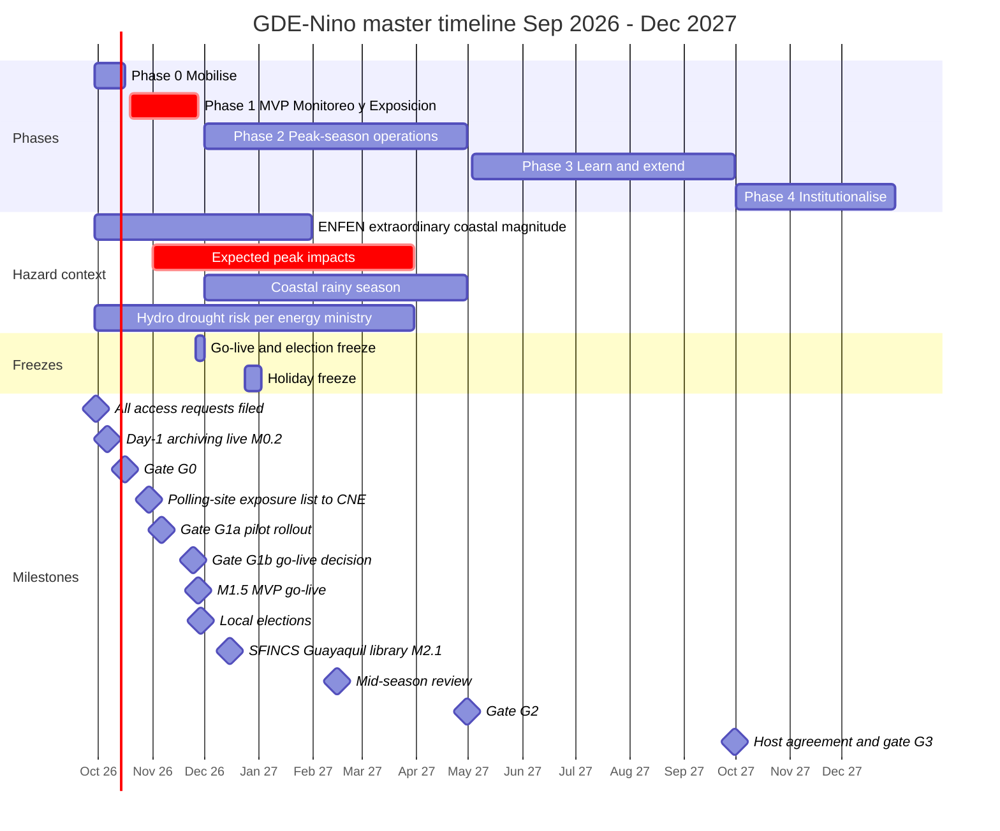
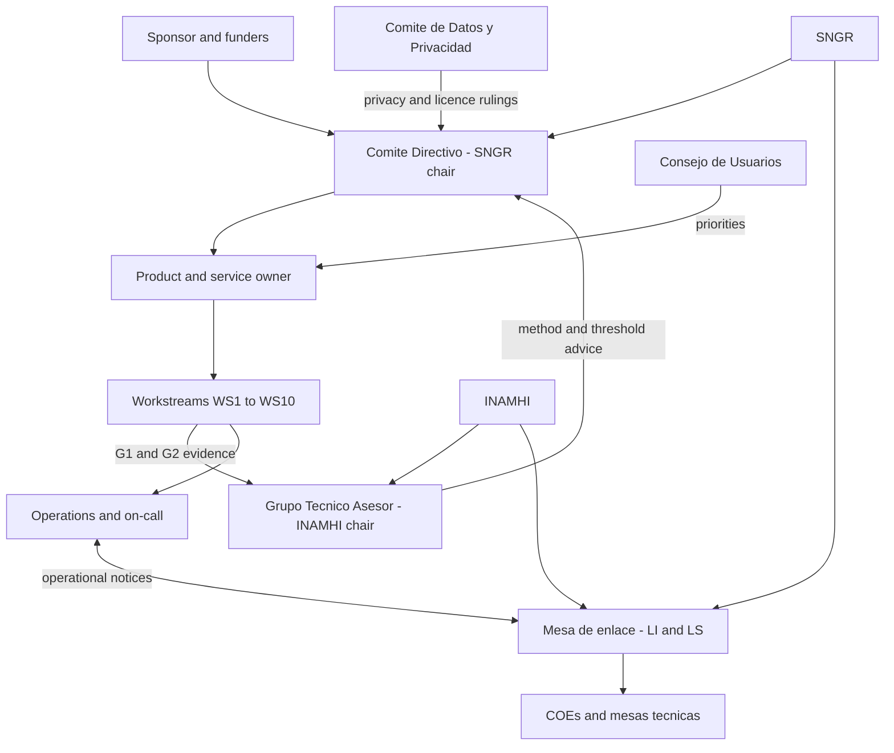
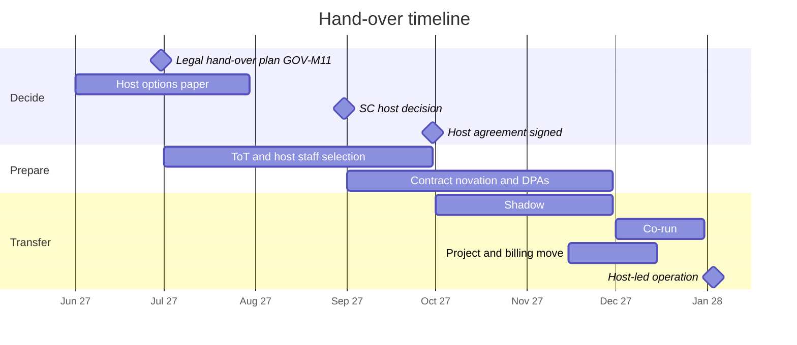

# Roadmap, team and budget

This document sets out how *Gemelo Digital Ecuador – El Niño* (GDE-Niño) gets from an empty cloud organisation on 29 September 2026 to a platform handed over to Ecuadorian institutions from October 2027 (shadow and co-run to end-2027; host-led operation from 2028-01-03, proposed). It covers the phases with exact dates, including a week-by-week plan for the six-week MVP; the ten workstreams and their leads; the team (roles, FTE per phase, skills, sourcing and RACI); the budget for Phases 0–3 with explicit assumptions and a minimum and a full variant; partnerships and governance; training and adoption; KPIs per phase; the pilot go/no-go checklist; and sustainability and hand-over. The technical components, buckets, tables and milestone IDs come from [03-architecture.md](./03-architecture.md), [04-identity-tenancy-byo-gcp.md](./04-identity-tenancy-byo-gcp.md), [07-impact-modules-and-triggers.md](./07-impact-modules-and-triggers.md) and [11-operations-runbook.md](./11-operations-runbook.md), and are not described again here. Cloud unit costs follow the anchors in [09-cost-model.md](./09-cost-model.md). Legal instruments are covered in [13-governance-legal-risk.md](./13-governance-legal-risk.md).

## Contents

1. [Urgency and phase overview](#1-urgency-and-phase-overview)
2. [Phase plans](#2-phase-plans)
3. [Workstreams and leads](#3-workstreams-and-leads)
4. [Team](#4-team)
5. [Budget](#5-budget)
6. [Partnerships and governance](#6-partnerships-and-governance)
7. [Training and adoption plan](#7-training-and-adoption-plan)
8. [KPIs per phase](#8-kpis-per-phase)
9. [Pilot go/no-go checklist](#9-pilot-gono-go-checklist)
10. [Sustainability and hand-over](#10-sustainability-and-hand-over)
11. [Open questions](#11-open-questions)

**Conventions.** Owner codes (PM, PL, DL, FL, FE, AI, SRE, DPO, TA) are those of the owner-role table at the top of [03](./03-architecture.md). IM, HYD, EPI, AGR and PT come from [07](./07-impact-modules-and-triggers.md). LI, LS, IC and COM come from [11 §0](./11-operations-runbook.md). PA (the same person as PT), LC and ETH come from [13 §0.2](./13-governance-legal-risk.md); VA comes from [14 §0.2](./14-verification-and-validation.md). §4.1 adds the remaining codes and maps them to the role names used in [01](./01-context-el-nino-ecuador.md) and [02](./02-users-requirements-ux.md). Every money figure is in US dollars. Figures labelled **assumption** are planning inputs to be validated. Figures labelled **estimate** are our own arithmetic, shown in the text. **(to confirm)** marks anything a partner must confirm, and **(unverified)** marks anything the research briefs could not confirm.

---

## 1. Urgency and phase overview

### 1.1 Why the timetable is so tight

El Niño is already happening. The plan has to deliver something useful before the coastal rainy season, not after it.

| Fact | Source | Consequence for the roadmap |
|---|---|---|
| CN-ERFEN declared El Niño active on 28 Aug 2026. Report 009-2026 (17–19 Sep) put the Niño 1+2 anomaly at +4.5 °C and gave >90% probability of "very strong" intensity by end-2026 | [El Diario](https://www.eldiario.ec/ecuador/fenomeno-el-nino-en-ecuador-gana-fuerza-y-se-intensificara-a-finales-de-2026-19092026/) | The event is under way. There is no time to "prepare for next year" |
| NOAA CPC gives a 75% chance that OND 2026 is "historic" (3-month RONI ≥ +2.5 °C) | [CPC Sep 2026](https://www.cpc.ncep.noaa.gov/products/analysis_monitoring/enso_disc_sep2026/ensodisc.shtml) | Plan for a 1997-98-class season |
| ENFEN Peru says "extraordinary" magnitude is most likely from Sep 2026 to Jan 2027 | [ENFEN 16-2026](https://enfen.imarpe.gob.pe/download/comunicado-oficial-enfen-n-16-2026) | Peak coastal forcing overlaps Phase 1 and early Phase 2 |
| Impacts began in the dry season: 7 rivers overflowed in Guayas, Esmeraldas and Manabí on 25–28 Sep | [Vistazo](https://www.vistazo.com/actualidad/2026-09-28-siete-rios-desbordan-guayas-esmeraldas-manabi-lluvias-ecuador-OG11249412) | Monitoring and exposure products are needed within weeks |
| INAMHI expects El Niño rains to intensify from Nov–Dec 2026 | [El Diario](https://www.eldiario.ec/ecuador/el-nino-en-ecuador-inamhi-alerta-por-aumento-de-lluvias-en-la-costa-cuando-seran-mas-intensas-14092026) | The MVP must be live by **27 Nov 2026** |
| Local elections were moved to **29 Nov 2026** | [Primicias](https://www.primicias.ec/politica/cne-elecciones-seccionales-ecuador-29-noviembre-119142/) | Go-live freeze from 26 Nov to 1 Dec ([11 §3.6](./11-operations-runbook.md)); GAD workspaces must survive the change of authorities |
| Mazar reservoir was at 2,134.2 masl on 28 Sep 2026. The 2024 blackouts began at about 2,115 masl | [Primicias](https://www.primicias.ec/economia/paute-ecuador-hidroelectrica-cota-embalse-mazar-estiaje-nivel-envivo-132362/) | A reservoir watch card is needed in the first MVP week. Users may lose power, so the product must work offline |
| The national plan's extreme scenario puts losses at US$1.3bn (1–1.5% of GDP) between Oct 2026 and Jan 2027 | [Vistazo](https://www.vistazo.com/actualidad/2026-07-01-gobierno-plan-enfrentar-fenomeno-nino-perdidas-usd-1-300-millones-GI11088842) | Even a small reduction in losses outweighs the whole programme budget (§5) |

Press reports a nationwide red alert (Res. SNGR-238-2026, [Primicias](https://www.primicias.ec/sociedad/alerta-roja-nacional-fenomeno-elnino-ecuador-2026-proyectado-magnitud-historica-131408/)). Independent records found only SNGR-193-2026 (orange). This conflict is item V1 in [01 §5.4](./01-context-el-nino-ecuador.md). The roadmap does not depend on how it is resolved, because the twin shows whatever resolution it ingests (D1).

### 1.2 Roadmap principles

| ID | Principle | What it means in practice |
|---|---|---|
| RM-01 | **Fixed dates, flexible scope** | Phase dates do not move. When a phase is at risk, "Should" and "Could" items are cut first (MoSCoW in [02 §5.1](./02-users-requirements-ux.md)) |
| RM-02 | **No-regret actions on day 1** | Every access request is filed on day 1–2 (by 2026-09-30) and every archive job is live by 2026-10-06 (M0.2), because some approvals take months and some sources keep no history (D12, AP-09) |
| RM-03 | **Proven before novel** | Phase 1 uses published products and simple joins. New models (OpenHydroNet fine-tune, WN2 perturbed-SST runs) wait for Phase 3 |
| RM-04 | **Official first; complement, don't duplicate** | The first screen of every product shows official content verbatim. Existing tools are linked or ingested (D1, D2) |
| RM-05 | **A gate at the end of every phase** | Each phase ends with written evidence against its exit criteria, signed by the Steering Committee (§6) |
| RM-06 | **Protect the peak** | No risky change during go-live, the elections, event mode or the holidays ([11 §3.6](./11-operations-runbook.md)) |
| RM-07 | **Build national capacity from day 1** | Secondees and university staff sit inside every workstream, so that the Phase 4 hand-over is a continuation and not a rescue |
| RM-08 | **Who benefits pays** | The programme pays for the core team, the control plane, the Commons and time-limited sponsored (T4) tenants. Everything else runs in, and is paid by, tenant projects (AP-02) |

### 1.3 Phases at a glance

| Phase | Dates | Length | Goal | Headline outputs | Exit gate |
|---|---|---|---|---|---|
| **0 Mobilise** | Tue 2026-09-29 → Fri 2026-10-16 | 14 working days (13 if Fri 9 Oct, Guayaquil's independence day, is a holiday; to confirm) | Remove every blocker that takes time: access, agreements, people, projects, archives | Access requests filed; projects and day-1 archiving live; core team contracted; governance constituted | G0, 2026-10-16 (§2.1) |
| **1 MVP "Monitoreo y Exposición"** | Mon 2026-10-19 → Fri 2026-11-27 | 6 weeks | A usable, trusted national monitoring and exposure view, plus 3–5 pilot tenants | Sign-in and BYO-GCP onboarding; official alerts; ENSO panel; parish exceedance probabilities; river status; exposure; canton PDF and WhatsApp card; Jev triage | G1a pilot rollout 2026-11-06; G1b go-live decision 2026-11-24, go-live 2026-11-27 (§9) |
| **2 Peak-season operations** | Tue 2026-12-01 → Fri 2027-04-30 | 5 months | Operate reliably through the peak and add impact modules | Event mode; SFINCS scenario library for 4 sites; landslides; dengue; agriculture and shrimp; roads; trigger dashboards; weekly verification; ≥30 tenants | G2, 2027-04-30 |
| **3 Learn and extend** | Mon 2027-05-03 → Thu 2027-09-30 | 5 months | Learn from the season and extend to the Andes/Amazon hydro-energy pathway | Post-event verification; OpenHydroNet Ecuador fine-tune; hydro-energy and drought module; WN2 perturbed-SST engine; host agreement | G3, 2027-09-30 |
| **4 Institutionalise** | From Fri 2027-10-01 | Open-ended | Hand over to a national host with SLAs and a sustainable funding line | Shadow, co-run, then host-led operation; procurement channels; regional extension | Host-led operation from 2028-01-03 (proposed) |

### 1.4 Master timeline

---

## 2. Phase plans

### 2.1 Phase 0 – Mobilise (2026-09-29 → 2026-10-16)

**Objectives**

1. File every third-party access request on day 1–2 and track each to a decision or a fallback.
2. Stand up `ectwin-{platform,commons}-{dev,prod}` with budgets, org policies and Terraform state, and start archiving the sources that keep no history.
3. Contract the core team (≈13 FTE, §4.2) and constitute the governance bodies (§6).
4. Send the letters of intent and draft *convenios* to INAMHI, SNGR, INOCAR/CN-ERFEN, CELEC/CENACE, MSP and MAG.
5. Secure bridge funding for Phases 0–1 and agree the sponsor term sheet.

**Scope**

| In | Out |
|---|---|
| Projects, IAM, budgets, day-1 archiving, geoblock test, identity in `-dev`, bootstrap v0 on 2 internal tenants | Any user-facing product |
| Access requests, *convenio* drafts, pilot letters of intent | Signed data licences (targeted for Phase 1) |
| Research weeks W1–W3 ([02 §9](./02-users-requirements-ux.md)) | Visual design beyond the prototype |
| Verification backlog V1–V12 ([01 §5.4](./01-context-el-nino-ecuador.md)) | Model development |

**Access-request tracker (filed by Wed 2026-09-30 unless stated).** IDs AR-01–AR-11; the bare IDs A1–A16 are the data-sharing agreements of [05 §6.1](./05-data-catalog.md).

| # | Access | For | How | Expected lead time | Fallback while pending | Owner |
|---|---|---|---|---|---|---|
| AR-01 | WeatherNext 2 and 3 (BigQuery, Earth Engine, GCS) | Commons project, plus one platform QA account. **Use institutional, role-based Google accounts**, because access is allowlisted per account ([04 §9](./04-identity-tenancy-byo-gcp.md)) | [WeatherNext Data Request form](https://docs.google.com/forms/d/e/1FAIpQLSeCf1JY8G78UDWzbm0ly9kJxfSjUIJT5WyMR_HiNqCm-IHIBg/viewform); accept the [terms of use](https://storage.googleapis.com/weathernext-public/terms-of-use.pdf); send the question on publishing Non-Retrievable products to weathernext@google.com (GOV-M1 in [13 §13.1](./13-governance-legal-risk.md), by 10-02) | ≈5–7 business days | ECMWF IFS/AIFS open data ([06](./06-forecast-model-stack.md)) | FL |
| AR-02 | WN2 on-demand runs on Agent Platform (allowlist) | Commons (Phase 3 engine) | Allowlist request; GPU quota starts at 0 ([11 §3.7](./11-operations-runbook.md)) | (unverified) | Phase 3 item; can slip | FL |
| AR-03 | Google Flood Forecasting API | `ectwin-commons-prod` project ID | [Waitlist form](http://sites.research.google/gr/floodforecasting/api-waitlist/), then reply with the project ID | Possibly months | GloFAS (EWDS), GEOGloWS-INAMHI, GRRR baseline | DL |
| AR-04 | Earth Engine registration; **Partner tier** application (100,000 EECU-h/month) | Commons and platform projects | Partner-tier application (100,000 EECU-h/month) filed on day 1 ([tiers](https://raw.githubusercontent.com/gvillarroel/gcp-radar/main/data/step-04/current/products/earth/corpus/site/site-docs-root/pages/developers.google.com_earth-engine_guides_noncommercial_tiers.md)); `ectwin-commons-prod` operational production registered **Commercial – Limited** (US$0.40/EECU-h, [pricing](https://cloud.google.com/earth-engine/pricing); budgeted in §5.2, line C4) unless Google confirms in writing that the Partner tier covers it ([13 §3.4](./13-governance-legal-risk.md), LP-07) | Several weeks (Partner decision) | Commercial – Limited is the working basis until then | FL |
| AR-05 | TypeSafe Jev key; enquiry about enterprise ZDR and higher limits. **Status 2026-10-01: access held (miguel@wursta.com); key storage pending** | Commons | [console.typesafe.ai](https://console.typesafe.ai/) | Days | Gemini adapter or open-weight backend (D17) | AI |
| AR-06 | Copernicus CDS and EWDS accounts; accept dataset licences (C3S seasonal, GloFAS) | Commons | CDS profile token ([seasonal dataset](https://cds.climate.copernicus.eu/datasets/seasonal-monthly-single-levels)) | Same day (estimate) | — | DL |
| AR-07 | Copernicus Marine account (sea-level `zos`, waves) | Commons | Account registration | Same day (estimate) | EE copies of CMEMS assets ([05](./05-data-catalog.md)) | DL |
| AR-08 | NASA Earthdata login (IMERG, LHASA inputs) | Commons | Account registration | Same day (estimate) | EE `NASA/GPM_L3/IMERG_V07` | DL |
| AR-09 | OAuth sensitive-scope verification for path B | Platform | Google Auth Platform console; submit **2026-10-05** (IT-M2) | Days to weeks (unverified) | Path A covers all pilots | PL, DPO |
| AR-10 | Google Cloud credits: research credits for university partners (up to US$5,000) and startup or nonprofit programmes where eligible | University partners, operator | [Research credits](https://cloud.google.com/edu/researchers), [startup programme](https://cloud.google.com/startup); nonprofit route (unverified) | Weeks | None needed: no credits are assumed (B10, §5.1); credits obtained reduce lines C1–C8 (§5.2) | PM |
| AR-11 | Quota increases ([11 §3.7](./11-operations-runbook.md)) | Commons, platform | Console requests | Days | Posture-based throttling | DL, FL, SRE |

Filing pack and live status (2026-10-01): [outreach/access-requests/README.md](../outreach/access-requests/README.md).

**Deliverables**

| ID | Deliverable | Due | Owner | Acceptance |
|---|---|---|---|---|
| P0-01 | Access requests AR-01–AR-10 filed; tracker in the programme board | 2026-09-30 (AR-09: 10-05) | PM | Screenshot or receipt archived for each |
| P0-02 | Letters of intent and draft *convenios* sent to INAMHI, SNGR, INOCAR/CN-ERFEN, CELEC/CENACE, MSP, MAG (plus CEDIA for the relay) | 2026-10-02 | PT | Receipt acknowledged by each; named contacts for 5 of 7 |
| M0.1 | Projects created with budgets, org policies, Terraform state ([03 §13](./03-architecture.md)) | 2026-10-02 | PL | `terraform plan` clean on all four |
| IT-M1 | Identity Platform in `-dev` ([04 §14](./04-identity-tenancy-byo-gcp.md)) | 2026-10-02 | PL | 7-case identity test matrix passes |
| M0.2 | Day-1 archiving live | 2026-10-06 | DL | ≥3 consecutive days of raw captures with sidecars |
| P0-03 | Sponsor term sheet signed; bridge funding for Phases 0–1 committed (≈US$0.22–0.31M: minimum to full variant, §5.4–§5.5) | 2026-10-09 | PM | Signed letter or contract |
| P0-04 | Core team contracted: 13 FTE per §4.5 (PM, PL, DL, FL, FE, PT, SRE, UX, BE, DE plus part-time CS, IM, AI, CD, DPO, ADM) | 2026-10-09 | PM | Contracts signed; security and LOPDP induction done |
| M0.3 | Geoblock test from `southamerica-west1`; relay decision | 2026-10-09 | DL | Report per host; relay partner named |
| OPS-M0 | Pager rota, channels, contacts register, status page | 2026-10-09 | SRE | Test page acknowledged within 10 min |
| IT-M3 | Bootstrap v0.1.x (script and Terraform) on 2 internal tenants | 2026-10-09 | PL | PF-01–PF-12 green |
| P0-05 | Steering Committee constituted; first meeting held | 2026-10-14 | PM | Terms of reference approved; minutes |
| P0-06 | 3–5 pilot tenants shortlisted, with letters of intent (≥1 T4 GAD, ≥1 T2 public, ≥1 commercial private tenant, e.g. a CNA shrimp cluster or an AgroProtege insurer) | 2026-10-16 | PT | Signed letters of intent |
| P0-07 | Procurement kit v0: terms-of-reference template, tax note v0, reseller route. The SERCOP OCDS search for past GCP purchases follows by 10-23 (PT, [13 §7.1](./13-governance-legal-risk.md)); the signed tax and procurement memo by 11-06 (GOV-M5) | 2026-10-16 | PM, DPO | Reviewed by counsel |
| P0-08 | DPIA v0, RAT template and processor-contract template | 2026-10-16 | DPO | Counsel review scheduled |
| P0-09 | Verification backlog V1–V12 closed or re-dated | 2026-10-16 | Per [01 §5.4](./01-context-el-nino-ecuador.md) | Each item has a result or a new date |
| M0.4 / IT-M4 | Broker skeleton, registry, connect flow | 2026-10-16 | PL | Cross-tenant isolation suite passes |
| OPS-M1 | Day-1 archiving monitored | 2026-10-16 | DL, SRE | `source_health` filled from both regions for ≥3 days |
| P0-10 | Budget baseline, Phase 0–1 variant decision (§5.5) and hiring plan approved | 2026-10-16 | PM, SC | SC minute |
| P0-11 | Jev build start ([08 §3.8](./08-ai-decision-layer-jev.md)): B5 DQ flags in ingestion jobs in shadow (10-09); B1 catalogue triage of ≈5,000 items (10-16) | 2026-10-16 (B5: 10-09) | DL, AI | B5 flags visible in `commons_ops.dq_results`; B1 meets the acceptance in [08 §3.2](./08-ai-decision-layer-jev.md) |

**Exit gate G0 (2026-10-16), signed by the Steering Committee.** Pass when all of these hold:

- (a) AR-01–AR-08 are filed and ≥1 WeatherNext approval has arrived, or the IFS fallback is running.
- (b) M0.1–M0.4 are accepted.
- (c) ≥10 FTE are under contract.
- (d) Bridge funding is committed.
- (e) At least INAMHI and SNGR have named focal points (LI, LS).
- (f) ≥3 pilot letters of intent are signed.
- (g) Jev B1 catalogue triage is accepted (P0-11).

A failed G0 does not stop Phase 1. The SC instead switches to the minimum variant (§5.5) and records the scope cuts.

**Dependencies.** Sponsor decision; Google approvals (AR-01, AR-03, AR-04); partner contacts; the geoblock result; counsel availability.

**Phase 0 risks** (§2.6; the single register is [13 §11.2](./13-governance-legal-risk.md)): PRG-01 access delays; PRG-02 hiring lag; PRG-03 geoblocking; PRG-08 funding gap.

### 2.2 Phase 1 – MVP "Monitoreo y Exposición" (2026-10-19 → 2026-11-27)

**Objectives**

1. Put a trusted national view in front of COEs: official alerts first, then the ENSO panel, parish exceedance probabilities, river status and exposure, in a text-first PWA with daily canton PDFs and WhatsApp cards.
2. Connect 3–5 pilot tenants through the BYO-GCP flow, with cost guardrails, including at least one sponsored (T4) GAD and one self-paid commercial private tenant (P0-06).
3. Deliver two early products: the polling-site exposure list for the CNE (**30 Oct**) and the reservoir watch card (CTX-09).
4. Be ready to operate: SLOs, runbooks rehearsed, N2 rota trained, pen test passed.

**Scope.** MVP geography (CTX-08): Guayas, Los Ríos, Manabí, El Oro, Esmeraldas and Santa Elena for floods; Azuay, Cañar and Napo for the energy card.

| In (Must) | Out (moved to Phase 2 or 3) |
|---|---|
| Sign-in (Google, email and password), T0 viewer, paths A and B (B behind a flag) | SAML/OIDC for ministries; WIF path C2; self-deploy path D |
| Official-alert ingestion and the verbatim band | Publishing back to SNGR `COE2` / OGC (FR-023) |
| ENSO panel (ICEN, RONI, SOI, sea level) with the coupling/confidence indicator v1 | WN3 full-member accumulations at 0.1° (ADR-29) |
| WN2 members and WN3 statistics → `parish_exceedance`; risk index v1 | SFINCS scenario library; LHASA; dengue DLNM |
| River status: GloFAS, GEOGloWS and the Flood API if approved | OpenHydroNet fine-tune |
| Exposure: population, buildings, schools, health, roads, polling sites, crops (IMP-15–18, IMP-07) | Trigger evaluation beyond read-only; evidence packs |
| Canton PDF, WhatsApp card, T0 read-only national view | Kichwa audio |
| Jev report triage and parish escalation, with human review | Analyst copilot |

**Deliverables.** These are the milestones already committed in other documents, gathered here into one list:

| Date | Architecture ([03 §13](./03-architecture.md)) | Identity ([04 §14](./04-identity-tenancy-byo-gcp.md)) | Operations ([11 §13](./11-operations-runbook.md)) | Impacts ([07 §8](./07-impact-modules-and-triggers.md)) | UX ([02 §9](./02-users-requirements-ux.md)) | Jev build ([08 §3.8](./08-ai-decision-layer-jev.md)) |
|---|---|---|---|---|---|---|
| 10-23 | — | IT-M5 domain-restriction note | — | Reservoir watch card (IMP-13) | Usability round 1 | B3 place resolver |
| 10-30 | M1.1 forecast cycle v1 | IT-M6 guard kill switch | — | **Polling-site list (IMP-16)** | Usability round 2 | — |
| 11-06 | M1.2 listings, tiles | IT-M7 path B, invitations | OPS-M2 SLOs in stg | — | Tabletop; **G1a** | — |
| 11-13 | M1.3 PWA, band, PDFs | IT-M8 3 pilot tenants | OPS-M3 game day | — | — | B2 SITREP 2026 tables |
| 11-20 | M1.4 pen test, DR, pilots | IT-M9 pen test | OPS-M4 event drill | Risk index v1 (IMP-01) | — | — |
| 11-27 | **M1.5 MVP gate** | IT-M10 MVP gate | OPS-M5 ops gate | Phase 1 IMP set | — | — |

**Week-by-week plan, engineering workstreams**

| Week | Theme | WS1 Platform (PL) | WS2 Commons data (DL) | WS3 Forecast and verification (FL) | WS4 Impacts (IM) |
|---|---|---|---|---|---|
| **W1** 19–23 Oct | Real data end to end in stg | Registry and broker in stg; bootstrap v1 with T1/T2 profiles; funnel events; **IT-M5** | ≥10 days of continuous archive; `.gob.ec` ingest via the chosen route (direct or relay); `official_alerts` parser v1 tested on resolution PDFs; exposure v0 loaded; Jev B3 place resolver accepted (10-23) | Forecast-cycle skeleton in `-dev` (WN2 members, WN3 statistics); `enso_indices` with provenance (V2 reconciled); bias-correction plan agreed with LI | **Reservoir watch card** in dev; polling-site join started; M10 population and M5 crop exposure |
| **W2** 26–30 Oct | Cycle v1 and first partner delivery | **IT-M6** guard and cost dashboard; first pilot bootstrap (sponsored T4) | Flood API snapshots if approved, else GloFAS/GEOGloWS only; seasonal canton tables from the 13 Oct C3S release (unverified date); Analytics Hub listing in stg | **M1.1**: 8 consecutive cycles, ≤60 min after WN3 availability, ≤1 GB scanned per cycle | **Polling-site list to CNE (30 Oct)**; M1 river × exposure and M2 tide + rain calendar started |
| **W3** 2–6 Nov (2–3 Nov holidays, to confirm) | Listings live; pilot decision | **IT-M7** path B behind a flag; invitations; project switcher | **M1.2** listings `ectwin_commons_v1` in prod; tiles and national JSON | Bias correction v0 (quantile mapping against INAMHI + CHIRPS v3); verification scaffolding | Risk index v1 build (11-02 → 11-20); MSP gazette parser (M7) |
| **W4** 9–13 Nov | Pilots connected | **IT-M8**: 3 pilot tenants green (≥1 T4, ≥1 T2) | Canton PDF and WhatsApp card pipeline; DQ gates set to `block`; Jev B2 SITREP 2026 tables accepted (11-13, [08 §3.8](./08-ai-decision-layer-jev.md)) | CPC 12 Nov update ingested; coupling/confidence v1 | M1 and M2 in stg; M6 basic shrimp card |
| **W5** 16–20 Nov | Hardening | **IT-M9** pen test T01–T20; fixes | DR restore rehearsal with SRE; archive audit green | Brier baseline for parish exceedance published; methodology pages; C3S November run ingested (13–16 Nov); calibrated full-DJFMA canton outlook by 2026-11-18 (FS-M1.3 in [06](./06-forecast-model-stack.md)) | **Risk index v1 done**; exposure final for the 6 provinces |
| **W6** 23–27 Nov | Go-live | Release candidate promoted **Wed 25 Nov**, the last change window before the freeze | All Phase 1 products in prod; freshness SLOs green | Cycle success ≥95% over 7 days (SLO-06); pilot tenant pipelines ≥98% (M1.4) | Phase 1 IMP set complete ([07 §8](./07-impact-modules-and-triggers.md)) |

**Week-by-week plan, product, operations and adoption workstreams**

| Week | WS5 Front end and UX (FE, UX) | WS6 AI layer (AI) | WS7 Operations (SRE) | WS8 Partnerships, legal, privacy (PT, DPO) | WS9 Training and adoption (TR) | WS10 Programme (PM) |
|---|---|---|---|---|---|---|
| **W1** | Usability round 1 (8 sessions); PWA shell with text-first place summary; vocabulary guard in CI | `DecisionBackend` with TypeSafe plus one fallback; report triage in shadow mode | Synthetic probes; logging contract; paging tested | *Convenio* negotiation with INAMHI and SNGR; data-sharing annex; DPIA v1 | Training-needs analysis from interviews; champion per pilot named | Weekly status; SC #2 (Wed 21 Oct) |
| **W2** | Usability round 2 on the alpha; field test on a weak connection (Balao); comprehension survey launched | Parish escalation in shadow; human-review queue | SLOs and alert policies in Terraform; quota requests (Cloud Run CPU, TypeSafe) | Disclaimer text v1 reviewed by counsel; pilot DPAs drafted | Modules C1 and C2 drafted; video scripts | Procurement kit v1 to pilot GADs; SC #3 (Wed 28 Oct) |
| **W3** | **Tabletop with the Guayas and Manabí COEs (4–6 Nov)**; round-2 fixes | Bulletin text via Gemini Flash-Lite Batch with human review | **OPS-M2** dashboards in stg | **G1a pilot rollout decision (Fri 6 Nov)**; processor-contract template final; interim pilot terms and privacy notice accepted (§9 B1a) | Pilot training plan final; video hosting and certificates | SC #4 (Wed 4 Nov); G1a decision record; risk review |
| **W4** | **M1.3**: PWA, official band, canton PDFs by 06:30 ECT | Triage load test at event volume; failover drill | **OPS-M3 game day**; C3D Spot, L4 and Gemini quota pre-raise | Co-branding decision with SNGR and INAMHI; privacy notice final; DPIA-01 and pilot DPAs signed (GOV-M6, 13 Nov) | Wave 1 (remote): C2 for pilot IT admins, C1 for pilot COE users | SC #5 (Wed 11 Nov): Phase 2 commitments |
| **W5** | Accessibility audit: 0 serious or critical issues; Spanish content QA | Thresholds frozen; `jev-1.13.0` pinned | **OPS-M4** event drill with a pilot COE; DR restore ≤4 h; **N2 rota of 8 trained** | Counsel signs off the label and disclaimer set | Wave 2 (in person, Guayaquil and Portoviejo): C1, C3, C4 | Go/no-go pre-read |
| **W6** | Final UX checks; status-page link in PDFs | National triage live with human review | **OPS-M5** operations gate; posture N1; freeze published | **G1b go/no-go Tue 24 Nov**; LS briefs the COEs | Quick-reference cards; WhatsApp micro-lessons scheduled; office hours | **M1.5 MVP gate Fri 27 Nov**; Phase 1 report |

**Exit gate G1b.** The decision is on Tue 2026-11-24; the formal go-live (M1.5) is Fri 2026-11-27. It passes when every blocking item in §9 is green, the Phase 1 "Must" requirements in [02](./02-users-requirements-ux.md) pass acceptance, and the Phase 1 product set in [07 §8](./07-impact-modules-and-triggers.md) is live. From 28 Nov to 1 Dec (election weekend) a hypercare roster runs at posture N1 under the freeze.

**Dependencies.** WeatherNext approval (AR-01); INAMHI station archive and thresholds (*umbrales*); SNGR alert feed or relay; pilot tenants' ability to create projects and billing accounts; counsel sign-off on the disclaimer (blocked in part by V6/V7).

**Phase 1 risks.**

| Risk | Early sign | Response |
|---|---|---|
| WeatherNext not approved by W2 | AR-01 still pending on 10-26 | Run the cycle on IFS open data labelled "modelo de respaldo"; M1.1 accepted on the fallback |
| Flood API waitlist | No approval by 11-06 | Leave the feature flag off; ship GloFAS and GEOGloWS only (already the plan) |
| Pilot GADs cannot get billing in time | No billing account by 11-06 | Move them to T4 sponsored projects (budget line C7) |
| Usability shows platform levels are confused with official alerts | Below 95% correct in round 2 | Stop and redesign the band before G1a; this item blocks the gate |
| Team overload in W5–W6 | Burn-down slips >20% | Cut "Should" items (path B general availability, M6 card) per RM-01 |

### 2.3 Phase 2 – Peak-season operations (2026-12-01 → 2027-04-30)

**Objectives**

1. Operate through the peak at the SLOs in [11 §4](./11-operations-runbook.md), with event mode (N2/N3) whenever the criteria are met.
2. Add the impact modules and the scenario library ([07](./07-impact-modules-and-triggers.md)).
3. Scale to ≥30 tenants by 2027-03-31 and ≥300 weekly active COE and GAD users ([02 §10](./02-users-requirements-ux.md)).
4. Publish verification every week and keep the credibility KPIs at target (0 confusion incidents).

**Scope in.** Event mode; SFINCS library for Guayaquil/Durán, Machala, Portoviejo/Chone and Esmeraldas; LHASA; dengue DLNM; agriculture and shrimp indices; roads and isolation; trigger dashboards and evidence packs; risk index v2; SAML/OIDC for ministries; WIF path C2; CDN switch when needed; OGC/ArcGIS export.

**Scope out.** OpenHydroNet fine-tune; the full hydro-energy module; the WN2 perturbed-SST engine; path D; regional extension.

**Month-by-month plan**

| Month | Platform and operations | Data, forecast and verification | Impacts and triggers | Users, training and partners |
|---|---|---|---|---|
| **Dec 2026** | Posture N1; N2 as criteria dictate; **M2.1 (12-15)**: event mode tested, CDN decision; OPS-M6 threshold review (12-15); holiday freeze 24 Dec – 2 Jan | Daily provisional verification in event mode; CPC 10 Dec update; Jev B4 impact database 2010–2026 labelled (12-11, [08 §3.8](./08-ai-decision-layer-jev.md)) | SFINCS Guayaquil/Durán library (11-23 → 12-15); drought-lite card (→ 12-15); risk index v2 in shadow (from 12-15); LHASA and dengue started; trigger work started | Training wave 3 in the 6 flood provinces; onboarding to ≈15 tenants. Gemini 3.8 Flash doubles in price on 2027-01-01 ([pricing](https://cloud.google.com/vertex-ai/generative-ai/pricing)), so Gemini budgets and routing are re-baselined by 2026-12-15 (AI-20 in [08](./08-ai-decision-layer-jev.md)); the analyst copilot only starts in Phase 3 |
| **Jan 2027** | **IT-M11** WIF path C2 (01-31); SAML tier 2 for the first ministry | **M2.2 (01-15)**: go/no-go on WN3 full members; CPC 14 Jan | Machala and Portoviejo/Chone libraries (→ 01-15); Esmeraldas (→ 01-31); risk index v2 promoted (01-12); LHASA and dengue at G1 (01-15); triggers and evidence packs (→ 01-31) | Onboarding of new GAD authorities (start date V12, to confirm); second tabletop exercise |
| **Feb 2027** | **OPS-M7 mid-season review (02-15)**: staffing fatigue, costs, recalibration. Carnival 8–9 Feb (to confirm) needs an explicit rota | Recalibration decision now that WN3 has more history; CPC 11 Feb | Module G2 reviews with partners (INAMHI, MSP, MAG, Segura EP) | ≈25 tenants; user council; SUS re-test |
| **Mar 2027** | Capacity review for the national scale-up | CPC 11 Mar; seasonal outlook for the end of the rains | ≥3 partner trigger sets with signed thresholds and backtests | **≥30 tenants and ≥300 WAU (03-31)**; trust survey drafted |
| **Apr 2027** | Posture back to N0/N1; end-of-season preparation | Verification data set assembled; season archive freeze prepared (freeze at VV-3.1/OPS-M8, 2027-05-15 at the latest) | Evidence pack reproduced by an external reviewer | Phase 2 report; **G2 (04-30)** |

**Exit gate G2 (2027-04-30).** Pass when all of these hold:
- (a) The Phase 2 exit in [07 §8](./07-impact-modules-and-triggers.md) is met: four SFINCS sites at G2; M4, M7 and the M5 disease index at G2; `ri-2.0.0` promoted; ≥3 signed trigger sets; one evidence pack reproduced.
- (b) Weekly verification has been published for ≥16 weeks.
- (c) The SLOs in [11 §4.1](./11-operations-runbook.md) were met in ≥90% of weeks.
- (d) There were 0 confirmed confusion incidents.
- (e) ≥30 tenants.
- (f) The programme spent within ±10% of plan.

**Dependencies.** Spot capacity; INAMHI and MSP data flows; partner reviewers for G2; sponsor tranche for Phase 2.

**Phase 2 risks.** Fatigue in long N2 periods (PRG-07); Spot shortage (PRG-13); a missed or over-forecast event damaging trust (PRG-05); new GAD authorities not re-onboarded (PRG-10); price and terms changes from vendors (PRG-11).

### 2.4 Phase 3 – Learn and extend (2027-05-03 → 2027-09-30)

**Objectives.** Learn honestly from the season; add the Andes/Amazon hydro-energy and drought pathway (D4b) for the La Niña transition; build the what-if engine; and prepare the hand-over.

| Due | Deliverable | Owner | Acceptance |
|---|---|---|---|
| 2027-05-15 | **OPS-M8** end-of-season review; runbook v2 | PM | Report published |
| 2027-05-31 | Post-season user survey (trust KPI) and a lessons-learned workshop with the COEs | UX, PT | ≥70% "confío en la herramienta" ([02 §10](./02-users-requirements-ux.md)) |
| 2027-06-30 | Post-event verification report, including misses and false alarms (VV-3.2 in [14 §11](./14-verification-and-validation.md)) | FL | Published openly; approved by the TAG in its model-governance role (the CTC of [14 §8.5](./14-verification-and-validation.md)) |
| 2027-06-30 | Legal hand-over plan approved by the SC: instruments, novation of *convenios*, transfer of projects and approvals (GOV-M11, [13 §9.4](./13-governance-legal-risk.md)) | PM, PT | SC minute; feeds the host options paper |
| 2027-06-30 | M8 full hydro-energy module for Paute–Mazar–Sopladora and Coca Codo Sinclair ([07 §4.8](./07-impact-modules-and-triggers.md)) | IM, HML | Delivered at G1 with CELEC/CENACE review; G2 decided 2027-09-15 after verification (VV-3.5 in [14 §11](./14-verification-and-validation.md)) |
| 2027-07-30 | OpenHydroNet fine-tuned on Ecuadorian basins, plus a Caravan extension for Ecuador (none exists yet) | HML, FL | Model delivered; leave-basin-out skill against GRRR, GEOGloWS and GloFAS and the `OHN-EC` gate decided by 2027-08-31 (VV-3.4 in [14 §11](./14-verification-and-validation.md)) |
| 2027-07-30 | Transition plan and host options paper (§10) | PM | SC decision on the host |
| 2027-07-31 | WN2 perturbed-SST scenario engine at G1, or formally parked with the result published | FL | Per [07 §7.4](./07-impact-modules-and-triggers.md) |
| 2027-08-31 | Training of trainers with 4 universities; host-staff selection begins once the SC has chosen the host (shadowing starts 2027-10-01, §2.5) | TR | ≥20 certified trainers |
| 2027-09-15 | Two intervention levers validated with partners | IM | Partner sign-off |
| 2027-09-30 | **IT-M12** path D self-deploy release | PL | Test org deploys in ≤1 day |
| 2027-09-30 | **Host agreement signed**; SLA draft; readiness for season 2 | PM, SC | Signed agreement |

**Exit gate G3 (2027-09-30).** Host agreement signed; Phase 3 exit in [07 §8](./07-impact-modules-and-triggers.md) met; post-event report published; ≥60% of operational roles have a named counterpart in an Ecuadorian institution.

**Risks.** Funding cliff after the peak (PRG-08); the host fails to secure a budget line (PRG-15); key staff leave after the season.

### 2.5 Phase 4 – Institutionalise (from 2027-10-01)

| Step | Dates (proposed) | Content |
|---|---|---|
| Shadow | 2027-10-01 → 2027-11-30 | Host staff sit in every ritual and rota; the operator leads |
| Co-run | 2027-12-01 → 2027-12-31 | Host leads daily operations with operator backup; the operator keeps releases |
| Host-led | From 2028-01-03 | Host leads; the operator provides third-line support under a service contract with SLAs |
| Channels | From 2027-10 | Procurement kit for ministries and GADs; evaluate a Marketplace listing so that ministries can pay from existing GCP commitments ([integrated SaaS](https://docs.cloud.google.com/marketplace/docs/partners/integrated-saas)) |
| Regional extension | From 2028 | Transboundary basins shared with Peru and Colombia, through CAPRADE and CIIFEN (to confirm) |

### 2.6 Programme delivery risks

The single risk register is [13 §11.2](./13-governance-legal-risk.md) (`legal/risk/register.yaml`, R01–R35). The delivery risks below use the prefix PRG- so that they do not clash with its IDs; the column "13 ID" maps each one to the register where they overlap. L = likelihood, I = impact (H/M/L).

| ID | 13 ID | Risk | L | I | Mitigation | Indicator | Owner |
|---|---|---|---|---|---|---|---|
| PRG-01 | R05 (Flood API) | Access approvals late (WeatherNext, Flood API waitlist, EE Partner tier) | H | M | File on day 1; fallbacks in the AR tracker (§2.1); Limited-plan budget | Any AR item pending >10 working days | PM |
| PRG-02 | R26 | Hiring lag for scarce skills (SRE, hydraulic modelling) | H | H | University agreements, secondees, contractors; RM-01 scope cuts | <10 FTE contracted by 10-09 | PM |
| PRG-03 | R11 | `.gob.ec` sources geoblocked from GCP | M | H | Relay at CEDIA or INAMHI; agency push ([03 §4.1](./03-architecture.md)) | M0.3 report | DL |
| PRG-04 | R10 | Slow *convenios* (INAMHI licence, SNGR feed) | M | H | Letters of intent early; verbatim link-outs; scraped endpoints only as a stopgap | Unsigned by 11-06 | PT |
| PRG-05 | R02 | Over-forecast or a missed event damages credibility (2023-24 precedent) | M | H | Coupling indicator; open verification; analog envelopes; D3 | Brier skill below baseline for 4 weeks | FL |
| PRG-06 | R01 | Platform output mistaken for an official alert; legal exposure | M | H | D1 vocabulary guard; disclaimers; usability gate; counsel review | Any confusion report | PM, DPO |
| PRG-07 | — | Staff fatigue in long N2 periods | M | H | Pool of 9 trained people; rest rules ([11 §1.3](./11-operations-runbook.md)); secondee top-up | >14 consecutive N2 days | SRE, PM |
| PRG-08 | R15 | Sponsor funding gap or late tranche | M | H | Bridge for Phases 0–1; minimum variant; tranche linked to gates | Tranche >15 days late | PM |
| PRG-09 | R14 | Public tenants cannot procure GCP in time | H | M | T4 sponsored projects; reseller route; procurement kit ([Google LLC is the contracting entity for Ecuador](https://cloud.google.com/terms/google-entity)) | Pilot without billing by 11-06 | PT |
| PRG-10 | R27 | Change of GAD authorities after 29 Nov | H | M | Org-owned projects, ≥2 Owners (G5 in [04](./04-identity-tenancy-byo-gcp.md)); re-onboarding pack | New authorities not onboarded within 30 days | TR |
| PRG-11 | R03, R17 | Vendor changes: WeatherNext terms (effective 14 days after posting) or fees (≥1 month's notice) ([13 §3.2](./13-governance-legal-risk.md)); TypeSafe maturity (no SLA); Gemini price rises (3.8 Flash doubles on 2027-01-01) | M | M | `DecisionBackend` fallbacks; IFS fallback; model tiering | Notice received | AI, FL |
| PRG-12 | — | Power cuts and blackouts affect users and staff | M | M | Offline PWA, PDFs, WhatsApp cards; field connectivity kits (line O10) | Rationing announced by CENACE | FE, SRE |
| PRG-13 | — | Spot capacity shortage at peak | M | L | On-demand fallback ([11 §3.8](./11-operations-runbook.md)) | Queued >20 min | FL |
| PRG-14 | R14 | Tax treatment adds cost (IVA on operator invoices, ISD, withholding) | M | M | Tax note in Phase 0; contract structure chosen accordingly | Tax note v0 by 10-16 (P0-07); signed memo by 11-06 (GOV-M5, [13 §13.1](./13-governance-legal-risk.md)) | PM, DPO |
| PRG-15 | R35 | No national host or budget line for 2028 | M | H | Host options paper by 07-30; multilateral bridge; keep-the-lights-on variant (§10.4) | No SC decision by 08-31 | PM, SC |

---

## 3. Workstreams and leads

| WS | Workstream | Lead | Deputy | Scope | Reference docs | Phase 1 headline |
|---|---|---|---|---|---|---|
| WS1 | Platform, identity and tenancy | PL | BE | Control plane, broker, onboarding paths A–D, guardrails, IaC, releases | [03](./03-architecture.md), [04](./04-identity-tenancy-byo-gcp.md), [10](./10-setup-and-deployment.md) | 3 pilot tenants green (IT-M8) |
| WS2 | Commons data and ingestion | DL | DE | Archiving, `.gob.ec` and global ingestion, warehouse, listings, tiles, PDFs | [05](./05-data-catalog.md) | Listings in prod (M1.2) |
| WS3 | Forecast, ENSO and verification | FL | CS | Forecast cycle, bias correction, ENSO panel, seasonal, verification (run by VA) | [06](./06-forecast-model-stack.md), [14](./14-verification-and-validation.md) | Cycle v1 (M1.1); Brier baseline |
| WS4 | Impacts, scenarios and triggers | IM | HYD | Modules M1–M10, risk index, triggers, scenario engine | [07](./07-impact-modules-and-triggers.md) | Polling-site list; risk index v1 |
| WS5 | Front end, UX and content | FE | UX | PWA, maps, PDFs, cards, accessibility, research, es-EC content | [02](./02-users-requirements-ux.md) | M1.3; tabletop |
| WS6 | AI decision layer | AI | DE | Jev triage and escalation, `DecisionBackend`, Gemini bulletins | [08](./08-ai-decision-layer-jev.md) | National triage with human review |
| WS7 | Operations and reliability | SRE lead | PL | SLOs, on-call, incidents, DR, security operations, cost control | [11](./11-operations-runbook.md) | OPS-M5 gate |
| WS8 | Partnerships, governance, legal and privacy | PT | DPO | *Convenios*, liaison, LOPDP, licences, disclaimers, co-branding | [13](./13-governance-legal-risk.md) | INAMHI and SNGR agreements; G1 sign-offs |
| WS9 | Training and adoption | TR | UX | Curriculum, events, champions, re-onboarding, support content | §7 | ≥60 people trained |
| WS10 | Programme, budget and procurement | PM | ADM | Plan, gates, budget, sponsor reporting, hiring, procurement kit | This document | M1.5 gate on time and on budget |

Leads meet in the Monday ops review ([11 §12.2](./11-operations-runbook.md)) and the Wednesday programme stand-up (§6.4). Each workstream keeps a board with items tagged by requirement (FR/NFR), milestone ID and phase.

---

## 4. Team

### 4.1 Role catalogue

| Code | Role | Main responsibilities | Key skills | Also called in other docs | Preferred sourcing |
|---|---|---|---|---|---|
| PM | Product and service owner | Roadmap, gates, SLO accountability, sponsor reporting; COM by default | Product management in public-sector or disaster-risk contexts; Spanish and English | "Product owner" ([02 §9](./02-users-requirements-ux.md)), "Product lead" ([01 §5.4](./01-context-el-nino-ecuador.md)), "service owner" ([11](./11-operations-runbook.md)) | Operator hire |
| PL | Platform lead | WS1; IaC; identity; release approval | GCP IAM, Cloud Run, Terraform, Python/FastAPI, security | "Platform and identity lead" ([02 §5.1](./02-users-requirements-ux.md)) | Operator hire |
| BE | Platform/backend engineer | Broker, onboarding, guard, notifier | Python, GCP, testing | — | Operator hire or EPN (proposed) |
| DL | Data lead | WS2; archive integrity; listings | BigQuery, GCS, data engineering, geospatial formats | "Data engineering lead" ([01 §5.4](./01-context-el-nino-ecuador.md)) | Operator hire |
| DE | Data engineer | Ingestion jobs, DQ, tiles, PDFs | Python, SQL, xarray, GDAL, tippecanoe | — | ESPOL/EPN (proposed) |
| VA | Verification analyst | Hindcasts, truth tables, weekly scorecards; reports to FL | Forecast verification statistics, Python/SQL, xarray, hydrometeorology | "Hydromet analyst" of the Commons data team ([11 §1.1](./11-operations-runbook.md)); VA in [14 §0.2](./14-verification-and-validation.md) | Budgeted on the DE line: in the full variant the second DE position (from 2026-10-23) is recruited with this profile. ESPOL, EPN or an INAMHI secondee (proposed) |
| FL | Forecast and hydromet lead | WS3; methods; thresholds with INAMHI | NWP/AI forecasts, ensembles, verification, hydrology | "Forecast and data-science lead" ([02 §5.1](./02-users-requirements-ux.md)) | Operator hire |
| CS | Climate and ENSO scientist | ENSO panel, seasonal products, coupling indicator, analogs | ENSO dynamics, C3S/NMME, statistics | "Climate science lead" ([01 §5.4](./01-context-el-nino-ecuador.md)) | CIIFEN or university (proposed) |
| SEC | INAMHI/SNGR secondee | Forecaster seat in event mode; verification; LI/LS support | Operational forecasting or COE monitoring | LI, LS ([11 §0](./11-operations-runbook.md)) | Secondment (to confirm) |
| IM | Impact-modelling lead | WS4; module gates G0–G3 | Risk modelling, exposure data, anticipatory action | "Impact-modelling lead" ([02](./02-users-requirements-ux.md), [07](./07-impact-modules-and-triggers.md)) | Operator hire |
| HYD | Hydraulic modeller | SFINCS library, LISFLOOD-FP | SFINCS/HydroMT, coastal hydraulics | [07](./07-impact-modules-and-triggers.md) | ESPOL (proposed) |
| EPI | Health data scientist | Dengue DLNM, leptospirosis exposure | Epidemiology, R-INLA | [07](./07-impact-modules-and-triggers.md) | USFQ or MSP secondment (proposed) |
| AGR | Agro- and aquaculture analyst | M5/M6 rules, crop and shrimp exposure | Agronomy, remote sensing | [07](./07-impact-modules-and-triggers.md) | University or MAG (proposed) |
| HML | Hydrology ML engineer | OpenHydroNet fine-tune, reservoir inflow LSTM | NeuralHydrology, PyTorch | New in this document | UCuenca or EPN (proposed) |
| AI | AI decision-layer lead | WS6; thresholds; human review design | LLM ops, calibration, Spanish NLP | "AI decision-layer lead" ([02](./02-users-requirements-ux.md)) | Operator hire |
| FE | Front-end lead | WS5 engineering; bundle budget | Preact, MapLibre, deck.gl, PWA, accessibility | "Front-end lead" | Operator hire |
| FEE | Front-end engineer | Screens, PDFs, cards | TypeScript, WeasyPrint | — | Operator hire |
| UX | UX lead | Research, usability, comprehension tests; also ETH, the ethics and inclusion lead ([13 §0.2](./13-governance-legal-risk.md), [13 §8](./13-governance-legal-risk.md)), with no extra FTE | Service design, research with public servants | "UX lead" ([02 §9](./02-users-requirements-ux.md)); ETH ([13](./13-governance-legal-risk.md)) | Operator hire |
| CD | Content designer (es-EC) | Glossary, disclaimers, bulletins, training scripts | Plain-language Spanish, risk communication | "Content designer" ([02 §9](./02-users-requirements-ux.md)) | Contract |
| SRE | Operations engineer | WS7; on-call; DR; security operations | GCP operations, monitoring, incident command | "Operator SRE" ([11](./11-operations-runbook.md)) | Operator hire |
| DPO | Data-protection officer; legal and governance lead | LOPDP, DPIA, licences, contract templates; coordinates external counsel (LC). Also security officer until Phase 2; from 2027-01-15, if >30 tenants are live, a separate information-security officer is recommended ([13 §10.1](./13-governance-legal-risk.md)), taken from the Phase 2 SRE line in the full variant (to confirm) | Third-level degree in law, IT or communications and ≥5 years' experience (Reglamento Art. 55, [13 §2.7](./13-governance-legal-risk.md)) | "DPO / legal counsel" ([02](./02-users-requirements-ux.md)), "Legal & governance lead" ([01](./01-context-el-nino-ecuador.md)) | Part-time contract |
| PT | Partnerships lead | WS8; *convenios*; liaison with SNGR, INAMHI, INOCAR, MSP, MAG, CELEC, CNA | Ecuadorian public-sector networks, negotiation | "Partnerships lead" ([01](./01-context-el-nino-ecuador.md), [02](./02-users-requirements-ux.md), [07](./07-impact-modules-and-triggers.md)); PA in [13](./13-governance-legal-risk.md) | Operator hire |
| TR | Training and adoption lead | WS9; curriculum; champions | Adult learning, disaster-risk training | New | Operator hire |
| FAC | Field trainer/facilitator | Workshops, office hours, WhatsApp support | Teaching, GIS basics | New | University students or graduates (proposed) |
| ADM | PMO, finance and procurement | Contracts, payments, SERCOP interface, reporting | Public procurement, finance | New | Part-time |
| IC, COM | Incident commander; communications lead | Assigned per incident ([11 §5](./11-operations-runbook.md)) | — | — | Drawn from PL/DL/FL (IC) and PM (COM) |

### 4.2 FTE per phase, rates and personnel cost

Rates are **assumptions**: fully loaded monthly cost to the programme (salary, social security, benefits and overheads) for Ecuador-based staff. They must be validated against a salary survey and public pay scales by 2026-10-09. Phase lengths used: P0 0.6 months, P1 1.4, P2 5, P3 5 (12 months in total).

| Code | Rate US$/month (assumption) | P0 | P1 | P2 | P3 | P4 steady state | 12-month cost, full (US$) | Minimum variant FTE P0/P1/P2/P3 | 12-month cost, minimum (US$) |
|---|---|---|---|---|---|---|---|---|---|
| PM | 5,500 | 1 | 1 | 1 | 1 | 0.5 | 66,000 | 1/1/1/1 | 66,000 |
| PL | 5,500 | 1 | 1 | 1 | 1 | 0.5 | 66,000 | 1/1/1/1 | 66,000 |
| BE | 3,500 | 1 | 2 | 2 | 1 | 1 | 64,400 | 1/1/1/0.5 | 33,250 |
| DL | 5,500 | 1 | 1 | 1 | 1 | 0.5 | 66,000 | 1/1/1/1 | 66,000 |
| DE | 3,500 | 1 | 2 | 2 | 1.5 | 1 | 73,150 | 1/1/1/1 | 42,000 |
| FL | 5,500 | 1 | 1 | 1 | 1 | 0.5 | 66,000 | 1/1/1/1 | 66,000 |
| CS | 4,500 | 0.5 | 1 | 1 | 1 | 0.5 | 52,650 | 0.5/0.5/0.5/0.5 | 27,000 |
| IM | 5,500 | 0.5 | 1 | 1 | 1 | 0.5 | 64,350 | 0.5/1/1/0.5 | 50,600 |
| HYD | 4,500 | 0 | 0.5 | 1 | 1 | 0.5 | 48,150 | 0/0.5/0.5/0 | 14,400 |
| EPI | 4,500 | 0 | 0.5 | 0.5 | 0.5 | 0 | 25,650 | 0 | 0 |
| AGR | 3,500 | 0 | 0.5 | 0.5 | 0.5 | 0 | 19,950 | 0 | 0 |
| HML | 4,500 | 0 | 0 | 0.5 | 1 | 0 | 33,750 | 0/0/0/0.5 | 11,250 |
| AI | 5,500 | 0.5 | 1 | 1 | 0.5 | 0.25 | 50,600 | 0.5/0.5/0.5/0.25 | 26,125 |
| FE | 5,500 | 1 | 1 | 1 | 1 | 0.5 | 66,000 | 1/1/1/1 | 66,000 |
| FEE | 3,500 | 0 | 1 | 1 | 0.5 | 0.5 | 31,150 | 0/0.5/0.5/0 | 11,200 |
| UX | 4,500 | 1 | 1 | 0.5 | 0.5 | 0 | 31,500 | 0.5/1/0.5/0.25 | 24,525 |
| CD | 3,500 | 0.5 | 1 | 0.5 | 0.5 | 0 | 23,450 | 0.5/0.5/0.25/0.25 | 12,250 |
| SRE | 4,500 | 1 | 2 | 3 | 2 | 1.5 | 127,800 | 1/1/2/1 | 76,500 |
| DPO | 4,500 | 0.5 | 0.5 | 0.5 | 0.5 | 0.25 | 27,000 | 0.25 each | 13,500 |
| PT | 5,500 | 1 | 1 | 1 | 1 | 0.5 | 66,000 | 1/1/1/0.5 | 52,250 |
| TR | 3,500 | 0 | 1 | 1 | 1 | 0.5 | 39,900 | 0/0.5/0.5/0.5 | 19,950 |
| FAC | 1,800 | 0 | 1 | 2 | 1 | 0 | 29,520 | 0/0.5/1/0.5 | 14,760 |
| ADM | 2,500 | 0.5 | 0.5 | 0.5 | 0.5 | 0.25 | 15,000 | 0.25 each | 7,500 |
| **Paid FTE** | | **13.0** | **22.5** | **24.5** | **20.5** | **9.75** | **1,153,970** | **12.0/15.0/15.75/11.75** | **767,060** |
| SEC (in kind) | 400 stipend (assumption) | 0.5 | 1 | 2 | 1 | 1 | 6,680 cash (line O13) + 50,100 in kind | 0.5/1/1/0.5 | 3,680 cash + 27,600 in kind |

Secondee time is valued at US$3,000 per FTE-month (**assumption**) and reported as co-financing, not cash.

Hourly equivalents at ≈168 h per month (estimate): US$10.7 (FAC), US$14.9 (ADM), US$20.8 (US$3,500 roles), US$26.8 (US$4,500 roles) and US$32.7 (leads at US$5,500). The US$15/h loaded analyst cost assumed in [08 §3.7](./08-ai-decision-layer-jev.md) is therefore at the FAC–ADM level; at the DE rate the human-review costs there rise by ≈40%. The Jev build review queues (B1–B4, [08 §3.7–§3.8](./08-ai-decision-layer-jev.md)) need ≈620 analyst-hours (617 h estimated there) between 2026-10-05 and 2026-12-11; they are planned within the DE line in Phases 0–1 and December (≈3.7 FTE-months at ≈168 h/month, estimate), so the totals do not change.

### 4.3 Event-mode staffing reconciliation

[11 §1.3](./11-operations-runbook.md) needs **8 trained people** for a full N2 rota: two seats (operations and forecaster) around the clock.

| Pool | Full variant, Phase 2 | Minimum variant, Phase 2 |
|---|---|---|
| Operations seat | SRE ×3, BE ×1, DE ×1 = 5 | SRE ×2, BE ×1, DE ×1 = 4 |
| Forecaster seat | FL, CS, SEC ×2 = 4 | FL, CS (0.5), SEC ×1, IM = 3.5 |
| Total trained | **9** (one spare) | **7.5**: short of 8 |
| Also available | IC from PL, DL or FL; COM = PM; IM and HYD on call for impact questions | Same |

In Phase 1 the minimum variant has only 6.5 people in the pool (SRE, BE and DE ×1; FL, CS 0.5, SEC ×1, IM), so it cannot pass G1b item E4 (§9) without two extra INAMHI secondees or temporary contractors. In the minimum variant, N2 cannot run for more than 14 consecutive days unless INAMHI provides a second secondee for Dec–Mar. That request goes into the INAMHI *convenio* (**to confirm**). Everyone in the pool completes the runbook drills (OPS-M3, OPS-M4) by 2026-11-20. N2 hours beyond contract are compensated at an on-call allowance paid from contingency (**assumption**: ≤10% of the pool's Phase 2 cost).

### 4.4 Sourcing partners (all proposed; to confirm)

| Institution | Location | Proposed contribution | Roles | Mechanism | Status |
|---|---|---|---|---|---|
| **INAMHI** | Quito | Forecasters or hydrologists in the forecaster seat; station archive and thresholds; joint verification | SEC ×1–2; LI | Secondment (*comisión de servicios*) under the data *convenio*; legal basis **(unverified)** | Letter of intent 10-02 |
| **SNGR** | National | Monitoring analyst for liaison; COE access for research and tabletop exercises | LS; TAG seat to confirm in the terms of reference | *Convenio de cooperación* | Letter of intent 10-02 |
| **CIIFEN** | Guayaquil | ENSO and seasonal expertise; WMO Regional Climate Centre link; GeoNode layers ([01 §8.2](./01-context-el-nino-ecuador.md)) | CS; TAG | Technical cooperation agreement | To approach by 10-09 |
| **ESPOL** | Guayaquil | Coastal and Guayas hydraulic modelling; data engineering; field trainers for Guayas, Los Ríos and Santa Elena | HYD, DE, FAC | *Convenio marco* plus research contract; theses and internships | To approach by 10-09 |
| **EPN** | Quito | Hydrology and software engineering. This is distinct from IG-EPN, whose event catalogue is only ingested (CTX-18) | DE, BE, HML | Research contract | To approach by 10-09 |
| **USFQ** | Quito | Data science and public-health research for dengue; UX research support | EPI, FAC | Research contract | To approach by 10-16 |
| **UCuenca** | Cuenca | Paute basin hydrology for M8 and the energy card (Azuay, Cañar) | HML, CS | Research contract | To approach by 10-16 |
| **CEDIA** | National research and education network | Geoblock relay host in Ecuador ([03](./03-architecture.md) component 12); video/LMS for training; university connectivity | Relay operator (partner staff) | Service agreement | Relay decision by 10-09 |

University researchers may be eligible for Google Cloud research credits of up to US$5,000 ([research credits](https://cloud.google.com/edu/researchers)); eligibility for Ecuadorian institutions is **(unverified)**.

### 4.5 Hiring and onboarding timeline

| By | Who is in place | Onboarding requirement |
|---|---|---|
| Fri 2026-10-02 | PM, PL, DL, FL, PT, SRE (6) | Security induction; MFA; LOPDP basics; D1 vocabulary rule |
| Fri 2026-10-09 | + FE, UX, BE, DE, CS (0.5), IM (0.5), AI (0.5), CD (0.5), DPO (0.5), ADM (0.5); ≥10 FTE | Repository and IaC walkthrough; runbook reading |
| Fri 2026-10-23 | + BE #2, DE #2 (VA profile), SRE #2, FEE, TR, FAC, HYD/EPI/AGR (0.5 each); CS, IM, AI and CD move to full time; SEC #1 (in kind). 22.5 paid FTE (full variant; 15.0 in the minimum variant) | Role-specific pairing with the lead |
| Fri 2026-11-20 | N2 pool of 9 trained (§4.3) | OPS-M3 and OPS-M4 drills passed |
| Tue 2026-12-01 | + SRE #3, SEC #2, FAC #2, HML (0.5); HYD moves to full time; UX and CD drop to 0.5. 24.5 paid FTE | Event-mode shadow shift before first solo shift |

### 4.6 Programme RACI

R = responsible, A = accountable, C = consulted, I = informed. SC = Steering Committee; TAG = Technical Advisory Group (§6). Operational activities are in [11 §1.2](./11-operations-runbook.md) and are not repeated here.

| Activity | SC | PM | PL | DL | FL | IM | FE/UX | AI | SRE | DPO | PT | TR | TAG | SNGR/INAMHI |
|---|---|---|---|---|---|---|---|---|---|---|---|---|---|---|
| Roadmap, scope cuts, phase gates G0–G3 | A | R | C | C | C | C | C | C | C | C | C | C | C | C |
| Budget, reallocations >10%, sponsor reports | A | R | I | I | I | I | I | I | C | I | I | I | — | I |
| Access requests and third-party terms | I | A | R | R | R | — | — | R | — | C | — | — | — | — |
| *Convenios* and MoUs | A | C | — | C | C | C | — | — | — | C | R | — | C | C |
| Architecture decisions (ADRs) | I | C | A/R | R | R | C | R | R | C | C | — | — | C | — |
| Platform releases, tenant onboarding | I | I | A/R | C | C | — | C | — | R | — | C | C | — | — |
| Commons data products and archiving | I | I | C | A/R | C | C | — | C | C | — | C | — | — | C |
| Forecast methods and verification publication | I | C | — | C | A/R | C | — | — | — | — | C | — | C | C |
| New or changed *umbrales* (§6.2) | I | C | — | C | R | C | — | — | — | — | C | — | A | C (INAMHI co-signs) |
| Impact module gates and trigger thresholds ([07 §10](./07-impact-modules-and-triggers.md)) | I | C | — | C | R | A/R (G1); R (G2) | C | C | — | C (M7) | C | — | A (G2) | C |
| Official-alert display and D1 labelling | I | A | C | R | C | C | R | C | C | C | C | I | — | C |
| LOPDP, DPIA, breach handling | I | C | C | C | — | — | — | C | R | A | — | — | — | I |
| Licence compliance (WeatherNext terms, NC layers) | I | C | C | R | R | C | C | — | — | A | — | — | — | — |
| Training and adoption | I | A | C | — | C | C | C | — | — | — | C | R | — | C |
| Pilot go/no-go (G1a) and MVP go-live (G1b) | A | R | R | R | R | R | R | R | R | C | C | C | C | C |
| External communication and co-branding | A | R | — | — | C | C | C | — | — | C | R | — | — | C |
| Selection of national host and hand-over | A | R | C | C | C | C | C | C | C | C | R | C | C | C |

---

## 5. Budget

### 5.1 Assumptions

| # | Assumption |
|---|---|
| B1 | USD, nominal. The period is Phases 0–3, **2026-09-29 → 2027-09-30**, counted as 12 months (P0 0.6, P1 1.4, P2 5, P3 5) |
| B2 | Personnel rates in §4.2 are **assumptions**: fully loaded monthly costs for Ecuador-based staff. Salaries carry no IVA |
| B3 | Cloud figures are list prices from the plan anchors ([09](./09-cost-model.md), spine §7b). Free tiers apply per billing account |
| B4 | A **20% tax and channel uplift** is applied to cloud and foreign SaaS: IVA 15% plus ISD 2.5–5% or reseller margin (**assumption**; confirm with SRI and a tax adviser). A company that can credit IVA pays about 2.5–5% extra instead (estimate; tax treatment in [13](./13-governance-legal-risk.md)) |
| B5 | **Excluded:** IVA on the operator's own service invoices to the sponsor. If the sponsor contracts the operator as a service provider and no exemption applies, add 15% to the cash total (**to confirm**) |
| B6 | Tenant-paid costs (T1–T3 tenants that are not sponsored) are **outside** this budget (§5.6) |
| B7 | Secondee time is in kind, valued at US$3,000 per FTE-month (**assumption**); only stipends and travel are cash |
| B8 | Contingency is **15%** of the subtotal (personnel, cloud, uplift and other costs) |
| B9 | Other unit costs are **assumptions**: training event US$2,500 (venue, travel, per diem, materials, 25–40 people); external counsel US$150/h; pen test US$12,000; accessibility audit US$6,000; laptop US$1,200; liability insurance US$6,000/year (availability to confirm) |
| B10 | No cloud credits are assumed. Any credits obtained (AR-10) reduce lines C1–C8 |

### 5.2 Cloud lines

The monthly figures are the spine anchors, reconciled line by line with the itemised estimates in [09 §4–§6](./09-cost-model.md); multiplying by phase length gives each phase total (**estimate**). Tile, national-JSON and PDF delivery to T0 users ("Block D", [09 §4.2.3](./09-cost-model.md)) is billed on the Commons project, so it is budgeted under C3 and C4, not C1.

| Line | Basis | US$/month by phase (full) | Minimum variant | Full: P0 / P1 / P2 / P3 (US$) | Full 12-mo | Min 12-mo |
|---|---|---|---|---|---|---|
| C1 Control plane `ectwin-platform-prod` | Anchor ≈US$23–43; budget 45 ([04 G3](./04-identity-tenancy-byo-gcp.md)). Strict control plane per [09 §4.2.1](./09-cost-model.md): ≈US$5–25 at pilot, ≈US$23–43 in a season (N1) month, ≈US$75–95 in an N2 month with the warm broker (≤US$52). P2 average (2 N1 + 3 N2 months) ≈US$54–74; budget 145 leaves headroom for the 10× spike of NFR-010 | 45 / 45 / 145 / 45 | Same | 27 / 63 / 725 / 225 | 1,040 | 1,040 |
| C2 `-dev` and `-stg` projects | Mostly free tier (estimate) | 30 | 30 | 18 / 42 / 150 / 150 | 360 | 360 |
| C3 Commons base `ectwin-commons-prod` | Anchor ≈US$100–300; budget the upper end. Commons invoice incl. Block D ≈US$72–97 at pilot and ≈US$273–356 in an N1 month ([09 §4.3.2](./09-cost-model.md)). One-off WN3/WN2 backfills, exposure builds, Jev build and verification bootstrap in P1 ≈US$63–175 ([09 §5](./09-cost-model.md) items B3–B11); budget ≈US$200 (estimate) | 300 | 300 | 180 / 620 / 1,500 / 1,500 | 3,800 | 3,800 |
| C4 Commons peak extras (P2) | Raises the P2 Commons envelope (C3 + C4) to US$600/month. The Commons invoice incl. Block D is ≈US$444–602 in a full N2 month, and the P2 average (2 N1 + 3 N2 months) is ≈US$376–504 ([09 §4.3.2](./09-cost-model.md)). Drivers: Jev at national peak (≈US$113 spine anchor; ≈US$91 in 09), EE Commercial – Limited (up to 200 EECU-h × US$0.40 = US$80; AR-04), WN3 full members (≈US$25–50 if M2.2 says go), Block D egress (≈US$122–188) | 300 in P2 | 200 (no WN3 members) | 0 / 0 / 1,500 / 0 | 1,500 | 1,000 |
| C5 Heavy campaigns (one-off) | P2: SFINCS library for 4 sites US$60–360 plus other module builds, ≈US$70–394 in all ([07 §9](./07-impact-modules-and-triggers.md)); budget 400. P3: WN2 perturbed-SST runs 50 × US$2.3–4.6 = US$115–230 (TPU self-run); OpenHydroNet and inflow-LSTM fine-tunes US$4–23 ([09 §5](./09-cost-model.md) B15), budgeted at US$70 to allow reruns (estimate) | — | 2 sites, ≈US$200 | 0 / 0 / 400 / 300 | 700 | 200 |
| C6 Operator test tenants | 2 T2 QA tenants plus heavy-flow tests (estimate) | 150 / 150 / 250 / 150 | 100 / 100 / 150 / 100 | 90 / 210 / 1,250 / 750 | 2,300 | 1,450 |
| C7 Sponsored T4 tenant pool | P1: 5 × US$14. P2–P3: 25 T1 × US$14 + 5 T2 × US$60 = US$650. On one sponsor billing account the itemised pool costs ≈US$446, or ≈US$216 if the projects qualify for noncommercial EE ([09 §4.7](./09-cost-model.md)) | 0 / 70 / 650 / 650 | 10 × 14 + 2 × 60 = 260 | 0 / 98 / 3,250 / 3,250 | 6,598 | 2,698 |
| C8 Sponsored T3 for national monitoring (SNGR P01) until SNGR's own procurement completes | Peak ≈US$1,210 × 4 months + US$800 × 1, then US$800/month. The copilot (FR-062) starts only in Phase 3 ([08 §8.2](./08-ai-decision-layer-jev.md)), so peak months stay ≤≈US$1,210; from P3 a normal month with the copilot at the 2027 price is ≈US$852 (US$795 itemised in [09 §4.6](./09-cost-model.md) + US$56 for the Gemini 3.8 Flash price step, estimate), ≈US$52 above the US$800 line, covered by contingency or by routing the copilot to Flash-Lite | — / — / 1,128 avg / 800 | Not funded | 0 / 0 / 5,640 / 4,000 | 9,640 | 0 |
| **Cloud subtotal** | | | | **315 / 1,033 / 14,415 / 10,175** | **25,938** | **10,548** |
| Tax and channel uplift 20% (B4) | | | | 63 / 207 / 2,883 / 2,035 | 5,188 | 2,110 |

In Phase 2 the programme-paid envelope for the control plane and the Commons (C1 + C3 + C4 = US$745/month) covers the itemised need of ≈US$430–578/month (strict control plane ≈US$54–74 plus Commons invoice ≈US$376–504, P2 averages from [09](./09-cost-model.md)). This resolves the C1 shortfall flagged in [09 §6](./09-cost-model.md) without changing any total.

Cloud is **under 2% of the budget**. The architecture's "compute once, tenants pay" design (AP-02, AP-03) works as intended: people, not infrastructure, are the cost to plan for.

### 5.3 Other lines

| Line | Basis (assumptions per B9) | Full: P0 / P1 / P2 / P3 (US$) | Full 12-mo | Min 12-mo | Minimum variant change |
|---|---|---|---|---|---|
| O1 SaaS tools: paging, status page, chat, tickets, email and WhatsApp messaging | US$300/month (to confirm per provider) | 180 / 420 / 1,500 / 1,500 | 3,600 | 1,800 | US$150/month |
| O2 Ecuadorian counsel: LOPDP, *convenios*, disclaimers, DPAs, tax opinion | 60 / 80 / 80 / 60 h × US$150 | 9,000 / 12,000 / 12,000 / 9,000 | 42,000 | 25,500 | 40 / 60 / 40 / 30 h |
| O3 Security | Pen test (P1, NFR-011); re-test (P3) | 0 / 12,000 / 0 / 6,000 | 18,000 | 12,000 | No re-test |
| O4 Accessibility | Audit (P1); re-audit for the AA statement (P3) | 0 / 6,000 / 0 / 4,000 | 10,000 | 3,000 | Automated plus partial manual audit |
| O5 UX research | Travel to Guayaquil and Portoviejo, transcription, certificates, diary study, post-season survey | 3,000 / 6,000 / 4,000 / 5,000 | 18,000 | 10,000 | Remote-first |
| O6 Training events | 4 / 10 / 6 events × US$2,500 (§7.4) | 0 / 10,000 / 25,000 / 15,000 | 50,000 | 22,500 | 2 / 5 / 2 events |
| O7 Training materials | Videos, printed cards, e-learning | 0 / 5,000 / 3,000 / 3,000 | 11,000 | 5,500 | Fewer videos |
| O8 Kichwa review and audio | Native-speaker review (D19) | 0 / 0 / 0 / 4,000 | 4,000 | 0 | Deferred to Phase 4 |
| O9 Travel and field presence | COE presence, partner meetings: US$1,200/month (P0, P3), US$2,000 (P1, P2) | 720 / 2,800 / 10,000 / 6,000 | 19,520 | 12,000 | US$1,000/month |
| O10 Equipment | 8 laptops; low-end Android test phones; 4G routers and power banks for pilot COEs (PRG-12) | 9,600 / 3,000 / 0 / 0 | 12,600 | 6,300 | 4 laptops; half the kits |
| O11 Professional liability insurance | PI/E&O and cyber cover ([13 §12.4](./13-governance-legal-risk.md)); 12-month premium **assumption** pending broker quotes due 2026-11-06, bound before go-live ([13 §13.2](./13-governance-legal-risk.md)); reserved in P0. Google's liability under the WeatherNext terms is capped at US$500 ([terms](https://storage.googleapis.com/weathernext-public/terms-of-use.pdf)) | 6,000 / 0 / 0 / 0 | 6,000 | 6,000 | Same |
| O12 Communications | Editing, launch material, post-season report layout | 0 / 3,000 / 0 / 2,000 | 5,000 | 1,500 | Launch only |
| O13 Secondee stipends and travel | US$400 per FTE-month | 120 / 560 / 4,000 / 2,000 | 6,680 | 3,680 | Fewer secondees |
| **Other subtotal** | | **28,620 / 60,780 / 59,500 / 57,500** | **206,400** | **109,780** | |

### 5.4 Summary, full variant

| Line | P0 Mobilise | P1 MVP | P2 Peak | P3 Learn | **12-month total** | Share |
|---|---|---|---|---|---|---|
| Personnel (§4.2) | 37,200 | 137,270 | 524,250 | 455,250 | **1,153,970** | 72.1% |
| Cloud (§5.2) | 315 | 1,033 | 14,415 | 10,175 | **25,938** | 1.6% |
| Tax and channel uplift | 63 | 207 | 2,883 | 2,035 | **5,188** | 0.3% |
| Other (§5.3) | 28,620 | 60,780 | 59,500 | 57,500 | **206,400** | 12.9% |
| Subtotal | 66,198 | 199,290 | 601,048 | 524,960 | **1,391,496** | |
| Contingency 15% | 9,930 | 29,893 | 90,157 | 78,744 | **208,724** | 13.0% |
| **Total cash** | **76,128** | **229,183** | **691,205** | **603,704** | **≈ US$1,600,220** | 100% |
| Average per month | 126,880 | 163,702 | 138,241 | 120,741 | 133,352 | |
| In-kind secondees (not in cash) | 900 | 4,200 | 30,000 | 15,000 | 50,100 | |

### 5.5 Minimum versus full variant

**What the minimum variant cuts.** It keeps the MVP scope and the peak-season operations, and gives up breadth and depth:

| Area | Full | Minimum |
|---|---|---|
| Impact modules in Phase 2 | M1–M10 per [07](./07-impact-modules-and-triggers.md) | M1, M2, M3 (2 sites: Guayaquil/Durán and Machala), M4, M9, M10. M5, M6 and M7 run only as partner-supplied rule layers; no EPI or AGR staff |
| Phase 3 | OpenHydroNet fine-tune, full M8, WN2 perturbed-SST engine, path D, 2 levers | Full M8 only (HML 0.5); the WN2 engine and OpenHydroNet move to Phase 4; path D as documentation only |
| Sponsored tenants | 30 T4 plus 1 T3 for SNGR | 12 T4; SNGR must procure its own T3 |
| Event mode | N2 sustainable all season (9-person pool) | N2 ≤14 consecutive days unless INAMHI adds a secondee |
| Training | ≈20 events, ToT with 4 universities, Kichwa audio | 9 events, ToT with 2 universities, no Kichwa |
| Quality | Pen re-test; accessibility re-audit and AA statement | Single pen test; partial accessibility audit |

| Line | P0 | P1 | P2 | P3 | **12-month total** |
|---|---|---|---|---|---|
| Personnel | 34,800 | 97,510 | 359,625 | 275,125 | **767,060** |
| Cloud | 285 | 963 | 5,625 | 3,675 | **10,548** |
| Uplift 20% | 57 | 193 | 1,125 | 735 | **2,110** |
| Other | 19,610 | 41,170 | 29,750 | 19,250 | **109,780** |
| Subtotal | 54,752 | 139,836 | 396,125 | 298,785 | **889,498** |
| Contingency 15% | 8,213 | 20,975 | 59,419 | 44,818 | **133,425** |
| **Total cash** | **62,965** | **160,811** | **455,544** | **343,603** | **≈ US$1,022,922** |
| In kind | 900 | 4,200 | 15,000 | 7,500 | 27,600 |

**Recommendation.**
- **Phases 0–1: secure the bridge at the full-variant level, US$305,311** (US$76,128 + US$229,183). The Phase 1 week plan (§2.2), the hiring timeline (§4.5), K4 and G1b item E4 (an N2 pool of ≥8) all assume the full Phase 1 team; the minimum variant has 15.0 paid FTE and a pool of 6.5 in Phase 1 (§4.3).
- **Floor: US$223,776** (US$62,965 + US$160,811), the minimum variant for Phases 0–1. If only this is committed at G0, the SC applies the minimum variant from Phase 1 (P0-10), records the scope cuts (RM-01) and asks INAMHI for the extra secondees that E4 then needs.
- **Phases 2–3: decide at G1b (2026-11-24)** between the full and the minimum variant. The difference is ≈US$0.50M (US$1,294,909 − US$799,147). Full is the recommended choice if a 1997-98-class season is confirmed, because it adds most of the impact modules that COEs asked for and a sustainable N2 rota. It needs the additional Phase 2 hires to start by 2026-12-01 (§4.5).

**Sensitivity (estimate).**
- ±10% on all personnel rates moves the full total by ±US$133k (1,153,970 × 0.10 × 1.15).
- Adding operator IVA (B5) adds ≈US$240k (1,600,220 × 0.15).
- Dropping line C8 saves ≈US$13.3k (9,640 × 1.2 × 1.15).

### 5.6 Funding sources and co-financing

| Source | What it can fund | Status | Owner |
|---|---|---|---|
| Programme sponsor, for example SNGR/INAMHI with a multilateral lender | Team, Commons, control plane, T4 pool | Term sheet by 10-09 (P0-03) | PM |
| World Bank subnational programme through BDE: US$800M; phase 1 US$200M + US$50M AECID; GAD disaster-risk management is an eligible use ([press release](https://www.bancomundial.org/es/news/press-release/2026/09/24/world-bank-group-expands-subnational-infrastructure-finance-in-ecuador)) | GAD tenant costs; GAD training (eligibility of software and cloud **to confirm**) | Approved 24 Sep 2026 | PT |
| CAF contingent line for disaster prevention and response, US$200M ([CAF](https://www.caf.com/es/actualidad/noticias/caf-aprueba-usd-450-millones-para-fortalecer-la-seguridad-y-la-capacidad-de-respuesta-ante-desastres-naturales-en-ecuador/)); IDB contingent loan, US$400M ([EC-X1008](https://www.iadb.org/en/project/EC-X1008)) | Possibly prevention-side work (**to confirm**; contingent lines usually need a declaration) | CAF line approved Mar 2026; IDB loan status **(to confirm)** | PM |
| Anticipatory-action partners (Cruz Roja/IFRC, WFP, FAO, OCHA) | Trigger dashboards and evidence packs they use ([01 §10](./01-context-el-nino-ecuador.md)) | To explore | PT |
| Google programmes: research credits for universities; startup credits for the operator if eligible; Earth Engine Partner tier (in kind) | Cloud lines; EE usage | AR-04, AR-10 | PM |
| INAMHI and SNGR in kind | Secondees, data, liaison | Via *convenios* | PT |
| Tenants | Their own T1–T3 usage (B6) | By design | — |

**Tenant-paid costs outside the budget (estimate).** Take 30 tenants: 20 T1 at ≤US$14, 8 T2 at ≤US$60 and 2 T3 at ≤US$1,210 in a peak month. That totals **≤US$3,180/month**, paid by the tenants, before IVA/ISD. The itemised estimate for the same mix in a peak month is ≈US$2,656–3,051 ([09 §4.9](./09-cost-model.md)).

### 5.7 Budget control

- **Tranches linked to gates:** Phase 0–1 bridge on signature; the Phase 2 tranche at G1b; the Phase 3 tranche at G2.
- **Monthly burn report** to the SC: plan versus actual per line, forecast to completion, and contingency drawn with a reason. Any contingency draw above US$10,000 needs SC approval.
- **Cloud guardrails:**
  - budgets with alerts at 50/90/100% on each programme project;
  - platform ≤US$45/month at pilot ([04 G3](./04-identity-tenancy-byo-gcp.md));
  - Commons within its envelope;
  - monthly cost review ([11 §12.3](./11-operations-runbook.md)).
- **Reallocation rule:** PM may move up to 10% between lines; above that, the SC decides.

---

## 6. Partnerships and governance

The options for the Commons sponsor, with a recommended blend by horizon and the term-sheet contents (P0-03), are in [sponsor options](../outreach/sponsor-options.md).

### 6.1 Bodies

| Body (es) | Members (proposed) | Chair | Cadence | Decides |
|---|---|---|---|---|
| *Comité Directivo* (Steering Committee, SC) | SNGR (national monitoring director or delegate), INAMHI (executive director or delegate), sponsor, PM; observer from AME for GADs (**to confirm**) | SNGR (proposed) | Weekly in Phases 0–1; biweekly in Phase 2; monthly after | Gates, variant, budget, host, co-branding, public statements |
| *Grupo Técnico Asesor* (TAG) | INAMHI, INOCAR/CN-ERFEN, CIIFEN, 2 universities, MSP, MAG, CELEC/CENACE; an SNGR monitoring seat is to confirm in the terms of reference ([14 §8.5](./14-verification-and-validation.md)); FL and IM as secretaries. Its model-risk sub-committee (MRC) is set out in [13 §9.1](./13-governance-legal-risk.md); its model-governance sessions are the *Comité Técnico-Científico* (CTC) of [14 §8.5](./14-verification-and-validation.md), first session 2026-11-19 | INAMHI (proposed) | Biweekly; weekly verification slot in Phase 2; CTC sessions monthly in the peak | Method changes, *umbrales*, G2 module gates, verification publication |
| *Consejo de Usuarios* (User Council) | 2 provincial COEs, 2 cantonal GADs, Segura EP, Cruz Roja, CNA or Acorbanec, one insurer, one university | Rotating user | Monthly from November | Priorities for the backlog; UX changes; training needs |
| *Comité de Datos y Privacidad* | DPO, counsel, SNGR and INAMHI data officers, one tenant IT admin | DPO | Quarterly plenary; weekly 30-minute licence-clearance slot in Phases 0–2 ([13 §9.1](./13-governance-legal-risk.md)); ad hoc for incidents | DPIA, licences, retention, data-sharing annexes |
| Delivery team | Workstream leads (§3) | PM | Daily stand-up; weekly demo | Everything not reserved above |
| *Mesa de enlace operativo* | LI, LS, on-call SRE, PM | PM | Daily in N1+ ([11 §1.4](./11-operations-runbook.md)) | Operational notices only; never hazard statements |

### 6.2 Decision rights

| Decision | Proposes | Decides | Consulted | Time limit |
|---|---|---|---|---|
| Phase gate G0–G3 pass or fail | PM | SC | TAG, workstream leads | Decision at the meeting; written minute within 24 h |
| Scope cut within a phase (RM-01) | Workstream lead | PM | SC informed | 2 working days |
| Variant (minimum or full) | PM | SC and sponsor | DPO (contracts) | Phases 0–1 at P0-10 (2026-10-16); Phases 2–3 at the G1b meeting |
| New or changed *umbral* (threshold) | FL | TAG with INAMHI co-signature | IM, LI | Before any release that uses it |
| Module promotion to G2 or G3 | IM | TAG for G2, on the MRC's recommendation ([13 §9.2](./13-governance-legal-risk.md)); G3 per [07 §10](./07-impact-modules-and-triggers.md) and [14 §8.5](./14-verification-and-validation.md); SC informed | Partner reviewer | Per [07 §10](./07-impact-modules-and-triggers.md) |
| Posture N0–N3 | SRE/FL | PM | LI, LS | Per [11 §3](./11-operations-runbook.md) |
| Emergency change during a freeze | IC | IC + one domain lead | PM | Per [11 §3.6](./11-operations-runbook.md) |
| Public statement or co-branded product | COM (PM) | SC chair | PT, DPO | 24 h; within 2 h in N3 |
| Budget reallocation >10% or contingency >US$10,000 | PM | SC | Sponsor | Next SC |
| Host selection and transfer | PM | SC and host institution | TAG, users | By 2027-08-31 |

### 6.3 Partnership instruments

| Partner | Instrument | Partner gives | Partner gets | Owner | Target |
|---|---|---|---|---|---|
| SNGR | *Convenio de cooperación* ([13](./13-governance-legal-risk.md)) | Alert resolutions feed, `COE2`/SITREP access, LS, COE access | T3 workspace (sponsored until procured), SITREP annexes, evidence packs | PT | Signed by 2026-11-06 |
| INAMHI | Data *convenio*, based on the INAMHI–GEOGLOWS precedent | Station archive beyond the 92-day window, *umbrales*, advertencias, secondees, LI | Joint verification, WN3/WN2 bias-correction results, ML capacity | PT, FL | Signed by 2026-11-06 |
| INOCAR / CN-ERFEN | Technical agreement | Tides, sea level, ERFEN bulletins, chart licences | Coastal compound products | PT | By 2026-12-15 |
| CELEC / CENACE | Data agreement | Reservoir levels and inflows (in place of unofficial endpoints) | Reservoir watch, inflow LSTM (M8) | PT, IM | By 2027-01-31 |
| MSP | Data agreement | Weekly dengue and leptospirosis data | Dengue risk product (M7) | PT, EPI | By 2026-12-15 |
| MAG | Data agreement | Crop exposure, AgroProtege parcels (V5) | Crop exposure and loss products | PT, AGR | By 2026-12-15 |
| CEDIA | Service agreement | Relay hosting; LMS and video | Research data access | DL | By 2026-10-16 |
| CIIFEN | Technical cooperation | ENSO and seasonal expertise; GeoNode | Co-authorship; regional extension | FL | By 2026-10-30 |
| ESPOL, EPN, USFQ, UCuenca | *Convenio marco* plus research contracts | Staff, students, trainers | Funded research, data, theses, credits | PM | By 2026-10-23 |
| Cruz Roja, WFP, OCHA | Letters of collaboration | Trigger definitions, EAP thresholds | Trigger dashboards, evidence packs | PT | By 2026-12-01 |
| CNA, Acorbanec, insurers | Tenant onboarding letters | Farm clusters, feedback | T1–T3 workspaces (self-paid) | PT | Phase 1 (≥1 commercial pilot by 2026-10-16, P0-06); the rest in Phase 2 |
| Google | Terms acceptance; access programmes | WeatherNext, Flood API, EE tiers, credits | — | PM | Phase 0 |
| TypeSafe | Account terms; enterprise ZDR enquiry | Jev access | — | AI | Phase 0 |

### 6.4 Programme rhythm and reporting

| Ritual | When | Who | Output |
|---|---|---|---|
| Stand-up | Daily 08:45 ECT (after the ops stand-up in N0) | Delivery team | Blockers |
| Programme stand-up | Wednesday 09:00 ECT | Workstream leads | Cross-stream dependencies |
| Demo | Friday 12:00 ECT (after the 11:00 DQ review, [11 §12.2](./11-operations-runbook.md)) in Phases 0–1; biweekly after | Team, SC invited, user council invited | Recorded demo; accepted items |
| Status report (Spanish) | Friday 17:00 ECT | PM | One page: milestones, KPIs, risks, burn |
| SC meeting | Weekly (P0–P1), biweekly (P2), monthly (P3+) | SC | Decisions and minutes |
| Sponsor report | Monthly, by the 10th | PM | Financial and KPI report |

---

## 7. Training and adoption plan

### 7.1 Audiences and targets

Targets are **estimates**; they are validated with the user council by 2026-11-30.

| ID | Audience | Personas ([02 §2.2](./02-users-requirements-ux.md)) | Trained by 2026-11-27 | By 2027-03-31 | By 2027-09-30 |
|---|---|---|---|---|---|
| AUD-1 | COE *mesa técnica* members (provincial and cantonal) in the 6 flood provinces | P01, P02 | 30 | 200 | 250 |
| AUD-2 | GAD risk units, including Segura EP | P03, P04 | 15 | 100 | 130 |
| AUD-3 | Tenant IT administrators | P13 | 8 | 40 | 60 |
| AUD-4 | INAMHI forecasters and hydrologists | P05 | 5 | 20 | 25 |
| AUD-5 | Sector analysts: MAG, MSP, CELEC/CENACE, MIT | P06–P08 | 5 | 60 | 80 |
| AUD-6 | Humanitarian partners | P09 | — | 20 | 25 |
| AUD-7 | Private sector: exporters, insurers, banks | P10, P11 | — | 40 | 60 |
| AUD-8 | University trainers (ToT) | P12 | — | 6 | 20 |
| | **Total** | | **≈63** | **≈486** | **≈650** |

### 7.2 Curriculum

Module IDs C1–C11 are course modules, not the budget lines C1–C8 of §5.2 or the checklist items of §9.

| Module | Title (es) | Length | Format | Audience | From |
|---|---|---|---|---|---|
| C1 | *Leer el Gemelo: probabilidades, niveles de riesgo y alertas oficiales* | 45 min | Live remote or in person; 3-min video | All | Phase 1 |
| C2 | *Conectar su proyecto GCP y controlar costos* | 90 min | Hands-on with a test project (path A) | AUD-3 | Phase 1 |
| C3 | *El reporte matutino en 10 minutos* | 45 min | Role play with that day's canton PDF | AUD-1, AUD-2 | Phase 1 |
| C4 | *Áreas de interés, suscripciones y avisos* | 30 min | Hands-on | AUD-1, AUD-2, AUD-7 | Phase 1 |
| C5 | *Disparadores y paquetes de evidencia* | 60 min | Case study (IFRC EAP 2023, [Anticipation Hub](https://www.anticipation-hub.org/news/ecuador-activates-its-early-action-protocol-for-floods-related-to-el-nino)) | AUD-5, AUD-6, AUD-7 | Phase 2 |
| C6 | *Escenarios de inundación y años análogos* | 60 min | Hands-on with the SFINCS library | AUD-1, AUD-2 | Phase 2 |
| C7 | *Análisis en su proyecto: BigQuery, Earth Engine y licencias* | 3 h | Lab | AUD-4, AUD-5, AUD-7, AUD-8 | Phase 2 |
| C8 | *Verificación e incertidumbre: cómo leer el desempeño* | 45 min | Live with the weekly scores | AUD-1, AUD-4, AUD-5 | Phase 2 |
| C9 | *Simulacro de escritorio* (tabletop) | 3 h | Scripted event night (J3) with a replayed 2026 event | AUD-1, AUD-2, AUD-6 | Phases 1–3 |
| C10 | *Formación de formadores* (ToT) | 2 days | Workshop plus certification | AUD-8 | Phase 3 |
| C11 | *Operación del Gemelo* (host staff) | 8 weeks | Shadowing, then co-running rotas and releases | Host staff | Phase 3–4 |

**Design rules.**
- C1 is required before any user gets write roles in a tenant. Its first learning objective is telling the official alert from the platform's *nivel de riesgo*.
- All material is in es-EC, plain language, WCAG 2.2 AA, with captions and transcripts.
- Videos are ≤3 min, ≤10 MB and downloadable for offline use.
- Quick-reference cards are printable in black and white.
- WhatsApp micro-lessons are sent 2 per week during Phase 2.
- Kichwa audio arrives in Phase 3 for the Andean energy and drought messages (line O8).

### 7.3 Adoption playbook for a new tenant

| Day | Step | Owner | Done when |
|---|---|---|---|
| D0 | Kick-off call; choose tier; procurement or sponsorship route | PT, TA | Route chosen |
| D1–D3 | Admin completes C2; project connected (path A) | TA, FAC | Green checklist (IT-M8 criteria) |
| D3–D7 | Users complete C1 and C4; AOIs and subscriptions created | FAC | ≥3 users active |
| D7–D14 | Champion (*referente*) named; C3 in the COE's own morning routine | TR | Brief prepared with the twin for 5 days |
| D30 | Health check: usage, cost against tier anchor, open issues | PT, TA | Checklist reviewed; issues logged; TA routine of [11 §12.5](./11-operations-runbook.md) running |
| After 29 Nov | Re-onboarding pack for new authorities: ownership transfer ([04 §3.7](./04-identity-tenancy-byo-gcp.md)), C1 for new staff | TR | Owners ≥2; new staff trained within 30 days |

**Champions network.** Each pilot COE and GAD names one *referente*. Champions get early releases, a monthly call and a certificate, and co-deliver C1/C3 locally. Target: 6 champions by 11-27, 30 by 03-31.

**Support.** First-line support comes from FAC via the channels in [11 §9](./11-operations-runbook.md). Office hours run Tuesday and Thursday 15:00 ECT in Phases 1–2. FAQs are grown from tickets.

### 7.4 Training calendar

| Wave | Dates | Content | Events |
|---|---|---|---|
| Pilot wave 1 (remote) | 9–13 Nov 2026 | C2 for pilot admins; C1 for pilot users | Remote (no event cost) |
| Pilot wave 2 (in person) | 16–20 Nov 2026 | C1, C3, C4 in Guayaquil and Portoviejo | 2 |
| Tabletop | 4–6 Nov 2026 (Guayas, Manabí) | C9 | 2 |
| Wave 3 | 1–18 Dec 2026 | C1, C3, C4, C6 in the 6 flood provinces | 6 |
| New authorities | Within 30 days of taking office (date V12) | Re-onboarding pack, C1 | 2 |
| Sector and partners | Jan–Feb 2027 | C5, C7, C8 | 2 |
| Mid-season tabletop | Feb 2027 | C9 | (in wave counts) |
| ToT and post-season | Jun–Sep 2027 | C10 with 4 universities; C9 for season 2; Andean energy session | 6 |

In total there are 4 events in P1, 10 in P2 and 6 in P3, matching line O6 (§5.3).

### 7.5 Evaluation

- **Level 1, reaction:** survey after each session; target ≥4/5.
- **Level 2, learning:** C1 quiz with the T2/T6 items from [02 §9.4](./02-users-requirements-ux.md); target ≥95% correct on official versus platform, ≥80% on probabilities.
- **Level 3, behaviour:** share of trained COEs using the twin in their morning brief (diary study; §8).
- **Level 4, results:** reported decisions supported, collected in the post-season review. These are not attributed as causal.

---

## 8. KPIs per phase

Product and UX metrics follow [02 §10](./02-users-requirements-ux.md); verification metrics follow [14](./14-verification-and-validation.md); SLOs follow [11 §4](./11-operations-runbook.md). "—" means not measured in that phase.

| # | KPI | Definition | P0 target | P1 target | P2 target | P3 target | Owner |
|---|---|---|---|---|---|---|---|
| K1 | Milestones on time | Share of dated milestones met within 2 working days | ≥80% | ≥85% | ≥85% | ≥90% | PM |
| K2 | Access requests | AR-01–AR-08 filed; decisions obtained | 100% filed by 09-30 | WeatherNext approved; EE tier decided | Flood API decided (best effort) | All renewals scheduled | PM |
| K3 | Agreements | Letters of intent or *convenios* signed | 7 letters of intent sent | INAMHI and SNGR signed | ≥5 signed | ≥7 + host agreement | PT |
| K4 | Team in place | Paid FTE against plan | ≥10 by 10-09 | ≥20 by 10-23 (full variant; ≥15 in the minimum) | ≥95% of plan | ≥90% of plan | PM |
| K5 | Tenants connected | Green preflight | 2 internal | 3–5 pilots | ≥30 by 03-31 | ≥40 (estimate) | PL, PT |
| K6 | Weekly active COE and GAD users | Distinct users per week | — | ≥40 | ≥300 | ≥150 (off-season) | PM |
| K7 | Official versus platform distinction | Correct identification in tests | — | ≥95% | ≥95% | ≥95% | UX |
| K8 | Confusion incidents | Platform output taken for an official alert | — | 0 | 0 | 0 | PM |
| K9 | Bulletin punctuality | Canton PDFs by 06:30 ECT | — | 5 of 5 test days | ≥97% of days (NFR-007, [11 SLO-05](./11-operations-runbook.md)) | ≥97% | DL |
| K10 | Forecast-cycle success | Cycles published or fallback within SLO | — | ≥95% of cycles over 7 days (SLO-06) | ≥95% monthly | ≥95% | FL |
| K11 | Verification openness | Scores published | — | Brier baseline | Weekly, ≥16 weeks | Post-event report | FL |
| K12 | Forecast skill | Brier skill score for parish exceedance against climatology ([14](./14-verification-and-validation.md)) | — | Baseline | >0 at days 1–3 (target to confirm with TAG) | Reported per lead and province | FL |
| K13 | Module maturity | Modules at G2 | — | Phase 1 set live (G1) | M3 (4 sites), M4, M7 and the M5 disease index at G2 ([07 §8](./07-impact-modules-and-triggers.md)) | M8 at G2 | IM |
| K14 | Reliability | SLO weeks met | — | Dashboards live | ≥90% of weeks | ≥95% | SRE |
| K15 | Platform cost | Control-plane bill per month (line C1) | ≤US$45 | ≤US$45 | ≤US$145, incl. the warm broker in N2/N3 | ≤US$45 | PL |
| K16 | Commons cost | Commons bill per month, incl. T0 delivery (lines C3 + C4) | ≤US$300 | ≤US$300 | ≤US$600 | ≤US$300 | DL |
| K17 | Tenant cost control | Tenants within budget | — | ≥90% | ≥90% | ≥90% | PL |
| K18 | Programme burn | Actual against plan | ±10% | ±10% | ±10% | ±10% | PM |
| K19 | People trained | Completed C1 (§7.1) | — | ≥60 | ≥480 | ≥650 | TR |
| K20 | Onboarding | Median sign-in to green checklist; share finished without live support | — | ≤45 min; ≥70% | ≤30 min; ≥85% | Same | PL |
| K21 | Trust | "Confío en la herramienta…" agree or strongly agree | — | — | — | ≥70% (May 2027) | UX |
| K22 | National capacity | Operational roles with an Ecuadorian-institution counterpart | — | ≥20% | ≥40% | ≥60% | PM |

---

## 9. Pilot go/no-go checklist

There are two gates in Phase 1. **G1a, pilot rollout (Fri 2026-11-06)**, decides whether real users in 3–5 pilot tenants may start using the alpha. **G1b, MVP go-live decision (Tue 2026-11-24)**, decides whether the release promoted on Wed 25 Nov becomes the season service on Fri 27 Nov (M1.5). The SC decides both, on the PM's recommendation, with the evidence attached. **B** marks a blocking item: a single red B item means no-go.

| # | Check | Evidence | Owner | G1a | G1b |
|---|---|---|---|---|---|
| **A** | **Official content and labelling (D1)** | | | | |
| A1 | Official band shows SNGR, INAMHI and CN-ERFEN content verbatim with resolution number, time and link, above all model output | Screenshots for 5 cantons; parser test on ≥10 resolutions | DL | B | B |
| A2 | Vocabulary guard passes: no "alerta amarilla/naranja/roja" in platform outputs; labels "apoyo a la decisión / pronóstico experimental" present | CI log; PDF and card spot-check | FE | B | B |
| A3 | ≥95% of test users correctly tell the official alert from the platform level | Round 2 and tabletop results ([02 §9](./02-users-requirements-ux.md)) | UX | B | B |
| A4 | Disclaimer and WeatherNext citation text approved by counsel | Counsel memo | DPO | — | B |
| A5 | Manual two-person entry of official alerts rehearsed with LS | Drill record | DL | — | B |
| **B** | **Legal, privacy and licences** | | | | |
| B1a | Each pilot tenant has accepted the interim terms of use and privacy notice; DPIA v1 reviewed by counsel | Acceptance records; counsel comments | DPO | B | — |
| B1b | DPIA-01 signed; processor contract (*Adenda LOPDP*) signed with each pilot tenant (GOV-M6, 2026-11-13, [13 §13.1](./13-governance-legal-risk.md)) | Signed DPIA and DPAs | DPO | — | B |
| B2 | Only Non-Retrievable WeatherNext products leave WeatherNext licensees' projects; NC layers gated | Licence audit of every layer | DL, DPO | B | B |
| B3 | SNGR and INAMHI *convenios* signed, or written interim consent for the pilot | Signed documents | PT | — | B |
| B4 | Co-branding decision recorded | SC minute | PM | — | — |
| B5 | The commercial-profile pilot tenant sees no NC layer (FR-073 test) | Licence-gating test log in that tenant | DL | B | B |
| **C** | **Data and forecast** | | | | |
| C1 | Forecast cycle meets M1.1 (8 consecutive cycles; ≤60 min; ≤1 GB) or the fallback is labelled | Pipeline run records | FL | B | B |
| C2 | Day-1 archive complete: INAMHI, alerts, Flood API if approved | Archive audit green 14 days | DL | B | B |
| C3 | Exposure layers for 6 provinces loaded with vintages and licences | Catalogue entries | DL | — | B |
| C4 | Brier baseline and methodology pages published | Links | FL | — | B |
| C5 | Coupling/confidence indicator live, with a documented method | Methodology page | CS | — | — |
| **D** | **Platform and security** | | | | |
| D1 | Cross-tenant isolation suite passes; no service-account keys in any project | Test report; org scan | PL | B | B |
| D2 | Pen test: no high findings open | Report (IT-M9) | PL | — | B |
| D3 | Guard kill switch tested in a pilot tenant | Test log (IT-M6) | PL | B | B |
| D4 | Initial payload ≤200 KB; p75 LCP ≤2.5 s on a mid-range Android | CI budget; RUM | FE | — | B |
| D5 | Accessibility: 0 serious or critical axe issues | CI and audit report | FE | — | B |
| **E** | **Operations** | | | | |
| E1 | Pager rota and status page live | OPS-M0 | SRE | B | B |
| E2 | Game day and event drill passed (OPS-M3, OPS-M4) | Reports | SRE | — | B |
| E3 | DR restore ≤4 h | Test record | SRE | — | B |
| E4 | N2 pool of ≥8 trained people (§4.3) | Training log | SRE | — | B |
| E5 | Quota pre-raises granted ([11 §3.7](./11-operations-runbook.md)) | Console records | DL, FL | — | — |
| E6 | Freeze windows published to tenants | Notice | PM | — | B |
| **F** | **Users and training** | | | | |
| F1 | Pilot users completed C1; admins completed C2 (training wave 1, 9–13 Nov). Until then pilot users hold viewer roles only (§7.2) | Attendance; role audit | TR | — | B |
| F2 | Each pilot has a champion and a support channel | List | TR | — | B |
| F3 | Tabletop exercise with ≥2 COEs completed; critical findings fixed | Report | UX, PT | B | — |
| **G** | **Cost** | | | | |
| G1 | Budgets and quotas active in every pilot tenant; costs within tier anchors over 7 days | Proyecto y costos dashboard | PL | B | B |
| G2 | Programme burn within ±10% of plan; Phase 2 tranche confirmed | Burn report | PM | — | B |
| **H** | **Partner sign-off** | | | | |
| H1 | LS and LI confirm the liaison protocol and contacts | Signed protocol | PT | — | B |
| H2 | SC decision recorded | Minute | PM | B | B |

**Decision rules.**
- **Go** means all B items are green.
- **Go with conditions** means all B items are green and non-blocking items have owners and dates.
- **No-go** means any B item is red. After a no-go:
  - At **G1a**, pilots continue on internal test tenants and the gate is re-run within 5 working days.
  - At **G1b**, the release is not announced. The platform runs in "*modo boletín*" (Commons PDFs and WhatsApp cards distributed through the liaison channel only, under D1 labels) while fixes are made. The gate is re-run after the freeze, on Wed 2 Dec 2026.

---

## 10. Sustainability and hand-over

### 10.1 Target operating model after hand-over

| Function | Who (proposed) | Basis |
|---|---|---|
| Service ownership and budget | National host (§10.2) | Institutional budget line from fiscal year 2028 (**to confirm**) |
| Scientific co-ownership, thresholds, verification | INAMHI | Data *convenio*; TAG chair |
| Operations (L1–L2) | Host operations unit, with university trainers for L1 user support | Service-level agreement |
| Engineering and L3 support | Operator or a successor, under a SERCOP service contract | Open-source core (Apache-2.0, D20) |
| Relay and training infrastructure | CEDIA | Service agreement |
| Research and model development | ESPOL, EPN, USFQ, UCuenca, CIIFEN | Research agreements, theses |
| Tenant costs | Each tenant (who benefits pays) | BYO-GCP design |

### 10.2 Host options

| Option | For | Against | Assessment |
|---|---|---|---|
| H1 SNGR hosts; INAMHI co-owns the science (consortium) | Legal lead for risk management; COE link; D1 easiest to keep | SNGR engineering capacity **(to confirm)**; procurement speed | **Recommended (proposed)** |
| H2 INAMHI hosts | Hydromet expertise; data custodian | Not the alerting authority; mission is broader than El Niño | Viable alternative |
| H3 University/CEDIA consortium under a *convenio* with SNGR and INAMHI | Technical depth; research continuity | 24/7 operations are unusual for universities | Suitable for research and L1 support, not sole host |
| H4 Operator continues under a service contract | Continuity; no transfer risk | Dependency; less national ownership | Fallback only |

The SC chooses by **2027-08-31**, against the options paper due 2027-07-30 and the legal hand-over plan it approves by 2027-06-30 (GOV-M11, [13 §9.4](./13-governance-legal-risk.md)). Criteria: legal mandate; 24/7 capability; budget line; procurement agility; neutrality between public and private tenants; data-custody fit.

### 10.3 Transfer checklist

| Asset | Action | Watch-out | Owner |
|---|---|---|---|
| GCP projects `ectwin-platform-prod`, `ectwin-commons-prod` (+ `-dev`, `-stg`) | Move the projects into the host organisation and switch billing, rather than recreating them. Project IDs stay the same (procedure **to confirm**) | The Flood API allowlist is per project, so keeping the project should preserve access (**to confirm with Google**). Analytics Hub listings and Identity Platform users move with the project | PL |
| WeatherNext approvals | Host files its own request for institutional accounts, or approved role-based accounts transfer | Approval is per Google account; access that is terminated cannot be re-requested ([terms](https://storage.googleapis.com/weathernext-public/terms-of-use.pdf)), so any transfer is agreed with Google in writing first ([13 §9.4](./13-governance-legal-risk.md)) | FL |
| Earth Engine | Re-register under the host: Commercial – Limited for operational production unless Google has confirmed in writing that the Partner tier covers it ([13 §3.4](./13-governance-legal-risk.md)) | Noncommercial tiers need yearly re-verification; operational use is classed as commercial (LP-07) | FL |
| TypeSafe account and keys | Transfer or reissue. Consider the GCP-billed Gemini adapter (D17 option c) for procurement | Jev is not billed through GCP | AI |
| OAuth brand, domains, status page, paging, chat | Transfer ownership | OAuth verification is tied to the project brand | PL, SRE |
| Code, images, Terraform state | GitHub organisation ownership; Artifact Registry moves with the project | Keep images addressed by digest | PL |
| Raw archive and DR copy | Stay in the Commons project; INAMHI receives a copy of its station archive | Retention per [11 §10](./11-operations-runbook.md) | DL |
| Tenant data | **Nothing to move.** It already lives in tenant projects (IT-07) | Tenants must be told of the processor change (sub-processor authorisation, [13](./13-governance-legal-risk.md)) | DPO |
| Contracts | Novation of *convenios*, DPAs and vendor terms to the host | Counsel review | DPO, PT |
| People and knowledge | C11 shadowing; runbooks; ADRs; recorded demos; job descriptions for the host team | Key-person risk after the season | PM |

### 10.4 Steady-state cost (Phase 4, estimate)

| Variant | Team | Cloud and tools | Monthly total (incl. 15% contingency) | Annual |
|---|---|---|---|---|
| Sustained service | 9.75 paid FTE (P4 column in §4.2) ≈ US$44,125/month, plus 1 secondee in kind | Platform 45, dev/stg 30, Commons 300, test tenants 150 → US$525 × 1.2 = US$630; tools US$300; travel US$1,500; legal and training ≈US$1,000 | ≈US$54,700 | **≈US$0.66M** |
| Keep the lights on | 4.5 FTE (PL 0.5, BE 1, DE 1, FL 0.5, SRE 1, PM 0.25, DPO 0.25) ≈ US$19,500/month | ≈US$930 | ≈US$23,500 | **≈US$0.28M** |

Cloud in both rows is at pilot-scale anchors, as in [09 §6](./09-cost-model.md). At national scale (Phase 4 in [09 §4.1](./09-cost-model.md): 20,000 MAU, ≈5 TiB/month of tiles) cloud rises to ≈US$1,453/month: control plane ≈US$151 ([09 §4.2.2](./09-cost-model.md)) + Block D via Cloud CDN ≈US$580 ([09 §4.2.3](./09-cost-model.md)) + Commons 300 + dev/stg 30 + test tenants 150 = US$1,211, × 1.2 uplift (estimate). That adds ≈US$950/month after contingency: ≈US$55,600/month (≈US$0.67M/year) for the sustained service and ≈US$24,400/month (≈US$0.29M/year) to keep the lights on.

The host's own staff can replace operator roles one for one. Every role absorbed by the host reduces the cash figure by its rate in §4.2.

### 10.5 Continuity if funding stops

The design limits what is lost if funding stops.

- **Tenants keep working.** Tenant pipelines run inside tenant projects under `ectwin-runner`. They keep running without the control plane (IT-04), and all saved work stays in the tenants' projects.
- **The Commons slows down but does not stop.** It degrades to daily cadence, stops Batch campaigns, and keeps ingestion and archiving ([03 §11.2](./03-architecture.md)).
- **The code is open.** It is Apache-2.0 with public images, so any institution can self-deploy (path D).
- **The archive is protected.** It sits in versioned buckets with a DR copy in `southamerica-west1`. INAMHI holds a copy of its own station series.

### 10.6 Beyond Ecuador

Once the national service is stable (2028, proposed), extend the Commons to basins shared with Peru and Colombia and to ENFEN/ICEN-aligned products. Candidate channels are CAPRADE, where Ecuador holds the pro-tempore presidency ([SNGR](https://www.gestionderiesgos.gob.ec/gobierno-nacional-lidera-articulacion-regional-para-fortalecer-la-preparacion-frente-a-el-nino-2026-2027/)), and CIIFEN as a regional centre (**to confirm**). Each new country needs its own official-alert integration under the same D1 rule.

---

## 11. Open questions

- **Rates and tax.** Personnel rates (§4.2) are assumptions and need a salary survey by 2026-10-09. Three tax points are open: whether IVA applies to the operator's service invoices (B5, up to ≈US$240k); the ISD rate and any public-entity exemptions; and the income-tax withholding risk on foreign payments. Counsel and a tax adviser should give a first note by 2026-10-16 (P0-07) and the signed memo by 2026-11-06 (GOV-M5 in [13 §13.1](./13-governance-legal-risk.md)).
- **Sponsor and instrument.** Who funds the programme, and whether multilateral lines (World Bank BDE subnational programme, CAF, IDB) can pay for software, cloud and operations rather than works. Contingent lines usually need an emergency declaration **(to confirm)**.
- **Secondments.** The legal basis and approval route for INAMHI and SNGR secondments (*comisión de servicios*) are **unverified**. The minimum variant's N2 rota depends on a second INAMHI secondee.
- **Partner capacity.** Every university, CEDIA and CIIFEN contribution in §4.4 is a proposal. Willingness, capacity and contracting times are unknown until the approaches in Phase 0.
- **Sponsored T3 for SNGR (line C8).** Funding SNGR's heavy tenant bends the "who benefits pays" rule (AP-02). The SC should decide whether to fund it until SNGR's own procurement completes, and for how long.
- **Commons Earth Engine tier.** Commons operational production is budgeted on Commercial – Limited (LP-07, [13 §3.4](./13-governance-legal-risk.md)). If Google confirms in writing that the Partner tier covers it, line C4's EE component (≤US$80/month) is released.
- **Calendar.** Guayaquil's independence holiday on Fri 9 Oct 2026 (the due date of M0.3, IT-M3, OPS-M0, P0-03 and P0-04), the 2–3 Nov 2026 national holidays, Carnival on 8–9 Feb 2027 and the date new GAD authorities take office (V12) are **to confirm**. The Phase 0 deadlines, the Phase 1 week plan and the re-onboarding wave depend on them; if 9 Oct is a holiday, those deliverables move to Thu 8 Oct.
- **Cost anchors.** Lines C1–C8 keep the spine anchors and are reconciled with the itemised figures of [09](./09-cost-model.md) (§5.2). Two items remain: from Phase 3, when the copilot (FR-062) starts at the 2027 Gemini price, a normal C8 month is ≈US$852, ≈US$52 above its US$800 line; and the T4 pool (C7) assumes one sponsor billing account; whether a reseller can give each GAD its own sub-account is **(to confirm)** ([09 §4.7](./09-cost-model.md)). §10.4 gives Phase 4 at both pilot-scale cloud (US$630/month; the pilot-scale anchors behind the ≈US$0.66M/year in [09 §6](./09-cost-model.md)) and national-scale cloud (≈US$1,453/month).
- **Verification analyst (VA).** This budget fills the role with the second DE position (VA profile) from 2026-10-23; [14](./14-verification-and-validation.md) VV-0.1 adopts this plan, with FL covering VA duties until then. The minimum variant has one DE, so VA duties fall on FL and CS; a dedicated VA would add ≈US$42,000–54,000 over 12 months at the DE or CS rate before contingency (estimate: US$3,500–4,500 × 12).
- **Committee names.** [13 §9.1](./13-governance-legal-risk.md) uses the TAG and its MRC; the CTC of [14 §8.5](./14-verification-and-validation.md) is the TAG's model-governance session, with monthly peak sessions. SNGR's TAG/CTC seat is to be settled in the TAG terms of reference (14 §8.5 leaves it to confirm); the charter should settle one name and one membership list.
- **Host.** Whether SNGR can take on 24/7 operation and a budget line from fiscal year 2028. If not, H2 or a hybrid of H1 and H3 must be designed by 2027-07-30.
- **Project moves between organisations.** Whether moving projects preserves the Flood API allowlist, Analytics Hub listings, the OAuth verification status and the Identity Platform configuration must be confirmed with Google before the hand-over plan is final.
