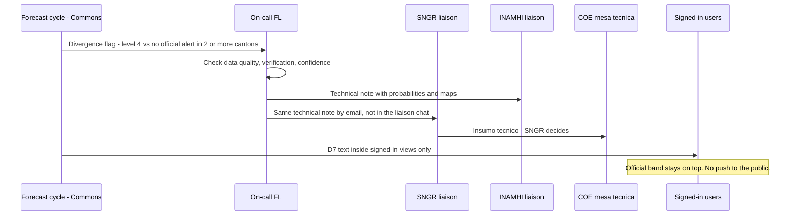
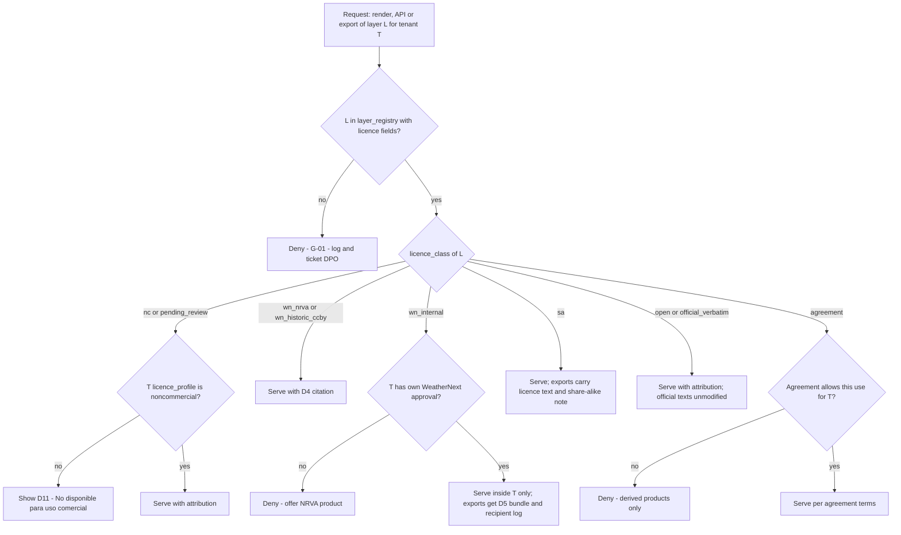
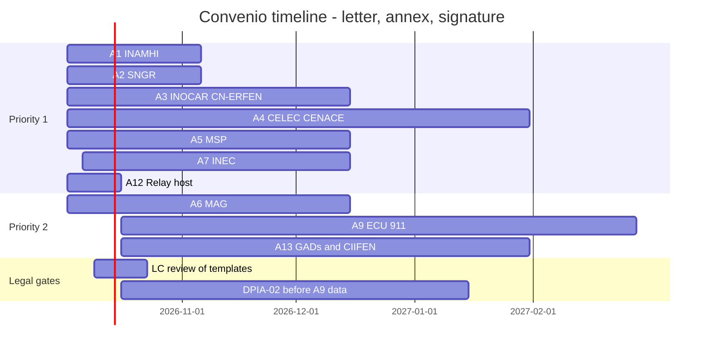
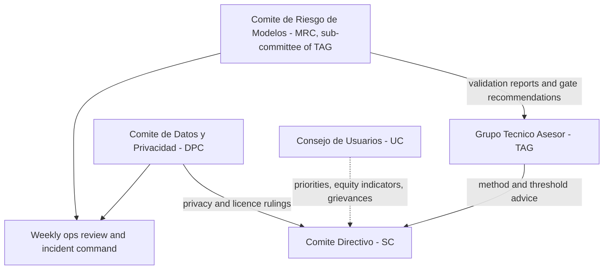
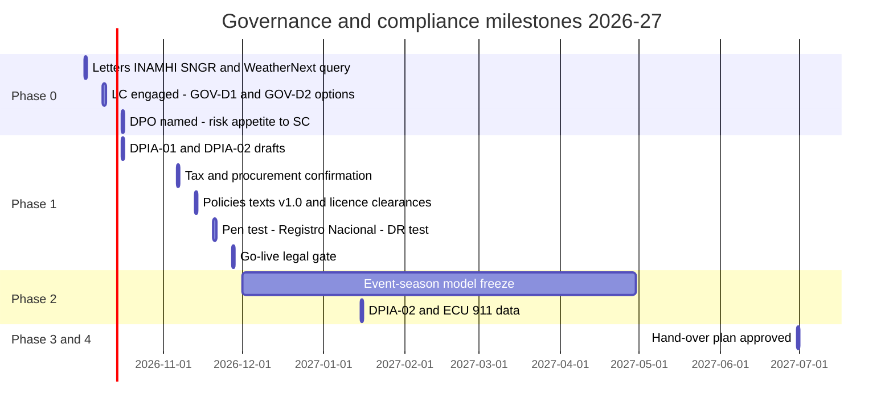

# Governance, legal compliance and risk register

This document sets the legal, institutional and risk framework under which *Gemelo Digital Ecuador – El Niño* (GDE-Niño, "Ecuador El Niño Digital Twin") is built, operated and eventually handed over to a national host. It fixes how the twin is positioned against Ecuador's official alert system, with the exact Spanish disclaimer texts for the app, PDFs and API. It sets out how the platform and its tenants comply with the *Ley Orgánica de Protección de Datos Personales* (LOPDP), its Reglamento and the 2024–2026 resolutions of the *Superintendencia de Protección de Datos Personales* (SPDP). It gives a clause-by-clause reading of the third-party terms we depend on (WeatherNext, Flood Forecasting API, Earth Engine, Copernicus, GEOGloWS, OpenStreetMap/Overture, TypeSafe) and the legal layer of licence gating. It also covers the data-sharing *convenios* with Ecuadorian institutions, open-source licensing, procurement and tax, ethics and inclusion, governance bodies and decision rights, model risk management, security governance, a 35-item risk register, and liability and insurance. Components, buckets, tables and API routes are those of [03-architecture.md](./03-architecture.md); licence classes and gating rules G-01…G-12 are those of [05-data-catalog.md §5](./05-data-catalog.md#5-licence-matrix-and-gating-rules); the breach runbook RB-17 and templates T-01…T-08 are in [11-operations-runbook.md](./11-operations-runbook.md). None of these is redefined here.

> **Status of this document.** It is a compliance *plan*, not legal advice. Every legal position below must be reviewed by Ecuadorian counsel (LC) before the MVP go-live gate on **2026-11-27** (M1.5 in [03 §13](./03-architecture.md#13-architecture-milestones-and-acceptance-criteria)). The text of the disaster-risk law (RO 488) and of several SPDP resolutions could not be retrieved; positions that depend on them are marked **(to confirm)**.

## Contents

0. [Conventions, roles and key legal positions](#0-conventions-roles-and-key-legal-positions)
1. [Alert authority and product positioning](#1-alert-authority-and-product-positioning)
2. [Personal data protection (LOPDP)](#2-personal-data-protection-lopdp)
3. [Third-party terms matrix](#3-third-party-terms-matrix)
4. [Licence matrix and automated gating: the legal layer](#4-licence-matrix-and-automated-gating-the-legal-layer)
5. [Data-sharing agreements (*convenios*) and template clauses](#5-data-sharing-agreements-convenios-and-template-clauses)
6. [Open-source licensing](#6-open-source-licensing)
7. [Procurement and tax](#7-procurement-and-tax)
8. [Ethics, equity and inclusion](#8-ethics-equity-and-inclusion)
9. [Governance bodies, decision rights and model risk management](#9-governance-bodies-decision-rights-and-model-risk-management)
10. [Security governance](#10-security-governance)
11. [Risk register](#11-risk-register)
12. [Liability and insurance](#12-liability-and-insurance)
13. [Compliance calendar and go-live checklist](#13-compliance-calendar-and-go-live-checklist)
14. [Open questions](#14-open-questions)

---

## 0. Conventions, roles and key legal positions

### 0.1 Labels

- **(unverified)**: not confirmed in the research briefs; must be checked before anyone relies on it.
- **(to confirm)**: depends on a partner, counsel or regulator decision.
- **[VP]/[VS]** in source notes follow the research briefs: primary text read, or secondary source.
- Spanish legal terms are in italics. *Término* means business days; *plazo* means calendar days (standard Ecuadorian usage; LC to confirm for each deadline).

### 0.2 Owner roles

This document uses the codes in the owner-role table at the top of [03](./03-architecture.md) (PL, DL, FL, FE, AI, SRE, DPO, TA, PM), [11 §0](./11-operations-runbook.md#0-conventions) (PM, IC, COM, LI, LS) and [07](./07-impact-modules-and-triggers.md) (IM). It also uses the three codes below: PT from [12 §4.1](./12-roadmap-team-budget.md#41-role-catalogue), plus LC and ETH, which it adds. The IDs PA-01…PA-13 in §2.5 are processing activities, not a role code.

| Code | Role | Notes |
|---|---|---|
| PT | Partnerships lead ([12 §4.1](./12-roadmap-team-budget.md#41-role-catalogue)) | Owns *convenios* and focal points |
| LC | Ecuadorian legal counsel | External firm retained by the operator; signs off legal texts and positions. Engagement by **2026-10-09** |
| ETH | Ethics and inclusion lead | UX lead by default until named in [12-roadmap-team-budget.md](./12-roadmap-team-budget.md) |

The DPO in [03](./03-architecture.md) combines security and data protection until Phase 2. From Phase 2 (by 2027-01-15) a separate information-security officer is recommended once more than 30 tenants are live (§10.1). Because the Reglamento requires the DPO to act independently and bars people with conflicts of interest (Reglamento Arts. 48 and 56), the combined role is a known compromise; §2.7 sets the safeguards.

### 0.3 Key legal positions (summary register)

Each position has an ID so that code, contracts and tickets can refer to it.

| ID | Position | Basis | Status |
|---|---|---|---|
| LP-01 | GDE-Niño issues **no alerts**. Its outputs are *apoyo a la decisión / pronóstico experimental*. Official alerts are re-published verbatim, above model output | Ley Orgánica para la Gestión Integral del Riesgo de Desastres (RO 488, 30 Jan 2024); D1 | Article number to confirm |
| LP-02 | The tenant organisation is the **controller** (*responsable*) of its members' data; Google is its processor; the operator is controller only of the central account directory and a processor wherever it touches tenant personal data | LOPDP Art. 34; Reglamento Arts. 37, 41, 43, 45 | Adopted in [04 §12.1](./04-identity-tenancy-byo-gcp.md#12-lopdp-roles-and-data-residency-profiles) |
| LP-03 | Hosting in Google regions outside Ecuador through a processor is **not an international transfer** | LOPDP Art. 34; Res. SPDP-SPD-2026-0004-R Art. 23; Oficio SPDP-IRD-2026-0300-O (secondary source) | Could be reversed; fallback in §2.9 |
| LP-04 | Device geolocation is **off by default**; AOIs are organisational polygons, not personal locations | Res. SPDP 2026-0005-R Art. 14 ("toda geolocalización" is large-scale) | Adopted (NFR-016, FR-075) |
| LP-05 | Commons publishes only **Non-Retrievable Value-Added** WeatherNext derivatives or CC BY 4.0 historic data; raw, subset or recoloured real-time fields never leave a licensee's project | WeatherNext ToU §§3–4 | Written confirmation requested from Google (§3.2) |
| LP-06 | Non-commercial (NC) layers never reach tenants with a commercial licence profile; unknown licence = NC | Source licences; D15 | Enforced by G-01…G-12 |
| LP-07 | Operational government use of Earth Engine is **commercial** use | EE noncommercial guidance (search summary) | To confirm per tenant (§3.4) |
| LP-08 | The core code is **Apache-2.0**; GPL engines run only as separate, source-built images with their source published | COESCCI Arts. 147–148; D20; GPL-3.0 | Adopted |
| LP-09 | No personal data enters `commons_pub`; ECU 911 and citizen text is pseudonymised before any processing outside `raw/`, and before any external AI call | LOPDP Art. 10(e); D18; [05 DP-10](./05-data-catalog.md#1-data-principles) | Adopted |
| LP-10 | Tenants pay for their own GCP use; the operator never resells GCP | AP-02; tax exposure §7 | Adopted |
| LP-11 | Liability is allocated by Spanish-language B2G/B2B terms under Ecuadorian law; consumer-facing liability exclusions are treated as unenforceable | LODC Art. 43 (secondary source) | LC to confirm |

---

## 1. Alert authority and product positioning

### 1.1 Legal basis

| Instrument | What it says for the twin | Source quality |
|---|---|---|
| Constitution Art. 389 ¶1–2 | The State protects people, communities and nature from disasters; it exercises *rectoría* "a través del organismo técnico establecido en la ley" | ¶1 [VP] via [WRI NDC mirror](https://github.com/wri/ndc/blob/HEAD/ECU-second_ndc-ES.html); ¶2 function 2 "generar, democratizar el acceso y difundir información suficiente y oportuna" (unverified) |
| Constitution Art. 390 | *Descentralización subsidiaria*: each GAD is directly responsible within its territory | (unverified) |
| Ley Orgánica para la Gestión Integral del Riesgo de Desastres | Published RO No. 488, 30 Jan 2024 [VS]. SNGR is the *ente rector* "con rango de ministerio", with COEs and a Comité Nacional de Reducción de Riesgos ([RESDAL text](https://github.com/Juanesillo/codefest-ad-astra-2026/blob/HEAD/lib/data/processed/DOC-1606.txt)) | **The article reserving alert declaration to SNGR was not retrieved (to confirm)** |
| Reglamento General of the law | Executive Decree 394, 18 Sep 2024 per [01 §8.1](./01-context-el-nino-ecuador.md#81-legal-framework) (secondary source there); the legal brief could not verify the decree number | [VS]; to confirm |
| Decreto Ejecutivo 641 (Jan 2023) | Renamed SGR to SNGR | [VS] |
| LOPDP Art. 2(e) | Excludes from the LOPDP personal data regulated by specialised disaster-risk rules of equal or higher rank, but human-rights standards and LOPDP principles still apply ([LOPDP mirror](https://github.com/caloloc2/maestria_big_data/blob/HEAD/lopd/lopd.md)) | [VP]; covers SNGR/COE lists of *damnificados*, **not** the platform's own user data |
| LOPDP Art. 11 | Personal data governed by specialised rules on *gestión de riesgos* and *desastres naturales* follow the principles of those rules and of the LOPDP, with human-rights standards and at least legality, proportionality and necessity | [VP] (same mirror); relevant to ECU 911/SNGR narratives (PA-08) |

**Institutional competences the twin must respect** (from prior knowledge, consistent with the spine and [01 §8.2](./01-context-el-nino-ecuador.md#82-actors-roles-and-what-the-twin-exchanges-with-them); article numbers to confirm):

| Institution | Official product | What the twin does with it |
|---|---|---|
| SNGR | Declares alert states (*alerta amarilla / naranja / roja*) by resolution, based on the *entidades técnico-científicas* | Ingests the resolution verbatim into `commons_pub.official_alerts` and shows it first |
| INAMHI | Hydrometeorological forecasts and *advertencias* | Verbatim *advertencias*; uses INAMHI thresholds (*umbrales*) for probabilities |
| CN-ERFEN | El Niño state and intensity statements | Verbatim in the ENSO panel, with report number |
| INOCAR | Ocean, tide, sea-level and tsunami products | Verbatim; tsunami is out of the twin's scope except for display |
| COE (national, provincial, cantonal) | Resolutions, evacuation orders, shelter openings | Shown only as SNGR/COE publish them; never inferred |

**Current state (for the official band; must never be hard-coded).** Resolución SNGR-193-2026 moved the "evento El Niño 2026–2027" from *Alerta Amarilla* to *Alerta Naranja*, applied by the Galápagos government between 24 and 31 July 2026 ([CGREG records](https://github.com/jhquihuiri7/kanban-dgtar/blob/HEAD/backup-pre-reasignar-c10-20260806-081628.sql), [VS]). Three national outlets report an SNGR nationwide red alert on 2026-08-29 (Resolution SNGR-238-2026, spelled SNGR- or SNGRE-), which has not been found outside the press ([01 §5.4](./01-context-el-nino-ecuador.md#54-conflicts-and-verification-backlog-phase-0-due-16-oct-2026) V1); the colour conflict is unresolved. This is exactly why LP-01 requires verbatim ingestion with the resolution number.

### 1.2 What the twin may and may not do

This is the operator's legal analysis (unverified against the statute); LC confirms it by 2026-10-30.

| Allowed | Not allowed |
|---|---|
| Probabilities of exceeding INAMHI thresholds, ensemble spread, analog scenarios, exposure counts, impact indices, *nivel de riesgo 1–4*, *probabilidad de impacto* | Any product named or styled as *alerta* (amarilla, naranja, roja), *declaratoria*, *estado de alerta*, *alerta temprana oficial* |
| Verbatim re-publication of SNGR, INAMHI, CN-ERFEN and INOCAR products with issuer, number, time and link | Paraphrasing or summarising an official alert in a way that changes its level, area or validity |
| Technical inputs (*insumo técnico*) to COE *mesas técnicas* through the SNGR liaison | Evacuation orders, instructions to the public to move, open shelters or close roads |
| Partner-owned anticipatory-action *disparadores* evaluated inside the partner's tenant ([07 §6](./07-impact-modules-and-triggers.md#6-anticipatory-action-and-trigger-framework)) | Sending platform risk levels to the public by SMS, cell broadcast or sirens |
| Publishing verification scores, including misses and false alarms | Using official alert colours (yellow/orange/red) for platform products ([02 §8.3](./02-users-requirements-ux.md)) |
| Showing that the twin's estimate differs from the official alert (D7), inside signed-in views | Publicly contradicting an official alert in the media; only COM, after coordination with LS, may speak to media (§1.6) |

### 1.3 Reserved vocabulary (legal list for the CI guard)

The vocabulary guard in [03 §8.5](./03-architecture.md#85-internationalisation-and-vocabulary-guard) loads this list. A string outside the official-alert component that matches a **blocked** pattern fails the build; **review** patterns open a content-review ticket.

```yaml
# legal/vocabulary.yaml  (owner: DPO; approver: LC; version 1.0.0, 2026-10-30 target)
version: 1.0.0
applies_to: [ui_strings, pdf_templates, whatsapp_templates, api_messages, bulletin_prompts]
exempt_components: [OfficialAlertBand, OfficialAlertDetail]   # verbatim official text only
exempt_texts: ['legal/texts/*.yaml']                          # LC-approved texts (D1-D13, L-14...) are exempt
blocked:          # never in platform-authored text (es / en)
  - '(?i)\balerta\s+(amarilla|naranja|roja)\b'
  - '(?i)\b(yellow|orange|red)\s+alert\b'
  - '(?i)\bdeclaratoria\b'
  - '(?i)\bestado de (alerta|emergencia)\b'
  - '(?i)\borden de evacuaci[oó]n\b'
  - '(?i)\bevac[uú]e(n)?\b'                 # imperative to the public
review:           # allowed with care; content review required
  - '(?i)\balerta\b'                        # any other use, incl. "alerta oficial" outside approved texts
  - '(?i)\bwarning\b'
  - '(?i)\bgarantiza\w*\b'                  # no guarantees of accuracy
  - '(?i)\bseguro que\b|\bcon certeza\b'
preferred_terms:
  alert_subscription: "aviso de la herramienta"   # platform notifications
  platform_level: "nivel de riesgo N de 4"
  trigger_state: ["cumple", "no cumple", "indeterminado", "sin datos"]
```

The Gemini bulletin prompts (component 29 in [03 §3](./03-architecture.md#3-component-inventory)) include the same list as a negative constraint, and generated bulletins pass the same regex before the human sign-off.

### 1.4 Canonical disclaimer texts (legal text registry)

The keys **D1–D13** are those proposed in [02 §8.5](./02-users-requirements-ux.md#85-disclaimer-texts-spanish-proposals). This section fixes **version 1.0.0** of each text for legal review and adds the **L-series** for the API, PDF, first-run notice, English equivalents and terms of service. Texts live in `legal/texts/es-EC.yaml` and `legal/texts/en.yaml`; each has an ID, a semantic version and a SHA-256. Every rendered surface records the version it showed, and user acceptance is stored in tenant Firestore `users/{uid}.ack_disclaimer_version` ([03 §5.6](./03-architecture.md#5-storage-layout)).

**Rules.** (1) D2 and D3 appear on every screen footer, every PDF page and every API response that carries a platform product. (2) D4 appears, in English and verbatim, on every WeatherNext-derived output. §4(b) of the WeatherNext terms requires it whenever findings from real-time data or a Non-Retrievable VAS are shared; the platform applies it to all WeatherNext-derived output for simplicity, including derivatives of ≥1 h-old CC BY 4.0 data, where it also serves as the CC BY attribution. (3) Texts are never shortened below D1 on any surface. (4) A change to a text is a new version, approved by LC, announced 7 days ahead on the methodology page, except corrections required by law.

#### 1.4.1 In-app texts (Spanish, version 1.0.0)

| ID | Where | Text |
|---|---|---|
| D1 | Map containers, card headers, WhatsApp card | «Apoyo a la decisión · Pronóstico experimental · No es una alerta oficial» |
| D2 | Standard footer: all screens, PDFs, API | «Producto informativo de apoyo a la decisión; no constituye alerta oficial. Las alertas oficiales las declara la Secretaría Nacional de Gestión de Riesgos (SNGR) con base en la información de INAMHI, INOCAR y el CN-ERFEN. Consulte gestionderiesgos.gob.ec y alertasecuador.gob.ec.» |
| D3 | Life safety: PDFs, event mode, first-run notice | «No utilice este producto como única base para decisiones que afecten la vida o la seguridad de las personas. Ante una emergencia, siga las instrucciones de las autoridades competentes y llame al ECU 911.» |
| D6 | Analog years | «La similitud con eventos anteriores no implica intensidad, duración ni impactos equivalentes.» |
| D7 | Divergence from the official alert | «La estimación de riesgo de esta herramienta para [lugar] ([Nivel N de 4]) difiere de la alerta oficial vigente ([alerta], Res. [número]). Para decisiones públicas rige la alerta oficial de la SNGR.» |
| D8 | Official feed stale | «No hemos podido confirmar el estado de la alerta oficial desde [hora]. Verifique en alertasecuador.gob.ec antes de tomar decisiones.» |
| D9 | Save attempt at T0 | «Está en modo visor: lo que haga en esta sesión no se guardará. Para guardar áreas, vistas, reportes y suscripciones, conecte un proyecto de Google Cloud de su institución.» |
| D10 | Cost confirmation | «Esta acción se ejecutará y se facturará en su proyecto [ID]. Costo estimado: US$ [x] (sin IVA ni ISD). ¿Desea continuar?» |
| D11 | Licence block | «Esta capa tiene una licencia de uso no comercial ([licencia]) y no está disponible para el perfil comercial de su organización.» |
| D12 | AI-drafted text | «Borrador generado con apoyo de inteligencia artificial. Debe ser revisado y aprobado por un técnico antes de compartirse.» |
| D13 | Jev triage | «Clasificación automática (probabilidad [0,62]). Requiere revisión humana antes de usarse.» |
| L-14 | First-run notice (modal; acceptance recorded once per account in the registry document `accounts/{uid}`: `tou_version`, `privacy_version`, `accepted_at`; see PA-01) | «Bienvenido/a a GDE-Niño. Esta herramienta combina pronósticos experimentales, datos de exposición y modelos de impacto para apoyar decisiones técnicas. **No emite alertas.** Las alertas oficiales las declara la SNGR. Los pronósticos son probabilísticos: pueden no ocurrir aunque sean probables y pueden ocurrir aunque sean poco probables. Al continuar, usted declara que ha leído los Términos de uso y la Política de privacidad, y que usará la información según su criterio técnico y bajo su responsabilidad.» Checkbox: «He leído y acepto» |
| L-15 | Official band source tag | «Fuente oficial: [institución] · [tipo de documento] [número] · emitido [fecha hora ECT] · [enlace]» |
| L-16 | Tenant-private products (retrievable) | «Uso interno de [organización]. No redistribuir. Contiene datos experimentales sujetos a términos de uso de terceros.» |
| L-17 | Kichwa and audio messages | Spanish D1 + D3 read aloud; the Kichwa version is produced by a native reviewer and approved by ETH and LC (Phase 3, FR-076) **(text to produce)** |

**D4 (verbatim English; WeatherNext ToU §4(b)).** "© 2024-6 Google LLC, whose machine learning models were used to create the experimental data made available under the following licence terms https://storage.googleapis.com/weathernext-public/terms-of-use.pdf. This data is intended for experimental modelling only and is not intended, validated, or approved for real world use." It must also name the Google product used to access the data (for example "WeatherNext 3 via BigQuery") ([ToU](https://storage.googleapis.com/weathernext-public/terms-of-use.pdf)). The Spanish informative translation in [02 §8.5](./02-users-requirements-ux.md#85-disclaimer-texts-spanish-proposals) follows it and is labelled «Traducción informativa».

**D5 (export bundle for WeatherNext data or a Retrievable VAS).** Files: `WEATHERNEXT_TERMS.pdf` (copy of the terms), `LEGALLY_BINDING_TERMS_OF_USE.txt` containing exactly "By using this information, you agree to the Terms of Use found at https://storage.googleapis.com/weathernext-public/terms-of-use.pdf", the prominent notice "Copyright 2024-6 Google LLC" (in `COPYRIGHT.txt` and in the header of every data file), and `MODIFICATIONS.txt` describing every change made (ToU §4(a)(i)–(iv)). The export service must not add any clause that conflicts with the terms.

#### 1.4.2 PDF footer (composite, both pages of the canton report)

```text
GDE-Niño · Apoyo a la decisión · Pronóstico experimental · No es una alerta oficial      [D1]
Producto informativo de apoyo a la decisión; no constituye alerta oficial. Las alertas oficiales
las declara la Secretaría Nacional de Gestión de Riesgos (SNGR) con base en la información de
INAMHI, INOCAR y el CN-ERFEN. Consulte gestionderiesgos.gob.ec y alertasecuador.gob.ec.    [D2]
No utilice este producto como única base para decisiones que afecten la vida o la seguridad
de las personas. Ante una emergencia, siga las instrucciones de las autoridades competentes
y llame al ECU 911.                                                                        [D3]
WeatherNext 3 via BigQuery: © 2024-6 Google LLC, whose machine learning models were used to
create the experimental data made available under the following licence terms
https://storage.googleapis.com/weathernext-public/terms-of-use.pdf. This data is intended for
experimental modelling only and is not intended, validated, or approved for real world use. [D4]
Fuentes: INAMHI; SNGR; GloFAS (Copernicus Emergency Management Service); GEOGloWS/ECMWF; INEC CPV 2022; © OpenStreetMap contributors (ODbL).
Versión de textos legales 1.0.0 · Método [method_version] · Corrida [init_time UTC] · Página x/y
```

The footer repeats D2, D3 and D4 word for word (rule 3); only line breaks differ. The GloFAS/Copernicus and GEOGloWS/ECMWF statements must be copied from the provider texts (`s3://geoglows-v2/licenses.md` for GEOGloWS; the EWDS dataset licence page for GloFAS) **(exact texts to confirm, owner DPO, by 2026-11-06)**.

#### 1.4.3 API legal block

Every response that carries a platform product adds a `legal` object next to `data_versions`, `attribution` and `official_alerts` ([03 §6.1](./03-architecture.md#61-conventions)); this is an extension to adopt in [03 §6.5](./03-architecture.md#65-response-example). The broker also sets the header `X-Ectwin-Official: false`.

```json
{
  "legal": {
    "official": false,
    "product_class": "apoyo_a_la_decision",
    "texts_version": "1.0.0",
    "disclaimer": {"id": "D2", "text": "Producto informativo de apoyo a la decisión; no constituye alerta oficial. …"},
    "life_safety": {"id": "D3", "text": "No utilice este producto como única base …"},
    "citations": [
      {"id": "D4", "source": "WeatherNext 3 via BigQuery",
       "text": "© 2024-6 Google LLC, whose machine learning models were used to create the experimental data …"}
    ],
    "licence": {"licence_class": "wn_nrva", "commercial_ok": true, "layer_ids": ["parish_exceedance"]},
    "terms_url": "https://app.<DOMAIN>/legal/terminos",
    "privacy_url": "https://app.<DOMAIN>/legal/privacidad"
  }
}
```

The texts are shortened with "…" in this example only; the API always returns the full versioned text of D2, D3 and D4 (rule 3). `app.<DOMAIN>` is still to be confirmed ([03 §6.1](./03-architecture.md#61-conventions); [10 §0.2](./10-setup-and-deployment.md#02-placeholders)). The OpenAPI contract at `schemas/api/openapi.yaml` marks `legal` as required on every `/v1/national/*` and `/v1/t/{tid}/aois/*/forecast` response.

#### 1.4.4 English equivalents (en, version 1.0.0)

| ID | Text |
|---|---|
| D1 | "Decision support · Experimental forecast · Not an official alert" |
| D2 | "Informational decision-support product; it is not an official alert. Official alerts are declared by Ecuador's National Secretariat for Risk Management (SNGR), based on information from INAMHI, INOCAR and CN-ERFEN. See gestionderiesgos.gob.ec and alertasecuador.gob.ec." |
| D3 | "Do not use this product as the sole basis for decisions affecting people's life or safety. In an emergency, follow the instructions of the competent authorities and call ECU 911." |

#### 1.4.5 Acceptance criteria for §1.4

| # | Criterion | Test |
|---|---|---|
| AC-1 | Every screen shows D1 on product containers and D2+D3 in the footer | Playwright snapshot per route; CI |
| AC-2 | Every PDF page contains D1–D4 and the texts version | PDF text extraction test on 5 sample cantons |
| AC-3 | Every `/v1/national/*` response has `legal.official=false` and D2/D3 | Contract test against OpenAPI |
| AC-4 | No platform string matches a `blocked` pattern | Vocabulary guard; zero findings |
| AC-5 | A user cannot save anything before accepting L-14 | E2E test; `ack_disclaimer_version` present |
| AC-6 | WeatherNext exports contain the four D5 elements | Export bundle unit test (G-04) |

### 1.5 Divergence and escalation protocol

When the twin's estimate is materially higher than the official alert for a place (for example *Nivel 4 de 4* where no SNGR alert applies), the twin does **not** publish anything new. It routes the information as *insumo técnico* to the institution that holds the competence.



Rules: (1) the divergence flag fires when ≥2 cantons in a province have *Nivel 4* at lead ≤72 h and no SNGR or COE alert specific to those cantons and that hazard covers them. An event-wide declaration such as SNGR-193-2026 (*Alerta Naranja* for the "evento El Niño 2026–2027") does not count as covering them, otherwise the flag could never fire during this season **(criterion to confirm with LS)**; (2) the *nota técnica* is sent by email to LS and LI within 2 h in posture N2/N3 ([11 §3](./11-operations-runbook.md#3-el-niño-event-mode)), never through the *Mesa de enlace* chat, which carries operational notices only ([12 §6.1](./12-roadmap-team-budget.md#61-bodies)); (3) the note carries D2, D3 and D4; (4) the twin never contacts the media or the public about the divergence; (5) every divergence and its outcome is logged in `commons_ops.divergence_log` **(new table)** and reviewed at the next TAG session (§9.1).

### 1.6 Media and public communication policy

- Only COM (the PM by default) speaks for GDE-Niño, and only after coordinating with LS for anything about an active event.
- The standard answer to "¿Es una alerta?" is D2, followed by a link to the official source.
- Screenshots of the twin used by media must include D1. The WhatsApp card embeds D1 in the image so that it survives forwarding ([02 §8.7](./02-users-requirements-ux.md#87-whatsapp-card-and-text-template)).
- No government logo appears on any product without a written co-branding clause in the relevant *convenio* (§5.3, clause 9).
- False-alarm complaints follow RB-16 and template T-06 ([11](./11-operations-runbook.md)).

---

## 2. Personal data protection (LOPDP)

### 2.1 Instruments

| Instrument | Content relevant to GDE-Niño | Source |
|---|---|---|
| LOPDP, Quinto Suplemento RO 459, 26 May 2021 | Scope (Arts. 2–3), lawful bases (Art. 7), legitimate interest (Art. 9), principles (Art. 10), specialised rules incl. disaster risk (Art. 11), rights (Arts. 12–24), special categories (Art. 25), processor access is not a transfer (Art. 34), security, privacy by design, DPIA and breaches (Arts. 37–46), duties (Art. 47), DPO (Arts. 48–50), Registro Nacional (Art. 51), transfers (Arts. 55–61), infractions (Arts. 67–70) and sanctions (Arts. 71–72) | [VP] [mirror](https://github.com/caloloc2/maestria_big_data/blob/HEAD/lopd/lopd.md) |
| Reglamento General, Decreto Ejecutivo 904 (signed 6 Nov 2023; Tercer Suplemento RO 435, 13 Nov 2023) | Apoderado especial (Art. 3), when a breach is a risk (Art. 24), breach content (Art. 26) and processor notice content (Art. 27), DPIA (Arts. 29–31) and its content and filing (Art. 32), joint controllers (Art. 37), RAT (Arts. 38–39; processor RAT Art. 44), processor contract (Art. 41), processor assists with rights (Art. 42), processor-as-controller (Art. 43), sub-processing (Art. 45), deletion (Art. 46), audit (Art. 47), DPO independence and designation (Arts. 48–49), "control permanente y sistematizado" (Art. 53), DPO requirements (Art. 55) and impediments (Art. 56), transfers (Arts. 71–78), registration deadline (Art. 86) | [VP] [mirror](https://github.com/caloloc2/maestria_big_data/blob/HEAD/lopd/decreto.md); publication [VS] [catalogue](https://github.com/CarlosJChileS/eculegaldev/blob/HEAD/data/normativa.json) |
| Sanctions regime | In force since 26 May 2023 (Transitoria Primera) | [VP] |
| SPDP-SPDP-2024-0002-R (RO 640, 10 Sep 2024) | Registry of *apoderados especiales* for foreign controllers and processors | [VS] |
| 2025-0003-R | Risk management and impact-assessment guide | [VS] |
| 2025-0006-R (30 Apr 2025) | Data-protection clauses in contracts; Anexo I models are referential | [VS] |
| 2025-0022-R | Fine calculation | [VS] |
| 2025-0028-R (30 Jul 2025) | DPO regulation | [VS] |
| 2025-0041-R (RO 1er Supl. 177, 3 Dec 2025) | Legitimate interest | [VS] |
| 2026-0004-R (28 Jan 2026) | General norm on national and international transfers | [VS] |
| 2026-0005-R (2 Feb 2026; RO Supl. 231, 25 Feb 2026) | Large-scale processing | [VS] |
| 2026-0009-R (RO 240, 10 Mar 2026), amended by 2026-0037-R (RO 373, 21 Sep 2026) | Personal data in AI systems | [VS]; content not read **(to confirm)** |
| 2026-0039-R and 2026-0040-R (9 Sep 2026) | Biometrics; breach-notification technical norm; awaiting RO publication | [VS] |
| Ley Orgánica para el Fortalecimiento de la Ciberseguridad (Quinto Suplemento RO 290, 22 May 2026) | Amends LOPDP Art. 43: breach notice also to the competent regulator and the **CSIRT**; shared-responsibility duties for digital-service providers (Arts. 20-A, 20-I, 20-Q) | [VS] |

Sources for the resolutions: [catalogue](https://github.com/CarlosJChileS/eculegaldev/blob/HEAD/data/normativa.json), [Vivaru spec](https://github.com/Leor14/vivaru/blob/HEAD/docs/vivaru-ecuador-flujo-alta.md), [Isla Montaña doc](https://github.com/sadie27/IslaMontanaWeb/blob/HEAD/docs/Arquitectura-Despliegue.md). Enforcement is real: in Dec 2025–Jan 2026 LIGAPRO was fined US$259,644 and the FEF US$194,856 for invalid consent, and the FEF a further US$194,470 for a DPIA with a "resultado cero" [VS, Vivaru].

### 2.2 Scope and applicability

- **Territorial (Art. 3).** The LOPDP applies to processing in Ecuador and to foreign controllers or processors that offer services to, or monitor, residents of Ecuador. It therefore applies to the operator wherever it is incorporated.
- **Apoderado especial (Reglamento Art. 3).** A foreign controller or processor must appoint a special attorney resident in Ecuador and register it (Res. 2024-0002-R). The only exception (Art. 3.2) is processing that is occasional, involves no large-scale special-category data and is unlikely to entail risk; the platform's processing is continuous, so the exception does not apply. **Decision GOV-D1 (§9.2): the operating entity.** Option A: an Ecuadorian-domiciled entity operates the platform (no apoderado needed). Option B: a foreign entity operates it and appoints an apoderado by 2026-10-30. Option C: a public host (SNGR/INAMHI) operates it, in which case a DPO and EGSI alignment are mandatory from day one. Recommended: A or C; decision by **2026-10-09** (owner PM, LC).
- **Art. 2(e) carve-out.** SNGR and COE processing under specialised disaster-risk rules of equal or higher rank (for example lists of *damnificados* and *albergados*) is outside the LOPDP, subject to human-rights standards and LOPDP principles; Art. 11 adds that such processing follows the principles of its own rules and of the LOPDP, at minimum legality, proportionality and necessity. The platform does **not** process such lists; the Acceptable Use Policy (§8.3) forbids uploading them to tenant projects.
- **Art. 2(a) household exemption** may cover an individual who connects a personal GCP project for private use. Organisations must use organisational projects (D7), so the exemption is not relied on.
- **Public servants' professional contact data** (name, role, institutional email, professional phone) are accessible and processable when they refer to the exercise of the post (Art. 2, last paragraph). This covers liaison lists and SNGR posts that name officials.

### 2.3 Roles per processing activity

This extends [04 §12.1](./04-identity-tenancy-byo-gcp.md#121-roles) to Commons activities.

| # | Processing activity | Data subjects | Controller | Processor(s) | Sub-processors |
|---|---|---|---|---|---|
| PA-01 | Central account directory (Identity Platform: uid, email, MFA enrolment) and Terms-of-Use/privacy acceptance record (registry `accounts/{uid}`: `tou_version`, `privacy_version`, `accepted_at`; L-14) | All signed-in users | Operator | — | Google (platform project) |
| PA-02 | Tenant registry (`tenants`, `memberships`, `invites`) | Tenant members | Operator | — | Google |
| PA-03 | Broker request logs (uid hash, route, status) | Users | Operator | — | Google |
| PA-04 | Tenant workspace: members, sessions, AOIs, subscriptions, reports, audit, decision logs | Tenant members | **Tenant** | Google (direct GCP contract) and operator (broker, notifier, support) | Google (operator's platform project, for the broker's transient processing) |
| PA-05 | Notifications (reading device endpoints and emails at send time) | Tenant members | Tenant | Operator (`ectwin-notifier`) | Google; email provider **(to select)**; WhatsApp/SMS provider (tenant-owned) |
| PA-06 | Support sessions and break-glass | Tenant members | Tenant | Operator | Google |
| PA-07 | Citizen observation reports (FR-075) in a tenant | Reporting users; persons visible in photos | Tenant | Google; operator only for rows the tenant Owner opts to share: pseudonymised rows via topic `tenant-observations-v1` into `commons_internal.shared_observations` ([03 §4.6](./03-architecture.md)) | — |
| PA-08 | ECU 911 / SNGR incident narratives for national triage (D16, A9) | Callers, affected persons | **ECU 911 / SNGR** (Art. 2(e) may apply) | Operator (Commons pipelines under the *convenio*) | Google; TypeSafe or the `DecisionBackend` in use; Gemini (only after pseudonymisation and ZDR) |
| PA-09 | Liaison and partner contact lists | Officials, focal points | Operator | — | Google Workspace or equivalent **(to confirm)** |
| PA-10 | Operator staff and on-call data | Staff | Operator | — | HR providers |
| PA-11 | Performance and funnel telemetry (real-user monitoring, pseudonymised and aggregated; NFR-016) | Users | Operator | — | Google |
| PA-12 | LOPDP rights requests (FR-005), grievances (§8.4) and support tickets | Requesters, complainants, users | Operator (tenant for requests about its workspace, PA-04) | — | Google; operator tracker **(to select)** |
| PA-13 | Private-tenant portfolio and insured-parcel data (policyholder or borrower locations; tenant parcels in [07](./07-impact-modules-and-triggers.md) TR-11) | Policyholders, borrowers | **Tenant** (controller) | Google; operator only via broker | — |

Rules: (1) the operator never uses tenant AOIs, logs or reports for its own purposes, which would make it a controller or joint controller (Reglamento Arts. 37 and 43); (2) aggregated, anonymised usage statistics may be computed only from PA-03 logs; (3) PA-08 needs its own DPIA (DPIA-02, §2.6) and a data-protection annex in the ECU 911 *convenio* before any data flows; (4) PA-13 data stays in the tenant project, is aggregated to parish before any export, is never used for household scoring (AUP §8.3, clause 3) and needs a tenant DPIA (from the DPIA-03 template) before upload; see [02](./02-users-requirements-ux.md) FR-077 **(new)** and [07 §6.6](./07-impact-modules-and-triggers.md#66-evidence-packs-including-parametric-insurance).

### 2.4 Lawful bases (LOPDP Art. 7)

| Activity | Lawful basis | Notes |
|---|---|---|
| PA-01–PA-03 | Art. 7(5) contract performance (terms of use) and Art. 7(8) legitimate interest for security logs | Art. 9: only strictly necessary data, transparency to the user, and the SPDP may ask for a risk report. Balancing test documented per Res. 2025-0041-R **(to confirm format)** |
| PA-04–PA-06 for public tenants | Art. 7(4) mission in the public interest / exercise of public powers "derivados de una competencia atribuida por una norma con rango de ley"; Art. 7(2) legal obligation where a statute imposes the processing | The tenant's DPO documents the competence and the law that grants it |
| PA-04–PA-06 for private tenants | Art. 7(5) contract (employment or service relationship) or Art. 7(8) | Tenant's own analysis |
| PA-07 | Art. 7(1) consent of the reporter, specific to verification | Consent text in-app; photos optional; withdraw anytime |
| PA-08 | Art. 7(4) and Art. 7(6) vital interests for the controller; operator acts on instructions | Art. 2(e) specialised-norm analysis by ECU 911/SNGR counsel |
| PA-09 | Art. 7(4)/(8); Art. 2 last paragraph (professional data) | — |
| PA-11 | Art. 7(8) legitimate interest (service performance and security) | Pseudonymised and aggregated; no third-party trackers (NFR-016); balancing test as for PA-01–PA-03 |
| PA-12 | Art. 7(2) legal obligation for LOPDP rights requests; Art. 7(5) contract for support tickets and grievances | Deadlines in §2.11 and §8.4 |
| PA-13 | Tenant's own analysis, usually Art. 7(5) contract with the policyholder or borrower | Tenant DPIA before upload; Art. 20 applies to any decision with legal effects on individuals |

Consent is never bundled with the terms of use; the FEF fine for invalid consent is the reference case.

### 2.5 Record of processing activities (RAT)

A RAT is required for controllers with ≥100 workers, or for processing that is risky, non-occasional or involves special categories (Reglamento Arts. 38–39). A processor must also keep one whenever its controller is obliged to (Reglamento Art. 44). The operator keeps a RAT for PA-01–PA-13 regardless of headcount, because the processing is non-occasional. The RAT lives in `legal/rat/rat.yaml` (source of truth), is kept in writing or electronically and is shown to the SPDP on request (Art. 38, last paragraph). The Registro Nacional filing (LOPDP Art. 51, nine items) is generated from the same file (§2.13).

Reglamento Art. 38 lists nine fields: (1) name and contact of the controller, any joint controller and the DPO; (2) purposes; (3) categories of recipients; (4) data subjects and categories of data; (5) use of profiling, if any; (6) transfers to third countries or international organisations, if any; (7) lawful bases; (8) retention periods; (9) a general description of technical, legal, administrative and organisational measures. The comments in the template map each key to that list.

```yaml
# legal/rat/rat.yaml — one entry per activity; keys mapped to Reglamento Art. 38 (1)–(9)
- id: PA-04
  name: "Espacio de trabajo del tenant (sesiones, AOIs, reportes, auditoría)"
  controller: "<Tenant legal name>, RUC <...>"                          # (1)
  dpo: "<nombre>, <correo institucional>, <teléfono>"                    # (1)
  joint_controllers: none                                                # (1)
  processors: ["Google LLC (Cloud Data Processing Addendum)", "<Operator legal name> (contrato de encargo v1.0)"]
  purposes: ["Apoyo técnico a decisiones de gestión de riesgos ante El Niño"]   # (2)
  recipients: ["encargados listados en processors", "ninguna comunicación a terceros salvo obligación legal"]  # (3)
  categories_subjects: ["servidores/empleados del tenant", "consultores autorizados"]          # (4)
  categories_data: ["uid", "correo institucional", "rol", "preferencias", "polígonos AOI (organizacionales)", "registros de auditoría"]  # (4)
  special_categories: none                                               # (4)
  profiling: none                                                        # (5)
  transfers: "No (encargado en el exterior; Oficio SPDP-IRD-2026-0300-O) — revisar si cambia el criterio"  # (6)
  location: {firestore: "southamerica-west1 (Santiago, Chile)", bigquery: "US multi-region", gcs: "us-central1 (EE.UU.)"}
  lawful_basis: "Art. 7(4) LOPDP (entidades públicas) | Art. 7(5) (privadas)"   # (7)
  retention: "sesiones 30 días (Firestore) / 400 días (BigQuery); auditoría 5 años (público) / 400 días (privado); ver §2.10"  # (8)
  security: ["MFA TOTP", "tokens ≤15 min", "sin llaves de cuenta de servicio", "cifrado en reposo de Google", "auditoría"]     # (9)
  dpia: "DPIA-03 plantilla por tenant"
  last_review: 2026-10-30
```

The tenant compliance pack (NFR-014) includes the same file with PA-04–PA-07 and PA-13 pre-filled for the tenant to complete.

### 2.6 Data protection impact assessments (DPIA)

A DPIA is required before processing that is likely to be high-risk, or when the SPDP asks for one (Art. 42; Reglamento Art. 31). Where it is mandatory it is **filed with the SPDP** and contains at least a systematic description of the processing and its purposes, the necessity and proportionality justification, the risk assessment, and the planned measures and safeguards (Reglamento Art. 32). If it is unclear whether a DPIA is mandatory, the controller may consult the SPDP, which must answer within five (5) *días término* (Reglamento Art. 31). The methodology follows the SPDP guide (Res. 2025-0003-R, content to confirm). A DPIA that concludes "zero risk" is itself a finding (the FEF case), so every DPIA must list residual risks.

| DPIA | Scope | Why high risk | Owner | Draft / signed |
|---|---|---|---|---|
| DPIA-01 | Platform (PA-01–PA-06, PA-09, PA-11, PA-12) | Multi-tenant SaaS; cross-border hosting; aggregate processor duties under Res. 2026-0005-R Arts. 13–15 | DPO | 2026-10-16 / 2026-11-13 |
| DPIA-02 | AI triage of ECU 911/SNGR narratives and citizen reports (PA-07, PA-08; schemas S1, S2, S5 and B4 in [08 §10.5](./08-ai-decision-layer-jev.md#105-lopdp-and-contracts)) | Possible health and vulnerability data; automated classification (Art. 20); external AI sub-processors in the US | DPO + AI | 2026-10-16 (aligned with 08) / signed before shadow mode on real personal data; no ECU 911 narrative flows before GOV-M9 (2027-01-15) |
| DPIA-03 | Template for tenants (public tenants must adapt and sign) | Public-sector processing | DPO | 2026-11-06 (template) |
| DPIA-04 | Kichwa audio/SMS and WhatsApp channel (Phase 3) | Phone numbers; third-party messaging provider | DPO + ETH | 2027-05-15 |

DPIA risk scale (used in each DPIA and aligned with §11): likelihood 1–5 × severity 1–5 on the rights and freedoms of the data subject; residual score ≥10 requires DPC approval (§9.1). Mandatory DPIAs (at least DPIA-02, and DPIA-01 unless LC concludes otherwise) are filed with the SPDP under Reglamento Art. 32 before the processing starts.

### 2.7 Data protection officer (DPO)

- **Public-sector tenants must have a DPO** (Art. 48.1: "cuando el tratamiento se lleve a cabo por quienes conforman el sector público", per Const. Art. 225). Onboarding of a public tenant collects the DPO's name and contact; without it, the tenant can use T0/T1 views but cannot save personal data beyond its own members (acceptance criterion in §13).
- **Qualifications** (Reglamento Art. 55): of age, in full political rights, a third-level degree in law, information systems, communications or technology, and at least 5 years' professional experience. DPO regulation: Res. 2025-0028-R. In public entities the DPO is designated by the *máxima autoridad* (Reglamento Art. 49).
- **The operator appoints a DPO.** It is probably mandatory, not only good practice: Art. 48(2) requires one where activities need "control permanente y sistematizado", and Reglamento Art. 53 tests that by whether processing is continuous, recurring or methodical, which the platform's is. It also processes data in aggregate across tenants (Res. 2026-0005-R Arts. 13–15) and may become a processor for public entities. LC confirms the legal basis. Target: named by **2026-10-16** (owner PM).
- **Independence safeguards.** The DPO must act independently and cannot be sanctioned for doing the job (Reglamento Arts. 48 and 51). Members of the operator's administration or control bodies, its partners or shareholders, their close relatives and anyone with a conflict of interest cannot be DPO (Reglamento Art. 56). Therefore: (1) the PM, directors and owners of the operating entity are never the DPO; (2) while the DPO also acts as security officer (until the split in §10.1), the security controls the DPO owns in §10.3–§10.4 are reviewed each quarter by LC or an external auditor, not by the DPO; (3) the DPO reports to the SC chair on privacy matters and chairs the DPC (§9.1).
- **T4 sponsored tenants** (GADs without capacity): the sponsor provides a shared DPO service or the GAD designates its own; the *convenio* with the sponsor states which (§5.3, clause 6).

### 2.8 Minimisation and privacy by design (Art. 39)

| Control | Implementation | Reference |
|---|---|---|
| Central minimisation | Registry holds only uid, email, tenant project id, runner SA email, region profile, status, uid-to-tenant memberships with role ([04 §3.4](./04-identity-tenancy-byo-gcp.md#34-where-membership-data-lives)) and the ToU/privacy acceptance record (version, time; PA-01) | AP-07, NFR-013 |
| No device geolocation by default | The PWA never calls the browser geolocation API unless the user presses "Usar mi ubicación" for a one-off map centring; the coordinate is not stored. CI fails if any code path stores device coordinates | LP-04, NFR-016 |
| AOIs are organisational | AOI creation offers parish/canton snapping first; free-drawn AOIs are labelled as organisational assets. AOIs named after a person or a household are rejected by a naming rule | LP-04 |
| Observation reports | Stored with DPA parish code and time only; exact coordinates only if the user opts in; photo EXIF metadata (including GPS) stripped on upload | FR-075 |
| Pseudonymous analytics | BigQuery tables hold uid, never email; Cloud DLP pseudonymisation before any external AI call | D18 |
| No trackers | No third-party analytics or advertising | NFR-016 |
| No special categories | The platform does not ask for health, ethnicity, disability or biometric data; accessibility preferences are stored as UI settings, not as disability data | Art. 25 |
| Identity minimal | Identity Platform stores uid, email, MFA; Identity Platform has no data-location commitment, disclosed in the privacy notice | NFR-015 |

**Large-scale test.** Res. 2026-0005-R Art. 14 automatically classes "todo tratamiento de datos biométricos y toda geolocalización" as large-scale, and Arts. 13–15 apply processor duties in aggregate across tenants [VS]. With LP-04 in place, the operator's analysis is that GDE-Niño does not process personal geolocation. Private-tenant portfolio and insured-parcel data (PA-13) is personal, geolocated data, but it stays in the tenant project, where the tenant as controller runs the Art. 14 test in its own DPIA before upload. If a future feature needs it (for example the Phase 3 SMS channel with cell location), DPIA-04 and a DPC decision are required first.

### 2.9 International transfers and residency

**Law.** Transfers are allowed to countries declared adequate by the SPDP (Art. 56; Reglamento Arts. 71–73, where criterion 2 is the country's national-security and criminal legislation, with "especial énfasis" on provisions that let its authorities access personal data), or with appropriate safeguards (Art. 57; Reglamento Art. 74, including model clauses "adoptadas por organismos internacionales… avaladas por la autoridad"; the Iberoamerican RIPD clauses are recognised for controller-to-controller transfers only). Other cases need SPDP authorisation (Art. 59; Reglamento Art. 77) unless an Art. 60 exception applies. The relevant exceptions are Art. 60(1), data required to exercise institutional competences (useful to public tenants); 60(2), explicit informed consent; 60(4), performance of a contract with the data subject; 60(5), public interest; and 60(11), vital interests of a person unable to consent. Transfers are registered in the Registro Nacional (Reglamento Art. 78), and Res. 2026-0004-R Art. 65 makes registration a condition of lawfulness. **No SPDP adequacy list was found; the US is not declared adequate** [VS].

**Position LP-03.** Per Oficio SPDP-IRD-2026-0300-O (cited through Bustamante Fabara in a secondary source), processing by a processor located abroad "no constituye transferencia ni comunicación" (LOPDP Art. 34; Res. 2026-0004-R Art. 23). The oficio answers one query and is not law.

| Data flow | Countries | Transfer? (LP-03) | Safeguard now | Fallback if LP-03 is reversed |
|---|---|---|---|---|
| Tenant Firestore (profile R1) | Chile (`southamerica-west1`) | No (processor) | CDPA; privacy notice names Chile | Art. 57 safeguards; watch Chile's Ley 21.719 in force 1 Dec 2026 as a possible adequacy candidate ([GRC pack](https://github.com/smerphy/cyber-grc-agent-skills/blob/HEAD/context/regulations/latin-america-privacy-regimes.md)) |
| Tenant BigQuery `ectwin` (pseudonymous uid) | United States (`US`) | No (processor) | CDPA; pseudonymisation | Art. 57 annex + registration; option to move `audit_events` to a `southamerica-west1` dataset (cannot join WeatherNext; acceptable for audit) |
| Identity Platform | No location commitment | No (processor) | Minimal fields | SAML/OIDC Tier 2 for ministries (identity stays with the ministry IdP) |
| Operator logs | Log bucket region set explicitly (`southamerica-west1` proposed) | No | — | — |
| TypeSafe Jev (US West Coast), Gemini | United States | No, if acting as processors under a DPA | Pseudonymisation (DLP) so that **no personal data** is sent; ZDR before ECU 911 data | Keep open-weight backend (Von) on Cloud Run in the tenant/Commons project |
| Tenant-chosen providers (email, WhatsApp, SMS) | Varies | Tenant analysis | Tenant DPA | — |

Google's Cloud Data Processing Addendum (last modified 2026-06-08) has country terms for EU/UK/CH, Brazil, Turkey and Israel but **none for Ecuador**; §10.1 allows processing wherever Google or its sub-processors have facilities, subject to data-location commitments ([CDPA](https://cloud.google.com/terms/data-processing-addendum)). The Service Specific Terms location commitment covers BigQuery, Cloud Storage, Firestore, Cloud Run, Cloud Logging, Pub/Sub and Secret Manager, but **not** Identity Platform, Earth Engine or Cloud Monitoring ([data residency list](https://cloud.google.com/terms/data-residency)). Mitigation: a Spanish **gap addendum** ("Adenda LOPDP") between each public tenant and the operator (not Google), covering the Art. 34 contract items the CDPA does not state in LOPDP terms, and an optional **SPDP consultation** (Reglamento Arts. 31 and 53) by the operator to confirm LP-02/LP-03 (owner DPO + LC; letter by 2026-11-13).

### 2.10 Retention schedule

This table resolves the "to confirm" items in [03 §5.8](./03-architecture.md#58-retention-summary) and [11 §10](./11-operations-runbook.md). It implements the conservation principle (Art. 10(i)). Periods marked **(to confirm)** depend on public-archive and audit rules that were not retrieved (for example requirements of the *Contraloría General del Estado* for public tenants, unverified).

| Data | Location | Retention | Deletion mechanism | Owner |
|---|---|---|---|---|
| Identity Platform account and `accounts/{uid}` acceptance record | Platform | Until deletion (`DELETE /v1/me`) or 24 months without sign-in, after a 30-day warning email | Scheduled job `ectwin-account-sweeper` **(new name)** | PL |
| Registry rows | Platform Firestore | While active; deleted within 24 h of offboarding (FR-015); after a unilateral revocation the tenant stays `disconnected` for up to 30 days, then is offboarded and deleted ([04 §3.8](./04-identity-tenancy-byo-gcp.md#38-tenant-lifecycle), [§10.1](./04-identity-tenancy-byo-gcp.md#101-scenarios)) | Offboarding flow (FR-015) | PL |
| Broker request logs (uid hash) | Platform Cloud Logging | 30 days (log bucket retention set explicitly). Operations logs without user identifiers may use the 400 days proposed in [11 §10.4](./11-operations-runbook.md#104-retention-operations); logs that carry uid hashes stay at 30 days | Bucket retention; separate log buckets | SRE |
| Tenant sessions | Tenant Firestore / tenant BigQuery `ectwin.session` | 30 days TTL (Firestore) / 400 days (pseudonymous analytics), as in [03 §5.8](./03-architecture.md#58-retention-summary) | Firestore TTL; partition expiration | TA |
| Tenant `audit_events`, `decision_log`, evidence packs, signed reports | Tenant BigQuery/GCS | **Public tenants: 5 years; private tenants: 400 days default** (tenant may extend) **(to confirm)** | Partition expiration; bucket lifecycle | TA |
| Notifications, runs | Tenant | 90 days (Firestore) / 400 days (BigQuery) | TTL / expiration | TA |
| Observation reports (FR-075) | Tenant | Text and parish: 400 days; photos: 90 days unless attached to an evidence pack | Lifecycle rule on `raw/uploads/` | TA |
| Shared observations (`commons_internal.shared_observations`) | Commons | 400 days, and deleted by `tenant_id` on withdrawal or tenant request **(to confirm)** | Table expiry; DELETE job | DL |
| ECU 911 narratives (pseudonymised) in Commons | `ectwin-commons-prod-raw` restricted prefix | 90 days, then only typed, non-personal records remain | Object lifecycle on `raw/ecu911/` **(prefix to add in 03)** | DL + DPO |
| Jev raw probabilities for non-personal decisions | `commons_internal` | Indefinite (non-personal; needed to refit thresholds) | — | AI |
| Commons raw archive (official texts, stations, snapshots) | Commons | Indefinite (national archive; contains no personal data beyond public officials' professional data) | — | DL |
| Incident records and post-mortems; breach register | Operator tracker | 5 years **(to confirm)** | Manual | DPO |
| Performance and funnel telemetry (PA-11) | Platform Cloud Monitoring / ops dataset | 400 days, pseudonymised and aggregated **(to confirm)** | Partition expiration | SRE |
| Support tickets | Operator | 2 years | Manual | SRE |
| *Convenios*, DPAs, DPIAs, RAT versions | Operator legal archive | Contract term + 5 years **(to confirm)** | Manual | LC |

FR-071's default of 400 days for `audit_events` is kept for private tenants; public tenants get 5 years because decisions on public funds and emergencies may be audited years later. [02](./02-users-requirements-ux.md) should adopt this split on its next revision.

### 2.11 Data-subject rights

| Right | LOPDP | Deadline | Who answers | Platform support |
|---|---|---|---|---|
| Information | Art. 12 | At collection | Tenant (privacy notice); operator for PA-01–PA-03 | Privacy notice templates in es-EC naming countries and regions |
| Access | Art. 13 | 15 days (*plazo*), free of charge | Controller | `GET /v1/me/export` (central record); tenant export tool for workspace data |
| Rectification and update | Art. 14 | 15 days (*plazo*); inform recipients within the same period | Controller | Profile editing; admin console |
| Deletion | Art. 15 | 15 days (*plazo*) from the request, free of charge | Controller | `DELETE /v1/me`; tenant member removal purges `users/{uid}` and sessions |
| Objection | Art. 16 | 15 days (*plazo*) | Controller | Notification opt-outs; observation reports withdrawable |
| Portability | Art. 17 | SPDP norm pending (Art. 17 tells the SPDP to issue it) | Controller | JSON export |
| Suspension | Art. 19 | No fixed period in the law; applies while accuracy or objection is being checked; internal target 15 days | Controller | Account freeze flag; contested data marked as such (Art. 19) |
| No decision based solely or partly on automated assessment | Art. 20 | — | Controller | GDE-Niño makes **no decisions about individuals**. Jev classifies reports and places, never persons; D13 requires human review; tenants must not use outputs for decisions with legal effects on individuals (AUP §8.3). If a tenant ever did, Art. 20 gives the person the right to a reasoned explanation, to comment, to know the criteria and data sources, and to challenge the decision |

Procedure: requests reach the controller named in the notice. If a request is incomplete, the controller may ask once, within five (5) *días término*, for clarification (Reglamento Art. 14). The operator forwards any request it receives for tenant data to the tenant DPO within 2 business days, and assists within 5 business days (processor contract clause, §5.3; Reglamento Art. 42 obliges the processor to assist).

### 2.12 Breach notification

| Actor | To whom | Deadline | Source |
|---|---|---|---|
| Processor (operator, for tenant data) | Controller (tenant) | "dentro del término de dos (2) días"; operator commits to **≤48 h** | Art. 43 [VP] |
| Controller (tenant, or operator for PA-01–PA-03) | SPDP and ARCOTEL; also the competent regulator and the **CSIRT** under the 2026 cybersecurity law | "a más tardar en el término de cinco (5) días"; late notices must state the reasons for delay | Art. 43 [VP]; amendment [VS] |
| Controller | Data subjects | "sin dilación", within the *término* of three (3) days of knowing the risk, when rights are at risk; public communication if individual notice needs disproportionate effort. Exceptions for effective protective measures must be qualified by the SPDP | Art. 46 [VP] |

Execution is RB-17 in [11](./11-operations-runbook.md) with templates T-07 and T-08. Two gaps are handled by contract: (1) Google's CDPA §7.2.1 promises notice "promptly and without undue delay", not tied to the 2-day *término*; the operator's SLO of ≤48 h to tenants starts when the operator learns of the breach, whatever Google's timing; (2) Res. 2026-0040-R (breach technical norm) may change content and channels once published; DPO checks the Registro Oficial monthly.

**Content of the notice** (Reglamento Art. 26 [VP]): (1) nature and type of breach; (2) affected data subjects; (3) initial detail of the systems breached; (4) presumed cause; (5) volume and types of data exposed; (6) measures taken and planned; (7) assessment of the risk to data subjects' rights; (8) other items the SPDP sets. The processor's notice to the controller carries the same items except (7) (Art. 27), and the notice to data subjects carries the same items in plain language (Art. 28). T-07 and T-08 in [11](./11-operations-runbook.md) must follow this list (LC to review).

**When is a breach notifiable?** Reglamento Art. 24 treats a breach as a risk to rights when data are destroyed or unavailable, altered or incomplete, out of the controller's control, or processed without authorisation (including disclosure). A **breach register** records every incident, including those judged not notifiable, with the reasoning against these four criteria (Art. 43 exception: "improbable que… constituya un riesgo").

### 2.13 Registration, sanctions and AI rules

- **Registro Nacional (Art. 51; Reglamento Arts. 84–86).** The operator reports its processing (the nine items of Art. 51, generated from the RAT), its DPO and transfers (if any). The report is due **within ten (10) *días término* from the day after processing starts** (Reglamento Art. 86). Real pilot users start at gate G1a (Fri 2026-11-06, [12](./12-roadmap-team-budget.md)), so the filing for PA-01–PA-06 is due by **2026-11-20**, which is the target (owner DPO). LC confirms by 2026-10-16 whether internal test tenants from M0.4 (2026-10-16) already start the clock; if they do, file by **2026-10-30**. Each tenant, as controller of its workspace (PA-04–PA-07), files its own report within ten *días término* of connecting; the compliance pack (NFR-014) includes a pre-filled draft.
- **Sanctions (Arts. 71–72).** Private entities and public companies: 0.1–0.7% of prior-year turnover (minor), 0.7–1% (serious); turnover is net of IVA (Art. 73). Public servants: 1–10 SBU (minor), 10–20 SBU (serious), without prejudice to the State's extra-contractual liability. Processors have their own list of infractions (Arts. 69–70). Fines are calculated per Res. 2025-0022-R.
- **AI systems.** Res. 2026-0009-R as amended by 2026-0037-R regulates personal data in AI systems; its text was not read. Until LC reviews it (by 2026-11-13), the AI layer follows the strictest reading: no personal data in prompts or states (DLP first), human review for every public output, logging of model versions and probabilities (D16–D18), and DPIA-02 before PA-08 starts.

---

## 3. Third-party terms matrix

### 3.1 Summary matrix

"Twin control" points to the gating rules in [05 §5.3](./05-data-catalog.md#53-gating-rules) (G-xx) or to this document.

| Source | Instrument (version) | Counterparty for Ecuador | Permitted use | Redistribution | Commercial tenants | Attribution | Warranty and liability | Change and termination | `licence_class` | Twin control |
|---|---|---|---|---|---|---|---|---|---|---|
| **WeatherNext 3/2 real-time** (<1 h old or future) | GDM Real-Time Weather Forecasting Experimental Data Terms of Use, last modified 3 Sep 2026 ([ToU](https://storage.googleapis.com/weathernext-public/terms-of-use.pdf)) | Google LLC | Any internal purpose; Value Added Services; sharing with Subsidiaries, Contractors, and identified third parties for education | NRVA: anyone, including publication. Retrievable VAS: identified third parties for internal use only. Unmodified data (incl. recoloured, subset): internal, Subsidiaries, Contractors only | Allowed within these rules; "not intended for consumer use" | D4 citation; D5 bundle for data/RVAS | "As is"; Google liability capped at **US$500**; legal-entity users indemnify Google to the extent allowed by law (entities legally exempt from indemnities are not bound) | Terms change 14 days after posting (immediately for functionality or legal reasons); fees possible with at least 1 month's written notice; termination → delete, notify recipients, **no re-application** | `wn_nrva` (published) | LP-05, G-03, G-04, §3.2 |
| **WeatherNext historic** (≥1 h old) | CC BY 4.0 | — | Any | Yes, with attribution | Yes | CC BY attribution + D4 | CC BY disclaimer | Licence irrevocable for data received | `wn_historic_ccby` | G-03 |
| WeatherNext 2 **weights and code** | Code Apache-2.0; weights and other materials CC BY 4.0; commercial use permitted since 2026-08-06 ([repo](https://github.com/google-deepmind/weathernext)) | — | Self-run scenarios (D11) | Outputs of self-run WN2: our own model output (legal review: are they "WeatherNext data"? **to confirm**) | Yes | CC BY attribution | Per licence | — | `open` (weights) | §6.4 |
| **Flood Forecasting API** | Pilot API; access by waitlist; per project; CC BY 4.0 per FAQ (search summary); "primarily limited to non-commercial use" (**unverified**) ([Access](https://support.google.com/flood-hub/answer/16364306?hl=en), [FAQ](https://support.google.com/flood-hub/answer/16364606?hl=en)) | Google (entity unverified) | Snapshots and derived river status | Unclear for commercial re-serving | **Pending** | "Google Flood Hub" | Unverified; assume no warranty, not a warning | Pilot; breaking changes announced in advance | `pending_review` → `commons_pub_nc` | G-02, §3.3 |
| GRRR reanalysis, inundation history | CC BY 4.0 (`LICENSE_CC-BY-4.0.txt` in `gs://flood-forecasting`) | — | Any | Yes | Yes | Google Flood Forecasting | CC BY | — | `open` | G-01 |
| **Earth Engine** | Noncommercial tiers (Community 150, Contributor 1,000, Partner 100,000 EECU-h/month; enforced from 2026-04-27; annual re-verification) or commercial plans ([pricing](https://cloud.google.com/earth-engine/pricing), [tiers](https://developers.google.com/earth-engine/guides/noncommercial_tiers)) | Google LLC (GCP terms) | Per registration | Per dataset terms | Must register commercially | Per dataset | GCP terms | Tier quotas; re-verification yearly | n/a (platform) | LP-07, §3.4 |
| **GloFAS / CEMS** (`cems-glofas-*` via EWDS) | Dataset licence accepted once on the EWDS page; states that GloFAS output is not a flood warning and only national authorities issue warnings | ECMWF on behalf of the EU **(entity to confirm)** | Derived products | **To confirm** | **To confirm** | "Copernicus Emergency Management Service / GloFAS" **(exact text to confirm)** | Not a warning | — | `pending_review` | G-12, §3.5 |
| GloFAS flood hazard maps (EE `JRC/CEMS_GLOFAS/FloodHazard/v2_1`) | JRC, "no restriction" (EE catalogue) | — | Any | Yes | Yes | JRC/CEMS | — | — | `open` | G-01 |
| **C3S seasonal** (`seasonal-monthly-single-levels`) | CDS catalogue lists the seasonal datasets as `license: other` [VS] ([CDS](https://cds.climate.copernicus.eu/datasets/seasonal-monthly-single-levels)); Copernicus licence terms and per-centre conditions (NCEP, JMA, BoM, ECCC) **(to confirm)** | ECMWF on behalf of the EU **(to confirm)** | Canton terciles | To confirm | Likely yes (unverified) | "Copernicus Climate Change Service" | — | — | `pending_review` | G-12 |
| ECMWF IFS/AIFS open data | CC BY 4.0 | — | Any | Yes | Yes | ECMWF | — | — | `open` | G-01 |
| ERA5 / ARCO-ERA5 | CDS catalogue lists ERA5 as `CC-BY-4.0` [VS]; ARCO-ERA5 code Apache-2.0 | — | Climatology, analogs | Yes, with attribution | Yes | "Copernicus Climate Change Service (C3S)" | CC BY disclaimer | — | `open` (as in [05 §5.1](./05-data-catalog.md#51-licence-classes)) | G-01 |
| **GEOGloWS v2** forecasts | CC BY 4.0 + mandatory ECMWF copyright and disclaimer (`s3://geoglows-v2/licenses.md`) | — | Any | Yes | Yes | ECMWF/GEOGloWS text | Disclaimer | — | `open` | G-01 |
| GEOGloWS river network (TDX-Hydro) | CC BY-SA 4.0 | — | Any | Share-alike | Yes | Per licence | — | — | `sa` | G-06 |
| **GEOGloWS return periods** | CC BY-NC-SA 4.0 | — | Non-commercial | NC + SA | **No** | GEOGloWS | — | — | `nc` | G-02; GRRR substitute |
| **OpenStreetMap** (BigQuery `geo_openstreetmap`) | ODbL | — | Any | Derivative databases ODbL; produced works need attribution | Yes | "© OpenStreetMap contributors" | — | — | `sa` | G-05, G-06 |
| **Overture Maps** (BigQuery `overture_maps`) | EE lists places as ODbL; conflicting CDLA recollection (unverified) ([EE catalogue](https://github.com/google/earthengine-catalog/blob/main/catalog/overture-maps/overture-maps_places_place.jsonnet)) | — | Any | Treat as ODbL until clarified | Yes | Overture + upstream | — | — | `sa` | G-06 |
| **Global Flood Database** (EE `GLOBAL_FLOOD_DB/MODIS_EVENTS/V1`) | CC BY-NC 4.0 | — | Non-commercial validation | NC | **No** | Per provider | — | — | `nc` | G-02 |
| FABDEM | CC BY-NC-SA 4.0 | — | Non-commercial | NC + SA | **No** | Per provider | — | — | `nc` | G-02 |
| **TypeSafe Jev** | TypeSafe terms and DPA (not read; **to confirm**); "not trained on customer requests"; ZDR only on enterprise plan; US West Coast; no SLA ([api snapshot](https://github.com/aaddrick/building-with-typesafe-jev)) | TypeSafe AI (San Francisco) | Typed decisions | n/a (outputs are ours) | Yes | — | No published SLA; limits change without notice | Signups and credits changed within 2 weeks of launch | n/a | §3.7 |
| Google Cloud Platform | GCP Terms + CDPA (2026-06-08) + Service Specific Terms | **Google LLC (USA)** for an Ecuadorian billing address ([google entity](https://cloud.google.com/terms/google-entity)) | Tenant's own contract | n/a | n/a | n/a | Per GCP terms | 30-day notice of new sub-processors, objection = termination (CDPA §11.4) | n/a | §2.9 |
| Google Maps Platform Weather API | Maps policies prohibit using it to build a weather model or weather app and restrict caching ([policies](https://developers.google.com/maps/documentation/weather/policies), search summary) | Google | — | — | — | — | — | — | **Excluded** | Not used |
| Photorealistic 3D Tiles | Tenant's own Maps key and terms (D19) **(terms to confirm)** | Google | Tenant display only | No | Tenant's contract | Per Maps terms | — | — | `agreement` | G-10 |
| INAMHI, SNGR, INOCAR, MSP, MAG, CELEC | No published licence; SNGR official texts re-published verbatim | Each institution | Internal; verbatim official texts | Only under *convenio* | Per *convenio* | Institution, product, date, URL | — | Endpoints change without notice | `official_verbatim` / `agreement` / `pending_review` | §5 |
| datosabiertos.gob.ec | "Licencia de uso: Creative Commons Attribution" per dataset ([captured page](https://github.com/jordanvt18/ecuador-crime-analysis/blob/HEAD/data/raw/dataset_main_page.html)); Política de Datos Abiertos AM 011-2020 | — | Any | Yes | Yes | Per dataset | — | — | `open` | G-01 |
| INEC census | ANDA click-through: research/statistical use, no re-identification, cite source | INEC | Aggregates | Aggregates only | Aggregates yes | "Fuente: INEC, CPV 2022" | — | — | `open` (aggregates) | G-08 |
| IGM | Per product; some restrict commercial use and redistribution | IGM | Per product | Derived indicators only | Per product | IGM | — | — | `agreement` | G-09 |

### 3.2 WeatherNext: clause-by-clause reading and controls

Source: the terms text of 3 Sep 2026 ([ToU](https://storage.googleapis.com/weathernext-public/terms-of-use.pdf)). The terms bind the individual or legal entity that accepts them; a person accepting for an entity warrants authority to bind it.

| Clause | What it says | Consequence for GDE-Niño | Control |
|---|---|---|---|
| Scope | Real-time terms cover data relating to a time <1 h ago or in the future; older data is CC BY 4.0. Counterparty is Google LLC (Google Ireland only for EEA/Switzerland users) | Every WeatherNext value carries `valid_time`; the licence class is computed per row (`valid_time < now − 1 h` → historic). Older EE catalogue text for WN2/Graph used 48 h; apply the **stricter 48 h** to WN2 until Google confirms **(to confirm)** | Publish-step check |
| §1 Eligibility | Restricted Countries: Japan, South Korea, Indonesia, Cuba, Iran, North Korea, Crimea, "DPR" and "LPR", unless Google agrees otherwise in writing (email suffices); Google may ask for verification of name, legal entity and other identifying information | Ecuador is not restricted. Tenants outside Ecuador (future regional extension) are checked at onboarding; the Peru/Colombia extension (Phase 4) is unaffected | Onboarding country field |
| §2 Permitted uses | Subject to the terms and Google's Generative AI Prohibited Use Policy: (a) any internal purpose; (b) VAS per §3; (c) sharing with (i) clearly identified third parties via controlled distribution that does not enable onward sharing, solely for educational purposes, (ii) Subsidiaries in which the licensee holds a majority of voting rights, (iii) **Contractors** that contract to provide services requiring access | The Commons licensee (the sponsor or the operator's Commons entity) may let the operator run pipelines as its **Contractor**. A tenant with its own approval may do the same with the operator's broker | Contractor clause in the operator–sponsor and operator–tenant contracts (§12.3) |
| §2 Licence | Non-exclusive, royalty-free, revocable, non-transferable, non-sublicensable | The operator cannot sub-license WeatherNext to tenants; each tenant needs its own approval for raw access | D8 onboarding guidance ([04 §9](./04-identity-tenancy-byo-gcp.md)) |
| §3 VAS definition | Material derived from the data for a purpose that cannot be achieved with the data alone. **Not** a VAS: mere access or download; colouring, formatting, compressing, percentage adjustment, geometric transformation, subsetting, or custom combinations of time steps, parameters or runs | A coloured precipitation map clipped to Ecuador is **unmodified data**, not a VAS. Parish exceedance probabilities against INAMHI thresholds, risk levels and impact indices are VAS | G-03 allow-list |
| §3 NRVA | A VAS from which the data cannot be retrieved or reverse-engineered "without significant technical effort or expense" may be shared with anyone, including publication | T0 publication of parish probabilities relies on this. **Risk:** probabilities at many thresholds per cell could allow partial reconstruction of the distribution. Rule: publish at most **3 thresholds per variable per parish**, aggregated to parish polygons (not grid cells), with rounding to 1% | NRVA design rule N-1…N-4 below |
| §3 RVAS | Retrievable VAS only via controlled transmission to clearly identified and known third parties, for their own internal purposes, no onward sharing, no further VAS; allowed to Subsidiaries and Contractors | Fan charts and member series are shown only inside tenants with their **own** approval (spine decision). The user-needs brief's reading that signed-in users without a project (its "Tier 1", which is T0 in this plan) are "identified third parties" who may receive a Retrievable VAS is **not** used (tension noted in [03 §14](./03-architecture.md#14-open-questions)) | Broker checks tenant `weathernext_3` linked dataset before serving RVAS |
| §4(a) Sharing requirements | Copy of terms; "Legally Binding Terms of Use" text file; "Copyright 2024-6 Google LLC"; notice of modifications; no conflicting terms | D5 export bundle | G-04 |
| §4(b) Findings and NRVA | Must cite the Google product and the © 2024-6 citation with "not intended, validated, or approved for real world use" | D4 on every NRVA surface, including PDFs and WhatsApp cards (short form on the card with a link to the full text **(to confirm acceptable)**) | AC-2 |
| §4 Use restrictions (the terms number this section "4" a second time) | No use against the terms or Google's Generative AI Prohibited Use Policy; not in, or made available in, Restricted Countries; not in violation of law; Google may restrict use it reasonably believes breaches the terms | AUP (§8.3) incorporates these | AUP |
| §5 Termination | Google may suspend or terminate; the user must delete data and VAS, **notify all third-party recipients** of the VAS that they must stop using it, and may **not re-apply** | The operator keeps a **recipient register** of every RVAS export (tenant, recipient organisation, date, product) in tenant `audit_events` and a Commons register of NRVA channels, so it can notify within 5 business days | Register + RB-02 step 5 "access lost or terms changed" in [11](./11-operations-runbook.md) |
| §6(a) Disclaimers | Approximate, informational, "as is", not for consumer use; not endorsed by any meteorological agency; "in no way replaces official alerts"; no representation to third parties incompatible with the terms; no claim of official status or Google endorsement | Aligns with LP-01 and D1–D3; no marketing claim of accuracy beyond verification scores | Vocabulary guard |
| §6(b) Liability | Legal entities indemnify Google for third-party proceedings (including by government authorities) arising from unlawful use or breach, "to the extent allowed by applicable law", except where caused by Google's breach, negligence or wilful misconduct; entities legally exempt from indemnities are not bound. Google's total liability, including for its own negligence, is capped at **US$500** | The operator and tenants absorb downstream risk (§12). Whether Ecuadorian public entities are "legally exempt" from the indemnity is for LC to confirm | Insurance (§12.4) |
| §7 Changes | Terms change 14 days after posting (immediately for functionality or legal reasons); data may change or stop, with "reasonable notice" endeavoured; **fees** possible with ≥1 month's written notice; if the user rejects changes, it must stop but may continue a VAS built from data accessed before the change, except after termination | Weekly hash check of the terms PDF (G-11); fallback to IFS/AIFS open data and self-run WN2 (open weights) | Risk R03 |
| §8 Law and forum | California law; exclusive jurisdiction of Santa Clara County courts; local courts, and local law, where local law so requires | Contract risk accepted; no negotiation expected | — |

**NRVA design rules** (owner FL, reviewed by DPC):

- **N-1** Publish only functions of the ensemble that answer a decision question: exceedance probabilities of INAMHI thresholds, *nivel de riesgo*, impact indices, verification scores.
- **N-2** Aggregate to parish (or canton) polygons; never publish per-grid-cell WeatherNext statistics in `commons_pub` or public tiles.
- **N-3** At most 3 thresholds per variable, lead day and parish; round probabilities to 1%.
- **N-4** No ensemble quantiles (p10–p90) of real-time WeatherNext variables in any Commons listing; those are RVAS and stay in tenants with their own approval.

Technical enforcement: [06 §3.4](./06-forecast-model-stack.md#34-terms-real-time-vs-historic-retrievable-vs-non-retrievable) and [§3.6](./06-forecast-model-stack.md#36-bigquery-per-parish-exceedance-probabilities-and-percentiles); gating classes in [05 §5.1](./05-data-catalog.md#51-licence-classes).

**Written confirmation request.** PT sends the following to weathernext@google.com together with the day-1 access requests (A16 in [05 §6.1](./05-data-catalog.md#61-agreements-needed) targets 2026-09-29) and no later than **2026-10-02**; the answer is tracked under A16:

> Subject: GDE-Niño (Ecuador) – confirmation of Value Added Service use under the WeatherNext Terms of Use (3 Sep 2026)
> 1. We will publish, to signed-in public users in Ecuador, parish-level probabilities of exceeding national meteorological thresholds (≤3 thresholds per variable, rounded to 1%) and 4-class risk levels derived from WeatherNext 3 and WeatherNext 2. Please confirm these are Non-Retrievable Value Added Services under Section 3.
> 2. Our pipelines are run by an operator under contract with the approved licensee. Please confirm the operator qualifies as a "Contractor" under Section 2(c)(iii).
> 3. Please confirm whether the 1-hour real-time threshold also applies to WeatherNext 2 (older catalogue text referred to 48 hours).
> 4. Please confirm that a short citation with a link to the full §4(b) text is acceptable on 1080×1350 image cards shared on messaging apps.
> 5. Are national public agencies (SNGR, INAMHI) permitted to use Value Added Services operationally, given that the data is "not intended… for real world use"?
> 6. The platform will be handed over to a national public host in late 2027. Can the approved access be transferred to that host, or should the host apply now in parallel? (The licence is non-transferable, §2.)

### 3.3 Flood Forecasting API

- **Access.** Waitlist form ([waitlist](http://sites.research.google/gr/floodforecasting/api-waitlist/)); requests handled by priority and "might take several months"; after approval the applicant replies with the **GCP project ID**; free of charge; 200 requests/min per project; still a pilot ([OCHA README](https://github.com/OCHA-DAP/ds-google-flood-hub)).
- **Licence.** CC BY 4.0 per the FAQ (search summary). One summary says use is "primarily limited to non-commercial use" (**unverified but material** for insurers and agro-exporters).
- **Legal positions.** (1) The Commons project holds the central key; snapshots go to `commons_pub_nc` until PT obtains written confirmation that commercial tenants may see them (G-02, [05 §5.2](./05-data-catalog.md#52-matrix-of-attribution-and-obligations-for-the-main-sources)). (2) Search results should not be cached for more than about a day (discovery-doc note), which conflicts with our need to archive: the archive is kept as an internal verification record, and the **served** gauge list is refreshed daily. (3) Flood Hub status is shown with "Google Flood Hub" attribution and D2; `qualityVerified=false` gauges are labelled lower confidence.

### 3.4 Earth Engine: commercial vs noncommercial registration

EE registration is per Cloud project, is a browser step, and must match the use. Operational teams must register for commercial use; the Partner tier (100,000 EECU-h/month) is for "Nonprofits/NGOs, university research groups, government research groups" doing climate adaptation work, by application, and approval can take several weeks ([tiers](https://developers.google.com/earth-engine/guides/noncommercial_tiers); [noncommercial page](https://earthengine.google.com/noncommercial/), search summary). Using EE inside a VPC-SC perimeter needs the Professional or Premium plan ([access control](https://developers.google.com/earth-engine/guides/access_control)).

| Tenant type | Typical use | EE registration (recommended) | Data `licence_profile` (§4.1) | Note |
|---|---|---|---|---|
| SNGR, COEs, GAD risk units | Operational decisions | **Commercial – Limited plan** (usage only, US$0.40/EECU-h) | `noncommercial` | EE "operational" ≠ CC "commercial"; see §4.1 |
| INAMHI research/modelling unit | Method development, verification | Partner tier application **(eligibility to confirm)**; commercial Limited for operational chains | `noncommercial` | Two projects if both uses exist |
| Universities (ESPOL, EPN, USFQ, UCuenca: eligibility unverified) | Research, teaching | Community or Contributor; Partner for large projects | `noncommercial` | Annual re-verification |
| NGOs, Red Cross, UN agencies | Anticipatory action | Partner (climate adaptation) or Contributor | `noncommercial` | Operational trigger monitoring may count as operational **(to confirm)** |
| Insurers, banks, exporters | Portfolio exposure | Commercial | `commercial` | — |
| Commons project | National public goods | Partner-tier application filed on day 1 as the spine's Phase 0 requires; operational production registered **Commercial – Limited** unless Google confirms in writing that the Partner tier covers it **(to confirm with Google)** | n/a | Sponsor pays; a research/verification project may hold the Partner registration if granted |

Onboarding asks the question in plain Spanish («¿Usará Earth Engine para operaciones institucionales, investigación o fines comerciales?») and the preflight reads `registrationState` ([04 §5.7.4](./04-identity-tenancy-byo-gcp.md)). The operator does not register on behalf of a tenant; the tenant's representative clicks through and is responsible for the declaration.

### 3.5 Copernicus (GloFAS/CEMS and C3S) and ECMWF

- **EWDS/CDS accounts**: EWDS uses the same CDS account and key, and each dataset licence is accepted once on its web page (OCHA pattern). Whether accounts must be personal is **(unverified)**; the Commons uses an account registered to a role mailbox and held by DL. Credentials sit in Commons Secret Manager.
- **GloFAS:** the licence states that output is not a flood warning and that only national authorities issue warnings, which matches LP-01. Product labels say «GloFAS (Copernicus) – referencial, no es advertencia oficial».
- **C3S seasonal:** redistribution of derived canton terciles for every contributing centre is **to confirm** ([03 §14](./03-architecture.md#14-open-questions)); until then `pending_review` (published in `commons_pub_nc`).
- **ECMWF open data** (IFS, AIFS, EC46, SEAS5 open data since 2025-10-01, search summary) is CC BY 4.0 and is the legal fallback if WeatherNext terms change.

### 3.6 NC and share-alike datasets

- **Non-commercial** (GEOGloWS return periods, Global Flood Database, FABDEM): internal use in Commons for validation is allowed where the Commons sponsor is noncommercial; outputs **derived** from NC inputs inherit `nc` (G-05) unless LC records an exception. Commercial substitutes: GRRR `return_periods.zarr` (CC BY 4.0) for return periods; Copernicus DEM GLO-30 (once cleared) instead of FABDEM.
- **Share-alike / ODbL** (OSM, Overture until clarified, GMW, HAND, VIDA, TDX-Hydro): exports carry the licence and the attribution; a derivative **database** (for example an OSM-based road table for a canton) is ODbL; a **produced work** (map image, PDF) needs attribution only. Aggregate statistics per parish are treated as produced works only with an LC exception recorded in `layer_registry.exceptions` (G-05).

### 3.7 TypeSafe Jev and alternative decision backends

| Item | Fact | Consequence |
|---|---|---|
| Hosting | Hosted only; US West Coast; no EU or LATAM residency | No personal data in `state` (LP-09); DLP first |
| Data use | "Jev is not trained on customer requests or responses"; ZDR only on enterprise plan; default retention "as long as necessary" (unverified) | Enterprise/ZDR contract **before** DPIA-02 go-ahead for ECU 911 narratives |
| SLA and limits | No published SLA; 1,200 requests/min and 250k tokens/s per account, changing without notice | `DecisionBackend` failover mandatory (D17) |
| Procurement | Not on GCP Marketplace (unverified absence); card billing in USD | Public tenants use backend (c) Gemini via adapter on their own GCP bill, or (d) open-weight Von (Apache-2.0, [repo](https://github.com/wfzyx/von)) |
| Channels | Also via OpenRouter, Cloudflare Workers AI, Vercel AI Gateway ([list](https://github.com/AbdelStark/awesome-typesafe-jev)) | Each channel is another processor with its own terms: allowed only after DPC review |
| Accuracy | "English is best; other languages work with lower accuracy"; no published Spanish figures | Human review band (D16); Spanish evaluation set (MR-09, §9.3) |

The typed-decision layer never authorises side effects (D17), which also keeps it outside LOPDP Art. 20 "decisions" about individuals.

### 3.8 Google Cloud, Gemini and the contracting entity

- Each tenant contracts **directly with Google LLC** (USA), which has no local entity for Ecuador ([google entity](https://cloud.google.com/terms/google-entity)). A direct purchase is therefore a purchase of foreign services (tax effects in §7.2).
- The CDPA gives 30 days' notice of new sub-processors, with termination as the only remedy (§11.4). The operator's own DPA with tenants mirrors this with a list of its sub-processors (Google; email provider; TypeSafe or other backends) and **prior written general authorisation** (Reglamento Art. 45; Res. 2025-0006-R Anexo I §2.4).
- Gemini terms for Vertex/Gemini Enterprise Agent Platform were not researched; bulletins use only pseudonymised or public data, and ECU 911 text waits for ZDR/enterprise confirmation (D18) **(to confirm)**.

---

## 4. Licence matrix and automated gating: the legal layer

The mechanics (classes, listings, G-01…G-12, `layer_registry` DDL) are in [05 §5](./05-data-catalog.md#5-licence-matrix-and-gating-rules). This section adds the legal decisions the mechanics need: how a tenant's licence profile is set, the clearance workflow, the export bundle, and the tests.

### 4.1 Tenant licence profile

Two different questions are often confused:

1. **Data licences with an NC clause** (CC BY-NC, CC BY-NC-SA) restrict use "primarily intended for or directed towards commercial advantage or monetary compensation" (standard Creative Commons wording, from prior knowledge). Government risk management is generally **not** commercial in this sense.
2. **Earth Engine registration** treats *operational* use, including by governments in non-LDC countries, as commercial (§3.4).

Therefore `licence_profile` (FR-012) and the EE registration are set independently:

| `org_type` | Revenue from the use? | `licence_profile` | NC layers | EE registration |
|---|---|---|---|---|
| `ministerio`, `gad`, SNGR/COE, INAMHI | No | `noncommercial` | Visible | Commercial (operational) or Partner (research) |
| `academia` | No (research/teaching) | `noncommercial` | Visible | Noncommercial tier |
| `ong`, UN, Red Cross | No | `noncommercial` | Visible | Partner/Contributor |
| Public companies (e.g. CELEC, EP) | Yes (sell services) | `commercial` **(LC to confirm)** | Hidden | Commercial |
| `privado` (insurers, banks, exporters, consultancies) | Yes | `commercial` | Hidden | Commercial |
| Consultancy working **for** a public tenant under contract | Paid, on behalf of public body | Works inside the public tenant's project under its profile | Per host tenant | Host tenant's registration |

Only an Owner can change the profile; the change is audited (FR-012, FR-071) and a change from `noncommercial` to `commercial` immediately unsubscribes `ectwin_commons_nc` (preflight check).

### 4.2 Gating decision flow



Reference policy function (broker and export service share it; the registry row is the only input besides the tenant profile):

```python
# libs/ectwin_core/licence_policy.py
from dataclasses import dataclass

@dataclass(frozen=True)
class Decision:
    allow: bool
    reason: str               # stable code, logged to audit_events
    user_text_id: str | None  # D11 etc.
    bundle: tuple[str, ...] = ()

def decide(layer: dict, tenant: dict, action: str) -> Decision:
    """action in {'render','api','export'}; layer is a layer_registry row; tenant a registry row."""
    cls = layer.get("licence_class")
    if not all(layer.get(k) for k in ("licence", "licence_class", "attribution")):
        return Decision(False, "G01_missing_licence_fields", None)
    # Fail closed: a missing or unknown profile is treated as commercial (LP-06).
    commercial = tenant.get("licence_profile") != "noncommercial"
    if cls in ("nc", "pending_review") and commercial:
        return Decision(False, "G02_nc_for_commercial", "D11")
    if cls == "wn_internal":
        if not tenant.get("has_own_weathernext"):
            return Decision(False, "LP05_rvas_without_approval", None)
        b = ("WEATHERNEXT_TERMS.pdf", "LEGALLY_BINDING_TERMS_OF_USE.txt", "COPYRIGHT.txt", "MODIFICATIONS.txt") if action == "export" else ()
        return Decision(True, "LP05_rvas_internal", None, b)
    if cls == "agreement" and action == "export" and "export_permitted_by_agreement" not in (layer.get("obligations") or []):
        return Decision(False, "G09_agreement_no_export", None)
    bundle = ("LICENSES.txt",)
    if cls == "sa":
        bundle += ("SHARE_ALIKE_NOTICE.txt",)
    if cls in ("wn_nrva", "wn_historic_ccby"):
        bundle += ("WEATHERNEXT_CITATION.txt",)   # D4 text, WeatherNext ToU §4(b)
    return Decision(True, f"ok_{cls}", None, bundle if action == "export" else ())
```

`wn_internal` ([06 §3.4](./06-forecast-model-stack.md#34-terms-real-time-vs-historic-retrievable-vs-non-retrievable), [05 §5.1](./05-data-catalog.md#51-licence-classes)) covers real-time unmodified WeatherNext data and Retrievable VAS kept inside the licensee's project (fan charts, member series); it never appears in `commons_pub` or any listing (G-03). The flag `export_permitted_by_agreement` is a new value for `layer_registry.obligations`, set by the DPC only when the *convenio* annex allows export of that derived layer. The copy of the terms ships as the original PDF (`WEATHERNEXT_TERMS.pdf`); the G-04 test in [05 §5.3](./05-data-catalog.md#53-gating-rules) names `WEATHERNEXT_TERMS.txt` and should be aligned.

### 4.3 Clearance workflow for `pending_review` sources

| Step | Who | SLA | Output |
|---|---|---|---|
| 1. Source added to `catalog/data-sources.yaml` with `licence_class: pending_review` | DL | — | CI passes; data may be ingested to `raw/` and `commons_internal`, but **nothing is published** yet |
| 2. Collect the licence text, terms URL and a PDF snapshot into `legal/licences/<source_id>/` with SHA-256; record the G-12 **interim check** (terms do not forbid noncommercial redistribution) | DPO + PT | 3 business days | Evidence folder; interim-check entry in `layer_registry.review`, which allows publication in `commons_pub_nc` only |
| 3. Legal reading: commercial use, redistribution, derivatives, attribution, SA, termination | LC | 5 business days | Memo (1 page) |
| 4. DPC decision; update `layer_registry.review` = `{"by","at","basis","memo_uri"}` | DPC | Weekly slot, or written procedure (email vote of DPO, LC, DL, PT) within 2 business days of the memo, whichever is sooner | New class |
| 5. Re-publish in the right listing; notify tenants of newly visible layers | DL | 2 business days after the decision | Release note |

Clearance (steps 2–4) takes ≤10 business days (3 + 5 + 2), as G-12 requires; re-publication follows within 2 more business days. **Priority queue for Phase 1** (owner DPO, all by **2026-11-13**): `floodhub_api`, `glofas_*`, `c3s_seasonal`, `copernicus_dem_glo30`, `jrc_gsw`, `sngr_sitreps` figures, `msp_gacetas_*`, `mag_*`, `energy_system_ops`, Overture licence per theme.

### 4.4 Terms-change watch (G-11)

A weekly Cloud Run job `legal-terms-watch` **(new name)** fetches each terms URL listed in `legal/licences/*/meta.yaml`, normalises the text and compares its hash with the stored one. Any change freezes publication of the affected layers within 24 h pending review, as G-11 requires; DPO may lift the freeze early by recording in `layer_registry.review` that the change is not material. Severity: **P1** for WeatherNext (RB-02 step 5 in [11](./11-operations-runbook.md): freeze all WeatherNext products, fall back to IFS/AIFS and GEOGloWS), **P2** for the Flood API and Copernicus, **P3** for other sources. Sources that cannot be fetched from GCP (blocked pages) are checked manually each month by DPO.

### 4.5 Acceptance criteria

| # | Criterion | Evidence |
|---|---|---|
| LG-1 | A commercial test tenant cannot reach any `nc` or `pending_review` layer by UI, API, tile URL or export | `tests/licence_gating/` green (FR-073) |
| LG-2 | No `commons_pub` table selects a real-time WeatherNext column unchanged | Static SQL lint green (G-03) |
| LG-3 | Every WeatherNext export contains the D5 files and a recipient log entry | Export test |
| LG-4 | All P1 `pending_review` sources have a DPC decision | `layer_registry.review` complete by 2026-11-13 |
| LG-5 | Terms-watch detected a synthetic change in a drill | Drill record (once per phase) |

---

## 5. Data-sharing agreements (*convenios*) and template clauses

The list of agreements A1–A16, their data annexes and target dates are in [05 §6](./05-data-catalog.md#6-data-sharing-agreements-and-draft-mou-checklist). This section covers the legal instrument, who signs, counterpart-specific legal points, and template clauses.

### 5.1 Instrument and signatories

- **Instrument.** A *convenio marco de cooperación interinstitucional* with a *convenio específico* or technical annex per data flow, based on the collaboration principle of the administrative code (COA) and, for GADs, their competences under COOTAD (legal basis unverified; LC to confirm). No fees change hands (§5.3, clause 11), which keeps the *convenios* outside public procurement (to confirm with LC).
- **Who signs for a multi-tenant platform** (open in [05 §10](./05-data-catalog.md#10-open-questions)). Options:

| Option | Parties | Pros | Cons |
|---|---|---|---|
| S1 Bilateral operator–institution | Operator entity + each institution | Fast | Operator may lack standing with ministries; each convenio renegotiated at hand-over |
| **S2 Tripartite (recommended)** | SNGR (as *ente rector*) + data institution + operator, with the Commons sponsor as adherent | Aligns with LP-01; SNGR controls vocabulary and protocol; survives hand-over | Slower first signature |
| S3 Host-led | Future national host (SNGR/INAMHI consortium) signs; operator acts as its contractor | Cleanest in Phase 4 | Host does not yet exist |

  Decision GOV-D2 (§9.2) by 2026-10-14 (first SC meeting): start S2 with SNGR and INAMHI (letters on 2026-10-02), and use S1 letters of intent for the others so that Phase 1 is not blocked; convert to S2/S3 at hand-over (clause 13).

### 5.2 Counterpart-specific legal points

| Counterpart (05 id) | Legal points beyond the checklist in [05 §6.2](./05-data-catalog.md#62-draft-mou-checklist-technical-and-data-annex) | Personal data? | Classification |
|---|---|---|---|
| **INAMHI** (A1) | Redistribution licence for derived products (CC BY 4.0 preferred) and for station values inside tenants; WMO core-data status of stations (unverified); joint-validation publication rights; INAMHI remains the only issuer of *advertencias* | No | Public |
| **SNGR** (A2) | Recognition that outputs are *insumo técnico*; vocabulary and co-branding rules; machine-readable alert feed with resolution numbers; crisis-communication protocol (who speaks); SNGR as T4 sponsor for cantonal COEs | Only liaison contact data | Public; some COE data reserved (to confirm) |
| **INOCAR / CN-ERFEN** (A3) | Navy institute: classification and security clauses; nautical-chart licensing (charts are sold, unverified); tide gauges and ERFEN bulletins; no redistribution of raw classified series | No | Possibly reserved (to confirm) |
| **CELEC / CENACE** (A4) | Critical-infrastructure data: reservoir levels and rules shown only inside the CELEC/CENACE tenant or aggregated; confidentiality; cybersecurity law duties for essential services apply to them, not to us, unless designated (unverified) | No | Confidential (operational) |
| **MSP** (A5) | Aggregates only (canton/district weekly counts); no individual case data; small-cell suppression <10 (G-08); health data is a special category (Art. 25) if individual | No (aggregates) | Public aggregates |
| **MAG** (A6) | Cadastre and AgroProtege exposure: parcel owners are personal data → use only aggregates by parish and crop | Possibly | Public aggregates |
| **ECU 911** (A9) | Controller is ECU 911/SNGR; Art. 2(e) analysis; pseudonymisation at source or in a restricted Commons prefix; DPIA-02; ZDR for any external AI; 90-day retention; no re-identification; audit right | **Yes** | Reserved |
| **GADs, Segura EP, provincial governments** (A13; T4 tenants) | GAD is controller of its workspace; sponsor folder terms; who pays and when billing moves to the GAD; local layers licence (CC BY preferred); GAD DPO designation | Yes (its members) | Public |
| **CEDIA or relay host** (A12) | Service agreement for the relay: processor terms if any personal data passes (none expected); uptime; no modification of captured bytes; logs | No | — |
| **Google** (A16) | Not a convenio: written confirmations (§3.2 letter), access forms, Flood API wording | No | — |

### 5.3 Template clauses (Spanish proposals, pending LC review)

These clauses complement the technical checklist in [05 §6.2](./05-data-catalog.md#62-draft-mou-checklist-technical-and-data-annex). Brackets mark variables.

1. **Objeto.** «El presente convenio tiene por objeto establecer los términos de cooperación entre [INSTITUCIÓN], la Secretaría Nacional de Gestión de Riesgos (SNGR) y [OPERADOR] para el intercambio de datos, productos y servicios técnicos destinados a la plataforma GDE-Niño, herramienta de apoyo a la decisión para la gestión del riesgo asociado al fenómeno El Niño.»
2. **Naturaleza de los productos.** «Las partes reconocen que GDE-Niño no emite alertas. Los productos de la plataforma constituyen información técnica de apoyo a la decisión y pronósticos experimentales. La declaratoria de alertas corresponde exclusivamente a la SNGR, y la emisión de advertencias hidrometeorológicas y oceanográficas a INAMHI e INOCAR en el ámbito de sus competencias. La plataforma publicará las alertas y advertencias oficiales de forma literal, con indicación de la fuente, número de documento, fecha y enlace, y por encima de cualquier producto propio.»
3. **Datos y servicios.** «[INSTITUCIÓN] proveerá los datos detallados en el Anexo Técnico, con las características, frecuencia, mecanismo de entrega y niveles de servicio allí descritos. Cualquier cambio de formato, punto de acceso o esquema será notificado con al menos treinta (30) días de anticipación.»
4. **Licencia de uso.** «[INSTITUCIÓN] otorga a [OPERADOR] y a la plataforma una licencia no exclusiva, gratuita y por el plazo de vigencia del convenio para (a) usar internamente los datos; (b) publicar productos derivados bajo licencia Creative Commons Atribución 4.0 (CC BY 4.0) con la atribución indicada en el Anexo; y (c) [permitir / no permitir] la consulta de los datos originales por entidades públicas usuarias de la plataforma. [La redistribución de los datos originales a usuarios comerciales queda excluida.] La titularidad de los datos permanece en [INSTITUCIÓN].»
5. **Reciprocidad.** «[OPERADOR] pondrá a disposición de [INSTITUCIÓN], sin costo, los productos derivados, puntajes de verificación, capas en formatos OGC/ArcGIS compatibles y copias del archivo histórico de los datos provistos, así como capacitación a su personal técnico.»
6. **Protección de datos personales.** «Las partes cumplirán la Ley Orgánica de Protección de Datos Personales y su Reglamento. El intercambio se limitará a datos agregados o anonimizados, salvo lo expresamente previsto en el Anexo de Protección de Datos. Cuando [OPERADOR] trate datos personales por cuenta de [INSTITUCIÓN], actuará como encargado del tratamiento conforme al artículo 34 de la Ley y al artículo 41 del Reglamento, exclusivamente según las instrucciones documentadas del responsable; notificará cualquier vulneración de seguridad al responsable dentro de las cuarenta y ocho (48) horas de conocida y, en todo caso, dentro del término de dos (2) días previsto en el artículo 43 de la Ley; asistirá en la atención de derechos de los titulares (artículo 42 del Reglamento); permitirá la revisión de sus registros y procesos (artículo 47 del Reglamento); y suprimirá o devolverá los datos al término del encargo (artículo 46 del Reglamento). Se autoriza de forma general y por escrito la subcontratación de Google LLC como subencargado para servicios de nube, con obligación de informar cambios de subencargados.»
7. **Seguridad de la información.** «Las partes aplicarán medidas técnicas y organizativas alineadas con el Esquema Gubernamental de Seguridad de la Información (EGSI) vigente y con la Ley Orgánica para el Fortalecimiento de la Ciberseguridad, según su esfera de control, incluyendo control de acceso de mínimo privilegio, autenticación multifactor, cifrado y registros de auditoría. La matriz de responsabilidades compartidas consta en el Anexo de Seguridad.»
8. **Confidencialidad y clasificación.** «La información calificada como reservada o confidencial por [INSTITUCIÓN] será identificada en el Anexo, se tratará únicamente para los fines del convenio y no se publicará. Esta obligación subsistirá por [cinco (5)] años después de la terminación.»
9. **Comunicación, vocería y uso de marcas.** «Ninguna parte usará logotipos o denominaciones de la otra sin autorización escrita. Los productos de la plataforma llevarán la leyenda "Apoyo a la decisión · Pronóstico experimental · No es una alerta oficial". Ante eventos en curso, las comunicaciones públicas de [OPERADOR] sobre la plataforma se coordinarán previamente con la SNGR.»
10. **Responsabilidad.** «Los productos de la plataforma son probabilísticos y experimentales, y no sustituyen la evaluación técnica ni las decisiones de las autoridades competentes. Cada parte responde por el uso que haga de la información en el ámbito de sus competencias. Ninguna parte será responsable por daños indirectos derivados del uso de productos experimentales, en la medida permitida por la ley.»
11. **Costos.** «El convenio no genera obligaciones económicas ni transferencia de recursos entre las partes. Cada parte asume sus propios costos. Los costos de infraestructura en la nube de la plataforma son asumidos por [OPERADOR/PATROCINADOR].»
12. **Propiedad intelectual.** «El código de la plataforma se publica bajo licencia Apache 2.0. Los datos fuente pertenecen a sus titulares. Los productos elaborados conjuntamente serán de titularidad compartida y se publicarán bajo CC BY 4.0, salvo acuerdo distinto.»
13. **Traspaso institucional.** «Las partes aceptan que los derechos y obligaciones de [OPERADOR] bajo este convenio puedan transferirse a la entidad pública o consorcio que asuma la operación de la plataforma, previa notificación escrita, sin necesidad de suscribir un nuevo convenio.»
14. **Gobernanza.** «Se conforma un Comité Técnico del convenio, integrado por los puntos focales de cada parte, que sesionará mensualmente entre diciembre y abril y trimestralmente el resto del año.»
15. **Vigencia, terminación y controversias.** «El convenio tendrá vigencia de dos (2) años, renovable. Podrá terminarse por mutuo acuerdo o unilateralmente con noventa (90) días de aviso. Los productos derivados ya publicados podrán mantenerse. Las controversias se resolverán en primer lugar mediante diálogo directo y, de no alcanzarse acuerdo, mediante mediación en [centro de mediación] (to confirm).»

### 5.4 Negotiation timeline

Dates follow [12 §6.3](./12-roadmap-team-budget.md#63-partnership-instruments) and P0-02 in [12](./12-roadmap-team-budget.md) (letters of intent to all six priority institutions on 2026-10-02; bars run from the letter to the signature target); agreement ids are those of [05 §6.1](./05-data-catalog.md#61-agreements-needed).



### 5.5 Interim operation before signature

Until a *convenio* is signed, ingestion of public endpoints (INAMHI Visor, SNGR WordPress and ArcGIS, INOCAR tide PDFs) follows an **interim operating note** (owner PT, sent with the first letter on 2026-10-02): (1) only publicly accessible endpoints, no authentication bypass, and respect for rate limits (INAMHI ≈1 request/5 min, [03 §6.4](./03-architecture.md#64-rate-limiting-and-quotas)); (2) official texts shown verbatim with source; (3) raw station values are **not redistributed** (`agreement` class) and only derived products are published; (4) ingestion stops within 24 h of a written request from the institution; (5) the archive is offered back to the institution. Several projects already scrape these endpoints without agreement, for example [Godzilla-EnsoStreamingPipeline](https://github.com/Dass-19/Godzilla-EnsoStreamingPipeline) and [EcuDataMCP](https://github.com/DweskZ/EcuDataMCP); this is technically possible but gives no legal basis for redistribution, which is why the note limits us to derived products.

---

## 6. Open-source licensing

### 6.1 Core licence and repository policy

- **Licence:** Apache-2.0 for all first-party code, IaC and schemas (D20, LP-08). This fits COESCCI Art. 147 (public entities publish source code of software they develop or contract) and Art. 148 (preference for open source; proprietary purchases justified to MINTEL), and Decretos 1014 and 1425 ([IDB OSS policy map](https://github.com/EL-BID/OSS_policies/blob/HEAD/docs/es/policies/complete-country-overview.md)).
- **Files:** `LICENSE` (Apache-2.0), `NOTICE` (third-party attributions), `SPDX-License-Identifier: Apache-2.0` header in every source file, `CONTRIBUTING.md` with the **Developer Certificate of Origin** (sign-off on commits) rather than a CLA, to ease contributions from public servants (recommended; LC to confirm that public employees may sign off contributions).
- **Documentation and methodology pages:** CC BY 4.0.
- **Name and marks:** "GDE-Niño" is used descriptively; no trademark registration is planned before hand-over (to decide in Phase 4). Government logos are never in the repository.

### 6.2 Dependency licence policy

| Category | Licences | Rule |
|---|---|---|
| Allowed | Apache-2.0, MIT, BSD-2/3-Clause, ISC, 0BSD, PSF, Zlib, CC0 | Use freely; keep notices |
| Allowed with care | MPL-2.0 (file-level copyleft); LGPL-2.1/3.0 (e.g. mHM) used as a dynamically linked library or separate process | Record in `NOTICE`; do not modify without publishing changes |
| Separate image only | GPL-2.0/3.0 (SFINCS, hydromt_sfincs, LISFLOOD-FP mirror, RA2CE, hydromt_fiat, marineHeatWaves, python-cmethods, ocha-anticipy, AlertaDengue/hydromet_dengue code), AGPL-3.0 (parts of Delft3D FM) | Never imported by Apache-2.0 modules; run as a separate container communicating by files or CLI; source published (§6.3) |
| Not redistributable | Deltares Freeware SFINCS Docker images; HEC-HMS/HEC-RAS freeware; UCAR WRF-Hydro licence ("shall not sell, license or transfer for a fee") | Never in our images or paid bundles; tenants may bring their own |
| No licence | e.g. `jms5151/EVP` (no LICENSE file found) | Not used until the authors grant a licence |
| Weights and data | WN2 weights CC BY 4.0 (commercial since 2026-08-06); NeuralGCM weights CC BY-SA 4.0; Von Apache-2.0; OpenHydroNet Apache-2.0 | Follow the data licence rules (§4); SA weights make derived weights SA |
| Code under a content licence | XRO (CC BY 4.0 applies even to the code) | Allowed; attribution in `NOTICE`; keep it in its own module because CC BY is not a software licence (no patent grant) |

Licence facts are from the models brief (for example [SFINCS](https://github.com/Deltares/SFINCS), GPL-3.0; LISFLOOD-FP GPL-2.0 via a GitHub mirror; mHM LGPLv3; WRF-Hydro UCAR licence).

### 6.3 GPL obligations: the SFINCS example

SFINCS source is GPL-3.0; the prebuilt Docker images are Deltares *Freeware*, which does not allow redistribution ([README](https://github.com/Deltares/SFINCS)).

1. **Build from source** in `containers/sfincs/Dockerfile` (CPU build; the GPU Docker version is documented as not fully functional and removed). Pin the release (v2.4.0 "Galibier", 2026-06-15) by commit hash.
2. **Ship the licence**: the image contains `/usr/share/licenses/sfincs/LICENSE` (GPL-3.0) and a `SOURCE.txt` with the repository URL, commit and our patches.
3. **Publish changes**: any source patch goes to `containers/sfincs/patches/` under GPL-3.0, and the image label `org.opencontainers.image.source` points to it. The known Curve Number bug in v2.3.0 and v2.4.0 is handled with the input setting `storecumprcp = 1`, which is a model-configuration choice and not a code change.
4. **Keep the boundary clean**: Apache-2.0 pipeline code writes SFINCS input files and reads output files; it never links SFINCS. `hydromt_sfincs` (GPL-3.0, Python) is imported only inside a separate package `ectwin-sfincs-builder`, licensed **GPL-3.0**, and run in its own image.
5. **Distribution to tenants** (Artifact Registry public images) counts as distribution: each GPL image carries its corresponding source offer. Running the image on Batch for Commons is not distribution, but we publish anyway (D20).
6. **AGPL** components (Delft3D FM engines, if used in Phase 3) are never exposed as a network service to users without offering source; they run as batch jobs only.

### 6.4 CI licence controls

| Control | Tooling (choice to confirm) | Gate |
|---|---|---|
| SBOM per image (SPDX or CycloneDX) | An SBOM generator in the build pipeline | Release blocked if missing |
| Dependency licence scan | Licence scanner over Python/JS lockfiles and images | Any licence outside §6.2 "Allowed"/"Allowed with care" in an Apache image fails |
| Header check | SPDX header lint | Fails on missing header |
| Model and data licence check | `catalog/data-sources.yaml` and a `models/licences.yaml` | Fails if a model weight file has no licence entry |

---

## 7. Procurement and tax

**All of this section is (unverified)** except where a source is given. LC and a tax adviser confirm it by **2026-11-06**.

### 7.1 How public tenants can pay for their GCP project

| Route | How | Fit | Risks |
|---|---|---|---|
| **R-A Local Google Cloud reseller** | Entity runs a LOSNCP procedure (procedure type unverified: *régimen especial*, reverse auction or *catálogo electrónico*); reseller issues a *factura electrónica* in USD with 15% IVA and absorbs ISD | Default for ministries and large GADs | Procurement lead time (weeks to months) vs. El Niño peak; which partners are in the RUP is unverified |
| **R-B T4 sponsored project** | Sponsor (SNGR with a multilateral, or Google.org/credits, to confirm) owns a folder; GAD gets a project with labels; billing can move later | GADs and COEs during the 2026-27 season | Sponsor funding continuity (R15) |
| R-C Convenio (no fees) | The platform itself is free; the GAD uses T0/T1 (mostly free tiers) | Small municipalities | T1 free tiers still need a billing account (Firestore, Run) |
| R-D GCP Marketplace (Phase 4) | SaaS listing billed by Google; a consumption-tracking label covers a data plane in the customer's project; pricing-model review up to 4 business days ([integrated SaaS](https://docs.cloud.google.com/marketplace/docs/partners/integrated-saas)). Private offers with government pricing, drawn down from an existing GCP commitment (unverified) | Ministries with existing GCP contracts | Revenue share (≈3% standard fee, unverified) and listing effort; SaaS model needs partner-managed infrastructure |
| R-E Direct card payment to Google LLC | Institutional card | Not recommended for public entities | IVA/ISD collection by card issuers; possible 25% income-tax withholding on transfers (unverified) |

**Procurement homework (owner PT, by 2026-10-23).** Query the SERCOP OCDS API for past purchases of Google Cloud by public entities ([VS] endpoint in the user-needs brief):

```bash
for Y in 2023 2024 2025 2026; do
  curl -sS "https://datosabiertos.compraspublicas.gob.ec/PLATAFORMA/api/search_ocds?page=1&year=$Y&search=google%20cloud" \
    -o "sercop_google_cloud_$Y.json"
done   # the 'search' parameter name is to confirm; run from an Ecuadorian IP (geoblocking)
```

### 7.2 Taxes on foreign cloud services

| Item | Value | Source |
|---|---|---|
| IVA | 15% since April 2024 (Decreto 198, ratified by Decreto 470) | [VS] ([source](https://github.com/kevin344k/zurdobarometro)) |
| ISD | 5% (Apr 2024) → 0% (Jan 2025) → **2.5% from Apr 2025** | [VS], single secondary source; confirm with SRI |
| SRI registry of foreign digital-service providers | Exists on SRI CKAN; whether Google LLC is listed is unknown | [VS]/(unverified) |
| Tax-support code "15 Pagos realizados por consumo propio y de terceros de servicios digitales" | Exists | [VS] |
| Income-tax withholding on direct transfers abroad | ≈25% risk | (unverified) |
| Public entities: ISD exemption; IVA refunds to GADs and public universities | — | (unverified) |

Effective cost per US$100 of GCP usage (arithmetic from the user-needs brief, not verified figures):

| Payer and route | Effective cost |
|---|---|
| Company, card, IVA not creditable | ≈ US$117.5–120 (100 × 1.15 + ISD 2.5–5) |
| Company, card, IVA creditable or refundable | ≈ US$102.5–105 |
| Public entity via reseller | 100 × (1 + reseller margin) × 1.15; ≈ 100 × (1 + margin) if IVA is refunded |
| Ministry paying Google LLC by transfer | Up to ≈ US$133 if withholding must be grossed up; **avoid** |

The cost estimator in the onboarding wizard shows "sin IVA ni ISD" (D10) and a note with these multipliers; [09-cost-model.md](./09-cost-model.md) holds the full model.

### 7.3 The operator's own procurement and pricing

- The operator pays the control plane (≈US$5–25/month at the Nov 2026 pilot, ≈US$23–43 in a season month; budget US$45, [09 §4.2.1](./09-cost-model.md#421-pilot-nov-2026-and-season-month)) and receives no payment from tenants for GCP (LP-10). If the operator later charges a service fee (support, training), it invoices under Ecuadorian tax rules with IVA **(to confirm)** and keeps it separate from GCP consumption.
- Commons costs (≈US$100–300/month excl. T0 delivery; the whole Commons invoice incl. Block D is ≈US$72–97 at the pilot and up to ≈US$444–602 in a full N2 month, [09 §4.3.2](./09-cost-model.md#432-commons-totals)) are paid by the sponsor's billing account directly, not through the operator, to avoid the operator becoming a reseller of cloud services.

### 7.4 Procurement kit for public tenants (outline of *términos de referencia*)

1. *Antecedentes* (El Niño 2026-27, SNGR competences, GDE-Niño as decision support).
2. *Objeto*: «Provisión de servicios de nube pública Google Cloud por consumo, para el proyecto institucional [ID], por [12] meses».
3. *Alcance*: services listed in the tenant tier (T1–T3) and the cost estimate from [09](./09-cost-model.md).
4. *Requisitos del proveedor*: authorised Google Cloud partner; USD invoicing with IVA; support in Spanish; billing-account administration handed to the entity.
5. *Protección de datos*: CDPA plus Adenda LOPDP (§2.9); regions per residency profile R1/R2.
6. *Presupuesto referencial* and payment against monthly consumption reports.
7. *Plazo* and renewal.

---

## 8. Ethics, equity and inclusion

### 8.1 Principles

| # | Principle | In practice |
|---|---|---|
| E-1 | Do no harm | No alerts (LP-01); probabilities with confidence; life-safety text D3; conservative defaults in event mode |
| E-2 | Equity of access | T0 free to any signed-in user; T4 sponsored projects; PDFs and WhatsApp cards for low connectivity |
| E-3 | Transparency | Methodology pages, open verification scores including misses, open code (D20) |
| E-4 | Human oversight | Jev never authorises side effects; two *firmantes técnicos* for packs that leave a tenant ([07 §6.1](./07-impact-modules-and-triggers.md#61-principles)) |
| E-5 | Participation | User Council (§9.1); co-design sessions with GADs and COEs |
| E-6 | Accountability | Risk register, grievance mechanism, public changelog |

### 8.2 Equity risks and mitigations

| Risk | Evidence | Mitigation | Indicator | Owner |
|---|---|---|---|---|
| Digital divide | 57.7% of people have a smartphone; 66.0% of households have internet (ENEMDU July 2024); urban–rural gap in internet use 28.4 pp ([source](https://github.com/Gatumbac/GrowUp-Kidu)) | Text-first ≤200 KB; PDF and WhatsApp card; *ahorro de datos*; offline 72 h | Share of cantons whose COE receives the daily PDF (target 100% of coastal cantons by 2026-12-15) | FE |
| Model quality lower in the Andes and Amazon | WN3 paper reports strong biases in sparsely observed areas such as the Andes | Bias correction with INAMHI and CHIRPS v3; verification published by region; confidence capped when skill is unknown | CRPSS by region (coast/sierra/amazon/Galápagos) in [14](./14-verification-and-validation.md) | FL |
| Galápagos coverage gaps | GOES-19 flood AOI does not cover Galápagos south of the equator | Label *sin cobertura*; never show "no risk" where there is no data | Count of layers with Galápagos gaps flagged | DL |
| Exposure data miss informal settlements | Open Buildings v3 inference May 2023 | Census 2022 aggregates; local layers from GADs (A13); field feedback (FR-075) | Parishes with building-count discrepancies >30% vs census | IM |
| Language exclusion | Kichwa ≈527k and Shuar ≈60k speakers (INEC 2010) | Spanish plain language; Kichwa audio/SMS reviewed by native speakers (Phase 3) | Kichwa items with signed native review (100%) | ETH |
| Disability | *Ley Orgánica de Discapacidades* arts. 64–65 | WCAG 2.2 AA; never colour alone (NFR-020, NFR-021) | Zero serious axe findings; manual audit each phase | FE |
| Cost barrier of BYO-GCP | GADs cannot procure quickly | T4 sponsorship; T1 free tiers; procurement kit | GAD tenants per coastal province (target ≥1 per province by 2027-01-31) | PM |
| Private misuse against communities | Insurers or lenders could use risk maps to exclude areas | AUP (§8.3); parish-level outputs only; no household scoring | AUP violations reported | PM, ETH |
| Gender and vulnerable groups invisible | No verified sex-disaggregated exposure data | Use WorldPop age-sex layers where licensed; ask MIES/INEC for vulnerability aggregates (unverified availability) | Modules with vulnerability layers | IM |

### 8.3 Acceptable Use Policy (AUP, Spanish core clauses)

Tenants accept the AUP at onboarding; violations may lead to suspension (§12.3).

1. «No presentar productos de GDE-Niño como alertas oficiales ni usar la terminología o colores de alerta oficial para ellos.»
2. «No usar la plataforma como única base para decisiones que afecten la vida o la seguridad de las personas.»
3. «No usar los productos para decisiones con efectos jurídicos sobre personas individuales (por ejemplo, negar crédito, seguro, empleo o asistencia a un hogar específico) sin evaluación humana individual y conforme al artículo 20 de la LOPDP.»
4. «No cargar listas nominales de damnificados, albergados, pacientes u otras personas afectadas, ni datos sensibles, en la plataforma.»
5. «No redistribuir datos de terceros fuera de lo permitido por sus licencias (WeatherNext, capas no comerciales, datos de convenios).»
6. «No usar la plataforma para vigilancia de personas, perfilamiento político o difusión de desinformación.»
7. «No intentar acceder a datos de otros tenants ni eludir controles de costo, licencia o seguridad.»
8. «Cumplir la Política de Usos Prohibidos de IA Generativa de Google y los términos de uso de WeatherNext cuando se usen sus datos.»

### 8.4 Grievance and feedback mechanism

- Channel: in-app «Reportar un problema o reclamo» plus an email address `reclamos@<DOMAIN>` **(to confirm)**; WhatsApp for COEs through the liaison channel.
- Handling: acknowledgement ≤2 business days; answer ≤15 days (aligned with the LOPDP access deadline for privacy-related claims); escalation to DPC or SC for systemic issues; public quarterly summary of claim categories.
- False-alarm and missed-event complaints follow RB-16 ([11](./11-operations-runbook.md)).

### 8.5 AI ethics

EFIA-EC, the national AI strategy (AM MINTEL-MINTEL-2025-0030, soft law, [VS](https://github.com/dmerreys/observatory-backend-java/blob/HEAD/src/main/resources/db/migration/V5__insert_resources.sql)), and the SPDP AI resolution (§2.13) apply. Rules: AI drafts are labelled (D12) and signed off by a person; Jev outputs show their probability and need review in the 0.30–0.70 band (D13, D16); a Spanish evaluation set of 1,500–3,000 labelled reports is built before any triage output is used operationally (MR-09); no AI output addresses the public directly.

---

## 9. Governance bodies, decision rights and model risk management

### 9.1 Bodies

The bodies, their members and base cadences are set in [12 §6.1](./12-roadmap-team-budget.md#61-bodies): the *Comité Directivo* (SC, SNGR chair proposed), the *Grupo Técnico Asesor* (TAG, INAMHI chair proposed), the *Consejo de Usuarios* (UC), the *Comité de Datos y Privacidad* (DPC, DPO chair) and the *Mesa de enlace operativo*. This section adds the legal and risk duties of each and one new sub-committee for model risk (MRC).



| Body | Duties added by this document | Additional cadence |
|---|---|---|
| **SC – *Comité Directivo*** | Approves the risk appetite (§11.1) at the G0 gate (2026-10-16); accepts critical risks (score ≥16) and any residual risk at the go-live legal gate (§13.2); decides GOV-D1 (operating entity) and GOV-D2 (*convenio* structure); approves the legal hand-over plan (§9.4); the SC chair decides public statements and co-branding ([12 §6.2](./12-roadmap-team-budget.md#62-decision-rights)) | As in 12 |
| **TAG – *Grupo Técnico Asesor*** | Reviews every divergence case (§1.5) at its next session; approves the NRVA design rules N-1…N-4 (§3.2) together with the DPC; decides G2 promotions on the MRC's recommendation | As in 12 |
| **MRC – *Comité de Riesgo de Modelos*** (new, sub-committee of TAG) | Members: an independent validator (a TAG academic member not on the build team, chair), FL, IM, AI, DPO. Keeps the model inventory and tiering (§9.3); reviews validation reports before G2/G3 ([07 §10](./07-impact-modules-and-triggers.md#10-release-gates)); approves Jev threshold changes; reviews model incidents | Monthly; ad hoc before any G2/G3 gate |
| **DPC – *Comité de Datos y Privacidad*** | Licence clearance (§4.3), DPIA sign-off, retention, *convenio* data annexes, processor and sub-processor changes, breach decisions, AUP cases | 12 sets a quarterly plenary; this document adds a **weekly 30-minute clearance slot** (DPO, LC, DL, PT) in Phases 0–2 so that G-12's 10-business-day SLA can be met |
| **UC – *Consejo de Usuarios*** | Reviews equity indicators (§8.2) and the grievance summary (§8.4) each quarter within its monthly meeting; advises on the AUP | As in 12 |
| *Mesa de enlace operativo* | Operational notices only; it never carries hazard statements or divergence notes, which go by formal technical note (§1.5) | As in 12 |

Minutes are kept in Spanish and circulated to members within 5 business days. Decisions with legal effect are logged in `legal/decisions/` (GOV-Dnn) with their rationale.

### 9.2 Decision rights

[12 §6.2](./12-roadmap-team-budget.md#62-decision-rights) sets the delivery decisions (phase gates, scope, thresholds, posture, budget, host). The matrix below covers the legal, privacy and risk decisions and repeats three delivery rows where legal roles are involved. R = responsible, A = accountable (one per row), C = consulted, I = informed.

| Decision | SC | TAG | MRC | DPC | PM | FL/IM | DPO | LC | PT | TA |
|---|---|---|---|---|---|---|---|---|---|---|
| GOV-D1 Operating legal entity | A | I | — | C | R | — | C | C | C | — |
| GOV-D2 *Convenio* structure and signatories | A | C | — | C | C | — | C | C | R | — |
| Promote a national product to G2 (as in 12) | I | A | R (recommends) | C | C | R | C | — | — | — |
| Change risk-index version | I | A | C | — | I | R | — | — | — | — |
| Change a legal text (D-/L-series) | I | C | — | A | C | — | R | R | — | — |
| Clear a `pending_review` licence | — | — | — | A | I | — | R | R | C | — |
| Approve a DPIA | I | — | — | A | I | C | R | C | — | — |
| Onboard a commercial tenant | — | — | — | C | A | — | C | — | — | R |
| Freeze WeatherNext products after a terms change | I | C | C | C | A | R | R | C | — | I |
| Send a divergence *nota técnica* to SNGR/INAMHI (§1.5) | — | I | — | — | A | R | — | — | — | — |
| Public statement or co-branded product (as in 12) | A (chair) | C | — | — | R (COM) | C | C | C | C | — |
| Breach notification to SPDP for platform data | I | — | — | C | C | — | A/R | C | — | I |
| Suspend a tenant for an AUP breach | I | — | — | C | A | — | R | C | — | I |
| Accept a critical risk (score ≥16) | A | C | C | C | R | C | C | C | — | — |
| Legal hand-over plan (Phase 4) | A | C | C | C | R | C | C | C | R | I |

### 9.3 Model risk management

**Tiering.** Tier A: outputs seen by public institutions for life-safety-relevant decisions. Tier B: sector or tenant analytics. Tier C: tenant custom models (tenant's responsibility; platform provides the framework only).

| ID | Model / product | Tier | Validation evidence (before G2) | Monitoring (after G2) | Review | Owner |
|---|---|---|---|---|---|---|
| MR-01 | Bias-corrected WN3/WN2 parish exceedance probabilities | A | Reliability diagrams and Brier skill vs INAMHI stations and CHIRPS v3, WN2 2022→ hindcast incl. 2023-24 | Weekly scores; drift alarm if BSS below G2 threshold 4 weeks | Monthly MRC | FL |
| MR-02 | Risk index `ri-1.x`/`ri-2.x` | A | Backtest on Jan–May 2026 and 2023 coastal event ([07 §5.5](./07-impact-modules-and-triggers.md#55-versions-governance-and-rollout)) | Hit/false-alarm rates vs SNGR events | Each version | IM |
| MR-03 | River status fusion (Flood API, GEOGloWS, GloFAS) | A | Comparison with INAMHI gauges and GRRR 1980–2023 | Weekly | Monthly | FL |
| MR-04 | SFINCS scenario library and emulator | A (Guayaquil/Durán, Machala, Portoviejo/Chone, Esmeraldas) | Hindcast of 2023 and 2026 events; Sentinel-1 flood extents | Event verification | Per campaign | IM |
| MR-05 | Landslide (LHASA + susceptibility) | B | Event catalogue comparison | Seasonal | Quarterly | IM |
| MR-06 | Dengue risk | B | OpenDengue 2013–2024 backtest; MSP counterpart review | Weekly | Quarterly | IM |
| MR-07 | Agriculture and aquaculture losses | B | MAG/ESPAC comparison | Seasonal | Quarterly | IM |
| MR-08 | Reservoir inflow (LSTM/OpenHydroNet) | B | CELEC data (A4) backtest incl. 2024 drought | Monthly | Quarterly | FL |
| MR-09 | Jev triage and escalation (S1–S6) | A for `life_threat`; B otherwise | Spanish evaluation set 1,500–3,000 items: accuracy and ECE per question, English vs Spanish instructions | Weekly ECE on reviewed items; recall of `life_threat` ≥0.98 at the 0.30 threshold, every miss reviewed individually ([08 §9.3](./08-ai-decision-layer-jev.md#93-metrics-and-acceptance-gates)) | Monthly | AI |
| MR-10 | Gemini bulletin prose | B | Human review of 50 bulletins; vocabulary guard | 100% human sign-off before sending | Monthly | AI |
| MR-11 | Seasonal canton terciles (C3S, NMME) | B | Hindcast skill 1993–2016 per canton | Monthly | Quarterly | FL |
| MR-12 | Confidence and coupling indicator | A | Retrospective check on 2023-24 over-forecast | Each season | Quarterly | FL |
| MR-13 | Tenant custom models (`ri-t-*`, custom SFINCS, custom triggers) | C | Tenant's own; platform requires a model card before public use | Tenant | Tenant | TA |

**Controls for every Tier A model:** (1) a model card in `models/<id>/MODEL_CARD.md` (purpose, data, licences, limits, validation, owner); (2) independent validation by the MRC validator before G2; (3) versioned parameters and code digest on every output (AP-12); (4) event-season freeze from 2026-12-01 to 2027-04-30 except patches and planned promotions ([07 §5.5](./07-impact-modules-and-triggers.md#55-versions-governance-and-rollout)); (5) kill switch `scripts/ops/rollback-latest.sh` and `commons_pub.product_withdrawals` ([11](./11-operations-runbook.md)); (6) demotion to G1 after 4 weeks below threshold ([07 §10](./07-impact-modules-and-triggers.md#10-release-gates)); (7) a model incident (wrong product published) is at least P2, and P1 when wrong thresholds or levels have reached users in posture N1 or above ([11 §5.1](./11-operations-runbook.md#51-severity)); post-mortem reviewed by the MRC.

### 9.4 Phase 4 institutional hand-over

By **2027-06-30** the SC approves a legal hand-over plan, so that the host can be selected by 2027-08-31 as [12 §6.2](./12-roadmap-team-budget.md#62-decision-rights) requires. The plan covers: host entity (for example an SNGR/INAMHI consortium, to confirm), legal instrument, transfer of Commons projects and billing, assignment of *convenios* (clause 13), transfer of the WeatherNext and Flood API approvals (may require new applications; WeatherNext termination forbids re-application, so the transfer must be agreed with Google in writing), DPO and EGSI obligations of a public host, and a 3-month parallel run. Target handover start: October 2027 (Phase 4).

---

## 10. Security governance

### 10.1 Framework

- **EGSI v3.0** (Acuerdo Ministerial MINTEL-MINTEL-2024-0003, [citation](https://github.com/acarrion97/planificadoc-ecuador1/blob/HEAD/docs/bt-modulos-formativos/txt/sop.txt)) applies to Art. 225 public entities and, through LOPDP Art. 38, to "terceros que presten servicios públicos mediante concesión". A platform operated for SNGR and GADs should therefore be EGSI-aligned. EGSI v3 is said to be based on ISO/IEC 27001/27002:2022 (unverified); the mapping below uses the ISO 27002:2022 themes as the working structure.
- **Cybersecurity law 2026** (RO 290): digital-service providers carry duties "limitadas a su esfera de control" under shared responsibility (Arts. 20-A, 20-I, 20-Q), with stricter duties for critical and essential services [VS]. Whether GDE-Niño or a public host could be designated critical is **to confirm**.
- **LOPDP Arts. 37–41**: security measures proportional to risk, methodology, privacy by design.
- **Security roles:** DPO (security and privacy) until Phase 2; an information-security officer from 2027-01-15 if >30 tenants; SRE runs controls ([11 §11](./11-operations-runbook.md#11-security-operations)).

### 10.2 Shared responsibility

| Area | Google | Operator (P1) | Commons sponsor/operator (P2) | Tenant (P3) |
|---|---|---|---|---|
| Physical and infrastructure security | R/A | — | — | — |
| Identity of platform users (Identity Platform config, MFA policy) | Service | R/A | — | Enforce MFA for its Owners/Admins/Signers |
| Tenant IAM, keys, org policies, VPC-SC | Service | Provides bootstrap with least privilege | — | R/A |
| Broker security, token minting, cross-tenant isolation | — | R/A | — | Can revoke the single binding |
| Commons pipelines, raw archive integrity, publication | — | Operator R | Sponsor A **(to confirm)** | — |
| Tenant data, members, exports, retention | Processor | Processor where it touches data | — | Controller R/A |
| Third-party keys (TypeSafe, Flood API, messaging) | — | Commons keys R/A | — | Tenant keys R/A |
| Incident notification to SPDP/ARCOTEL/CSIRT | CDPA notice to customer | For platform data R/A; ≤48 h to tenants | — | For tenant data R/A |

### 10.3 Control mapping

| Theme (ISO 27002:2022 working structure) | GDE-Niño control | Evidence | Owner |
|---|---|---|---|
| Policies and roles | Information security policy, AUP, this document; roles in §0.2 | Signed policy set by 2026-11-13 | DPO |
| Asset and data inventory | `catalog/data-sources.yaml`, RAT, component inventory ([03 §3](./03-architecture.md#3-component-inventory)) | CI checks | DL, DPO |
| Information classification | Classes: public, internal, confidential (A4, A9), reserved (INOCAR if applicable); labels on buckets and datasets | Label audit | DL |
| Access control and identity | TOTP MFA for privileged roles; ≤15-min tokens; no SA keys; monthly access review | `ops-iam-drift`; review minutes | PL, SRE |
| Supplier relationships | Supplier register (Google, TypeSafe, relay host, email/messaging providers) with DPA status and exit plan | Register reviewed quarterly | DPO |
| Incident management | P1–P4 process, RB-17 breach runbook, templates T-01…T-08 | Drill per phase | IC, DPO |
| Business continuity | Degradation ladder L0–L4, DR RPO/RTO ([03 §11](./03-architecture.md#11-scalability-failure-modes-degradation-and-dr)) | DR restore test by 2026-11-20 | SRE |
| Legal and contractual compliance | This document; terms watch; licence gating | LG-1…LG-5 | DPO, LC |
| People | Onboarding security training; confidentiality clauses for staff and contractors; offboarding within 24 h | Training records | PM |
| Physical | Inherited from Google; staff laptops with disk encryption and screen lock | MDM report **(tool to confirm)** | SRE |
| Secure development | OWASP ASVS L2; SAST, dependency and container scanning; code review; SBOM; signed images by digest | CI evidence | PL |
| Cryptography | Google default encryption at rest; TLS; signed URLs ≤60 min; KMS only where needed | Config review | PL |
| Logging and monitoring | Audit logs (broker + runner identities), `audit_events`, alert policies OPS-A* | Dashboards | SRE |
| Vulnerability management | Critical patches in 7 days, high in 30 days; external pen test by 2026-11-20 (NFR-011), again before Phase 4 | Findings tracker | SRE |
| Data leakage prevention | DLP before external AI; licence gating; no personal data in Commons | DPIA-02; LG tests | DPO, AI |

### 10.4 Policy set and dates

| Policy | Owner | Draft | Approved (DPC/SC) |
|---|---|---|---|
| Information security policy | DPO | 2026-10-23 | 2026-11-13 |
| Access control and MFA | PL | 2026-10-23 | 2026-11-13 |
| Supplier security and DPA | DPO | 2026-10-30 | 2026-11-13 |
| Incident and breach response (RB-17 aligned) | DPO | 2026-10-23 | 2026-11-06 |
| Secure development and release | PL | 2026-10-30 | 2026-11-20 |
| Backup and continuity | SRE | 2026-10-30 | 2026-11-20 |
| Acceptable use (AUP) | ETH, LC | 2026-10-30 | 2026-11-13 |
| Privacy notice and terms of use (es-EC) | LC | 2026-10-30 | 2026-11-13 |
| Retention schedule (§2.10) | DPO | 2026-10-30 | 2026-11-13 |

---

## 11. Risk register

### 11.1 Method

- **Likelihood (L)** over the next 12 months: 1 rare (<5%), 2 unlikely (5–20%), 3 possible (20–50%), 4 likely (50–80%), 5 almost certain (>80%).
- **Impact (I)**: 1 negligible; 2 minor (days of delay, <US$1k); 3 moderate (a module or tenant affected for weeks, reputational noise, <US$10k); 4 major (national product unusable during peak, regulator action, loss of a key partner, <US$100k); 5 severe (harm to life safety decisions, sanction ≥0.7% turnover, shutdown of the platform).
- **Score = L × I.** 1–4 low, 5–9 medium, 10–15 high, 16–25 critical. Critical risks go to the SC; high risks to the owning body (TAG, MRC or DPC); medium and low to the owner.
- **Risk appetite (proposed to SC on 2026-10-16):** zero tolerance for anything that could be read as an official alert (R01) or for personal data in public outputs; low tolerance for legal non-compliance; moderate tolerance for delivery delays and cost variance within the cost anchors of [09](./09-cost-model.md).
- **Review:** the register is `legal/risk/register.yaml`, reviewed weekly by the PM in Phases 1–2 and monthly afterwards; scores are re-rated at each phase gate.

### 11.2 Register

| ID | Category | Risk | L | I | Score | Mitigation | Owner | Key risk indicator (threshold) |
|---|---|---|---|---|---|---|---|---|
| R01 | Legal / reputational | A platform level is read as an official alert or contradicts SNGR publicly, causing confusion or legal action | 3 | 5 | **15** | LP-01; vocabulary guard; D1–D3 everywhere; official band on top; divergence protocol §1.5; media policy §1.6; SNGR *convenio* A2 | PM + LS | Media or complaints citing a "GDE-Niño alert" (>0 per month); vocabulary-guard failures in CI (>0) |
| R02 | Model / reputational | Over- or under-forecast during the peak repeats the 2023-24 credibility loss | 4 | 4 | **16** | Probabilities, spread, analogs, coupling indicator, verification, confidence caps; MRC oversight | FL | Reliability error of 7-day heavy-rain probabilities >0.10; RB-16 complaints >3 per month |
| R03 | Third party | WeatherNext access withdrawn, terms changed or fees introduced (14-day change; 1-month fee notice; Gen/Graph were deprecated within about 8 months) | 3 | 4 | **12** | IFS/AIFS open-data fallback; self-run WN2 open weights; terms watch G-11; freeze procedure | FL + LC | Terms-hash change; linked-dataset access errors >2 cycles |
| R04 | Legal / third party | A publication is judged a Retrievable VAS or unmodified data, leading to termination with **no right to re-apply** | 2 | 5 | **10** | NRVA rules N-1…N-4; G-03 lint; written confirmation §3.2; recipient register | DPO + DL | Google answer outstanding after 2026-11-06; lint failures |
| R05 | Third party | Flood API approval takes months or commercial use is excluded | 4 | 2 | 8 | GloFAS, GEOGloWS, GRRR baseline; NC listing until confirmed | DL | No approval by 2026-11-27 |
| R06 | Privacy | Personal-data breach (platform or tenant) | 2 | 4 | 8 | Minimal central data; no SA keys; MFA; isolation tests; RB-17 drills | DPO | Security incidents P1/P2 (>0); IAM drift alerts |
| R07 | Privacy / legal | SPDP reverses the "processor abroad is not a transfer" position or requires registration; public tenants refuse US hosting | 3 | 3 | 9 | Residency profiles; Art. 57 annex ready; path D self-deploy; SPDP consultation | DPO + LC | New SPDP resolutions on transfers; tenants declining for residency (>2) |
| R08 | Privacy | A feature introduces personal geolocation, triggering large-scale duties (Res. 2026-0005-R Art. 14) | 2 | 3 | 6 | LP-04; CI rule on geolocation storage; DPIA-04 before any SMS/cell feature | DPO | Observation reports with exact coordinates without opt-in (>0) |
| R09 | Privacy | Public tenants onboard without DPO, RAT or DPIA | 4 | 2 | 8 | Compliance pack (NFR-014); onboarding field for DPO; sponsor DPO service for T4 | DPO | Public tenants without named DPO (>0 after 30 days) |
| R10 | Partnerships | *Convenios* with INAMHI and SNGR slip past the peak season | 4 | 4 | **16** | Letters on 2026-10-02; interim operating note §5.5; SC escalation; tripartite structure | PT | A1/A2 not signed by 2026-11-06 (target; written interim consent required for G1b, [12 §9](./12-roadmap-team-budget.md) B3) |
| R11 | Data access | Geoblocking or endpoint changes cut `.gob.ec` ingestion | 4 | 3 | **12** | `southamerica-west1` jobs; relay A12; agency push; archive from day 1 | DL | Source health red >6 h for SNGR alerts |
| R12 | Licence | An NC or SA obligation is breached (NC layer reaches a commercial tenant; ODbL export without licence) | 2 | 3 | 6 | G-01…G-12; policy function §4.2; LG tests | DL + DPO | LG test failures (>0) |
| R13 | Open source | GPL/AGPL obligations not met (e.g. SFINCS image without source) or Deltares freeware image redistributed | 2 | 3 | 6 | §6.3 build-from-source; SBOM; licence scan | PL | Images without SBOM or source label (>0) |
| R14 | Procurement | Public tenants cannot buy GCP in time (SERCOP), or tax treatment raises cost by up to ≈33% | 4 | 3 | **12** | T4 sponsored projects; reseller route; procurement kit; tax-aware estimator | PM | Public tenants blocked by procurement (>3) |
| R15 | Funding | Commons sponsor funding lapses (≈US$100–300/month plus staff) | 3 | 4 | **12** | Written sponsor commitment through 2027-04-30; reduced-cadence mode; multilateral options | PM | Months of committed funding <3 |
| R16 | Financial / tenant | A tenant overspends (budgets do not cap) and blames the platform | 3 | 3 | 9 | `maximumBytesBilled`, quotas, EE cap, guard pausing jobs, D10 confirmation; terms say budgets do not cap | PL | Tenants >150% of budget in a month |
| R17 | Third party | TypeSafe instability (no SLA, sign-up pauses, limits change) disrupts triage | 3 | 3 | 9 | `DecisionBackend` failover to Gemini adapter or Von; queueing | AI | Error rate >5% for 1 h; circuit breaker open |
| R18 | Model / AI | Jev misclassifies Spanish reports and misses a life-threat report | 3 | 4 | **12** | Low 0.30 threshold for human paging; Spanish evaluation set; shadow mode; hard rules first | AI | Recall of `life_threat` on reviewed items <0.98 |
| R19 | Privacy / AI | ECU 911 or citizen text reaches an external AI without pseudonymisation or ZDR | 2 | 5 | **10** | DLP gate; DPIA-02; ZDR contract before A9 data; egress allow-list | AI + DPO | DLP-bypass findings (>0) |
| R20 | Licence / cost | Earth Engine registered noncommercially for operational use, then reclassified with sudden charges or suspension | 3 | 3 | 9 | §3.4 decision table; declaration by the tenant; Commons commercial | PL + LC | Operational tenants on noncommercial tiers (>0) |
| R21 | Liability | A claim for damages after reliance on a missed or wrong forecast | 2 | 5 | **10** | LP-01, D3, ToS §12.3, evidence packs, insurance §12.4, verification transparency | LC | Formal claims or *demandas* (>0) |
| R22 | Liability | Consumer-facing disclaimers found void (LODC Art. 43) | 3 | 3 | 9 | No consumer product; organisational accounts; B2G/B2B terms; LC opinion | LC | LC opinion outstanding after 2026-11-13 |
| R23 | Equity | Lower quality or access in the Andes, Amazon, Galápagos, rural areas or for Kichwa speakers | 4 | 3 | **12** | §8.2 mitigations; regional verification; T4; offline and PDF | ETH + FL | Regional CRPSS gap >0.2; provinces without a tenant or COE PDF recipient |
| R24 | Ethics | Private actors use risk maps to exclude communities (insurance, credit, land speculation) | 2 | 4 | 8 | AUP; parish-level only; no household scoring; suspension | PM + ETH | AUP reports (>0) |
| R25 | Security | Broker compromise yields tokens for all tenants (T16 in [04](./04-identity-tenancy-byo-gcp.md)) | 1 | 5 | 5 | No admin roles on runner; CI-only deploy; mint anomaly alerts; one-command revoke | PL + SRE | Mint to non-active tenant (>0) |
| R26 | People | Key-person dependency in a small team during the peak | 3 | 4 | **12** | Rota with secondary; runbooks; cross-training; contractor bench | PM | Roles with a single qualified person (>3) |
| R27 | Institutional | Leadership or ministry changes (renaming, reorganisation) stall agreements | 3 | 3 | 9 | Tripartite *convenios*; clause 13; SC with two institutions | PT | Focal points changed without handover (>1 per quarter) |
| R28 | Data / legal | Official alert state displayed wrongly (conflicting colours between sources, stale feed) | 3 | 5 | **15** | Verbatim ingestion with resolution number; D8 stale text; manual confirmation by LS in N2/N3; E4 escalation ([11](./11-operations-runbook.md)) | DL + LS | Official band stale >6 h; mismatch with alertasecuador |
| R29 | Communication | Media or politicians quote worst-case scenarios as predictions | 3 | 3 | 9 | Ranges and verbal scale; D6; media policy; COM with LS | COM | Misquotes found in media monitoring |
| R30 | Legal | Cybersecurity law designates the platform or its host as critical/essential with new duties | 2 | 3 | 6 | EGSI alignment; LC watch; shared-responsibility RACI | DPO | New MINTEL/regulator norms |
| R31 | Model | Unvalidated impact outputs (e.g. SFINCS maps) used for evacuation-scale decisions | 3 | 4 | **12** | G1 label *experimental*; MRC gates; D3; two signers | IM | Tier A outputs used before G2 (>0) |
| R32 | Ethics / language | Kichwa translation errors cause harmful misunderstanding | 2 | 3 | 6 | Native review; audio tested with communities; ETH sign-off | ETH | Items without native review (>0) |
| R33 | Transparency law | Retrievable WeatherNext products held by public tenants are requested under LOTAIP, conflicting with "no onward sharing" | 2 | 3 | 6 | Keep RVAS inside tenants; label L-16; LC opinion on LOTAIP exceptions (unverified analysis) | LC | LOTAIP requests touching WeatherNext products |
| R34 | Residency | Identity Platform (no location commitment) or Chile residency unacceptable to a ministry | 3 | 2 | 6 | SAML/OIDC Tier 2 via the ministry IdP; profile R2; path D | DPO | Ministries declining for identity reasons |
| R35 | Continuity | Phase 4 hand-over fails; WeatherNext/Flood API approvals cannot be transferred | 3 | 4 | **12** | Plan by 2027-06-30; early written agreement with Google; S2/S3 *convenios* | PM + PT | No host decision by 2027-06-30 |

### 11.3 Heat map (count of risks)

| L \ I | 1 | 2 | 3 | 4 | 5 |
|---|---|---|---|---|---|
| **5** | — | — | — | — | — |
| **4** | — | 2 (R05, R09) | 3 (R11, R14, R23) | 2 (R02, R10) | — |
| **3** | — | 1 (R34) | 7 (R07, R16, R17, R20, R22, R27, R29) | 6 (R03, R15, R18, R26, R31, R35) | 2 (R01, R28) |
| **2** | — | — | 6 (R08, R12, R13, R30, R32, R33) | 2 (R06, R24) | 3 (R04, R19, R21) |
| **1** | — | — | — | — | 1 (R25) |

Totals: 2 critical (R02, R10 at 16), 14 high (R01 and R28 at 15; R03, R11, R14, R15, R18, R23, R26, R31, R35 at 12; R04, R19, R21 at 10), 19 medium (scores 5–9) and no low risks. The SC reviews R02 and R10 first on 2026-10-16, then R01 and R28.

---

## 12. Liability and insurance

### 12.1 Liability landscape (analysis to confirm with LC)

| Source of liability | Content | Relevance |
|---|---|---|
| Civil Code Art. 2214 ff. | Extra-contractual (tort) negligence | Claim by a third party harmed after reliance on a platform output (unverified article reference) |
| LODC Art. 43 | Voids clauses that exempt or limit a provider's liability in consumer relations ([Vivaru](https://github.com/Leor14/vivaru/blob/HEAD/docs/vivaru-ecuador-flujo-alta.md), [VS]) | Consumer-facing disclaimers are weak; B2G/B2B terms are stronger |
| Constitution Art. 11.9 | Objective liability of the State for deficient public services (unverified) | Public tenants relying on the twin carry their own exposure; they need to document their technical judgement (evidence packs, two signers) |
| WeatherNext ToU §6(b) | Google liability capped at US$500; legal entities indemnify Google for unlawful use or breach | Upstream risk flows down to the operator and tenants |
| GCP terms / CDPA | Standard cloud terms | Tenant–Google relationship; operator not a party |
| LOPDP Arts. 71–72 | Administrative fines; for public servants, "sin perjuicio de la responsabilidad extracontractual del Estado" [VP] | Privacy failures; public tenants also carry State liability |

### 12.2 Allocation strategy

1. **No consumer product.** Access requires sign-in (D6); saving requires an organisational project (D7). The T0 viewer is informational, free, and carries D1–D3. Marketing never targets households.
2. **Contracts in Spanish under Ecuadorian law** for tenants (terms of use + processor contract + AUP), and *convenios* with institutions (clause 10).
3. **Evidence and transparency as defence:** every product is reproducible (evidence packs FR-072, `method_version`, `init_time`), verification including misses is public, and disclaimer acceptance is recorded (`ack_disclaimer_version`).
4. **Human decision points:** partner-owned triggers, two *firmantes técnicos*, no automated public messaging.
5. **Flow-down of third-party terms** (WeatherNext §§3–4, GEOGloWS/ECMWF attribution, Flood Hub terms) in the tenant terms.

### 12.3 Key terms-of-use clauses for tenants (Spanish proposals)

- **Naturaleza del servicio.** «GDE-Niño es una herramienta de apoyo a la decisión que presenta pronósticos experimentales y probabilísticos. No emite alertas oficiales ni sustituye a las autoridades competentes.»
- **Responsabilidad del usuario.** «La organización usuaria es responsable de las decisiones que adopte, de la evaluación técnica de la información y del cumplimiento de sus obligaciones legales, incluida la protección de datos personales como responsable del tratamiento.»
- **Costos en el proyecto propio.** «Los servicios de Google Cloud se ejecutan y facturan en el proyecto de la organización, bajo su contrato con Google. Los presupuestos y cuotas configurados reducen, pero no eliminan, el riesgo de gastos superiores a lo previsto.»
- **Licencias de terceros.** «La organización se obliga a respetar las licencias de los datos de terceros, incluidos los Términos de Uso de WeatherNext cuando acceda a ellos con su propia autorización, y las restricciones de uso no comercial.»
- **Contratista (WeatherNext).** «Cuando la organización cuente con autorización propia de acceso a WeatherNext, designa a [OPERADOR] como su contratista a efectos de la Sección 2(c)(iii) de dichos términos, exclusivamente para prestar los servicios de la plataforma.»
- **Limitación.** «En la medida permitida por la ley ecuatoriana, [OPERADOR] no responde por daños indirectos, lucro cesante ni por decisiones adoptadas con base en productos experimentales. Nada en estos términos limita derechos irrenunciables.»
- **Suspensión.** «[OPERADOR] podrá suspender el acceso ante incumplimientos graves de la Política de Uso Aceptable, previa notificación salvo urgencia.»
- **Ley aplicable y controversias.** «Ley ecuatoriana; mediación y, en su defecto, [arbitraje en Quito o Guayaquil / jueces competentes] (to confirm).»

### 12.4 Insurance

Premiums and limits are **to quote** with a broker authorised in Ecuador (owner PM, quotes by 2026-11-06); no figures are assumed here.

| Cover | Why | Holder | Limit basis (to set with broker) |
|---|---|---|---|
| Professional indemnity / errors and omissions (technology services) | Claims alleging negligent forecasts or software errors | Operator | Largest plausible single claim from a GAD or insurer tenant |
| Cyber liability (incl. breach response, regulatory defence where insurable) | LOPDP breach costs, notification, forensics | Operator | Breach-response cost scenario from DPIA-01 |
| General liability | Events, training, site visits | Operator | Standard |
| Directors and officers | If the operator is a foundation or company with a board | Operator entity | Standard |
| Tenants' own covers | Public entities' existing policies; insurers' E&O | Tenants | Not the operator's responsibility; noted in terms |

---

## 13. Compliance calendar and go-live checklist

### 13.1 Calendar



| ID | Date | Milestone | Acceptance criteria | Owner |
|---|---|---|---|---|
| GOV-M1 | 2026-10-02 | Letters to INAMHI and SNGR; WeatherNext confirmation email; interim operating note | Letters acknowledged; email ticket id recorded (A16) | PT |
| GOV-M2 | 2026-10-09 | LC engaged; GOV-D1 (operating entity) and GOV-D2 (*convenio* structure) options paper submitted to the SC; decisions taken at the first SC meeting on 2026-10-14 (P0-05 in [12](./12-roadmap-team-budget.md)) | Engagement letter; options paper; SC decisions logged | PM |
| GOV-M3 | 2026-10-16 | DPO named; risk appetite approved at the G0 gate (SC constituted on 2026-10-14, P0-05 in [12](./12-roadmap-team-budget.md)); DPIA-01 and DPIA-02 drafts | SC minutes; DPIA v0.1 files | PM, DPO |
| GOV-M4 | 2026-10-30 | RAT v1; texts v1.0 submitted to LC; vocabulary list v1.0; MoU templates reviewed; early Registro Nacional filing if LC found that internal test tenants started the 10-*día* clock (§2.13) | Files in `legal/`; LC comments; filing receipt if applicable | DPO |
| GOV-M5 | 2026-11-06 | Tax and procurement memo; insurance quotes; exact GloFAS/GEOGloWS attribution texts | Memo signed by adviser | PM, DPO |
| GOV-M6 | 2026-11-13 | Policy set approved; DPIA-01 signed; P1 licence clearances done; Adenda LOPDP and processor contract final; SPDP consultation letter sent | LG-4 met; signed documents | DPO, LC |
| GOV-M7 | 2026-11-20 | Pen test with no open high findings; Registro Nacional filing (legal deadline: 10 *días término* after pilot users start at G1a on 2026-11-06, Reglamento Art. 86); DR restore test | Reports; filing receipt | SRE, DPO |
| GOV-M8 | 2026-11-27 | **Go-live legal gate** (part of M1.5) | Checklist §13.2 all green | PM |
| GOV-M9 | 2027-01-15 | DPIA-02 signed and ZDR in place before any ECU 911 narrative flows | Signed DPIA; contract | DPO, AI |
| GOV-M10 | 2027-05-15 | End-of-season governance review: risk register re-rated, preliminary verification summary (season verification report due 2027-06-30, VV-3.2 in [14](./14-verification-and-validation.md)), grievances summary | Published report | PM |
| GOV-M11 | 2027-06-30 | Hand-over plan approved by SC | Plan document | PM, PT |

### 13.2 Go-live legal checklist (GOV-M8)

- [ ] D1–D13, L-14…L-17 v1.0 approved by LC and deployed; AC-1…AC-6 green.
- [ ] Vocabulary guard active with `legal/vocabulary.yaml` v1.0.
- [ ] WeatherNext: NRVA rules enforced (G-03 lint green); written answer from Google received, or SC accepts residual risk R04 explicitly.
- [ ] Licence gating LG-1…LG-4 green; `pending_review` layers only in `commons_pub_nc`.
- [ ] Privacy notice (es-EC) naming Chile and the United States, terms of use, AUP and processor contract published.
- [ ] RAT v1, DPIA-01 signed (and filed with the SPDP if mandatory, Reglamento Art. 32), Registro Nacional filed within the Art. 86 deadline (filing receipt), DPO named and meeting Reglamento Arts. 55–56, apoderado especial appointed if GOV-D1 = option B.
- [ ] Every public pilot tenant has a named DPO and a signed processor contract / Adenda LOPDP.
- [ ] RB-17 breach drill done; T-07/T-08 templates reviewed by LC.
- [ ] At least A1 or A2 signed, or SC approval to operate under the interim note with R10 accepted.
- [ ] Pen test: no open high findings; DR test passed.
- [ ] Insurance: at least PI/E&O and cyber bound, or SC acceptance of the gap.
- [ ] Risk register reviewed; no critical risk without an owner and a dated mitigation.
- [ ] AI-16 go/no-go for the S1 review queue ([08](./08-ai-decision-layer-jev.md)) recorded in `legal/decisions/` with DPO sign-off; TypeSafe enterprise terms (AI-02) filed, or the S1 queue stays in shadow mode on non-personal data.

---

## 14. Open questions

- **Alert-exclusivity article.** Which article of the Ley Orgánica para la Gestión Integral del Riesgo de Desastres (RO 488) and of its Reglamento (Decree 394 per [01](./01-context-el-nino-ecuador.md); number unverified in the legal brief) reserves alert declaration to SNGR, and does it restrict how third parties present risk levels? This blocks final approval of D1–D3 and §1.2. Owner LC, by 2026-10-30.
- **Current official alert state.** SNGR-193-2026 (*Alerta Naranja*, July 2026) vs three national outlets reporting an SNGR nationwide red alert on 2026-08-29 (Resolution SNGR-238-2026, spelled SNGR- or SNGRE-), which has not been found outside the press ([01 §5.4](./01-context-el-nino-ecuador.md#54-conflicts-and-verification-backlog-phase-0-due-16-oct-2026) V1). The official band must show whatever the verbatim feed says; LS to confirm the authoritative channel.
- **WeatherNext.** NRVA status of parish probabilities for T0 publication; the operator as "Contractor"; 1 h vs 48 h threshold for WN2; card-size citation; operational use by agencies; transfer of the approval to the Phase 4 host (§3.2 letter). The user-needs brief's more permissive reading (Retrievable VAS to signed-in users without a project, T0 here) is not used, following the spine. Whether Ecuadorian public entities are "legally exempt" from the §6(b) indemnity is for LC.
- **Flood Forecasting API** commercial wording and redistribution of snapshots to commercial tenants.
- **Copernicus/C3S** redistribution terms for derived canton terciles per contributing centre; exact GloFAS and GEOGloWS attribution texts.
- **LP-03 durability.** Oficio SPDP-IRD-2026-0300-O is an answer to one query; Res. 2026-0004-R Art. 65 registration might still be expected. SPDP consultation letter by 2026-11-13.
- **SPDP AI resolution** (2026-0009-R as amended by 2026-0037-R) and **breach norm** (2026-0040-R): content not read; may add duties to DPIA-02 and RB-17.
- **RAT and registration.** The nine fields of Reglamento Art. 38 are now mapped in `legal/rat/rat.yaml` (§2.5); LC confirms the format the SPDP registry platform expects and whether internal test tenants start the 10-*día* registration clock of Reglamento Art. 86 (§2.13).
- **DPO.** Whether Art. 48(2) and Reglamento Art. 53 make the operator's DPO mandatory, and whether combining the DPO with the security-officer role until Phase 2 is compatible with Reglamento Arts. 48 and 56 (§2.7).
- **Retention for public tenants.** The 5-year default for audit logs and evidence packs depends on public-archive and audit rules not retrieved; FR-071 (400 days) in [02](./02-users-requirements-ux.md) should adopt the public/private split in §2.10.
- **Operating entity and signatories** (GOV-D1, GOV-D2), including whether a free *convenio* keeps the platform outside SERCOP procedures.
- **Procurement and tax.** SERCOP procedure for GCP consumption; Google partners in the RUP; ISD rate and exemptions; whether Google LLC is in the SRI digital-services registry; income-tax withholding on transfers.
- **Earth Engine** classification of COE, Red Cross and NGO trigger monitoring (operational = commercial?), and the Commons registration. Tension with the spine: Phase 0 files a noncommercial Partner-tier application, while the Earth Engine guidance treats operational government use as commercial (LP-07); §3.4 files the Partner application as the spine requires but registers operational production commercially unless Google confirms otherwise.
- **LOTAIP and Retrievable VAS** in public tenants (R33): does an access-to-information request override third-party licence restrictions? LC opinion needed.
- **Cybersecurity law** designation of critical or essential services and the platform's position under Arts. 20-A, 20-I and 20-Q.
- **EGSI v3 control catalogue**: the mapping in §10.3 uses the ISO 27002:2022 structure as a proxy; confirm against the MINTEL text.
- **Divergence criterion.** Which official alerts count as "covering" a canton for the divergence flag (§1.5) while an event-wide El Niño alert is in force; LS to confirm with SNGR.
- **Naming extensions introduced here** (to adopt in [03](./03-architecture.md) and [05](./05-data-catalog.md)): the `legal` block in API responses and the `X-Ectwin-Official` header; the `layer_registry.obligations` value `export_permitted_by_agreement`; the export files `WEATHERNEXT_TERMS.pdf`, `COPYRIGHT.txt` and `WEATHERNEXT_CITATION.txt`; jobs `legal-terms-watch` and `ectwin-account-sweeper`; the table `commons_ops.divergence_log`; the restricted prefix `raw/ecu911/`; the `legal/` repository folder (`texts/`, `vocabulary.yaml`, `rat/`, `licences/`, `decisions/`, `risk/`). The licence class `wn_internal` used by the broker (§4.2) is not an extension of this document: it is defined in [06 §3.4](./06-forecast-model-stack.md#34-terms-real-time-vs-historic-retrievable-vs-non-retrievable) and belongs in the [05 §5.1](./05-data-catalog.md#51-licence-classes) class list.
