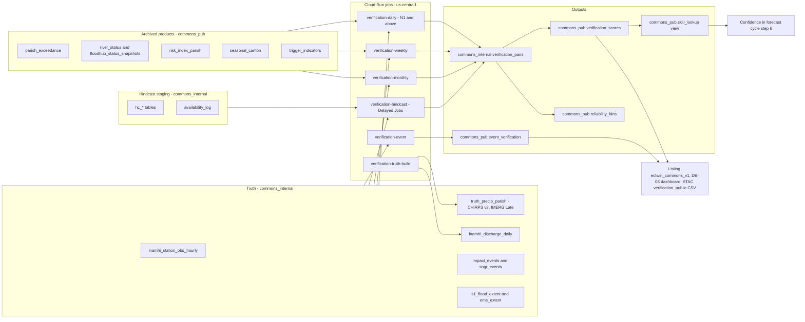
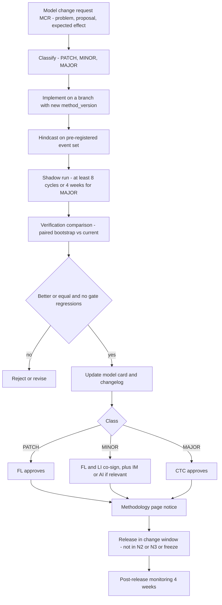
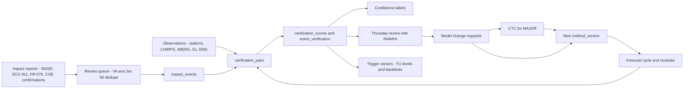
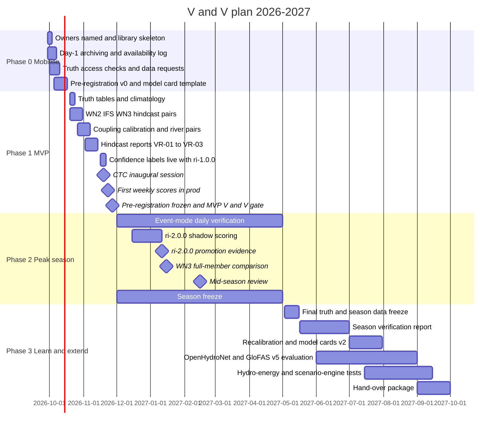

# Verification, validation and model governance

This document explains how *Gemelo Digital Ecuador – El Niño* (GDE-Niño) proves, in public and before anyone relies on it, that its forecasts, impact estimates, risk levels, trigger indicators and AI decisions work in Ecuador during an El Niño. It sets out the truth datasets and their caveats, the metrics for each product, a hindcast protocol that respects publication times, the acceptance gates a product must pass before a partner can use it in a trigger, the user-facing confidence labels, the verification pipeline (tables, jobs and SQL), the Jev and Gemini evaluation, model governance (model cards, versioning, change control and the committee), continuous monitoring, open publication, and a dated V&V plan for Phases 0–3. Plane, bucket, table, job and API names come from [03-architecture.md](./03-architecture.md) and are not redefined here. Impact modules, the parish risk index and triggers are specified in [07-impact-modules-and-triggers.md](./07-impact-modules-and-triggers.md), the Jev gold sets in [08-ai-decision-layer-jev.md](./08-ai-decision-layer-jev.md) §9, and daily operations in [11-operations-runbook.md](./11-operations-runbook.md). Every product verified here is *apoyo a la decisión – pronóstico experimental*. Verification never turns a platform product into an alert (D1).

## Contents

0. [Conventions, roles and definitions](#0-conventions-roles-and-definitions)
1. [Why V&V is critical for this twin](#1-why-vv-is-critical-for-this-twin)
2. [Truth datasets and their caveats](#2-truth-datasets-and-their-caveats)
3. [Metrics per product](#3-metrics-per-product)
4. [Hindcast protocol](#4-hindcast-protocol)
5. [Acceptance gates before trigger use and confidence labels](#5-acceptance-gates-before-trigger-use-and-confidence-labels)
6. [Verification pipeline architecture](#6-verification-pipeline-architecture)
7. [Jev and Gemini evaluation](#7-jev-and-gemini-evaluation)
8. [Model governance](#8-model-governance)
9. [Continuous monitoring and feedback](#9-continuous-monitoring-and-feedback)
10. [Reporting and open publication](#10-reporting-and-open-publication)
11. [V&V plan with dates, Phases 0–3](#11-vv-plan-with-dates-phases-03)
12. [Open questions](#12-open-questions)

---

## 0. Conventions, roles and definitions

### 0.1 Labels

- **(unverified)**: the research briefs could not confirm the fact.
- **(to confirm)**: a partner, Google, or counsel must confirm it.
- **Estimate**: our own arithmetic, shown in the text.
- **All acceptance thresholds in this document are proposals.** They are agreed with INAMHI (through LI), with the trigger owner, and with the Technical-Scientific Committee (§8.5) before they bind anyone.

### 0.2 Owner codes

The codes PL, DL, FL, FE, AI, SRE, DPO and TA come from [03](./03-architecture.md); PM, IC, COM, LI and LS from [11 §0](./11-operations-runbook.md#0-conventions); IM, HYD, EPI, AGR and PT from [07](./07-impact-modules-and-triggers.md); PA, LC and ETH from [13 §0.2](./13-governance-legal-risk.md). This document adds two:

| Code | Role | Notes |
|---|---|---|
| VA | Verification analyst | The hydromet analyst in the Commons data team ([11 §1.1](./11-operations-runbook.md)); reports to FL. Runs hindcasts, maintains truth tables, writes scorecards |
| CTC | *Comité Técnico-Científico* (Technical-Scientific Committee) | Its charter is in [13](./13-governance-legal-risk.md) §9.1; its model-governance duties are in §8.5 below |

FL is **accountable** for verification. VA is **responsible** for running it. LI co-signs anything that uses INAMHI data or thresholds.

### 0.3 Definitions

| Term | Meaning in this plan |
|---|---|
| **Verification** | Comparing a forecast or estimate with an independent observation, using scores (CRPS, Brier, POD/FAR…). Answers "how good is it?" |
| **Validation** | Checking that a product is fit for a stated decision: the right variable, lead time, spatial unit and reliability for that user's action and cost of error. Answers "is it good enough for *this* use?" |
| **Model governance** | The rules for who may create, change, promote, demote or retire a model, index, threshold, decision template or prompt, and how that is recorded |
| **Product** | A published table or layer, e.g. `commons_pub.parish_exceedance`, `commons_pub.risk_index_parish` |
| **Truth** | The observation or reference used to score a product. It always carries a `truth_version` and a dependence flag (§2.3) |
| **Hindcast** | Re-running today's method on past forecasts, using only what was available at each past decision time (§4) |
| **Module gate G0–G3** | Maturity of an impact module ([07 §10](./07-impact-modules-and-triggers.md)): prototype, experimental, validated, generally available |
| **Trigger-use level TU-0–TU-3** | Whether an indicator may feed a partner trigger, and at which stage (§5.1). New in this document |
| **Event** | An observed hazard impact at a place and time, from `commons_pub.impact_events` and `commons_pub.sngr_events` ([05 §4.9](./05-data-catalog.md)) |

---

## 1. Why V&V is critical for this twin

The twin will be used during what may be a historic El Niño, when people are making decisions under pressure. Seven facts make V&V a core function, not a reporting afterthought:

1. **Credibility is fragile after 2023-24.** Official messaging expected more coastal rain than fell in DJFMA 2024 ([01 §4](./01-context-el-nino-ecuador.md)). 2015-16 is a false-alarm analog: very strong in Niño 3.4, but a weaker coastal response. 2017 is a miss analog: a coastal El Niño that Niño 3.4 alone would not have caught. A twin that repeats either error loses its users. Publishing misses and false alarms (CTX-16) is the main protection.
2. **The AI weather models have not been evaluated where and when we need them.**
   - The WeatherNext 3 (WN3) paper reports "strong biases… in sparsely observed… areas such as the Andes" in the station head. Pseudo-stations reduced them, but the residual Andean bias is not quantified.
   - WN3 precipitation was evaluated for 2024 against IMERG Final, MRMS and gauges, with extremes capped at 4 mm/6 h. The real-time evaluation covered 2026-07-01 to 2026-08-11 only, which is the **coastal dry season** in Ecuador. Nothing in the paper is specific to Ecuador or South America ([arXiv:2609.03582](https://arxiv.org/abs/2609.03582); [paper PDF](https://storage.googleapis.com/deepmind-media/papers/weathernext_3.pdf)).
   - WeatherNext data is "not intended, validated or approved for real world use" ([terms of use](https://storage.googleapis.com/weathernext-public/terms-of-use.pdf)).
   - Extreme coastal rain (for example more than 100 mm/day in Manabí and Guayas) has not been evaluated by Google.
3. **ERA5 is a weak truth over the Andes, and verifying against it is circular.** In an Ecuador box computed from WeatherBench 2 for January–June 2022, GraphCast scored r = 0.90 on the coast at day 1 against ERA5, while IFS HRES scored 0.55. But GraphCast is trained on ERA5 and started from it, and the ERA5 Sierra mean of 11.2 mm/day is implausibly wet. Those numbers show that the pipeline works; they do not measure skill. D12 therefore forbids verifying AI models against ERA5 alone.
4. **The hydrological models are weak out of the box in Ecuador.**
   - GEOGloWS v2 raw median KGE across 182 Ecuadorian stations is **−0.57**, with a mean-flow ratio of 2.31 (about 2.3× overestimation). After bias correction it is **0.33** ([Global_Forecast_Validation](https://github.com/jorgessanchez7/Global_Forecast_Validation)).
   - Google's GRRR reforecast, compared with Google's own reanalysis, loses most of its event detection by lead 5 at small coastal basins: Chone POD 0.17 and FAR 0.73; Esmeraldas POD 0.05. That measures only how forcing error propagates, not skill against observations.
   - No published skill evaluation of Google's flood models in Ecuador or Peru was found **(unverified absence)**, and no likelihood thresholds or skill figures have been published for the flash-flood product ([OCHA observations](https://raw.githubusercontent.com/OCHA-DAP/ds-google-flood-hub/main/api/observations.json)).
5. **The AI decision layer is uncalibrated in Spanish and in crises.** Jev is "best in English". Out-of-distribution ECE degraded to 0.107 in one study, and an El Niño peak *is* out of distribution ([08 §1.4](./08-ai-decision-layer-jev.md)).
6. **Money and legal positions depend on evidence.** Partner triggers, evidence packs and contingent-finance requests ([07 §6](./07-impact-modules-and-triggers.md)) need a documented hit rate, false-alarm ratio and lead time. Without them, "decision support" (D1) is an empty label.
7. **Short records.** The WN3 archive starts on 2026-01-01, Flood API statuses on 2025-08-01, and INAMHI's API keeps only about 92 days. There is no IMERG Final after 2025-09-30. Every score will have wide uncertainty, and the twin must say so.

| Risk | V&V response | Section |
|---|---|---|
| Over-forecast repeats 2023-24 | Coupling indicator calibrated on analog years; reliability diagrams per ENSO phase; misses and false alarms published | §4.3, §5.3, §10 |
| Andean bias in AI rain | Truth from CHIRPS v3 and INAMHI gauges, stratified by elevation class; Sierra products capped at *confianza baja* until skill is shown | §2, §5.3 |
| Circular verification | Truth-dependence flag on every pair; never ERA5 alone; leave-station-out | §2.3, §4.1 |
| Look-ahead in backtests | `available_at` on every forecast; training-overlap flag; pre-registration | §4.1–§4.2 |
| Hydrological bias | Only bias-corrected GEOGloWS shown; KGE and event scores per reach | §3, §5.1 |
| Uncalibrated Jev | ECE gates, shadow mode, drift monitors | §7 |
| Silent method drift | Model cards, semantic versions, change control, CTC | §8 |

---

## 2. Truth datasets and their caveats

### 2.1 Catalogue of truth sources

`id` values are keys in [`catalog/data-sources.yaml`](../catalog/data-sources.yaml) ([05](./05-data-catalog.md)). Roles: **P** = primary truth, **S** = secondary truth, **V** = provisional truth (replaced by a final version later), **E** = event and impact truth, **R** = reference only (never the sole truth).

| Truth source (`id`) | Measures | Period and latency | Role | Where it lands | Main caveats |
|---|---|---|---|---|---|
| INAMHI stations (`inamhi_visor_stations`) | Hourly rain, temperature; level and discharge at 43 automatic stations | API keeps ≈92 days; 1 request/5 min; UTC timestamps ([config.py](https://github.com/jorgessanchez7/Global_Forecast_Validation/blob/master/Ecuador/INAMHI/config.py)). Archived from day 1 | **P** for point rain and river level | `commons_internal.inamhi_station_obs_hourly` | Only 202 of ≈1,894 stations were transmitting on 2026-09-27 ([05 §2.4](./05-data-catalog.md)); gaps (Songa, Guayaquil, missing 14–17 Sep); point-vs-cell representativeness; HTTP 500 unless a whole MAX/MIN/PROM group is requested; historical series need the MoU. QC per DQ-07 ([05 §7.1](./05-data-catalog.md)) |
| INAMHI historical discharge (via MoU; BYU/GEOGloWS archive for 182 stations) | Daily discharge | Historical; access **(to confirm)** | **P** for KGE/NSE and river events | `commons_internal.inamhi_discharge_daily` (new, §6.3) | The fastest route may be collaboration with the BYU team that computed the published metrics **(to confirm)**; licence and publication rights per MoU |
| CHIRPS v3 (`chirps`) | Daily rain, 0.05° | 1981→; preliminary ≈2 days, final ≈3 weeks after the month **(unverified)**; the dynamical.org mirror updates preliminary daily and final every 3 days | **P** gridded truth; the base for climatology 1991–2020 | `commons_internal.truth_precip_parish`, `clim_exceedance_parish` (new) | EE availability conflicts between briefs (`UCSB-CHC/CHIRPS/V3/DAILY_SAT`, `…/DAILY_RNL` in the catalogue source vs missing from the STAC mirror); fallback COGs `data.chc.ucsb.edu/products/CHIRPS/v3.0/daily/final/{rnl,sat}/cogs/YYYY/`. Blends stations, so it is **not independent of INAMHI gauges** it ingested; about 4× the stations of v2; described as IMERG-based in one brief (dependence on IMERG). The difference between the `sat` and `rnl` variants **(to confirm)** with CHC documentation. Day boundary **(to confirm)** |
| CHIRPS v2 (`UCSB-CHG/CHIRPS/DAILY`) | Daily rain | 1981 → 2026-08-31 in EE | **S** fallback only | same tables, `source='CHIRPS_V2'` | Fewer stations than v3 |
| IMERG V07 Early/Late (`imerg_v07`) | Half-hourly rain, 0.1° | EE runs to 2026-09-28; **no "permanent" (Final) products beyond 2025-09-30** during the V08 transition ([STAC](https://storage.googleapis.com/earthengine-stac/catalog/NASA/NASA_GPM_L3_IMERG_V07.json)) | **V** provisional truth for weekly scores and 12Z–12Z windows | `truth_precip_parish`, `source='IMERG_LATE'` | **Circular for WN3**: WN3 has an IMERG precipitation head trained on IMERG Final to September 2025. Satellite rain underestimates orographic rain in the Andes **(unverified)**. Replace with CHIRPS final when available |
| IMERG Final (V07 to 2025-09-30; V08 later) | Rain | Back-processing date for V08 unknown | **S** for 2022–2025 hindcasts | same | Same WN3 circularity |
| GRRR reanalysis and reforecast | Daily discharge at ≈1,840 mainland outlets | Reanalysis 1980-01-01 → 2023-12-23; reforecast issues 2016-01-01 → 2023-06-30, leads 0–7 days ([bucket](https://storage.googleapis.com/storage/v1/b/flood-forecasting/o?delimiter=/), CC BY 4.0) | **R** model truth; return-period thresholds | `commons_pub.grrr_ecuador` | A model, not an observation; older model version; ends before the 2023-24 peak and 2026. Outlets must be matched by upstream area, not nearest point (Esmeraldas example in [07 §4.1](./07-impact-modules-and-triggers.md)) |
| GloFAS v5.0 reanalysis (`glofas_reanalysis`) | Daily discharge, 0.05° | 1980–2025; LISFLOOD v5 calibrated on more than 5,300 stations ([GloFAS news](https://global-flood.emergency.copernicus.eu/news/252-The%20new%20Copernicus%20GloFAS%20v5.0%20hydrological%20reanalysis%20has%20been%20released/), search summary) | **R** fills 2024–2025 where no gauge exists | `commons_internal.glofas_reanalysis_reach` (new) | Model, ERA5-forced; not a warning (GloFAS licence); calibration stations in Ecuador unknown |
| Sentinel-1 flood extents (`sentinel1_grd`) | Observed water extent, 10 m | `COPERNICUS/S1_GRD` from 2014-10-03; revisit 6 days at best; only Sentinel-1A in 2023 **(unverified)** | **E** for extent (CSI) | `commons_internal.s1_flood_extent` (new; COG in `bulk/verification/s1/`) | SAR misses water under vegetation canopy and in dense urban areas (double bounce); a single overpass may miss the peak; EECU cost (10–60 EECU-h for the 2023 events, estimate) |
| Copernicus EMS rapid mapping (`copernicus_ems`) | Delineated flood extent for an AOI | EMSR789 and EMSR796 (2025-02-26), EMSR813 (2025-07-03), **EMSR870 (2026-03-02)** ([index](https://github.com/18orkidea/monitor-terremoto-colombia/blob/main/data/public/monitor.json)) | **E** high-quality reference for extent and for validating our S1 method | `commons_internal.ems_extent` (new) | Covers the activation AOI only; timing of image vs peak; manual download; licence **(to confirm)**; 1997-98 and 2008 predate the service; 2012–2023 activations **(unverified)** |
| Groundsource (`groundsource`) | Flood event polygons | 2000→; 2,646,302 records; ≈82% precision; ≈64% of events in 2020–2025 ([doc](https://github.com/samapriya/awesome-gee-community-datasets/blob/master/docs/projects/groundsource.md)) | **E** secondary event truth | `commons_pub.impact_events` (`source_id='groundsource'`) | Non-peer-reviewed preprint; recency bias; **the Flood Hub flash-flood model is trained on Groundsource**, so it cannot verify that product |
| SNGR events and SITREPs (`sngr_arcgis_events`, SITREPs) | Impact events by parish: affected people, homes, roads | 54 dossiers 2016–2026; 700+ PDFs for "Época Lluviosa 2026"; `COE2` is a current snapshot, archived from day 1; `EVENTOS_X_LLUVIAS` history **(unverified extent)** | **E** primary national impact truth | `commons_pub.sngr_events`, `commons_internal.sitrep_facts`, `commons_pub.impact_events` | Reporting bias toward accessible, populated places; report date ≠ event date; place names resolved by the gazetteer (≥98% automatic on the labelled sample, [05 §3.2](./05-data-catalog.md)); counts revised in later SITREPs |
| ECU 911 (`ecu911_ckan`, convenio A9) | Emergency-call statistics; later daily geolocated incident aggregates | CKAN monthly to at least Feb 2025 (geoblocked outside Latin America); A9 feed **(to confirm)**; 3.2M emergencies in 2025, 1,956 rainy-season alerts ([ECU 911](https://www.ecu911.gob.ec/3-2-millones-de-emergencias-gestionadas-por-el-ecu-911-en-2025/), search summary) | **E** for timing and urban flash floods | `commons_internal.ecu911_monthly`; daily aggregates after A9 | Calls measure exposure and reporting as well as hazard; pseudonymised before any processing (LP-09, D18); DPIA-02 ([13 §2.6](./13-governance-legal-risk.md)) |
| Other event sources | DesInventar (`desinventar_ecu`, coverage **unverified**), Global Flood Database (2000-02-17 → 2018-12-10, **CC BY-NC**, does not cover 1997-98), NASA landslide catalogue 1970–2019, MSP gazettes (`health_weekly`), CELEC reservoir levels (`reservoir_daily`), INOCAR and IOC tide gauges (`lali`, `gyer`, `puna`), Segura EP incident logs **(to request)** | Various | **E** per module | `impact_events` and module tables | Licence per source; NC rows only in `commons_pub_nc` |
| ERA5 / ERA5-Land (`era5`) | Reanalysis | 1940→ | **R** only: circulation variables, analog composites, SST | — | Never the sole truth for precipitation (D12) |
| Google inundation history | Share of time wet, 1999–2020, 128 m | Static | **R** prior for footprints | `exposure_parish.flood_prone_share` | Not an event record |

### 2.2 Truth hierarchy per variable

| Variable and product | Primary truth | Secondary | Provisional (weekly) | Never alone |
|---|---|---|---|---|
| 24 h and 72 h rain (`parish_exceedance`) | CHIRPS v3 final (areal) **and** held-out INAMHI stations (point) | CHIRPS v2 | IMERG Late; CHIRPS v3 preliminary | ERA5; IMERG for WN3 |
| Hourly intensity (`tp_1h_max`) | INAMHI automatic stations | IMERG Late (for areal) | IMERG Early | ERA5 |
| 2 m temperature and dewpoint (WN3 station head) | INAMHI stations, by elevation class | ERA5-Land | — | ERA5 |
| River discharge and level (`river_status`, `floodhub_status_snapshots`, `river_impact_reach`) | INAMHI level/discharge stations | GloFAS v5 reanalysis (2024–2025), GRRR reanalysis (to 2023) | — | GEOGloWS retrospective (same model family) |
| Flood extent (M1, M3 footprints) | Copernicus EMS delineations | Our Sentinel-1 extents | — | Inundation history |
| Impact levels (`risk_index_parish`, triggers) | SNGR events and SITREPs | Groundsource, ECU 911, EMS, FR-075 reports | COE2 captures | Social media alone |
| Seasonal terciles (`seasonal_canton`) | CHIRPS v3 seasonal totals per canton | INAMHI 1985–2015 normals (for anomaly sign) | — | ERA5 |
| ENSO indices (`enso_indices` forecasts) | Official observed indices: ICEN (ENFEN), RONI (CPC) | OISST-derived boxes | Weekly CPC | — |
| Coastal water level (M2, M3) | INOCAR / IOC gauges (`gyer`, `puna`, `lali`) | CMEMS `zos` | — | — |
| Dengue (M7) | MSP gazette counts (`health_weekly`) | OpenDengue (annual) | — | — |
| Reservoir levels (M8) | CELEC level series (unofficial endpoint, **to confirm with CELEC**) | CENACE balance | — | — |

### 2.3 Independence and circularity rules

A score is only as honest as the independence between the forecast and its truth. Every row in `commons_internal.verification_pairs` (§6.3) carries `truth_dependence` ∈ {`independent`, `partial`, `circular`}, set by this matrix:

| Forecast source | Truth | Dependence | Rule |
|---|---|---|---|
| WN3 `imerg_tp_1hr` head | IMERG (any run) | circular | Report only as "consistency"; never used for gates |
| WN3 `total_precipitation_1hr`, PARDIG | IMERG | partial | Provisional scores only; gates use CHIRPS final + gauges |
| WN2, GraphCast family | ERA5 | circular | Pipeline check only |
| Any model | CHIRPS v3 | partial (CHIRPS blends IMERG and stations) | Gates also require a station-based score on **held-out** INAMHI stations |
| Bias-corrected product | INAMHI stations used in its calibration | circular | Leave-station-out and leave-one-season-out only (§4.1) |
| GEOGloWS bias-corrected | Same gauge used for the flow-duration correction | circular unless cross-validated | Re-compute KGE with split-sample validation; the published 0.33 median is treated as possibly in-sample **(method to confirm)** |
| GRRR reforecast | GRRR reanalysis | circular | Forcing-error diagnostic only |
| Flood API flash floods | Groundsource | circular (training data) | Verify against SNGR, ECU 911 and FR-075 only |
| Risk index with Jev fusion | SNGR reports that Jev also read (`reports_confirm`) | partial | Score both with and without the `F_OBS` flag; gates use the version without |

---

## 3. Metrics per product

### 3.1 Metric definitions

Notation: forecast probability *p*, binary outcome *o* ∈ {0, 1}, ensemble members *x₁…x_M*, observation *y*, quantile *q_τ* at level τ.

| Metric | Definition | Good value | Use |
|---|---|---|---|
| **CRPS** (ensemble, "fair") | (1/M) Σᵢ \|xᵢ − y\| − 1/(2M(M−1)) Σᵢ Σⱼ \|xᵢ − xⱼ\| | 0, same units as *y* | WN2 64 members, GloFAS 51, SFINCS ensembles |
| **Quantile CRPS (QCRPS)** | 2/K Σₖ ρ_τₖ(y − q_τₖ), with pinball loss ρ_τ(u) = u(τ − 1{u<0}), over τ ∈ {0.10, 0.25, 0.50, 0.75, 0.90} | 0 | WN3 statistics (BigQuery and EE hold only mean, p10–p90). **Truncated: ignores the tails.** Calibrated against full CRPS using WN2 members at the same quantiles (§3.4); compare QCRPS only with QCRPS |
| **CRPSS** | 1 − CRPS / CRPS_ref (reference = CHIRPS 1991–2020 climatology of the same parish, window and calendar day ±15 days) | > 0 | Headline skill, per region and lead |
| **Brier score (BS)** | (1/N) Σ (p − o)²; Murphy decomposition BS = REL − RES + UNC over 10 probability bins | 0 | Threshold exceedance (`parish_exceedance`, river RP classes) |
| **BSS** | 1 − BS / BS_clim, with BS_clim from the climatological base rate | > 0 | Gates, confidence labels |
| **Reliability diagram and slope** | Observed frequency vs mean forecast probability per bin; weighted least-squares slope | Slope ≈ 1 (0.7–1.3 accepted) | Detects over-forecasting (the 2023-24 failure mode) |
| **ROC AUC** | Area under hit rate vs false-alarm rate (POFD) across probability thresholds | > 0.5; ≥ 0.75 for activation use | Discrimination, independent of calibration |
| **Spread–skill ratio** | √(mean ensemble variance × (M+1)/M) ÷ RMSE of the ensemble mean | ≈ 1 | Ensemble dispersion; WB2 files for `south-america_land` (2020) give 1.02–1.10 for GenCast and ECMWF ENS against ERA5 (own computation from `gs://weatherbench2/benchmark_results/`, [WB2](https://github.com/google-research/weatherbench2)) |
| **Rank histogram** | Rank of *y* among members | Flat | Bias and dispersion diagnosis |
| **SEEPS** | Stable equitable error in probability space, three categories (dry, light, heavy) | 0 | Deterministic medians; matches WB2 practice |
| **ETS** | (H − H_rand) / (H + M + F − H_rand) | > 0 | Deterministic exceedance |
| **KGE** | 1 − √((r − 1)² + (α − 1)² + (β − 1)²), α = σ_sim/σ_obs, β = μ_sim/μ_obs; report r, α, β separately | 1; > −0.41 beats the mean-flow benchmark | Discharge series (GEOGloWS, GloFAS, GRRR, OpenHydroNet) |
| **NSE** | 1 − Σ(sim − obs)² / Σ(obs − mean obs)² | 1 | Discharge series; sensitive to peaks |
| **POD (hit rate)** | H / (H + M) | 1 | Events, triggers |
| **FAR (false-alarm *ratio*)** | F / (H + F) | 0 | What users feel as "crying wolf" |
| **POFD (false-alarm *rate*)** | F / (F + CN) | 0 | ROC axis; cost-loss value |
| **CSI** | H / (H + M + F) | 1 | Events, flood extents (per pixel or per canton-day) |
| **Frequency bias** | (H + F) / (H + M) | 1 | Over- or under-forecasting of events |
| **Lead time gained** | For each observed event: event onset − the first `available_at` from which the product stayed at or above the decision threshold for ≥ 2 consecutive cycles. Median and IQR over events; misses count as 0 h | Higher | Early action value. Compared internally with the INAMHI *advertencia* issue time; that comparison is shared with INAMHI only and not published unless INAMHI agrees (D1, D2) |
| **Trigger contingency** | Hits, misses, false alarms, correct negatives per trigger version and stage, with episode declustering (§3.3) | — | [07 §6.5](./07-impact-modules-and-triggers.md) SQL |
| **Relative economic value V(α)** | For cost-loss ratio α = C/L and base rate s: V = [min(α, s) − POFD·α(1 − s) + POD·s(1 − α) − s] / [min(α, s) − s·α] | 1 = perfect; ≤ 0 = no better than always or never acting | Trigger threshold choice when a partner can state C and L |
| **RPSS (terciles)** | RPS = Σₖ (Fₖ − Oₖ)² over cumulative categories; RPSS = 1 − RPS / RPS_clim with (1/3, 1/3, 1/3) | > 0 | `seasonal_canton` |
| **ECE** | Σ_b (n_b / N) \|mean p_b − observed frequency_b\|, 10 equal-width bins | ≤ 0.08 for gated Jev questions | Jev, coupling indicator, risk-index probabilities |
| **Macro-F1, precision, NPV, recall** | Standard classification metrics | — | Jev and Gemini templates ([08 §9.3](./08-ai-decision-layer-jev.md)) |

### 3.2 Product × metric matrix

Region strata: `costa`, `sierra`, `amazonia`, `galapagos`, plus province and basin. Lead bands `d1_3`, `d4_7`, `d8_15` ([07 §2.2](./07-impact-modules-and-triggers.md)).

| Product (table) | Variables | Truth | Metrics | Strata | Cadence |
|---|---|---|---|---|---|
| Parish rain exceedance, WN3/WN2/IFS (`commons_pub.parish_exceedance`) | `tp_24h`, `tp_72h` ≥ each INAMHI *umbral*; `tp_1h_max` | CHIRPS v3; held-out INAMHI stations; IMERG Late (provisional) | BS, BSS, REL/RES/UNC, reliability slope, ROC AUC, frequency bias; lead-time gained for events | Region, elevation class (western cordillera, inter-Andean valleys, eastern slopes, lowlands), lead day, threshold, ENSO phase, month | Weekly (provisional), monthly (final) |
| WN2 and WN3 quantitative rain (verification-only, not published) | 24 h totals at stations and cells | INAMHI; CHIRPS | CRPS, CRPSS, QCRPS, spread–skill, rank histogram, SEEPS, bias | Same | Weekly, monthly |
| WN3 station head | `2t`, `2d` | INAMHI stations | CRPS on quantiles, bias, MAE | Elevation class, hour of day | Monthly |
| Rivers (`commons_pub.river_status`, `floodhub_status_snapshots`, `river_impact_reach`) | Discharge; RP2/RP5/RP20 exceedance; Flood API `severity` | INAMHI gauges; GloFAS v5 reanalysis where ungauged | KGE (r, α, β), NSE, ensemble CRPS, POD/FAR/CSI at RP2 and RP5 with ±1 day, lead-time gained | Reach, basin, lead day, `quality_verified`, `gauge_model_id` | Weekly, monthly |
| Flood footprints (M1, M3 `sfincs_match`) | Wet/dry extent; depth > 0.15 m | EMS delineations; our Sentinel-1 extents | CSI, hit rate, false-alarm area, bias of flooded area | Site, event | Per event |
| Parish risk index (`commons_pub.risk_index_parish`) | Level ≥ 3 and `risk_score` | SNGR events within 72 h in the same or a neighbouring canton | ROC AUC on `risk_score`; canton-day POD/FAR/CSI for level ≥ 3; reliability of "level ≥ 3 → event" | Horizon band, dominant hazard, region, with and without `F_OBS` | Weekly, per season |
| Coupling indicator ([01 §11.2](./01-context-el-nino-ecuador.md)) | *bajo / medio / alto acoplamiento* | DJFMA coastal rain anomaly > P75 (CHIRPS) | ROC AUC, reliability of categories | Analog years 1982-83 to 2023-24 | Once in Phase 1, then per season |
| Seasonal terciles (`commons_pub.seasonal_canton`) | P(below/normal/above) | CHIRPS v3 canton totals | RPSS, reliability of above-normal category, ROC AUC (above) | Canton, system, lead month | Monthly; per season |
| ENSO index forecasts (`commons_pub.enso_indices`, `is_forecast`) | ICEN, RONI, Niño 1+2 | Observed ICEN/RONI | MAE, RMSE, hit rate of magnitude category | Lead month | Monthly |
| Landslides M4 (`landslide_hazard_parish`) | LHASA class | NASA landslide catalogue, SNGR landslide events, ECU 911 road events | POD/FAR at class *alta*, ROC AUC | Parish, corridor segment | Per season |
| Agriculture and aquaculture M5/M6 | Flooded share of crop or pond area | Sentinel-1 extents, farm reports, AgroProtege claims **(to confirm)** | CSI, basis-risk correlation | Parish, crop | Per event |
| Dengue M7 (`health_risk_weekly`) | P(cases > endemic P75) | MSP gazette counts | BSS, reliability, CRPS on counts (Mosqlimate protocol) | Province, lead 4–8 weeks | Monthly |
| Reservoir M8 (`reservoir_watch`) | Days to 2,115 masl; inflow | CELEC levels | MAE of days-to-threshold, CRPS of inflow, BSS of P(reach within 45 days) | Reservoir, lead | Weekly |
| Triggers (`ectwin.trigger_eval`, tenant) | Stage status | Trigger's own `event_def` | Contingency, POD, FAR, CSI, median lead time, V(α) | Trigger version, stage | Per season; replayed on change |
| Jev templates (`decision_log`) | Probabilities | Gold labels | ECE, precision/NPV per band, recall, abstain rate | Template, question, backend | Weekly audit |
| Gemini outputs | Bulletins, copilot answers, NL→SQL | Source values, human review | Numeric-consistency rate, vocabulary pass rate, execution accuracy | Template | Per batch |

### 3.3 Event matching, declustering and significance

1. **Spatial tolerance.** A forecast "hit" for a parish or canton counts if the observed event is in the same canton or a neighbouring canton (shared border in `dim_dpa`). Scores for exact-parish matching are also reported.
2. **Temporal tolerance.** ±1 day for daily products and daily triggers; ±1 week for weekly products (dengue); ±1 day around the observed peak for river RP exceedance.
3. **One event, one hit.** An observed event can be matched once per product. Consecutive days above threshold form one **episode**; an episode with no event within tolerance is **one** false alarm, not one per day.
4. **Minimum evidence.** Fewer than 5 observed events in a stratum means *sin evidencia suficiente* ([07 §6.5](./07-impact-modules-and-triggers.md)); the score is shown with that label and cannot support a gate.
5. **Confidence intervals.** 90% intervals from a **moving-block bootstrap** (7-day blocks, 1,000 resamples), because daily errors are autocorrelated. Spatial dependence is handled by pooling parishes within a province before resampling.
6. **Paired comparisons.** When two methods are compared on the same cases (e.g. raw vs bias-corrected, WN3 vs IFS), use the bootstrap of the score difference. A method "wins" only if the 90% interval of the difference excludes 0.
7. **Base-rate honesty.** Every BSS and CSI is published with its base rate *s* and *n*, because rare events inflate variance and CSI depends on *s*.

### 3.4 Baselines and reference forecasts

| Baseline | Source | Used for |
|---|---|---|
| Climatology | CHIRPS v3 1991–2020, same parish and calendar day ±15 days (`commons_internal.clim_exceedance_parish`) | BSS, CRPSS reference |
| ENSO-conditioned climatology | CHIRPS composites for El Niño years (1982-83, 1997-98, 2015-16, 2023-24) | "Is the model better than knowing it is an El Niño year?" |
| Persistence | Yesterday's observed exceedance | Short-lead sanity check |
| ECMWF IFS ENS | WeatherBench 2 archive `gs://weatherbench2/datasets/ifs_ens/2016-2024-1440x721.zarr` (50 members, 0.25°, covers 2023), and ECMWF open data from 2023-07-12 in `gs://ecmwf-open-data` | Independent operational baseline; fallback model (`model='IFS'`) |
| INAMHI WRF | GeoServer `wrf_tiempo_precipitacion` | National baseline; comparison shared with INAMHI |
| Raw vs corrected | Same model before `bc_params` | Proves bias correction adds value |
| WN2 at the WN3 quantiles | WN2 64 members reduced to p10–p90 | Calibrates QCRPS against full CRPS (QCRPS/CRPS ratio per region and lead), so WN3 QCRPS can be put on a CRPS scale with a stated error |

### 3.5 Reference implementation

```python
# libs/ectwin_core/verification/metrics.py  (Apache-2.0; unit-tested against hand-computed cases and an
# independent open-source implementation such as xskillscore or properscoring - versions to pin; not reviewed in the briefs)
import numpy as np

def crps_ensemble_fair(members: np.ndarray, y: float) -> float:
    """Fair CRPS for M members (unbiased for finite ensembles)."""
    x = np.asarray(members, dtype=float); m = x.size
    term1 = np.mean(np.abs(x - y))
    term2 = np.sum(np.abs(x[:, None] - x[None, :])) / (2 * m * (m - 1))
    return term1 - term2

WN3_TAUS = np.array([0.10, 0.25, 0.50, 0.75, 0.90])

def qcrps(quantiles: np.ndarray, y: float, taus: np.ndarray = WN3_TAUS) -> float:
    """Truncated quantile-score CRPS approximation (tails ignored). Compare only with QCRPS."""
    u = y - np.asarray(quantiles, dtype=float)
    pinball = u * (taus - (u < 0))
    return 2.0 * pinball.mean()

def brier_decomposition(p: np.ndarray, o: np.ndarray, n_bins: int = 10):
    p, o = np.asarray(p, float), np.asarray(o, float)
    b = np.minimum((p * n_bins).astype(int), n_bins - 1)
    base = o.mean(); rel = res = 0.0
    for k in range(n_bins):
        m = b == k
        if m.any():
            pk, ok, nk = p[m].mean(), o[m].mean(), m.sum()
            rel += nk * (pk - ok) ** 2; res += nk * (ok - base) ** 2
    n = p.size
    return {"bs": np.mean((p - o) ** 2), "rel": rel / n, "res": res / n,
            "unc": base * (1 - base), "base_rate": base, "n": n}

def kge(sim: np.ndarray, obs: np.ndarray) -> dict:
    sim, obs = np.asarray(sim, float), np.asarray(obs, float)
    ok = ~(np.isnan(sim) | np.isnan(obs)); sim, obs = sim[ok], obs[ok]
    r = np.corrcoef(sim, obs)[0, 1]; alpha = sim.std() / obs.std(); beta = sim.mean() / obs.mean()
    return {"kge": 1 - np.sqrt((r - 1) ** 2 + (alpha - 1) ** 2 + (beta - 1) ** 2),
            "r": r, "alpha": alpha, "beta": beta, "n": int(ok.sum())}

def relative_value(pod: float, pofd: float, base_rate: float, alpha: float) -> float:
    """Relative economic value for cost-loss ratio alpha = C/L."""
    s = base_rate
    e_clim, e_perf = min(alpha, s), s * alpha
    e_fc = pofd * alpha * (1 - s) + pod * alpha * s + (1 - pod) * s
    return (e_clim - e_fc) / (e_clim - e_perf) if e_clim > e_perf else float("nan")

def ece(p: np.ndarray, y: np.ndarray, n_bins: int = 10) -> float:
    p, y = np.asarray(p, float), np.asarray(y, float)
    b = np.minimum((p * n_bins).astype(int), n_bins - 1)
    return sum((b == k).sum() * abs(p[b == k].mean() - y[b == k].mean())
               for k in range(n_bins) if (b == k).any()) / p.size
```

---

## 4. Hindcast protocol

### 4.1 Rules (no look-ahead)

| # | Rule | How it is enforced |
|---|---|---|
| H1 | **A forecast can only be used after it was available.** Every forecast row has `init_time` and `available_at`. For live products `available_at` is the observed publication time of our partition (`availability_basis='observed'`). For archive or backfilled data it is `init_time` + documented dissemination latency (§4.2) + our processing target of 1 h ([03 §4.2](./03-architecture.md)), with `availability_basis='nominal'` | `commons_internal.availability_log`; every hindcast join filters `available_at <= decision_time` |
| H2 | **The model must not have been trained on the verification period.** Every pair carries `training_overlap` ∈ {`no`, `possible`, `yes`} | See the table in §4.2. Gates use `training_overlap='no'` cases only, unless the CTC accepts an exception in writing |
| H3 | **Post-processing is fitted only on the past.** Bias correction (`bc_params`), thresholds and weights are fitted with a rolling origin (data before the issue date) or leave-one-season-out when data are short. Stations used for fitting are excluded from the station-based score (leave-station-out, blocked by basin) | `hindcast_runs.cv_scheme`; unit test that fails if a fit window overlaps the scored window |
| H4 | **Return-period thresholds are out of sample or declared.** RP thresholds from GRRR 1980–2023 or GloFAS v5 1980–2025 include the verification years. Scores using them are labelled `thresholds_in_sample=true`; a sensitivity run re-fits Gumbel RPs leaving the event year out | Column in `hindcast_runs` |
| H5 | **Truth is versioned and may arrive late.** Observations can be used after the fact as truth, never as inputs. Provisional truth (IMERG Late, CHIRPS preliminary) is replaced by final truth and scores are re-issued with `score_status='final'` | `truth_version` on each pair |
| H6 | **Event dates are event dates.** Truth uses the SITREP or `EVENTOS_X_LLUVIAS` event date, not the report date; a report published later may be used as truth but not as a model input at the decision time | Parser fields in `sitrep_facts` |
| H7 | **Official products are compared as issued.** Official alerts use `official_alerts.issued_at`, verbatim | [03 §5.3](./03-architecture.md) |
| H8 | **Everything is reproducible.** Each hindcast has a `hindcast_run_id` with image digest, `method_version`, input table snapshots and parameters | `commons_internal.hindcast_runs` |
| H9 | **Pre-registration before the live season.** Metrics, strata, event definitions, gates and thresholds for 2026-27 are frozen in `docs/verification/preregistration-2026-27.md` **by 2026-11-27**; later changes are logged with a reason | CTC minute; git tag `vv-prereg-2026-27` |

### 4.2 Publication times and training windows

| Source | Nominal availability (UTC) | Archive start | Training window of the model that made the archive | `training_overlap` rule |
|---|---|---|---|---|
| WN3 main cycles (00/06/12/18Z) | BigQuery/EE ≈ init + 8 h 10 min; GCS ≈ +7 h 45 min; ±15 min, occasionally ±60 min ([dissemination](https://developers.google.com/weathernext/guides/dissemination), search summary) | 2026-01-01 | Production model trained through **2026-06-30** (paper) | **`possible` for all WN3 inits before 2026-07-01** until Google confirms which model version produced the archived runs. A secondary note says the archive up to August 2026 was backfilled about 20 days after initialisation **(unverified)**; if so, those forecasts were never available in real time. WN3 gates therefore rely on 2026-07-01 onward |
| WN3 interim hourly runs (48 h) | ≈ init + 7 h 25 min | Coverage in BQ/EE **(to confirm)** | Same | Same |
| WN2 (00/06/12/18Z) | 07:30, 13:30, 19:30, 01:30 for 00, 06, 12, 18Z | 2022-01-01 | Operational checkpoints `WeatherNext2_<2025_model{1..4}` trained on data through 2024 | **`possible` for 2022–2024** (if the archive was produced or re-produced with these checkpoints; **to confirm with Google**); `no` from 2025-01-01. This is a tension with D12, which uses the WN2 archive to evaluate El Niño skill: 2023 scores are reported as an upper bound next to the independent IFS ENS baseline |
| IFS ENS (WB2 archive, open data) | Operational at the time | 2016 (WB2); 2023-07-12 (open-data mirror) | Operational, no overlap | `no` |
| GloFAS 30-day forecast | Daily **(latency to confirm)** | 2019-11-05 (EWDS) | Operational | `no` |
| GloFAS reforecast | Pseudo-operational | 1999–2023-11 | Calibration period overlaps **(to confirm)** | `possible` |
| GEOGloWS forecasts | Daily 00Z runs | 2024-07-01 (`s3://geoglows-v2-forecasts`) | Operational | `no`; but BC correction fitted on the same gauges → `circular` truth unless split-sample |
| GRRR reforecast | Pseudo-operational | Issues 2016-01-01 → 2023-06-30 | Unknown training set **(to confirm)** | `possible` |
| Flood API flood status | Several times a day; `cutoffTime` floor 2025-08-01 | 2025-08-01 via backfill; our snapshots from day 1 | Operational | `no`; backfilled statuses carry `availability_basis='nominal'` |
| Flood API flash floods | One issue per day, observed at 06:33 UTC, 24 h period | Only our daily snapshots (no history endpoint) | Trained on Groundsource | `no` for timing; `circular` against Groundsource |
| C3S seasonal | 13th at 12 UTC **(unverified)**; SEAS5 ≈ 5th **(unverified)** | Real-time archive 2017→; hindcasts 1993–2016 | Hindcasts are in-sample for climatology | Hindcast scores labelled `hindcast`; real-time 2017→ labelled `realtime` |
| CFSv2 | 00Z monthly files at 07:31–08:52 UTC the same day | `s3://noaa-cfs-pds` from 2018-10-31 | Operational | `no` |
| CPC RONI probabilities | Second Thursday of the month | — | — | Official input |
| ENFEN ICEN / *comunicado* | Per *comunicado* **(to confirm)** | `ICEN.txt` series | — | Official input |
| INAMHI stations (truth) | Hourly; QC settles after 7 days | Day-1 archive; history via MoU | — | Truth only |
| CHIRPS v3 (truth) | Preliminary ≈2 days; final ≈3 weeks after month end **(unverified)** | 1981→ | — | Truth only |
| SNGR SITREPs (truth) | As scraped | 2016→ | — | Truth only |

**Out-of-sample proxy for 2023 (optional, Phase 2).** To estimate out-of-sample AI skill for the 2023 coastal El Niño, the GenCast `0p25deg <2019` open checkpoint ([weathernext repo](https://github.com/google-deepmind/weathernext)) can be self-run on weekly 12Z initialisations from March to June 2023 (≈17 runs). WN2 is described as about 8× faster than GenCast, and one WN2 member takes "just under 1 minute" on a TPU v5p, so one 50-member GenCast run is roughly 50 × 8 min ≈ 6.7 chip-hours, US$14–28 at US$2.10–4.20/chip-hour; 17 runs ≈ US$240–480 (**estimate; runtime unverified**). Decision by FL at the 2027-01-15 checkpoint.

### 4.3 Event set

| Event | Signature | Forecast archives available | Truth available | Purpose | Owner, due |
|---|---|---|---|---|---|
| **1982-83** | Canonical, very strong; not forecast operationally **(unverified)** | None medium-range. Seasonal hindcasts: SEAS5 (1981–) and CFSv2 (1982–) include it **(unverified)** | CHIRPS (1981→), ERA5, GRRR reanalysis (1983 is the record annual maximum at Esmeraldas), losses (CEPAL US$640.6M) | Impact thresholds; coupling-indicator calibration; analog envelope; seasonal hindcast check. **Not forecast verification** | FL, VA — 2026-11-06 |
| **1997-98** | Canonical, very strong; sea level +42 to +47 cm | C3S common hindcast 1993–2016 | CHIRPS; GRRR reanalysis (record year at Daule, Babahoyo, Portoviejo, Chone: e.g. Daule outlet 1,989.5 m³/s on 1998-04-02; Portoviejo 151.9 m³/s on 1998-02-07); CEPAL losses; the Global Flood Database does **not** cover it | Thresholds for "what if 1998 happened again" scenarios; coupling calibration; seasonal skill in an extraordinary event | FL, IM — 2026-11-06 |
| **2015-16** | Very strong in Niño 3.4; coastal rain overpredicted **(unverified)** | C3S hindcasts; GRRR reforecast from 2016-01-01; WB2 IFS ENS from 2016; IFS extended range (WB2, from 2016-01-04) | CHIRPS; GRRR reanalysis (Daule peak 1,364 m³/s); Global Flood Database; Sentinel-1 (from 2014-10); dengue 42,473 cases (2015) | **False-alarm test** for seasonal, coupling and readiness triggers | FL — 2026-11-13 |
| **2017 coastal El Niño** (Dec 2016 – May 2017) | Niño 1+2 strongly positive, Niño 3.4 near neutral **(unverified)** | WB2 IFS ENS; GRRR reforecast; C3S real-time (2017→); IFS extended range | CHIRPS; SNGR (2,903 events in 24 provinces to 9 Jun 2017); Sentinel-1; GRRR reanalysis | **Miss test**: a Niño 3.4-only rule must be shown to miss it and the ICEN pathway (D4) to catch it | FL — 2026-11-13 |
| **2023 coastal Niño and 2023-24 El Niño** | Coastal warming from March 2023; DJFMA 2024 rain only partly realised | WN2 (2022→, `training_overlap=possible`); WB2 IFS ENS; GRRR reforecast to 2023-06-30 and reanalysis to 2023-12-23; C3S real-time; CFSv2 (2018-10→) | CHIRPS; IMERG Final; INAMHI via MoU; SNGR SITREPs; Sentinel-1 (S1A only **(unverified)**); IFRC EAP activation (August 2023, third trigger reached November 2023); GRRR: Daule 1,301 m³/s on 2023-04-17 (above RP5, 40 days above RP2), Esmeraldas 2,777 m³/s on 2023-04-23 | Main El Niño skill test for WN2 vs IFS (upper bound); **over-forecast test** for the 2024 season; EAP trigger replay | FL, VA — 2026-11-13 |
| **2025 events** | Rainy season 2025 | WN2 (`training_overlap=no`); GEOGloWS forecasts (2024-07→); Flood API statuses from 2025-08-01 only | EMSR789, EMSR796 (2025-02-26), EMSR813 (2025-07-03); SITREPs | First fully out-of-sample WN2 season; S1 method validation vs EMS | VA — 2026-11-20 |
| **2026 rainy season** (Jan–May 2026) | Coastal El Niño from about Feb–Mar 2026; national emergency 13 Mar 2026; 17 deaths and more than 113,000 affected by 18 May | WN3 (`possible`), WN2 (`no`), GEOGloWS, GloFAS, Flood API (`cutoffTime` backfill, nominal availability) | **EMSR870 (2026-03-02)**; 700+ "Época Lluviosa 2026" SITREP PDFs; INAMHI stations only where archived by others or via MoU; CHIRPS v3; IMERG Late only (no Final) | **The only window where every product in the stack exists: full-stack test case.** Threshold tuning for triggers (M1 G2 target in [07 §4.1](./07-impact-modules-and-triggers.md)) | FL, IM, VA — 2026-11-20 |
| **2024 drought** | Hydro-drought after El Niño; Mazar empty | CFSv2, C3S, GloFAS seasonal reforecast (to 2023-07) and real-time | CELEC levels (from 2014), CENACE balance | M8 hydro-energy (La Niña/drought side, D4b) | FL, IM — Phase 3 |
| **2026-27 season (live)** | Possibly historic | All live products with observed `available_at` | All truth, archived from day 1 | Prospective verification against the pre-registration (H9) | FL — continuous |

### 4.4 Per-product hindcast plans

| Product | Hindcast source and period | Truth | Headline metrics | Deliverable | Owner, date |
|---|---|---|---|---|---|
| WN2 parish exceedance | WN2 2022-01-01 → 2026-09-30, 00Z and 12Z inits (≈3,400 inits; scans ≈0.2 GB per column-init, split by month to stay near the free TiB, [03 §7.5](./03-architecture.md)) | CHIRPS v3; held-out INAMHI stations; IMERG Final to 2025-09 | BSS, reliability, ROC by region, lead, ENSO phase; `training_overlap` split at 2025-01-01 | VR-01 rain hindcast report | VA, FL — 2026-11-13 |
| IFS ENS baseline | WB2 2016–2024; open data 2023-07→ | Same | Same; paired differences vs WN2 | Part of VR-01 | VA — 2026-11-13 |
| WN3 parish exceedance and QCRPS | 2026-01-01 → live | CHIRPS v3 prelim/final; stations | QCRPS (calibrated), BSS; results before 2026-07-01 flagged `possible` | VR-01 addendum; monthly | VA — 2026-11-13, then monthly |
| Bias correction (`bc_params`) | Quantile mapping of WN2 daily rain against CHIRPS v3 (0.05°), trained 2022–2025 by month (±1 month), lead day and elevation class; WN3: regional pooling or delta mapping until a full wet season exists, then EMOS or a censored shifted-gamma model | Leave-one-season-out; held-out INAMHI stations | CRPSS gain raw → corrected; reliability slope | Model card `FC-BC-QM` | FL — 2026-11-06; EMOS decision 2027-02-15 |
| Rivers: GRRR reforecast | 2016-01-01 → 2023-06-30, leads 0–7 | INAMHI discharge (182 stations, access to confirm); GRRR reanalysis for diagnostics | POD/FAR/CSI at RP2 and RP5 with ±1 day; KGE of reanalysis | VR-02 river report | VA, HYD — 2026-11-13 |
| Rivers: GEOGloWS | Retrospective (raw and bias-corrected, split-sample) 1980→; forecasts 2024-07-01 → | INAMHI discharge | KGE (r, α, β), event POD/FAR | VR-02 | VA — 2026-11-13 |
| Rivers: GloFAS | Reforecasts 1999–2023-11 (subset: Ecuador reaches, El Niño years); forecasts 2019-11-05 → | INAMHI; GloFAS v5 reanalysis for ungauged | Ensemble CRPS, BSS at RP5, POD/FAR | VR-02 | VA — 2026-11-20 |
| Rivers: Flood API | Status snapshots 2025-08-01 → (backfill with `cutoffTime`) | INAMHI level stations; SNGR river events | Hit rate, FAR per severity, by `quality_verified` and `gauge_model_id` (never compare across model ids, [11 RB-04](./11-operations-runbook.md)) | VR-02 addendum | VA — 2026-11-20 |
| Seasonal terciles | C3S hindcasts 1993–2016 per canton; real-time 2017→ (check 2023-24); CFSv2 lagged 2018-10→ | CHIRPS v3 canton seasonal totals | RPSS, reliability, ROC (above); cantons with RPSS ≤ 0 greyed out | VR-03 seasonal report | FL — 2026-11-20 |
| Coupling indicator | DJFMA seasons 1982–2024 (≈42 seasons) | Coastal DJFMA anomaly > P75 in ≥ 3 of 6 coastal provinces | ROC AUC; reliability of *bajo/medio/alto*; leave-one-year-out weights | VR-04 (CTX-03 calibration) | FL — 2026-11-06 |
| Risk index `ri-1.0.0` / `ri-2.0.0` | Jan–May 2026 and Mar–Jun 2023 replays with frozen `risk_index_params` | SNGR events | Canton-day POD/FAR at level ≥ 3; ROC on `risk_score` | VR-05; shadow comparison for promotion ([07 §5.5](./07-impact-modules-and-triggers.md)) | IM, VA — 2026-11-20; 2027-01-11 |
| Triggers (TR-01 … TR-16) | Window per trigger `backtest` block ([07 §6.2](./07-impact-modules-and-triggers.md)) | Trigger `event_def` | Contingency, CSI, median lead time, V(α) | Backtest sheet in the partner's tenant | Trigger owner with IM — before TU-2 (§5.1) |
| M3 SFINCS emulator | Library hold-out runs; EMSR870 and INOCAR tidal-flood events 13–16 Aug 2026 | Full SFINCS runs; EMS extents | Emulator CSI ≥ 0.80, depth MAE ≤ 0.10 m ([07 §2.4](./07-impact-modules-and-triggers.md)); event CSI | M3 validation report | HYD — 2026-12-15 |
| M4 LHASA | 2016–2026 (IMERG forcing; WN3 p50/p90 forcing from 2026) | NASA catalogue 2016–2019, SNGR landslide events | POD/FAR at *alta* | M4 report | IM — 2027-01-15 |
| M7 dengue | 2015–2026 province-weeks | MSP gazettes | BSS at 4–8 weeks | M7 report | EPI — 2027-01-15 |
| M8 reservoir | 2014 → with 2024 drought | CELEC levels | MAE days-to-threshold | M8 report | IM — 2027-09-15 |
| OpenHydroNet Ecuador (Phase 3) | Leave-basin-out on the Caravan Ecuador extension | INAMHI discharge | KGE, POD/FAR vs GRRR, GEOGloWS BC and GloFAS | VR-06 | FL, HYD — 2027-08-31 |

### 4.5 Hindcast run procedure

1. **Register.** VA creates a `hindcast_runs` row: product, period, `method_version`, `cv_scheme`, truth versions, pre-registered metrics. The run gets `triggered_by='backfill'` and follows the same `run_key` rules as live jobs ([03 §7.4](./03-architecture.md)).
2. **Build forecasts.** Re-run the product SQL of [03 §4.2](./03-architecture.md) (or the module code) for each archived init, into `commons_internal` staging tables (never into `commons_pub`, so a backfill cannot overwrite a live product). Use Cloud Run **Delayed Jobs**, one task per month.
3. **Stamp availability.** Write `availability_log` rows with `availability_basis='nominal'` and the latency from §4.2.
4. **Fit post-processing** with the rolling-origin or leave-one-season-out scheme. Store parameters per fold in `commons_internal.bc_params` with a `fold_id`.
5. **Build truth** for the same windows (§6.2). Align windows exactly; never compare a 12Z–12Z forecast with a calendar-day truth.
6. **Pair** into `verification_pairs` with `truth_dependence` and `training_overlap`.
7. **Score** with the pipeline of §6; bootstrap intervals.
8. **Report** with the template in §10.3, including misses and false alarms, and store the notebook and figures under `bulk/hindcast/<hindcast_run_id>/`.
9. **Review** at the Thursday INAMHI verification review ([11 §12.2](./11-operations-runbook.md)); sign-off FL + LI.

```sql
-- As-of guard used by every hindcast and trigger replay: only forecasts available before the decision time
SELECT f.*
FROM `ectwin-commons-prod.commons_internal.hc_parish_exceedance` AS f          -- backfill staging, same schema as commons_pub.parish_exceedance
JOIN `ectwin-commons-prod.commons_internal.availability_log` AS a
  ON a.product = 'parish_exceedance' AND a.model = f.model AND a.init_time = f.init_time
WHERE DATE(f.init_time) BETWEEN @start AND @end                                 -- partition filter
  AND a.available_at <= @decision_time                                         -- no look-ahead
QUALIFY ROW_NUMBER() OVER (PARTITION BY f.dpa_parish, f.variable, f.threshold_id, f.window_start
                           ORDER BY a.available_at DESC) = 1;                   -- latest usable init per window
```

---

## 5. Acceptance gates before trigger use and confidence labels

### 5.1 Trigger-use levels

A trigger belongs to its partner and never activates anything by itself ([07 §6.1](./07-impact-modules-and-triggers.md)). The twin decides only whether an **indicator is eligible** to be offered as a trigger input, and labels it accordingly in the *Disparadores* dashboard (FR-037).

| Level | Name | Allowed use | Minimum evidence | Sign-off |
|---|---|---|---|---|
| **TU-0** | Display only | Shown with *experimental* label; cannot be selected in a trigger definition | None | — |
| **TU-1** | Readiness-eligible | Readiness stage only: low-regret actions months ahead (framework contracts, staff, kit procurement) | Module ≥ G1; hindcast on ≥ 2 analog seasons; ROC AUC ≥ 0.60 or RPSS > 0; model card | FL |
| **TU-2** | Activation-eligible | Pre-activation and activation stages with pre-agreed funds | Module ≥ G2; indicator criteria in §5.2 met on `training_overlap='no'` cases; ≥ 5 observed events; ≥ 8 weeks of shadow or one full hindcast season; completeness ≥ 95% of cycles; licence allows the owner's use | FL + LI (+ IM for impact indicators); **CTC** when the trigger releases public funds |
| **TU-3** | Payout-eligible | Parametric payouts and contingent-finance calculations | Module G3; **observation-based index only** (forecasts are not recommended as payout indices, [07 §6.6](./07-impact-modules-and-triggers.md)); basis-risk annex against recorded losses; independent review; `recompute.sh` reproduces every value | FL + CTC + trigger owner's legal counsel |

Common prerequisites for TU-1 and above: a complete model card (§8.2); a pinned `method_version`; licence class compatible with the tenant's licence profile (NC inputs block commercial triggers, LP-06); data-completeness rule `missing_policy: block_auto_cumple`.

### 5.2 Indicator acceptance criteria (proposed; to agree with INAMHI and each trigger owner)

| Indicator (example trigger) | TU-2 criteria (all must hold) | If not met | Evidence source |
|---|---|---|---|
| P(`tp_24h` or `tp_72h` ≥ INAMHI *alto*), Costa, leads 1–3 (`parish_exceedance`; TR-14 and parts of TR-10) | BSS ≥ 0.10 with 90% CI lower bound > 0; reliability slope 0.7–1.3; ROC AUC ≥ 0.75; ≥ 30 observed parish-windows above threshold in ≥ 1 wet season | TU-1 if AUC ≥ 0.65 and BSS > 0; else TU-0 | VR-01, weekly scores |
| Same, Costa, leads 4–7 | BSS > 0 (CI > 0); AUC ≥ 0.70 | TU-1 | VR-01 |
| Same, Sierra | TU-2 only for leads 1–2 and only if the Costa criteria are met on held-out Sierra stations | TU-0 (default *confianza baja*) | VR-01 |
| P(10-day rain > P95), leads 5–15 (TR-03) | BSS > 0 (CI > 0) at leads 5–10; episode POD ≥ 0.5 and FAR ≤ 0.6 at the chosen threshold; ≥ 5 episodes | TU-1 | VR-01, trigger backtest |
| GloFAS P(Q ≥ RP5), leads 3–10 (TR-04) | Episode POD ≥ 0.6 and FAR ≤ 0.5 at gauged reaches (±1 day); CRPSS of discharge > 0 at lead ≤ 5 at ≥ 60% of evaluated reaches; RP thresholds sensitivity-tested (H4) | TU-1 | VR-02 |
| Flood API `severity` ∈ {SEVERE, EXTREME} (TR-05) | `quality_verified=true` only; ≥ 1 wet season of snapshots; POD ≥ 0.6 and FAR ≤ 0.5 at leads 1–3 against INAMHI gauge above danger level or SNGR river event; same `gauge_model_id` throughout | TU-0 with label *modelo no verificado* for non-verified gauges | VR-02 addendum |
| GEOGloWS bias-corrected discharge | Split-sample KGE ≥ 0.30 at the matched station; RP thresholds are CC BY-NC-SA, so noncommercial tenants only | TU-0 raw (raw is never shown, [05](./05-data-catalog.md)) | VR-02 |
| Seasonal P(above-normal) (TR-02) | RPSS > 0 in each target canton (1993–2016 hindcast); pooled reliability of the above-normal category within ±0.10; AUC(above) ≥ 0.60 | TU-0 for that canton | VR-03 |
| ICEN category / CPC P(very strong) (TR-01) | Official inputs, not scored for eligibility. The twin documents how often each category was followed by DJF coastal rain > P75 (1982–2024) | Always TU-1 at most | VR-04 |
| Coupling indicator | ROC AUC ≥ 0.70 on DJFMA 1982–2024 with leave-one-year-out weights | Confidence modifier only; **never a trigger by itself** | VR-04 |
| Risk index level ≥ 3 (`risk_index_parish`) | Canton-day POD ≥ 0.6 and FAR ≤ 0.5 at leads 1–3 without `F_OBS`; ROC AUC(`risk_score`) ≥ 0.75; S3 `impact_outlook` BSS > 0 against the deterministic index (gate AI-23 in [08 §9.3](./08-ai-decision-layer-jev.md)) | Level shown; not selectable in triggers | VR-05 |
| LHASA class *alta* on corridors (TR-07) | POD ≥ 0.5 with FAR ≤ 0.7 against NASA and SNGR landslide events (inventories are incomplete, so FAR is an upper bound) | TU-1 | M4 report |
| Compound tide + SLA + rain (TR-06) | POD ≥ 0.7 and FAR ≤ 0.5 for Segura EP incidents at tide-vulnerable points | TU-1 | M2 report |
| Dengue P(cases > P75) at 4–8 weeks (TR-08) | BSS > 0 (CI > 0); reliability within ±0.15 | TU-1 | M7 report |
| Mazar days to 2,115 masl (TR-12) | MAE ≤ 7 days at 30-day horizon on 2014→ record including 2024 (estimate); BSS of P(reach within 45 days) > 0 | TU-1 | M8 report |
| Sentinel-1 flooded share of insured area (TR-11, TU-3) | CSI ≥ 0.60 against EMS delineations or high-resolution reference; omission in vegetated and urban areas quantified; basis-risk correlation with recorded losses agreed with the insurer | TU-2 (claim support only) | M5 report, EMSR870 |

**Demotion.** If a published score falls below its TU-2 criterion (or its G2 threshold, [07 §10](./07-impact-modules-and-triggers.md)) for **4 consecutive weeks**, the indicator drops one level, the dashboard says so, and trigger owners using it are notified with template `trigger_indicador_degradado` **(new template key)**. A trigger already in `RevisionHumana` keeps its evaluation but shows the demotion.

### 5.3 Confidence labels

The *confianza alta / media / baja* rating is computed as in [07 §5.4](./07-impact-modules-and-triggers.md) and shown as specified in [02 §8.4](./02-users-requirements-ux.md). This section fixes the numbers behind the skill input.

| Input | Favourable | Neutral | Unfavourable |
|---|---|---|---|
| **Skill** (from `commons_pub.skill_lookup`, same product, region, lead band and threshold) | BSS ≥ 0.20 or CRPSS ≥ 0.20, CI lower bound > 0, ≥ 30 events | Neither favourable nor unfavourable | CRPSS < 0.10 or BSS < 0 (**`F_LOWSKILL`**) |
| **Ensemble agreement** | ≥ 80% of members on one side of the dominant threshold; rivers: ≥ 2 of 3 sources agree | Otherwise | 35–65% of members on each side; rivers: sources disagree by more than one RP class |
| **Coupling** (coastal pathway only) | *alto acoplamiento* | *medio*, or product not on the coastal pathway | *bajo* (`F_COUPLING_LOW`) |

- **Rule:** *alta* only if all three are favourable; *baja* if any is unfavourable or `F_STALE`/`F_LOWSKILL`/`F_DIVERGE` applies; otherwise *media*.
- **No evidence:** fewer than 5 events or no score → capped at *media* with «Confianza: sin verificar aún».
- **Always state the truth and the period** next to the label.

User-facing texts (Spanish first; English equivalents on the methodology page). They never use alert vocabulary for platform products ([13 §1.3](./13-governance-legal-risk.md)).

| Situation | Text (es-EC) |
|---|---|
| High | «Confianza ALTA: en esta zona y a este plazo, el pronóstico ha acertado con frecuencia (verificado contra CHIRPS v3 y estaciones del INAMHI, periodo {periodo}). Producto experimental de apoyo a la decisión.» |
| Medium | «Confianza MEDIA: habilidad moderada o escenarios del modelo divididos. Revise los avisos oficiales del INAMHI y las alertas de la SNGR.» |
| Low, Sierra example | «Confianza BAJA: en la Sierra, los pronósticos de lluvia intensa a más de 3 días tienen habilidad limitada (CRPSS < 0,1). Producto experimental; no reemplaza los avisos oficiales del INAMHI ni las alertas de la SNGR.» |
| Low, weak coupling | «Confianza BAJA: el océano está muy caliente, pero la atmósfera aún no responde con fuerza. En 2023-24 esto produjo menos lluvia de la esperada en la Costa.» |
| No evidence | «Confianza: sin verificar aún. Todavía no hay suficientes eventos observados para medir la habilidad de este producto en esta zona.» |
| Non-verified Flood Hub gauge | «Modelo no verificado: este punto de pronóstico de Google no ha sido validado con mediciones locales.» |
| Training overlap | «Verificación preliminar: parte del periodo evaluado pudo formar parte del entrenamiento del modelo.» |
| Demoted indicator | «Este indicador bajó de nivel: su desempeño reciente no cumple el criterio acordado ({criterio}).» |

Each product's methodology page (FR-074) carries a **skill card**: a table of BSS/CRPSS by region and lead band, a reliability diagram, the event count, the truth and period, and the date of the last update.

---

## 6. Verification pipeline architecture

### 6.1 Overview

Verification runs **once, centrally, in `ectwin-commons-prod`** (D12, AP-03) and is published as open scores. Tenants reuse the scores through the `ectwin_commons` linked dataset and pay nothing for them.



Jobs `verification-daily`, `verification-weekly` and `verification-monthly` are already named in [03 §7.2](./03-architecture.md) and [11 §2.1](./11-operations-runbook.md). This document adds `verification-truth-build`, `verification-hindcast` and `verification-event`.

| Job | Trigger (UTC) | Inputs | Outputs | Runtime (estimate) | Owner |
|---|---|---|---|---|---|
| `verification-truth-build` | Daily 05:00 (IMERG Late, CHIRPS prelim); 24th monthly (CHIRPS final re-pull) | EE assets, CHC COGs, INAMHI archive | `truth_precip_parish`, `inamhi_discharge_daily` | 10–30 min; 2–10 EECU-h/month | VA |
| `verification-daily` (N1+) | 06:30 | Previous day's products; stations; IMERG Late | Provisional pairs and scores | 10 min | VA |
| `verification-weekly` | Monday 06:00 | Last 7 days + season to date | `verification_scores` (`score_status='provisional'`), `reliability_bins`, `skill_lookup` refresh | 20–40 min | VA |
| `verification-monthly` | 25th 06:00 | Previous month | Final scores (`score_status='final'`) | 30–60 min | VA |
| `verification-hindcast` | On demand | `hc_*`, `availability_log` | Pairs with `hindcast_run_id` | Hours (Delayed Jobs) | VA |
| `verification-event` | On demand, ≤ 5 days after an event closes | Products, S1/EMS extents, SITREPs | `event_verification` rows; post-event report draft | 1–2 h + EECU | VA, IM |

**Cost (estimate).** The whole verification layer costs about ≈US$20–80 one-off plus US$5–15/month (WN2 extract ≈140 GB scanned one-off, WN3 statistics ≈16 GB/month inside the free TiB, EE reductions 2–10 EECU-h/month, Sentinel-1 maps 10–60 EECU-h per event season, IFS ENS 2023 read ≈US$5–20), plus the EE plan fee if the use is classed as commercial (LP-07). This fits inside the Commons envelope of US$100–300/month.

### 6.2 Truth table build

```python
# pipelines/commons/verification/truth_build.py  (sketch)
# Areal parish rainfall from CHIRPS v3 for 24 h windows. Asset ids per 05; band names and CHIRPS day boundary to confirm.
import ee, datetime as dt
ee.Initialize(project="ectwin-commons-prod")

PARISHES = ee.FeatureCollection("projects/ectwin-commons-prod/assets/dim_dpa_parish")   # asset name to confirm (export of dim_dpa)
CHIRPS = "UCSB-CHC/CHIRPS/V3/DAILY_SAT"   # fallback: CHC COGs data.chc.ucsb.edu/products/CHIRPS/v3.0/daily/final/sat/cogs/YYYY/

def parish_day(date: dt.date):
    img = (ee.ImageCollection(CHIRPS)
           .filterDate(date.isoformat(), (date + dt.timedelta(days=1)).isoformat())
           .first())
    band = img.bandNames().get(0)                       # single precipitation band; name to confirm
    img = img.select([band], ["p"])
    stats = img.reduceRegions(collection=PARISHES,
                              reducer=ee.Reducer.mean().combine(ee.Reducer.max(), sharedInputs=True),
                              scale=5566)                # ~0.05 deg
    return stats.map(lambda f: f.set({"date": date.isoformat()}))
# Results are exported to BigQuery commons_internal.truth_precip_parish with source='CHIRPS_V3_PRELIM' or 'CHIRPS_V3_FINAL',
# truth_version = CHC file date, available_at = export time. IMERG Late is summed from 30-min images for 12Z-12Z windows.
```

**Window alignment.** Published products use 12Z→12Z windows (07:00 ECT; INAMHI convention **to confirm**, [03 §4.2](./03-architecture.md)). INAMHI stations and IMERG are aggregated to the same window. CHIRPS is daily, with a day boundary **to confirm**; for CHIRPS the verification job re-aggregates WN2 member totals to the CHIRPS day inside `verification_pairs` (never published) and never scores mismatched windows.

**Station QC.** Stations flagged by DQ-07 (24 h > 100 mm while IMERG/CHIRPS neighbours and neighbouring stations are < 5 mm) and by the step-change/flat-line checks ([11 §7.1](./11-operations-runbook.md)) are excluded until reviewed. Each station has `role` ∈ {`calibration`, `verification`} per fold, so held-out stations stay held out.

### 6.3 Tables introduced by this document

All are in `US`, partitioned where time-varying, `require_partition_filter = TRUE`, DDL under `schemas/bigquery/commons/`. They must be reconciled with [03](./03-architecture.md) and [05 §4.9](./05-data-catalog.md).

| Table | Dataset | Grain | Purpose |
|---|---|---|---|
| `availability_log` | `commons_internal` | product × model × init | `available_at`, `availability_basis` (H1) |
| `hindcast_runs` | `commons_internal` | run | Registry of hindcasts (H8) |
| `hc_parish_exceedance` and other `hc_*` | `commons_internal` | as live product | Backfill staging, never published directly |
| `truth_precip_parish` | `commons_internal` | parish × window × source | Areal truth |
| `inamhi_discharge_daily` | `commons_internal` | station × day | Historical discharge under MoU |
| `clim_exceedance_parish` | `commons_internal` | parish × variable × threshold × day of year | Climatological base rates (CHIRPS 1991–2020) |
| `glofas_reanalysis_reach`, `s1_flood_extent`, `ems_extent` | `commons_internal` | reach × day; event × polygon | Secondary and event truth |
| `verification_pairs` | `commons_internal` | forecast–truth pair | The core fact table |
| `reliability_bins` | `commons_pub` | stratum × bin | Reliability diagrams |
| `event_verification` | `commons_pub` | observed event or false-alarm episode × product | Misses, false alarms, lead time |
| `skill_lookup` (view) | `commons_pub` | stratum | Skill class for confidence labels |
| `model_registry` | `commons_ops` | model × version | Governance (§8.6) |
| `genai_eval_results` | `commons_internal` | eval item | Gemini evaluation (§7.3) |

```sql
CREATE TABLE `ectwin-commons-prod.commons_internal.verification_pairs` (
  pair_id            STRING    NOT NULL,  -- sha256(product|model|init|window|unit|threshold|truth_source|truth_version)
  product            STRING    NOT NULL,  -- 'parish_exceedance' | 'river_status' | 'risk_index_parish' | ...
  model              STRING    NOT NULL,  -- 'WN3' | 'WN2' | 'IFS' | 'GLOFAS' | 'GEOGLOWS_BC' | 'FLOODHUB' | 'RI'
  model_version      STRING,
  method_version     STRING    NOT NULL,
  init_time          TIMESTAMP NOT NULL,
  available_at       TIMESTAMP NOT NULL,
  availability_basis STRING    NOT NULL,  -- 'observed' | 'nominal'
  lead_day           INT64,
  lead_band          STRING,              -- 'd1_3' | 'd4_7' | 'd8_15'
  window_start       TIMESTAMP NOT NULL,
  window_end         TIMESTAMP NOT NULL,
  unit_type          STRING    NOT NULL,  -- 'parish' | 'station' | 'reach' | 'canton' | 'cell'
  unit_id            STRING    NOT NULL,
  dpa_parish         STRING,
  region_type        STRING,              -- 'costa' | 'sierra' | 'amazonia' | 'galapagos'
  elevation_class    STRING,
  variable           STRING    NOT NULL,
  threshold_id       STRING,
  threshold_value    FLOAT64,
  prob               FLOAT64,             -- exceedance probability
  quantiles          ARRAY<STRUCT<tau FLOAT64, v FLOAT64>>,
  members            ARRAY<FLOAT64>,      -- station and cell pairs only
  point_value        FLOAT64,             -- median or deterministic value
  truth_source       STRING    NOT NULL,  -- 'CHIRPS_V3_FINAL' | 'CHIRPS_V3_PRELIM' | 'IMERG_LATE' | 'INAMHI_STATION' | 'SNGR' | 'EMS' | ...
  truth_version      STRING    NOT NULL,
  truth_value        FLOAT64,
  truth_event        BOOL,
  truth_dependence   STRING    NOT NULL,  -- 'independent' | 'partial' | 'circular'  (§2.3)
  training_overlap   STRING    NOT NULL,  -- 'no' | 'possible' | 'yes'  (§4.2)
  enso_phase         STRING,              -- 'el_nino' | 'neutral' | 'la_nina' (from enso_indices at init)
  season             STRING,              -- 'lluviosa' (Dec-May) | 'seca'
  hindcast_run_id    STRING,              -- NULL for live pairs
  created_at         TIMESTAMP NOT NULL
)
PARTITION BY DATE(window_start)
CLUSTER BY product, model, region_type, variable
OPTIONS (require_partition_filter = TRUE);

-- Additive columns proposed for commons_pub.verification_scores (03 §5.3); existing columns unchanged.
ALTER TABLE `ectwin-commons-prod.commons_pub.verification_scores`
  ADD COLUMN IF NOT EXISTS lead_band STRING,
  ADD COLUMN IF NOT EXISTS score_status STRING,        -- 'provisional' | 'final'
  ADD COLUMN IF NOT EXISTS truth_version STRING,
  ADD COLUMN IF NOT EXISTS truth_dependence STRING,
  ADD COLUMN IF NOT EXISTS training_overlap STRING,
  ADD COLUMN IF NOT EXISTS availability_basis STRING,
  ADD COLUMN IF NOT EXISTS n_events INT64,
  ADD COLUMN IF NOT EXISTS base_rate FLOAT64,
  ADD COLUMN IF NOT EXISTS season STRING,
  ADD COLUMN IF NOT EXISTS hindcast_run_id STRING;
-- Metric vocabulary extended: CRPS, CRPSS, QCRPS, BS, BSS, BS_REL, BS_RES, BS_UNC, RELIABILITY_SLOPE, ROC_AUC,
-- SPREAD_SKILL, SEEPS, ETS, KGE, KGE_R, KGE_ALPHA, KGE_BETA, NSE, POD, FAR, POFD, CSI, FBIAS,
-- LEAD_GAIN_MED_H, REV_MAX, RPSS, ECE, MACRO_F1, MAE.
```

### 6.4 SQL example: Brier score and BSS per parish

Per-parish scores are computed over the **season to date** (weekly scores are too noisy per parish) and pooled into lead bands. They are published only when `n_events ≥ 5`; below that the parish inherits its province score for the confidence label.

```sql
-- pipelines/commons/verification/sql/brier_parish.sql
-- Brier score, climatological Brier and BSS per parish and lead band, for one model, variable and INAMHI threshold.
DECLARE p_start DATE   DEFAULT @period_start;      -- e.g. DATE '2026-12-01' (season start)
DECLARE p_end   DATE   DEFAULT @period_end;        -- e.g. DATE '2027-01-31'
DECLARE v_model STRING DEFAULT @model;             -- 'WN3' | 'WN2' | 'IFS'
DECLARE v_var   STRING DEFAULT 'tp_24h';
DECLARE v_thr   STRING DEFAULT @threshold_id;      -- INAMHI umbral id (ids to confirm)
DECLARE v_truth STRING DEFAULT @truth_source;      -- 'IMERG_LATE' (weekly) | 'CHIRPS_V3_FINAL' (monthly)

WITH fc AS (                                        -- forecasts issued before their window opened
  SELECT p.init_time, p.lead_day,
         CASE WHEN p.lead_day <= 3 THEN 'd1_3' WHEN p.lead_day <= 7 THEN 'd4_7' ELSE 'd8_15' END AS lead_band,
         p.window_start, p.dpa_province, p.dpa_parish, p.prob_exceed AS p, p.threshold_value, p.method_version
  FROM `ectwin-commons-prod.commons_pub.parish_exceedance` AS p
  JOIN `ectwin-commons-prod.commons_internal.availability_log` AS a
    ON a.product = 'parish_exceedance' AND a.model = p.model AND a.init_time = p.init_time
  WHERE DATE(p.init_time) BETWEEN DATE_SUB(p_start, INTERVAL 15 DAY) AND p_end     -- partition filter
    AND p.model = v_model AND p.variable = v_var AND p.threshold_id = v_thr
    AND DATE(p.window_start) BETWEEN p_start AND p_end
    AND a.available_at <= p.window_start                                           -- no look-ahead
    AND NOT EXISTS (SELECT 1 FROM `ectwin-commons-prod.commons_pub.product_withdrawals` AS w
                    WHERE w.product = 'parish_exceedance' AND w.init_time = p.init_time)  -- kill-switched cycles excluded
),
ob AS (                                             -- areal truth for the same 24 h window
  SELECT window_start, dpa_parish, precip_mm_mean, truth_version
  FROM `ectwin-commons-prod.commons_internal.truth_precip_parish`
  WHERE DATE(window_start) BETWEEN p_start AND p_end
    AND window_hours = 24 AND source = v_truth
),
clim AS (                                           -- CHIRPS v3 1991-2020 base rate, same parish, threshold, day of year (+/-15 d)
  SELECT dpa_parish, doy, base_rate
  FROM `ectwin-commons-prod.commons_internal.clim_exceedance_parish`
  WHERE variable = v_var AND threshold_id = v_thr AND base_period = '1991-2020'
),
scored AS (
  SELECT fc.dpa_province, fc.dpa_parish, fc.lead_band, fc.p,
         IF(ob.precip_mm_mean >= fc.threshold_value, 1.0, 0.0) AS o,
         c.base_rate AS pc
  FROM fc
  JOIN ob USING (window_start, dpa_parish)
  JOIN clim AS c ON c.dpa_parish = fc.dpa_parish
                AND c.doy = LEAST(EXTRACT(DAYOFYEAR FROM fc.window_start), 365)
)
SELECT
  dpa_province, dpa_parish, lead_band,
  COUNT(*)                                   AS n_cases,
  CAST(SUM(o) AS INT64)                      AS n_events,
  AVG(o)                                     AS base_rate,
  AVG(POW(p - o, 2))                         AS brier,
  AVG(POW(pc - o, 2))                        AS brier_clim,
  1 - SAFE_DIVIDE(AVG(POW(p - o, 2)), AVG(POW(pc - o, 2))) AS bss,
  AVG(p) - AVG(o)                            AS mean_prob_minus_freq      -- > 0 means over-forecasting (the 2023-24 risk)
FROM scored
GROUP BY dpa_province, dpa_parish, lead_band
HAVING n_cases >= 20;
```

The job then (1) computes 90% block-bootstrap intervals in Python from the same `scored` rows, (2) `MERGE`s results into `commons_pub.verification_scores` on (`period_start`, `period_end`, `model`, `product`, `variable`, `lead_band`, `region_type='parish'`, `region_id`, `reference`, `threshold_id`, `metric`, `score_status`), with `metric` ∈ {`BS`, `BSS`}, and (3) writes 10-bin reliability rows for the province and region pools into `commons_pub.reliability_bins`:

```sql
-- Reliability and Brier decomposition per region and lead band (same `scored` CTE, pooled)
SELECT region_type, lead_band, LEAST(CAST(FLOOR(p * 10) AS INT64), 9) AS bin,
       COUNT(*) AS n, AVG(p) AS mean_prob, AVG(o) AS obs_freq
FROM scored_with_region            -- the `scored` CTE joined to dim_dpa for region_type
GROUP BY 1, 2, 3;
-- REL = sum(n*(mean_prob-obs_freq)^2)/N ; RES = sum(n*(obs_freq-base_rate)^2)/N ; UNC = base_rate*(1-base_rate)
```

### 6.5 Skill lookup for confidence labels

```sql
CREATE OR REPLACE VIEW `ectwin-commons-prod.commons_pub.skill_lookup` AS
WITH latest AS (
  SELECT * EXCEPT(rn) FROM (
    SELECT s.*, ROW_NUMBER() OVER (PARTITION BY model, product, variable, lead_band, region_type, region_id, threshold_id, metric
                                   ORDER BY period_end DESC, score_status = 'final' DESC) AS rn
    FROM `ectwin-commons-prod.commons_pub.verification_scores` AS s
    WHERE period_end >= DATE_SUB(CURRENT_DATE(), INTERVAL 400 DAY)                -- partition filter
      AND metric IN ('BSS', 'CRPSS') AND training_overlap = 'no')
  WHERE rn = 1
)
SELECT model, product, variable, lead_band, region_type, region_id, threshold_id,
       MAX(IF(metric = 'BSS', value, NULL))   AS bss,
       MAX(IF(metric = 'BSS', ci_low, NULL))  AS bss_ci_low,
       MAX(IF(metric = 'CRPSS', value, NULL)) AS crpss,
       MAX(n_events)                          AS n_events,
       CASE
         WHEN MAX(n_events) IS NULL OR MAX(n_events) < 5 THEN 'sin_evidencia'
         WHEN MAX(IF(metric = 'CRPSS', value, NULL)) < 0.10 OR MAX(IF(metric = 'BSS', value, NULL)) < 0 THEN 'desfavorable'
         WHEN (MAX(IF(metric = 'BSS', value, NULL)) >= 0.20 OR MAX(IF(metric = 'CRPSS', value, NULL)) >= 0.20)
              AND MAX(IF(metric = 'BSS', ci_low, NULL)) > 0 AND MAX(n_events) >= 30 THEN 'favorable'
         ELSE 'neutral'
       END AS skill_class,
       MAX(period_end) AS as_of
FROM latest
GROUP BY 1, 2, 3, 4, 5, 6, 7;
```

Step 6 of the forecast cycle ([03 §4.2](./03-architecture.md)) reads `skill_class` for the parish (or its province if the parish has no evidence), combines it with ensemble agreement and coupling (§5.3), and writes `confidence` into `parish_exceedance` and `risk_index_parish`.

### 6.6 Tenant-side verification

Tenants run the same library (`libs/ectwin_core/verification/`) inside their own project against their own observations: FR-075 reports in `ectwin.observations`, private gauges, Segura EP incident logs, insurer loss records. Results go to tenant tables and are **never** merged into national scores unless the tenant opts in and the data owner agrees. Trigger replays use the tenant's `ectwin.observed_events` and the contingency SQL of [07 §6.5](./07-impact-modules-and-triggers.md), always behind the as-of guard of §4.5.

---

## 7. Jev and Gemini evaluation

### 7.1 Principles

1. **Same discipline as physical models.** Every Jev template and Gemini prompt has a model card (§8.2), a version, a gold set, a gate, shadow evidence and drift monitoring.
2. **Two kinds of truth.** Classification templates (S1, S2, S5, S6) are scored against **human labels** ([08 §9.1–9.2](./08-ai-decision-layer-jev.md)). Forecast-like templates (S3 `impact_outlook`, S4 run gates) are scored against **observed outcomes**, in the same pipeline as the physical products.
3. **Log everything, replay without re-calling.** Raw probabilities with the pinned `jev-1.13.0` are stored in `decision_log`, so thresholds can be re-evaluated by replay ([08 §9.6](./08-ai-decision-layer-jev.md)).
4. **Calibration is per backend.** The four `DecisionBackend` implementations are evaluated and thresholded separately ([08 §5.5](./08-ai-decision-layer-jev.md)).

### 7.2 Jev: what V&V adds to the plan in 08

The gold sets (E1–E6, EB1–EB4), labelling protocol (κ ≥ 0.70), gates and experiments are in [08 §9](./08-ai-decision-layer-jev.md). V&V adds:

| Item | Specification | Owner, date |
|---|---|---|
| S3 outcome verification | Join `commons_internal.jev_parish_escalation` with `event_verification`: Brier and ECE of the normalised `impact_outlook` (`score/4`) for "homes flooded or worse within 72 h", against the deterministic `r_det`. Gate: BSS > 0 relative to `r_det` (AI-23) before `ri-2.0.0` promotion | VA, AI — shadow from 2026-12-15, evidence 2027-01-11 |
| S4 gate verification | For each gated run: did the high-resolution run change a published level or a trigger status? Share of "useful runs" and of missed runs (forecaster override) | FL, AI — Phase 2 |
| Calibration drift | Weekly ECE on 200 stratified audit items per gated question; action if > 0.10 for 2 weeks ([08 §9.6](./08-ai-decision-layer-jev.md)) | AI — weekly from 2026-12-07 |
| Version change | If `response.model` ≠ `jev-1.13.0`, answers are kept but marked; the gold sets are re-run before any new version is accepted, and the model card is updated (§8.3) | AI — on event |
| Spanish and Kichwa | Spanish accuracy measured per question on E1/E2; Kichwa never decides automatically ([08 §9.7](./08-ai-decision-layer-jev.md)) | AI, ETH |
| Fairness check | Accuracy and review-band share by province, Costa vs Sierra vs Amazonía phrasing, and urban vs rural reports; a gap > 5 points on a gated question is a finding for the CTC | AI, ETH — with each gold-set run |

### 7.3 Gemini evaluation

Gemini writes prose only (D18): Spanish bulletins (Flash-Lite Batch), the analyst copilot and NL→SQL, and escalations ([08 §8](./08-ai-decision-layer-jev.md)).

| Use | Test set | Metric | Gate to publish or enable |
|---|---|---|---|
| Canton bulletins (`bulletins-text`) | Every generated bulletin, automatically | **Numeric consistency**: every number and place in the text must match the source JSON (regex extraction and exact comparison); **vocabulary guard**: no "alerta amarilla/naranja/roja" for platform products; official band present and verbatim | 100% pass, or the template-only fallback is used ([11 RB-10](./11-operations-runbook.md)) |
| Canton bulletins, human review | 100% of bulletins for the first 4 weeks, then a 10% sample (at least 5 per day) | Signer edit rate; factual error rate; readability for a non-specialist (Spanish readability index and target **to confirm** with ETH) | Factual error rate ≤ 1% of sampled bulletins; any error in an official-alert statement is P2 ([11 §5.1](./11-operations-runbook.md)) |
| NL→SQL in the copilot | 200 Spanish questions with reference SQL and results over tenant and Commons tables | Execution accuracy (same result set); zero write statements; every query under the byte cap | Execution accuracy ≥ 0.85; 0 writes; 0 cap violations |
| Analyst copilot answers | 150 questions with rubric (grounded in cited tables, states uncertainty, no invented official statements) | Rubric score by two reviewers; hallucinated-official-alert rate | Hallucinated official statements = 0 |
| Escalations | Jev review-band items resolved by Gemini, then adjudicated by a human | Agreement with adjudicator | ≥ 0.85, else escalations go straight to humans |
| Prompt injection | 100 adversarial reports in S1 state (Spanish) | Share where output changes against rules | 0 policy violations; injection Noul is not a security boundary ([08 §10.4](./08-ai-decision-layer-jev.md)) |

Results go to `commons_internal.genai_eval_results` (`eval_id`, `use`, `prompt_version`, `model`, `item_id`, `metric`, `value`, `reviewer_role`, `ts`). A Gemini model or price change (for example the 2027-01-01 price change noted in [08 §8.5](./08-ai-decision-layer-jev.md)) that leads to a model switch is a **Method** change (§8.4).

---

## 8. Model governance

### 8.1 Model inventory

Anything that turns data into a number, level, class or text that users see is a governed "model". Each has an entry in `commons_ops.model_registry` (§8.6) and a model card.

| Model id (examples) | Kind | Owner | Version key | Initial gate |
|---|---|---|---|---|
| `EXT-WN3`, `EXT-WN2`, `EXT-IFS`, `EXT-GLOFAS`, `EXT-GEOGLOWS`, `EXT-FLOODAPI`, `EXT-GRRR` | External source | FL | Provider version (`weathernext_3_0_0`, GloFAS v4.x/v5.0, `gauge_model_id`, `model_id_8583a5c2_v0`) | Registered |
| `FC-RAIN-WN2-EXC`, `FC-RAIN-WN3-EXC`, `FC-RAIN-IFS-EXC` | Forecast post-processing | FL | `method_version` | G1 |
| `FC-BC-QM` (quantile mapping), `FC-BC-EMOS` (Phase 2) | Bias correction | FL | `bc_params` version | G1 |
| `ENSO-COUPLING` | Index | FL | `coupling-x.y.z` | G1 after VR-04 |
| `SEAS-CANTON-MME` | Seasonal calibration and combination | FL | `method_version` | G1 |
| `M1` … `M10` | Impact modules | IM | `module.yaml` + `method_version` | Per [07 §2.4](./07-impact-modules-and-triggers.md) |
| `RI` | Parish risk index | IM | `ri-x.y.z` | `ri-1.0.0` G1 |
| `TR-xx` | Partner triggers | Trigger owner | `trigger_id` + `version` | TU level (§5.1) |
| `JEV-S1` … `JEV-S6`, `JEV-B1` … `JEV-B5` | Decision templates | AI | `template_version` + `jev-1.13.0` + backend | Shadow |
| `GEM-BULLETIN`, `GEM-COPILOT`, `GEM-NL2SQL` | Prompts | AI | `prompt_version` + Gemini model id | Shadow |
| `EMU-SFINCS-<site>` | Emulator | HYD | library version | G1 |
| `OHN-EC` (Phase 3) | OpenHydroNet fine-tune | FL, HYD | checkpoint hash | G0 |

### 8.2 Model card template

Each governed model has `models/<module>/model_card.yaml` (or `pipelines/.../model_card.yaml` for forecast post-processing), validated in CI against `schemas/modules/model_card.schema.json` and rendered on the methodology page (FR-074). A merge that changes `method_version` without updating the card fails CI.

```yaml
# models/<module>/model_card.yaml   (schema: schemas/modules/model_card.schema.json)
card_version: 1
model_id: FC-RAIN-WN2-EXC
name_es: "Probabilidad de lluvia sobre umbral por parroquia (WeatherNext 2)"
name_en: "Parish rainfall exceedance probability (WeatherNext 2)"
kind: forecast_postprocessing   # external_source | forecast_postprocessing | bias_correction | index | impact_module
                                # | trigger_indicator | decision_template | genai_prompt | emulator
owner: FL
co_owners: [VA, LI]
version:
  semver: "1.1.0"
  method_version: "v1.1.0@sha256:<digest>"
  released: "2026-11-20"
upstream:
  - {id: "weathernext_2_0_0", provider: "Google", version: "WeatherNext 2 operational checkpoints (<2025) - to confirm",
     licence: "WeatherNext ToU: real-time experimental terms; CC BY 4.0 when >1 h old"}
  - {id: "commons_internal.bc_params", version: "bc-2026.11"}
  - {id: "commons_internal.inamhi_thresholds", version: "umbrales-2026.10 (to confirm with INAMHI)"}
intended_use:
  - "Probabilidad de superar umbrales de lluvia del INAMHI a 1-15 días, por parroquia, para apoyo a la decisión"
out_of_scope:
  - "Emitir alertas (D1); índice de pago paramétrico (TU-3); decisiones en la Sierra a más de 2 días sin verificación"
method: "Member-wise 24/72 h accumulation (12Z-12Z), member count above threshold, area-weighted to parish; quantile mapping by month, lead and elevation class"
calibration:
  period: "2022-01-01/2025-12-31"
  truth: ["CHIRPS_V3_FINAL", "INAMHI_STATION (calibration fold)"]
  cv_scheme: "leave-one-season-out; leave-station-out blocked by basin"
evaluation:
  period: "2022-01-01/2026-09-30"
  truth: ["CHIRPS_V3_FINAL", "INAMHI_STATION (held-out)", "IMERG_FINAL (to 2025-09-30)"]
  training_overlap: "possible for 2022-2024; no from 2025-01-01"
  results: "commons_pub.verification_scores WHERE model='WN2' AND product='parish_exceedance'"
  headline:   # filled from VR-01; values below are placeholders, not results
    - {region: costa, lead_band: d1_3, threshold: alto, bss: null, ci90: [null, null], n_events: null}
    - {region: sierra, lead_band: d1_3, threshold: alto, bss: null, ci90: [null, null], n_events: null}
  baseline: "IFS ENS (WB2 archive) and CHIRPS 1991-2020 climatology"
limitations:
  - "0.25 deg grid: parishes smaller than a cell inherit cell values"
  - "Training overlap with 2023 El Niño possible; 2023 scores are an upper bound"
  - "Extreme coastal rain (>100 mm/day) not evaluated by the provider"
equity_and_ethics:
  - "Truth (SITREPs, stations) is denser in populated areas; rural misses may be under-counted"
enso_phase_performance: "Reported separately for el_nino, neutral, la_nina (VR-01 §4)"
gate: {module_gate: G1, trigger_use: TU-1, approved_by: [FL, LI], ctc_minute: null}
changelog:
  - {version: "1.1.0", date: "2026-11-20", change: "Bias correction bc-2026.11", class: MINOR, mcr: "MCR-0007"}
```

### 8.3 Versioning

| Object | Scheme | MAJOR | MINOR | PATCH |
|---|---|---|---|---|
| Method (`method_version` = git tag + image digest, [03 §5.3](./03-architecture.md)) | SemVer | Meaning of an output changes: new thresholds, new level mapping, new variable definition | Recalibration, new input source, new stratum | Bug fix with outputs unchanged within tolerance (≤ 0.01 in probabilities on the regression set) |
| Risk index | `ri-x.y.z` ([07 §5.5](./07-impact-modules-and-triggers.md)) | Composition change | Weight refit | Fix |
| Bias-correction parameters | `bc-YYYY.MM` + `fold_id` | — | Each refit | — |
| Thresholds | `umbrales-YYYY.MM` (INAMHI co-signed) | Any change | — | — |
| Decision templates | `template_version` + pinned model id | Question semantics change | Wording or definitions | Typo |
| Truth | `truth_version` per source file date; CHIRPS prelim → final | — | — | — |
| External models | Provider id (`weathernext_3_0_0`, `gauge_model_id`, GloFAS version, `jev-1.13.0`) | Treated as MAJOR for the dependent product | — | — |

**External version rule.** When an upstream version changes (a new `gauge_model_id`, GloFAS v5.0 going operational, a WeatherNext schema or model change detected by `wn-schema-check`, a new Jev version), the dependent product's skill evidence for the affected strata is reset to *sin verificar aún* unless a side-by-side comparison of ≥ 8 cycles shows equivalence within the bootstrap interval. Deprecated sources are retired, not left running (WeatherNext Gen and Graph were deprecated in July 2026 and are never used).

### 8.4 Change control

Change classes follow [11 §8.1](./11-operations-runbook.md). A **Method** change is any change to thresholds, bias correction, risk-level formula, confidence rule, model mix, trigger-indicator definition, Jev template or Gemini prompt.



Rules:

1. **MCR record.** Every Method change has an ID `MCR-####` in the repository (`docs/verification/mcr/`), linking the evidence, the model card diff and the approvals.
2. **Notice.** 7 days' notice on the methodology page before a MINOR or MAJOR change goes live ([07 §5.5](./07-impact-modules-and-triggers.md)); trigger owners using an affected indicator are notified directly.
3. **Event-season freeze.** From **2026-12-01 to 2027-04-30** only PATCH changes, the planned `ri-2.0.0` promotion and CTC-approved emergency changes are allowed ([07 §5.5](./07-impact-modules-and-triggers.md), [11 §3.6](./11-operations-runbook.md)).
4. **Emergency path.** If a published product is wrong (wrong thresholds, broken bias correction), the kill switch rolls `latest.json` back to the last good `init_time` and records it in `commons_pub.product_withdrawals` ([11 §5.2](./11-operations-runbook.md)); the fix follows as a PATCH, reviewed within 24 h; the CTC is informed at its next session.
5. **Trigger definitions** are versioned in the partner's tenant ([07 §6.7](./07-impact-modules-and-triggers.md)); a change to an indicator they use shows the new TU level and backtest before the owner accepts it.
6. **No silent tuning during the live season.** Thresholds and gates pre-registered by 2026-11-27 (H9) change only through an MCR with the reason recorded.

### 8.5 The Technical-Scientific Committee (*Comité Técnico-Científico*, CTC)

The CTC is constituted under [13](./13-governance-legal-risk.md) §9.1, which holds its charter. Its model-governance role:

| Aspect | Proposal |
|---|---|
| Members (voting) | INAMHI forecasting and hydrology (chair proposed, **to confirm**); SNGR monitoring; INOCAR; a CN-ERFEN representative; two academics from different universities (for example ESPOL, EPN, UCuenca, USFQ; names **to confirm**); CIIFEN **(to confirm)** |
| Members (non-voting) | FL (secretary), IM, AI, DPO, PT/PA; a rotating user representative from a pilot COE; trigger owners for agenda items about their triggers |
| Cadence | Inaugural session **2026-11-19**; monthly during the peak (third Thursday: 2026-12-17, 2027-01-21, 2027-02-18, 2027-03-18, 2027-04-15); quarterly otherwise; extraordinary sessions by written procedure within 48 h |
| Quorum | Half of voting members plus one, including INAMHI |
| Decision rights | Approve MAJOR method changes; approve G2→G3 promotions and TU-2 for publicly funded triggers and all TU-3; accept exceptions to H2 (training overlap); approve the season verification report for publication; decide demotions that partners dispute |
| Advisory role | Verification priorities, event definitions, threshold co-production with INAMHI, divergence cases ([13 §1.5](./13-governance-legal-risk.md)) |
| Conflicts of interest | Members declare interests in trigger funding or insurance products; they abstain on those items |
| Records | Minutes `CTC-YYYY-NN` published in Spanish within 10 business days (redacting personal data); decisions referenced in model cards |

**RACI for V&V decisions** (R = responsible, A = accountable, C = consulted, I = informed):

| Decision | VA | FL | LI | IM | AI | CTC | Trigger owner | DPO |
|---|---|---|---|---|---|---|---|---|
| Weekly scores published | R | A | I | I | I | — | I | — |
| Truth dataset change | R | A | C | C | — | I | — | — |
| PATCH method change | R | A | I | C | C | — | I | — |
| MINOR method change | R | A | R (co-sign) | C | C | I | I | — |
| MAJOR method change | R | R | R | C | C | A | C | C |
| TU-2 for a publicly funded trigger | R | R | C | R | — | A | R | — |
| TU-3 (payout) | R | R | C | R | — | A | A (own legal) | C |
| Jev or Gemini go-live | R | C | — | C | A | I | — | C |
| Season report publication | R | R | C | C | C | A | I | C |

### 8.6 Model registry and audit trail

```sql
CREATE TABLE `ectwin-commons-prod.commons_ops.model_registry` (
  model_id         STRING    NOT NULL,   -- e.g. 'FC-RAIN-WN2-EXC', 'RI', 'JEV-S3'
  version          STRING    NOT NULL,   -- semver or ri-x.y.z or template_version
  method_version   STRING,               -- git tag + image digest
  kind             STRING    NOT NULL,
  owner            STRING    NOT NULL,
  upstream         JSON,                 -- external ids and versions
  card_uri         STRING    NOT NULL,   -- path of model_card.yaml at the release tag
  module_gate      STRING,               -- G0..G3
  trigger_use      STRING,               -- TU-0..TU-3
  status           STRING    NOT NULL,   -- 'shadow' | 'active' | 'demoted' | 'retired'
  mcr_id           STRING,
  approved_by      ARRAY<STRING>,
  ctc_minute       STRING,
  valid_from       TIMESTAMP NOT NULL,
  valid_to         TIMESTAMP,
  evidence_uris    ARRAY<STRING>          -- hindcast reports, shadow comparisons
)
CLUSTER BY model_id, status;
```

Every published row already carries `method_version` (and `risk_index_version`, `model_version` where relevant, [03 §5.3](./03-architecture.md)), so any number on a map, PDF or evidence pack can be traced back to its registry entry, its card and its approvals. Evidence packs ([07 §6.6](./07-impact-modules-and-triggers.md)) include the registry rows and the skill card valid at pack time.

---

## 9. Continuous monitoring and feedback

### 9.1 Monitoring signals

| Signal | Computation | Threshold | Automatic response | Human response (owner) |
|---|---|---|---|---|
| Skill drift | Rolling 28-day BSS per region and lead band vs season-to-date | BSS < 0 for 2 consecutive weekly runs (Costa d1_3) | `F_LOWSKILL` for that stratum; confidence *baja* | FL reviews at the Thursday INAMHI session |
| Over-forecasting | `mean_prob_minus_freq` on the rolling 28 days | > +0.10 (probabilities exceed observed frequency) | Dashboard flag | FL considers a recalibration MCR; message on the methodology page |
| Reliability drift | Reliability slope | Outside 0.6–1.4 | Flag | FL |
| Ensemble collapse | Spread–skill ratio | < 0.7 | Flag; `F_DIVERGE` more likely | FL checks provider change |
| Input drift | PSI of forecast rain distribution vs same month of previous year, per region | > 0.20 | Flag | FL checks `wn-schema-check` and provider notes |
| Upstream version | `wn-schema-check`, new `gauge_model_id`, GloFAS release, `response.model` | Any change | Evidence reset for affected strata (§8.3) | FL, AI |
| Truth availability | Share of INAMHI stations reporting; CHIRPS/IMERG latency | < 60% of the verification network, or truth > 7 days late | Scores marked `score_status='provisional'` longer | DL, LI |
| Gate regressions | Indicator below TU-2 criterion | 4 consecutive weeks | Demotion (§5.2) | FL notifies trigger owners |
| Jev drift | [08 §9.6](./08-ai-decision-layer-jev.md) signals | As defined there | As defined there | AI |
| User-reported misses | FR-075 reports tagged "pronóstico falló" per canton per week | ≥ 3 in a canton in a week | Case opened in `commons_ops.review_queue` | VA |
| False-alarm complaints | [11 RB-16](./11-operations-runbook.md) | Any | Logged in `event_verification` notes | FL, COM |

Dashboard DB-08 ([11 §4.4](./11-operations-runbook.md)) shows these signals; a public copy shows scores only.

### 9.2 Feedback loops



1. **Citizen and user reports (FR-075).** Stored in the tenant; shared with the Commons only if the tenant opts in, pseudonymised (LP-09). After review they become candidate rows in `impact_events` with `source_id='fr075'` and a lower evidence weight than SNGR records.
2. **COE confirmations.** In Phase 2, COE *mesas técnicas* confirmations captured in shadow mode ([08 §9.5](./08-ai-decision-layer-jev.md)) become labels for S3 and for the risk index.
3. **INAMHI weekly review** (Thursday 10:00 ECT, [11 §12.2](./11-operations-runbook.md)): scores, confidence inputs, station QC, threshold questions; minutes feed MCRs.
4. **Post-event review.** Within 30 days of each significant event (§10.2), a short report lists what was forecast, when, at what level, what happened, and what changes are proposed.
5. **Recalibration cadence.** Bias correction refits monthly in Phase 2 with a rolling window (MINOR changes, batched to respect the freeze: prepared during the season, applied after 2027-04-30 unless the CTC approves an in-season refit). WN3 moves from delta mapping to EMOS once a full wet season has accumulated; the decision is at the mid-season review on 2027-02-15 ([11 §12.4](./11-operations-runbook.md)).

---

## 10. Reporting and open publication

### 10.1 What is published

| Output | Content | Channel | Licence | Cadence |
|---|---|---|---|---|
| Open scores | `commons_pub.verification_scores`, `reliability_bins`, `event_verification`, `skill_lookup` | Analytics Hub listing `ectwin_commons_v1` → tenant `ectwin_commons`; CSV/Parquet under `ectwin-commons-prod-public/verification/<yyyy-mm>/` (new prefix, to reconcile with [03 §5.1](./03-architecture.md)); STAC collection `verification` | CC BY 4.0 for the scores; scores computed against CC BY-NC-SA GEOGloWS return periods go to `commons_pub_nc` until legal review **(to confirm)** | Weekly (provisional), monthly (final) |
| Public dashboard | DB-08 public copy: CRPSS, BSS, POD/FAR by region and lead; reliability diagrams; misses and false alarms | Looker Studio link from the methodology page | — | Weekly |
| Weekly scorecard (*Boletín de verificación semanal*) | One page in Spanish: headline skill by region and lead, events of the week, hits, misses and false alarms, confidence changes | PDF in the public bucket; link in tenant console | CC BY 4.0 | Weekly from 2026-11-23 |
| Monthly verification report | Final scores, reliability, per-product notes, open MCRs | PDF + notebook | CC BY 4.0 | Monthly from January 2027 |
| Post-event reports | Per significant event (§10.2) | PDF | CC BY 4.0 | ≤ 30 days after the event |
| Hindcast reports VR-01 … VR-06 | Methods, data, results, limitations | PDF + notebooks under `bulk/hindcast/` | CC BY 4.0 | Once, then updated |
| Season report 2026-27 (*Informe de verificación de la temporada 2026-27*) | Full evaluation against the pre-registration; lessons; changes for 2027-28 | PDF (ES/EN), open dataset, code tag | CC BY 4.0 | By 2027-06-30 |
| Code | `pipelines/commons/verification/`, `libs/ectwin_core/verification/` | Public repository (D20) | Apache-2.0 | Continuous |

**Rules.**
- **Misses and false alarms are published** with the same prominence as hits (CTX-16), in a *registro de aciertos, fallos y falsas alarmas* built from `event_verification`.
- **Station-level scores** that expose INAMHI observations are published only as allowed by the INAMHI MoU **(to confirm)**; otherwise scores are published at province or region level.
- **WeatherNext-derived scores** are Non-Retrievable Value-Added products (verification statistics cannot reconstruct forecast fields), consistent with LP-05 **(to confirm in Google's written reply, [13 §3.2](./13-governance-legal-risk.md))**.
- **Official products are not scored publicly against the twin.** Comparisons with INAMHI *advertencias* or SNGR alerts, including lead time gained, are shared with those institutions and published only with their agreement (D1, D2).
- **No personal data** in any published verification output (LP-09).

### 10.2 Significant events that require a post-event report

Any one of: a Copernicus EMS activation for Ecuador; a national or provincial emergency declaration; ≥ 5 deaths or ≥ 10,000 affected in SNGR records for one event; a partner trigger reaching *cumple* at activation stage; a P1 incident affecting published levels.

### 10.3 Report template (hindcast, post-event and season reports)

```markdown
# <Informe> – <producto o evento> – <periodo>
1. Resumen en lenguaje sencillo (5 líneas; qué funcionó, qué falló, qué cambiamos)
2. Productos y versiones evaluados (model_id, method_version, gate, TU)
3. Verdad utilizada, periodo y limitaciones (truth_version, dependencia, training_overlap)
4. Resultados principales por región y plazo (tabla + intervalos 90 %)
5. Confiabilidad y discriminación (diagramas, ROC)
6. Eventos: aciertos, fallos, falsas alarmas y tiempo de anticipación (tabla por evento)
7. Comparación con referencias (climatología, IFS, versión anterior)
8. Limitaciones y advertencias (incluida la representatividad de estaciones y reportes)
9. Cambios propuestos (MCR) y decisiones del CTC
10. Reproducibilidad (hindcast_run_id, commit, consultas, cuadernos)
Anexo: descargo de responsabilidad D1–D4 (textos canónicos de 13 §1.4)
```

---

## 11. V&V plan with dates, Phases 0–3



| ID | Date | Milestone | Acceptance criteria | Owner |
|---|---|---|---|---|
| **Phase 0 – Mobilise** | | | | |
| VV-0.1 | 2026-10-02 | FL and VA named; `libs/ectwin_core/verification/` skeleton with `metrics.py` | Unit tests for every metric in §3.1 pass against hand-computed cases and an independent implementation | FL |
| VV-0.2 | 2026-10-06 | Day-1 archiving live (M0.2 of [03 §13](./03-architecture.md)); `availability_log` written for every live product | ≥ 3 consecutive days of INAMHI, Flood API, COE2 and SITREP captures; `available_at` present for 100% of published partitions | DL, VA |
| VV-0.3 | 2026-10-09 | Truth access checks | CHIRPS v3 route decided (EE or CHC COGs) with a test month loaded; IMERG Late aggregation tested for 12Z–12Z; EMSR870, EMSR789, EMSR796, EMSR813 vectors downloaded; written requests sent for INAMHI historical station and discharge data (MoU) and to the BYU/GEOGloWS team for the 182-station archive **(to confirm)**; questions sent to Google on WN2/WN3 archive model versions and backfill timing | VA, PT, FL |
| VV-0.4 | 2026-10-16 | Pre-registration v0 and governance drafts | Metrics, strata, event definitions and TU criteria (§5) circulated to INAMHI; model card schema in CI; CTC terms of reference drafted with PA and DPO for [13](./13-governance-legal-risk.md) §9.1 | FL, PA |
| **Phase 1 – MVP** | | | | |
| VV-1.1 | 2026-10-23 | Truth tables | `truth_precip_parish` (CHIRPS v3 1991→present, IMERG Late 2025-10→), `clim_exceedance_parish` 1991–2020 for all INAMHI thresholds; station QC flags applied | VA |
| VV-1.2 | 2026-10-30 | Hindcast pairs | WN2 2022-01→2026-09 and IFS ENS 2016–2024 pairs for Ecuador; WN3 2026-01→ pairs; all with `training_overlap` and `availability_basis`; total scan within the estimate of [03 §7.5](./03-architecture.md) | VA |
| VV-1.3 | 2026-11-06 | Coupling indicator calibrated (VR-04, CTX-03); bias correction `FC-BC-QM` v1; river pairs | Coupling ROC AUC and leave-one-year-out weights published; QM improves CRPSS on held-out stations (paired bootstrap) or is not deployed; GRRR, GEOGloWS (split-sample), GloFAS and Flood API pairs built | FL, VA |
| VV-1.4 | 2026-11-13 | Hindcast reports VR-01 (rain), VR-02 (rivers), VR-03 (seasonal) | Reviewed at the INAMHI Thursday session of 2026-11-12; each report lists misses and false alarms for 2015-16, 2017, 2023 and 2026; signed FL + LI | FL, LI |
| VV-1.5 | 2026-11-19 | CTC inaugural session | Charter adopted; pre-registration v1 discussed; TU levels of pilot indicators reviewed | PA, FL |
| VV-1.6 | 2026-11-20 | Confidence labels live with `ri-1.0.0` | `skill_lookup` populated; labels and texts of §5.3 rendered; "sin verificar aún" shown where `n_events < 5`; model cards for all Phase 1 products (`FC-RAIN-*`, `FC-BC-QM`, `ENSO-COUPLING`, `SEAS-CANTON-MME`, `RI`, M1, M10) | FL, FE |
| VV-1.7 | 2026-11-23 | First `verification-weekly` run in prod and first public scorecard | SLO-11 met ([11 §4.1](./11-operations-runbook.md)); scorecard PDF published; DB-08 public copy live | VA |
| VV-1.8 | 2026-11-27 | Pre-registration frozen; trigger backtests for pilot triggers; Jev go/no-go; MVP V&V gate | Tag `vv-prereg-2026-27`; TR-03, TR-04 and TR-05 (or the pilot partners' equivalents) have backtest sheets with TU levels; Jev gates per [08 §9.5](./08-ai-decision-layer-jev.md) decided; no Phase 1 product without a model card | FL, IM, AI, PM |
| **Phase 2 – Peak season operations** | | | | |
| VV-2.1 | 2026-12-01 | Event-mode verification | `verification-daily` running from N1; `event_verification` and the misses/false-alarm register public; monthly final scores from 2027-01-25 (December data) | VA |
| VV-2.2 | 2026-12-15 | `ri-2.0.0` shadow scoring starts; M3 emulator validation | Shadow pairs for every cycle; M3 emulator CSI ≥ 0.80 and depth MAE ≤ 0.10 m on hold-out runs; EMSR870 event CSI reported | IM, HYD, VA |
| VV-2.3 | 2026-12-17 | CTC session: conditional approval of `ri-2.0.0` promotion | Promotion criteria written: canton-day POD/FAR not worse than `ri-1.0.0` (paired bootstrap) and S3 BSS > 0 vs `r_det` | CTC |
| VV-2.4 | 2027-01-11 | `ri-2.0.0` promotion evidence | 4 weeks of shadow; criteria of VV-2.3 met, or promotion deferred; decision recorded in `model_registry` | FL, IM, AI |
| VV-2.5 | 2027-01-15 | WN3 full-member comparison (ADR-29); M4 and M7 validation reports; decision on the optional GenCast out-of-sample runs (§4.2) | Member-based WN3 accumulations vs WN2 on the same windows (BSS difference with CI); M4/M7 G-level decisions | FL, IM, EPI |
| VV-2.6 | 2027-02-15 | Mid-season review | WN3 recalibration decision (delta mapping → EMOS); threshold review with INAMHI; all TU levels re-evaluated on season-to-date scores | FL, LI, CTC |
| VV-2.7 | Rolling | Post-event reports | Each significant event (§10.2) reported ≤ 30 days after it ends | VA, IM |
| VV-2.8 | 2027-04-30 | Freeze ends | Queued MCRs triaged; list of changes for Phase 3 | FL |
| **Phase 3 – Learn and extend** | | | | |
| VV-3.1 | 2027-05-15 (or earlier if CN-ERFEN declares the event over) | Season closed; data freeze | Raw archive of the season frozen with a DR check ([11 §12.4](./11-operations-runbook.md)); final truth scheduled (CHIRPS final for April expected late May, **unverified**) | DL, VA |
| VV-3.2 | 2027-06-30 | Season verification report 2026-27 | Every pre-registered metric reported; deviations explained; misses and false alarms listed; approved by the CTC; open dataset and code tag published | FL, CTC |
| VV-3.3 | 2027-07-30 | Recalibration and model cards v2 | Bias correction, thresholds and `ri-2.x` weights refitted on the full season through MCRs; all cards updated | FL, IM |
| VV-3.4 | 2027-08-31 | OpenHydroNet Ecuador (VR-06) and GloFAS v5 | Leave-basin-out KGE and event scores vs GRRR, GEOGloWS BC and GloFAS; GloFAS v5.0 re-verified if operational; `OHN-EC` gate decided | FL, HYD |
| VV-3.5 | 2027-09-15 | Hydro-energy and drought verification (M8); WN2 perturbed-SST scenario engine sensitivity test | M8 G-level decided on 2014→ record including 2024; scenario engine at G1 or formally parked by 2027-09-30 ([07 §8](./07-impact-modules-and-triggers.md)) | IM, FL |
| VV-3.6 | 2027-09-30 | Hand-over package for Phase 4 | V&V standard operating procedures, runbooks for all verification jobs, model registry export, pre-registration template for 2027-28, external peer review by INAMHI and academia | FL, PM |

**Staffing (estimate).** VA full time from 2026-10-02; FL about 40% on V&V in Phases 1–2; LI about 4 h/week (Thursday review plus co-signing); IM, AI, HYD and EPI as per their module milestones; CTC members about 3 h/month in the peak. Headcount and budget are consolidated in [12-roadmap-team-budget.md](./12-roadmap-team-budget.md).

---

## 12. Open questions

- **Training overlap of the WeatherNext archives.** Which model versions produced the WN2 2022–2024 archive and the WN3 2026-01→2026-08 archive, and when those runs were actually generated. If the WN2 archive was produced with checkpoints trained through 2024, the 2023 El Niño evaluation that D12 relies on is in-sample; this document keeps the decision (use WN2 2022→) but labels 2023 scores as an upper bound and bases gates on 2025→ (WN2) and 2026-07→ (WN3). Ask weathernext@google.com in Phase 0 (VV-0.3).
- **WN3 backfill.** A secondary note says the archive up to August 2026 was backfilled about 20 days after initialisation (unverified), while OCF found the archive starts on 2026-01-01 and that a documented 2024/2025 backfill does not exist. Real-time availability before our own archiving began is therefore assumed, not observed.
- **CHIRPS v3 in Earth Engine** (catalogue source vs STAC mirror), its day boundary and the meaning of the `sat` and `rnl` variants; the CHC COG fallback is ready.
- **IMERG V08** back-processing date. Until then there is no IMERG Final for any 2026 event.
- **INAMHI data.** Historical station and discharge series, QC flags, the official climatological day, the *umbrales* table, and the right to publish station-level scores, all under the MoU.
- **Independence of CHIRPS v3 and INAMHI stations.** Which INAMHI stations CHIRPS v3 ingests, so that held-out stations are truly independent.
- **GEOGloWS bias-corrected KGE (0.33).** Whether it is in-sample; and whether scores computed against its CC BY-NC-SA return periods can be published openly.
- **Flood API in Ecuador.** Number of quality-verified gauges, thresholds and whether inundation maps exist; this needs an approved key. Until then TR-05 stays at TU-0.
- **Acceptance thresholds.** All §5.2 criteria are proposals to agree with INAMHI, trigger owners and the CTC; the sample sizes of a single season may be too small to pass TU-2 for rare, high thresholds.
- **CTC composition and chair** and its legal form (a *convenio* annex or an INAMHI resolution), to settle in [13](./13-governance-legal-risk.md) §9.1.
- **ECU 911 daily aggregates** (convenio A9) and whether they can be used as verification truth under DPIA-02.
- **Groundsource circularity.** Whether Groundsource records after March 2026 were derived partly from the same news signals the Flood Hub flash-flood model uses, and hence whether they can verify any Google product.
- **Readability metric and target** for Spanish bulletins (ETH to propose).
