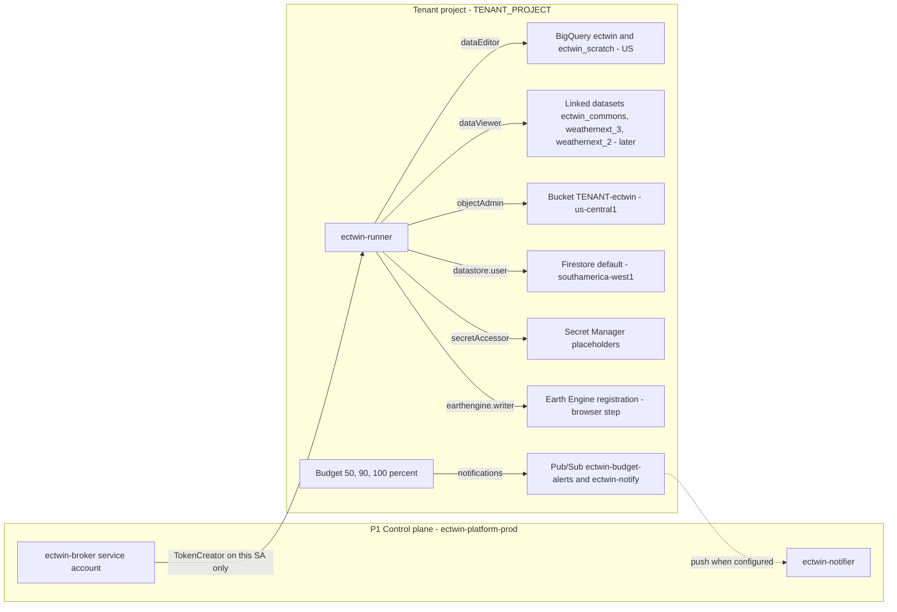
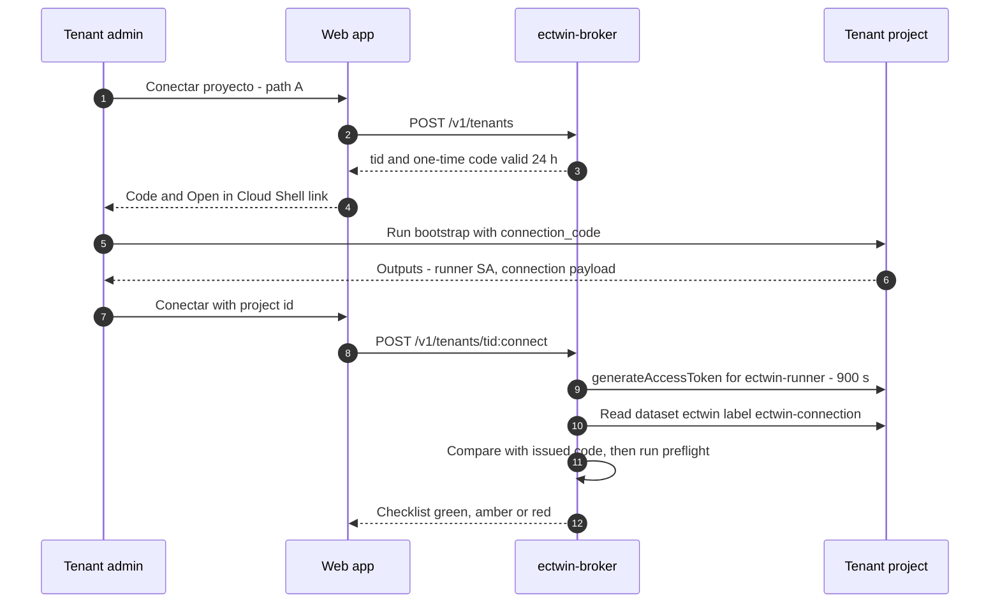

# Tenant bootstrap: Terraform module and scripts

This folder holds the reference **tenant bootstrap** for *Gemelo Digital Ecuador – El Niño* (GDE-Niño). An organisation (a *GAD*, a ministry, a provincial *COE*, an insurer or a university) runs it once in **its own Google Cloud project** to make that project a GDE-Niño tenant (plane P3 in [03-architecture.md](../../docs/03-architecture.md#2-three-plane-overview)). It enables the APIs, creates the `ectwin-runner` service account with least-privilege roles, the BigQuery datasets `ectwin` and `ectwin_scratch`, the bucket `gs://<TENANT_PROJECT>-ectwin`, the Firestore `(default)` database, the budget and its Pub/Sub topic, and placeholders for the tenant's own API keys. The platform receives exactly **one** permission: `roles/iam.serviceAccountTokenCreator` on the `ectwin-runner` service account, granted to `ectwin-broker@ectwin-platform-prod.iam.gserviceaccount.com`. The same result can be produced in three ways: this Terraform module, the equivalent script [`scripts/bootstrap-tenant.sh`](../../scripts/bootstrap-tenant.sh), or Infrastructure Manager. [`scripts/verify-tenant.sh`](../../scripts/verify-tenant.sh) checks the result. Why the design looks like this (identity, connection paths A–D, who pays) is explained in [04-identity-tenancy-byo-gcp.md](../../docs/04-identity-tenancy-byo-gcp.md). This page is the operating manual.

## Contents

1. [At a glance](#1-at-a-glance)
2. [What the bootstrap creates](#2-what-the-bootstrap-creates)
3. [Permission model](#3-permission-model)
4. [Prerequisites](#4-prerequisites)
5. [Inputs and tier profiles](#5-inputs-and-tier-profiles)
6. [Running the bootstrap](#6-running-the-bootstrap)
7. [After the bootstrap: post-steps](#7-after-the-bootstrap-post-steps)
8. [Cost guardrails and the cost of the bootstrap itself](#8-cost-guardrails-and-the-cost-of-the-bootstrap-itself)
9. [Domain-restricted sharing (secure-by-default organisations)](#9-domain-restricted-sharing-secure-by-default-organisations)
10. [Troubleshooting](#10-troubleshooting)
11. [Revocation, offboarding and teardown](#11-revocation-offboarding-and-teardown)
12. [Upgrading the bootstrap](#12-upgrading-the-bootstrap)
13. [Testing and acceptance criteria](#13-testing-and-acceptance-criteria)
14. [Files](#14-files)
15. [Open questions](#15-open-questions)

---

## 1. At a glance

| Item | Value |
|---|---|
| Who runs it | A tenant administrator (*TA*, the *Propietario/a* in [02-users-requirements-ux.md](../../docs/02-users-requirements-ux.md)) who is **Owner** of the tenant project |
| Where it runs | Cloud Shell (path A, the default), Infrastructure Manager (path A variant), or the platform's one-time OAuth job (path B) |
| Time needed | ≈8–12 min for the bootstrap, then ≈3 min for Earth Engine registration (estimates from journey J1 in [02](../../docs/02-users-requirements-ux.md)) |
| Idempotent | Yes. Terraform converges, and the script checks each resource before it creates it. Neither deletes anything. |
| Grants to the platform | One: `roles/iam.serviceAccountTokenCreator` on the `ectwin-runner` service account resource. None in path D. |
| Monthly cost when idle | ≈US$0. Every resource is empty or inside a free tier ([§8](#8-cost-guardrails-and-the-cost-of-the-bootstrap-itself)). |
| Version | `0.1.0`, stamped as label `ectwin-bootstrap=0-1-0` on every labelled resource |
| Validated with | Terraform 1.16.4 and `hashicorp/google` / `hashicorp/google-beta` 8.5.0: `terraform validate` plus 5 offline plan tests ([§13](#13-testing-and-acceptance-criteria)). The scripts pass `bash -n`, shellcheck and stubbed end-to-end runs. |



---

## 2. What the bootstrap creates

All names below are fixed by [03-architecture.md §5](../../docs/03-architecture.md#5-storage-layout). The platform broker and the tenant pipelines assume them, so do not rename them.

| # | Resource | Name | Location | Key settings | Why | Idle cost |
|---|---|---|---|---|---|---|
| 1 | APIs | 19 base APIs, plus `aiplatform` (T3), `batch` + `compute` (T3), and optionally `floodforecasting` | — | `disable_on_destroy = false` | See the list in `main.tf` `local.base_services`. Each API has a one-line reason there. | US$0 |
| 2 | Service account | `ectwin-runner@<TENANT_PROJECT>.iam.gserviceaccount.com` | Global | No keys | Runs tenant pipelines. The broker impersonates it with tokens of 15 minutes or less. | US$0 |
| 3 | Project IAM | 7 roles for the runner (up to 13 with feature flags) | — | One reason per role ([§3](#3-permission-model)) | Least privilege | US$0 |
| 4 | SA-level IAM | TokenCreator for `ectwin-broker@ectwin-platform-prod…` | — | Resource-level, not project-level | The single platform grant | US$0 |
| 5 | BigQuery dataset | `ectwin` | `US` | `delete_contents_on_destroy = false`; optional label `ectwin-connection` | Curated tenant tables ([03 §5.4](../../docs/03-architecture.md#54-tenant-table-schemas-ddl)) | US$0 until data exists; first 10 GiB of storage free ([BigQuery pricing](https://cloud.google.com/bigquery/pricing)) |
| 6 | BigQuery dataset | `ectwin_scratch` | `US` | Default table expiration 7 days (604,800,000 ms); 48 h time travel | Temporary results | US$0 |
| 7 | Dataset IAM | Runner: `roles/bigquery.dataEditor` on both datasets | — | Dataset-level | Write access only where needed | US$0 |
| 8 | Bucket | `gs://<TENANT_PROJECT>-ectwin` | `us-central1` | Uniform bucket-level access; public access prevention **enforced**; soft delete 7 d; no versioning; lifecycle: `scratch/` deleted at 30 d; `runs/ reports/ evidence/ exports/ raw/` to NEARLINE at 90 d; incomplete multipart uploads aborted at 7 d; CORS only if `app_origins` is set | Tenant files ([03 §5.1](../../docs/03-architecture.md#51-gcs-buckets-and-prefixes)) | US$0 inside the 5 GB-month Always Free tier in us-central1 ([storage pricing](https://cloud.google.com/storage/pricing)) |
| 9 | Bucket IAM | Runner: `roles/storage.objectAdmin` | — | Bucket-level | Pipeline outputs, signed URLs | US$0 |
| 10 | Firestore | `(default)`, `FIRESTORE_NATIVE` | `southamerica-west1` | Optimistic concurrency; App Engine integration off; delete protection on; point-in-time recovery off; `deletion_policy = ABANDON` | Sessions, AOIs, runs, notifications ([03 §5.6](../../docs/03-architecture.md#56-firestore--tenant-tenant_project-default-southamerica-west1-by-default)) | US$0 within 1 GiB, 50k reads and 20k writes per day. There is one free database per project ([Firestore pricing](https://cloud.google.com/firestore/pricing)). |
| 11 | Firestore TTL | Collection group `sessions`, field `expire_at` | — | TTL policy | 30-day session expiry | US$0 |
| 12 | Pub/Sub topic | `ectwin-budget-alerts` | Global | — | Budget notifications | US$0 (first 10 GiB/month free, [Pub/Sub pricing](https://cloud.google.com/pubsub/pricing)) |
| 13 | Pub/Sub subscription | `ectwin-budget-alerts-guard` (pull) | Global | 7-day retention; **never expires** | Read by the tenant budget guard, which pauses Scheduler jobs | US$0 |
| 14 | Pub/Sub topic | `ectwin-notify` (+ runner publisher) | Global | Push subscription `ectwin-notify-push` only when `notifier_push_endpoint` is set | Notification requests to `ectwin-notifier` ([03 §4.5](../../docs/03-architecture.md#45-notification-flow)) | US$0 |
| 15 | Budget | `ectwin-<TENANT_PROJECT>` | Billing account | Project filter `projects/<NUMBER>`; monthly; actual-spend thresholds 50/90/100%; forecasted-spend threshold 100%; all updates go to `ectwin-budget-alerts`; project Owners also e-mailed | Early warning. **A budget does not cap spend** ([budgets](https://docs.cloud.google.com/billing/docs/how-to/budgets)). | US$0 |
| 16 | Secrets | `typesafe-api-key`, `floodforecasting-api-key` | Automatic replication | **No versions** | Placeholders for the tenant's own keys (D16, D17) | US$0 until versions are added. After that, US$0.06 per active version per month beyond 6 free ([Secret Manager pricing](https://cloud.google.com/secret-manager/pricing)). |
| 17 | Optional (Terraform only) | Analytics Hub subscriptions → linked datasets; runner `dataViewer` on each | `US` | `listing_subscriptions` / `linked_dataset_ids` | Commons and WeatherNext access ([§7 step 5](#step-5--analytics-hub-subscriptions-linked-datasets)) | Subscriber pays queries; the publisher pays storage |
| 18 | Optional (Terraform only) | Cloud Quotas preference `QueryUsagePerDay` | — | `bq_query_usage_per_day_mib`; off by default | BigQuery daily cap ([§7 step 6](#step-6--bigquery-custom-quota)) | US$0 |

**Not created here, on purpose.**
- **Cloud Run jobs and Scheduler jobs.** The tenant deploys the pipelines from the platform images, following [03 §4.4](../../docs/03-architecture.md#44-scheduled-tenant-pipeline). With `enable_managed_pipelines = true`, the platform can deploy them after the Owner approves.
- **Earth Engine registration.** It is a browser step.
- **WeatherNext access.** Access is given per requester through a form.
- **The Commons Pub/Sub subscription.** It needs a grant on the Commons topic, which is made at connection time.
- **VPC or networks.** Only Batch in T3 needs one.

---

## 3. Permission model

### 3.1 Project-level roles held by `ectwin-runner`

The authoritative list is `local.runner_project_roles` in [`main.tf`](./main.tf). It is exported as the output `iam_matrix`, so the web app can show the tenant exactly what it granted.

| Role | When | Why it is needed | What it does **not** allow |
|---|---|---|---|
| `roles/bigquery.jobUser` | Always | Runs query, load and extract jobs **billed to this project** | Reading any table (data access is granted per dataset) |
| `roles/bigquery.readSessionUser` | Always | BigQuery Storage Read API for `to_dataframe()`, Xee and pandas; 300 TiB/month free ([BigQuery pricing](https://cloud.google.com/bigquery/pricing)) | Data access by itself |
| `roles/serviceusage.serviceUsageConsumer` | Always | `serviceusage.services.use`: names this project as the quota and billing project (Requester-Pays WN3 reads, `x-goog-user-project`). Earth Engine requires it for every call ([EE access control](https://developers.google.com/earth-engine/guides/access_control)). | Enabling or disabling APIs |
| `roles/earthengine.writer` | Always | Earth Engine computations and assets under this project. Also allows changing the EE tier (`earthengine.config.update`). | Registering the project (browser step) |
| `roles/datastore.user` | Always | Reads and writes Firestore documents (sessions, AOIs, runs) | Creating or deleting databases, indexes or TTL policies |
| `roles/run.invoker` | Always | Scheduler and Workflows execute the tenant's Cloud Run jobs as `ectwin-runner` | Deploying or changing jobs |
| `roles/logging.logWriter` | Always | Jobs that run as the runner write their logs | Reading logs |
| `roles/aiplatform.user` | `enable_vertex` (T3) | WN2 on-demand scenario runs (Vertex custom jobs) and Gemini calls | Managing endpoints IAM |
| `roles/batch.jobsEditor` | `enable_batch` (T3) | Submits Cloud Batch jobs (SFINCS, LISFLOOD-FP on Spot VMs) | Creating networks |
| `roles/batch.agentReporter` | `enable_batch` (T3) | Batch VMs that run as the runner report task state | — |
| `roles/run.developer` | `enable_managed_pipelines` | The platform deploys and updates tenant jobs from platform images after Owner approval (FR-063) | Changing IAM |
| `roles/cloudscheduler.admin` | `enable_managed_pipelines` | Creates, updates and **pauses** Scheduler jobs; the budget guard needs pause | — |
| `roles/pubsub.editor` | `enable_managed_pipelines` | Creates the tenant subscription to `commons-product-ready-v1` ([03 §7.2](../../docs/03-architecture.md#72-commons-schedule-initial)) | Changing Pub/Sub IAM |

### 3.2 Resource-level grants

| Principal | Role | On | Condition |
|---|---|---|---|
| `ectwin-broker@ectwin-platform-prod.iam.gserviceaccount.com` | `roles/iam.serviceAccountTokenCreator` | The `ectwin-runner` service account | Unless `platform_broker_sa = ""` (path D) |
| `ectwin-runner` | `roles/iam.serviceAccountUser` | **Itself** | Only with `enable_batch`, `enable_vertex` or `enable_managed_pipelines`. Starting a job that runs *as* the runner requires `actAs` on it. |
| `ectwin-runner` | `roles/bigquery.dataEditor` | Datasets `ectwin`, `ectwin_scratch` | Always |
| `ectwin-runner` | `roles/bigquery.dataViewer` | Each linked dataset | From `listing_subscriptions` or `linked_dataset_ids` |
| `ectwin-runner` | `roles/storage.objectAdmin` | Bucket `<TENANT_PROJECT>-ectwin` | Always |
| `ectwin-runner` | `roles/pubsub.subscriber` | Subscription `ectwin-budget-alerts-guard` | Always |
| `ectwin-runner` | `roles/pubsub.publisher` | Topic `ectwin-notify` | Always |
| `ectwin-runner` | `roles/secretmanager.secretAccessor` | Each secret placeholder | Always |
| Pub/Sub service agent | `roles/iam.serviceAccountTokenCreator` | `ectwin-runner` | Only with `grant_pubsub_agent_token_creator`, needed on some older projects to sign push OIDC tokens **(unverified)** |

### 3.3 What the platform can and cannot do in your project

With the single binding, the broker can obtain an access token for `ectwin-runner` that lasts **15 minutes or less**, and sign URLs as it (`generateAccessToken`, `signBlob`). The default maximum token lifetime is 1 h ([short-lived credentials](https://docs.cloud.google.com/iam/docs/create-short-lived-credentials-direct)), and the broker requests 900 s. **Everything the platform can do is therefore bounded by §3.1 and §3.2.**

| The platform **can** (as `ectwin-runner`) | The platform **cannot** |
|---|---|
| Run BigQuery jobs billed to your project, subject to `maximumBytesBilled` and your custom quota | Change any IAM policy, create service accounts or keys |
| Read and write `ectwin`, `ectwin_scratch`; read the linked datasets | Read other datasets in your project |
| Read and write objects in `gs://<TENANT_PROJECT>-ectwin` | Touch other buckets, delete the bucket |
| Read and write Firestore documents | Delete the database or change its location |
| Run Earth Engine computations billed to your project | Change billing, budgets or the billing account |
| Execute your Cloud Run jobs; with managed pipelines, deploy and pause them | Delete the project, enable or disable APIs |
| Read the two secrets, needed to call TypeSafe or the Flood API **on your behalf** | Read secrets you create outside this list |

Every impersonated call appears in **your** Cloud Audit Logs with both identities, broker and runner ([impersonation](https://docs.cloud.google.com/iam/docs/service-account-impersonation)). The broker also writes the end user's uid hash to `ectwin.audit_events` ([03 §4.3](../../docs/03-architecture.md#43-interactive-request-through-the-broker-impersonation)).

If the platform being able to read your third-party keys is not acceptable, you have two options:
- keep `secret_ids = []` and use the platform's national decision backend; or
- choose **path D**: a fully self-deployed copy with `platform_broker_sa = ""`.

The runner never needs a key file. Secure-by-default organisations block key creation anyway ([IAM release notes](https://docs.cloud.google.com/iam/docs/release-notes)).

### 3.4 Proving control of the project (connection code)

**The risk.** An attacker could register *your* project ID in the web app. If your project already trusts the broker, the attacker could then reach your data through the platform (a "confused deputy").

**The defence.** The bootstrap accepts the one-time code that the web app shows in *Conectar proyecto* (`connection_code` / `--connection-code`). It stores the code as label `ectwin-connection` on the `ectwin` dataset. When the admin clicks *Conectar*, the broker:
1. mints a runner token;
2. reads the label (the runner can read the dataset);
3. compares the label with the code it issued to that user.

Only someone who can modify the project can set the label. **(Design proposal; align the exact handshake with [04](../../docs/04-identity-tenancy-byo-gcp.md).)**



---

## 4. Prerequisites

| # | Requirement | How to check | If missing |
|---|---|---|---|
| P1 | An **organisation-owned** project, not a personal one, so the workspace survives staff turnover (D7) | Console → IAM & Admin → Settings | Create one in your organisation, or request a sponsored project (T4) in the web app |
| P2 | Billing enabled on that project | `gcloud billing projects describe PROJECT_ID` | Link a billing account, or request T4 (FR-010) |
| P3 | You are **Owner** of the project | `gcloud projects get-iam-policy PROJECT_ID` | Ask an Owner to run it. The script lists any missing permissions before it changes anything. |
| P4 | Permission to create a budget | You are a Billing Account Administrator or Costs Manager, or project Owner or Editor for a project-scoped budget (`billing.resourcebudgets.*`, per [budgets](https://docs.cloud.google.com/billing/docs/how-to/budgets)) | Everything else still succeeds. The script ends with exit code 3 and prints console steps for the finance team. |
| P5 | Org policies allow what is created | See [§9](#9-domain-restricted-sharing-secure-by-default-organisations) for `iam.allowedPolicyMemberDomains`. Also check `constraints/gcp.resourceLocations` (it must allow `US`, `us-central1` and `southamerica-west1`). | Ask the org admin for an exception, or change the region inputs |
| P6 | `serviceusage.googleapis.com` and `cloudresourcemanager.googleapis.com` enabled (new projects usually have them) | `gcloud services list --enabled --project PROJECT_ID` | `gcloud services enable serviceusage.googleapis.com cloudresourcemanager.googleapis.com --project PROJECT_ID` |
| P7 | Tools | Cloud Shell includes `gcloud`, `bq`, `terraform`, `python3` and `curl`. Its Terraform version varies; check with `terraform version`. | Install Terraform 1.6 or later, or use the script |
| P8 | Decide the Earth Engine route **before** you start (commercial or noncommercial) | [§7 step 2](#step-2--earth-engine-registration-and-tier) | — |

---

## 5. Inputs and tier profiles

The full list, with validation rules, is in [`variables.tf`](./variables.tf). An annotated example is in [`examples/terraform.tfvars.example`](./examples/terraform.tfvars.example). The script takes the same inputs as flags or environment variables (`--help`).

| Variable (script flag) | Default | Notes |
|---|---|---|
| `project_id` (`--project`) | **required** | Validated as a GCP project ID |
| `billing_account` (`--billing-account`) | **required** in Terraform; the script derives it | Must be the account the project is billed to, or the budget never sees any spend. The script refuses a mismatch. |
| `project_number` | looked up | A check block warns if the value you give is wrong |
| `platform_broker_sa` (`--platform-sa`, `--no-broker`) | `ectwin-broker@ectwin-platform-prod.iam.gserviceaccount.com` | `""` means path D |
| `connection_code` (`--connection-code`) | `""` | [§3.4](#34-proving-control-of-the-project-connection-code) |
| `bq_location` (`--bq-location`) | `US` | Anything else is **refused** (D10, FR-013) unless `allow_non_us_bigquery` is set (sandbox only) |
| `gcs_location` (`--gcs-location`) | `us-central1` | Other regions get a warning (co-location with BigQuery `US` and ARCO-ERA5) |
| `firestore_location` (`--firestore-location`) | `southamerica-west1` | `southamerica-east1` is the alternative. A `us-*` location gets an LOPDP warning. **It cannot be changed later.** |
| `tier` (`--tier`) | `T1` | Used as a label only |
| `monthly_budget_usd` (`--budget-usd`) | `20` | Whole units. Must be in the billing account's currency. |
| `budget_thresholds`, `budget_forecast_alert` | `[0.5, 0.9, 1.0]`, `true` | — |
| `enable_vertex`, `enable_batch` | `false` | T3 |
| `enable_managed_pipelines` | `false` | [§3.1](#31-project-level-roles-held-by-ectwin-runner) |
| `enable_flood_forecasting_api` (`--enable-flood-api`) | `false` | Only if you have your own allow-listed access. National snapshots come from Commons. |
| `scratch_retention_days`, `nearline_after_days`, `nearline_prefixes`, `soft_delete_retention_days` | `30`, `90`, `[runs/, reports/, evidence/, exports/, raw/]`, `7` | `tiles/`, `curated/` and `catalog/` stay STANDARD because they are read often; NEARLINE charges US$0.01/GiB for retrieval |
| `app_origins` (`--app-origins`) | `[]` | Bucket CORS for signed-URL range reads from the web app **(domain to confirm)** |
| `listing_subscriptions`, `linked_dataset_ids` | `{}`, `[]` | Second pass ([§7 step 5](#step-5--analytics-hub-subscriptions-linked-datasets)) |
| `bq_query_usage_per_day_mib` | `null` | Optional Terraform-managed quota ([§7 step 6](#step-6--bigquery-custom-quota)) |
| `notifier_push_endpoint` | `""` | Set once the platform API domain is fixed |
| `secret_ids` | `[typesafe-api-key, floodforecasting-api-key]` | Created without versions |

**Tier profiles.** The budget amounts are derived from the cost anchors in [09-cost-model.md](../../docs/09-cost-model.md): roughly the top of each band plus about 25% headroom (estimate).

| Tier (D9) | Typical tenant | Expected monthly cost | `monthly_budget_usd` | Flags |
|---|---|---|---|---|
| T1 Light | Municipality (*GAD cantonal*), about 20 users | ≈US$0–14 | 20 | none |
| T2 Standard | Province or ministry, about 50 users, daily analytics | ≈US$20 (noncommercial EE) to 60 | 75 | none; add WeatherNext linked datasets |
| T3 Heavy | National agency or insurer, ensembles plus 2D flood modelling | ≈US$540–800; ≈US$1,070–1,210 in a peak month | 800 (raise to 1,250 for Dec 2026–Apr 2027) | `enable_vertex`, `enable_batch`, usually `enable_managed_pipelines` |
| T4 Sponsored | *GAD* or *COE* project inside a sponsor folder | As T1/T2 | 20–75 | `labels = { ectwin-sponsor = "...", ectwin-dpa = "<DPA code>" }`; billed to the sponsor's account |

Taxes are not included: add 15% IVA, plus ISD where applicable ([09](../../docs/09-cost-model.md)).

---

## 6. Running the bootstrap

### 6.1 Path A1: Cloud Shell and Terraform (recommended for IT teams)

1. Open Cloud Shell in the tenant project. The web app's *Abrir en Cloud Shell* button uses the documented URL pattern `https://shell.cloud.google.com/cloudshell/editor?cloudshell_git_repo=<REPO_URL>&cloudshell_tutorial=<TUTORIAL_MD>` ([example of the pattern](https://github.com/GoogleCloudPlatform/bigquery-antipattern-recognition/blob/main/terraform/README.md)). The public repository URL and tutorial file are **to confirm**. Until they exist, clone manually:
   ```bash
   git clone <REPO_URL> weathernext && cd weathernext/infra/tenant-bootstrap
   gcloud config set project PROJECT_ID
   terraform version        # must be >= 1.6
   ```
2. Create the inputs:
   ```bash
   cp examples/terraform.tfvars.example terraform.tfvars
   nano terraform.tfvars    # set project_id, billing_account, tier and budget
   ```
3. Optional but recommended: keep Terraform state outside Cloud Shell's home directory, in a separate versioned bucket. **Do not** use `gs://<TENANT_PROJECT>-ectwin`, which the runner (and so the broker) can write.
   ```bash
   gcloud storage buckets create gs://PROJECT_ID-tfstate --location=us-central1 \
     --uniform-bucket-level-access --public-access-prevention
   gcloud storage buckets update gs://PROJECT_ID-tfstate --versioning
   cat > backend.tf <<'EOF'
   terraform {
     backend "gcs" {
       bucket = "PROJECT_ID-tfstate"
       prefix = "ectwin/tenant-bootstrap"
     }
   }
   EOF
   ```
4. Apply:
   ```bash
   terraform init
   terraform plan -out=bootstrap.tfplan      # review: 46 resources to add for T1 defaults
   terraform apply bootstrap.tfplan
   terraform output -raw connection_payload  # paste into the web app
   terraform output next_steps
   ```
5. If `apply` fails within about 2 minutes of enabling APIs with `SERVICE_DISABLED` or `has not been used in project`, wait 60 s and run `terraform apply` again. API enablement propagates asynchronously. The module does not add sleep resources, so that it only needs the two Google providers.
6. Continue with [§7](#7-after-the-bootstrap-post-steps).

### 6.2 Path A2: Cloud Shell and the bash script (fastest for a single admin)

```bash
git clone <REPO_URL> weathernext && cd weathernext
scripts/bootstrap-tenant.sh --project gad-portoviejo-ectwin --budget-usd 20 --connection-code c-7k2m9x4q8w
# T3 example
scripts/bootstrap-tenant.sh --project minagua-ectwin --tier T3 --budget-usd 800 --enable-vertex --enable-batch
# Preview without changing anything
scripts/bootstrap-tenant.sh --project gad-portoviejo-ectwin --dry-run
```

**What the script does**
- Pre-checks, then 10 numbered steps that mirror `main.tf`, then a summary with the connection payload and the next steps.
- Checks each resource before creating it, so re-running is safe.
- Retries with exponential back-off where IAM or API propagation delays are common.
- Stops at once if domain-restricted sharing refuses the broker grant.
- Logs everything to `$HOME/ectwin-bootstrap-<project>-<UTC>.log`.

**Exit codes**
- `0`: complete.
- `1`: error. Nothing irreversible was done; fix the cause and re-run.
- `2`: usage error.
- `3`: complete, but something needs your action. The usual causes are that the budget could not be created, or that domain-restricted sharing blocked the broker grant.

**Pre-checks**
- The active account and that the project is `ACTIVE`.
- Billing is enabled, and the billing account matches.
- The caller holds 10 key permissions (via `projects:testIamPermissions`).
- Domain-restricted sharing is active (a note only).
- A confirmation prompt, answered *y* or *s*.

**Differences from Terraform**
- The script does not create the push subscription.
- It does not manage the optional quota preference.
- It does not create WeatherNext subscriptions.
- The Commons subscription is available with `--subscribe-commons` from milestone M1.2 (2026-11-06).

### 6.3 Path A3: Infrastructure Manager

Infrastructure Manager runs Terraform as a managed service and keeps the state for you. It is billed as Cloud Build minutes plus a storage bucket ([pricing](https://cloud.google.com/infrastructure-manager/pricing), cited in [03 §3](../../docs/03-architecture.md#3-component-inventory)). The command and flag names below are **to confirm** against `gcloud infra-manager deployments apply --help`.

```bash
PROJECT_ID=gad-portoviejo-ectwin
gcloud services enable config.googleapis.com --project=$PROJECT_ID
gcloud iam service-accounts create ectwin-infra --project=$PROJECT_ID \
  --display-name="Infrastructure Manager deployer for GDE-Nino bootstrap"
IM_SA=ectwin-infra@$PROJECT_ID.iam.gserviceaccount.com
for R in roles/config.agent roles/serviceusage.serviceUsageAdmin roles/iam.serviceAccountAdmin \
         roles/resourcemanager.projectIamAdmin roles/iam.serviceAccountUser roles/bigquery.admin \
         roles/storage.admin roles/datastore.owner roles/pubsub.admin roles/secretmanager.admin; do
  gcloud projects add-iam-policy-binding $PROJECT_ID --member=serviceAccount:$IM_SA --role=$R --condition=None
done
# Budget rights on the billing account (finance must grant): e.g. roles/billing.costsManager (to confirm)
gcloud infra-manager deployments apply \
  projects/$PROJECT_ID/locations/us-central1/deployments/ectwin-tenant-bootstrap \
  --service-account=projects/$PROJECT_ID/serviceAccounts/$IM_SA \
  --local-source=infra/tenant-bootstrap \
  --inputs-file=infra/tenant-bootstrap/terraform.tfvars
```

**Caveats**
1. **Terraform version.** Infrastructure Manager runs only the Terraform versions it lists **(to confirm; historically up to 1.5.x)**. The module uses no feature newer than Terraform 1.5, so if necessary set `required_version = ">= 1.5.7"` in a fork.
2. **Size of the deployer account.** The deployer service account is powerful. Remove its roles after the deployment, or keep it only for upgrades.
3. **Subscriptions.** Analytics Hub subscriptions to WeatherNext must be made by an identity that WeatherNext approved. That is normally the person who filled in the form, not `ectwin-infra`. Do them from Cloud Shell ([§7 step 5](#step-5--analytics-hub-subscriptions-linked-datasets)).
4. **Location.** Infrastructure Manager is available only in some regions. `us-central1` is assumed **(to confirm)**.

### 6.4 Path B: one-time OAuth run by the platform

**How it works**
- The web app asks the admin for incremental consent with the `https://www.googleapis.com/auth/cloud-platform` scope.
- The platform exchanges the code for an **access token only** (no refresh token) and runs this same module in a short-lived job, with the token passed as `GOOGLE_OAUTH_ACCESS_TOKEN`.
- It then discards the token.

**Limits and requirements**
- The inputs, outputs and resulting grants are identical to path A.
- Tokens last at most 1 h, and the bootstrap needs less than 15 min.
- The OAuth app must be verified for the `cloud-platform` scope.
- Details, consent-screen text and the verification plan are in [04](../../docs/04-identity-tenancy-byo-gcp.md).

### 6.5 Path C (Workload Identity Federation) and path D (self-deployed)

- **Path C** is for organisations that cannot allow an external principal, even after [§9](#9-domain-restricted-sharing-secure-by-default-organisations).
  - Run this module with `platform_broker_sa = ""`.
  - Add a WIF pool that trusts the platform's per-tenant issuer.
  - Grant `roles/iam.serviceAccountTokenCreator` on `ectwin-runner` to the pool principal instead of the broker.
  - The pool and provider resources ship in Phase 2 with the issuer ([03 §3 component 7](../../docs/03-architecture.md#3-component-inventory)). Google's SaaS guide: [WIF for customer resources](https://docs.cloud.google.com/iam/docs/use-workload-identity-federation-to-let-customers-access-their-cloud-resources).
- **Path D**: run with `platform_broker_sa = ""` and deploy the full stack (broker, web app, pipelines) in your project from `infra/platform` and `infra/commons`. There is zero standing operator access. VPC Service Controls is possible, but Earth Engine inside a perimeter needs the Professional or Premium plan ([EE access control](https://developers.google.com/earth-engine/guides/access_control)).

### 6.6 Adopting script-created resources into Terraform

If you ran the script first and want Terraform to manage the project afterwards, import the stateful resources. IAM member resources need no import: adding an existing binding is a no-op.

```bash
P=PROJECT_ID; N=$(gcloud projects describe $P --format='value(projectNumber)'); BA=XXXXXX-XXXXXX-XXXXXX
terraform import 'google_service_account.runner' "projects/$P/serviceAccounts/ectwin-runner@$P.iam.gserviceaccount.com"
terraform import 'google_bigquery_dataset.ectwin' "projects/$P/datasets/ectwin"
terraform import 'google_bigquery_dataset.scratch' "projects/$P/datasets/ectwin_scratch"
terraform import 'google_storage_bucket.ectwin' "$P-ectwin"
terraform import 'google_firestore_database.default[0]' "projects/$P/databases/(default)"
terraform import 'google_pubsub_topic.budget_alerts' "projects/$P/topics/ectwin-budget-alerts"
terraform import 'google_pubsub_topic.notify' "projects/$P/topics/ectwin-notify"
terraform import 'google_pubsub_subscription.budget_guard' "projects/$P/subscriptions/ectwin-budget-alerts-guard"
terraform import 'google_secret_manager_secret.placeholders["typesafe-api-key"]' "projects/$P/secrets/typesafe-api-key"
terraform import 'google_secret_manager_secret.placeholders["floodforecasting-api-key"]' "projects/$P/secrets/floodforecasting-api-key"
BUDGET=$(gcloud billing budgets list --billing-account=$BA --billing-project=$P \
  --filter="displayName=ectwin-$P" --format='value(name)')
terraform import 'google_billing_budget.tenant' "$BUDGET"
terraform plan   # expect only label/metadata updates (e.g. managed-by=terraform)
```

---

## 7. After the bootstrap: post-steps

None of these steps blocks the national T0/T1 experience. Commons products work without WeatherNext or Flood API approvals ([02 J1 step 9](../../docs/02-users-requirements-ux.md)).

### Step 1 – Connect in the web app

1. Web app → *Proyecto y costos* → *Conectar proyecto* → enter the project ID. If you used a connection code, the broker checks it ([§3.4](#34-proving-control-of-the-project-connection-code)).
2. The broker runs the **preflight** (FR-009) with a runner token. The checks match `verify-tenant.sh`, but the broker sees only what the runner may see, so budget, keys and org policy are checked tenant-side.

| Preflight check (broker) | Same check in `verify-tenant.sh` |
|---|---|
| `generateAccessToken` succeeds for `ectwin-runner` | VT-08, VT-20 |
| BigQuery dry run `SELECT 1` billed to the tenant | VT-20 |
| `ectwin`, `ectwin_scratch` readable in `US`, scratch expiry 7 d | VT-09, VT-10 |
| Test object written to and deleted from `scratch/preflight/` | VT-12 |
| Firestore test document written to and read from `settings/tenant` | VT-13 |
| EE `registrationState` | VT-18 |
| Linked datasets present | VT-11 |
| Runner cannot `setIamPolicy`, create keys, or delete buckets, datasets or the project | VT-20 |
| Budget exists (tenant-side only; the runner has no billing rights) | VT-16 |

### Step 2 – Earth Engine registration and tier

**Registration.** This is a browser step; the API field `registrationState` is output-only ([EE access](https://developers.google.com/earth-engine/guides/access)). Open:

```text
https://code.earthengine.google.com/register?project=PROJECT_ID
```

**Which route to pick**

| Your organisation and use | Recommended route | Cost | Notes |
|---|---|---|---|
| Ministry, *GAD* or *COE* using the twin **operationally** | **Commercial**, Limited plan | US$0.40 per EECU-hour for the first 10k h; usage fees only ([EE pricing](https://cloud.google.com/earth-engine/pricing)) | Search summaries indicate that operational government use in a non-LDC such as Ecuador requires a commercial account (**unverified**; see [earthengine.google.com/noncommercial](https://earthengine.google.com/noncommercial/)) |
| University, NGO or government **research** group on climate adaptation | Noncommercial **Partner** tier (by application) | 100,000 EECU-h/month, no charge | Takes weeks. Status must be re-verified every year ([noncommercial tiers](https://developers.google.com/earth-engine/guides/noncommercial_tiers)). |
| Noncommercial tenant waiting for Partner approval | **Contributor** tier | 1,000 EECU-h/month; needs a billing account, not charged | The quota is per project; once it is used up the project runs in "restricted mode" |
| Small noncommercial tenant | **Community** tier | 150 EECU-h/month | Enforced since 2026-04-27 |
| Private insurer or agro-exporter | Commercial | As above | NC data layers are also blocked for commercial tenants (D15) |

After registering, run `scripts/verify-tenant.sh --project PROJECT_ID`. VT-18 must show `REGISTERED_COMMERCIALLY` or `REGISTERED_NOT_COMMERCIALLY`.

### Step 3 – Earth Engine daily EECU cap

**Where to set it.** Console → *IAM & Admin* → *Quotas & System Limits* → filter `earthengine.googleapis.com/daily_eecu_usage_time` → *Edit*. The cap is approximate ([EE cost controls](https://developers.google.com/earth-engine/guides/cost_controls)).

**Suggested caps** (estimates, derived from [09](../../docs/09-cost-model.md)):

| Tier | Cap | Reasoning |
|---|---|---|
| T1 | 1 EECU-h/day | — |
| T2 | 5 EECU-h/day | About 90 EECU-h/month in use, plus headroom |
| T3 | 25 EECU-h/day | About 500 EECU-h/month |

The unit shown in the console may be seconds; convert accordingly **(to confirm)**.

### Step 4 – WeatherNext Data Request form

**Access is per requester.** Each tenant must request its own access, and the platform cannot re-share it ([03 §14](../../docs/03-architecture.md#14-open-questions)).

1. Fill in the **WeatherNext Data Request form** with the Google account that will subscribe, and name the tenant project.
   - The form link was found through a third-party repository: `https://docs.google.com/forms/d/e/1FAIpQLSeCf1JY8G78UDWzbm0ly9kJxfSjUIJT5WyMR_HiNqCm-IHIBg/viewform`. **(Confirm on the official WeatherNext developer pages before publishing it in the app.)**
   - Contact: `weathernext@google.com`.
2. Approval usually takes about 5–7 business days (search summary).
3. Record the status in the web app's access-request tracker (FR-011).

**Terms to respect**
- Real-time WeatherNext data is covered by the experimental real-time terms. Historic data is CC BY 4.0.
- The platform never redistributes raw real-time fields.

### Step 5 – Analytics Hub subscriptions (linked datasets)

**Which datasets.** All must be in location `US`.

| Linked dataset id (tenant) | Listing | Available | Who may subscribe |
|---|---|---|---|
| `ectwin_commons` | `projects/ectwin-commons-prod/locations/us/dataExchanges/ectwin_exchange/listings/ectwin_commons_v1` | From milestone M1.2 (2026-11-06) | Every connected tenant |
| `ectwin_commons_nc` | `…/listings/ectwin_commons_nc_v1` | Same | Noncommercial licence profiles only (D15) |
| `weathernext_3` | WeatherNext exchange `projects/gcp-public-data-weathernext/locations/us/dataExchanges/weathernext_19397e1bcb7` (verified); WN3 listing id **to confirm after approval** | After WeatherNext approval | The approved account |
| `weathernext_2` | Same exchange; listing `weathernext_2_19a39fe59dd` (from a secondary source; the exchange project may appear as number `871883017250`) **(to confirm)** | After WeatherNext approval | The approved account |

**How to subscribe.** Pick one of three ways.

- **(a) Console.** BigQuery → *Sharing (Analytics Hub)* → search the listing → *Subscribe* → project `PROJECT_ID`, dataset name as in the table above.
- **(b) REST.** The request shape is **to confirm**, as in [03 §5.2](../../docs/03-architecture.md#52-bigquery-datasets):
  ```bash
  curl -sS -X POST -H "Authorization: Bearer $(gcloud auth print-access-token)" \
    -H "x-goog-user-project: PROJECT_ID" -H "Content-Type: application/json" \
    "https://analyticshub.googleapis.com/v1/projects/ectwin-commons-prod/locations/us/dataExchanges/ectwin_exchange/listings/ectwin_commons_v1:subscribe" \
    -d '{"destinationDataset":{"datasetReference":{"projectId":"PROJECT_ID","datasetId":"ectwin_commons"},"location":"US"}}'
  ```
  The script does the same with `--subscribe-commons`.
- **(c) Terraform, second pass.** Set `listing_subscriptions` (see the example file) and `terraform apply` as the approved account. The module creates the subscription and grants the runner `dataViewer` on the linked dataset.

**Then grant the runner read access.** After (a) or (b), add the dataset ids to `linked_dataset_ids` and re-apply, so the runner gets `roles/bigquery.dataViewer`. Script users can do the same with:

```bash
bq show --format=prettyjson PROJECT_ID:weathernext_3 > /tmp/ds.json
# add {"role":"READER","userByEmail":"ectwin-runner@PROJECT_ID.iam.gserviceaccount.com"} to "access", then:
bq update --source /tmp/ds.json PROJECT_ID:weathernext_3
```

**Cost.** Queries against linked datasets are billed to the subscriber, and the data owner is not charged ([BigQuery pricing](https://cloud.google.com/bigquery/pricing)). Always filter on the `init_time` partition and the Ecuador geography (AP-04).

### Step 6 – BigQuery custom quota

**Where to set it.** Console → *IAM & Admin* → *Quotas & System Limits* → service *BigQuery API* → quota **Query usage per day** (`QueryUsagePerDay`; default 200 TiB per project per day) → *Edit*. Optionally also set **Query usage per user per day** (`QueryUsagePerUserPerDay`; unlimited by default).

**How it behaves**
- Both quotas are approximate and apply to on-demand queries only.
- Changing them needs `serviceusage.quotas.update` ([custom quotas](https://docs.cloud.google.com/bigquery/docs/custom-quotas)).
- Queries issued by the platform also carry `maximumBytesBilled` (50 GiB). An over-limit query fails without charge ([controlling costs](https://docs.cloud.google.com/bigquery/docs/controlling-costs)).

**Suggested values** (NFR-018; estimates from [09](../../docs/09-cost-model.md)):

| Tier | Query usage per day | Reasoning |
|---|---|---|
| T1/T2 | 1 TiB | Standard-tenant use is about 0.675 TiB/month, inside the 1 TiB free tier |
| T3 | 1 TiB, raised to 3 TiB in peak months | About 5 TiB/month in use |

**Terraform alternative.** Set `bq_query_usage_per_day_mib = 1048576` (1 TiB in MiB). Only do this after confirming the unit:

```bash
gcloud beta quotas info describe QueryUsagePerDay --service=bigquery.googleapis.com --project=PROJECT_ID   # command to confirm
```

A wrong unit could block every query.

### Step 7 – Tenant keys (optional)

```bash
# TypeSafe (Jev) key for the tenant's own DecisionBackend (D16, D17). Never paste keys into tickets or chat.
read -rs KEY && printf %s "$KEY" | gcloud secrets versions add typesafe-api-key --data-file=- --project=PROJECT_ID
# Own Flood Forecasting API key, only with own allow-listed access. The key's project is the quota project.
gcloud services api-keys create --display-name="ectwin-flood" \
  --api-target=service=floodforecasting.googleapis.com --project=PROJECT_ID    # command to confirm
```

After more than 6 active versions across the project, each costs US$0.06/month ([pricing](https://cloud.google.com/secret-manager/pricing)). Disable old versions after rotation.

### Step 8 – Deploy the tenant pipelines

**Option 1: deploy them yourself.** Deploy `ectwin-aoi-pipeline` and its Scheduler jobs with the commands in [03 §4.4](../../docs/03-architecture.md#44-scheduled-tenant-pipeline). Use images by digest from the platform's public Artifact Registry and run them as `ectwin-runner`.

**Option 2: let the platform deploy them.** Re-apply with `enable_managed_pipelines = true`, then approve the deployment in the web app.

**Scheduler costs.** A Light tenant needs 1–3 Scheduler jobs, and 3 are free per billing account. Each extra job costs US$0.10/month.

### Step 9 – Notification push subscription

When the platform API domain is fixed **(to confirm)**, set:
- `notifier_push_endpoint = "https://api.<DOMAIN>/internal/notify"`
- `app_origins`

Then re-apply. The notifier checks that the OIDC token's email is the registered runner ([03 §4.5](../../docs/03-architecture.md#45-notification-flow)).

### Step 10 – Verify

```bash
scripts/verify-tenant.sh --project PROJECT_ID                  # human-readable
scripts/verify-tenant.sh --project PROJECT_ID --json --strict  # for tickets and CI; WARN counts as failure
```

**Expected result for a fresh T1 tenant**
- All checks PASS.
- VT-11 (no linked datasets yet) and VT-19 are INFO.
- VT-18 is WARN until Earth Engine is registered.

**Exit codes:** 0 if there is no FAIL, 1 if there is any FAIL, 2 for a usage error.

---

## 8. Cost guardrails and the cost of the bootstrap itself

**Guardrails**

| Guardrail | Installed by | Enforced by | Hard stop? |
|---|---|---|---|
| Budget 50/90/100% plus forecast 100% → `ectwin-budget-alerts` and e-mail | This module | Cloud Billing | **No.** Budgets only alert ([budgets](https://docs.cloud.google.com/billing/docs/how-to/budgets)). |
| Budget guard pauses the tenant's Scheduler jobs from `ectwin-budget-alerts-guard` | Tenant pipeline (Phase 1), with managed pipelines | Tenant job | Soft. The platform never disables billing, because disabling billing "might irretrievably delete" resources ([disable billing](https://docs.cloud.google.com/billing/docs/how-to/disable-billing-with-notifications)). |
| `QueryUsagePerDay` | [§7 step 6](#step-6--bigquery-custom-quota) | BigQuery | Yes, approximate |
| `maximumBytesBilled` 50 GiB per platform job | Broker | BigQuery | Yes; the job fails without charge |
| EE `daily_eecu_usage_time` | [§7 step 3](#step-3--earth-engine-daily-eecu-cap) | Earth Engine | Yes, approximate |
| Cloud Run `max-instances` and task timeouts | Pipeline deployment | Cloud Run | Yes |
| `ectwin_scratch` 7-day expiry, `scratch/` deleted at 30 d | This module | BigQuery, GCS | Yes |

**Idle cost of the bootstrap** (estimate; list prices in [costs](../../docs/09-cost-model.md)): US$0.00/month.

| Resource | Idle cost | Reason |
|---|---|---|
| APIs, service account, IAM | US$0 | No charge |
| Datasets, bucket, Firestore | US$0 | Empty, or inside the free tiers |
| Budget, topics, subscription | US$0 | No traffic |
| Secrets | US$0 | No versions |

**Once data exists**, typical tenant totals are the tier anchors in [§5](#5-inputs-and-tier-profiles). The bucket's soft delete keeps deleted objects for 7 days, which adds a little storage cost for high-churn prefixes.

---

## 9. Domain-restricted sharing (secure-by-default organisations)

**Why the grant may be refused.** Organisations created on or after **2024-05-03** enforce `iam.allowedPolicyMemberDomains` by default, together with the service-account key constraints ([IAM release notes](https://docs.cloud.google.com/iam/docs/release-notes)). Many Ecuadorian ministries run older or custom organisations, so check yours.

**Symptoms**
- The script ends with exit code 3 and the message "domain-restricted sharing blocked the broker grant".
- `terraform apply` fails on `google_service_account_iam_member.broker_token_creator` with an org-policy error. The error text usually mentions that the member does not belong to a permitted customer **(exact text unverified)**.

**Personal Gmail projects** with no organisation are not affected.

**Options, in order of preference**

1. **Exception for the broker principal only.** Use one of these:
   - The managed constraint `iam.managed.allowedPolicyMembers`, which accepts `allowedMemberSubjects` and `allowedPrincipalSets`. An example layout is in [cloud-foundation-fabric iam.yaml](https://github.com/GoogleCloudPlatform/cloud-foundation-fabric/blob/master/fast/stages/0-org-setup/datasets/hardened/organization/org-policies/iam.yaml). A project-level policy that adds `serviceAccount:ectwin-broker@ectwin-platform-prod.iam.gserviceaccount.com` as an allowed member subject is the narrowest option **(exact YAML and `gcloud org-policies set-policy` usage to confirm with the org admin)**.
   - The legacy list constraint, with the platform organisation's customer ID added to `allowedValues` on the **tenant project only** **(platform customer ID to publish; to confirm)**.
2. **Path C, Workload Identity Federation** ([§6.5](#65-path-c-workload-identity-federation-and-path-d-self-deployed)). The pool principal belongs to your organisation, so it probably passes without an exception **(unverified)**.
3. **Path D, self-deployed.**

**Template for the request to the organisation admin** (Spanish, to paste into the internal ticket):

> **Asunto:** Excepción de política de organización para GDE-Niño en el proyecto `PROJECT_ID`
>
> Solicitamos permitir **un único** principal externo, `serviceAccount:ectwin-broker@ectwin-platform-prod.iam.gserviceaccount.com`, **solo en el proyecto `PROJECT_ID`**. Recibirá **solo** el rol `roles/iam.serviceAccountTokenCreator` sobre la cuenta de servicio `ectwin-runner@PROJECT_ID.iam.gserviceaccount.com` (no sobre el proyecto). Con él la plataforma obtiene tokens de ≤15 minutos cuyos permisos están limitados a los datasets `ectwin*`, el bucket `PROJECT_ID-ectwin`, Firestore y Earth Engine del proyecto. No puede cambiar IAM, crear claves ni borrar recursos. Todas las llamadas quedan en los registros de auditoría del proyecto con ambas identidades. La revocación es inmediata (se elimina el binding). Alternativa: federación de identidades (ruta C). Referencia: `infra/tenant-bootstrap/README.md` §3.

---

## 10. Troubleshooting

| Symptom | Likely cause | Fix |
|---|---|---|
| `SERVICE_DISABLED` or "API has not been used in project" right after enabling | API propagation delay | Wait 60 s, re-run `terraform apply` or the script |
| `billingbudgets.googleapis.com` rejects end-user credentials | The Budgets API needs an explicit quota project with Cloud Shell user credentials **(to confirm)** | The module already uses the `google.tenant_quota` provider alias (`user_project_override`). With gcloud, pass `--billing-project=PROJECT_ID`, as the script does. |
| Budget creation `PERMISSION_DENIED` | No budget rights on the billing account | Ask finance for Billing Account Costs Manager, or create the budget in the console (Billing → Budgets & alerts → scope: this project → thresholds 50/90/100% → connect topic `ectwin-budget-alerts`). Then re-run `verify-tenant.sh`. |
| Broker grant refused (org policy) | Domain-restricted sharing | [§9](#9-domain-restricted-sharing-secure-by-default-organisations) |
| Firestore `ALREADY_EXISTS` | The project already has `(default)`, for example from App Engine | Set `create_firestore_database = false`, or import it ([§6.6](#66-adopting-script-created-resources-into-terraform)). `verify-tenant.sh` VT-13 checks its mode and location. |
| Firestore `(default)` is in Datastore mode | Legacy project | An empty database can be switched in the console. Otherwise use a new project; the twin needs Native mode. |
| "dataset exists in `<LOC>`, expected US" | An earlier manual dataset in another location | Datasets cannot be moved. If it is empty, delete it and re-run. Otherwise export its tables, delete it, re-run, and reload. |
| Bucket name not available | Global bucket namespace (rare, since project IDs are unique) | Set `bucket_name_override` and register the name with the platform **(registry field to add)** |
| `constraints/gcp.resourceLocations` violation | Org restricts locations | Ask for `US`, `us-central1` and `southamerica-west1`, or pick allowed alternatives. BigQuery must stay `US`. |
| `floodforecasting.googleapis.com` cannot be enabled | Access is allow-listed | Keep `enable_flood_forecasting_api = false`; Commons provides national snapshots |
| Subscribing to a WeatherNext listing gives 403 | Form not approved yet, or a different Google account | Subscribe as the approved account after approval |
| `iam.serviceAccounts.actAs` denied when creating the push subscription | The caller is not Owner | Run as Owner, or grant `roles/iam.serviceAccountUser` on `ectwin-runner` to the caller temporarily |
| Batch jobs fail: no network | The project has no default VPC (`compute.skipDefaultNetworkCreation`) | Create a VPC and subnet for Batch (T3 runbook, [11](../../docs/11-operations-runbook.md)) |
| `verify-tenant.sh` VT-06 WARN "extra roles" | Someone granted more roles to the runner | Remove them unless documented. The broker inherits every runner role. |
| `verify-tenant.sh` VT-08 FAIL after revocation | Binding still present | `scripts/bootstrap-tenant.sh --project PROJECT_ID --revoke-broker` |

---

## 11. Revocation, offboarding and teardown

| Level | Effect | How | Time to effect |
|---|---|---|---|
| **Pause everything** | Broker calls **and** your own pipelines stop | `gcloud iam service-accounts disable ectwin-runner@PROJECT_ID.iam.gserviceaccount.com --project=PROJECT_ID`; undo with `enable` | Immediate for new tokens |
| **Disconnect the platform** | Platform access ends; your pipelines keep running | `scripts/bootstrap-tenant.sh --project PROJECT_ID --revoke-broker`, or Terraform `platform_broker_sa = ""` + apply, or `gcloud iam service-accounts remove-iam-policy-binding ectwin-runner@PROJECT_ID.iam.gserviceaccount.com --member=serviceAccount:ectwin-broker@ectwin-platform-prod.iam.gserviceaccount.com --role=roles/iam.serviceAccountTokenCreator` | At most one token of 15 minutes or less stays valid |
| **Offboard** | Registry entry deleted (FR-015); your data stays in your project | Web app → *Proyecto y costos* → *Desconectar*. This exports, guides the binding removal and deletes the registry row. Then run `verify-tenant.sh --no-broker`. | Minutes |
| **Tear down GDE-Niño resources** | Removes the bootstrap resources | `terraform destroy` (see below) | Minutes |
| **Delete the project** | Everything goes, subject to Google's project recovery window **(unverified duration)** | `gcloud projects delete PROJECT_ID` | Immediate shutdown |

**What `terraform destroy` does and does not do**

| Resource | Behaviour on destroy |
|---|---|
| APIs | Stay enabled (`disable_on_destroy = false`) |
| Firestore | The database is **abandoned**, not deleted (`deletion_policy = ABANDON`), and delete protection stays on |
| `ectwin` dataset | Destroy fails while it contains tables (`delete_contents_on_destroy = false`) |
| Bucket | Destroy fails while it contains objects (`force_destroy = false`) |
| `ectwin_scratch` | Deleted with its contents |
| Budget, topics, subscriptions, secrets and IAM bindings | Deleted |

**Legal retention.** Retain audit and decision logs (`ectwin.audit_events`, `ectwin.decision_log`) according to your retention policy before deleting anything. The default is 5 years **(to confirm with [13](../../docs/13-governance-legal-risk.md))**. Public-sector tenants are LOPDP controllers and need their DPO's sign-off.

---

## 12. Upgrading the bootstrap

- **Versioning.** Versions follow SemVer and are tagged `tenant-bootstrap/vX.Y.Z` in the repository.
- **Where the version is visible.**
  - The label `ectwin-bootstrap` on every labelled resource.
  - The `bootstrap_version` output.
  - The runner's description.
- **What the broker does.** It reads the label during preflight and shows *Actualización disponible* when a newer bootstrap is required, for example for a new role.
- **Upgrade procedure.**
  1. `git pull`.
  2. Read the changelog in the release notes.
  3. `terraform plan`, then check that no destroy or replace appears for datasets, the bucket or Firestore.
  4. `terraform apply`.
  5. Run `verify-tenant.sh`.
  6. Script users simply re-run `bootstrap-tenant.sh`; it converges.
- **Role changes.** A change that adds a role to the runner is a **minor** version and is announced to tenant Owners at least 14 days before the platform relies on it **(policy proposal)**. A change that removes a role is a patch.

---

## 13. Testing and acceptance criteria

**Automated checks run on 2026-09-30**

| Check | Command | Result |
|---|---|---|
| HCL formatting | `terraform fmt -check` | Clean |
| Schema validation | `terraform init -backend=false && terraform validate` (Terraform 1.16.4, providers 8.5.0) | Valid |
| Offline plan tests | `terraform test` with [`tests/bootstrap.tftest.hcl`](./tests/bootstrap.tftest.hcl) (mock providers; Terraform 1.7 or later) | 5 passed |
| HCL parse | `python3 -c "import hcl2,glob;[hcl2.load(open(f)) for f in glob.glob('infra/tenant-bootstrap/*.tf')]"` | OK |
| Scripts | `bash -n` and `shellcheck -S style` on both scripts | Clean |
| Script behaviour | Stubbed `gcloud`, `bq` and `curl` runs | Fresh run, idempotent re-run, domain-restricted-sharing refusal (exit 3), dry run, revoke, and invalid inputs (exit 1 and 2) all behave as specified |

**The five offline plan tests**
1. T1 defaults: 19 APIs, 7 roles, the broker binding, 7-day scratch expiry, the bucket name, soft delete, the Firestore region, the budget filter and 4 threshold rules, 2 secrets, and no push subscription.
2. T3 in path D: 22 APIs, 13 roles, no broker, self `actAs`, 2 linked-dataset grants and the push subscription.
3. BigQuery in `EU` is rejected.
4. A malformed billing account is rejected.
5. A `us-central1` Firestore raises the LOPDP check.

**Acceptance criteria for the bootstrap**

| ID | Criterion | Evidence | Owner | Due |
|---|---|---|---|---|
| AC-01 | A fresh project reaches green on `verify-tenant.sh` (except VT-18 before EE registration) with **both** Terraform and the script | CI job on `ectwin-tenant-sandbox-1` and `-2` **(sandbox projects to create)** | PL | 2026-10-09 |
| AC-02 | Re-running either tool makes no changes: `terraform plan` shows "No changes", and the script reports "exists/already" for every resource | CI log | PL | 2026-10-09 |
| AC-03 | The only non-tenant principal in any tenant IAM policy is the broker, on the runner SA | `verify-tenant.sh` VT-07/VT-08 plus an org-wide scan | PL + DPO | 2026-10-16 (M0.4) |
| AC-04 | The runner token cannot `setIamPolicy`, create keys or accounts, or delete buckets, datasets or the project | `verify-tenant.sh --impersonate` VT-20 (operator run) | PL | 2026-10-16 |
| AC-05 | No service-account keys exist in any tenant | VT-05 on all tenants | SRE | 2026-10-16 and weekly |
| AC-06 | Revocation takes effect within 15 min: broker calls fail with 403 and the status shows *desconectado* | Timed test on 2 internal tenants | PL | 2026-10-16 |
| AC-07 | Path A median completion is 30 min or less for a prepared admin, and at least 85% succeed without live support (journey J1) | Usability test with 5 admins | FE + PL | 2026-11-13 |
| AC-08 | Three pilot tenants bootstrapped; their pipelines succeed at least 98% of the time over 7 days | [03 M1.4](../../docs/03-architecture.md#13-architecture-milestones-and-acceptance-criteria) | PL, SRE | 2026-11-20 |
| AC-09 | The domain-restricted-sharing path is documented and tested on one secure-by-default organisation (exception or WIF) | Test record | PL + DPO | 2026-11-27 |

---

## 14. Files

| File | Purpose |
|---|---|
| [`versions.tf`](./versions.tf) | Terraform ≥ 1.6. `google` / `google-beta` providers pinned `>= 8.0, < 9.0`. `default_labels`. The `google.tenant_quota` alias for quota-project-sensitive APIs. |
| [`variables.tf`](./variables.tf) | All inputs with descriptions and validation |
| [`main.tf`](./main.tf) | Resources, the role matrix with one reason per role, and plan-time `check` blocks |
| [`outputs.tf`](./outputs.tf) | Runner email and ID, `iam_matrix`, datasets, bucket, budget, `connection_payload`, `next_steps` |
| [`examples/terraform.tfvars.example`](./examples/terraform.tfvars.example) | Annotated inputs with tier profiles |
| [`tests/bootstrap.tftest.hcl`](./tests/bootstrap.tftest.hcl) | Offline plan tests |
| [`../../scripts/bootstrap-tenant.sh`](../../scripts/bootstrap-tenant.sh) | Idempotent gcloud/bq equivalent, including `--revoke-broker` and `--dry-run` |
| [`../../scripts/verify-tenant.sh`](../../scripts/verify-tenant.sh) | Read-only checks VT-01 to VT-20, human-readable or `--json` |

---

## 15. Open questions

- **Scratch retention mismatch.** [03 §5.1](../../docs/03-architecture.md#51-gcs-buckets-and-prefixes) lists `scratch/` objects as deleted after **7 days**. This module defaults to **30 days**, following the bootstrap specification. Set `scratch_retention_days = 7` to match 03, or update 03. Decide before M0.4 (2026-10-16).
- **Connection-code handshake** ([§3.4](#34-proving-control-of-the-project-connection-code)): align it with [04](../../docs/04-identity-tenancy-byo-gcp.md) and the `POST /v1/tenants/{tid}:connect` contract, including the label name, the 24 h validity and whether the broker may clear the label.
- **Infrastructure Manager.**
  - The supported Terraform versions (possibly 1.5.x only).
  - The exact `gcloud infra-manager` flags.
  - The minimal deployer roles.
- **Budget topic publisher.** Whether Cloud Billing adds its own publisher binding on `ectwin-budget-alerts` when the budget is saved via the API. If not, add `roles/pubsub.publisher` for the billing service account **(name to confirm)**.
- **Pub/Sub push signing.** Whether projects need the Pub/Sub service agent to hold TokenCreator on `ectwin-runner` for push OIDC. The cut-over date for older projects is unverified.
- **BigQuery quota.** The `QueryUsagePerDay` unit in Cloud Quotas (MiB assumed) and the exact `gcloud beta quotas` commands. The EE daily EECU quota unit.
- **Linked-dataset IAM.** Confirm that dataset-level IAM on linked datasets works for WeatherNext listings, on the first pilot tenant.
- **WeatherNext.**
  - The listing ids for WN3, and confirmation of the WN2 id.
  - Whether a platform-guided subscription (path B) may act for the approved user under the WeatherNext terms. Ask `weathernext@google.com`.
- **Earth Engine for government.** Whether operational use by *GAD*s and ministries must be commercial, or fits the Partner tier's climate-adaptation eligibility. This drives T2 cost (US$0 versus up to US$36/month in the Standard example of [09](../../docs/09-cost-model.md)).
- **Runner access to tenant secrets.** The runner can read tenant third-party keys, which the broker needs for tenant-billed decisions. The DPO should confirm that this is acceptable for public-sector tenants, or that a split identity (a separate jobs service account) is needed.
- **Public repository and Cloud Shell tutorial.** The public repository URL and the Cloud Shell tutorial file for the *Abrir en Cloud Shell* button are still to be created.
- **CLI flags in the scripts.** The scripts were tested only against stubs. The gcloud/bq flags listed in the header of `bootstrap-tenant.sh` must be confirmed against the current Cloud SDK in Cloud Shell during AC-01 (2026-10-09). The REST field names used by `verify-tenant.sh` must be confirmed at the same time.
